## A review of polymer electrolytes: fundamental, approaches and applications
## 聚合物电解质综述：基本原理，方法和应用

> Koh Sing Ngai, S. Ramesh, K. Ramesh, Joon Ching Juan
> Ionics
> August 2016, Volume 22, Issue 8, pp 1259–1279
> Keywords: Polymer electrolytes, Fundamental, Polymer hosts, Application, Ionic conductivity, Capacitor 

### Abstract
In this paper, we review different types of polymer electrolytes, recent approaches and technological applications of polymer electrolytes. The report first discusses the characteristics, advantages and applications for three types of polymer electrolytes: gel polymer electrolytes, solid polymer electrolytes and composite polymer electrolytes. Next, we discuss the features and performance of different polymer hosts based on some important and recently published literature. Recent progress of some approaches used in improving the performance of the polymer electrolytes is highlighted. The last part of the review includes the technological applications of some electrical energy storing/converting devices: electrochemical capacitors, batteries, fuel cells and dye-sensitized solar cells. It is also stressed that the technological advancement in the polymer electrolytes plays a pivotal role in the development of energy storing/converting systems.  
在本文中，我们回顾了不同类型的聚合物电解质，聚合物电解质的最新方法和技术应用。该报告首先讨论了三种聚合物电解质的特性，优点和应用：凝胶聚合物电解质，固体聚合物电解质和复合聚合物电解质。接下来，我们基于一些重要的和最近发表的文献讨论不同聚合物主体的特征和性能。最近突出了用于改善聚合物电解质性能的一些方法的最新进展。评论的最后部分包括一些电能存储/转换装置的技术应用：电化学电容器，电池，燃料电池和染料敏化太阳能电池。还强调聚合物电解质的技术进步在能量存储/转换系统的开发中起关键作用。

### Introduction
The development of solid-state materials such as ceramic, glass, crystalline and polymer electrolytes initialled in the early 1970s [1]. Polymer electrolyte was first introduced by Fenton et al. in 1973 [2], and the importance of its technological application was recognized in early 1980s [3]. In the past three decades, the development of new PEs has received attention from many researchers due to their potential applications in electrochemical/electrical power generation, storage and conversion systems.  
20世纪70年代早期开发出固态材料，如陶瓷，玻璃，结晶和聚合物电解质[1]。 Fenton等人首先引入聚合物电解质。 1973年[2]，其技术应用的重要性在20世纪80年代早期得到了认可[3]。在过去的三十年中，由于其在电化学/电力发电，存储和转换系统中的潜在应用，新PE的开发受到许多研究人员的关注。

Polymer electrolyte (PE) is a membrane composed of a dissolution of salts in a polymer matrix with high molecular weight [4]. This solid solvent-free system possesses ionic conduction property and therefore is widely applied in electrochemical devices such as solid-state batteries and rechargeable batteries, especially lithium ion batteries. In recent years, PEs have other prospective applications in advanced electrochemical, electrochromic and electronic devices such as supercapacitors, fuel cells, dye-sensitized solar cells, rechargeable batteries, electrochemical sensors, analogue memory devices and electrochromic windows [5, 6, 7, 8, 9]. Table 1 summarized the properties, advantages and applications of the polymer electrolytes.  
聚合物电解质（PE）是一种由高分子量聚合物基质中的盐溶解组成的膜[4]。该固体无溶剂体系具有离子传导性，因此广泛应用于电化学装置，如固态电池和可充电电池，尤其是锂离子电池。近年来，PE在先进的电化学，电致变色和电子器件中具有其他前瞻性应用，例如超级电容器，燃料电池，染料敏化太阳能电池，可充电电池，电化学传感器，模拟存储器件和电致变色窗[5,6,7,8 ，9]。表1总结了聚合物电解质的性质，优点和应用。

Table 1
The properties, advantages and applications of the polymer electrolytes
Properties of PEs
- Transparency
- Solvent-free
- Light-weight
- Flexible
- Thin-firm forming ability
- High ionic conductivity
- Easy processability
- Wide electrochemical windows

Advantages of PEs
- Prevent leakage
- No internal shorting
- Eliminate the use of corrosive solvent
- No production of harmful gases

Application of PEs
- Electrochromic window
- Solid-state batteries
- Solar cells
- Fuel cells
- Dye-sensitized solar cells
- Electrocapacitors
- Actuators
- Electrochemical sensors
- Analogue memory devices
- High vacuum electrochemistry
- Thermoelectric generators
- Portable power sources
- Start-light ignition
- Electric vehicles
- Thin credit cards
- Mobile cellular phone
- Laptop computer

The development of solid-state ionic conductors, such as fast/superionic conductors, insertion compounds and polymer electrolytes, has created an upsurge of interest among the researchers [10]. PEs are technologically evolved from polymer, liquid ionic conductor and solid-state ionic conductor. PEs can be prepared by dissolving metal salts in polar polymer hosts [6]. The launch of PE as a new solid-state material has caused it to be widely employed as a building block for various electrochemical devices. Polymer electrolyte can also be used as a separator in a battery, and it also can be used to replace the liquid ionic solution [4, 11, 12].  
固态离子导体（如快/超离子导体，插入化合物和聚合物电解质）的发展引起了研究人员的兴趣[10]。 PE在技术上由聚合物，液体离子导体和固态离子导体演变而来。 PE可以通过将金属盐溶解在极性聚合物主体中来制备[6]。 PE作为一种新的固态材料的推出使其被广泛用作各种电化学装置的构件。聚合物电解质也可用作电池中的隔膜，也可用于代替液体离子溶液[4,11,12]。

PE has several advantages over the conventional liquid electrolytes. This ionic-conducting phase possesses transport properties which are comparable with some liquid ionic solutions, and also have some other interesting properties such as transparency, solvent-free, light-weight, flexibility, thin-film forming ability, high ionic conductivity, easy processability and wide electrochemical windows [7, 13, 14]. The use of PEs enhance safety as they prevent some problems such as electrolyte leakage, internal shorting, use of corrosive solvent, production of harmful gases and the presence of non-combustible reaction products on the electrode surface [7, 8, 15, 16, 17].  
与传统的液体电解质相比，PE具有几个优点。该离子导电相具有与某些液体离子溶液相当的传输性能，还具有一些其他有趣的性质，如透明度，无溶剂，重量轻，柔韧性，薄膜形成能力，高离子导电性，易加工性和宽电化学窗[7,13,14]。 PE的使用增强了安全性，因为它们可以防止电解液泄漏，内部短路，使用腐蚀性溶剂，产生有害气体以及在电极表面存在不可燃反应产物等问题[7,8,15,16， 17。

There are two types of PE based on their sources and origins: (i) synthetic and (ii) natural. Some natural PEs widely manifested in research are chitosan [18, 19, 20], rice starch [21, 22] and corn starch [23, 24, 25, 26, 27, 28]. As presented in Fig. 1, PEs can also be categorized into three different types based on their physical state and composition: (1) gel polymer electrolytes, (ii) sold polymer electrolytes and (iii) composite polymer electrolyte [29, 30].  
根据其来源和来源，有两种类型的PE：（i）合成和（ii）天然。研究中广泛表现出的一些天然PE是壳聚糖[18,19,20]，大米淀粉[21,22]和玉米淀粉[23,24,25,26,27,28]。如图1所示，PE还可以根据其物理状态和组成分为三种不同类型：（1）凝胶聚合物电解质，（ii）固态聚合物电解质和（iii）复合聚合物电解质[29,30]。

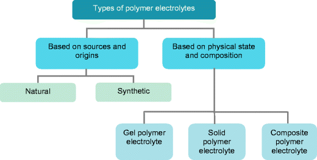  
Fig. 1 Different types of polymer electrolytes based on their sources and physical condition  
图1 基于其来源和物理条件的不同类型的聚合物电解质

Ionic conductivity is the most important property of the PEs. The ionic conductivity is closely related to the degree of crystallinity and the viscosity of the PEs [31]. Crystalline-based PEs have higher degree of crystallinity. The ions have low mobility in crystalline phase, and this leads to lower ionic conductivity [31, 32]. A PE with lower viscosity will produce more voids, and thus has higher ionic conductivity [31]. Several attempts have been made to improve the ionic conductivity of PEs. These approaches include: polymer blending, utilization of comb-branches copolymers, incorporation of dopants and ionic liquids and the addition of inorganic fillers, plasticizers and nanomaterials.  
离子导电性是PE的最重要的性质。离子电导率与PEs的结晶度和粘度密切相关[31]。结晶基PE具有较高的结晶度。离子在结晶相中具有低迁移率，这导致较低的离子电导率[31,32]。粘度较低的PE会产生更多的空隙，因此具有更高的离子电导率[31]。已经进行了若干尝试来改善PE的离子传导性。这些方法包括：聚合物共混，梳形支链共聚物的使用，掺杂剂和离子液体的掺入以及无机填料，增塑剂和纳米材料的添加。

#### Gel polymer electrolytes
Gel polymer electrolyte (GPE) also known as plasticized PE, was first introduced by Feuillade and Perche in 1975 [33]. GPE is a plasticized or gelled polymer matrix, wherein the addition of plasticizer results in a polymer matrix swollen in a liquid electrolyte [34]. GPE can be prepared easily by heating a mixture containing an appropriate polymer matrix like poly(ethylene oxide) (PEO), an alkali metal salt such as a lithium salt and a solvent. The viscous clear liquid mixture is then cast in a hot state and cooled under pressure of electrodes to form a thin-film.  
凝胶聚合物电解质（GPE）也称为增塑PE，由Feuillade和Perche于1975年首次引入[33]。 GPE是增塑或凝胶化的聚合物基质，其中添加增塑剂导致聚合物基质在液体电解质中溶胀[34]。通过加热含有适当的聚合物基质如聚（环氧乙烷）（PEO），碱金属盐如锂盐和溶剂的混合物，可以容易地制备GPE。然后将粘性透明液体混合物在热状态下浇铸并在电极压力下冷却以形成薄膜。

GPE incorporates both diffusive property of liquids and the cohesive property of solids [30]. GPE possesses high ionic conductivity, low volatility, low reactivity, good operation safety and also good chemical, mechanical, photochemical, electrochemical and structural stabilities [1, 34, 35]. It is also light in weight, solvent free, possesses wide electrochemical window, high-energy density, good volumetric stability and are easily configured into a desired size and shape [30, 36, 37, 38]. The attractive properties of GPE enhance safety and its applicability in electrochemical devices. The use of GPE in batteries prevents leakage and internal shorting and therefore lengthens shelf life [39]. The unique properties of GPE made it a prospective candidate to substitute for liquid electrolyte.  
GPE结合了液体的扩散性和固体的粘结性[30]。 GPE具有高离子电导率，低挥发性，低反应性，良好的操作安全性以及良好的化学，机械，光化学，电化学和结构稳定性[1,34,35]。它重量轻，无溶剂，具有宽电化学窗口，高能量密度，良好的体积稳定性，并且易于配置成所需的尺寸和形状[30,36,37,38]。 GPE的吸引人的特性增强了安全性及其在电化学装置中的适用性。在电池中使用GPE可防止泄漏和内部短路，从而延长保质期[39]。 GPE的独特性质使其成为替代液体电解质的潜在候选者。

GPEs also have some drawbacks which obstruct their use in wider practical applications. The impregnation with liquid electrolytes leads to poor mechanical strength [40, 41]. Insufficient mechanical strength means that it is unable to withstand the stress between an anode and a cathode [39]. However, this undesirable effect can be eliminated when the fillers or nanomaterials are incorporated into it [41].  
GPE还具有一些阻碍其在更广泛的实际应用中使用的缺点。用液体电解质浸渍会导致机械强度差[40,41]。机械强度不足意味着它无法承受阳极和阴极之间的应力[39]。然而，当将填料或纳米材料结合到其中时，可以消除这种不希望的效果[41]。

#### Solid polymer electrolytes
The research on solid polymer electrolyte (SPE) was launched by Wright et al. three decades ago [42]. Armand et al. have verified the technological application of SPEs in electrochemical devices [43]. A “dry solid” polymer electrolyte based on PEO was the first SPE investigated [2]. This is a solvent-free system where organic liquid is not used. The performance of this PEO-based SPE was unsatisfactory due to the poor ionic conductivity at room temperature [44].  
固体聚合物电解质（SPE）的研究由Wright等人发起。三十年前[42]。阿曼等人。已经验证了SPE在电化学装置中的技术应用[43]。基于PEO的“干固”聚合物电解质是第一个研究的SPE [2]。这是一种不含溶剂的系统，不使用有机液体。由于室温下的离子电导率差，这种基于PEO的SPE的性能不令人满意[44]。

SPEs have been extensively studied in recent years because of their potential applications in many electrochromic and electrochemical devices, such as electrochromic windows, solid-state batteries, solar cells, fuel cells, dye-sensitized solar cells (DSSCs), electrocapacitors, actuators, electrochemical sensors, analogue memory devices, high vacuum electrochemistry, thermoelectric generators, portable power sources, start-light-ignition (SLI) and electric vehicles (EV) [5, 9, 10, 15, 30, 45, 46]. The development of SPEs also found wide applications in many portable electronic devices, such as thin credit cards, mobile cellular phones and laptop computers [15]. Besides ionic conductor, SPEs also work as separator between electrolyte and electrode in cells or batteries, which eliminates the use of inert porous spacers. They also act as binders to facilitate the electrical contact with electrodes and this eliminates the need for high-temperature process as required in liquid electrolytes [15].  
近年来，SPE因其在许多电致变色和电化学装置中的潜在应用而得到广泛研究，例如电致变色窗，固态电池，太阳能电池，燃料电池，染料敏化太阳能电池（DSSCs），电容器，致动器，电化学传感器，模拟记忆装置，高真空电化学，热电发电机，便携式电源，启动点火（SLI）和电动汽车（EV）[5,9,10,15,30,45,46]。 SPE的发展也在许多便携式电子设备中得到广泛应用，例如薄信用卡，移动蜂窝电话和笔记本电脑[15]。除离子导体外，SPE还可作为电池和电池中电解质和电极之间的隔板，从而消除了惰性多孔隔板的使用。它们还可作为粘合剂，促进与电极的电接触，从而消除了对液体电解质中所需的高温过程的需求[15]。

SPEs possess many interesting features such as solvent-free, leak proof, low volatility and high thermal, electrical, mechanical, volumetric and electrochemical stabilities [16, 36, 37, 47]. Other promising properties are light in weight, high ionic conductivity, high automation process, superior mechanical strength, high-energy density, flexibility, easy to process or fabricate and configure into various geometries [8, 15, 35, 48]. SPEs also offer certain advantages in replacing conventional liquid electrolytes [1]. Like GPEs, SPEs eliminate the occurrence of hazardous gas or corrosive solvent liquid leakage, and offer longer shelf life, and wider operating temperature range [1, 10, 31, 49].  
SPE具有许多有趣的特性，如无溶剂，防漏，低挥发性和高热，电，机械，体积和电化学稳定性[16,36,37,47]。其他有前途的特性是重量轻，离子导电率高，自动化程度高，机械强度高，能量密度高，柔韧性好，易于加工或制造，并可配置成各种几何形状[8,15,35,48]。 SPE替代传统的液体电解质也具有一定的优势[1]。与GPE一样，SPE可消除有害气体或腐蚀性溶剂液体泄漏的发生，并提供更长的保质期和更宽的工作温度范围[1,10,31,49]。

However, SPEs have certain drawbacks, such as low conductivity at ambient temperature and high interfacial resistance [32, 50]. The use of SPEs is also limited by their propensity to crystallize whereas the high ionic conductivity is related to amorphous nature [10].  
然而，SPE具有某些缺点，例如在环境温度下的低导电率和高界面电阻[32,50]。 SPE的使用也受到结晶倾向的限制，而高离子电导率与无定形性质有关[10]。

#### Composite polymer electrolytes
The attempts to overcome the disadvantages and limitations of SPEs led to the generation of a new form of materials, i.e. composite polymer electrolytes (CPEs). Several techniques are manifested by researchers for the preparation and design of CPEs. Those techniques include polymer blending [10, 31, 46, 51, 52, 53], cross-linking polymer matrices [54, 55], comb-branched copolymers, binary salt systems, incorporation of additives such as plasticizers [56], doping of nanomaterials [57], impregnation with ionic liquids [46, 58, 59] and reinforcement by inorganic fillers [40, 60, 61, 62].  
克服SPE的缺点和局限性的尝试导致产生新形式的材料，即复合聚合物电解质（CPE）。研究人员为CPE的制备和设计表现出了几种技术。这些技术包括聚合物共混[10,31,46,51,52,53]，交联聚合物基质[54,55]，梳形支化共聚物，二元盐体系，添加剂如增塑剂[56]，掺杂纳米材料[57]，浸渍离子液体[46,58,59]和无机填料增强[40,60,61,62]。

The CPEs offer some interesting features, for instance, good flexibility, high thermal stability, good interfacial contact and high ionic conductivity by enhancing ion mobility [16, 32]. The electronic and ionic conductivities of CPEs depend on the characteristics of particles used, including the particles size, porosity, concentration, surface area and the interaction between the particles and the polymer matrices [63, 64, 65]. The enhanced electrochemical and mechanical properties of CPEs are important for their technological application in electrochemical devices. The properties and disadvantages for different types of polymer electrolytes are displayed in Table 2.  
CPE通过增强离子迁移率提供了一些有趣的特性，例如，良好的柔韧性，高热稳定性，良好的界面接触和高离子电导率[16,32]。 CPE的电子和离子电导率取决于所用颗粒的特性，包括颗粒尺寸，孔隙率，浓度，表面积以及颗粒与聚合物基质之间的相互作用[63,64,65]。 CPE的增强的电化学和机械性质对于它们在电化学装置中的技术应用是重要的。表2列出了不同类型聚合物电解质的性质和缺点。

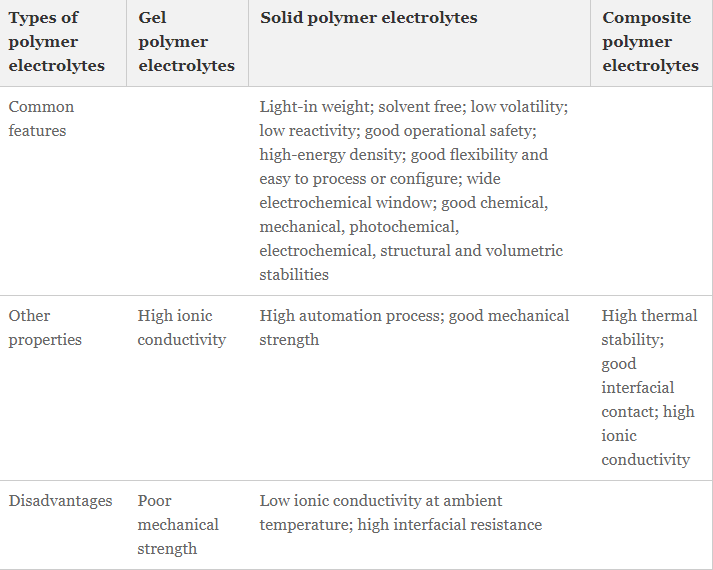  
Table 2 Comparison between gel polymer electrolytes, solid polymer electrolytes and composite polymer electrolytes
表2 凝胶聚合物电解质，固体聚合物电解质和复合聚合物电解质之间的比较

### Polymer hosts
The preparation of PE required at least one host polymer acting as a base matrix prior to the addition of any other materials. Examples of host polymer that are commonly used in the preparation of PEs are poly(vinyl chloride) (PVC), poly(vinyl alcohol) (PVA), poly(acrylic acid) (PAA), PEO, poly(acrylonitrile) (PAN), poly(vinylidene fluoride) (PVdF), poly(ethyl methacrylate) (PEMA), poly(methyl methacrylate) (PMMA), poly(vinylidenefluoride-hexafluoro propylene) (PVdF-HFP), chitosan etc. [30, 66]. Table 3 displays the polymer hosts generally used with repeat units and examples of polymer electrolyte complexes.  
在加入任何其它材料之前，PE的制备需要至少一种主体聚合物作为基础基质。通常用于制备PE的主体聚合物的实例是聚（氯乙烯）（PVC），聚（乙烯醇）（PVA），聚（丙烯酸）（PAA），PEO，聚（丙烯腈）（PAN） ，聚（偏二氟乙烯）（PVdF），聚（甲基丙烯酸乙酯）（PEMA），聚（甲基丙烯酸甲酯）（PMMA），聚（偏二氟乙烯 -六氟丙烯）（PVdF-HFP），壳聚糖等[30,66]。表3显示了通常与重复单元一起使用的聚合物主体和聚合物电解质复合物的实例。

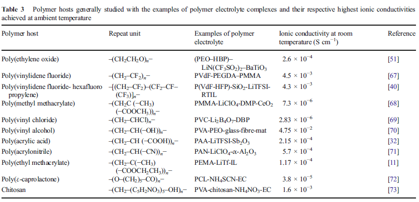  
Table 3Polymer hosts generally studied with the examples of polymer electrolyte complexes and their respective highest ionic conductivities achieved at ambient temperature  
表3 通常用聚合物电解质复合物的实例研究聚合物主体，并且在环境温度下实现它们各自的最高离子电导率

#### Poly(ethylene oxide) 聚（环氧乙烷）
In the last two decades, considerable research efforts have been devoted to PEO-hosted PEs. In 1973, Wright initialled the study on the ionic conductivity of PEO electrolyte system [42]. In the same year, Feuillade and Perche reported the plasticization on a polymer with an aprotic solution containing alkali metal salts. PEO is among the most popular polymer host has been widely investigated due to its interesting characteristics such as good dimensional stability, high capacity in salt complexation, high ionic conductivity in amorphous state, good corrosion resistance, acceptable commercial cost, mechanical flexibility and chemical stability [6, 55, 70, 74]. Notwithstanding these advantages, PEO also possesses some disadvantages which limit its technological application. One of the significant drawbacks of PEO is the low ionic conductivity at ambient temperature due to its propensity to crystallize at lower temperature [46, 51, 75, ]. The lower ionic conductivity is mainly due to the non-conductive of high crystalline phase at ambient temperature [1, 75]. At a temperature above the melting point, PEO-based PEs demonstrate appreciable conductivity due to the crystalline-amorphous phase transition. When PEO melts, the disorder of the crystalline phase leads to the loss of its dimensional stability and results in an extremely viscous liquid characteristic [49]. The quasi-liquid state increases the flexibility of the PEO-based PE matrix and demonstrates a poor mechanical strength [55].  
在过去的二十年中，相当多的研究工作致力于PEO托管的PE。 1973年，Wright开始研究PEO电解质体系的离子电导率[42]。同年，Feuillade和Perche报道了用含有碱金属盐的非质子溶液对聚合物进行塑化。 PEO是最受欢迎的聚合物主体之一，因其具有良好的尺寸稳定性，盐络合能力高，非晶态离子导电性高，耐腐蚀性好，商业成本可接受，机械柔韧性和化学稳定性等特点，已被广泛研究。 6,55,70,74]。尽管有这些优点，PEO还具有一些限制其技术应用的缺点。 PEO的一个显着缺点是在环境温度下的低离子电导率，因为它倾向于在较低温度下结晶[46,51,75]。较低的离子电导率主要是由于环境温度下高结晶相的不导电[1,75]。在高于熔点的温度下，由于结晶-非晶相变，PEO基PE表现出可观的导电性。当PEO熔化时，结晶相的无序导致其尺寸稳定性的丧失并导致极其粘稠的液体特性[49]。准液态增加了PEO基PE基体的柔韧性，并表现出差的机械强度[55]。

Recent research on PEOs includes the solid PEO-based electrolytes, the liquid plasticizer GPEs and the filler-containing CPEs. Several approaches have been attempted to improve the ionic conductivity of PEO-based electrolyte systems [55]. The addition of organic plasticizers and fillers are the most commonly adopted techniques. With the addition of fillers, the polymeric crystallinity decreases, and this leads to the improvement in the ionic conductivity [6]. Inorganic nanomaterial fillers such as TiO2, Al2O3 [62, 77] and fumed silica could improve the mechanical stability of the new PEO-based CPE [78]. Alternatively, the relatively high degree of crystallization of PEO can be overcome by using the polymer blending method [51]. Introducing another polymer like PMMA could enhance the ionic conduction of PEO-based system. PMMA which has a flexible backbone and amorphous phase can reduce the mechanical strength of the PEO [1]. PEO is also one of the promising candidates which can be used in the manufacturing of lithium batteries. Its application is not limited only to the polymer electrolyte, but it can also be employed as a separator.  
最近对PEO的研究包括固体PEO基电解质，液体增塑剂GPE和含填料的CPE。已经尝试了几种方法来改善基于PEO的电解质系统的离子电导率[55]。添加有机增塑剂和填料是最常用的技术。随着填料的加入，聚合物的结晶度降低，这导致离子电导率的提高[6]。无机纳米材料填料如TiO2，Al2O3 [62,77]和气相二氧化硅可以改善新型PEO基CPE的机械稳定性[78]。或者，通过使用聚合物共混方法[51]可以克服PEO的相对高结晶度。引入另一种聚合物如PMMA可以增强基于PEO的系统的离子传导。具有柔性骨架和非晶相的PMMA可降低PEO的机械强度[1]。 PEO也是可用于锂电池制造的有希望的候选者之一。其应用不仅限于聚合物电解质，还可以用作隔膜。

#### Poly(vinylidene fluoride) 聚（偏二氟乙烯）
PVdF has received an upsurge of interest for the development of lithium battery due to the attractive characteristics like good affinity to electrolyte solution, good electrochemical stability and high dielectric constant [79, 80]. Jiang et al. reported the ionic conductivity of PVdF-based PE is in the range of 10−4 to 10−3 S cm−1 at room temperature [80]. PVdF-based PEs exhibit high anodical stability due to the presence of the strong electron-withdrawing fluorine atoms (−C-F) positioned at the backbone of the macromolecule [30, 79]. PVdF-based PE is unstable towards lithium and results in the weak interfacial properties between fluorine and lithium [30]. This functional group also facilitates the dissociation of lithium salts to lithium ions during the formation of PE [79] and increases the concentration of charge carriers. The PVdF content determines the mechanical strength of the PE membrane [30]. The mobility of lithium ions is hindered by the crystalline part of PVdF, and thus the PVdF-based PE batteries have lower charge/discharge capacities [81]. Tsuchida and co-workers reported that when plasticized PVdF is incorporated with lithium perchlorate (LiClO4) at 30 mol%, the conductivity is dominated by the viscosity instead of the dielectric constant of the plasticizer [82, 83]. Choe et al. examined the plasticized PVdF with LiN(CF3SO2)2 solution in PC which offers a conductivity of 1.74 10−3 S cm−1 at 30 °C. The ionic mobility is increased significantly upon the incorporation of plasticizers [84].  
PVdF由于具有对电解质溶液的良好亲和性，良好的电化学稳定性和高介电常数等吸引人的特性而受到了锂电池开发的兴趣！[79,80]。江等人。据报道，PVdF基PE的离子电导率在室温下为10-4至10-3 S cm-1 [80]。基于PVdF的PE由于存在位于大分子主链上的强吸电子氟原子（-C-F）而表现出高的阳极稳定性[30,79]。 PVdF基PE对锂不稳定，导致氟和锂之间的界面性质较弱[30]。该官能团还有助于在形成PE期间锂盐离解成锂离子[79]并增加电荷载体的浓度。 PVdF含量决定了PE膜的机械强度[30]。 PVdF的结晶部分阻碍了锂离子的迁移，因此PVdF基PE电池具有较低的充电/放电容量[81]。 Tsuchida及其同事报道，当塑化的PVdF与30％（摩尔）的高氯酸锂（LiClO4）混合时，电导率主要取决于增塑剂的粘度而不是介电常数[82,83]。 Choe等人。用PC中的LiN（CF3SO2）2溶液检测增塑的PVdF，其在30℃下的电导率为1.74×10-3Scm-1。加入增塑剂后，离子迁移率显着增加[84]。

#### Poly(vinylidene fluoride-hexafluoropropylene) 聚（偏二氟乙烯-六氟丙烯）
A copolymer of PVdF-HFP contains two types of monomers: the symmetrical vinylidene fluoride (VdF) and the asymmetrical hexafluoropropylene (HFP) [4]. The co-existence of crystalline PVdF and the amorphous PHFP results in a high ionic conductivity and good mechanical strength [4, 85]. A solution of diethyl carbonate (DEC), ethylene carbonate (EC) and LiN(CF3SO2)2 was prepared by Capiglia et al. [86]. The change in the polymer composition resulted in the change of conductivity. PVdF-HFP-based GEs with addition of a combination of propylene carbonate (PC) and EC as plasticizers, and three different types of lithium salts (LiClO4, lithium triflate (LiCF3SO3) and LiBF4) as dopants were prepared and examined [80]. The film with a LiBF4 as dopant salt demonstrated the highest conductivity due to the low lattice energy of the salt. One of the drawbacks of using PEs with LiBF4 is the poor compatibility of the salt with the lithium anode, which results in the formation of LiF. Saika and Kumar conducted a comparative study for both PEs with different polymer host: PVdF-HFP + PC + DEC + LiClO4 and PVdF + PC + DEC + LiClO4 [87]. Ionic conductivity and transport properties of both PEs are investigated. The results indicate that the film comprised of PVdF-HFP polymer host exhibits better performance over the film with PVdF. PVdF has relatively lower conductivity due to its high degree of crystallinity. The film with PVdF-HFP host possesses two randomly mixed monomers leading to better mobility of free lithium ions and thus higher amorphocity [30]. PVdF-HFP is a promising electrolyte material that can be applied in lithium batteries [34].  
PVdF-HFP的共聚物含有两种类型的单体：对称的偏二氟乙烯（VdF）和不对称的六氟丙烯（HFP）[4]。结晶PVdF和无定形PHFP的共存导致高离子电导率和良好的机械强度[4,85]。 Capiglia等人制备了碳酸二乙酯（DEC），碳酸亚乙酯（EC）和LiN（CF 3 SO 2）2的溶液。 [86]。聚合物组成的变化导致电导率的变化。添加了作为增塑剂的碳酸亚丙酯（PC）和EC的组合的PVdF-HFP基GE和作为掺杂剂的三种不同类型的锂盐（LiClO4，三氟甲磺酸锂（LiCF3SO3）和LiBF4）被制备和检验[80]。具有LiBF 4作为掺杂剂盐的膜由于盐的低晶格能而表现出最高的导电性。使用具有LiBF 4的PE的缺点之一是盐与锂阳极的相容性差，这导致LiF的形成。 Saika和Kumar对具有不同聚合物主体的PE进行了对比研究：PVdF-HFP + PC + DEC + LiClO4和PVdF + PC + DEC + LiClO4 [87]。研究了两种PE的离子导电性和传输性质。结果表明，由PVdF-HFP聚合物主体组成的薄膜表现出比PVdF薄膜更好的性能。 PVdF由于其高结晶度而具有相对较低的导电性。具有PVdF-HFP主体的薄膜具有两种随机混合的单体，导致游离锂离子具有更好的迁移率，从而具有更高的无定形性[30]。 PVdF-HFP是一种很有前景的电解质材料，可用于锂电池[34]。

#### Poly(methyl methacrylate) 聚（甲基丙烯酸甲酯）
PMMA is a transparent amorphous polymer with good mechanical property [68]. PMMA-based PEs exhibit low mechanical integrity and high brittleness [31, 46]. The potential of PMMA used as a polymer host is reported by Iijima and Toyoguchi in 1985 [88]. The effect of different plasticizer in the PMMA-based gel polymer electrolytes was investigated by Appetecchi and co-workers [89]. Bohnke et al. examined the electrochemical and rheological properties of a PMMA-LiClO4/PC membrane [90]. The viscosity of the polymer matrix is very dependent on the proportion of PMMA. The conductivity of the membranes is decreased considerably when PMMA proportion is increased. This could be due to some interactions between the conducting electrolytes and the polymer chains. The addition of PC as a plasticizer in PMMA gel electrolytes has been reported by Vondrak et al. [91]. Rhoo et al. explored the possibility of blending PMMA with PVC in order to improve the mechanical strength of the PMMA-based PEs [92]. Ramesh and Liew reported an improvement of ionic conductivity when PMMA is blended with PVC and doped with lithium bis(trifluoromethane) sulfonimide (LiTFSI) lithium salt [77].  
PMMA是一种透明的无定形聚合物，具有良好的机械性能[68]。基于PMMA的PE表现出低机械完整性和高脆性[31,46]。 Iijima和Toyoguchi于1985年报道了PMMA用作聚合物主体的潜力[88]。 Appetecchi及其同事研究了不同增塑剂在PMMA基凝胶聚合物电解质中的作用[89]。 Bohnke等人。研究了PMMA-LiClO4 /PC膜的电化学和流变性质[90]。聚合物基质的粘度非常依赖于PMMA的比例。当PMMA比例增加时，膜的电导率显着降低。这可能是由于导电电解质和聚合物链之间的一些相互作用。 Vondrak等人报道了在PMMA凝胶电解质中添加PC作为增塑剂。 [91]。 Rhoo等人。探讨了将PMMA与PVC混合的可能性，以提高PMMA基PE的机械强度[92]。 Ramesh和Liew报道了当PMMA与PVC混合并掺杂双（三氟甲烷）磺酰亚胺锂（LiTFSI）锂盐时，离子电导率的提高[77]。

#### Poly(vinyl chloride) 聚氯乙烯
PVC provides attractive characteristics like low in cost, easy to process and possesses good compatibility with most of the additives, especially plasticizers. Such interesting features make them widely used as a thermoplastic polymer [69]. In 1993, Alamgir and Abraham investigated the use of PC and EC as plasticizers for the preparation of PVC-based PEs [93]. The electrochemical and transport properties of plasticized PVC-based SPEs were studied by Sukeshini and co-workers in 1996 [94]. Dibutyl phthalate (DBP) with low-molecular-weight was added into a PE of PVC with lithium tetraborate. The ionic conductivity is increased when the amount of plasticizers used in the CPE is increased [69]. Rhoo and co-workers examined the morphology, ionic conductivity and the effect of the ionic conduction of the plasticized-polymer electrolyte [92].  
PVC具有吸引人的特性，如成本低，易于加工，并且与大多数添加剂，特别是增塑剂具有良好的相容性。这些有趣的特性使它们被广泛用作热塑性聚合物[69]。 1993年，Alamgir和Abraham研究了使用PC和EC作为增塑剂来制备PVC基PE [93]。 Sukeshini及其同事于1996年研究了增塑PVC基SPE的电化学和传输性能[94]。将具有低分子量的邻苯二甲酸二丁酯（DBP）与四硼酸锂一起加入PVC的PE中。当CPE中使用的增塑剂的量增加时，离子电导率增加[69]。 Rhoo及其同事研究了塑化聚合物电解质的形态，离子电导率和离子传导效应[92]。

#### Poly(vinyl alcohol) 聚乙烯醇
PVA is a promising candidate for host polymer due to its inherent characteristics like good tensile strength, mechanical strength, non-toxicity, cost effectiveness, good optical properties, high temperature resistance and high hydrophilicity [95, 96, 97]. The high hydrophilicity of PVA is due to the presence of a large extent of the polar hydroxyl group. Usage of PVA also provides other advantages like ease in preparation, high abrasion resistance, good flexibility, biocompatibility, excellent chemical and thermal stabilities [98, 99]. Superior features of PVA such as high charge storage capacity, high dielectric constant and dopant-dependent electrical properties caused it to receive considerable research interest in the development of fuel cell and electrical double-layer capacitor (EDLC) [100]. Yang reported a study based on the PVA-KOH-H2O system [101]. The relation between the ionic conductivity and the chemical composition was investigated. The results indicate that the ionic conductivity of the PVA-KOH system is strongly dependent on the composition of KOH and the water content in the film [101].  
PVA具有良好的拉伸强度，机械强度，无毒性，成本效益，良好的光学性能，耐高温性和高亲水性等固有特性，是主体聚合物的理想选择[95,96,97]。 PVA的高亲水性是由于存在大量极性羟基。 PVA的使用还提供了其他优点，如易于制备，高耐磨性，良好的柔韧性，生物相容性，优异的化学和热稳定性[98,99]。 PVA的优越特性，例如高电荷存储容量，高介电常数和依赖于掺杂剂的电性能，使其在燃料电池和双电层电容器（EDLC）的开发中获得了相当大的研究兴趣[100]。 Yang报道了一项基于PVA-KOH-H2O系统的研究[101]。研究了离子电导率与化学组成之间的关系。结果表明，PVA-KOH体系的离子电导率强烈依赖于KOH的组成和膜中的水含量[101]。

#### Poly(acrylic acid) 聚（丙烯酸）
PAA possesses superior mechanical strength, good processability and biodegradability [32]. PAA forms a stable complex with metals [95]. The environmental friendly feature of PAA is vital and leads to popular applications in lithium-conducting PEs. Kam et al. reported a PAA-based CPE doped by LiTFSI salt that achieved a good ionic conductivity at ambient temperature [32].  
PAA具有优异的机械强度，良好的加工性和生物降解性[32]。 PAA与金属形成稳定的复合物[95]。 PAA的环保特性至关重要，并导致在导电PE中的流行应用。 Kam等人。据报道，LiTFSI盐掺杂的PAA基CPE在环境温度下具有良好的离子电导率[32]。

#### Poly(acrylonitrile) 聚（丙烯腈）
A PAN-hosted polymer has a list of outstanding characteristics such as high thermal stability, high ionic conductivity, good compatibility with the lithium electrodes, good morphology for electrolyte uptake and ability to minimize the dendrite formation during the charging/discharging process in lithium batteries [102]. PAN is superior over PVdF in terms of interfacial characteristics, mechanical stability and the minimization of dendrite growth [103]. The –CN groups in PAN can interact with lithium ions and the –CO groups of EC and PC and this makes it more versatile in various applications [104, 105]. Watanabe et al. demonstrated the plasticization of PAN with plasticizers EC and PC and the complexation with LiClO4 [106, 107]. Improvement of ionic conductivity in PAN-based PEs with EC, PC and LiClO4 was reported by Abraham and Alamgir [104]. Croce et al. proved the immobilization of PAN host with different lithium salts such as LiClO4, Li(CF3SO2)2 and LiAsF6, exhibited high ionic conductivity [108]. Appetecchi et al. examined different composition of PAN host-gel electrolytes. Addition of both plasticizers (EC and DMC) and lithium salts (lithium hexafluorophosphate (LiPF6) and LiCF3SO3) produced membranes with high ionic conductivity and wide electrochemical stability window [109]. Akashi et al. prepared a PAN-based gel electrolyte with a combination of EC, PC and LiPF6 [110]. The addition of lithium salt has improved its property as a fire-retardant.  
PAN主体聚合物具有一系列突出的特性，例如高热稳定性，高离子导电性，与锂电极的良好相容性，良好的电解质吸收形态以及在锂电池充电/放电过程中最小化枝晶形成的能力[ 102]。 PAN在界面特性，机械稳定性和枝晶生长最小化方面优于PVdF [103]。 PAN中的-CN基团可以与锂离子和EC和PC的-CO基团相互作用，这使其在各种应用中更加通用[104,105]。 Watanabe等。证明了PAN与增塑剂EC和PC的塑化以及与LiClO4的络合[106,107]。 Abraham和Alamgir [104]报道了用EC，PC和LiClO4改善PAN基PEs的离子电导率。 Croce等人。证明了PAN主体与LiClO4，Li（CF3SO2）2和LiAsF6等不同锂盐的固定化，具有较高的离子电导率[108]。 Appetecchi等人。检查了PAN主体 -凝胶电解质的不同组成。添加增塑剂（EC和DMC）和锂盐（六氟磷酸锂（LiPF6）和LiCF3SO3）产生具有高离子电导率和宽电化学稳定性窗口的膜[109]。 Akashi等。制备了一种PAN基凝胶电解质，结合了EC，PC和LiPF6 [110]。锂盐的添加改善了其作为阻燃剂的性质。

#### Poly(ethyl methacrylate) 聚（甲基丙烯酸乙酯）
In recent years, PEMA has started to gain popularity in the making of PEs membrane. It is a derivation of methyl acrylate polymers which can be used as host polymer to prepare some solid matrices [11]. The large pendant group of PEMA makes it more flexible and perform better than another type of polymer, i.e. PMMA. Indeed, a polymer backbone with high conductivity and good flexibility is needed to prepare an SPE for various applications [11].  
近年来，PEMA开始在PEs膜的制造中受到欢迎。它是丙烯酸甲酯聚合物的衍生物，可用作主体聚合物来制备一些固体基质[11]。 PEMA的大型侧链组使其更柔韧并且比另一种类型的聚合物即PMMA表现更好。实际上，需要一种具有高导电性和良好柔韧性的聚合物骨架来制备用于各种应用的SPE [11]。

#### Poly(ε-caprolactone) 聚（ε-己内酯）
Poly(ε-caprolactone) (PCL) has low glass transition temperature, is fully biodegradable, has excellent biocompatibility and bioresorbability, and this makes it popular in biomedical applications [111, 112]. PCL exhibits excellent ionic conductivity with the addition of ammonium thiocyanate (NH4SCN) salt as a source of charge carriers [72].  
聚（ε-己内酯）（PCL）具有低玻璃化转变温度，可完全生物降解，具有优异的生物相容性和生物可吸收性，这使其在生物医学应用中很受欢迎[111,112]。 PCL表现出优异的离子电导率，加入硫氰酸铵（NH4SCN）盐作为电荷载体源[72]。

#### Chitosan 壳聚糖
Biodegradable polymers have been widely focused nowadays in replacing the non-biodegradable polymers due to being non-toxic and environmentally friendly. The attempt of using biodegradable polymers can minimize the environmental waste since there are reusable and recyclable. PVA and PAA are among the most commonly used synthetic biodegradable polymers. Chitosan is a natural biological polymer (biopolymer) with a chemical name of poly[(1,4)-N-acetyl-d-glucose-2-amine)], which has received an upsurge of interest from academia and industry over past decades. It is a linear polysaccaride composed by repeat units of β-(1,4)-linked 2-amino-2-deoxy-d-glucopyranose and is commercially produced from deacetylation of chitin [113, 114]. The amine group (NH2) in the structure acts as an electron donor to interact with inorganic salts [18]. The nitrogen atom serves as a complexation site for the cation coordination [115]. Chitosan possesses many advantageous properties such as non-toxicity, biodegradability, biocompatibility, high ionic conductivity and good complexation with ionic salts [116]. Recently, chitosan has been used in many applications, for instance, as a separator in medicine and biotechnology [117], as food packaging material [118], for the removal of heavy metals in polluted water [113], used as the proton exchange membrane in fuel cells [119], used in dye-sensitized solar cells [120] and used as a polymer host in solid/composite polymer electrolytes for batteries and capacitors [121]. A CPE of plasticized PVA/chitosan doped with ammonium nitrate was prepared by blending [20]. Idris et al. have reported the chitosan-hosted PE with adipic acid as a proton donor [19]. A lithium triflate/EC/chitosan-based electrolyte was studied by Osman and Arof [18]. When EC was used as a plasticizer in this CPE, the ionic conductivity was improve due to the interaction between the lithium salt and the plasticizer.  
目前，可生物降解的聚合物由于无毒和环境友好而广泛地用于替代不可生物降解的聚合物。使用可生物降解的聚合物的尝试可以最小化环境浪费，因为可重复使用和可回收利用。 PVA和PAA是最常用的合成可生物降解聚合物。壳聚糖是一种天然生物聚合物（生物聚合物），化学名称为聚[（1,4）-N-乙酰基-d-葡萄糖-2-胺）]，在过去几十年中受到学术界和工业界的高度关注。它是由β-（1,4） - 连接的2-氨基-2-脱氧-d-吡喃葡萄糖的重复单元组成的线性多糖，并且是由几丁质的脱乙酰化商业生产的[113,114]。结构中的胺基（NH2）充当电子供体，与无机盐相互作用[18]。氮原子作为阳离子配位的络合位点[115]。壳聚糖具有许多有利的性质，如无毒，生物降解性，生物相容性，高离子电导率和与离子盐的良好络合[116]。最近，壳聚糖已被用于许多应用中，例如，作为医药和生物技术中的分离器[117]，作为食品包装材料[118]，用于去除污水中的重金属[113]，用作质子交换燃料电池中的膜[119]，用于染料敏化太阳能电池[120]，并用作电池和电容器的固体/复合聚合物电解质中的聚合物主体[121]。通过共混[20]制备掺杂硝酸铵的增塑PVA /壳聚糖的CPE。伊德里斯等人。报道了壳聚糖作用的PE与己二酸作为质子供体[19]。 Osman和Arof [18]研究了三氟甲磺酸锂/ EC /壳聚糖基电解质。当EC在该CPE中用作增塑剂时，由于锂盐和增塑剂之间的相互作用，离子电导率得到改善。

### Approaches
Figure 2 shows the various approaches that can be applied to improve the properties and performance of the PEs. For instance, polymer blending, addition of inorganic fillers, utilization of comb-branched copolymers and the incorporation of plasticizer and dopants [46, 50].  
图2显示了可用于改善PE的性质和性能的各种方法。例如，聚合物共混，无机填料的添加，梳形支化共聚物的使用以及增塑剂和掺杂剂的掺入[46,50]。

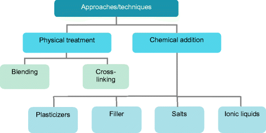  
Fig. 2 Common approaches used for the improvement of polymer electrolytes’ performance

#### Blending 混纺
Among the various approaches, polymer blending is the most feasible technique [10]. Polymer blending is a process of mixing at least two polymers with/without any chemical bonding between them. A polymer blend is therefore a physical mixture of two or more polymers/copolymers. In commercial and industrial applications, polymer blends are viable products due to their unique properties that are superior to those of the component polymers. A PMMA/PVdF blend-based polymer electrolyte demonstrated a remarkable improvement in the lithium conduction properties [37]. The rheological study indicates that the mixing of two different polymers results in a good mechanical stability in an entire temperature range investigated. Rajendran and co-workers reported that a gel polymer blend comprising PMMA and PVdF polymers was proven to be a promising material for enhancing the properties of lithium polymer secondary batteries [122]. XRD studies confirmed that the higher conductivity of the blend polymer system is due to the lower degree of crystallinity where the interaction between the polymers is maximized. Solvent casting technique was adopted for the preparation of a blend-based polymer consisting of a linear PEO, a hyperbranched polymer (poly[bis(triethylene glycol)benzoate] with terminal acetyl groups) and LiN(CF3SO2)2 salt [123]. Blend-based PEs exhibited higher ionic conductivities and improved lithium/electrolyte interfacial performance in comparison with PEO-based PEs. The blend-based polymer system can complement the disadvantages from other PEs by improving the physical and electrical properties [124]. A composite polymer electrolyte was prepared by blending the BaTiO3 and LiN(CF3SO2)2 salt in a PEO-HBP mixture. A higher ionic conductivity is achieved when 30 % of HBP is added [51]. Ramesh and Liew also reported an improved ionic conductivity after the PMMA-PVC-based PE is blended with LiTFSI [77]. Blending of lithium salt is a conventional approach to reduce the crystallinity in various polymer matrices. This method demonstrates a positive effect in promoting the amorphous fraction of polymer matrices. Figure 3 displays the pictorial model for the blending of polymers.  
在各种方法中，聚合物共混是最可行的技术[10]。聚合物共混是在它们之间混合至少两种聚合物的过程，其中有/没有任何化学键合。因此，聚合物共混物是两种或更多种聚合物/共聚物的物理混合物。在商业和工业应用中，聚合物共混物是可行的产品，因为它们具有优于组分聚合物的独特性能。基于PMMA /PVdF共混物的聚合物电解质显示出锂传导性能的显着改善[37]。流变学研究表明，两种不同聚合物的混合在所研究的整个温度范围内产生良好的机械稳定性。 Rajendran及其同事报告说，包含PMMA和PVdF聚合物的凝胶聚合物共混物被证明是一种有前途的材料，可用于增强锂聚合物二次电池的性能[122]。 XRD研究证实，共混聚合物体系的较高电导率是由于较低的结晶度，其中聚合物之间的相互作用最大化。采用溶剂浇铸技术制备由线性PEO，超支化聚合物（聚[双（三乙二醇）苯甲酸酯]和末端乙酰基）和LiN（CF3SO2）2盐[123]组成的共混聚合物。与基于PEO的PE相比，基于共混物的PE表现出更高的离子电导率和改善的锂/电解质界面性能。基于混合物的聚合物体系可以通过改善物理和电学性质来补充其他PE的缺点[124]。通过将BaTiO 3和LiN（CF 3 SO 2）2盐混合在PEO-HBP混合物中来制备复合聚合物电解质。当加入30％的HBP时，可以获得更高的离子电导率[51]。 Ramesh和Liew还报道了PMMA-PVC基PE与LiTFSI混合后离子电导率的提高[77]。锂盐的混合是降低各种聚合物基质中结晶度的常规方法。该方法证明了在促进聚合物基质的无定形部分方面的积极效果。图3显示了聚合物共混的图示模型。

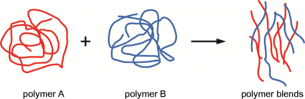  
Fig. 3 Pictorial model of the preparation of polymer blends  
图3 聚合物共混物制备的图示模型

#### Plasticizers 增塑剂
Fenton and co-workers first introduced a PEO-based PE with alkali metal salts and plasticizer in 1973 [2]. The plasticizers are additives that aim to increase the plasticity and allow higher ionic mobility which leads to the improvement of ionic conductivity at ambient temperature [56, 68]. The addition of liquid plasticizers is widely employed to prepare the PEs. Dimethyl carbonate (DMC), diocthyl adipate (DOA), DBP, DEC, PC and EC are among the commonly used plasticizers with low molecular weight [56, 69, 125]. Other examples of plasticizer solvents include alkyl phthalates, dimethyl formamide (DMF), diethyl phthalate (DEP), g-butyrolactone (BL), glycol sulfite (GS) and methylethyl carbonate (MEC) have also been used. The plasticizers dissolve more charge carriers and increase the mobile medium for ions. The incorporation of plasticizers into PEs will provide higher ionic conductivity, good thermal and mechanical stabilities [17, 69]. However, plasticizers have some disadvantages including low flash point, high vapour pressure, narrow range of working voltage, narrow electrochemical potential window and polar plasticizers react with lithium electrode [56, 126].  
Fenton及其同事于1973年首次推出了含有碱金属盐和增塑剂的PEO基PE [2]。增塑剂是旨在增加可塑性并允许更高离子迁移率的添加剂，这导致环境温度下离子电导率的改善[56,68]。液体增塑剂的添加广泛用于制备PE。碳酸二甲酯（DMC），己二酸二乙酯（DOA），DBP，DEC，PC和EC是常用的低分子量增塑剂[56,69,125]。增塑剂溶剂的其他实例包括邻苯二甲酸烷基酯，二甲基甲酰胺（DMF），邻苯二甲酸二乙酯（DEP），γ-丁内酯（BL），乙二醇亚硫酸盐（GS）和碳酸甲乙酯（MEC）。增塑剂溶解更多的电荷载体并增加离子的移动介质。将增塑剂加入PE中将提供更高的离子导电性，良好的热稳定性和机械稳定性[17,19]。然而，增塑剂具有一些缺点，包括低闪点，高蒸气压，窄工作电压范围，窄电化学电位窗和极性增塑剂与锂电极反应[56,126]。

#### Copolymers 共聚物
Copolymer is a polymer prepared from at least two different types of monomers. Copolymers can be prepared by using the cross-linking method [55]. PVdF-HFP is the most common copolymer that is prepared by co-polymerization of PVdF and HFP, as shown in Fig. 4. The copolymer exhibits better features compared with the monomers alone which could be attributed to the synergistic effects in the combined structure. A gel PVdF-HFP copolymer shows lower crystallinity, low glass transition temperature and better solubility in organic solvents compared with PVdF [127]. A poly(1-vinylpyrrolidone-co-vinyl acetate [P(VP-co-VAc)]-hosted GPE was prepared by incorporating the ionic liquid, LiTFSI and EMImTFSI [13]. Aihara et al. made a plasticized copolymer of ethylene oxide and propylene oxide using cross-linking technique and applied it in a lithium battery [128]. A poly(acrylonitrile-co-methyl methacrylate) (P(AN-co-MMA))-based composite PE was prepared with plasticizers (EC-PC), lithium salt (LiClO4) and silica as fillers [129]. A maximum ion conductivity of 1.9 × 10−3 S cm−1 at ambient temperature was obtained with 10 wt.% silica. Higher silica contents lead to the decrease of ionic conductivity which could be attributed to the increase of viscosity of plasticizer-rich phase. A solid copolymer electrolyte consisting of epichlorohydrin and ethylene oxide exhibits a high ionic conductivity in KOH systems at room temperature. The applicability of the copolymer electrolyte of epichlorohydrin and ethylene oxide in electrochemical devices was tested. This copolymer demonstrated a good performance in a zinc/air primary cell and a nickel/metal hydride secondary battery [130].  
共聚物是由至少两种不同类型的单体制备的聚合物。共聚物可以通过使用交联方法[55]制备。 PVdF-HFP是通过PVdF和HFP的共聚合制备的最常见的共聚物，如图4所示。与单独的单体相比，共聚物表现出更好的特征，这可归因于组合结构中的协同效应。与PVdF相比，凝胶PVdF-HFP共聚物具有较低的结晶度，较低的玻璃化转变温度和较好的有机溶剂溶解度[127]。通过引入离子液体LiTFSI和EMImTFSI制备了聚（1-乙烯基吡咯烷酮 -共 -乙酸乙烯酯[P（VP-co-VAc）]-主体的GPE [13] .Aihara等人制备了环氧乙烷的增塑共聚物。采用交联技术制备环氧丙烷，并将其应用于锂电池[128]。用增塑剂（EC-）制备聚（丙烯腈 -甲基丙烯酸甲酯）（P（AN-co-MMA））基复合材料。 PC），锂盐（LiClO4）和二氧化硅作为填料[129]。使用10％（重量）二氧化硅，在室温下的最大离子电导率为1.9×10-3Scm-1。二氧化硅含量越高，二氧化硅含量越高。离子电导率可归因于富含增塑剂相的粘度增加。由环氧氯丙烷和环氧乙烷组成的固体共聚物电解质在室温下在KOH体系中表现出高离子电导率。环氧氯丙烷和环氧乙烷共聚物电解质的适用性在电化学装置中进行了测试他的共聚物在锌/空气原电池和镍/金属氢化物二次电池中表现出良好的性能[130]。

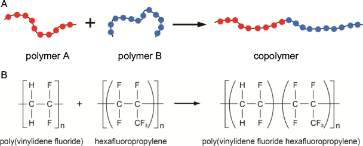  
Fig. 4 a Pictorial model of the preparation of a copolymer. b P(VdF)-HFP, an example of copolymer formed by PVdF and HFP
图4是共聚物制备的图示模型。 b P（VdF）-HFP，由PVdF和HFP形成的共聚物的实例

#### Cross-linked polymers
The high ionic conductivity of SPEs at low temperature is associated with the amorphous nature of the polymer matrix. The cross-linked PEs show good ionic conductivity at ambient temperature and exhibit fully amorphous feature [131]. In contrary, cross-linked polymer usually exhibits brittleness, low elasticity and processability [55]. Matsui et al. have prepared a cross-linked PE of poly(ethylene oxide) 2-(2-methoxy ethoxy) ethyl glycidyl ether with and without allyl glycidyl ether, P(EO/MEEGE/AGE) complexed in LiN(CF3SO3)2 salts [132]. Kuratomi and co-workers have developed a cross-linked copolymer of ethylene oxide and propylene oxide with LiBF4 or LiN(CF3SO2)2 salts [133]. The results demonstrate that LiN(CF3SO2)2 exhibits better cyclability in lithium battery compared with LiBF4. The concentration and types of lithium salts used are significant in determining battery performance. The study of a cross-linked of high molecular weight poly(oxy ethylene)s has been conducted and the new PEs show favourable ionic conductivity and good mechanical strength [134]. Another new CPE of chemically cross-linked poly(EO/PO)/(LiN(CF3SO2)2 had been reported [55]. Lee and co-workers have also reported a cross-linked composite PE by polymerizing alkyl monomer and polyethylene glycol dimethylcrylate (PEGDMA) in LiPF6/EC [135]. The studies indicate that ionic conductivity and flexibility of the PEs are dependent on the monomer content. Ramesh et al. reported a cross-linked polymer of PMMA and PVC as indicated in Fig. 5.  
SPE在低温下的高离子电导率与聚合物基质的无定形性质有关。交联的PE在环境温度下显示出良好的离子电导率并且表现出完全无定形的特征[131]。相反，交联聚合物通常表现出脆性，低弹性和可加工性[55]。 Matsui等人。制备了聚（环氧乙烷）2-（2-甲氧基乙氧基）乙基缩水甘油醚的交联聚乙烯醚，有和没有烯丙基缩水甘油醚，P（EO /MEEGE /AGE）在LiN（CF3SO3）2盐中络合[132] 。 Kuratomi及其同事开发了一种环氧乙烷和环氧丙烷与LiBF4或LiN（CF3SO2）2盐的交联共聚物[133]。结果表明，与LiBF4相比，LiN（CF3SO2）2在锂电池中表现出更好的循环性。所用锂盐的浓度和类型在确定电池性能方面是重要的。已经进行了高分子量聚（氧乙烯）交联的研究，新的PE显示出良好的离子导电性和良好的机械强度[134]。据报道，化学交联聚（EO /PO）/（LiN（CF3SO2）2）的另一种新CPE [55] .Lee及其同事也报道了通过聚合烷基单体和聚乙二醇二甲基丙烯酸酯的交联复合PE （PEGDMA）在LiPF6 /EC中[135]。研究表明，PE的离子电导率和柔韧性取决于单体含量.Ramesh等人报道了PMMA和PVC的交联聚合物，如图5所示。

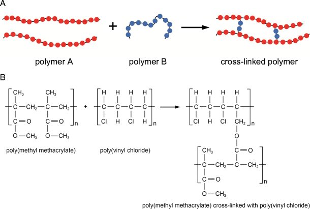  
Fig. 5 a Pictorial model of a preparation of a cross-linked polymer. b Example of a cross-linked polymer formed by PMMA and PVC [10]  
图5是交联聚合物制剂的图示模型。 b由PMMA和PVC形成的交联聚合物的实例[10]

#### Fillers
Addition of electrochemically inert and small particle size fillers into polymer matrices is an alternative way to improve the SPE’s performance [50]. Figure 6 demonstrates the pictorial model of the doping of fillers in a polymer electrolyte. The doping of fillers into PEs not only improve the ionic conductivity [136, 137] of PEs but also provide other advantages like improved mechanical stability, better thermal stability, reduction of the crystallinity and the glass transition temperature, stabilization of the highly conductive amorphous phase and superior interfacial stability in contact with various electrode materials [39, 54, 68]. The fillers reduce the crystallinity of polymers, hinder them from recrystallization and increase the degree of amorphicity, which leads to better ionic conductivity of the polymer [138]. Particles with smaller size are more effective due to their high ratio of surface area over the volume which reduces the crystallization. The addition of fillers could deform the lattice structure of the polymer matrices. This results in interfacial layers between the filler grains. Consequently, the charge carriers such as lithium ions are being self-trapped in the grain boundary within the lattice structure of the polymer chains.  
在聚合物基质中加入电化学惰性和小粒径填料是提高SPE性能的另一种方法[50]。图6显示了在聚合物电解质中掺杂填料的图示模型。将填料掺杂到PE中不仅提高了PE的离子电导率[136,137]，而且还提供了其他优点，如改善的机械稳定性，更好的热稳定性，结晶度和玻璃化转变温度的降低，高导电非晶相的稳定性与各种电极材料接触时具有优异的界面稳定性[39,54,68]。填料降低了聚合物的结晶度，阻碍了它们的再结晶并提高了非晶性程度，从而使聚合物具有更好的离子导电性[138]。具有较小尺寸的颗粒由于其在体积上的高表面积比率而更有效，这减少了结晶。添加填料可使聚合物基质的晶格结构变形。这导致填料颗粒之间的界面层。因此，诸如锂离子的电荷载体被自陷在聚合物链的晶格结构内的晶界中。

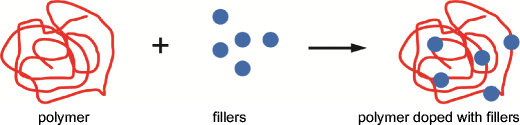  
Fig. 6 Pictorial diagram of the preparation of composite polymer complex by adding the fillers  
图6 通过添加填料制备复合聚合物配合物的示意图

High surface area particulates like aluminium oxide (Al2O3), titanium oxide (TiO2), zirconium oxide (ZrO2) and hydrophobic-fumed silica are commonly used as fillers [1, 39, 49]. Fumed silica is one type of silica with non-porous surface and is electrochemically inert, amorphous and hydrophobic in nature [49]. Composite polymer electrolyte can be prepared by blending the polymers with fillers [51] or adding small nanoparticles/fillers such as zeolites, MgO, Al2O3, SiO2 or TiO2 [60, 61, 136]. Alumina, a ceramic filler with large surface area and porous surface can be blended with polymer to form a new CPE [137]. The polymer reorganization tendency is reduced when filler surface group acts as physical cross-linking centres in the polymer segments [62]. In addition to that, fillers also provide more conductive pathways on the filler surfaces [139]. The addition of fillers also reduces the degree of crystallization of the polymer matrices [62]. The size and morphology of the fillers determine the nature and extent of the interaction [41].  
高表面积的颗粒如氧化铝（Al2O3），氧化钛（TiO2），氧化锆（ZrO2）和疏水性气相二氧化硅通常用作填料[1,39,49]。气相二氧化硅是一种具有无孔表面的二氧化硅，具有电化学惰性，无定形和疏水性[49]。复合聚合物电解质可以通过将聚合物与填料[51]或添加小的纳米颗粒/填料如沸石，MgO，Al 2 O 3，SiO 2或TiO 2 [60,61,136]混合来制备。氧化铝是一种具有大表面积和多孔表面的陶瓷填料，可与聚合物混合形成新的CPE [137]。当填料表面基团作为聚合物链段中的物理交联中心时，聚合物重组趋势降低[62]。除此之外，填料还在填料表面上提供更多的导电通路[139]。添加填料还会降低聚合物基质的结晶度[62]。填料的大小和形态决定了相互作用的性质和程度[41]。

The improvement in mechanical property of CPE at higher temperature after addition of fillers was investigated by Weston and Steele [78]. A PEO-LiClO4 complex doped with α-Al2O3 demonstrated a superior enhancement in the mechanical stability even in a temperature exceeding 100 °C. The idea of adding ceramic dispersoid as a filler into polymer complex is to provide a stable solid matrix [78]. A new CPE is prepared by dispersing fumed silica particulates in a polymer matrix of poly(ethylene glycol) (PEG) and lithium salt [49]. The studies indicate a superior ionic conductivity and a stable interface in contact with lithium metal. Liquan et al. reported that both mechanical stability and ionic conductivity of PEO-NaSCN CPE are improved when doped with γ-Al2O3 [140]. The particle size of the fillers significantly influences the ionic conductivity of a CPE. The addition of Al2O3 fine powder as a filler enables better penetration in polymer matrix. The dispersion of ceramic fillers in PEs can resist crystallinity and enhance the transport characteristics of the PEs as ionic conductors [78, 138]. Croce et al. proved that the (PEO)8LiClO4 complex dispersed with granular-sized γ-LiAlO2 ceramic powders largely demonstrates better conductivity compared with a pure (PEO)8LiClO4 polymer matrix [138].  
Weston和Steele [78]研究了添加填料后CPE在较高温度下的力学性能的改善。掺杂有α-Al2O3的PEO-LiClO4复合物即使在超过100℃的温度下也表现出优异的机械稳定性。将陶瓷分散质作为填料添加到聚合物复合物中的想法是提供稳定的固体基质[78]。通过将气相二氧化硅颗粒分散在聚（乙二醇）（PEG）和锂盐[49]的聚合物基质中来制备新的CPE。研究表明，离子电导率优异，与锂金属接触的界面稳定。 Liquan等。据报道，当掺杂γ-Al2O3时，PEO-NaSCN CPE的机械稳定性和离子电导率均得到改善[140]。填料的粒度显着影响CPE的离子电导率。添加Al 2 O 3细粉作为填料能够更好地渗透聚合物基质。陶瓷填料在PE中的分散可以抵抗结晶性并增强作为离子导体的PE的传输特性[78,138]。 Croce等人。实验证明，与纯（PEO）8LiClO4聚合物基体相比，分散有粒状γ-LiAlO2陶瓷粉末的（PEO）8LiClO4复合物在很大程度上表现出更好的导电性[138]。

#### Nanofillers
Nanocomposite polymer electrolytes can be prepared by incorporation of nanomaterials as fillers. The interaction between the nanomaterials and polymer host not only enhances the ionic conductivity but also improves the mechanical strength of the PE [41]. In 1999, Capiglia and co-workers prepared the nanocomposite-based PE by embedding nanosized silica (SiO2) into the PEO-LiClO4 polymer electrolytes [57]. Another literature also showed that the nanosized aluminium oxide (Al2O3) improved the ionic conductivities of PEs [141]. In a study conducted by Madhurjya et al., the mechanical strength of a hydrotalcite-doped nanocomposite PEs was improved [142]. The structure, size and concentration of the nanofillers are among the factors that determine the conductivity, workability and flexibility of the nanocomposite-based PEs [143]. A study from Xiong and co-workers showed that nanosized silica improved the mechanical properties and reduce the crystallinity of a starch-based polymer electrolyte when it was incorporated into the polymer matrix [144]. The nanoscale silica with large surface area increases the amorphous proportion of the NCPEs [44] and enhances other features, for instance, tensile strength, water resistance and breaking elongation [144]. A CPE based on fumed silica also demonstrates a wider electrochemically stable potential window and is more transparent in the visible region [28]. Khanmirzaei and Ramesh reported a biopolymer doped with TiO2 nanoparticles showed an enhancement in ionic conductivity [22].  
纳米复合聚合物电解质可以通过掺入纳米材料作为填料来制备。纳米材料与聚合物主体之间的相互作用不仅提高了离子电导率，而且提高了PE的机械强度[41]。 1999年，Capiglia及其同事通过将纳米二氧化硅（SiO2）嵌入PEO-LiClO4聚合物电解质中来制备纳米复合材料PE [57]。另一篇文献也表明纳米氧化铝（Al2O3）改善了PE的离子电导率[141]。在Madhurjya等人进行的一项研究中，水滑石掺杂的纳米复合材料PE的机械强度得到了改善[142]。纳米填料的结构，尺寸和浓度是决定纳米复合材料PE的导电性，可加工性和柔韧性的因素之一[143]。熊和同事的一项研究表明，当纳米二氧化硅掺入聚合物基质中时，纳米二氧化硅改善了机械性能并降低了淀粉基聚合物电解质的结晶度[144]。具有大表面积的纳米级二氧化硅增加了NCPE的无定形比例[44]，并增强了其他特征，例如拉伸强度，耐水性和断裂伸长率[144]。基于气相二氧化硅的CPE也表现出更宽的电化学稳定电位窗口，并且在可见光区域更透明[28]。 Khanmirzaei和Ramesh报道，掺杂TiO2纳米粒子的生物聚合物显示出离子电导率的增强[22]。

#### Doping salts
A PE with doping salt can exhibit better electrical stability and conductivity in various solvents. The interaction between polymer host and doping salt is crucial in determining the ionic conductivity achieved as well as the chemical stability and mechanical strength of the mixture [145]. The high conductivity of CPE is attributed to the low lattice energy of the complexing salt. The low lattice energies of both polymers and doping salts could increase the stability of the resulting PE. Therefore, the dissolution of doping salts in polymer chains will be facilitated when the lattice energy of the salts is low and the dielectric constant of the polymers is high.  
具有掺杂盐的PE可以在各种溶剂中表现出更好的电稳定性和导电性。聚合物主体和掺杂盐之间的相互作用对于确定所获得的离子电导率以及混合物的化学稳定性和机械强度至关重要[145]。 CPE的高导电性归因于络合盐的低晶格能。聚合物和掺杂盐的低晶格能量可以增加所得PE的稳定性。因此，当盐的晶格能低并且聚合物的介电常数高时，将促进掺杂盐在聚合物链中的溶解。

Non-metal salts such as ammonium acetate (CH3COONH4) have been selected as a doping salt due to its plasticizing effect [146]. Acetate ion (CH3COO−) is preferred in salt solvation via hydrogen bonding. Lithium salts like LiPF6 [23, 147], LiTFSI (LiN(CF3SO2)2) [13, 55, 148, 149, 150], LiClO4 [28, 57, 68, 71, 136], LiCF3SO3 [1] and lithium tetraborate (Li2B4O7) [56, 69] have been used as charge carrier providers in the preparation of various PEs. Figure 7 displays the molecular structures for different types of lithium salts that commonly applied in the preparation of PEs.  
由于其增塑作用，已选择非金属盐如乙酸铵（CH3COONH4）作为掺杂盐[146]。乙酸根离子（CH 3 COO-）在通过氢键的盐溶剂化中是优选的。锂盐如LiPF6 [23,147]，LiTFSI（LiN（CF3SO2）2）[13,55,148,149,150]，LiClO4 [28,57,68,71,136]，LiCF3SO3 [1]和四硼酸锂（Li2B4O7）[56,69]已被用作制备各种PE的电荷载体供应者。图7显示了通常用于制备PE的不同类型锂盐的分子结构。

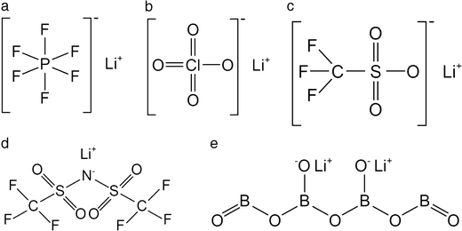  
Fig. 7 Chemical structures of lithium salts: a lithium hexafluorophosphate, b lithium perchlorate, c lithium triflate, d lithium bis(trifluromethane) sulfonimide and e lithium tetraborate  
图7锂盐的化学结构：六氟磷酸锂，高氯酸锂，三氟甲磺酸锂，双（三氟甲烷）磺酰亚胺锂和四硼酸锂

LiPF6 is a promising candidate due to its lower hygroscopic properties, good solubility, lower cost and better environmental impact [25]. Lithium triflate possesses good features that make it a doping salt, such as good thermal stability, non-toxicity, resistance to oxidation and is not sensitive to ambient moisture [151]. LiTFSI is chosen as a doping salt due to its bulky structure that enhances electrochemical stability. It dissociates well in low dielectric solvents, is non-corrosive towards electrodes and exhibits excellent thermal stability [44, 152]. TFSI anion possesses considerable delocalized electrons [44]. LiClO4 is another good choice of doping salt as it is composed of a large-sized anion and a small-sized cation [28]. LiClO4 has better features over the other lithium salts due to its low interfacial resistance when lithium is used as an anode. LiClO4 possesses high dissociation energy, and thus is easily get complexation in the preparation of SPEs, as it exhibits good solubility in most solvents [28]. Lithium salts are easily dissolved in polymer matrices due to the coordination interaction between the lithium ions and the polar groups of the polymer host [6].  
LiPF6具有较低的吸湿性，良好的溶解性，较低的成本和较好的环境影响，是一种很有前途的候选药物[25]。三氟甲磺酸锂具有良好的特性，使其成为掺杂盐，如良好的热稳定性，无毒性，抗氧化性，对环境湿度不敏感[151]。选择LiTFSI作为掺杂盐，因为其庞大的结构增强了电化学稳定性。它在低介电溶剂中很好地解离，对电极无腐蚀性并且表现出优异的热稳定性[44,152]。 TFSI阴离子具有相当大的离域电子[44]。 LiClO4是掺杂盐的另一个好选择，因为它由大尺寸的阴离子和小尺寸的阳离子组成[28]。当锂用作阳极时，LiClO4具有比其他锂盐更好的特性，因为它具有低的界面电阻。 LiClO4具有高解离能，因此在SPE的制备中易于络合，因为它在大多数溶剂中表现出良好的溶解性[28]。由于锂离子与聚合物主体的极性基团之间的配位相互作用，锂盐很容易溶解在聚合物基质中[6]。

#### Room temperature ionic liquids
Room temperature ionic liquids (RTILs) are molten salts consisting of bulky and asymmetric organic cations, and highly delocalized charges, organic and inorganic anions [35, 46, 153, 154]. RTILs remain in molten state at ambient temperature, therefore they are also known as room temperature molten salts [44, 155, 156]. Ionic liquids can be divided as aprotic ionic liquids and protic ionic liquids with the latter being actively applied in polymer electrolytes for fuel cells [157, 158, 159, 160, 161]. Some inherent features of RTILs include non-volatility, non-flammablity, recyclablity, low melting point, low viscosity, low toxicity, negligible vapour pressure, high ionic conductivity, wide electrochemical window and excellent electrochemical, mechanical, chemical and thermal stabilities [35, 44, 46, 162, 163, 164, 165, 166, 167, 168, 169, 170, 171]. RTIL possesses other intrinsic advantages like being a versatile solvent, which can readily dissolve most organic, organometallic and inorganic compounds [46]. They are not readily coordinated with enzymes, metal complexes and different inorganic and organic substrates [164]. Those outstanding characteristics of RTILs make them promising candidates to replace plasticizers as alternative additives in PEs [126].  
室温离子液体（RTIL）是由大块和不对称有机阳离子和高度离域电荷，有机和无机阴离子组成的熔盐[35,46,153,154]。 RTIL在环境温度下保持熔融状态，因此它们也被称为室温熔盐[44,155,156]。离子液体可以分为非质子离子液体和质子离子液体，后者主动应用于燃料电池的聚合物电解质[157,158,159,160,161]。 RTIL的一些固有特性包括非挥发性，非易燃性，可再循环性，低熔点，低粘度，低毒性，可忽略的蒸气压，高离子电导率，宽电化学窗口和优异的电化学，机械，化学和热稳定性[35， 44,46,162,163,164,165,166,167,168,169,170,171]。 RTIL具有其他固有的优点，如多功能溶剂，可以很容易地溶解大多数有机，有机金属和无机化合物[46]。它们不易与酶，金属络合物和不同的无机和有机底物协调[164]。 RTIL的这些突出特性使其成为替代增塑剂作为PE中替代添加剂的有希望的候选者[126]。

Among various approaches, addition of RTILs is another alternative way to enhance the ionic conductivity of a PE. RTILs have some attractive characteristics to make them viable and feasible in preparing new PEs. The high polarity and solubility towards various ionic and organic compounds make RTIL a promising candidate for ionic polymerization [165]. When RTIL is used in the preparation of CPEs, it acts as a solvent in the polymer chains of the electrolyte. The functionality of RTIL is dependent on the solubility of the RTIL monomer, the basic mobility of the RTIL in the composite and the charge density of the resulting hybrid materials [165]. Some physical properties of RTILs are strongly dependent on the nature of cations and anions, like density, viscosity, hydrophobicity and melting point [164]. The solubility of the ionic liquid is dependent on the large-sized cations and smaller-sized counter anions of either organic or inorganic nature [164, 172]. The bulky anions that favour the delocalisation of charges will reduce the interaction between cations and anions in the complexes with low lattice energy [173]. This accelerates the ionic dissociation. As a result of high degree of dissociation, more mobile charge carriers are available for transportation, leading to better ionic conductivity in an RTIL-based PEs [46]. Figure 8 presents some chemical structures of cations and anions of typical ionic liquids. In particular, phosphonium-based protic ionic liquids (PILs) have been reported to exhibit higher thermal stability and ionic conductivity than the corresponding ammonium-based PILs [158].  
在各种方法中，添加RTIL是另一种增强PE的离子电导率的替代方法。 RTIL具有一些吸引人的特性，使其在制备新PE时可行且可行。对各种离子和有机化合物的高极性和溶解性使RTIL成为离子聚合的有希望的候选者[165]。当RTIL用于制备CPE时，它在电解质的聚合物链中充当溶剂。 RTIL的功能取决于RTIL单体的溶解度，复合材料中RTIL的基本迁移率和所得杂化材料的电荷密度[165]。 RTIL的一些物理性质强烈依赖于阳离子和阴离子的性质，如密度，粘度，疏水性和熔点[164]。离子液体的溶解度取决于有机或无机性质的大尺寸阳离子和较小尺寸的抗衡阴离子[164,172]。有利于电荷离域的大体积阴离子将减少复合物中阳离子和阴离子之间的相互作用，具有低晶格能[173]。这加速了离子解离。由于高度解离，更多的移动电荷载体可用于运输，从而在基于RTIL的PE中产生更好的离子电导率[46]。图8显示了典型离子液体的阳离子和阴离子的一些化学结构。特别是，据报道，鏻基质子离子液体（PILs）比相应的铵基PIL具有更高的热稳定性和离子电导率[158]。

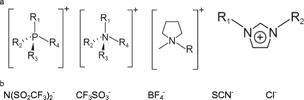  
Fig. 8 Chemical structures of a cations and b anions of typical ionic liquids [177]  
图8典型离子液体阳离子和阴离子的化学结构[177]

RTILs have received considerable interest in recent years due to their superior properties which make them widely used in vast amounts of applications, such as radical polymerization and catalytic cracking of polymers [44]. Ionic liquid-based CPEs provide an alternative solution to the conventional liquid electrolytes due to their environmental advantages. RTIL-CPEs eliminate the leaking of harmful gases and solvents, and they also can be recycled in certain applications [164]. RTILs have wide electrochemical potential window making them widely applied in the field of electrical and electrochemical devices. The ionic liquid-based PEs are technologically important in some energy generation, storage or conversion devices such as batteries, electrochemical actuators, electrochemical sensors, fuel cells, DSSCs, supercapacitors and electrochromic windows (ECWs) [44, 126, 164].  
近年来，RTIL由于其优异的性能而受到相当大的关注，这使得它们广泛用于大量应用，例如聚合物的自由基聚合和催化裂化[44]。离子液体CPE由于其环境优势而为常规液体电解质提供了替代解决方案。 RTIL-CPE消除了有害气体和溶剂的泄漏，它们也可以在某些应用中回收[164]。 RTIL具有宽的电化学势窗，使其广泛应用于电气和电化学装置领域。基于离子液体的PE在一些能量产生，存储或转换装置中是技术上重要的，例如电池，电化学致动器，电化学传感器，燃料电池，DSSC，超级电容器和电致变色窗（ECW）[44,126,164]。

RTILs also have widespread usage in polymer science. Kubisa and co-workers reported that ILs can be employed as solvents or media in the polymerization processes [174], including in conventional, living or controlling radical polymerization processes [165]. RTILs received considerable interest in the preparation of PE due to their advantages of excellent ionic conductivity, and they also play an important role in the polymer matrices [165]. In order to prevent electrolyte leakage, it is important to convert the RTIL-based electrolyte solution into a quasi-solid or solid form. In general, there are three techniques used to prepare highly conductive RTIL-based GPE: doping the PEs with ionic liquids, in situ polymerizing the monomers in RTILs and polymerizing the polymerizable ILs that contains the functional groups [165, 175, 176]. However, the RTIL-based GPEs have some drawbacks which limit the applications, such as poor mechanical and dimensional stabilities, that fortunately can be overcome by the incorporation of fillers [44].  
RTIL还广泛用于聚合物科学。 Kubisa及其同事报道，ILs可用作聚合过程中的溶剂或介质[174]，包括常规，活性或控制自由基聚合过程[165]。 RTIL由于具有优异的离子导电性，因此在PE的制备方面备受关注，并且它们在聚合物基质中也起着重要作用[165]。为了防止电解质泄漏，重要的是将基于RTIL的电解质溶液转化为准固体或固体形式。通常，有三种技术用于制备高导电性的基于RTIL的GPE：用离子液体掺杂PE，在RTIL中原位聚合单体并聚合含有官能团的可聚合IL [165,175,176]。然而，基于RTIL的GPE具有一些限制应用的缺点，例如差的机械和尺寸稳定性，幸运的是，通过加入填料可以克服这些缺点[44]。

### Applications
Fossil fuel is the major source of energy supplies for the past few decades. Fossil fuels are unrenewable and the combustion of fossil fuels releases hazardous pollutants which cause severe environmental, ecological and economical impacts in the future. A green and renewable power source becomes an attractive alternative source for energy [178]. Recent developments of resource substituent and renewable energy leads to the advancement in the methods of generating, storing, retrieving and converting electrical energy [179]. Electrochemical energy production, storage or conversion systems include electrochemical capacitors and batteries [178]. Figures 9, 10, 11 and 12 display the basic operating mechanism for different electrochemical systems. All the systems share some common features, such as two electrodes acting as electronic conductors in contact with an electrolyte solution (ionic conductor). The electron and ion transports are separated and the energy-generating process takes place at the electrode/electrolyte interface [178].  
在过去的几十年里，化石燃料是能源供应的主要来源。化石燃料是不可再生的，化石燃料的燃烧释放出有害污染物，将来会对环境，生态和经济造成严重影响。绿色和可再生能源成为有吸引力的替代能源[178]。资源取代基和可再生能源的最新发展导致了电能的产生，储存，回收和转换方法的进步[179]。电化学能源生产，储存或转换系统包括电化学电容器和电池[178]。图9,10,11和12显示了不同电化学系统的基本操作机制。所有系统都具有一些共同特征，例如两个电极充当与电解质溶液（离子导体）接触的电子导体。电子和离子传输是分开的，能量产生过程发生在电极/电解质界面[178]。

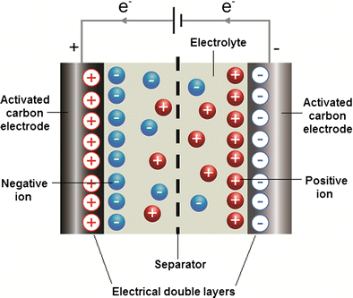  
Fig. 9 Schematic cross-section of a typical electrical double-layer capacitor  
图9 典型的双电层电容器的示意横截面图

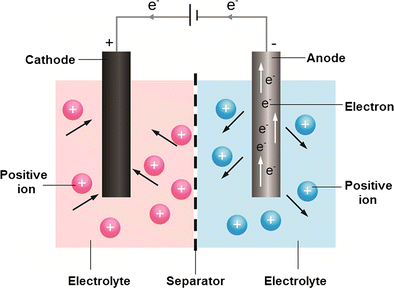  
Fig. 10 Schematic cross-section of a typical battery  
图10 典型电池的示意剖面图

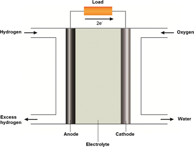  
Fig. 11 Schematic cross-section of a hydrogen fuel cell  
图11氢燃料电池的示意性横截面

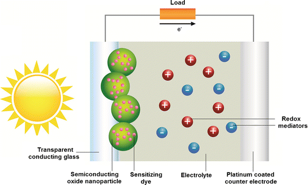  
Fig. 12 Schematic cross-section of a typical dye-sensitized solar cell  
图12是典型的染料敏化太阳能电池的示意性横截面

Two fundamental methods are used in the storing of electrical energy: (i) directly, as a non-faradaic electrical energy storage in an electrostatic way via positive/negative charges on the plates of a capacitor and (ii) indirectly, as a chemical energy storage in the electroactive chemicals that release charges via faradaic oxidation/reduction on the electrodes of a battery [179]. Unlike battery, no chemical charges are involved in capacitors. On the capacitor plates, only an excess and a deficiency of electron charges have to be established during charging and the reverse in discharging [179]. Fuel cells and dye-sensitized solar cells are the examples of energy-converting devices. Fuel cells convert chemical energy into electrical energy. Dye-sensitized solar cells convert solar energy into electrical energy via photosensitizers and redox mediators in the electrolyte.  
在电能的存储中使用两种基本方法：（i）作为非法拉第电能储存，通过电容器板上的正/负电荷以静电方式和（ii）间接地作为化学能储存在电活性化学物质中，通过电池电极上的法拉第氧化/还原释放电荷[179]。与电池不同，电容器不涉及化学电荷。在电容器极板上，在充电过程中只需要建立过量和不足的电子电荷，在放电过程中必须建立相反的电荷[179]。燃料电池和染料敏化太阳能电池是能量转换装置的示例。燃料电池将化学能转化为电能。染料敏化太阳能电池通过电解质中的光敏剂和氧化还原介质将太阳能转换成电能。

#### Electrochemical capacitors
Electrochemical capacitor is a promising energy storage device that combines the high-energy storage capability of a battery and the high-power delivery capability of a capacitor [147, 180, 181]. Electrochemical capacitors are also called electrocapacitors, supercapacitors, ultracapacitors or hybrid capacitors [178]. Ultracapacitors refer to capacitors with a carbon cathode and a carbon anode of high surface area [178]. They are used in portable electronics, medical, electronics and military devices, and as a power backup in hybrid electric vehicles (HEVs) [182]. There are two main types of electrochemical capacitors based on the charge storage mechanism: electrical double-layer capacitor (EDLC) and electrochemical supercapacitor [183, 184, 185]. The performance of a supercapacitor like stability, long lifetimes and large electrochemical potential window, is strongly dependent on the electrolyte used [182]. Aqueous and organic electrolytes can be employed in the fabrication of capacitors [186]. One of the major drawbacks of these electrolytes is the narrow electrochemical window which leads to a low-energy density and a low-power density [182].  
电化学电容器是一种很有前途的能量存储装置，它结合了电池的高能量存储能力和电容器的高功率输出能力[147,180,181]。电化学电容器也称为电容器，超级电容器，超级电容器或混合电容器[178]。超级电容器是指具有碳阴极和高表面积碳阳极的电容器[178]。它们用于便携式电子设备，医疗，电子和军事设备，以及混合动力电动汽车（HEV）的动力备用[182]。基于电荷存储机制有两种主要类型的电化学电容器：电双层电容器（EDLC）和电化学超级电容器[183,184,185]。超级电容器的性能如稳定性，长寿命和大电化学电位窗口，在很大程度上取决于所用的电解质[182]。水和有机电解质可用于制造电容器[186]。这些电解质的主要缺点之一是窄电化学窗口，这导致低能量密度和低功率密度[182]。

##### Electrical double-layer capacitors
A typical EDLC consists of two porous activated carbon electrodes with high surface area sandwiched in an electrolyte solution [187, 188], as shown in Fig. 9. The energy storage of EDLC is carried out by the charge in the electrical double layer on the interface between a carbon electrode and an aqueous electrolyte [189, 190]. The capacitance is associated with the charging/discharging of the electrical double layer [179]. The characteristics of the electrical double layer depend on several factors: the composition of the electrolyte, the electrode surface structure and the potential field between the charges at the electrode/electrolyte interface [178]. Some of the excellent characteristics of EDLC are the high-power density, long cycle life and high charge/discharge rate [189, 191].  
典型的EDLC由两个多孔活性炭电极组成，其表面积大，夹在电解质溶液中[187,188]，如图9所示.EDLC的储能通过电气双层中的电荷进行。碳电极和含水电解质之间的界面[189,190]。电容与双电层的充电/放电有关[179]。双电层的特性取决于几个因素：电解质的组成，电极表面结构和电极/电解质界面处电荷之间的电势场[178]。 EDLC的一些优良特性是高功率密度，长循环寿命和高充电/放电速率[189,191]。

EDLC is a clean and rechargeable energy storage system [192]. A wide range of applications can be obtained from these capacitors. Currently, both aqueous and non-aqueous (organic) electrolytes are employed in the commercial EDLCs [186]. The organic electrolytes are volatile, toxic and flammable which leads to some safety issues that limit the operating temperature range [152]. EDLCs with an aqueous electrolyte possess several advantages, for instance, high ionic conductivity, low electrical resistance, non-combustibility and high charging/discharging rate [193]. One of the major drawbacks of the aqueous solution as an electrolyte is the high risk of leakage of the liquid component [191]. Nowadays, solid polymer electrolyte is widely applied in replacing the liquid electrolytes due to its long-term safety, wide temperature operating range, flexibility, high-power density and the elimination of the risk of leakage [182, 194, 195, 196]. PEs with various polymer hosts have being employed in the making of EDLC, as shown in Table 4. Lewandowski et al. presented an alkaline PEO SPE in EDLC [197]. The performance of an EDLC with PAAK-KOH-H2O polymer hydrogel electrolyte was also reported [189].  
EDLC是一种清洁可充电的储能系统[192]。从这些电容器可以获得广泛的应用。目前，水性和非水性（有机）电解质都用于商业EDLC [186]。有机电解质具有挥发性，毒性和易燃性，这会导致一些限制工作温度范围的安全问题[152]。具有含水电解质的EDLC具有几个优点，例如，高离子电导率，低电阻，不可燃性和高充电/放电速率[193]。作为电解质的水溶液的主要缺点之一是液体组分泄漏的高风险[191]。如今，固体聚合物电解质由于其长期安全性，宽温度操作范围，柔韧性，高功率密度和消除泄漏风险而被广泛应用于替代液体电解质[182,194,195,196]。具有各种聚合物主体的PE已用于制备EDLC，如表4所示.Lewandowski等。在EDLC中提出碱性PEO SPE [197]。还报道了具有PAAK-KOH-H2O聚合物水凝胶电解质的EDLC的性能[189]。

Table 4 Ionic conductivities of some capacitors comprising of different polymer electrolytes  
表4 包含不同聚合物电解质的一些电容器的离子电导率
Polymer electrolytes | Ionic conductivity (S cm−1) | Literature
-|-|-
PCL-NH4SCN-EC | 3.8 × 10^−5 | [72]
Chitosan-PEO-NH4NO3-EC | 2.06 × 10^−3 | [125]
PVA-KOH | 10^−2 | [190]
PEO25-LiTf-IL | 3 × 10^−4 | [182]
PVdF-HFP-PC-EC-TEABF4 | 5 × 10^−3 | [198]
PEGDA-PVdF-EC-DMC-EMC-LiPF6 | 1.5 × 10^−3 | [199]

##### Supercapacitors
The electrochemical supercapacitor is also called a pseudocapacitor due to the pseudocapacitance of the surface redox reactions [179, 180, 181]. In supercapacitor, a charge-transfer reaction occurs between an electrode and an electrolyte in a suitable potential window [190]. Supercapacitors offer many applications as a high-power source including in utility load maintenance and in electrical, medical and military devices. It is also applied in some low-power source for camera, lasers, flash equipment, pulsed-light generators and memory backup systems of electronic equipment [182, 200, 201, 202]. Supercapacitors have short charging time, long cycle life, high cyclability and high-energy density due to the lager surface area of the electrode materials [179, 200, 203, 204].  
由于表面氧化还原反应的假电容，电化学超级电容器也被称为赝电容器[179,180,181]。在超级电容器中，在合适的电位窗口中，电极和电解质之间发生电荷转移反应[190]。超级电容器提供许多应用作为高功率源，包括公用事业负载维护以及电气，医疗和军事设备。它还适用于相机，激光器，闪光设备，脉冲光发生器和电子设备的存储备份系统的某些低功率源[182,200,201,202]。由于电极材料的表面积较大，超级电容器具有短的充电时间，长的循环寿命，高循环性和高能量密度[179,200,203,204]。

#### Batteries
A battery possesses one or more electrochemical cell(s) that are electrically connected at their terminals. It is a self-contained unit that stores chemical energy which can be converted directly to electrical energy on demand [178]. There are two types of battery depending on the rechargeable feature: primary battery and secondary battery. A primary battery is composed of one or more cells in the charged state and discharges during the operation until the energy is exhausted. A secondary battery is composed of one or more cells and usually is assembled in the discharged state. The electrical energy can be restored to the charged state even after being discharged in operation [178].  
电池具有一个或多个在其端子处电连接的电化学电池。 它是一个独立的单元，可以存储化学能，可以根据需要直接转换为电能[178]。 根据可充电功能，有两种类型的电池：原电池和二次电池。 一次电池由处于充电状态的一个或多个电池组成，并且在操作期间放电直到能量耗尽。 二次电池由一个或多个电池组成，并且通常在放电状态下组装。 即使在操作中放电之后，电能也可以恢复到充电状态[178]。

Figure 10 depicts the basic structure of a battery. Two electrodes are immersed into an electrolyte solution. The positive electrode (cathode) is a good oxidizing agent (electron receptor) associated with reductive chemical reactions that receive electrons from the external circuit. Manganese dioxide, lead oxide and lithium cobalt oxide are examples of positive electrode [178]. The negative electrode (anode) is a good reducing agent (electron donor) associated with oxidative chemical reactions that release electrons into the external circuit. Metals such as lithium, zinc and lead are examples of negative electrodes [178]. The electrolyte is an ionic conductor that is in-contact with both electrodes in a cell.  
图10描绘了电池的基本结构。 将两个电极浸入电解质溶液中。 正电极（阴极）是与从外部电路接收电子的还原化学反应相关的良好氧化剂（电子受体）。 二氧化锰，氧化铅和钴酸锂是正极的例子[178]。 负电极（阳极）是与氧化化学反应相关的良好还原剂（电子供体），其将电子释放到外部电路中。 锂，锌和铅等金属是负极的例子[178]。 电解质是离子导体，其与电池中的两个电极都接触。

Battery electrolytes can be found in many forms: aqueous solution, non-aqueous solvent and solid electrolytes. In the past few decades, liquid electrolytes are commonly used in the development of various types of batteries: nickel-cadmium battery, mercury cell and lead-acid accumulator. Non-aqueous or organic solvent-based electrolytes are used in lithium batteries [178]. One of the major drawbacks of the liquid electrolytes is the leakage of hazardous liquid or gas. In recent years, solid polymer electrolyte systems have become a prominent material used in the development of various batteries [141]. They offer many advantages in the battery applications such as low manufacturing cost, low toxicity, good structural and chemical stability and possess dual function as an electrolyte and a separator as well [205]. The SPEs are flexible and can be fabricated into a variety of shape, and they offer better safety features over the conventional liquid electrolytes [68, 206]. The SPE batteries are widely employed in some products like cellular phones, laptops and smart credit cards [68].  
电池电解质可以以多种形式存在：水溶液，非水溶剂和固体电解质。在过去的几十年中，液体电解质通常用于开发各种类型的电池：镍镉电池，汞电池和铅酸蓄电池。非水或有机溶剂型电解质用于锂电池[178]。液体电解质的主要缺点之一是有害液体或气体的泄漏。近年来，固体聚合物电解质体系已成为用于各种电池开发的主要材料[141]。它们在电池应用中具有许多优点，例如低制造成本，低毒性，良好的结构和化学稳定性，并且还具有作为电解质和隔膜的双重功能[205]。 SPE具有弹性，可以制成各种形状，与传统的液体电解质相比，它们具有更好的安全性[68,206]。 SPE电池广泛应用于手机，笔记本电脑和智能信用卡等产品[68]。

Lithium ion batteries received much attention due to their applications in mainly small devices, such as portable computers, cellular phones and mobile electro-optic equipment [207]. A lithium ion battery can be easily assembled by sandwiching an electrolyte between a lithium metal (anode) and a composite cathode [16]. For the application in lithium batteries, some crucial properties of solid polymer electrolytes are ionic conductivity, dimensional stability, cyclability, safety, high-energy density, light weight, solvent free, leak proof, wide electrochemical window, good compatibility with lithium electrode and good thermal and mechanical strength [40, 55, 206, 208]. At low temperature, the SPE possesses good dimensional stability but poor ionic conductivity. Ionic conductivity increases at higher temperature but that comes with some undesirable effects. The solid turns into quasi-solid condition and become more flexible leading to poor mechanical strength. Therefore, developing a lithium polymer electrolyte with high ionic conductivity and good dimensional stability in ambient temperature remains a challenge [55]. The lithium polymer electrolytes doped with fillers, plasticizers or which underwent cross-linked reaction offer attractive features like high ionic conductivity at ambient temperature, good mechanical strength, good thermal and electrochemical stabilities, good compatibility with electrodes and appreciable transference number [7, 8, 17, 55]. A major drawback of lithium-based batteries is the risk of explosion. Lithium is a highly reactive element, and thus a thermal runaway of electronic devices containing lithium ion cells or batteries could lead to an explosion. Therefore, many researchers have realized the importance of looking for other alternatives such as magnesium and sodium-based batteries [209, 210, 211].  
锂离子电池由于其主要应用于小型设备而受到广泛关注，例如便携式计算机，移动电话和移动电光设备[207]。通过将电解质夹在锂金属（阳极）和复合阴极[16]之间，可以容易地组装锂离子电池。对于锂电池的应用，固体聚合物电解质的一些关键性能是离子电导率，尺寸稳定性，循环性，安全性，高能量密度，重量轻，无溶剂，防漏，电化学窗宽，与锂电极的良好相容性和良好性热和机械强度[40,55,206,208]。在低温下，SPE具有良好的尺寸稳定性但离子导电性差。离子电导率在较高温度下会增加，但会产生一些不良影响。固体变成准固态并变得更柔韧，导致机械强度差。因此，开发具有高离子电导率和环境温度下良好尺寸稳定性的锂聚合物电解质仍然是一个挑战[55]。掺杂填料，增塑剂或经过交联反应的锂聚合物电解质具有吸引人的特性，如环境温度下的高离子电导率，良好的机械强度，良好的热稳定性和电化学稳定性，与电极的良好兼容性和可观的转移数[7,8， 17,55]。锂基电池的主要缺点是爆炸的风险。锂是一种高反应性元素，因此含有锂离子电池或电池的电子设备的热失控可能导致爆炸。因此，许多研究人员已经意识到寻找其他替代品如镁和钠基电池的重要性[209,210,211]。

#### Fuel cells
Due to the increasing global demand for sustainable energy sources, fuel cells offer a clean solution to the conventional power generation methods. Like electrochemical capacitors and batteries, fuel cells are another type of energy storage and conversion devices. Fuel cells directly convert chemical energy into electrical energy using a simple electrolysis mechanism [212]. The setup for a fuel cell is composed of an anode, a cathode and an electrolyte, as shown in Fig. 11. For a hydrogen fuel cell, hydrogen gas penetrates through the porous anode and ionizes to release electrons and protons. At the cathode, oxygen reacts with the electrons and protons from the electrolyte to form water. Electrical energy is produced and flows from the anode to the cathode through an electrical circuit. Different types of fuel cells are designed and developed to fit into a variety of applications. For example, alkaline fuel cell (AFC), direct methanol fuel cell (DMFC), proton exchange membrane fuel cell (PEMFC), phosphoric acid fuel cell (PAFC), molten carbonate fuel cell (MCFC) and solid oxide fuel cell (SOFC) [178]. The various fuel cells are distinguished by the electrolytes used, and also their unique sets of processes and reactions [178]. Other types of fuel cells, such as polymer electrolyte fuel cell (PEFC), eliminate the corrosion problems [213]. Microbial fuel cell (MFC) enables the conversion of biological compounds from domestic waste water into electrical energy [214]. Fuel cells act as clean alternatives with novel renewable energy storing/converting mechanisms; with high efficiency, low production cost and low emissions of pollutants [212].  
由于全球对可持续能源的需求不断增加，燃料电池为传统的发电方法提供了清洁的解决方案。与电化学电容器和电池一样，燃料电池是另一种类型的能量存储和转换装置。燃料电池使用简单的电解机制直接将化学能转换为电能[212]。燃料电池的设置由阳极，阴极和电解质组成，如图11所示。对于氢燃料电池，氢气穿过多孔阳极并电离以释放电子和质子。在阴极处，氧与来自电解质的电子和质子反应形成水。产生电能并通过电路从阳极流到阴极。设计和开发了不同类型的燃料电池以适应各种应用。例如，碱性燃料电池（AFC），直接甲醇燃料电池（DMFC），质子交换膜燃料电池（PEMFC），磷酸燃料电池（PAFC），熔融碳酸盐燃料电池（MCFC）和固体氧化物燃料电池（SOFC） [178]。各种燃料电池的特点是所使用的电解质，以及它们独特的工艺和反应[178]。其他类型的燃料电池，如聚合物电解质燃料电池（PEFC），可消除腐蚀问题[213]。微生物燃料电池（MFC）能够将生物化合物从生活废水转化为电能[214]。燃料电池作为新型可再生能源储存/转换机制的清洁替代品;高效率，低生产成本和低污染物排放[212]。

#### Dye-sensitized solar cells
Due to shortages of fossil fuels, solar energy becomes one of the most important renewable energy which obtain many research attentions nowadays. Solar thermal collectors, photovoltaics and DSSCs are among the most widely used advanced technology based on solar energy. DSSCs are new cell types that involve electrochemical mechanisms induced by solar energy. Figure 12 presents a schematic diagram of a typical DSSC, which consists of a conducting glass plate as an anode and a platinum-coated counter electrode as the cathode. A thin layer of semiconducting oxides bonded with photosensitizer dyes is applied to the transparent glass plate which offers a high surface area for reaction. Titanium oxide and zinc oxide are widely used as the semiconducting oxides [215, 216, 217]. The photosensitizers contain pigments which convert the light energy to electrical energy. Organic dyes, metal complexes, porphyrins and phthalocyanines are some examples of photosensitizer dyes found in most DSSCs [216, 218]. The efficiency of the cells depends on the rate of the electrochemical reactions, which are affected by the materials used in the electrodes [219]. DSSCs have good efficiency, ease of fabrication and tunable optical properties and are environmentally and commercially friendly which involve low production costs [217, 220, 221].  
由于化石燃料的短缺，太阳能成为当今获得许多研究关注的最重要的可再生能源之一。太阳能集热器，光伏发电和DSSC是最广泛使用的基于太阳能的先进技术。 DSSC是涉及由太阳能诱导的电化学机制的新细胞类型。图12示出了典型DSSC的示意图，其由作为阳极的导电玻璃板和作为阴极的铂涂覆的对电极组成。将与光敏剂染料结合的薄半导体氧化物层施加到透明玻璃板上，这提供了高反应表面积。氧化钛和氧化锌广泛用作半导体氧化物[215,216,217]。光敏剂含有将光能转换成电能的颜料。有机染料，金属配合物，卟啉和酞菁是大多数DSSC中发现的光敏染料的一些例子[216,218]。电池的效率取决于电化学反应的速率，电化学反应受电极中使用的材料的影响[219]。 DSSC具有良好的效率，易于制造和可调的光学性能，并且在环境和商业上友好，其涉及低生产成本[217,220,221]。

### Summary
The use of polymer electrolytes in various electrical, electrochemical and electrochromic devices has advanced much in recent years. Many polymer hosts have been studied and reported in the literature, such as PEO, PMMA, PAN, PAA, PVdF, PVdF-HFP and PVC. The use of composite polymer electrolytes has been identified as a promising method to improve the electrolytes’ properties. The ionic conductivity is the dominant property of a PE and can be enhanced by increasing the amorphous proportion. The degree of crystallinity can be reduced by several physical/chemical treatments or doping with selected substances. Several approaches have been applied to prepare the composite polymer electrolytes, and among the most commonly adopted are blending, cross-linking and incorporation of fillers, nanomaterials, plasticizers, doping salts and ionic liquids. Polymer electrolytes are technologically important in the development of electrochemical capacitors, batteries, fuel cells and dye-sensitized solar cells. Many reports have shown that the CPEs have advantages over conventional liquid electrolytes, especially in their conductivity, flexibility and safety aspects.  
近年来，聚合物电解质在各种电气，电化学和电致变色器件中的使用已经取得了很大进展。已经在文献中研究和报道了许多聚合物主体，例如PEO，PMMA，PAN，PAA，PVdF，PVdF-HFP和PVC。复合聚合物电解质的使用已被确定为改善电解质性能的有前途的方法。离子电导率是PE的主要性质，并且可以通过增加无定形比例来增强。通过几种物理/化学处理或掺杂选择的物质可​​以降低结晶度。已经应用了几种方法来制备复合聚合物电解质，并且最常采用的方法是填料，纳米材料，增塑剂，掺杂盐和离子液体的共混，交联和掺入。聚合物电解质在电化学电容器，电池，燃料电池和染料敏化太阳能电池的开发中具有技术重要性。许多报告表明CPE具有优于传统液体电解质的优点，特别是在其导电性，柔韧性和安全性方面。