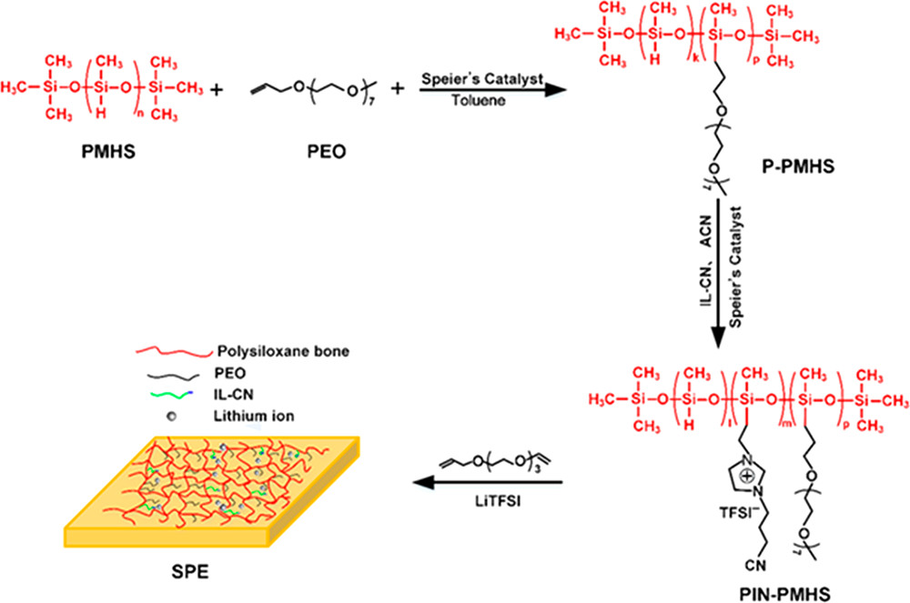
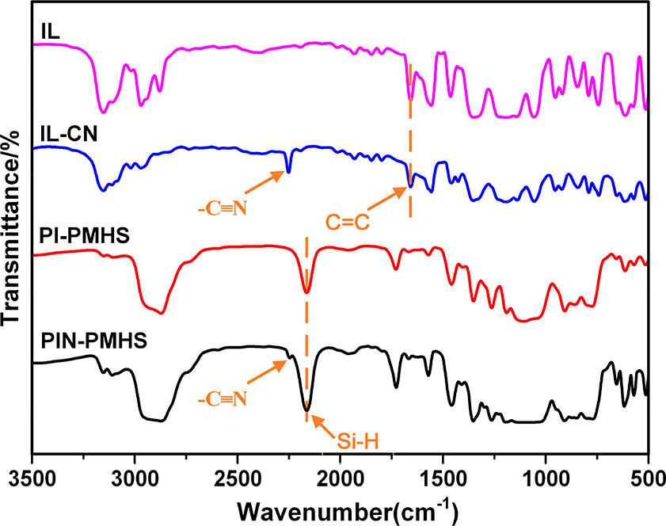
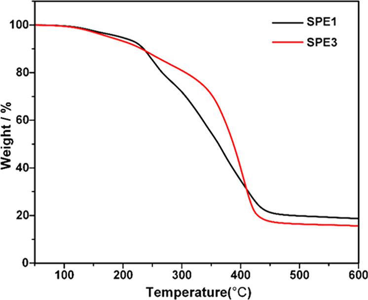
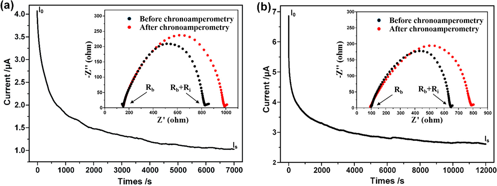
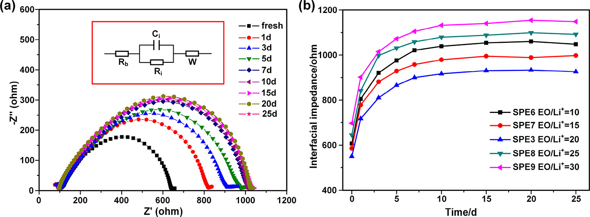
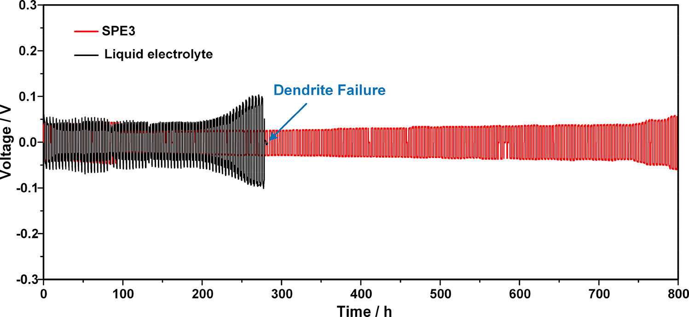
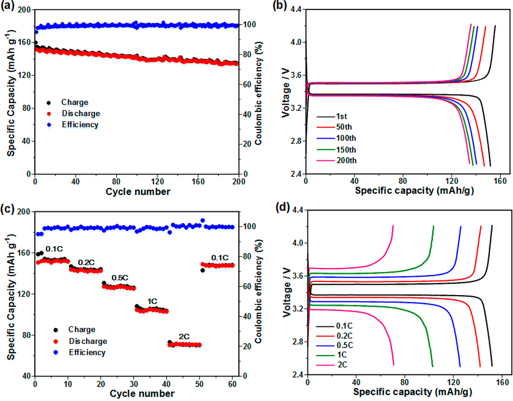
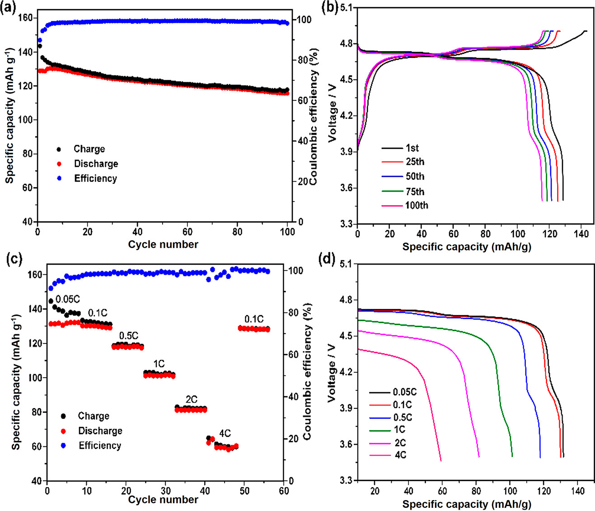

## Advanced Polymer Electrolyte with Enhanced Electrochemical Performance for Lithium-Ion Batteries: Effect of Nitrile-Functionalized Ionic Liquid  具有增强的电化学性能的高级锂离子电池聚合物电解质：腈功能化离子液体的作用

> Xiaoli Zhan, Jiawen Zhang, Mingzhu Liu, Jianguo Lu, Qinghua Zhang*, Fengqiu Chen
> ACS Appl. Energy Mater. 2019,2,3,1685-1694  
> DOI: [10.1021/acsaem.8b01733](https://doi.org/10.1021/acsaem.8b01733)
> Keywords: high voltage, lithium-ion batteries, solid polymer electrolyte, dendrite-free, ionic liquid

### Abstract
High-voltage electrode materials are beneficial for developing high-power-density lithium-ion batteries. The anodic voltage stability of electrolytes is a major challenge for high-voltage lithium batteries. Herein, a polysiloxane-based solid polymer electrolyte is fabricated by grafting ionic liquid and poly(ethylene oxide) chains onto flexible polysiloxane backbone. An ionic liquid with a strong electron-withdrawing nitrile group and a positively charged imidazole possesses good resistance against anodic oxidation, which endows the solid polymer electrolyte with a wide electrochemical window. The electrolyte integrates advantages of ionic liquid and poly(ethylene oxide) exhibiting a high ionic conductivity (3.56 × 10–4 S cm–1 at room temperature) and excellent resistance to dendrite growth. In addition, both Li/LiFePO4 and high-voltage Li/LiNi0.5Mn1.5O4 cells with the as-prepared solid polymer electrolyte show excellent cycling performance and superior rate capability at 30 °C. Thus, the modified polysiloxane-based electrolyte is a promising electrolyte candidate for next-generation high-energy-density batteries.  
高压电极材料有利于开发高功率密度的锂离子电池。电解质的阳极电压稳定性是高压锂电池的主要挑战。在此，通过将离子液体和聚（环氧乙烷）链接枝到柔性聚硅氧烷主链上来制造聚硅氧烷类固体聚合物电解质。具有强吸电子腈基和带正电荷的咪唑的离子液体具有良好的抗阳极氧化性，这使固体聚合物电解质具有宽的电化学窗口。该电解质具有离子液体和聚环氧乙烷的优点，该离子液体具有高离子电导率（室温下为3.56×10–4 S cm-1）和出色的抗枝晶生长能力。此外，具有所制备的固体聚合物电解质的Li/LiFePO4和高压Li/LiNi0.5Mn1.5O4电池在30°C时均具有出色的循环性能和优异的倍率性能。因此，改性的基于聚硅氧烷的电解质是用于下一代高能量密度电池的有希望的电解质候选者。

### 1. Introduction
Lithium-ion batteries (LIBs) are promising candidates as a power source for electronic devices and emerging smart grids because of their features of high specific energy and light weight.(1−6) To obtain higher energy density of LIBs, spinel LiNi0.5Mn1.5O4 (LNMO) is considered as an ideal cathode material for high-energy-density LIBs due to its high theoretic capacity and working voltage plateau (∼4.7 V, vs Li+/Li).(7−9) However, it is difficult for a LNMO battery with liquid electrolyte-soaked PP separator to sustain a high specific capacity at high voltage.(10,11) Therefore, developing high-voltage-tolerant electrolytes is significant for the development of high-energy-density batteries. Lithium metal batteries with lithium metal anode have been intensively pursued due to their high theoretical specific capacity. Nevertheless, the use of lithium metal electrode and liquid electrolyte often leads to the formation of lithium dendrites during repeated charge–discharge cycles, causing short-circuiting and serious safety problems.(12,13) Compared with the liquid-soaked separators, solid polymer electrolytes (SPEs) with sufficient mechanical properties and good electrochemical compatibility could effectively solve the above-mentioned problem.(14−17)  
锂离子电池（LIB）具​​有比能量高，重量轻的特点，因此有望成为电子设备和新兴智能电网的电源。（1-6）为了获得更高的能量密度，尖晶石LiNi0.5Mn1 .5O4（LNMO）由于其高理论容量和工作电压平稳段（〜4.7 V，vs Li+/Li）而被认为是高能量密度LIB的理想阴极材料。（7-9）但是，这很困难LNMO电池具有浸有液体电解质的PP隔膜，可在高压下维持高比容量。（10,11）因此，开发耐高压电解质对开发高能量密度电池具有重要意义。具有高理论比容量的具有锂金属阳极的锂金属电池已被广泛地追求。然而，使用锂金属电极和液体电解质通常会在反复的充放电循环中导致锂树枝状晶体的形成，从而导致短路和严重的安全问题。（12,13）与浸液的隔膜相比，固体聚合物具有足够的机械性能和良好的电化学相容性的电解质（SPE）可以有效解决上述问题。（14-17）

Poly(ethylene oxide) (PEO) with lithium salt is the most widely studied SPE in the past few years.(18−21) PEO can act as either solvating agents for lithium salts or structural materials for SPE, thus ensuring Li-ion transport and the chemical stability of SPE.(22,23) Unfortunately, most of the PEO-based solid electrolytes are not suitable for practical applications because of their relatively low ionic conductivity and poor mechanical stability.(24,25) However, the ionic conductivity could be significantly improved by suppressing the crystallinity and increasing the segmental mobility of PEO through adding plasticizer, modifying the PEO chains, or cross-linking the PEO oligomer.(26−30) Meanwhile, the mechanical strength of SPEs could be enhanced by introducing cross-linked structures.(31,32) Therefore, ion-conducting polymer materials with cross-linked structures and short PEO side chains, which possess high ionic conductivity and sufficient mechanical strength, have been widely studied as a high-performance polymer electrolyte.(33−36)  
含锂盐的聚环氧乙烷（PEO）是近几年研究最广泛的SPE。（18-21）PEO可以充当锂盐的溶剂化剂或SPE的结构材料，从而确保锂离子的运输以及SPE的化学稳定性。（22,23）不幸的是，大多数PEO基固体电解质由于其相对较低的离子电导率和较差的机械稳定性而不适用于实际应用。（24,25）然而，离子电导率通过添加增塑剂，修饰PEO链或使PEO低聚物交联可抑制PEO的结晶度并提高其节段迁移率，从而可以显着提高其稳定性。（26-30）同时，通过引入交联剂可以提高SPE的机械强度。（31,32）因此，具有高离子电导率和足够机械强度的具有交联结构和短PEO侧链的离子导电聚合物材料已被广泛使用。用作高性能聚合物电解质。（33-36）

In solid polymer electrolytes, ionic conductivities are governed by both the segmental motion of the polymer chains and the number of dissociated carrier ions and their mobility.(37) To enhance ionic conductivity, the ionic liquids (ILs) have been used to incorporate in SPEs.(38) ILs could act as plasticizers and substitute the conventional plasticizing agent. ILs exhibit several advantages including nonflammability, negligible vapor pressure, high ionic conductivity, a wide oxidation stability window, and high thermal stability.(39−41) ILs composed of large organic cations and organic/inorganic anions are molten salts at room temperature. ILs as plasticizers can increase the amorphous phase of the SPEs and improve Li-ion transportation.(42,43) For example, the polymer electrolyte containing 100 wt % of PYR13TFSI shows a significantly improved conductivity of ∼10–4 S/cm compared with that of an analogous polymer electrolyte without ionic liquid (2 × 10–6 S/cm).(44,45) However, a high amount of ionic liquids might jeopardize the mechanical properties of polymer electrolytes. Fortunately, this problem can be avoided by introducing chemical bonding between ionic liquids and the polymer electrolyte substrate.  
在固体聚合物电解质中，离子电导率受聚合物链的分段运动和解离的载流子离子数及其迁移率的控制。（37）为了增强离子电导率，已将离子液体（IL）掺入SPE中。（38）IL可以充当增塑剂并替代常规增塑剂。IL表现出多种优势，包括不可燃性，可忽略的蒸气压，高离子电导率，宽的氧化稳定性窗口和高热稳定性。（39-41）由大有机阳离子和有机/无机阴离子组成的IL在室温下为熔融盐。ILs作为增塑剂可以增加SPE的非晶相并改善锂离子的传输。（42,43）例如，与PYR13TFSI相比，含有100 wt％PYR13TFSI的聚合物电解质的电导率（∼10–4 S/cm）与不含离子液体的类似聚合物电解质的电导率（2×10-6 S/cm）相比显着提高。（44,45）但是，大量离子液体可能会危害聚合物电解质的机械性能。幸运的是，可以通过在离子液体和聚合物电解质基材之间引入化学键来避免此问题。

The nitrile group (−C≡N) with lower LUMO and high electrochemical stability is a strong electron-withdrawing group.(46) Nitrile-based SPEs exhibit high anodic oxidization potential, high dielectric constant, and strong coordination ability.(46−48) The interactions between Li ions and −C≡N could effectively improve the ionic conductivity of electrolytes.(49) For example, the succinonitrile/lithium perchlorate-based SPEs show high ionic conductivities (>10–3 S/cm) at room temperature.(50) PAN exhibits an electrochemical window over 4.5 V (vs Li+/Li).(51) The PVA-CN SPEs prepared by the in situ synthesis method exhibit a high lithium-ion transference number, high ionic conductivity, enhanced mechanical strength, and reinforced safety.(46,52)  
具有较低LUMO和高电化学稳定性的腈基（-C≡N）是一个强吸电子基团。（46）腈基SPE具有高阳极氧化电位，高介电常数和强配位能力。（46-48）锂离子与-C≡N的相互作用可以有效改善电解质的离子电导率。（49）例如，丁二腈/高氯酸锂基固相萃取在室温下具有高离子电导率（> 10-3 S/cm）。（50）PAN在4.5 V（vs Li+/Li）上显示出电化学窗口。（51）通过原位合成方法制备的PVA-CN SPEs具有高锂离子转移数，高离子电导率和增强的机械强度，并增强了安全性。（46,52）

It is also known that introduction of nitrile groups into an IL structure would lead to the formation of SEIs on electrodes.(53) ILs and nitrile groups have positive effects on improving the electrochemical properties of polymer electrolytes. To take the synergistic advantages of nitrile groups and ionic liquids, we proposed a tunable bifunctional polysiloxane electrolyte for LIBs. The bifunctional polysiloxane contains poly(ethylene oxide) and 1-vinyl-3-cyanopropylimidazolium bis(trifluoromethylsulfonyl)imide ionic liquid (IN-CN). After mixing with LiTFSI and cross-linking, the thermal stability and electrochemical properties are carefully studied. The strong electron-withdrawing nitrile group and positively charged imidazole in IN-CN could enhance the compatibility of electrolyte while enabling high-voltage operation.  
还已知将腈基引入IL结构会导致在电极上形成SEI。（53）IL和腈基对改善聚合物电解质的电化学性能具有积极作用。为了利用腈基和离子液体的协同优势，我们提出了一种用于LIB的可调节双功能聚硅氧烷电解质。双官能聚硅氧烷包含聚（环氧乙烷）和1-乙烯基-3-氰基丙基咪唑鎓双（三氟甲基磺酰基）酰亚胺离子液体（IN-CN）。与LiTFSI混合并交联后，要仔细研究其热稳定性和电化学性能。IN-CN中的强吸电子腈基和带正电荷的咪唑可以增强电解质的相容性，同时可以进行高压操作。

### 2. Experimental Section
#### 2.1. Materials
Poly(ethylene glycol) allyl methyl ether (PEO, Mw = 400 g mol–1) was obtained from Hangyuan Chemical Industry Co. Ltd. Polymethylhydrosiloxane (PMHS, Mn: 1700–3200) was purchased from Aladdin. Toluene (≥99.5%) and acetonitrile (CH3CN, ≥99.9%) were purchased from Sinopharm. The above reagents were dried in 4 Å molecular sieves before use. 1-Vinyl-3-butylimidazolium bis(trifluoromethylsulfonyl)imide ionic liquid (IL, ≥99%) and 1-vinyl-3-cyanopropylimidazolium bis(trifluoromethylsulfonyl)imide ionic liquid (IL-CN, ≥99%) were received from Lanzhou Yulu Fine Chemical Co. Ltd. 1-Methyl-2-pyrrolidinone (NMP, 99.5%), hexachloroplatinic acid/isopropanol solution (1 g of H2PtCl6·6H2O dissolved in 50 mL of isopropanol), and tri(ethylene glycol) divinyl ether (98%) were purchased from Sigma-Aldrich. Lithium bis(trifluoromethanesulfonyl)imide (LiTFSI, ≥99%) was purchased from Aladdin and dried at 120 °C in a vacuum oven for 24 h before use. The liquid electrolyte was 1.0 M LiPF6 in ethylene carbonate (EC)/dimethyl carbonate (DMC)/ethyl methyl carbonate (EMC) (1:1:1, v/v/v) (Shenzhen Kejing Co., Ltd.). All reagents were used as received. Microporous polypropylene separators (PP, 26 μm, Celgard) were used for comparison.  
聚（乙二醇）烯丙基甲基醚（PEO，Mw = 400 g mol-1）购自杭元化工有限公司。聚甲基氢硅氧烷（PMHS，Mn：1700-3200）购自阿拉丁。甲苯（≥99.5％）和乙腈（CH3CN，≥99.9％）购自国药集团。使用前，将以上试剂在4Å分子筛中干燥。从兰州玉露市收到1-乙烯基-3-丁基咪唑鎓双（三氟甲基磺酰基）酰亚胺离子液体（IL，≥99％）和1-乙烯基-3-氰基丙基咪唑鎓双（三氟甲基磺酰基）酰亚胺离子液体（IL-CN，≥99％）精细化工有限公司1-甲基-2-吡咯烷酮（NMP，99.5％），六氯铂酸/异丙醇溶液（1 g H2PtCl6·6H2O溶于50 mL异丙醇）和三（乙二醇）二乙烯基醚（98 ％）购自Sigma-Aldrich。双（三氟甲磺酰基）酰亚胺锂（LiTFSI，≥99％）购自阿拉丁，并在使用前在真空烘箱中于120°C干燥24小时。液体电解质为在碳酸亚乙酯（EC）/碳酸二甲酯（DMC）/碳酸乙基甲基酯（EMC）中的1.0M LiPF 6（1∶1∶1，v/v/v）（深圳科晶有限公司）。所有试剂均按原样使用。使用微孔聚丙烯隔板（PP，26μm，Celgard）进行比较。

2.2. Synthesis of Bifunctional Polysiloxane (PIN-PMHS)
The process of synthesis of the bifunctional polysiloxane (PIN-PMHS) is shown in Scheme 1. First, a poly(ethylene glycol)allyl methyl ether (PEO) was grafted onto PMHS (P-PMHS) via a hydrosilylation reaction with Speier’s catalyst, following the method previously reported by our group.(54) PMHS (2 g) was dissolved in anhydrous toluene (2 g). PEO (4 g) and Speiers’s catalyst (150 μL) with anhydrous toluene (4 g) were mixed well and then added to the PMHS solution. The mixture was stirred in an argon atmosphere at 50 °C for 2 h and then kept stirring at 80 °C until the stretching vibration absorption of CH2═CH2 disappeared in the in situ FT-IR spectrum. Upon removal of the solvent by a rotary evaporator at 55 °C, the obtained viscous polymer was denoted as P-PMHS. The above-prepared P-PMHS and IL-CN were mixed with anhydrous acetonitrile (6 g). The amount of IL-CN was controlled to obtain different ratios of side chains. The reaction mixture was stirred at 80 °C for 24 h under reflux. After reaction, the solvent was removed through rotary evaporation at 50 °C, and the products were dried under vacuum at room temperature for 24 h. Finally, polysiloxanes with different contents of side chains (PIN-PMHS) were obtained.  
2.2. Synthesis of Bifunctional Polysiloxane (PIN-PMHS)
流程1中显示了双功能聚硅氧烷（PIN-PMHS）的合成过程。首先，通过与Speier催化剂进行氢化硅烷化反应，将聚乙二醇乙二醇烯丙基甲基醚（PEO）接枝到PMHS（P-PMHS）上，按照我们小组先前报告的方法进行。（54）将PMHS（2 g）溶于无水甲苯（2 g）中。将PEO（4 g）和Speiers的催化剂（150μL）与无水甲苯（4 g）充分混合，然后添加到PMHS溶液中。将混合物在氩气气氛中于50°C搅拌2 h，然后在80°C搅拌直至在原位FT-IR光谱中CH2 = CH2的拉伸振动吸收消失。在55℃下通过旋转蒸发仪除去溶剂后，获得的粘性聚合物表示为P-PMHS。将上述制备的P-PMHS和IL-CN与无水乙腈（6g）混合。控制IL-CN的量以获得不同比例的侧链。将反应混合物在回流下于80℃搅拌24h。反应后，通过在50℃下旋转蒸发除去溶剂，并将产物在真空下在室温下干燥24小时。最后，获得了具有不同侧链含量的聚硅氧烷（PIN-PMHS）。

  
Scheme 1. Schematic for the Synthetic Process of Solid Polymer Electrolytes (SPEs)
方案1.固体聚合物电解质（SPE）的合成过程示意图

#### 2.3. Preparation of Solid Polymer Electrolytes
Solid polymer electrolytes were prepared by the following process illustrated in Scheme 1, and the whole procedure was performed in a glovebox filled with argon (H2O < 0.1 ppm and O2 < 0.1 ppm). PIN-PMHS, LiTFSI, Speiers’s catalyst, and tri(ethylene glycol) divinyl ether cross-linker were dissolved in anhydrous acetonitrile and stirred 12 h at room temperature. After that, the mixture was put into a coin shell and heated at 80 °C for 24 h, and a transparent film was achieved. The synthesized samples are listed in Table1.  
固体聚合物电解质通过以下流程1所示的方法制备，整个过程在充满氩气的手套箱中进行（H2O <0.1 ppm和O2 <0.1 ppm）。将PIN-PMHS，LiTFSI，Speiers的催化剂和三（乙二醇）二乙烯基醚交联剂溶解在无水乙腈中，并在室温下搅拌12小时。之后，将混合物放入硬币壳中并在80℃下加热24h，获得透明膜。合成样品列于表1。

Table 1. Targeted Compositions of Synthesized Samples  
samples |   IL content (wt % PMHS)  |   IL-CN content (wt % PMHS)   |   EO/Li+ mole ratio
:-:|:-:|:-:|:-:
SPE0    |   0   |   0   |   20
SPE1    |   10  |   0   |   20
SPE2    |   0   |	5   |	20
SPE3    |   0   |	10  |	20
SPE4    |   0   |	15  |	20
SPE5    |   0   |	20  |	20
SPE6    |   0   |	10  |	10
SPE7    |   0   |	10  |	15
SPE8    |   0   |	10  |	25
SPE9    |   0   |	10  |	30

#### 2.4. Characterizations
FT-IR spectra characterizations were conducted on a Nicolet 5700 (Thermo Fisher Company, USA). The thermal property of SPEs was estimated by thermal gravimetric analysis (TGA) under a N2 atmosphere from room temperature to 700 °C in a TA Instruments Q500 (heating rate: 10 °C min–1).  
FT-IR光谱表征是在Nicolet 5700（美国Thermo Fisher公司）上进行的。在TA Instruments Q500中，在室温至700°C的N2气氛下，通过热重分析（TGA）估算了SPE的热性能（加热速率：10°C min-1）。

The ionic conductivity (σ) of the SPEs was tested by electrochemical impedance spectroscopy (EIS) using a CHI660e electrochemical workstation at an amplitude of 5 mV over a frequency range of 0.1–106 Hz. The SPE for measurement was sandwiched between a pair of stainless-steel plates (SS/SPE/SS) with a thickness of 200–400 μm. The ionic conductivity (σ) of the SPEs was calculated by the equation  
SPE的离子电导率（σ）通过CHI660e电化学工作站通过电化学阻抗谱（EIS）在0.1–106 Hz的频率下以5 mV的振幅进行测试。用于测量的SPE夹在一对厚度为200–400μm的不锈钢板（SS /SPE /SS）之间。 SPE的离子电导率（σ）通过以下公式计算  
$\sigma = \frac{L}{R_b S}$

where Rb, L, and S are the bulk resistance, thickness, and the cross-sectional area of polymer electrolyte film, respectively.  
其中，Rb，L和S分别是高分子电解质膜的体电阻，厚度和横截面积。

The electrochemical stability window of the as-prepared SPEs was tested on a CHI660e electrochemical workstation by linear sweep voltammetry (LSV) from 2 to 6 V (vs Li+/Li) at a scan rate of 0.5 mV s–1 at room temperature. The SPE membrane was sandwiched between a lithium foil (reference and counter electrodes) and a stainless steel (working electrode).  
在CHI660e电化学工作站上，通过线性扫描伏安法（LSV）在室温下以0.5 mV s-1的扫描速率在2至6 V（vs Li + /Li）上测试了所制备SPE的电化学稳定性窗口。 SPE膜夹在锂箔（参比电极和对电极）和不锈钢（工作电极）之间。

The lithium transference number (tLi+) was measured by EIS using a CHI660e electrochemical workstation according to the method reported by Bruce et al.(55) In the chronoamperometry measurement, the initial current (I0) and the steady-state current (Is) for a symmetrical Li/SPE/Li cell under a voltage pulse (ΔV) of 10 mV were obtained. Meanwhile, the initial and the steady-state interfacial resistances (R0 and Rs) were examined. The tLi+ was calculated by the following equation:  
根据布鲁斯等人（55）报道的方法，使用CHI660e电化学工作站通过EIS测量锂转移数（tLi +）。在计时电流法测量中，初始电流（I0）和稳态电流（Is）为获得了在10 mV的电压脉冲（ΔV）下的对称Li /SPE /Li电池。同时，检查了初始和稳态界面电阻（R0和Rs）。 tLi +通过以下公式计算：  
$t_{Li^+} = \frac{I_S (\Delta V - I_0 R_0)}{I_S (\Delta V - I_S R_S)}$

For the evaluation of lithium dendrite growth, the periodic charge–discharge cycling test of the symmetrical Li/SPE/Li and Li/separator–liquid electrolyte/Li cell was performed at a constant current density of 0.1 mA cm–2 (1 h charge and 1 h discharge) with a Land CT2001A battery tester at room temperature.  
为了评估锂枝晶的生长，在0.1 mA cm–2的恒定电流密度下对对称的Li /SPE /Li和Li /隔板-液体电解质/Li电池进行了周期性的充放电循环测试并在室温下用Land CT2001A电池测试仪放电1小时。

Battery performance tests of the as-prepared SPEs were conducted by fabricating CR2025 coin-type cells with LiFePO4 (or LiNi0.5Mn1.5O4) cathode and lithium metal anode. The cathode was fabricated by coating a slurry of 80% LiFePO4 (or LiNi0.5Mn1.5O4) powder, 10% acetylene black, and 10% poly(vinylidene fluoride) (PVDF) binder in NMP onto an aluminum foil. The cathode was dried at 80 °C for 12 h in a vacuum oven. All cells were assembled in an argon-filled glovebox. The cell performances including cycle performance and rate capability were tested by a battery testing system (NEWARE CT-4008, Shenzhen, China).  
通过使用具有LiFePO4（或LiNi0.5Mn1.5O4）阴极和锂金属阳极的CR2025硬币型电池来进行所制备SPE的电池性能测试。通过在NMP中将80％LiFePO4（或LiNi0.5Mn1.5O4）粉末，10％乙炔黑和10％聚偏二氟乙烯（PVDF）粘合剂的浆液涂布到铝箔上来制造阴极。将阴极在真空烘箱中在80°C下干燥12小时。将所有电池组装在充满氩气的手套箱中。通过电池测试系统（NEWARE CT-4008，中国深圳）测试了电池性能，包括循环性能和倍率性能。

### 3. Results and Discussion
#### 3.1. Structure Characterization
The bifunctional polysiloxanes of PI-PMHS and PIN-PMHS were first synthesized through the common reaction of Si–H with C═C. The FT-IR spectra of IL, IL-CN, PI-PNHS, and PIN-PNHS are shown in Figure 1. The C═N and C═C skeleton stretching vibrations at 1573 and 1464 cm–1 correspond to the imidazole ring of IL and IL-CN, respectively.(56) The bands at 1352, 1138, and 1192 cm–1 are attributed to S═O and C–F of the TFSI anion. The peak observed at 1646 cm–1 can be attributed to the stretching vibrations of vinyl group. As in earlier studies in ref (54), we have successfully grafted PEO onto the PMHS backbone to prepared P-PMHS polymers, and the related FT-IR spectra are shown in Figure S1. Compared with P-PMHS, the characteristic peaks of the imidazole ring and TFSI anion are observed in PI-PMHS and PIN-PMHS. Furthermore, the peak at 1646 cm–1 ascribed to the CH2═CH2 stretching vibration disappeared, and the peak at 2167 cm–1 (Si–H stretching vibration) is significantly weakened in PI-PMHS and PIN-PMHS after the hydrosilylation reaction. Additionally, a peak at 2251 cm–1 attributed to the stretching vibration of C≡N appears in PIN-PMHS. These FT-IR results confirm that the bifunctional polysiloxanes (PI-PMHS and PIN-PNHS) are successfully synthesized by the hydrosilylation method. The 1H NMR of PMHS, PEO, IL-CN, and PIN-PMHS is illustrated in Figure S2. The signature signal of Si–H which appears at 4.7–4.8 ppm in PMHS decreases in the PIN-PMHS. The signals between 5.5 and 6.1 ppm (3 proton) representing the resonance of vinyl terminal groups in PEO and IL-CN completely disappear after the reaction. The peaks at 0.5 and 1.0 ppm are the proton resonance of −Si–CH2– grafted with PEO and ionic liquid, respectively. The actual composition of the SPE3 was calculated according to the 1H NMR spectra. The result shows that the graft ratios of PEO and ionic liquid are about 31.9 ± 3% and 1.8 ± 0.5%, respectively, which are very close to the targeted compositions (33.8% of PEO and 1.5% of ionic liquid). It indicates that the hydrosilylation reaction is stoichiometrically controlled, and the PEO and IL-CN are successfully grafted onto the PMHS chains.  
PI-PMHS和PIN-PMHS的双官能聚硅氧烷是首先通过Si–H与C═C的共同反应合成的。 IL，IL-CN，PI-PNHS和PIN-PNHS的FT-IR光谱如图1所示。C═N和C═C骨架在1573和1464 cm-1处的拉伸振动对应于咪唑环的IL和IL-CN。（56）1352 cm，1138 cm和1192 cm-1处的谱带归因于TFSI阴离子的S═O和CF。在1646 cm-1处观察到的峰可归因于乙烯基的拉伸振动。正如参考文献（54）中较早的研究一样，我们已经成功地将PEO接枝到PMHS骨架上以制备P-PMHS聚合物，相关的FT-IR光谱如图S1所示。与P-PMHS相比，在PI-PMHS和PIN-PMHS中观察到了咪唑环和TFSI阴离子的特征峰。此外，在氢化硅烷化反应后，PI-PMHS和PIN-PMHS中归因于CH2═CH2拉伸振动的1646 cm-1处的峰消失，而2167 cm-1处的峰（Si-H拉伸振动）被显着削弱。另外，在PIN-PMHS中，由于C≡N的拉伸振动在2251 cm-1处出现了一个峰值。这些FT-IR结果证实了通过氢化硅烷化方法成功地合成了双官能聚硅氧烷（PI-PMHS和PIN-PNHS）。图S2中显示了PMHS，PEO，IL-CN和PIN-PMHS的1H NMR。在PIN-PMHS中，在PMHS中出现在4.7-4.8 ppm处的Si–H的特征信号降低。 5.5至6.1 ppm（3质子）之间的信号表示PEO和IL-CN中乙烯基端基的共振在反应后完全消失。 0.5和1.0 ppm处的峰分别是接枝有PEO和离子液体的-Si–CH2–的质子共振。根据1H NMR谱图计算出SPE3的实际组成。结果表明，PEO和离子液体的接枝率分别约为31.9±3％和1.8±0.5％，非常接近目标组成（PEO为33.8％，离子液体为1.5％）。这表明氢化硅烷化反应是化学计量控制的，PEO和IL-CN已成功接枝到PMHS链上。

  
Figure 1. FT-IR spectra of IL, IL-CN, PI-PMHS, and PIN-PMHS.

#### 3.2. Ionic Conductivities
The ionic conductivity (σ) of SPEs was investigated via ac impedance spectroscopy measurements. The Rb values are about 118, 97, 135, and 168 Ω for SPE2, SPE3, SPE4, and SPE5, respectively. According to eq 2, the conductivity of SPEs can be calculated, and the result is shown in Figure 2a. It is observed that the polymer electrolyte with 10 wt % IL-CN (SPE3) exhibits the highest ionic conductivity (3.56 × 10–4 S cm–1), which is about 2.7 times higher than that of SPE0 (1.32 × 10–4 S cm–1, ref (54)). This result indicates that the IN-CN pendant groups is beneficial for solid polysiloxane electrolytes to enhance the ionic conductivity. However, with the continued increase of IN-CN content, the concentration of the Li ion decreases, leading to a decrease of carriers number in the electrolyte, which results in the decrease of ionic conductivity. The temperature dependence of ionic conductivity of the SPE3 is also carefully studied in Figure 2b. The ionic conductivity increases with raising temperature, and the SPE3 can sustain high conductivities in a wide temperature range.  
通过交流阻抗谱测量研究了固相萃取的离子电导率（σ）。对于SPE2，SPE3，SPE4和SPE5，Rb值分别约为118、97、135和168Ω。根据等式2，可以计算SPE的电导率，结果如图2a所示。可以看出，具有10 wt％IL-CN（SPE3）的聚合物电解质表现出最高的离子电导率（3.56×10–4 S cm-1），约为SPE0（1.32×10–4）的2.7倍。 S cm-1，参考（54））。该结果表明，IN-CN侧基对于固体聚硅氧烷电解质增强离子传导性是有益的。然而，随着IN-CN含量的持续增加，Li离子的浓度降低，导致电解质中的载流子数量减少，这导致离子电导率降低。在图2b中还仔细研究了SPE3离子电导率的温度依赖性。离子电导率随温度升高而增加，SPE3可以在较宽的温度范围内保持高电导率。

  
Figure 2. (a) Ionic conductivities of the SPEs with different mass ratio of IL-CN/PMHS at room temperature and (b) temperature dependence of the ionic conductivity of different samples.  
图2.（a）在室温下具有不同质量比的IL-CN /PMHS的SPE的离子电导率，以及（b）不同样品的离子电导率的温度依赖性。

To comprehensively explore the reason for raising conductivity via introducing IL-CN groups into polymer electrolyte substrate, we test the impedance spectrum of SPE1 in Figure S3. The ionic conductivity (σ) of SPE1 is 2.45 × 10–4 S/cm. It indicates that the synergistic effects of imidazole ionic liquid structure and C≡N groups improve the conductivity of SPEs. The enhancement of conductivity are affected by two factors: (i) the presence of imidazolium rings in the PMHS, whose positively charged would interact with TFSI– via electrostatic force to set free cation from LiTFSI salts;(57) (ii) the nitrile group has a strong withdrawing property and can contribute to dissociation of LiTFSI salts and diffusion of Li+, leading to a higher effective concentration of charge carriers.(48,52,58)  
为了全面探讨通过将IL-CN基团引入聚合物电解质基材中来提高电导率的原因，我们在图S3中测试了SPE1的阻抗谱。 SPE1的离子电导率（σ）为2.45×10–4 S /cm。这表明咪唑离子液体结构和C≡N基团的协同作用提高了固相萃取的电导率。电导率的提高受两个因素影响：（i）PMHS中存在咪唑环，其带正电荷的环将通过静电力与TFSI相互作用，从而从LiTFSI盐中释放出游离阳离子；（57）（ii）腈基具有很强的吸出性，可以促进LiTFSI盐的解离和Li +的扩散，从而导致更高的电荷载流子有效浓度。（48,52,58）

#### 3.3. Electrochemical Stability
The electrochemical stability of the SPE is important for practical battery applications.(59) SPEs with wide electrochemical stability window are necessary for high-voltage batteries. To use the high electrode potential cathode, high oxidation stable electrolytes should be obtained. To certify the electrochemical stability of SPE, the LSV test was applied, and the results are shown in Figure 3. As for SPE3, when the voltage approaches 5.4 V (vs Li+/Li), the current increases sharply. This illustrates that the SPE3 do not decompose until the voltage reaches 5.4 V (vs Li+/Li), while the oxidation potential of SPE1 (without nitrile groups) is about 4.7 V (vs Li+/Li) in Figure 3a. It indicates that the electrochemical windows of electrolyte is greatly improved after grafting IL-CN, which is mainly due to the strong electron-withdrawing nitrile group and its good resistance against anodic oxidation.(60) Meanwhile, the anodic potentials of SPE2 and SPE4 are about 5.2 and 5.4 V (vs Li+/Li), respectively. The amazing electrochemical stability of SPE with IL-CN side chains will bring more application feasibility in LIBs with most cathode materials.  
SPE的电化学稳定性对于实际的电池应用非常重要。（59）具有宽的电化学稳定性窗口的SPE对于高压电池是必需的。为了使用高电极电势阴极，应获得高氧化稳定性的电解质。为了证明SPE的电化学稳定性，应用了LSV测试，其结果如图3所示。对于SPE3，当电压接近5.4 V（vs Li + /Li）时，电流急剧增加。这说明，在电压达到5.4 V（vs Li + /Li）之前，SPE3不会分解，而图3a中SPE1（无腈基）的氧化电位约为4.7 V（vs Li + /Li）。这表明接枝IL-CN后电解质的电化学窗口得到了很大的改善，这主要是由于强大的吸电子腈基和对阳极氧化的良好抵抗性。（60）同时，SPE2和SPE4的阳极电位为分别约为5.2和5.4 V（vs Li + /Li）。具有IL-CN侧链的SPE惊人的电化学稳定性将为大多数阴极材料的LIB带来更多的应用可行性。

  
Figure 3. Linear sweep voltammogram of (a) SPE1, (b) SPE2, (c) SPE3, and (d) SPE4 at room temperature.  
图3.（a）SPE1，（b）SPE2，（c）SPE3和（d）SPE4在室温下的线性扫描伏安图。

#### 3.4. Temperature Dependence of Conductivity and Glass Transition Temperature
The SPE with 10% IL-CN exhibits the highest ionic conductivity. To study the effect of lithium salt content on ionic conductivity for SPEs, the content of IL-CN was set as 10% and the lithium salt concentration was changed. The calculated ionic conductivities of SPEs are demonstrated in Figure S4a. The relationship between lithium salt concentration and ionic conductivity reveals the specific interactions between the lithium salt and polymer. When the EO/Li+ mole ratio range from 30:1 to 20:1, the ionic conductivity of SPEs increases with the increase of lithium salt concentration. However, it decreases as the lithium concentration continues to increase. The electrolyte with the EO/Li+ mole ratio of 20 shows the highest ionic conductivity. This trend was also reported by previous work(20,29) but was a little different from the result demonstrated by Boaretto et al.,(61) whose work shows that the ionic conductivity reaches a plateau for 50 ≤ nEO/Li+ ≤ 20 and decreased for higher salt concentrations. This difference probably caused by the grafting of different side chains. However, the decreases of the ionic conductivity for higher lithium salt content in these paper are all ascribed to the increase of matrix’s viscosity leading to the hindering of polymer dynamics. The glass transition temperatures (Tg) of SPEs were studied by DSC. The Tg data of SPEs range from −65.15 to −53.23 °C and increase with the increase of lithium salt concentration in Figure S4c. This phenomenon is also found in other systems(20,26,29,61) and is due to that the lithium salt could coordinate with the oxygen in the PEO and restrict the segmental motion of the polymer matrix in electrolyte. Figure 2b shows the temperature dependence of the ionic conductivity of SPEs. The SPE3 exhibits the highest ionic conductivity at both low and high temperature. The result also differs from the previous literature,(20,61) whose ionic conductivity increases with increasing salt concentration at higher temperatures, and it exhibits a highest ionic conductivity for moderate concentration at room temperature. Ionic conductivity of SPEs increases with raising temperatures, which is due to the improvement of ionic mobility resulting from the increase segmental motion of the polymer at elevated temperature. However, in the system of SPE6 and SPE7, the ionic conductivity is still limited by high concentrations salts at high temperatures.  
具有10％IL-CN的SPE具有最高的离子电导率。为了研究锂盐含量对SPEs离子电导率的影响，将IL-CN的含量设置为10％，并更改了锂盐浓度。 SPE的计算离子电导率如图S4a所示。锂盐浓度与离子电导率之间的关系揭示了锂盐与聚合物之间的特定相互作用。当EO /Li +摩尔比为30：1至20：1时，SPEs的离子电导率随锂盐浓度的增加而增加。但是，随着锂浓度的持续增加，其降低。 EO /Li +摩尔比为20的电解质显示出最高的离子电导率。以前的工作也报道了这种趋势（20,29），但与Boaretto等人的结果（61）稍有不同，Boaretto等人的工作表明离子电导率在50≤nEO /Li +≤20和盐浓度较高时降低。这种差异可能是由于不同侧链的接枝引起的。但是，这些纸中锂盐含量较高时，离子电导率的降低全部归因于基体粘度的增加，从而阻碍了聚合物动力学。 DSC研究了SPE的玻璃化转变温度（Tg）。 SPE的Tg数据范围为-65.15至-53.23°C，并且随着锂盐浓度的增加而增加（图S4c）。这种现象在其他系统中也发现（20,26,29,61），这是由于锂盐可能与PEO中的氧配位并限制了电解质中聚合物基体的分段运动。图2b显示了SPE离子电导率的温度依赖性。 SPE3在低温和高温下均表现出最高的离子电导率。结果也不同于以前的文献[20,61]，后者的离子电导率在较高的温度下随盐浓度的增加而增加，并且在室温下具有中等浓度时表现出最高的离子电导率。 SPEs的离子电导率随温度升高而增加，这是由于在高温下聚合物的分段运动增加导致离子迁移率提高。但是，在SPE6和SPE7的系统中，离子电导率仍然受到高温下高浓度盐的限制。

#### 3.5. Thermal Property
High-temperature stability of the SPE/separator is vital for the safety of LIBs. Batteries sometimes encounter high temperatures under the hood in a car, which may be near or higher than the melting point of the commercial PP separator and the boiling point of liquid electrolyte solvents (DMC 90 °C, DEC 127 °C).(62) TGA was conducted to study the thermal stability of SPE1 and SPE3. From the Figure 4, the mass loss of SPE1 and SPE3 is ∼3 wt % from 50 to 145 °C. It is ascribed to the volatilization of trace amounts of water absorbed during the preparation process. The SPE1 and SPE3 with 5 wt % mass loss are stable up to 193 and 178 °C, respectively. Because of the decomposition of side chains, LiTFSI salt, and polysiloxane backbone, the mass of SPE1 and SPE3 is greatly loss from 150 to 460 °C. The final residuum contains high-temperature materials of Li and Si. This result indicates that the SPEs exhibit sufficient thermal stability in LIB application.  
SPE /分离器的高温稳定性对于LIB的安全至关重要。电池有时会在汽车引擎盖下遇到高温，该温度可能接近或高于商用PP隔膜的熔点和液体电解质溶剂的沸点（DMC 90°C，DEC 127°C）。（62）进行了TGA以研究SPE1和SPE3的热稳定性。从图4中可以看出，SPE1和SPE3在50至145°C时的质量损失约为3 wt％。这归因于制备过程中所吸收的痕量水的挥发。质量损失为5 wt％的SPE1和SPE3分别在193和178°C下稳定。由于侧链，LiTFSI盐和聚硅氧烷主链的分解，SPE1和SPE3的质量在150至460°C时损失很大。最终残留物包含Li和Si的高温材料。该结果表明，SPE在LIB应用中表现出足够的热稳定性。

  
Figure 4. TGA curves of SPE1 and SPE3 under nitrogen flow.

#### 3.6. Lithium-Ion Transference Number
The lithium-ion transference number (tLi+) is a significant parameter to rate SPEs because the tLi+ plays a decisive role in charging and discharging process. To explore the effect of IN-CN side chains on the transport of lithium ions in electrolyte, the tLi+ was measured. As shown in Figure 5b, the current value reaches a plateau of 2.62 μA from the initial current value of 6.87 μA while the interfacial resistance changes from 547 to 689 Ω after polarization. Therefore, according to eq 2, it could be calculated that the tLi+ of SPE3 is about 0.29 at room temperature. However, the tLi+ value of SPE1 is only 0.20 (Figure 5a and Table S1). Meanwhile, in our previous research, the tLi+ value for electrolyte only with PEO side chains is 0.14.(54) Although the tLi+ of SPE3 is still lower than that of single ion polymer electrolytes,(63) it has an improvement comparing with that of SPE0. Such improvement of tLi+ can be attributed to the incorporation of ionic liquids and nitrile group. The imidazole ionic liquid enables the dissociation of cations, which further improves the Li-ion mobility.(57) Moreover, there are anions (TFSI–) in the ILs that allow selective resupply of anions to the near cathode region and affect lithium transportation and polarization.(64) On the other hand, the nitrile groups with strong electron-withdrawing capability could interact with anions and form complexes in the polymer electrolyte, leading to the immobilization of the anion.(65) To further investigate the variation of lithium-ion transference number of SPE with temperature, the tLi+ of SPE3 at 60 °C was tested, and the result is 0.41 (Figure S5 and Table S1), which is higher than that of SPE3 at room temperature. It indicates that with increasing temperature the cation transference number increased, which is in accordance with a previous report.(66)  
锂离子迁移数（tLi +）是评估SPE的重要参数，因为tLi +在充电和放电过程中起着决定性的作用。为了探索IN-CN侧链对锂离子在电解质中传输的影响，测量了tLi +。如图5b所示，电流值从初始电流值6.87μA达到平稳的2.62μA，而极化后的界面电阻从547变为689Ω。因此，根据等式2，可以计算出在室温下SPE3的tLi +为约0.29。但是，SPE1的tLi +值仅为0.20（图5a和表S1）。同时，在我们以前的研究中，仅具有PEO侧链的电解质的tLi +值为0.14。（54）尽管SPE3的tLi +仍低于单离子聚合物电解质的tLi +，（63） SPE0。 tLi +的这种改善可归因于离子液体和腈基的结合。咪唑离子液体可以使阳离子解离，从而进一步改善锂离子的迁移率。（57）此外，离子液体中还存在阴离子（TFSI–），可以选择性地将阴离子重新补充到阴极附近，并影响锂的迁移和（64）另一方面，具有强吸电子能力的腈基可与阴离子相互作用并在聚合物电解质中形成配合物，从而使阴离子固定化。（65）进一步研究锂-离子的变化测试了SPE随温度的离子迁移数，60°C下SPE3的tLi +，结果为0.41（图S5和表S1），高于室温下的SPE3。这表明，随着温度的升高，阳离子转移数增加，这与以前的报道一致。（66）

  
Figure 5. Chronoamperometries of the Li/SPE/Li symmetric cells at a potential step of 10 mV at room temperature, dI/dt threshold value: −4.0 × 10–5. (a) SPE1 (inset was Nyquist plots of Li/SPE1/Li symmetric cell before and after polarization) and (b) SPE3 (inset was Nyquist plots of Li/SPE3/Li symmetric cell before and after polarization).  
图5. Li /SPE /Li对称电池在室温下以10 mV的电位阶跃的计时安培，dI /dt阈值：-4.0×10-5。 （a）SPE1（插图是极化之前和之后的Li /SPE1 /Li对称电池的奈奎斯特图）和（b）SPE3（插图是极化之前和之后的Li /SPE3 /Li对称电池的奈奎斯特图）。

#### 3.7. Compatibility with Anode
The interfacial compatibility between electrolyte and lithium electrode is a key factor to guarantee the acceptable performance in the LIBs, and it can be reflected by the interfacial impedance. Figure 6a demonstrates the variations of impedance spectra with the storage time for Li/SPE3/Li cell at room temperature. The equivalent circuit used for the fitting Nyquist curves is also shown in the Figure 6a, where Rb, Ri, Ci, and W represent bulk resistance, interfacial resistance, double-layer capacity, and diffusive impedance, respectively. It can be seen from Figure 6a that the Rb has no significant change over storage time (from 94.5 Ω at initial state to 96.2 Ω at the 25th day), which suggests that the conductivity of SPE3 is stable over storage time. Moreover, the Ri only has a minor increase after 7 days (from 550.1 Ω to 900.3 Ω, Figure 6b) and then almost keeps a constant value over storage time (from 900.3 to 926.4 Ω at the 25th day). The minimal change of Ri demonstrates that a stable resistive layer which can inhibit the further increase of Ri formed on the lithium electrode.(67) The result indicates that the electrolyte with IL-CN side chains has an excellent stability over storage time and a good compatibility with lithium electrode.  
电解质和锂电极之间的界面相容性是确保LIB中可接受性能的关键因素，并且可以由界面阻抗反映出来。图6a展示了在室温下Li /SPE3 /Li电池的阻抗谱随存储时间的变化。拟合Nyquist曲线的等效电路也显示在图6a中，其中Rb，Ri，Ci和W分别表示体电阻，界面电阻，双层电容和扩散阻抗。从图6a可以看出，Rb随存储时间没有明显变化（从初始状态的94.5Ω到第25天的96.2Ω），这表明SPE3的电导率随存储时间稳定。此外，Ri在7天后仅略有增加（从550.1Ω增至900.3Ω，图6b），然后在整个存储时间内几乎保持恒定值（第25天从900.3增至926.4Ω）。 Ri的最小变化表明，稳定的电阻层可以抑制在锂电极上形成的Ri的进一步增加。（67）结果表明，具有IL-CN侧链的电解质具有优异的储存稳定性和良好的稳定性。与锂电极的相容性。

  
Figure 6. (a) The ac impedance of Li/SPE3/Li cell at varied storage time. The inset is an equivalent circuit for analyzing the impedance spectra. (b) The variation of interfacial resistance of the different Li/SPE/Li cells during various storage time. All the test are performed at room temperature.  
图6.（a）Li /SPE3 /Li电池在不同存储时间下的交流阻抗。插图是用于分析阻抗谱的等效电路。 （b）不同Li /SPE /Li电池在不同存储时间内的界面电阻变化。所有测试均在室温下进行。

#### 3.8. Stability Analysis of Lithium Electrodeposition
The polarization test of cells with the SPE3 and liquid electrolyte-soaked separator was employed to investigate the dynamical stability of the Li/electrolyte interface. The Li/SPE3/Li and Li/liquid electrolyte-soaked separator/Li (Li/PP/Li) symmetrical cells are charged for 1 h and discharged for 2 h with a constant current density of 0.1 mA cm–2 (Figure 7). At the beginning, the overpotential for deposition or dissolution of lithium metal in the Li/PP/Li cell is about 61 mV and steadily polarizes until 180 h. Then the voltage increases quickly with increasing cycles and suddenly drops to 0 V at 282 h. This indicates that excessive Li dendrite punctures through the separators leading to battery failure. Compared with the cell with PP, the cell with SPE3 has a satisfactory cycle performance. The overpotential for the Li/SPE3/Li is about 39 mV and gradually decreases and stabilizes at 22 mV after 40 h. This phenomenon is presumably attributed to the surface activation of the electrodes after several charge–discharge cycles. The cell with SPE3 could maintain an extremely low (43 mV) and stable voltage polarization without short-circuiting over 750 h; after 750 h, increased polarization shows, and the voltage become unstable. However, compared with the previous PEO-based SPE (200 h, 0.1 mA cm–2, 25 °C; 320 h, 0.05 mA cm–2, 50 °C),(68,69) the SPE3 in this work demonstrates more stable lithium plating/stripping cycling reversibility, and the Li dendrite growth could be restrained to some extent. The as-prepared solid polymer electrolyte SPE3 could endure the testing, indicating a good compatibility between SPE3 and lithium metal anode. Besides, the morphology of lithium metal foils after battery cycles were investigated by SEM (Figure S6). For the battery using liquid electrolyte, the surface of lithium metal foil shows a rough and loose structure, which cannot well accommodate the volume change and dendrite growth. In contrast, for the battery using SPE3, the surface of lithium metal foil is smooth and uniform without any dendrites or cracks, indicating the high performance for suppressing dendrite growth during lithium-ion plating/stripping process.  
用SPE3和浸有液体电解质的隔膜对电池进行极化测试，以研究Li /电解质界面的动态稳定性。 Li /SPE3 /Li和浸有Li /液体电解质的隔膜/Li（Li /PP /Li）对称电池充电1小时，并以0.1 mA cm–2的恒定电流密度放电2 h（图7） 。开始时，锂金属在Li /PP /Li电池中沉积或溶解的超电势约为61 mV，并稳定极化直至180 h。然后，电压随着周期的增加而迅速增加，并在282 h突然降至0V。这表明过多的Li树突穿刺穿过隔膜，导致电池故障。与具有PP的电池相比，具有SPE3的电池具有令人满意的循环性能。 Li /SPE3 /Li的过电势约为39 mV，并在40 h后逐渐降低并稳定在22 mV。据推测，这种现象归因于几次充放电循环后电极的表面活化。使用SPE3的电池可以保持极低的电压（43 mV）和稳定的电压极化，而不会在750小时内发生短路； 750小时后，极化增加，电压变得不稳定。但是，与以前的基于PEO的SPE（200 h，0.1 mA cm–2，25°C； 320 h，0.05 mA cm–2，50°C）相比，（68,69）稳定的锂电镀/剥离循环可逆性，并可以在一定程度上抑制Li枝晶的生长。所制备的固体聚合物电解质SPE3可以经受住测试，表明SPE3与锂金属阳极之间具有良好的相容性。此外，通过SEM研究了锂金属箔在电池循环后的形态（图S6）。对于使用液体电解质的电池，锂金属箔的表面显示出粗糙且疏松的结构，不能很好地适应体积变化和枝晶生长。相反，对于使用SPE3的电池，锂金属箔的表面光滑且均匀，没有任何枝晶或裂纹，这表明在抑制锂离子电镀/剥离过程中的枝晶生长方面具有很高的性能。

  
Figure 7. Lithium deposition/stripping curves of Li/SPE3/Li and Li/PP/Li symmetrical cells with the current densities of 0.10 mA cm–2 at room temperature.  
图7.室温下电流密度为0.10 mA cm-2的Li /SPE3 /Li和Li /PP /Li对称电池的锂沉积/剥离曲线。

3.9. Cell Performances
To evaluate battery performance at 30 °C, the SPE3 film was assembled in a cell with a lithium anode and a LiFePO4 cathode, and the results are displayed in Figure 8 and Figure S7. Figure 8a shows the Coulombic efficiency and capacity of the Li/LFP cells as a function of the number of discharge/charge cycles at 0.1 C (1 C = 170 mA g–1). During the initial several cycles, because of the optimization of the electrolyte/electrode interface, the specific discharge capacity slightly increases. The initial charge and discharge capacities of the cell with SPE3 are 159.8 and 151.9 mA g–1, respectively. The discharge capacity gradually decreases to 134.5 mAh g–1 with a capacity retention of 88.5% after 200 cycles. Moreover, the Coulombic efficiency increases from 95.1% to 99.6% after 100 cycles, suggesting good stability of the electrode/electrolyte interfaces during the charge/discharge process. Figure 8b shows the charge/discharge curves of the 1st, 50th, 100th, 150th, and 200th cycles of the cell. The charge/discharge potential plateaus locate at 3.49 V (vs Li+/Li) and 3.36 V (vs Li+/Li) without significant change during cycling. To investigate the difference in the cycling performance, the cycling performance at high current rates (0.5 C) was further tested at 30 °C in Figure S7. The cell delivers specific discharge capacities of 123.6 and 100.5 mAh g–1 at the initial cycle and the 200th cycle, respectively. During the overall cycling test, the Coulombic efficiency is very close to 98%, indicating that the cell has good cycling reversibility. This result shows that the battery still has good cycle performance at high current densities. The rate performance of Li/SPE3/LFP cells and the corresponding charge/discharge curves are demonstrated in Figures 8c and 8d, respectively. The charge/discharge curves exhibit clear potential plateaus, indicating a reversible cycling process.(70) The discharge capacity of the cell with SPE3 decreases with the increase of current density, which is due to the limited Li-ion diffusion rate in SPE causing polarization effect.(71) As shown in Figure 8c, the cell can achieve stable discharge capacity during cycling at each current rate whose capacities are 152.1, 141.9, 126.9, 104.4, and 71.0 mAh g–1 at 0.1, 0.2, 0.5, 1, and 2 C, respectively—dramatically better than most of reported LIBs using SPEs, which is ascribed to the low interfacial resistance and high ionic conductivity of the SPE3.(19,72) After cycle at 2 C, the current density was switched back to 0.1 C, and the discharge and charge capacity almost return to the original value, which reflects that this SPE3-based lithium-ion battery is highly robust and stable.  
为了评估30°C时的电池性能，将SPE3膜组装在具有锂阳极和LiFePO4阴极的电池中，结果显示在图8和图S7中。图8a显示了Li /LFP电池的库仑效率和容量与0.1 C（1 C = 170 mA g-1）时的放电/充电循环次数的关系。在最初的几个循环中，由于电解质/电极界面的优化，比放电容量略有增加。 SPE3对电池的初始充放电容量分别为159.8和151.9 mA g-1。 200次循环后，放电容量逐渐降低至134.5 mAh g–1，容量保持率为88.5％。此外，在100次循环后，库仑效率从95.1％增加到99.6％，这表明在充电/放电过程中电极/电解质界面的良好稳定性。图8b显示了电池的第1、50、100、150和200个循环的充电/放电曲线。充电/放电电位平稳在3.49 V（vs Li + /Li）和3.36 V（vs Li + /Li）。为了研究循环性能的差异，在图S7中进一步测试了在30°C下高电流速率（0.5 C）时的循环性能。该电池在初始循环和第200个循环中分别提供123.6和100.5 mAh g-1的比放电容量。在整个循环测试中，库仑效率非常接近98％，表明该电池具有良好的循环可逆性。该结果表明电池在高电流密度下仍具有良好的循环性能。 Li /SPE3 /LFP电池的速率性能以及相应的充电/放电曲线分别在图8c和8d中进行了展示。充电/放电曲线显示出清晰的电位平台，表明可逆的循环过程。（70）具有SPE3的电池的放电容量随电流密度的增加而降低，这是由于SPE中有限的Li离子扩散速率导致极化（71）如图8c所示，在每个电流速率下，电池在循环过程中都能获得稳定的放电容量，在0.1、0.2、0.5、1、1时，容量分别为152.1、141.9、126.9、104.4和71.0 mAh g-1。分别为2 C和2 C-大大优于使用SPE的大多数报道的LIB，这归因于SPE3的低界面电阻和高离子电导率。（19,72）在2 C循环后，电流密度切换回0.1 C，并且放电和充电容量几乎恢复到原始值，这表明该基于SPE3的锂离子电池具有很高的耐用性和稳定性。

  
Figure 8. Performance of Li/SPE3/LFP cells at 30 °C: (a) charge/discharge capacity and Coulombic efficiency at 0.1 C rate, (b) discharge/charge profiles at 0.1 C over a potential range of 2.5–4.2 V for selected cycles, (c) rate capability, and (d) typical charge and discharge curves from 0.1 to 2 C.  
图8. Li /SPE3 /LFP电池在30°C时的性能：（a）0.1 C速率下的充电/放电容量和库仑效率，（b）在2.5–4.2 V的电位范围内0.1 C时的放电/充电曲线对于选定的周期，（c）速率能力，以及（d）0.1至2 C的典型充电和放电曲线。

To improve the endurance of electric vehicles, the application of high-energy-density lithium-ion batteries is significant. The available energy stored in a fully charged cell depends on the discharge current Idis and V: energy = ∫0ΔVIV(t) dt.(73) LiNi0.5Mn1.5O4 (LNMO) is a cathode with high voltage up to 5.0 V, endowing the corresponding batteries with higher energy. It is clear that the as-prepared SPE3 exhibits well compatibility with lithium anode and presents high voltage endurance characterization according to the above discussion.  
为了提高电动汽车的耐久性，高能量密度的锂离子电池的应用是重要的。充满电的电池中存储的可用能量取决于放电电流Idis和V：能量=∫0ΔVIV（t）dt。（73）LiNi0.5Mn1.5O4（LNMO）是一个阴极，具有高达5.0 V的高压，因此相应的电池具有更高的能量。显然，根据上述讨论，所制备的SPE3表现出与锂阳极的良好相容性，并且表现出高耐压特性。

To examine the actual application of the developed SPE3, LNMO electrode is chosen as cathode and the coin cells Li/SPE3/LNMO are assembled. Figure 9a shows the cyclic performance of the Li/SPE3/LNMO cells under a constant current of 0.1 C (1 C = 146.7 mAh g–1) at 30 °C. The initial discharge capacity is 128.8 mA h g–1 and gradually increases during the first eight cycles, which is due to the optimization of the SPE3/electrode interface. The cell delivers a discharge capacity of about 138.6 mA h g–1 (94.5% of the theoretical value) after eight cycles and maintains 115.6 mA h g–1 after 100 cycles. In addition, the Coulombic efficiency increases to 99.0% after 100 cycles. Figure 9b shows the charge/discharge curves of cell at 0.1 C. The long distinct plateau at around 4.7 V corresponds to the Ni2+/Ni4+ redox couple of spinel LiNi0.5Mn1.5O4. The voltage platform is quite stable during the cycling, indicating the well compatibility between the SPE and high-voltage electrode. The power density of the lithium-ion battery is highly related to rate performance, which is also an important factor to be considered in practical application. Figure 9c demonstrates the rate performance of cells with LNMO cathodes at 30 °C. The cells are charged at 0.05, 0.1, 0.5, 1, 2, and 4 C gradually and finally returned to 0.1 C; meanwhile, the corresponding discharge curves are shown in Figure 9d.  
为了检查开发的SPE3的实际应用，选择LNMO电极作为阴极，并组装纽扣电池Li /SPE3 /LNMO。图9a显示了Li /SPE3 /LNMO电池在30°C的恒定电流0.1 C（1 C = 146.7 mAh g-1）下的循环性能。初始放电容量为128.8 mA h g-1，并在前八个周期内逐渐增加，这是由于SPE3 /电极界面的优化所致。八个循环后，电池的放电容量约为138.6 mA h g-1（理论值的94.5％），并在100个循环后保持115.6 mA h g-1的放电容量。此外，经过100个循环后，库仑效率提高到99.0％。图9b显示了电池在0.1 C时的充电/放电曲线。在4.7 V左右的长截然不同的平稳期对应于尖晶石LiNi0.5Mn1.5O4的Ni2 + /Ni4 +氧化还原对。循环过程中电压平台非常稳定，表明SPE和高压电极之间的兼容性良好。锂离子电池的功率密度与倍率性能高度相关，这也是实际应用中要考虑的重要因素。图9c展示了具有LNMO阴极的电池在30°C时的速率性能。逐渐将电池充电至0.05、0.1、0.5、1、2和4 C，最后恢复至0.1 C；同时，相应的放电曲线如图9d所示。

  
Figure 9. Electrochemical characterization of Li/SPE3/LNM cells at 30 °C: (a) the cycling performance, (b) discharge/charge profiles at 0.1 C, (c) C-rate performance, and (d) typical discharge curves from 0.05 up to 4 C. The cutoff voltage of charge and discharge process are 4.9 and 3.5 V, respectively.  
图9. Li /SPE3 /LNM电池在30°C时的电化学特性：（a）循环性能，（b）0.1 C时的放电/充电曲线，（c）C速率性能，以及（d）典型放电曲线从0.05到4C。充电和放电过程的截止电压分别为4.9和3.5V。

Because of the polarization effect, the discharge plateau declines with the increase of rate, and the discharge capacity of the Li/SPE3/LNMO cell continuously decreases with the increase of current densities. As shown in Figure 9c, the cell can achieve stable charge/discharge capacity during cycling at each current rate except 0.05 C. This is mainly due to the polarization of LNMO cathodes in the first few cycles. The discharge capacities are 130.2, 117.7, 100.7, 81.2, and 60.3 mA h g–1 at 0.1, 0.5, 1, 2, and 4 C, respectively. The discharge capacity could return back to its original value when the current returns to 0.1 C. These findings demonstrate that the as-prepared SPE3 is a promising polymer electrolyte matching well with high-voltage cathode materials in lithium-ion batteries.  
由于极化效应，放电平台随着速率的增加而降低，Li /SPE3 /LNMO电池的放电容量随着电流密度的增加而连续降低。如图9c所示，在除0.05 C以外的每个电流速率下，电池在循环期间均可实现稳定的充电/放电容量。这主要归因于前几个循环中LNMO阴极的极化。在0.1、0.5、1、2和4 C下的放电容量分别为130.2、117.7、100.7、81.2和60.3 mA h g-1。当电流恢复到0.1 C时，放电容量可能恢复到其原始值。这些发现表明，所制备的SPE3是一种有前途的聚合物电解质，可以与锂离子电池中的高压阴极材料很好地匹配。

### 4. Conclusions
In summary, we have developed a solid-state polymer electrolyte based on 1-vinyl-3-cyanopropylimidazolium bis(trifluoromethylsulfonyl)imide ionic liquid and poly(ethylene oxide) substituted polysiloxane via a hydrosilylation. By regulating the content of ionic liquid, the solid electrolyte exhibits high ionic conductivity and wide electrochemical window. Lithium dendrite growth is effectively suppressed by using the as-prepared cross-linked polymer electrolyte. In addition, the Li/LiFePO4 cells assembled with SPE3 electrolyte show superior rate capability and cyclability. Crucially, the high-voltage Li/LiNi0.5Mn1.5O4 cells using SPE3 exhibit a high discharge capacity of 128.8 mAh g–1 with an observed discharge plateau and a good capacity retention of 87.8% even after 100 cycles at 0.1 C, and the Coulombic efficiency maintains about 99% during the whole cycle. Although much further research is still under way, we believe this SPE is a promising electrolyte candidate for high-voltage lithium-ion batteries.  
总之，我们已经通过氢化硅烷化开发了基于1-乙烯基-3-氰基丙基咪唑鎓双（三氟甲基磺酰基）酰亚胺离子液体和聚（环氧乙烷）取代的聚硅氧烷的固态聚合物电解质。通过调节离子液体的含量，固体电解质表现出高的离子电导率和宽的电化学窗口。通过使用所制备的交联聚合物电解质，有效地抑制了锂树枝状晶体的生长。此外，与SPE3电解质组装的Li /LiFePO4电池具有出色的倍率能力和循环能力。至关重要的是，使用SPE3的高压Li /LiNi0.5Mn1.5O4电池具有128.8 mAh g-1的高放电容量，并具有观察到的放电平稳性，即使在0.1 C循环100次后，其良好的容量保持率为87.8％。在整个循环中，库仑效率保持约99％。尽管仍在进行进一步的研究，但我们认为该SPE是用于高压锂离子电池的有希望的电解质候选者。