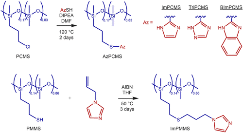
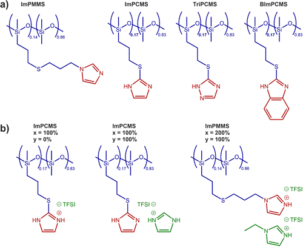
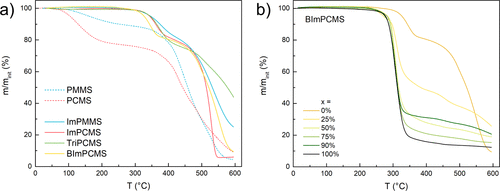
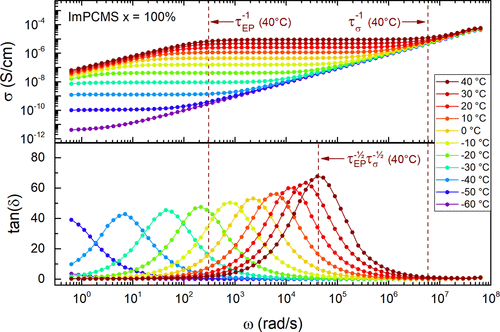
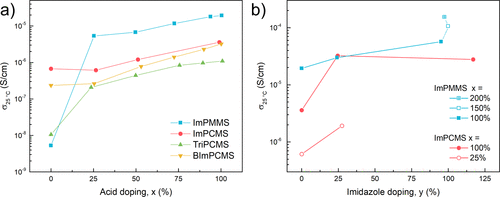
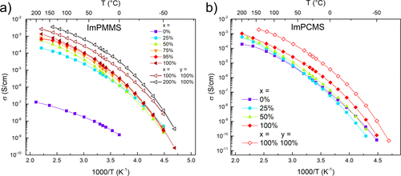
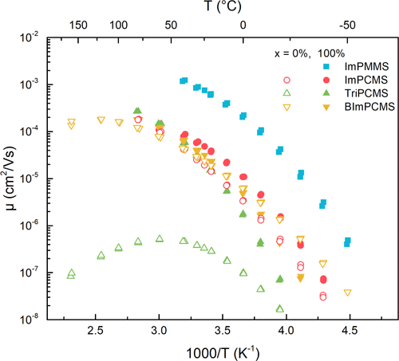
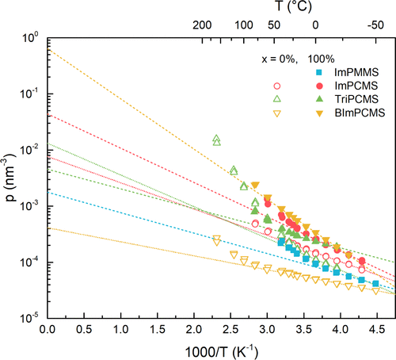

## Highly Conductive Nonstoichiometric Protic Poly(ionic liquid) Electrolytes 高导电非化学计量质子型聚离子液体电解质

> Christoffer Karlsson, Patric Jannasch
> ACS Applied Energy Materials  
> DOI: [10.1021/acsaem.9b01280](https://doi.org/10.1021/acsaem.9b01280)
> Keywords: nonstoichiometric protic ionic liquid, proton conducting polymer electrolyte, poly(dimethylsiloxane), imidazole, 1,2,4-triazole

### 1. Introduction
Polymerization of ionic liquids can provide dry (solvent-free) polyelectrolytes with high fluidity at room temperature due to their low glass transition temperature (Tg).(1−3) For this reason, these so-called poly(ionic liquids) can exhibit high ionic conductivity at room temperature that can be almost as high as the corresponding monomer ionic liquids, provided that the ionic groups are linked to the main chain with sufficiently long and flexible spacer units.(1−3) Dry polyelectrolytes are inherently safer than solvent-containing electrolytes that can leak and cause fire.(1−3) Moreover they have superior mechanical properties and can significantly reduce the size of electrochemical devices.(3) The synthesis of poly(ionic liquids) is also comparatively inexpensive and straightforward and allows for significant tuning of material properties.(1,2) Nevertheless, achieving sufficient conductivity for room-temperature applications such as batteries, supercapacitors, and solar cells has been a challenge even for the most flexible poly(ionic liquids).(1−3) In protic electrochemical applications such as fuel cells and proton batteries, protic electrolytes must be used.(4−8) Many protic poly(ionic liquids) have been studied previously, but not as extensively as the aprotic variants.(8−14)  
离子液体的聚合由于其低的玻璃化转变温度（Tg）而可以在室温下提供干燥性高（无溶剂）的聚电解质。（1-3）因此，这些所谓的聚离子液体可以表现出如果离子基团通过足够长且灵活的间隔单元连接到主链上，则在室温下具有很高的离子电导率，几乎可以与相应的单体离子液体一样高。（1-3）干式聚电解质本质上比溶剂安全（1-3）此外，它们还具有优越的机械性能，可以显着减小电化学装置的尺寸。（3）聚离子液体的合成也相对便宜，简单，并且允许（1,2）尽管如此，仍能为室温应用（例如电池，超级电容器和太阳能电池）提供足够的电导率即使对于最柔软的聚离子液体，这也是一个挑战。（1-3）在质子电化学应用中，例如燃料电池和质子电池，必须使用质子电解质。（4-8）许多质子聚离子液体先前已经研究过，但没有像非质子变体那样广泛。（8-14）

So-called nonstoichiometric protic ionic liquids are protic ionic liquids containing a less than stoichiometric amount of acid relative to base, leading to residual free base in the ionic liquid.(7,8) Therefore, there are both proton donors and acceptors present in the form of the conjugate acid/base pair, with a well-controlled proton activity determined by the pKa.(7,15) Recently the benefits of nonstoichiometric protic ionic liquid electrolytes have been increasingly discussed due to the importance of the presence of proton acceptors in many applications.(5,7,12,16) For example, it was recently shown that pure protic ionic liquids cannot be used as fuel cell electrolytes without the addition of proton shuttles in the form of the conjugate base.(5) Nonstoichiometric protic ionic liquids have also yielded superior performance as electrolytes in carbon supercapacitors(8,16) and proton batteries(7,17) compared to their stoichiometric counterparts. We have recently demonstrated the advantages of some triazolium nonstoichiometric protic ionic liquid electrolytes for the all-organic proton battery.(7) Not only does the presence of the conjugate acid/base pair lead to minimal energy losses between the oxidation and reduction reactions in a range of electrochemical devices,(5,7,8,15,16) but it also gives the ability to tune the potentials of those reactions through the choice of pKa.(6,7) For instance, the pKa of aromatic heterocyclic cations can be chosen within a wide range of values with appropriate substitution pattern,(6,18) prompting several investigations into nonstoichiometric protic ionic liquids with azole bases including imidazole(19−21) and triazole.(7) Nonstoichiometric protic ionic liquids have found use not only in electrochemical applications but also in a broad range of other fields including catalysis,(22,23) gel formation,(24) and pharmaceutical formulations.(8,25) While there have been several studies of azoles immobilized in polymeric structures,(10−14,26−29) only very few have explored acid doping in less than stoichiometric amounts, producing nonstoichiometric equivalents of protic poly(ionic liquids).(12,28,29)  
所谓的非化学计量的质子离子液体是相对于碱而言含有少于化学计量量的酸的质子离子液体，导致离子液体中残留有游离碱。（7,8）因此，质子中既有质子供体又有受体（7,15）由于存在质子受体的重要性，近来人们越来越多地讨论了非化学计量质子离子液体电解质的好处。（5,7,12,16）例如，最近显示，如果不添加以共轭碱形式存在的质子穿梭，纯质子离子液体就不能用作燃料电池电解质。（5）非化学计量质子与化学计量的同类液体相比，离子液体在碳超级电容器（8,16）和质子电池（7,17）中作为电解质也具有优越的性能。我们最近已经证明了某些三唑鎓非化学计量的质子离子液体电解质对于全有机质子电池的优势。（7）共轭酸/碱对的存在不仅使在氧化还原反应中的氧化和还原反应之间的能量损失最小范围内的电化学装置（5,7,8,15,16），但它也可以通过选择pKa来调节那些反应的电势。（6,7）例如，芳香族杂环阳离子的pKa可以（6,18）在广泛的数值范围内进行选择，（6,18）促使对含咪唑（19-21）和三唑的唑类非化学计量的质子离子液体进行了几项研究。（7）非化学计量的质子离子液体没有使用仅在电化学应用中，而且在广泛的其他领域中，包括催化，（22,23）凝胶形成，（24）和药物制剂。（8,25）固定在聚合物结构中（10-14,26-29），只有极少数人探索过少于化学计量的酸掺杂，从而产生了非化学计量的质子性聚离子液体等效物。（12,28,29）

In order to achieve high ionic conductivity of a polymer electrolyte at room temperature, a low Tg is needed to ensure sufficient charge carrier mobility. One promising route toward low-Tg polymer electrolytes is poly(dimethylsiloxane) (PDMS) functionalized with azole side groups, although reports exist of very low Tg (−60 °C) for other polymer backbones as well.(30) The Tg of poly(ionic liquids) is a function of the volume of the structural unit, the flexibility of the polymer chains, and the dielectric constant of the polymer.(31) Hence, the Tg of azole-functionalized PDMS increases drastically with the concentration of incorporated azole groups.(14) Since most previous reports of azole-functionalized PDMS have had high levels of azole functionalization (typically on every monomer unit), they have featured Tg values in the range −20 to +50 °C (cf. −127 °C for unfunctionalized PDMS).(11−13,32) This means that the room-temperature ionic conductivity for this type of polymers is rather low (much lower than 10–5 S/cm at room temperature and, in most cases, lower than 10–6 S/cm even at 60 °C).(11−14,27) Lower Tg has been observed in a few cases, e.g., for an aprotic polymer electrolyte with long, flexible side chains (−62 °C),(33) for low levels of imidazole functionalization (−48 °C),(14) as well as for a combination of the two (−65 to −53 °C).(34)  
为了在室温下实现聚合物电解质的高离子电导率，需要低Tg以确保足够的电荷载流子迁移率。向低Tg聚合物电解质发展的一种有前途的途径是用吡咯侧基官能化的聚（二甲基硅氧烷）（PDMS），尽管也有报道称其他聚合物主链的Tg也很低（-60°C）。（30）聚Tg （离子液体）是结构单元的体积，聚合物链的柔韧性和聚合物介电常数的函数。（31）因此，唑官能化的PDMS的Tg随掺入的唑的浓度而急剧增加（14）由于大多数以前的吡咯官能化PDMS报告均具有高水平的吡咯官能度（通常在每个单体单元上都有），因此它们的Tg值范围为−20至+50°C（参见−127°C C用于未官能化的PDMS）。（11-13,32）这意味着这类聚合物的室温离子电导率相当低（大大低于室温下的10-5 S /cm，在大多数情况下，较低即使在60°C时也超过10–6 S /cm。）（11−14,27）在某些情况下适用，例如，对于具有长而柔软的侧链的非质子聚合物电解质（-62°C），（33）对于低水平的咪唑官能化（-48°C），（14）两者的结合（−65至−53°C）。（34）

Herein we report on protic poly(ionic liquids) based on PDMS backbones and imidazole, 1,2,4-triazole, and benzimidazole groups, respectively, attached via flexible alkyl thioether linkers. The polymers featured rather low degrees of azole functionalization (14–17% of siloxane monomer units) ensuring low Tg. We investigated acid doping levels of up to 100%, thereby forming both stoichiometric and nonstoichiometric protic poly(ionic liquids) that had much higher (up to 3 orders of magnitude) ionic conductivity than the nondoped polymers. The poly(ionic liquids) were also doped with free azole which further increased the conductivity by an order of magnitude. We discuss the influence of chemical structure, doping level, and temperature on the charge transport properties and employ electrode polarization analysis to understand how to achieve high room-temperature conductivity for this kind of poly(ionic liquids).  
在本文中，我们报告了基于PDMS主链和分别通过柔性烷基硫醚连接基连接的咪唑，1,2,4-三唑和苯并咪唑基团的质子性聚（离子液体）。该聚合物具有相当低的唑官能度（占硅氧烷单体单元的14-17％），可确保低Tg。我们研究了高达100％的酸掺杂水平，从而形成了化学计量和非化学计量的质子性聚（离子液体），它们的离子电导率比未掺杂的聚合物高（最多3个数量级）。聚（离子液体）还掺杂有游离唑，其进一步将电导率提高了一个数量级。我们讨论了化学结构，掺杂水平和温度对电荷传输性能的影响，并通过电极极化分析来了解如何为这种聚（离子液体）获得较高的室温电导率。

### 2. Materials and Methods
#### 2.1. Synthesis of Polymer Electrolytes
Polymer electrolytes were synthesized from either poly[(chloropropylmethylsiloxane)-co-(dimethylsiloxane)] (PCMS) or poly[(mercaptopropylmethylsiloxane)-co-(dimethylsiloxane)] (PMMS), both obtained from Gelest (Scheme 1). PCMS had a molar mass of 7500–10000 g/mol, a viscosity of 300–450 cSt, and a degree of functionalization of 14–16% (n/n), as given by the producer. The corresponding values for PMMS were 3000–4000 g/mol, 100–200 cSt, and a degree of functionalization of 13–17% (n/n). The degree of functionalization was also determined by 1H NMR spectroscopy to be 17.0% (n/n) and 13.7% (n/n) for PCMS and PMMS, respectively (see below). The polymers were functionalized with either imidazole (ImPCMS and ImPMMS), 1,2,4-triazole (TriPCMS), or benzimidazole (BImPCMS) side groups that were then doped with bis(trifluoromethane)sulfonimide (HTFSI) and in some cases free imidazole (Scheme 1). All polymer samples were stored in cold and dark conditions and under nitrogen atmosphere.  
由聚[（氯丙基甲基硅氧烷）-共-（二甲基硅氧烷）]（PCMS）或聚[（巯基丙基甲基硅氧烷）-共-（二甲基硅氧烷）]（PMMS）合成聚合物电解质，两者均从Gelest获得（方案1）。 PCMS的摩尔质量为7500-10000 g /mol，粘度为300-450 cSt，功能化程度为14-16％（n /n），这是由生产商提供的。 PMMS的相应值为3000-4000 g /mol，100-200 cSt，官能度为13-17％（n /n）。还通过1 H NMR光谱测定的官能度对于PCMS和PMMS分别为17.0％（n /n）和13.7％（n /n）（请参见下文）。用咪唑（ImPCMS和ImPMMS），1,2,4-三唑（TriPCMS）或苯并咪唑（BImPCMS）侧基官能化该聚合物，然后再用双（三氟甲烷）磺酰亚胺（HTFSI）掺杂，有时还掺入游离咪唑（方案1）。所有聚合物样品均在寒冷和黑暗的条件下并在氮气氛下保存。

  
Scheme 1. Synthesis of the Azole-Functionalized Polymers ImPCMS, TriPCMS, BImPCMS, and ImPMMS  The azole units are highlighted in red.  
方案1.合成了腈功能的聚合物ImPCMS，TriPCMS，BImPCMS和ImPMMS
唑单元以红色突出显示。  

##### 2.1.1. ImPCMS Synthesis
2-Mercaptoimidazole (98%, ABCR; 2.007 g, 20.0 mmol) and PCMS (Gelest; 5.062 g, 10.2 mmol chloropropyl units) were dissolved in N,N-dimethylformamide (DMF; 50 mL) in a round-bottom flask equipped with a reflux condenser, and N,N-diisopropylethylamine (DIPEA; >99%, Sigma-Aldrich; 3.5 mL, 20 mmol) was then added. The brown solution was stirred under nitrogen atmosphere at 120 °C for 48 h and turned orange over the course of the reaction. After cooling to room temperature (r.t.), the reaction mixture was added dropwise to acetonitrile (300 mL) and then centrifuged, yielding an orange oil and a yellow supernatant. The oil was washed with acetonitrile (3 × 50 mL), dissolved in chloroform, and transferred to a dark vial. The solvent was evaporated under reduced pressure, yielding ImPCMS as an orange oil (1.337 g, 23% yield). NMR (CDCl3; ppm): δH = 7.11 (2H, m, Im-H), 3.01 (2H, m, H3), 1.66 (2H, m, H2), 0.60 (2H, m, H1), 0.07 (40H, m, SiCH3); δC = 140.4 (Im-C2), 123.9 (Im-C4,5), 38.2 (C3), 23.9 (C2), 16.9 (C1), 1.2 (SiCH3).  
将2-巯基咪唑（98％，ABCR; 2.007 g，20.0 mmol）和PCMS（Gelest; 5.062 g，10.2 mmol氯丙基单元）溶解在装有以下试剂的圆底烧瓶中的N，N-二甲基甲酰胺（DMF; 50 mL）中在回流冷凝器中，然后加入N，N-二异丙基乙胺（DIPEA；> 99％，Sigma-Aldrich； 3.5mL，20mmol）。将棕色溶液在氮气气氛下在120℃下搅拌48小时，并在反应过程中变为橙色。冷却至室温（室温）后，将反应混合物滴加到乙腈（300mL）中，然后离心，得到橙色油和黄色上清液。将该油用乙腈（3×50mL）洗涤，溶解在氯仿中，并转移至深色小瓶中。减压蒸发溶剂，得到ImPCMS，为橙色油状物（1.337g，23％产率）。 NMR（CDCl3; ppm）：δH= 7.11（2H，m，Im-H），3.01（2H，m，H3），1.66（2H，m，H2），0.60（2H，m，H1），0.07（40H ，m，SiCH3）; δC= 140.4（Im-C2），123.9（Im-C4,5），38.2（C3），23.9（C2），16.9（C1），1.2（SiCH3）。

##### 2.1.2. TriPCMS Synthesis
TriPCMS was synthesized following the same procedure as that described for ImPCMS, from a solution of 3-mercapto-1,2,4-triazole (>97%, Fluka; 2.018 g, 20.0 mmol), PCMS (5.014 g, 10.1 mmol), and DIPEA (3.5 mL, 20 mmol) in DMF (50 mL). The reaction mixture was a brown solution that darkened over the course of the reaction. The product was obtained as a brown oil (2.398 g, 42% yield). NMR (CDCl3; ppm): δH = 8.33 (1H, m, Tri-H), 3.18 (2H, m, H3), 1.77 (2H, m, H2), 0.65 (2H, m, H1), 0.07 (60H, m, SiCH3); δC = 156.9 (Tri-C5), 147.9 (Tri-C3), 36.0 (C3), 23.7 (C2), 17.0 (C1), 1.2 (SiCH3).  
按照与ImPCMS相同的步骤，从3-巯基1,2,4-三唑（> 97％，Fluka； 2.018 g，20.0 mmol），PCMS（5.014 g，10.1 mmol）的溶液合成TriPCMS ，和DIPEA（3.5 mL，20 mmol）的DMF（50 mL）溶液。反应混合物是棕色溶液，其在反应过程中变黑。获得为棕色油的产物（2.398g，42％产率）。 NMR（CDCl3; ppm）：δH= 8.33（1H，m，Tri-H），3.18（2H，m，H3），1.77（2H，m，H2），0.65（2H，m，H1），0.07（60H ，m，SiCH3）; δC= 156.9（Tri-C5），147.9（Tri-C3），36.0（C3），23.7（C2），17.0（C1），1.2（SiCH3）。

##### 2.1.3. BImPCMS Synthesis
BImPCMS was synthesized following the same procedure as that described for ImPCMS but with a reaction time of 4 days, from a solution of 2-mercaptobenzimidazole (98%, Sigma-Aldrich; 3.061 g, 20.4 mmol), PCMS (4.964 g, 10.0 mmol), and DIPEA (3.5 mL, 20 mmol) in DMF (50 mL). The reaction mixture turned from green to yellow to brown over the course of the reaction. The product was obtained as a brown oil (2.494 g, 41% yield). NMR (CDCl3; ppm): δH = 7.49 (2H, m, BIm-H4,7), 7.17 (2H, m, BIm-H5,6), 3.34 (2H, m, H3), 1.80 (2H, m, H2), 0.64 (2H, m, H1), 0.07 (40H, m, SiCH3); δC = 151.2 (BIm-C2), 139.0 (BIm-C4,7), 122.3 (BIm-C5,6), 114.1 (BIm-C3a,7a), 36.0 (C3), 23.6 (C2), 17.0 (C1), 1.2 (SiCH3).  
按照与针对ImPCMS所述相同的步骤合成BImPCMS，但反应时间为4天，由2-巯基苯并咪唑（98％，Sigma-Aldrich; 3.061 g，20.4 mmol），PCMS（4.964 g，10.0 mmol）溶液合成）和DIPEA（3.5 mL，20 mmol）的DMF（50 mL）溶液。在反应过程中，反应混合物从绿色变为黄色至棕色。获得为棕色油的产物（2.494g，41％产率）。 NMR（CDCl3; ppm）：δH= 7.49（2H，m，BIm-H4,7），7.17（2H，m，BIm-H5,6），3.34（2H，m，H3），1.80（2H，m， H2），0.64（2H，m，H1），0.07（40H，m，SiCH3）； δC= 151.2（BIm-C2），139.0（BIm-C4,7），122.3（BIm-C5,6），114.1（BIm-C3a，7a），36.0（C3），23.6（C2），17.0（C1） 1.2（SiCH3）。

##### 2.1.4. ImPMMS Synthesis
1-Allylimidazole (>97%, TCI Chemicals; 1.980 g, 18.3 mmol), PMMS (Gelest; 5.510 g, 9.2 mmol mercaptopropyl units), and 2,2-azobis(2-methylpropionitrile) (>98%, Sigma-Aldrich; 155 mg, 0.94 mmol) were dissolved in dry, stabilizer-free tetrahydrofuran (50 mL) in a round-bottom flask equipped with a reflux condenser. The pale yellow solution was stirred under nitrogen atmosphere at 50 °C for 3 days without any color change. After cooling to r.t., the reaction mixture was added dropwise to acetonitrile (300 mL) and then centrifuged, yielding a colorless oil and a pale yellow supernatant. The oil was washed with acetonitrile (3 × 50 mL), dissolved in chloroform, and transferred to a dark vial. The solvent was evaporated under reduced pressure, yielding ImPMMS as a colorless oil (2.481 g, 38% yield). NMR (CDCl3; ppm): δH = 7.48 (1H, m, Im-H2), 7.05 (1H, m, Im-H4), 6.91 (1H, m, Im-H5), 4.07 (2H, m, H7), 2.49 (2H, m, H3), 2.44 (2H, m, H5), 2.02 (2H, m, H6), 1.61 (2H, m, H2), 0.62 (2H, m, H1), 0.07 (57H, m, SiCH3); δC = 137.3 (Im-C2), 129.7 (Im-C4), 118.9 (Im-C5), 45.3 (C7), 35.6 (C3), 30.6 (C6), 28.6 (C5), 23.5 (C2), 17.2 (C1), 1.2 (SiCH3).  
1-Allylimidazole（> 97％，TCI Chemicals; 1.980 g，18.3 mmol），PMMS（Gelest; 5.510 g，9.2 mmol巯基丙基单元）和2,2-偶氮双（2-甲基丙腈）（> 98％，Sigma-Aldrich ；在装有回流冷凝器的圆底烧瓶中，将155mg，0.94mmol）溶解在干燥的无稳定剂的四氢呋喃（50mL）中。将浅黄色溶液在氮气气氛下于50℃搅拌3天，而没有任何颜色变化。冷却至室温后，将反应混合物滴加至乙腈（300mL）中，然后离心，得到无色油状物和浅黄色上清液。将该油用乙腈（3×50mL）洗涤，溶解在氯仿中，并转移至深色小瓶中。减压蒸发溶剂，得到ImPMMS，为无色油状物（2.481g，38％收率）。 NMR（CDCl3; ppm）：δH= 7.48（1H，m，Im-H2），7.05（1H，m，Im-H4），6.91（1H，m，Im-H5），4.07（2H，m，H7） ，2.49（2H，m，H3），2.44（2H，m，H5），2.02（2H，m，H6），1.61（2H，m，H2），0.62（2H，m，H1），0.07（57H， m，SiCH 3）； δC= 137.3（Im-C2），129.7（Im-C4），118.9（Im-C5），45.3（C7），35.6（C3），30.6（C6），28.6（C5），23.5（C2），17.2（ C1），1.2（SiCH3）。

##### 2.1.5. Acid and Imidazole Doping
The azole content of the polymers was determined by NMR spectroscopy using sublimed p-benzoquinone as an internal standard, ensuring a delay time of at least 5T1. Appropriate amounts of HTFSI (>99%, TCI Chemicals) and the respective polymer totaling approximately 300 mg were each dissolved in dichloromethane (1 and 5 mL, respectively) under nitrogen atmosphere. The solutions were mixed and stirred under nitrogen atmosphere for 1 h, and the solvent was then evaporated under reduced pressure. The products were obtained as viscous oils.  
使用升华对苯醌作为内标，通过NMR光谱法确定聚合物的唑含量，确保延迟时间至少为5T1。在氮气气氛下，将适当量的HTFSI（＞ 99％，TCI Chemicals）和总计约300mg的各聚合物分别溶解在二氯甲烷（分别为1mL和5mL）中。将溶液混合并在氮气氛下搅拌1h，然后在减压下蒸发溶剂。获得的产物为粘性油。

Polymer electrolyte samples doped with both acid and free imidazole were prepared according to the same general procedure as described above. To ImPCMS samples, imidazole was added before mixing with HTFSI, and N-ethylimidazole was added to ImPMMS samples. The products were obtained as viscous oils.  
根据与上述相同的一般程序制备同时掺杂有酸和游离咪唑的聚合物电解质样品。向ImPCMS样品中加入咪唑，然后再与HTFSI混合，然后将N-乙基咪唑添加到ImPMMS样品中。获得的产物为粘性油。

#### 2.2. Characterization of Polymer Electrolytes
##### 2.2.1. NMR Spectroscopy
Azole-functionalized polymers were characterized by 1H and 13C NMR spectroscopy on a Bruker 400 MHz NMR spectrometer, as well as with COSY, HMQC, and HMBC spectroscopy to assign all signals. Acid doped polymers were characterized by 1H and 19F NMR spectroscopy. The residual solvent signal was used as a reference for 1H and 13C chemical shifts (CDCl3, δH = 7.26 ppm and δC = 77.16 ppm; (CD3)2SO, δH = 2.50 ppm), and Ξ referencing was used for 19F chemical shifts.(35)T1 relaxation times were determined using an inversion–recovery method on a Bruker 500 MHz NMR spectrometer.  
通过在Bruker 400 MHz NMR光谱仪上的1H和13C NMR光谱，以及用COSY，HMQC和HMBC光谱对所有的信号进行表征，对偶氮官能化的聚合物进行了表征。酸掺杂的聚合物通过1 H和19 F NMR光谱表征。残留溶剂信号用作1H和13C化学位移的参考（CDCl3，δH= 7.26 ppm和δC= 77.16 ppm;（CD3）2SO，δH= 2.50 ppm），Ξ参考值用于19F化学位移。（ 35）T1弛豫时间是在布鲁克500 MHz NMR光谱仪上使用反演-恢复方法确定的。

##### 2.2.2. Thermal Analysis
Thermogravimetric analysis (TGA) and differential scanning calorimetry (DSC) were performed on a TGA Q500 and a DSC Q2000 equipment (TA Instruments), respectively, with a heating/cooling rate of 10 °C/min and under nitrogen atmosphere unless otherwise specified. DSC was performed from 20 °C, cooling to −75 °C, and then heating to below the thermal decomposition temperature as evaluated by TGA (Td,95%).  
除非另有说明，否则分别在TGA Q500和DSC Q2000设备（TA Instruments）上以10°C /min的加热/冷却速率在氮气气氛下进行热重分析（TGA）和差示扫描量热（DSC）。从20℃进行DSC，冷却至-75℃，然后加热至低于热分解温度，如通过TGA评估的那样（Td，95％）。

##### 2.2.3. Electrochemical Characterization
Electrochemical impedance spectroscopy (EIS) was performed on a Novocontrol high-resolution dielectric analyzer V1.01S using a two-probe setup in the frequency range 10–1–107 Hz with an amplitude of 50 mV. Stainless steel disc electrodes sandwiched the polymer samples with a Teflon ring spacer (250 μm thickness, 10 mm inner diameter). Impedance was measured while heating the sample to below Td,95%, followed by cooling to −60 °C, and finally heating again to below Td,95%. The ionic conductivity (σ) was taken as the average value of the absolute conductivity plateau at intermediate frequencies. After the EIS experiment, the electronic conductivity (σe) was measured by subjecting the cell to chronoamperometry with a 50 mV constant potential for up to 60 s, which reveals a maximum limit for σe. The electrochemical stability potential window was then determined as the cell potential at 15 μA/cm2 current density in a cyclic voltammetry experiment (0.1 V/s scan rate, 0.0–2.0 V cell potential).(36)  
电化学阻抗谱（EIS）在Novocontrol高分辨率介电分析仪V1.01S上进行，使用双探针设置，频率范围为10–1–107 Hz，幅度为50 mV。不锈钢圆盘电极将聚合物样品夹在聚四氟乙烯环垫片上（厚度为250μm，内径为10 mm）。在将样品加热到低于Td，95％，然后冷却至-60°C，最后再次加热到低于Td，95％的同时测量阻抗。将离子电导率（σ）作为中频处的绝对电导率平稳期的平均值。在EIS实验之后，通过以50 mV恒定电势对电池进行计时电流分析法测量电池电导率（σe）长达60 s，这揭示了σe的最大极限。然后，在循环伏安法实验（0.1 V/s扫描速率，0.0–2.0 V电池电势）中，将电化学稳定性电势窗口确定为电流密度为15μA/cm2时的电池电势。（36）

### 3. Results and Discussion
The properties of the polymer electrolytes were investigated as a function of chemical structure (Scheme 2a) as well as the amount of dopants added. HTFSI was chosen as acid dopant due to its strong acidity and plasticizing properties.(3,37) It has previously been successfully employed in low molecular imidazolium, 1,2,4-triazolium, and benzimidazolium nonstoichiometric protic ionic liquids.(7,19,20) The amount of acid doping (x) was chosen to protonate a fraction of the polymeric azole units and is therefore given throughout this work as: $x= \frac{n_{HTFSI}}{n_{polymeric \ azole}}$  
研究了聚合物电解质的性质与化学结构的关系（方案2a）以及所添加的掺杂剂的数量。由于HTFSI具有强酸性和可塑特性，因此被选作酸掺杂剂。（3,37）先前已成功地将其用于低分子咪唑鎓，1,2,4-三唑鎓和苯并咪唑非化学计量的质子离子液体。（7,19 ，20）选择酸掺杂量（x）来质子化一部分聚合的唑单元，因此在整个工作中给出如下：$x= \frac{n_{HTFSI}}{n_{polymeric \ azole}}$

so that, e.g., x = 100% corresponds to all polymeric azole units being protonated (Scheme 2b). The azole content npolymeric azole/mpolymer was determined by NMR spectroscopy as described above. Since the pKa of HTFSI is very low compared to the azoles, the proton transfer can be assumed to be complete.(7,37,38) Acid doping of x = 25–100% was performed to form either stoichiometric or substoichiometric compositions of the poly(ionic liquids) (Scheme 2b). There is thus never free HTFSI acid present in the systems, which is beneficial for the stability of PDMS and also ensures that the proton activity of the electrolyte is determined by the pKa of the azole, not the pKa of HTFSI. ImPCMS and ImPMMS were also doped with imidazole in order to increase the conductivity further through the introduction of mobile imidazolium units to the system. For ImPMMS, with its N-alkylated imidazole units on the polymer chain, N-ethylimidazole was chosen as the imidazole dopant so as to be similar to the polymeric imidazole units. ImPCMS, which has free NH protons on the polymeric imidazole units, was instead doped with unsubstituted imidazole (Scheme 2b). The amount of imidazole doping (y) is also given in relation to the polymeric imidazole units:  
因此，例如x = 100％对应于所有聚合物质子化的质子化单元（方案2b）。如上所述，通过NMR光谱法测定吡咯含量的非聚合唑/共聚物。由于HTFSI的pKa与唑类相比非常低，因此可以认为质子转移已经完成。（7,37,38）进行x = 25–100％的酸掺杂以形成该化合物的化学计量或亚化学计量组成。聚（离子液体）（方案2b）。因此，系统中永远不会存在游离的HTFSI酸，这对PDMS的稳定性是有益的，并且还确保了电解质的质子活性是由吡咯的pKa而不是HTFSI的pKa决定的。 ImPCMS和ImPMMS也掺有咪唑，以便通过向系统中引入可移动的咪唑单元进一步提高电导率。对于ImPMMS，在聚合物链上具有N-烷基化的咪唑单元时，选择N-乙基咪唑作为咪唑掺杂剂，使其与聚合的咪唑单元相似。 ImPCMS在聚合的咪唑单元上具有游离的NH质子，取而代之的是掺​​杂未取代的咪唑（方案2b）。咪唑掺杂量（y）也与聚合的咪唑单元有关：$\gamma = \frac{n_{dopant \ imidazole}}{n_{polymeric azole}}$

  
Scheme 2. Structure of (a) Nondoped Polymers and (b) Examples of Acid and Imidazole Doped Compositions  
方案2.（a）未掺杂的聚合物和（b）酸和咪唑掺杂的组合物的实例的结构

x and y are the added amounts of dopant HTFSI and imidazole, respectively, as fractions of the polymeric azole units (eqs 1 and 2). Polymeric azole units are shown in red and dopant species in green.  
x和y分别是掺杂剂HTFSI和咪唑的添加量，作为聚合的唑单元（式1和2）的分数。聚合的唑单元以红色显示，掺杂物种类以绿色显示。

ImPCMS and ImPMMS were doped to either y = 25 or 100%, in addition to acid doping of x = 25–200% (Scheme 2b). For example, the case of x = 200%, y = 100% corresponds to all polymeric and free imidazole units being protonated. Unless otherwise stated, however, y = 0%. Corresponding azole doping of TriPCMS and BImPCMS was not attempted in the present study. There will be an equilibrium between protonation of polymeric and free imidazole which is determined by the respective pKa values as discussed below.  
除了x = 25–200％的酸掺杂外，还对ImPCMS和ImPMMS进行了y = 25或100％的掺杂（方案2b）。例如，x = 200％，y = 100％的情况对应于所有质子化的聚合和游离咪唑单元。但是，除非另有说明，否则y = 0％。在本研究中未尝试对TriPCMS和BImPCMS进行相应的唑掺杂。聚合的和游离的咪唑的质子化之间将存在一个平衡，该平衡由如下所述的各个pKa值确定。

#### 3.1. NMR Spectroscopy
1H NMR spectra of the commercial PDMS starting materials revealed no impurities, and the integral of the SiCH3 signals relative to SiCH2 were used to calculate the degrees of functionalization for PCMS and PMMS, which were close to the values stated by the supplier. 1H, 13C, HMQC, and HMBC NMR spectroscopy after functionalization confirmed the incorporation of azole side groups, through the new aromatic signals in the correct integral ratios, with heteronuclear through-bond correlations to the alkyl spacer signals (Supporting Information Figures S1 and S2). Acid doping of the polymers did not change the NMR spectra appreciably, except for the appearance of a single 19F signal at −78.7 ppm originating from the TFSI anion, and the 1H and 19F chemical shifts were relatively constant with the degree of acid doping (Figure S3). Addition of free imidazole rendered the samples poorly soluble in most solvents, so they were not analyzed by NMR spectroscopy.  
商业PDMS起始原料的1 H NMR谱图显示没有杂质，并且使用SiCH3信号相对于SiCH2的积分来计算PCMS和PMMS的官能度，这接近于供应商规定的值。功能化后的1H，13C，HMQC和HMBC NMR光谱证实，通过新的芳香族信号以正确的积分比结合了烷基侧基信号与异核键的相关关系，从而引入了唑侧基（支持图S1和S2）。聚合物的酸掺杂不会显着改变NMR光谱，只是在TFSI阴离子的-78.7 ppm处出现单个19F信号出现，并且1H和19F化学位移随酸掺杂程度相对恒定（图S3）。游离咪唑的添加使样品在大多数溶剂中的溶解性较差，因此未通过NMR光谱进行分析。

#### 3.2. Thermal Analysis
Azole functionalization increased the thermal stability under N2 of PCMS and PMMS from Td,95% = 104 and 161 °C, respectively, to 326–346 °C (Figure 1a), possibly due to the replacement of the labile (reactive) chloride and thiol groups with more stable aromatic azole rings, and the thermal stability under air was only slightly lower (Figure S4). Acid doping and imidazole doping decreased the thermal stability somewhat (Figure 1b for BImPCMS, and Figure S5 for other polymers) since a low molecular weight and reactive (catalytic) component was added, although it was still superior to the nonfunctionalized polymers in all cases (Figure S6; Td,95% > 200 °C).  
腈功能化将PCMS和PMMS在N2下的热稳定性从Td，95％= 104和161°C分别提高到326–346°C（图1a），这可能是由于不稳定的（反应性）氯化物和硫醇基团具有更稳定的芳香唑环，并且在空气中的热稳定性仅略低（图S4）。酸掺杂和咪唑掺杂在某种程度上降低了热稳定性（BImPCMS为图1b，其他聚合物为图S5），因为添加了低分子量和反应性（催化）组分，尽管在所有情况下它仍优于非官能化聚合物（图S6; Td，95％> 200°C）。

  
Figure 1. (a) TGA traces of polymers before (dashed curves) and after (solid curves) azole functionalization (nondoped). (b) TGA traces of BImPCMS with varying degree of acid doping (y = 0%).  
图1.（a）吡咯官能化之前（虚线）和之后（实线）的聚合物的TGA曲线。（b）不同酸掺杂程度（y = 0％）的BImPCMS的TGA痕迹。

No phase transitions could be detected by DSC (DSC traces for x = 0 and 100% can be found in Figure S7; other compositions not shown), indicating that the Tg for all samples was below approximately −50 °C, which is the lower limit of measurement for our instrument setup. Vogel temperatures obtained by fitting conductivity to the VFT equation were in the range −145 to −105 °C, inferring Tg values of −95 to −55 °C. Hence, the azole functionalization and doping only raised the Tg of PDMS (−127 °C32) slightly. Highly flexible polymer electrolytes were thus obtained, which is a requirement for high conductivity at room temperature.  
DSC无法检测到相变（在图S7中x = 0和100％的DSC曲线；未显示其他组成），表明所有样品的Tg均低于-50°C，这是较低的我们的仪器设置的测量极限。通过将电导率拟合到VFT方程获得的Vogel温度在-145至-105°C的范围内，从而得出Tg值为-95至-55°C。因此，唑官能化和掺杂只会稍微提高PDMS的Tg（-127°C32）。因此获得了高度柔性的聚合物电解质，这是在室温下高电导率的要求。

#### 3.3. Electrochemical Characterization
All acid doped polymer electrolytes featured negligible electronic conductivity (<6.0 × 10–9 S/cm at room temperature; Figure S8), and electrochemical potential stability windows above 2.0 V, using stainless steel electrodes (Figure S9), while the electrochemical stability decreased with imidazole doping (1.5–1.8 V). It should however be noted that these values were obtained with stainless steel electrodes and that the electrochemical stability is expected to be much higher with less catalyzing electrode materials such as carbon.(8,36)  
所有使用酸掺杂的聚合物电解质的电子电导率均可以忽略不计（室温下<6.0×10–9 S /cm；图S8），并且使用不锈钢电极时电化学势稳定性窗口高于2.0 V（图S9），而电化学稳定性却下降了咪唑掺杂（1.5–1.8 V）。然而，应该指出的是，这些值是使用不锈钢电极获得的，并且预期在使用较少催化电极材料（例如碳）的情况下，电化学稳定性会更高。（8,36）

##### 3.3.1. Electrochemical Impedance Spectroscopy
EIS featured a conductivity plateau at intermediate frequencies, which was interpreted as the DC ionic conductivity (Figure 2), with minimal differences between the cooling and heating sweeps. Since high room-temperature conductivity is sought after, it is interesting to compare how this varies between the different polymers (Figure 3a). All PCMS polymers had rather similar room-temperature conductivity in the acid doped state (2.0 × 10–7 to 3.6 × 10–6 S/cm), increasing slightly in the order TriPCMS < BImPCMS < ImPCMS, while ImPMMS had an order of magnitude higher conductivity (5.3 × 10–6 to 1.9 × 10–5 S/cm). The conductivity increased with the amount of acid doping for all samples due to the introduction of more charge carriers, i.e., mobile protons as well as anions. For ImPMMS and TriPCMS, the conductivity was much lower in the nondoped state and was drastically increased by adding a small amount of acid (by factors of 1000 and 20, respectively, going from 0 to 25%). Conversely, ImPCMS and BImPCMS did not exhibit a significant increase in this doping interval. Nondoped ImPMMS nominally does not have any mobile protons, since the imidazole side groups are attached on a nitrogen (Scheme 2), hence its very low conductivity. Introduction of acid thus has large impact on the number of charge carriers. The PCMS polymers on the other hand already have mobile protons in the nondoped state, and addition of a small amount of acid will thus not influence the number of charge carriers as much, and its effect on conductivity could even be counteracted by an increase in viscosity. We attribute the low conductivity of nondoped TriPCMS—and the large increase upon doping—to the additional basic nitrogen of triazole that can hold the mobile proton more strongly in the hydrogen bond network of nondoped TriPCMS, decreasing its mobility. Electrode polarization analysis, as described below, gave further evidence for this interpretation.  
EIS在中频处具有电导率平稳期，这被解释为DC离子电导率（图2），在冷却和加热扫描之间的差异最小。由于追求高的室温电导率，因此比较不同聚合物之间的电导率变化是很有趣的（图3a）。所有PCMS聚合物在酸掺杂状态下的室温电导率都非常相似（2.0×10–7至3.6×10–6 S /cm），以TriPCMS < BImPCMS < ImPCMS的顺序略有增加，而ImPMMS具有一个数量级。更高的电导率（5.3×10-6至1.9×10-5 S /cm）。由于引入了更多的电荷载体，即移动质子和阴离子，所有样品的电导率随酸掺杂量的增加而增加。对于ImPMMS和TriPCMS，在非掺杂状态下电导率要低得多，而通过添加少量的酸（分别为1000和20的系数，从0到25％），电导率会急剧增加。相反，ImPCMS和BImPCMS在该掺杂间隔中并未表现出明显的增加。未掺杂的ImPMMS标称没有任何移动质子，因为咪唑侧基连接在氮上（方案2），因此其电导率非常低。因此，酸的引入对电荷载流子的数量有很大的影响。另一方面，PCMS聚合物已经具有处于非掺杂状态的移动质子，因此添加少量酸将不会对电荷载流子的数量产生太大影响，并且其对电导率的影响甚至可以通过增加粘度来抵消。 。我们将非掺杂TriPCMS的低电导率以及掺杂时的大量增加归因于三唑的额外碱性氮，该氮可以使移动质子更牢固地保持在非掺杂TriPCMS的氢键网络中，从而降低其迁移率。如下所述，电极极化分析为这种解释提供了进一步的证据。

  
Figure 2. Conductivity (top) and loss tangent (bottom) vs angular frequency for ImPCMS doped with HTFSI (x = 100%, y = 0%) at temperatures varying from 40 °C (dark red) to −60 °C (purple) during the cooling sweep. τσ–1 and τEP–1 at 40 °C are marked by dashed lines, defining the limiting time scales for the observed plateau in conductivity and electrode polarization, respectively, as well as the geometric mean coinciding with the loss tangent peak.  
图2.在40°C（深红色）至-60°C（紫色）的温度范围内，掺有HTFSI的ImPCMS的电导率（顶部）和损耗角正切（底部）与角频率的关系（x = 100％，y = 0％） ）在冷却扫掠期间。虚线标记了在40°C时的τσ-1和τEP-1，分别定义了电导率和电极极化的观测平台的极限时间标度，以及与损耗正切峰一致的几何平均值。

  
Figure 3. Room temperature conductivity for (a) acid doped polymers (y = 0%) and (b) imidazole doped polymers.  
图3.（a）掺酸聚合物（y = 0％）和（b）咪唑掺杂聚合物的室温电导率。

Doping with imidazole also increased the room-temperature conductivity further (Figure 3b). The addition of a small amount of imidazole to ImPCMS (x = 100%; y = 25%) yielded a large increase in the room-temperature conductivity (3.2 × 10–5 S/cm, nine times the non-imidazole doped state), while additional imidazole doping did not increase the conductivity further. A small amount of imidazole doping of ImPMMS did not produce such a dramatic increase in conductivity, but the conductivity increased with further imidazole doping, as well as with additional acid doping. The highest conductivity was observed for x = 200%, y = 100% (1.5 × 10–4 S/cm, eight times the non-imidazole doped state). Imidazole doping has two main effects on these polymer electrolyte systems. First, the added small molecules can act as solvent to facilitate the movement of the polymer, and N-ethylimidazole (Tm = −27 °C) is likely more efficient in this respect than imidazole (Tm = 90 °C). It is worth noting that all imidazole samples were still viscous oils, however, with no visible phase separation (see photograph in Figure S10). The second effect of imidazole doping is the introduction of charge carriers in the form of small mobile imidazolium cations. For ImPMMS, the pKa will be very similar for the polymeric N-alkylated imidazolium species and for N-ethylimidazole, and the ratio of protonated to nonprotonated species will therefore be very similar for the polymeric and the small molecule imidazole species.(18,21) Hence, there is a mix of small-molecule proton donors and acceptors present, enabling very efficient proton transport, as well as a low barrier for proton transfer between polymeric and small-molecule imidazole. In the case of ImPCMS on the other hand, the polymeric thioether linked imidazolium species are expected to have a lower pKa than the small-molecule imidazole used for doping.(18) Imidazole doping will therefore result in the deprotonation of the polymeric imidazolium species, effectively producing a nonstoichiometric protic ionic liquid in a noncharged polymer matrix (Scheme 2b). This results in a lack of small-molecule proton acceptors, and the barrier for proton transfer to the polymeric imidazole will be high. We believe that these two effects explain the increase in conductivity for the low amount of imidazole doping (y = 25%) and the leveling off at higher imidazole doping for ImPCMS, but the continuing conductivity increase with doping for ImPMMS.  
咪唑掺杂还进一步提高了室温电导率（图3b）。在ImPCMS中添加少量咪唑（x = 100％； y = 25％）可使室温电导率大大提高（3.2×10-5 S /cm，是非咪唑掺杂状态的9倍） ，而额外的咪唑掺杂并没有进一步增加电导率。 ImPMMS的少量咪唑掺杂不会产生如此显着的电导率增加，但随着咪唑掺杂的增加以及其他酸掺杂，电导率会增加。 x = 200％，y = 100％（1.5×10–4 S /cm，是非咪唑掺杂状态的八倍）观察到最高电导率。咪唑掺杂对这些聚合物电解质体系有两个主要影响。首先，添加的小分子可以充当溶剂以促进聚合物的移动，在这方面，N-乙基咪唑（Tm = -27°C）比咪唑（Tm = 90°C）更有效。值得注意的是，所有咪唑样品仍然是粘性油，但是没有可见的相分离（见图S10中的照片）。咪唑掺杂的第二个作用是以小的移动咪唑阳离子形式引入电荷载流子。对于ImPMMS，对于聚合的N-烷基化的咪唑类物质和对于N-乙基的咪唑，pKa值将非常相似，因此，对于高分子的和小分子的咪唑类，质子化与非质子化物质的比率将非常相似。（18,21 ）因此，存在小分子质子供体和受体的混合物，能够非常有效地进行质子传输，并且在聚合物和小分子咪唑之间进行质子转移的障碍很小。另一方面，在ImPCMS的情况下，预计聚合硫醚连接的咪唑类物质的pKa低于用于掺杂的小分子咪唑。（18）咪唑掺杂将导致聚合的咪唑类物质去质子化，在不带电的聚合物基质中有效地产生非化学计量的质子离子液体（方案2b）。这导致缺少小分子质子受体，并且质子转移到聚合物咪唑的障碍将很高。我们相信，这两种效应解释了对于ImPCMS来说，低剂量的咪唑掺杂（y = 25％）会增加电导率，而在更高的咪唑掺杂量下会趋于平稳，但是随着ImPMMS的掺杂，电导率会持续增加。

The conductivity followed VFT behavior with temperature for all samples (Figure 4 for ImPCMS and ImPMMS including some levels of imidazole doping; see Figure S11 for other polymers), according to:  
对于所有样品，电导率随温度随VFT行为变化（ImPCMS和ImPMMS的图4包括一些咪唑掺杂水平；其他聚合物请参见图S11），根据：$\sigma = \sigma _\infty e^{-E^\theta_a / k(T-T^\theta_0)}$

where σ∞ corresponds to the conductivity at infinite temperature, Eaσ is the activation energy for the conductivity, and T0σ is the Vogel temperature for conductivity (see parameters in Figure S12). It is useful to consider how the VFT parameters vary with doping for the different samples, even though, as discussed below, the temperature dependence of the conductivity might be better described by a product of two factors, following Arrhenius and VFT behavior, respectively, due to the separate activation of charge carrier concentration and mobility. At present, however, we are only able to make this distinction for the nondoped samples (x = 0%) and the fully acid doped samples (x = 100%). The activation energy Eaσ was in the range 100–200 meV for all acid doped samples, similar to other azole based polymer electrolytes.(33,39) ImPMMS had slightly lower Eaσ than the PCMS polymers, reflecting its higher side chain flexibility. The relatively higher conductivity of ImPMMS was therefore most pronounced at low temperatures, while at high temperatures the lower flexibility of the side chains of PCMS had less impact. Thus, while the room-temperature conductivity was an order of magnitude higher for ImPMMS compared to the PCMS polymers, the conductivity at 200 °C was similar (e.g., 1.22 and 1.37 mS/cm for BImPCMS and ImPMMS, respectively, both at x = 100%).  
其中σ∞对应于无限温度下的电导率，Eaσ是电导率的活化能，而T0σ是电导率的沃格尔温度（请参见图S12中的参数）。考虑到不同样品的VFT参数如何随掺杂变化是有用的，尽管如下所述，电导率的温度依赖性可能由两个因素的乘积更好地描述，分别是由于Arrhenius和VFT行为，分别激活载流子浓度和迁移率。但是，目前，我们只能对未掺杂样品（x = 0％）和完全酸掺杂样品（x = 100％）进行区分。与其他基于唑的聚合物电解质类似，所有酸掺杂样品的活化能Eaσ在100–200 meV范围内。（33,39）ImPMMS的Eaσ略低于PCMS聚合物，反映出其较高的侧链柔性。因此，ImPMMS相对较高的电导率在低温下最为明显，而在高温下，PCMS侧链的较低挠性影响较小。因此，尽管与PCMS聚合物相比，ImPMMS的室温电导率高一个数量级，但200°C时的电导率却相似（例如，对于xm =，BImPCMS和ImPMMS的电导率分别为1.22和1.37 mS /cm。 100％）。

  
Figure 4. Conductivity of (a) ImPMMS and (b) ImPCMS at varying degrees of acid and imidazole doping (cooling sweep). Nondoped polymers shown in purple squares, acid doped samples in solid symbols (y = 0%), and imidazole doped samples in open symbols.  
图4.（a）ImPMMS和（b）ImPCMS在不同程度的酸和咪唑掺杂（冷却扫描）下的电导率。未掺杂的聚合物以紫色方块显示，酸掺杂的样品以实心符号表示（y = 0％），咪唑掺杂的样品以空心符号表示。

When going from x = 0 to 25%, both σ∞ and Eaσ were increased drastically for all polymers, as the main charge carriers changed from the not very acidic azole NH protons (for the nondoped polymers) to the more acidic azolium NH protons as well as the TFSI anions. For ImPMMS and TriPCMS this led to the observed large increase in conductivity, while these two effects canceled out for ImPCMS and BImPCMS. When the acid doping was increased further, the increase in conductivity for all samples arose from a decrease in Eaσ, while σ∞ remained fairly constant. Furthermore, T0σ increased with x, similarly to what has been observed for imidazolium and triazolium TFSI nonstoichiometric protic ionic liquids previously.(7) This did not affect the conductivity appreciably in the investigated temperature range, however, since T0σ was much lower (−145 to −105 °C). In general, the same trends continued for the imidazole doped samples (Table S2). The increase in conductivity of ImPCMS by a small amount of imidazole doping was attributed to lowering the activation energy, while additional doping increased the activation energy again. For ImPMMS, imidazole doping gave higher conductivity through a combination of decreased activation energy as well as increased σ∞ due to the combination of additional charge carriers as well as plasticization by the imidazole dopant, as discussed above.  
当x从0变为25％时，所有聚合物的σ∞和Eaσ都急剧增加，因为主电荷载流子从不是很酸性的唑NH质子（对于未掺杂的聚合物）变为酸性更大的偶氮NH质子。以及TFSI阴离子。对于ImPMMS和TriPCMS，这导致观察到电导率大幅增加，而ImPCMS和BImPCMS抵消了这两种影响。当酸掺杂进一步增加时，所有样品的电导率增加是由Eaσ的降低引起的，而σ∞则保持相当恒定。此外，T0σ随x增大，类似于之前对咪唑和三唑TFSI非化学计量质子离子液体观察到的结果。（7）在研究的温度范围内，这并未显着影响电导率，但是，由于T0σ更低（-145至-105°C）。通常，对于咪唑掺杂的样品，同样的趋势仍在继续（表S2）。少量咪唑掺杂可提高ImPCMS电导率，这归因于降低了活化能，而额外的掺杂又提高了活化能。对于ImPMMS，如上所述，由于附加电荷载流子的结合以及咪唑掺杂剂的增塑作用，通过降低活化能和增加σ∞的组合，咪唑掺杂提供了更高的电导率。

ImPMMS with x ≥ 75%, as well as all levels of imidazole doped ImPCMS (x = 100%), had room-temperature conductivities exceeding 10–5 S/cm, which makes them interesting as electrolytes in battery cells.(3,40,41) The highest conductivity was observed for ImPMMS at x = 200%, y = 100%, with 0.15 mS/cm at 25 °C and 3.5 mS/cm at 140 °C. Even without low molecular imidazole present, ImPMMS (x = 100%, y = 0%) had a high conductivity of 1.9 × 10–5 S/cm at 25 °C. For comparison, other reported examples of notable protic poly(ionic liquids) with high conductivity are a triazole-functionalized PDMS doped with 75% triflic acid (8 × 10–6 S/cm at 40 °C),(12) imidazole-functionalized PDMS doped with 14% triflic acid (4 × 10–7 S/cm at 40 °C),(12,13) and poly(vinyltriazole) doped with 75% triflic acid (9 × 10–7 S/cm at 30 °C).(10) Also the PCMS electrolytes feature conductivities exceeding those reported values ((3.7–9.7) × 10–6 S/cm at 40 °C, x = 100%), but the extra flexibility of ImPMMS increases the conductivity beyond 10–5 S/cm. Even protic imidazole electrolytes with rather low molecular weight typically feature conductivities below 10–5 S/cm at room temperature.(28) Aprotic azole poly(ionic liquids) with very long side chains, however, have achieved higher conductivities (up to 3 × 10–4 S/cm at 25 °C for an ethyldodecyl imidazolium-functionalized poly(methyl methacrylate)).(3,33,42) Furthermore, a cross-linked aprotic imidazolium-functionalized PDMS recently achieved 1.3 × 10–4 S/cm at 25 °C, which could be increased to 3.6 × 10–4 S/cm by additional doping with ionic liquid.(34)  
x≥75％的ImPMMS以及所有水平的咪唑掺杂的ImPCMS（x = 100％）的室温电导率都超过10-5 S /cm，这使其成为电池中的电解质很有趣。（3,40 ，41）在x = 200％，y = 100％时观察到ImPMMS的最高电导率，在25°C时为0.15 mS /cm，在140°C时为3.5 mS /cm。即使不存在低分子咪唑，ImPMMS（x = 100％，y = 0％）在25°C时仍具有1.9×10-5 S /cm的高电导率。为了进行比较，其他报道的具有高电导率的质子性聚（离子液体）的其他例子是掺有75％三氟甲磺酸（在40°C下为8×10–6 S /cm）的三唑官能化的PDMS，（12）咪唑官能化的PDMS掺杂了14％的三氟甲磺酸（在40°C时为4×10–7 S /cm），（12,13）和聚（乙烯基三唑）掺杂了75％的三氟甲磺酸（在30°C时为9×10–7 S /cm C）。（10）PCMS电解质的电导率也超过了报告的电导率（在40°C下为（3.7–9.7）×10–6 S /cm，x = 100％），但是ImPMMS的额外柔韧性使电导率超过了10-5 S /cm。即使是分子量很低的质子咪唑电解质，其室温下的电导率通​​常也低于10-5 S /cm。（28）侧链很长的非质子唑聚（离子液体）的电导率更高（高达3×乙基十二烷基咪唑官能化的聚甲基丙烯酸甲酯在25°C下为10–4 S /cm。（3,33,42）此外，最近交联的非质子咪唑鎓官能化的PDMS达到1.3×10–4 S /cm 25°C时，可以通过增加离子液体的掺杂而增加至3.6×10–4 S /cm。（34）

The high room-temperature conductivity of the poly(ionic liquids) presented herein in the dry (solvent free) state makes them a good alternative for electrolytes in electrochemical devices that operate at room temperature and in which safety is a high concern. This includes batteries and supercapacitors, which will experience low resistive losses due to the high electrolyte conductivity (>10–5 S/cm). The high-temperature stability as evaluated by TGA also enables high-temperature operation (up to ∼200 °C) in, e.g., fuel cells, with higher conductivities (>10–3 S/cm). Crucially, these protic polyelectrolytes are designed to have a mixed protonation state, i.e., high concentration of both proton donors (acid) and acceptors (base), leading to well-controlled proton activity (analogous to a pH buffered electrolyte). This is especially important in protic electrochemical applications such as proton batteries and fuel cells, for which the electrochemical reactions on both electrodes are heavily influenced by the proton activity, and the local availability of proton donors and acceptors. Thus, the device operation can be optimized by tuning the proton activity through the choice of azole base (imidazole/triazole/benzimidazole) and degree of acid doping (x), while maintaining high conductivity.(7)  
本文提出的处于干燥（无溶剂）状态的聚（离子液体）的高室温电导率使其成为在室温下操作且安全性高的电化学装置中电解质的良好替代品。其中包括电池和超级电容器，由于电解质的电导率高（> 10-5 S /cm），因此其电阻损耗较低。通过TGA评估的高温稳定性还可以在例如电导率更高（> 10-3 S /cm）的燃料电池中进行高温操作（最高约200°C）。至关重要的是，这些质子聚电解质被设计为具有混合的质子化状态，即高浓度的质子供体（酸）和受体（碱），导致质子活性得到良好控制（类似于pH缓冲电解质）。这在质子电化学应用（例如质子电池和燃料电池）中尤为重要，因为质子活性和质子供体和受体的局部可用性会严重影响质子电池和燃料电池等两个电极上的电化学反应。因此，可以通过选择吡咯碱（咪唑/三唑/苯并咪唑）和酸掺杂程度（x）来调节质子活性，从而在保持高电导率的同时优化器件操作。（7）

To take full advantage of the polyelectrolytes (leakage prevention, mechanical support, and size reduction, etc.), they need to form membranes. While all electrolytes presented herein are viscous oils, they could potentially be transformed into membranes, e.g., by cross-linking or by increasing the degree of polymerization. There are several options for cross-linking reactions of the PDMS backbone, such as radical curing with a peroxide initiator, or vinyl cross-linking of any hydrosiloxane main chain units.(34,43) This will likely decrease the conductivity, but earlier work indicates that this effect can be minimized by proper choice of doping level, level of azole functionalization, and sufficiently flexible side chains.(3,11) Doping with ionic liquid (analogous to x = y > 0% in this study) has also been shown to improve the conductivity of cross-linked PDMS electrolytes.(34)  
为了充分利用聚电解质（防止渗漏，机械支撑和减小尺寸等），它们需要形成膜。尽管本文提出的所有电解质都是粘性油，但它们可能例如通过交联或通过增加聚合度而潜在地转变成膜。 PDMS主链的交联反应有多种选择，例如用过氧化物引发剂进行自由基固化，或任何氢硅氧烷主链单元的乙烯基交联。（34,43）这可能会降低电导率，但需要更早的工作。指示可以通过适当选择掺杂水平，吡咯官能度水平和足够灵活的侧链来最大程度地降低这种效应。（3,11）也已经进行了离子液体掺杂（类似于本研究中的x = y> 0％）。可以提高交联的PDMS电解质的电导率。（34）

##### 3.3.2. Electrode Polarization Analysis
Colby et al. have used electrode polarization analysis as a means of separating the conductivity (σ) of single ion conductors into the independent contributions from the concentration (p) and mobility (μ) of the charge carriers:  
Colby et al. have used electrode polarization analysis as a means of separating the conductivity (σ) of single ion conductors into the independent contributions from the concentration (p) and mobility (μ) of the charge carriers: $\theta = p \mu q$

where q is the elemental charge (for monovalent charge carriers).(39,44,45) Note that this only is valid for single ion conductors, i.e., with only one type of charge carrier. The only charge carrier of the nondoped PCMS type polymer electrolytes (x = 0%) are the mobile protons, and they are hence single ion conductors. The fully acid doped samples (x = 100%) are also single ion conductors since they do not contain any proton acceptor sites, thereby immobilizing the protons on the azole side groups, leaving the TFSI anions as the only charge carrier present. Partially acid doped samples (0% < x < 100%) as well as imidazole doped samples (y > 0%) are mixed proton and anion conductors and can thus not be evaluated using the electrode polarization analysis. Below we therefore use electrode polarization analysis to gain additional insight into the conduction mechanisms of nondoped and fully acid doped samples only.  
其中q是元素电荷（对于单价载流子）。（39,44,45）请注意，这仅对单离子导体有效，即仅使用一种类型的载流子。非掺杂PCMS型聚合物电解质（x = 0％）的唯一电荷载体是移动质子，因此它们是单离子导体。完全酸掺杂的样品（x = 100％）也是单离子导体，因为它们不包含任何质子受体位点，从而将质子固定在唑侧基上，从而使TFSI阴离子作为唯一的电荷载体存在。部分酸掺杂的样品（0％< x < 100％）以及咪唑掺杂的样品（y> 0％）是质子和阴离子的混合导体，因此无法使用电极极化分析进行评估。因此，在下文中，我们使用电极极化分析来获得对未掺杂和完全酸掺杂样品的导电机理的更多了解。

The conductivity plateau as measured by EIS is limited by two time scales, τσ and τEP (Figure 2): τσ is the time scale on which the ion motion becomes diffusive, and τEP is the time scale for electrode polarization.(44) τσ is defined by $\tau = = \frac{\epsilon_s \epsilon_0}{\theta}$  
由EIS测量的电导率平台受到两个时间标度τσ和τEP的限制（图2）：τσ是离子运动扩散的时间标度，而τEP是电极极化的时间标度。（44）τσ是被定义为

where εs is the static relative permittivity of the polymer, ε0 is the vacuum permittivity, and σ is the measured DC conductivity of the sample.(44) Similarly, τEP is defined by $\tau = \frac{\epsilon_{EP} \epsilon_0}{\theta}$  
其中εs是聚合物的静态相对介电常数，ε0是真空介电常数，σ是测得的样品的直流电导率。（44）类似地，τEP由下式定义

where εEP is the permittivity after electrode polarization has occurred.(44) τσ and τEP were determined by fitting the loss tangent (tan δ) to the following equation that describes the electrode polarization as a simple Debye relaxation: $tan \delta = \frac{\omega \tau_{EP}}{1 + \omega^2 \tau_\sigma \tau_{EP}}$  
其中εEP是发生电极极化后的介电常数。（44）通过将损耗角正切（tanδ）拟合为以下方程来确定τσ和τEP，该方程将电极极化描述为简单的德拜弛豫：

where ω is the angular frequency.(39) The peak of tan δ will thus occur at ω = τσ–1/2τEP–1/2 (i.e., the geometric mean of the two time scales; see Figure 2). τσ and τEP evaluated in this way are shown in Figure S13 at varying temperature. The mobility can then be calculated through $\mu = \frac{qd^2\tau_\sigma}{4 \tau^2_{EP}kT}$  
（39）tanδ的峰值将出现在ω= τσ–1 /2τEP–1 /2（即两个时标的几何平均值；见图2）处。图S13中显示了在变化的温度下以这种方式评估的τσ和τEP。然后可以通过以下方式计算迁移率

where μ∞ is the mobility at infinite temperature, Eaμ is the activation energy for the mobility and T0μ is the Vogel temperature for the mobility. These fitting parameters can be found in Table S4. The mobility of TriPCMS (x = 0%) followed VFT behavior at low temperatures but exhibited a maximum around 60 °C and decreased at higher temperature. The origin of this behavior is not certain at present but might be related to the breaking of hydrogen bonds through the molecular motion of the triazole group at higher temperature, disrupting the proton conducting pathways. The fact that TriPCMS (x = 100%) did not exhibit this decrease in mobility at higher temperatures indicates that it is specific to the proton transport and not the polymer structure itself.  
其中μ∞是在无限温度下的迁移率，Eaμ是迁移率的活化能，而T0μ是迁移率的Vogel温度。这些拟合参数可以在表S4中找到。 TriPCMS的迁移率（x = 0％）在低温下遵循VFT行为，但在60°C附近表现出最大值，而在较高温度下下降。目前尚不清楚这种行为的起因，但​​可能与三唑基团在较高温度下通过分子运动引起的氢键断裂，破坏质子传导途径有关。 TriPCMS（x = 100％）在较高温度下并未表现出这种迁移率下降的事实，表明它对质子传输具有特异性，而不是聚合物结构本身。

  
Figure 5. Mobility of nondoped (x = 0%, open symbols) and fully acid doped (x = 100%, solid symbols) polymer electrolytes (y = 0%).  
图5.非掺杂（x = 0％，空心符号）和完全酸掺杂（x = 100％，实心符号）聚合物电解质（y = 0％）的迁移率。

Quantification of the mobility allows the number density of charge carriers to be calculated as: $p=\frac{\theta}{\mu q}$
迁移率的量化允许将电荷载流子的数量密度计算为

and these values are shown in Figure 6. The concentration of charge carriers followed Arrhenius behavior at low temperatures: $p=p_\infty e^{-E^\mu_a / k(T-T^\mu_0)}$  
这些值如图6所示。在低温下，电荷载体的浓度遵循Arrhenius行为：

where p∞ corresponds to the charge carrier concentration at infinite temperature, and Eap is the activation energy for the charge carrier concentration. Fitting to the Arrhenius equation can be seen in Figure 6, and the fitting parameters can be found in Table S4. Most samples had similar charge carrier density ((1.6–6.3) × 10–4 nm–3 at 25 °C), while that of BImPCMS (x = 0%) was slightly lower (6.2 × 10–5 nm–3 at 25 °C). The fully acid doped PCMS samples had higher charge carrier density than the nondoped PCMS samples, even though the number of mobile protons at x = 0% should in principle be the same as the number of TFSI anions at x = 100%. p evaluated in this way is the number density of charge carriers that simultaneously contributes to the conductivity at any given instant. Therefore, this indicates that not all NH protons at x = 0% are simultaneously contributing to the conductivity, but some fraction is instead more strongly bound in local hydrogen bonds. ImPMMS (x = 100%) also had a relatively low charge carrier concentration, similar to that of ImPCMS and TriPCMS (x = 0%), likely due to the larger side chain which increases the effective molar volume of the imidazolium and TFSI groups.  
其中p∞对应于无限温度下的载流子浓度，Eap是载流子浓度的活化能。拟合Arrhenius方程可在图6中看到，拟合参数可在表S4中找到。大多数样品具有相似的电荷载流子密度（在25°C下为（1.6–6.3）×10–4 nm–3），而BImPCMS的载流子密度（x = 0％）略低（25°C下为6.2×10–5 nm–3 ℃）。完全酸掺杂的PCMS样品比非掺杂的PCMS样品具有更高的电荷载流子密度，即使x = 0％处的移动质子数量原则上应与x = 100％时TFSI阴离子的数量相同。以这种方式评估的p是在任何给定瞬间同时有助于导电性的电荷载流子的数量密度。因此，这表明并非x = 0％的所有NH质子同时促进电导率，而是一部分更牢固地结合在局部氢键中。 ImPMMS（x = 100％）也具有相对较低的电荷载流子浓度，类似于ImPCMS和TriPCMS（x = 0％），这可能是由于较大的侧链增加了咪唑鎓和TFSI基团的有效摩尔体积。

  
Figure 6. Charge carrier concentration of nondoped (x = 0%, open symbols, dotted lines) and fully acid doped (x = 100%, solid symbols, dashed lines) polymer electrolytes (y = 0%), with the linear region at low temperatures extrapolated to infinite temperature.  
图6.非掺杂（x = 0％，空心符号，虚线）和完全酸掺杂（x = 100％，实心符号，虚线）的聚合物电解质（y = 0％）的电荷载流子浓度，线性区域为低温推断为无限温度。

### 4. Conclusions
We present imidazole-, 1,2,4-triazole-, and benzimidazole-functionalized protic poly(ionic liquids) based on flexible PDMS backbones. The polymers were doped with nonstoichiometric amounts of bis(trifluoromethane)sulfonamide (up to 100%), and in all cases the conductivity increased with the amount of acid doping. The mobile protons in the 1,2,4-triazole-functionalized polymer TriPCMS were strongly bound in the hydrogen bond network, decreasing their mobility and the ionic conductivity. ImPMMS—with its longer side chain linking the imidazole units to the backbone—had an order of magnitude higher conductivity, as well as lower activation energy, than the other polymers with shorter side chains. Even longer side chains might be beneficial to increase the mobility and conductivity further, especially if the resulting lower effective charge carrier concentration is compensated by increasing the degree of functionalization. The amount of azole side groups was kept low in this study in order to achieve low glass transition temperatures. In this series of electrolytes, the highest room-temperature conductivity observed was 0.15 mS/cm (3.5 mS/cm at 140 °C) for ImPMMS doped with both acid and additional free imidazole. With only acid doping, ImPMMS still had high room-temperature conductivity (19 μS/cm), making it the most promising electrolyte for protic electrochemical devices. All polymers had good thermal stability (200–350 °C), but their flexible nature is most beneficial at lower temperatures. Room-temperature devices such as batteries and supercapacitors in which the proton activity is crucial (availability of proton donors and acceptors in equilibrium) could benefit from this kind of nonstoichiometric protic poly(ionic liquid) electrolytes.  
我们提出了基于柔性PDMS主链的咪唑，1,2,4-三唑和苯并咪唑官能化的质子聚（离子液体）。用非化学计量的双（三氟甲烷）磺酰胺（最高100％）掺杂聚合物，在所有情况下，电导率均随酸掺杂量的增加而增加。 1,2,4-三唑官能化聚合物TriPCMS中的移动质子牢固地键合在氢键网络中，从而降低了其迁移率和离子电导率。 ImPMMS的较长侧链将咪唑单元连接至骨架，与其他具有较短侧链的聚合物相比，其电导率更高，活化能更低。甚至更长的侧链也可能有益于进一步提高迁移率和电导率，特别是如果通过提高官能度来补偿所产生的较低有效载流子浓度。在这项研究中，为了达到较低的玻璃化转变温度，将吡唑侧基的数量保持在较低水平。在这一系列电解质中，对于同时掺有酸和其他游离咪唑的ImPMMS，观察到的最高室温电导率为0.15 mS /cm（在140°C下为3.5 mS /cm）。仅用酸掺杂，ImPMMS仍具有很高的室温电导率（19μS/cm），使其成为质子电化学装置最有希望的电解质。所有聚合物均具有良好的热稳定性（200–350°C），但它们的柔韧性在较低温度下最有利。质子活性至关重要（质子供体和受体在平衡状态下的可用性）的室温设备（如电池和超级电容器）可以从这种非化学计量的质子性聚（离子液体）电解质中受益。