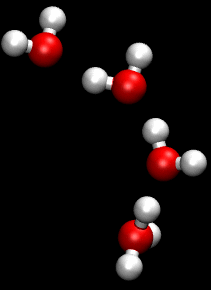

## Innovative Electrolytes Based on Ionic Liquids and Polymers for Next-Generation Solid-State Batteries 基于离子液体和聚合物的用于下一代固态电池的创新型电解质

> Maria Forsyth, Luca Porcarelli, Xiaoen Wang, Nicolas Goujon, and David Mecerreyes
> Acc. Chem. Res. 2019, 52, 3, 686-694
> DOI: [10.1021/acs.accounts.8b00566](https://doi.org/10.1021/acs.accounts.8b00566)

### 1. Introduction
As we catapult toward the end of the second decade of the 21st century, the demand for clean, more reliable, and globally affordable energy to power our factories, our homes, and our transportation is growing. Furthermore, the thirst for new, energy-hungry technologies such as ever more complex portable electronics, drones, etc. results in an ever-increasing drive for new materials and new knowledge to create future energy storage solutions. The imperatives here will often involve the competing requirements of safety, cost, energy density, power density, ethical sourcing, and security of supply as well as the move toward designing for a circular economy, i.e., repurposing or recycling of materials and devices.(1,2)  
随着我们在21世纪第二个十年末期飞速发展，对清洁，更可靠，全球可负担的能源为工厂，房屋和运输提供动力的需求正在增长。此外，对新能源的渴求技术的需求，例如越来越复杂的便携式电子设备，无人机等，导致对新材料和新知识的需求不断增长，以创建未来的储能解决方案。这里的紧要任务通常涉及安全性，成本，能量密度，功率密度，道德采购和供应安全的竞争要求，以及朝着设计循环经济的方向发展，即重新利用或回收材料和设备。（1,2）

Lithium-ion technologies based on a variety of different chemistries have dominated the research arena, and now, the market share of energy storage; however, they are unable to satisfy all requirements and are likely to be augmented, if not replaced, in the longer term by a series of other technologies designed for particular applications. For example, Li metal offers the hope of higher energy density, especially when coupled with cathodes such as sulfur, air, or high-nickel-content-layered oxides. Electrolytes based on organic solvents are not compatible in these cases, spurring the increase in research into solid-state electrolytes, ionic liquids, polymers, and their combinations. Some of our recent work in these areas will be discussed along with the future outlook in this field.  
基于各种不同化学性质的锂离子技术主导了研究领域，现在，能量存储的市场份额已成为主流。但是，它们不能满足所有要求，并且如果不能替代，从长远来看，很可能会被一系列针对特定应用设计的其他技术所增强。例如，锂金属提供了更高的能量密度的希望，特别是当与诸如硫，空气或高镍含量层状氧化物的阴极结合时。在这些情况下，基于有机溶剂的电解质不兼容，从而刺激了对固态电解质，离子液体，聚合物及其组合的研究。我们将在这些领域中的一些最新工作以及该领域的未来前景进行讨论。

Apart from inorganic ceramic or glassy electrolytes,(3) recent electrolyte materials that have shown potential in beyond Li-ion energy storage technologies can be categorized as follows: solid polymer electrolytes (SPEs),(4) ionic liquids, gels, and nanocomposites,(5) and organic ionic plastic crystals.(6) The resurgence in SPE research has arisen from the impetus for safer technologies and, in particular, Li metal and the recognition that many applications benefit from elevated temperatures (50–100 °C) rather than room temperature. Indeed, current Li-ion technologies require sophisticated cooling and control modules to ensure that the operating temperature is kept below 60 °C. Moreover, the battery performance and life are seriously compromised if the temperature is regularly above room temperature.(7,8) Thus, future electrolyte research will not be restricted to room-temperature conductors. Ionic liquids offer many desirable and tailorable features as electrolytes in high-energy-density batteries. For example, they can have large electrochemical windows that enable metal anodes and high-voltage cathodes, they can have minimal volatility and zero flammability, and they have higher temperature stability.(9) On the other hand, polymers have been proposed for all solid-state batteries since the mid-1970s when ion conductivity was discovered in polyether–salt complexes.(10,11) Combinations of ILs and polymers have also been considered for some time, especially in the form of gel electrolytes.(12,13)  
除了无机陶瓷或玻璃状电解质外，（3）在锂离子储能技术之外已显示出潜力的最新电解质材料可以归类为：固体聚合物电解质（SPEs），（4）离子液体，凝胶和纳米复合材料，（5）和有机离子塑料晶体。（6）对SPE研究的兴趣起源于对更安全技术的推动，特别是锂金属的发展，以及人们认识到许多应用受益于高温（50–100°C），比室温高。实际上，当前的锂离子技术需要复杂的冷却和控制模块以确保工作温度保持在60°C以下。此外，如果温度经常高于室温，则会严重损害电池的性能和寿命。（7,8）因此，未来的电解质研究将不仅限于室温导体。离子液体作为高能量密度电池中的电解质提供了许多理想且可定制的功能。例如，它们可以具有能够使金属阳极和高压阴极成为可能的大电化学窗口，可以具有最小的挥发性和零可燃性，并且具有更高的温度稳定性。（9）另一方面，自1970年代中期在聚醚-盐络合物中发现离子可以传导以来，已提出将聚合物用于所有固态电池。（10,11）ILs和聚合物的组合也被考虑了一段时间，特别是凝胶电解质的形式。（12,13）

Polymer electrolytes are commonly formed by a mixture of an alkali metal salt with an ion-solvating polymer host, such as poly(ethylene oxide) (PEO). Two main ion transport mechanisms take place in polymer electrolytes: (1) diffusion via a hopping mechanism between ion coordination sites through structural rearrangements or (2) segmental motion of the coordination sites on the polymer backbone. The first mechanism, also classified as Grotthus-like, follows an Arrhenius dependence on temperature and occurs in highly concentrated systems.(5) This mechanism is often decoupled from the bulk dynamics of the electrolyte. On the other hand, VFT behavior occurs when ion dynamics rely on polymer segmental motion, with a lower Tg leading to higher conductivity.  
聚合物电解质通常由碱金属盐与离子溶解性聚合物主体（例如聚环氧乙烷（PEO））的混合物形成。聚合物电解质中发生两种主要的离子传输机理：（1）通过结构重排通过离子配位点之间的跳跃机制进行扩散，或（2）聚合物主链上配位点的分段运动。第一种机理，也被归类为Grotthus样，遵循Arrhenius对温度的依赖性，并发生在高度集中的系统中。（5）这种机理通常与电解质的整体动力学脱钩。另一方面，当离子动力学依赖于聚合物的分段运动时，会发生VFT行为，较低的Tg导致较高的电导率。

Regardless of the transport mechanism, much of the ionic current is usually transported by anions rather than metal cations such as in the PEO–salt electrolytes. Consequently, severe concentration gradients form during operation that eventually lead to poor cell performance of polymer electrolytes. Different strategies have been investigated to increase the cation transport number (>0.5) and overcome this limitation.(4) Our recent work on this aspect will be discussed in the following section.  
无论采用哪种传输机制，大部分离子电流通常都是通过阴离子而不是金属阳离子（例如在PEO-盐电解质中）传输的。因此，在操作期间形成严重的浓度梯度，这最终导致聚合物电解质的电池性能差。已经研究了不同的策略来增加阳离子传输数（>0.5）并克服该限制。（4）我们在此方面的最新工作将在以下部分中讨论。

### 2. Anionic Single-Ion Conductors 阴离子单离子导体
The movement of anionic charges can be restricted by attaching the anions to the polymer backbone so that the cation is the only ion free to move. For this reason, these polymer electrolytes are known as single-ion conductors, as they are characterized by a cation transport number virtually equal to unity. As evidenced by the recent review of Armand and coauthors,(14) the single-ion conductors display ionic conductivity generally lower than that of their dual-ion counterparts. In the following section of this Account, two main strategies to increase the ionic conductivity of single-ion conductors will be discussed, and we will present examples of these based on our long-standing interest in single-ion conductor systems. The first strategy involves the design of systems with a low glass transition temperature and increased polymer segmental mobility. The second approach decouples the ionic conductivity from the dynamics of the polymer backbone.  
可以通过将阴离子连接到聚合物骨架上来限制阴离子电荷的移动，从而使阳离子是唯一自由移动的离子。由于这个原因，这些聚合物电解质被称为单离子导体，因为它们的特征在于阳离子传输数实际上等于1。正如Armand及其合作者的最新综述（14）所证明的那样，单离子导体的离子电导率通常低于双离子导体的电导率。在本帐户的以下部分中，将讨论增加单离子导体离子电导率的两种主要策略，并且基于对单离子导体系统的长期关注，我们将介绍这些示例。第一种策略涉及设计具有低玻璃化转变温度和增加的聚合物分段流动性的系统。第二种方法使离子电导率与聚合物主链的动力学脱钩。

#### 2.1. Copolymerization Approach To Increase the Segmental Mobility Dynamics 共聚方法，以提高分段流动动力学
A large number of anionic polymers are today available as single-ion conductors for lithium and sodium. In our work, we focused on vinyl-, acrylamide-, and methacrylate-based single-ion conductors. We chose radical polymerization techniques as opposed to polycondensation and polyaddition because of affordability and simplicity as well as the high tolerance of radical polymerization toward ionic functional groups. The general chemical structures of these polymers are shown in Figure 1a.  
如今，有大量阴离子聚合物可用作锂和钠的单离子导体。在我们的工作中，我们专注于乙烯基，丙烯酰胺和甲基丙烯酸酯基单离子导体。我们选择了自由基聚合技术，而不是缩聚和加聚，因为其价格合理，操作简便，而且自由基聚合对离子官能团的耐受性高。这些聚合物的一般化学结构如图1a所示。

  
Figure 1. (a) Structures of the single-ion copolymers described in this Account, (b) discharge profiles, and (c) cycling performances of Li metal/PMTFSI–b-PEO–b-PMTFSI)/LiFePO4. Adapted with permission from ref (15). Copyright 2017 Elsevier.   
图1.（a）此帐户中描述的单离子共聚物的结构，（b）放电曲线，以及（c）Li金属/PMTFSI–b-PEO–b-PMTFSI）/LiFePO4的循环性能。改编自参考文献（15）。

In 2016, we developed single-ion conductors based on poly(lithium 1-[3-(methacryloyloxy)-propylsulfonyl]-1-(trifluoromethylsulfonyl)imide) (PMTFSI). The homopolymers of PMTFSI demonstrated a high glass transition temperature (Tg > 90 °C) and, consequently, low-room-temperature conductivity; thus, we introduced pendant ethylene oxide units with the aim to increase the flexibility of the polymer backbone (Figure 1a). When LiMTFSI was copolymerized with poly(ethylene glycol) methyl ether methacrylate (PEGM), the Tg decreased well below room temperature, and conductivity increased up to 2.3 × 10–6 S cm–1 at 25 °C.(16) The presence of a single Tg demonstrated a good miscibility of the PEGM with LiMTFSI. Despite the improvement in ionic conductivity, the mechanical properties of these polymers decreased, and we were unable to prepare freestanding films.(16)  
2016年，我们开发了基于聚（1-[3-（甲基丙烯酰氧基）-丙基磺酰基] -1-（三氟甲基磺酰基）酰亚胺）（PMTFSI）的单离子导体。 PMTFSI的均聚物显示出较高的玻璃化转变温度（Tg> 90°C），因此，其室温电导率较低。因此，我们引入了环氧乙烷侧链单元，目的是增加聚合物主链的柔韧性（图1a）。当LiMTFSI与聚乙二醇甲基丙烯酸甲酯（PEGM）共聚时，Tg在室温以下大大降低，在25°C时电导率增加至2.3×10-6 S cm-1。（16）单个Tg证明PEGM与LiMTFSI有很好的混溶性。尽管离子电导率有所改善，但这些聚合物的机械性能却有所下降，因此我们无法制备独立的薄膜。（16）

In order to improve the mechanical properties, we prepared single-ion triblock copolymer electrolytes based on linear PEO and side PMTFSI blocks, PMTFSI–b-PEO–b-PMTFSI, controlling PEO crystallinity by changing the composition of the block copolymers. This facilitated highly conductive and freestanding films with a lithium transference number close to unity. PMTFSI–b-PEO–b-PMTFSI electrolytes showed excellent performance in LiFePO4 metal polymer cells operating at 70 °C.(15) (Figure 1b,c)  
为了改善机械性能，我们基于线性PEO和侧边PMTFSI嵌段PMTFSI–b-PEO–b-PMTFSI制备了单离子三嵌段共聚物电解质，通过改变嵌段共聚物的组成来控制PEO的结晶度。这促进了锂转移数接近于1的高导电性和独立膜。 PMTFSI–b-PEO–b-PMTFSI电解质在70°C下工作的LiFePO4金属聚合物电池中表现出出色的性能。（15）（图1b，c）

It is known that small organic molecules can be used as a plasticizer for the polymer backbone in order to decrease the Tg and increase the conductivity of single-ion conductors. Very recently, we prepared cross-linked electrolytes by copolymerization of PEG dimethacrylate (PEGDM), PEGM, and LiMTFSI in the presence of propylene carbonate. Besides plasticizing the polymer, the high dielectric constant of propylene carbonate assists the dissociation of the lithium cations and the covalently bonded anions, thus increasing the fraction of mobile ions. This material displayed a unique combination of high lithium transference number and high conductivity at ambient temperature (σ ≈ 10–4 S cm–1). The cross-linked network showed excellent performances in LiFePO4 metal polymer cells at room temperature.(17) As a drawback, this material includes a flammable organic solvent, which we ideally could eliminate from future devices.  
已知有机小分子可用作聚合物主链的增塑剂，以降低Tg并增加单离子导体的电导率。最近，我们通过在碳酸亚丙酯的存在下将PEG二甲基丙烯酸酯（PEGDM），PEGM和LiMTFSI共聚制备了交联电解质。除了增塑聚合物之外，碳酸亚丙酯的高介电常数还有助于锂阳离子和共价键合阴离子的离解，从而增加了移动离子的比例。这种材料在环境温度（σ≈10–4 S cm-1）下显示出高锂转移数和高电导率的独特组合。交联网络在室温下的LiFePO4金属聚合物电池中显示出优异的性能。（17）作为一个缺点，这种材料包含易燃的有机溶剂，我们理想地可以从将来的设备中消除它。

#### 2.2. “Mixed” Co-Cation Approach To Decouple Li/Na-ion Transport from Segmental Mobility “混合”共阳离子方法将锂/钠离子运输与分段运动分离
An alternative approach is to design polymer electrolytes such that ions are mobile even below the glass transition temperature, therefore decoupling the polymer segmental motion from ionic conductivity. Initially, we selected poly(2-acryl-amido-2-methyl-1-propane-sulfonate) homopolymer (PAMPS) as a polymer backbone for sodium single-ion conductors. The work of Colby and co-workers serving as inspiration,(18) a number of bulky quaternary ammonium cations replaced sodium ions in the polymer backbone; their chemical structures are shown in Figure 2.  
另一种方法是设计聚合物电解质，使离子甚至在玻璃化转变温度以下仍可移动，因此将聚合物的分段运动与离子电导率脱钩。最初，我们选择聚（2-丙烯酸-酰胺基-2-甲基-1-丙烷-磺酸盐）均聚物（PAMPS）作为钠单离子导体的聚合物主链。科尔比和他的同事的工作启发了人们。（18）大量的季铵阳离子取代了聚合物主链中的钠离子。它们的化学结构如图2所示。

  
Figure 2. Schematic of a mixed co-cation conductor and the chemical structures of the bulky quaternary ammonium cations described in this Account.  
图2.此帐户中描述的混合共阳离子导体的示意图以及庞大的季铵阳离子的化学结构。

Significant ionic conductivities were measured below the Tg of the polymer; the highest conductivity was found for the system containing 10:90% mol ratio of Na+/triethylmethylammonium (N1222) cations.(19) We hypothesize that the addition of bulky cations can increase the polymer free volume and “loosen” the structure to encourage metal cation hopping, facilitated by the charged backbone. Subsequently, we extended our interest to different polymer backbones including the copolymer of PAMPS with poly vinyl sulfonate (PVS)(20) and the copolymer of polystyrenesulfonyl(trifluoromethylsulfonyl)imide with ethyl acrylate.(21) We observed similar evidence of decoupling in all of these systems. However, the ionic conductivities measured in these systems were still too low for application in practical devices. The addition of a small amount of a tetraglyme plasticizer resulted in an increase of ionic conductivity of several orders of magnitude, up to ∼10–5 S cm–1 at 50 °C.(19,20)  
在聚合物的Tg以下测得重要的离子电导率；对于含有10：90％摩尔比的Na+/三乙基甲基铵（N1222）阳离子的系统，发现其电导率最高。（19）我们假设大体积阳离子的添加可以增加聚合物的自由体积，并“松开”结构以鼓励金属阳离子跳变，这是由带电主链所促进的。随后，我们将兴趣扩展到了不同的聚合物主链上，包括PAMPS与聚乙烯基磺酸盐（PVS）的共聚物（20）和聚苯乙烯磺酰基（三氟甲基磺酰基）酰亚胺与丙烯酸乙酯的共聚物。（21）我们观察到类似的证据表明，所有这些系统。但是，在这些系统中测得的离子电导率仍然太低，无法用于实际设备中。加入少量的四甘醇二甲醚增塑剂会导致离子电导率增加几个数量级，在50°C时可达到约10-5 S cm-1。（19,20）

Following this approach, we prepared PAMPS polymers containing lithium cations mixed with N1222 or dimethylbutylmethoxyethylammonium (N114(2O1)) cations.(22) Again, the temperature dependence of the conductivities for both samples appeared to be independent of Tg. Moreover, 7Li NMR line-width analysis suggested that ion hopping was the predominant mechanism for lithium diffusion for this polymer system. In contrast to sodium-based ionomers,(19,20) the incorporation of small amounts of tetraglyme did not increase the ionic conductivity. We hypothesized that the strong interactions between lithium ions and ether oxygen atoms may cause an unexpected recoupling of the lithium diffusion dynamics with the polymer segmental motion,(23) and this conclusion was supported by molecular dynamics (MD) simulations of similar ionomers.(24) MD simulations of Li and Na ionic polymers with different compositions of co-cations were able to elucidate possible decoupling mechanisms and optimum compositions and sizes of the organic cation.(25,26) As shown in Figure 3, when the ratio of the Li ion to the ammonium co-cation is increased to 1:1 (vs 1:5), a hopping mechanism involving rearrangement of the Li coordination environment is possible along an interconnected cluster. This is believed to be the origin of the decoupling of the alkali metal cation from the bulk polymer dynamics. The presence of an ether oxygen disturbs this connectivity and thereby shuts down the hopping in the Li case but not in the Na system. This contrast between the Li- and Na-based mixed-cation ion polymer systems demonstrates the complexity and importance of the different coordination environments for encouraging alkali metal cation transport and offers opportunities for designing materials to optimize the decoupling between the ion dynamics and the polymer dynamics. For example, instead of the hard sulfonate anion on the PAMPS backbone, a softer anion such as fluorosulfonamide may offer advantages.(27) Other anions such as borates could also be revisited as first suggested by Angell et al.(28)  
按照这种方法，我们制备了含有锂离子与N1222或二甲基丁基甲氧基乙基铵（N114（2O1））阳离子混合的PAMPS聚合物。（22）同样，两个样品的电导率对温度的依赖性似乎与Tg无关。此外，7Li NMR线宽分析表明，离子跳跃是该聚合物体系锂扩散的主要机理。与基于钠的离聚物不同，（19,20）掺入少量的四甘醇二甲醚不会增加离子电导率。我们假设锂离子和醚氧原子之间的强相互作用可能会导致锂扩散动力学与聚合物链段运动的意外耦合（23），这一结论得到类似离聚物的分子动力学（MD）模拟的支持（24）。具有不同共阳离子组成的Li和Na离子聚合物的MD模拟能够阐明可能的解耦机理以及有机阳离子的最佳组成和尺寸。（25,26）如图3所示，当Li的比例铵共阳离子的离子增加到1：1（vs 1：5），则沿着相互连接的簇可能涉及涉及Li配位环境重排的跳跃机制。据信这是碱金属阳离子与本体聚合物动力学解偶联的起源。醚氧的存在会扰乱这种连通性，从而在Li情况下关闭跳变，但在Na系统中不会关闭。锂基和钠基混合阳离子聚合物体系之间的这种对比表明，不同配位环境对于促进碱金属阳离子迁移具有复杂性和重要性，并为设计材料以优化离子动力学和聚合物动力学之间的解耦提供了机会。例如，代替PAMPS主链上的硬磺酸根阴离子，更柔软的阴离子如氟磺酰胺可能会提供优势。（27）如安吉尔等人（28）最初提出的，还可以重新考虑其他阴离子如硼酸根。

  
Figure 3. (a) MD simulation snapshots showing the isolated Li cluster when only 20% of cations are Li+ compared with (b) extended percolating aggregates of Li+ ions with the anions tethered to the polymer backbone at 50 mol % of Li+ cations. Ion hopping facilitated through changing Li+ ion coordination. Yellow: sulfur; dark blue: Li+; red: oxygen; green: carbon.  
图3.（a）MD模拟快照，显示了只有20％的阳离子为Li +时的孤立Li团簇，而（b）Li +离子与阴离子的扩展渗滤聚集体在50 mol％的Li +阳离子下束缚在聚合物主链上。通过改变Li +离子配位可促进离子跳跃。黄色：硫；深蓝色：Li +；红色：氧气；绿色：碳。

Another strategy for decoupling of lithium- or sodium-ion transport from the bulk dynamics has recently been reported in both organic- and IL-based systems.(29−32) It has been demonstrated that at very high concentrations, approaching the saturation limit of the salt in the solvent, the ion speciation leads to complexes and aggregates that can percolate through the electrolyte. The ion diffusion is then supported not only by vehicular motion but by a structural diffusion mechanism similar to transport of the proton via a Grotthus mechanism in acids. MD simulations have elucidated the stark differences between the coordination environments and lithium/sodium-ion transport in the more traditional lower salt concentrations compared to the superconcentrated cases.(33,34) Recent reports of Li coordination in related TFSI systems are consistent with our observations.(35,36) These superconcentrated electrolytes allow dendrite-free lithium and sodium metal plating at very high current densities.(29,37,38) Furthermore, these systems have been successfully used with high-energy-density cathodes such as LCO and NMC(37,39−42) and more recently in sodium metal device [Na/IL electrolyte/NFP] cells operating at 50 °C (Figure 4).(43,44) The advantage of such electrolytes is their excellent stability such that they can be safely used at moderate temperatures, avoiding both flammability problems and electrode degradation.  
最近，在基于有机和基于IL的系统中，也报道了另一种将锂或钠离子迁移与整体动力学解耦的策略。（29-32）已证明，在非常高的浓度下，锂离子或钠离子的迁移率接近饱和极限。溶剂中的盐，离子形态会形成可渗透通过电解质的络合物和聚集体。然后，不仅通过vehicular motion而且通过结构扩散机制来支持离子扩散，类似于质子通过Grotthus机制在酸中的转运。MD模拟阐明了与超浓缩情况相比，在更传统的较低盐浓度下，配位环境与锂/钠离子迁移之间的明显差异。（33,34）有关TFSI系统中Li配位的最新报道与我们的观察一致（35,36）这些超浓缩电解质允许在非常高的电流密度下进行无枝晶状的锂和钠金属电镀。（29,37,38）此外，这些系统已成功用于高能量密度的阴极，例如LCO和NMC（37,39-42），最近在运行于50°C的钠金属装置[Na/IL电解质/NFP]电池中也是如此（图4）。（43,44）这种电解质的优势在于其出色的稳定性，因此它们可以在中等温度下安全使用，避免了易燃性问题和电极退化。

  
  
Figure 4. (a) Possible coordination environments for the Na (or Li) cation with the FSI anion with increasing salt concentration in the IL. (b) The radial distribution functions for the Na anion (in particular Na–N) from MD simulations as a function of salt concentration clearly showing a shift toward monodentate coordination at high salt concentrations similar to that found with the pure NaFSI salt. (c) Full cell cycling for 50 mol % NaFSI in P111i4FSI IL electrolyte with Na|NFP electrodes under various conditions. Adapted with permission from ref (44).  
图4.（a）随着IL中盐浓度的增加，Na（或Li）阳离子与FSI阴离子可能的配位环境。 （b）MD模拟中Na阴离子（特别是Na–N）的径向分布函数与盐浓度的函数关系清楚地表明，在高盐浓度下，向单齿配位的转变类，与纯NaFSI盐相似。 （c）在各种条件下，使用Na | NFP电极在P111i4FSI IL电解质中的50 mol％NaFSI进行完整的电池循环。在参考文献（44）的许可下改编。

### 3. Ion Gels and Composite Electrolytes 离子凝胶和复合电解质
While superconcentrated ionic-liquid-based electrolytes clearly support stable alkali metal cycling, a key requirement for higher-energy-density batteries, they still present some challenges in a full cell, as they require a compatible separator material as mentioned above. Current separator technologies are designed for carbonate-based systems and are not necessarily applicable to these new electrolytes nor to higher-temperature operation. Novel separator chemistry is in of itself an important research field;(45) however, our approach has been to solidify the ionic liquid by combining it with a polymeric matrix that not only provides mechanical integrity but also may be involved in the conduction process. These materials are generally defined as “ion gels”. Thus, we have focused on the ion conducting polymer material based on poly(diallyldimethylammonium) (polyDADMA) with different counter-anions (polyionic liquid or “PILs”) and combined with IL-based electrolytes.(46−49) We selected this polymer because of its commercial availability, low cost, high dielectric constant, and high thermal and electrochemical stability.(50)Figure 5 summarizes the chemistry of some recent examples of these materials for lithium-based electrolytes as well as for alternate chemistries such as Zn and Na.(51,52)  
尽管超浓缩的基于离子液体的电解质显然支持稳定的碱金属循环，这是高能量密度电池的关键要求，但它们仍在全电池中仍存在一些挑战，因为它们需要如上所述的兼容隔膜材料。当前的隔板技术是为基于碳酸盐的系统设计的，不一定适用于这些新的电解质，也不适用于更高温度的操作。新型隔板化学本身就是一个重要的研究领域；（45）然而，我们的方法是通过将离子液体与聚合物基体结合来固化离子液体，该基体不仅提供机械完整性，而且可能参与导电过程。这些材料通常被定义为“离子凝胶”。因此，我们专注于基于具有不同抗衡离子（聚离子液体或“ PIL”）的聚二烯丙基二甲基铵（polyDADMA）的离子导电聚合物材料，并与基于IL的电解质组合。（46-49）我们选择了这种聚合物由于其市售性，低成本，高介电常数以及高热稳定性和电化学稳定性。（50）图5总结了这些材料用于锂基电解质以及替代化学产品（如Zn和Zn）的最新化学实例。无（51,52）

  
Figure 5. (a) PIL ion gels with different metal salts. These ion gels have been demonstrated in several battery chemistries as discussed in the text. (b) Conductivity of a series of Na+-based ion gels indicating increasing conductivity with increasing IL content. (c) Cycling of a full Na/ion gel/NFP battery with ion gel containing 50% IL electrolyte.  
图5.（a）具有不同金属盐的PIL离子凝胶。这些离子凝胶已在本文中讨论的几种电池化学中得到了证明。 （b）一系列基于Na+的离子凝胶的电导率，表明电导率随IL含量的增加而增加。（c）用含50％IL电解质的离子凝胶循环充满Na/离子凝胶/NFP电池。

As discussed above,(39−41) high-concentration IL systems have shown promising properties such as a higher lithium-ion transference number and the ability to improve battery charge–discharge performance. Recently, we have proposed a novel composite ion gel electrolyte, in which the PIL, poly(DADMA TFSI) with high molecular weight, was used as a host polymer and combined with a superconcentrated IL-based electrolyte composed of LiFSI in a phosphonium IL(46) (Figure 6b). Most importantly, diffusion coefficient measurements show that the addition of a PIL into the ionic liquids can decrease the anion diffusion more significantly compared with the lithium cations, which effectively increase the lithium-ion transport number. This could be a result of the different coordination mechanism compared with other host polymers such as PEO and polycarbonates. As also suggested by Schonhoff and co-workers,(53) our results highlight the advantages of PILs as a potential host or “solvent” for salt in polymer electrolyte materials. In PIL-based materials, the PILs can dissociate the lithium salt but have weaker coordination with the lithium cations, which benefits the lithium transport in contrast to PEO-based polymer electrolytes. Although the addition of ILs increases the ion conductivity of the electrolyte, the deterioration of the mechanical stability becomes an issue for this salt plasticized system. By using the same PIL but replacing the TFSI with the FSI anion, the mechanical properties can be slightly improved at a given composition.(47) Initially, it was thought that this could be due to the fact that a common anion is used in both the PIL and the IL electrolyte, which might improve compatibility; however, somewhat surprisingly, the compatibility was lesser than with the mixed anions.(47) This behavior is still not understood, and there is much room to play with different anion chemistry and anion mixtures.  
如上所述，（39-41）高浓度IL系统显示出令人鼓舞的特性，例如更高的锂离子传递数和改善电池充放电性能的能力。最近，我们提出了一种新型的复合离子凝胶电解质，其中高分子量的PIL聚（DADMA TFSI）被用作主体聚合物，并与由LiFSI组成的超浓缩IL基电解质在in IL（ 46）（图6b）。最重要的是，扩散系数测量表明，与锂阳离子相比，在离子液体中添加PIL可以更明显地减少阴离子扩散，从而有效地增加了锂离子的传输数。这可能是由于与其他主体聚合物（例如PEO和聚碳酸酯）相比，配位机制不同的结果。正如Schonhoff及其同事所建议的那样（53），我们的结果突出了PIL作为聚合物电解质材料中盐的潜在主体或“溶剂”的优势。在基于PIL的材料中，PIL可以使锂盐解离，但与锂阳离子的配位较弱，与基于PEO的聚合物电解质相比，这有利于锂的运输。尽管IL的添加增加了电解质的离子电导率，但是机械稳定性的劣化对于该盐增塑体系而言成为问题。通过使用相同的PIL，但用FSI阴离子代替TFSI，可以在给定的成分下稍微改善机械性能。（47）最初，人们认为这可能是由于在两种材料中都使用了共同的阴离子PIL和IL电解质，可能会改善相容性；但是，有些令人惊讶的是，其相容性比与混合阴离子的相容性要差。（47）这种行为仍不为人所知，而且在不同的阴离子化学性质和阴离子混合物中还有很大的发挥空间。

  
Figure 6. (a) SEM image of the electrospun nanofibers. (b) The ionic conductivity comparison between composite electrolyte (PIL/3.8 m LiFSI IL/Al2O3 = 50:50:5, by weight) and the ILs (3.8 m LiFSI IL). Reproduced with permission from ref (46). Copyright 2017 Royal Society of Chemistry; (c) Li/composite electrolyte/Li symmetric cell cycling. Data from ref (48).  
图6.（a）电纺纳米纤维的SEM图像。 （b）复合电解质（PIL/3.8 m LiFSI IL/Al2O3 = 50：50：5，按重量计）和ILs（3.8 m LiFSI IL）之间的离子电导率比较。经参考文献（46）许可复制。版权所有2017皇家化学学会; （c）Li/复合电解质/Li对称电池循环。来自参考（48）的数据。

More pragmatically, the addition of inorganic fillers such as Al2O3 nanoparticles is a promising way to achieve higher mechanical stability. By adding 5 wt % Al2O3 nanoparticles to the PIL composite systems, a higher IL loading of 60 wt % and a conductivity of 0.28 mS cm–1 at 30 °C was recently achieved.(46) The enhancement of the mechanical properties (E′ = 6.4 MPa at 30 °C) may be attributed to the molecular entanglements between polymer chain and nanoparticles. As a result, long-term and stable symmetrical lithium cells and promising full cell charge–discharge performance have been demonstrated.(46,49) However, this mechanical enhancement is still limited when more ionic liquid is added, and this can pose difficulties for large-scale devices such as pouch cells, where mechanical strength may be needed in the assembly process. An alternative method to develop a highly flexible and strong composite electrolyte was recently developed by using electrospun nanofibers composited with the PIL electrolytes to provide mechanical support.(48) Electrospinning is a robust method to prepare a fibrous matrix with high porosity (Figure 6a) and good mechanical properties. Benefiting from the improved mechanical strength of this composite electrolyte, extremely high lithium salt content has been used in the PIL-based electrolytes. Promisingly, full cell charge–discharge tests showed that these solid electrolytes operated with good stability when used with high-voltage cathode materials such as NMC and NCA, thus providing a facile new direction toward high-energy-density batteries.  
更加务实的是，添加无机填料（例如Al2O3纳米颗粒）是获得更高机械稳定性的一种有前途的方式。通过在PIL复合体系中添加5 wt％的Al2O3纳米颗粒，最近在30°C下获得了60 wt％的更高的IL负载和0.28 mS cm-1的电导率。（46）增强了机械性能（E'在30°C时= 6.4 MPa）可能归因于聚合物链与纳米颗粒之间的分子缠结。结果，已经证明了长期稳定的对称锂电池以及有希望的全电池充放电性能。（46,49）但是，当添加更多离子液体时，这种机械增强作用仍然受到限制，这可能给锂离子电池带来困难。大型设备，例如袋式电池，在组装过程中可能需要机械强度。最近，通过使用与PIL电解质复合的电纺纳米纤维提供了机械支撑，开发了一种开发高柔韧性和高强度复合电解质的替代方法。（48）电纺丝是一种制备高孔隙率纤维基体的可靠方法（图6a），并且良好的机械性能。受益于这种复合电解质的机械强度的提高，在PIL基电解质中使用了极高的锂盐含量。充满希望的是，全电池充放电测试表明，这些固体电解质与NMC和NCA等高压阴极材料一起使用时，具有良好的稳定性，从而为高能量密度电池的发展提供了一条简便的新方向。

Similar ion gels can be designed for alternative battery technologies to lithium. As an example, we recently designed polyDADMA ion gels for zinc and sodium batteries, respectively. In a first example, the IL 1-ethyl-3-methylimidazolium dicyanamide was combined with poly(DADMA TFSI) and Zn(dca)2 for a zinc battery.(51) The obtained electrolytes showed high ionic conductivity values (1.1 × 10–2 S/cm at 50 °C) together with flexible mechanical properties of the membrane. Using those ion gels, a zinc/PEDOT rechargeable battery could be assembled for the first time with higher capacity values than those of Zn/PEDOT batteries using liquid [emim][dca], thereby proving the suitability of such materials for zinc rechargeable batteries.  
可以设计类似的离子凝胶来替代锂电池技术。例如，我们最近设计了分别用于锌和钠电池的polyDADMA离子凝胶。在第一个示例中，将IL 1-乙基-3-甲基咪唑鎓双氰胺与聚（DADMA TFSI）和Zn（dca）2组合用于锌电池。（51）获得的电解质显示出高离子电导率值（1.1×10–在50°C时为2 S /cm）以及膜的柔韧性。使用那些离子凝胶，可以首次组装锌/PEDOT可再充电电池，其容量值高于使用液体[emim] [dca]的锌/PEDOT可再充电电池，从而证明了这种材料适用于锌可再充电电池。

In a second example, a polyDADMA ion gel was designed for a sodium-ion battery.(52) In this case, a suitable IL–sodium salt combination based on C3 mpyrFSI ionic liquid with NaFSI was chosen. The poly(DADMA TFSI) demonstrated the ability to retain up to 50 wt % of IL electrolyte content in a self-standing membrane with high ionic conductivity (7.1 × 10–3 S/cm at 70 °C). Higher NaFSI content led to an increase of the sodium transference number but a dramatic decrease of the ionic conductivity. Some composite ion gels were also synthesized by incorporating 5 wt % Al2O3 nanoparticles. These electrolytes also supported sodium electrochemistry as shown by excellent sodium symmetric cell cycling at 70 °C. Moreover, the optimum composition material was analyzed in a rechargeable sodium battery using NaFePO4 as the cathode and showing good capacity retention and Coulombic efficiencies up to 97% at C rates between C/20 and C/5, as shown in Figure 5 above.  
在第二个示例中，为钠离子电池设计了聚DADMA离子凝胶。（52）在这种情况下，选择了基于C3 mpyrFSI离子液体和NaFSI的合适的IL-钠盐组合。聚（DADMA TFSI）在具有高离子电导率（70°C时为7.1×10–3 S /cm）的自立式膜中显示出能够保留高达50 wt％的IL电解质含量的能力。较高的NaFSI含量导致钠迁移数增加，但离子电导率急剧下降。还通过掺入5重量％的Al2O3纳米颗粒来合成一些复合离子凝胶。这些电解质还支持钠电化学反应，如在70°C的出色钠对称电池循环所显示。此外，在可充电钠电池中使用NaFePO4作为阴极分析了最佳成分材料，并在C/20和C/5之间的C速率下显示了高达97％的良好容量保持率和库仑效率，如上图5所示。

#### 3.1. New Approaches To Achieve Mechanical Strength and High Ionic Transport in the Same Polymer Electrolytes–Block Copolymers 在相同的聚合物电解质-嵌段共聚物中实现机械强度和高离子输运的新方法
More recently, attempts have been made to improve the robustness of PIL materials while retaining high conductivity by preparing block copolymers where a polystyrene block provides the mechanical strength while the PIL allows for ion transport.(54) Inspired by this chemistry, we developed novel phase separated ion gel electrolytes with high lithium transport number by combining a PIL block copolymer with a high LiFSI salt concentration and a low ionic liquid content.(55) Here, enhanced lithium transport properties were achieved by using a similar approach to that of superconcentrated ionic liquid electrolytes, where the overall anion to Li molar ratio is kept below a value of 1.5, through the use of high LiFSI salt content. Such ion gel electrolytes operate well in LiFePO4/lithium metal cells at 50 °C, with cathode loading near practical levels (1.8 mAh cm–2, Figure 7).  
最近，人们尝试通过制备嵌段共聚物来改善PIL材料的坚固性，同时保持高导电性，其中聚苯乙烯嵌段提供机械强度，而PIL允许离子迁移。（54）受此化学方法的启发，我们开发了新型相通过结合具有高LiFSI盐浓度和低离子液体含量的PIL嵌段共聚物，分离出具有高锂传输数的离子凝胶电解质。（55）在这里，通过使用与超浓缩离子液体相似的方法获得了增强的锂传输性能通过使用高LiFSI盐含量，使阴离子与Li的总摩尔比保持在1.5以下的电解质。此类离子凝胶电解质在50°C的LiFePO4 /锂金属电池中能很好地工作，阴极负载接近实用水平（1.8 mAh cm–2，图7）。

  
Figure 7. (a) Ion gel based on LiFSI/C3mpyrFSI IL in a PS–b-PIL block copolymer. (b) Conductivity and transference number of the block copolymer ion gel. (c) Cycling of a full Na/NFP battery with a block copolymer ion gel electrolyte. Adapted with permission from ref (55). Copyright 2018 Wiley.  
图7.（a）PS–b-PIL嵌段共聚物中基于LiFSI /C3mpyrFSI IL的离子凝胶。 （b）嵌段共聚物离子凝胶的电导率和转移数。 （c）用嵌段共聚物离子凝胶电解质使完整的Na /NFP电池循环。改编自参考文献（55）。版权所有2018 Wiley。

A similar approach has been considered by Nguyen et al.(56) recently where an ethylene-carbonate-filled nanostructured block copolymer, consisting of polystyrene blocks and a perfluorinated sulfonamide anionic block, was demonstrated to be a safer electrolyte that performed well in a full lithium cell even when high-energy-density NCM cathodes were used. Thus, this approach of using a PIL as a host for ionic liquids and inorganic salts for a range of different battery chemistries shows significant promise both from the application perspective and with respect to new scientific understanding, since the conduction process and the role of the charged polymer backbone is still unclear.  
Nguyen等人（56）最近考虑了一种类似的方法，其中证明了由聚苯乙烯嵌段和全氟磺酰胺阴离子嵌段组成的填充碳酸乙烯酯的纳米结构嵌段共聚物是一种安全的电解质，在完全操作中表现良好锂电池，即使使用高能量密度的NCM阴极。因此，这种PIL用作离子液体和无机盐的基质，可用于多种不同电池化学的方法，无论是从应用角度还是从新的科学理解上都显示出巨大的希望，因为其传导过程和带电的作用聚合物主链仍不清楚。

### 4. Future
From the Account above, it is evident that there are several approaches to developing ionic polymer conductors for use in advanced energy storage technologies including lithium metal as well as alternative chemistries such as Zn or Na batteries. A polymerizable IL can be designed with alternative anion (or cation) chemistries to improve solubility or compatibility with salts and ILs. The design of anionic PILs, which can facilitate single-ion conduction, offers a wealth of opportunity, considering the idea of tethering a more delocalized anion to favor cation dissociation of the alkali metal ions. This can be coupled with our co-cation approaches where a larger organic cation can be incorporated into the backbone. Decoupling of the alkali metal cation diffusion and ionic conductivity from the polymer dynamics (i.e., Tg) has been demonstrated well using this latter approach; however, higher conductivities are required, and this may be achieved through chemical design of novel polymer backbones and the anions, as demonstrated by the recent work of Shaplov and co-workers.(57) A further dimension added by the PIL is the enhanced solubility of Li and Na salts in the ion gel compared to the IL system. This provides opportunities to tune the structural transport mechanism across a greater range of compositions. Although a number of different approaches to achieve single-ion conducting polymers for lithium have been investigated, the field is still in its infancy with respect to Na+ (or other metal cations), and given the difference in size and coordination of the latter ion, there is much to explore in this case. Our preliminary work on mixed anions in ILs and our early work on zwitterion additives(58,59) suggests that a conduction mechanism that favors ion hopping through structural rearrangement can be designed by invoking a mixed coordination environment around the metal ion. This is under investigation in our combined laboratories at present.  
从上面的说明中，很明显，有几种方法可以开发用于高级能量存储技术的离子聚合物导体，包括锂金属以及诸如Zn或Na电池之类的替代化学物质。可以设计具有可替代阴离子（或阳离子）化学性质的可聚合IL，以提高与盐和IL的溶解度或相容性。考虑到束缚更离域的阴离子以利于碱金属离子的阳离子解离的想法，可以促进单离子传导的阴离子PIL的设计提供了很多机会。这可以与我们的共阳离子方法结合使用，在该方法中可以将更大的有机阳离子掺入主链中。使用后一种方法已经很好地证明了碱金属阳离子扩散和离子电导率与聚合物动力学（即Tg）的解偶联作用。但是，需要更高的电导率，这可以通过新型聚合物主链和阴离子的化学设计来实现，如Shaplov及其同事的最新研究所证明的那样。（57）PIL增加的另一个方面是增强的溶解度与IL系统相比，离子凝胶中Li和Na盐的含量这提供了在更大范围的组合物中调节结构运输机制的机会。尽管已经研究了多种不同的方法来制备用于锂的单离子导电聚合物，但是该领域相对于Na+（或其他金属阳离子）仍处于起步阶段，并且鉴于后者的尺寸和配位关系不同，在这种情况下，有很多值得探索的地方。我们对离子液体中混合阴离子的初步研究和对两性离子添加剂的早期研究（58,59）表明，可以通过在金属离子周围调用混合配位环境来设计有助于通过结构重排进行离子跳跃的传导机制。目前，我们的联合实验室正在对此进行调查。