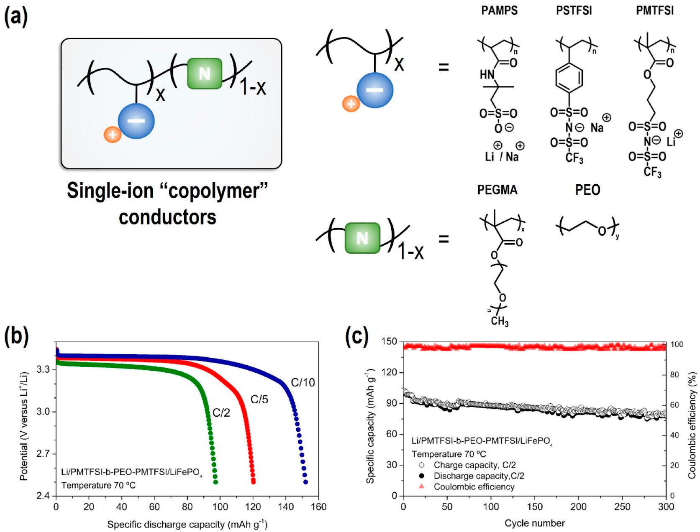
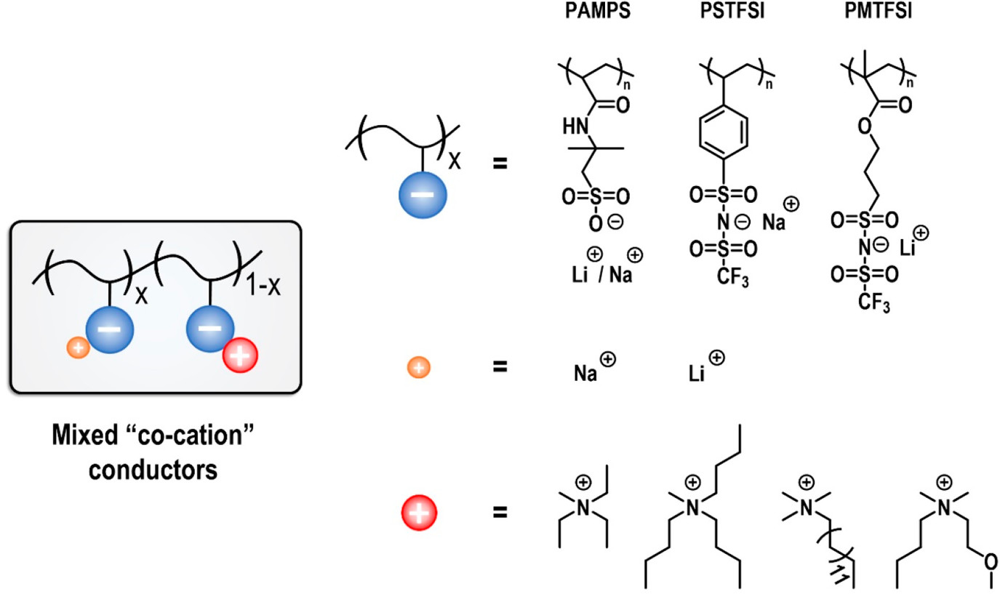
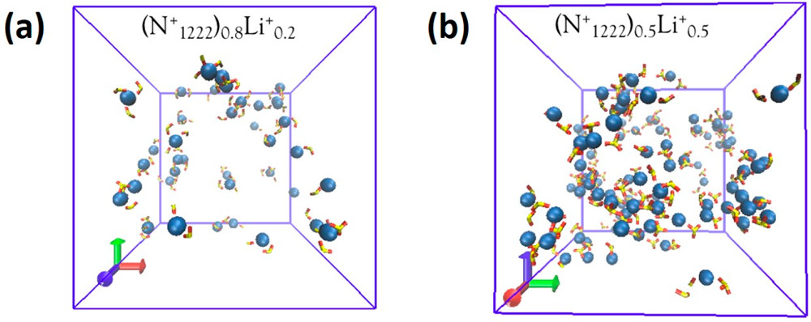
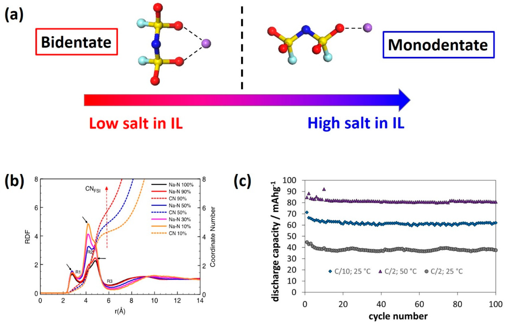
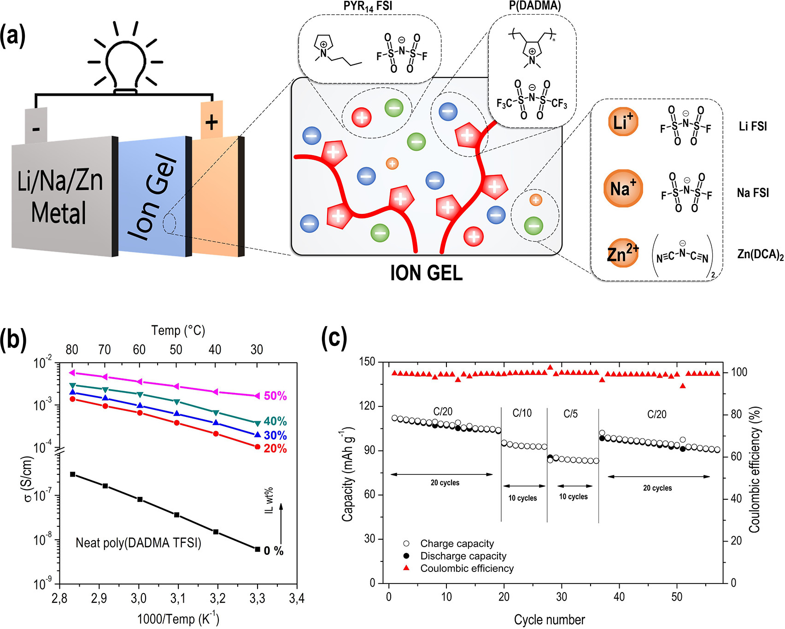
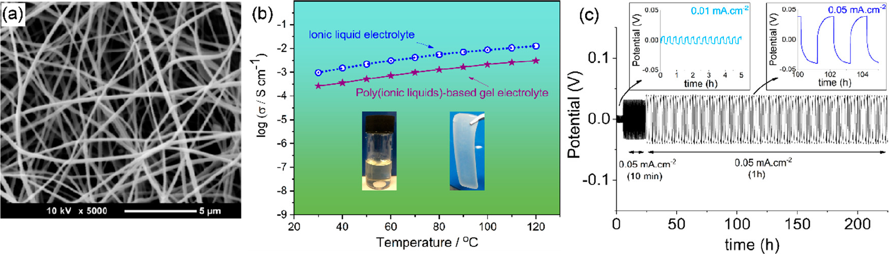
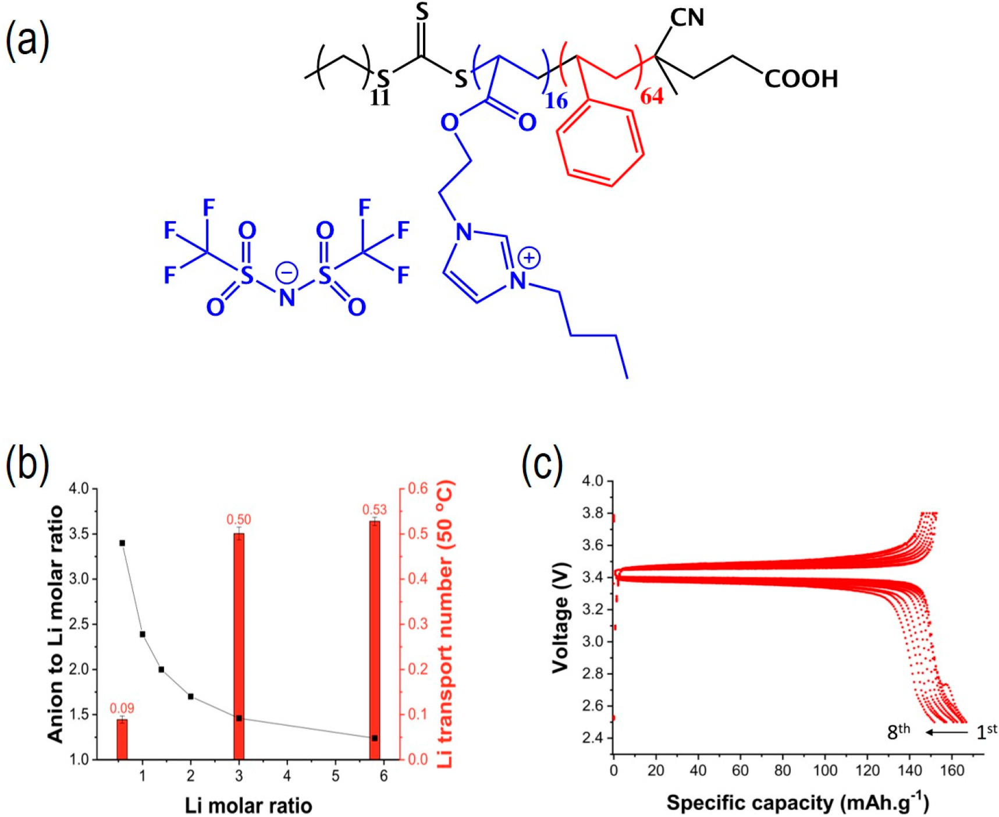

## Innovative Electrolytes Based on Ionic Liquids and Polymers for Next-Generation Solid-State Batteries 基于离子液体和聚合物的用于下一代固态电池的创新型电解质

> Maria Forsyth, Luca Porcarelli, Xiaoen Wang, Nicolas Goujon, and David Mecerreyes
> Acc. Chem. Res. 2019, 52, 3, 686-694
> DOI: [10.1021/acs.accounts.8b00566](https://doi.org/10.1021/acs.accounts.8b00566)

### 1. Introduction
As we catapult toward the end of the second decade of the 21st century, the demand for clean, more reliable, and globally affordable energy to power our factories, our homes, and our transportation is growing. Furthermore, the thirst for new, energy-hungry technologies such as ever more complex portable electronics, drones, etc. results in an ever-increasing drive for new materials and new knowledge to create future energy storage solutions. The imperatives here will often involve the competing requirements of safety, cost, energy density, power density, ethical sourcing, and security of supply as well as the move toward designing for a circular economy, i.e., repurposing or recycling of materials and devices.(1,2)

Lithium-ion technologies based on a variety of different chemistries have dominated the research arena, and now, the market share of energy storage; however, they are unable to satisfy all requirements and are likely to be augmented, if not replaced, in the longer term by a series of other technologies designed for particular applications. For example, Li metal offers the hope of higher energy density, especially when coupled with cathodes such as sulfur, air, or high-nickel-content-layered oxides. Electrolytes based on organic solvents are not compatible in these cases, spurring the increase in research into solid-state electrolytes, ionic liquids, polymers, and their combinations. Some of our recent work in these areas will be discussed along with the future outlook in this field.
Apart from inorganic ceramic or glassy electrolytes,(3) recent electrolyte materials that have shown potential in beyond Li-ion energy storage technologies can be categorized as follows: solid polymer electrolytes (SPEs),(4) ionic liquids, gels, and nanocomposites,(5) and organic ionic plastic crystals.(6) The resurgence in SPE research has arisen from the impetus for safer technologies and, in particular, Li metal and the recognition that many applications benefit from elevated temperatures (50–100 °C) rather than room temperature. Indeed, current Li-ion technologies require sophisticated cooling and control modules to ensure that the operating temperature is kept below 60 °C. Moreover, the battery performance and life are seriously compromised if the temperature is regularly above room temperature.(7,8) Thus, future electrolyte research will not be restricted to room-temperature conductors. Ionic liquids offer many desirable and tailorable features as electrolytes in high-energy-density batteries. For example, they can have large electrochemical windows that enable metal anodes and high-voltage cathodes, they can have minimal volatility and zero flammability, and they have higher temperature stability.(9) On the other hand, polymers have been proposed for all solid-state batteries since the mid-1970s when ion conductivity was discovered in polyether–salt complexes.(10,11) Combinations of ILs and polymers have also been considered for some time, especially in the form of gel electrolytes.(12,13)

Polymer electrolytes are commonly formed by a mixture of an alkali metal salt with an ion-solvating polymer host, such as poly(ethylene oxide) (PEO). Two main ion transport mechanisms take place in polymer electrolytes: (1) diffusion via a hopping mechanism between ion coordination sites through structural rearrangements or (2) segmental motion of the coordination sites on the polymer backbone. The first mechanism, also classified as Grotthus-like, follows an Arrhenius dependence on temperature and occurs in highly concentrated systems.(5) This mechanism is often decoupled from the bulk dynamics of the electrolyte. On the other hand, VFT behavior occurs when ion dynamics rely on polymer segmental motion, with a lower Tg leading to higher conductivity.
Regardless of the transport mechanism, much of the ionic current is usually transported by anions rather than metal cations such as in the PEO–salt electrolytes. Consequently, severe concentration gradients form during operation that eventually lead to poor cell performance of polymer electrolytes. Different strategies have been investigated to increase the cation transport number (>0.5) and overcome this limitation.(4) Our recent work on this aspect will be discussed in the following section.

### 2. Anionic Single-Ion Conductors

The movement of anionic charges can be restricted by attaching the anions to the polymer backbone so that the cation is the only ion free to move. For this reason, these polymer electrolytes are known as single-ion conductors, as they are characterized by a cation transport number virtually equal to unity. As evidenced by the recent review of Armand and coauthors,(14) the single-ion conductors display ionic conductivity generally lower than that of their dual-ion counterparts. In the following section of this Account, two main strategies to increase the ionic conductivity of single-ion conductors will be discussed, and we will present examples of these based on our long-standing interest in single-ion conductor systems. The first strategy involves the design of systems with a low glass transition temperature and increased polymer segmental mobility. The second approach decouples the ionic conductivity from the dynamics of the polymer backbone.

#### 2.1. Copolymerization Approach To Increase the Segmental Mobility Dynamics
A large number of anionic polymers are today available as single-ion conductors for lithium and sodium. In our work, we focused on vinyl-, acrylamide-, and methacrylate-based single-ion conductors. We chose radical polymerization techniques as opposed to polycondensation and polyaddition because of affordability and simplicity as well as the high tolerance of radical polymerization toward ionic functional groups. The general chemical structures of these polymers are shown in Figure 1a.

  
Figure 1. (a) Structures of the single-ion copolymers described in this Account, (b) discharge profiles, and (c) cycling performances of Li metal/PMTFSI–b-PEO–b-PMTFSI)/LiFePO4. Adapted with permission from ref (15). Copyright 2017 Elsevier.   
图1.（a）此帐户中描述的单离子共聚物的结构，（b）放电曲线，以及（c）Li金属/PMTFSI–b-PEO–b-PMTFSI）/LiFePO4的循环性能。改编自参考文献（15）。版权所有2017 Elsevier。

In 2016, we developed single-ion conductors based on poly(lithium 1-[3-(methacryloyloxy)-propylsulfonyl]-1-(trifluoromethylsulfonyl)imide) (PMTFSI). The homopolymers of PMTFSI demonstrated a high glass transition temperature (Tg > 90 °C) and, consequently, low-room-temperature conductivity; thus, we introduced pendant ethylene oxide units with the aim to increase the flexibility of the polymer backbone (Figure 1a). When LiMTFSI was copolymerized with poly(ethylene glycol) methyl ether methacrylate (PEGM), the Tg decreased well below room temperature, and conductivity increased up to 2.3 × 10–6 S cm–1 at 25 °C.(16) The presence of a single Tg demonstrated a good miscibility of the PEGM with LiMTFSI. Despite the improvement in ionic conductivity, the mechanical properties of these polymers decreased, and we were unable to prepare freestanding films.(16)

In order to improve the mechanical properties, we prepared single-ion triblock copolymer electrolytes based on linear PEO and side PMTFSI blocks, PMTFSI–b-PEO–b-PMTFSI, controlling PEO crystallinity by changing the composition of the block copolymers. This facilitated highly conductive and freestanding films with a lithium transference number close to unity. PMTFSI–b-PEO–b-PMTFSI electrolytes showed excellent performance in LiFePO4 metal polymer cells operating at 70 °C.(15) (Figure 1b,c)

It is known that small organic molecules can be used as a plasticizer for the polymer backbone in order to decrease the Tg and increase the conductivity of single-ion conductors. Very recently, we prepared cross-linked electrolytes by copolymerization of PEG dimethacrylate (PEGDM), PEGM, and LiMTFSI in the presence of propylene carbonate. Besides plasticizing the polymer, the high dielectric constant of propylene carbonate assists the dissociation of the lithium cations and the covalently bonded anions, thus increasing the fraction of mobile ions. This material displayed a unique combination of high lithium transference number and high conductivity at ambient temperature (σ ≈ 10–4 S cm–1). The cross-linked network showed excellent performances in LiFePO4 metal polymer cells at room temperature.(17) As a drawback, this material includes a flammable organic solvent, which we ideally could eliminate from future devices.

#### 2.2. “Mixed” Co-Cation Approach To Decouple Li/Na-ion Transport from Segmental Mobility
An alternative approach is to design polymer electrolytes such that ions are mobile even below the glass transition temperature, therefore decoupling the polymer segmental motion from ionic conductivity. Initially, we selected poly(2-acryl-amido-2-methyl-1-propane-sulfonate) homopolymer (PAMPS) as a polymer backbone for sodium single-ion conductors. The work of Colby and co-workers serving as inspiration,(18) a number of bulky quaternary ammonium cations replaced sodium ions in the polymer backbone; their chemical structures are shown in Figure 2.

  
Figure 2. Schematic of a mixed co-cation conductor and the chemical structures of the bulky quaternary ammonium cations described in this Account.  
图2.此帐户中描述的混合共阳离子导体的示意图以及庞大的季铵阳离子的化学结构。

Significant ionic conductivities were measured below the Tg of the polymer; the highest conductivity was found for the system containing 10:90% mol ratio of Na+/triethylmethylammonium (N1222) cations.(19) We hypothesize that the addition of bulky cations can increase the polymer free volume and “loosen” the structure to encourage metal cation hopping, facilitated by the charged backbone. Subsequently, we extended our interest to different polymer backbones including the copolymer of PAMPS with poly vinyl sulfonate (PVS)(20) and the copolymer of polystyrenesulfonyl(trifluoromethylsulfonyl)imide with ethyl acrylate.(21) We observed similar evidence of decoupling in all of these systems. However, the ionic conductivities measured in these systems were still too low for application in practical devices. The addition of a small amount of a tetraglyme plasticizer resulted in an increase of ionic conductivity of several orders of magnitude, up to ∼10–5 S cm–1 at 50 °C.(19,20)

Following this approach, we prepared PAMPS polymers containing lithium cations mixed with N1222 or dimethylbutylmethoxyethylammonium (N114(2O1)) cations.(22) Again, the temperature dependence of the conductivities for both samples appeared to be independent of Tg. Moreover, 7Li NMR line-width analysis suggested that ion hopping was the predominant mechanism for lithium diffusion for this polymer system. In contrast to sodium-based ionomers,(19,20) the incorporation of small amounts of tetraglyme did not increase the ionic conductivity. We hypothesized that the strong interactions between lithium ions and ether oxygen atoms may cause an unexpected recoupling of the lithium diffusion dynamics with the polymer segmental motion,(23) and this conclusion was supported by molecular dynamics (MD) simulations of similar ionomers.(24) MD simulations of Li and Na ionic polymers with different compositions of co-cations were able to elucidate possible decoupling mechanisms and optimum compositions and sizes of the organic cation.(25,26) As shown in Figure 3, when the ratio of the Li ion to the ammonium co-cation is increased to 1:1 (vs 1:5), a hopping mechanism involving rearrangement of the Li coordination environment is possible along an interconnected cluster. This is believed to be the origin of the decoupling of the alkali metal cation from the bulk polymer dynamics. The presence of an ether oxygen disturbs this connectivity and thereby shuts down the hopping in the Li case but not in the Na system. This contrast between the Li- and Na-based mixed-cation ion polymer systems demonstrates the complexity and importance of the different coordination environments for encouraging alkali metal cation transport and offers opportunities for designing materials to optimize the decoupling between the ion dynamics and the polymer dynamics. For example, instead of the hard sulfonate anion on the PAMPS backbone, a softer anion such as fluorosulfonamide may offer advantages.(27) Other anions such as borates could also be revisited as first suggested by Angell et al.(28)

  
Figure 3. (a) MD simulation snapshots showing the isolated Li cluster when only 20% of cations are Li+ compared with (b) extended percolating aggregates of Li+ ions with the anions tethered to the polymer backbone at 50 mol % of Li+ cations. Ion hopping facilitated through changing Li+ ion coordination. Yellow: sulfur; dark blue: Li+; red: oxygen; green: carbon.

Another strategy for decoupling of lithium- or sodium-ion transport from the bulk dynamics has recently been reported in both organic- and IL-based systems.(29−32) It has been demonstrated that at very high concentrations, approaching the saturation limit of the salt in the solvent, the ion speciation leads to complexes and aggregates that can percolate through the electrolyte. The ion diffusion is then supported not only by vehicular motion but by a structural diffusion mechanism similar to transport of the proton via a Grotthus mechanism in acids. MD simulations have elucidated the stark differences between the coordination environments and lithium/sodium-ion transport in the more traditional lower salt concentrations compared to the superconcentrated cases.(33,34) Recent reports of Li coordination in related TFSI systems are consistent with our observations.(35,36) These superconcentrated electrolytes allow dendrite-free lithium and sodium metal plating at very high current densities.(29,37,38) Furthermore, these systems have been successfully used with high-energy-density cathodes such as LCO and NMC(37,39−42) and more recently in sodium metal device [Na/IL electrolyte/NFP] cells operating at 50 °C (Figure 4).(43,44) The advantage of such electrolytes is their excellent stability such that they can be safely used at moderate temperatures, avoiding both flammability problems and electrode degradation.

  
Figure 4. (a) Possible coordination environments for the Na (or Li) cation with the FSI anion with increasing salt concentration in the IL. (b) The radial distribution functions for the Na anion (in particular Na–N) from MD simulations as a function of salt concentration clearly showing a shift toward monodentate coordination at high salt concentrations similar to that found with the pure NaFSI salt. (c) Full cell cycling for 50 mol % NaFSI in P111i4FSI IL electrolyte with Na|NFP electrodes under various conditions. Adapted with permission from ref (44).

### 3. Ion Gels and Composite Electrolytes
While superconcentrated ionic-liquid-based electrolytes clearly support stable alkali metal cycling, a key requirement for higher-energy-density batteries, they still present some challenges in a full cell, as they require a compatible separator material as mentioned above. Current separator technologies are designed for carbonate-based systems and are not necessarily applicable to these new electrolytes nor to higher-temperature operation. Novel separator chemistry is in of itself an important research field;(45) however, our approach has been to solidify the ionic liquid by combining it with a polymeric matrix that not only provides mechanical integrity but also may be involved in the conduction process. These materials are generally defined as “ion gels”. Thus, we have focused on the ion conducting polymer material based on poly(diallyldimethylammonium) (polyDADMA) with different counter-anions (polyionic liquid or “PILs”) and combined with IL-based electrolytes.(46−49) We selected this polymer because of its commercial availability, low cost, high dielectric constant, and high thermal and electrochemical stability.(50)Figure 5 summarizes the chemistry of some recent examples of these materials for lithium-based electrolytes as well as for alternate chemistries such as Zn and Na.(51,52)

  
Figure 5. (a) PIL ion gels with different metal salts. These ion gels have been demonstrated in several battery chemistries as discussed in the text. (b) Conductivity of a series of Na+-based ion gels indicating increasing conductivity with increasing IL content. (c) Cycling of a full Na/ion gel/NFP battery with ion gel containing 50% IL electrolyte.

As discussed above,(39−41) high-concentration IL systems have shown promising properties such as a higher lithium-ion transference number and the ability to improve battery charge–discharge performance. Recently, we have proposed a novel composite ion gel electrolyte, in which the PIL, poly(DADMA TFSI) with high molecular weight, was used as a host polymer and combined with a superconcentrated IL-based electrolyte composed of LiFSI in a phosphonium IL(46) (Figure 6b). Most importantly, diffusion coefficient measurements show that the addition of a PIL into the ionic liquids can decrease the anion diffusion more significantly compared with the lithium cations, which effectively increase the lithium-ion transport number. This could be a result of the different coordination mechanism compared with other host polymers such as PEO and polycarbonates. As also suggested by Schonhoff and co-workers,(53) our results highlight the advantages of PILs as a potential host or “solvent” for salt in polymer electrolyte materials. In PIL-based materials, the PILs can dissociate the lithium salt but have weaker coordination with the lithium cations, which benefits the lithium transport in contrast to PEO-based polymer electrolytes. Although the addition of ILs increases the ion conductivity of the electrolyte, the deterioration of the mechanical stability becomes an issue for this salt plasticized system. By using the same PIL but replacing the TFSI with the FSI anion, the mechanical properties can be slightly improved at a given composition.(47) Initially, it was thought that this could be due to the fact that a common anion is used in both the PIL and the IL electrolyte, which might improve compatibility; however, somewhat surprisingly, the compatibility was lesser than with the mixed anions.(47) This behavior is still not understood, and there is much room to play with different anion chemistry and anion mixtures.

  
Figure 6. (a) SEM image of the electrospun nanofibers. (b) The ionic conductivity comparison between composite electrolyte (PIL/3.8 m LiFSI IL/Al2O3 = 50:50:5, by weight) and the ILs (3.8 m LiFSI IL). Reproduced with permission from ref (46). Copyright 2017 Royal Society of Chemistry; (c) Li/composite electrolyte/Li symmetric cell cycling. Data from ref (48).

More pragmatically, the addition of inorganic fillers such as Al2O3 nanoparticles is a promising way to achieve higher mechanical stability. By adding 5 wt % Al2O3 nanoparticles to the PIL composite systems, a higher IL loading of 60 wt % and a conductivity of 0.28 mS cm–1 at 30 °C was recently achieved.(46) The enhancement of the mechanical properties (E′ = 6.4 MPa at 30 °C) may be attributed to the molecular entanglements between polymer chain and nanoparticles. As a result, long-term and stable symmetrical lithium cells and promising full cell charge–discharge performance have been demonstrated.(46,49) However, this mechanical enhancement is still limited when more ionic liquid is added, and this can pose difficulties for large-scale devices such as pouch cells, where mechanical strength may be needed in the assembly process. An alternative method to develop a highly flexible and strong composite electrolyte was recently developed by using electrospun nanofibers composited with the PIL electrolytes to provide mechanical support.(48) Electrospinning is a robust method to prepare a fibrous matrix with high porosity (Figure 6a) and good mechanical properties. Benefiting from the improved mechanical strength of this composite electrolyte, extremely high lithium salt content has been used in the PIL-based electrolytes. Promisingly, full cell charge–discharge tests showed that these solid electrolytes operated with good stability when used with high-voltage cathode materials such as NMC and NCA, thus providing a facile new direction toward high-energy-density batteries.

Similar ion gels can be designed for alternative battery technologies to lithium. As an example, we recently designed polyDADMA ion gels for zinc and sodium batteries, respectively. In a first example, the IL 1-ethyl-3-methylimidazolium dicyanamide was combined with poly(DADMA TFSI) and Zn(dca)2 for a zinc battery.(51) The obtained electrolytes showed high ionic conductivity values (1.1 × 10–2 S/cm at 50 °C) together with flexible mechanical properties of the membrane. Using those ion gels, a zinc/PEDOT rechargeable battery could be assembled for the first time with higher capacity values than those of Zn/PEDOT batteries using liquid [emim][dca], thereby proving the suitability of such materials for zinc rechargeable batteries.

In a second example, a polyDADMA ion gel was designed for a sodium-ion battery.(52) In this case, a suitable IL–sodium salt combination based on C3 mpyrFSI ionic liquid with NaFSI was chosen. The poly(DADMA TFSI) demonstrated the ability to retain up to 50 wt % of IL electrolyte content in a self-standing membrane with high ionic conductivity (7.1 × 10–3 S/cm at 70 °C). Higher NaFSI content led to an increase of the sodium transference number but a dramatic decrease of the ionic conductivity. Some composite ion gels were also synthesized by incorporating 5 wt % Al2O3 nanoparticles. These electrolytes also supported sodium electrochemistry as shown by excellent sodium symmetric cell cycling at 70 °C. Moreover, the optimum composition material was analyzed in a rechargeable sodium battery using NaFePO4 as the cathode and showing good capacity retention and Coulombic efficiencies up to 97% at C rates between C/20 and C/5, as shown in Figure 5 above.

#### 3.1. New Approaches To Achieve Mechanical Strength and High Ionic Transport in the Same Polymer Electrolytes–Block Copolymers
More recently, attempts have been made to improve the robustness of PIL materials while retaining high conductivity by preparing block copolymers where a polystyrene block provides the mechanical strength while the PIL allows for ion transport.(54) Inspired by this chemistry, we developed novel phase separated ion gel electrolytes with high lithium transport number by combining a PIL block copolymer with a high LiFSI salt concentration and a low ionic liquid content.(55) Here, enhanced lithium transport properties were achieved by using a similar approach to that of superconcentrated ionic liquid electrolytes, where the overall anion to Li molar ratio is kept below a value of 1.5, through the use of high LiFSI salt content. Such ion gel electrolytes operate well in LiFePO4/lithium metal cells at 50 °C, with cathode loading near practical levels (1.8 mAh cm–2, Figure 7).

  
Figure 7. (a) Ion gel based on LiFSI/C3mpyrFSI IL in a PS–b-PIL block copolymer. (b) Conductivity and transference number of the block copolymer ion gel. (c) Cycling of a full Na/NFP battery with a block copolymer ion gel electrolyte. Adapted with permission from ref (55). Copyright 2018 Wiley.

A similar approach has been considered by Nguyen et al.(56) recently where an ethylene-carbonate-filled nanostructured block copolymer, consisting of polystyrene blocks and a perfluorinated sulfonamide anionic block, was demonstrated to be a safer electrolyte that performed well in a full lithium cell even when high-energy-density NCM cathodes were used. Thus, this approach of using a PIL as a host for ionic liquids and inorganic salts for a range of different battery chemistries shows significant promise both from the application perspective and with respect to new scientific understanding, since the conduction process and the role of the charged polymer backbone is still unclear.

### 4. Future
From the Account above, it is evident that there are several approaches to developing ionic polymer conductors for use in advanced energy storage technologies including lithium metal as well as alternative chemistries such as Zn or Na batteries. A polymerizable IL can be designed with alternative anion (or cation) chemistries to improve solubility or compatibility with salts and ILs. The design of anionic PILs, which can facilitate single-ion conduction, offers a wealth of opportunity, considering the idea of tethering a more delocalized anion to favor cation dissociation of the alkali metal ions. This can be coupled with our co-cation approaches where a larger organic cation can be incorporated into the backbone. Decoupling of the alkali metal cation diffusion and ionic conductivity from the polymer dynamics (i.e., Tg) has been demonstrated well using this latter approach; however, higher conductivities are required, and this may be achieved through chemical design of novel polymer backbones and the anions, as demonstrated by the recent work of Shaplov and co-workers.(57) A further dimension added by the PIL is the enhanced solubility of Li and Na salts in the ion gel compared to the IL system. This provides opportunities to tune the structural transport mechanism across a greater range of compositions. Although a number of different approaches to achieve single-ion conducting polymers for lithium have been investigated, the field is still in its infancy with respect to Na+ (or other metal cations), and given the difference in size and coordination of the latter ion, there is much to explore in this case. Our preliminary work on mixed anions in ILs and our early work on zwitterion additives(58,59) suggests that a conduction mechanism that favors ion hopping through structural rearrangement can be designed by invoking a mixed coordination environment around the metal ion. This is under investigation in our combined laboratories at present.