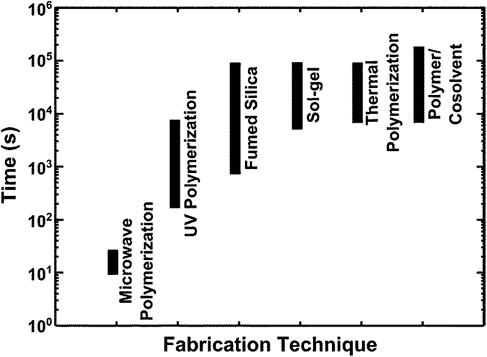
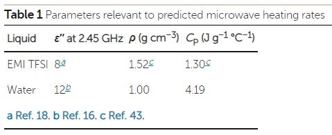
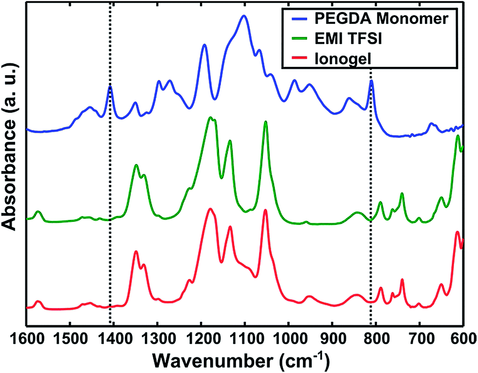
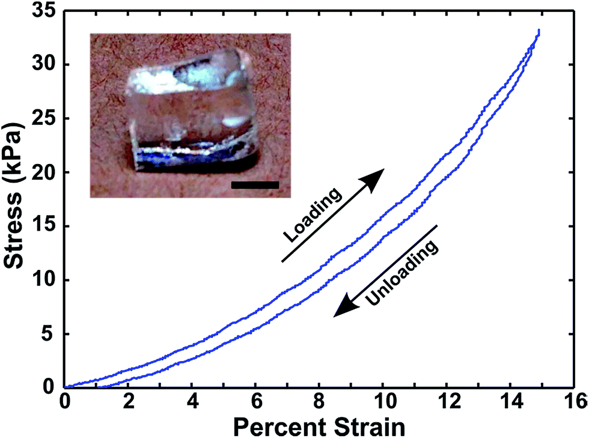
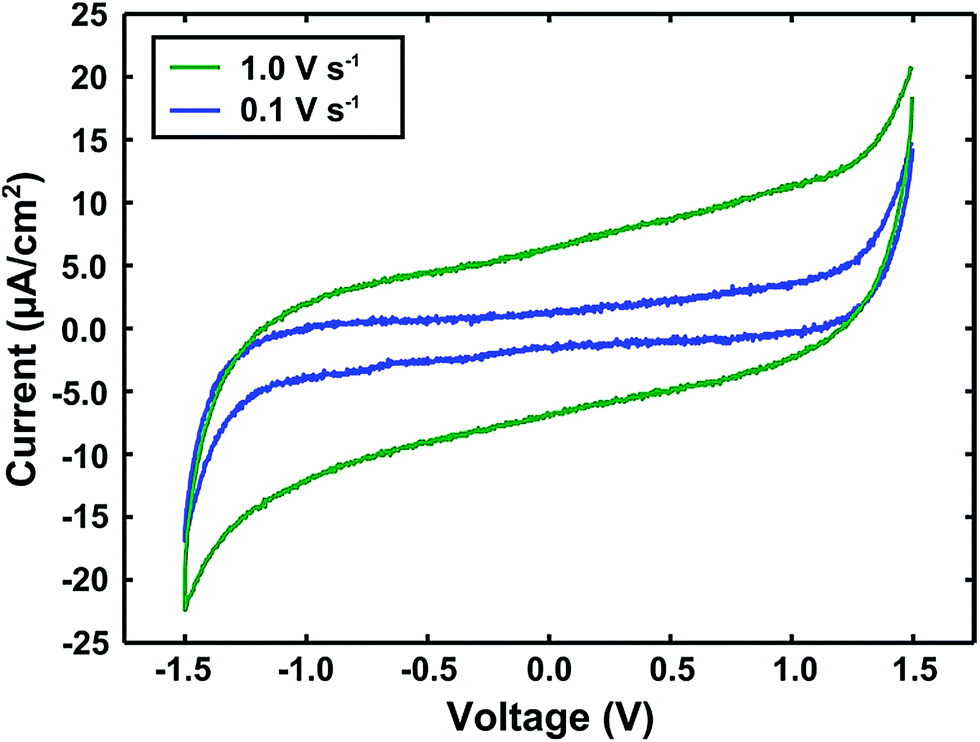

## Rapid, microwave-assisted thermal polymerization of poly(ethylene glycol) diacrylate-supported ionogels 聚乙二醇二丙烯酸酯负载的离子凝胶的快速微波辅助热聚合

> Adam F. Visentin, Tingyi Dong, Jonathan Polia, Matthew J. Panzer
> Journal of Materials Chemistry A
> DOI: [10.1039/C4TA00907J](https://doi.org/10.1039/C4TA00907J)
> Keywords: nonstoichiometric protic ionic liquid, proton conducting polymer electrolyte, poly(dimethylsiloxane), imidazole, 1,2,4-triazole

### Abstract
Current options for forming ionic liquid-based solid electrolytes (ionogels) often involve slow processes; however, by leveraging the inherent ability of the ionic liquid to harness the energy of microwave irradiation, a gel-forming, thermal polymerization can be achieved in a matter of seconds. The resulting ionogel electrolyte exhibits comparable electrical and mechanical performance to gels produced via conventional fabrication techniques.  
形成基于离子液体的固体电解质（离子凝胶）的当前选择通常涉及缓慢的过程。但是，通过利用离子液体的固有能力来利用微波辐射的能量，可以在几秒钟内完成形成凝胶的热聚合反应。所得的离子凝胶电解质表现出与通过常规制造技术生产的凝胶相当的电气和机械性能。

### Main
Solid electrolytes comprised mainly of nonvolatile, room temperature ionic liquids with a small amount of a solid supporting scaffold material, termed ionogels, are currently being investigated for a variety of electronic device applications, including: transistors,1,2 electrochemical capacitors,3–6 batteries,7,8 and solar cells.8 Ionogels offer the many benefits of ionic liquid electrolytes (nonvolatility, ionic conductivity, wide electrochemical window) in a leak-proof, solid form.9,10 In this report, a simple microwave heating method that can be used to realize the rapid formation of an ionogel (less than 30 s) is presented. The great utility of microwave technology has already been demonstrated in the use of ionic liquids as solvents for polymer synthesis.11,12,13 The ability of a solvent to absorb energy via microwave irradiation allows for a swift temperature rise in the liquid; this effect can be enhanced for solvents that exhibit ionic conductivity.14,15 Among the many advantages of microwave heating are decreased reaction times and an even heat distribution in the reaction medium, i.e. no wall effects.16 Microwave heating of several common ionic liquids has been well-studied;14,15,17–19 however, to date, there have been no known reports of the use of microwave irradiation to create a free-standing, solid ionogel electrolyte.  
固态电解质主要由不挥发的室温离子液体和少量的固态支撑支架材料（称为离子凝胶）组成，目前正在各种电子设备应用中进行研究，包括：晶体管，1,2，电化学电容器，3-6电池，7,8和太阳能电池。8离子凝胶以防漏的固体形式提供离子液体电解质的许多好处（不挥发，离子电导率，宽的电化学窗口）。9,10在此报告中，一种简单的微波加热方法提出了可用于快速形成离子凝胶（小于30 s）的方法。微波技术的巨大实用性已在使用离子液体作为聚合物合成的溶剂中得到了证明。11,12,13溶剂通过微波辐射吸收能量的能力使液体中的温度迅速升高。对于具有离子传导性的溶剂，这种作用可以增强。14,15在微波加热的众多优点中，反应时间减少，反应介质中的热量分布均匀，即无壁效应。16几种常见离子液体的微波加热具有已有充分研究； 14、15、17-19；然而，迄今为止，尚无关于使用微波辐射产生自立式固体离子凝胶电解质的报道。

Although several ionogel fabrication strategies have been reported in recent years, most of these require a processing time measured in several minutes to hours to achieve a gel (Fig. 1). In cases where drying or vacuum treatment steps are employed to remove volatile co-solvents or other gelation reaction byproducts, total gel formation times can be several days. Common ionogel fabrication methods include: use of a co-solvent to blend in a polymer support,3,5,20–22 initiation of a spontaneous sol–gel reaction to produce an inorganic support,23–26 stirring in an assembly of fumed silica particles,27–29 and either UV-initiated30–33 or thermally-initiated34–40 polymerization/crosslinking of a reactive monomer inside the ionic liquid. Additionally, chemical vapor deposition and alternative polymerization strategies that require on the order of minutes have been reported.41,42 UV-initiated polymerizations can also be employed to create ionogels in several minutes according to some reports;30–32 however, this is still not as rapid as is demonstrated here for microwave processing (Fig. 1), which can be as fast as 10–25 s.  
尽管近年来已经报道了几种离子凝胶的制备策略，但其中大多数都需要几分钟至几小时的加工时间才能获得凝胶（图1）。在采用干燥或真空处理步骤除去挥发性助溶剂或其他凝胶化反应副产物的情况下，总的凝胶形成时间可能是几天。常见的离子凝胶制备方法包括：使用助溶剂共混到聚合物载体中，3,5,20-22引发自发的溶胶-凝胶反应以产生无机载体，23-26在气相二氧化硅中搅拌粒子[27-29]和紫外线引发的[30-33]或热引发的[34-40]离子液体内部的反应性单体的聚合/交联。此外，据报道，化学气相沉积和替代性聚合策略需要几分钟的时间。41,42根据一些报告，紫外线引发的聚合也可以在几分钟内用于制造离子凝胶； 30–32，但这仍然是速度不如此处所示的微波处理速度快（图1），速度可高达10-25 s。

   
Fig. 1 A comparison of the ranges of typical ionogel formation times (in seconds) reported for various fabrication techniques: microwave-assisted polymerization (this work), UV-initiated polymerization,30–33 fumed silica addition,27–29 sol–gel scaffold,23–26 thermally-initiated polymerization,34–40 and polymer/cosolvent blends.3,5,20,21  
图1：各种制造技术的典型离子凝胶形成时间范围（以秒为单位）的比较：微波辅助聚合（这项工作），紫外线引发的聚合，30-33热解法二氧化硅的添加，27-29溶胶-凝胶支架，23–26热引发聚合，34–40和聚合物/助溶剂的混合物。3,5,20,21

The microwave-enabled ionogel fabrication approach described here enables one to dramatically reduce the time typically required for a thermally-initiated free radical polymerization/crosslinking reaction inside the ionic liquid due to extremely rapid heating. The ability to rapidly heat a liquid via microwave irradiation is driven by interactions between the wave and a molecular dipole. When a molecule absorbs microwave energy, its dipole shifts to align with the electric field; this shift creates friction between adjacent molecules, resulting in the dissipation of some energy as heat. The predicted rate of temperature rise can be expressed as:16  
本文所述的启用微波的离子凝胶制造方法使人们能够极大地减少由于极快的加热而在离子液体内部进行热引发的自由基聚合/交联反应通常所需的时间。通过微波和分子偶极子之间的相互作用来驱动通过微波辐射快速加热液体的能力。当分子吸收微波能量时，其偶极子会移动以与电场对齐；这种移动会在相邻分子之间产生摩擦，从而导致一些能量作为热量散失。预测的升温速率可以表示为：16

$\frac{\Delta T}{t} = \frac{\omega \epsilon_0 \epsilon^{''} |E|^2}{\rho C_p}$

where ΔT/t is the time rate of temperature change, ω is the angular frequency of the microwave radiation, ε0 is the vacuum permittivity, ε′′ the imaginary part of the liquid complex relative permittivity (evaluated at frequency ω), |E| is the electromagnetic field strength, ρ is the liquid density, and CP is the liquid specific heat capacity. As the dielectric loss tangent is directly proportional to ε′′, its magnitude reflects the relative efficiency by which electromagnetic energy can be converted into heat. It should be noted that commercial domestic microwave ovens operate at a frequency of 2.45 GHz.  
其中ΔT/t是温度变化的时间速率，ω是微波辐射的角频率，ε0是真空介电常数，ε''是液体复数相对介电常数的虚部（在频率ω处估算），| E |是电磁场强度，ρ是液体密度，CP是液体比热容。由于介电损耗角正切与ε''成正比，因此其大小反映了电磁能量可以转换为热量的相对效率。应当指出，商用家用微波炉的工作频率为2.45 GHz。

Table 1 summarizes three important parameters that determine the expected temperature rise for one of the most commonly studied ionic liquids, 1-ethyl-3-methylimidazolium-bis(trifluoromethanesulfonyl)imide (EMI TFSI), as well as for water.  
表1总结了三个重要参数，这些参数确定了最常研究的一种离子液体1-乙基-3-甲基咪唑鎓-双（三氟甲磺酰基）酰亚胺（EMI TFSI）以及水的预期温升。

  
Using eqn (1), it follows that the predicted microwave heating rate of EMI TFSI is approximately 40% higher than that of water for a given electric field strength. Although its ε′′ value at 2.45 GHz is slightly lower than that of water, the smaller density-specific heat capacity product of EMI TFSI facilitates a greater temperature rise per amount of microwave energy absorbed. For ionic liquids, one major advantage of using microwave heating is that their ionic conductivity facilitates strong electric dipole perturbations by the applied field. Thus, ionic liquids respond strongly to low frequency microwaves, such as those used in domestic microwaves. The result is a dramatic rate of ionic liquid temperature rise, which has been reported to exceed 10 °C s−1.17 Combined with these extremely rapid heating rates, the nonvolatile nature of ionic liquids allows for thermally-driven reactions to occur swiftly at high temperatures. A general hallmark of microwave heating as a technique is the lack of physical contact required between the heat source and the liquid; bypassing this conventional thermal conduction step can eliminate the time required for heat transfer within the reaction volume. The combination of all these factors highlights the outstanding ability to perform a rapid thermal polymerization of a reactive monomer within an ionic liquid to form an ionogel.  
使用等式（1），可以得出，对于给定的电场强度，EMI TFSI的预测微波加热速率比水的预测加热速率高约40％。尽管其在2.45 GHz处的ε'值略低于水的ε''值，但EMI TFSI的密度比热容乘积较小，每单位吸收的微波能量的温度升高幅度更大。对于离子液体，使用微波加热的一个主要优点是它们的离子电导率可通过施加的电场促进强烈的电偶极子扰动。因此，离子液体对低频微波（例如家用微波中使用的微波）有强烈的响应。结果是离子液体的温度急剧上升，据报道超过10°C s-1.17结合这些极高的加热速率，离子液体的非挥发性性质允许在高温下迅速发生热驱动反应。微波加热作为一项技术的一个普遍特征是，热源与液体之间缺乏物理接触。绕过该常规的导热步骤可以消除反应空间内传热所需的时间。所有这些因素的结合突显了在离子液体内进行反应性单体快速热聚合以形成离子凝胶的出色能力。

In order to demonstrate the feasibility of microwave-assisted ionogel formation, EMI TFSI was selected as the ionic liquid solvent. While a detailed procedure can be found in the ESI,† a brief description follows here. A solution containing requisite amounts of the ionic liquid, AIBN (thermal initiator) and poly(ethylene glycol) diacrylate (PEGDA) monomer (575 g mol−1) were prepared. The solution contained approximately 25 wt% PEGDA, as lower scaffold amounts did not reliably produce free-standing gels via the microwave-assisted approach. Solutions were sonicated to aid in mixing and to degas. Liquid precursor solution was heated inside a commercial domestic microwave oven using “on” pulses of 5 s duration and a total heating time of 10 s to 25 s. A pulsing strategy was employed in order to prevent overheating and subsequent thermal decomposition of the solution. All of the preceding steps were conducted under ambient laboratory conditions. The resulting ionogel material is an optically clear, free-standing solid.  
为了证明微波辅助离子凝胶形成的可行性，选择了EMI TFSI作为离子液体溶剂。尽管可以在ESI中找到详细的过程，†在此处进行简要说明。制备了包含必需量的离子液体，AIBN（热引发剂）和聚（乙二醇）二丙烯酸酯（PEGDA）单体（575 g mol-1）的溶液。该溶液包含约25 wt％PEGDA，因为较低的支架量不能通过微波辅助方法可靠地产生自立凝胶。超声处理溶液以帮助混合和脱气。使用持续时间为5 s的“接通”脉冲和10 s至25 s的总加热时间，在商用家用微波炉中加热液态前驱物溶液。为了防止溶液过热和随后的热分解，采用了脉冲策略。所有上述步骤都是在环境实验室条件下进行的。所得的离子凝胶材料是光学透明的独立固体。

The ionogel was found to contain a highly polymerized scaffold, as determined by FTIR spectroscopy (Fig. 2). The acrylate double bond (CH2[double bond, length as m-dash]CH) of the PEGDA monomer exhibits two distinct peaks in the FTIR spectra, highlighted by the vertical dotted lines in Fig. 2 at 810 cm−1 and 1410 cm−1. Comparison of the three spectra shown in Fig. 2 reveals the absence of these peaks for the ionogel, as well as for neat EMI TFSI.  
通过FTIR光谱测定，发现该离子凝胶包含高度聚合的支架（图2）。 PEGDA单体的丙烯酸酯双键（CH2双键，长度为m-CH）在FTIR光谱中显示出两个不同的峰，图2中的垂直虚线在810 cm-1和1410 cm-处突出显示1。图2中显示的三个光谱的比较表明，对于离子凝胶以及纯净的EMI TFSI，这些峰均不存在。

  
Fig. 2 FTIR spectra of the PEGDA monomer (blue), neat EMI TFSI (green), and a microwave-synthesized ionogel (red).  
图2 PEGDA单体（蓝色），纯EMI TFSI（绿色）和微波合成的离子凝胶（红色）的FTIR光谱。

The mechanical and electrical responses of PEGDA-supported EMI TFSI ionogels fabricated via microwave-assisted thermal polymerization were characterized in order to validate this method as a means of producing ionogels with properties similar to those produced by a previously-reported technique (UV-initiated polymerization/crosslinking).27 The ionic conductivity of the ionogel was measured to be 3.3 mS cm−1 by AC impedance spectroscopy (Fig. S1†); the corresponding value for EMI TFSI was 9.7 mS cm−1. A reduction in ionic conductivity of the ionogel compared to the neat ionic liquid is typically observed upon the addition of the scaffold material.37,39,40 Compared to the ionic conductivity of an ionogel with a UV-polymerized scaffold of the same PEGDA mass fraction (∼2 mS cm−1),30 the conductivity was ∼65% greater for the microwave-synthesized ionogel.  
PEGDA支持的EMI TFSI的机械和电响应离子凝胶通过微波辅助热聚合制造进行了表征，以验证此方法与类似于由先前报道的技术（UV引发的聚合反应产生的特性产生离子凝胶的手段27交流阻抗谱法测得离子凝胶的离子电导率为3.3 mS cm-1（图S1†）。 EMI TFSI的相应值为9.7 mS cm-1。在离子凝胶的离子导电性的降低相比于纯的离子液体通常在加入所述支架material.37,39,40的相比，离子凝胶的具有相同PEGDA质量分数的UV聚合的支架的离子导电性观察（〜2 mS cm-1），30对于微波合成的离子凝胶，电导率要大〜65％。

Mechanical characterization of the ionogel was performed via compression testing. Compression was chosen over tensile testing because it is believed to be more representative of the type of deformation an ionogel would experience in many device applications (e.g. normal force applied to a thin film battery). Compressive loading and unloading data for a microwave-synthesized ionogel are shown in Fig. 3.  
通过压缩测试对离子凝胶进行机械表征。选择拉伸而不是拉伸测试是因为认为它更能代表离子凝胶在许多设备应用中会经历的变形类型（例如，施加在薄膜电池上的法向力）。微波合成的离子凝胶的压缩加载和卸载数据如图3所示。

  
Fig. 3 Compressive stress–strain characteristics of a microwave-synthesized ionogel, which exhibits elastic behavior up to 15% strain. Inset: photograph of a representative microwave-synthesized ionogel (scale bar = 2 mm).  
图3微波合成的离子凝胶的压缩应力-应变特性，表现出高达15％应变的弹性行为。插图：代表微波合成的离子凝胶的照片（比例尺= 2 mm）。

The stress–strain data indicate highly elastic deformation up to at least 15% strain, as confirmed by minimal hysteresis between the loading and unloading curves. These microwave-synthesized PEGDA ionogels (25 wt% scaffold) exhibit Young's moduli of approximately 200 kPa to 500 kPa (5–10% strain regime), based on measurements made using several samples fabricated under identical conditions. It should be noted that the modulus value of a UV-cured ionogel containing 25 wt% PEGDA is approximately 6 MPa,30 which is at least one order of magnitude larger by comparison. This difference may be explained by an enhanced degree of interchain crosslinking for the UV-cured PEGDA scaffold in EMI TFSI compared to the scaffold formed under extremely rapid heating via the microwave-assisted thermal polymerization conditions employed here. This conclusion is also supported by the observation that PEGDA contents lower than 25 wt% did not result in reliable microwave-synthesized ionogels using the procedure outlined here, while the minimum amount of PEGDA needed to form a free-standing ionogel by the UV-curing approach is only ∼5 wt%.30,44 While beyond the scope of this present study, the exact temperature versus time heating profile is also believed to play an important role in the scaffold polymerization. In addition to any changes in the initiation/propagation/termination rate constants with temperature, it has been previously found that the ionic liquid viscosity (which also varies strongly with temperature) can be a determining factor in the scaffold formation of UV-polymerized PEGDA ionogels, where the moduli are reflective of the effective crosslink densities.30,44  
应力-应变数据表明在至少15％的应变下具有高弹性变形，这一点已通过加载和卸载曲线之间的最小滞后现象得到了证实。这些微波合成的PEGDA离子凝胶（25 wt％支架）显示出约200 kPa至500 kPa（5-10％应变范围）的杨氏模量，基于在相同条件下制备的几个样品的测量结果。应该注意的是，含有25 wt％PEGDA的UV固化的离子凝胶的模量值约为6 MPa，30，相比而言，至少大一个数量级。与通过本文采用的微波辅助热聚合条件在极快速加热下形成的支架相比，EMI TFSI中紫外线固化的PEGDA支架的链间交联度提高，可以解释这种差异。观察到以下结论也支持了这一结论：PEGDA含量低于25 wt％不能使用此处概述的程序产生可靠的微波合成离子凝胶，而通过UV固化形成自立式离子凝胶所需的最小PEGDA量该方法仅占〜5 wt％。30,44尽管超出了本研究的范围，但据信确切的温度​​随时间变化的加热曲线在支架聚合中也起着重要作用。除了引发/传播/终止速率常数随温度的任何变化外，先前已经发现离子液体粘度（也随温度而强烈变化）可能是紫外线聚合的PEGDA离子凝胶支架形成的决定因素，其中模量反映了有效的交联密度。30,44

The capacitive nature of the microwave-synthesized ionogel was verified by two-electrode cyclic voltammetry (CV). Fig. 4 displays CV spectra recorded at two different voltage sweep rates for an ionogel sandwiched between glassy carbon electrodes. An approximate specific device capacitance of 6 μF cm−2 can be extracted from the CV data (by dividing the average 0 V bias current magnitude by the sweep rate), which is consistent with such devices.30,44 The slightly sloped shape of the faster scan rate spectrum can be attributed to resistance in both the ionogel material and the testing setup. Importantly, the lack of redox current peaks near ±1 V indicates that there is no significant amount of water present, despite fabrication and testing under ambient conditions. Taken collectively, these observations confirm that the microwave-synthesized ionogel performs in a manner that is largely consistent with similar gels produced using one of the standard ionogel fabrication methods (UV-curing).  
微波合成的离子凝胶的电容性质已通过两电极循环伏安法（CV）进行了验证。图4显示了夹在玻璃碳电极之间的离子凝胶在两种不同电压扫描速率下记录的CV光谱。可以从CV数据中提取大约6μFcm-2的特定器件电容（通过将平均0 V偏置电流幅度除以扫描速率），这与此类器件是一致的。30,44更快的扫描速率谱可归因于离子凝胶材料和测试装置的电阻。重要的是，尽管在环境条件下进行了制造和测试，但没有在±1 V附近出现氧化还原电流峰值，这表明不存在大量的水。综上所述，这些观察结果证实了微波合成的离子凝胶的性能与使用标准离子凝胶制备方法之一（UV-固化）生产的类似凝胶在很大程度上一致。

  
Fig. 4 Cyclic voltammograms of a microwave-synthesized ionogel between glassy carbon electrodes at two different voltage sweep rates.  
图4 在两个不同的电压扫描速率下，微波合成的玻碳电极之间的离子凝胶的循环伏安图。

### Conclusions
Microwave heating has been successfully used to fabricate an ionogel for the first time. Extremely rapid heating due to the ability of the ionic liquid to absorb microwave energy has enabled gelation in as little as 10 s. This timescale is significantly swifter than any other known method for producing ionogels. EMI TFSI has been employed as a model ionic liquid to demonstrate the feasibility of rapid thermal polymerization of PEGDA within the liquid volume, forming a solid, supporting scaffold. Microwave-synthesized ionogels exhibit electrical and mechanical properties that are comparable to those of ionogels fabricated by other methods. Further control of the microwave-assisted heating profile may lead to even faster fabrication times for high performance, solid ionogel electrolytes.  
微波加热已成功地首次用于制造离子凝胶。由于离子液体吸收微波能量的能力，极快的加热使凝胶化的时间缩短至10 s。该时间尺度比任何其他已知的生产离子凝胶的方法都快得多。 EMI TFSI已被用作模型离子液体，以证明PEGDA在液体体积内快速热聚合，形成固体支撑支架的可行性。微波合成的离子凝胶具有与通过其他方法制造的离子凝胶相当的电和机械性能。微波辅助加热曲线的进一步控制可能导致高性能固体离子凝胶电解质的制造时间更快。