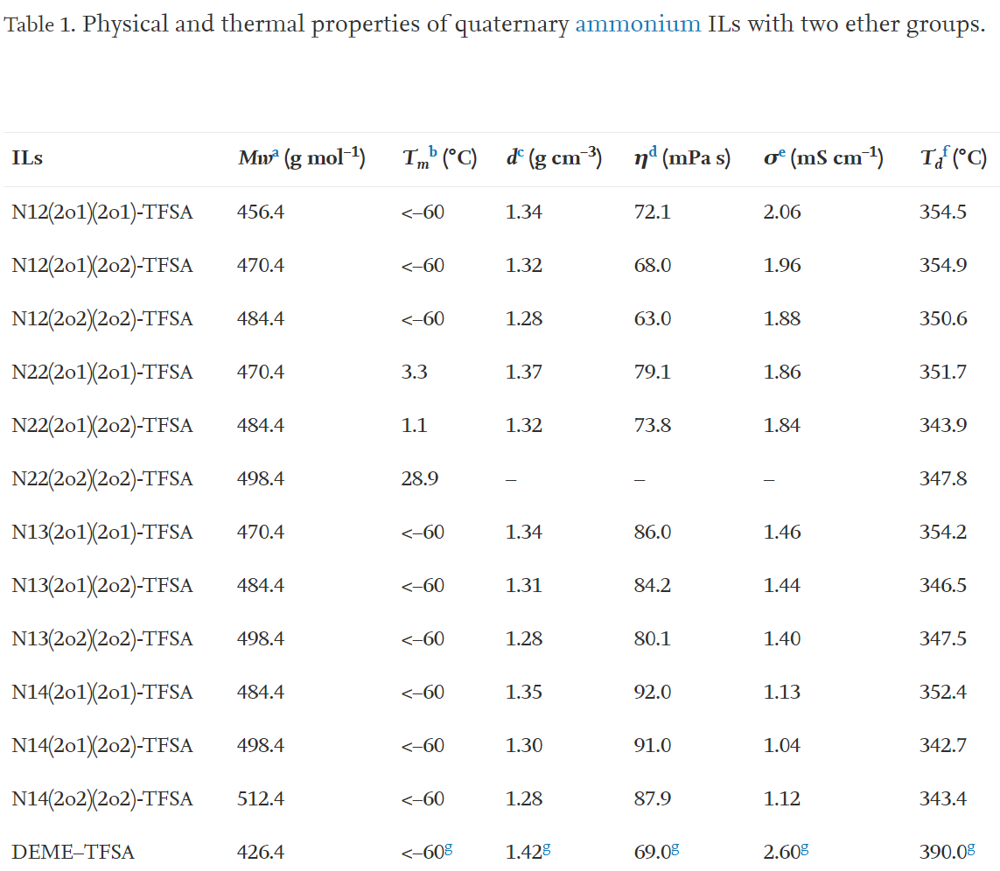
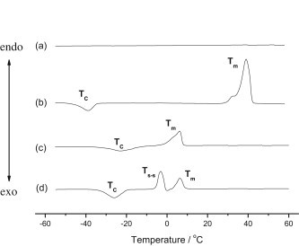
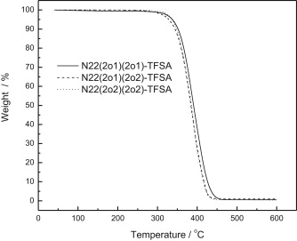
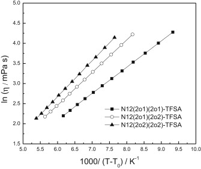
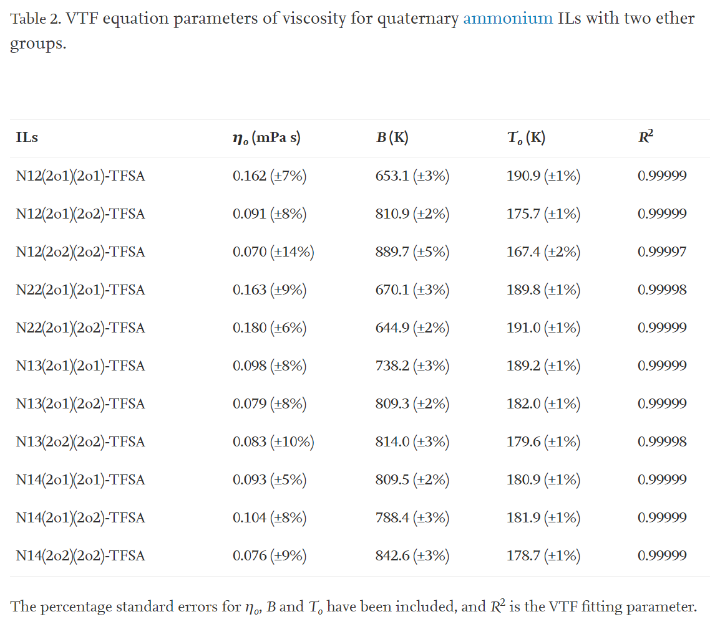
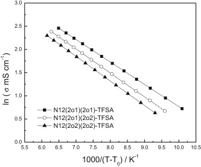
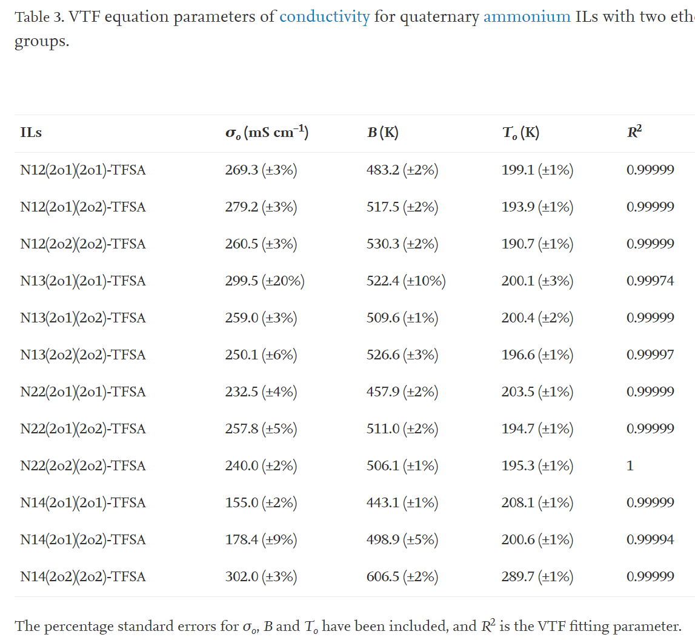

## Functionalized ionic liquids based on quaternary ammonium cations with two ether groups as new electrolytes for Li/LiFePO4 secondary battery 基于具有两个醚基的季铵阳离子的功能化离子液体，作为Li /LiFePO4二次电池的新型电解质

> Yide Jin, Jianhao Zhang, Jianzhi Song, Zhengxi Zhang, Shaohua Fang, Li Yang, Shin-ichi Hirano
> Journal of Power Sources, Volume 254, 15 May 2014, Pages 137-147
> DOI: [10.1016/j.jpowsour.2013.12.048](https://doi.org/10.1016/j.jpowsour.2013.12.048)  
> Keywords: Ionic liquids, Electrolyte, Lithium battery, Functionalized cation

### Highlights
- New functionalized quaternary ammonium ILs with two ether groups are reported.  
-They have low viscosity and good electrochemical stability.  
-Li/LiFePO4 cells using these IL electrolytes have good electrochemical performance.

### Abstract
New functionalized ILs based on quaternary ammonium cations with two ether groups and bis(trifluoromethanesulfonyl)imide (TFSA−) anion are synthesized and characterized. Physical and electrochemical properties, including melting point, thermal stability, viscosity, conductivity and electrochemical stability are investigated for these ILs. All these ILs are liquids at room temperature except N,N-diethyl-N,N-bis(2-ethoxyethyl)ammonium TFSA (N22(2o2)(2o2)-TFSA, Tm = 29.7 °C), and the viscosities of N-methyl-N-ethyl-N-(2-methoxyethyl)-N-(2-ethoxyethyl)ammonium TFSA (N12(2o1)(2o2)-TFSA) and N-methyl-N-ethyl-N,N-bis(2-ethoxyethyl)ammonium TFSA (N12(2o2)(2o2)-TFSA) are 68.0 cP and 63.0 cP at 25 °C, respectively. N-Methyl-N,N-diethyl-N-(2-methoxyethyl)ammonium TFSA (DEME–TFSA) and five ILs with lower viscosity are chosen to dissolve 0.6 mol kg−1 of LiTFSA as IL electrolytes without additive for lithium battery. Lithium plating and striping on Ni electrode can be observed in these IL electrolytes, and cycle performances of lithium symmetrical cells are also investigated for these IL electrolytes. Li/LiFePO4 cells using these IL electrolytes without additives have good cycle property at the current rate of 0.1 C, and the N-methyl-N-ethyl-N,N-bis(2-methoxyethyl)ammonium TFSA (N12(2o1)(2o1)-TFSA) and N12(2o2)(2o2)-TFSA electrolytes own better rate property than DEME–TFSA electrolyte.  
合成并表征了基于具有两个醚基的季铵阳离子和双（三氟甲磺酰基）酰亚胺（TFSA-）阴离子的新型功能化IL。研究了这些离子液体的物理和电化学性质，包括熔点，热稳定性，粘度，电导率和电化学稳定性。除了N，N-二乙基-N，N-双（2-乙氧基乙基）铵TFSA（N22（2o2）（2o2）-TFSA，Tm = 29.7°C）和N的粘度外，所有这些IL在室温下均为液体。 -甲基-N-乙基-N-（2-甲氧基乙基）-N-（2-乙氧基乙基）铵TFSA（N12（2o1）（2o2）-TFSA）和N-甲基-N-乙基-N，N-双（ 2-乙氧基乙基）铵TFSA（N12（2o2）（2o2）-TFSA）在25°C时分别为68.0 cP和63.0 cP。选择N-甲基-N，N-二乙基-N-（2-甲氧基乙基）铵TFSA（DEME-TFSA）和五个较低粘度的IL溶解0.6 mol kg-1的LiTFSA作为IL电解质，无需添加锂电池添加剂。在这些IL电解质中可以观察到镍在Ni电极上的镀覆和剥离，并且还研究了这些IL电解质对锂对称电池的循环性能。使用这些不含添加剂的IL电解质的Li /LiFePO4电池在0.1 C的电流速率下具有良好的循环性能，并且N-甲基-N-乙基-N，N-双（2-甲氧基乙基）铵TFSA（N12（2o1）（ 2o1）-TFSA）和N12（2o2）（2o2）-TFSA电解质比DEME-TFSA电解质具有更好的倍率性能。

### 1. Introduction
Ionic liquids (ILs) are molten salts with melting points at or below ambient temperature, which are consisted of various cations and anions. During the past decade, ILs have become increasingly popular in academia and industry due to their unique properties, including low vapor pressure, non-flammability, good thermal stability, great chemical and electrochemical stability and high ionic conductivity [1], [2], [3]. Their unique properties favor applications in diverse fields, such as synthesis, catalysis, separation technology, analytical chemistry, nanotechnology and electrochemistry [4], [5], [6], [7], [8], [9]. For electrochemistry aspect, ILs are frequently used as potential electrolytes for different electrochemical devices, like lithium secondary battery [10], [11], [12], [13], [14], [15], electrochemical double-layer capacitor [16], [17], [18], fuel cell [19], [20], and dye-sensitized solar cell [21], [22], [23].

Among various kinds of ILs, quaternary ammonium ILs have been investigated widely for lithium secondary battery, because of better electrochemical stability, low cost and easy preparation [24], [25], [26], [27], [28], [29], [30], [31], [32], [33], [34], [35], [36], [37]. Initially, some quaternary ammonium ILs without functional group are selected as electrolytes in lithium battery. Li/LiCoO2 battery employing trimethylpropylammonium bis(trifluoromethanesulfonyl)imide (N1113-TFSA) electrolyte shows non-ideal cycle performance and discharge capacity decreases rapidly, despite N1113-TFSA owning good electrochemical stability [38]. Tetraethylammonium 2,2,2-trifluoro-N-(trifluoromethylsulfonyl)acetamide (N2222-TSAC) electrolyte also has been applied in Li/LiCoO2 battery. Comparing to TFSA anion, the TSAC anion can help to lower both melting point and viscosity of IL, however, electrochemical stability decreases obviously than IL with TFSA anion, and the battery performance is also not satisfactory [39]. Furthermore, although Li/LiCoO2 battery using tetraamylammonium TFSA (N5555-TFSA) electrolyte shows good cycle stability, the rate performance is limited due to the high viscosity of N5555-TFSA (554 cP at 25 °C) [39].

Ether-functionalized ILs provide more choices for applications as electrolytes in lithium battery, because incorporating short ether group with electron-donating ability into IL cation can help to reduce viscosity and melting point, and not cause the obvious degradation of electrochemical stability [40], [41]. For quaternary ammonium ILs with one ether group, the most well-known IL is N,N-diethyl-N-methyl-N-(2-methoxyethyl)ammonium TFSA (DEME–TFSA). Seki et al. demonstrate excellent potential of DEME–TFSA electrolyte without any additive in Li/LiCoO2 battery, the characteristics of interface of LiCoO2 cathode and lithium metal anode is investigated in detail, and charge/discharge capacity retention up to 80% over 100 cycles is reported [29], [42]. Besides the Li/LiCoO2 battery, Tsunashima et al. have applied DEME–TFSA electrolyte in Li/LiNi0.8Co0.1Mn0.1O2 battery, achieving good cycle performance at low current rate [43]. Moreover, Sato et al. use DEME–TFSA electrolyte containing 10% vinylene carbonate (VC) in graphite/LiCoO2 battery, which also shows battery performance [44]. So far, like N-butyl-N-methylpyrrolidinium TFSA (PY14-TFSA) and N-propyl-N-methylpiperidinium TFSA (PP13-TFSA) based electrolytes [45], [46], [47], [48], [49], the DEME–TFSA based electrolytes can be considered as good benchmark for IL electrolytes applied in lithium battery, yet the DEME–TFSA owned lower viscosity and higher conductivity than the former two ILs.

Nowadays, researchers have paid attention to ILs with two or more ether groups. For quaternary ammonium ILs, 6 quaternary ammonium ILs with two identical 2-ethoxyethyl or 4-methoxybenzyl groups have been reported firstly, and thermal properties of these ILs have been investigated [50]. 8 quaternary ammonium ILs with two, three and four identical 2-methoxyethyl groups are prepared, and their physicochemical properties are studied [51]. Recently, our group has also synthesized 11 quaternary ammonium ILs with three or four different ether groups (2-methoxyethyl or 2-ethoxyethyl) [52]. It is found that these quaternary ammonium ILs with three or four ether groups show high viscosity and low conductivity, which go against the rate performance of lithium battery, owing to big size of quaternary ammonium cation with three or four ether groups could strengthen Van der Waals interactions between cations and anions and counteract more electron-donating action of ether groups. So quaternary ammonium ILs with two ether groups might be more appropriate as electrolytes for lithium battery.

In order to find more ILs with low viscosity and good electrochemical stability for applications in lithium battery as electrolytes, we have synthesized 12 diether-functionalized quaternary ammonium ILs with 2-methoxyethyl or 2-ethoxyethyl group, their structures and abbreviations are shown in Scheme 1, except N,N-diethyl-N,N-bis(2-methoxyethyl)ammonium TFSA (N22(2o1)(2o1)-TFSA), the other 11 ILs were reported for the first time. We investigated melting point, thermal stability, viscosity, conductivity and electrochemical window of these ILs. Five ILs with lower viscosity were applied in lithium battery as new electrolytes comparing with DEME–TFSA electrolyte. Behavior of lithium redox on Ni electrode and cycle performances of lithium symmetrical cells was studied for these IL electrolytes with 0.6 mol kg−1 LiTFSA, and charge–discharge characteristics of Li/LiFePO4 cells were examined. We found that the Li/LiFePO4 cells had good cycle performances at 0.1 C rate, and cells using N-methyl-N-ethyl-N,N-bis(2-methoxyethyl)ammonium TFSA (N12(2o1)(2o1)-TFSA) and N-methyl-N-ethyl-N-2-methoxyethyl-N-2-ethoxyethylammonium TFSA (N12(2o2)(2o2)-TFSA) electrolytes showed better rate performances than DEME–TFSA electrolyte.

  
Scheme 1. Synthesis routine and structures of quaternary ammonium ILs with two ether groups.  具有两个醚基的季铵离子液体的合成程序和结构。

### 2. Experimental
#### 2.1. Preparation of ILs based on quaternary ammonium cations with two ether groups and bis(trifluoromethanesulfonyl)imide anion
Commercially available reagents were purchased from Sinopharm Chemical Reagent Corporation Ltd., or Alfa Aesar. Lithium bis(trifluoromethylsulfonyl) imide (LiTFSA) was kindly provided by Morita Chemical Industries Corporation Ltd. And these reagents were of analytical grade and used in this work as received.

N,N-Dialkylamines was reacted with chloroethyl methyl ether or chloroethyl ethyl ether at 120 °C for 48 h in a 100 mL autoclave to prepare tertiary amines with one ether group as a reference method [44]. A mixture of tertiary amine with one ether group (100 mmol), bromoethyl methyl ether or 2-bromoethyl ethyl ether (95 mmol), and methanol (20 mL) in a 250 mL flask was refluxed at 80 °C for more than 72 h under an N2 atmosphere. The produced bromide was acquired after washing with ether. It was dissolved in acetone, and then purified with activated carbon. After filtration, the collected solution was evaporated under reduced pressure to remove the solvent. After drying in vacuum at 60 °C, the bromide and LiTFSA was dissolved in deionized water and mixed for 24 h at ambient temperature. The crude IL was dissolved with dichloromethane, and washed with deionized water until no residual halide anions in deionized water used to rinse the IL was detected with use of AgNO3. The dichloromethane was removed by rotating evaporation. All the products were dried under high vacuum for more than 24 h at 110 °C. Structures of tertiary amine containing one ether group were confirmed by 1H NMR (Avance III 400), and the structures of synthesized ILs were confirmed by 1H NMR and 13C NMR (Avance III 400), and chloroform-d was used as solvent for all the products. The characterization data are as follows:

N,N-Diethyl-N,N-di-(2-methoxyethyl)ammonium bis(trifluoromethanesulfonyl)imide (N22(2o1)(2o1)-TFSA), yield: 80%; 1H NMR: δ (ppm) 3.67–3.66 (t, 4H), 3.46–3.43 (t, 4H), 3.40–3.35 (m, 4H), 3.28 (s, 6H), 1.26–1.23 (t, 6H); 13C NMR: δ (ppm) 124.86–115.25, 66.79, 59.10, 58.28, 55.50, 7.57. N,N-Diethyl-N-2-methoxyethyl-N-2-ethoxyethylammonium bis(trifluoromethanesulfonyl)imide (N22(2o1)(2o2)-TFSA), yield: 75%; 1H NMR: δ (ppm) 3.70–3.64 (m, 4H), 3.45–3.41 (m, 6H), 3.40–3.34 (m, 4H), 3.27 (s, 6H), 1.25–1.21 (t, 6H), 1.11–1.08 (t, 3H); 13C NMR: δ (ppm) 124.81–115.33, 67.07, 65.78, 63.66, 59.12, 58.32, 58.23, 55.45, 14.83, 7.66. N,N-Diethyl-N,N-di-(2-ethoxyethyl)ammonium bis(trifluoromethanesulfonyl)imide (N22(2o2)(2o2)-TFSA), yield: 70%; 1H NMR: δ (ppm) 3.80–3.76 (m, 4H), 3.55–3.44 (m, 12H), 1.36–1.32 (t, 6H), 1.20–1.16 (t, 6H); 13C NMR: δ (ppm) 124.78–115.20, 69.94, 63.60, 58.21, 55.34, 14.73, 7.54. N-Methyl-N-ethyl-N,N-di-(2-methoxyethyl)ammonium bis(trifluoromethanesulfonyl)imide (N12(2o1)(2o1)-TFSA), yield: 85%; 1H NMR: δ (ppm) 3.78–3.74 (m, 4H), 3.62–3.49 (m, 6H), 3.35 (s, 6H), 3.10 (s, 3H), 1.39–1.34 (t, 3H); 13C NMR: δ (ppm) 124.70–115.14, 66.78, 61.69, 59.71, 58.74, 49.07, 7.88. N-Methyl-N-ethyl-N-2-methoxyethyl-N-2-ethoxyethylammonium bis(trifluoromethanesulfonyl)imide (N12(2o1)(2o2)-TFSA), yield: 75%; 1H NMR: δ (ppm) 3.82–3.75 (m, 4H), 3.63–3.48 (m, 8H), 3.36 (s, 3H), 3.11 (s, 6H), 1.40–1.35 (t, 3H), 1.20–1.16 (t, 3H); 13C NMR: δ (ppm) 124.68–115.15, 66.71, 65.70, 61.61, 63.62, 59.58, 58.83, 58.46, 49.09, 14.43, 7.75. N-Methyl-N-ethyl-N,N-di-(2-ethoxyethyl)ammonium bis(trifluoromethanesulfonyl)imide (N12(2o2)(2o2)-TFSA), yield: 70%; 1H NMR: δ (ppm) 3.84–3.79 (m, 4H), 3.63–3.49 (m, 10H), 3.12 (s, 3H), 1.40–1.36 (t, 3H), 1.20–1.17 (t, 3H); 13C NMR: δ (ppm) 124.72–115.14, 66.81, 63.70, 61.74, 59.70, 49.17, 14.62, 7.89. N-Methyl-N-propyl-N,N-di-(2-methoxyethyl)ammonium bis(trifluoromethanesulfonyl)imide (N13(2o1)(2o1)-TFSA), yield: 85%; 1H NMR: δ (ppm) 3.75–3.71 (m, 4H), 3.60–3.50 (m, 4H), 3.33 (s, 6H), 3.31–3.27 (m, 2H), 3.07 (s, 3H), 1.78–1.68 (m, 2H), 0.97–0.93 (t, 3H); 13C NMR: δ (ppm) 124.74–115.18, 66.03, 65.91, 62.36, 59.21, 49.79, 16.15, 10.48. N-Methyl-N-propyl-N-2-methoxyethyl-N-2-ethoxyethylammonium bis(trifluoromethanesulfonyl)imide (N13(2o1)(2o2)-TFSA), yield: 75%; 1H NMR: δ (ppm) 3.82–3.74 (m, 4H), 3.61–3.48 (m, 6H), 3.35–3.30 (m, 5H), 3.12 (s, 3H), 1.82–1.73 (m, 2H), 1.20–1.16 (t, 3H), 0.99–0.96 (t, 3H); 13C NMR: δ (ppm) 124.71–115.16, 66.82, 65.80, 65.63, 63.75, 62.70, 62.08, 58.77, 49.59, 15.87, 14.87, 10.07. N-Methyl-N-propyl-N,N-di-(2-ethoxyethyl)ammonium bis(trifluoromethanesulfonyl)imide (N13(2o2)(2o2)-TFSA), yield: 70%; 1H NMR: δ (ppm) 3.82–3.76 (m, 4H), 3.62–3.48 (m, 8H), 3.36–3.32 (m, 2H), 3.12 (s, 3H), 1.81–1.73 (m, 2H), 1.20–1.16 (t, 6H), 0.99–0.95 (t, 3H); 13C NMR: δ (ppm) 124.68–115.09, 66.77, 65.80, 63.72, 62.09, 49.58, 15.81, 14.64, 10.00. N-Methyl-N-butyl-N,N-di-(2-methoxyethyl)ammonium bis(trifluoromethanesulfonyl)imide (N14(2o1)(2o1) -TFSI), yield: 70%; 1H NMR: δ (ppm) 3.73–3.69 (t, 4H), 3.54–3.51 (m, 4H), 3.34–3.29 (m, 8H), 3.06 (s, 3H), 1.70–1.62 (m, 2H), 1.36–1.30 (m, 2H), 0.95–0.91 (t, 3H); 13C NMR: δ (ppm) 124.76–115.25, 65.85, 64.40, 62.20, 59.01, 49.77, 24.31, 19.44, 13.32. N-Methyl-N-butyl-N-2-methoxyethyl-N-2-ethoxyethylammonium bis(trifluoromethanesulfonyl)imide (N14(2o1)(2o2)-TFSI), yield: 65%; 1H NMR: δ (ppm) 3.75–3.72 (m, 4H), 3.57–3.44 (m, 6H), 3.35–3.31 (m, 5H), 3.07 (s, 3H), 1.71–1.63 (m, 2H), 1.37–1.28 (m, 2H), 1.16–1.12 (t, 3H), 0.95–0.91 (t, 3H); 13C NMR: δ (ppm) 124.85–115.24, 67.15, 66.02, 64.51, 63.98, 62.38, 62.35, 59.12, 49.79, 24.41, 19.51, 14.92, 13.41. N-Methyl-N-butyl-N,N-di-(2-ethoxyethyl)ammonium bis(trifluoromethanesulfonyl)imide (N14(2o2)(2o2)-TFSA), yield: 70%; 1H NMR: δ (ppm) 3.81–3.77 (m, 4H), 3.62–3.47 (m, 8H), 3.39–3.35 (m, 2H), 3.11 (s, 3H), 1.75–1.66 (m, 2H), 1.40–1.31 (m, 2H), 1.19–1.15 (t, 6H), 0.98–0.94 (t, 3H); 13C NMR: δ (ppm) 124.74–115.13, 67.24, 64.57, 64.03, 62.45, 49.83, 24.50, 19.66, 15.04, 13.61.

#### 2.2. Measurement
Water contents of dried ILs were detected by a moisture titrator (Metrohm 73KF coulometer) basing on Karl-Fischer method, and their values were less than 50 ppm. Density was affirmed by measuring weight of prepared IL (1.0 mL) at 25 °C.

Calorimetric measurement of each IL was performed by using a differential scanning calorimeter (DSC, Perkin–Elmer Pyris 1) in the temperature range from −60 °C to 60 °C. Each sample with an average weight of 4–6 mg was sealed in aluminum pan in a dry chamber, and then heated and cooled at scan rate of 10 °C min−1. Thermal data were collected during heating in the second heating-cooling scan. Thermal stabilities were measured with TGA (Perkin–Elmer, 7 series thermal analysis system). Each sample with an average weight of 4–6 mg was placed in a platinum pan, and heated at 10 °C min−1 from room temperature to 600 °C under nitrogen. Viscosity of each IL was got by using viscometer (DV-III ULTRA, Brookfield Engineering Laboratories, Inc.). Ionic conductivity was measured by using DDS-309+ conductivity meter in a dry chamber. Electrochemical windows of these ILs were tested by linear sweep voltammogramms (LSV, scan rate 10 mV s−1) in an argon-filled UNILAB glove box ([O2] < 1 ppm, [H2O] < 1 ppm). Working electrode was glassy carbon disk (3 mm diameter), and lithium metal was used as both counter and reference electrodes (surface area of 10 mm × 10 mm and thickness of 1.5 mm).

Plating and stripping behaviors of lithium in IL electrolytes (IL with 0.6 mol kg−1 LiTFSA) was determined by cyclic voltammogramms method (CV, scan rate 10 mV s−1) in the glove box. Nickel disk (2 mm diameter) was used as working electrode and lithium metal was used as both counter and reference electrodes (surface area of 10 mm × 10 mm and thickness of 1.5 mm). The nickel electrode was polished in the usage of alumina paste (d = 0.1 μm). And the Ni electrode was washed by deionized water then dried under vacuum. The LSV and CV tests were performed by CHI660D electrochemistry workstation (CH Instruments, Inc., USA) at room temperature (25 °C).

Lithium symmetrical coin cell (CR2016 stainless steel cell, 16 mm diameter disc of lithium foil and 19 mm borosilicate glass separator (GF/A, Whatman)) was constructed in the glove box. After the cell stayed at open circuit for 36 h, charge–discharge (C–D) cycling was conducted on CT2001A cell test instrument (LAND Electronic Co., Ltd.) at room temperature using a current density of 0.1 mA cm−2 for 32 min (16 min “charge” and 16 min “discharge”). Impedance responses of symmetrical cell were measured before and after the cycling by using CHI660D electrochemistry workstation (100 KHz-100 mHz; applied voltage 5 mV) at room temperature.

Li/LiFePO4 coin cell (CR2016 stainless steel cell) was assembled as test cell to evaluate performances of IL electrolytes for lithium secondary battery basing on the performances of lithium ion phosphate cathode. Lithium foil (battery grade) was used as a negative electrode and positive electrode was fabricated by spreading the mixture of LiFePO4 (kindly provided by PULEAD Technology Industry Co., LTD, China), acetylene black and PVDF (firstly dissolved in N-methyl-N-2-pyrrolidone) with a weight ratio of 8:1:1 on aluminum current collector (battery use). Loading of active materials was about ca. 1.5–2.0 mg cm−2 and this thinnish electrode was used without pressing. Glass filter made of borosilicate glass (GF/A, Whatman) was used as separator. Cell was assembled in the glove box, and all the components of cell were dried under vacuum before using. Cell performances were examined by the charge–discharge (C–D) cycling tests using a CT2001A cell test instrument (LAND Electronic Co., Ltd.) at 25 °C and at different current rates (0.1 C–2.0 C), current was determined by theoretical capacity of 170 mAh g−1 for Li/LiFePO4 cell. The cells were sealed and then stayed at room temperature for 4 h before the performance tests. Constant current charge–discharge cycles were conducted between 2.0 and 4.0 V (vs. Li/Li+). Charging included two processes: (1) constant current at a rate, cut-off voltage of 4.0 V; (2) constant voltage at 4.0 V, held for 1 h. And discharging had one process: constant current at the same rate, cut-off voltage of 2.0 V.

### 3. Results and discussion
#### 3.1. Properties of these ILs
Physicochemical properties of these quaternary ammonium ILs with two ether groups, including melting point, density, viscosity, conductivity and thermal decomposition temperature, are listed in Table 1. In order to discuss properties clearly, these ILs were classified to N12 series, N22 series, N13 series and N14 series basing on the substituent groups at central nitrogen atom except the two ether groups.

  
Table 1. Physical and thermal properties of quaternary ammonium ILs with two ether groups.  
a. Molecular Weight.  
b. Melting point.  
c. Density at 25 °C.  
d. Viscosity at 25 °C.  
e. Conductivity at 25 °C.  
f. Decomposition temperature of 10% weight loss.  
g. Literature data [55].  

Phase transitions of these ILs were investigated by differential scanning calorimetry (DSC), and DSC traces of four ILs are shown in Fig. 1 as examples. N22(2o2)(2o2)-TFSA (Fig. 1(b)) and N22(2o1)(2o2)-TFSA (Fig. 1(c)) owned a crystallization transition (Tc) before melting transition (Tm), and N22(2o1)(2o1)-TFSA (Fig. 1(d)) showed a solid–solid transition (Ts–s) between crystallization transition and melting transition. Like N12(2o1)(2o1)-TFSA (Fig. 1(a)), the rest eight ILs did not show any phase transition behaviors until −60 °C, which was interior temperature limit of our DSC measurement, and we denoted their melting points by “<−60 °C” like several published papers [50], [53].

  
Fig. 1. DSC curves of (a) N12(2o1)(2o1)-TFSA, (b) N22(2o2)(2o2)-TFSA, (c) N22(2o1)(2o2)-TFSA, (d) N22(2o1)(2o1)-TFSA.

Usually, for imidazolium, quaternary ammonium, phosphonium, pyrrolidinium, piperidinium and guanidinium ILs, introducing one short ether group into cation has been proved to be helpful to reduce melting points of ILs, due to weakening electrostatic interaction between cation and anion (which resulted from electron donation action of ether group), reducing symmetry of cations, and high flexibility of ether group [53], [54], [55], [56], [57]. When two 2oR ether groups were incorporated into quaternary ammonium cations, due to stronger electron-donating effect of more ether groups, some ILs with low melting points could also be acquired. As shown in Table 1, melting points of N12 series, N13 series and N14 series ILs were all lower than −60 °C. For N22 series ILs, N22(2o1)(2o1)-TFSA, N22(2o1)(2o2)-TFSA and N22(2o2)(2o2)-TFSA owned melting points of 3.3, 1.1, and 28.9 °C respectively, which might be ascribed to higher symmetry of N22 series cations overwhelms the electron-donating effect of two ether groups.

Thermal stabilities of these ILs were examined by variable-temperature TGA experiments. Like N12 series ILs, which are shown in Fig. 2 as examples, all these quaternary ammonium ILs with two ether groups had one-stage decomposition behavior. Generally, Td values of ILs with TFSA− anion decreased with increasing of number of ether groups in IL cations, basing on the thermal decomposition temperatures of 1,3-dialkylimidazolium, trialkylimidazolium, pyrrolidinium, piperidinium and guanidinium ILs without and with one or two ether groups [54], [55], [56], [57], [58], [59], [60], [61]. Likewise, in terms of Table 1 and published data [52], for quaternary ammonium ILs without and with one, two, three or four ether groups, thermal stability also decreased with increasing of number of ether groups. For example, the thermal decomposition temperature decreased in following order: N1224-TFSA, 400 °C > DEME–TFSA, 390 °C > N12(2o1)(2o1)-TFSA, 354.5 °C > N2(2o1)3-TFSA, 331.5 °C > N(2o1)4-TFSA, 315.7 °C. Though more ether groups could cause a negative effect to thermal stability of ILs, the thermal decomposition temperatures of these quaternary ammonium ILs with two ether groups were still higher than 340 °C.

  
Fig. 2. TGA traces of N22(2o1)(2o1)-TFSA, N22(2o1)(2o2)-TFSA and N22(2o2)(2o2)-TFSA.

Viscosity of IL is generally affected by the ion symmetry, ion size, and ion interactions (such as electrostatic and Van der Waals attractions) [62]. The viscosity of IL is an important parameter for evaluating its use as media in chemical and electrochemical applications, and ILs with low viscosity can be beneficial for the mass transport properties. Usually, for imidazolium, quaternary ammonium, phosphonium, pyrrolidinium, piperidinium and guanidinium ILs, replacing one alkyl group in the cations by one ether group with the similar size and formula weight, could help to reduce viscosity of IL, due to weakening electrostatic interaction between the cation and anion which resulted from the electron-donating action of ether group [53], [54], [55], [56], [57]. When two ether groups were introduced into pyrrolidinium, guanidinium and trialkylimidazolium ILs, some ILs showed viscosity close to their counterparts ILs without and with one ether group of smaller cation sizes [58], [59], [60]. According to Table 1, for these quaternary ammonium ILs with two ether groups, N12 series ILs owned viscosity close to that of DEME–TFSA (69 cP at 25 °C), and the viscosities of N12(2o1)(2o2)-TFSA (68.0 cP) and N12(2o2)(2o2)-TFSA (63.0 cP) were lower than DEME–TFSA. Moreover, though the viscosities of N22 series, N13 series and N14 series ILs were higher than DEME–TFSA, their viscosities were still all lower than 100 cP, which were obviously lower than the viscosities of quaternary ammonium ILs with three or four ether groups [52].

In terms of Table 1, for the four ILs series, their viscosities increased as follows: N12 series < N22 series < N13 series < N14 series when the two ether groups in IL cations were identical, which could be ascribed to increasing of cation sizes. But in each ILs series, if IL cation with more 2-ethoxyethyl (2o2), lower viscosity the IL would have, despite 2-ethoxyethyl group had bigger size than 2-methoxyethyl (2o1) group. Similarly, comparing the viscosities of pyrrolidinium, quaternary ammonium, 1,3-dialkylimidazolium ILs with one 2o1 group or one 2o2 group, it could be found that 2o2 group was more effective to reduce viscosity than 2o1 group [63]. This phenomenon indicated that other factors might affect the IL viscosity besides ion symmetry, ion size and ion interactions, which might be attributed to influence of ion pairs or complexes in ILs on viscosity.

Fig. 3 shows temperature dependence of viscosity for N12 series ILs which was investigated over the temperature range 25–80 °C, and η (T) behavior was fitted by a Vogel–Tammann–Fulcher (VTF) Eq. (1) using the software of Origin 7.5: $\eta = \eta_0 exp(\frac{B}{T-T_0})$ (1)

where T is absolute temperature, η0 (cP), B (K) and T0 (K) are adjustable parameters. The η0 is a temperature-independent pre-factor, B is pseudo-activation energy and T0 is related to ideal glass transition temperature [64], [65]. The best-fit η0 (cP), B (K) and T0 (K) parameters for all these ILs are given in Table 2 along with corresponding fitting coefficient R2 values. The viscosities of these ILs were very well fitted by VTF model over the temperature range studied. From Table 2, it was learned that usually if IL owned smaller T0 value, bigger B value it would have, and IL viscosity was more sensitive with temperature changing over the temperature studied according to Eq. (1). Among these ILs, N12(2o2)(2o2)-TFSA had minimum T0 value and maximum B value, while N22(2o1)(2o2)-TFSA had biggest T0 value and smallest B value. And in N12 series, N13 series and N14 series, IL with two 2-ethoxyethyl groups had smaller T0 value and higher B value.

  
Fig. 3. VTF plots of viscosity for N12(2o1)(2o1)-TFSA, N12(2o1)(2o2)-TFSA and N12(2o2)(2o2)TFSA.

Table 2. VTF equation parameters of viscosity for quaternary ammonium ILs with two ether groups.
  

Substituting one alkyl group in IL cation by one ether group with the similar size and formula weight could also be beneficial to increase conductivity [53], [54], [55], [56], [57]. When two ether groups were introduced into cations of ILs, for pyrrolidinium, piperidinium, guanidinium and trialkylimidazolium ILs, the IL conductivity decreased comparing with the counterpart ILs based on smaller cation sizes with or without one ether group, because of the increasing of cation sizes and Van der Waals interactions between cations and anions [58], [59], [60]. Likewise, for these quaternary ammonium ILs with two ether groups, their conductivities were in the range of 1.02–2.06 mS cm−1 at room temperature, which were smaller than DEME–TFSA (2.6 mS cm−1) [55]. And as the viscosity property, the conductivities of quaternary ammonium ILs with two ether groups were higher than the quaternary ammonium ILs with three or four ether groups. For the four ILs series, their conductivities decreased as follows: N12 series > N22 series > N13 series > N14 series when the two ether groups in ILs series were identical, due to obviously increasing of cation sizes. In each ILs series, IL conductivity decreased with increasing of cation size, if IL had more 2-methoxyethyl group, higher conductivity it would have. Considering viscosity of these quaternary ammonium ILs, it was interestingly found that IL with lowest viscosity did not show highest conductivity in each ILs series, and it is possible that IL with smaller cation size might have higher conductivity when their viscosities did not differ apparently from each other.

Temperature dependence of conductivity was also investigated for these quaternary ammonium ILs with two ether groups in temperature range of 25–80 °C, and VTF plots for N12 series ILs according to Eq. (2) are illustrated in Fig. 4 as example.
$\sigma = \sigma_0 exp(\frac{-B}{T-T_0})$(2)
where T is absolute temperature, σ0 (mS cm−1), B (K) and T0 (K) are adjustable parameters of Eq. (2). The σ0 is maximum electrical conductivity (that it would have at infinite temperature), B is related to activation energy for electrical conduction and T0 is ideal glass transition temperature at which the conductivity goes to zero. The best-fit σ0, B and T0 parameters for all these ILs are given in Table 3 along with corresponding fitting coefficient R2 values. Like the temperature dependence of viscosity, the temperature dependence of conductivity for these ILs suited the VTF model very well over the temperature range studied. From Eq. (2), it could be inferred that if IL owned bigger B value, the conductivity would be more insensitive with temperature changing over the studied temperature range. Among these ILs, N14(2o2)(2o2)-TFSA had maximum B value while N14(2o1)(2o1)-TFSA owned smallest B value. By the comparisons of T0 value between viscosity and conductivity for the same ionic liquid, it could be found that T0 value of viscosity was smaller than T0 value of conductivity and B value of viscosity was bigger than that of conductivity.

  
Fig. 4. VTF plots of conductivity for N12(2o1)(2o1)-TFSA, N12(2o1)(2o2)-TFSA, N12(2o2)(2o2)-TFSA.

Table 3. VTF equation parameters of conductivity for quaternary ammonium ILs with two ether groups.  
  

