## New functionalized ionic liquids based on pyrrolidinium and piperidinium cations with two ether groups as electrolytes for lithium battery 基于吡咯烷鎓和哌啶鎓阳离子并带有两个醚基的新型功能化离子液体作为锂电池的电解质

> Shaohua Fang, Zhengxi Zhang, Yide Jin, Li Yang*, Shin-ichi Hirano, Kazuhiro Tachibana, Shingo Katayama
> Journal of Power Sources, Volume 196, Issue 13, 1 July 2011, Pages 5637-5644
> DOI: [10.1016/j.jpowsour.2011.02.047](https://doi.org/10.1016/j.jpowsour.2011.02.047)  
> Keywords: Lithium battery, Ionic liquid, Electrolyte, Functionalized cation

### Abstract
Four new functionalized ILs based on piperidinium and pyrrolidinium cations with two ether groups and TFSI− anion are synthesized and characterized. Physical and electrochemical properties of these ILs, including melting point, thermal stability, viscosity, conductivity and electrochemical stability, are investigated. All the ILs are liquids at room temperature, and the viscosities of P(2o1)2-TFSI and P(2o1)(2o2)-TFSI are 55 and 53 mPa s at 25 °C, respectively. Behavior of lithium redox, chemical stability against lithium metal and charge–discharge characteristics of lithium batteries, are also investigated for these IL electrolytes with 0.6 mol kg−1 LiTFSI. Though the cathodic limiting potentials of these ILs are 0.4 V versus Li/Li+, the lithium plating and striping on Ni electrode can be observed for these IL electrolytes, and these IL electrolytes show good chemical stability against lithium metal. Li/LiFePO4 cells using these IL electrolytes without additives have good capacity and cycle property at the current rate of 0.1 C, and the cell using the P(2o1)(2o2)-TFSI electrolyte owns good rate property.  
合成并表征了基于具有两个醚基的哌啶鎓和吡咯烷鎓阳离子的四种新型功能化IL，并对其进行了表征。研究了这些离子液体的物理和电化学性质，包括熔点，热稳定性，粘度，电导率和电化学稳定性。所有IL在室温下均为液体，在25°C下P（2o1）2-TFSI和P（2o1）（2o2）-TFSI的粘度分别为55和53 mPa s。对于这些含0.6 mol kg-1 LiTFSI的IL电解质，还研究了锂氧化还原的行为，对锂金属的化学稳定性以及锂电池的充放电特性。尽管这些IL的阴极极限电位相对于Li /Li +为0.4 V，但对于这些IL电解质，可以观察到镍电极在Ni电极上的锂镀覆和剥离，并且这些IL电解质对锂金属显示出良好的化学稳定性。使用这些不含添加剂的IL电解质的Li /LiFePO4电池在0.1 C的电流速率下具有良好的容量和循环性能，而使用P（2o1）（2o2）-TFSI电解质的电池则具有良好的速率特性。

### Highlights
- Four functionalized ILs based on piperidinium and pyrrolidinium cations with two ether groups are reported for the first time.   
- They have low viscosity and good electrochemical stability.   
- Li/LiFeO4 cells using these IL electrolytes without additives have good capacity and cycle property at the rate of 0.1 C, and one electrolyte owns good rate property.

### 1. Introduction
During the past decade, ionic liquids (ILs) have attracted great interests of researchers due to their superior properties, including nonvolatility, nonflammability, good thermal stability, good electrochemical stability and high ionic conductivity [1], [2]. Basing on these properties, ILs have showed potential as safe electrolytes for being applied in high-energy-density lithium battery system, which uses lithium metal anode with high theoretical capacity (more than 3860 mAh g−1) [3], [4], [5], [6]. In different kinds of ILs which have been used as electrolytes in lithium battery, piperidinium and pyrrolidinium ILs have been investigated intensively, because of better electrochemical stability (low cathodic limiting potential), low viscosity and easy preparation [3], [4], [7], [8], [9], [10], [11], [12], [13], [14], [15], [16], [17], [18], [19], [20]. For example, N-methyl-N-propylpiperidinium bis(trifluoromethanesulfonyl)imide (PP13-TFSI) and N-methyl-N-propylpyrrolidinium bis(fluorosulfonyl)imide (P13-FSI) have been reported to own good cycle performance when they are used in lithium battery at low rate without additives [3], [4].

Now, functionalized IL is a very noticeable topic in the field of IL research. Introducing different functional groups into cations, which provides more ILs with new structures, can markedly change the physicochemical properties of ILs, and afford more choices for different applications of ILs [21], [22]. Compared with other functional groups, one short ether group may reduce the viscosities and melting points of ILs, and does not result in the obvious degradation of electrochemical stability [23], [24], [25], [26], [27], [28]. So researchers have paid more attention to the functionalized ILs with ether group, and one ether group has been introduced into imidazolium cations [29], [30], [31], [32], [33], [34], quaternary ammonium cations [23], [24], [25], [26], [27], [35], piperidinium cations [26], [28], pyrrolidinium cations [28], morpholinium cations [28], oxazolidinium cations [28], guanidinium cations [36], sulfonium cations [37] and quaternary phosphonium cations [27]. By contrast with the ILs with one ether group, researches involving the ILs with two or more ether groups are quite rare. A series of novel imidazolium ILs based on cations with two identical ether groups have been developed, but the viscosities of these ILs are all higher than 80 mPa s at 25 °C due to long chains of ether groups [38]. Kärnä and co-workers have synthesized several quaternary ammonium ILs based on cations with two identical ether groups (2-ethoxyethyl group or 4-methoxybenzyl group), and the thermal properties of these ILs have been investigated [39]. Recently, some quaternary ammonium ILs with two, three or four identical ether groups (2-methoxyethyl group) in cations had been reported, and their properties have been investigated [40].

In order to find more ILs with low viscosity and good electrochemical stability for the applications in lithium battery as electrolytes, we had synthesized four new ILs based on piperidinium and pyrrolidinium cations with two ether groups (2-methoxyethyl group or 2-ethoxyethyl group) and TFSI− anion in this work. And the structures of these new ILs are shown in Fig. 1. We had investigated melting point, thermal stability, viscosity, conductivity and electrochemical windows of these new ILs. Behavior of lithium redox on Ni electrode and chemical stability against lithium metal, were also investigated for these IL electrolytes with 0.6 mol kg−1 LiTFSI. We examined the charge–discharge characteristics for the Li/LiFePO4 cells using these IL electrolytes. We found that the cells had good capacity and cycle property at the current rate of 0.1 C, and the cell using the P(2o1)(2o2)-TFSI electrolyte owned good rate property.

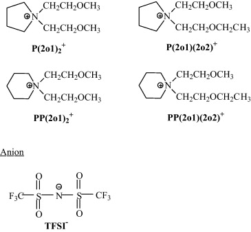  
Fig. 1. Structures of cations and anion of these functionalized ILs.

### 2. Experimental
Pyrrolidine or piperidine reacted with chloroethyl methyl ether to prepare N-2-methoxyethylpyrrolidine or N-2-methoxyethylpiperidine as a reference method [41]. A mixture of N-2-methoxyethylpyrrolidine (or N-2-methoxyethylpiperidine, 100 mmol), bromoethyl methyl ether (or 2-bromoethyl ethyl ether, 95 mmol), and methanol (20 mL) in a 250 mL flask was refluxed at 85 °C for more than 72 h under an N2 atmosphere. The produced bromide was acquired after washing with ether. It was dissolved in acetone (or acetone and acetonitrile), and then purified with activated carbon. After filtration, the collected solution was evaporated under reduced pressure to remove the solvent. After drying in vacuum at 60 °C, the bromide and LiTFSI was dissolved in deionized water and mixed for 24 h at ambient temperature. The crude IL was dissolved with dichloromethane, and washed with deionized water until no residual halide anions in the deionized water used to rinse the IL was detected with use of AgNO3. The dichloromethane was removed by rotating evaporation. All the products were dried under high vacuum for more than 24 h at 105 °C. The water content of the dried IL was detected by a moisture titrator (Metrohm 73KF coulometer) basing on Karl–Fischer method, and the value was less than 50 ppm. The structures of synthesized ILs were confirmed by 1H NMR and 13C NMR (Avance ||| 400), and chloroform-d for all ILs. The characterization data are as follows:

P(2o1)2-TFSI: 1H NMR: δ (ppm) 3.75–3.73 (m, 4H), 3.65–3.62 (m, 4H), 3.57–3.55 (m, 4H), 3.34 (s, 6H), 2.20–2.17 (m, 4H); 13C NMR: δ (ppm) 124.88–115.22, 66.53, 64.45, 59.91, 59.06, 21.20; P(2o1)(2o2)-TFSI: 1H NMR: δ (ppm) 3.74–3.71 (m, 4H), 3.63–3.61 (m, 4H), 3.56–3.53 (m, 4H), 3.50–3.45 (m, 2H), 3.32 (s, 3H), 2.18–2.16 (m, 4H), 3.17–3.13 (t, 3H); 13C NMR: δ (ppm) 124.83–115.25, 67.14, 66.61, 64.52, 64.49, 60.13, 60.02, 59.12, 21.39, 14.94; PP(2o1)2-TFSI: 1H NMR: δ (ppm) 3.69–3.67 (t, 4H), 3.57–3.55 (m, 4H), 3.39–3.36 (t, 4H), 3.27 (s, 6H), 1.85–1.79 (m, 4H), 1.65–1.59 (m, 2H); 13C NMR: δ (ppm) 124.78–115.23, 65.75, 61.38, 59.65, 59.09, 20.77, 19.89; PP(2o1)(2o2)-TFSI: 1H NMR: δ (ppm) 3.75–3.72 (m, 4H), 3.62–3.60 (m, 4H), 3.49–3.41 (m, 6H), 3.31 (s, 3H), 1.87–1.85 (m, 4H), 1.67–1.65 (m, 2H), 1.15–1.11 (t, 3H); 13C NMR: δ (ppm) 124.88–115.25, 67.12, 65.89, 63.71, 61.47, 59.83, 59.68, 59.15, 20.84, 20.02, 14.89.

Calorimetric measurement of each IL was performed by using a differential scanning calorimeter (DSC, Perkin-Elmer Pyris 1) in the temperature range −60 °C to a predetermined temperature. Each sample with an average weight of 4–6 mg was sealed in aluminum pan in a dry chamber, and then heated and cooled at scan rate of 10 °C min−1. The thermal data were collected during heating in the second heating–cooling scan. The thermal stabilities were measured with TGA (Perkin-Elmer, 7 series thermal analysis system). Each sample with an average weight of 4–6 mg was placed in the platinum pan, and heated at 10 °C min−1 from room temperature to 600 °C under nitrogen. The viscosity value of each IL was measured by using viscometer (DV-III ULTRA, Brookfield Engineering Laboratories Inc.). The density was determined by measuring the weight of prepared IL (1.0 mL) in a dry chamber at 25 °C. The ionic conductivity was measured by using DDS-11A conductivity meter in a dry chamber.

The 0.6 mol kg−1 of LiTFSI was added to the dried IL to acquire IL electrolyte, and this procedure was carried out in an argon-filled glove box. The water contents of the IL electrolytes were detected by a moisture titrator (Metrohm 73KF coulometer) basing on Karl–Fischer method, and the values were 27, 31, 35 and 33 ppm for P(2o1)2-TFSI, P(2o1)(2o2)-TFSI, PP(2o1)2-TFSI and PP(2o1)(2o2)-TFSI electrolytes.

Electrochemical window of the IL was measured by linear sweep voltammogram (LSV) in the glove box. The working electrode was glassy carbon disk (3 mm diameter), and lithium metal was used as both counter and reference electrodes. The plating and stripping behaviors of lithium in the IL electrolytes were examined by using cyclic voltammogram (CV) method in the glove box. The nickel disk (2 mm diameter) was used as the working electrode, and lithium metal was used as both counter and reference electrodes. The Ni electrode was polished with alumina paste (d = 0.1 μm). And the polished electrode was washed with deionized water and dried under vacuum. The linear sweep voltammogram and cyclic voltammogram were performed by CHI 660D electrochemistry workstation at room temperature (25 °C).

The stability of the IL electrolyte against lithium at room temperature was investigated by monitoring the time evolution of the impedance response for a symmetric Li/IL electrolyte/Li coin cell with the borosilicate glass separator (GF/A from Whattman), and the impedance responses were measured by using CHI 660D electrochemistry workstation (100 kHz–50 mHz; bias voltage 5 mV).

Coin cell was used to evaluate the performances of the IL electrolytes in lithium battery applications. Lithium metal was used as anode, and its area was 2.0 cm2. Cathode was fabricated by spreading the mixture of carbon coated LiFePO4, acetylene black and PVDF (initially dissolved in N-methyl-2-pyrrolidone) with a weight ratio of 8:1:1 onto Al current collector (battery use). Loading of active material was about ca. 1.5 mg cm−2 and this thinner electrode was directly used without pressing. The separator was also glass filter made of borosilicate glass (GF/A from Whattman). Cell construction was carried out in the glove box, and all the components of cell were dried under vacuum before placed into the glove box. The cells were sealed and then stayed at room temperature for 4 h before performance test. The cell performances were examined by the galvanostatic charge–discharge (C–D) cycling test using a CT2001A cell test instrument (LAND Electronic Co. Ltd.) at room temperature (25 °C). Current rate was determined by using the nominal capacity of 170 mAh g−1 for Li/LiFePO4 cell. Charge included two processes: (1) constant current at a rate, cut-off voltage of 4.0 V, and (2) constant voltage at 4.0 V, 1 h time, and discharge had one process: constant current, cut-off voltage of 2.0 V.

### 3. Results and discussion
#### 3.1. Properties of these ILs
Due to weakening electrostatic interaction between the cation and anion which resulted from the electron-donating action of ether group, reducing symmetry of cations, and high flexibility of ether group, introducing one short ether group into imidazolium [34], quaternary and cyclic quaternary ammonium [25], [28], quaternary phosphonium [27] and guanidinium cations [36], had been proved to be helpful to reduce the lattice energy of ILs and result in low melting points of ILs. When two ether groups were incorporated into pyrrolidinium and piperidinium cations, some ILs with low melting points could also be acquired. The four ILs with two ether groups did not show any phase transition behaviors until −60 °C, which was the inferior temperature limit of our DSC measurement. So their melting points were lower than −60 °C.

The thermal stability of the prepared ILs was examined by TGA experiments. As shown in Fig. 2, all the four ILs had one-stage decomposition behavior. In terms of Table 1 and the published data [28], it could be found easily, that the thermal decomposition temperature decreased with the increasing of the number of ether group in cations, and the thermal stability of the ILs with two 2-methoxyethyl groups was slightly better than the homologous ILs with one 2-methoxyethyl group and one 2-ethoxyethyl group. For example, the thermal decomposition temperature decreased in the following order: P14-TFSI (N-butyl-N-methylpyrrolidinium TFSI, 431 °C [28]) > P1(2o1)-TFSI (N-methyl-N-2-methoxyethylpyrrolidinium TFSI, 416 °C [28]) > P(2o1)2-TFSI (379.1 °C) > P(2o1)(2o2)-TFSI (371.1 °C). The changing rule of the thermal decomposition temperature with the increasing of ether groups in the cations of quaternary ammonium ILs was similar to pyrrolidinium and piperidinium ILs, and the thermal decomposition temperatures of the pyrrolidinium and piperidinium ILs with two ether groups were close to the quaternary ammonium ILs with two ether groups [25], [40]. Furthermore, the thermal decomposition temperatures of the two pyrrolidinium ILs slightly higher than the two piperidinium ILs. Though the ether groups caused a negative effect to the thermal stability of ILs, the thermal decomposition temperatures of the four ILs with two ether groups were still higher than 350 °C.

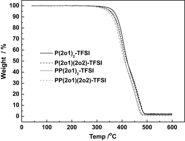  
Fig. 2. TGA traces of the four ILs.  

Table 1. Physical and thermal properties of these ILs.  
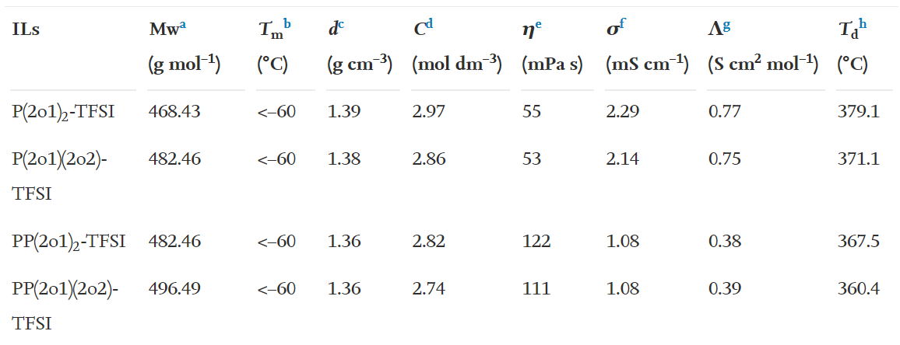  
a, Molecular weight.  
b, Melting point.  
c, Density at 25 °C.  
d, Concentration at 25 °C.  
e, Viscosity at 25 °C.  
f, Conductivity at 25 °C.  
g, Molar conductivity at 25 °C.  
h, Decomposition temperature of 10% weight loss.  

When one ether group had similar size and formula weight as one alkyl group, replacing the alkyl group by the ether group in the cations of ILs, such as quaternary ammonium [25], [26], quaternary phosphonium [27], pyrrolidinium [26], [28], piperidinium [26], [28], morpholinium [28] and guanidinium ILs [36], [42], could cause the reducing of viscosity, because of weakening electrostatic interaction between the cation and anion which resulted from the electron-donating action of ether group. After two ether groups were introduced into cations of ILs, the changing of viscosity became more intricate. The viscosities of P(2o1)2-TFSI and P(2o1)(2o2)-TFSI (55 and 53 mPa s at 25 °C) were close to P1(2o1)-TFSI (N-methyl-N-2-methoxyethylpyrrolidinium TFSI, 53 mPa s at 25 °C [28]). However, the viscosities of PP(2o1)2-TFSI and PP(2o1)(2o2)-TFSI (122 and 111 mPa s at 25 °C) were higher than PP1(2o1)-TFSI (N-methyl-N-2-methoxyethylpiperidinium TFSI, 102 mPa s at 25 °C [28]), although the cations of the former had more ether groups with the electron-donating action than the latter. Perhaps, van der Waals interactions between cations and anions increased with the obvious increasing of cation sizes and formula weights after introducing two ether groups, and it should counteract the electron-donating action of two ether groups. By contrast with the imidazolium ILs based on cations with two identical ether groups and TFSI− anion [38], P(2o1)2-TFSI and P(2o1)(2o2)-TFSI owned lower viscosities due to choosing the shorter ether groups. Moreover, the viscosities of the two ILs were also lower than the quaternary ammonium ILs with two or more ether groups [40].

The temperature dependence of viscosity was investigated for the four ILs over the temperature range 25–80 °C, and the VTF plots of viscosity according to Eq. (1) [43], [44] are shown in Fig. 3a.
$\eta = \eta_0 exp(\frac{B}{T-T_0})$

η0 (mPa s), B (K) and T0 (K) are constants of Eq. (1), and the three values and the VTF fitting parameter (R2) were calculated and listed in Table 2. According to Fig. 3a and the values of R2 in Table 2, the four ILs were very well fit by the VTF model over the temperature range studied.

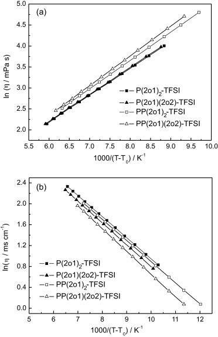  
Fig. 3. VTF plots of (a) viscosity and (b) conductivity for the four ILs.  

Table 2. VTF equation parameters of viscosity for these ILs.  
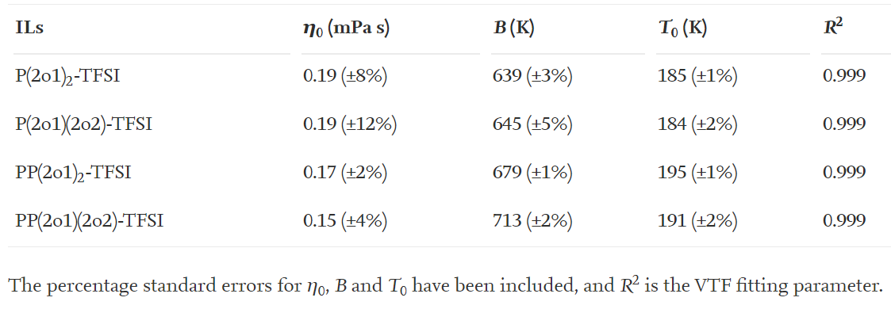  

The conductivity of IL had been regarded as an important property for application of IL as electrolyte in different electrochemical devices, and it could be mainly governed by the viscosity, density and formula weight of IL [28], [45]. The IL with low viscosity usually displayed high conductivity, so substituting one alkyl group in the cation by one flexible ether group with the similar size and formula weight, could also improve the conductivity of IL [25], [27], [28], [34], [36], [42]. Compared with the pyrrolidinium and piperidinium ILs based on small cations with one short ether group [28], the four ILs with two ether group prepared in this work had lower conductivity, due to bigger cation sizes which counteracted the electron-donating action of more ether groups. For instance, the conductivity of PP(2o1)2-TFSI (1.08 mS cm−1 at 25 °C) was lower than PP1(2o1)-TFSI (2.0 mS cm−1 at 25 °C [28]), and the conductivity of P(2o1)2-TFSI (2.29 mS cm−1 at 25 °C) was also lower than P1(2o1)-TFSI (3.7 mS cm−1 at 25 °C [28]). Moreover, it could be found from Table 1, that the conductivity of the IL with one 2-methoxyethyl group and one 2-ethoxyethyl group was lower than or close to the homologous IL with two 2-methoxyethyl groups. The conductivities of P(2o1)2-TFSI and P(2o1)(2o2)-TFSI were higher than the quaternary ammonium ILs with two or more ether groups [40].

The temperature dependence of conductivity was also investigated for these ILs over the temperature range 25–80 °C, and the VTF plots of conductivity according to Eq. (2) [43] were shown as examples in Fig. 3b.
$\sigma = \sigma_0 exp(\frac{-B}{T-T_0})$ (2)
σ0 (mS cm−1), B (K) and T0 (K) are constants of Eq. (2), and the three values and the VTF fitting parameter (R2) were calculated and listed in Table 3. Like the viscosity, the temperature dependence of conductivity for these ILs were very well fit by the VTF model over the temperature range studied.

Table 3. VTF equation parameters of conductivity for these ILs.  
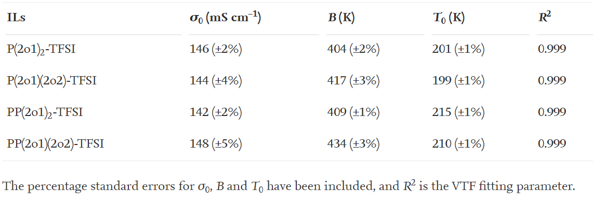  

#### 3.2. Electrochemical windows of these ILs and lithium redox in these IL electrolytes
Fig. 4 shows the electrochemical windows of these functionalized ILs at 25 °C, which are measured by LSV using lithium metal as reference electrode. The cathodic limiting potentials of the four ILs were about 0.4 V versus Li/Li+, and the anodic limiting potentials were not identical for them. The anodic limiting potentials of P(2o1)(2o2)-TFSI and PP(2o1)(2o2)-TFSI were about 5.1 V versus Li/Li+, and the value of P(2o1)2-TFSI was about 5.4 V versus Li/Li+. PP(2o1)2-TFSI had the higher anodic limiting potential (about 5.9 V versus Li/Li+), so its electrochemical window (about 5.5 V) was higher in the four ILs. As already reported, introducing one ether group into the cations of pyrrolidinium and piperidinium ILs could reduce the electrochemical stability [26], [28]. According to the electrochemical windows of pyrrolidinium and piperidinium ILs based on cations without ether group and TFSI− anion [3], [7], [26], [28], [46], [47], it could also be found that the electrochemical windows of these ILs with two ether groups were lower than the homologous ILs without ether group. Although the electrochemical stabilities of the four ILs with two ether groups were not as good as the homologous ILs without ether group, their electrochemical windows were still higher than 4.5 V. So the electrochemical stabilities of these new ILs were better than some ILs, such as imidazolium, guanidinium and sulfonium ILs [26], [42], [48].

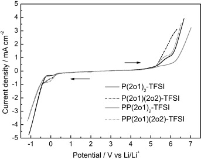  
Fig. 4. Linear sweep voltammograms of these ILs at 25 °C. Working electrode: glassy carbon, counter electrode: Li, reference electrode: Li, and scan rate: 10 mV s−1.

In terms of the cathodic limiting potentials of these functionalized ILs, it was very possible that their IL electrolytes could not allow the deposition of lithium without additives like the EMI-TFSI electrolyte [26]. But the CVs of these IL electrolytes with 0.6 mol kg−1 LiTFSI at 25 °C are shown in Fig. 5a–d, and the plating and stripping of lithium on Ni electrode can be clearly observed. In the first cycle for the P(2o1)2-TFSI electrolyte, the plating of lithium was at about −0.13 V versus Li/Li+, and the anodic peak at about 0.43 V in the returning scan corresponded to the stripping of lithium. The lithium redox in this electrolyte might be caused by the generation of a certain surface film (SEI) on the Ni electrode. The peak currents of the lithium redox decreased gradually with the cycle number, and it suggested that the SEI film changed so that the lithium redox was restrained. The cathodic peak at about 0.38 V could be found in the first cycle. This cathodic peak might be assigned to the electrochemical reduction of the electrolyte, and at the same time it could be presumed that this reduction might generate the SEI film on Ni electrode. In the third and fifth cycles the current of this peak decreased, so it could mean that SEI film generating in the first cycle also restrained the reduction of the electrolyte.

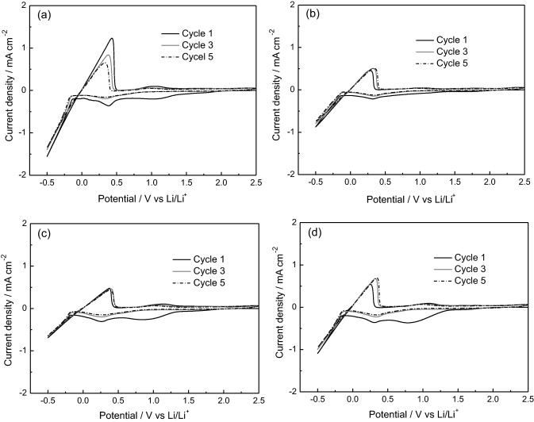  
Fig. 5. Cyclic voltammograms for these IL electrolytes at 25 °C (−0.5 V to 2.5 V versus Li/Li+): (a) 0.6 mol kg−1 LiTFSI in P(2o1)2-TFSI, (b) 0.6 mol kg−1 LiTFSI in P(2o1)(2o2)-TFSI, (c) 0.6 mol kg−1 LiTFSI in PP(2o1)2-TFSI, and (d) 0.6 mol kg−1 LiTFSI in PP(2o1)(2o2)-TFSI. Working electrode: Ni, counter electrode: Li, reference electrode: Li, and scan rate: 10 mV s−1.

Some differences of lithium redox behaviors on the Ni electrode were found in Fig. 5a–d for these IL electrolytes. For example, how the anodic peaks of lithium changed with the cycle number was different, and the peak currents of the lithium redox were also different. Furthermore, one cathodic peak in the range from 0.7 V to 1.3 V versus Li/Li+ was found in the first cycle for the P(2o1)2-TFSI electrolyte, which might be caused by the reactions of the trace water or oxygen in IL electrolyte on the Ni electrode, and this peak disappeared in the third and fifth cycles due to the SEI film forming in the first cycle. This cathodic peak was more obvious in the first cycle for the PP(2o1)2-TFSI and PP(2o1)(2o2)-TFSI electrolytes, whereas this cathodic peak was not obvious in the first cycle for the P(2o1)(2o2)-TFSI electrolyte. This kind of cathodic peak caused by the trace impurities, could also be found in the reported experimental results of CVs for some other IL electrolytes [4], [7], [26], [49].

#### 3.3. Chemical stabilities of these IL electrolytes against lithium metal
The chemical stabilities of the four IL electrolytes against lithium metal and the interfacial characteristics of IL electrolytes/lithium metal were investigated by electrochemical impedance spectra for symmetric Li/IL electrolyte/Li cells. Fig. 6a and b shows the time evolution of the impedance response of a symmetrical Li/0.6 mol kg−1 LiTFSI in P(2o1)2-TFSI/Li cell. The intercept with real axis of the response at high frequency was assigned to electrolyte bulk resistance, and the diameter of the semicircle was associated to the interfacial resistance (Ri) of the IL electrolyte/lithium metal. For the P(2o1)2-TFSI electrolyte, its bulk resistance was almost unchangeable with time during eight days. The Ri initially increased and then fluctuated slightly, and the Ri retained about 400 Ω after some time.

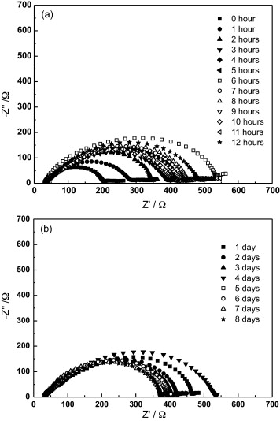  
Fig. 6. Time evolution of the impedance response of a symmetrical Li/0.6 mol kg−1 LiTFSI in P(2o1)2-TFSI/Li cell: (a) from 0 h to 12 h, and (b) from 1 day to 8 days.

Fig. 7a and b shows the time dependence of the interfacial resistance (Ri) of the Li/IL electrolytes/Li cells. The Ri of the PP(2o1)2-TFSI electrolyte increased more obviously from 0 h to 12 h. After 48 h, the Ri of the PP(2o1)2-TFSI and PP(2o1)(2o2)-TFSI electrolytes fluctuated more acutely than the P (2o1)2-TFSI and P(2o1)(2o2)-TFSI electrolytes. The Ri of the P(2o1)2-TFSI and P(2o1)(2o2)-TFSI electrolytes was smaller, and the PP(2o1)2-TFSI electrolyte had the biggest Ri value (more than 3000 Ω). The experimental phenomena might indicate that an approximately stable state between the electrolyte and lithium metal could be achieved after some time for these IL electrolytes, due to a passivation layer forming on the lithium metal, which could restrict the reaction between the electrolyte and lithium metal.

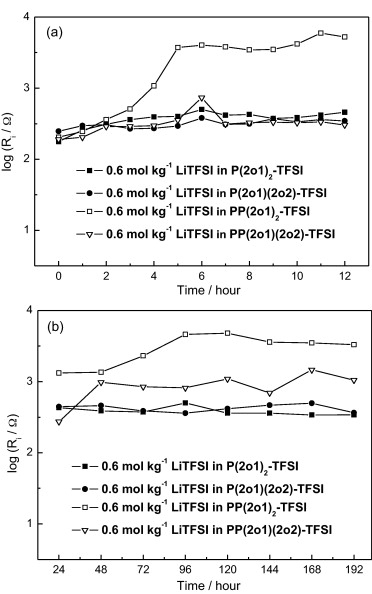  
Fig. 7. Time dependence of interfacial resistance of the Li/IL electrolytes/Li cells: (a) from 0 h to 12 h, and (b) from 24 h to 192 h.

#### 3.4. Charge–discharge characteristics of Li/LiFePO4 cells
The C–D characteristics of Li/LiFePO4 cells using these IL electrolytes without additives were examined at 0.1 C rate. Fig. 8 shows the discharge capacity during cycling of Li/LiFePO4 cells using these IL electrolytes. The initial discharge capacity of the cell using the P(2o1)2-TFSI electrolyte was about 100 mAh g−1, and the discharge capacity increased gradually with the cycle number, which could result from the improved wettability of the IL electrolyte to the LiFePO4 cathode during the C–D processes. The discharge capacity was stable after 50 cycles, and the value retained about 138 mAh g−1 until the 100th cycle. The changing rule of the discharge capacity with the cycle number for the other three IL electrolytes was similar to the P(2o1)2-TFSI electrolyte. The discharge capacity of the P(2o1)(2o2)-TFSI electrolyte after reaching stability (about 140 mAh g−1) was close to the P(2o1)2-TFSI electrolyte, and higher than the PP(2o1)2-TFSI and PP(2o1)(2o2)-TFSI electrolytes (about 133 mAh g−1 and 131 mAh g−1). The discharge capacities of the four IL electrolytes were lower than the theoretical capacity of Li/LiFePO4 cell, and it could be presumed that the high resistance of SEI film on the electrode/electrolyte interface might result in low discharge capacity [10], [50]. Fig. 9 shows the cycle number dependence of coulombic efficiencies of Li/LiFePO4 cells using these electrolytes at 0.1 C rate. The coulombic efficiencies of the four IL electrolytes were higher than 96% after the initial several cycles, and the coulombic efficiencies of the P(2o1)(2o2)-TFSI and PP(2o1)(2o2)-TFSI electrolytes were a little lower than the P(2o1)2-TFSI and PP(2o1)2-TFSI electrolytes after the 40th C–D cycle.

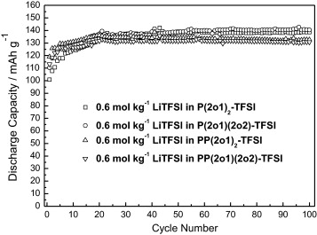  
Fig. 8. Discharge capacity during cycling of Li/LiFePO4 cells using the IL electrolytes. Charge–discharge current rate is 0.1 C.

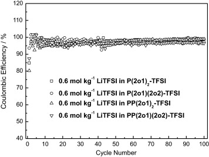  
Fig. 9. The cycle number dependences of coulombic efficiency of Li/LiFePO4 cells using the IL electrolytes. Charge–discharge current rate is 0.1 C.

The relationships between the discharge capacities and the different discharge rates for the four IL electrolytes are shown in Fig. 10, and the discharge capacities at 0.1 C rate are the values after the cycle performances of cells reach stability. It could be found that the discharge capacity decreased with the increasing of the discharge rate for these IL electrolytes. The rate properties of the P(2o1)2-TFSI and P(2o1)(2o2)-TFSI electrolytes were better than the PP(2o1)2-TFSI and PP(2o1)(2o2)-TFSI electrolytes. The rate property of the PP(2o1)2-TFSI electrolyte was unideal, and its discharge capacity at the discharge rate of 1.0 C was about 74 mAh g−1, which was only 56% of the capacity at the rate of 0.1 C. The P(2o1)(2o2)-TFSI electrolyte owned the best rate property in the four IL electrolytes. As shown in Fig. 11, the discharge capacity for the P(2o1)(2o2)-TFSI electrolyte at the discharge rate of 1.0 C was about 110 mAh g−1, which retained 78% of the capacity at the rate of 0.1 C, and the discharge capacity at the rate of 2.0 C was about 71 mAh g−1, which retained 51% of the capacity at the rate of 0.1 C. It might be presumed that the lower viscosities of P(2o1)2-TFSI and P(2o1)(2o2)-TFSI could be helpful to the rate property of cells, because of better transport capability of lithium ion in IL electrolyte. Certainly, besides the viscosity of IL, it was possible that the rate property was also affected by some other factors, such as the interfacial characteristics at both the LiFePO4 cathode/electrolyte and lithium metal anode/electrolyte interfaces. Therefore, the rate property of the P(2o1)(2o2)-TFSI electrolyte was better than the P(2o1)2-TFSI electrolyte, though the viscosity of P(2o1)2-TFSI was close to P(2o1)(2o2)-TFSI.

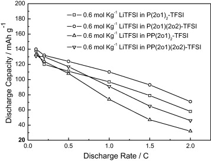  
Fig. 10. Discharge capacities of Li/LiFePO4 cells using the IL electrolytes at different discharge rates. Charge current rate is 0.1 C.

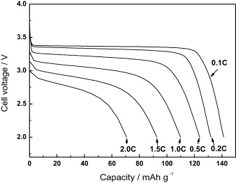  
Fig. 11. Discharge curves of Li/LiFePO4 cells using 0.6 mol kg−1 LiTFSI in P(2o1)(2o2)-TFSI electrolyte. Charge current rate is 0.1 C, and discharge current rate is indicated in this figure.

### 4. Conclusions
Four new functionalized ILs based on piperidinium and pyrrolidinium cations with two identical or different ether groups were synthesized. All the new ILs were liquids at room temperature, and the viscosities of P(2o1)2-TFSI and P(2o1)(2o2)-TFSI were 55 and 53 mPa s at 25 °C, respectively. Good electrochemical stabilities of these functionalized ILs permitted them to become potential electrolytes used in electrochemical devices. Though the cathodic limiting potentials of the IL was higher than 0 V versus Li/Li+, the lithium plating and striping on Ni electrode could be observed in the IL electrolytes without additives due to the forming of SEI film. The IL electrolytes showed good chemical stability against lithium metal owing to the forming of passivation layer. Li/LiFePO4 cells using these IL electrolytes without additive showed good discharge capacity and stable cycle property at 0.1 C current rate, and the cell using the P(2o1)(2o2)-TFSI electrolyte owned good rate property.  
合成了基于具有两个相同或不同醚基的哌啶鎓和吡咯烷鎓阳离子的四个新的功能化IL。所有新的IL在室温下均为液体，在25°C下P（2o1）2-TFSI和P（2o1）（2o2）-TFSI的粘度分别为55和53 mPa s。这些功能化IL的良好电化学稳定性使它们成为电化学设备中使用的潜在电解质。尽管IL的阴极极限电势相对于Li /Li +高于0 V，但由于SEI膜的形成，在没有添加剂的IL电解质中可以观察到Ni电极上的锂电镀和剥离。由于形成了钝化层，IL电解质对锂金属表现出良好的化学稳定性。使用这些不含添加剂的IL电解质的Li /LiFePO4电池在0.1 C电流速率下显示出良好的放电容量和稳定的循环性能，而使用P（2o1）（2o2）-TFSI电解质的电池则具有良好的速率特性。