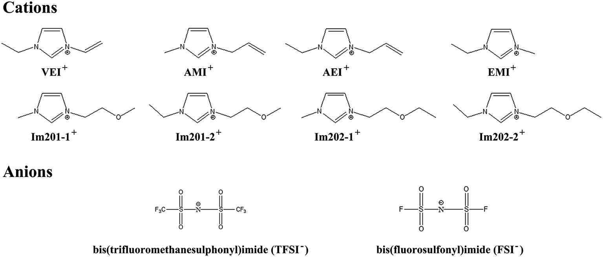
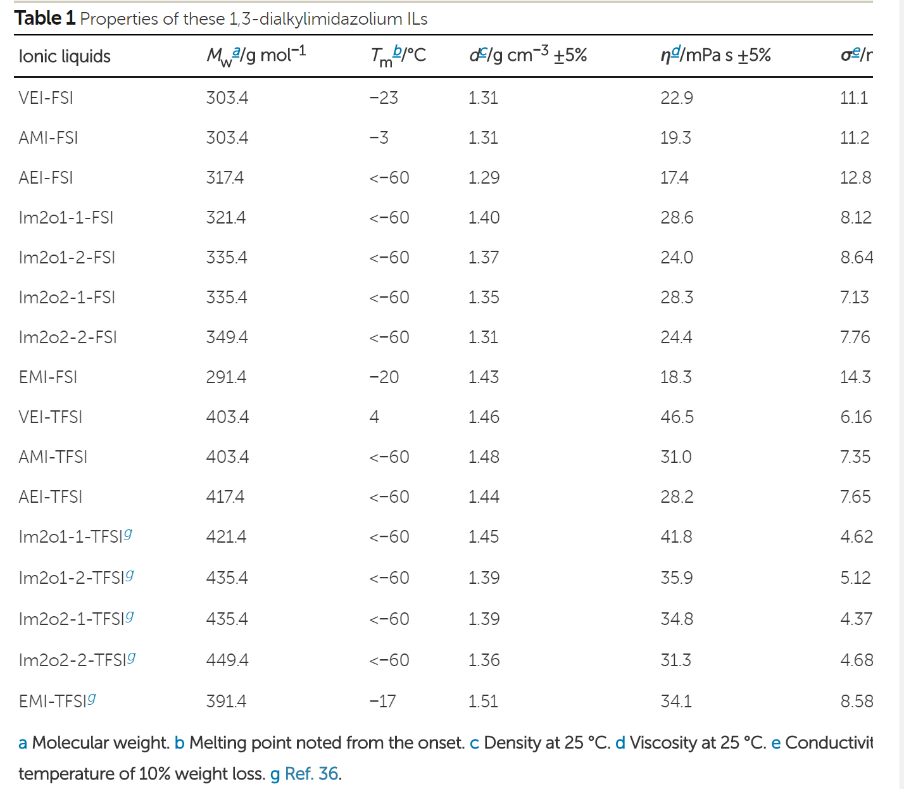
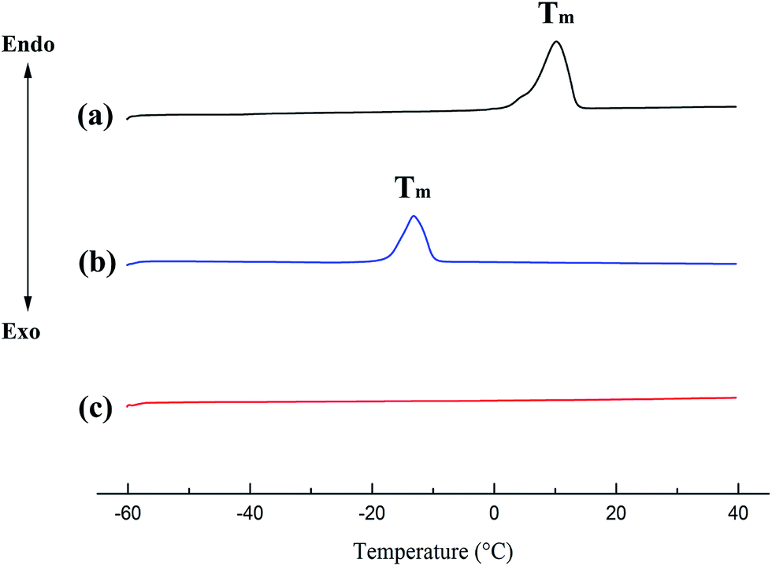

## Physicochemical properties of functionalized 1,3-dialkylimidazolium ionic liquids based on the bis(fluorosulfonyl)imide anion 基于双（氟磺酰基）酰亚胺阴离子的功能化1,3-二烷基咪唑鎓离子液体的理化性质

> Guojun Wang, Shaohua Fang, Yi Liu, Dong Luo, Li Yang*, Shin-ichi Hiranob   
> RSC Adv., 2016,6, 66650-66657
> DOI: [10.1039/C6RA12323F](https://doi.org/10.1039/C6RA12323F)  
> Keywords: Lithium battery, Ionic liquid, Electrolyte, Ether-functionalized guanidinium cation

### Abstract
A new series of ether- or alkenyl-functionalized 1,3-dialkylimdazolium ILs based on the FSI anion were prepared and their physicochemical properties (melting point, thermal stability, viscosity, conductivity and electrochemical stability) were studied in detail and compared with the corresponding TFSI-based ILs. It was confirmed that introduction of ether or alkenyl groups and FSI anions jointly could reduce viscosity and enhance conductivity. These FSI-based ILs owned viscosities lower than 30 mPa s and conductivities higher than 7 mS cm−1. AEI-FSI had the lowest viscosity (17.4 mPa s) among all the reported FSI-based ILs and it had relatively higher conductivity (12.8 mS cm−1) as well. The electrochemical windows of most ILs were wider than 3.7 V, indicating their promising application for electrochemical devices.  
制备了一系列基于FSI阴离子的醚或烯基官能化的1,3-二烷基咪唑鎓ILs，并详细研究了它们的理化性质（熔点，热稳定性，粘度，电导率和电化学稳定性），并与相应的相比较。基于TFSI的IL。已经证实，醚或烯基和FSI阴离子的共同引入可降低粘度并增强电导率。这些基于FSI的IL的粘度低于30 mPa s，电导率高于7 mS cm-1。在所有已报告的基于FSI的IL中，AEI-FSI的粘度最低（17.4 mPa s），电导率也相对较高（12.8 mS cm-1）。大多数IL的电化学窗口宽于3.7 V，这表明它们在电化学设备中的应用前景广阔。

### 1. Introduction
Ionic liquids (ILs) are molten salts composed of organic cations and different anions entirely. Attributed by a suite of unique properties such as non-flammability, negligible volatility and high thermal stability,1,2 ILs have been used as important industrial solvents for separation processes,3,4 catalysis5,6 and potential electrolytes for various electrochemical devices.7–10 Particularly, a large number of investigations have focused on ILs as novel safe electrolytes for rechargeable lithium-ion batteries because they can reduce the safety risk caused by conventional organic electrolytes.11–14

The representative cations utilized in ionic liquids are quaternary ammonium species such as tetraalkylammonium, pyrrolidinium, piperidinium, imidazolium and pyrazolium families. Thereinto, 1,3-dialkylimidazolium ILs have been researched more widely since their relative low viscosity, high conductivity and toilless synthesis.15–18 Among this family, 1-ethyl-3-methylimidazolium (EMI) is regarded as the typical cation. Integrating low molecular weight and sufficient side chain mobility, EMI cation can endow ILs with lower viscosity compared to other 1,3-dialkylimidazolium ILs with longer alkyl side chains.19 A series of lower viscous ILs comprised of EMI cation and different anions have been synthesized, such as EMI dicyanamide (EMI-DCA) and EMI 2,2,2-trifluoro-N-(trifluoromethylsulfonyl)acetamide (EMI-TSAC). And the viscosities of these ILs are all less than 25 mPa s at ambient temperature.20–22

Up to now, the high viscosity of ILs still restricts their applications as contrasted with that of organic solvents. Fortunately another remarkable advantage of ILs is that their physical and electrochemical properties can be changed easily by diverse structural variation due to the designability of cations and anions. Introducing a functional group into cation is a commonly used method to obtain new ILs.23 However, it has been verified that electron-withdrawing groups (i.e. ester group, phenyl group, cyano group) can result in increment of viscosity.24–28 In contrast, ether group owning electron-donating effect can decrease viscosity and melting point but not induce to the obvious deterioration of thermal and electrochemical stability meanwhile.29–33 So far, many different ether-functionalized cations, such as pyrrolidinium,29 piperidinium,29,34 imidazolium30,35,36 and tetraalkylammonium,31,37 have been reported and show superior characteristics. Recently, alkenyl functionalization has also attracted much interest.38–41 Mizumo et al. have synthesized a serious of allylimidazolium halides with lower melting point.39 Young et al. have reported that allyl-substituted ILs demonstrated higher conductivity and lower viscosity compared with fully saturated analogues.41,42 Even though the mechanism about how the carbon–carbon double bond of alkenyl group influences physicochemical properties is not so clear now, many researchers have proposed that the increased π–π interactions can lead to better properties.40,42–44

During the last decade, the most popular anion used in ILs is bis(trifluoromethanesulfonyl)imide (TFSI) anion, because of its highly delocalized charge distribution, high flexibility and good thermal and electrochemical stability.45 Besides TFSI anion, another fluorinated sulfonyl type anions, bis(fluorosulfonyl)imide (FSI) anion has also gained significant attention. Compared with the respective TFSI counterparts, many oniums (i.e. imidazolium,21,46 pyrrolidinium,21,47 phosphonium48,49) with FSI anion can exhibit lower viscosity and higher conductivity. Moreover, it has been accepted that the FSI-based ILs as electrolytes of lithium-ion batteries can show better compatibility with graphite negative electrode.50–52 In order to understand the superiority of FSI-based ILs, numerous comparative investigations have been conducted to clarify the effect of FSI and TFSI anions on the physicochemical and electrochemical properties of ILs.46–49,53,54 Tsuzuki et al. have explained that weaker interactions between cations and FSI anions can result in lower viscosity.53

Thus far, some ILs based on functionalized cations and FSI anion have been reported detailedly, including ether-functionalized tetraalkylammonium,37 ether- or alkenyl-functionalized phosphonium,48,49 and ether-, ester-, or cyano-functionalized sulfonium ILs,25 but the representative 1,3-dialkylimidazoulium ILs are just proposed in a patent.55 In this work, we synthesized a series of ether- or alkenyl-functionalized 1,3-dialkylimidazolium ILs based on FSI anion. And the structures of these FSI-based ILs were shown in Fig. 1. The thermal properties, viscosity, conductivity and electrochemical stability of these FSI-based ILs were investigated systematically and compared with their TFSI-based counterparts. The viscosities of these FSI-based ILs were all lower than 30 mPa s at room temperature. To our knowledge, AEI-FSI had the lowest viscosity among the reported FSI-based ILs.

  
Fig. 1 Structure of these 1,3-dialkylimidazolium ILs.

### 2. Experimental
2.1 Synthesis of functionalized 1,3-dialkylimidazolium ILs
1-Vinyl-3-ethylimidazolium bis(fluorosulfonyl)imide (VEI-FSI) was chosen as an example to illustrate the process of synthesis. 1-Vinylimidazole (5 g, 0.053 mol) and bromoethane (6.95 g, 0.064 mol) were reacted in a 250 mL flask at 30 °C for 24 h with acetonitrile (10 mL) as the solvent. The product was washed with diethyl ether (100 mL) three times. Then the crude bromide was purified by active carbon with ethanol (100 mL) as the solvent for 24 h. After removing active carbon and ethanol by filtration and rotary evaporation respectively, the bromide was dissolved in deionized water with same molar amount lithium bis(fluorosulfonyl)imide (LiFSI) and stirred for 4 h at ambient temperature. Dichloromethane was used to extract the IL from the mixture and then the solvent was washed with deionized water for 3 times until no halide residual could be detected by AgNO3 solution. The dichloromethane was removed by rotary evaporation. The product was dried under high vacuum for more than 10 h at 100 °C.

Detailed procedures and NMR data of 1H and 13C were described in ESI.†

2.2 Measurement
1H NMR and 13C NMR spectra (Bruker, Advance III HD 400) were utilized to verify the structure of synthesized ILs. A moisture titrator (Metrohm 73KF Karl Fischer coulometer) was used to detect the water contents of ILs, which were all below 50 ppm.

The phase transition behavior of ILs was analyzed by using a differential scanning calorimeter (DSC, Perkin Elmer 8000). Each IL (5 mg approximately) sealed well by a small aluminum crucible under dry atmosphere. Firstly, the sample was cooled to −60 °C from ambient temperature and held for 10 min to guarantee its absolute crystallization (if possible). Then the sample was heated and cooled at a scan rate of 10 °C min−1 from −60 °C to 40 °C. The above procedures were repeated twice and then the thermal data of the second heating-cooling scan were collected. Thermal stability was tested by thermal gravimetric analysis (TGA, TA Instrument Q5000). The sample was dropped into a platinum pan and then heated to 600 °C at the rate of 10 °C min−1 under nitrogen atmosphere.

The density was measured by weighing each IL (1.00 mL) in an argon-filled glove box at 25 °C. The viscosity was tested by a Brookfield viscometer (DV-III) and the conductivity was determined by a conductivity meter (DDS-11A). The values of viscosity and conductivity were recorded every 5 °C in the temperature range from 25 °C to 80 °C (Brookfield temperature controller, TC-502). The electrochemical window was analyzed by means of linear sweep voltammetry (LSV) through an electrochemical workstation (CHI-600D) in the glove box. The working electrode, reference electrode and counter electrode were glassy carbon electrode (3 mm diameter), sliver electrode and platinum electrode respectively. The positive and negative scans were carried out separately using neat IL. After each scan, the glassy carbon electrode was polished by nano-alumina powder and washed by deionized water.

### 3. Results and discussion
#### 3.1 Thermal properties
The physicochemical properties of 8 FSI-based 1,3-dialklimidazolium and the corresponding TFSI-based ILs were summarized in Table 1, including melting point, density, thermal decomposition temperature, viscosity and conductivity.

  
The DSC curves of 3 FSI-based alkenyl-functionalized ILs were illustrated in Fig. 2 as examples. AMI-FSI and VEI-FSI showed one melting transition (Tm). AEI-FSI didn't display any phase transition behavior in the range of −60 °C to 40 °C and thus its melting point was defined as “<−60 °C” according to the previous papers.32,56,57 And four FSI-based ether-functionalized ILs had the same result of DSC test as AEI-FSI.  

  
Fig. 2 DSC curves of (a) AMI-FSI, (b) VEI-FSI and (c) AEI-FSI.