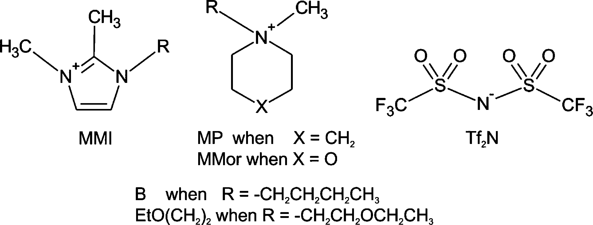
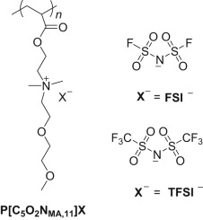
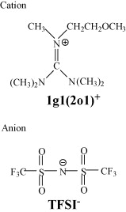

# Ether-IL
醚氧基与醚官能团化离子液体在电解质中的应用

## READING…  
1. [Ether-Bond-Containing Ionic Liquids and the Relevance of the Ether Bond Position to Transport Properties 含醚键的离子液体和醚键位置与传输性质的相关性](./Ether-Bond-Containing-Ionic-Liquids-and-the-Relevance-of-the-Ether-Bond-Position-to-Transport-Properties/article.md)
   - 材料：
     
   - 由侧链或有机阳离子环中醚键的存在对热稳定性，密度，粘度，电化学行为，离子电导率和自扩散系数的影响。
   - 将盐LiTf2N添加到系统中，探究关于锂阳离子传输的IL行为。LiTf2N的添加增加了IL粘度，但与[BMMI][Tf2N]相比，[EtO(CH2)2MMI][Tf2N]的增加不那么明显。表明醚氧基具有与Tf2N阴离子竞争的能力。这种现象是由于锂阳离子减少了由于盐添加到IL中引起的有害作用。
   - 两种离子液体的自扩散系数，粘度和离子电导率的温度相关性均不遵循Arrhenius方程，而是遵循VTF模型。$\sigma_{AC} = A_\sigma exp(\frac{-B_\sigma}{(T-T_{0\sigma})})$
   - 根据PGSE-NMR扩散系数和Nernst-Einstein方程，可以估算理论离子电导率值。实验和计算的离子电导率之比表明了真正有助于离子电导的离子所占百分比。对于在侧链或环中含有氧的离子液体来说，该比率更高。有机阳离子环中醚的存在通过增加电荷传输浓度而对传输性能带来了明显的好处。
2. [Solid polymer electrolyte comprised of lithium salt/ether functionalized ammonium-based polymeric ionic liquid with bis(fluorosulfonyl)imide 由锂盐/醚官能化铵基聚合物离子液体与双（氟磺酰基）酰亚胺组成的固体聚合物电解质](./Solid-polymer-electrolyte-comprised-of-lithium-salt-ether-functionalized-ammonium.md/article.md) 
   - 比较了P[C5O2NMA,11]FSI和P[C5O2NMA,11]TFSI两种电解质
   - 电解质材料：含醚官能团的聚合物主链+两种阴离子的锂盐  
    
   - 结论：LiTFSI/[C5O2NMA,11]FSI与LiTFSI/P[C5O2NMA,11]TFSI电解质进行了比较研究。LiTFSI/[C5O2NMA,11]FSI电解质的Tg值低于相应的TFSI基电解质的Tg值，这归因于FSI-阴离子的高度塑化作用。相同的Li+离子浓度下，LiFSI/[C5O2NMA,11]FSI电解质显示出更高的离子电导率，其最大离子电导率在30°C下为1.4×10-5 S cm-1，在50°C下超过10-4 S cm-1。LiFSI/[C5O2NMA,11]FSI电解质中形成的Li金属电极/电解质的界面在60°C下显示出非常好的稳定性。因此，具有FSI-阴离子的锂盐/PILs复合电解质将成为锂电池的有前途的候选者。

3. [One ether-functionalized guanidinium ionic liquid as new electrolyte for lithium battery 一种醚官能化胍离子液体作为锂电池的新型电解质](One-ether-functionalized-guanidinium-ionic-liquid-as-new-electrolyte-for-lithium-battery/article.md)  
   - 材料：  
    
   - 结论：
     - 制备了八种基于带有醚基（CH3OCH2CH2）或酯基（乙酸甲酯基）和TFSI阴离子的小阳离子的胍基离子液体。
     - 一种低粘度的醚官能化胍基IL被用作不含添加剂的Li/LiCoO2电池的新型电解质，并且对Li/LiCoO2电池的电解质特性与性能之间的关系进行了更详细的研究。
     - 研究了不同浓度锂盐的离子液体电解质的粘度，电导率，锂氧化还原在镍电极上的行为以及对锂金属的化学稳定性。
     - 使用IL电解质测试了Li/LiCoO2电池的充放电特性，并通过电化学阻抗谱（EIS）方法估计了锂嵌入的LiCoO2电极的活化能。
     - 当IL电解质中的LiTFSI浓度高于0.3 mol kg-1时，电池在0.2 C的电流速率下具有良好的容量和循环性能，并且使用0.75 mol kg-1的IL电解质的电池LiTFSI拥有高利率物业。

4. 
## FINISHED.