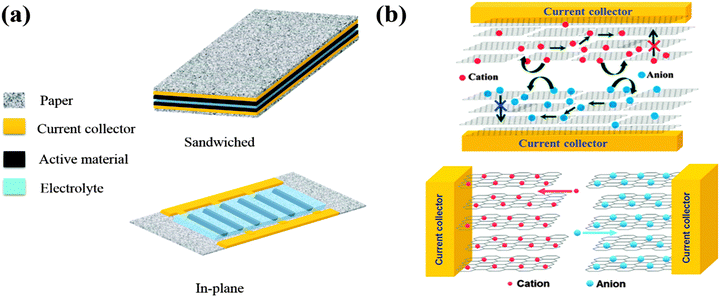
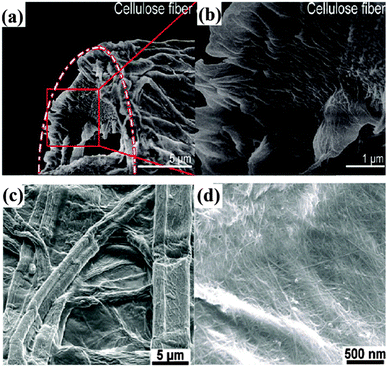

## Flexible supercapacitors based on paper substrates: a new paradigm for low-cost energy storage
## 基于纸质基材的可折叠超级电容器：低成本能量存储的新范例

> Chemical Society Reviews
> Chem. Soc. Rev., 2015, 44, 5181 
> DOI: 10.1039/c5cs00174a

### Abstract
Paper-based supercapacitors (SCs), a novel and interesting group of flexible energy storage devices, are attracting more and more attention from both industry and academia. Cellulose papers with a unique porous bulk structure and rough and absorptive surface properties enable the construction of paper-based SCs with a reasonably good performance at a low price. The inexpensive and environmentally friendly nature of paper as well as simple fabrication techniques make paper-based SCs promising candidates for the future ‘green’ and ‘once-use-and-throw-away’ electronics. This review introduces the design, fabrication and applications of paper-based SCs, giving a comprehensive coverage of this interesting field. Challenges and future perspectives are also discussed.  
纸质超级电容器（SCs）是一种新颖而有趣的灵活储能设备，正吸引着越来越多的行业和学术界的关注。具有独特多孔体积结构和粗糙和吸收性表面性质的纤维素纸能够以低价格构建具有相当好性能的纸基SC。纸张的廉价和环保性质以及简单的制造技术使纸质SC成为未来“绿色”和“一次性使用和丢弃”电子产品的候选者。本综述介绍了纸质SC的设计，制作和应用，全面介绍了这一有趣的领域。还讨论了挑战和未来前景。

### 1. Introduction
Efficient energy production and storage in an eco-friendly and sustainable way has become a global objective.1 Novel energy storage methods are especially needed for the utilization of energy from renewable sources such as wind and solar where irregular electricity generation (great fluctuation and low efficiency) pose a great challenge for conventional electrical energy storage systems.2 A variety of energy storage technologies have been developed to meet this challenge, including mechanical, physical, thermal, chemical and electrochemical energy storage systems.3 Among these, batteries, (electrolytic) capacitors and supercapacitors, as three main groups of electrochemical energy storage devices, show great promise.4–7  
以生态友好和可持续的方式实现高效的能源生产和储存已成为全球目标.1特别需要新型能源储存方法来利用风能和太阳能等不可再生能源的能源，这些能源不规则发电（波动大，效率低）对传统的电能存储系统构成了巨大的挑战.2已经开发出各种能量存储技术来应对这一挑战，包括机械，物理，热，化学和电化学能量存储系统.3其中，电池，（电解）电容器和超级电容器作为三大类电化学储能装置，显示出巨大的希望

SCs (also known as electrochemical capacitors or ultracapacitors) hold an important and unique position that bridges the gap between conventional capacitors and batteries in terms of power density and energy density.8–11 The specific energy density of SCs is several orders of magnitude higher than that of conventional electrolytic capacitors. Although SCs possess a relatively low energy density with respect to batteries (e.g., lithium-ion batteries), SCs can store and deliver a large amount of charge in a very short period of time (in seconds), thus providing higher power density than batteries. SCs are widely applied in a variety of applications, including back-up power systems, load-leveling applications, electric vehicles and industrial energy management systems.12–16 Depending on the charge–discharge mechanism, SCs can be divided into electrical double layer capacitors (EDLCs), where electrochemical energy is stored by ion adsorbing–dislodging (more like ideal capacitors), and pseudocapacitors, where energy is stored by fast surface redox reactions (more like batteries).17,18 EDLCs mainly utilize carbon materials (activated carbon, carbon nanotubes, graphene) as the electrode materials, while pseudocapacitors mostly use transition metal oxides and conducting polymers. Because of the different charge–discharge mechanism, EDLCs show high cycling stability and high power density but low capacitance and low energy density, whereas pseudocapacitors manifest the opposite performance. Hybrid SCs employ one EDLC type electrode and one pseudocapacitive electrode, combining the charge storage mechanism of both, so they are promising for demonstrating a high energy density, high power density as well as an excellent cycling stability.19  
SC（也称为电化学电容器或超级电容器）具有重要且独特的地位，在功率密度和能量密度方面弥合了传统电容器和电池之间的差距.8-11 SC的比能量密度比几个数量级高几个数量级。传统电解电容器。尽管SC相对于电池（例如，锂离子电池）具有相对低的能量密度，但SC可以在非常短的时间段（以秒为单位）存储和输送大量电荷，因此提供比电池更高的功率密度。 。 SC广泛应用于各种应用，包括备用电源系统，负载均衡应用，电动汽车和工业能源管理系统.12-16根据充放电机制，SC可分为双电层电容器（EDLCs），其中电化学能量通过离子吸附 -去除（更像是理想电容器）和赝电容器存储，其中能量通过快速表面氧化还原反应（更像电池）存储.17,18 EDLC主要利用碳材料（活性炭） ，碳纳米管，石墨烯）作为电极材料，而赝电容器大多使用过渡金属氧化物和导电聚合物。由于不同的充放电机制，EDLC显示出高循环稳定性和高功率密度但低电容和低能量密度，而赝电容器表现出相反的性能。混合SC使用一个EDLC型电极和一个赝电容电极，结合两者的电荷存储机制，因此它们有望展示出高能量密度，高功率密度以及出色的循环稳定性.19

Portable and flexible electronics require a new paradigm of energy storage systems that suits the requirement for flexibility. Flexible electronics is expected to bring us a variety of fancy applications: bendable cell phone, implantable heart sensor, flexible OLED (organic light emitting diode) display, etc.20 A flexible electronic device can still operate when bent, folded, compressed, or even stretched. The power source suitable for flexible electronics, accordingly, must be able to deliver a high enough power density and energy density under the above mentioned conditions. Due to the long lifespan compared to batteries and the high power performance, flexible SCs are especially important and thus receive a great deal of attention from both fundamental studies and technological applications.21–28 However, it remains a great challenge to fabricate flexible SCs that are inexpensive, flexible, light-weight and environmentally friendly. As with conventional SCs, further optimization of flexible SCs is mainly oriented toward improving the device's energy density through the design of new electrode materials,29,30 new electrolytes,31–34 and novel device architectures.35–37 Unique to flexible SCs, it is also crucial to search for and modify flexible substrates onto which flexible SCs can be built and integrated with energy generation devices or power outlets.  
便携式和柔性电子设备需要新的能量存储系统范例，以满足灵活性要求。灵活的电子产品有望为我们带来各种奇特的应用：可弯曲手机，植入式心脏传感器，柔性OLED（有机发光二极管）显示器等.20灵活的电子设备仍可在弯曲，折叠，压缩甚至弯曲时运行拉伸。因此，适合于柔性电子器件的电源必须能够在上述条件下提供足够高的功率密度和能量密度。由于与电池相比具有较长的使用寿命和高功率性能，灵活的SC特别重要，因此受到基础研究和技术应用的极大关注.21-28然而，制造灵活的SC仍然是一个巨大的挑战。价格低廉，灵活，重量轻，环保。与传统的SC一样，灵活SC的进一步优化主要是通过设计新的电极材料，29,30新电解质，31-34和新型器件架构来改善器件的能量密度.35-37灵活SC的独特之处，它对于搜索和修改柔性基板也是至关重要的，在该基板上可以构建灵活的SC并与能量产生装置或电源插座集成。

It is a rather interesting and imaginative idea that paper, a commodity ubiquitous in everyday life, instead of being the embodiment of human knowledge, can be exploited for future electronics in that it can be utilized as the substrate to build flexible SCs. The advantages are obvious: paper is truly a low-cost substrate compared with other flexible substrates such as PET (polyethylene terephthalate); paper is highly flexible as well as bendable; the process of making and disposing of paper is environmental-friendly; paper-based energy storage devices are necessary for all-paper electronics to operate.38–42 The inexpensive and environmental-friendly nature of paper enable some novel and interesting applications such as once-use-and-throw-away glucose sensors. Combined with the power of ‘printed electronics’, paper electronics seems promising as a forerunner of future electronics, in the sense that functional electronic devices are made in the way that people commonly think of as drawing pictures or printing newspapers.43–47 More importantly, to fabricate flexible SCs on paper represents the power of using logic to turn the negative into the positive. As paper is usually composed of cellulose fibers with a 3-dimensional hierarchical arrangement, the paper surface is not only very rough but also highly porous in comparison to common flexible substrates. The surface properties of papers may not be suitable for common electronic components such as conductive lines, diodes, capacitors, etc., but the porous and absorptive nature of paper is actually advantageous for some applications, such as for many energy devices in which large surface roughness is preferred. Especially, people can make full use of the nature of paper when the cellulose paper structure soaked with active materials is used in electrochemical energy storage devices such as SCs.  
这是一个相当有趣和富有想象力的想法，纸张是日常生活中无处不在的商品，而不是人类知识的体现，可以被用于未来的电子产品，因为它可以用作构建灵活SC的基础。优点显而易见：与其他柔性基材如PET（聚对苯二甲酸乙二醇酯）相比，纸张确实是一种低成本的基材;纸张具有高度的柔韧性和可弯曲性;制作和处理纸张的过程是环保的;基于纸张的储能设备是全纸电子设备运行所必需的.38-42纸张的廉价和环保特性使一些新颖和有趣的应用，如一次性使用和丢弃葡萄糖传感器。结合“印刷电子”的力量，纸质电子产品似乎有望成为未来电子产品的先驱，因为功能性电子设备的制造方式与人们通常认为的绘画或印刷报纸的方式相同.43-47更重要的是，在纸上制作灵活的SC表示使用逻辑将负面转化为正面的力量。由于纸通常由具有三维分层排列的纤维素纤维组成，因此与普通柔性基材相比，纸表面不仅非常粗糙而且具有高度多孔性。纸张的表面特性可能不适用于导电线，二极管，电容器等常见的电子元件，但纸张的多孔性和吸收性实际上对于某些应用是有利的，例如对于大表面的许多能量设备。粗糙度是优选的。特别是，当用活性材料浸泡的纤维素纸结构用于诸如SC的电化学储能装置时，人们可以充分利用纸的性质。

Paper-based SCs are based on the composite of conductive active materials with cellulose fibers, which comprise repeating cellobiose units with a high aspect ratio and the ability to form strong inter- and intra-molecular hydrogen bonds resulting in the fibers with hydroxyl-functionalized surfaces. These properties make cellulose fibers perfect structural units in conjunction with common conductive active materials such as carbon nanotubes (CNTs),38 graphene,48 polypyrroles (PPy),49 and polyanilines (PANI).50 Furthermore, cellulose fiber networks in a piece of paper can also provide pathways for ion transport.51  
纸基SC基于导电活性材料与纤维素纤维的复合物，其包含具有高纵横比的重复纤维二糖单元并且能够形成强的分子间和分子内氢键，从而导致具有羟基官能化表面的纤维。这些特性使纤维素纤维成为完美的结构单元，与常见的导电活性材料如碳纳米管（CNTs），38石墨烯，48聚吡咯（PPy），49和聚苯胺（PANI）相结合.50此外，纤维素纤维网络在一张纸上也可以为离子传输提供途径

It is worth noting that many so-called paper SCs in the literature actually do not involve paper at all in its literal sense; these so-called paper SCs are actually composed of free-standing electrodes that are made into a paper-like shape with no cellulose involved. These free-standing paper-like SCs will not be discussed in this review. One would refer to some reviews on this topic.10,52  
值得注意的是，文献中许多所谓的纸张SC实际上并不涉及纸张的字面意义;这些所谓的纸张SC实际上由独立电极组成，这些电极被制成纸状，不含纤维素。这篇独立式纸质SC将不会在本次审查中讨论。人们会参考有关该主题的一些评论.10,52

Although there are some excellent reviews in the field of flexible SCs, covering topics like all-solid-state flexible SCs,17,53 fiber SCs,36 and flexible SCs from various electrode materials’ perspectives,8,9,11,52,54–58 flexible SCs based on paper have seldom been touched upon.59,60 A review that covers all aspects of paper-based SCs is thus highly desirable to build a comprehensive overview and highlight the importance of this exciting direction. In this context, this review will first introduce the basics of paper SCs, i.e., the device structure and characterization methods of the electrochemical performance. Then, methods for fabricating paper SCs will be introduced, and recent developments of paper SCs will be discussed; lastly some concluding remarks will be presented to outline the challenges and future research directions in this exciting field.  
虽然灵活SC领域有一些优秀的评论，涵盖了各种电极材料的全固态柔性SC，17,53光纤SC，36和柔性SC等主题，8,9,11,52,54 -58基于纸张的灵活SC很少被涉及.59,60因此，非常需要一份涵盖纸质SC的所有方面的综述，以构建全面的概述并强调这一令人兴奋的方向的重要性。在这种情况下，本综述将首先介绍纸张SC的基础知识，即电化学性能的器件结构和表征方法。然后，将介绍制造纸张SC的方法，并将讨论纸张SC的最新发展;最后，将提出一些结论性意见，以概述这一令人兴奋的领域的挑战和未来的研究方向。  

### 2. Performance evaluation for paper supercapacitors
```
The performance of a supercapacitor is usually reported in terms of their specific capacitance, energy density (energy stored per unit mass/length/area/volume) and power density (power unleashed per unit mass/length/area/volume). Although depending on the specific application and measurement technique, these parameters can be expressed in terms of gravimetric, volumetric and areal figures, for paper-based SCs, the specific capacitance, energy density and power density are usually expressed in areal terms. Electrode materials are often studied in a three-electrode electrochemical cell before being assembled into a two-electrode cell.61–63 The capacitance (C) and specific (areal) capacitance (CA) of each electrode in the three-electrode configuration are calculated from the cyclic voltammetric curves (CV) curves at different scan rates using the formula (1) and (2).  
超级电容器的性能通常根据其比电容，能量密度（每单位质量/长度/面积/体积存储的能量）和功率密度（每单位质量/长度/面积/体积释放的功率）来报告。尽管取决于具体的应用和测量技术，这些参数可以用重量，体积和面积数表示，对于纸基SC，比电容，能量密度和功率密度通常用面积表示。电极材料通常在组装成双电极电池之前在三电极电化学电池中进行研究.61-63计算三电极配置中每个电极的电容（C）和特定（面积）电容（CA）使用公式（1）和（2）从不同扫描速率下的循环伏安曲线（CV）曲线得到。  
C = (∫idV)/v(ΔV)	(1)  
CA = C/A	(2)  
where i (in amps, A) is the response current, V is the potential scan rate (V s−1), and ΔV is the applied potential region (in volts, V) and A refers to the area (cm2) of the electrode.  
其中i（以安培为单位，A）为响应电流，V为电位扫描速率（V s-1），ΔV为施加电位区域（以伏特为单位，V），A为区域（cm2）。电极。

For an assembled SC device, the capacitance (C) and areal capacitance (CA) of each device in the two-electrode configuration are calculated from the galvanostatic charge–discharge curves using formula (3) and (4)  
对于组装的SC器件，双电极配置中每个器件的电容（C）和面电容（CA）使用公式（3）和（4）从恒电流充放电曲线计算得出

C = i/(−dV/dt)	(3)  
CA = C/A	(4)  
where i (in amps, A) is the applied current, dV/dt is the slope of the discharge curve (in volts per second, V s−1), and A is the areal (cm2) of the device.  
其中i（安培数，A）是施加的电流，dV /dt是放电曲线的斜率（以伏/秒为单位，V s-1），A是器件的面积（cm2）。

The areal energy density (E) in W h cm−2 and power density (P) in W cm−2 derived from galvanostatic charge–discharge curves are calculated from formula (5) and (6), respectively.  
由恒电流充放电曲线得到的W h cm -2的面积能量密度（E）和W cm -2的功率密度（P）分别由式（5）和（6）计算。  
E = C(ΔE)2/(2A × 3600)	(5)  
where ΔE is the operating voltage window (measured in volts and obtained from the discharge curve excluding the voltage drop) and A refers to the total areal of the device.  
其中ΔE是工作电压窗口（以伏特为单位测量并从不包括电压降的放电曲线获得），A是指器件的总面积。  
P = ΔE2/(4RA)  
where R (=Vdrop/2i) is the internal resistance of the device that is estimated from the voltage drop (Vdrop) at the beginning of the discharge curve.  
其中R（= Vdrop /2i）是器件的内阻，它是根据放电曲线开始时的电压降（Vdrop）估算的。
```

One major problem when dealing with paper SCs and flexible SCs in general is the lack of standardized methods to evaluate and compare the device performance. Consequently, different reports are hard to compare and some results are misleading. For example, some reports use the mass of the active materials without the weight of the binder and carbon conductive additives instead of the whole electrode mass, and there is a great variation between different reports on the choice of length/area/volume of the electrode. It is recommended to calculate energy densities and power densities based on the total mass/area/volume of assembled SCs.53 It is a good practice to provide detailed information on the device, including the mass of the electrode, and the mass/thickness/area of the assembled devices. For paper-based SCs, the gravimetric figures are sometimes not so meaningful, whereas areal and volumetric figures are more useful. As discussed by Gogotsi and Simon,8 the gravimetric performance of the device is dependent on the thickness and density of the electrodes as well as the weight of the other components, which results in unreliable comparison of different SCs. Detailed discussion on the evaluation methods of SCs can be found in books and reviews.8,55,64–66  
处理纸质SC和灵活SC时的一个主要问题是缺乏评估和比较设备性能的标准化方法。因此，不同的报告难以比较，有些结果具有误导性。例如，一些报告使用活性材料的质量而没有粘合剂和碳导电添加剂的重量而不是整个电极质量，并且关于电极的长度/面积/体积的选择的不同报告之间存在很大差异。 。建议根据组装的SC的总质量/面积/体积计算能量密度和功率密度.53优良作法是提供有关设备的详细信息，包括电极质量和质量/厚度/组装设备的区域。对于基于纸张的SC，重量数字有时不那么有意义，而面积和体积数字更有用。正如Gogotsi和Simon所讨论的那样，8器件的重量特性取决于电极的厚度和密度以及其他元件的重量，这导致不同SC的不可靠比较。有关SCs评估方法的详细讨论可以在书籍和评论中找到.8,55,64-66

### 3. Device structure of paper-based supercapacitors
The main components of a SC are the electrodes, electrolyte, current collectors and sometimes the separator. As with many solid-state flexible SCs, the polymer gel electrolyte film often acts as the separator. In the case of paper-based SCs, the electrodes are often conductive enough to take the role of the current collector as well. In this kind of SCs, the two main device configurations are the ‘in-plane’ device and the ‘sandwiched’ device. The corresponding device structures and mechanism are illustrated in Fig. 1.  
SC的主要组件是电极，电解质，集电器，有时是隔板。与许多固态柔性SC一样，聚合物凝胶电解质膜通常用作隔膜。在纸基SC的情况下，电极通常足够导电以起到集电器的作用。在这种SC中，两种主要的设备配置是“平面内”设备和“夹层”设备。相应的装置结构和机构如图1所示。


Fig. 1  (a) Schematic diagrams of paper-based SCs with a conventional sandwiched architecture and a novel in-plane architecture. (b) Diagrams showing the ion movement involved in the operation of a ‘sandwiched’ (up) and an ‘in-plane’ (down) structured SC, respectively. Graphene sheets are used as active electrode materials, increased ability of the electrolyte ions to diffuse in between the graphene sheets are illustrated, resulting in a better electrochemical performance. Reproduced with permission from ref. 89. Copyright 2011, American Chemical Society.  
图1（a）基于纸张的SC的示意图，其具有传统的夹层结构和新颖的平面内架构。 （b）分别显示“夹层”（向上）和“平面内”（向下）结构化SC的操作所涉及的离子运动的图表。石墨烯片用作活性电极材料，示出了增加的电解质离子在石墨烯片之间扩散的能力，导致更好的电化学性能。经过ref的许可转载。 89.版权所有2011，美国化学学会。

The appropriate choice of paper is the first issue to consider in fabricating paper-based SCs. Properties such as porosity, surface roughness, thickness, mechanical robustness, impurities, environmental stability, and cost can all have an impact on the performance and scale-up potential of paper-based SCs. It is important to keep the device structure and the specific materials in mind when choosing paper, as there are more than hundreds of kinds of paper commercially available. It can be a time-consuming yet worthy endeavor. Instead of choosing from the commercial stock, it is also a promising approach to utilize ‘paper-making’ techniques to make suitable paper with desired properties as shown by Shen et al.67 They took advantage of a special type of paper-bacterial cellulose (BC), which is an interesting eco-friendly biomaterial composed of ribbon-shaped ultrafine nanofibers with width less than 100 nm. Through a process much like paper-recycling, a unique kind of paper was invented based on the ultrafine nanofibers from BC and added conductive materials-PPy and multi-walled carbon nanotubes (MWCNTs). Typical cellulose fibers and paper substrates coated with conductive materials are shown in Fig. 2.  
适当选择纸张是制造纸质SC时要考虑的第一个问题。孔隙率，表面粗糙度，厚度，机械强度，杂质，环境稳定性和成本等性能都会对纸质SC的性能和扩大规模产生影响。在选择纸张时，必须牢记设备结构和特定材料，因为市面上有超过数百种纸张。这可能是一项耗时但值得努力的事情。而不是从商业库存中选择，利用“造纸”技术制造具有所需性能的合适纸张也是一种很有前景的方法，如Shen等人所示.67他们利用了一种特殊类型的纸 -细菌纤维素（ BC），这是一种有趣的环保生物材料，由宽度小于100纳米的带状超细纳米纤维组成。通过与纸张回收非常相似的过程，基于BC的超细纳米纤维和添加的导电材料-PPy和多壁碳纳米管（MWCNT）发明了一种独特的纸张。涂有导电材料的典型纤维素纤维和纸基材如图2所示。


Fig. 2.  SEM images of the (a) cross section of a cellulose fiber. (b) SEM image of the framed area in (a). Reproduced with permission from ref. 51. Copyright 2013, American Chemical Society. SEM images of (c) surface morphology of Xerox paper, (d) conformal CNT coating along fibers in Xerox paper. Reproduced with permission from ref. 38. Copyright 2009, National Academy of Sciences.  
图2（a）纤维素纤维横截面的SEM图像。 （b）（a）中框架区的SEM图像。经过ref的许可转载。 51.版权所有2013，美国化学学会。 （c）施乐纸的表面形态，（d）沿施乐纸中的纤维的共形CNT涂层的SEM图像。经过ref的许可转载。 38.版权所有2009，美国国家科学院。

Current collectors support electrodes and provide electrical conductive pathway for active materials. Traditionally, metal films such as Cu and Al are used for this purpose, however, they account for about 10–20% of the total weight of a device, thus lowering its gravimetric energy density. In addition, they also account for a substantial amount of the device's cost. Besides, metal films are not suited for flexible devices due to mechanical constraints. Some paper-based SCs adopt easily evaporated or sputtered metals such as Au as the current collector,68 whereas most paper-based SCs adopt non-metallic conductive materials as the current collector.69–73 Carbon-based conductive materials like graphene and CNTs, due to the good conductivity and excellent affinity with the cellulose fibers, are particularly important for paper-based SCs.  
集电器支持电极并为活性材料提供导电通路。传统上，诸如Cu和Al的金属膜用于此目的，然而，它们占装置总重量的约10-20％，因此降低其重量能量密度。此外，它们还占设备成本的很大一部分。此外，由于机械限制，金属膜不适用于柔性装置。一些纸基SC采用容易蒸发或溅射的金属，如Au作为集电器，68而大多数纸基SC采用非金属导电材料作为集电器.69-73碳基导电材料，如石墨烯和碳纳米管，由于良好的导电性和与纤维素纤维的优异亲和性，对纸基SC特别重要。

Arguably the most effective approach of increasing the SC performance is by choosing the appropriate electrode materials. Despite the high price, most paper-based SCs use carbon nanomaterials like CNTs and graphene, however commercialization efforts will reduce the cost significantly in the near future as is shown for other ‘star’ materials such as C60. Compared with carbon materials, other materials, albeit promising, are in need of exploitation; these materials include at least metal nanostructures, conductive polymers and composites of above mentioned materials.52,56 Ideally an electrode material is supposed to have a high capacitance and a wide potential window. To be more specific, a successful (nano-structured) SC electrode material should have a low electrical resistance that is required for efficient charge transport; good electrochemical and mechanical stability for good cycling stability; a high specific surface area; and an optimized pore-size distribution that facilitates ion diffusion.9 Composites of different materials are promising as electrode materials because individual substances in the composites usually have a synergistic effect through enhancing specific surface area, optimizing porosity, extending the potential window, etc. Binders are sometimes needed as part of electrodes in the field of flexible SCs.74 Binders are normally insulating and electrochemically inactive, and their presence will enhance the mechanical connections between active materials and between the electrode and the current collector.75 However, the enhancement is achieved at the expense of decreased conductivity, decreased ion transportation and increased electrode polarization. It is necessary to eliminate binders from the electrode fabrication process if possible, and most paper-based SCs avoid the use of binders in the electrode making.  
可以说，提高SC性能的最有效方法是选择合适的电极材料。尽管价格昂贵，但大多数基于纸张的SC使用碳纳米材料如碳纳米管和石墨烯，但商业化努力将在不久的将来显着降低成本，如其他“明星”材料如C60所示。与碳材料相比，其他材料虽然很有希望，但仍需要开发;这些材料至少包括金属纳米结构，导电聚合物和上述材料的复合材料.52,56理想地，电极材料应具有高电容和宽电位窗口。更具体地说，成功的（纳米结构的）SC电极材料应具有有效电荷传输所需的低电阻;良好的电化学和机械稳定性，良好的循环稳定高比表面积;优化的孔径分布有利于离子扩散.9不同材料的复合材料很有希望作为电极材料，因为复合材料中的各种物质通常通过增加比表面积，优化孔隙率，扩展潜在窗口等具有协同效应。有时需要作为柔性SCs领域的电极的一部分.74粘合剂通常是绝缘的和电化学惰性的，它们的存在将增强活性材料之间以及电极和集电器之间的机械连接.75然而，实现了增强以降低电导率，减少离子传输和增加电极极化为代价。如果可能的话，必须从电极制造过程中消除粘合剂，并且大多数基于纸的SC避免在电极制造中使用粘合剂。

The electrolyte is also an important component of SCs, especially for paper-based flexible SCs. A good electrolyte should be ionically conductive, electronically insulating and electrochemically stable in the potential window where the device is operated. Traditional liquid electrolytes based on aqueous and organic solutions of salts or ionic liquids are extensively tested and researched as electrolytes for SCs, but nearly all flexible SCs adopt solid electrolytes. Among these, polymer electrolytes are the most widely studied,76 and polymer electrolytes are ideal candidates for flexible solid supercapacitors: polymeric solid electrolytes are flexible, and can be easily fabricated as thin and large-area membranes. Specifically, gel polymer electrolytes (GPEs), which exhibit liquid-like ionic conductivity while maintaining the dimensional stability of a solid system, are the most popular candidates for paper-based SCs and flexible SCs in general.77 GPEs can not only mitigate the problem imparted by the leakage or evaporation of the traditional liquid electrolytes, but also exhibit high flexibility with little performance decay under strain or tension, thus benefitting the long term stability of the paper-based SC devices. GPEs are also easily fabricated as thin and large area membranes, suitable for the large-scale fabrication of paper SCs. GPEs typically consist of a polymeric framework as the host, an organic/aqueous solvent as the plasticizer (when water is used as the plasticizer, the GPE is called hydrogel polymer electrolyte), and a supporting electrolytic salt (ionic dopant). Most polymer electrolytes conduct via the movement of protons, lithium ions,78 hydroxide ions,79 or the ionic species in ionic liquids.80 Accordingly, there are four categories of gel polymer electrolytes: (1) lithium ion gel polymer electrolytes, (2) proton conducting gel polymer electrolytes, (3) alkaline gel polymer electrolytes, (4) other ion gel polymer electrolytes.53 Among the various polymer hosts, polyvinyl alcohol (PVA) is the most examined because of its low cost, good electrochemical stability, good mechanical properties and non-toxic nature. Paper SCs so far almost inevitably adopt PVA-based hydrogel polymer electrolytes. Aqueous acid (sulfuric acid, phosphate acid, etc.) or base (KOH, NaOH, etc.) are used as the ionic dopant. The long term stability and ionic conductivity of GPEs can be improved via the cross-linking approach81 and the additive-adding approach.82 The ionic conductivity can also be influenced by the concentration of the ionic dopant.83–85 The study on the electrolyte is lacking in the field of paper-based SCs, although it is an effective approach one can take to improve device performance. Detailed discussions on (gel) polymer electrolytes can be found in recent review articles.53,77,86  
电解质也是SC的重要组分，特别是对于纸基柔性SC。良好的电解质应该在装置操作的电位窗口中具有离子导电性，电绝缘性和电化学稳定性。基于盐或离子液体的水溶液和有机溶液的传统液体电解质作为SC的电解质进行了广泛的测试和研究，但几乎所有柔性SC都采用固体电解质。其中，聚合物电解质是研究最广泛的，76聚合物电解质是柔性固体超级电容器的理想选择：聚合物固体电解质是柔性的，并且可以容易地制造成薄且大面积的膜。具体而言，凝胶聚合物电解质（GPEs）在保持固体系统的尺寸稳定性的同时具有类似液体的离子传导性，是纸基SC和柔性SC最常用的候选物.77 GPE不仅可以缓解这一问题由传统液体电解质的泄漏或蒸发赋予，但也表现出高柔韧性，在应变或张力下几乎没有性能衰减，因此有利于纸基SC装置的长期稳定性。 GPE也易于制造为薄且大面积的膜，适用于纸张SC的大规模制造。 GPE通常由作为主体的聚合物骨架，作为增塑剂的有机/水性溶剂（当水用作增塑剂，GPE称为水凝胶聚合物电解质）和支持电解质盐（离子掺杂剂）组成。大多数聚合物电解质通过质子，锂离子，78氢氧根离子，79或离子液体中的离子物质的运动来传导.80因此，有四类凝胶聚合物电解质：（1）锂离子凝胶聚合物电解质，（2）质子传导凝胶聚合物电解质，（3）碱性凝胶聚合物电解质，（4）其他离子凝胶聚合物电解质.53在各种聚合物主体中，聚乙烯醇（PVA）成本低，电化学稳定性好，性能最好。机械性能和无毒性。到目前为止，纸张SC几乎不可避免地采用基于PVA的水凝胶聚合物电解质。使用含水酸（硫酸，磷酸等）或碱（KOH，NaOH等）作为离子掺杂剂。通过交联方法81和添加剂添加方法可以提高GPE的长期稳定性和离子电导率.82离子电导率也可以受离子掺杂剂浓度的影响.83-85对电解质的研究是缺乏基于纸张的SC领域，尽管这是一种可以提高设备性能的有效方法。*关于（凝胶）聚合物电解质的详细讨论可以在最近的综述文章中找到.53,77,86*

Lastly, it is necessary to take a holographic view to produce paper-based SCs with better performance. One should not only focus on single components like electrodes but also take the interactions between all components and the possible synergistic effects into consideration. Because improving the properties of isolated components is not necessarily sufficient to enhance the properties of the SCs, for example, a matching electrolyte in terms of the solvated ion size compared with the pore-size distribution of the electrode can significantly increase the electrochemical performance of a given electrode.64 Thus it is important to choose the appropriate ionic conduction mechanism of the electrolyte with the chemistry of the electrodes in mind when designing a SC device.  
最后，有必要采用全息视图来生产具有更好性能的纸质SC。人们不仅要关注像电极这样的单一组件，还要考虑所有组件之间的相互作用以及可能的协同效应。因为改善隔离组分的性质不一定足以增强SC的性质，例如，就溶剂化离子尺寸而言，匹配电解质与电极的孔径分布相比可显着提高电化学性能。因此，在设计SC装置时，考虑电极的化学成分，选择合适的电解质离子传导机制非常重要。

### 4. Methods for fabricating paper-based supercapacitors


### 5. Recent developments of paper-based supercapacitors


### 6. Conclusions
Research of paper-based SCs is in its infancy compared with other kinds of flexible SCs and other paper-based electronic devices such as paper batteries. This review tries to cover the current status of design, fabrication and application of paper-based SCs. In this section, the major challenges are identified and future trends are discussed. The structural design plays an important role in the performance enhancement of paper SCs and flexible SCs in general. Most paper-based SCs utilize a traditional sandwiched structure, while this device configuration can not compete with the novel configuration based on the in-plane interdigital electrodes in achieving high power and energy density, especially when 2D materials such as graphene are used as electrode materials due to a decreased ion transport resistance and increased accessibility of electrode materials. The latter in-plane configuration also has the advantage of ease of fabrication in the context of paper-based SCs where printing is the mainstream fabrication technique and patterning is easily achievable via printing.

Most paper-based SCs adopt a symmetrical configuration with two identical electrodes, however, the potential window of a symmetrical SC is rather limited, thus leading to a limited energy density. One solution is to develop asymmetric paper SCs which utilize an EDLC electrode as the power source and a pseudocapacitive electrode as the energy source. Nevertheless, this device configuration is relatively lacking in the field of paper-based SCs.

Nearly all solid-state paper SCs so far use PVA based GPEs, the current GPEs are limited in ionic conductivity and the potential window. They are also time-consuming and difficult to prepare and to solidify. Further, it is hard to make GPEs into thin films, and the resulting large inner resistance is not beneficial for the electrochemical performance of paper SCs. Improvement of existing GPEs and development of novel solid electrolytes for paper-based SC application are in urgent need. To use a liquid electrolyte with appropriate leakage-free encapsulation techniques is also promising due to the much larger ionic conductivity, which is especially attractive in the case of in-plane paper SCs. However, this approach has not been taken yet.

As with many kinds of flexible SCs, a major challenge in the development of paper SCs is that there is a lack of standardized methods to fabricate devices and to evaluate the performance of paper SCs. Fundamental understanding is also needed in both the device structure and the working mechanism of paper-based SCs. Questions such as the interaction between electrode materials and the cellulose fibers, the transport of ions in the paper electrodes have seldom been asked by far.

Further development of paper SCs also relies on the integration of the SC device with other devices on a single piece of paper such as with an energy generator or a power outlet into multi-functional or self-powered systems. Thus research on paper based SCs should concentrate more on utilizing solution-based cheap manufacturing methods that can be easily scaled up such as a simple ‘soak and try’ method or printing methods such as screen printing and inkjet printing. Industrial efforts are mainly relied upon to lead the charge on this front. So far, research is focused on individual devices, however, a system-level view should be taken, after all, the potential of the paper SC mainly lies in it being the energy storage unit of a function paper-based system. The ideal application seems to be one-use-and-throw-away functional devices on paper that will enable, for example, cheap blood test paper chips for the area in desperate need of emergent medical care. There are a number of companies focusing on the commercialization of paper-based devices, however, in terms of energy storage units, more attention has been paid to batteries rather than SCs. This represents more an opportunity than a problem, as we see in this review, paper SCs are developing so fast that it is a worthy goal to develop a functional paper-based useful system based on paper SCs as the energy storage units for both industry and academia. Efforts from both sides will soon produce products far beyond what has been demonstrated in this review, revolutionizing the fields such as flexible energy storage and paper electronics.

与其他类型的柔性SC和其他纸质电子设备（如纸质电池）相比，纸质SC的研究尚处于起步阶段。本综述试图涵盖纸质SC的设计，制造和应用的现状。在本节中，确定了主要挑战并讨论了未来趋势。结构设计在纸张SC和柔性SC的性能增强中起着重要作用。大多数基于纸张的SC采用传统的夹层结构，而这种器件配置无法与基于面内交叉指型电极的新型配置竞争，以实现高功率和能量密度，尤其是当使用石墨烯等2D材料作为电极材料时由于离子传输阻力降低和电极材料的可接近性增加。后者的平面内配置还具有在纸基SC的情况下易于制造的优点，其中印刷是主流制造技术并且图案化可通过印刷容易地实现。

大多数基于纸张的SC采用具有两个相同电极的对称配置，然而，对称SC的潜在窗口相当有限，因此导致有限的能量密度。一种解决方案是开发非对称纸SC，其利用EDLC电极作为电源并使用赝电容电极作为能量源。然而，这种设备配置在纸质SC的领域中相对缺乏。

迄今为止几乎所有的固态纸SC都使用基于PVA的GPE，目前的GPE在离子电导率和潜在窗口方面受到限制。它们也很耗时且难以制备和固化。此外，难以使GPE成为薄膜，并且所得到的大内阻不利于纸SC的电化学性能。迫切需要改进现有的GPE并开发用于纸基SC应用的新型固体电解质。由于具有大得多的离子导电性，使用具有适当的无泄漏封装技术的液体电解质也是有希望的，这在面内纸SC的情况下尤其有吸引力。但是，这种方法还没有采用。

与许多种灵活的SC一样，纸张SC的发展面临的主要挑战是缺乏标准化的方法来制造设备和评估纸张SC的性能。基于纸张的SC的设备结构和工作机制也需要基本的理解。迄今为止，很少提出诸如电极材料和纤维素纤维之间的相互作用，纸电极中离子的传输等问题。

纸张SC的进一步发展还依赖于将SC设备与其他设备集成在单张纸上，例如将能量发生器或电源插座集成到多功能或自供电系统中。因此，对基于纸张的SC的研究应该更多地集中于利用可以容易地扩展的基于溶液的廉价制造方法，例如简单的“浸泡和尝试”方法或诸如丝网印刷和喷墨印刷的印刷方法。工业上的努力主要依靠在这方面领导。到目前为止，研究主要集中在单个设备上，但是，应该采用系统级视图，毕竟，论文SC的潜力主要在于它是基于功能纸的系统的能量存储单元。理想的应用似乎是纸上的一次性使用和丢失功能设备，例如，可以为急需医疗护理的地区提供廉价的血液测试纸屑。有许多公司专注于纸质设备的商业化，然而，就能量存储单元而言，更多的注意力集中在电池而不是SC上。这表示机会多于问题，正如我们在本次审查中所看到的那样，纸张SC的发展如此之快以至于开发基于纸张SC的功能性纸质有用系统作为工业和工业的能量存储单元是一个有价值的目标。学术界。双方的努力很快将产生远远超出本次审查所证明的产品，从而彻底改变了柔性储能和纸电子等领域。