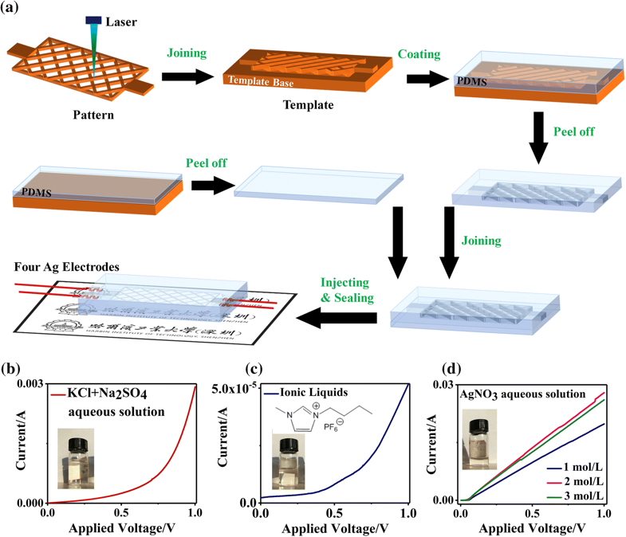
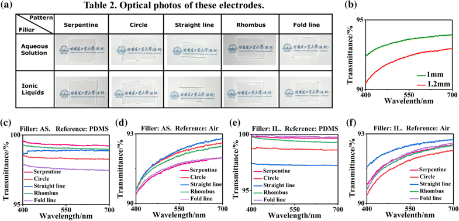
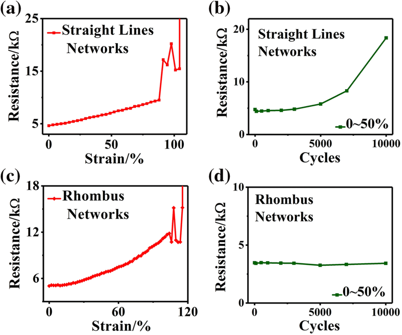
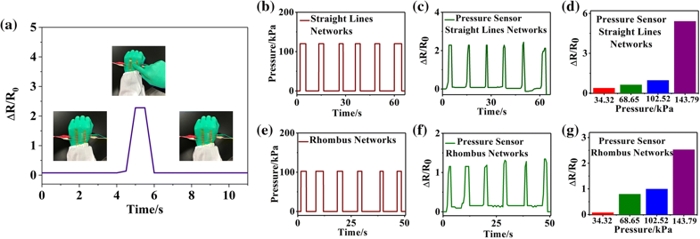
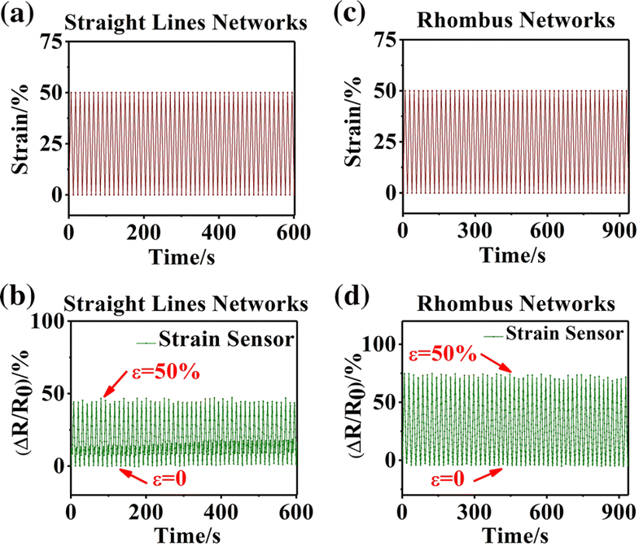
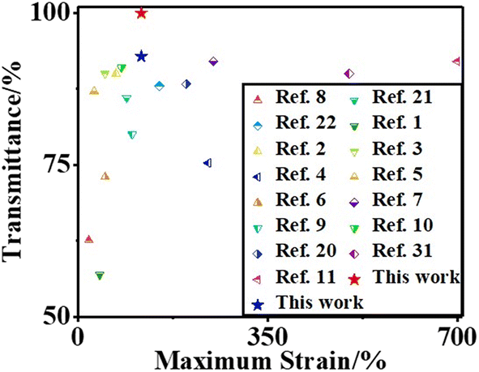

## Ionic liquids-filled patterned cavities improve transmittance of transparent and stretchable electronic polydimethylsiloxane films  
## 透明和可拉伸的PDMS膜内图案化空腔填充离子液体以改善电子的透射率

> Journal of Materials Science  
> DOI: 10.1007/s10853-019-03682-7  
> Pengdong Feng, Xinyu Wang, Beibei Lu, Guangxing Pan, Xuesong Leng, Xing Ma, Jiaheng Zhang, Weiwei Zhao

### Abstract
用于柔性和可穿戴设备的透明电极需要可拉伸且可以图案化导电的材料。通过激光加工和转移印刷制备具有图案化空腔的透明且可拉伸的聚二甲基硅氧烷（PDMS）膜。将透明导电离子液体（IL）和水溶液（AS）注入空腔中，获得透射率在99.94％（相对于空白PDMS膜）和92.80％（相对于空气）的可见光范围内的电极。该透射率几乎与空白PDMS膜的透射率相同。施加到电极的最大拉伸应变为117.23％，通过四探针法测量的具有网络图案的电极的电阻为3.20kΩ。在0-50％的应变下进行10,000次拉伸/释放循环后，这些电极仍然表现最佳。导电离子液体（IL）和水溶液（AS）显示出各种透射率和电性质，具有IL的电极具有较高的透射率，而具有AS的电极具有较高的电导率。本文分析了具有五种图案（蛇形，圆形，直线，折叠线和菱形）的电极。包含具有大曲率的曲线的图案将导致拉伸过程中的严重局部应力集中。包含平行曲线的图案可以优化导电性。含有复杂曲线的图案对透射率有一定影响。此外，弹性体和液体可随意变形，我们将此电极制造了两个压力传感器和两个应变传感器，用于证明它们在循环期间的灵敏度稳定性。

### Introduction
可拉伸和透明的电子皮肤具有应变和压力敏感性，在触摸传感器，能量收集设备，加热器，摩擦纳米发电机，神经电路，电致变色设备和生物医学检测设备中具有广泛的应用潜力。 
对于光伏能量收集纳米发电机的触敏层，透明度是允许光伏电池有效捕获光的关键特征。高透明度将使传感器薄片能够在不妨碍光学信号的情况下传输电信号。该特性将实现光激发，以及对传感器薄片覆盖的表面的连续检查。此外，生物传感器中的高透明和导电单层电极使其能够正确放置在目标位置。
基于用于电子皮肤的固体材料的应变传感器已经有了相当大的发展。 TiO2-Si薄膜，两性离子纳米复合材料，石墨烯，金属纳米线和碳纳米管（CNTs）与弹性体和织物结合，生产出多维伸缩、高拉伸应变和应变系数的电子皮肤。基于SiC或ZnO纳米纤维的应变传感器可以达到0.03％的最小应变检测限，但它们不透明。
基于纳米纤维膜和海胆形金属纳米粒子的压力传感器显示出显著的灵敏度（4.2kPa-1），但它们不可拉伸。纳米结构架构和共面栅极G晶体管，可以感应压力，但透光率低。一些新型材料，如锆钛酸铅和G纳米片，丙烯酰胺聚乙烯醇复合材料和聚二甲基硅氧烷（PDMS）波导，在用作压力传感器时表现出低灵敏度。
近几年来，聚合物和新兴纳米无机导电材料的复合材料得到了广泛的发展。碳纳米管已经与聚偏二氟乙烯 -六氟丙烯（PVDF-HFP），PDMS或丙烯酸酯橡胶复合，以实现高拉伸应变，这受到低透射率的限制。用PDMS复合还原的氧化石墨烯（rGO）导致严重的透射率损害。银纳米线（AgNWs）和聚氨酯-尿素，Eco-flex和岛基结构的复合材料需要真空操作和光刻来制作图案。所有这些无机材料，CNT，rGO和AgNW都是刚性的和不透明的，并且在拉伸过程中在许多位置处发生应力集中。这项研究已经解决了这些问题。
在这里，我们报告了一种高度可拉伸的透明和图案化电子皮肤，使用液体作为导电载体。透明导电流体与不透明固体导电材料相比具有至少两个优点。首先，导电液体是透明的，因此，制备的电子皮肤的透光率可以非常接近透明弹性体本身的透光率。其次，导电液体可以与弹性基体保持完美匹配以及弹性体的任何变形，而固体和基体之间的固有机械失配极大地限制了拉伸性能。由于弹性体是可全方位拉伸和全可压缩的，因此将导电和透明离子液体（IL）和水溶液（AS）注入透明和可拉伸PDMS膜的图案化空腔中，可以容易地制备对应变和压力敏感的电子皮肤。另外，测量电极的电学和拉伸性能。超过10,000次拉伸/释放循环中从未发生过故障。还研究了五种图案的拉伸性和透射率，包括蛇形，圆形，直线，折叠线和菱形。发现图案化网络可以将电阻降低一个数量级。本文重点研究了两个压力传感器和两个应变传感器的灵敏度，这些传感器具有直线网络和菱形网络模式。

### Results and Discussion

图1 电极的制备和表征。a 该示意图显示了具有菱形图案网络的可拉伸透明电极的制造过程。 b（KCl+Na2SO4）水溶液的电流-电压（C-V）曲线；插图显示了该解决方案的光学照片。c IL的电流与电压曲线；插图显示了1-丁基-3-甲基咪唑六氟磷酸盐的光学图像和分子式。 d AgNO3 AS在不同浓度下的C-V曲线；插图显示了该解决方案的光学图像。

可拉伸和透明电极的制造过程如图1a所示。将液体固化的PDMS涂覆到两种类型的模板上，获得具有图案化凹槽的PDMS膜和另一个空白平膜。将AS或IL注入通过这两个膜的连接形成的空腔中，然后用液体PDMS密封注入口。使用1.2mm厚的空白PDMS膜作为参考，该电极的透射率高达99.94％。（KCl+Na2SO4）AS和ILs的电流-电压（C-V）曲线分别如图1b，c所示。当施加的电压达到1V时，（KCl+Na2SO4）AS的电流比ILs高56倍。由于传导机制不是欧姆接触，两条曲线不是具有恒定斜率的直线。浓度为1,2和3mol /L的AgNO3 AS的C-V曲线显示在图1d中。与上述两种液体不同，该AS的C-V曲线几乎是一条具有恒定斜率的直线。当施加的电压为1 V时，AgNO3 AS电流为比（KCl + Na2SO4）AS高一个数量级。

所有五种图案都承受了超过100％的拉伸应变，表明它们具有很好的拉伸性。尽管PDMS的最大应变达到340％，但它与制备过程中的温度和时间参数密切相关。因此，在超过200分钟的烧结后，拉伸性能劣化。具有IL的电极的电阻显着高于具有AS的电极的电阻。由于每单位面积的线长度较长，所有图案中电极与蛇形图案的电阻最高，而圆圈表现出更好的电性能。

图2 当导电填料为AS或IL时，五种图案的光学透射率。a 表10中给出了10个电极的照片。b 在400至700nm波长下不同厚度的PDMS膜的透射率。 c 当填料为AS时，波长为400至700nm的透射率，参考为空白PDMS薄膜。 d 当填料为AS且参考为空气时的透射率。 e 当填料为IL且参考物为空白PDMS基板时的透射率。 f 当填料为IL且参考为空气时的透射率。

这些可拉伸透明电极的光学透射率如图2所示。具体地说，图2a显示了具有两种填充液体和五种图案的10个电极的照片，在表2中给出。在第一张照片中，例如，该电极的空腔图案是蛇形的，填料是水溶液。由于几乎100％的光学透射率，10张照片显示没有显着差异。它们看起来高度透明，并展现出清晰的背景标志。使用AS作为填充液，这些图案模糊不清，而ILs作为填充液，图案是不可见的。以空气为参照的空白PDMS薄膜的透射率如图2b所示。厚度的增加导致透射率的小幅下降。随着波长的减小，透射率降低，表明PDMS膜对电磁波的吸收随着能量的增加而增加。结果，PDMS膜的透射率在近紫外区域逐渐降低。厚度为1.2mm，透射率在700nm处为92.93％，在400nm处为90.44％。

以AS作为导电填料的五种图案的透射率如图2c，d所示。使用厚度为1.2mm的PDMS膜作为参考，它们在400-700nm波长之间的透射率大于97.46％，如图2c所示。具有蛇形图案的电极的透射率在700nm的波长下为99.22％，在400nm下为99.58％，并且随着波长从700nm减小到400nm而增加了0.36％，表明高能量的光子吸收在近紫外区域逐渐减小。

当使用空气作为参考时，它们在400和700nm之间的透射率大于90.38％，如图2d所示。具有直线图案的电极的透射率在700nm的波长下为92.80％，在400nm下为90.54％，随着波长的减小而减少2.4％，这与使用PDMS作为参考的结果相反。 。PDMS本身而不是本研究中使用的电极降低了近紫外区域的透射率，电极透射率非常接近于空白PDMS膜的电极透射率，揭示了液体对透光率的显着贡献。

具有ILs作为导电填料的五个电极的透射率值示于图3和4中。 2e，f。当在400-700nm的透射率大于97.24％时，使用1.2mm厚的PDMS膜作为参考，如图2e所示。具有折线图案的电极的透射率在700nm的波长下为99.77％，在400nm下为99.94％，随着波长的减小呈现0.17％的增加。具有IL的电极的透射率略高于具有AS的电极的透射率。当使用空气作为参考时，它们在400和700nm之间的透射率大于90.32％，如图2f所示。

用AgNO3溶液拉伸透明电极的性质。a 图案为直线网络时的电阻与应变曲线。b 当图案为直线网络时，在0-50％的应变下经过10,000次拉伸/释放循环后的电阻。c 图案为菱形网络时的阻力与应变曲线。d 当图案为菱形网络时，在0-50％的应变下经过10,000次拉伸/释放循环后的阻力。

为了评估拉伸性能，研究了具有两种网络图案的电极，如图3所示。图案网络的外部轮廓尺寸为30mm×20mm。填料是AgNO3溶液，四个AgNW探针连接到电阻率测试系统。
 
对于具有直线网络的电极，作为所施加的拉伸应变的函数的电阻示于图3a中。当应变从0增加到87.97％时，电阻单调均匀地从4.63增加到9.49kΩ，然后随着应变的继续增加而在15.22到20.20kΩ范围内波动。当应变达到107.52％时发生断裂。为了研究循环过程中的拉伸性能，评估了在0-50％的应变下10,000次拉伸/释放循环后的电阻变化，如图3b所示。当循环次数从0增加到5,000时，电阻从4.75增加到5.79kΩ，然后在10,000次循环后迅速增加217％到18.36kΩ。

对于具有菱形网络的电极，电阻与施加的拉伸应变的关系如图3c所示。当应变从0增加到104.00％时，电阻从5.02单调连续增加到11.84kΩ，然后随着应变的继续增加，电阻在10.71到15.18kΩ的范围内波动。当应变达到117.23％时发生断裂。循环期间的拉伸特性如图3d所示。它的电阻最初为3.48kΩ，在10,000次循环期间在3.26至3.48kΩ范围内略有波动，这与直线网络电极完全不同。在拉伸过程中，腔的长度增加，截面积同时减小，导致液体位置的变化和电阻的变化。

上述结果表明，腔体的图案（结构）在本研究中的拉伸性，电阻，循环期间的拉伸/释放能力和电子皮肤的光学透射率中起作用。

电极可承受的最大拉伸应变受到图案化腔的限制。尽管最大应变主要由PDMS基板的拉伸性质决定，但是面内空腔实际上是膜中的缺陷。该缺陷导致局部应力集中，并且不能实现无缺陷PDMS的拉伸能力（拉伸应变为340％）。由于腔的横截面尺寸小，电极的最大应变超过100％。

阻力与图案的设计有关。对于固体导电材料，电阻取决于电阻率，长度和横截面积。而且，并联连接的导电路径的数量对降低电阻有影响。即使导电液体的电荷载体是阴离子和阳离子而不是电子，电阻仍然取决于这四个影响因素。对于蛇形图案，导电路径只有一个并且曲折，因此无论导电液体如何，电阻总是最大的。其他图案具有并联连接和较短的导电路径，并且电阻显着低于蛇形的电阻。另一方面，由于直线图案与拉伸方向完全平行，因此其拉伸时的横截面尺寸均匀地减小，从而表现出拉伸应变的线性增加的阻力（如图3a所示）。

不同的图案显示出不同的承受拉伸/释放循环的能力。闭合图案，例如平行四边形和椭圆形，在拉伸过程中本身可以经历可再现的变形。因此，所施加的应变主要通过图案的变形来协调，并且图案化的空腔仅受到小的应变和非常低的局部应力集中，导致较少的损坏和较长的电极耐久性。对于具有直线图案的腔体，应变仅能够自身完全协调，结果，耐久性不如菱形图案的耐久性好。

透射率受图案化空腔和导电液体的组成的影响。由于PDMS基板和导电液体都是固有透明的，因此影响透射率的主要因素是入射光在腔表面（PDMS和液体之间的界面）上的反射。另外，导电液体的性质，包括PDMS表面上的组成，粘度和润湿性，可以影响来自界面的光的反射。因此，电子皮肤的透射率略低于没有空腔的PDMS薄膜的透射率。

图4 两个压力传感器的灵敏度附着在手背上的传感器可以感应施加的压力。对于直线网络的模式，施加的压力随时间变化如b所示，相应的电阻变化率用c表示，不同压力对电阻变化率的影响如（d）所示。对于菱形网络的模式，施加的压力随时间变化如（e）所示，相应的电阻变化率如（f）所示，不同压力对电阻变化率的影响如（g）所示。

另外，用这些透明可拉伸电极制成的两个压力传感器显示是由于对压力的响应，如图4所示。电子皮肤的压力传感器连接到手背，手指压力导致电气变化阻力，如图4a所示。而且，腔的图案对灵敏度有一定程度的影响。与直线网络相比，菱形网络传感器对压力的敏感度降低约40％。

此外，制作了两个具有直线网络和菱形网络图案的应变传感器，如图5所示。在0-50％的应变下进行拉伸/释放和再拉伸循环时，电极的电阻因为应变传感器显示增加/减少和再增加循环。当网络图案是直线之一时，记录了施加不同时间的50个拉伸应变循环，如图5a所示，电阻变化的相应灵敏度如图5b所示。施加的应变以每秒8.18％的恒定速率增加和减少，并且总共进行50次拉伸/释放循环。类似地，该传感器总共响应50个循环，并且50％应变下的灵敏度为47％，应变系数为0.92。在每个循环中，当应变为0（ε= 0）时电阻最小（波谷），当应变为50％（ε= 50％）时电阻最大（波峰）。

图5 具有直线网络和菱形网络模式的两个应变传感器的灵敏度。施加0-50％变化时间的50个拉伸应变循环显示在（a）和（b）中，并且相应的电阻变化灵敏度显示在（c）和（d）中
 
当图案是菱形网络时，记录施加不同时间的50个拉伸应变循环，如图5c所示，电阻变化的相应灵敏度如图5d所示。施加的应变以每秒6.20％的恒定速率增加和减少，并且总共进行50次拉伸/释放循环。同样，该传感器总共响应50个循环，50％应变下的灵敏度为82％，应变系数为1.64。其灵敏度随施加应变的增加和减少同步上升和下降。

通过比较图5b和d，发现具有菱形网络的电极表现出更高的应变灵敏度。对于两个应变传感器，最大电阻始终出现在每个周期的最大应变处，而最小电阻出现在应变为0时。50个最大值与50个最小值之间的差异相似，表明稳定和循环灵敏度。这就是本文中的应变传感器优于其他工作。

图6给出了可拉伸和透明电极特性的总结，说明了在这项工作中实现的最高光学透射率和明显的拉伸性。黑色五角星代表以空气为基准的透射率，高于所有其他。红色五角星给出了以PDMS基底为参考的透射率。在这项工作中，很少有工件表现出比电极更高的最大拉伸应变，这是由弹性体基材本身具有更好的可拉伸性能引起的。液态金属，碳纳米管和金属纳米线在其他工作中用作导电载体，其通过导电材料之间的大量间隙实现透明性质。除了间隙之外，透明和导电液体还可以在这项工作中将光学透射率从92％提高到99.94％。

### Conclusion
将透明且导电的IL和AS注入透明且可拉伸的PDMS膜的图案化腔中。成功制备了具有超高透射率和高拉伸性的柔性电极。通过激光加工和转印工艺制造五种网络图案。空白PDMS基底作为参考，透射率达到99.94％，空气作为参考，透射率达到92.80％。拉伸性能高达117.23％，最小电阻为3.20kΩ。在0-50％的应变下，这些电极在10,000次拉伸/释放循环后工作良好。具有IL的电极表现出更高的透射率，而具有AS的电极表现出更好的导体。图案的类型有助于电极的物理性质。大的曲率会在拉伸过程中导致严重的局部应力集中。平行曲线可以优化导电性。复杂曲线对透射率有一定影响。用这些电极制作的两个压力传感器和两个应变传感器的研究具有直线网络和菱形网络模式，证明了它们在循环过程中的灵敏度稳定性。这些电极具有多种潜在应用，例如可穿戴电子设备和生物识别芯片。