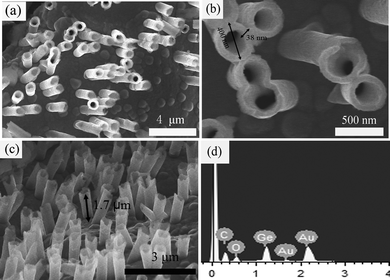

## Preparation of Ge nanotube arrays from an ionic liquid for lithium ion battery anodes with improved cycling stability  
## 由离子液体制备 循环稳定性改善的 Ge纳米管阵列

> The Royal Society of Chemistry (RSC)
> Chem. Commun., 2015, 51, 2064-2067
> DOI: 10.1039/C4CC08722D  
> 作者：Xusong Liu, Jian Hao, Xiaoxu Liu, Caixia Chi, Na Li, Frank Endres, Yi Zhang, Yao Li and Jiupeng Zhao 
> 原文链接：https://pubs.rsc.org/en/content/articlehtml/2014/cc/c4cc08722d

### 前言
可充电锂电池（LIBs）广泛应用于便携式电子设备和电动汽车，其快速发展导致对高容量和高功率密度的电极材料的需求与日俱增。然而，商用石墨材料用作阳极材料的锂离子电池的理论容量较低（372 mA hg-1），这限制了LIB的应用。最近的大量研究致力于能够与锂形成合金的IVA族元素。例如硅（Si）和锗（Ge）分别显示出4200 mA hg-1和1600 mA hg-1的高理论容量。与Si相比，Ge具有优异的锂离子扩散性（比Si快400倍）和高导电率（比Si高10^4倍）。因此，Ge将成为高功率阳极的有吸引力的电极材料。然而，反应过程中Ge的体积变化为370％。为了最大限度地减少充电和放电过程中的体积应变，使用0维纳米颗粒，1维纳米线和纳米管，和3维颗粒进行多功能形态控制，所获得的阳极材料表现出比它们的散装材料更好的存储容量和速率性能。

其中，一维纳米管状形态特别有吸引力，因为它可以提供与电解质的大的界面接触面积和短的Li离子扩散距离，并且它还可以适应体积变化。本文首次报道了由离子液体1-乙基-3-甲基咪唑双（三氟甲基磺酰基）酰亚胺（[Emim]Tf2N）电沉积的锗纳米管阵列的锂储存性能。在室温下进行来自含有GeCl4溶质的空气和水稳定离子液体[Emim]Tf2N的模板辅助恒电位电化学沉积。制备的Ge纳米管表现出优异的循环稳定性和改进的倍率性能。

通常，锗层不能通过在水溶液中电沉积形成，因为在水中的锗沉积总是伴随着析氢。相反，具有反蛋白石结构的锗可以很容易地在离子液体中电沉积。来自离子液体的半导体的电沉积的优势是因为离子液体的电化学窗口较大。 例如，通过调节模板，电解质浓度和沉积时间可以容易地控制层的形态。 电沉积也可以在室温下进行，相对于物理方法，可以显着降低能量消耗，操作成本和污染物排放。我们相信我们的合成方案是一种具有吸引力且可扩展的合成方法，可用于制备高性能第四族电极。  

### 文章内容

图1为通过在室温下从离子液体电沉积制备Ge NT阵列的示意图。

图2为[Emim]Tf2N中0.2mol/L GeCl4在Au溅射的PC膜上沉积的CV曲线。
在-0.25V的开路电位（OCP）旁边的弱还原峰对应于欠电位沉积（UPD）。在-0.8V的还原峰是由于Ge（IV）还原为Ge（II）物种，在-1.3V处的还原峰对应于Ge（II）物种向Ge的还原。在阳极区域中，0.2V的第一宽氧化峰对应于沉积的Ge的部分氧化和溶解。

通过使用M400PC膜制备Ge NT阵列。 图3（a）和（b）为[Emim]Tf2N中，M400PC膜内，0.2mol/L GeCl4在-1.3V下沉积20分钟的GeNT阵列的顶视图。 Ge NT的孔径为约400nm，壁厚为38nm，通过改变电沉积时间可以控制壁厚。 Ge NT的长度约为1.7μm，如图3（c）所示。 EDX光谱显示所制备的样品由Ge，Au，Cu和O组成。Au和Cu分别来自Ge NT阵列下方的金膜和集电器。氧气在手套箱外部不可避免的处理过程中由于Ge的部分氧化而产生。没有观察到达可检测量的氯或硫（来自离子液体）。  

在我们的实验中，当模板的孔径较大时，较短的沉积时间和较高浓度的GeCl4导致形成Ge NT阵列。相反，当使用具有小孔径的模板时，较长的沉积时间和较低的GeCl4浓度导致Ge纳米线（NW）束的形成。基于以上结果提出了可能的形成机制。在电沉积开始时，模板孔的内壁是沉积的优先位置，其中首先沉积Ge，因此形成短GeNT。随后，由于纳米通道的大表面积，Ge沿着PC膜的内壁生长，并且在平行于PC孔的方向上的稳定沉积，即壁面生长图案，导致形成长的Ge NT。 （图S2（b）和（c））。此后，电极/离子 - 液体界面和Ge的还原引起浓度梯度和扩散区的增厚，导致阴极电流迅速减小。在低电流时，Ge优先沿通道方向生长，导致产生完全堆积的Ge NW的自下而上增长模式（图S2（d））。

 
图4（a）电沉积20分钟后的Ge NT的TEM图像。 插图显示了相应的SAED图像。 （b）沿着Ge NT的横截面线的高角度环形暗场（HAADF）图像和EDX线扫描分析。  

图4（a）及其插图显示了具有中空芯和无定形壁的管状结构。 来自图4（a）中的方形区域的Ge NT的HRTEM也证实了Ge NT阵列的非晶结构（图S3）。图4（b）示出了Ge NT的高角度环形暗场（HAADF）对比图像。 较轻的部分反映了更高的原子序数，反之亦然。 因此，大部分的Au似乎都位于Ge NT的底部。能量色散光谱（EDX）显示了Ge在Ge中的分布，其应提供高导电性电子传输途径和活性材料与集电器之间的更好的电接触。  

图5（a）显示对应于Ge的锂化和脱锂的特征平台的C-V曲线。（b）以C/10，C/5，C/2，1C，2C的速率充电和放电的电极的充电和放电容量和库仑效率，然后回到C/10。（c）Ge NT阵列电极的放电容量超过250个循环。在0.01-2.0V的电位范围内以C/5速率对活性材料进行充电和放电。（d）在（c）中循环的电极的第1次，第10次，第50次，第100次和第250次循环的电压曲线。  

电荷曲线在阴极分支中相对于Li/Li+的0.28和0.08V的电位开始，对应于在充电过程中形成Li-Ge合金（图5a）。 在放电时，出现在0.44和0.88V的峰是因为LixGe到Ge的相变。

进行了Ge NT的速率能力性能和循环稳定性测试。速率能力性能如图5b所示。Ge NT电极分别在1/10℃，1/5℃，1/2℃，1℃和2℃下显示出1445,1233,1094,961和818mAh/g的充电容量（可逆容量）。当速率从2℃降至1/10℃时，容量保持率达到90％。材料以C/5速率循环250个循环，结果如图5c所示，电压曲线如图5d所示。Ge NT表现出1641mAh/g的初始放电容量和1260mAh/g的充电容量，初始的77％库仑效率。然而，在第10次循环时放电容量为1173mAh/g，这可能是由于在第1次循环期间在NT上形成固体电解质界面（SEI）层。然后，观察到轻微的容量衰减，并且在第50个循环记录的可逆容量为1025mAh/g，容量保持率为81％。

此外，Ge NT显示出很大的可逆容量。从第50周期到第250周期的Ge NT电极的稳定性是显着的（每个周期仅下降0.01％）。在250次循环后，相对于第50次循环的容量保持率为98％。在250次充电/放电循环后，Ge NT阳极似乎保持与集电器接触而没有粉碎和剥落。由于体积增加，在锂化后，Ge NT的壁厚增加。这表明活性材料具有非常稳定的结构，能够承受体积变化而不会粉碎并失去与集电器的接触。  

Ge NT的优异循环稳定性和改进的速率能力源于其独特的内部中空结构和一维非晶相。首先，由于Ge NT的中空管状结构，它们的内部充当体积膨胀的缓冲剂，因此减少了由于Li离子插入/提取引起的结构损坏或机械应变。其次，管状结构提供与电解质的大的界面接触面积，包括端部和管的内表面和外表面，允许Li离子的快速扩散。第三，通过防止结晶Ge NT和无定形Ge NT之间的转变，非晶Ge相的形成提高了Ge NT的稳健性，并且通过确保均匀的体积膨胀并且在循环期间没有颗粒粉碎直接导致稳定的容量。第四，在Ge NT末端的Au提供高导电性的电子传输途径和活性材料与集电器之间更好的电接触，这可能是良好的循环可逆性的原因。因此，Ge NT从离子液体电沉积的电极被认为具有良好的稳定性，良好的电接触和快速的电子传输，这可能是其良好的电化学性能的原因。

### 结论

通过模板辅助恒温电沉积从[Emim]Tf2N在室温下首次制备了Ge NT阵列阳极。与目前的Ge NW和NT阳极相比，Ge NT阵列阳极显示出优秀的循环能力。Ge NT的改进性能可能由于与集电器的更好的电接触，非晶相的形成以及中空管状结构。因此，来自离子液体的电沉积对于改善第四族一维电极的电化学性能是极好的。