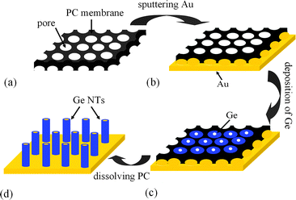
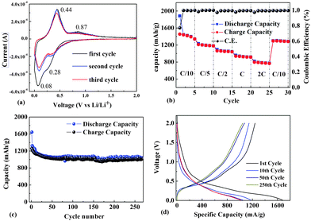

## Preparation of Ge nanotube arrays from an ionic liquid for lithium ion battery anodes with improved cycling stability  
## 由离子液体制备 循环稳定性改善的 Ge纳米管阵列

> The Royal Society of Chemistry (RSC)
> Chem. Commun., 2015, 51, 2064-2067
> DOI: 10.1039/C4CC08722D  

### Abstract
Ge nanotube array anodes are prepared by template-assisted electrodeposition from an ionic liquid to obtain superior cycling performance. They show remarkable cycling ability at 0.2 C, with a very high initial discharge capacity of 1641 mA h g−1 and a charge capacity of 1260 mA h g−1. After 250 cycles the capacity retention is 98% relative to that at the 50th cycle.  
通过离子液体的模板辅助电沉积制备Ge纳米管阵列阳极，以获得优异的循环性能。它们在$0.2C$时具有显着的循环能力，具有$1641mAhg^{-1}$的非常高的初始放电容量和$1260mAhg^{-1}$的充电容量。在250次循环后，容量保持率相对于第50次循环的容量保持率为98％。

### 引言
Rechargeable lithium batteries (LIBs) are widely used in portable electronic devices and electric vehicles, and their rapid development has led to demand for electrode materials with both high capacity and high power density. However, the commercial graphite materials used as the anode materials of lithium-ion batteries have a low theoretical capacity (372 mA h g−1), which limits the application of LIBs. A great deal of recent research has been devoted to group IVA elements that are capable of forming alloys with lithium. For example, silicon (Si) and germanium (Ge) show high theoretical capacities of 4200 mA h g−1 and 1600 mA h g−1, respectively. Compared to Si, Ge has excellent lithium-ion diffusivity (400 times faster than Si) and high electrical conductivity (104 times higher than Si). Therefore Ge will be an attractive electrode material for high-power-rate anodes. However, Ge undergoes a volume change of 370%. To minimize such volume strain during the charge and discharge processes, strategies for versatile morphology control using 0 D nanoparticles, 1 D nanowires and nanotubes,7–10 and 3 D particles have been reported,11 and the obtained anode materials have exhibited better storage capacity and rate performance than their bulk counterparts.  
可充电锂电池（LIBs）广泛应用于便携式电子设备和电动汽车，其快速发展导致对高容量和高功率密度的电极材料的需求。然而，商用石墨材料用作阳极材料。锂离子电池的理论容量较低（372 mA hg-1），这限制了LIB的应用.最近的大量研究致力于能够与锂形成合金的IVA族元素.例如硅（Si）和锗（Ge）分别显示出4200 mA hg-1和1600 mA hg-1的高理论容量。与Si相比，Ge具有优异的锂离子扩散性（比Si快400倍）和高导电率（比Si高104倍）.因此，Ge将成为高功率阳极的有吸引力的电极材料。然而，Ge的体积变化为370％.为了最大限度地减少充电和放电过程中的体积应变，使用0 D纳米颗粒，1 D纳米线和纳米管，和3 D颗粒进行多功能形态控制的策略据报道，和所获得的阳极材料表现出比它们的散装材料更好的存储容量和速率性能。

Among them, 1 D nano-tubular morphology is particularly attractive since it can provide a large interfacial contact area with the electrolyte and short Li ion diffusion distances and it can also accommodate the volume changes. Here, we report the lithium storage properties of germanium nanotube arrays electrodeposited from an ionic liquid, 1-ethyl-3-methylimidazolium bis(trifluoromethylsulfonyl)imide ([Emim]Tf2N), for the first time. Template-assisted potentiostatic electrochemical deposition from the air- and water stable ionic liquid [Emim]Tf2N containing GeCl4 solute is conducted at room temperature. The prepared Ge nanotubes (Ge NTs) exhibit excellent cycling stability and improved rate capability.  
其中，1D纳米管状形态特别有吸引力，因为它可以提供与电解质的大的界面接触面积和短的Li离子扩散距离，并且它还可以适应体积变化。 在这里，我们首次报道了由离子液体1-乙基-3-甲基咪唑双（三氟甲基磺酰基）酰亚胺（[[Emim]] Tf2N）电沉积的锗纳米管阵列的锂储存性能。在室温下进行来自含有GeCl4溶质的空气和水稳定离子液体[[Emim]] Tf2N的模板辅助恒电位电化学沉积。 制备的Ge纳米管（Ge NT）表现出优异的循环稳定性和改进的倍率性能。

Usually, germanium layers cannot be formed by electrodeposition in aqueous solutions, because germanium deposition in water is always accompanied by hydrogen evolution. In contrast, we have reported that germanium with the inverse opal structure can quite easily be electrodeposited in ionic liquids. The electrodeposition of semiconductors from ionic liquids has several advantages attributable to the large electrochemical windows of ionic liquids. For example, the morphology of the layer can be easily controlled by adjusting the template, electrolyte concentration, and deposition time. Electrodeposition can also be carried out at room temperature, which can significantly lower the energy consumption, operation cost, and pollutant emissions relative to those of physical methods. We believe our synthetic protocol to be an attractive and scalable synthetic approach to the preparation of high-performance group IV 1 D electrodes.  
通常，锗层不能通过在水溶液中电沉积形成，因为在水中的锗沉积总是伴随着析氢。 相反，我们已经报道具有反蛋白石结构的锗可以很容易地在离子液体中电沉积。 来自离子液体的半导体的电沉积具有几个优点，这归因于离子液体的大电化学窗口。 例如，通过调节模板，电解质浓度和沉积时间可以容易地控制层的形态。 电沉积也可以在室温下进行，相对于物理方法，可以显着降低能量消耗，操作成本和污染物排放。 我们相信我们的合成方案是一种具有吸引力且可扩展的合成方法，可用于制备高性能IV IV组电极。  

Fig. 1 presents the schematic for the preparation of Ge NT arrays by electrodeposition from an ionic liquid at room temperature.  
图1显示了通过在室温下从离子液体电沉积制备Ge NT阵列的示意图。

Fig. 2 shows the cyclic voltammogram (CV) of 0.2 mol L−1 GeCl4 in [Emim]Tf2N on an Au-sputtered PC membrane. The weak reduction peak next to the open-circuit potential (OCP) at −0.25 V corresponds to underpotential deposition (UPD). The reduction peak at −0.8 V is due to the reduction of Ge(IV) to Ge(II) species, and the reduction peak at −1.3 V corresponds to the reduction of Ge(II) species to Ge. In the anodic regime, the first wide oxidation peak at 0.2 V corresponds to the partial oxidation and dissolution of the deposited Ge.  
图2显示了在Au溅射的PC膜上的[Emim] Tf2N中的0.2mol L-1GeCl4的循环伏安图（CV）。在-0.25V的开路电位（OCP）旁边的弱还原峰对应于欠电位沉积（UPD）。在-0.8V的还原峰是由于Ge（IV）还原为Ge（II）物种，并且在-1.3V处的还原峰对应于Ge（II）物种向Ge的还原。在阳极区域中，0.2V的第一宽氧化峰对应于沉积的Ge的部分氧化和溶解。

Fig.3 Ge NT arrays were prepared by using M400 PC membranes. Fig. 3(a) and (b) show top views of Ge NT arrays deposited at −1.3 V for 20 min from 0.2 mol L−1 GeCl4 in [Emim]Tf2N inside the M400 PC membrane. The pore diameter of the Ge NTs is about 400 nm, with a wall thickness of 38 nm that can be easily controlled by changing the electrodeposition time. The length of the Ge NTs is about 1.7 μm, as shown in Fig. 3(c). The EDX spectrum shows that the as-prepared samples are composed of Ge, Au, Cu, and O. The Au and Cu are from the gold film below the Ge NT arrays and the current collector, respectively. The oxygen arises from the partial oxidation of Ge during unavoidable handling outside of the glove box. No detectable amounts of chlorine or sulfur (from the ionic liquid) are observed.  
通过使用M400 PC膜制备Ge NT阵列。 图3（a）和（b）显示了在M400PC膜内的[Emim] Tf2N中从0.2mol L-1 GeCl4在-1.3V下沉积20分钟的GeNT阵列的顶视图。 Ge NT的孔径为约400nm，壁厚为38nm，通过改变电沉积时间可以容易地控制。 Ge NT的长度约为1.7μm，如图3（c）所示。 EDX光谱显示所制备的样品由Ge，Au，Cu和O组成.Au和Cu分别来自Ge NT阵列下方的金膜和集电器。 氧气在手套箱外部不可避免的处理过程中由于Ge的部分氧化而产生。 没有观察到可检测量的氯或硫（来自离子液体）。  

When a M100 PC membrane was used as the template, Ge nanowire (NW) bundles were obtained after electrodeposition for 30 min from 0.1 mol L−1 GeCl4 in [Emim]Tf2N, as shown in Fig. S1a (ESI†). The length of the Ge NWs is about 1.5 μm (Fig. S1b, ESI†). In our experiments, when the pore diameter of the template was larger, a shorter deposition time and a higher concentration of GeCl4 led to the formation of Ge NT arrays. In contrast, when templates with small pore diameters were used, a longer deposition time and a lower concentration of GeCl4 led to the formation of Ge NWs. In order to investigate the structural evolution of Ge NTs, electrodeposition of Ge was conducted at different deposition times by using M 400 PC membranes as templates. Fig. S2 (ESI†) shows the morphology evolution of the deposits after deposition from 5 to 40 min. The possible formation mechanism is proposed based on the above results. At the beginning of electrodeposition, the inner wall of the template pore is a preferential site for deposition, where Ge is deposited first,17 and thus, the short Ge NTs are formed (Fig. S2(a), ESI†). Subsequently, Ge grows along the inner wall of the PC membrane owing to the large surface area of nanochannels, and stable deposition in the direction parallel to the PC holes, i.e., the wall-surface growth pattern, results in the formation of long Ge NTs (Fig. S2(b) and (c), ESI†). Thereafter, the electrode/ionic-liquid interface and the reduction of Ge cause a concentration gradient and thickening of the diffusion zone, leading to a rapid decrease in the cathodic current.18 At low current, Ge preferentially grows along the channel direction, resulting in the bottom-up growth pattern that produces completely packed Ge NWs (Fig. S2(d), ESI†).  
当使用M100 PC膜作为模板时，在[Emim] Tf2N中0.1mol L-1 GeCl4电沉积30分钟后获得Ge纳米线（NW）束，如图S1a（ESI†）所示。 Ge NW的长度约为1.5μm（图S1b，ESI†）。在我们的实验中，当模板的孔径较大时，较短的沉积时间和较高浓度的GeCl4导致形成Ge NT阵列。相反，当使用具有小孔径的模板时，较长的沉积时间和较低的GeCl4浓度导致Ge NW的形成。为了研究Ge NT的结构演变，通过使用M 400 PC膜作为模板，在不同的沉积时间进行Ge的电沉积。图S2（ESI†）显示沉积后沉积物的形态演变，从5到40分钟。基于以上结果提出了可能的形成机制。在电沉积开始时，模板孔的内壁是沉积的优先位置，其中首先沉积Ge，因此形成短GeNT（图S2（a），ESI†）。随后，由于纳米通道的大表面积，Ge沿着PC膜的内壁生长，并且在平行于PC孔的方向上的稳定沉积，即壁面生长图案，导致形成长的Ge NT。 （图S2（b）和（c），ESI†）。此后，电极/离子 - 液体界面和Ge的还原引起浓度梯度和扩散区的增厚，导致阴极电流迅速减小.18在低电流时，Ge优先沿通道方向生长，导致产生完全堆积的Ge NW的自下而上增长模式（图S2（d），ESI）。

Fig. 4 (a) TEM image of a Ge NT after electrodeposition for 20 min. The inset shows the corresponding SAED image. (b) High-angle annular dark-field (HAADF) image and an EDX line scan analysis along the cross-section line of the Ge NT.  
图4（a）电沉积20分钟后的Ge NT的TEM图像。 插图显示了相应的SAED图像。 （b）沿着Ge NT的横截面线的高角度环形暗场（HAADF）图像和EDX线扫描分析。  

Fig. 4(a) and its inset show the tubular-like structure with a hollow core and an amorphous wall. HRTEM of Ge NTs from the squared area in Fig. 4(a) also confirms the amorphous structure of Ge NT arrays (Fig. S3, ESI†).11Fig. 4(b) shows a high-angle annular dark-field (HAADF) Z-contrast image of the Ge NT. Lighter sections reflect higher atomic numbers, and vice versa. Therefore, a large proportion of Au seems to be at the bottom of the Ge NT. The energy-dispersive spectroscopy (EDX) shows the distribution of Au in the Ge NT, which should provide highly conductive electron transport pathways and better electrical contact between the active materials and the current collector.  
图4（a）及其插图显示了具有中空芯和无定形壁的管状结构。 来自图4（a）中的平方区域的Ge NT的HRTEM也证实了Ge NT阵列的非晶结构（图S3，ESI†）。 图4（b）示出了Ge NT的高角度环形暗场（HAADF）Z对比图像。 较轻的部分反映了更高的原子序数，反之亦然。 因此，大部分的Au似乎都位于Ge NT的底部。 能量色散光谱（EDX）显示了Ge在Ge中的分布，其应提供高导电性电子传输途径和活性材料与集电器之间的更好的电接触。  

Fig. 5 (a) C–V profiles showing characteristic plateaus corresponding to the lithiation and delithiation of Ge. (b) Charge and discharge capacities and Coulombic efficiency for an electrode charged and discharged at rates of C/10, C/5, C/2, 1 C, 2 C, and then back to C/10. (c) Discharge capacity of the Ge NT array electrode over 250 cycles. The active material was charged and discharged at a C/5 rate in the potential range of 0.01–2.0 V. (d) Voltage profiles of the 1st, 10th, 50th, 100th, and 250th cycles of the electrode cycled in (c).  
图5（a）显示对应于Ge的锂化和脱锂的特征平台的C-V曲线。 （b）以C / 10，C / 5，C / 2,1C，2C的速率充电和放电的电极的充电和放电容量和库仑效率，然后回到C / 10。 （c）Ge NT阵列电极的放电容量超过250个循环。 在0.01-2.0V的电位范围内以C / 5速率对活性材料进行充电和放电。（d）在（c）中循环的电极的第1次，第10次，第50次，第100次和第250次循环的电压曲线。  
The charge curves start at potentials of 0.28 and 0.08 V versus Li/Li+ in the cathodic branch, corresponding to the formation of a Li–Ge alloy during the charge process (Fig. 5a). Upon discharge, peaks appearing at 0.44 and 0.88 V can be ascribed to the phase transition of LixGe to Ge.  
电荷曲线在阴极分支中相对于Li / Li +的0.28和0.08 V的电位开始，对应于在充电过程中形成Li-Ge合金（图5a）。 在放电时，出现在0.44和0.88V的峰可归因于LixGe到Ge的相变。

We examined the rate capability performance and cycling stability of as-prepared Ge NTs. The rate capability performance is shown in Fig. 5b. The Ge NT electrodes exhibit charge capacities (reversible capacities) of 1445, 1233, 1094, 961, and 818 mA h g−1 at1/10 C, 1/5 C, 1/2 C, 1 C, and 2 C, respectively. When the rate was decreased from 2 C to 1/10 C, the specific capacity was well recovered: a capacity retention of 90% was achieved. A previous report showed that Ge NWs prepared by direct VLS growth using GeH4 exhibited a discharge capacity of 600 mA h g−1 at 2 C, which is significantly lower than the discharge capacity (825 mA h g−1) of our Ge NTs. This could be due to the large specific surface area of the NTs. The material was cycled at a C/5 rate for 250 cycles, with the results shown in Fig. 5c and voltage profiles in Fig. 5d. The Ge NTs exhibited an initial discharge capacity of 1641 mA h g−1 and a charge capacity of 1260 mA h g−1, with an initial 77% Coulombic efficiency. However, the discharge capacity is 1173 mA h g−1 at the 10th cycle, which may be due to the formation of a solid electrolyte interface (SEI) layer on the NTs during the 1st cycle.7 Then, slight capacity fading is observed, and the reversible capacity recorded at the 50th cycle is 1025 mA h g−1, with a capacity retention of 81%. Moreover, the Ge NTs show a large reversible capacity. The stability of the Ge NT electrodes from the 50th to 250th cycle is remarkable (dropping by only 0.01% per cycle). After 250 cycles, the capacity retention is 98% relative to that at the 50th cycle. A previous report showed that Ge NTs prepared by using the Kirkendall effect8 exhibited a capacity retention of about 80% at 0.2 C; our Ge NTs thus exhibit nearly 20% better capacity retention. Furthermore, compared to Ge NWs,20 the Ge NTs exhibit a capacity retention improved by nearly 30%. After 250 charge/discharge cycles, the Ge NT anode appears to remain in contact with the current collector without pulverization and exfoliation. The wall thickness of Ge NTs increases after lithiation due to the volume increase, as shown in Fig. S4 (ESI†). This suggests that the active material has a very stable structure capable of withstanding the volume change without pulverization and loss of contact with the current collector.  
我们检查了所准备的Ge NT的速率能力性能和循环稳定性。速率能力性能如图5b所示。 Ge NT电极分别在1/10℃，1/5℃，1/2℃，1℃和2℃下显示出1445,1233,1094,961和818mA h g-1的充电容量（可逆容量）。当速率从2℃降至1/10℃时，比容量得到很好的恢复：容量保持率达到90％。先前的报告显示，使用GeH4通过直接VLS生长制备的Ge NW在2℃时表现出600 mA h g-1的放电容量，这显着低于我们的Ge NT的放电容量（825 mA h g-1）。这可能是由于NT的比表面积大。材料以C / 5速率循环250个循环，结果如图5c所示，电压曲线如图5d所示。 Ge NT表现出1641mA h g-1的初始放电容量和1260mA h g-1的充电容量，初始的77％库仑效率。然而，在第10次循环时放电容量为1173mA hg-1，这可能是由于在第1次循环期间在NT上形成固体电解质界面（SEI）层.7然后，观察到轻微的容量衰减，并且在第50个循环记录的可逆容量为1025 mA hg-1，容量保持率为81％。此外，Ge NT显示出很大的可逆容量。从第50周期到第250周期的Ge NT电极的稳定性是显着的（每个周期仅下降0.01％）。在250次循环后，相对于第50次循环的容量保持率为98％。先前的报道显示，使用柯肯德尔效应8制备的Ge NT在0.2℃下的容量保持率约为80％;因此，我们的Ge NT的容量保持率提高了近20％。此外，与Ge NWs相比，20 Ge Ges的容量保持率提高了近30％。在250次充电/放电循环后，Ge NT阳极似乎保持与集电器接触而没有粉碎和剥落。由于体积增加，在锂化后，Ge NT的壁厚增加，如图S4（ESI†）所示。这表明活性材料具有非常稳定的结构，能够承受体积变化而不会粉碎并失去与集电器的接触。  

The excellent cycling stability and improved rate capability of Ge NTs result from their unique interior hollow structure and 1 D amorphous phase. First, because of the hollow tubular structure of the Ge NTs, their interior acts as a buffer for the volume expansion, and thus, structural damage or mechanical strain due to Li ion insertion/extraction is reduced. Second, the tubular structure provides a large interfacial contact area with the electrolyte, including the ends and the inner and outer surface of the tube, allowing fast diffusion of Li ions. Third, the formation of the amorphous Ge phase improves the robustness of the Ge NTs by preventing the transformation between crystalline Ge NTs and amorphous Ge NTs, and directly leads to a stable capacity by ensuring a homogeneous volume expansion and no particle pulverization during cycling. Fourth, Au at the end of the Ge NTs provides highly conductive electron transport pathways and better electrical contact between the active materials and the current collector, which may be responsible for the good cycle reversibility. Therefore, the Ge NT electrodes electrodeposited from an ionic liquid are considered to feature good stability, good electrical contact, and fast electron transport, which may be responsible for their good electrochemical performance.  
Ge NT的优异循环稳定性和改进的速率能力源于其独特的内部中空结构和1 D非晶相。首先，由于Ge NT的中空管状结构，它们的内部充当体积膨胀的缓冲剂，因此减少了由于Li离子插入/提取引起的结构损坏或机械应变。其次，管状结构提供与电解质的大的界面接触面积，包括端部和管的内表面和外表面，允许Li离子的快速扩散。第三，通过防止结晶Ge NT和无定形Ge NT之间的转变，非晶Ge相的形成提高了Ge NT的稳健性，并且通过确保均匀的体积膨胀并且在循环期间没有颗粒粉碎直接导致稳定的容量。第四，在Ge NT末端的Au提供高导电性的电子传输途径和活性材料与集电器之间更好的电接触，这可能是良好的循环可逆性的原因。因此，Ge NT从离子液体电沉积的电极被认为具有良好的稳定性，良好的电接触和快速的电子传输，这可能是其良好的电化学性能的原因。

### 结论
Ge NT array anodes have been prepared by template-assisted potentiostatic electrodeposition from [Emim]Tf2N at room temperature for the first time. A Ge NT array anode shows remarkable cycling ability compared to current Ge NW and NT anodes. The improved performance of the Ge NTs is attributed to better electrical contact with the current collector, the formation of an amorphous phase, and the hollow tubular structure. Thus, electrodeposition from an ionic liquid is excellent for improving the electrochemical performance of group IV 1 D electrodes.  
通过模板辅助恒温电沉积从[Emim] Tf2N在室温下首次制备了Ge NT阵列阳极。 与目前的Ge NW和NT阳极相比，Ge NT阵列阳极显示出显着的循环能力。 Ge NT的改进性能归因于与集电器的更好的电接触，非晶相的形成以及中空管状结构。 因此，来自离子液体的电沉积对于改善第四族1维电极的电化学性能是极好的。