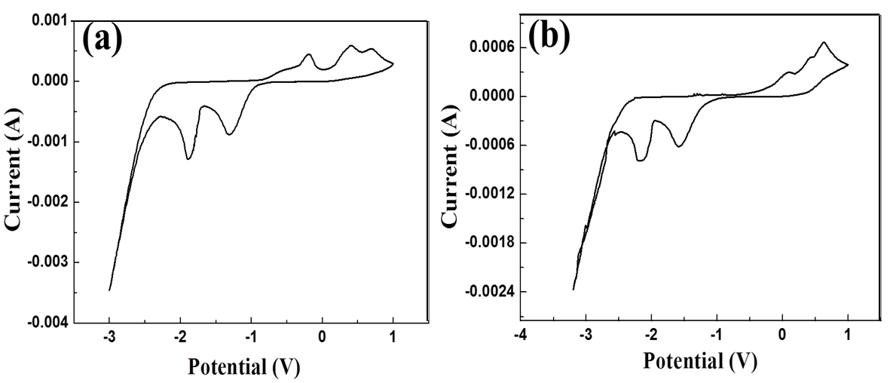
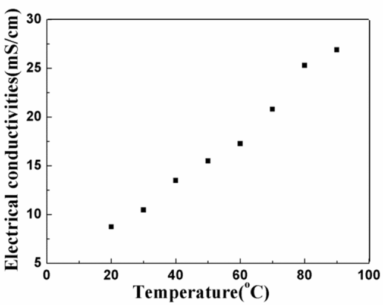
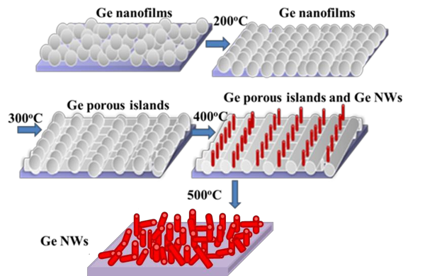
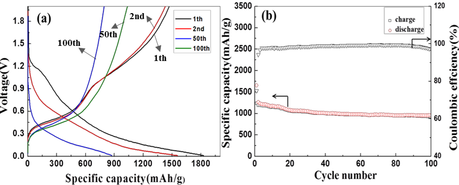
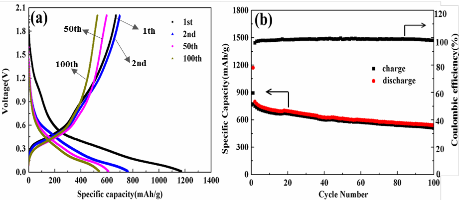
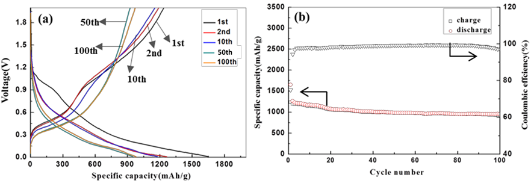

## 题目：离子液体电沉积锗基材料及其电化学性能研究

>作者：郝健
>
>关键词：离子液体;电沉积;锗;电化学性能;锂离子电池;体积膨胀

### 引言

>锗基材料电化学性能优异 -> 锂离子电池负极材料理想选择  
>问题：充放电过程中的体积膨胀、传统制备方法高耗能、高污染  
>本文以缓解锗基材料的粉化问题，提高材料的循环稳定性为目的，设计出不同形貌的锗基材料及锗基复合材料，包括:锗纳米薄膜、锗纳米线、三维泡沫镍-锗、三维锗-镍纳米圆锥阵列、三维锗-碳材料、锗/碳纳米管复合材料、锗/石墨烯复合材料及锗/聚3，4-乙撑二氧噻吩(PEDOT)复合材料。  
>采用离子液体电沉积实现对各种锗基材料的高效、绿色、低能、无催化剂及粘结剂制备。研究电化学过程中，微纳米结构与性能之间的关系。  

>沉积过程中通过水含量控制目标产物的形貌  
>- 未蒸馏的离子液体中沉积：二维多孔锗薄膜  
>- 蒸馏后的离子液体中沉积：三维多孔锗薄膜  

>研究了最佳沉积工艺  
>成核机理：受扩散控制的不可逆电极过程  
>通过退火多孔锗薄膜制备出不依靠模板且无催化剂离子的锗纳米线  
>锗纳米线的电学性能 -> 循环200次后可逆容量达到1200mAh/g，5C倍率下放电比为620mAh/g。

>电沉积将锗沉积在不同形貌的三维集流体上，制备出三维锗电极并研究测试其电化学性能。  
>三维结构可以为活性物质锗提供足够体积膨胀空间，提高锗电极的循环稳定性。  
>电学性能

>电沉积制备出锗/碳纳米管、锗/石墨烯及锗/聚 3，4-乙撑二氧噻吩(PEDOT)复合材料  
>电学性能

### 第一章 绪论

**课题背景/研究目的/意义**

- 锗基材料稳定性高于硅基材料。  
- 锗基材料问题：锗基材料在充放电循环中也存在较大的体积膨胀(约为 370%)，导致其容量保持率低，库伦效率差，循环稳定性不好。  
- 改进方法：降低材料粒径;制成多孔材料;降低材料维度;制备复合材料。  
- 各种纳米电极已：纳米颗粒、纳米球、纳米棒/线、纳米螺旋带、纳米带、纳米核壳、纳米管、纳米片、纳米网格、多孔纳米材料和纳米阵列等  
- 复合材料：锗(硅)/碳复合材料和锗(硅)/金属复合材料  
- 制备方法：CVD和溶剂热/水溶液电沉积 -> 离子液体电沉积  
- 离子液体电沉积优点：室温、工艺控制质量、副反应少、不析氢  
- 本课题：
   - 制备不同形貌锗基材料；  
   - 优化循环稳定性和倍率性能；  
   - 锗基材料直接生长在集流体，提高电池能量密度；  

**离子液体**

- 熔点一般低于100摄氏度  
- 热分解温度在400摄氏度以上  

**锂离子电池**

- 工作原理

正极: $LiCoO_2 ↔ Li_{1-x}CoO_2 + xLi^+ + xe^-$  
负极: $6C + xLi^+ + xe^- ↔ Li_xC_6$  
电池: $LiCoO_2 + 6C ↔ Li_{1-x}CoO_2 + Li_xC_6$  

- 正极材料

- 电解液材料：锂盐和有机溶剂混合液  

- 隔膜：多孔聚烯烃树脂

- 负极材料：  
   - 二维纳米锗：锂离子嵌入和脱出大多倾向于沿垂直方向进行，因此薄膜体积膨胀首先，粉化程度降低，稳定性提升。 
   - 一维纳米锗：  
      - 化学气相沉积：一般需要金、铁等金属催化剂的辅助。含锗的前驱体输运到催化剂表面并加热分解，与催化剂形成液态合金，达到饱和后，锗扩散到固液界面开始晶化，长成纳米线。  
      - 模板法：制备材料的尺寸取决于模板、大规模制造简单高效。  
   - 锗复合材料：  
      - 锗（硅）/碳复合材料  
      - 金属复合材料：
         - 金属锡可以进行锂离子的可逆嵌入和嵌出反应  
         - 在硅基材料中引入Mg、Mn、Ca和Cr元素，同样可缓解嵌脱锂过程中硅材料引起的体积变化  
         - 电化学沉积制备出Cu纳米线阵列，而后通过磁控溅射法得到了Cu-Ge纳米线阵列  

- 研究内容：
   - 筛选离子液体、调节工艺参数制备锗薄膜  
   - 无模板离子液体电沉积锗纳米线及其电化学性能研究  
   - 离子液体电沉积三维锗基材料及其电化学性能研究  
   - 离子液体电沉积锗复合材料及其电化学性能研究  

### 第二章 实验材料与研究方法

**锗基材料的制备**

**电池的组装**

锗基材料圆片 -> 隔膜 -> 电解液浸润 -> 锂片 -> 垫片/弹片 -> 封装 -> 沉降

**表征**

**电化学性能测试**

### 第三章 离子液体电沉积锗薄膜

**离子液体电沉积法制备锗薄膜材料**

- 锗薄膜的制备

- 锗薄膜材料的表征

两种体系$GeCl_4/[EMIm]FAP$电解液、$GeCl_4/[BMIm]TFSAl$电解液，前者沉积出的薄膜更平整，但纳米颗粒较大，这是因为前者的粘度大，沉积过程中离子迁移速率相对降低，为了获得较为致密的薄膜，在电沉积过程中增加了相应的电沉积时间，获得由较大颗粒组成的锗纳米薄膜。但是由于前者粘度较大在电沉积的过程中使得成核速度与晶粒生长速度相对平衡，促使电沉积所得的薄膜较为平整。

**离子液体电沉积法制备三维有序大孔(3DOM)锗薄膜**

- DOM锗薄膜制备

模板生长方法：三电极体系恒电位沉积，工作电极(WE)、参比(RE)和对比电极(CE)分别为沉积有 PS 模板的 ITO 玻璃(PS 粒径为 450 nm)、高纯 Pt 丝及高纯 Pt 环。

锗在 PS 模板上的电化学行为与在金基底上的基本相似，但是由于基底的导电性能不同，锗的氧化还原峰位出现了一定程度上的位移。

- DOM锗薄膜表征

使用离子液体$[EMIm]FAP$为电解液制备 3DOM 锗薄膜时便可以得到相对完美的结构，图中孔结构的轮廓更为清晰，大孔下面三个小孔的界限也更为明显，孔径分布非常均匀，孔壁厚度均为 70 nm。  
这是由于$[EMIm]FAP$粘度较大，促使在电沉积过程中成核速度与生长速度相对平衡，使得所得薄膜的结构均匀平整，同时也证实了模板去除过程对电沉积制备的锗材料的形貌不会造成严重影响。

- 水含量对锗薄膜结构的影响

**与锗基材料常用制备方法的比较研究**

- 热蒸镀法：

   -热蒸镀法可以避免催化剂的使用，且材料可直接沉积在集流体上。  
   - SEM 照片：可以看出锗颗粒分布在集流体表面，且分散度较高，颗粒与颗粒间的距离较大，约为几微米。分散不均匀且稀疏地方的颗粒间距可高达十几个微米。该方法制备的锗颗粒并没有达到纳米级别，部分锗颗粒的直径约为 1 μm。可见在不存在催化剂粒子诱导和催化的作用下，单纯依靠热蒸镀很难获得微观结构较为均匀的锗薄膜。  
   - EDS 分析：该方法制备的锗材料其纯度已达到使用标准。

- 溶剂热法：

   - SEM：样品由团簇组成，每个团簇由许多类蠕虫状的纳米线组成，纳米线的平均直径为 100-300 nm，长度则从几百纳米到几百微米不等。该产物团聚较为严重，如果强行用超声分散会对材料形貌造成破坏，这种结构在缓冲锗的体积膨胀问题上并不能起到较大作用。同时催化剂纳米金粒子也很难从目标产物中去除。在制备电极材料时金纳米粒子的存在会降低材料的能量密度。  
   - EDS：高的金含量无疑是会对材料的能量密度造成影响。然而减少金催化剂纳米粒子在制备过程的含量，会造成锗纳米线的生长不完全，甚至会造成锗纳米线根本无法生长。

- 不同方法的对比：

   - 溶剂热法制备出的锗薄膜由晶态的锗所组成。  
   - 离子液体电沉积法制备的锗薄膜组成为无定型态。  
   - 热蒸镀法制备出的锗薄膜偏向于由部分晶化的锗组成。  
   - 由于在充放电过程中无定型态的活性物质在体积膨胀时，可以避免晶态转变，没有各向异性的膨胀，更适应于缓冲体积膨胀。因此，离子液体电沉积制备出的材料在减缓活性物质粉化上具有更大的优势。
   
### 第四章 无模板离子液体电沉积锗纳米线及其电化学性能研究

**4.1 引言**

- 一维纳米材料(如纳米线、纳米带、纳米棒及纳米管等)与纳米粒子材料相比，具有更快的电子转移及离子传输速度，在储能应用方面展现出很大的优势。  
- 在电极材料中离子扩散时间与扩散路径的平方成正比，因此时间常数越小，扩散路径越短，电极的电化学性能就越高。纳米线可为电子的传输提供直接路径，缩短离子的扩散路径，有效的提高电极的倍率性能。
- 同时，纳米线具有较大的比表面积，电极与电解液间的接触面积大，增加了电化学活性位点加快锂离子嵌入及脱出反应的速度。
- 纳米线能适应电极材料的体积膨胀，降低活性材料的粉化程度，提高电极的循环稳定性。  
- 本章中利用离子液体电沉积制备多孔锗薄膜，通过退火多孔锗薄膜使其演变为锗纳米线，实现无模板离子液体电沉积锗纳米线，并测试多孔锗薄膜、不同退火条件下锗薄膜及锗纳米线的电化学性能，研究锗纳米线在提升锗基材料循环稳定性中的作用。

**4.2 离子液体\[EMIm]Tf_2N 的基本性质**

- 电化学窗口
   - 离子液体的电化学窗口是指离子液体阴离子发生氧化反应的电势与离子液体阳离子发生还原反应的电势之差。  
   - 如果组成离子液体的有机阳离子和阴离子都较稳定，此种离子液体的电化学窗口就较宽，有利于电沉积实验的进行。  
   - 离子液体$[EMIm]Tf_2N$的电化学窗口指的是$[EMIm]^+$发生还原反应的电极电 势与$Tf_2 N^-$发生氧化反应电极电势之差。

- 电导率

   - 提高电导率可以提高电化学反应过程中电子迁移速率。  
   - 离子液体的阳离子碳链越长，其粘度就越大。而离子液体的粘度与电导率呈反比例关系。此外，离子液体粘对温度非常敏感。通常情况下，离子液体的粘度随温度升高而降低，其电导率则升高。  

- 热稳定性
   - 从红外光谱图中可以发现$3100-3000 cm^{-1}$范围内的氢键特征吸收谱带随着温度的上升强度下降，证明分子间的氢键作用力减弱，可以降低离子液体粘度。因此高温条件可以降低离子液体的粘度，提高其电导率。同时，在测试温度范围内温度对离子液体的其他官能团几乎没有影响，说明$[EMIm]Tf_2N$具有良好的热力学稳定性。

**4.3 多孔锗薄膜的制备**

第三章中已经利用离子液体电沉积制备出锗薄膜，但是为制备锗纳米线需要获得多孔锗薄膜，通过退火多孔锗薄膜实现纳米线制备。因此选择加入$AlCl_3$来辅助电沉积制备多孔锗薄膜。

- 添加剂AlCl_3浓度对电沉积锗的影响

电解液中以阳离子的形式与$Tf_2N^-$阴离子形成络合物 $Al(Tf_2N)_3$ ，该络合物是无法被当做Al源来实现金属铝的沉积，但是该络合物的形成可以加大电解液体系粘度，使得沉积出的镀层粗糙度增加。同时，在沉积过程中 $Al(Tf_2N)_3$ 会包覆在沉积产物锗颗粒上。当沉积结束后，洗涤过程会将包覆在沉积产物外的络合物清洗干净，进而导致多孔结构的产生。

- 沉积电压对电沉积锗的影响

在电沉积过程中适当的沉积电势有利于的沉积产物的成核及生长，在较低的沉积电压下，晶核生长速度非常慢甚至会导致无法形成晶核，在较高沉积电压时，较大的晶粒易在沉积过程中形成，增加镀层表面粗糙度。

- 温度对电沉积锗的影响

在低温条件下，离子液体的粘度高，电导率较低。而在高温条件下，离子液体的热力学稳定性下降，阳离子咪唑环容易发生分解促使离子液体的电化学窗口变小。

**4.4 离子液体中电沉积锗的机理研究**

**4.5 锗纳米线的制备及电化学性能研究**

- 锗纳米线的制备

- 表征
   - CV曲线  
   - SEM  
   - 退火温度：即随着退火温度的升高，锗纳米粒子由杂乱的多孔薄膜逐步形成有一定取向的多孔薄膜，在继续聚集为多孔岛状结构，当温度进一步升高时，多孔岛间的距离逐渐变大，且岛状的边缘开始形成纳米线。最终，当温度达到 500 o C 时，岛状结构完全崩塌，在镍基底上形成纳米线。
   
   
- 电化学性能研究

   - a  
   - b 整个循环过程中纳米线的容量几乎没有大幅度的下降，循环稳定性优异。在前 20 个循环周期比容量有小幅的下降，这是由于 SEI膜的形成及电极活性材料活化所导致。其库伦效率从第二个循环周期开始便可达到90%，在后续的循环过程中其库伦效率均可高达 98%。  
   - c，d 纳米线电极相对于其他退火温度下的样品，无论是在库伦效率还是在容量保持率上都具有较大的优势。  

### 第 5 章 离子液体电沉积三维锗材料及其电化学性能研究

**5.1 引言**

- 三维电极具有较高的电子传输效率和较短的锂离子迁移距离；  
- 为锗的体积膨胀提供了足够的空间，减少体积膨胀的应力。  
- 在本章中利用具有三维网状结构的泡沫镍、镍纳米圆锥阵列及泡沫镍碳等为电极基底,通过离子液体电沉积将锗沉积在三维的基底上,合成出三维锗基负极材料。  

**5.2 三维泡沫镍/锗材料的制备及电化学性能研究**

- 制备  
- 表征
   - SEM  
   - CV曲线
- 电化学性能

   - 前 50 次循环比容量下降非常快,这可能是由于电极材料需要一个活化的过程,随着循环的进行,电池反应逐渐趋于稳定,充放电曲线也逐渐重合。  
   - 在后 50 次循环时,其比容量保持率高达 80%,可以进一步表明三维结构有利于锗电极的容量保持,减缓锗电极的体积膨胀,使得活性材料和集流体间维持较好的电接触。

**5.3 自支撑三维锗材料的制备及电化学性能研究**

- 锗-镍纳米圆锥阵列 Ge-NCA  
- 制备  
- 表征  
   - 镍圆锥阵列与离子液体的润湿性非常好，镍圆锥阵列作为工作电极沉积锗完全可行。  
   - 镍圆锥具有特殊的三维多孔结构,可以使得活性材料锗与基底的结合更为紧密。  
- 电化学性能

- 电化学交流阻抗图谱

**5.4 三维锗碳材料的制备及电化学性能研究**

- 制备：泡沫镍的预处理 -> 电泳法制备镍碳复合三维基底 -> 利用离子液体电沉积锗 -> 通过浸泡异丙醇数次来去除残留在泡沫镍孔隙中的电极液 -> 室温氩气气氛晾干 -> 组装半电池  

- 三维锗碳材料的表征：
   - SEM：
   - EDS：
   - 电化学：
      - 三维锗碳的首次放电容量为 1652 mAh/g,充电容量为 1237 mAh/g,库伦效率为 74%。  
      
      - 从第二次循环开始,三维锗碳材料的库伦效率显著增加均大于 98%。  
      - 倍率性能  
      - 电化学阻抗谱图被用来研究三维锗碳材料的电荷传输动力学。

- 性能分析：
   - 三维锗碳材料之所具有优异的电化学性能,主要与三维结构和碳的加入有关。
   - 首先,电化学交流阻抗谱图说明,无定型碳的加入大大提高了材料的电导率,促使锂离子的电荷迁移能力得到提高。
   - 其次,三维的碳网结构可以将活性物质包覆其中,减缓锗的体积膨胀,维持活性物质与集流体间良好的电接触,使得电极具备高度的结构完整性,其结构可由扫描电镜照片证明。故而可以使得锂离子的扩散长度缩短,同时较为疏松的碳网结构使该材料具有高孔隙率,可以为锂离子传输提供高效的路径。
   - 再次,三维结构不仅提供了一个弹性的缓冲空间来容纳锗的体积膨胀与收缩,也能有效地防止锗纳米粒子的聚集和开裂,从而可以保证电池具有较大的比容量和较高的库仑效率,及优异的倍率性能和循环性。
   - 最后,由于本节所制备的电极材料均采用离子液体电沉积法,使得活性物质直接沉积在集流体表面,从而简化了电极制备过程,且不再需要粘结剂。同时也保证电极材料的均匀性及活性物质与集流体间的导电性,可以在一定程度上提升电池的循环稳定性及倍率性能。

### 第 6 章 离子液体电沉积锗基复合材料及其电化学性能研究

**6.1 引言**

- 无定形碳、碳纳米管和石墨烯等已经成为提高锗电极材料结构稳定性的主要材料。  
- $Ge@CNT$电极材料  
- $Si@SiO_2@多巴胺纳米粒子$ -> $Si@C的蛋黄-蛋壳结构的硅纳米粒子$ 可观的电化学性能与碳壳的包覆有着密不可分的关系  
- 以柔性材料包覆锗材料,制备锗基复合材料可以有效的提高锗基材料的循环稳定性 -> 碳纳米管、石墨烯及聚 3,4-乙撑二氧噻吩(PEDOT)与锗的复合材料  

**6.2 锗/碳纳米管复合材料的制备及电化学性能研究**

- CNT有良好的力学性能和导电性，同时具有特殊的一维结构能形成导电网络增强电子传导速率，彭松的导电网络能有效缓解体积膨胀。

- 制备
  - 电泳法在泡沫镍上沉积碳纳米管 ->  
  - 离子液体电沉积在其上沉积锗  

- 表征  
- 电化学性能  
   - 较高的循环稳定性，较高的比容  
   - 单一组分的锗材料的循环稳定性相对较差  
   - 单一组分的碳纳米管的循环稳定性十分优异,但其缺点为比容量较低  

- 电性能优异原因

**6.3 锗/石墨烯复合材料的制备及电化学性能研究**

**6.4 锗/聚 3, 4-乙撑二氧噻吩(PEDOT)复合材料的制备及电化学性能研究**

**6.5 总结**

- 通过改变电泳的工艺参数制备出自支撑的石墨烯基底,利用离子液体电沉积制备出自支撑锗/石墨烯复合材料。该材料优异的的循环稳定性及容量是与石墨烯优异的导电特性密不可分的,其优异的电化学性能主要是因为石墨烯的导电率较高,因此在电极材料中电子的传输速率得到了大幅度的提升,有利于锂离子的脱嵌。同时,石墨烯优良的机械性能,有效的维持了该材料在充放电过程中的完整性,维持了活性物质与集流体间良好的电接触,大幅度的提升了电池的循环稳定性能。

- 利用离子液体电沉积成功的制备出 PEDOT 薄膜,并利用二次离子液体电沉积法制备出的锗/PEDOT 复合材料,由于 PEDOT 诱导作用促使制备出的锗/PEDOT 复合材料具有花状分级结构。该材料优异的电化学性能主要归功于材料自身花状分级结构,该结构为纳米颗粒层次聚集而成,且纳米颗粒间存在一定的空间,这就为锗的体积膨胀预留了空间。通过研究表明在循环后该材料中的纳米颗粒形成了多孔状的纳米网格结构,有利于离子传输,提高材料的循环稳定性及倍率性能。