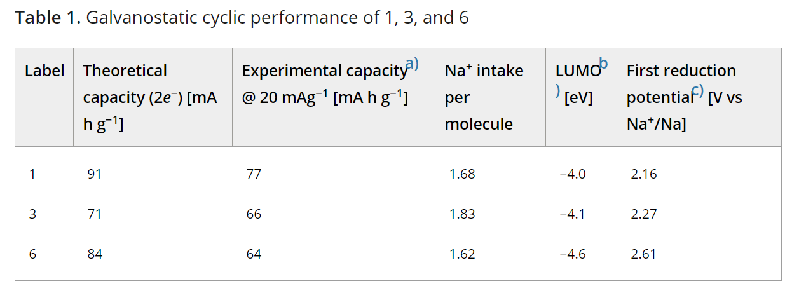

# Twisted Perylene Diimides with Tunable Redox Properties for Organic Sodium‐Ion Batteries  具有可调氧化还原特性的扭曲二酰亚胺，用于有机钠离子电池

> Authors: Harish Banda, Dijo Damien, Kalaivanan Nagarajan, Ashish Raj, Mahesh Hariharan, Manikoth M. Shaijumon
> Citation: Adv. Energy Mater. 2017, 7, 1701316
> DOI: [10.1002/aenm.201701316](https://doi.org/10.1002/aenm.201701316)
> Keywords: dihedral angles, perylene diimides, single plateau, sodium‐ion batteries, tunability

## Abstract
Organic rechargeable batteries gain huge scientific interest owing to the design flexibility and resource renewability of the active materials. However, the low reduction potentials still remain a challenge to compete with the inorganic cathodes. This study demonstrates a simple and efficient approach to tune the redox properties of perylene diimides (PDIs) as high voltage cathodes for organic‐based sodium‐ion batteries (SIBs). With appropriate electron‐withdrawing groups as substituents on perylene diimides, this study shows a remarkable tunability in the discharge potential from 2.1 to 2.6 V versus Na+/Na with a sodium intake of ≈1.6 ions per molecule. Further, this study explores tuning the shape of the voltage profiles by systematically tuning the dihedral angle in the perylene ring and demonstrates a single plateau discharge profile for tetrabromo‐substituted perylene diimide (dihedral angles θ1& θ2= 38°). Detailed structural analysis and electrochemical studies on substituted PDIs unveil the correlation between molecular structure and voltage profile. The results are promising and offer new avenues to tailor the redox properties of organic electrodes, a step closer toward the realization of greener and sustainable electrochemical storage devices.  
由于活性材料的设计灵活性和资源可再生性，有机可再充电电池获得了巨大的科学兴趣。然而，低还原电势仍然是与无机阴极竞争的挑战。这项研究演示了一种简单有效的方法来调节per二酰亚胺（PDI）作为有机基钠离子电池（SIB）的高压阴极的氧化还原特性。有了适当的吸电子基团作为per二酰亚胺上的取代基，这项研究表明，与Na + /Na相比，Na + /Na的放电电位在2.1至2.6 V范围内具有显着的可调谐性，每个分子的钠摄入量约为1.6个离子。此外，这项研究探索了通过系统地调节the环中的二面角来调节电压曲线的形状，并证明了四溴取代的per二酰亚胺（二面角θ1＆θ2= 38°）的单一平稳放电曲线。有关取代的PDI的详细结构分析和电化学研究揭示了分子结构与电压曲线之间的关系。结果令人鼓舞，并为定制有机电极的氧化还原特性提供了新途径，这朝着实现绿色和可持续的电化学存储设备迈进了一步。

## 1 Introduction
Sodium ion batteries (SIBs) have been extensively studied in the recent past as an alternative to their lithium counterparts (LIBs), owing to concerns regarding cost and limited reserves of lithium. Particularly, in large‐scale storage applications like hybrid vehicles and renewable power stations, SIBs, with the abundance and low cost of sodium, are more viable than LIBs.1-6 Sodium exhibits electrochemical properties similar to that of lithium (0.3 V more positive) and its ionic radius is about 1.3 times to that of lithium ion. While the positive potential offers better safety, it also lowers the reduction potential of the active materials.7, 8 Recently, several transition metal‐based systems have been proposed as promising electrode materials for SIBs,3, 4 but high production costs and the associated environmental concerns question the long‐term reliance on these materials. Also, the insertion of large Na+ ions into rigid lattices results in multistep phase transitions and the materials often suffer from low capacity utilization or sluggish kinetics.8, 9  
钠离子电池（SIBS）已在最近被广泛研究，以替代它们的锂同行（LIBS），由于考虑到成本和锂储量有限的担忧。特别是，在像混合动力汽车和可再生发电站，SIB中，与丰度和钠的低成本大规模存储的应用程序，比LIBS更可行。钠表现出类似于锂（0.3 V更多阳性）和它的离子半径的是约1.3倍于锂离子的电化学性能。虽然正电位提供了更好的安全性，也降低了活性物质的还原电位。最近，一些过渡金属类系统已被提出作为有前途的电极材料的SIB，但生产成本高和相关联的环境问题质疑这些材料的长期依赖。此外，大的Na +离子的插入在多步相变和材料刚性晶格结果经常遭受低容量利用率或呆滞动力学。

Organic materials with promising features like light weight, design flexibility at the molecular level, good resource renewability and low production costs are emerging as promising alternatives to inorganic materials.10-12 Recent reviews on organic materials show significant developments on radical and carbonyl based materials for batteries.13, 14 However, the low reduction potentials offered by these materials compared to their inorganic counterparts outweigh all the merits.15-17 With the inherent 0.3 V more positive reduction potential of Na than Li, it is even more challenging to achieve higher reduction potentials with organic materials for SIBs. Radical based materials offer the highest reduction potentials among organic materials for SIBs, but they depend on large anions like PF6− and ClO4− for charge compensation.8, 9 These large electrolyte anions cannot be readily inserted into active material and require large amounts of electrolyte while compromising the practical specific energy densities.15, 18 Carbonyl compounds, particularly carboxylate salts and anhydride‐based materials, with their great diversity, can be tailored for desired properties.19-23  
有机材料具有轻质，在分子水平上的设计灵活性，良好的资源可更新性和较低的生产成本等有前途的特征，已成为无机材料的有前途的替代品。10-12最近对有机材料的评论表明，自由基和羰基材料在有机材料方面取得了重大进展13、14然而，与无机材料相比，这些材料提供的低还原电位胜过所有优点。15-17由于Na的固有正还原电位比Li高0.3 V，因此实现更高的还原性更具挑战性。有机材料降低SIB的潜力。自由基基材料在SIBs的有机材料中提供最高的还原电位，但它们依赖于PF6-和ClO4-等大阴离子进行电荷补偿[8，9]。这些大电解质阴离子不能轻易插入活性材料中，需要大量电解质。15 18 18羰基化合物，特别是羧酸盐和酸酐基材料，具有很大的多样性，可以针对所需的性能进行定制。19-23

Redox potential of a molecule can be tailored by tuning its highest occupied molecular orbital (HOMO) and lowest occupied molecular orbital (LUMO) energy levels. According to the molecular orbital theory, a lower LUMO level means higher electron affinity and thus a higher reduction potential for the molecule. Lowering the LUMO levels could be achieved in two ways. Attaching electron withdrawing groups to the redox active molecule is one way15, 24-27 and extending the conjugation in a molecule through aromatic rings is another conventional way.10, 21, 28 Extending the conjugation could increase the electrochemical dead weight of the molecule and result in reduced theoretical capacity. Nevertheless, extended conjugation is expected to increase the ion intake and practical capacity of a molecule. A recent report demonstrates this in sodium stilbene dicarboxylate (SSDC).21 SSDC shows a discharge capacity of 222 mA h g−1 whereas its lower ring counterpart, sodium benzene dicarboxylate (SBSC) shows 162 mA h g−1.  
可以通过调整分子的最高占据分子轨道（HOMO）和最低占据分子轨道（LUMO）的能级来定制分子的氧化还原电势。**根据分子轨道理论，较低的LUMO能级意味着较高的电子亲和力，因此具有较高的分子还原电位**。降低LUMO水平可以通过两种方式来实现。**将吸电子基团连接到氧化还原活性分子的一种方法是15、24-27，而通过芳香环将分子中的共轭延伸是另一种常规方法**。10、21、28**扩展共轭会增加分子的电化学自重，从而导致降低了理论能力**。然而，**预期的共轭扩展将增加分子的离子摄入和实用能力**。最近的报告在二苯乙烯二羧酸钠（SSDC）中证明了这一点。21SSDC显示的放电容量为222 mA h g-1，而其下环对应物苯二羧酸钠（SBSC）显示为162 mA h g-1。

Extended conjugation reduces the HOMO–LUMO gap (Eg) in a molecule and offers better electronic conduction and a lower degree of polarization.10 This results in better redox reversibility and, thus, delivers practical capacities close to the theoretical value.  
扩展的共轭减少了分子中的HOMO-LUMO间隙（Eg），并提供了更好的电子传导和更低的极化度。10这导致了更好的氧化还原可逆性，因此提供了接近理论值的实用容量。

Recently, Dunn and co‐workers have demonstrated the effect of substitution on electrochemical performance of naphthalene diimides for LIBs.15 While they could achieve higher reduction potentials with some derivatives, unfortunately, the reversible discharge capacities were less than half of the theoretical capacities in most cases. Only very few reports are focused on tuning organic materials to offer high reduction potentials for LIBs.26, 28-30 Though the knowledge of Li electrochemistry is expected to be applicable for sodium as well, at times, latter behaves in a dissimilar fashion and investigations are yet to address this anomaly.31-34 Kim et al. made the first and only attempt to tune the redox potential by employing halogen‐ substituted quinone derivatives as cathode materials for SIBs, but with poor cyclability.35 However, none of these reports discuss the energetic structure–voltage profile correlation. Considering all the concerns mentioned above and benefitting from the vast synthesis knowledge available in the literature, we opted to study the effect of substituting electron withdrawing groups on N,N′‐bis(n‐propylacetyl)‐perylene‐3,4,9,10‐tetracarboxylic diimide (PDI) in SIBs. PDI is an excellent canvas to portray tailoring of redox potentials, as it possesses an extended conjugation over two naphthalene subunits and offers four bay positions and 4 ortho positions for substitutions. Detailed structural analysis and electrochemical studies on substituted PDIs shed light on correlation between molecular structure and voltage profile. Through an understanding of the effect of twist in the perylene ring, we could successfully tailor the shape of voltage profile to a single plateau. Our report is an interesting case study of tuning the shape of voltage profile and is the first report of its kind in organic literature for both SIBs and LIBs.  
最近，Dunn及其同事证明了取代对萘二酰亚胺用于LIBs电化学性能的影响。15尽管它们可以通过某些衍生物实现更高的还原电势，但不幸的是，在大多数情况下，可逆放电容量不到理论容量的一半。仅有极少数的报告集中在调整有机材料以为LIB提供高还原电位上。26，28-30尽管人们希望将Li电化学知识也应用于钠，但有时后者的表现方式和研究方式不同。31-34 Kim等人首次且唯一尝试通过使用卤素取代的醌衍生物作为SIB的阴极材料来调节氧化还原电势，但循环性较差的方法。35但是，这些报告都没有讨论能量结构与电压分布的相关性。考虑到上述所有问题，并受益于文献中广泛的合成知识，我们选择**研究吸电子基团对N，N'-双（n-丙基乙酰基）-per-3,4,9的作用**，SIB中的10-四羧酸二酰亚胺（PDI）。PDI是描绘氧化还原电位定制的极好画布，因为它在两个萘亚单位上具有扩展的共轭，并提供四个间隔位和四个邻位取代基。取代的PDI的详细结构分析和电化学研究揭示了分子结构与电压分布之间的相关性。**通过了解苝环扭曲的影响，我们可以成功地将电压分布图的形状调整为一个平稳的平台**。我们的报告是一个有趣的案例研究，旨在调整电压曲线的形状，这是有机文献中针对SIB和LIB的同类报告中的第一篇。

## 2 Results and Discussion
The experimental evaluation of the effect of electron‐withdrawing groups on electrochemical performance was performed through synthesis of various perylene diimide derivatives by following Scheme 1, starting from perylene‐3,4,9,10‐tetracarboxylic acid (PTCDA). The synthesized derivatives, with good solubility in common solvents, were characterized through various spectroscopic techniques (see synthesis and characterization section in Supporting Information). 1 was synthesized from PTCDA through the conventional imidization process with a yield of 50%. 3 was synthesized with a yield of 70% by following a two‐step procedure of bromination and imidization on PTCDA.36 Cyanation of 3 was performed through a reported procedure and 6 was obtained in 59% yield.37 Electrochemical performance of the synthesized derivatives was analyzed through cyclic voltammetry and galvanostatic cycling measurements. Cyclic voltammetry was performed to test the reversible ingress of sodium ions and two pairs of broad reversible redox peaks were observed in 1, 3, and 6 (Figure S1, Supporting Information). Differential capacity plots (voltage vs. dQ/dE),38 obtained through the galvanostatic charge–discharge measurements, show two sets of relatively sharp redox peaks at 2.2 and 1.7 V for 1, which correspond to the formation of radical anion and dianion, respectively (Figure 1a).39 As expected with the increase in electronegativity, both the substituted derivatives viz. 3 and 6, show a shift in the first and second redox potentials toward higher voltages when compared to 1. 6 shows a greater potential than 3 with cyanide being a better electron‐withdrawing group than bromine.  
根据Scheme方案1，从per-3,4,9,10-四羧酸（PTCDA）开始，通过合成各种per二酰亚胺衍生物，对吸电子基团对电化学性能的影响进行了实验评估。合成的衍生物在普通溶剂中具有良好的溶解度，可通过各种光谱技术进行表征（请参阅《支持信息》中的“合成和表征”部分）。通过常规的酰亚胺化方法由PTCDA合成图1的化合物，收率为50％。通过在PTCDA上进行溴化和酰亚胺化的两步程序，合成了3的化合物，产率为70％。36通过报告的方法对3进行氰化，以59％的产率获得6。37合成衍生物的电化学性能为通过循环伏安法和恒电流循环分析进行分析。进行了循环伏安法测试钠离子的可逆进入，并在1、3和6中观察到两对宽的可逆氧化还原峰（图S1，支持信息）。通过恒电流充放电测量获得的微分容量图（电压与dQ /dE的关系）38**显示出两组在2.2 V和1.7 V下相对锐利的氧化还原峰**，分别对应于自由基阴离子和二价阴离子的形成。 （图1a）.39正如预期的，随着电负性的增加，这两个取代的衍生物即变。图3和图6显示，与1相比，第一和第二氧化还原电势向更高的电压移动。6显示比3更大的电势，氰化物是比溴更好的吸电子基团。

  
Scheme 1. Synthesis of perylene diimide derivatives a) Br2, I2, H2SO4, 85 °C, b) 3‐amino‐1‐propanol, DMA, 1,4‐dioxane, 110 °C; Acetic anhydride, Pyridine, RT, c) CuCN, DMF, 150 °C, d) CH3COSK, CH3OH, CHCl3. (R: n‐propyl acetate).  
流程1. per二酰亚胺衍生物的合成a）Br2，I2，H2SO4，85°C，b）3-氨基-1-丙醇，DMA，1,4-二恶烷，110°C;乙酸酐，吡啶，RT，c）CuCN，DMF，150°C，d）CH3COSK，CH3OH，CHCl3。 （R：乙酸正丙酯）。

  
Figure 1. a) Differential capacity plots of 1, 3, and 6 cycled at a current rate of C/4 in voltage ranges between 1.5 and 3.0 V versus Na+/Na. b) Schematic representation of the charge–discharge mechanism for the perylene diimide derivatives. c) First reduction potential versus calculated LUMO energy levels for 1, 3, and 6. d) Charge–discharge voltage profiles of 1, 3, and 6 cycled at a current rate of C/4. A systematic shift in the voltage profile toward higher redox potentials can be noted from 1 to 3 and 6. Cyanide being a better electron‐withdrawing group results in higher potentials for 6 than the bromine substituted 3.  
图1. a）相对于Na + /Na，在1.5和3.0 V之间的电压范围内，以C /4的电流速率循环的1、3和6的差分容量图。 b）ylene二酰亚胺衍生物的充放电机理示意图。 c）1、3和6的第一个还原电位与计算得出的LUMO能级的关系。d）1、3和6的充放电电压曲线以C /4的电流速率循环。从1到3和6可以看到电压曲线向更高的氧化还原电势的系统转移。氰化物是一个更好的吸电子基团，与溴取代的3相比，其6的电势更高。

The first reduction of 6 occurs at about 340 mV greater than 3 and 450 mV greater than 1.  

Redox behavior of perylene‐based systems as diimides,39 anhydrides,31 and polyimides32, 40, 41 have been studied extensively in the literature and all the reports suggest a two‐step reduction process with formation of radical anion as an intermediate. The redox processes are associated with the conversion of carbonyl groups in the imide ring to enolate functionality. Recently, Wurthner and co‐workers successfully synthesized the first ambient stable derivatives of perylene diimide radical anion and dianion and could completely characterize the two species, otherwise unstable.42, 43 With the synthesized sodium salt of dianion species, the coordination between sodium ions and the enolate functionality could be successfully demonstrated. Figure 1b shows the electrochemical redox mechanism of sodium ion insertion and de‐insertion for perylene diimides during the charge–discharge processes.  
per基体系作为二酰亚胺，39酸酐31和聚酰亚胺32、40、41的氧化还原行为已在文献中进行了广泛研究，**所有报告均提出了以形成自由基阴离子为中间体的两步还原过程。氧化还原过程与酰亚胺环中羰基转化为烯醇官能团有关**。最近，Wurthner及其同事成功合成了ambient二酰亚胺自由基阴离子和二价阴离子的首个环境稳定衍生物，可以完全表征这两个物种，否则不稳定。42，43用合成的二价阴离子物种的钠盐，钠离子和烯醇功能可以被成功证明。图1b显示了在充放电过程中per离子二酰亚胺中钠离子插入和脱嵌的电化学氧化还原机理。

To establish a correspondence between the reduction potentials and the electron‐withdrawing ability of the substituents, energy levels of the derivatives were analyzed. LUMO energy levels, which are known to directly correlate to the reduction potentials of the species,10 were calculated for the derivatives in their gaseous phase using B3LYP/6‐311+G(d, p) level of theory. The LUMO energy values obtained for the PDI derivatives span from −4.6 eV for the highly electron deficient 6 to −4.0 eV for the unsubstituted 1 with an intermediate value of −4.1 eV for moderately electron deficient 3. The first reduction potentials observed in the differential capacity plots show a linear relationship with the calculated LUMO energy values (Figure 1c), thus, correlating the electron‐withdrawing ability of substituents to the reduction potentials of the derivative. This excellent equivalence between theory and experimental results highlight the level of flexibility organic molecules offer in tailoring the materials for desired properties.  
为了建立还原电位与取代基的吸电子能力之间的对应关系，分析了衍生物的能级。利用B3LYP /6-311 + G（d，p）的理论水平计算了气相中衍生物的LUMO能级，该水平直接与该物种的还原电位相关10。对于PDI衍生物获得的LUMO能量值，对于高度电子缺乏的6为-4.6 eV，对于未取代的电子1为-4.0 eV，对于中等电子为3则为-4.1 eV的中间值。容量图显示了与计算出的LUMO能量值的线性关系（图1c），因此将取代基的吸电子能力与衍生物的还原电势相关。理论和实验结果之间的出色等效性突出了有机分子在为所需特性定制材料时提供的柔韧性水平。

Having analyzed the redox properties of PDI derivatives, we carried out the galvanostatic charge–discharge cycling to estimate their sodium ion storage capabilities (Figure 1d). All the derivatives show a two plateau voltage profile with the plateaus being quite consistent with the redox peaks observed in the respective CVs. A systematic lift in the voltage profiles can be noticed from 1 to 3 and 6. Further, all the derivatives demonstrate first discharge capacities near to that of the theoretical capacities calculated for a two electron redox process (Table 1). The near theoretical capacities are expected with an extended conjugation over the two naphthalene rings in PDI as opposed to less than half utilization seen in naphthalene diimides for LIBs.15 Further, unlike the substituted naphthalene diimides for LIBs, herein, being a cathode material, it is highly desirable to galvanostatically cycle at higher electrochemical window.  
分析了PDI衍生物的氧化还原特性后，我们进行了恒电流充放电循环以评估其钠离子存储能力（图1d）。所有的导数都显示出两个平台电压曲线，该平台与在各个CV中观察到的氧化还原峰非常一致。从1到3和6可以看到电压曲线的系统提升。此外，所有导数的一次放电容量都接近于为两个电子氧化还原过程计算的理论容量（表1）。预期在PDI中两个萘环上的共轭扩展范围将达到接近理论容量，而不是用于LIB的萘二酰亚胺的利用率不到一半。15此外，与用于LIB的取代萘二酰亚胺不同，此处是阴极材料，它在较高的电化学窗口中进行恒电流循环是非常需要的。

Table 1. Galvanostatic cyclic performance of 1, 3, and 6  
  
a) The first discharge capacity observed when cycled at a current density of 20 mAg−1 in voltage ranges between 1.5 and 3.0 V versus Na+/Na  
b) Gas‐phase values obtained with the B3LYP/6‐311+ G(d, p) level of theory  
c) The first reduction peak potential observed from differential capacity plots plateau when cycled at a current density of 20 mAg−1 in voltage ranges between 1.5 and 3.0 V versus Na+/Na.

PDI derivatives in the present study are cycled at a higher potential window of 1.5–3.0 V versus Na+/Na opposed to 1.0–4.0 V versus Li+/Li for naphthalene diimides for LIBs.15] 1, 3, and 6 show discharge capacities of 74, 66, and 64 mA h g−1, respectively, which suggest a sodium ion intake of 1.6 to 1.8 per molecule. Figure S2 (Supporting Information) shows the voltage profiles illustrating sodium ion intake per molecule during the charge–discharge process.  
本研究中的PDI衍生物在1.5–3.0 V相对于Na+/Na的较高电势窗口中循环，而对于LiBs的萘二酰亚胺而言，相对于Li+/Li则在1.0–4.0 V相对。15、1、3和6显示了74、66和64 mA hg-1，分别表明每个分子的钠离子摄入量为1.6至1.8。图S2（支持信息）显示的电压曲线说明了在充电和放电过程中每个分子的钠离子摄入量。

Although the synthesized derivatives demonstrate good sodium ion intake in the first discharge, a clear drop in the charge and discharge capacities could be spotted thereafter (Figure S2, Supporting Information). Regardless of the drop in capacities, the redox plateaus for first charge and the second cycles still occur at potentials corresponding to peaks observed in the respective CVs, excluding the possibility of irreversibility. Hence, the drop in capacities is attributed to the fact that the synthesized derivatives are highly soluble in the electrolyte and will dissolve during cycling. Also, low capacities obtained for the derivatives are understandable with the presence of bulky imide side chains. Polymerization has been demonstrated as an efficient technique in circumventing these challenges.32 Further, polymerization through hydrazine as a linker is reported as an excellent technique which will not add any extra weight to the molecule but significantly enhances the specific capacities and the overall electrochemical performance of perylene diimides.32, 40 Apart from altering the HOMO–LUMO levels of the molecule, the added substituents also induce a twist in the perylene ring. In order to avoid electrostatic repulsions between the substituents and the hydrogen atoms on opposite bay positions, the perylene ring stabilizes into a twisted geometry. The two dihedral angles between the naphthalene subunits depend upon the extent of electrostatic repulsions. A schematic of the dihedral angles formed between the naphthalene subunits in a perylene ring is shown in Figure 2a. 1 has a planar structure with zero dihedral angles whereas 3 shows about 23° for both θ1 and θ2. Changes in the dihedral angles of a neutral PDI derivative will also affect the relative energies of its reduced forms (radical anion and dianion). Recently, Wurthner and co‐workers reported that, the changes in the relative energies of radical anion and dianion alter the redox potentials of quinones and perylene diimides.43 They performed solvent‐dependent cyclic voltammetric study on substituted perylene diimide derivatives to analyze the solvent dependency of the redox properties of its radical anion and dianion.43 With increasing polarity, the two reduction peaks are noted to move closer and eventually merge into a single peak in a highly polar solvent, such as methanol. They propose that this could be due to a preferential formation of the dianion species over radical anion owing to a superior stabilization of dianion via hydrogen bonding with increasing polarity. A single redox peak meant a complete preference for formation of dianion over the radical anion. The equilibrium constants determined for the disproportionation reaction of radical anion resulting in neutral and dianion species support this argument.  
尽管合成的衍生物在第一次放电中表现出良好的钠离子吸收能力，但此后可能会发现充电和放电容量明显下降（图S2，支持信息）。**不管容量下降如何，第一次充电和第二次循环的氧化还原平台仍会在对应于各个CV中观察到的峰值的电势下发生**，排除了不可逆性的可能性。因此，容量的下降归因于以下事实：**合成的衍生物在电解质中高度可溶并且将在循环期间溶解**。同样，在存在庞大的酰亚胺侧链的情况下，对于衍生物获得的低容量是可以理解的。聚合已被证明是克服这些挑战的有效技术。32此外，据报道，通过肼作为连接基的聚合是一项出色的技术，它不会增加分子的额外重量，但会显着提高其比容量和整体电化学性能。**二酰亚胺[32，40]除了改变分子的HOMO-LUMO含量外，添加的取代基还会引起per环的扭曲**。为了避免取代基和相对的托架位置上的氢原子之间产生静电排斥，the环稳定成扭曲的几何形状。**萘亚基之间的两个二面角取决于静电排斥的程度**。2环中萘亚单位之间形成的二面角示意图如图2a所示。图1具有具有二面角为零的平面结构，而图3对于θ1和θ2都显示约23°。**中性PDI衍生物的二面角的变化也会影响其还原形式（自由基阴离子和二价阴离子）的相对能量**。最近，Wurthner及其同事报道说，**自由基阴离子和二价阴离子相对能量的变化改变了醌和per二酰亚胺的氧化还原电位**。43他们对取代的per二酰亚胺衍生物进行了溶剂依赖性的循环伏安研究，以分析溶剂依赖性。 43随极性的增加，两个还原峰逐渐靠近，最终在高极性溶剂（如甲醇）中合并为一个峰。他们提出，这可能是由于通过增加极性的氢键使二价阴离子具有优异的稳定性，使得二价阴离子种类比自由基阴离子优先形成。一个单一的氧化还原峰意味着完全优先选择形成二价阴离子。为自由基阴离子歧化反应所确定的平衡常数（导致中性和二价阴离子种类）提供了支持。

  
Figure 2. a) Schematic depiction of the two dihedral angles, which vary with respect to the substituents on the bay positions of perylene moiety, b) differential capacity plot, and c) charge–discharge voltage profiles of 1–5 cycled at a current rate of C/4 in voltage ranges between 1.5 and 3.0 V versus Na+/Na. d) Schematic representation of the charge–discharge mechanism for 5. The two plateaus shift closer with increasing dihedral angles for 1–3 and eventually appear as single plateau in 4 and 5.  
图2. a）两个二面角的示意图，两个二面角随per部分的间隔位置上的取代基而变化，b）差分容量图，以及c）电流循环下1-5的充放电电压曲线相对于Na+/Na，在1.5至3.0 V之间的电压范围内C/4的最大速率。d）5的充放电机理示意图。两个高原随着二面角的增加而逐渐靠近1–3，并最终在4和5中显示为单一高原。

Achieving a single plateau in voltage profile for rechargeable battery electrodes is very important, and could be accomplished in organic‐based electrodes either by means of molecular design or by deploying different electrolytes. Here we attempted to tune the molecular design to obtain a single plateau in the voltage profile, as the latter option might lead to electrolyte compatibility issues. Similar to earlier approach, instead of changing the polarity of solvent to tune the energy levels of reduced species, we presumed that introducing a systematic twist into the perylene ring would have a similar influence. To test the feasibility of this approach, change in Gibbs free energies (ΔG) was calculated for the formation of reduced species in a series of bromo‐substituted PDIs (2‐5) in their gaseous states using B3LYP/6‐311+G (d, p) level of theory.  
对于可充电电池电极，**要使其电压曲线达到一个单一的平台非常重要**，并且可以通过分子设计或部署不同的电解质在有机基电极中实现。在这里，**我们试图调整分子设计以获得电压曲线的单一平稳期，因为后一种选择可能会导致电解质相容性问题**。与以前的方法类似，我们假设不用系统地改变溶剂的极性来调节还原物种的能级，而是假定在systematic环中引入系统性的扭曲会产生类似的影响。为了测试这种方法的可行性，使用B3LYP /6-311 + G（2-5）计算了一系列处于气态的溴代PDI（2-5）中还原物种的形成所需的吉布斯自由能（ΔG）的变化（ d，p）理论水平。

Bromine derivatives were chosen considering the facile synthesis procedures necessary for the eventual experimental study. Figure S3 (Supporting Information) shows an energy‐level diagram with ΔG for the formation of radical anion and dianion for PDI and its bromo‐substituted derivatives. While 1–3 show a greater preference for formation of a radical anion, 4 and 5 favor formation of dianion species as evidenced from the ΔG values consolidated in Table S2 (Supporting Information). Thus, the preference toward direct formation of a dianion species could result in a single redox process rather than a two‐step redox process. The greater ΔG values for dianion formation in 4 and 5 could, hence, result in higher reduction potentials and better feasibility of the reduction process compared to 1–3.  
选择溴衍生物时要考虑最终实验研究所需的简便合成程序。图S3（支持信息）显示了具有ΔG的能级图，用于形成PDI及其溴代衍生物的自由基阴离子和二价阴离子。从表S2（支持信息）中合并的ΔG值可以看出，**1-3显示出更倾向于形成自由基阴离子，而4和5则倾向于形成二价阴离子**。因此，**倾向于直接形成二价阴离子物种可能会导致单个氧化还原过程，而不是两步氧化还原过程**。因此，与1-3相比，**在4和5中形成更大的二价阴离子的ΔG值可能导致更高的还原电位和更好的还原过程可行性**。

Motivated by these encouraging theoretical findings, we synthesized a class of PDI bromo derivatives (2–5) in order to systematically analyze the effect of dihedral angles on the redox properties of PDI. Spectroscopic characterization of all the derivatives can be found in Supporting Information. The dihedral angles obtained through optimized structures show a gradual increase in θ1 and θ2 from 1 to 5 (Table 2). Cyclic voltammetry was performed to verify the reversible ingress of sodium ions into the synthesized derivatives (Figure S4, Supporting Information). The broad reduction/oxidation peaks observed in all the derivatives are found to be reversible. To analyze the peak potentials accurately, differential capacity plots were obtained through galvanostatic cycling. Two redox pairs for 1, 2, and 3, a single broad redox pair in 4 and a single sharp redox pair for 5 were observed (Figure 2b). A gradual decrease in the peak separation (δP) between first reduction and second reduction can be clearly noted for derivatives from 1 to 3. δP decreases from 524 mV in 1 to 302 mV in 2 and 242 mV in 3 beyond which the peaks merge and appear as a broad peak in 4 and as a single sharp peak in 5 (Table 2). These findings are in excellent agreement with the trend observed in solvent dependent cyclic voltammograms studied in the earlier report.43 4 and 5, as observed in the ΔG values, show a better reduction potential than 1–3, which is attributed to the proportional increase in the cell potential with the change in free energy. Charge–discharge voltage profiles were obtained for 1–5 through galvanostatic cycling in the voltage range of 1.5–3.0 V for 1–4 and 2.0–3.0 V for 5 versus Na+/Na at a current rate of C/4 (Figure 2c). A gradual change in the shape of the voltage profiles of 1 to 5 can be noted. The two well‐separated discharge plateaus move closer from 1 to 3 and eventually merge and give rise to a single plateau in 4 and 5. Also, all the derivatives deliver practical capacities close to the calculated theoretical capacities with a sodium ion intake greater than 1.7 per molecule in all derivatives (Table 2). Figure S5 (Supporting Information) illustrates the voltage profiles for 1–5 with sodium ion intake per molecule during the charge–discharge process. A perfect single plateau voltage profile with a practical discharge capacity corresponding to 98% of the theoretical capacity could be obtained for 5 (Figure S5e, Supporting Information). The practical capacities corresponding to almost two sodium ion insertion along with the single redox pair obtained from discharge capacity plots led us to predict a single step redox mechanism for 5 as shown in Figure 2d. The proposed mechanism corroborates with the theoretical calculations and the report in literature on solvent dependent cyclic voltammetry for perylene diimides.43  
受这些令人鼓舞的理论发现的激励，我们合成了一类PDI溴衍生物（2-5），以便系统地分析二面角对PDI氧化还原特性的影响。所有衍生物的光谱表征均可在《支持信息》中找到。通过优化结构获得的二面角表明θ1和θ2从1到5逐渐增加（表2）。进行循环伏安法以验证钠离子可逆地进入合成衍生物中（图S4，支持信息）。发现在所有衍生物中观察到的宽的还原/氧化峰是可逆的。为了准确分析峰电位，通过恒电流循环获得了不同的容量图。**观察到了1、2和3的两个氧化还原对，4中的单个宽氧化还原对和5中的单个尖锐氧化还原对**（图2b）。对于从1到3的导数，可以清楚地注意到第一次还原和第二次还原之间的峰间隔（δP）逐渐减小。δP从1的524 mV降低到2的302 mV和3的242 mV降低，超过此峰合并并在4中显示为宽峰，在5中显示为单个尖峰（表2）。**这些发现与先前报告中研究的溶剂依赖性循环伏安图中观察到的趋势非常吻合**。[43] 4和5在ΔG值中观察到的还原电位比1-3更好，这归因于比例增加。随自由能的变化而改变通过静电流循环，在1–4的1.5–3.0 V和5的2.0–3.0 V的电压范围内，相对于Na+/Na，以C/4的电流速率获得了1-5的充放电电压曲线（图2c） 。**可以注意到电压曲线的形状逐渐变化为1到5。两个完全分开的放电平台从1移至3，最终合并，并在4和5处产生一个平台**。此外，**所有导数的实际容量均接近于计算的理论容量，且钠离子摄入量大于1.7**。所有衍生物中的每分子（表2）。图S5（支持信息）显示了在充电和放电过程中每分子钠离子摄入量为1-5时的电压曲线。**对于5，可获得具有实际放电容量相当于理论容量的98％的理想单平台电压曲线**（图S5e，支持信息）。实际容量对应于几乎两个钠离子插入以及从放电容量图获得的单个氧化还原对，这使我们预测了5的单步氧化还原机理，如图2d所示。所提出的机理与理论计算和有关per二酰亚胺的溶剂依赖性循环伏安法的文献报道相符[43]。

Table 2. Comparison of the electrochemical performance of 1–5 corresponding to the respective dihedral angles  
表2.对应于各个二面角的1-5电化学性能的比较  
  

Further, we synthesized a control derivative that has four substituents on its four bay positions and yet has a near planar perylene ring in order to confirm hypothesis on the relation between dihedral angles and shape of voltage profile. N,N′‐bis(n‐propylacetyl)‐1,6,7,12‐bis‐dithiano‐perylene‐3,4,9,10‐tetracarboxylic diimide (7), which has all its bay positions substituted by sulfur moiety, still retains its planar structure of the perylene ring. Synthesis of 7 is accomplished by following a reported procedure44 (Scheme 1) and the obtained crystal structure (Table S2, Supporting Information) shows ≈6° dihedral angles for both θ1 and θ2 (Figure S6, Supporting Information). A two‐step voltage profile is expected for 7 owing to the near planar geometry of its perylene ring. As expected, differential capacity plot shows two pairs of broad reversible redox peaks (Figure 3a) and, correspondingly, two sloped plateaus are spotted in the charge–discharge voltage profiles (Figure 3b). The two redox peaks could be attributed to the formation of radical anion and dianion as reported earlier. The obtained results are in accordance with our prediction of two plateaus for a planar perylene ring and reinforce our concept of tuning the shape of voltage profile with dihedral angle.  
此外，我们合成了一个对照衍生物，该衍生物在其四个间隔位置具有四个取代基，但具有一个近平面的per环，以证实关于二面角与电压分布形状之间关系的假设。 N，N'-双（正丙基乙酰基）-1,6,7,12-双-二氨基-‐-3,4,9,10-四羧酸二酰亚胺（7），其所有海湾位置均被硫部分取代仍然保留其ylene环的平面结构。按照报告的步骤44（方案1）完成7的合成，所获得的晶体结构（表S2，支持信息）显示θ1和θ2的≈6°二面角（图S6，支持信息）。**由于其per环的近似平面几何形状，因此预期7的两步电压曲线。正如预期的那样，差分容量图显示了两对宽的可逆氧化还原峰（图3a），并且相应地，在充电-放电电压曲线中发现了两个倾斜的平台（图3b）**。如前所述，这两个氧化还原峰可归因于自由基阴离子和二价阴离子的形成。所得结果与我们对平面per环的两个平稳期的预测相符，并强化了我们用二面角调整电压分布图形状的概念。

  
Figure 3 a) Differential capacity plot and b) charge–discharge voltage profile of 7, galvanostatically cycled at a current rate of C/4 in the voltage range of 1.5–3.0 V vs Na+/Na. c) Voltage profile and d) cyclic stability of 8, galvanostatically cycled at a current rate of C/4 in the voltage range of 1.5–3.0 V vs Na+/Na. Inset in (c) shows the differential capacity plot for 8.  
图3. a）差分容量图和b）7的充放电电压曲线，在相对于Na + /Na的1.5-3.0 V电压范围内，以C /4的电流速率恒流循环。 c）电压曲线和d）8的循环稳定性，在相对于Na + /Na的1.5–3.0 V电压范围内，以C /4的电流速率恒电流循环。 （c）中的插图显示了8的差分容量图。

However, a clear drop in the charge and discharge capacities could also be spotted in all the bromine derivatives (2–5) right after the first discharge process (Figure S5e, Supporting Information). Scanning electron microscopy (SEM) images obtained from electrodes before and after cycling show a clear loss of active material (Figure S7, Supporting Information). Finally, we demonstrate polymerization as an efficient technique to prevent dissolution of electrode materials and offer good cyclic stabilities for the synthesized derivatives.45-47 Among the various synthesized derivatives, 4 and 5 demonstrate single plateau profiles whereas others show two‐step profiles. Further, 4 offers a theoretical discharge capacity of 68 mA h g−1 while 5 offers 58 mA h g−1. In order to demonstrate good cycling behavior with a better discharge capacity and a one‐step discharge profile, we chose to polymerize 4. 4 is first converted to an anhydride and then polymerized with hydrazine hydrate following Scheme 2 to give N,N′‐diamino‐1,6,7‐tribromo‐perylene‐3,4,9,10‐tetracarboxylic polyimide (8). SEM images and UV–vis spectroscopy were performed to compare 4 and 8 and observe the insolubility of 8 (Figure S8, Supporting Information). Galvanostatic cycling was performed at a current rate of C/4 in the voltage range of 1.5–3.0 V versus Na+/Na to study the electrochemical performance of 8. The differential capacity plot in the inset of Figure 3c shows a single broad redox pair corresponding to a sloped plateau observed in the voltage profile in Figure 3c. Being a polymer, 8 delivered a remarkably stable practical capacity of 78 mA h g−1, close to the calculated theoretical capacity of 84 mA h g−1, over hundred cycles (Figure 3d). Cyclic stability and rate capability studies of 4 and 8 also further highlight the advantages of polymerization (Figure S9, Supporting Information). Although demonstrated only with 4, polymerization could be extended to other diimides derivatives as an excellent strategy to avoid electrode dissolution and achieve good cyclic stabilities. Further, a gradual increase in capacity for about 20 cycles to the stable capacity is noted. This behavior is generally attributed to electrode activation during cycling by formation of new electronic and ionic conducting pathways during cycling. Electrochemical impedance spectroscopy was performed before and after 40 charge–discharge cycles to understand this. The Nyquist plots and corresponding equivalent circuits (Figure S10, Supporting Information) show high charge transfer and bulk resistance of 2194 Ω before cycling and a reduced value of 526 Ω after 40 cycles. This confirms the activation process during the initial cycles.  
但是，在第一个放电过程之后，所有溴衍生物（2–5）的充放电容量也会明显下降（图S5e，支持信息）。**循环前后从电极获得的扫描电子显微镜（SEM）图像显示出活性物质的明显损失（图S7，支持信息）**。最后，**我们证明了聚合是防止电极材料溶解并为合成衍生物提供良好循环稳定性的有效技术**。45-47在各种合成衍生物中，4和5表现出单平台曲线，而其他表现出两步曲线。此外，4提供的理论放电容量为68 mA h g-1，而5提供的理论放电容量为58 mA h g-1。为了表现出良好的循环性能，并具有更好的放电容量和一步放电曲线，我们选择聚合4。首先按照流程2将4转化为酸酐，**然后与水合肼聚合**，得到N，N'-二氨基-1,6,7-三溴per-3,4,9,10-四羧酸聚酰亚胺（8）。进行SEM图像和UV-vis光谱比较4和8，观察8的不溶性（图S8，支持信息）。恒电流循环以C /4的电流速率在1.5–3.0 V的电压范围内（相对于Na + /Na）进行，以研究8的电化学性能。图3c插图中的差分容量图显示了一个对应的宽氧化还原对在图3c的电压曲线中观察到的倾斜平台。**作为聚合物，8在数百个循环中提供了78 mA h g-1的非常稳定的实用容量，接近计算得出的84 mA h g-1的理论容量（图3d）。 4和8的循环稳定性和速率能力研究也进一步突出了聚合的优势（图S9，支持信息）**。尽管仅用4进行了证明，但可以将聚合反应扩展到其他二酰亚胺衍生物，这是避免电极溶解并获得良好循环稳定性的绝佳策略。此外，**注意到容量逐渐增加约20个周期达到稳定容量。这种行为通常归因于循环过程中电极的激活，这是由于在循环过程中形成了新的电子和离子传导途径**。为了了解这一点，在40次充放电循环之前和之后进行了电化学阻抗谱分析。**奈奎斯特图和相应的等效电路（图S10，支持信息）显示出高的电荷转移和循环前的体电阻为2194Ω，而在40个循环后降低为526Ω。这确认了初始周期内的激活过程**。

  
Scheme 2. Synthesis of tri‐bromo perylene diimide polyimide. a) KOH, t‐BuOH reflux 2 h, b) Hydrazine hydrate, NMP reflux 6 h. (R: n‐propyl acetate).  
方案2.三溴per二酰亚胺聚酰亚胺的合成。 a）KOH，t-BuOH回流2 h，b）水合肼，NMP回流6 h。 （R：乙酸正丙酯）。

## 3 Conclusions
In summary, we have demonstrated an efficient approach to tune the reduction potentials and voltage profiles of perylene diimide‐based organic electrodes for SIBs by substitution of electron‐withdrawing groups. Cyano‐substituted perylene diimide (6) shows an increase of 450 mV over its unsubstituted counterpart. Also, the synthesized derivatives offered a high sodium ion intake of 1.6–1.8 per molecule. Further, we also report the first study on tuning the shape of the voltage profiles of an organic material, by inducing a systematic twist into the perylene ring. Tetra bromo‐substituted perylene diimide, with dihedral angles of 38° each, demonstrates a straight single plateau discharge profile. A control derivative (7) with nearly planar ring geometry, despite of having four bay substituents, was synthesized to support the proposed hypothesis. Finally, tri bromo‐substituted perylene polyimide (8) was synthesized to demonstrate polymerization as an efficient technique to achieve good cyclic stability with all the derivatives. 8 delivers a stable practical capacity of 78 mA h g−1 close to its theoretical capacity of 86 mA h g−1. PDI derivatives with low weight substituents, for example, tetracyano‐substituted perylene polyimide (PI‐CN4), could deliver much higher capacities, comparable to the current inorganic materials, with a single plateau discharge profile. We believe that the current study will offer new avenues to tailor the redox properties of organic materials as electrodes for rechargeable organic sodium ion batteries.  
总而言之，我们展示了一种有效的方法，可通过取代吸电子基团来调节SIB的per二酰亚胺基有机电极的还原电势和电压分布。氰基取代的per二酰亚胺（6）与未取代的对映体相比增加了450 mV。同样，合成的衍生物提供了每分子1.6–1.8的高钠离子摄入量。此外，我们还报告了通过诱导系统引入twist环的方法来调节有机材料电压曲线形状的第一项研究。四溴取代的per二酰亚胺（每个二面角为38°）显示出笔直的单平台放电曲线。尽管具有四个海湾取代基，但具有近乎平坦的环几何形状的对照衍生物（7）被合成以支持所提出的假设。最后，合成了三溴取代的per聚酰亚胺（8），以证明聚合是一种有效的技术，可实现所有衍生物的良好循环稳定性。 8提供的稳定实用容量为78 mA h g-1，接近其理论容量86 mA h g-1。具有低重量取代基的PDI衍生物，例如四氰基取代的ylene聚酰亚胺（PI-CN4），可以提供比目前的无机材料更高的容量，并且具有单一的平台放电曲线。我们相信，当前的研究将为定制有机材料作为可充电有机钠离子电池的电极的氧化还原特性提供新途径。

## 4 Experimental Section
Material Synthesis: N,N′‐bis(n‐propylacetyl)‐perylene‐3,4,9,10‐tetracarboxylic diimide (1) was synthesized as a control derivative while N,N′‐bis(n‐propylacetyl)‐1,7‐dibromoperylene‐3,4,9,10‐tetracarboxylic diimide (3) and N,N′‐bis(n‐propylacetyl)‐1,7‐dicyanoperylene‐3,4,9,10‐tetracarboxylic diimide (6) were synthesized to demonstrate the effect of electron‐withdrawing groups on PDI. Further, to understand the effect of twist generated by substituents on the perylene ring, a range of bromine derivatives (2–5) and N,N′‐bis(n‐propylacetyl)‐1,6,7,12‐bis‐dithiano‐perylene‐3,4,9,10‐tetracarboxylic diimide (7) were synthesized. Considering that all the diimides mentioned above face serious dissolution problem, N,N′‐diamino‐1,6,7‐tribromo‐perylene‐3,4,9,10‐tetracarboxylic polyimide (8) is designed as a model to demonstrate polymerization as an efficient strategy to achieve good cyclic stability. This strategy can be extended to other diimides to achieve the desired electrochemical properties. All the perylene diimide derivatives studied in this work were synthesized by procedures shown in Schemes 1 and 2. Details of the synthesis protocols and characterization through standard spectroscopic techniques for all the derivatives are available in the Supporting Information.  
材料合成：合成了N，N'-双（正丙基乙酰基）-per-3,4,9,10-四羧酸二酰亚胺（1）作为对照衍生物，而N，N'-双（正丙基乙酰基）-1 ，7-二溴per-3,4,9,10-四羧酸二酰亚胺（3）和N，N'-双（正丙基乙酰基）-1,7-二氰基亚戊基-3,4,9,10-四羧酸二酰亚胺（6）合成以证明吸电子基团对PDI的影响。此外，要了解取代基在the环上产生的扭曲作用，需要使用一系列溴衍生物（2-5）和N，N'-双（n-丙基乙酰基）-1,6,7,12-bis-二噻吩并合成了per-3,4,9,10-四羧酸二酰亚胺（7）。考虑到上述所有二酰亚胺都面临严重的溶解问题，因此设计了N，N'-二氨基-1,6,7-三溴-ylene-3,4,9,10-四羧酸聚酰亚胺（8）作为模型来证明聚合作为实现良好循环稳定性的有效策略。该策略可以扩展到其他二酰亚胺，以实现所需的电化学性能。本研究中研究的所有the二酰亚胺衍生物均按方案1和2所示的程序进行合成。有关支持方案中有关合成方法的详细信息以及通过标准光谱技术对所有衍生物进行表征的详细信息。

Materials Characterization: Fourier transform infrared spectra (FT‐IR) were recorded on a Shimadzu IR Prestige‐21 FT‐IR spectrometer with KBr pellets. CHN analysis was carried out on an Elementary vario MICRO cube elemental analyzer. Thermo gravimetric analysis (TGA) was performed using a SDT Q600 Thermo gravimetric analyzer (TA Instruments). 1H NMR and 13C spectra were recorded on a Bruker Avance 500 (500 MHz) spectrometer. All the electrochemical measurements were carried out using Biologic SAS VMP3 electrochemical workstation.  
材料表征：傅里叶变换红外光谱（FT-IR）上记录用KBr压片的Shimadzu IR珍贵-21 FT-IR光谱仪。 CHN分析在小学VARIO MICRO立方元素分析仪上进行。使用SDT Q600热重分析仪（TA Instruments）上进行热重分析（TGA）。 1H NMR和13C谱记录在Bruker Avance 500（500 MHz）的光谱仪。所有电化学测量均进行了使用生物SAS VMP3电化学工作站。

Electrochemical Measurements: All the electrodes were fabricated by mixing active material, acetylene black, and polyvinylidene fluoride (PVDF) in N‐methyl‐2‐pyrrolidone (NMP) as solvent at a weight ratio of 60:30:10. The slurry was casted uniformly on stainless steel foil and the cut electrodes were dried at 65 °C in air for 6 h prior to 12 h drying at 120 °C in vacuum. Galvanostatic charge and discharge measurements on the fabricated electrodes were performed in a CR 2032 type coin cell assembled in an argon‐filled glove box with moisture and oxygen level maintained at less than 0.1 ppm. 1 m NaPF6 in propylene carbonate was used as the electrolyte and all the electrochemical measurements were done using Na metal as both reference and counter electrodes. The typical electrode mass loading of the active material is 1.4 mg cm−2. Cyclic voltammetry was performed at a scan rate of 0.1 mV s−1 in a voltage range between 1.5 and 3.0 V versus Na+/Na for all the derivatives. Galvanostatic charge–discharge cycling of the derivatives was carried out in the voltage range of 1.5–3.0 V versus Na+/Na at a current rate of C/4.  
电化学测量：所有电极均通过将活性材料，乙炔黑和聚偏二氟乙烯（PVDF）混合在N-甲基-2-吡咯烷酮（NMP）中作为溶剂，重量比为60:30:10。将浆液均匀地浇铸在不锈钢箔上，将切割好的电极在65°C的空气中干燥6 h，然后在120°C的真空中干燥12 h。在装配于充氩气的手套箱中的CR 2032型纽扣电池中，对制成的电极进行恒流充电和放电测量，其水分和氧气含量保持在0.1 ppm以下。使用碳酸亚丙酯中的1 m NaPF6作为电解质，所有电化学测量均使用金属钠作为参比电极和对电极进行。活性材料的典型电极质量负载为1.4 mg cm-2。对于所有衍生物，在相对于Na + /Na的1.5至3.0 V的电压范围内，以0.1 mV s-1的扫描速率进行循环伏安法。衍生物的恒电流充放电循环是在相对于Na + /Na的1.5-3.0 V电压范围内以C /4的电流速率进行的。

##  Conflict of Interest
The authors declare no conflict of interest.  
作者宣称没有利益冲突。
