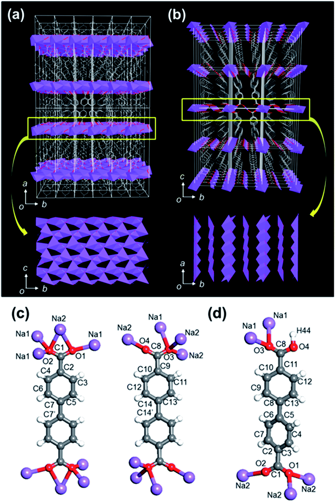
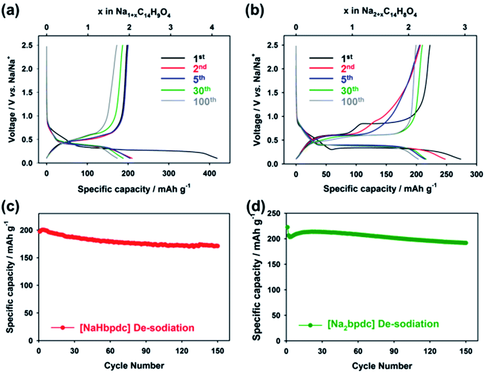
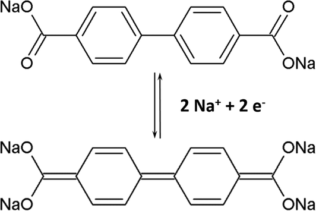
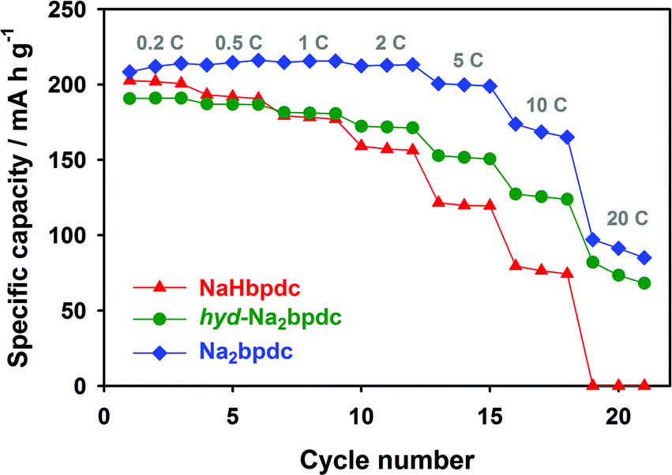
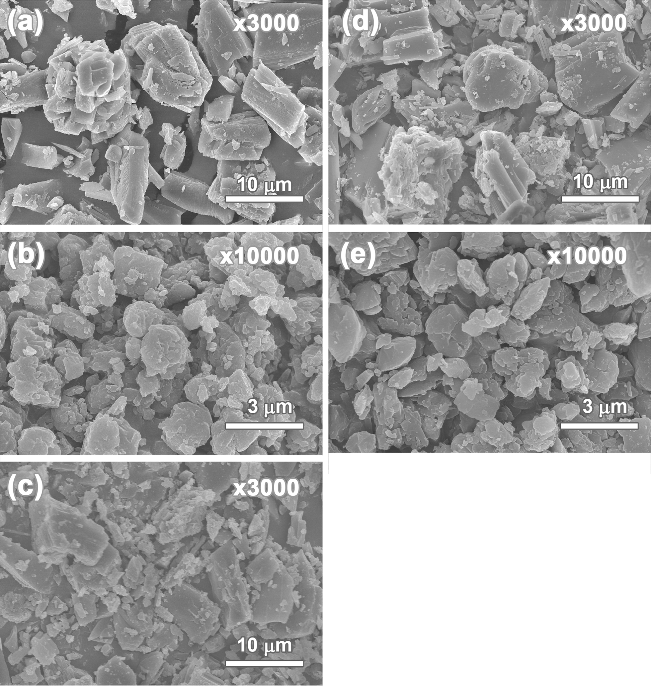
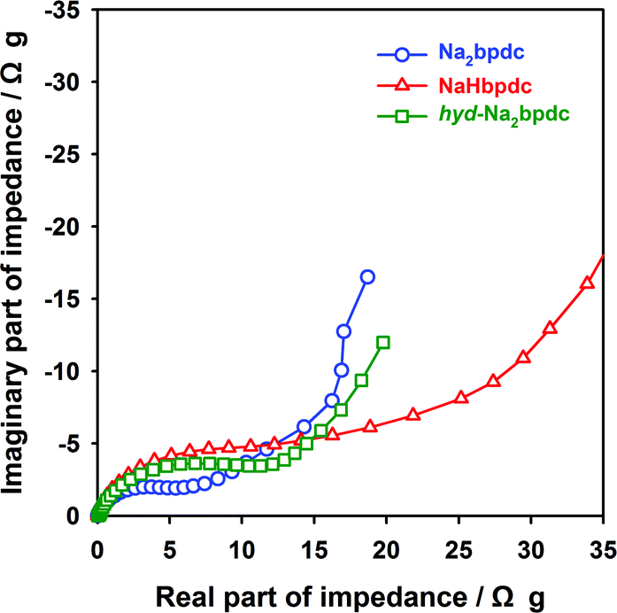
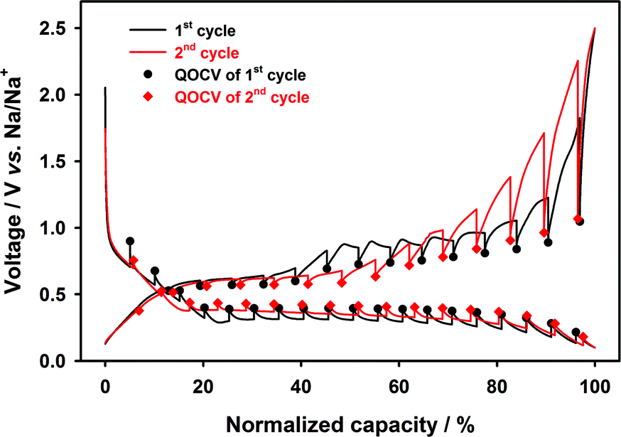
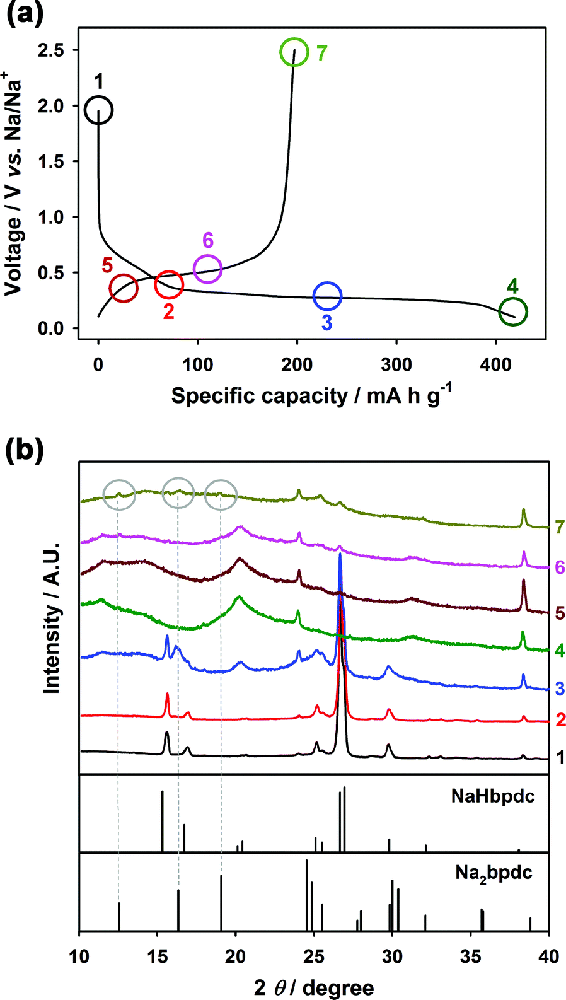

## 4,4′-Biphenyldicarboxylate sodium coordination compounds as anodes for Na-ion batteries 4,4'-联苯二羧酸钠配位化合物作为Na离子电池的阳极

> Aram Choi, Yun Kyeong Kim, Tae Kyung Kim, Mi-Sook Kwon, Kyu Tae Lee*, Hoi Ri Moon*
> DOI: [10.1039/C4TA02424A](https://doi.org/10.1039/C4TA02424A)  
> J. Mater. Chem. A, 2014,2, 14986-14993

### Abstract
Novel 4,4′-biphenyldicarboxylate (bpdc) sodium salts with different compositions were evaluated for the first time as anodes for Na-ion batteries, and their crystal structures and corresponding electrochemical performances were analyzed. The structure of the bpdc-sodium salts was modified using precipitation and solvothermal methods to afford three different crystal structures with different degrees of deprotonation of the carboxylic acid (COOH) groups and different coordination of the water molecule, as determined by single crystal X-ray diffraction. The extent of deprotonation in bpdc-sodium salts not only affects their electrochemical performance, but also affects the corresponding reaction mechanisms. The fully deprotonated bpdc-disodium salt exhibits a promising electrochemical performance with a reversible capacity of about 200 mA h g−1 at ca. 0.5 V vs. Na/Na+, stable cycle performance over 150 cycles, and an excellent rate performance of 100 mA h g−1 even at a 20 C rate, which are better than those of the partially deprotonated bpdc-sodium salt. The sodiation–desodiation of bpdc-sodium salts proceeds in a two-phase reaction, regardless of the degree of deprotonation. However, unlike the fully deprotonated bpdc-disodium salt, which shows a reversible phase transition during sodiation and desodiation, the partially deprotonated bpdc-sodium salt exhibits an irreversible phase transition during cycling.  
首次评估了不同组成的新型4,4'-联苯二羧酸钠（bpdc）钠盐作为Na离子电池的负极，并分析了它们的晶体结构和相应的电化学性能。用沉淀法和溶剂热法对bpdc-钠盐的结构进行了修饰，以提供三种不同的晶体结构，这些结构具有不同的羧酸（COOH）基团去质子化程度和水分子的不同配位，如通过单晶X射线测定的衍射。 bpdc-钠盐中去质子化的程度不仅影响其电化学性能，而且影响相应的反应机理。完全去质子化的bpdc-二钠盐表现出令人鼓舞的电化学性能，在约200℃时可逆容量约为200 mA h g-1。相对于Na/Na+为0.5 V，在150个循环中具有稳定的循环性能，甚至在20 C的速率下仍具有100 mA h g-1的出色速率性能，这优于部分去质子化的bpdc-钠盐。无论去质子化的程度如何，bpdc-钠盐的糖化-去盐化都会以两相反应进行。但是，与完全去质子化的bpdc-二钠盐不同，在糖化和脱盐过程中显示出可逆的相变，而部分去质子化的bpdc-钠盐在循环过程中却显示出不可逆的相变。

### 1. Introduction
Sodium-ion batteries are considered a promising alternative for next-generation batteries that can replace Li-ion batteries in large-scale energy storage systems and electric vehicles, because of their potential cost advantages owing to the natural abundance of Na resources and geographically constrained Li resources.1–6 A variety of electrode materials such as non-graphitic carbons,7–9 alloys (e.g., Sn and Sb),10–13 metal oxides,14–18 and phosphorus19,20 have been shown to exhibit promising electrochemical performances as anodes for Na-ion batteries. Recently, a few organic compound-based materials such as conjugated and aromatic compounds containing carbonyl groups or N-heterocycles have been reported as promising anode materials because of their attractive features such as good electrochemical performance, low-cost production, recyclability, and structural diversity.21–26 For example, organic electrode materials can be produced from commonly used recycled materials such as polyethylene terephthalate (PET). Several sodium terephthalate derivatives with amino- and bromo-groups have been easily synthesized owing to the structural diversity of organic architecture, resulting in controllable redox potential changes through inductive and resonance effects.27 However, only a small number of organic compounds have been examined as electrode materials for rechargeable batteries such as Li-ion and Na-ion batteries.28–37 In particular, only a few organic compounds have been examined as electrode materials for Na-ion batteries.38–40  
钠离子电池被认为是下一代电池的有前途的替代品，因为钠资源的自然丰富和锂的地理位置限制，钠离子电池具有潜在的成本优势，因此可以代替大型能量存储系统和电动汽车中的锂离子电池。 1–6各种电极材料，例如非石墨碳，7–9合金（例如，Sn和Sb），10–13金属氧化物，14–18和磷19,20被证明具有良好的电化学性能作为钠离子电池的阳极。近来，已经报道了一些基于有机化合物的材料，例如含有羰基或N-杂环的共轭和芳族化合物，因为它们具有诱人的特性，例如良好的电化学性能，低成本生产，可回收性和结构多样性，被认为是很有前途的阳极材料。 .21–26例如，有机电极材料可以由常用的回收材料制成，例如聚对苯二甲酸乙二酯（PET）。由于有机结构的结构多样性，几种具有氨基和溴基的对苯二甲酸钠衍生物很容易合成，通过感应和共振效应导致可控的氧化还原电位变化。27然而，只有少量有机化合物被检测为用于锂离子和钠离子电池等可充电电池的电极材料。28–37特别是，仅检测了少数几种有机化合物作为钠离子电池的电极材料。38–40

Herein, we evaluated novel bpdc-sodium salts as anodes for Na-ion batteries for the first time and elucidated the correlation between the structural properties of organic anodes and their electrochemical performances. The bpdc-sodium salts were obtained using three different synthetic methods: precipitation at low and room temperatures, and solvothermal methods. Based on the degree of deprotonation of the carboxylic acid (COOH) groups and the coordination of water molecules, three different crystal structures for the bpdc-sodium salts were obtained. The crystal structures were determined and compared using single-crystal X-ray diffraction (XRD) and powder XRD (PXRD) patterns. The bpdc-sodium salts exhibit a promising electrochemical performance depending on the degree of deprotonation.  
在这里，我们首次评估了新型的bpdc-钠盐作为Na离子电池的负极，并阐明了有机负极的结构性质与其电化学性能之间的相关性。使用三种不同的合成方法获得bpdc-钠盐：在低温和室温下沉淀以及溶剂热法。基于羧酸（COOH）基团的去质子化程度和水分子的配位，获得了bpdc-钠盐的三种不同晶体结构。使用单晶X射线衍射（XRD）和粉末XRD（PXRD）图案确定并比较晶体结构。根据去质子化程度的不同，bpdc-钠盐表现出良好的电化学性能。

### 2. Experimental section
#### Synthesis
**{Na[Na(H2O)]\(bpdc)}n (hyd-Na2bpdc)** To an aqueous suspension (3.2 mL) of 4,4′-biphenyldicarboxylic acid (H2bpdc) (0.258 g, 1.06 mmol), an aqueous solution (0.8 mL) of NaOH (0.137 g, 3.43 mmol) was added. After the completion of the reaction, the solution was filtered, and the clear pale yellow filtrate was exposed to ethanol vapor inside a refrigerator (2 °C) to crystallize the products. After two days, block-shaped pale yellow single crystals of {Na[Na(H2O)]\(bpdc)}n (hyd-Na2bpdc) started to form at the surface of the solution. The crystals were filtered off after seven days, washed with ethanol, and dried in air. Yield: 0.17 g (53%). FT-IR (ATR): νO–C[double bond, length as m-dash]O(carboxylate), 1579(s), 1390(s); νO–H(coordinating water) 1690 cm−1. Anal. calcd for Na2C14H10O5 (304.21): C, 55.27; H, 3.31%. Found: C, 53.26; H, 3.27%.  
向4,4'-联苯二甲酸（H2bpdc）（0.258g，1.06mmol）的水悬浮液（3.2mL）中，添加NaOH（0.137g，3.43mmol）的水溶液（0.8mL）。反应完成后，将溶液过滤，并将透明的浅黄色滤液在冰箱（2℃）中暴露于乙醇蒸气中以使产物结晶。两天后，{Na[Na（H2O）]（bpdc）} n（hyd-Na2bpdc）的块状浅黄色单晶开始在溶液表面形成。7天后将晶体滤出，用乙醇洗涤，并在空气中干燥。产率：0.17g（53％）。 FT-IR（ATR）：νOC[双键，长度为m-点O（羧酸根），1579（s），1390（s）； νO–H（配水）1690 cm-1。肛门Na 2 C 14 H 10 O 5的计算值（304.21）：C，55.27；实测值：55.27。 H，3.31％。实测值：C，53.26。 H，3.27％。

**[(Na2bpdc)]n (Na2bpdc)** To a stirred aqueous suspension (25 mL) of H2bpdc (2.42 g, 0.01 mol), an aqueous solution (7 mL) of NaOH (1.20 g, 0.03 mol) was added at room temperature. After the completion of the reaction, the solution was filtered, and ethanol (20 mL) was added to the filtrate, resulting in white precipitates. The white precipitate obtained was filtered, washed with ethanol, and dried in air. Yield: 2.04 g (71%). FT-IR (ATR): νO–C[double bond, length as m-dash]O(carboxylate), 1578(s), 1394(s) cm−1. Anal. calcd for Na2C14H8O4 (286.19): C, 58.76; H, 2.82%. Found: C, 57.48; H, 2.84%.  
在室温下，向搅拌的H 2 bpdc（2.42g，0.01mol）的水悬浮液（25mL）中加入NaOH（1.20g，0.03mol）的水溶液（7mL）。反应完成后，将溶液过滤，并将乙醇（20mL）加入滤液中，得到白色沉淀。过滤获得的白色沉淀物，用乙醇洗涤，并在空气中干燥。产率：2.04g（71％）。 FT-IR（ATR）：νOC双键，长度为m-点O（羧酸根），1578（s），1394（s）cm-1。肛门Na 2 C 14 H 8 O 4的计算值（286.19）：C，58.76；实测值：58.76。 H，2.82％。实测值：C，57.48。 H，2.84％。

**[NaHbpdc]n (NaHbpdc)** NaNO3 (0.026 g, 0.30 mmol) was dissolved in methanol (2 mL) and H2bpdc (0.036 g, 0.15 mmol) was dissolved in DMA–H2O (5.1 mL, 4 : 1.1 v/v). The two solutions were placed in a glass jar and sealed together, and the mixture was heated at 100 °C for 48 h. The solution was then cooled to room temperature. The plate-shaped colorless crystals obtained were filtered, washed briefly with methanol, and dried in air. Yield: 0.029 g (74%). FT-IR (ATR): νC[double bond, length as m-dash]O(carboxylic acid), 1672 cm−1; νO–C[double bond, length as m-dash]O(carboxylate), 1605 and 1399 cm−1. Anal. calcd for Na1C14H9O4 (264.21): C, 63.64; H, 3.43%. Found: C, 64.07; H, 3.88%.  
将NaNO3（0.026 g，0.30 mmol）溶解在甲醇（2 mL）中，将H2bpdc（0.036 g，0.15 mmol）溶解在DMA–H2O（5.1 mL，4:1.1 v/v）中。将两种溶液放入玻璃瓶中并密封在一起，并将混合物在100°C加热48小时。然后将溶液冷却至室温。过滤获得的板状无色晶体，用甲醇短暂洗涤，并在空气中干燥。产率：0.029g（74％）。 FT-IR（ATR）：νC[双键，长度为m-破折O（羧酸），1672cm-1；和νOC双键，长度为m-O（羧酸盐），1605和1399 cm-1。肛门Na 1 C 14 H 9 O 4的计算值（264.21）：C，63.64；实测值：63.64。 H，3.43％。实测值：C，64.07。 H，3.88％。

#### Characterization
All chemicals and solvents used in the syntheses were of reagent grade and they were used as received without further purification. The IR spectra were recorded using a ThermoFisher Scientific Nicolet 6700 FT-IR spectrophotometer. Elemental analyses (EA) were performed at the UNIST Central Research Facilities (UCRF) in the Ulsan National Institute of Science and Technology (UNIST). Thermogravimetric analyses (TGA) were performed under a N2 (g) atmosphere at a scan rate of 5 °C min−1 using a Q50 (TA instruments). PXRD data were recorded using a Bruker D2 PHASER automated diffractometer at 30 kV and 10 mA for Cu Kα (λ = 1.54050 Å), with a step size of 0.02° in 2θ. Scanning electron microscopy was carried out using a cold FE-SEM (Hitachi). Single crystals of hyd-Na2bpdc and NaHbpdc, coated with Paratone-N oil, were mounted on a loop, and the diffraction data were collected with synchrotron radiation (λ = 0.64999 Å at 95 K for hyd-Na2bpdc; 0.69999 Å at 100 K for NaHbpdc) using an ADSC Quantum-210 detector at 2D SMC with a silicon (111) double crystal monochromator (DCM) at Pohang Accelerator Laboratory, S. Korea. The ADSC Q210 ADX program was used for the data collection, and HKL3000 (Ver. 703r) was used for the cell refinement, reduction, and absorption correction. The structures of hyd-Na2bpdc and NaHbpdc have been deposited in the CCDC database, reference numbers 944127 and 944128, respectively.  
合成中使用的所有化学药品和溶剂均为试剂级，无需进一步纯化即可直接使用。使用ThermoFisher Scientific Nicolet 6700 FT-IR分光光度计记录红外光谱。元素分析（EA）在蔚山国立科学技术研究院（UNIST）的UNIST中央研究设施（UCRF）中进行。使用Q50（TA仪器）在N2（g）气氛下以5°C min-1的扫描速率进行热重分析（TGA）。使用Bruker D2 PHASER自动衍射仪以30 kV和10 mA的CuKα（λ= 1.54050Å）记录PXRD数据，步长在2θ中为0.02°。使用冷FE-SEM（Hitachi）进行扫描电子显微镜。将涂覆有Paratone-N油的hyd-Na2bpdc和NaHbpdc单晶安装在一个环上，并用同步加速器辐射收集衍射数据（对于hyd-Na2bpdc，λ= 0.64999Å在95 K；对于100 K来说，0.69999Å在0.6 K NaHbpdc）在韩国浦项加速器实验室使用带有硅（111）双晶单色仪（DCM）的2D SMC上的ADSC Quantum-210检测器。使用ADSC Q210 ADX程序进行数据收集，并使用HKL3000（版本703r）进行细胞细化，还原和吸收校正。 hyd-Na2bpdc和NaHbpdc的结构已分别存放在CCDC数据库中，参考编号为944127和944128。

#### Electrochemical measurements
The samples of electrochemically active materials (57.1 wt%) were mixed with carbon black (Super P, 28.6 wt%) and carboxymethyl cellulose (CMC, 14.3 wt%). The loading amount of electrode materials is about 1 mg cm−2. The electrochemical performance was evaluated using 2032 coin cells with a Na metal anode and 0.8 M NaClO4 in a mixture of ethylene carbonate and diethyl carbonate (1 : 1 v/v) electrolyte solution. The galvanostatic experiments were performed at 30 °C, and specific current densities of 18.7 mA g−1 (ca. 0.1 C) and 20.3 mA g−1 (ca. 0.1 C) were applied to evaluate the cycle performances of NaHbpdc and Na2bpdc, respectively. For the rate performance evaluation, the discharging (desodiation) current density was fixed at 0.1 C, and the charging current was varied. The GITT experiments were performed between 0.1 and 2.5 V vs. Na/Na+ by applying a current corresponding to a C/20 rate in intervals of 1 h, separated by a rest period of 1 h. The electrochemical impedance spectroscopy (EIS) study was performed using a BIO Logic SP 150. The AC impedance measurements were recorded using a signal with an amplitude of 5 mV and a frequency range of 300 kHz to 1 mHz.  
将电化学活性材料的样品（57.1 wt％）与炭黑（Super P，28.6 wt％）和羧甲基纤维素（CMC，14.3 wt％）混合。电极材料的负载量约为1 mg cm-2。电化学性能是用2032个带有Na金属阳极和0.8M NaClO4的硬币电池在碳酸亚乙酯和碳酸二乙酯（1 :: 1 v/v）的电解质溶液的混合物中评估的。恒电流实验是在30°C下进行的，使用了18.7 mA g-1（约0.1 C）和20.3 mA g-1（约0.1 C）的比电流密度来评估NaHbpdc和Na2bpdc的循环性能，分别。为了进行速率性能评估，将放电（消磁）电流密度固定为0.1 C，并改变充电电流。 GITT实验是在相对于Na/Na+的0.1至2.5 V之间进行的，方法是每隔1 h施加一个对应于C/20速率的电流，间隔1 h的休息时间。电化学阻抗谱（EIS）研究是使用BIO Logic SP 150进行的。交流阻抗测量是使用幅度为5 mV，频率范围为300 kHz至1 mHz的信号记录的。

### 3. Results and discussion
The H2bpdc ligand and sodium cations were reacted under three different reaction conditions to afford three different types of bpdc-sodium salts. Disodium bpdc monohydrate (hyd-Na2bpdc), {Na[Na(H2O)](bpdc)}n, was synthesized by the reaction of NaOH with H2bpdc in water, and single crystals of the product were obtained by slow diffusion of ethanol at ca. 2 °C. NaOH was employed in this reaction as a source of Na ions and a strong base for deprotonating the carboxylic acid (COOH) groups of H2bpdc. On the other hand, interestingly, non-hydrated disodium bpdc (Na2bpdc) was synthesized as a microcrystalline solid by the rapid reaction of NaOH with H2bpdc in a mixture of water and ethanol at room temperature. The partially deprotonated sodium salt, monosodium bpdc (NaHbpdc), [Na(Hbpdc)]n, was synthesized by the solvothermal reaction of NaNO3 and H2bpdc in a mixture of methanol, N,N-dimethylacetamide (DMA), and water at 100 °C. Under these conditions, only one of two carboxylic acid (COOH) groups of H2bpdc was deprotonated. Thus, the three bpdc-sodium salts were composed of the same organic (bpdc) and inorganic (Na+) building blocks, but had different compositions and crystal structures.  
H2bpdc配体和钠阳离子在三种不同的反应条件下反应，得到三种不同类型的bpdc-钠盐。 NaOH与H2bpdc在水中反应，合成了bpdc一水合二氢钠（hyd-Na2bpdc）{Na [Na（H2O）]（bpdc）} n，并通过乙醇在约200℃下缓慢扩散获得了产物的单晶。 。 2℃。在该反应中使用NaOH作为Na离子源和强碱，以使H2bpdc的羧酸（COOH）基团去质子化。另一方面，有趣的是，在室温下，NaOH与H2bpdc在水和乙醇的混合物中快速反应，由此合成了非水合bpdc二钠（Na2bpdc）作为微晶固体。通过在甲醇，N，N-二甲基乙酰胺（DMA）和水的混合物中于100°C下通过NaNO3和H2bpdc的溶剂热反应合成了部分去质子化的钠盐bpdc（NaHbpdc），[Na（Hbpdc）] n C。在这些条件下，H2bpdc的两个羧酸（COOH）基团中只有一个被去质子化。因此，这三种bpdc-钠盐由相同的有机（bpdc）和无机（Na+）组成，但具有不同的组成和晶体结构。

Because hyd-Na2bpdc and NaHbpdc could be obtained as single crystals, their crystal structures were directly determined and compared via single-crystal X-ray diffraction results. The lattice parameters, agreement factors, and detailed structural information of hyd-Na2bpdc and NaHbpdc are listed in Table S1.†hyd-Na2bpdc crystallized in the monoclinic P21/c space group. As shown in Fig. 1a, the structure of hyd-Na2bpdc consisted of Na–O layers as the secondary building units (SBUs), and the bridging ligands, bpdc2−, formed a three-dimensional (3D) network. The Na–O layers resulted from the coordination between Na+ ions and O atoms of carboxylate groups (COO−) and water molecules. The crystal structure of hyd-Na2bpdc possessed two Na+, two halves of the bpdc2− ligand, and one coordinating water molecule, which are crystallographically independent. Fig. 1c reveals the coordination modes of carboxylates (COO−) in hyd-Na2bpdc to be as follows: the O1–C1–O2 group acts as a tetradentate ligand forming a four-membered chelate ring, and the O3–C8–O4 group coordinates to four Na ions without chelation. Na1 and Na2 exhibited a distorted trigonal bipyramidal and an octahedral coordination geometry, respectively. The bpdc2− ligand was planar with a dihedral angle of 0° between the two phenyl rings.  
因为hyd-Na2bpdc和NaHbpdc可以单晶形式获得，所以直接确定晶体结构并通过单晶X射线衍射结果进行比较。表S1中列出了hyd-Na2bpdc和NaHbpdc的晶格参数，一致因子以及详细的结构信息。†在单斜晶P21/c空间群中结晶的hyd-Na2bpdc。如图1a所示，hyd-Na2bpdc的结构由Na-O层组成，作为次要构建单元（SBU），桥接配体bpdc2-形成了三维（3D）网络。 Na-O层是由Na+离子和羧酸根（COO-）的O原子与水分子之间的配位产生的。 hyd-Na2bpdc的晶体结构具有两个Na+，两个一半的bpdc2-配体和一个配位水分子，它们在晶体学上是独立的。图1c揭示了hyd-Na2bpdc中羧酸盐（COO-）的配位模式如下：O1-C1-O2基团充当形成四元螯合环的四齿配体，而O3-C8-O4基团配位至四个Na离子而没有螯合。 Na1和Na2分别显示出扭曲的三角双锥体和八面体配位几何。 bpdc2-配体是平面的，两个苯环之间的二面角为0°。

  
Fig. 1 Single-crystal X-ray structures of hyd-Na2bpdc and NaHbpdc, which were constructed by connecting the SBUs (purple) by bpdc2− ligands. 3D network of (a) hyd-Na2bpdc and (b) NaHbpdc; coordination modes of bpdc2− ligands to sodium ions in (c) hyd-Na2bpdc, and (d) NaHbpdc. Color scheme: C (grey), O (red), H (white), Na (purple).  
图1 hyd-Na2bpdc和NaHbpdc的单晶X射线结构，是通过bpdc2-配体连接SBU（紫色）而构建的。 （a）hyd-Na2bpdc和（b）NaHbpdc的3D网络； （c）hyd-Na2bpdc和（d）NaHbpdc中bpdc2-配体与钠离子的配位模式。配色方案：C（灰色），O（红色），H（白色），Na（紫色）。

NaHbpdc crystallized in the triclinic [P with combining macron]1 space group. The crystal structure of NaHbpdc showed two crystallographically independent Na+ ions and one bpdc2− ligand. The Na+ ions were bridged by carboxylate groups (COO−) to form one-dimensional (1D) Na–O chains as SBUs, which were linked by bpdc2− ligands to form a 3D network (Fig. 1b). Na1 and Na2 showed distorted octahedral and square planar geometry, respectively. Unlike hyd-Na2bpdc, the phenyl rings in the bpdc2− ligand of NaHbpdc were tilted by 30.69(5)°. Because the carboxylic acid (COOH) groups in NaHbpdc were partially deprotonated, the deprotonated O1–C1–O2 group coordinated to three Na ions using both the oxygen atoms. In contrast, only the O3 atom in O3–C8–O4–H44 acted as a bidentate ligand (Fig. 1d).  
NaHbpdc在三斜晶系[P]中结合了macron] 1空间群结晶。 NaHbpdc的晶体结构显示两个晶体学独立的Na+离子和一个bpdc2-配体。 Na+离子被羧酸根基团（COO-）桥接，形成一维（1D）Na–O链作为SBU，并通过bpdc2-配体连接形成3D网络（图1b）。 Na1和Na2分别显示扭曲的八面体和正方形平面几何形状。与hyd-Na2bpdc不同，NaHbpdc的bpdc2-配体中的苯环倾斜30.69（5）°。由于NaHbpdc中的羧酸（COOH）基团已部分去质子化，因此去质子化的O1-C1-O2基团同时使用两个氧原子与三个Na离子配位。相反，只有O3-C8-O4-H44中的O3原子充当双齿配体（图1d）。

The PXRD patterns of the as-synthesized hyd-Na2bpdc and NaHbpdc powders were compared to the simulated patterns based on the single crystal XRD data, respectively. As shown in Fig. 2a–d, the XRD patterns of both the bulk powders showed good agreement with the corresponding simulated patterns, indicating that the phase pure powders have the same crystal structure as the single crystals. On the other hand, because Na2bpdc was obtained as microcrystals, which are not suitable for single crystal XRD analysis, its PXRD pattern (Fig. 2e) was compared to those of hyd-Na2bpdc and NaHbpdc. Na2bpdc showed a different PXRD pattern, indicating that the crystal structure of Na2bpdc was different from those of hyd-Na2bpdc and NaHbpdc. However, the structure of Na2bpdc was found to be the same as that of hyd-Na2bpdc after the coordinating water molecules were removed (Fig. 2f). hyd-Na2bpdc was dehydrated by heating at 120 °C under vacuum. The dehydration results in a weight loss of 5.98% below 100 °C in the thermogravimetric analysis (TGA) curves of hyd-Na2bpdc (Fig. 3). The amount of weight loss corresponded to one water molecule per molecular formula. The incorporation of water molecules in the structure of Na2bpdc may depend on the reaction temperature as well as the reaction rate.  
分别将合成的hyd-Na2bpdc和NaHbpdc粉末的PXRD图谱与基于单晶XRD数据的模拟图谱进行比较。如图2a-d所示，两种散装粉末的XRD图谱都与相应的模拟图谱很好地吻合，表明相纯粉末具有与单晶相同的晶体结构。另一方面，由于Na2bpdc是作为微晶获得的，因此不适合单晶XRD分析，因此将其PXRD图谱（图2e）与hyd-Na2bpdc和NaHbpdc进行了比较。 Na2bpdc显示不同的PXRD图谱，表明Na2bpdc的晶体结构与hyd-Na2bpdc和NaHbpdc的晶体结构不同。然而，在除去配位水分子后，发现Na2bpdc的结构与hyd-Na2bpdc的结构相同（图2f）。 hyd-Na2bpdc在真空下于120°C加热脱水。在hyd-Na2bpdc的热重分析（TGA）曲线中，脱水导致在100°C以下失重5.98％（图3）。失重量相当于每个分子式一个水分子。 Na 2 bpdc结构中水分子的掺入可能取决于反应温度以及反应速率。

  
Fig. 2 PXRD patterns of (a) hyd-Na2bpdc and (c) NaHbpdc, simulated patterns from single-crystal XRD data of (b) hyd-Na2bpdc and (d) NaHbpdc, and PXRD patterns of (e) Na2bpdc and (f) dehydrated hyd-Na2bpdc dried at 120 °C.  
图2（a）hyd-Na2bpdc和（c）NaHbpdc的PXRD图，（b）hyd-Na2bpdc和（d）NaHbpdc的单晶XRD数据的模拟图，（e）Na2bpdc和（f）的PXRD图）脱水hyd-Na2bpdc在120°C下干燥。

  
Fig. 3 TGA curves of hyd-Na2bpdc, NaHbpdc, and Na2bpdc.

Further, the structural similarity between hyd-Na2bpdc and Na2bpdc is indirectly supported by the TGA curves because they show the same thermal behavior except for the water loss in hyd-Na2bpdc below 100 °C (Fig. 3). Although both hyd-Na2bpdc and Na2bpdc are decomposed at ca. 600 °C, Na2bpdc did not show any weight loss around 100 °C indicating that this compound is not hydrated. On the other hand, NaHbpdc exhibited no weight loss around 100 °C, which is consistent with the single-crystal XRD data of NaHbpdc, which is not hydrated. The structure of NaHbpdc is rapidly decomposed above 300 °C. The lower thermal stability of NaHbpdc compared to hyd-Na2bpdc and Na2bpdc is attributed to the weak coordination between Na+ ions and the carbonyl group of carboxylic acid (COOH) groups, which were not deprotonated. This indicates that a higher degree of deprotonation is required to improve the thermal stability of organic electrode materials.  
此外，TGA曲线间接支持hyd-Na2bpdc和Na2bpdc之间的结构相似性，因为它们显示出相同的热行为，除了hyd-Na2bpdc中低于100°C的失水量（图3）。尽管hyd-Na2bpdc和Na2bpdc均在约200℃分解。 600°C时，Na2bpdc在100°C附近未显示任何重量减轻，表明该化合物未水合。另一方面，NaHbpdc在100°C左右没有失重，这与未水合的NaHbpdc的单晶XRD数据一致。在300°C以上，NaHbpdc的结构迅速分解。与hyd-Na2bpdc和Na2bpdc相比，NaHbpdc的热稳定性较低，这归因于Na+离子与未去质子化的羧酸（COOH）羰基之间的弱配位作用。这表明需要更高程度的去质子化以改善有机电极材料的热稳定性。

The acid–base reactions of H2bpdc with sodium precursors to produce hyd-Na2bpdc, Na2bpdc and NaHbpdc were further verified by Fourier transform infrared (FT-IR) spectroscopy. As shown in Fig. 4, the spectrum of H2bpdc showed typical C[double bond, length as m-dash]O stretching and O–H bending vibrations of carboxylic acid (COOH) groups at 1668 and 922 cm−1, respectively. However, after the formation of the metal–carboxylate coordination (COO–Na) compounds via complete deprotonation by NaOH, the carbonyl (C[double bond, length as m-dash]O) stretching vibration of the carboxylate groups (COO−) in hyd-Na2bpdc was shifted and split into two bands at 1579 and 1390 cm−1, which were assigned to asymmetric (νas) and symmetric (νs) stretching vibrations, respectively (Fig. 4). Moreover, the characteristic O–H bending vibrations for the carboxylic acid groups around 920 cm−1 disappeared. The weak peak at 1690 cm−1 in the spectrum of hyd-Na2bpdc corresponds to the O–H bending vibration of water. This observation agrees with the existence of guest water molecules, as suggested by single-crystal XRD and TGA data. Na2bpdc showed the same FT-IR spectrum as hyd-Na2bpdc, except for the peak around 1690 cm−1. As expected from the XRD and TGA results, the FT-IR spectrum of NaHbpdc, containing both of the protonated and deprotonated form of carboxylic acid groups, showed peaks characteristic of both COOH and COO− groups, i.e., C[double bond, length as m-dash]O stretching and O–H bending vibrations of carboxylic acid at 1672 and 923 cm−1, respectively, and νas and νs of the carboxylate groups at 1605 and 1399 cm−1, respectively (Fig. 4).  
H2bpdc与钠前体的酸碱反应生成hyd-Na2bpdc，Na2bpdc和NaHbpdc，已通过傅立叶变换红外（FT-IR）光谱进一步验证。如图4所示，H2bpdc的光谱分别显示了典型的C [双键]，羧酸的长度（m-O）拉伸和羧酸（COOH）基团的O–H弯曲振动，分别在1668和922 cm-1处。但是，在通过NaOH完全去质子化形成金属-羧酸盐配位化合物（COO-Na）之后，羰基（CO [双键，长度为m-O] hyd-Na2bpdc被移动并分成1579 cm-1和1390 cm-1的两个频带，分别分配给非对称（νas）和对称（νs）拉伸振动（图4）。此外，920 cm-1附近的羧酸基团的特征性O–H弯曲振动消失了。 hyd-Na2bpdc光谱中1690 cm-1处的弱峰对应于水的O–H弯曲振动。单晶XRD和TGA数据表明，该观察结果与客体水分子的存在一致。除了大约1690 cm-1的峰值外，Na2bpdc的红外光谱与hyd-Na2bpdc相同。正如从XRD和TGA结果所预期的那样，包含质子化和去质子化形式的羧酸基团的NaHbpdc的FT-IR光谱均显示了COOH和COO-基团的峰特征，即C [双键，长度为羧酸的m-O拉伸振动和O-H弯曲振动分别在1672和923 cm-1处，羧酸酯基的νas和νs分别在1605和1399 cm-1处（图4）。

  
Fig. 4 FT-IR spectra of H2bpdc, hyd-Na2bpdc, Na2bpdc and NaHbpdc; all the spectra were measured by using attenuated total reflectance (ATR) technique.  
图4 H2bpdc，hyd-Na2bpdc，Na2bpdc和NaHbpdc的FT-IR光谱所有光谱都是使用衰减全反射率（ATR）技术测量的。

As shown in Fig. 5, Na2bpdc and NaHbpdc, which have different crystal structures and degrees of deprotonation of the organic ligands, were examined as anode materials for Na-ion batteries. The cycle performance of hyd-Na2bpdc was not examined separately because it transforms into Na2bpdc during the preparation of the electrodes. The electrodes were dried at 120 °C under vacuum to remove the adsorbed water molecules on the surface of powders that is related to electrolyte decomposition during charging/discharging. This drying process leads to the dehydration of hyd-Na2bpdc to afford Na2bpdc. Both Na2bpdc and NaHbpdc electrodes showed similar reversible capacities of approximately 200 mA h g−1 at ca. 0.5 V vs. Na/Na+, which is larger than the theoretical specific capacity of 187 mA h g−1 corresponding to the storage of two Na+ ions, as shown in Scheme 1. The excess capacity (about 10 mA h g−1) is attributed to carbon additive (super P) that can reversibly store Na+ ions and deliver about 100 mA h g−1 (Fig. S2†). The gravimetric specific capacity of bpdc-sodium salts is relatively small compared to other anode materials. Moreover, the densities of Na2bpdc and NaHbpdc are 1.566 g cm−3 and 1.657 g cm−3, respectively, based on X-ray single crystallographic data, which causes a low volumetric energy density. However, these organic electrode materials are inexpensive, indicating that organic electrode materials have an advantage of low cost/energy density. Above all, organic electrode materials are environmentally benign and reproducible, and this makes organic electrode materials attractive in spite of their relatively low energy density. Also, they showed a stable cycle performance over 150 cycles. Notably, unlike Na2bpdc, NaHbpdc showed a large amount of irreversible capacity at the first cycle. The coulombic efficiencies of Na2bpdc and NaHbpdc at the first cycle were 81% and 47%, respectively. The poor coulombic efficiency of NaHbpdc (large sodiation capacity at the first cycle) is attributed to its irreversible electrolyte decomposition on the surface of NaHbpdc possessing carboxylic acid groups. The same behavior, i.e., a large amount of irreversible capacity at the first cycle, was also observed in a partially deprotonated monosodium terephthalate,39 while a fully deprotonated disodium terephthalate showed good coulombic efficiency similar to Na2bpdc.  
如图5所示，具有不同晶体结构和有机配体的去质子化程度的Na 2 bpdc和NaHbpdc被用作Na离子电池的负极材料。没有单独检查hyd-Na2bpdc的循环性能，因为它在电极制备期间会转变为Na2bpdc。电极在真空下于120°C干燥，以去除粉末表面上吸附的水分子，这与充电/放电过程中的电解质分解有关。此干燥过程导致hyd-Na2bpdc脱水，得到Na2bpdc。 Na2bpdc和NaHbpdc电极在ca时都显示出约200 mA h g-1的相似可逆容量。如方案1所示，相对于Na/Na+，0.5 V vs. Na/Na+大于对应于两个Na+离子存储的理论比容量187 mA hg-1，这归因于过剩容量（约10 mA hg-1）碳添加剂（Super P），可以可逆地存储Na+离子并提供约100 mA hg-1（图S2†）。与其他阳极材料相比，bpdc-钠盐的重量比容量相对较小。此外，基于X射线单晶数据，Na2bpdc和NaHbpdc的密度分别为1.566 g cm-3和1.657 g cm-3，这导致较低的体积能量密度。然而，这些有机电极材料便宜，表明有机电极材料具有低成本/能量密度的优点。最重要的是，有机电极材料对环境无害且可重现，尽管有机电极材料的能量密度相对较低，但仍具有吸引力。而且，它们在150个循环中显示出稳定的循环性能。值得注意的是，与Na2bpdc不同，NaHbpdc在第一个循环中显示出大量不可逆容量。在第一个循环中，Na2bpdc和NaHbpdc的库仑效率分别为81％和47％。 NaHbpdc的库仑效率差（在第一个循环中有较大的碳化能力）是由于其在具有羧酸基团的NaHbpdc表面上不可逆的电解质分解所致。在部分去质子化的对苯二甲酸一钠中也观察到相同的行为，即在第一循环中有大量不可逆的容量39，而完全去质子化的对苯二甲酸二钠显示出类似于Na2bpdc的良好库仑效率。

  
Fig. 5 Voltage profiles of (a) NaHbpdc and (b) Na2bpdc; cycle performance of (c) NaHbpdc and (d) Na2bpdc  
图5（a）NaHbpdc和（b）Na2bpdc的电压曲线； （c）NaHbpdc和（d）Na2bpdc的循环性能

  
Scheme 1 Schematic diagram of the electrochemical redox reaction mechanism of Na2bpdc.

The rate performances of Na2bpdc and NaHbpdc were also compared, as shown in Fig. 6 and S1.† Na2bpdc showed a better rate performance than NaHbpdc, and even at a 20 C rate (3.74 A g−1), Na2bpdc sustained 50% of the reversible capacity delivered at a 0.2 C rate. This superior rate performance of Na2bpdc is definitely attributed to the smaller particle size (diffusion length) of Na2bpdc compared to NaHbpdc, as shown in Fig. 7. The particle sizes of Na2bpdc and NaHbpdc are a few μm and approximately 10 μm, respectively. However, even the dehydrated hyd-Na2bpdc, which has a size similar to NaHbpdc, exhibited a better rate performance than NaHbpdc, indicating that the rate performance is affected by both the degree of deprotonation and the particle size of the bpdc-sodium salts. Note that little change of particle sizes of NaHbpdc and Na2bpdc was observed after water-treatment under the same conditions of electrode preparation, because only a very small amount of water was used for the electrode preparation despite the fact that they are slightly soluble in water, indicating that the particle sizes of NaHbpdc and Na2bpdc were not changed after the electrode preparation.  
如图6和S1所示，还比较了Na2bpdc和NaHbpdc的速率性能。†Na2bpdc显示出比NaHbpdc更好的速率性能，即使在20 C速率（3.74 A g-1）下，Na2bpdc仍可保持50％以0.2 C的速率提供的可逆容量。Na7bpdc的这种优越的速率性能无疑归因于Na2bpdc的粒径（扩散长度）比NaHbpdc小，如图7所示。Na2bpdc和NaHbpdc的粒径分别为几微米和大约10微米。但是，即使脱水的hyd-Na2bpdc的大小与NaHbpdc相似，也显示出比NaHbpdc更好的速率性能，这表明速率性能受去质子化程度和bpdc-钠盐粒径的影响。请注意，在相同的电极制备条件下进行水处理后，观察到NaHbpdc和Na2bpdc的粒径几乎没有变化，因为尽管极微溶于水，但电极制备中仅使用了极少量的水，这表明电极制备后NaHbpdc和Na2bpdc的粒径没有改变。

  
Fig. 6 Rate performance of hyd-Na2bpdc, Na2bpdc and NaHbpdc.  

  
Fig. 7 SEM images of bare (a) NaHbpdc, (b) Na2bpdc, and (c) hyd-Na2bpdc powders, and water-treated (d) NaHbpdc and (e) Na2bpdc powders under the same conditions of electrode preparation.  

Electrodes with carboxylic acid groups cause a large amount of electrolyte decomposition, forming thick solid electrolyte interphase (SEI) layers, which result in the increase in polarization because of a large charge-transfer resistance. This is supported by the electrochemical impedance spectroscopy (EIS) analysis. The measurement was performed using the symmetric cells comprised of the same working electrode (bpdc salt)/working electrode (bpdc salt). The working electrodes were half-sodiated charging state after pre-cycling. As shown in Fig. 8, the semicircle of NaHbpdc is larger than that of hyd-Na2bpdc, indicating that the charge-transfer resistance of NaHbpdc is larger than that of hyd-Na2bpdc because the semicircle corresponds to charge-transfer resistance that is dependent on SEI layers. Also, the smaller charge-transfer resistance of Na2bpdc than hyd-Na2bpdc is attributed to the larger surface area caused by smaller particle size. Moreover, while both the Na+ cations present in the structure of Na2bpdc can act as charge carriers for the solid state diffusion of Na+ ions, the proton present in the structure of NaHbpdc cannot act as a charge carrier because it is strongly bound to the carbonyl group through covalent bonding. This indicates that the reduced amount of charge carriers in NaHbpdc compared to Na2bpdc causes slower ionic diffusivity of Na+ ions, resulting in poorer rate performance.  
具有羧酸基的电极会引起大量的电解质分解，形成厚的固体电解质中间相（SEI）层，由于电荷转移电阻大，导致极化增加。电化学阻抗谱（EIS）分析对此提供了支持。使用由相同的工作电极（bpdc盐）/工作电极（bpdc盐）组成的对称池进行测量。预循环后，工作电极处于半饱和充电状态。如图8所示，NaHbpdc的半圆大于hyd-Na2bpdc的半圆，这表明NaHbpdc的电荷转移电阻大于hyd-Na2bpdc的电荷转移电阻，因为该半圆对应于取决于SEI层。而且，Na2bpdc的电荷转移电阻比hyd-Na2bpdc小，这归因于较小的粒径导致较大的表面积。此外，尽管存在于Na2bpdc结构中的两个Na+阳离子都可以充当Na+离子固态扩散的电荷载体，但是存在于NaHbpdc结构中的质子不能充当电荷载体，因为它与羰基牢固结合通过共价键。这表明与Na2bpdc相比，NaHbpdc中载流子数量的减少导致Na+离子的离子扩散速度变慢，从而导致速率性能变差。

  
Fig. 8 Nyquist plots of bpdc electrode/bpdc electrode symmetric cells. 

To observe the structural changes upon sodiation/desodiation, ex situ XRD analysis of Na2bpdc was performed, and it showed that the reversible sodiation/desodiation of Na2bpdc proceeds in a two-phase reaction, as shown in Fig. 9. Upon sodiation, the intensity of PXRD peaks corresponding to Na2bpdc decreased, and new peaks corresponding to the sodiated phase of Na2bpdc gradually appeared at ca. 11, 20, 23 and 31° (and vice versa for the desodiation). Despite two plateau steps in the voltage profile of desodiation during the first cycle, the ex situ XRD patterns showed that only one type of two-phase reaction occurred during the desodiation. This agrees well with the galvanostatic intermittent titration technique (GITT) curves, as shown in Fig. 10. Although two plateaus were observed during the first cycle, the second plateau is attributed to larger polarization because of a higher mass transfer resistance in Na-deficient compositions. This type of polarization behavior gradually disappeared on cycling, and may be closely related to the amorphization of Na2bpdc during the cycling. As shown in the ex situ XRD patterns of the electrodes during cycling (Fig. 9c), broader PXRD peaks were observed after the cycling, indicating that the amorphization of Na2bpdc occurred during cycling. In general, materials that are more amorphous show less polarization owing to the faster ionic diffusion at grain boundaries.  
为了观察糖化/脱盐过程中的结构变化，对Na2bpdc进行了异位XRD分析，结果表明Na2bpdc的可逆糖化/脱盐过程发生在两相反应中，如图9所示。 Na2bpdc对应的PXRD峰减少，而Na2bpdc的固溶相对应的新峰逐渐出现在ca。 11、20、23和31°（反之亦然）。尽管在第一个循环中在脱氧的电压曲线中有两个稳定的台阶，但异位XRD图表明在脱氧期间仅发生一种类型的两相反应。如图10所示，这与恒电流间歇滴定技术（GITT）曲线非常吻合。尽管在第一个循环中观察到两个平台，但第二个平台归因于更大的极化，因为Na缺乏时传质阻力更高成分。这种类型的极化行为在循环过程中逐渐消失，并且可能与循环过程中Na2bpdc的非晶化密切相关。如循环过程中电极的异位XRD图所示（图9c），循环后观察到更宽的PXRD峰，表明Na2bpdc的非晶化发生在循环过程中。通常，由于在晶界处离子扩散较快，因此非晶性更高的材料显示出较少的极化。

  
Fig. 9 Ex situ XRD analysis of Na2bpdc: (a) voltage profiles, (b) corresponding XRD patterns, and (c) XRD patterns of desodiated electrodes during the various cyclings.

  
Fig. 10 GITT curves of Na2bpdc.

Unlike Na2bpdc, NaHbpdc showed an irreversible phase transformation during the sodiation and desodiation, as shown in Fig. 11. NaHbpdc proceeds in a two-phase reaction during the sodiation and desodiation; however, the mixture phases of NaHbpdc and Na2bpdc were observed after the desodiation. This indicates that the ion exchange occurred between the proton of the carboxylic acid group in NaHbpdc and sodium ions in electrolytes during cycling. Similar behavior has been observed in the partially deprotonated monosodium terephthalate, which was transformed into the fully deprotonated disodium terephthalate due to the ion exchange between the proton and sodium during sodiation and desodiation.39 The ion exchange of NaHbpdc powders was not observed when NaHbpdc powders were stored in electrolytes for 3, 5, and 10 days without passage of current, as shown in Fig. S3,† and thus, the ion exchange is merely related to electrochemical sodiation and desodiation. The ion-exchange behaviour of NaHbpdc on cycling is further supported by the comparison between the differential capacity (dQ/dV) plots of NaHbpdc and Na2bpdc. As the cycle number increases, the intensity of oxidative peaks of NaHbpdc at 0.5 V and 0.6 V vs. Na/Na+ decreases and increases, respectively (Fig. 12a). The oxidative peak at 0.6 V corresponds to the oxidative peak of Na2bpdc, as observed in the dQ/dV plots of Na2bpdc (Fig. 12b). Therefore, this indicates that some of the NaHbpdc was transformed into Na2bpdc during cycling.  
与Na2bpdc不同，NaHbpdc在糖化和消融过程中显示出不可逆的相变，如图11所示。然而，在消沉后观察到NaHbpdc和Na2bpdc的混合相。这表明在循环期间，离子交换发生在NaHbpdc中的羧酸基质子和电解质中的钠离子之间。在部分去质子化的对苯二甲酸一钠中也观察到了类似的行为，由于在质子化和脱色过程中质子和钠之间的离子交换，它被转化为完全去质子化的对苯二甲酸二钠39。当使用NaHbpdc粉末时，未观察到NaHbpdc粉的离子交换。如图3所示，它们在电解液中储存3天，5天和10天而没有电流通过，因此，离子交换仅与电化学磺化和脱氧有关。 NaHbpdc和Na2bpdc的微分容量（dQ/dV）图之间的比较进一步支持了NaHbpdc在循环中的离子交换行为。随着循环次数的增加，NaHbpdc在0.5 V和0.6 V的氧化峰相对于Na/Na+的氧化峰强度分别降低和增加（图12a）。如在Na2bpdc的dQ/dV图中所观察到的，在0.6 V处的氧化峰对应于Na2bpdc的氧化峰（图12b）。因此，这表明在循环过程中，某些NaHbpdc已转化为Na2bpdc。

  
Fig. 11 Ex situ XRD analysis of NaHbpdc: (a) voltage profiles and (b) corresponding XRD patterns.

  
Fig. 12 Differential capacity (dQ/dV) plots of (a) NaHbpdc and (b) Na2bpdc electrodes.

### 4. Conclusions
In conclusion, the crystal structures and electrochemical performance of bpdc-sodium salts as anode materials for Na-ion batteries have been evaluated for the first time. The different degrees of deprotonation and differently coordinated water molecules in the bpdc-sodium salts were obtained through deliberate synthesis such as precipitation and solvothermal methods, resulting in the formation of bpdc-sodium salts with three different crystal structures. Their crystal structures were determined using single-crystal XRD. The bpdc-sodium salts exhibited a promising electrochemical performance with a reversible capacity of 200 mA h g−1 at ca. 0.5 V vs. Na/Na+, negligible capacity fading over 150 cycles, and an excellent rate performance of approximately 100 mA h g−1 even at a 20 C rate. The sodiation/desodiation of bpdc-sodium salts proceeds in a two-phase reaction. In addition, the degree of deprotonation in bpdc-sodium salts not only affected the electrochemical performance, but also affected the corresponding reaction mechanisms. The fully deprotonated bpdc-disodium salt (Na2bpdc) showed better coulombic efficiency and rate performance than the partially deprotonated bpdc-monosodium salt (NaHbpdc). Unlike Na2bpdc, which showed reversible phase transition during sodiation and desodiation, NaHbpdc exhibited an irreversible phase transition during the cycling.  
总之，首次评估了作为钠离子电池负极材料的bpdc-钠盐的晶体结构和电化学性能。通过有意合成（例如沉淀法和溶剂热法）获得了bpdc-钠盐中不同程度的去质子化和不同配位的水分子，从而形成了具有三种不同晶体结构的bpdc-钠盐。使用单晶XRD确定其晶体结构。 bpdc-钠盐表现出令人鼓舞的电化学性能，在200℃时可逆容量为200 mA h g-1。相对于Na/Na+为0.5 V，在150个循环中容量可忽略不计，即使在20 C的速率下也具有约100 mA h g-1的出色速率性能。 bpdc-钠盐的碱化/脱盐以两相反应进行。另外，bpdc-钠盐中的去质子化程度不仅影响电化学性能，而且影响相应的反应机理。与部分去质子化的bpdc-钠盐（NaHbpdc）相比，完全去质子化的bpdc-二钠盐（Na2bpdc）显示出更好的库仑效率和速率性能。与Na2bpdc不同，Na2bpdc在糖化和脱泡过程中表现出可逆的相变，而NaHbpdc在循环过程中表现出不可逆的相变。
