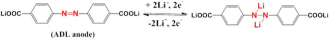
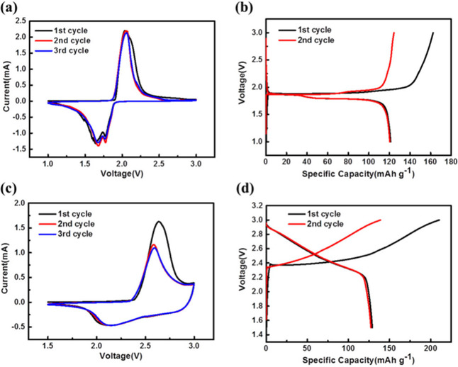
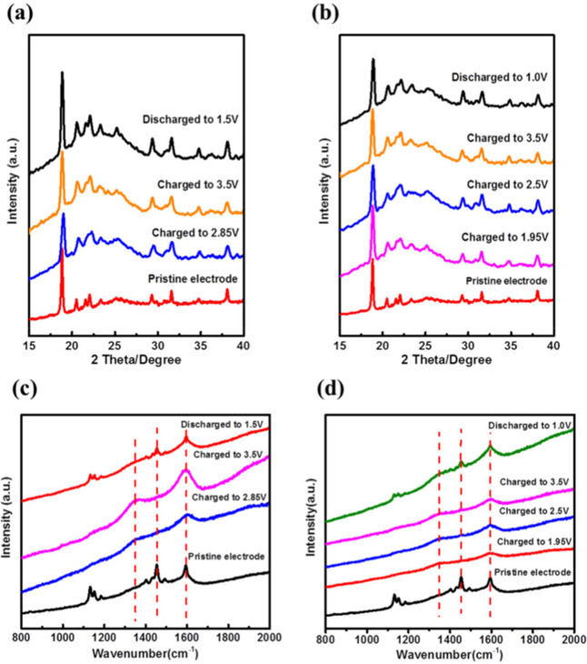

### Azo‐Group‐Containing Organic Compounds as Electrode Materials in Full‐Cell Lithium‐Ion Batteries 含偶氮基团的有机化合物作为电极材料的锂离子全电池

> Yingqian Wang, Dr. Zhixiong Yang, Tianlai Xia, Guangxing Pan, Dr. Ling Zhang, Prof. Hong Chen, Prof. Jiaheng Zhang  
> ChemElectroChem, Volume6, Issue19, October 1, 2019, Pages 5080-5085  
> DOI: [10.1002/celc.201901267](https://doi.org/10.1002/celc.201901267)  
> Keywords: azobenzene 4,4-dicarboxylate lithium, organic electrodes, full-cell li-ion batteries, LiCoO2, LiFePO4  

### Abstract
Inorganic compounds, including graphite, transition metal oxides, and chalcogenides, are widely used as electrode materials in rechargeable lithium‐ion batteries (LIBs). However, environmentally friendly and cost‐effective alternatives are pursued by focusing on the molecular design of organic materials that could be potential electrode materials in next‐generation LIBs. Herein, we study the utilization of an organic compound, azobenzene 4,4‐dicarboxylate lithium (ADL), as a negative electrode in full‐cell LIBs. The full‐cell LIBs are assembled by using ADL as the negative electrode, LiCoO2 (LCO/ADL) or LiFePO4 (LFP/ADL) as the positive electrode, and 1 M LiPF6 dissolved in ethylene carbonate/diethylene carbonate (EC : DEC=1 : 1 by volume) as the electrolyte. Then, ex situ X‐ray diffraction (XRD), ex situ X‐ray photoelectron spectroscopy (XPS) and scanning electron microscopy (SEM) were carried out to understand the charge storage mechanism and structural changes during the electrochemical reaction. From the charge/discharge measurements, LFP/ADL rendered a higher specific capacity retention (88.05 %) than LCO/ADL full‐cells (73.79 %) after 200 cycles at a current density of 100 mA g−1. The XPS analysis revealed that the deposition of metallic Li on the ADL anode in LCO/ADL full‐cells led to rapid capacity decay and inferior cyclic performance, whereas Li‐free metal deposition had been observed on the ADL anode in LFP/ADL full cells, which explained the higher cyclic stability and capacity retention rate in LFP/ADL full‐cells. The present study provides useful insights into the development and practical utilization of organic electrodes in next‐generation Li‐ion battery technology.  
无机化合物，包括石墨，过渡金属氧化物和硫族化物，被广泛用作可充电锂离子电池（LIB）的电极材料。但是，通过关注有机材料的分子设计来寻求环保和具有成本效益的替代方法，这些材料可能是下一代LIB中潜在的电极材料。在本文中，我们研究了有机化合物偶氮苯4,4-二羧酸锂（ADL）作为全电池LIB负极的用途。通过使用ADL作为负极，LiCoO2（LCO/ADL）或LiFePO4（LFP/ADL）作为正极以及1 M LiPF6溶于碳酸亚乙酯/碳酸二亚乙酯（EC assembled：DEC = 1 ：1体积）作为电解质。然后，进行了异位X射线衍射（XRD），异位X射线光电子能谱（XPS）和扫描电子显微镜（SEM），以了解电化学反应过程中的电荷存储机理和结构变化。根据充电/放电测量，在电流密度为100 mA g-1的情况下，经过200次循环后，LFP/ADL的比容量保持率（88.05％）高于LCO/ADL全电池（73.79％）。 XPS分析显示，LCO/ADL满电池的ADL阳极上的金属Li沉积导致容量快速衰减和循环性能差，而LFP/ADL满电池的ADL阳极上观察到无锂金属沉积，这说明了LFP/ADL全电池具有更高的循环稳定性和容量保持率。本研究为下一代锂离子电池技术中有机电极的开发和实际利用提供了有益的见解。

### 1 Introduction
Graphite anodes have garnered widespread attraction for LIBs.1-6 However, the possible collapse of the solid electrolyte interphase (SEI) layer leads to the large first‐cycle irreversible capacity caused by the continuous electrolyte decomposition and co‐intercalation of solvent molecules into the electrode.7-12 Therefore, several research groups aimed to develop novel electrode materials, with enhanced safety and improved cyclic performance, for advanced LIBs.13-20 It is a pity that the inorganic materials applied in LIBs render inherent disadvantages, such as limited resources, difficult self‐degradation, complicated synthesis processes and tedious purification.  
石墨阳极已经为LIB吸引了广泛的吸引力。1-6但是，由于电解质的连续分解和溶剂分子共嵌入到电解质中，导致固体电解质中间相（SEI）层可能塌陷，导致较大的第一循环不可逆容量。 7-12因此，有几个研究小组旨在为先进的LIBs开发具有更高安全性和循环性能的新型电极材料。13-20遗憾的是，应用于LIBs的无机材料存在固有的缺点，例如受限资源，难于自我降解，复杂的合成过程和繁琐的纯化过程。

As for organic electrode materials, they possess distinct advantages, such as abundant resources, light weight, low cost, environmentally friendly nature and easy recyclability, which exhibit reversible redox reactions, leading to promising electrochemical performance.21-30 Luo et al31 selected C7H4O4NLi2 to investigate the electrochemical performance of the nitro compound, delivering an initial capacity of 153 mAh g−1 at 0.5 C and retaining a capacity of 131 mAh g−1 after 100 cycles. Normally, organic compounds with conjugated structures are more conducive to facilitate efficient charge transport of delocalized lone pairs, rendering higher electrochemical activity and superior reversible redox performance during charge/discharge cycling. Moreover, the electrochemical properties can be enhanced by designing and regulating the molecular structure.32-36 For instance, Wang's group31, 37-40 has reported a family of organic electrode materials containing azo functional groups (N=N) for alkali‐ion batteries. They have assessed the electrochemical performance of half‐cell LIBs by employing lithium metal as the counter electrode and achieved a reversible capacity of 179 mAh g−1, after 100 cycles, and 93 mAh g−1, after 2000 cycles, at 0.5 C and 2 C, respectively. Hence, from a practical viewpoint, organic electrode materials are promising alternatives for flexible and large‐scale applications, such as grid storage and flexible electronics.  
至于有机电极材料，它们具有独特的优势，例如资源丰富，重量轻，成本低，对环境友好的性质和易于回收利用，它们具有可逆的氧化还原反应，从而有望实现电化学性能。21-30Luo等人选择了C7H4O4NLi2研究了硝基化合物的电化学性能，在0.5 C时的初始容量为153 mAh g-1，在100循环后仍保持131 mAh g-1。通常，具有共轭结构的有机化合物更有利于促进离域孤对的有效电荷传输，在充电/放电循环过程中具有更高的电化学活性和优异的可逆氧化还原性能。此外，可以通过设计和调节分子结构来增强电化学性能。32-36例如，Wang的研究组31、37-40报告了一系列用于碱离子电池的含有偶氮官能团（N = N）的有机电极材料。他们通过使用锂金属作为对电极评估了半电池LIB的电化学性能，在100循环后可逆容量为179 mAh g-1，在2000循环后可逆容量为93 mAh g-1，分别在0.5 C和2C。因此，从实际的角度来看，有机电极材料是柔性和大规模应用（如网格存储和柔性电子产品）的有前途的替代品。

However, Li metal as the counter electrode increases the possibility of forming lithium dendrites on the surface of graphite anode, which leads to the potential safety risk in practical utilizations directly.41, 42 In addition, Li metal deposition is much more prone to form on the anode resulting in rapid capacity decay and irreversible electrochemical reaction. Thus, we propose to employ LiCoO2 (LCO/ADL) or LiFePO4 (LFP/ADL) as the cathode to solve the potential problems mentioned above in half cells and study the electrochemical performance of ADL as anode in full cells. To the best of our knowledge, ADL has not been utilized as a negative electrode in full‐cell LIBs.  
但是，作为对电极的锂金属增加了在石墨阳极表面上形成锂树枝状晶体的可能性，这直接导致了在实际应用中的安全隐患。41，42此外，锂金属更容易在金属阳极上形成沉积。阳极导致快速的容量衰减和不可逆的电化学反应。因此，我们建议采用LiCoO2（LCO/ADL）或LiFePO4（LFP/ADL）作为阴极来解决上述半电池中的潜在问题，并研究ADL作为全电池阳极的电化学性能。据我们所知，ADL尚未在全电池LIB中用作负极。

Herein, we aimed to fabricate full‐cell LIBs (stainless steel 2032‐type coin cells) by employing ADL, as the anode, LCO or LFP, as the cathode, and a sheet of PP/PE/PP, as the separator, wetted with conventional carbonate‐based electrolyte38, 43 (1 M LiPF6 dissolved in EC : DEC=1 : 1 by volume). The ADL, as the anode, contains one azo group that can reversibly react with two lithium ions provided by the LCO/LFP cathodes (Figure 1).The charge/discharge measurements revealed that ADL anode rendered superior cyclic stability in LFP/ADL full‐cell than LCO/ADL. At the current density of 100 mA g−1, the ADL organic electrode exhibited a specific discharge capacity retention of 88.05 % (89.54 mAh g−1) and 73.79 % (69.99 mAh g−1) in LFP/ADL and LCO/ADL full‐cells after 200 cycles, respectively. The ex‐situ X‐ray photoelectron spectroscopy (XPS) confirmed that lithium metal continued to deposit on the surface of negative electrode with increasing charge voltage, which influenced the electrochemical performance and resulted in rapid capacity decay in LCO/ADL full cell. However, Li‐free metal deposition can be observed on the surface of the ADL anode in LFP/ADL full‐cells, improving the specific capacity retention and cyclic stability. The present studies indicate that the potential of ADL electrode used as anode avoids lithium dendrites in full‐cell LIBs. Thus, the ADL organic material used as anode further renders enhanced safety in LFP/ADL full‐cells, which provides promising alternatives for flexible and large‐scale application in next‐generation LIBs.  
在这里，我们的目标是通过使用ADL作为阳极，LCO或LFP作为阴极，并用一片PP/PE/PP润湿，制造全电池LIB（不锈钢2032型纽扣电池）。使用传统的基于碳酸盐的电解质38，43（按体积计，1 M LiPF6溶于EC：DEC = 1：volume1）。作为阳极的ADL包含一个偶氮基团，可以与LCO/LFP阴极提供的两个锂离子可逆地反应（图1）。充电/放电测量表明，ADL阳极在LFP/ADL全放电中具有出色的循环稳定性。单元比LCO/ADL。在100 mA g-1的电流密度下，ADL有机电极在LFP/ADL和LCO/ADL充满时的比放电容量保持率分别为88.05％（89.54 mAh g-1）和73.79％（69.99 mAh g-1）。分别经过200个循环后的单元格。异位X射线光电子能谱（XPS）证实，随着充电电压的升高，锂金属继续沉积在负极表面，这影响了电化学性能，并导致LCO/ADL全电池容量迅速衰减。但是，可以在LFP/ADL全电池的ADL阳极表面观察到无锂金属沉积，从而改善了比容量保持率和循环稳定性。本研究表明，用作阳极的ADL电极的电势可避免全电池LIB中的锂树枝状晶体。因此，用作阳极的ADL有机材料进一步增强了LFP/ADL全电池的安全性，为下一代LIB的灵活，大规模应用提供了有希望的替代方案。

  
Figure 1. The reaction mechanism for ADL anode electrode.

### 2 Results and Discussion
The structure and electrochemical properties of the as‐prepared electrode materials were characterized by nuclear magnetic resonance spectroscopy (NMR), Fourier transform infrared spectroscopy (FTIR), Raman spectroscopy, X‐ray diffraction (XRD) and scanning electron microscopy (SEM). The 1H NMR (400 MHz, D2O) spectra confirmed the molecular structure and purity of ADL, as shown in Figure S1. Peaks at 1 ppm and 3.5 ppm referred to the −CH3 and −CH2− of C2H5OH undried completely, respectively. The FTIR spectra of ADL powder showed obvious peaks at 1550–1630 cm−1, corresponding to azo group, whereas the peak at ∼1400 cm−1 can be assigned to the stretching vibrations of the carboxylate group from carboxylic acid salt (Figure 2a).44, 45 Moreover, the Raman spectrum exhibited peaks located at 1400 cm−1 to 1450 cm−1 that can be identified to the integrity of N=N double bond in as‐prepared ADL electrode (Figure 2b).46 And XRD patterns confirmed the distinct crystal structure of ADL electrode (Figure 2c). The surface morphology of ADL pristine electrode had been observed by SEM, as shown in Figure 2d. The SEM images showed that ADL consisted of an average particle size of ∼2.5 μm.  
通过核磁共振波谱（NMR），傅立叶变换红外光谱（FTIR），拉曼光谱，X射线衍射（XRD）和扫描电子显微镜（SEM）对所制备电极材料的结构和电化学性能进行了表征。 1H NMR（400 MHz，D2O）光谱证实了ADL的分子结构和纯度，如图S1所示。 1 ppm和3.5 ppm的峰分别表示C2H5OH的-CH3和-CH2-完全未干。 ADL粉末的FTIR光谱在1550–1630 cm-1处有一个明显的峰，对应于偶氮基，而在1400 cm-1处的峰可以归因于羧酸盐对羧酸盐基团的拉伸振动（图2a）。 .44，45此外，拉曼光谱在1400 cm-1至1450 cm-1处出现了一个峰，这些峰可以确定为所制备的ADL电极中N = N双键的完整性（图2b）。46和XRD图谱证实了ADL电极具有独特的晶体结构（图2c）。扫描电镜观察了ADL原始电极的表面形貌，如图2d所示。 SEM图像表明，ADL的平均粒径约为2.5μm。

  
Figure 2. Material characterization: a) FTIR spectrum of ADL powder; b) Raman spectrum of the ADL pristine electrode; c) XRD pattern of the pristine electrode; d) SEM image of the ADL pristine electrode.  
图2.材料表征：a）ADL粉末的FTIR光谱； b）ADL原始电极的拉曼光谱； c）原始电极的XRD图； d）ADL原始电极的SEM图像。

The electrochemical performance of ADL electrode was investigated by using 2032‐type coin‐cells with 1 M LiPF6, dispersed in EC/DEC (1 : 1 by volume), electrolyte. We have studied the electrochemical performance of ADL in the half‐cell LIBs. As shown in Figure 3a, ADL displayed two flat plateaus at 1.46 V and 1.36 V during discharge and corresponding one flat charge plateau at 1.74 V, which was consistent with two cathodic peaks at 1.46 V and 1.36 V and one anodic peak at 1.74 V in CV scan (Figure 3b). The ADL rendered a first‐cycle capacity of 185.40 mAh g−1 with a lower initial Coulombic efficiency (CE) of 78 % and an energy density of 272.78 Wh kg−1. And the ADL suggested 143.7 mAh g−1 with an energy density of 215.71 Wh kg−1 and a stable Coulombic efficiency of ∼100 %, at 100 mA g−1 after 100 cycles. The specific capacity was lower than the theoretical capacity (190.1 mAh g−1) due to the probably impurity of the ADL material showed in the 1H NMR spectra (Figure S1). The cyclic voltammograms (CV) of LCO/ADL and LFP/ADL full‐cell LIBs were scanned in the potential range of 1.5 to 3.0 V and 1.0 to 3.0 V, at a scan rate of 0.2 mV s−1, respectively. The CV curves of LFP/ADL exhibited a wide anodic peak, located at 2.04 V and two cathodic peaks, located at 1.65 and 1.77 V (Figure 4a). One should note that the CV peaks correspond to the long and flat charge/discharge plateaus, originating from the intercalation of Li‐ions, as shown in Figure 4b. Similarly, Figure 4c showed one cathodic peak, located at 2.63 V, and one broad anodic peak, located at 2.12 V, in the CV curves of LCO/ADL full‐cells. At the current density of 20 mA g−1, LCO/ADL and LFP/ADL full‐cells exhibited low first‐cycle coulombic efficiency (CE) of 61.33 % and 74.60 %, respectively (Figure 4b and 4d). The lower CE values correspond to the first‐cycle irreversible capacity loss, which may probably owe to the formation of solid electrolyte interphase (SEI) on the surface of the ADL electrode. In addition, Figure 5a presented that CE of LFP/ADL and LCO/ADL full‐cells attained a stable value (>98 %) after 5th and 23rd cycles, respectively. It may indicate the rapid formation of SEI and activation of ADL electrode in LFP/ADL full cells compared with LCO/ADL. Under the same conditions, ADL electrodes delivered an initial discharge capacity of 129.09 mAh g−1 and 121.19 mAh g−1 in LCO/ADL and LFP/ADL full cells, respectively. However, the reversible capacity retention of the LCO/ADL rapidly decreased to 46.44 % with an energy density of 148.14 Wh kg−1 after 100 cycles, whereas the LFP/ADL retained 78.09 % of the initial capacity energy density of 160.22 Wh kg−1 after 100 cycles. As shown in Figure 5b, the LFP/ADL delivered a lower initial discharge capacity of 102.21 mAh g−1 with the initial coulombic efficiency of 63 %, attaining an energy density of 149.53 Wh kg−1 and a capacity retention of ∼90 % at 100 mA g−1 after 200 cycles. Hence, ADL anode rendered superior reaction kinetics and excellent cyclic stability in LFP/ADL than LCO/ADL full cells, and exhibited high‐current density cyclic stability.  
通过使用2032型纽扣电池和132M LiPF6分散在EC/DEC（体积比为1：DEC1）中，研究了ADL电极的电化学性能。我们研究了半电池LIB中ADL的电化学性能。如图3a所示，CV扫描（图3b）中，ADL在放电过程中在1.46 V和1.36 V处显示两个平坦的平台，在1.74 V处显示一个平坦的电荷平台，这与在1.46 V和1.36 V处的两个阴极峰和在1.74 V处的一个阳极峰一致。ADL的第一循环容量为185.40 mAh g-1，初始库仑效率（CE）较低，为78％，能量密度为272.78 Wh kg-1。并且ADL提出143.7 mAh g-1，能量密度为215.71 Wh kg-1，在100 mA循环后，在100 mA g-1时库仑效率约为100％。由于1H NMR光谱显示出ADL材料可能存在杂质，因此比容量低于理论容量（190.1 mAh g-1）（图S1）。LCO/ADL和LFP/ADL全电池LIB的循环伏安图（CV）分别在1.5至3.0 V和1.0至3.0 V的电位范围内进行扫描，扫描速率为0.2 mV s-1。 LFP/ADL的CV曲线显示出一个宽的阳极峰，位于2.04 V，两个阴极峰位于1.65和1.77 V（图4a）。应该注意的是，CV峰对应于长而平坦的充/放电平稳段，起因于锂离子的嵌入，如图4b所示。同样，图4c在LCO/ADL全电池的CV曲线中显示了一个位于2.63 V的阴极峰和一个位于2.12 V的宽阳极峰。在20 mA g-1的电流密度下，LCO/ADL和LFP/ADL全电池的第一循环库仑效率（CE）分别较低，分别为61.33％和74.60％（图4b和4d）。较低的CE值对应于第一循环不可逆容量损失，这可能是由于ADL电极表面上形成了固态电解质中间相（SEI）。另外，图5a表示LFP/ADL和LCO/ADL全细胞的CE在第5和第23周期后分别达到稳定值（> 98％）。它可能表明与LCO/ADL相比，LFP/ADL全电池中SEI的快速形成和ADL电极的激活。在相同条件下，ADL电极在LCO/ADL和LFP/ADL全电池中的初始放电容量分别为129.09.mAh g-1和121.19 mAh g-1。然而，LCO/ADL的可逆容量保持率迅速下降至46.44％，在100次循环后能量密度为148.14 Wh kg-1，而LFP/ADL保留了初始容量能量密度160.22 Wh kg-1的78.09％。100个周期后。如图5b所示，LFP/ADL的初始放电容量为102.21.mAh g-1，库仑效率为63％，能量密度为149.53 Wh kg-1，在90°C时的容量保持率约为90％。 200循环后为100 mA g-1。因此，与LCO/ADL全电池相比，ADL阳极在LFP/ADL中具有优异的反应动力学和出色的循环稳定性，并表现出高电流密度的循环稳定性。

  
Figure 3. The electrochemical performance of ADL in half‐cell LIBs with 1 M LiPF6 in EC/DEC electrolyte. a) The galvanostatic charge/discharge curves; b) cyclic voltammograms at 0.2 mV s−1.  
图3. EC/DEC电解液中含1 withM LiPF6的半电池LIB中ADL的电化学性能。 a）恒电流充放电曲线； b）0.2 mV s-1的循环伏安图。

  
Figure 4. The electrochemical performance of ADL in full‐cell configurations: a) CV curves of LFP/ADL full‐cell, measured at 0.2 mV s−1; b) galvanostatic charge/discharge curves of LFP/ADL full‐cell, measured at the current density of 20 mA g−1; c) CV curves of LCO/ADL full‐cell, measured at 0.2 mV s−1; d) galvanostatic charge/discharge curves of LCO/ADL full‐cell, measured at the current density of 20 mA g−1.  
图4.全电池配置中ADL的电化学性能：a）LFP/ADL全电池的CV曲线，在0.2 mV s-1时测量； b）LFP/ADL全电池的恒电流充放电曲线，在电流密度为20 mA g-1时测得； c）LCO/ADL全电池的CV曲线，在0.2 mV s-1处测得； d）LCO/ADL全电池的恒电流充电/放电曲线，在20 mA g-1的电流密度下测得。

  
Figure 5. a) Discharge capacity and cyclic performance of ADL electrode, measured at the current density of 20 mA g−1, in LCO/ADL and LFP/ADL full‐cells; b) discharge capacity and cyclic stability of ADL, measured at a current density of 100 mA g−1, in LFP/ADL full‐cells.  
图5. a）在LCO/ADL和LFP/ADL全电池中，在20 mA g-1的电流密度下测得的ADL电极的放电容量和循环性能； b）在LFP/ADL全电池中，在100DLmA g-1的电流密度下测得的ADL放电容量和循环稳定性。

Furthermore, the charge storage mechanism of ADL electrode, in full cell configuration, has been analyzed by using ex‐situ XRD, Raman spectroscopy, ex‐situ XPS and SEM. Figure 6a and 6b showed that the XRD peaks of ADL did not change after five charge/discharge cycles, reflecting that the anode material maintained the original crystal and electrochemical reaction did not induce any phase transition in both LFP/ADL and LCO/ADL full cells.47 However, the XRD peaks of ADL became broader, corresponding to the decreased crystallinity of ADL anode material. The peak broadening can be attributed to shrinkage stress, which was caused by large volumetric changes of ADL particles during (de)lithiation process. The Raman spectra showed that, when the full cell was charged to 3.5 V, the characteristic N=N double bond peak (1455 cm−1) of the ADL disappeared and replaced by Li−N−N−Li peak (1346 cm−1), which indicated that azo group reacted with Li‐ions during the lithiation process (Figure 6c and 6d). Moreover, the re‐appearance of representative N=N peak after discharging indicated the reversible electrochemical reaction between Li‐ions and azo group. In addition, the Raman peak, located at ∼1592 cm−1, corresponding to the carboxylic acid group, did not participate in the reaction with Li ion during charge/discharge process, which was similar with the peak at 1600 cm−1 in the Raman image characterized in the previous literature and implied that the carboxylic acid group remained electrochemically inactive during cycling.38  
此外，已经使用异位XRD，拉曼光谱，异位XPS和SEM分析了全电池配置下ADL电极的电荷存储机理。图6a和6b显示，在五个充电/放电循环后，ADL的XRD峰没有变化，反映出阳极材料保持了原始晶体，并且电化学反应在LFP/ADL和LCO/ADL满电池中均未引起任何相变.47但是，ADL的XRD峰变宽，与ADL阳极材料的结晶度降低相对应。峰展宽可归因于收缩应力，该收缩应力是由（去）锂化过程中ADL颗粒的体积变化较大引起的。拉曼光谱显示，当整个电池充电至3.5 V时，ADL的特征性N = N双键峰（1455 cm-1）消失并被Li-N-N-Li峰（1346 cm-1）取代），表明在锂化过程中偶氮基与锂离子发生了反应（图6c和6d）。此外，放电后代表N=N峰的重新出现表明锂离子和偶氮基团之间可逆的电化学反应。此外，在〜1592cm-1处对应于羧酸基团的拉曼峰在充电/放电过程中不参与与锂离子的反应，与拉曼峰在1600 cm-1处的峰相似。拉曼图像在以前的文献中有描述，并暗示羧酸基团在循环过程中仍保持电化学惰性38。

  
Figure 6. Ex‐situ XRD patterns of ADL anode before and after five charge/discharge cycles: a) LCO/ADL full‐cells and b) LFP/ADL full‐cells. Raman spectra of ADL anode before and after five charge/discharge cycles: c) LCO/ADL full‐cells and d) LFP/ADL full‐cells.  
图6.在五个充电/放电周期之前和之后，ADL阳极的异位XRD图：a）LCO/ADL全电池和b）LFP/ADL全电池。在五个充电/放电周期之前和之后，ADL阳极的拉曼光谱：c）LCO/ADL全电池和d）LFP/ADL全电池。

The SEM images in Figure S2 and Figure S3, the different conditions of electrochemical reaction can be observed on the surface of ADL anode electrodes upon the charge/discharge cycling in LCO/ADL and LFP/ADL full‐cells. And when were discharged to 1.5 and 1.0 V (Figure S2d, Figure S3e) of LCO/ADL and LFP/ADL full cells after the first five cycles, respectively, it was not apparent to find destruction in crystal morphology of ADL electrodes compared with the pristine ADL electrodes without electrochemical reaction (Figure S2a, Figure S3a), corresponding to the results of XRD patterns. Hence, the ADL anode rendered excellent electrochemical stability and reversibility in full‐cell LIBs.  
在图S2和图S3中的SEM图像中，在LCO/ADL和LFP/ADL全电池中的充电/放电循环后，可以在ADL阳极电极的表面观察到不同的电化学反应条件。并且在前五个循环后分别放电至LCO/ADL和LFP/ADL全电池的1.5和1.0 V（图S2d，图S3e）时，与ADL电极相比，发现ADL电极的晶体形态没有明显破坏。原始的ADL电极没有电化学反应（图S2a，图S3a），对应于XRD图的结果。因此，ADL阳极在全电池LIB中具有出色的电化学稳定性和可逆性。

The difference in capacity retention between LCO/ADL and LFP/ADL full‐cells has been explained by using ex‐situ XPS and the results are shown in Figure 7. The peaks are calibrated by the C−C peak at 284.7 eV in C 1s spectrum. The Li 1s XPS spectrum of pristine ADL electrode in LFP/ADL full‐cells exhibited an obvious characteristic peak at 53.48 eV, corresponding to Li−O bond due to the presence of lithium carboxylate in ADL48, 49 (Figure 7a), which displayed a little deviation around at ∼53.62 eV with the charging voltage increase.50 The peak, located at ∼54.47 eV, represented the formation of a lithiated azo group (Li‐N−N‐Li) due to the electrochemical insertion of Li‐ions into azo N=N group.51, 52 When charged to 1.95 V, the peak, located at ∼55.21 eV, referred to Li−F bond, which originated from the residue of LiPF6 electrolyte.53 The fluctuation of Li−F ratio can be ascribed to the degree of electrolyte infiltration during the electrochemical reaction. Moreover, it is influenced by the electrolyte volatility during cell disassembly. Figure 7b showed the Li 1s XPS spectra of ADL electrodes, measured at different (dis)charge depths of LCO/ADL full‐cell. When charged to 3.5 V, the peak, located at 53.56 eV, represented the presence of Li−O bond in ADL. The ratio of Li−N−N−Li peak, located at ∼54.35 eV, in LCO/ADL full‐cell was higher than the LFP/ADL full‐cell, which can be attributed to the higher specific capacity of LCO/ADL full‐cell. In addition, the obvious peak at ∼55.20 eV corresponded to the deposition of Li metal on the surface of the ADL electrode during charging54, 55 in LCO/ADL full‐cells. One should be noted that inert materials (such as Co3O4) are probably formed on the surface of the cathode due to over‐extraction of Li from LCO, which is the main reason for irreversible capacity loss of LCO/ADL full cells. In addition, the other subordinate reason of capacity fade is that continuous charging process cause Li+ sediment in the form of lithium metal on the surface of ADL because of deficiency of lithium ion channels in the anode. The high‐magnification SEM image clearly showed the deposited substance on the surface of the ADL anode (Figure S3e). It is worth noting that the lithium deposition induces a significant loss of Li‐ions and leads to rapid capacity decay in LCO/ADL full‐cells. On the contrary, LiFePO4 cathode has outstanding overcharge resistance avoiding the formation of lithium metal deposition on the surface of ADL anode, explaining why LFP/ADL full cells can maintain a superior capacity retention than LCO/ADL.  
使用异位XPS解释了LCO/ADL和LFP/ADL全电池在容量保持上的差异，结果如图7所示，该峰由C 1s中284.7 eV处的C-C峰校准。光谱。 LFP/ADL全电池中原始ADL电极的Li 1s XPS光谱在53.48 eV处显示出明显的特征峰，对应于Li-O键，这是由于ADL48 49中存在羧酸锂（图7a）。随着充电电压的增加，在〜53.62 eV附近几乎没有偏差。50位于〜54.47 eV处的峰表示由于锂离子的电化学插入而形成了锂化偶氮基团（Li-N-N-Li）。偶氮N = N基团51，52当充电至1.95 V时，位于〜55.21 eV的峰称为Li-F键，源自LiPF6电解质的残留物.53 Li-F比的波动可以是归因于电化学反应过程中电解质的渗透程度。而且，它受电池拆卸过程中电解质挥发性的影响。图7b显示了ADL电极的Li 1s XPS光谱，在LCO/ADL全电池的不同（放电）深度处测量。当充电至3.5 V时，位于53.56 eV的峰表示ADL中存在Li-O键。在LCO/ADL全电池中，Li-N-N-Li峰比位于〜54.35.eV，高于LFP/ADL全电池，这可以归因于LCO/ADL全电池的比容量较高-细胞。此外，在LCO/ADL全电池中，在54、55的充电过程中，约55.20 eV处的明显峰与Li金属在ADL电极表面上的沉积相对应。应该注意的是，由于Li从LCO中过度萃取，惰性材料（例如Co3O4）可能会在阴极表面形成，这是LCO/ADL全电池不可逆容量损失的主要原因。另外，容量衰减的另一个从属原因是连续充电过程会由于阳极中锂离子通道的缺乏而在ADL表面上以锂金属的形式导致Li+沉积。高放大倍率SEM图像清楚地显示了ADL阳极表面上的沉积物质（图S3e）。值得注意的是，锂的沉积会导致锂离子的大量损失，并导致LCO/ADL全电池容量迅速下降。相反，LiFePO4阴极具有出色的抗过充电性，避免了在ADL阳极表面上形成锂金属沉积，这解释了为什么LFP/ADL全电池比LCO/ADL可以保持优异的容量保持率。

  
Figure 7. Ex‐situ XPS spectra of ADL anode at different (dis)charge depths before and after five charge/discharge cycles: a) LFP/ADL and b) LCO/ADL full‐cells.

### 3 Conclusions
To surmount the issues of Li dendrites, formed in ADL half‐cells, and collapsed graphite layer in commercial LIBs, we have reported a sustainable and environment‐friendly organic compound as a negative electrode in full‐cell LIBs. The proposed organic compound contains azo group (N=N), which rendered higher electrochemical activity and superior cyclic stability. Moreover, Raman spectroscopy, X‐ray diffraction (XRD), X‐ray photoelectron spectroscopy (XPS) and scanning electron microscopy (SEM) were employed to unveil the reaction mechanism of ADL electrode in full‐cell configurations. The results revealed that the reactive azo group (N=N) could reversibly react with two Li‐ions and formed Li−N−N−Li, resulting in an excellent cyclic performance of full‐cell LIBs. Based on the charge/discharge measurements, LFP/ADL and LCO/ADL full‐cells rendered specific capacity retention of 88.05 % and 73.79 % after 200 cycles at a current density of 100 mA g−1. The XPS analysis revealed that the deposition of metallic Li in LCO/ADL led to rapid capacity decay and inferior cyclic performance due to the consumption of Li‐ions during charge/discharge process.  
为了解决在ADL半电池中形成的锂枝晶问题以及商用LIB中石墨层塌陷的问题，我们报告了一种可持续且环保的有机化合物，作为全电池LIB中的负极。拟议的有机化合物含有偶氮基团（N = N），具有更高的电化学活性和优异的循环稳定性。此外，拉曼光谱，X射线衍射（XRD），X射线光电子能谱（XPS）和扫描电子显微镜（SEM）用于揭示ADL电极在全电池配置中的反应机理。结果表明，反应性偶氮基团（N = N）可以与两个锂离子可逆反应并形成Li-N-N-Li，从而导致全电池LIB具有出色的循环性能。根据充电/放电测量，在电流密度为100 andmA g-1的情况下，经过200次循环后，LFP/ADL和LCO/ADL全电池的比容量保持率为88.05％和73.79％。 XPS分析表明，由于在充电/放电过程中消耗了锂离子，LCO/ADL中金属锂的沉积导致容量快速下降，循环性能下降。

On the other hand, Li‐free metal deposition has been observed in LFP/ADL full‐cell, which explains the higher cyclic stability and capacity retention rate, simultaneously outstanding safety property. Moreover, the low‐cost and environment‐friendly organic compound, ADL, is an attractive choice as a negative electrode in flexible and large‐scale LIBs.  
另一方面，在LFP/ADL全电池中观察到无锂金属沉积，这说明了较高的循环稳定性和容量保持率，同时具有出色的安全性。此外，低成本，环境友好的有机化合物ADL作为柔性和大规模LIB中的负电极，是诱人的选择。

### Experimental Section
#### Material Synthesis
Azobenzene‐4,4‐dicarboxylic lithium (ADL) was prepared as reported elsewhere.38, 56, 57 Briefly, 4‐nitrobenzoic acid (5 g, 29.92 mmol), sodium hydroxide (17 g, 425.00 mmol) were dispersed in ultrapure water and glucose (30 g, 166.52 mmol) was added as a reducing agent. The solution was passed through air condition overnight at room temperature and mixed with 50 % concentration diluted acetic acid glacial, followed by stirring at 50 °C for 2 h, which resulted in azobenzene‐4,4‐dicarboxylic acid. The as‐obtained powder was dried at 37 °C in a vacuum oven. Then, azobenzene‐4,4‐dicarboxylic acid was added into ethanol alcohol with lithium hydroxide powders in 5 % excess. After stirring at room temperature for 24 h, the suspension was filtrated to collect ADL. The as‐received ADL was washed thrice by using ethanol and, then, dried in a vacuum oven at 100 °C overnight. Herein, the reagents and solvents were used as received without additional purification. The synthesis steps are schematically illustrated in Figure S4.  
如其他地方所述制备了偶氮苯-4,4-二羧酸锂（ADL）.38，56，57简要地说，将4-硝基苯甲酸（5 g，29.92 mmol），氢氧化钠（17 g，425.00 mmol）分散在超纯水中加入葡萄糖（30μg，166.52mmol）作为还原剂。将该溶液在室温下通过空气过夜，并与50％浓度的稀释的冰醋酸混合，然后在50°C搅拌2h，得到偶氮苯-4,4-二羧酸。将得到的粉末在真空烘箱中于37°C干燥。然后，将偶氮苯-4,4-二羧酸与添加量为5％的氢氧化锂粉末一起添加到乙醇中。在室温下搅拌24小时后，将悬浮液过滤以收集ADL。使用乙醇将收到的ADL洗涤三次，然后在100°C的真空烘箱中干燥过夜。本文中，试剂和溶剂按原样使用，无需另外纯化。合成步骤在图4S中示意性地示出。

#### Material Characterization
IR spectra were recorded by using KBr pellets and FTIR instrument (IRTracer‐100, Shimadzu, Japan). The chemical structure was analyzed by 1H NMR spectra (Bruker Avance III 400, USA) dispersing in D2O. Raman measurements were carried out by using the Renishaw inVia Raman Microscope (514 nm) at 6 mW. XRD patterns were recorded by using Rigaku D/max diffractometer (China) at 8°/min, equipped with Cu Kα radiations. Ex‐situ XPS data were collected on a PHI 5000 VersaProbe II (American) X‐ray photoelectron spectrometer using monochromatic Al Kα rays. The SEM observations were carried out by using HITACHI SU8010 (Japan) at 5 kV. All of the above measurements were performed at room temperature.  
IR光谱是使用KBr颗粒和FTIR仪器（IRTracer-100，日本岛津市）记录的。通过分散在D2O中的1 H NMR光谱（Bruker Avance III 400，USA）分析化学结构。拉曼测量是使用Renishaw inVia拉曼显微镜（514 nm）在6 mW下进行的。使用装备有CuKα辐射的Rigaku D/max衍射仪（中国）以8°/min记录XRD图谱。使用单色AlKα射线在PHI 5000 VersaProbe II（美国）X射线光电子能谱仪上收集异位XPS数据。 SEM的观察是使用日立SU8010（日本）在5 kV下进行的。以上所有测量均在室温下进行。

#### Electrochemical Characterization
The active anode material, ADL, was mixed with carbon black (Super P, Canrd) and sodium alginate (≥99.7 %, Aldrich) in a weight ratio of 6 : 3 : 1 to form a homogeneous slurry. The powders were mixed in water and N‐methyl‐2‐pyrrolidone (NMP) solvents (≥ 99.0 %, Greagent). Then, the anode slurry was pasted on ∼9 μm Cu foil (Canrd, China) with an area mass loading of ∼4 mg cm−2 by using doctor blade method, which resulted in a film thickness of 400 μm, followed by drying at 65 °C in a vacuum oven for 24 h. The positive electrode slurry was prepared by mixing the cathode material (LiCoO2 or LiFePO4), conductive additive (Super P) and LA132 binder (Indigo, China) in a weight ratio of 80 : 17 : 3. The homogeneously mixed slurry was pasted on ∼20 μm aluminum foil (Canrd, China) with an area mass loading of ∼3 mg cm−2 by using the doctor blade method, which resulted in a thickness of 200 μm. Then, the cathode‐coated Al foil was dried in a vacuum oven at 65 °C for 12 hours. The specific capacity of each electrode was evaluated by taking a maximum error of 5 % due to the uncertainty between the mass loadings of two electrodes. The full‐cell LIBs were assembled by using 1 M LiPF6 in a mixture of EC/DEC (1 : 1 by volume) as the electrolyte (Canrd, China). The LIBs were assembled in an argon‐filled gloves‐box, which has the oxygen and water content of <0.5 ppm. The stainless steel 2032‐type coin cells were assembled by separating anodic and cathodic compartments by using Canrd2325 separator. The cyclic voltammetry of LCO/ADL and LFP/ADL full‐cells was carried in the potential range of 1.5–3.0 V and 1.0–3.0 V, respectively, by using CORRTEST CS2350 electrochemical workstation (China). The CV curves were recorded at a scan rate of 0.2 mV s−1. The galvanostatic charge/discharge and cyclic stability were assessed by using a NEWARE battery testing system (China). The specific capacity of the full‐cell was calculated by considering the mass loading of both electrodes and all of the above measurements were performed at room temperature.  
将活性阳极材料ADL与炭黑（Super P，Canrd）和藻酸钠（≥99.7％，Aldrich）以6 : 3 ：1的重量比混合，形成均匀的浆料。将粉末与水和N-甲基-2-吡咯烷酮（NMP）溶剂（≥99.0％，Greagent）混合。然后，使用刮刀法将阳极浆料以〜4μmgcm-2的面积质量负荷粘贴在〜9μm的铜箔上（中国坎德），其膜厚为400μm，然后在150℃下干燥。 65°C在真空烘箱中放置24°h。通过将正极材料（LiCoO2或LiFePO4），导电添加剂（Super P）和LA132粘合剂（中国靛蓝）以80 : 17 ：3的重量比混合制备正极浆料，将均匀混合的浆料粘贴在〜使用刮刀法，以20μm的铝箔（中国，坎德）为单位，施加约3 mg cm-2的面积质量载荷，其厚度为200μm。然后，将涂有阴极的铝箔在真空烘箱中于65°C干燥12小时。由于两个电极的质量负载之间的不确定性，通过取最大误差为5％来评估每个电极的比容量。通过在EC/DEC（体积比为1DEC：1）的混合物中使用1 M LiPF6作为电解质来组装全电池LIB（中国，坎德）。 LIB组装在一个充满氩气的手套箱中，该手套箱中的氧气和水含量小于0.5 ppm。使用Canrd2325隔板将阳极室和阴极室分隔开，从而组装了2032型不锈钢纽扣电池。使用CORRTEST CS2350电化学工作站（中国），LCO/ADL和LFP/ADL全电池的循环伏安法分别在1.5-3.0 V和1.0-3.0 V的电位范围内进行。以0.2 curvesmV s-1的扫描速率记录CV曲线。通过使用NEWARE电池测试系统（中国）评估恒电流充/放电和循环稳定性。通过考虑两个电极的质量负载来计算满电池的比容量，以上所有测量均在室温下进行。