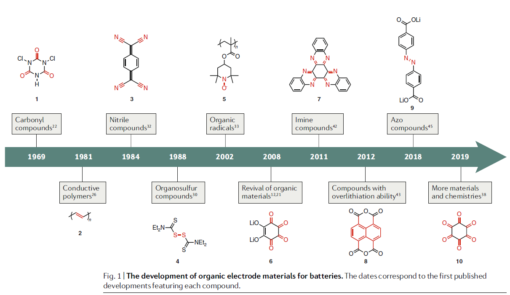
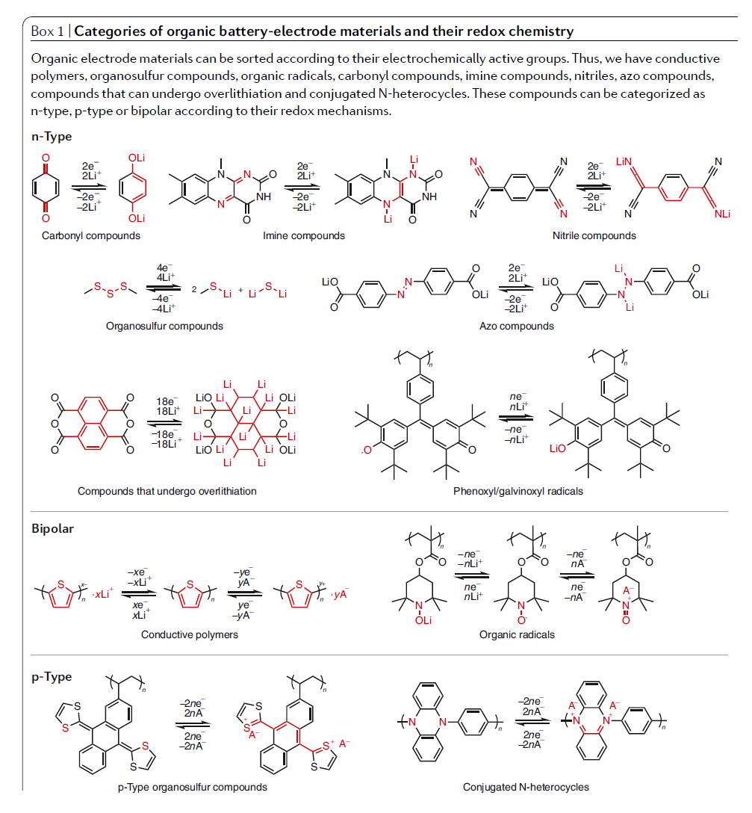
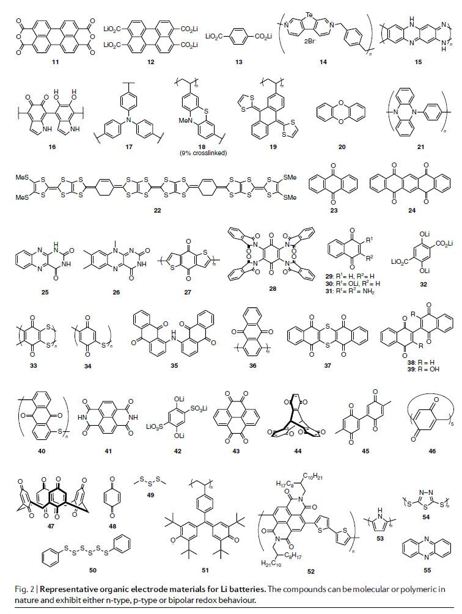
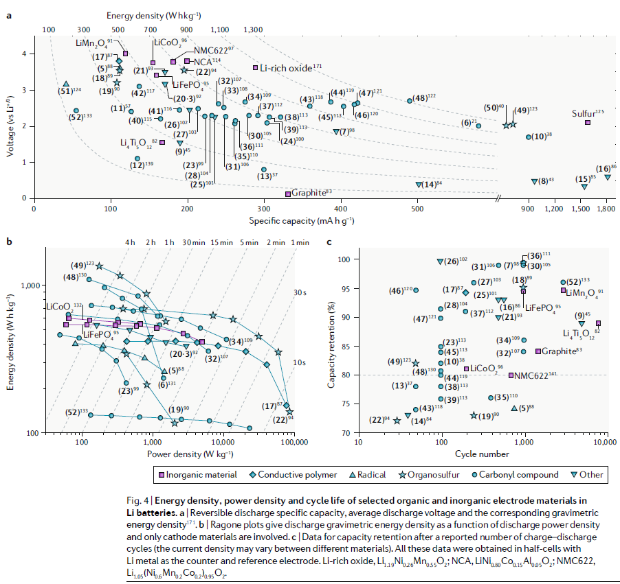
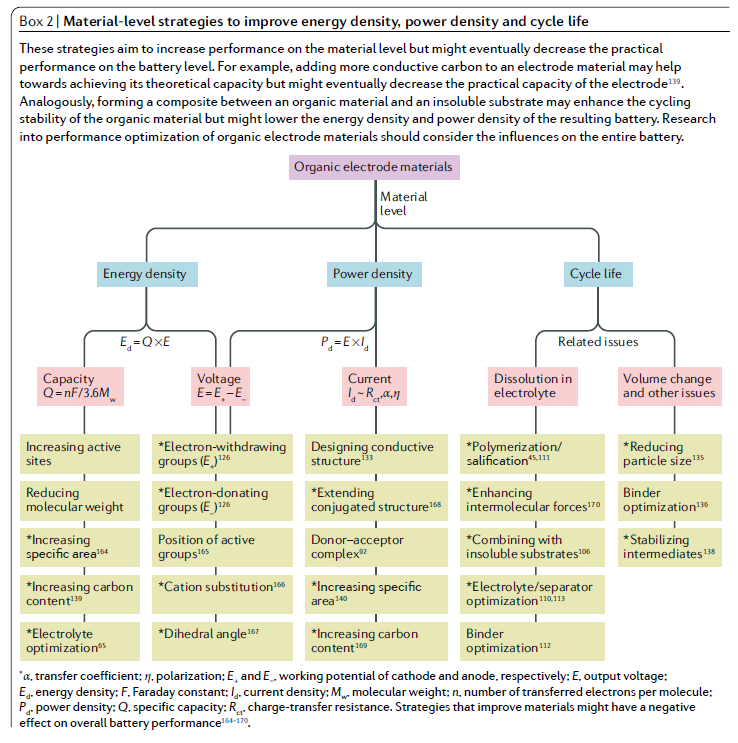
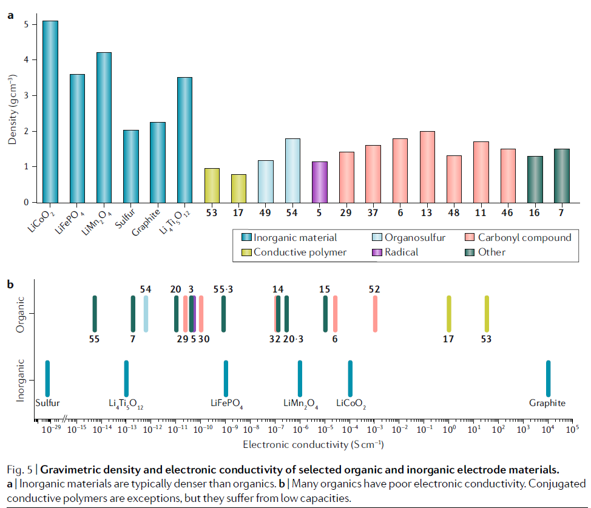
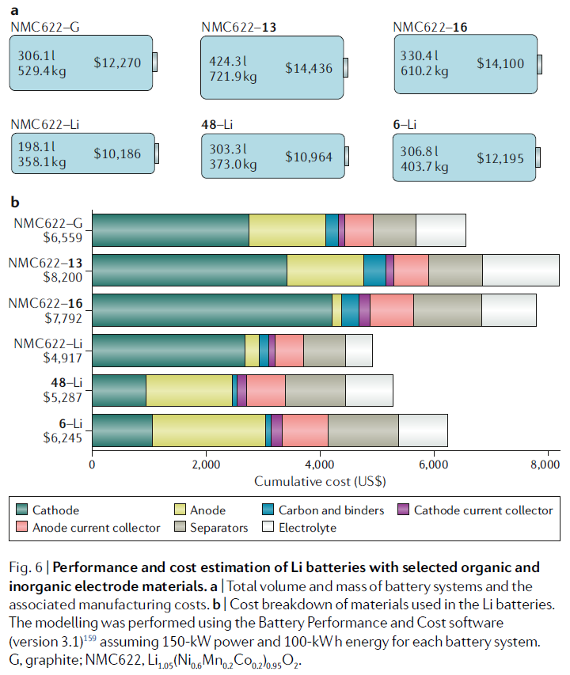

# Prospects of organic electrode materials for practical lithium batteries  实用锂电池用有机电极材料的前景

> Yong Lu and Jun Chen
> Nature Reviews Chemistry volume 4, pages127–142(2020)
> DOI: [10.1038/s41570-020-0160-9](https://doi.org/10.1038/s41570-020-0160-9)

## Abstract
Organic materials have attracted much attention for their utility as lithium-battery electrodes because their tunable structures can be sustainably prepared from abundant precursors in an environmentally friendly manner. Most research into organic electrodes has focused on the material level instead of evaluating performance in practical batteries. This Review addresses this by first providing an overview of the history and redox of organic electrode materials and then evaluating the prospects and remaining challenges of organic electrode materials for practical lithium batteries. Our evaluations are made according to energy density , power density , cycle  life, gravimetric density , electronic conductivity and other relevant parameters, such as energy efficiency , cost and resource availability. We posit that research in this field must focus more  on the intrinsic electronic conductivity and density of organic electrode materials, after which  a comprehensive optimization of full batteries should be performed under practically relevant conditions. We hope to stimulate high-quality applied research that might see the future commercialization of organic electrode materials.  
有机材料而备受关注它们可用作锂蓄电池的电极，因为它们的可调谐结构可以持续从丰富的前体在环境友好的方式来制备。大多数研究有机电极一直专注于物质层面而不是评估在实际的电池性能。这个评分地址此通过首先提供的有机电极材料的历史和氧化还原的概述，然后评估所述前景和剩余的有机电极材料实际锂电池的挑战。我们的评估是根据能量密度，功率密度，循环寿命，重量密度，电导率和其他相关参数，如能源效率，成本和资源可用性做出。我们断定在这个领域内的研究必须更加注重有机电极材料的内在电子导电性和密度，之后充满电池的全面优化要切实相关的条件下进行。我们希望刺激高品质的应用研究，可能看到的有机电极材料的未来商业化。

Society has recently witnessed the rapid development of battery technologies, starting from the lead–acid bat-tery, and proceeding to nickel–cadmium, nickel–metal hydride and to the lithium-ion battery (LIB)1–3. Since their first commercialization by Sony in 1991, LIBs have dominated the portable-electronics market and show great promise in large-scale applications, such as elec-tric vehicles (EVs) and smart grids4,5. The benefits that LIBs have in our daily lives saw them feature in the 2019 Nobel Prize in Chemistry6. Present commercial LIBs feature transition-metal oxide or phosphate cathodes such as LiCoO2, LiMn2O4, LiFePO4 or LiNixMnyCozO2, which are mainly produced from ores instead of renew-able resources7,8. In the long term, if all cars and portable electronics were to be powered by today’s LIBs, we would suffer from a Co resource crisis akin to our present crisis associated with limited fossil fuel reserves9. The future resource crisis may also involve Ni, although there are different assumptions regarding its potential scarcity9–11. In this context, we are compelled to develop renewable electrode materials for LIBs.  
社会已最近目睹电池技术的快速发展，从铅酸电池开始，并进行到镍-镉，镍-金属氢化物和所述锂离子电池（LIB）1-3。自1991年由索尼公司首次商业化，LIBS已经占据了便携式电子产品市场，并显示在大规模应用，如德豪润达TRIC车（EV）巨大潜力和智能grids4,5。该库在我们的日常生活带来的好处看见他们在2019年诺贝尔Chemistry6功能。目前的商业LIBS设有过渡金属氧化物或磷酸盐的阴极，例如LiCoO 2，锰酸锂，磷酸铁锂或LiNixMnyCozO2，主要从矿石代替更新-能够resources7,8的产生。从长远来看，如果所有的汽车和便携式电子产品是由今天的LIBS供电，我们会从一个共同的资源危机遭受类似于我们用有限的化石燃料reserves9有关目前的危机。未来资源危机还可能涉及镍，虽然关于它的缺乏潜力有不同的假设。在这种情况下，我们不得不开发LIBS可再生的电极材料。

Organic electrode materials are attractive in view of their potentially sustainable production and low carbon footprint12–18. Many organic electrode materials are ubiquitous in nature or can be produced from biomass using green processes that have minimal environmental foot-print19–21. For example, electrochemically active dilith-ium rhodizonate (Li2C6O6, 6; Fig. 1) can be prepared from the natural sugar myo-inositol, which exists in plants such as corn in the hexaphosphate form, phytic acid21.   
有机电极材料是鉴于其潜在的可持续的生产和低碳footprint12-18的吸引力。许多有机电极材料本质上无处不在，或者可以使用绿色工艺以最小的环境足迹从生物质生产。例如，电化学活性重氮二锂（Li2C6O6，6;图1）可以从天然糖肌醇，其在植物中存在的诸如玉米在六磷酸形式，植酸21来制备。

Similarly, polyquinones are useful redox-active mole-cules that can be prepared through polycondensation  of malic acid, a natural product found in apples12.  
同样，聚醌是有用的氧化还原活性分子，可以通过苹果酸（苹果中的天然产物）的缩聚反应制得。

The investigation of organic electrode materials for LIBs can be traced back to as early as the 1960s, when the tricarbonyl compound 1 was used as a cathode for primary Li batteries22 (Fig. 1). Subsequently, recharge-able Li batteries based on carbonyl compounds were successfully constructed23. However, the utility of car-bonyl compounds is often limited because their high solubility in aprotic electrolytes leads to a rapid decay in  capacity. After the discovery of conductive polymers  in the 1970s24,25, many chemists turned to these less soluble compounds as electrode materials for Li batter-ies26–28. The most widely studied conductive polymers include polyacetylene (2), polyaniline, polypyrrole, polythiophene and poly(p-phenylene)27,28. Conductive polymers store charge through redox doping reactions in which the polymer undergoes oxidation or reduction and, thus, incorporates anions or cations, respectively. Coin-type batteries with polyaniline cathodes and LiAl alloy anodes were released in the late 1980s29 but were soon taken off the market because they never exhibited their ideal performance. The problem here was that the doping level of conductive polymers is typically below 50%, which means that less than half of the redox-active groups undergo charging/discharging. This leads to practical capacities that usually do not exceed 150 mA h g−1 (reFs27,28), a problem that motivated the search for alternative cathode materials.  
有机电极材料LIBS的调查可追溯到早在20世纪60年代，当三羰基化合物1作为用于一次Li电池22阴极（图1）。随后，成功构建了基于羰基化合物的可充电锂电池。然而，汽车bonyl化合物的用途常常是有限的，因为它们在非质子电解质导致容量的迅速衰减的高溶解性。导电聚合物在1970s24,25后发现，许多化学家将这些难溶的化合物用作锂电池的电极材料26-28。最广泛研究的导电聚合物包括聚乙炔（2），聚苯胺，聚吡咯，聚噻吩和聚（对亚苯基）27,28。导电聚合物通过氧化还原掺杂反应存储电荷，在该氧化还原掺杂反应中，聚合物经历氧化或还原，因此分别掺入阴离子或阳离子。硬币型电池用聚苯胺阴极和LiAl合金阳极在1980s29年末发布，但很快就离开市场，因为他们从来没有表现出自己理想的性能。这里的问题是，导电聚合物的掺杂水平通常低于50％，这意味着，只有不到一半的氧化还原活性基团都经历的充电/放电。这导致实际的容量，通常不超过150 mAħG-1（reFs27,28），能够激励替代的阴极材料的搜索的问题。

  
Fig. 1 | The development of organic electrode materials for batteries. The dates correspond to the first published developments featuring each compound.  
图1 |的有机电极材料的电池的开发。该日期对应首次出版发展特色每种化合物。

The failure of early conductive polymers as cathode materials prompted the development of alternatives such as organosulfur compounds — distinct species that undergo the cleavage (formation) of S–S bonds during discharge (charge) processes. Although organosulfur compounds often exhibit high discharge capacities30,31, as with the carbonyl compounds, they eventually dissolve in the electrolyte, which results in poor cycling stability and a severe shuttle effect (the diffusion of dissolved species between the anode and cathode)31. Moreover, the kinet-ics of S–S bond formation during charging are generally sluggish. Contemporary with these developments were investigations into electrode materials based on nitriles, electron-poor molecules with highly reversible redox chemistry32. In addition to the aforementioned materials, organic radicals are another class of common organic electrode material. For example, the stable nitroxyl poly-radical 5 has been used as a cathode material in Li bat-teries, although it exhibited only a relatively low capacity of 77 mA h g−1 (reF.33). Nevertheless, an important characteristic of organic radicals is their propensity to undergo redox very rapidly because almost no bond rearrangement occurs during discharging and charging. In particu-lar, the electron-transfer rate constants for self-exchange in nitroxyl (for example, RNO+ + RNO· ⇌ RNO· + RNO+, ~10−1 cm s −1) are several orders higher than those of  organosulfur compounds (~10−8 cm s−1)34,35.  
早导电聚合物作为正极材料的失败提示的替代品的发展如有机硫化合物 - 经历期间放电（充电）过程的S-S键的断裂（形成）不同的物种。虽然有机硫化合物通常表现出高的放电capacities30,31，与羰基化合物相似，它们最终溶解在电解液中，这导致差的循环稳定性和严重穿梭效应31（阳极和阴极之间溶解的物质的扩散）。此外，S-S键形成在充电期间动力学是普遍低迷。当代这些发展是调查电极材料基于腈，具有高度可逆的氧化还原性32的贫电子分子。在除了上述材料，有机基团是另一类通常的有机电极的材料制成。例如，稳定的硝酰基聚自由基5已被用作锂离子电池的阴极材料，尽管它仅表现出的77毫安ħG-1（reF.33）相对较低的容量。尽管如此，有机基团的一个重要性能是他们的倾向，因为放电和充电过程中几乎不会发生化学键重新排列，氧化还原非常迅速地进行。在particu-LAR，电子传递速率常数在硝酰自交换（例如，RNO+ + RNO·⇌RNO·+ RNO +，〜10-1厘米-1）是几个数量比有机硫化合物的较高（ 〜10-8厘米S-1）34,35。

The successful introduction of inorganic electrode materials into commercial LIBs somewhat lowered the motivation to study organic electrode materials, at least in the 1990s and early 2000s. Yet, growing concerns regarding energy and our environment saw research into organic electrode materials experience a revival around 2008, when Armand and Tarascon described a bright future for organic batteries12. Their publication was followed by several relevant research papers21,36,37 and organic electrode materials began to attract more atten-tion. In the past decade, research into organic electrode materials can largely be divided into two main aspects. The first aspect involves developing materials with tradi-tionally popular functional groups, such as quinones,  carboxylates, polysulfides and radical centres38–41. Molecules  with other redox-active centres, such as imines, alkenes, alkynes and azo groups42–45, have also been prepared and studied in terms of redox. The second aspect of research is extending the use of organic electrode materials to other battery chemistries beyond Li, including batteries based on Na46, K47, Mg48, Zn49, Al16,50 and Ca48,51.  
成功引入无机电极材料的投入商业LIBS有些降低的动机来研究有机电极材料，至少在20世纪90年代和21世纪初。然而，关于能源和环境锯研究有机电极材料的日益关注经历复兴2008年左右，当阿尔芒和塔拉斯描述的美好未来有机电池12。他们公布后，一些相关的研究文章21,36,37和有机电极材料开始吸引更多的注意。在过去十年中，研成有机电极材料可以在很大程度上被分成两个主要方面。第一方面涉及与传统流行官能团显影材料，如醌，羧酸盐，多硫化物和自由基中心38-41。与其他氧化还原活性中心，如亚胺，烯烃，炔烃和偶氮基团42-45分子，也已编制和氧化还原方面的研究。研究的第二个方面是延伸使用有机电极材料到其它化学电池锂以外，包括基于Na46，K47，Mg48，Zn49，Al16,50和Ca48,51电池。

We have described how research into organic elec-trode materials has flourished for several decades, espe-cially the most recent one. So, we must now ask whether or not the materials can really be incorporated into practical batteries. In particular:  
我们已经描述了如何研究有机ELEC-TRODE材料蓬勃发展了几十年，特别是最近的一次。所以，我们现在要问是否将材料可以真正纳入实用的电池。尤其是：

- In what practical scenarios may organic electrode materials be applicable?   
在什么样的实际情形中可能的有机电极材料适用？
- Can electrochemical performance metrics such as energy density, power density and cycle life of the materials meet the demands of practical applications?  
电化学性能指标，如能量密度，功率密度和循环寿命的材料是否满足实际应用的需要
- What are the costs, resource availability and thermal/chemical stability of organic electrode materials for large-scale electrochemical-energy-storage applications?  
哪些成本，资源可用性和有机电极材料用于大规模电化学能量存储应用中的热/化学稳定？
- What are the key challenges that restrict the prac-tical applications of organic electrode materials for Li batteries?  
有什么制约的有机电极材料的锂电池PRAC-蒂卡尔应用的关键挑战是什么？

Very few works have sought to address all of these questions, and this shortcoming is presumably a result of a short-sighted preoccupation with material perfor-mance and optimization instead of holistically con-sidering the battery-level requirements for practical application18,28,31,32,42,45,52–56. Accordingly, this Review describes our systematic analysis of the prospects of organic electrode materials for practical LIBs, with a focus on each of the practical questions. In particular, we systematically discuss the properties of organic electrode materials, including their energy density, power density, cycle life, gravimetric density, electronic conductivity, energy efficiency, cost, resource availability and thermal/ chemical stability. These material-level properties, in conjunction with other factors such as mass loading and electrolyte usage, govern the performance and cost of bat-teries. We then estimate the performance (for example, energy density and power density) and cost of practical Li batteries featuring selected organic electrode materials before offering recommendations for future research.  
很少有作品试图解决所有这些问题，并且该缺点可能是由于对材料性能和优化的目光短浅的关注，而不是从整体上考虑电池水平对实际应用的要求18,28,31,32,42,45,52-56。因此，本文综述了我们的有机电极材料实际LIBS的前景进行系统分析，重点是每个实际问题。特别是，我们系统地讨论的有机电极材料的特性，包括它们的能量密度，功率密度，循环寿命，重量密度，电子传导性，能量效率，成本，资源可用性和热/化学稳定性。这些材料级属性，与其它因素，如质量负荷和电解质结合使用，支配电池的性能和成本。然后，我们估计性能（例如，能量密度和功率密度）的实际利电池为今后的研究提供建议之前，以精选的有机电极材料和成本。

## Main
### Redox chemistry of organic electrode materials
Organic electrode materials can be classified as being n-type, p-type or bipolar-type materials according to specific criteria (Box 1), not least their redox chemistry53.   
根据特定标准（框1），有机电极电极材料氧化还原化学可以被分类为n型，p型或双极型材料，尤其是它们的氧化还原化学。

For n-type (p-type) organics, the redox reactions occur between the neutral state and the negatively (positively) charged state. Most reported n-type organics first experience reduction, during which they combine with elec-trons and metal counterions such as Li+, Na+ or Mg2+. Conversely, p-type materials typically first undergo oxidation and must bind anions from the electrolyte to remain electroneutral. Bipolar-type materials have pro-perties of both p-type and n-type materials and can first undergo oxidation or reduction. The redox potentials of p-type materials are generally higher than those of n-type materials, such that p-type materials are usu-ally used as battery cathodes. n-Type organic materi-als can be used as cathodes or anodes, depending on their practical redox potentials. The redox kinetics of p-type materials are generally faster than those of n-type materials34,35,55. However, p-type materials often exhibit limited capacities because most of the mass is typically redox-inactive and not all the redox-active groups react anyway28,55,56.  
对于n型（p型）有机物，氧化还原反应发生在中性状态和带负电荷（正）的状态之间。大多数报道的n型有机物首先经历还原反应，在此期间它们会与电子和金属抗衡离子（例如Li +，Na +或Mg2 +）结合。相反，p型材料通常首先会发生氧化，并且必须结合电解质中的阴离子以保持电子中性。双极型材料具有p型和n型材料的特性，并且可以先进行氧化或还原。 p型材料的氧化还原电势通常高于n型材料的氧化还原电势，使得通常将p型材料用作电池阴极。 n型有机材料可以用作阴极或阳极，具体取决于它们的实际氧化还原电势。 p型材料的氧化还原动力学通常要快于n型材料的氧化还原动力学34、35、55。然而，p型材料通常显示出有限的容量，因为大多数物质通常是氧化还原惰性的，而且并非所有的氧化还原活性基团都反应了[28,55,56]。

Box 1 | Categories of organic battery-electrode materials and their redox chemistry  
专栏1 |的有机电池的电极材料的类别及其氧化还原化学  
  
Organic electrode materials	can	be sorted according	to their electrochemically active groups. Thus, we have conductive polymers, organosulfur compounds, organic radicals, carbonyl compounds, imine compounds, nitriles, azo compounds, compounds that can undergo overlithiation and conjugated N-heterocycles. These compounds can be categorized as n-type, p-type or bipolar according to their redox mechanisms.  
可以根据有机电极材料的电化学活性基团对其进行分类。因此，我们有导电聚合物，有机硫化合物，有机基团，羰基化合物，亚胺化合物，腈，偶氮化合物，可经历过度锂化的化合物和共轭N杂环。根据它们的氧化还原机理，这些化合物可分为n型，p型或双极性。

We illustrate the redox chemistry of organic electrode materials with some representative materials (Box 1) but note that the particular redox mechanisms of many organic electrode materials are unclear and need inves-tigation. For example, some n-type and bipolar-type materials are thought to exist as radical intermediates during lithiation54, but it is difficult to detect these spe-cies in some cases, which may be ascribed to their poor stability in batteries. In addition, the reversibility of the exhaustive-lithiation (referred to as ‘overlithiation’)  process is still under intensive debate43,44,57–59.  
我们用一些代表性材料说明了有机电极材料的氧化还原化学反应（专栏1），但请注意，许多有机电极材料的特定氧化还原机理尚不清楚，需要研究。例如，某些n型和双极型材料被认为是锂化过程中的自由基中间体54，但在某些情况下很难检测到这些现象，这可能是由于它们在电池中的稳定性差所致。另外，详尽锂化（称为“过度锂化”）过程的可逆性仍在激烈的辩论中[43,44,57-59]。

In general, the redox chemistry of organic electrode materials is different to that of inorganic materials. The latter, when undergoing alloying or conversion reac-tions (defined as transformations that afford at least two products), experience large structural changes dur-ing discharge and charge processes60. By contrast, redox reactions of many organic electrode materials are often only accompanied by limited rearrangement of bonds and minimal structural changes61,62. However, there are some notable exceptions, and organic salts such as 6, Na2(2,5-dihydroxy-1,4-benzoquinone) and disodium rhodizonate undergo relatively large structural changes during discharging and charging63–65.  
通常，有机电极材料的氧化还原化学与无机材料不同。后者在进行合金化或转化反应（定义为可提供至少两种产物的转化）时，在放电和充电过程中会经历较大的结构变化60。相比之下，许多有机电极材料的氧化还原反应通常只伴随着键的有限重排和最小的结构变化61,62。但是，也有一些明显的例外，有机盐，例如6，Na2（2,5-二羟基-1,4-苯醌）和重氮二唑酸钠在放电和充电过程中会发生较大的结构变化63-65。

The other difference between organic and inorganic electrode materials is that the redox chemistry of most organic electrode materials is not governed by the radius and charge of counterions. Thus, in most cases, it is feasi-ble to incorporate the same organic material into differ-ent non-aqueous or aqueous metal-ion batteries, which is generally impossible for inorganic electrode materials. For instance, perylene dianhydride 11 (Fig. 2) is typical of carbonyl compounds in that it can undergo reduction and concomitant binding of ions such as Li+ (reF.57), Na+ (reF.58), K+ (reF.59), Mg2+ (reF.48), Ca2+ (reF.48), H3O+ (reF.66) and NH4+ (reF.67) in non-aqueous or aqueous systems.  Pictured in Fig. 2 are some other prominent organic elec-trode materials, the functions of which are described in the following section.  
有机和无机电极材料之间的另一个区别是，大多数有机电极材料的氧化还原化学反应不受反离子半径和电荷的控制。因此，在大多数情况下，将相同的有机材料掺入不同的非水或水金属离子电池中是可行的，这对于无机电极材料通常是不可能的。例如，per二酐11（图2）是羰基化合物的典型代表，因为它可以还原和伴随离子结合，例如Li +（reF.57），Na +（reF.58），K +（reF.59），非水或水性系统中的Mg2 +（reF.48），Ca2 +（reF.48），H3O +（reF.66）+（reF.67）。图2中显示了其他一些重要的有机电极材料，其功能在以下部分中介绍。

### Possible application scenarios
There are three Li-battery configurations in which organic electrode materials could be useful (Fig. 3a). Each configuration has different requirements and the choice of material is made based on its intrinsic structure and redox potentials. n-Type organic mate-rials with low redox potentials (<1.6 V versus Li+/0), such as carboxylates (12, 13), azo compounds (9) and compounds that can undergo overlithiation (8, 14–16), are candidate anode materials, most of which can be coupled with high-voltage cathode materials such as Li1.05(Ni0.6Mn0.2Co0.2)0.95O2 (NMC622) to afford a use-ful cell voltage (Configuration I). As with present LIBs, these batteries need to be charged first, during which NMC622 undergoes oxidation and carbonyls such as 13 undergo reduction and gradually transform into enolates (Fig. 3a), for example. The reactions are reversi-ble in the subsequent discharging process. Alternatively, many reported p-type organic materials such as nitroxyl radical 5 can serve as cathodes when coupled with  traditional, low-voltage anode materials, such as graphite (Configuration II). For example, in the case of a dual-ion battery with 5 as the cathode and graphite as the anode, 5 would be oxidized to its oxoammonium form and combine with PF6− from the electrolyte. Concomitantly, the graphite anode accepts electrons from the external circuit and Li+ from the electrolyte. The most widely investigated n-type organic cathode materials, such as carbonyl and organosulfur compounds with reduction potentials in the range 2–3 V versus Li+/0, often do not initially contain Li. Thus, for practical applications, they should be matched with a Li-containing anode mate-rial such as Li metal and be discharged (reduced) first (Configuration III).  
可能的应用场景存在三种锂电池配置，其中有机电极材料可能会有用（图3a）。每种配置都有不同的要求，并且根据其固有结构和氧化还原电位来选择材料。具有低氧化还原电势（<1.6 V vs Li+/0）的n型有机材料，例如羧酸盐（12，13），偶氮化合物（9）和可能发生过度锂化的化合物（8，14–16）是候选阳极材料，其中大多数可以与高压阴极材料（例如Li1.05（Ni0.6Mn0.2Co0.2）0.95O2（NMC622））耦合，以提供有用的电池电压（配置I）。与目前的LIB一样，这些电池需要首先充电，在此期间NMC622会发生氧化，羰基（如13）会被还原并逐渐转变为烯醇（图3a）。反应在随后的放电过程中是可逆的。或者，许多报道的p型有机材料（例如亚硝酰基基团5）与传统的低压阳极材料（例如石墨）结合时可以用作阴极（配置II）。例如，在双离子电池的阴极为5，石墨为阳极的双离子电池中，5会被氧化成其氧铵形式，并与电解质中的PF6-结合。随之而来的是，石墨阳极接受来自外部电路的电子，并接受来自电解质的Li +。研究最广泛的n型有机阴极材料，例如羰基和有机硫化合物，其还原电势相对于Li + /0为2-3 V，通常最初不包含Li。因此，在实际应用中，应将它们与含锂阳极材料（例如锂金属）匹配，并首先放电（还原）（配置III）。

### Parameters at the material level
Electrode materials must satisfy stringent requirements to have a chance at practical battery applications68,69. The following discussion summarizes these requirements, which pertain not only to the material level but also to the device level (Fig. 3b). For practical batteries, the main figures of merit are energy density, power density, cycle life, cost, safety and recyclability. These metrics are natu-rally sensitive to the figures for the materials themselves, namely energy density, power density, cycle life, density, electronic conductivity, energy efficiency, cost, resource availability and thermal/chemical stability. For example, the electronic conductivity of organic electrode materi-als affects the amounts of conductive carbon additive needed to maintain charge flow and, thus, influences the energy density in a practical battery. It is, thus, necessary to systematically evaluate the parameters of organic elec-trode materials and use this information to increase the performance of practical batteries (Fig. 3b).    
电极材料必须满足严格的要求，才能在实际的电池应用中获得机会68,69。以下讨论总结了这些要求，这些要求不仅与材料级别有关，而且与设备级别有关（图3b）。对于实用电池，主要性能指标是能量密度，功率密度，循环寿命，成本，安全性和可回收性。这些指标对材料本身的数字自然敏感，即能量密度，功率密度，循环寿命，密度，电子传导率，能量效率，成本，资源可用性和热/化学稳定性。例如，有机电极材料的电子导电性影响维持电荷流动所需的导电碳添加剂的量，因此影响实际电池中的能量密度。因此，有必要系统地评估有机电极材料的参数，并使用此信息来提高实际电池的性能（图3b）。

#### Energy density. 
Achieving a driving range of 500–600 km for current EVs on a single charge is a target common to many carmakers and governmental funding agencies70,71. The energy density of present commercial LIBs on the cell level is generally less than 260 W h kg−1 (reFs72,73), a value that is not high enough to avoid ‘range anxiety’ — the psychological stress associated with running out of electrical energy before reaching one’s destination. To make EVs more competitive, we must be more ambi-tious in our targets. For example, many countries and communities such as the US Department of Energy’s Battery500 consortium and Japan’s New Energy and Industrial Technology Development Organization have proposed an energy density target of 500 W h kg−1 on the cell level, a value they hope to reach in the near future at a low cost74,75.    
对于许多汽车制造商和政府资助机构来说，一次充电即可使当前电动车的续驶里程达到500-600公里是一个普遍的目标70,71。当前商业LIB在细胞水平上的能量密度通常小于260 W h kg-1（reFs72,73），该值不足以避免``范围焦虑''-与电力耗尽相关的心理压力到达目的地之前的能量。为了使电动汽车更具竞争力，我们必须在目标上更加雄心勃勃。例如，许多国家和社区，例如美国能源部的Battery500财团和日本的新能源与工业技术开发组织，都提出了在电池级的500 W h kg-1的能量密度目标，他们希望在电池组中达到该值。近期价格低廉74,75。

If we are to reach the target of 500 W h kg−1, it will require urgent development of new electrode mate-rials and battery systems. The most obvious and the-oretically ideal anode is Li metal, which has attracted extensive attention because of its ultra-high capacity (3,860 mA h g −1) and exceedingly low redox potential (−3.04 V versus standard hydrogen electrode)76,77. As for the cathode, typical candidates include high-energy- density organic materials, Ni-rich layered oxides, Li-rich layered oxides and sulfur (orthorhombic S8)78–80. We will compare the gravimetric energy densities (on the material level) of organic electrode materials as well as inorganics such as sulfur, commercial LiCoO2, LiFePO4, LiMn2O4, Ni-rich layered oxides and non-commercial Li-rich layered oxides. For uniformity, the specific capac-ity, working voltage and corresponding energy density of representative organic and inorganic electrode materials have all been obtained using half-cells with Li metal as the counter and reference electrode (Fig. 4a).  
如果要达到500 W h kg-1的目标，则需要紧急开发新的电极材料和电池系统。**最明显且理论上最理想的阳极是锂金属，由于其超高容量（3,860 mA h g -1）和极低的氧化还原电势（相对于标准氢电极为-3.04 V）而受到广泛关注76,77**。至于阴极，**典型的候选材料包括高能量密度的有机材料，富镍层状氧化物，富锂层状氧化物和硫（斜方S8）78-80**。我们将比较有机电极材料以及无机材料（如硫，商业化的LiCoO2，LiFePO4，LiMn2O4，富镍的层状氧化物和非商业性的富锂的层状氧化物）的重量能密度（在材料水平上）。为了达到均匀性，使用锂金属作为对电极和参比电极的半电池可以得到代表性有机和无机电极材料的比容量，工作电压和相应的能量密度（图4a）。

  
Fig. 2 | Representative organic electrode materials for Li batteries. The compounds can be molecular or polymeric in nature and exhibit either n-type, p-type or bipolar redox behaviour.  
图2 |代表性的有机电极材料用于锂电池。所述化合物可以是分子或聚合物的性质并表现出是n型，p型或双极型的氧化还原行为。

Commercial LIBs in Configuration I typically fea-ture graphite anodes (89% market share), while some LIBs instead have Li4Ti5O12 (~2%) or other materials81.  The organic electrode materials best suited to this configuration include azo compounds such as 9, low- voltage carbonyl compounds such as carboxylates 12 and 13, and compounds that can undergo overlithia-tion. The recently developed azo compound 9 has a flat discharge plateau (~1.55 V versus Li+/0) similar to that of Li4Ti5O12 but with slightly higher capacity (190 mA h g−1 at a current density of 95 mA g−1)45,82, implying that the gravimetric energy density of LIB full-cells would become higher if Li4Ti5O12 were replaced by 9 without considering any other conditions. Even better would be Li2(1,4-benzenedicarboxylate) (13), which gives rise to flat charge and discharge curves and has a larger capac-ity (~300 mA h g−1 at 0.05 C) and a lower discharge volt-age (~0.8 V versus Li+/0)37. Nevertheless, both 9 and 13 cannot compete with graphite as an anode material83. The compounds 8 (reF.43), 14 (reF.84), 15 (reF.85) and 16 (reF.86) can undergo overlithiation, such that they have ultra-high capacities (often higher than 900 mA h g−1). These compounds would be set to replace graphite and Li4Ti5O12 in traditional LIBs (Configuration I) if high capacity were the only prerequisite for a good anode material. However, these compounds generally have relatively high redox potentials (sloping charge and dis-charge curves in the range of about 0–3 V versus Li+/0) and large overpotentials — aspects that need to be addressed before incorporating the materials into prac-tical batteries. Note that the discharge (charge) process of full-cells corresponds to the charge (discharge) process of anode materials in half-cells. Thus, not only the dis-charge but also the charge voltage and capacity of these organic anode materials should be considered before applying them in practical LIBs.    
配置I中的商用LIB通常具有石墨阳极（89％的市场份额），而某些LIB具有Li4Ti5O12（〜2％）或其他材料81。最适合此配置的有机电极材料包括偶氮化合物（例如9），低压羰基化合物（例如羧酸盐12和13）以及可能发生过锂化的化合物。最新开发的偶氮化合物9具有类似于Li4Ti5O12的平坦放电平台（〜1.55 V vs Li + /0），但具有更高的容量（190 mA hg-1在电流密度为95 mA g-1时）45,82 ，这意味着如果在不考虑任何其他条件的情况下将Li4Ti5O12替换为9，则LIB全电池的重量能量密度将更高。 Li2（1,4-苯二甲酸）（13）甚至更好，它会产生平坦的充电和放电曲线，并且具有更大的容量（在0.05 C时约为300 mA hg-1）和更低的放电电压（〜0.8 V对Li + /0）37。然而，9和13都不能与石墨作为负极材料竞争83。化合物8（reF.43），14（reF.84），15（reF.85）和16（reF.86）可能会过锂化，因此它们具有超高容量（通常高于900 mA hg-1） ）。如果高容量是优质阳极材料的唯一前提，那么这些化合物将取代传统的LIB（构造I）中的石墨和Li4Ti5O12。但是，这些化合物通常具有相对较高的氧化还原电势（倾斜的充电和放电曲线在大约0-3 V对Li + /0的范围内）和大的超电势-在将材料整合到实际应用中之前需要解决的问题电池。注意，全电池的放电（充电）过程对应于半电池中阳极材料的充电（放电）过程。因此，在将这些有机阳极材料应用于实际的LIB之前，不仅应考虑其放电，还应考虑其充电电压和电容。

  
Fig. 3 | Configurations and key parameters for organic electrode materials in Li batteries. a | n-Type organics can be deployed in Configurations I and III. p-Type materials are amenable to Configuration II. Note that most reported n-type and p-type organic electrode materials would first undergo reduction and oxidation, respectively. b | Key parameters, on both the material and device levels, have to be considered to obtain practical batteries.  
图3 |配置和有机电极材料在锂电池的关键参数。 A | n型有机可配置I和III进行部署。 p型材料适合于配置II。注意，大多数报道的n型和p型有机电极材料将第一分别经受还原和氧化。 C |关键参数，同时在材料和设备水平，必须考虑到实际获得的电池。

Many reported p-type organic materials can serve as cathodes for Li batteries in Configuration II (Fig. 3a). Conductive polymer 17 (reF.87), radical 5 (reF.88), organo-sulfur compounds 18 (reF.89) and 19 (reF.90) exhibit lower discharge voltage and capacity than LiMn2O4 (reF.91), which has an energy density of about 480 W h kg−1 on the material level. By contrast, the energy densities of donor–acceptor complex 20·3 (reF.92), N-heterocyclic oligomer 21 (reF.93) and tetrathiafulvalene-inspired 22 (reF.94) are close to those of LiFePO4 (reF.95), LiCoO2 (reF.96) and NMC622  (reF.97), respectively. Although these organics have high discharge voltages and mod-erate capacities, and their energy densities are similar to those of commercial inorganic cathode materials, their deployment faces intrinsic obstacles. The first of these was alluded to earlier — the large amount of salt from the electrolyte needed during the charging process inevitably lowers the energy density of practical batter-ies. The second obstacle is that p-type electrode mate-rials need to be fully swollen with electrolyte because the diffusion of anions cannot occur through a p-type material alone but generally needs solvent, which might block access to active groups and lower capacity61. Unless these obstacles can be addressed with novel research, p-type organic electrode materials will remain far from commercialization.  
许多报道的p型有机材料可以用作配置II中锂电池的阴极（图3a）。导电聚合物17（reF.87），自由基5（reF.88），有机硫化合物18（reF.89）和19（reF.90）的放电电压和容量低于LiMn2O4（reF.91），后者具有在材料水平上的能量密度约为480 W h kg-1。相比之下，供体-受体复合物20·3（reF.92），N-杂环低聚物21（reF.93）和四硫富瓦烯激发的22（reF.94）的能量密度接近LiFePO4（reF.95），LiCoO2（reF.96）和NMC622（reF.97）。尽管这些有机物具有较高的放电电压和中等容量，并且其能量密度与市售无机阴极材料相似，但其部署面临固有的障碍。其中的第一个被提到较早–充电过程中从电解液中需要大量的盐分不可避免地降低了实际电池的能量密度。第二个障碍是p型电极材料必须被电解质完全溶胀，因为阴离子的扩散不能仅通过p型材料发生，而通常需要溶剂，这可能会阻碍活性基团的进入和较低的容量61。除非可以通过新颖的研究解决这些障碍，否则p型有机电极材料仍将远未实现商业化。

  
Fig. 4 | Energy density , power density and cycle life of selected organic and inorganic electrode materials in Li batteries. a | Reversible discharge specific capacity , average discharge voltage and the corresponding gravimetric energy density171. b | Ragone plots give discharge gravimetric energy density as a function of discharge power density and only cathode materials are involved. c | Data for capacity retention after a reported number of charge–discharge cycles (the current density may vary between different materials). All these data were obtained in half-cells with Li metal as the counter and reference electrode. Li-rich oxide, Li1.19Ni0.26Mn0.55O2; NCA, LiNi0.80Co0.15Al0.05O2; NMC622, Li1.05(Ni0.6Mn0.2Co0.2)0.95O2.  
图4 |能量密度，功率密度和选定的有机和无机的电极材料在锂蓄电池的循环寿命。 A |可逆放电比容量，平均放电电压和相应的重量能量density171。 C |重复的Ragone给放电重量能量密度为放电功率密度和仅有的阴极材料所涉及的功能。 ç|对于充放电循环所报告的数目后的容量保持的数据（电流密度可以由不同材料之间变化）。在半电池与Li金属作为反电极和参考电极，获得所有这些数据。富锂氧化物，Li1.19Ni0.26Mn0.55O2; NCA, LiNi0.80Co0.15Al0.05O2; NMC622, Li1.05(Ni0.6Mn0.2Co0.2)0.95O2. 

The most widely investigated organic electrode mate-rials are relatively high voltage, Li-free n-type materials (generally 2–3 V versus Li+/0), such as carbonyls, orga-nosulfur compounds and imines — species that are suitable for Li batteries in Configuration III (Fig. 3a). Many reported n-type carbonyl-based and imine-based materials, including 7, 23–28 and 30–39, deliver energy densities of 500–750 W h kg−1 on the material level98–113 (Fig.  4a),  values  close  to  those  of  most  commercial inorganic cathode materials such as LiFePO4, LiCoO2, 95–97,114. In addition, NMC622 and LiNi0.80Co0.15Al0.05O2the carbonyls 11 and 40–42 are similar to LiMn2O4 in terms of energy density (300–500 W h kg−1)57,115–117, and 1,4-benzenedisulfonate-based lithiated compound 42 in particular can operate at 3.1 V, but, unfortunately, it has a relatively low capacity (137 mA h g−1)117. It is encouraging that the gravimetric energy densities of some carbonyl and organosulfur compounds are much higher than those of traditional inorganic cathode mate-rials21,38,40,113,118–123. For example, 43 (reF.118), 47 (reF.121), 48 (reF.122), 49 (reF.123) and 10 (reF.38) have material-level energy densities of more than 900, 1,100, 1,300, 1,450 and 1,500 W h kg−1, respectively. Thus, Li-metal batter-ies with these cathode materials have great promise in reaching high practical gravimetric energy densities.  
研究最广泛的有机电极材料是相对高电压的无锂n型材料（通常为2-3 V，相对于Li + /0），例如羰基，有机无硫化合物和亚胺（适用于Li）配置III中的电池（图3a）。许多报道的基于n型羰基和亚胺的材料，包括7，23-28和30-39，在材料水平98-113上提供的能量密度为500-750 W h kg-1（图4a），值接近大多数商业无机阴极材料，如LiFePO4，LiCoO2、95-97,114。此外，NMC622和LiNi0.80Co0.15Al0.05O2，羰基11和40-42在能量密度（300-500 W h kg-1）方面类似于LiMn2O457,115-117，以及1,4-苯二磺酸盐基锂化物化合物42尤其可以在3.1 V下工作，但不幸的是，它具有相对较低的容量（137 mA hg-1）117。令人鼓舞的是，某些羰基和有机硫化合物的重量能密度远高于传统的无机阴极材料21、38、40、113、118-123。例如，43（reF.118），47（reF.121），48（reF.122），49（reF.123）和10（reF.38）的材料级能量密度超过900、1,100， 1,300、1,450和1,500 W h kg-1。因此，具有这些正极材料的锂金属电池在实现高实用重量能量密度方面具有广阔的前景。

A real advantage of using organic electrode materials in place of inorganics is that the former occupy a large and synthetically accessible chemical space, enabling us to tune capacity, working voltage and energy density. As mentioned above, organic cathode materials exhibit energy densities ranging widely from ~100 W h kg−1 (51)124 to ~1,500 W h kg−1 (10)38, with the best values still being lower than that of sulfur125 (Fig. 4a). Many strategies have been reported to further increase the energy den-sity of organic electrode materials126 (Box 2), but these strategies only address changes on the material level. Indeed, some strategies that improve energy density on the material level may detract from the energy density of practical batteries.  
使用有机电极材料代替无机物的真正优势在于，前者占据了巨大且可合成的化学空间，这使我们能够调节容量，工作电压和能量密度。如上所述，有机阴极材料的能量密度范围从〜100 W h kg-1（51）124到〜1,500 W h kg-1（10）38，最佳值仍低于硫125（图4a）。据报道，有许多策略可以进一步提高有机电极材料的能量密度126（方框2），但是这些策略仅解决了材料层面的变化。实际上，一些在材料层面提高能量密度的策略可能会损害实际电池的能量密度。

#### Power density.
Power density is typically reported in W kg−1 and is a measure of the charging and discharging rate of batteries. This figure of merit must be suitably high for a battery to find consumer acceptance and the Society of Automotive Engineers in the United States defines two charging levels (standard J1772)127. In level 1, the maximum charging power is 1.92 kW at 120 VAC and a maximum current of 16 A. For level 2, the max-imum charging power, voltage and maximum current are 19.20 kW, 208–240 VAC and 80 A, respectively. For direct current charging, the levels 1 and 2 correspond to a charging voltage of 200–450 VDC with maximum currents of 80 A (36 kW) and 200 A (90 kW), respectively.  
功率密度通常报道以W KG-1和是电池的充电和放电速率的量度。优点这个数字必须适当高的电池找到消费者接受和汽车工程师在美国协会定义了两个收费水平（标准J1772）127。在第1级，最大充电功率，分别19.20千瓦208-240 VAC和80 A，是1.92千瓦，在120 VAC和，最大充电功率，电压和最大电流16 A的最大电流对于2级的。为直流充电时，级别1和2对应于200-450 VDC的分别与80 A（36千瓦）和200 A（90千瓦），最大电流的充电电压。

Present superchargers for Tesla vehicles can provide their highest charging power of 120 kW at a voltage of 480 VDC128. At this charging rate, it takes roughly 30 min to build up the electrical energy required for 300–400 km of driving. However, the present charging speed of EVs still remains a disadvantage relative to conventional internal-combustion-engine-driven vehi-cles, which can be refuelled at an equivalent rate of 12C (a typical fuel tank may be filled in (1/12) h = 5 min)73. In view of this, the US Advanced Battery Consortium proposed fast-charge goals for EV batteries and, by 2023, they aim to have batteries that can be charged to 80% of their energy capacity within 15 min (reF.129). For battery discharge in practical applications, the rate is generally 0.3–0.5C or lower, which is to say that the battery can be used at full current for about  [1/(0.3–0.5)] h = 2–3 h73. We note that the discharge and charge rates in the same cycle are often the same when measuring the rate performance of organic electrode materials in half-cells. Moreover, considering that it is the discharge energy that reflects the actual value of energy stored during the fast-charging process, we now only focus on evaluating the fast-discharging capability of different classes of organic cathode materials in half-cells.  
当前用于特斯拉汽车的增压器可以在480 VDC128的电压下提供120 kW的最高充电功率。以这种充电速度，大约需要30分钟才能积累300-400 km行驶所需的电能。但是，相对于传统的内燃机驱动的车辆，其当前的充电速度仍然是一个缺点，后者可以以12C的当量速率加油（可以在（1/12）处注满典型的燃料箱） h = 5分钟）73。有鉴于此，美国高级电池协会提出了EV电池快速充电的目标，到2023年，他们的目标是使电池能够在15分钟内充电至其能量容量的80％（reF.129）。对于实际应用中的电池放电，速率通常为0.3–0.5C或更低，也就是说，电池可以在全电流下使用约[1/（0.3–0.5）]h = 2–3 h73。我们注意到，在测量半电池中有机电极材料的速率性能时，同一周期的放电和充电速率通常是相同的。此外，考虑到放电能量反映了快速充电过程中存储的能量的实际值，因此我们现在只专注于评估半电池中不同类别的有机阴极材料的快速放电能力。

  
Box 2 | Material-level strategies to improve energy density, power density and cycle life  
专栏2 |料位策略，以提高能量密度，功率密度和循环寿命

These	strategies	aim	to	increase	performance	on	the	material	level	but	might	eventually	decrease	the	practical	performance	on	the	battery	level.	For	example,	adding	more	conductive	carbon	to	an	electrode	material	may	help	towards	achieving	its	theoretical	capacity	but	might	eventually	decrease	the	practical	capacity	of	the	electrode139.	Analogously,	forming	a	composite	between	an	organic	material	and	an	insoluble	substrate	may	enhance	the	cycling	stability	of	the	organic	material	but	might	lower	the	energy	density	and	power	density	of	the	resulting	battery.	Research	into	performance	optimization	of	organic	electrode	materials	should	consider	the	influences	on	the	entire	battery.  
这些策略旨在增加对材料性能的水平，但最终可能会降低对电池电量的实用性能。例如，添加更多的导电碳电极材料可以帮助实现其理论容量，但最终可能会降低electrode139的实际能力。类似地，有机材料和不溶性底物之间形成复合可提高有机材料的循环稳定性，但可能会降低所得电池的能量密度和功率密度。研究的有机电极材料性能优化应该考虑对整个电池的影响。

*α,	transfer	coefficient;	η,	polarization;	E+	and	E–,	working	potential	of	cathode	and	anode,	respectively;	E,	output	voltage;		Ed,	energy density;	F,	Faraday	constant;	Id,	current	density;	Mw,	molecular	weight;	n,	number	of	transferred	electrons	per	molecule;	Pd,	power	density;	Q,	specific	capacity;	Rct,	charge-transfer	resistance.	Strategies	that	improve	materials	might	have	a	negative	effect	on overall	battery	performance164-170.  
*α，传递系数; η，极化; E +和E-，分别阴极和阳极，的工作电位; E，输出电压;版，能量密度;女，法拉第常数; ID，电流密度; MW，分子量; N，每分子转移的电子的数量;Pd，功率密度; Q，比容量; RCT，电荷转移电阻。改善材料的策略可能对整体电池性能产生负面影响。[164-170]

We begin by considering a Ragone plot — a graph of discharge gravimetric energy density versus power density — of some representative organic and inor-ganic cathode materials (Fig. 4b). The power density of conductive polymers such as 17 is generally high because of their high electronic conductivity. Indeed, when full discharge is completed in 15 min, the energy output from 17 is nearly the same as that in 1 h (reF.87). For traditional n-type (49)123 and p-type (19)90 organo-sulfur compounds, the energy density decreases a lot if the discharge/charge rates are increased. This problem also extends to quinones such as 6, 23 and 48, although they do have high energy densities at low current den-sities99,130,131. Radicals such as 5 (reF.88) exhibit relatively high power densities but generally require high concen-trations (up to 80 wt%) of carbon additives to ensure that the electrodes are suitably conductive33,88. Clearly, the compounds 5, 6, 19, 23, 48 and 49, without modifica-tion, cannot satisfy the fast-charging demand of 15 min.  By contrast, when full discharge is completed in 15 min, the  carbonyl-based polymer 34 outputs approximately 81% of the energy achieved at a low current density, which can be ascribed to the fast redox kinetics of C=O groups and its high stability in the Li[N(O2SCF3)2]–1,3-dioxolane–1, 2-dimethoxyethane electrolyte109.  
我们首先考虑一些代表性的有机和无机阴极材料的Ragone图-放电重量能量密度与功率密度的关系图（图4b）。导电聚合物（例如17）的功率密度通常很高，因为它们具有很高的电子电导率。实际上，当在15分钟内完成完全放电时，来自17的能量输出几乎与1小时内的能量输出相同（reF.87）。对于传统的n型（49）123和p型（19）90有机硫化合物，如果增加放电/充电速率，则能量密度会大大降低。这个问题也扩展到诸如6、23和48之类的醌，尽管它们在低电流密度下确实具有高能量密度99,130​​,131。诸如5之类的自由基（reF.88）具有相对较高的功率密度，但通常需要高浓度（最高80 wt％）的碳添加剂，以确保电极具有适当的导电性33,88。显然，化合物5、6、19、23、48和49未经修改就无法满足15分钟的快速充电需求。相反，当在15分钟内完成完全放电时，基于羰基的聚合物34在低电流密度下输出约81％的能量，这可以归因于C = O基团的快速氧化还原动力学及其高稳定性在Li [N（O2SCF3）2] –1,3-dioxolane-1，2-dimethoxysilane电解质中。

Many approaches have been proposed to further improve the charging/discharging ability of organic materials, at least on the material level126 (Box 2). For instance, a composite of graphene and tetralithium salt 32 can output nearly 80% of the energy achieved at a low rate when full discharge is completed in 15 min (reF.107) (Fig. 4b), which is similar to the classic inorganic materials LiCoO2 (reF.132) and LiFePO4 (reF.95). Enhancing the intrinsic conductivity of organic electrode materi-als would be the ultimate way to meet the fast-charging demand of practical applications92,94,133,134. For example, the naphthalene diimide–2,2ʹ-bithiophene polymer 52 has a conjugated and electrically conductive structure that enables extremely high rate performance (about 97% of the energy achieved at a low rate can be main-tained when full discharge is completed in 15 min)133. Similarly, organic donor–acceptor complex 20·3 (reF.92) exhibits moderate power densities because of its rea-sonable electronic conductivity (Fig. 4b). Moreover, the extended π-electron system of p-type organosulfur com-pound 22 sees it have reasonable conductivity at a high oxidation state, such that it can retain more than 90% of the energy achieved at a low rate when full discharge is completed in 15 min (reF.94). As with strategies to increase energy density, a material-level enhancement of power density may have a negative effect on the comprehensive performance of practical batteries (Box 2).  
已经提出了许多方法来进一步提高有机材料的充电/放电能力，至少在材料级别126上（框2）。例如，石墨烯和四锂盐32的复合物可以在15分钟内完成完全放电时以低速率输出将近80％的能量（reF.107）（图4b），这与经典的无机材料相似材料LiCoO2（reF.132）和LiFePO4（reF.95）。增强有机电极材料的固有电导率将是满足实际应用中快速充电需求的最终方法92、94、133、134。例如，萘二酰亚胺–2,2′-联噻吩聚合物52具有共轭和导电结构，可实现极高的倍率性能（当完全放电完成时，可保持低倍率获得的能量的约97％）。 15分钟）133。同样，有机供体-受体复合物20·3（reF.92）由于其合理的电子电导率而显示出中等的功率密度（图4b）。此外，p型有机硫化合物22的扩展π电子体系在高氧化态下具有合理的电导率，因此当完全放电完成时，可以保留低速获得的90％以上的能量。在15分钟内（reF.94）。与提高能量密度的策略一样，功率密度的材料级提高可能会对实用电池的综合性能产生负面影响（专栏2）。

#### Cycle life.
In practical applications such as EVs, batteries must retain at least 80% of their nominal capacity over their operating life. On the material level, the cycling per-formance of organic electrode materials typically corre-lates with how slowly they dissolve in the electrolyte. In some cases, volume change (particle pulverization)63,135,136,  phase transformation63,137, stability of intermediates138 and side reactions39,116 also greatly influence cycling stability. For example, the poly[N-(n-hexylene)perylen-ediimide] derived from perylene dianhydride 11 and 1,6-diaminohexane is insoluble but exhibits a slight decrease in capacity over time because it contains resid-ual 11, which participates in side reactions (lithiation)39. For practical applications, a battery’s life cycle not only depends on material-level intrinsic properties but also relates to many other factors, such as the Coulombic efficiency of electrodes in each cycle and the electrical contact within practically relevant electrodes68,139. This section mainly discusses the intrinsic cycling stability of organic electrode materials.  
在电动汽车等实际应用中，电池在其整个使用寿命期间必须至少保持其标称容量的80％。在材料水平上，有机电极材料的循环性能通常与它们在电解质中溶解的速度相关。在某些情况下，体积变化（颗粒粉碎）63,135,136，相变63,137，中间体的稳定性138和副反应39,116也极大地影响了循环稳定性。例如，衍生自二酐11和1,6-二氨基己烷的聚[N-（正己基）亚丙基-二酰亚胺]不溶，但随着时间的流逝，容量会略有下降，因为它含有残留的11副反应（锂化）39。对于实际应用而言，电池的寿命不仅取决于材料级别的固有特性，而且还涉及许多其他因素，例如每个循环中电极的库仑效率以及实际上相关的电极内的电接触68,139。本节主要讨论有机电极材料的固有循环稳定性。

We now consider the cycle number and correspond-ing capacity retention of some representative organic and inorganic electrode materials, noting that the cur-rent density may vary with different materials in Fig. 4c. The commercial materials LiFePO4 (reF.95), LiMn2O4 (reF.91), Li4Ti5O12 (reF.82) and graphite83 exhibit excellent cycling stability, retaining more than 80% of their capac-ity for more than 1,000 cycles. The same cannot be said for the unmodified organosulfur compounds such as 19 (reF.90), 22 (reF.94) and 49 (reF.123), which undergo disso-lution and are generally limited to fewer than 300 cycles (Fig. 4c). The phenomenon is also very common for small carbonyl compounds such as 10 (reF.38), 23 (reF.113), 38 (reF.113), 39 (reF.113), 43 (reF.118), 44 (reF.119), 45 (reF.113), 46 (reF.120), 47 (reF.121) and 48 (reF.130). By contrast, polymers and high-polarity organic salts often show enhanced cycling stability. For instance, 9- (reF.45), 18- (reF.89), 34- (reF.109), 36- (reF.111), 52- (reF.133) and 23-based cova-lent organic frameworks140 can operate for 1,000 cycles and retain >85% of their capacity without other addi-tional optimization — performance that is superior to LiCoO2 (reF.96) and NMC622 (reF.141). Dilithium rhodizo-nate (6) does dissolve slowly in electrolytes but its serious decay in capacity is more because of the large structural changes it experiences during discharge and charge pro-cesses21,63,131. As we noted, one way to increase the con-ductivity and cycle stability of a low-molecular-weight organic material is to prepare a stable composite with insoluble conductive substrates such as graphene or current collectors, something that has been reported for 5 (reF.88), 7 (reF.98), 25 (reF.101), 26 (reF.102), 27 (reF.103), 30 (reF.105), 31 (reF.106) and 32 (reF.107) (Fig. 4c). Other ways to increase cycling stability involve optimizing the elec-trolyte, binder in electrodes and separator between the anode and cathode in batteries110,112,126, but these changes may have a detrimental effect on other properties, such as the energy density of practical batteries (Box 2).  
现在我们考虑一些代表性的有机和无机电极材料的循环次数和相应的容量保持率，并注意到电流密度可能随图4c中的不同材料而变化。商业材料LiFePO4（reF.95），LiMn2O4（reF.91），Li4Ti5O12（reF.82）和石墨83表现出出色的循环稳定性，**可在1000多个循环中保持80％以上的容量**。对于**未改性的有机硫化合物**，例如19（reF.90），22（reF.94）和49（reF.123），不能说相同的话，**它们经历了溶解并通常限于少于300个循环**（图4c）。这种现象对于**小型羰基化合物也很常见**，例如10（reF.38），23（reF.113），38（reF.113），39（reF.113），43（reF.118），44（reF .119），45（reF.113），46（reF.120），47（reF.121）和48（reF.130）。相反，**聚合物和高极性有机盐通常显示出增强的循环稳定性**。例如9-（reF.45），18-（reF.89），34-（reF.109），36-（reF.111），52-（reF.133）和23-基多孔有机物框架140可以运行1,000个周期，并且无需进行其他其他优化即可保留其容量的>85％，其性能优于LiCoO2（reF.96）和NMC622（reF.141）。 Rhodizonate酸双锂（6）确实能缓慢溶解在电解质中，但由于放电和充电过程中发生的巨大结构变化，其容量的严重下降更为严重21,63,131。如前所述，**增加低分子量有机材料的电导率和循环稳定性的一种方法是使用不溶性导电基材（例如石墨烯或集电器）制备稳定的复合材料**，据报道，这种材料在5（reF .88），7（reF.98），25（reF.101），26（reF.102），27（reF.103），30（reF.105），31（reF.106）和32（reF。 107）（图4c）。其他提高循环稳定性的方法包括**优化电解质，电极中的粘合剂以及电池中阳极和阴极之间的隔板**110、112、126，但是这些变化可能会对其他性能产生不利影响，例如实际电池的能量密度（方框2）。

#### Density.
The gravimetric density of an organic material naturally affects its volumetric energy and power densi-ties, which are crucial to practical applications, especially in mobile devices. Moreover, the density of the electrode materials also influences the level of mass loading, usage of electrolyte and other accessories, and the overall  performance of a battery.  
有机材料的重量密度自然会影响其体积能量和功率密度，这对于实际应用至关重要，特别是在移动设备中。此外，电极材料的密度还影响质量负载水平，电解质和其他附件的使用以及电池的整体性能。

Organic electrode materials mainly consist of light elements such as C, H, O, N and S, so they have relatively low bulk densities of 1–2 g cm−3 (reFs21,33,37,57,120,122,123,142–144) (Fig. 5a). For example, the density of benzoquinone (48) is about 1.3 g cm−3, which is approximately one-quarter of the value for LiCoO2 (5.1 g cm−3), with the other commercial inorganic materials LiFePO4 (3.6 g cm−3), LiMn2O4 (4.2 g cm−3) and Li4Ti5O12 (3.5 g cm−3) also being quite dense145,146. The densities of sulfur and graphite are 2.03 and 2.25 g cm−3, respectively (Fig. 5a).  
有机电极材料主要由轻元素组成，例如C，H，O，N和S，因此它们的堆密度相对较低，为1-2 g cm-3（reFs21,33,37,57,120,122,123,142-144）（图5a）。例如，苯醌（48）的密度约为1.3 g cm-3，大约是LiCoO2（5.1 g cm-3）的四分之一，而其他市售无机材料LiFePO4（3.6 g cm-3），LiMn2O4（4.2 g cm-3）和Li4Ti5O12（3.5 g cm-3）也相当致密145,146。硫和石墨的密度分别为2.03和2.25 g cm-3（图5a）。

Fig. 5 | Gravimetric density and electronic conductivity of selected organic and inorganic electrode materials.  a | Inorganic materials are typically denser than organics. b | Many organics have poor electronic conductivity. Conjugated conductive polymers are exceptions, but they suffer from low capacities.  
图5  重量密度和选定的有机和无机的电极材料的电子传导性。 A | 无机材料通常更致密比有机物。 B | 许多有机物具有较差的电子传导性。共轭导电聚合物有例外，但他们从低容量受到影响。

Many organic electrode materials can outperform present commercial inorganic materials in terms of gravimetric energy/power density but not in terms of volumetric values because organics have lower den-sities (Fig. 4a,b; Supplementary Fig 1). In this regard, organic materials are typically considered unsuitable for application in portable devices, for which volumetric energy density is more crucial than gravimetric energy density. Increasing the density of organic electrode mate-rials can conceivably be achieved by combining them with metal ions to form metal–organic frameworks147–149, a potentially promising approach to improve volumetric energy density.  
许多有机的电极材料可以超越目前的商业无机材料在重量能量/功率密度方面而不是在体积值方面，因为有机物具有较低的密度（图4A，4B;补充图1）。在这方面，有机材料通常被认为不适合在便携设备中，为此，体积能量密度比重量能量密度更关键的应用。增加有机电极伴侣-里亚尔密度可以设想通过将它们与金属离子结合形成金属 - 有机框架147-149，一种潜在的有前途的方法，以提高体积能量密度而实现。

#### Electronic conductivity.
The electronic conductivity of organic materials influences their charge and discharge rates. If the material is insufficiently conductive, it may need to be diluted with electrically conducting carbon additives, but this will also affect the power and energy density of a battery. The electronic conductivities of selected organic and inorganic electrode materials are presented in Fig. 5b. The commercial inorganic cath-ode materials LiCoO2, LiMn2O4, LiFePO4 and Li4Ti5O12 exhibit  electronic  conductivities  of  approximately 10−4, 10−6, 10−9 and 10−13 S cm−1, respectively92,150. For context, the electronic conductivity of sulfur is very low (5 × 10−30 S cm−1) and that of graphite is quite high (104 S cm−1). Aside from doped conductive polymers such as 17 (reF.151) and 53 (reF.152), organic materials often have relatively poor electronic conductivity. For exam-ple, organosulfur compound 54 (5.9 × 10−13 S cm−1)153 and radical 5 (~5 × 10−11 S cm−1)154 are poor conductors, and it is no surprise that the latter needs be supplemented with  about  80 wt%  of  conductive  carbon  additives to form a usable electrode33. Although common carbonyl and imine compounds are poor conductors (for example, 29: 2.36 × 10−11 S cm−1, 30: 1.01 × 10−10 S cm−1, 7: 1.78 × 10 −13 S cm −1, 55: 5 × 10 −15 S cm −1)92,98,105, some carbonyl-containing  organic  salts  and  compounds with  a  propensity  to  undergo  overlithiation,  such as  6  (2.5 × 10−5 S cm−1)131,  32  (1.1 × 10−7 S cm−1)107, 14 (1.3 × 10−7 S cm−1)84 and 15 (1 × 10−5 S cm−1)85, generally exhibit relatively high electronic conductivity.  
**有机材料的电子电导率会影响其充电和放电速率**。如果材料的导电性不足，则可能需要用导电的碳添加剂稀释，但这也会影响电池的功率和能量密度。所选有机和无机电极材料的电子电导率见图5b。商业化的无机阴极材料LiCoO2，LiMn2O4，LiFePO4和Li4Ti5O12的电子电导率分别约为10-4、10-6、10-9和10-13 S cm-1，92,150。就上下文而言，硫的电子电导率非常低（5×10-30 S cm-1），而石墨的电子电导率非常高（104 S cm-1）。除了诸如17（reF.151）和53（reF.152）之类的掺杂导电聚合物外，**有机材料通常具有相对较差的电子导电性**。例如，有机硫化合物54（5.9×10-13 S cm-1）153和自由基5（〜5×10-11 S cm-1）154是较差的导体，因此后者需要补充约80 wt％的导电碳添加剂以形成可用的电极33。尽管**常见的羰基和亚胺化合物的导体性能较差**（例如29：2.36×10-11 S cm-1，30：1.01×10-10 S cm-1，7：1.78×10 -13 S cm -1 ，55：5×10 -15 S cm -1）92,98,105，一些**含羰基的有机盐和易于过锂化的化合物**，例如6（2.5×10-5 S cm-1）131、32（ 1.1×10-7 S cm-1）107、14（1.3×10-7 S cm-1）84和15（1×10-5 S cm-1）85通常具有较高的电子电导率。

If we wish to improve the intrinsic conductivity of an organic, we might look to form donor–acceptor charge-transfer complexes. Indeed, the electrical con-ductivities of charge-transfer complexes (20·3 and 55·3), in which electrons move more freely between layers, far exceed those of the individual components 3, 20 and 55 (reF.92). Alternatively, we can introduce conductive moi-eties such as delocalized π-electron systems into struc-tures. For example, conjugated polymer 52 exhibits a high electronic conductivity (~10−3 S cm−1) after doping because of its highly conductive backbone133.  
如果我们希望提高有机物的固有电导率，我们可能会寻求**形成供体-受体电荷转移复合物**。确实，其中电子在层之间更自由地移动的电荷转移复合物（20·3和55·3）的电导率远远超过了各个组分3、20和55的电导率（参见F.92）。或者，**我们可以将导电部分（例如离域π电子系统）引入结构中**。例如，共轭聚合物52由于其高导电性骨架133而在掺杂后表现出高电子导电性（〜10-3 S cm-1）。

#### Energy efficiency.
Energy efficiency is an important parameter in practical applications but is often neglected in laboratory research. The energy efficiency of organic materials  depends  on  their  voltage  efficiency  and Coulombic efficiency. Voltage efficiency relates to the kinetics (polarization) of the discharge and charge pro-cesses. Compared with inorganic materials, organic electrode materials with poor electronic conductivity generally exhibit low voltage efficiencies, to the detri-ment of battery performance. Improving the voltage effi-ciency of organic electrode materials is naturally a topic of intense research interest, which can be realized by, for example, introducing conductive carbons, reducing par-ticle size and optimizing the electrolyte126. The other fac-tor related to energy efficiency is Coulombic efficiency. Most reports on the performance of organic electrode materials use data from half-cells, wherein Coulombic efficiency is generally overlooked because Li-metal counter electrodes are in a large molar excess. In practi-cal full-cells, the Coulombic efficiency of electrodes in each cycle inevitably affects cycling performance. For example, to satisfy the 80%-capacity-retention criterion after 500 cycles, the Coulombic efficiency of electrodes in each cycle should be as high as 99.96%.  
能源效率是实际应用中的重要参数，但在实验室研究中常常被忽略。**有机材料的能源效率取决于其电压效率和库仑效率**。**电压效率与放电和充电过程的动力学（极化）有关**。与无机材料相比，**具有差的电子电导率的有机电极材料通常表现出低电压效率**，从而损害电池性能。**提高有机电极材料的电压效率自然是人们研究的热点，可以通过例如引入导电碳，减小颗粒尺寸和优化电解质126来实现**。与能源效率有关的另一个因素是库仑效率。关于有机电极材料性能的大多数报告都使用半电池的数据，因为锂金属对电极的摩尔过量很大，所以通常忽略了库仑效率。在实用的全细胞中，每个循环中电极的库仑效率不可避免地会影响循环性能。例如，**为了满足500次循环后80％的容量保留标准，每个循环中电极的库仑效率应高达99.96％**。

The initial Coulombic efficiency greatly influences the mass ratio of cathode to anode and, thus, the energy density  of  working  batteries.  In  general,  an  initial Coulombic efficiency in the 90–100% range is neces-sary for practical applications. For example, the classic pairing of LiCoO2 and graphite have initial Coulombic efficiencies  of  ~97%  and  ~92%,  respectively96,150. Organosulfur compounds (for example, 49)123, some carbonyl-containing and imine-containing materials (for example, 7, 43 and 47)98,118,121 and p-type materi-als such as conductive polymers and organic radicals also have satisfactory initial Coulombic efficiencies. An unu-sual phenomenon has been observed for some carbonyl  compounds, which have initial Coulombic efficiencies higher than 100% (110% in the case of 41)116. When these carbonyls are used as cathodes and coupled with Li-metal anodes, the high efficiency does not have much influence on the cathode-to-anode mass ratio. However, if the carbonyls were to be used as anode materials, the high efficiency would lead to a low utilization of active material and, thus, a lower energy density. As with inor-ganic electrode materials such as Si, common organic anode materials such as carboxylates, compounds with overlithiation ability and azo compounds often exhibit low initial Coulombic efficiencies. For 13 (reF.37), a Schiff base covalent organic framework with unsaturated rings155 and azo compound 9 (reF.45), the values are 81%, 54% and 77%, respectively. If we wish to use an organic anode with a low initial Coulombic efficiency, it is clearly necessary that we conduct pre-lithiation or employ a greater mass of cathode materials.  
**初始库仑效率极大地影响了阴极与阳极的质量比，从而影响了工作电池的能量密度**。通常，实际应用中必须达到90-100％的初始库仑效率。例如，LiCoO2和石墨的经典配对的初始库仑效率分别为〜97％和〜92％，96,150。**有机硫化合物（例如49）123，一些含羰基和含亚胺的材料（例如7、43和47）98,118,121和p型材料（例如导电聚合物和有机基团）也具有令人满意的初始库仑效率**。对于某些羰基化合物，已经观察到一种不寻常的现象，其初始库仑效率高于100％（41为110％）116。当这些羰基化合物用作阴极并与锂金属阳极耦合时，高效率对阴极与阳极的质量比没有太大影响。但是，如果将羰基用作阳极材料，那么高效率将导致活性材料利用率低，从而降低能量密度。与硅等无机电极材料一样，**常见的有机阳极材料如羧酸盐，具有过锂化能力的化合物和偶氮化合物通常表现出较低的初始库仑效率**。对于具有不饱和环155和偶氮化合物9的席夫碱共价有机骨架13（reF.37），其值分别为81％，54％和77％。如果我们希望使用初始库仑效率低的有机阳极，则显然有必要进行预锂化或采用更大质量的阴极材料。

#### Cost and resource availability.
Cost-effectiveness is a crucial factor in the commercial success of a battery. A long-term cost aim of batteries for EVs and grid systems is to deliver energy at less than US 80 per kW h (reFs71,156). Moreover, considering the limited cycle life of batteries, one has to weigh up the monetary costs of active materials. However, it is difficult to estimate the costs of organic electrode materials because most of those that show redox activity in batteries are yet to be commercially available, at least on a large scale. As we noted above, many organic electrode materials can be produced from biomass and bulk industrial chemicals. For instance, the carbonyl compounds 34, 46 and repre-sentative radical 5 can be synthesized from benzene and propene61. Thus, the costs of organic electrode materials will likely correlate to the development of the biorefinery industry in the future.  
成本效益是电池商业成功的关键因素。电动汽车和电网系统电池的长期成本目标是，以低于每千瓦时80美元的价格提供能源（ress71,156）。而且，考虑到电池的有限的循环寿命，必须权衡活性材料的金钱成本。但是，难以估计有机电极材料的成本，因为大多数在电池中表现出氧化还原活性的有机电极材料至少在大规模上尚无商业价值。如上所述，许多有机电极材料可以由生物质和大宗工业化学品生产。例如，羰基化合物34、46和代表性基团5可以由苯和丙烯61合成。因此，有机电极材料的成本很可能与未来生物精炼行业的发展相关。

For  large-scale  applications  in  the  long  term,  it becomes important to consider resource availability. At present, most widespread cathode materials are largely based on transition metals such as Co, Ni and Mn, with the battery industry accounting for approximately 50% of total Co demand157. About half of the identified Co resources and production in the world are concentrated in the Central African Copperbelt (Congo and Zambia)158, such that the global supply of Co is under pressure and may suffer from crisis. There may also be a potential scar-city of Ni resources in the medium to long term9–11. By contrast, organic electrode materials are mainly composed of C, H, O and, in some cases, also N and S — elements  that account for the largest percentage of biosphere. As we have touched on, several naturally occurring com-pounds are useful electrode precursors, such that the use of organic electrodes has the promise of renewability and environmental friendliness. Clearly, resource availability would not be a problem for organic electrode materials if they were to be applied on a large scale in the future.  
对于长期的大规模应用，必须考虑资源的可用性变得非常重要。目前，最普遍的阴极材料在很大程度上是基于过渡金属如Co，Ni和Mn，与电池行业占钴demand157的大约50％。关于确定共同资源的一半，产量在世界上都集中在中部非洲铜带（刚果和赞比亚）158，使得Co的全球供应压力下，可能从危机中受到影响。此外，还可能在中长期term9-11潜在的疤痕城镍资源。与此相反，有机电极材料主要由C，H，O和，在某些情况下，还N和S  - 元素占生物圈的最大百分比。正如我们所触及，几个天然存在的玉米 - 磅是有用的电极前体，以使得使用有机电极具有可再生性和环境友好性的承诺。显然，如果他们在将来大规模要施加的资源可用性将不会为有机的电极材料的一个问题。

#### Other parameters.
In addition to the aforementioned properties, other metrics such as thermal and chemical stability are also very crucial for practical applications. Compared with inorganic transition-metal oxides and phosphates, the thermal stability of organic electrode materials is generally poor, especially for the materials with low molecular weight. For example, some qui-nones are prone to sublime at slightly elevated temper-atures122,130. The chemical stability of organic electrode materials in air would affect the electrode and battery fab-rication in factories. For instance, organic salt 32 is sen-sitive to the O2 and H2O in air107, which would inevitably  increase the difficulty and cost of battery fabrication.  
除了上述特性外，其他指标（如热稳定性和化学稳定性）对于实际应用也非常重要。与无机过渡金属氧化物和磷酸盐相比，有机电极材料的热稳定性通常较差，特别是对于低分子量材料。例如，一些qui-nones容易在温度稍微升高的情况下升华122,130。空气中有机电极材料的化学稳定性会影响工厂中电极和电池的制造。例如，有机盐32对空气中的O2和H2O敏感，这将不可避免地增加电池制造的难度和成本。

### From materials to practical batteries
We have, so far, described the desirable intrinsic proper-ties of organic electrode materials and their influence on the performance of practical batteries. Let us now con-sider important factors that are of practical relevance, such as mass loading and electrolyte usage. Moreover, to account for as many factors as possible and further analyse the prospects of organic electrodes in practical batteries, we estimate the performance (for example, energy density and power density) and cost of practical Li batteries with selected organic materials as electrodes.Mass loading refers to the weight of active materi-als in electrode per unit area and is an important value to evaluate for practical purposes because it can affect the quantities of current collectors, separators and other accessories that must be used. The mass loading in present commercial LIBs is generally higher than 10 mg cm−2 and these typically have an areal capacity of 3–4 mA h cm−2. The areal capacity needs to increase to about 6–7 mA h cm−2 if we are to achieve our energy den-sity goal of 500 W h kg−1 (reF.68). However, most research into organic electrodes has focused on material-level optimization instead of evaluating practical perfor-mance, such that the reported areal capacity is often less than 1 mA h cm −2. There are only some attempts to achieve areal capacity approaching a commercially relevant level, with carboxylate 12, combined with only 0.5 wt% carbon additive, having a high active material mass loading of 12.0 mg cm−2 and an areal capacity of 1.2 mA h cm −2 (reF.139). Nevertheless, the cycling per-formance of the electrode with such high mass loading quickly degrades because of a possible loss in electronic contact of active materials in the electrode, which might be caused by volume changes of 12 during lithiation and delithiation. Simply using a high mass loading cannot solve every problem, because it can lead to issues regard-ing large polarization, poor rate performance and manu-facturing difficulties. Thus, we recommend that research into the area addresses how we can overcome the pro-blems associated with using high loadings of organic  electrode materials.  
到目前为止，我们已经描述了有机电极材料的理想固有特性及其对实际电池性能的影响。现在让我们考虑与实际相关的重要因素，例如质量负荷和电解质用量。此外，为了尽可能多地考虑因素并进一步分析实际电池中有机电极的前景，我们估算了使用所选有机材料作为电极的实际锂电池的性能（例如能量密度和功率密度）和成本。负载是指活性物质在电极中每单位面积的重量，是实际评估的重要值，因为它会影响集电器，隔板和其他必须使用的附件的数量。目前的商用LIB的质量负载通常高于10 mg cm-2，并且它们的面积容量通常为3-4 mA h cm-2。如果要实现我们的500 W h kg-1的能量密度目标，面积容量需要增加到大约6–7 mA h cm-2（reF.68）。然而，大多数对有机电极的研究都集中在材料水平的优化上，而不是评估实际性能，因此所报道的面积容量通常小于1 mA h cm -2。仅有一些尝试通过使用羧酸盐12与仅0.5 wt％的碳添加剂结合，具有12.0 mg cm-2的高活性材料质量负载和1.2 mA h cm −2的面积容量来达到接近商业上相关水平的面积容量的尝试（reF.139）。然而，由于在活性物质在电极中的可能的电子接触的可能的损失，这种高质量负载的电极的循环性能迅速降低，这可能是由锂化和脱锂期间的体积变化12引起的。简单地使用高质量负载并不能解决所有问题，因为它可能导致极化大，速率性能差和制造困难等问题。因此，我们建议对该领域进行研究，以解决如何克服与使用大量有机电极材料有关的问题。

Fig. 6 | Performance and cost estimation of Li batteries with selected organic and inorganic electrode materials. a | Total volume and mass of battery systems and the associated manufacturing costs. b | Cost breakdown of materials used in the Li batteries. The modelling was performed using the Battery Performance and Cost software (version 3.1)159 assuming 150-kW power and 100-kW h energy for each battery system. G, graphite; NMC622, Li1.05(Ni0.6Mn0.2Co0.2)0.95O2.  
图6 |具有选定的有机和无机电极材料的锂电池的性能和成本估算。一个|电池系统的总体积和总质量以及相关的制造成本。 b |锂电池所用材料的成本明细。使用电池性能和成本软件（3.1版）159进行建模，假设每个电池系统的功率为150 kW，能量为100 kW h。 G，石墨; NMC622，Li1.05（Ni0.6Mn0.2Co0.2）0.95O2。

Although often overlooked, the amount and nature of the chosen electrolyte has a direct influence on energy density, power density and cost of practical batteries, while the amount of electrolyte could be affected by the intrinsic properties and achieved mass loading of active materials. For example, most p-type organic materials demand large amounts of salts from the electrolyte to ensure a smooth charging process. Thus, it is often the case that cells developed for laboratory use feature exces-sive amounts of electrolyte. The question is whether or not the good battery performance of organic electrode materials can be maintained while using the minimum amounts of electrolyte.  
尽管经常被忽视，但所选电解质的数量和性质直接影响实用电池的能量密度，功率密度和成本，而电解质的数量可能会受到其内在特性和活性材料的质量负载的影响。例如，**大多数p型有机材料需要从电解质中获取大量盐，以确保平稳的充电过程**。因此，通常情况下，为实验室使用而开发的电池具有过大数量的电解质。问题是，在使用最少数量的电解质的同时，是否可以保持有机电极材料的良好电池性能。

To get a deeper understanding of the practical pros-pects of organic electrode materials, we estimated the performance and costs of practical Li-battery systems featuring selected organic electrode materials. We used the Battery Performance and Cost (BatPaC) software (version 3.1), which is based on a bottom-up model that covers every step in the battery-production process159. This peer-reviewed model was developed at Argonne National Laboratory and requires the target energy/power of the battery system and properties of the active materials (for example, capacity, voltage, density and price) to be entered, after which the software simulates properties of the battery system, such as total mass, vol-ume and detailed cost breakdown. We applied BatPaC to several representative organic electrode materials, includ-ing carboxylate 13, compound 16 with overlithiation ability, p-type compounds 5 and 17, and carbonyl com-pounds 6 and 48. In each case, we aim for a battery sys-tem that would have total energy and power of 100 kW h and 150 kW, respectively. We analysed a total of eight different Li-battery systems built in Configuration I (NMC622–G,  NMC622–13  and  NMC622–16),  Configuration II (5–G and 17–G) and Configuration III (NMC622–Li, 6–Li and 48–Li); note that we use cathode– anode notation and G denotes commercial graphite (Fig. 6; Supplementary Fig. 2). Detailed estimation meth-ods and results for these battery systems can be found in the Supplementary Methods and Dataset, respectively.Let us first consider the estimated total mass and vol-ume of the eight battery models (Fig. 6a; Supplementary Fig. 2a). The gravimetric and volumetric energy den-sities of the NMC622–13 and NMC622–16 systems are lower than those of the NMC622–G system, which is a popular present configuration. Encouragingly, the  48–Li system is predicted to have a high energy density of about 268 W h kg−1 (based on the whole battery system), which is close to that of the NMC622–Li battery system. However, batteries with organic electrode materials gen-erally exhibit lower volumetric densities than those with inorganic materials, as one would expect, given the lower density of organic materials. Moreover, both the gravi-metric and volumetric energy densities of batteries featur-ing p-type 5 or 17 are rather low (Supplementary Fig. 2a), which will inevitably hinder their practical applications.  
为了更深入地了解有机电极材料的实际前景，我们估算了具有精选有机电极材料的实用锂电池系统的性能和成本。我们使用了电池性能和成本（BatPaC）软件（3.1版），该软件基于自下而上的模型，涵盖了电池生产过程中的每个步骤159。这个经过同行评审的模型是在阿贡国家实验室开发的，需要输入电池系统的目标能量/功率以及活性物质的特性（例如，容量，电压，密度和价格），然后该软件可以模拟特性电池系统的总质量，体积和详细的成本细分。我们将BatPaC应用于几种代表性的有机电极材料，包括羧酸盐13，具有过锂化能力的化合物16，p型化合物5和17，以及羰基化合物6和48。在每种情况下，我们的目标都是电池系统的总能量和功率分别为100 kWh和150 kW。我们分析了配置I（NMC622–G，NMC622–13和NMC622–16），配置II（5–G和17–G）和配置III（NMC622–Li，6–3）中内置的总共八个不同的锂电池系统Li和48–Li）；请注意，我们使用阴极-阳极符号，G表示商用石墨（图6;补充图2）。这些电池系统的详细估算方法和结果分别可以在补充方法和数据集中找到，让我们首先考虑八个电池模型的估计总质量和体积（图6a;补充图2a） 。 NMC622-13和NMC622-16系统的重量和体积能量密度低于NMC622-G系统的重量和体积能量密度，这是目前流行的配置。令人鼓舞的是，预计48-Li系统的能量密度约为268 W h kg-1（基于整个电池系统），接近NMC622-Li电池系统的能量密度。然而，鉴于有机材料的密度较低，正如人们所期望的那样，具有有机电极材料的电池通常显示出比具有无机材料的电池更低的体积密度。而且，以5型或17型p型电池为特征的电池的重量和体积能量密度都非常低（补充图2a），这势必会阻碍其实际应用。

Aside from performance figures of merit, we also used BatPaC to estimate monetary costs associated with practical batteries based on selected organic and inor-ganic electrode materials. As we noted above, a direct comparison between costs of organic and inorganic electrode systems would not be accurate because the organic materials have not been produced on a compa-rable scale to commercial inorganic materials. Thus, for the (commercially) unavailable organic electrode mate-rials, we instead used the prices of their commercially available precursors (see Supplementary Methods). This probably provides an underestimate of costs but, nev-ertheless, offers a fast and simple way to determine the practical prospects of the organic materials.  
除了性能指标外，我们还使用BatPaC来基于选定的有机和无机电极材料估算与实际电池相关的金钱成本。如上所述，有机和无机电极系统成本之间的直接比较是不准确的，因为有机材料的生产规模与商业无机材料没有可比性。因此，对于（商业上）不可用的有机电极材料，我们改为使用其市售前体的价格（请参阅补充方法）。这可能会低估成本，但是，不过，它提供了一种快速简单的方法来确定有机材料的实际前景。

The total manufacturing costs of the battery systems (Fig. 6a; Supplementary Fig. 2a) include not only the costs of the cell materials but also other parts, such as cell/module hardware, labour, overhead, pack integra-tion (such as the battery management system) and the thermal management system. The high capacity, low redox potential and moderate price of Li-metal anodes make the cost of the Li-metal battery lower than that of analogous LIBs (Fig. 6a). Of all the systems estimated, the NMC622–Li and 48–Li systems have costs that can approach US$100 per kW h. After breaking down the costs of cell materials (Fig. 6b; Supplementary Fig. 2b), we find that, compared with the widespread NMC622–G system, cell material costs will increase if replacing graph-ite with 13 or 16 because the redox potentials of 13 and 16 are higher than that of graphite. The material costs of the 5–G and 17–G systems are even higher, with both being  more than US \$ 15,000. The cost increases come mainly from the cathode/anode current collectors, separators and  electrolyte, which can be attributed to the low density and anion-doping mechanism of 5 and 17 (whereby they undergo oxidation and host counteranions from the elec-trolyte). Because the cost of electrolyte accounts for nearly half of all the cell materials, a scale-up of batteries based on p-type organic electrode materials (Configuration II) appears questionable. By contrast, the total costs of the cell materials in the NMC622–Li, 48–Li and 6–Li sys-tems  are  much  lower,  indicating  that  high-voltage, n-type organic electrode materials, especially carbonyl compounds, have great promise as cathode materials in practical applications.  
电池系统的总制造成本（图6a;补充图2a）不仅包括电池材料的成本，还包括其他部件，例如电池/模块硬件，人工，架空，电池组集成（例如电池管理系统）和热量管理系统。锂金属阳极的高容量，低氧化还原电势和适中的价格使锂金属电池的成本低于类似的锂电池（图6a）。在估计的所有系统中，NMC622-Li和48-Li系统的成本可能接近每千瓦时100美元。在分解了电池材料的成本（图6b;补充图2b）之后，我们发现，与广泛使用的NMC622-G系统相比，如果用13或16代替石墨，则电池材料成本将增加，因为氧化还原电势13和16的比例高于石墨。 5G和17G系统的材料成本甚至更高，都超过15,000美元。成本增加主要来自阴极/阳极集电器，隔膜和电解质，这可以归因于5和17的低密度和阴离子掺杂机理（从而它们经历了氧化并从电解质中吸收了主体抗衡离子）。由于电解质的成本几乎占所有电池材料的一半，因此基于p型有机电极材料（配置II）的电池规模放大似乎值得怀疑。相比之下，NMC622-Li，48-Li和6-Li系统中电池材料的总成本要低得多，这表明高压n型有机电极材料（尤其是羰基化合物）具有广阔的前景在实际应用中用作阴极材料。

## Conclusions and outlook
This Review systematically analyses the prospects of organic electrode materials for practical Li batteries by discussing the intrinsic properties of organic electrode materials, such as energy density, power density, cycle life, gravimetric density and electronic conductivity. We also describe other factors and, in this regard, we stress the importance of mass loading and electrolyte usage for practical applications. Our estimations of performance/cost of practical batteries with organic electrode mate-rials are approximate and at least allow us to rule out materials that would have unacceptable performance or prohibitive financial costs.  
结论和outlookThis评分通过讨论的有机电极材料，诸如能量密度，功率密度，循环寿命，重量密度和电子导电性的固有性质系统分析的有机电极材料实际锂电池的前景。我们还描述的其他因素，在这方面，我们强调质量负载和电解质使用的实际应用的重要性。我们的有机电极材料的实际电池性能/成本估算是近似的，至少可以让我们排除会有不可接受的性能或过高的财务成本资料。

Depending on the redox chemistry and operating potential, organic electrode materials can be deployed in  three  different  Li-battery  systems.  For  LIBs  in Configuration I, reported organic anode materials such as 13 or 16 cannot outperform commercial graphite in terms of comprehensive performance, a result of their higher redox potentials. The total mass, volume and costs of LIBs in Configuration II with known p-type materials such as 5 and 17 are much higher than those of current commercial LIBs. This stems from the moderate energy density, low gravimetric density and the anion-doping redox chemistry of these p-type materials. Up to now, Li batteries (Configuration III) with n-type organic cath-odes are perhaps the most promising systems. Compared with inorganic materials, state-of-the-art n-type organic materials such as 6, 46, 47 or 48 have great advantages in terms of gravimetric energy density. Moreover, organic electrode materials might find unique niche applications in biodegradable and flexible batteries, in which they may be superior to inorganic materials86,160–163.  
根据氧化还原化学性质和工作电势，有机电极材料可以部署在三种不同的锂电池系统中。对于配置I中的LIB，由于其较高的氧化还原电势，报告的有机阳极材料（如13或16）在综合性能方面不能超过商用石墨。具有已知的p型材料（例如5和17）的配置II中的LIB的总质量，体积和成本比当前的商用LIB高得多。这归因于这些p型材料的中等能量密度，低重量密度和阴离子掺杂氧化还原化学。到目前为止，具有n型有机阴极的锂电池（配置III）可能是最有前途的系统。与无机材料相比，最先进的n型有机材料（例如6、46、47或48）在重量能密度方面具有很大的优势。此外，有机电极材料在可生物降解和柔性电池中可能会发现独特的利基应用，其中它们可能优于无机材料86,160–163。

Although some organic electrode materials show great promise for practical applications, the challenges associ-ated with developing them remain enormous. The elec-tronic conductivities of organic electrode materials are usually poor, which leads to inferior power density and the requirement of large amounts of conductive carbon additives. This poor conductivity also limits the active material mass loading one can use and lowers the energy density. The densities of reported organic electrode mate-rials are typically low (1–2 g cm−3), which leads not only to low volumetric energy density but also to limited mass loading and a requirement for greater amounts of battery accessory materials. Thus, organic electrode materials are more likely to be applied when volumetric energy density is less crucial than gravimetric energy density. In addi-tion, the present performance tests of organic electrode materials are often carried out under conditions far from practically relevant ones, such that the results may not be able to completely reflect their promise in practical bat-teries. As we have noted, most electrochemically active organic electrode materials have yet to be produced on a scale comparable to commercial inorganic materials, so estimates must be made cautiously until the synthesis of a promising organic material is scaled up.  
尽管一些有机电极材料在实际应用中显示出巨大的希望，但是与开发它们相关的挑战仍然巨大。有机电极材料的电子电导率通常较差，这导致功率密度较低，并且需要大量的导电碳添加剂。这种差的电导率也限制了人们可以使用的活性物质质量负荷并降低了能量密度。报告的有机电极材料的密度通常很低（1-2 g cm-3），这不仅导致体积能量密度低，而且导致有限的质量负载，并要求使用更多的电池附件材料。因此，当体积能量密度不如重量能量密度重要时，有机电极材料更可能被应用。另外，目前有机电极材料的性能测试通常在远离实际相关条件的条件下进行，因此结果可能无法完全反映其在实际电池中的前景。正如我们已经指出的那样，大多数电化学活性有机电极材料的生产规模尚可与商业无机材料媲美，因此必须谨慎进行估算，直到有希望的有机材料的合成规模扩大为止。

The enormous challenges we outline here may not be unsurmountable, particularly if research targets cer-tain important practical aspects. First, more attention should be paid to the electronic conductivity and gravi-metric density of organic electrode materials. Second, the electro chemical performance of organic electrode materials should be tested under conditions that meet industrial requirements, such as high mass loadings, minimal electrolyte usage and optimized cathode to anode mass ratios. Third, up to now, Li batteries with state-of-the-art n-type organic materials have proved  to be the most promising systems. Thus, it is necessary to  further commercial applications of high-performance, Li-containing anodes (not least Li metal itself), which might be achieved by using solid electrolytes. Fourth, we must be able to convert present n-type cathode mate-rials from their delithiated into their lithiated states to construct LIBs in a configuration similar to that of com-mercial LIBs. Finally, organic electrode materials must be produced on large scales at affordable costs, a goal that, in many cases, will be tied to the development of biorefining industries. Only by targeting these aspects will organic electrode materials move from being academic curiosities to seeing practical applications in the foreseeable future.  
我们这里概述的巨大挑战可能并非无法克服，特别是如果研究目标具有某些重要的实际方面。首先，应更加注意有机电极材料的电导率和重量密度。其次，有机电极材料的电化学性能应在满足工业要求的条件下进行测试，例如高质量负载，最少的电解质用量以及优化的阴极阳极质量比。第三，到目前为止，事实证明，采用最先进的n型有机材料的锂电池是最有前途的系统。因此，对于高性能含锂阳极（尤其是锂金属本身）的进一步商业应用是必要的，这可以通过使用固体电解质来实现。第四，我们必须能够将当前的n型阴极材料从其脱锂状态转换为锂化状态，以类似于商业LIB的构型构建LIB。最后，必须以可承受的成本大规模生产有机电极材料，这一目标在许多情况下将与生物精炼工业的发展联系在一起。只有针对这些方面，有机电极材料才能在可预见的将来从学术研究转向实际应用。
