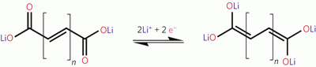

## Conjugated dicarboxylate anodes for Li-ion batteries 锂离子电池共轭二羧酸盐阳极

> M. Armand, S. Grugeon, H. Vezin, S. Laruelle, P. Ribière, P. Poizot & J.-M. Tarascon  
> Nature Materials volume 8, pages120–125(2009)  
> DOI: [10.1038/NMAT2372](https://doi.org/10.1038/NMAT2372)

### Abstract
Present Li-ion batteries for portable electronics are based on inorganic electrodes. For upcoming large-scale applications the notion of materials sustainability produced by materials made through eco-efficient processes, such as renewable organic electrodes, is crucial. We here report on two organic salts, Li2C8H4O4 (Li terephthalate) and Li2C6H4O4(Li trans–trans-muconate), with carboxylate groups conjugated within the molecular core, which are respectively capable of reacting with two and one extra Li per formula unit at potentials of 0.8 and 1.4 V, giving reversible capacities of 300 and 150 mA h g−1. The activity is maintained at 80 ℃ with polyethyleneoxide-based electrolytes. A noteworthy advantage of the Li2C8H4O4 and Li2C6H4O4 negative electrodes is their enhanced thermal stability over carbon electrodes in 1 M LiPF6 ethylene carbonate–dimethyl carbonate electrolytes, which should result in safer Li-ion cells. Moreover, as bio-inspired materials, both compounds are the metabolites of aromatic hydrocarbon oxidation, and terephthalic acid is available in abundance from the recycling of polyethylene terephthalate.  
当前用于便携式电子设备的锂离子电池基于无机电极。对于即将到来的大规模应用，由通过生态高效过程制成的材料（例如可再生有机电极）产生的材料可持续性的概念至关重要。我们在这里报告了两种有机盐，Li2C8H4O4（对苯二甲酸锂）和Li2C6H4O4（Li-反-粘康酸锂），在分子核内共轭有羧酸盐基团，它们分别能够与每个式单位的两个和一个额外的Li发生电势反应0.8和1.4 V，可逆容量分别为300和150 mA h g-1。用聚环氧乙烷基电解质将活性保持在80°C。1 M的LiPF6碳酸亚乙酯-碳酸二甲酯电解质中，Li2C8H4O4和Li2C6H4O4负极的一个值得注意的优势是，与的碳电极相比，具有更高的热稳定性，这将使锂离子电池更安全。此外，作为生物启发的材料，这两种化合物都是芳烃氧化的代谢产物，对苯二甲酸可从回收聚对苯二甲酸乙二醇酯中大量获得。

### Main
The industrial and scientific communities are nowadays buzzing1 with announcements from auto and battery manufacturers pledging to launch electric vehicles or plug-in hybrid fleets within a few years, often with government support or legislation. The focus is exclusively on lithium, and we shall witness a forking in technologies as the quest for ever higher energy densities for electronics is pursued at (almost) any price, but large batteries will be selected for their safety 2 and cost, with the aim of capacities ⩾100 W h kg−1.  
如今，工业界和科学界蜂拥而至1，汽车和电池制造商宣布将在几年之内推出电动汽车或插电式混合动力车队，这往往是在政府的支持或立法的推动下进行的。重点仅放在锂上，我们将见证技术的分叉，因为寻求以几乎（几乎）任何价格追求更高电子密度的电子产品，但出于安全性和成本的考虑，将选择大型电池2容量⩾100⩾Wh kg-1。

In the quest for materials with minimum footprint in nature and made through eco-efficient processes 3, our group recently revisited the use of organic ‘p’-doped conductive-polymer positive electrodes4,5,6 which made the headlines back in the 1980s, but sank into oblivion because of, amongst other things, low practical specific energy owing to the participation of the electrolyte anions in the material redox process. However, instead of considering ‘p’-doped polymers or polynitroxide material 7,8 electrodes, we investigated oxocarbons as candidates for lithium-inserting positive electrodes 9,10. As compared with the few recent reports on carbonyl-based organics 11,12, dilithium rhodizonate, Li2C6O6, turned out to reversibly intercalate four extra lithiums per unit formula at an average voltage of 2.5 V, leading to energy densities and power-rate performances that compare to conventional cathodes with the advantage of being fully sustainable as it is made from the oxidation of the sugar inositol.  
为了寻求自然界中占地最小的材料并通过生态高效的工艺3，我们小组最近重新考虑了使用有机'p'掺杂的导电聚合物正电极4、5、6，这在1980年代成为头条新闻，但是由于电解质阴离子参与材料的氧化还原过程而导致的实际比能低等原因使之沉没。但是，我们没有考虑使用“ p”掺杂的聚合物或聚氧氮化物材料的7,8电极，而是研究了碳氧化合物作为插入锂的正极9,10的候选材料。与最近关于基于羰基的有机物11,12的报道很少相比，重氮酸二锂Li2C6O6能够在平均电压为2.5 V的情况下可逆地插入每单位分子式中的四个额外的锂，从而产生了能量密度和功率比性能与传统阴极相比，它是由​​糖肌醇氧化制成的，因此具有完全可持续性的优势。

Considering the field of organics rich enough to also provide candidates for low-voltage redox activity, we decided to investigate systems containing weakly electron-withdrawing carboxylates rather than quinone/phenoxide bonds as redox centres, according to the simple scheme  
考虑到有机物领域足够丰富，还可以提供低电压氧化还原活性的候选者，我们决定根据简单方案研究包含弱吸电子羧酸盐而不是醌/酚盐键作为氧化还原中心的系统

  

For aromatic systems (next column right) it was deemed that the loss of resonance on the carboxylates and of aromaticity in the core molecule will bring this reaction to low potentials. For the simple vinylic compounds the n=0 and 1 members were inactive, but surveying further the family of conjugated carboxylates led us to select two of them, Li2C6H4O4 (trans–trans-muconate, later referred to as Li muconate) (n=2) and Li2C8H4O4 (terephthalate, later referred to as Li phthalate), with an aromatic core, which was found to show attractive performances versus Li+/Li0.  
对于芳族体系（右下栏），人们认为羧酸盐上的共振损失和核心分子中的芳香性损失将使该反应处于低电位。对于简单的乙烯基化合物，n = 0和1个成员是不活泼的，但是进一步研究共轭羧酸盐家族后，我们选择了其中的两个，Li2C6H4O4（反式-反式粘液，后来称为锂粘液）（n = 2 ）和具有芳族核的Li2C8H4O4（对苯二甲酸酯，后称邻苯二甲酸锂），发现与Li + /Li0相比表现出有吸引力的性能。

  

Both Li2C8H4O4 and Li2C6H4O4 phases, prepared through acid–base-type reactions using LiOH·H2O, are white powders with sizes ranging from 1 to 3 μm (Fig. 1, insets). The powders were anhydrous as deduced by infrared spectroscopy (no absorption band at about 3,000 cm−1 characteristic of water), and stable up to temperatures near 350 ℃ and 300 ℃ for Li2C8H4O4 and Li2C6H4O4, as deduced by thermogravimetric analysis, respectively. Moreover, both samples turn out to be single phases as deduced by X-ray diffraction (XRD) (Fig. 1) and more importantly by 13C and 1H nuclear magnetic resonance spectra (not shown here). The XRD corresponding to Li phthalate (Fig. 1a) was indexed in the space group P21/c as previously reported 13 with ‘standard’ lattice constants a=8.363(0) Å, b=5.135(1) Å, c=8.490, β=93.15(3)∘ and V =364.02(4) Å3. The Li cations are in tetrahedral coordination and the packing of the terephthalate anions resembles the γ-packing of aromatic hydrocarbons13. The Li-muconate phase is not reported, but using the same space group as above we could successfully refine the experimental XRD pattern (Fig. 1b) with the following lattice parameters: a=8.799(1) Å, b=10.041(1) Å, c=7.785(1) Å, β=114.51(4)∘ and V =625.84(9) Å3. Neutron diffraction is planned to determine the exact structure of the Li-muconate phase.  
通过LiOH·H2O的酸碱型反应制备的Li2C8H4O4和Li2C6H4O4相均为白色粉末，尺寸范围为1至3μm（图1，插图）。通过红外光谱法（在约3,000 cm-1的水特征处没有吸收带）推导，这些粉末是无水的，并且分别通过热重分析推导，Li2C8H4O4和Li2C6H4O4分别在高达350°C和300°C的温度下稳定。而且，通过X射线衍射（XRD）（图1），更重要的是通过13C和1H核磁共振谱（此处未显示）推论，两个样品均为单相。如先前报道，在邻苯二甲酸锂空间群P21 /c中，对应于邻苯二甲酸锂的XRD（图1a）13具有“标准”晶格常数a = 8.363（0）Å，b = 5.135（1）Å，c = 8.490， β＝ 93.15（3）∘，V ＝ 364.02（4）3。 Li阳离子处于四面体配位状态，对苯二甲酸酯阴离子的堆积类似于芳烃的γ堆积13。没有报告锂粘液相，但是使用与上述相同的空间组，我们可以使用以下晶格参数成功地完善实验XRD图谱（图1b）：a = 8.799（1）Å，b = 10.041（1） ，c ＝ 7.785（1），β＝ 114.51（4）∘，V ＝ 625.84（9）3。计划中子衍射以确定锂粘液相的确切结构。

Figure 1: XRD of Li2C8H4O4 and Li2C6H4O4.  
  
a,b, Experimental X-ray powder diffraction pattern (dotted curve) compared with the Rietveld- refined profile (full line) and the difference curves for Li2C8H4O4 (a) and Li2C6H4O4 (b) as prepared (see text). For each sample, the lattice parameters were determined by a Rietveld refinement in the P21/c space group. The corresponding scanning electron micrographs for each sample are reported (insets). Featureless particles with sizes ranging from 1 to 3 μm are observed.  
a，b，与准备好的Rietveld轮廓（实线）和Li2C8H4O4（a）和Li2C6H4O4（b）的差异曲线相比，实验X射线粉末衍射图（点线）（见正文）。对于每个样品，晶格参数由P21 /c空间组中的Rietveld细化确定。报告（插入）每个样品的相应扫描电子显微照片。观察到大小范围为1至3μm的无特征颗粒。

The electrochemical performances of our materials were tested versus lithium after ball-milling with 30% w/w carbon black (SP) for 10 min. Figure 2a,b shows voltage–composition traces for Li2+xC6H4O4/Li and Li2+xC8H4O4/Li cells cycled at a rate of one lithium in 10 h, between 1.2 and 2.5 V and 0.7 and 3 V, respectively. For both cells, the potential initially drops sharply to reach a plateau. This plateau is located near 1.4 V and has an overall uptake capacity of 1.2 Li per unit formula for the Li2+xC6H4O4/Li cell. In contrast, for the Li2+xC8H4O4/Li cell, the plateau is located at a lower value (0.8 V) and has twice the overall uptake capacity (2.3 Li per unit formula). During the following recharge, for both electrodes the charge voltage nicely traces back the discharge one with a small polarization (100–200 mV). This indicates a reversible Li uptake with an irreversible capacity between the first charge and discharge that does not exceed at worst 30%. The Li2+xC8H4O4/Li and Li2+xC6H4O4/Li cells show reversible capacities of about 300 mA h g−1 (Fig. 2b, inset) and 170 mA h g−1 (Fig. 2a, inset), which slowly decay to values of about 234 and 125 mA h g−1 after 50 and 80 cycles, respectively. Among the common reasons for such fading are structural/textural/morphological material changes on cycling or material solubility issues pertaining to the non-optimized electrolyte that we have been using, although we did not observe any discoloration on dismantling the cell. Additionally, in terms of rate capability, 70% of the Li2+xC8H4O4 electrode capacity (240 mA h g−1) was found to be still accessible at a rate of 1 C, with C being defined as the initial full capacity obtained in 1 h. Last, we should mention that we succeeded in cycling both materials at 80 ℃ in polyethyleneoxide-based electrolytes with similar results, implying satisfactory thermal stability in pristine and reduced states.  
用30％w /w的炭黑（SP）球磨10分钟后，我们的材料的电化学性能与锂相比进行了测试。图2a，b显示了Li2 + xC6H4O4 /Li和Li2 + xC8H4O4 /Li电池的电压组成曲线，在10 h内循环的速率，分别在1.2 和2.5V和0.7 和3V之间。对于两个电池，电势最初都急剧下降以达到平稳状态。该平台位于1.4 V附近，对于Li2+xC6H4O4 /Li电池，每单位配方的总吸收容量为1.2 Li。相比之下，对于Li2+xC8H4O4 /Li电池，平台处于较低值（0.8 V），具有两倍的总吸收容量（每单位配方2.3 Li）。在随后的充电过程中，对于两个电极，充电电压都以极小的极化（100–200 mV）很好地追溯到放电电极。这表明锂的可逆吸收量在第一次充放电之间不可逆转，最坏情况下不超过30％。 Li2 + xC8H4O4 /Li和Li2 + xC6H4O4 /Li电池显示的可逆容量约为300 mA h g-1（图2b，插图）和170 mA h g-1（图2a，插图），其缓慢衰减至经过50和80次循环后，其值分别约为234和125 mA h g-1。这种褪色的常见原因是循环中的结构/结构/形态材料变化或与我们一直在使用的非优化电解质有关的材料溶解性问题，尽管我们在拆卸电池时未观察到任何变色现象。此外，就倍率能力而言，发现仍可以以1 C的速率访问Li2 + xC8H4O4电极容量（240 mA h g-1）的70％，其中C定义为1h中获得的初始满容量。最后，应该提到的是，我们成功地将两种材料在80°C的聚环氧乙烷基电解质中循环使用，结果相似，这表明在原始状态和还原状态下均具有令人满意的热稳定性。

Figure 2: Potential–composition profile for Li2C6H4O4 and Li2C8H4O4, galvanostatically cycled at a rate of 1 Li+/10 h versus Li0.  
  
a, Li2C6H4O4; b, Li2C8H4O4. Insets: Corresponding capacity-retention curves. Electrode loadings range from 8 to 10 mg cm−2. The larger irreversible capacity for the Li2C8H4O4 electrode (25–30%) as compared to Li2C6H4O4 is mainly rooted in the use of the carbon SP additive, which after being milled for 10 min presents a large irreversible capacity (180 mA h per g carbon) when cycled below 1 V.  
a，Li2C6H4O4；b，Li2C8H4O4。插图：相应的容量保留曲线。电极负载范围为8至10 mg cm-2。与Li2C6H4O4相比，Li2C8H4O4电极具有更大的不可逆容量（25–30％），主要是由于使用了碳SP添加剂，当循环低于1 V时，将其研磨10 min后具有很大的不可逆容量（每克碳180 mA h）。

To grasp further insights into this issue, we have monitored the material evolution on cycling by monitoring both the ex situ XRD and infrared evolution between the as-made, fully discharged and fully recharged materials for both materials (Figs 3 and 4). The discharged and recharged samples were recovered from the cycled cells. On Li uptake the XRD diffraction patterns of the Li2+xC8H4O4 electrode are strongly modified, with the disappearance of Bragg peaks (Fig. 3c) near 2ΘCu Kα=23∘ and 30∘ and the appearance of new ones near 2ΘCu Kα=25.5∘,27∘ and 32∘, whereas the peak at 22∘ is invariant. Strikingly, despite such drastic changes, the fully recharged material shows an XRD pattern that nicely superimposes on the pristine material, unambiguously indicating a fully reversible process. Such reversibility is further emphasized by the complementary infrared ex situ measurements, as the infrared spectra of the as-made and fully recharged samples are identical (Fig. 3b). Turning to the Li2+xC6H4O4 electrode, infrared spectra superimpose for the charged and discharged samples, again confirming a reversible process (Fig. 4b). The XRD data are, in contrast, less decisive, as the poorly crystallized as-made sample (Fig. 4c) becomes amorphous on the first discharge, and remains so on cycling. The phenyl group, present only in Li phthalate, is most likely at the origin of such a difference. With the likely π–π interactions, a stronger three-dimensional crystal packing is expected for such molecules as opposed to the linear conjugated muconic molecule. On this basis, the progressive amorphization of the three-dimensional crystal structure noted for the muconate phase on Li uptake does not come as a surprise. In contrast, for the phthalic phase, the π–π interactions maintain the stacking, with therefore the possibility for the extra Li to affect this interaction, which could lead to some subtle gliding or rotation of the phenyl groups versus one another, and to the modification of the XRD powder patterns, as we observed. For Li muconate, the loss of order revealed by XRD (Fig. 4c) data is not inconsistent with the reversibility detected by infrared measurements, as such a technique senses mainly the bond-stretching vibration modes within a single molecule.  
为了掌握有关此问题的更多见解，我们通过监视两种材料的原位，完全放电和完全充电材料之间的非原位XRD和红外演变来监视循环过程中的材料演变（图3和4）。从循环的电池中回收放电和再充电的样品。吸收锂后，Li2 + xC8H4O4电极的XRD衍射图发生了强烈变化，在2θCuKα= 23°和30°附近布拉格峰消失（图3c），在2θCuKα= 25.5°附近出现了新的衍射峰， 27∘和32∘，而22∘的峰值不变。令人惊讶的是，尽管发生了如此剧烈的变化，但完全充电的物料仍显示出XRD图案，该图案很好地叠加在原始物料上，明确表示完全可逆的过程。互补的红外非原位测量进一步强调了这种可逆性，因为制成的样品和完全充电的样品的红外光谱相同（图3b）。转向Li2 + xC6H4O4电极，红外光谱叠加到已充电和已放电的样品上，再次确认了可逆过程（图4b）。相比之下，XRD数据的决定性较小，因为结晶不良的制成样品（图4c）在第一次放电时变为非晶态，并在循环中保持不变。仅存在于邻苯二甲酸锂中的苯基最有可能是这种差异的起因。与可能的π-π相互作用，与线性共轭粘康分子相反，此类分子有望具有更强的三维晶体堆积。在此基础上，注意到粘液相对Li的吸收引起的三维晶体结构的逐步非晶化不足为奇。相反，对于邻苯二甲酸相，π-π相互作用保持了堆积，因此多余的Li可能会影响这种相互作用，这可能导致苯基彼此之间发生一些微妙的滑动或旋转，并导致我们观察到的XRD粉末图案的修饰。对于粘液酸锂，XRD（图4c）数据揭示的有序损失与红外测量检测到的可逆性并不矛盾，因为这种技术主要检测单个分子内的键拉伸振动模式。

Figure 3: Material evolution on cycling for Li2C8H4O4.  
  
a–d, Complementary room-temperature infrared (b), in situ XRD (c) and electron paramagnetic resonance (EPR) measurements (d) showing the reversibility of the Li insertion/de-insertion process in Li2C8H4O4 as shown by the potential–composition curve (a) obtained at a C/20 rate. For reasons of clarity, the data have been solely reported for the as-made (red circle), fully discharged (blue circle) and fully recharged (green circle) samples. This colour code is kept in the infrared, XRD and EPR traces in b, c and d, respectively; the reversibility of the Li redox mechanism is evident regardless of the technique used. Please note that for the EPR data (d) we have taken an additional spectrum at x=3 (black trace).  
a–d，补充室温红外（b），原位XRD（c）和电子顺磁共振（EPR）测量（d），显示Li2C8H4O4中Li插入/去插入过程的可逆性，如电位-以C /20速率获得的组成曲线（a）。为了清楚起见，仅报告了原样（红色圆圈），完全放电（蓝色圆圈）和完全充电（绿色圆圈）样品的数据。该颜色代码分别保留在b，c和d的红外，XRD和EPR迹线中；无论使用哪种技术，锂氧化还原机理的可逆性都是显而易见的。请注意，对于EPR数据（d），我们在x = 3（黑色迹线）处获得了一个附加光谱。

Figure 4: Material evolution on cycling for Li2C6H4O4.  
  
a–d, Complementary room-temperature infrared (b), in situ XRD (c) and EPR measurements (d) showing the reversibility of the Li insertion/de-insertion process in Li2C6H4O4 as shown by the potential–composition curve (a) obtained at a C/10 rate. Similarly to Fig. 3, we have chosen red, blue and green circles to refer to the as-made, fully discharged and fully charged electrode materials, respectively. Following the same colour code for infrared, XRD and EPR traces in b, c and d, respectively, the reversibility of the Li redox mechanism regardless of the technique used is apparent. The inset to d shows the pseudo-modulated echo field-sweep spectrum of the discharged material.  
a–d，室温互补红外（b），原位XRD（c）和EPR测量（d），显示Li2C6H4O4中Li插入/去插入过程的可逆性，如电位-组成曲线（a）所示以C /10速率获得。与图3相似，我们选择红色，蓝色和绿色圆圈分别表示已制成的，完全放电和完全充电的电极材料。分别针对b，c和d中的红外线，XRD和EPR迹线使用相同的颜色代码，无论使用哪种技术，Li氧化还原机理的可逆性都是显而易见的。 d的插图显示了排出物料的伪调制回波场扫描光谱。

To further probe the reversibility of this process and get deeper insight into the Li reactivity mechanism, we decided to make EPR measurements, which is a powerful analytical tool to look for electronic states with non-zero spin values, at 9 GHz. All EPR measurements were made at room temperature using a Bruker ELEXYS E580 pulsed EPR spectrometer, and the data will first be presented for the Li muconate (Fig. 4d). No EPR spectrum can be measured on the starting molecule owing to the even number of electrons. The insertion of one Li into this compound on cell discharge leads to the onset of a strong isotropic EPR signal (g=2) with 13 G Gaussian shape linewidth indicating an unsolved hyperfine interaction. Using an echo-detection-pulse-scheme method, the 7Li hyperfine coupling was resolved into four EPR lines (Fig. 4d, inset) with a coupling value of 6.9 G, in very close agreement with the value of 7.4 G calculated by the density functional theory method. On Li removal (that is, charging the sample), the signal corresponding to the formation of a radical disappears, further confirming the reversibility of the Li insertion–de-insertion mechanism.  
为了进一步探查此过程的可逆性并更深入地了解Li反应机理，我们决定进行EPR测量，这是一种功能强大的分析工具，可用于寻找9 GHz频率下非零自旋值的电子状态。所有EPR测量均使用Bruker ELEXYS E580脉冲EPR光谱仪在室温下进行，首先将显示粘液酸锂的数据（图4d）。由于电子的偶数，无法在起始分子上测量EPR光谱。在电池放电时向该化合物中插入一个Li会导致一个强的各向同性EPR信号（g = 2）的出现，其13 shapeG高斯形状的线宽表示未解决的超精细相互作用。使用回波检测脉冲方案方法，将7Li超精细耦合分解为4个EPR线（图4d，插图），耦合值为6.9 G，与通过密度计算的7.4 G值非常接近功能理论方法。除去锂（即给样品充电）后，与自由基形成相对应的信号消失，进一步证实了锂插入-去插入机制的可逆性。

The same appearance–disappearance of the EPR signal on Li acceptance and removal can also be observed with Li phthalate. The EPR spectra evolution on Li insertion–de-insertion is more complex (Fig. 3d) as compared with the Li-muconate molecule. As expected, the electrochemical insertion of 1.2 Li (that is, x≈1 owing to irreversible losses) leads to a signal centred at a value of the Landé g factor of 2 (the g factor connects the magnetic moment to the kinetic moment of a quantum state) with a linewidth of 2.8 G and a Lorentzian shape, but to our surprise a strong EPR signal, also with a Lorentzian line shape of 2.3 G linewidth, still remains after the insertion of the second Li (that is, 2e−). With two electrons added, the ‘Li4C8H4O4’ species should normally be diamagnetic (that is, EPR silent). This suggests that the compound is in a triplet ground state, that is, a di-radical, and has an S=1 ground-state spin value. At this point, it should be recalled that the first evidence for di-radical di-cation species comes from Bechgaard’s study23 of the two-electron oxidation of hexamethoxytriphenylene by EPR, back in 1972. In this case, the authors analysed their EPR signal enlisting three peaks (one central due to the doublet state and two to the S=1 triplet state separated by a dipolar term) in terms of zero-field-splitting parameters. As no dipolar terms were measured in our Li4C8H4O4 compound, showing only one single EPR peak, another scenario enlisting two electrons that can interact through a Heisenberg spin-exchange mechanism (Hexch=−2J1–2S1S2) was satisfactorily considered. (Hexch is the Hamiltonian term of Heisenberg exchange interaction between two electrons denoted S1 and S2, and J1–2 represents the energetic magnitude of this interaction). This mechanism was experimentally confirmed by the low-temperature behaviour of the EPR signal, which decreases on reducing the temperature. This phenomenon arises from an antiferromagnetic coupling between the two electrons, with an exchange constant J value of −0.16 cm−1 as determined using broken-symmetry formalism. Additionally, from density functional theory calculation we succeeded in determining the energy cost to reach the fully lithiated muconate and phthalate phases and found values of 27 kcal mol−1 and of 22 kcal mol−1 per mole of inserted lithium, respectively. To better understand the electrochemically driven electron injection mechanism, a study of the electroactivity of the conjugated dicarboxylates in solution is currently being conducted. Although beyond the scope of this paper, the positive results obtained under the stringent conditions required to solubilize the aforementioned lithium carboxylates in aprotic solvents (for example, use of cryptate complexing agents) suggest that the EPR of [carboxylates]n− created species could be scrutinized in situ in solution phase.  
用邻苯二甲酸锂也可以观察到EPR信号在接受和除去Li时的外观相同。与锂粘液分子相比，Li插入-去插入后的EPR光谱演化更加复杂（图3d）。如所预期的，1.2 Li的电化学插入（由于不可逆的损耗，x≈1）导致信号以Landég因子2的值为中心（g因子将磁矩与a的动量联系起来）。量子态）的线宽为2.8 G且具有洛伦兹形状，但令人惊讶的是，在插入第二个Li（即2e−）之后，仍然具有很强的EPR信号，以及线宽为2.3 G的洛伦兹线形状。添加两个电子后，“ Li4C8H4O4”物质通常应该是反磁性的（也就是说，EPR无声）。这表明该化合物处于三重态基态，即双自由基，并且具有S ＝ 1的基态自旋值。在这一点上，应该回想一下，自由基自由基阳离子的第一个证据来自Bechgaard于1972年对EPR对六甲氧基三苯撑进行两电子氧化的研究。在这种情况下，作者分析了他们的EPR信号吸收根据零场分裂参数，三个峰（一个峰因双峰态而中心，两个S = 1三峰态由偶极项分隔）。由于在我们的Li4C8H4O4化合物中未测量到偶极项，仅显示了一个EPR峰，因此可以令人满意地考虑了另一种场景，其中涉及两个可以通过Heisenberg自旋交换机制相互作用的电子（Hexch = -2J1-2S1S2）。 （Hexch是两个电子之间的海森堡交换相互作用的汉密尔顿术语，用S1和S2表示，J1-2表示该相互作用的能级）。 EPR信号的低温行为通过实验证实了这一机理，EPR信号的低温行为随着温度的降低而降低。这种现象是由两个电子之间的反铁磁耦合引起的，其交换常数J值为-0.16 cm-1，这是使用破对称形式表示的。此外，根据密度泛函理论计算，我们成功确定了达到完全锂化的粘康酸酯和邻苯二甲酸酯相所需的能源成本，并发现每摩尔插入的锂分别具有27 kcal mol-1和22 kcal mol-1的值。为了更好地理解电化学驱动的电子注入机理，目前正在对溶液中共轭二羧酸酯的电活性进行研究。尽管超出了本文的范围，但在将上述羧酸锂溶解在非质子溶剂中所需的严格条件下（例如，使用加密络合剂）获得的积极结果表明，[羧酸盐] n-生成的物质的EPR可能为在溶液阶段原位检查。

As safety becomes paramount, a figure of merit of negative-electrode materials is the magnitude of energy liberated by the reaction between the lithiated negative electrode and the electrolyte at high temperature. The most elegant way of probing this stability is to make DSC measurements in the presence of electrolyte. The following protocol has been adopted. Four Li half cells with Lix/C6,Li/Li2+xC8H4O4, Li/Li2+xC6H4O4 and Li/Li4+xTi5O12 were assembled and fully discharged at x=1 (LiC6), x=2.3 (Li4.3C8H4O4), x=1.2 (Li3.2C6H4O4) and x=3 (Li7Ti5O12). The cells were opened and the powders directly recovered, without any washing, before being sealed in Al pans. The Al pans were then removed from the dry box and their covers pierced under Ar flow before being placed on the DSC apparatus also flushed with Ar, of which the temperature was raised to 350 ℃ at a rate of 10℃ min−1. Comparative studies were made with Li1C6 (refs 14,15) and Li7Ti5O12 (ref. 16) negative electrodes, because the former is currently the most used in Li-ion cells and shows roughly the same specific gravity (≈2 g cm−3) as the phthalate salt. In contrast, the latter is currently the most popular alternative negative electrode, though it has a lower capacity of 150 mA h g−1, only partially compensated by a density of ≈3.6, and further penalized by a redox voltage of 1.5 V. Drastic differences were noted between the samples in terms of reactivity with the electrolyte (Fig. 5). As far as these reactions are considered for the new candidates, that of the fully lithiated Li4C8H4O4 phase was only one-third as exothermic as the LiC6 electrode, which shows considerable reactivity over the 150–180 ℃ temperature range, in agreement with previous literature reports 14,15. Such a result in itself is of tremendous importance with respect to the safety of the Li-ion technology, as it simply implies that negative electrodes based on the 0.8 V Li2C8H4O4 phase should lead to safer Li-ion cells than those using carbon electrodes. Just as spectacular is the quasi-absence of exothermic reaction for our 1.4 V Li2C6H4O4 electrode (Fig. 5) as compared with a 1.5 V Li4Ti5O12 electrode, which shows some reactivity despite its acceptance as the archetype to design safe Li-ion cells. Another aspect is the possibility, for electrodes based on these two materials, to use Al current collectors, with a weight gain and far more sustainability and economic advantages over Cu, whose use is mandatory for graphite electrodes.  
随着安全性变得至为重要，负极材料的品质因数是在高温下锂化负极与电解质之间的反应所释放的能量的大小。探测这种稳定性的最优雅的方法是在存在电解质的情况下进行DSC测量。已采用以下协议。组装了四个具有Lix/C6，Li/Li2+xC8H4O4，Li/Li2+xC6H4O4和Li/Li4+xTi5O12的Li半电池，并在x=1（LiC6），x=2.3（Li4.3C8H4O4），x=1.2（Li3.2C6H4O4）和x=3（Li7Ti5O12）。打开小室并直接将粉末回收，无需任何洗涤，然后将其密封在铝锅中。然后将铝锅从干燥箱中取出，并在Ar流下刺穿铝锅，然后将其放在也用Ar冲洗过的DSC设备上，以10℃min-1的速率将其温度升至350℃。使用Li1C6（参考文献14,15）和Li7Ti5O12（参考文献16）负极进行了比较研究，因为前者目前是锂离子电池中使用最多的负极，并且显示出大致相同的比重（≈2g cm-3）。作为邻苯二甲酸盐。相比之下，后者是目前最受欢迎的替代负极，尽管它的容量较低，仅为150 mA h g-1，只能部分地被≈3.6的密度补偿，并受到1.5 V的氧化还原电压的不利影响。在样品之间与电解质的反应性方面存在差异（图5）。就考虑将这些反应用于新的候选物而言，完全锂化的Li4C8H4O4相的放热仅为LiC6电极的三分之一，放热在150–180℃的温度范围内显示出可观的反应性，与先前的文献一致报告14,15。就锂离子技术的安全性而言，这样的结果本身具有极其重要的意义，因为它仅暗示基于0.8 V Li2C8H4O4相的负极应比使用碳电极的负极产生更安全的锂离子电池。与1.5 V Li4Ti5O12电极相比，我们的1.4 V Li2C6H4O4电极几乎没有放热反应（图5）同样壮观，尽管它已被接受作为设计安全锂离子电池的原型，但仍显示出一定的反应性。另一个方面是，基于这两种材料的电极有可能使用铝集电器，与铜相比，铝集电器的重量增加并且具有更大的可持续性和经济优势，而铜对于石墨电极是必不可少的。

Figure 5: Differential scanning calorimetry (DSC) measurements in the presence of electrolyte.  
  
The DSC traces for fully lithiated LiC6, Li4.3C8O4H4, Li3.2C6O4H4 and Li7Ti5O12 electrodes with discharge capacities of 372, 300, 150 and 175 mA h g−1, respectively. The experiments were carried out in sealed, then pierced, Al pans (see the text) with a temperature ramp of 10 ℃ min−1. As we are working under constant pressure here, the integration of the heat flow (W g−1) signal as a function of time gives us access to the values of variations in enthalpy of reaction (ΔH, J g−1). For the Li4+xTi5O12 and Li2+xC6H4O4 samples, there is a possibility of an extra endothermic phenomenon, which is responsible for the valley between the two exothermic peaks. Such an extra phenomenon introduces some inaccuracy in the determination of the measured heat values owing to difficulties in taking an appropriate baseline. Last, it should be emphasized that the same trend was obtained regardless of whether the Al cover was pierced or not.  
完全锂化的LiC6，Li4.3C8O4H4，Li3.2C6O4H4和Li7Ti5O12电极的DSC迹线分别具有372、300、150和175 mA h g-1的放电容量。实验在密封，然后刺穿的铝锅中进行（参见文本），温度梯度为10 rampC min-1。当我们在恒定压力下工作时，热流（W g-1）信号作为时间的函数的积分使我们可以访问反应焓的变化值（ΔH，J g-1）。对于Li4 + xTi5O12和Li2 + xC6H4O4样品，可能会发生额外的吸热现象，这是两个放热峰之间的谷值的原因。由于难以采用适当的基线，这种额外的现象在确定测得的热值方面引入了一些误差。最后，应该强调的是，不管是否覆盖了铝盖，都获得了相同的趋势。

At this juncture, we should recall that Li4Ti5O12, which is at the borderline to have a solid electrolyte interface, shows excellent cycling performance. However, this advantage comes with a huge energy-density penalty, as the redox potential of Li4Ti5O12 is 1.55 V. Thus the search for negative electrodes capable of closing the gap between the present 0.1–0.3 V carbonaceous electrodes and the 1.5 V Li4Ti5O12 electrodes has been very intensive. This was carried out in the hope of finding a negative electrode material with a redox voltage of about 1 V, just above the formation potential of most solid electrolyte interface layers in carbonate electrolytes17,18,19. The present finding positively answers such a demand, as we report a negative-electrode material with a 0.8 V redox potential versus Li/Li+. Needless to say, extensive study remains to be done to determine the nature of the interfaces between electrolytes and these new organic electrodes.  
在此关头，我们应该回想起处于固态电解质界面临界点的Li4Ti5O12表现出出色的循环性能。然而，这种优势带来了巨大的能量密度损失，因为Li4Ti5O12的氧化还原电势为1.55 V，因此寻找能够弥合目前0.1-0.3 V碳质电极和1.5 V Li4Ti5O12电极之间间隙的负电极具有非常密集。这样做是为了找到一种氧化还原电压约为1 ofV的负极材料，该材料刚好高于碳酸盐电解质中大多数固体电解质界面层的形成电位17、18、19。目前的发现可以很好地满足这种需求，因为我们报道了一种负极材料，其氧化还原电位为0.8 V（相对于Li /Li +）。不用说，要确定电解质与这些新的有机电极之间的界面性质，仍需进行大量研究。

An important question remains as to why the muconic acid reacts with solely one Li where we could naively expect to have a two-electron reaction on the basis of the bis(gem-diolate) formula. A possible answer can result from a few separate experiments exploring the electrochemical reactivity of the first member (n=1) of the conjugated carboxylate series, Li fumarate, Li2C2H2O4. No activity was found, most likely because the two negative carboxylate charges are too close, preventing an extra electron from being injected within the structure. The importance of the π–π orbital delocalization (maximum for planar systems) was further demonstrated by preparing the homologue (2,5-dimethyl-2,4-hexadienedioic acid) of muconic acid, which introduces, with the steric hindrance of the methyl groups, a twist of the molecule backbone. The expected partial loss of π-orbital overlap (that is, loss of delocalization) associated with this twist is consistent with the poor observed electrochemical activity of this derivative. Within this line of thinking we are currently studying conjugated carboxylates LiO2C(CH=CH)nCO2Li, where the double bonds are part of a more extensive ‘π’ system such as n=3 (yellow compound) or n=4 (red compound). Concerning Li phthalate, although we are already inserting two lithiums as expected, an interesting fundamental challenge remains, namely the effect of attaching more phenyl groups, as chains or fused rings, to know when graphene-like behaviour (for example, LiC6) takes over or adds to carboxylate in terms of electrochemical activity. Obviously, a huge amount of work remains to be done both at the fundamental level on the basis of theoretical calculations and at the applied level, where electrode formulations on the basis of Li phthalate and Li muconate have to be optimized, including the amount of carbon needed to electronically address the materials.  
关于粘康酸为什么只与一个Li反应的问题，仍然存在一个重要的问题，在这个问题上，我们可以天真地期望基于双（羟甲酸酯）分子式进行两电子反应。一个可能的答案可能来自几个单独的实验，这些实验探索了共轭羧酸酯系列的第一部分（富马酸锂，Li2C2H2O4）的电化学反应性。没有发现活性，这很可能是因为两个负羧酸盐电荷太接近，从而阻止了多余的电子注入结构中。通过制备粘康酸的同系物（2,5-二甲基-2,4-己二烯二酸），进一步介绍了π-π轨道离域的重要性（对于平面系统而言最大），这引入了甲基的空间位阻基团，分子主链的扭曲。与这种扭曲相关的预期的π轨道交叠部分损失（即，离域损失）与该衍生物不良的电化学活性相一致。在这种思路下，我们目前正在研究共轭羧酸盐LiO2C（CH = CH）nCO2Li，其中双键是更广泛的'π'系统的一部分，例如n = 3（黄色化合物）或n = 4（红色化合物） 。关于邻苯二甲酸锂，尽管我们已经按预期插入了两个锂，但仍然存在一个有趣的基本挑战，即连接更多苯基（如链或稠环）以了解石墨烯样行为（例如LiC6）何时接管的效果。或就电化学活性而言加成羧酸盐。显然，在理论计算的基础水平和应用水平上，仍需进行大量工作，其中必须优化基于邻苯二甲酸锂和粘康酸锂的电极配方，包括碳含量。电子处理材料所需的信息。

The conjugated carboxylate family offers numerous chemical options to further adjust the redox potential and the capacity. With this work, we hope to have conveyed further the message that the field of organics provides numerous opportunities to design negative electrodes with suitable redox potential versus Li+/Li0, presenting limited reactivity with the electrolyte in their discharged state and further enabling the use of Al current collectors. As sustainable material, muconic acid is the product of benzene oxidative ring opening by living organisms, and is the main metabolite of this hydrocarbon. Similarly, the oxidative metabolism of p-xylene results in quantitative formation of terephthalic acid, but the most obvious resource comes from recycling ubiquitous polyethylene terephthalate plastic (35×106 T yr−1).  
共轭羧酸酯家族提供了许多化学选择，以进一步调节氧化还原电势和容量。通过这项工作，我们希望进一步传达出这样的信息，即有机物领域为设计具有相对于Li + /Li0的合适的氧化还原电势的负极提供了许多机会，从而在放电状态下与电解质的反应性有限，并进一步允许使用Al集电器。作为可持续材料，粘康酸是活生物体苯氧化开环的产物，并且是该烃的主要代谢产物。同样，对二甲苯的氧化代谢导致对苯二甲酸的定量形成，但最明显的资源来自回收普遍存在的聚对苯二甲酸乙二醇酯塑料（35×106 T yr-1）。

### Methods
#### Sample synthesis.
Both Li2C8H4O4 and Li2C6H4O4 phases were prepared by reacting in ethanol (a medium in which the di-salts are poorly soluble) for 24 h the corresponding terephthalic and muconic acids C8H6O4 and C6H6O4 (Aldrich or Alfa, 98%) with LiOH·H2O powders in 5% excess (Fluka; 99%). The milky suspensions were centrifuged and thrice washed with ethanol then dried at 150 ℃ under primary vacuum. Ethanol–water medium was equally successful, but in that case coarser grains were obtained owing to higher solubility. Similarly, Li2CO3 rather than LiOH·H2O can also be used to produce dicarboxylates with different grain sizes.  
Li2C8H4O4和Li2C6H4O4相均通过在乙醇（一种难溶解二盐的介质）中与相应的对苯二甲酸和粘康酸C8H6O4和C6H6O4（Aldrich或Alfa，98％）与过量5％的LiOH·H2O粉末（Fluka; 99％）反应24h制备。将乳状悬浮液离心并用乙醇洗涤三次，然后在150℃下在初级真空下干燥。乙醇-水介质同样成功，但是在这种情况下，由于溶解度较高，因此可以得到较粗的颗粒。同样，也可以使用Li2CO3代替LiOH·H2O来生产具有不同粒径的二羧酸盐。

#### Sample characterization.
X-ray powder diffraction patterns of the dicarboxylates were collected on a Bruker D8 diffractometer using Cu Kα radiation, equipped with a Gobel mirror and a Braun PSD detector and operating at 40 kV–30 mA in the range 2θCu Kα=10∘–100∘ with a 2θ step size of 0.017∘. Profile matching was carried out with the program FullProf 20 (Windows version, March 2007) using the pseudo-Voigt profile function of ref. 21. To prevent air/moisture reactions, the lithiated samples were always handled in an argon dry box, and placed in a hermetically sealed, home-designed, in situ X-ray cell for structural characterization.  
二羧酸盐的X射线粉末衍射图样是在使用CuKα辐射，配备Gobel镜和Braun PSD检测器并在2θCuKα= 10∘–100∘范围内以40 kV–30 mA进行工作的Bruker D8衍射仪上收集的2θ步长为0.017∘。使用ref的伪Voigt配置文件功能，使用程序FullProf 20（Windows版本，2007年3月）执行配置文件匹配。 21.为防止空气/水分反应，锂化样品始终在氩气干燥箱中处理，并置于密封的，自行设计的原位X射线电池中，以进行结构表征。

Morphology of the powders was observed by scanning electron microscopy using a QUANTA 200 F (FEI) with a resolution of about 1 nm.  
通过使用QUANTA 200 F（FEI）的扫描电子显微镜观察粉末的形貌，分辨率约为1 nm。

Transmission infrared spectra were recorded on a Nicolet Fourier transform infrared Avatar 370 DTGS spectrometer working in the 4,000–400 cm−1 spectrum range. Because of their extreme sensitivity to air, cycled product-based KBr pellets prepared in an Ar glove-box were placed inside a SPECAC hermetic cell closed by two KBr windows, and flushed with argon.  
透射红外光谱记录在Nicolet傅立叶变换红外Avatar 370 DTGS光谱仪上，其光谱范围为4,000–400 cm-1。由于其对空气的极度敏感性，因此将在Ar手套箱中制备的循环产物基KBr粒料放置在由两个KBr窗口关闭的SPECAC密封室内，并用氩气冲洗。

The lithiated materials were analysed by DSC measurements with a Netzsch STA 449C Jupiter instrument using Al pans and a heating rate of 5 ℃ min−1. The Al cover was pierced under Ar flow. The ΔH were deduced by simple area calculations.  
用Netzsch STA 449C Jupiter仪器通过铝锅和5 and℃min-1的加热速率通过DSC测量分析锂化材料。在氩气流下刺穿了铝盖。 ΔH通过简单的面积计算得出。

The EPR spectra of the compounds were recorded at room temperature with an ELEXYS E580E X band spectrometer with an amplitude modulation of 0.8 G and microwave power of 1 mW. Two-pulse field-sweep experiments were achieved with the basic sequence (π/2–τ–π)–echo at room temperature with 200 ns gate width to ensure complete echo detection. The spectra were then pseudo-modulated at 3 G to recover the CW spectra to determine the g factor and hyperfine splitting coupling.  
使用ELEXYS E580E X谱仪在室温下记录化合物的EPR光谱，其振幅调制为0.8 G，微波功率为1 mW。在室温下以200 ns的门宽对基本序列（π/2–τ–π）–回波进行了两脉冲场扫描实验，以确保完整的回波检测。然后在3 pseudoG下对光谱进行伪调制以恢复CW光谱，以确定g因子和超精细分裂耦合。

#### Electrochemical tests
Electrochemical tests versus Li were done in Swagelok-type cells. The cells were assembled in an argon-filled glove box, using a Li metal disc as the negative electrode and a Whatman GF/D borosilicate glass fibre sheet saturated with 1 M LiPF6 in ethylene carbonate–dimethyl carbonate (1:1 w/w) as the electrolyte. The working electrodes were typically made by ball milling powders of Li2C6O4H4 and Li2C8O4H4 with 30% in mass of carbon black (SP) for 10 min. Usually, 10–12 mg of the mixed powders were used per cell. The mechanical mixing was carried out under argon atmosphere using a Retsch PM100 mixer-mill. The 25 ml stainless-steel milling container was filled with 10 mm stainless-steel balls and the mass of powder treated at a time was 100 mg (the ball-to-powder weight ratio was 120). Galvanostatic charge–discharge tests were conducted at 20 ℃ using a ‘Mac-Pile’ or a VMP system (Biologic S.A., Claix, France) operating in galvanostatic mode. Unless otherwise specified, the cells were typically cycled between 3 and 0.7 V versus Li+/Li0 at 1 Li+ exchanged per 10 h. The rate capability aptitude of the carboxylate-based electrodes was defined using a ‘signature curve’ with the same protocol as reported in ref. 9.  
在世伟洛克型电池中进行了与Li的电化学测试。将电池组装在一个充满氩气的手套箱中，使用锂金属圆片作为负极，并用在碳酸亚乙酯-碳酸二甲酯（1：1 w /w）中饱和了1 M LiPF6作为电解质的Whatman GF/D硼硅酸盐玻璃纤维板进行组装。工作电极通常通过球磨Li2C6O4H4和Li2C8O4H4与质量百分比为30％的炭黑（SP）的粉末制成10分钟。通常每个细胞使用10-12mg的混合粉末。使用Retsch PM100混合机在氩气气氛下进行机械混合。在25毫升的不锈钢制粉容器中装入10毫米的不锈钢球，一次处理的粉末质量为100毫克（球粉比为120）。恒电流充放电测试是在20℃下使用“恒流”模式下运行的“ Mac-Pile”或VMP系统（Biologic S.A.，法国Claix）进行的。除非另有说明，否则每10 3h交换1个Li +时，电池通常在3〜0.7 V之间与Li + /Li0循环。使用“签名曲线”定义羧酸盐基电极的速率能力适度，其方法与参考文献9中报道的相同。

#### Computational chemistry.
Electronic structure and hyperfine-coupling splitting constants were calculated using ORCA suite programs 22. Calculations were obtained using density functional theory with the B3LYP density functional method using a triple zeta with valence polarized basis set for geometry optimization, which describes well the core region of electron density and enables us to directly compare the experimental with the theoretical hyperfine coupling constants. The hyperfine coupling (Fermi contact term) constant has been computed from the nuclear spin density ρ(rx) of the considered nucleus x, using the following equation:  
使用ORCA套件程序22计算电子结构和超精细偶合分裂常数。使用密度泛函理论和B3LYP密度泛函方法进行计算，使用具有价态极化基组的三级Zeta进行几何优化，从而很好地描述了电子的核心区域密度，使我们能够直接将实验与理论上的超精细耦合常数进行比较。使用所考虑的核x的核自旋密度ρ（rx）使用以下公式计算了超精细耦合（费米接触项）常数：

$\alpha_{X} = \frac{8 \pi}{3h g_e \beta_e g_x \beta_x \rho(r_x)}$
where ge and βe are respectively the electronic g factor and Bohr magneton, whereas gx and βx are respectively the nuclear g factor and Bohr magneton of the considered nucleus. For the fully lithiated (Li2C8H4O4) compounds singlet/triplet-state structures were calculated, and the ground states were found in the energy difference between the two states. Moreover, a direct broken-symmetry calculation was carried out as follows to verify the triplet state as the ground state, and to obtain the magnitude of the exchange constant J value.  
其中ge和βe分别是电子g因子和玻尔磁子，而gx和βx分别是所考虑核的核g因子和玻尔磁子。对于完全锂化的（Li2C8H4O4）化合物，计算了单重态/三重态结构，并在两种状态之间的能量差中发现了基态。此外，如下进行直接破坏对称计算，以验证三重态为基态，并获得交换常数J值的大小。

For this calculation, we have considered that both unpaired electrons (N1, N2) are localized on sites 1 and 2, which are the two carbon atoms linked to two oxygens where spin density values are maximum, respectively. Using broken-symmetry formalism, we can calculate the parameter J1–2 from two separate spin-unrestricted SCF calculations with calculation for the high-spin (HS) state with S=(N1+N2)/2 and the broken symmetry (BS) Ms=(N1−N2)/2 that features N1 spin-up orbitals, respectively. The latter are quasi-localized on ‘site 1’ and N2 spin-down electrons are quasi-localized on ‘site 2’. From such calculation the J exchange term can be extracted using the following formalism: $J_{1–2} = −(E_{HS}−E_{BS})/<S^2>_{HS}−<S^2>_{BS}$. EHS and EBS are respectively the energy terms of high-spin and broken-symmetry states. In our case, the calculation converges to a broken-symmetry state; effectively, 〈S2〉BS is close to unity, indicating an open-shell system. The triplet–singlet gap in the case of broken-symmetry calculation is given by the J value of −0.16 cm−1.  
对于此计算，我们已经考虑到两个未配对的电子（N1，N2）都位于位点1和2，这是与两个氧连接的两个碳原子，分别是自旋密度值最大。使用破坏对称的形式主义，我们可以通过两个独立的自旋无限制SCF计算来计算参数J1-2，其中计算S =（N1 + N2）/2的高旋转（HS）状态和破坏对称（BS） Ms =（N1-N2）/2，分别具有N1自旋轨道。后者准定位在“位置1”上，而N2自旋降电子在准位置在“位置2”上。从这种计算中，可以使用以下形式提取J交换项： 。 EHS和EBS分别是高自旋和断对称状态的能量项。在我们的例子中，计算收敛到一个破对称状态。有效地，BS接近于统一，表示开放系统。在对称性破坏的情况下，三重态-单态间隙由-0.16 cm-1的J值给出。