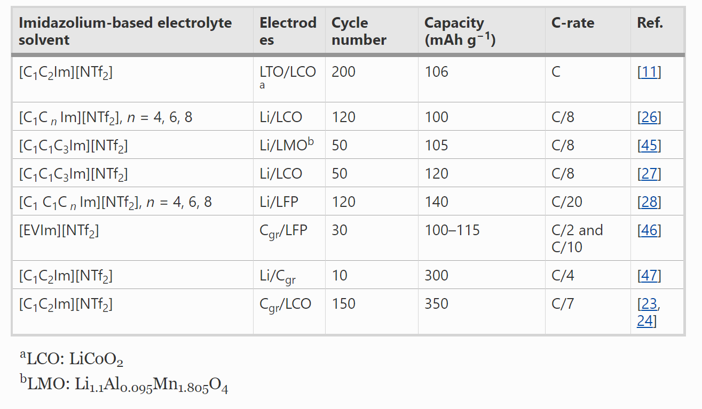
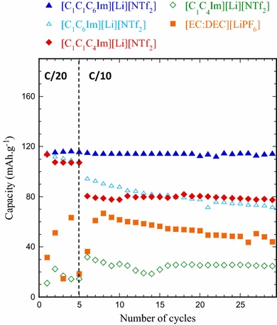

## Ionic liquid-based electrolytes for lithium-ion batteries: review of performances of various electrode systems 锂离子电池离子液体电解质：各种电极系统的性能回顾

> Hassan Srour, Léa Chancelier, Ewelina Bolimowska, Thibaut Gutel, Sophie Mailley, Hélène Rouault & Catherine C. Santini
> Journal of Applied Electrochemistry volume 46, 149–155(2016)
> DOI: [10.1021/jp104419k](https://doi.org/10.1021/jp104419k)  

### Abstract
Lithium-ion cells based on Graphite/LiFePO4 (Cgr/LFP), Li4Ti5O12/LiFePO4 (LTO/LFP) and Li4Ti5O12/LiNi1/3Mn1/3Co1/3O2 (LTO/NMC), using [C1C n Im][NTf2]- and [C1C1C n Im][NTf2] (n = 4 and 6)-based electrolytes with different lithium salts such as Li[N(SO2CF3)2] (LiNTf2), Li[N(SO2F)2] (LiFSI) and LiPF6 were tested at 333 K and compared to a commercial carbonate-based electrolyte [EC:DEC][LiPF6]. The impact of different factors such as length of side-alkyl chain on imidazolium ring or its C2-H substitution with CH3 group was studied, and the influence of the presence of organic additives as well as the value of the nominal voltage of the systems, was also reported. Finally, common trends for all these IL-based electrolyte systems were discussed.  
基于石墨/LiFePO4（Cgr /LFP），Li4Ti5O12 /LiFePO4（LTO /LFP）和Li4Ti5O12 /LiNi1 /3Mn1 /3Co1 /3O2（LTO /NMC）的锂离子电池，使用[C1C n Im] [NTf2]-和[C1C1C n Im] [NTf2]（n = 4和6）基电解质与不同的锂盐，例如Li [N（SO2CF3）2]（LiNTf2），Li [N（SO2F）2]（LiFSI）和LiPF6在333 K下进行了测试，并与市售的碳酸盐基电解质[EC：DEC] [LiPF6]进行了比较。研究了侧链长度对咪唑鎓环或其被CH3取代的C2-H等不同因素的影响，以及有机添加剂的存在以及系统标称电压值的影响，也有报道。最后，讨论了所有这些基于IL的电解质系统的共同趋势。

### Introduction
Lithium-ion (Li-ion) batteries are extensively used as power sources for consumer electronics, such as mobile phones and laptops, as they possess high energy density. They are also the most promising option for the next generation of the hybrid electric vehicles [1, 2]. For this purpose, extensive studies are focused on increasing their safety. Indeed, current systems are not sufficiently safe as they use flammable organic carbonate electrolytes, which can cause cracks, ignition, or explosion when cells are exposed to high temperatures or short-circuited [3]. To increase the safety and stability of Li-ion batteries, the development of more suitable electrolytes is on-going [4]. Electrolytes derived from ionic liquids (IL) have gained a lot of attention due to their thermal and electrochemical stability, flame retardant performance [5] and negligible vapour pressure [6].

In the case of IL-based electrolytes, many families have been studied, with various electrode couples [7, 8]. Usually, cycling results are carried out in half cells i.e. using lithium metal as a counter electrode, and 10–100 cycles are reported. The temperature has a strong effect on the performances of the IL-containing batteries, as the viscosity is a crucial limitation [9]. From a literature survey, we observed that the most used and efficient anion was bis(trifluoromethylsulfonyl)imide (NTf2), even if some drawbacks are reported related to its corrosive characters [10–12]. Its advantages are its high thermal stability and adapted physicochemical properties, in particular low viscosity. As cations, imidazolium-based cations are often used to allow easy chemical modification by changing the length, the number and the functionality of the side-alkyl chains.

In Table 1, cycling performances of some batteries using imidazolium-based IL as electrolytes at room temperature are listed. They are classified according to their specific capacity and cycling rate. However, no direct comparison of the cycling performances of these IL-based electrolytes can be done since electrochemical performances were evaluated in different systems (electrode nature) and conditions. As most of these experiments were performed in half cells, the results rely on the nature of the electrode. Furthermore, the intrinsic ionic composition of IL has to be taken into account as it could induce electrode evolution through ion dissolution [13]. Therefore, half-cell is not accurate to determine the stability of IL electrolytes and its use can lead to inappropriate conclusions. Indeed, the presence of an acidic proton on the C2 position, which is very reactive towards lithium, has to be considered [14, 15]. As reported with electrolytes based on ionic liquids and polymers, a methodical comparison of the cycling tests in similar experimental conditions could be helpful to improve the battery performance and safety [16].

  
Table 1 Cycling performances at room temperature of batteries containing imidazolium-based ionic liquids as electrolytes in different conditions (cycling rate, electrodes); EV stands for ethyl vinyl  
表1含有咪唑基离子液体作为电解质的电池在不同条件下的室温循环性能（循环速率，电极）； EV代表乙基乙烯基

The aim of this work is to compare the performances of four IL-based electrolytes and a commercial organic one in three different full devices cycled in identical experimental conditions (temperature, cycling rate, etc.). For example, the results presented here were all carried out at a fixed temperature of 333 K. The objective is to find some general trends to enable the optimal choice for the IL-based electrolyte for a specific couple of electrodes.

### Experimental
#### Materials and synthesis
1-hexyl-3-methylimidazolium bis(trifluoromethylsulfonyl)imide ([C1C6Im][NTf2]), 1-butyl-3-methylimidazolium bis(trifluoromethylsulfonyl)imide ([C1C4Im][NTf2]), 1-hexyl-2,3-dimethylimidazolium bis(trifluoromethylsulfonyl)imide ([C1C1C6Im][NTf2]) and 1-butyl-2,3-dimethylimidazolium bis(trifluoromethylsulfonyl)imide ([C1C1C4Im][NTf2]) were synthesised and purified as reported in the literature [17]. The mixture of these IL with lithium salts, referred to as electrolytes, was prepared under inert conditions by adding 1 mol L−1 of lithium bis(trifluoromethylsulfonyl)imide (LiNTf2), lithium bis(fluorosulfonyl)imide (LiFSI) or lithium hexafluorophosphate (LiPF6). A commercial organic carbonate electrolyte containing 1 mol L−1 of LiPF6 in equivolumic mixture of ethylene carbonate (EC) and of diethyl carbonate (DEC), referred to as [EC:DEC][LiPF6] (BASF), was stored in an anhydrous argon-filled glovebox and used as received. The water content determined using Karl Fisher was lower than 60 ppm for all electrolytes.

#### Preparation of lithium-ion cell electrode
The graphite-based electrodes were prepared from slurry composed of natural graphite, carboxymethylcellulose (CMC) and styrene butadiene rubber (SBR) in a weight ratio of 96:2:2. It was deposited onto a copper collector with a loading of 2.6 mAh cm−2.

Li4Ti5O12-based electrodes were prepared from slurry composed of LTO, SuperC65, CMC and SBR in a weight ratio of 90:5:1:4. It was deposited onto an aluminium collector with a loading of 1.3 mAh cm−2.

LiFePO4-based electrodes were prepared from slurry composed of LFP (Pulead), acetylene black (Showa Denko) and PolyVinylidene difluoride PVDF (Solvay) with a weight ratio 90:4:6 mixed in N-methyl-2-pyrrolidone. The slurry was deposited onto an aluminium collector with two different loadings: 1.0 mAh cm−2 for LTO and 2.4 mAh cm−2 for Cgr negative electrodes.

LiNi1/3Mn1/3Co1/3O2-based electrodes (NMC) were prepared from slurry composed of NMC, SuperC65, PVDF and vapour grown carbon fibres in 92:2:4:2 weight ratio, mixed in N-methyl-2-pyrrolidone. It was deposited onto an aluminium collector with a loading of 1.1 mAh cm−2.

All the electrodes were first pressed, then dried at 353 K under vacuum for 48 h and stored in an anhydrous argon-filled glovebox.

#### Electrochemical tests
Li-ion cells for Cgr/LFP, LTO/LFP and LTO/NMC were designed and tested. For each system, negative electrode, porous separator (glass microfiber), 150 µL of electrolyte, positive electrode were encapsulated into 2032-type coin cells in an anhydrous argon-filled glovebox. To ensure the complete penetration of the electrolytes into the high-loaded and pressed electrodes, the prepared coin cells were kept at 333 K for 12 h before the electrochemical experiments. The cycling experiments were performed at 333 K with the use of an Arbin multi-channel potentiostat/galvanostat between the cut-off voltages of [2.6–3.7 V] for Cgr/LFP, [1–2.8 V] for LTO/LFP and [1.5–2.6 V] for LTO/NMC. The capacities were reported in mAh g−1, based on the limiting active material mass of LFP or NMC.

Results and discussion
Four ionic liquid-based electrolytes and an organic one were tested in Cgr/LFP, LTO/LFP and LTO/NMC devices, at 333 K. In Cgr/LFP, different lithium salts (LiPF6, LiFSI and LiNTf2) were tested. Commonly used negative electrode materials are metallic lithium (Li), graphite (Cgr) or lithium titanate (Li4Ti5O12, LTO). The positive electrode can be a layered oxide (such as lithium cobalt oxide, LiCoO2, LCO), a polyanionic framework (such as lithium iron phosphate, LiFePO4, LFP), or a spinel (such as lithium manganese oxide, LiMn2O4, LMO). The choice of the electrode couple material determines the working potential range of the cell. For example, the working potential range for the cells used in this work were as follows: for Cgr/LFP [2.6–3.7 V], for LTO/LFP [1–2.8 V] and for LTO/NMC [1.5–2.6 V].

#### Cycling performances of Cgr/LFP-based cells using [C1C n Im][Li][NTf2]2 or [C1C1C n Im][Li][NTf2]2 as electrolytes
The low-cost eco-friendly graphite (372 mAh g−1)-based electrode is widely used as an alternative negative electrode to overcome the problem of the lithium metal electrode. Lithium metal is attractive for high-capacity batteries (3860 mAh g−1), as its potential is very low (−3.04 V vs. SHE) and it is the lightest metal (M = 6.94 g mol−1 and ρ = 0.53 g cm−3) [18]. However, successive lithium depositions can generate cracks, which break the passivation layer and promote development of lithium dendrites [1]. Despite overcoming this problem, graphite suffers from exfoliation and leads to carbonate electrolyte decomposition [19, 20]. To prevent these processes a protective layer is required, called solid electrolyte interphase (SEI) [1]. SEI is formed in situ through partial organic electrolyte decomposition. In the case of IL electrolytes, this layer is generally not efficiently formed and cycling is inhibited [21, 22]. Hence, to achieve good cycling, additives are required, usually vinylene carbonate (VC) or vinyl ethylene carbonate (VEC) [23–25].

As a material for positive electrode, LFP has many advantages such as low-cost, non-toxicity, tolerance to overcharge and thermal stability in the fully charged state. In addition, LFP has a large theoretical capacity of 170 mAh g−1, shows reversible capacities during charge and discharge with a flat discharge potential plateau at approximately 3.5 V versus Li+/Li and presents high lithium diffusion rates which leads to good cycling performances [1, 3].

The Cgr/LFP full cells with IL electrolytes [C1C n Im][NTf2] and [C1C1C n Im][NTf2] (n = 4 and 6) and with optimised amount of 5 % VC in volume were tested and compared with [EC:DEC][LiPF6] electrolyte at 333 K. The choice of the nature (VC) and the amount of additive (5 % by volume) was already optimised as reported [24–26]. In our previous work, we noticed that the absence of VC additives (0 % VC) or excess amount about 10 % VC by volume led to very low performance (less than 10 % capacity retention). However, 5 % VC by volume was shown as leading to very high performances with [C1C6Im[NTf2] at 298 K.

The increase of the side-alkyl chain from butyl to hexyl, i.e. [C1C4Im][NTf2] to [C1C6Im][NTf2] induces a capacity growth from 30 to 110 mAh g−1 at C/20 rate, Fig. 1. Then, at C/10 this capacity drops to ≈90 mAh g−1, then shows a continuous fading to 70 mAh g−1 during the following twenty cycles. The [C1C6Im][NTf2]-based cell affords higher performances than the organic electrolyte one.

  