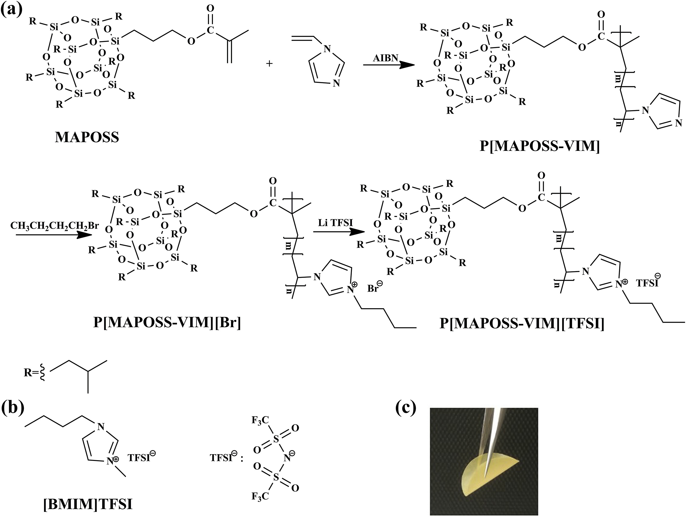

## Polymeric polyhedral oligomeric silsesquioxane ionic liquids based solid polymer electrolytes for lithium ion batteries 聚合物多面体低聚倍半硅氧烷离子液体为基础的固体聚合物电解质，用于锂离子电池

> Qi Lu, Jifang Fu, Liya Chen, Dapeng Shang, Mengmeng Li, Yufeng Xu, Rongrong Jia, Shuai Yuan, Liyi Shi
> Journal of Power Sources, Volume 414, 28 February 2019, Pages 31-40
> [[doi.org/10.1016/j.jpowsour.2018.11.061](https://doi.org/10.1016/j.jpowsour.2018.12.085)
> Key Words: Ionic liquid; Lithium battery; Polymer electrolyte; High voltage cathode; Lithium-rich nickel manganese cobalt oxide 富锂镍锰钴氧化物

### Highlights
> A novel imidazolium PILs containing POSS (POSS-PILs) are successfully synthesized.
> A novel Solid Polymer Electrolytes based on POSS-PILs (POSS-PIL-SPE) are obtained.
> The room temperature ion conductivity of POSS-PILs-SPE is up to 4.82 × 10−4 Scm−1.
> The POSS-PILs-SPE exhibit electrochemical stability up to 5 V relative to Li+/Li.
> The Li/POSS-PILs-SPE/LiFePO4 cell show excellent performance and rate capability.

### Abstract
In this work, we have successfully synthesized a novel imidazolium polymeric ionic liquid containing polyhedral oligomeric silsesquioxane and use it as host polymer to develop novel solid polymer electrolytes with high room temperature ionic conductivity, good cycle performance and rate capability. The polymeric polyhedral oligomeric silsesquioxane ionic liquids based solid polymer electrolytes exhibit highest room temperature ion conductivity up to 4.82 × 10−4 S cm−1 and outstanding electrochemical stability up to 5 V relative to Li+/Li. Moreover, the Li/LiFePO4 cells containing the novel solid polymer electrolytes exhibit excellent cycle performance and rate capability, delivering an initial discharge capacity of about 151.8 mAh g−1 at a rate of 0.1 C at room temperature with excellent capacity retention after 100th cycles.  
在这项工作中，我们成功地合成了一种新型的含多面体低聚倍半硅氧烷的咪唑鎓聚合物离子液体，并将其用作主体聚合物，开发出具有高室温离子电导率，良好的循环性能和速率能力的新型固体聚合物电解质。聚合物多面体低聚倍半硅氧烷离子液体基固体聚合物电解质相对于Li + /Li表现出最高的室温离子电导率，最高可达4.82×10-4 S cm-1，电化学稳定性高达5V。此外，含有新型固体聚合物电解质的Li /LiFePO4电池具有出色的循环性能和倍率性能，在室温下以0.1 C的速率提供约151.8 mAh g-1的初始放电容量，并在第100次循环后具有出色的容量保持率。

### 1. Introduction
Over the past years, there are great efforts to solve the safety of liquid electrolytes in lithium ion batteries [1], including the explosion, evaporation and leakage of organic flammable solvents [2,3]. Solid polymer electrolytes are one of the most promising candidate electrolytes for all-solid-state lithium ion batteries due to their better flexibility and higher safety compared to liquid electrolytes [[4], [5], [6], [7], [8], [9]]. However, solid polymer electrolytes usually suffer from low ionic conductivity (10−6 S cm−1) due to the limited mobility of lithium ions in the solid state [10].  
过去几年，人们为解决锂离子电池中液体电解质的安全性做出了巨大的努力[1]，包括有机易燃溶剂的爆炸，蒸发和泄漏[2,3]。与液体电解质相比，固体聚合物电解质具有更好的柔韧性和更高的安全性，是全固态锂离子电池最有希望的候选电解质之一[[4]，[5]，[6]，[7]，[ 8]，[9]。但是，由于固态锂离子的迁移率有限，固体高分子电解质通常具有较低的离子电导率（10-6 S cm-1）[10]。

Ionic liquids (ILs) are interesting materials as stable and safe electrolytes medium in energy storage and conversion systems [[11], [12], [13]] due to their unique properties such as good chemical and electrochemical stability, negligible vapor pressure, non-flammability and high ionic conductivity [14,15]. Poly(ionic liquids) (PILs), in which ionic liquid species covalently bound to the polymer backbone, represent a significant class of materials as they combine unique properties of ILs and polymers. PILs possess high thermal and electrochemical stability, good chemical compatibility with ionic liquids (ILs) and attractive mechanical characteristics of polymers, which can overcome the key leakage and poor mechanical limitations of ionic liquids [[16], [17], [18]]. Moreover, compared to other conventional ion-containing polymers, PILs possess higher solid-state ionic conductivities and lower glass transition temperatures due to weak electrostatic ion pair interactions [[16], [17], [18]].  
离子液体（ILs）作为能量存储和转换系统中稳定，安全的电解质介质，是有趣的材料[[11]，[12]，[13]]，因为它们具有独特的特性，例如良好的化学和电化学稳定性，可忽略的蒸气压，不易燃和高离子电导率[14,15]。聚离子液体（PIL），其中离子液体物种与聚合物主链共价结合，代表了重要的一类材料，因为它们结合了IL和聚合物的独特性能。 PIL具有高的热稳定性和电化学稳定性，与离子液体（ILs）的化学相容性良好，并且聚合物具有吸引人的机械特性，可以克服离子液体的关键泄漏和较差的机械限制[[16]，[17]，[18]] 。此外，与其他常规的含离子聚合物相比，由于弱的离子对相互作用，PIL具有较高的固态离子电导率和较低的玻璃化温度[[16]，[17]，[18]]。

Recently, PILs have been investigated as host polymer to develop a new class of safe polymer electrolytes in lithium ion batteries, solar cells and fuel cells because of their desirable performance [19]. Yang L [20] reported an imidazolium-based polymerized ionic liquid as host polymer electrolytes containing 65% ILs showing ionic conductivity 1.89 × 10−5 S cm−1 at room temperature and higher discharge capacity after 80 cycles. Subsequently, Yang L [21] reported a dicationic polymeric ionic liquid based gel electrolytes containing 50% ILs showing good ionic conductivity around 4.6 × 10−5 S cm−1 at room temperature and high cycle performance and rate capability. However, due to their not well film formability, high content ionic liquids usually as plasticizer are added into PILs to prepare polymer electrolytes.  
最近，由于PIL具有令人满意的性能，它们已被研究用作主体​​聚合物，以开发出新型的安全锂离子电池，太阳能电池和燃料电池安全聚合物电解质[19]。 Yang L [20]报道了一种咪唑类聚合离子液体，作为主体聚合物电解质，含有65％的IL，在室温下显示出1.89××10-5-5S·cm-1的离子电导率，并在80次循环后具有更高的放电容量。随后，Yang L [21]报道了一种基于聚合物离子液体的基于聚合物的离子型凝胶电解质，该电解质含有50％的IL，在室温下在4.6×10-5 S cm-1附近表现出良好的离子电导率，并且具有较高的循环性能和速率能力。然而，由于它们不能很好地成膜，所以通常将作为增塑剂的高含量离子液体添加到PIL中以制备聚合物电解质。

Polyhedral oligomeric silsesquioxane (POSS) are unique hybrid materials with well-defined cage-like nano scale inorganic structures and organic functional groups [22]. Several reports have shown that POSS can serve as a nanobuilding block for constructing ILs, and is responsible for the enhancement of the thermal stability and the ion transportation abilities of POSS based ILs [[23], [24], [25], [26], [27]]. In our previous work, we synthesized carboxyl imidazolium POSS-ILs and use it successfully improving the ionic conductivities of solid polymer electrolytes up to 8.0 × 10−4 S cm−1 at 22 °C and 2.0 × 10−3 S cm−1 at 62 °C [28].  
多面体低聚倍半硅氧烷（POSS）是独特的杂化材料，具有明确的笼状纳米级无机结构和有机官能团[22]。一些报告显示，POSS可以作为构建IL的纳米构件，并负责增强基于POSS的IL的热稳定性和离子迁移能力[[23]，[24]，[25]，[26] ]，[27]]。在我们以前的工作中，我们合成了羧基咪唑鎓POSS-ILs，并使用它成功地提高了固体聚合物电解质的离子电导率，在22°C时可达8.0×10-4 S cm-1，在22 C时可达2.0×10-3-3 S cm-1 62°C [28]。

In this work, novel solid polymer electrolytes based on POSS polymeric ionic liquids(POSS-PIL-SPEs) are proposed. POSS polymeric ionic liquids(POSS-PILs, P[MAPOSS-VIM][TFSI]) are designed and synthesized via a three step as shown in Scheme 1. POSS and ionic liquid species are covalently bounded to the polymer backbone starting from the radical polymerization of the 1-vinylimidazole monomer (VIM) and methacryllsobutyl POSS(MAPOSS), and then followed by quaternization reaction and anion exchange reaction. Then the obtained P[MAPOSS-VIM][TFSI] was used as main host polymer to prepare highly conductive PILs-based polymer electrolytes by a simple solution casting method. Considered poly(vinylidenefluoride-co-hexafluoropropylene) (P(VDF-HFP)) showing good mechanical and electrochemical stability with the high dielectric constant [29,30], P[MAPOSS-VIM][TFSI] and P(VDF-HFP) were used as host polymer matrix and imidazolium-based ionic liquids were used as additives to balance the compatibility with electrode, ionic conductivity and mechanical properties of SPEs. The obtained electrolytes membranes display high thermal stability, good film-forming properties and flexibility. Their electrochemical properties including ionic conductivity, electrochemical stability, lithium-ion transference number, and cell performance assembled with POSS-PIL-SPEs were systematically evaluated.  
在这项工作中，提出了一种基于POSS聚合物离子液体（POSS-PIL-SPEs）的新型固体聚合物电解质。如方案1所示，通过三个步骤设计和合成POSS聚合物离子液体（POSS-PIL，P [MAPOSS-VIM] [TFSI]）。从自由基聚合开始，POSS和离子液体物质共价键合到聚合物主链上1-乙烯基咪唑单体（VIM）和甲基丙烯酰基丁基POSS（MAPOSS），然后进行季铵化反应和阴离子交换反应。然后，将获得的P [MAPOSS-VIM] [TFSI]用作主要主体聚合物，通过简单的溶液浇铸方法制备高导电性的PILs基聚合物电解质。认为聚（偏二氟乙烯-共六氟丙烯）（P（VDF-HFP））具有良好的机械和电化学稳定性，并具有高介电常数[29,30]，P [MAPOSS-VIM] [TFSI]和P（VDF-HFP）用作主体聚合物基质，使用基于咪唑鎓的离子液体作为添加剂，以平衡与SPE的电极相容性，离子电导率和机械性能。所获得的电解质膜显示出高的热稳定性，良好的成膜性和挠性。系统评价了它们的电化学性能，包括离子电导率，电化学稳定性，锂离子转移数和与POSS-PIL-SPEs组装的电池性能。

  
Scheme 1. (a) Synthesis route of P[MAPOSS-VIM][TFSI]; (b) Structure of [BMIM]TFSI; (c) Picture of PIL-based solid polymer electrolytes(POSS-PIL-SPE-3 sample).  
方案1。（a）P [MAPOSS-VIM][TFSI]的合成路线； （b）[BMIM]TFSI的结构； （c）PIL基固体聚合物电解质的图片（POSS-PIL-SPE-3样品）。