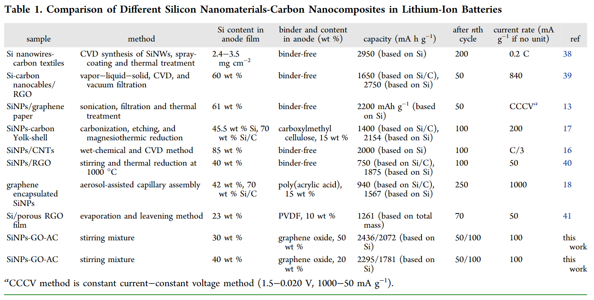

# Graphene Oxides Used as a New “Dual Role” Binder for Stabilizing Silicon Nanoparticles in Lithium-Ion Battery  氧化石墨烯用作稳定锂离子电池中硅纳米颗粒的新型“双重作用”粘合剂

> Changsheng Shan*, Kaifeng Wu, Hung-Ju Yen, Claudia Narvaez Villarrubia, Tom Nakotte, Xiangjie BoMing Zhou, Gang Wu, Hsing-Lin Wang*
> [10.1021/acsami.8b00649](https://doi.org/10.1021/acsami.8b00649)
> ACS Appl. Mater. Interfaces 2018, 10, 18, 15665-15672
> SUBJECTS: Nanoparticles, Two dimensional materials, Electrodes, Surface chemistry, Silicon

## Abstract
For the first time, we report that graphene oxide (GO) can be used as a new “dual-role” binder for Si nanoparticles (SiNPs)-based lithium-ion batteries (LIBs). GO not only provides a graphene-like porous 3D framework for accommodating the volume changes of SiNPs during charging/discharging cycles, but also acts as a polymer-like binder that forms strong chemical bonds with SiNPs through its Si–OH functional groups to trap and stabilize SiNPs inside the electrode. Leveraging this unique dual-role of GO binder, we fabricated GO/SiNPs electrodes with remarkably improved performances as compared to using the conventional polyvinylidene fluoride (PVDF) binder. Specifically, the GO/SiNPs electrode showed a specific capacity of 2400 mA h g–1 at the 50th cycle and 2000 mA h g–1 at the 100th cycle, whereas the SiNPs/PVDF electrode only showed 456 mAh g–1 at the 50th cycle and 100 mAh g–1 at 100th cycle. Moreover, the GO/SiNPs film maintained its structural integrity and formed a stable solid–electrolyte interphase (SEI) film after 100 cycles. These results, combined with the well-established facile synthesis of GO, indicate that GO can be an excellent binder for developing high performance Si-based LIBs.  
我们首次报道氧化石墨烯（GO）可以用作基于Si纳米颗粒（SiNPs）的锂离子电池（LIB）的新型“双角色”粘合剂。 GO不仅提供了类似于石墨烯的多孔3D框架来适应SiNP在充电/放电过程中的体积变化，而且还充当了类似于聚合物的粘合剂，通过其Si-OH官能团与SiNPs形成了牢固的化学键，从而俘获并稳定电极内部的SiNP。利用GO粘合剂的这种独特的双重作用，与传统的聚偏二氟乙烯（PVDF）粘合剂相比，我们制造的GO /SiNPs电极具有显着改善的性能。具体来说，GO /SiNPs电极在第50个周期显示的比容量为2400 mA hg-1，在第100个周期显示为2000 mA hg-1，而SiNPs /PVDF电极在第50个周期仅显示456 mAh g-1。第100次循环时100 mAh g–1。此外，GO /SiNPs薄膜保持其结构完整性，并在100次循环后形成稳定的固-电解质界面相（SEI）薄膜。这些结果与公认的简便的GO合成方法相结合，表明GO可以成为开发高性能基于Si的LIB的极佳粘合剂。

## Introduction
Lithium-ion batteries (LIBs) have been considered as one of the most promising energy storage technologies for various applications such as portable electronics, electric vehicles, and grid scale energy storage.(1,2) Graphite, the primary anode material in LIBs, cannot satisfy the high energy requirements due to its low specific capacity (372 mA h g–1).(3) Among many advanced anode materials being studied,(4) silicon (Si) has demonstrated great potential as an anode material for LIBs, mainly due to its exceptionally high theoretical gravimetric capacity of ∼4200 mAh g–1, low discharge potential (ca. 0.5 V versus Li+/Li), and high abundance of Si in Earth’s crust.(5,6) However, the large volume change (>300%) in Si-based anodes during lithium ion (Li+) insertion and extraction processes leads to the pulverization of Si particles and the unstable growth of solid–electrolyte interphase (SEI) film on the Si surface and hence results in the degradation of the electrode and a rapid loss of the capacity.(7)  
锂离子电池（LIB）被认为是最有前途的储能技术之一，可用于各种应用，例如便携式电子设备，电动汽车和电网规模的储能。（1,2）石墨，LIB的主要负极材料，由于其低的比容量（372 mA hg–1），不能满足高能量要求。（3）在许多正在研究的高级阳极材料中，（4）硅（Si）作为LIB的阳极材料显示出巨大的潜力，主要是由于其理论重量极高，约为4200 mAh g-1，放电电位低（相对于Li + /Li约为0.5 V），并且地壳中Si的丰度很高。（5,6）但是，体积变化很大锂离子（Li +）插入和萃取过程中，基于硅的阳极中（> 300％）导致硅颗粒粉化以及硅表面上的固体电解质中间相（SEI）膜不稳定生长，因此导致降解电极和快速容量损失。（7）

Recently, many methods have been developed to address this volume change effect to improve the cycling stability of Si-based anode.(1,8,9) First of all, various Si nanostructures, including nanoparticles,(10) nanowires,(11) and nanotubes,(12) have been used to show improved cycling performances compared to micrometer-sized Si due to shorter transport pathways for electrons and lithium ions in nanosized Si. Second, different kinds of Si/carbon composites, such as Si/graphene,(13−15) Si/carbon nanotube,(16) and carbon-coated Si,(17−19) have been prepared to improve both the electrical conductivity and cycling stability of the electrode. For example, Si nanoparticle-graphene paper composites fabricated by filtration and high temperature reduction treatment have exhibited high lithium ion storage capacities and cycling stability (>2200 mAh g–1 after 50 cycles) because the graphene formed a continuous, highly conductive 3D network and served as a structural scaffold to sandwich and trap the Si nanoparticles and accommodate their volume changes. Third, the cycling performance of Si-based LIBs can also be improved through replacing the conventional binder, polyvinylidene fluoride (PVDF), by various polymer binders, including carboxymethyl cellulose (CMC),(20) poly(acrylic acid) (PAA),(21) cross-linked polymer of CMC and PAA,(22) alginate,(23) conductive polymers,(24−26) polymer hydrogel.(5) These new polymer binders have high modulus strength, and the functional groups on polymers can bind strongly to the oxide on the Si surface. For example, it is suggested that the hydrogen bonding between carboxyl groups in CMC and hydroxyl groups on Si surface may exhibit a self-healing behavior beneficial for the long-term cycling stability.(27) On the basis of previous studies, we expect that an integrated approach, which simultaneously combines nanostructured Si, 3D carbon network, and new polymer-like binders, would greatly improve the cycling performance of Si-based LIBs.  
近年来，已开发出许多方法来解决这种体积变化效应，以提高硅基阳极的循环稳定性。（1,8,9）首先，各种硅纳米结构，包括纳米粒子，（10）纳米线，（11）与纳米管（12）相比，由于微米级Si中电子和锂离子的传输路径更短，因此与微米级Si相比已显示出更好的循环性能。其次，已经准备了不同种类的Si /碳复合材料，例如Si /石墨烯，（13-15）Si /碳纳米管（16）和碳包覆的Si（17-19），以提高导电性和电极的循环稳定性。例如，由于石墨烯形成了一个连续的，高导电性的3D网络，通过过滤和高温还原处理制成的Si纳米颗粒-石墨烯纸复合材料具有很高的锂离子存储容量和循环稳定性（在50次循环后> 2200 mAh g-1）。用作结构支架以夹住和捕获Si纳米颗粒并适应其体积变化。第三，还可以通过用各种聚合物粘合剂（包括羧甲基纤维素（CMC），（20）聚丙烯酸（PAA））代替常规粘合剂聚偏二氟乙烯（PVDF）来改善Si基LIB的循环性能。 （21）CMC和PAA的交联聚合物，（22）海藻酸酯，（23）导电聚合物，（24-26）聚合物水凝胶。（5）这些新型聚合物粘合剂具有高模量强度，并且聚合物上的官能团可以与Si表面的氧化物牢固结合。例如，建议CMC中的羧基和Si表面的羟基之间的氢键可能表现出自修复行为，这有利于长期循环稳定性。（27）在先前研究的基础上，我们期望一种将纳米结构的Si，3D碳网络和新型聚合物类粘合剂同时结合的集成方法，将大大改善Si基LIB的循环性能。

Here, we report for the first time that such an integrated approach can be realized by using a composite comprising Si nanoparticles (SiNPs) and graphene oxide (GO) as the anode electrode. In this work, GO plays the dual-role as both a 3D porous carbon framework for accommodating the SiNPs and a polymer-like binder to prevent their detachment from the electrode. This is enabled by the hierarchical architecture of GO, which is a layered graphene-like structure decorated with functional groups including carboxyl, epoxy, and hydroxyl.(28) Trapping of SiNPs in the 3D porous framework structure of GO film and chemical binding between SiNPs and functional groups of GO can stabilize the SiNPs and avoid the unstable growth of SEI film on the Si surface, and thus improve the performance of Si-based LIBs (Scheme 1). The resulting GO/SiNPs anode showed a remarkable cycling performance with a specific capacity of 2400 mA h g–1 at the 50th cycle and 2000 mA h g–1 at the 100th cycle. In addition to enabling high performances, there are additional advantages associated with the use of GO that make this technology especially suitable for large-scale implementations. Compared with graphene, the preparation of GO does not require a reduction treatment and hence is facile and cost-effective. Moreover, unlike the conventional PVDF binder that needs to be dissolved in organic solvents such as N-methyl-2-pyrrolidone (NMP), GO can be readily dissolved in water, which is cost-effective and environmentally friendly.  
在这里，我们首次报告可以通过使用包含Si纳米颗粒（SiNPs）和氧化石墨烯（GO）的复合材料作为阳极来实现这种集成方法。在这项工作中，GO扮演了双重角色，既是用于容纳SiNP的3D多孔碳骨架，又是类似聚合物的粘合剂，以防止其从电极上脱落。 GO的分层体系结构可以实现这一点，GO的层状石墨烯结构装饰有羧基，环氧基和羟基等官能团。（28）在GO膜的3D多孔骨架结构中捕获SiNP，以及SiNP之间的化学键合GO的官能团可以稳定SiNPs，避免SEI膜在Si表面的不稳定生长，从而提高Si基LIB的性能（方案1）。生成的GO /SiNPs阳极显示出显着的循环性能，第50个循环的比容量为2400 mA h g-1，第100个循环的比容量为2000 mA h g-1。除了实现高性能之外，GO的使用还具有其他优势，这使得该技术特别适合于大规模实施。与石墨烯相比，GO的制备不需要还原处理，因此既简便又具有成本效益。此外，与需要溶解在有机溶剂（例如N-甲基-2-吡咯烷酮（NMP））中的常规PVDF粘合剂不同，GO可以很容易地溶解在水中，这具有成本效益且对环境友好。

  
Scheme 1. Schematic View of GO as Binder for SiNPs-Based Anode in LIBsa  
GO作为LIBsa中基于SiNPs的阳极的粘合剂的示意图

aSiNPs are trapped in three dimensional-layered GO and the hydroxyl groups on the surface of SiNPs form chemical and hydrogen binding with GO.

## Experimental Section
### Experimental Section
Silicon nanoparticles (<50 nm, 98%) were purchased from Alfa Aesar. Graphite (99%, 325 mesh), sulfuric acid (95–98%), potassium permanganate (>99.0%), phosphorus pentoxide (>98%), and hydrogen peroxide solution (30 wt % in H2O) were all purchased from Sigma-Aldrich and used as received. Dialysis membrane (MWCO 3500) was purchased from Spectrum Laboratories, Inc. Polyvinylidene fluoride (PVDF, fluoride content, 59%) was purchased from Scientific Polymer Products, Inc. The materials for battery test, including carbon coated copper foil, conductive acetylene black (AC), and coin cell cases, were purchased from MTI corporation. All the other reagents were of analytical grade and used as received. The double-distilled water filtered using an ultrafiltration system (Millipore system,>18 MΩ cm) was employed for preparing all the aqueous solutions.  
硅纳米颗粒（<50 nm，98％）购自Alfa Aesar。石墨（99％，325目），硫酸（95-98％），高锰酸钾（> 99.0％），五氧化二磷（> 98％）和过氧化氢溶液（在H2O中为30 wt％）均购自Sigma。 -Aldrich，原样使用。透析膜（MWCO 3500）购自Spectrum Laboratories，Inc。聚偏氟乙烯（PVDF，氟化物含量，59％）购自Scientific Polymer Products，Inc。用于电池测试的材料，包括涂碳铜箔，导电乙炔黑（ AC）和纽扣电池盒，均购自MTI公司。所有其他试剂均为分析纯，按原样使用。使用超滤系统（Millipore系统，> 18MΩcm）过滤的双蒸馏水用于制备所有水溶液。

### Characterization
UV–vis-NIR measurements for GO, SiNPs, and GO/SiNPs solutions were collected with a Varian Cary 5000 spectrometer. Fourier transform infrared (FTIR) spectroscopy was recorded on a Bruker Vertex 70 spectrometer (4 cm–1). X-ray diffraction (XRD) patterns were conducted on a Rigaku Ultima III X-ray diffractometer using fine-line-sealed Cu Kα tube (λ = 1.54178 Å) X-rays. The transmission electron microscopy (TEM) was examined by using a JEOL JEM-1230 transmission electron microscope. Scanning electron microscopy (SEM) and energy-dispersive X-ray spectroscopy (EDX) were collected with an XL 30 ESEM FEG scanning electron microscopy (Mahwah, NJ).  
使用Varian Cary 5000光谱仪收集GO，SiNPs和GO /SiNPs溶液的UV-vis-NIR测量值。傅立叶变换红外（FTIR）光谱记录在Bruker Vertex 70光谱仪（4 cm–1）上。 X射线衍射（XRD）图样是在Rigaku Ultima III X射线衍射仪上使用细线密封的CuKα管（λ= 1.54178Å）X射线进行的。通过使用JEOL JEM-1230透射电子显微镜检查透射电子显微镜（TEM）。扫描电子显微镜（SEM）和能量色散X射线光谱仪（EDX）用XL 30 ESEM FEG扫描电子显微镜（Mahwah，NJ）收集。

### Synthesis of GO
GO was prepared by oxidizing natural graphite powder (SP, 320 mesh) based on a modified Hummers method.(29) Briefly, the graphite was treated with concentrated H2SO4, K2S2O8, and P2O5. The resulting solid was filtered and dried, which was then dispersed in concentrated H2SO4 and further oxidized with KMnO4 and H2O2 to obtain a brownish yellow suspension. After filtering and washing, the as-prepared graphene oxide was resuspended in ultrapure water to give a brown dispersion, which was subjected to dialysis to completely remove residual salts and acids for 3 days. The resulting purified graphene oxide powder was collected by centrifugation and freeze-dried.  
通过使用改良的Hummers方法氧化天然石墨粉末（SP，320目）来制备GO。[29]简而言之，用浓H2SO4，K2S2O8和P2O5处理石墨。将得到的固体过滤并干燥，然后将其分散在浓H 2 SO 4中，并进一步用KMnO 4和H 2 O 2氧化以获得棕黄色悬浮液。过滤并洗涤后，将所制备的氧化石墨烯重悬于超纯水中，得到褐色分散体，将其进行渗析以完全除去残留的盐和酸3天。通过离心收集所得纯化的氧化石墨烯粉末并冷冻干燥。

### Fabrication of LIBs and LIB Tests
The battery tests were performed with CR2025-type coin cells containing the SiNPs, GO, or GO/SiNPs working electrodes. The slurry of GO/SiNPs/AC mixture with different weight ratios was prepared by stirring GO, SiNPs, and acetylene carbon (AC) in water for 24 h. The GO/SiNPs/AC working electrodes were prepared by doctor-blade method, a conventional slurry coating method. The control working electrodes were prepared by the same slurry coating methods. To prepare the SiNPs electrode, we mixed SiNPs, AC, and PVDF with the weight ratio of 3:2:5 and dispersed them in NMP. To fabricate the GO electrode, we mixed GO and AC with the weight ratio of 4:1 and dispersed them in water. The mass of each GO/SiNPs, SiNPs, and GO thin film electrode was precisely measured with a microbalance before coin cell assembly. The mass loading of working electrode was about 0.6–1 mg cm–2. Coin cells were assembled in an argon-filled glovebox with a metallic lithium foil as both the reference and counter electrodes. The moisture content and oxygen level in the glovebox were maintained less than 1 ppm. The electrolyte was 1 M LiPF6 in a mixture of ethylene carbonate (EC)/diethyl carbonate (DEC)/fluoroethylene carbonate (FEC) (weight ratio of 1:1:0.1) with Celgard 2300 polypropylene as the separator. The cells were galvanostatically charged and discharged ranging from 0.02 to 1.0 V (vs Li+/Li) at a constant current density based on the weight of the SiNPs on a battery test system (Arbin 2000-BT). The capacity in this work is calculated based on the weight of SiNPs in anode electrode. Cyclic voltammetry measurements were carried out on an electrochemistry workstation (CHI 760E) over the potential range 0.02–1.0 V (vs Li+/Li) at a scan rate of 0.1 mV s–1.  
电池测试是使用包含SiNPs，GO或GO /SiNPs工作电极的CR2025型纽扣电池进行的。通过将GO，SiNPs和乙炔碳（AC）在水中搅拌24小时来制备具有不同重量比的GO /SiNPs /AC混合物的浆液。 GO /SiNPs /AC工作电极通过刮刀法（一种常规的浆液涂覆法）制备。通过相同的浆料涂覆方法制备对照工作电极。为了制备SiNPs电极，我们将重量比为3：2：5的SiNPs，AC和PVDF混合，然后将其分散在NMP中。为了制造GO电极，我们将重量比为4：1的GO和AC混合，并将它们分散在水中。在组装硬币电池之前，用微量天平精确测量每个GO /SiNP，SiNP和GO薄膜电极的质量。工作电极的质量负荷约为0.6-1 mg cm-2。币形电池组装在带有金属锂箔作为参比电极和反电极的充氩气的手套箱中。手套箱中的水分含量和氧气含量保持在1 ppm以下。电解质为碳酸亚乙酯（EC）/碳酸二乙酯（DEC）/碳酸氟亚乙酯（FEC）（重量比为1：1：0.1）与Celgard 2300聚丙烯作为隔膜的混合物中的1 M LiPF6。基于电池测试系统（Arbin 2000-BT）上SiNPs的重量，电池以恒流密度在0.02至1.0 V（vs Li + /Li）之间进行恒流充电和放电。这项工作中的容量是根据阳极中SiNP的重量计算的。循环伏安法测量是在电化学工作站（CHI 760E）上以0.1 mV s-1的扫描速率在0.02–1.0 V（vs Li + /Li）的电势范围内进行的。

##  Results and Discussion
The structure and morphology of GO, SiNPs, and GO/SiNPs were characterized by X-ray diffraction (XRD), scanning electron microscopy (SEM), and transmission electron microscopy (TEM). The characteristic XRD (001) peak of GO at ∼11.8 degree is observed in Figure 1a, which is in a good agreement with previous reports.(30) The SiNPs powders show typical peaks at 28.5, 47.4, and 56.2 degrees, corresponding to the (111), (220), and (311) lattice planes of crystalline Si, respectively.(13) As expected, the GO/SiNPs nanocomposites show the peaks of both GO and SiNPs, indicating that they maintain their starting phases in the mixture. The relative intensity of GO increase consistently with the increasing weight percentage of GO.  
通过X射线衍射（XRD），扫描电子显微镜（SEM）和透射电子显微镜（TEM）对GO，SiNPs和GO /SiNPs的结构和形态进行了表征。在图1a中观察到GO在约11.8度的特征XRD（001）峰，与以前的报道非常吻合。（30）SiNPs粉末在28.5、47.4和56.2度处显示出典型的峰，对应于（111），（220）和（311）晶体Si的晶格面。（13）正如预期的那样，GO /SiNPs纳米复合材料显示了GO和SiNPs的峰，表明它们在混合物中保持其起始相。 GO的相对强度随着GO重量百分比的增加而一致地增加。

  
Figure 1. (a) XRD of GO, SiNPs, and GO/SiNPs composites with different weight ratios. (b–d) TEM images of (b) GO, (c) SiNPs, and (d) GO/SiNPs composites. (e) SEM images of GO/SiNPs composites and (f) edge-view SEM image of the GO/SiNPs film.  
图1.（a）具有不同重量比的GO，SiNPs和GO /SiNPs复合材料的XRD。 （b–d）（b）GO，（c）SiNPs和（d）GO /SiNPs复合材料的TEM图像。 （e）GO /SiNPs复合材料的SEM图像，以及（f）GO /SiNPs膜的边缘视图SEM图像。

The TEM image of GO (Figure 1b) shows a typical layered structure of graphene-like sheets, and the image of SiNPs (Figure 1c) shows irregular Si nanoparticles with sizes mostly below 50 nm. In the composite of GO and SiNPs, the SiNPs are wrapped by GO, as observed in the TEM image in Figure 1d. The SEM image of the composite also shows the encapsulation of SiNPs into the GO film, which has a 3D porous stack of GO sheets (Figure 1e,f). The encapsulation of SiNPs into the porous 3D framework composed of GO sheets can help provide the free space for Si volume expansion/contraction during charging/discharging and hence cycling stability of SiNPs-based LIBs.  
GO的TEM图像（图1b）显示了典型的石墨烯状片层状结构，而SiNPs的图像（图1c）显示了大小不超过50 nm的不规则Si纳米颗粒。在GO和SiNP的复合材料中，SiNP被GO包裹，如图1d的TEM图像所示。复合材料的SEM图像还显示了将SiNPs封装到GO膜中，该膜具有3D多孔的GO片堆叠（图1e，f）。将SiNP封装到由GO片组成的多孔3D框架中可以帮助在充电/放电过程中为Si体积的膨胀/收缩提供自由空间，从而为基于SiNPs的LIB提供循环稳定性。

UV–visible, Fourier transform infrared (FTIR), and X-ray photoelectron spectroscopy (XPS) were performed to evaluate the chemical interactions between GO and SiNPs. Figure 2a shows the UV–visible absorption spectra of GO, SiNPs, and GO/SiNPs in aqueous solutions. The independent GO and SiNPs show typical absorption peaks at 231 nm(31) and 388 nm, respectively. The GO/SiNPs composites show two main peaks at 233 nm and 400–418 nm, corresponding to absorption of GO and SiNPs, respectively. The peak shifts of GO from 231 to 233 nm and SiNPs from 388 nm to 400–418 nm imply a change in local environment due to interaction between GO and SiNPs. Such interaction is further validated by ensuing measurement of FTIR and XPS spectroscopy.  
进行了紫外可见光，傅立叶变换红外（FTIR）和X射线光电子能谱（XPS）来评估GO和SiNP之间的化学相互作用。图2a显示了水溶液中GO，SiNPs和GO /SiNPs的紫外可见吸收光谱。独立的GO和SiNPs分别在231 nm（31）和388 nm处显示典型的吸收峰。 GO /SiNPs复合材料在233 nm和400–418 nm处显示两个主峰，分别对应于GO和SiNPs的吸收。 GO的峰位移从231 nm移至233 nm，SiNPs从388 nm移至400–418 nm，这意味着由于GO和SiNP之间的相互作用，局部环境发生了变化。通过随后测量FTIR和XPS光谱进一步验证了这种相互作用。

  
Figure 2. (a) UV–visible spectra and (b) FTIR of GO, GO/SiNPs with different weight ratio, and SiNPs; (c) C 1s XPS spectra of GO and GO/SiNPs with weight ratio of 5:3; (d) Si 2p XPS spectra of SiNPs and GO/SiNPs with weight ratio of 5:3.  
图2.（a）GO，具有不同重量比的GO /SiNP和SiNP的紫外可见光谱和（b）FTIR； （c）重量比为5：3的GO和GO /SiNPs的C 1s XPS光谱； （d）重量比为5：3的SiNPs和GO /SiNPs的Si 2p XPS光谱。

The FTIR spectra in Figure 2b provide strong evidence for the chemical interaction between the GO and SiNPs. GO exhibits many absorption peaks due to it functional groups, with the peak at 1730 cm–1, 1608 cm–1, 1220 cm–1, and 850 cm–1 corresponding to C═O stretching vibrations, C═C stretching vibrations, C–O symmetric stretching and deformation vibrations of the epoxy groups, respectively (Figure 2b). After the formation of GO/SiNPs nanocomposites, the relative intensities of the 1220 and 850 cm–1 peaks attributed to the epoxy groups decrease considerably when compared with pure GO. This decrease in epoxy peak intensity is a strong evidence of covalent bond formation between the epoxy groups of GO and hydroxyl groups of Si nanoparticles. In addition, the obvious shift of C═C stretching vibrations peaks from 1608 cm–1 in GO to 1583 cm–1 in GO/SiNPs implies the interaction between benzene rings of GO and SiNPs. Similar strong interactions between the polymeric binder and Si surface have been identified as one of most critical factors improving the stability of Si-based LIBs.(27) All the above results are consistent with the hypothesis that SiNP form strong covalent bonds with GO and their miscibility at the molecular level has led to change in the vibrational spectra.  
图2b中的FTIR光谱为GO和SiNP之间的化学相互作用提供了有力的证据。 GO因其官能团而显示出许多吸收峰，分别在1730 cm-1、1608 cm-1、1220 cm-1和850 cm-1处，对应于C═O拉伸振动，C═C拉伸振动，C –O分别对环氧基团对称地拉伸和变形振动（图2b）。 GO /SiNPs纳米复合材料形成后，与纯GO相比，归于环氧基的1220和850 cm-1峰的相对强度大大降低。环氧峰强度的这种降低是GO的环氧基与Si纳米颗粒的羟基之间形成共价键的有力证据。此外，C═C拉伸振动峰从GO /SiNPs中的1608 cm-1到GO /SiNPs中的1583 cm-1的明显移动暗示了GO和SiNPs的苯环之间的相互作用。聚合物粘合剂与Si表面之间相似的强相互作用已被认为是提高Si基LIB稳定性的最关键因素之一。（27）所有上述结果与以下假设一致：SiNP与GO及其分子形成强共价键。在分子水平上的可混溶性导致振动光谱的变化。

XPS is another powerful tool to further validate the interaction between GO and SiNPs. The C 1s XPS spectrum of GO (Figure 2c) clearly shows three characteristic peaks corresponding to carbon atoms in graphite (284.4 eV), epoxy groups (286.3 eV), and carboxylate groups (288.0 eV). The Si 2p XPS spectrum of SiNPs (Figure 2d) shows a typical peak of Si–Si bonding at 99.4 eV and a weak peak of oxidized silicon around 103 eV, indicating the SiNPs are covered with a very thin layer of silicon oxides. The C 1s and Si 2p XPS spectra of the GO/SiNPs are different from their constituents. Although all the C 1s peaks are still preserved, the peaks of GO/SiNPs at 286.3 eV corresponding to epoxy groups of GO are significantly decreased, see Figure 2c. The above results confirm the covalent bond formation between epoxy group of GO and SiNPs, consistent with the FTIR spectra (Figure 2b). In the meantime, the Si 2p spectrum of GO/SiNPs shows an obvious increase in peak intensity around 103 eV due to formation of Si–O- peak resulting from surface oxidation of SiNPs (Figure 2d). Of particular interest is the new peak observed at 102.0 eV, which can be assigned to the Si–O–C bond, confirming the chemical reaction between epoxy groups in GO and hydroxyl groups on the surface of SiNPs.(32)  
XPS是另一个强大的工具，可以进一步验证GO和SiNP之间的交互。 GO的C 1s XPS光谱（图2c）清楚地显示了三个特征峰，分别对应于石墨（284.4 eV），环氧基（286.3 eV）和羧酸根（288.0 eV）中的碳原子。 SiNP的Si 2p XPS光谱（图2d）显示了在99.4 eV处的典型Si-Si键峰和在103 eV附近的较弱的氧化硅峰，表明SiNP被非常薄的氧化硅层覆盖。 GO /SiNPs的C 1s和Si 2p XPS光谱与其成分不同。尽管所有的C 1s峰仍然保留，但对应于GO环氧基的286.3 eV处的GO /SiNPs峰却显着降低，见图2c。以上结果证实了GO和SiNPs的环氧基之间形成了共价键，与FTIR光谱一致（图2b）。同时，GO /SiNPs的Si 2p光谱显示在103 eV附近峰强度明显增加，这是由于SiNPs表面氧化导致形成了Si–O-峰（图2d）。特别令人感兴趣的是在102.0 eV处观察到的新峰，该峰可以归因于Si-O-C键，证实了GO中的环氧基与SiNPs表面的羟基之间的化学反应。（32）

After confirming the chemical interactions between GO and SiNPs in the GO/SiNPs nanocomposites, we then explore the effect of these interactions on the electrochemical performances of the nanocomposites. To this end, a slurry of GO/SiNPs with acetylene carbon as conductive additives was used to fabricate the anode film on copper electrodes, which was then assembled into a coin cell with lithium metal as the counter and reference electrode. Figure 3a shows typical cyclic voltammmograms (CVs) of the GO/SiNPs electrode in the potential range of 0.02–1.0 V (vs Li+/Li) at a scan rate of 0.1 mV s–1 for the first two cycles. A weak cathodic peak in the first cycle appears at ∼0.65 V, an indication of the formation of SEI.(33) This cathodic peak disappears in the second cycle, which is associated with an initial capacity loss. The reduction peak observed below 0.3 V is due to the formation of Li–Si alloys.(34) In the Li+ extraction process, we observe two broad peaks at ∼0.39 and 0.53 V, corresponding to the phase transition from Li–Si alloys to amorphous Si.(35)  
在确认GO /SiNPs纳米复合材料中GO和SiNPs之间的化学相互作用后，我们便探索了这些相互作用对纳米复合材料电化学性能的影响。为此，使用具有乙炔碳作为导电添加剂的GO /SiNPs浆料在铜电极上制造阳极膜，然后将其组装成以锂金属为对电极和参比电极的纽扣电池。图3a显示了在前两个周期中，GO /SiNPs电极的典型循环伏安图（CV）在0.02–1.0 V（vs Li + /Li）的电势范围内，扫描速率为0.1 mV s–1。在第一个循环中，一个弱的阴极峰出现在〜0.65 V，表明SEI的形成。（33）在第二个循环中，该阴极峰消失了，这与初始容量损失有关。在0.3 V以下观察到的还原峰归因于Li-Si合金的形成。（34）在Li +萃取过程中，我们在〜0.39和0.53 V处观察到两个宽峰，这对应于从Li-Si合金到金属的相变。非晶硅（35）

  
Figure 3. (a) Cyclic voltammograms of GO/SiNPs (weight ratio of 5:3) at a scan rate of 0.1 mV s–1 for the initial two cycles. (b) Discharge–charge profiles at a rate of 0.1 A g–1 for the initial three cycles of GO/SiNPs (5:3). (c) Cycling discharge–charge performance of GO/SiNPs with different weight ratios, SiNPs/PVDF and GO for LIBs and Coulombic efficiency of GO/SiNPs (5:3) at a rate of 0.1 A g–1. (d) Rate performance of GO/SiNPs (5:3).  
图3.（a）在最初的两个循环中，GO /SiNPs（重量比为5：3）在0.1 mV s-1的扫描速率下的循环伏安图。 （b）最初三个GO /SiNPs循环（5：3）的放电-放电曲线速率为0.1 A g-1。 （c）重量比不同的GO /SiNP，SiNPs /PVDF和GO用于LIB的循环放电-充电性能以及GO /SiNPs（5：3）的库伦效率为0.1 A g-1。 （d）GO /SiNPs的性能评估（5：3）。

Figure 3b shows the charging/discharging curves of the GO/SiNPs electrode at a current density of 0.1 A g–1 for the first three cycles. During discharging (intercalation of Li+) of SiNPs, the main discharging plateau is below 0.3 V and the charging plateau is about 0.3–0.6 V, consistent with the above CV results. The discharging and charging capacities in the first cycle are 3949 and 2695 mA h g–1, respectively, with the large irreversible capacity loss due to the formation of SEI film and possibly the reaction of oxygen-containing groups in GO and SiO2 layer on the surface of SiNPs with Li+.(14) The charging/discharging cycles of the GO/SiNPs electrode gradually become stable and reversible after the first cycle (Figure 3b).  
图3b显示了在前三个循环中，GO /SiNPs电极在电流密度为0.1 A g-1时的充电/放电曲线。在对SiNPs进行放电（插入Li +）期间，主放电平稳段低于0.3 V，充电平稳段约为0.3-0.6 V，与上述CV结果一致。第一循环的充放电容量分别为3949和2695 mA hg-1，由于SEI膜的形成以及表面GO和SiO2层中的含氧基团的反应，导致不可逆的容量损失大（14）GO /SiNPs电极的充电/放电循环在第一个循环后逐渐变得稳定且可逆（图3b）。

The comparative study of cycling performances among SiNPs/GO, SiNPs/PVDF, and GO electrodes was evaluated at 0.1 A g–1 in the voltage range of 0.02–1 V (vs Li+/Li), as shown in Figure 3c. All the GO/SiNPs electrodes with various GO/SiNPs ratios exhibit reasonably stable and reversible cycling behaviors after the first few cycles. The capacities of GO/SiNPs with the GO:SiNPs ratios of 5:3, 4:4, 3:5, and 2:6 are 2436, 2295, 2029, and 1657 mAh g–1 at the 50th cycle, respectively. Notably, the first three values are larger than the reported value of SiNPs-graphene paper composites (2200 mAh g–1 at the 50th cycle).(13) At the 100th cycle, these values show slight decreases to 2072, 1781, 1377, and 1104 mAh g–1, respectively. In contrast, the Si/PVDF electrode using the conventional binder shows a much lower cycling stability (456 mAh g–1 at the 50th cycle and 100 mAh g–1 at the 100th cycles). These results indicate that GO is an excellent binder for the stabilization of SiNPs in LIBs. In addition, the capacity of GO electrode was measured to be around 98 mAh g–1 (Figure 3c), indicating that Si nanoparticle is the prime contributor of the charge capacity in GO/SiNPs LIBs.  
如图3c所示，在0.02-1 V（vs Li + /Li）电压范围内，在0.1 A g-1下评估了SiNPs /GO，SiNPs /PVDF和GO电极之间的循环性能。在最初的几个循环后，具有不同GO /SiNPs比的所有GO /SiNPs电极都表现出相当稳定且可逆的循环行为。 GO /SiNPs比率为5：3、4：4、3：5和2：6的GO /SiNP在第50个循环中的容量分别为2436、2295、2029和1657 mAh g-1。值得注意的是，前三个值大于SiNPs-石墨烯纸复合材料的报告值（第50个周期为2200 mAh g-1）。（13）在第100个周期，这些值略有下降，分别降至2072、1781、1377，和1104 mAh g–1。相反，使用传统粘合剂的Si /PVDF电极显示出低得多的循环稳定性（第50个循环为456 mAh g-1，第100个循环为100 mAh g-1）。这些结果表明，GO是稳定LIB中SiNP的极好的粘合剂。另外，测得GO电极的容量约为98 mAh g-1（图3c），表明Si纳米颗粒是GO /SiNPs LIBs充电容量的主要贡献者。

In addition to the high capacity and excellent cycling performance, we also studied the cycling stability of GO/SiNPs at very high charging/discharging rates (Figure 3d). The cell was first discharged/charged at a current density of 0.1 A g–1 for 10 cycles, and then at various current densities from 0.3 to 2 A g–1 each for 10 cycles. The average discharge capacities are 3254, 2552, 2006, and 1472 mA h g–1 at 0.1, 0.3, 0.5, and 1 A g–1, respectively. Even at a very high rate of 2 A g–1, the discharge capacity is still as high as 1009 mA h g–1. After cycling at different rates and then returning to 0.1 A g–1, the average specific capacity is recovered to 2168 mA h g–1, indicating a stable cycling performance. This very high capacity 1009 mA h g–1 at 2A is one of the very high value ever reported for silicon-based LIBs.  
除了高容量和出色的循环性能外，我们还研究了GO /SiNP在非常高的充电/放电速率下的循环稳定性（图3d）。首先以0.1 A g-1的电流密度对电池放电/充电10个循环，然后以0.3至2 A g-1的各种电流密度放电10个循环。在0.1、0.3、0.5和1 A g-1的平均放电容量分别为3254、2552、2006和1472 mA h g-1。即使以2 A g-1的极高速率，放电容量仍高达1009 mA h g-1。在以不同的速率循环之后，然后返回到0.1 A g-1，平均比容量恢复到2168 mA h g-1，表明循环性能稳定。这种在2A时非常高的容量1009 mA h g-1是硅基LIB所报道的非常高的值之一。

On the basis of the above results, the enhanced capacity, cycling performance and rate performance of the GO/SiNPs electrode can be attributed to the interactions between GO and SiNPs, enabling GO to play the dual-role of both a 3D porous framework to accommodate the SiNPs and a polymer-like binder to prevent their detachment from the electrode. We believe the stable electrode structure enabled by this dual-role of GO should facilitate the formation of a stable SEI layer, which is another critical factor that leads to long-term stability of Si-based LIBs. To study the SEI formation, the electrochemical impedance spectroscopy (EIS) of the GO/SiNPs coin cell battery was performed after different cycles. In Figure 4a, the Nyquist plot shows two semicircles in the high frequency zone and a straight line with a slop of about 45° in the low frequency zone, which are the typical features of the electrode in LIBs.(36) The two semicircles in the high frequency zone can be assigned to the SEI film resistance and charge transfer resistance, with the former located at a higher frequency.(37) As shown in Figure 4b, the enlarged view of Nyquist plot shows the almost unchanged first semicircles corresponding to SEI film resistances after the first charging/discharging cycle, indicative of a stable SEI film formation on the electrode. The charge transfer resistance decreases from the first charging/discharging cycle to the third and tenth cycles, likely due to the slow wetting of the GO/SiNPs electrode by the electrolyte and the conductivity increase after lithium-ion intercalations.(5) After the 10th cycles, the system reaches a steady state and charge transfer resistances stay unchanged. The stable SEI film resistance and charge transfer resistance of the GO/SiNPs electrode also contribute to its good cycling performance.  
根据以上结果，GO /SiNPs电极的增强的容量，循环性能和倍率性能可归因于GO和SiNPs之间的相互作用，使GO可以同时发挥3D多孔框架的双重作用以适应SiNP和类似聚合物的粘合剂，以防止它们从电极上脱离。我们认为，通过GO的这种双重作用实现的稳定电极结构应有助于稳定SEI层的形成，这是导致Si基LIB长期稳定的另一个关键因素。为了研究SEI的形成，GO /SiNPs纽扣电池的电化学阻抗谱（EIS）在不同的循环后进行。在图4a中，奈奎斯特图显示了高频区中的两个半圆和低频区中具有大约45°斜率的直线，这是LIB中电极的典型特征。（36）高频区域可以分配给SEI膜电阻和电荷转移电阻，前者位于较高的频率。（37）如图4b所示，奈奎斯特图的放大图显示了与SEI对应的几乎不变的第一半圆第一次充电/放电循环后的薄膜电阻，表明在电极上形成了稳定的SEI膜。电荷转移电阻从第一个充电/放电周期到第三个和第十个周期降低，这可能是由于GO /SiNPs电极被电解质缓慢润湿以及锂离子嵌入后电导率增加所致。（5）在第10次之后周期，系统达到稳定状态，电荷转移电阻保持不变。 GO /SiNPs电极稳定的SEI膜电阻和电荷转移电阻也有助于其良好的循环性能。

  
Figure 4. (a) Electrochemical impedance spectroscopy (EIS) of GO/SiNPs (weight ratio of 5:3) battery after 1, 3, 10, 50, and 100 cycles. (b) Enlarged view of first semicircles in rectangle area in panel a.  
图4.（a）GO /SiNPs（重量比为5：3）电池经过1、3、10、50和100次循环后的电化学阻抗谱（EIS）。 （b）在面板a中的矩形区域中的第一个半圆的放大图。

To visualize the effect of GO in maintaining the electrode structure, we also took the SEM images of the electrodes before and after charging/discharging cycles (Figure S1 in Supporting Information). For the SiNPs/PVDF film, we can clearly observe the pulverization of SiNPs (decrease in apparent particle sizes) and the cracking of the film after 100 cycles (Figure S1a–d), which explains the fast capacity loss of this film during charging/discharging cycles (Figure 3c). In stark contrast, the GO/SiNPs film maintains its overall particle sizes and film morphologies after 100 cycles (Figure S1e–h), consistent with our observation that strong Si–O–C covalent and hydrogen bond and 3D porous GO framework allow stabilization of SiNP structure and charge capacity. This comparative study also highlights the important role of GO in helping maintain a stable electrode structure and thus improving the cycling performance of the GO/SiNPs electrode in LIBs.  
为了可视化GO在维持电极结构方面的效果，我们还拍摄了充电/放电循环前后的SEM图像（支持信息中的图S1）。对于SiNPs /PVDF薄膜，我们可以清楚地观察到SiNPs的粉碎（表观粒径的减小）和100次循环后薄膜的开裂（图S1a-d），这说明了该薄膜在充电/充电过程中的快速容量损失。放电周期（图3c）。与之形成鲜明对比的是，GO /SiNPs薄膜在100个循环后仍保持其整体粒径和薄膜形态（图S1e–h），这与我们的观察结果一致，即强Si–OC–C共价键和氢键以及3D多孔GO框架可以稳定SiNP结构和电荷容量。这项比较研究还强调了GO在帮助维持稳定的电极结构，从而改善LIB中GO /SiNPs电极的循环性能方面的重要作用。

Different kinds of Si/carbon nanostructured have been fabricated and showed greatly improved performance for Si-based LIBs in previous works. A comparison table between previous works and this work is made and shown in Table1. In this table, the Si nanowires-carbon textiles(38) and Si-carbon nanocable/RGO(39) have achieved high capacities of 2950 and 2750 mA h g–1, respectively, which is higher than the capacity of 2436 (50th cycle) and 2072 (100th cycle) mA h g–1 in this work. The capacities with SiNPs-GO showed a little higher than those with the Si/graphene paper (2200 mA h g–1 at 50th cycle)(13) and SiNPs/CNTs ((2000 mA h g–1 at 100th cycle),(16) similar to that of SiNPs-carbon Yolk–shell nanomaterials.(17) The SiNPs-GO anode showed higher capacities than SiNPs/RGO,(40) graphene encapsulated SiNPs,(18) and Si/porous RGO film(41) under similar Si content. Moreover, the synthesis methods are also compared here. Previous synthesis of Si/C materials have been listed in Table1. High-temperature treatment is required to make reduced graphene oxide or other carbon materials. In contrast, we use GO as a binder in this work and the fabrication is carried out in room temperature. Therefore, we have a facile synthesis with a much lower cost. Furthermore, time-consuming multistep preparation is needed for Si/C electrode materials, such as Si-carbon nanocables/RGO and SiNPs-carbon yolk–shell, are not conducive for industrial production. The method reported in this work only need simple mixing to make the slurry of SiNPs-GO-AC and then applied doctor-blade method to fabricate the thin films, which is promising for industrial production. As far as we know, this is the first report using GO as a binder for Si-based LIBs. The much enhanced performance is attributed to the unique dual-role of GO as both a 3D porous carbon framework to mitigate the volume-changes effect of SiNPs and a new type of polymer-like binder, covalently bind to SiNPs to prevent the detachment from the electrode. Therefore, this work offers new insights for developing new binder for LIBs with high performance.  
在先前的工作中，已经制造了各种类型的Si /碳纳米结构，并显示出大大提高了基于Si的LIB的性能。之前的作品与本作品之间的比较表已制作并显示在表1中。在此表中，Si纳米线-碳纺织品（38）和Si-碳纳米电缆/RGO（39）分别达到了2950和2750 mA hg-1的高容量，高于2436（第50个循环）的容量。以及2072（第100个周期）mA hg-1的工作。 SiNPs-GO的容量略高于Si /石墨烯纸（第50个周期为2200 mA hg-1）（13）和SiNPs /CNT（第100个周期为2000 mA hg-1），（16）类似于SiNPs碳黄壳纳米材料。（17）SiNPs-GO阳极的容量高于SiNPs /RGO，（40）石墨烯包裹的SiNPs，（18）和Si /多孔RGO膜（41）。表1列出了以前的Si /C材料的合成方法，需要高温处理以制备还原的氧化石墨烯或其他碳材料，相反，我们使用GO作为粘合剂在这项工作中，制造是在室温下进行的，因此，我们能够以较低的成本进行简便的合成，此外，Si /C电极材料（如Si-碳纳米电缆/RGO）需要耗时的多步骤制备和SiNPs-碳黄壳，不利于工业生产。这项工作只需要简单的混合就可以制备出SiNPs-GO-AC的浆料，然后应用刮刀法来制备薄膜，这对于工业生产是有希望的。据我们所知，这是第一个将GO用作Si基LIB粘合剂的报告。性能的大大提高归功于GO独特的双重作用，既可以减轻SiNP的体积变化效应的3D多孔碳骨架，又可以与SiNP共价结合以防止与纳米粒子分离而形成的新型聚合物状粘合剂。电极。因此，这项工作为开发高性能LIB的新型粘合剂提供了新的见识。

  
aCCCV method is constant current–constant voltage method (1.5–0.020 V, 1000–50 mA g–1).  
aCCCV方法是恒定电流－恒定电压方法（1.5–0.020 V，1000–50 mA g–1）。

In addition, the GO binder is also used for comparing with other binders, such as CMC and styrene butadiene rubber (SBR). Li et al.(20) reported that Si-based anode with CMC binder showed improved cycling performance with 1100 mA h g–1 for 70 cycles, which is better than PVDF. Liu et al.(42) reported that the cycling performance of Si electrodes was improved using a binder containing styrene butadiene rubber (SBR) and sodium carboxymethyl cellulose (CMC) and kept 600 mA h g–1 for bare Si and 1000 mA h g–1 for carbon-coated Si after 50 cycles. In this work, a capacity of 2293 mA h g–1 at 100th cycle with GO as a binder is superior than those with CMC and SBR binders. This indicates that GO is a better and promising binder in Si-based LIBs.  
此外，GO粘合剂还用于与其他粘合剂进行比较，例如CMC和丁苯橡胶（SBR）。 Li等人（20）报道，带有CMC粘结剂的硅基阳极在1100 mA h g-1的70个循环中表现出更好的循环性能，这比PVDF更好。 Liu等人（42）报告说，使用含有丁苯橡胶（SBR）和羧甲基纤维素钠（CMC）的粘合剂改善了硅电极的循环性能，对于裸露的Si保持600 mA hg-1，而对于1000 mA hg-1则保持600 mA hg-1。 50次循环后，用于碳涂层的Si。在这项工作中，GO作为粘合剂在第100个循环时的容量为2293 mA h g-1，优于CMC和SBR粘合剂。这表明GO在Si基LIB中是一种更好和有前途的粘合剂。

In conclusion, GO was used as a novel binder in SiNPs-based LIBs for the first time. The resulting GO/SiNPs anode showed an exceptional specific capacity and cycling performance, with 2400 mA h g–1 after 50 cycles and 2000 mA h g–1 after 100 cycles, whereas the conventional SiNPs/PVDF electrode only showed 456 mAh g–1 at the 50th cycle and 100 mAh g–1 at 100th cycle. This significantly improved capacity and stability of the GO/SiNPs anode can be attributed to the unique dual-role of GO as both a 3D porous carbon framework to mitigate the volume-changes effect of SiNPs and a new type of polymer-like binder, covalently bind SiNPs to prevent the detachment from the electrode. This dual-role of GO is especially useful for maintaining the structural stability of GO/SiNPs electrode during charging/discharging cycles, as confirmed by the formation of a stable SEI film and the observation of negligible morphological changes in the SEM images before and after cycling. Additional advantages associated with the use of GO include: (1) the preparation of GO does not require a reduction treatment and hence is more facile and cost-effective than graphene; (2) GO can be readily dissolved and processed in water, which is environmentally friendly than the conventional binders which typically processed by organic solvents such as NMP. Thus, the unique dual-role of GO as a new binder can be achieved by employing a facile chemical method, which renders large-scale implementations and should have a big impact on the development of new-generation, high-performance Si-based LIBs.  
总之，GO首次被用作基于SiNPs的LIB中的新型粘合剂。生成的GO /SiNPs阳极显示出卓越的比容量和循环性能，在50次循环后为2400 mA hg-1，在100次循环后为2000 mA hg-1，而传统的SiNPs /PVDF电极仅在456 mAh g-1下显示。第50次循环，第100次循环100 mAh g–1。 GO /SiNPs阳极的容量和稳定性的显着提高可归因于GO独特的双重作用，既是3D多孔碳骨架以减轻SiNPs的体积变化效应，又是新型的类聚合物粘合剂，共价结合SiNP以防止从电极上脱落。 GO的这种双重作用特别适用于在充电/放电循环期间保持GO /SiNPs电极的结构稳定性，这一点已通过形成稳定的SEI膜并观察到循环前后SEM图像中形态学变化可忽略不计而得到证实。与GO的使用相关的其他优点包括：（1）GO的制备不需要还原处理，因此比石墨烯更简便，更具成本效益； （2）GO易溶于水并在水中加工，这比通常由有机溶剂（如NMP）加工的传统粘合剂对环境无害。因此，可以通过采用简便的化学方法来实现GO作为新型粘合剂的独特双重作用，这将实现大规模实施，并且应该对新一代高性能Si基LIB的开发产生重大影响。