## Functional lithium borate salts and their potential application in high performance lithium batteries 功能性硼酸锂盐及其在高性能锂电池中的潜在应用

> Zhihong Liu, Jingchao Chai, Gaojie Xu, Qingfu Wang, Guanglei Cui
> Coordination Chemistry Reviews, Volume 292, 15 May 2015, Pages 56-73  
> DOI: [10.1016/j.ccr.2015.02.011](https://doi.org/10.1016/j.ccr.2015.02.011)
> Keywords: Review, Lithium borate salts, Lithium ion battery, Polymeric electrolyte, Single-ion conductor

### Highlights
- Lithium borate salts possess excellent thermal stability. 硼酸锂盐具有出色的热稳定性  
- Lithium borate salts deliver favorable SEI forming property. 硼酸锂盐具有良好的SEI形成性能  
- The cells using borate-based electrolytes showed superior performances. 使用基于硼酸盐的电解质的电池表现出卓越的性能  
- Polyborate-based electrolytes exhibit high lithium ion transference numbers. 基于多硼酸盐的电解质表现出高的锂离子转移数  

### Abstract
Lithium borate salts have been arousing intensive interest due to their unique properties such as excellent thermal stability, comparable ionic conductivity, cost-effectiveness, environmental benignity and favorable solid electrolyte interface forming property. Herein, the recent progress of many lithium borate salts and their potential application in high performance lithium batteries using the Si/C composite anode, lithium metal anode, high voltage cathodes or semi-solid lithium flowable electrodes are reviewed in regard to their synthesis, properties and battery performance. This review also presents the current progress of single-ion conducting polymeric lithium borate salts, which exhibit high lithium ion transference numbers approaching unit. These single-ion dominantly conducting polymeric electrolytes are very desirable in lithium batteries with less polarization since the electrodes only exchange lithium ions with electrolytes. We hope that the new and established researchers in the battery area can obtain a clear perspective of this field and our review can provide the motivation for new attempts in this promising field.  
硼酸锂盐由于其独特的性质（例如出色的热稳定性，可比的离子电导率，成本效益，环境友好性和良好的固体电解质界面形成性质）而引起了广泛的关注。在此，就它们的合成，性能和电池性能，本文综述了许多硼酸锂盐的最新进展及其在使用Si/C复合阳极，锂金属阳极，高压阴极或半固态锂可流动电极的高性能锂电池中的潜在应用。这篇综述还介绍了单离子导电聚合硼酸锂盐的最新进展，这些盐显示出高锂离子迁移数接近单位。这些单离子占优势的导电聚合物电解质在极化较小的锂电池中是非常需要的，因为电极仅与电解质交换锂离子。我们希望电池领域的新兴研究人员能够对该领域有一个清晰的认识，而我们的综述可以为这一有前途的领域中的新尝试提供动力。

### 1. Introduction
Lithium ion batteries have attracted extensive interest in recent years owing to their ever-increasing application in energy storage systems such as electric vehicles and smart grids. To be aimed at this application, high energy density batteries with low cost and high performance as well as safety are highly desirable. Although lithium-O2 batteries are reported to possess higher energy density more than 600 Wh kg−1, there are still some severe obstacles to overcome before commercialization. As a compromise, the batteries with the Si/C composite anode, lithium metal anode, high voltage cathodes or semi-solid lithium flowable electrodes are demonstrated to provide a medium energy density of around 300 Wh kg−1 in the near future [1], [2], [3], [4], [5], [6]. In these higher density lithium batteries, the electrolytes play a significant role [4], [5], [7], impacting not only the power and cycling performance but also the capacity and safety [8], [9]. As shown in Fig. 1 the electrolytes serve as the medium for charge transfer of ions between cathode and anode. A generalized list of these requirements for electrolyte should include the following. (i) It should be a good ionic conductor and electronic insulator, so that ion transport can be facile and self-discharge can be kept to a minimum. (ii) It should have wide electrochemical stability, so that electrolyte would not continuously degrade or decompose within the range of the working potentials of both the cathode and the anode. (iii) It should not be corrosive to other cell components such as separators, current collectors and cell packaging materials. (iv) It should be robust against various abuses, such as electrical, mechanical, or thermal conditions. (v) Its components should be cost-effective and environmentally friendly, especially for a large-scale application [5].  
锂离子电池由于其在电动车辆和智能电网等储能系统中的日益增长的应用，近年来引起了广泛的关注。为了针对该应用，非常需要具有低成本，高性能和安全性的高能量密度电池。尽管据报道锂-O2电池具有高于600 Wh kg-1的更高的能量密度，但是在商业化之前仍需要克服一些严峻的障碍。作为折衷方案，具有硅/碳复合阳极，锂金属阳极，高压阴极或半固态锂可流动电极的电池在不久的将来被证明可提供约300 Wh kg-1的中等能量密度[1] ，[2]，[3]，[4]，[5]，[6]。在这些高密度锂电池中，电解质起着重要的作用[4]，[5]，[7]，不仅影响功率和循环性能，而且影响容量和安全性[8]，[9]。如图1所示，电解质用作离子在阴极和阳极之间进行电荷转移的介质。这些对电解质的要求的一般清单应包括以下内容。 （i）应该是良好的离子导体和电子绝缘体，以使离子传输变得容易并且可以将自放电降至最低。 （ii）它应具有宽的电化学稳定性，以使电解质不会在阴极和阳极的工作电位范围内连续降解或分解。 （iii）不应腐蚀其他电池组件，例如隔板，集电器和电池包装材料。 （iv）应对各种滥用，例如电气，机械或热工条件，应具有鲁棒性。 （v）其组件应具有成本效益且对环境友好，特别是对于大规模应用而言[5]。

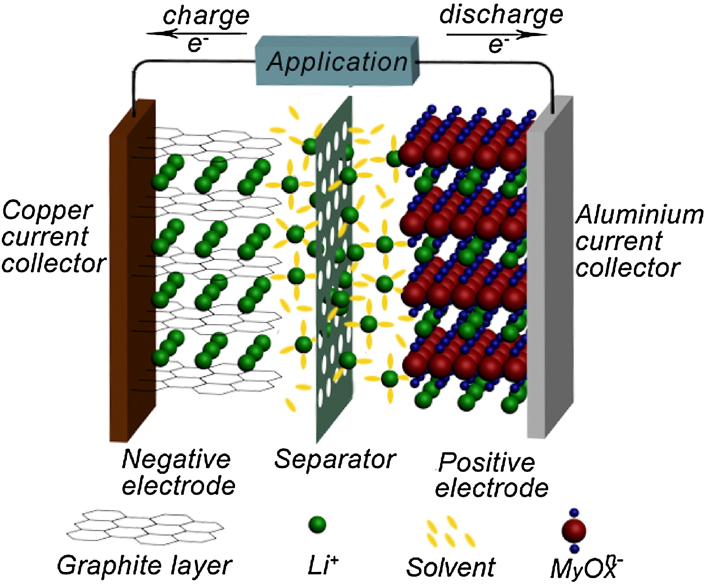  
Fig. 1. The operating principle of lithium ion batteries.

The commercialized electrolytes for lithium ion batteries (LIBs) are generally composed of lithium salts dissolved in a solvent [10], [11], [12], [13], [14], [15], [16], [17], [18], [19], [20]. LiPF6 is the most widely used lithium salt and propylene carbonate (PC), ethylene carbonate (EC), ethyl methyl carbonate (EMC), diethyl carbonate (DEC), dimethyl carbonate (DMC), or their mixed solvents are the commonly used solvents [21], [22]. The cyclic carbonates enable the dissolution of salts to sufficient concentrations because of their high dielectric constant, but they are rather viscous. The linear carbonates, on the other hand, promote rapid ion transport, because of their low viscosity, but their dielectric constant is low [21]. So the mixed solvents consisting of cyclic carbonates and linear carbonates display moderate dielectric constant and low viscosity, which are beneficial for improvement of the ion conductivity and then enhancement of the low temperature performance and rate performance of the batteries.  
锂离子电池（LIB）的商业化电解质通常由溶解在溶剂[10]，[11]，[12]，[13]，[14]，[15]，[16]，[17]中的锂盐组成[18]，[19]，[20]。 LiPF6是使用最广泛的锂盐和碳酸亚丙酯（PC），碳酸亚乙酯（EC），碳酸乙基甲酯（EMC），碳酸二乙酯（DEC），碳酸二甲酯（DMC）或它们的混合溶剂是常用的溶剂[21]，[22]。环状碳酸酯由于其高介电常数而能够将盐溶解到足够的浓度，但是它们相当粘。另一方面，线性碳酸根由于其低粘度而促进了快速的离子传输，但是它们的介电常数很低[21]。因此，由环状碳酸酯和线性碳酸酯组成的混合溶剂表现出适度的介电常数和低粘度，这有利于提高离子电导率，进而增强电池的低温性能和倍率性能。

Even though the commercial salt LiPF6 is successful in portable lithium ion batteries, LiPF6 still has some limitations, which restrict its applications at the elevated temperatures above 50 °C [23], [24]. LiPF6 is liable to thermally decompose and very sensitive to moisture [23], [25], [26], which are depicted in Eqs. (1), (2), (3). The generated PF5 resulting from thermal decomposition is a very strong Lewis acid, and can react irreversibly with trace of water to generate HF. HF itself reacts with organics on anode surface to form LiF, which increases the resistance of interphase (SEI) layer. To make matters worse, HF can erode cathode material dissolving metallic ions into the electrolyte and eventually depositing on the anode material surface destabilizing the SEI layers especially at elevated temperatures. The precipitated LiF from the decomposition of LiPF6 forming a dense coating is the most likely major contributor to the insulating layer found on cycled electrodes [27], [28].  
尽管商用盐LiPF6在便携式锂离子电池中获得了成功，但LiPF6仍然存在一些局限性，这限制了其在高于50°C的高温下的应用[23]，[24]。 LiPF6易于热分解并且对水分非常敏感[23]，[25]，[26]，如方程式所示。 （1），（2），（3）。由热分解产生的PF5是一种很强的路易斯酸，可以与微量水发生不可逆的反应，生成HF。 HF本身与阳极表面上的有机物反应形成LiF，这会增加相间（SEI）层的电阻。更糟的是，HF会腐蚀阴极材料，使金属离子溶解到电解质中，并最终沉积在阳极材料表面，从而使SEI层不稳定，尤其是在高温下。 LiPF6分解形成致密涂层而沉淀出的LiF最有可能是循环电极上发现的绝缘层的主要起因[27]，[28]

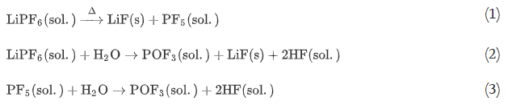  
Furthermore, lithium perchlorate (LiClO4), lithium hexafluoroarsenate (LiAsF6), lithium bis(trifluoromethanesulfonyl)imide (LiTFSI), lithium trifluoromethane-sulfonate (LiTf) and lithium bis(fluorosulfonyl)imide (LiFSI) can also be used as lithium salts, and they all have some merits and demerits [8], [29], [30], [31], [32], [33]. LiClO4 is one of the earliest salts used in the batteries. The electrolyte composed of LiClO4 presents high conductivity and good thermal stability, but chlorine in LiClO4 is in its highest valence state, strongly oxidizing. LiClO4 can react strongly with organic solvent under extreme conditions (such as at elevated temperature or high charging/discharging current density). Like LiClO4, LiAsF6 also has a good thermal stability. The electrolyte consisted of LiAsF6 and ether solvent has quite high conductivity. However, the reduction reaction of LiAsF6 will produce arsenic, which is highly poisonous and carcinogenic. Lithium bis(trifluoromethanesulfonyl)imide (LiTFSI), lithium trifluoromethanesulfonate (LiTf) and lithium bis(fluorosulfonyl)imide (LiFSI) possess high thermal stability but corrode the current collector aluminum foil at higher potentials (>3.6 V vs. Li/Li+) [5]. Thus, the search for an alternative salt for lithium batteries is necessary to maintain comprehensive and excellent performance.  
此外，高氯酸锂（LiClO4），六氟砷酸锂（LiAsF6），双（三氟甲烷磺酰基）酰亚胺锂（LiTFSI），三氟甲烷磺酸锂（LiTf）和双（氟磺酰基）酰亚胺锂（LiFSI）也可以用作锂盐，并且它们各有优缺点[8]，[29]，[30]，[31]，[32]，[33]。LiClO4是电池中使用的最早的盐之一。由LiClO4组成的电解质具有较高的电导率和良好的热稳定性，但LiClO4中的氯处于最高价态，会被强烈氧化。LiClO4在极端条件下（例如，高温或高充电/放电电流密度）可以与有机溶剂强烈反应。与LiClO4一样，LiAsF6也具有良好的热稳定性。由LiAsF6和醚溶剂组成的电解质具有很高的电导率。但是，LiAsF6的还原反应将产生砷，该砷具有剧毒和致癌性。双（三氟甲磺酰基）酰亚胺锂（LiTFSI），三氟甲磺酸锂（LiTf）和双（氟磺酰基）酰亚胺锂（LiFSI）具有较高的热稳定性，但在较高电势下（> 3.6 V vs. Li /Li +）会腐蚀集电体铝箔[ 5]。因此，寻找用于锂电池的替代盐对于维持全面和优异的性能是必要的。

Boron is a unique and exciting element. Over the years it has proved a constant challenge and stimulus not only to theoreticians, but also to industrial chemists and technologists. It is the only non-metal in Group IIIA of the periodic table and shows many similarities to its neighbor, carbon, and its diagonal relative, silicon. Thus, like C and Si, it shows a marked propensity to form covalent, molecular compounds, but it differs sharply from them in having one less valence electron than the number of valence orbitals, a situation sometimes referred to as “electron deficiency”. This has a dominant effect on its chemistry [34].  
硼是独特而令人兴奋的元素。多年来，事实证明，这不仅对理论学家，而且对工业化学家和技术人员都是不断挑战和刺激。它是元素周期表中IIIA族中唯一的非金属，并且与它的邻居碳和对角线相对的硅有许多相似之处。因此，与C和Si一样，它显示出形成共价分子化合物的显着倾向，但与它们的显着不同之处在于，其价电子比价轨道数少，这种情况有时称为“电子缺乏”。这对其化学起主要作用[34]。

The structural chemistry of B–O compounds is characterized by an extraordinary complexity and diversity and vast numbers of predominantly organic compounds containing B–O are known. B(OH)3 is a very weak monobasic and acts exclusively by hydroxyl-ion acceptance rather than proton donation.  
B–O化合物的结构化学特征是非同寻常的复杂性和多样性，并且已知有大量的主要含有B–O的有机化合物。 B（OH）3是非常弱的一元碱，仅通过羟基离子接受而不是质子给体起作用。

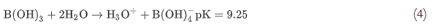  

Its acidity is considerably enhanced by chelation with polyhydric alcohols (e.g. glycerol, mannitol) (see Scheme 1) and this forms the basis of its use in analytical chemistry; e.g. with mannitol pK drops to 5.15 indicating an increase in the acid equilibrium constant by a factor of more than 104 [34]. Based on the above chemistry, many lithium borates represented by lithium bis(oxalate)borate (LiBOB) have been synthesized and developed in the last decade as lithium salts and additives in the electrolytes exhibiting unique properties such as excellent thermal stability, comparable ionic conductivity, cost-effectiveness and environmental benignity.  
与多元醇（例如甘油，甘露醇）螯合可大大提高其酸度（参见方案1），这构成了其在分析化学中使用的基础；例如甘露醇的pK降至5.15，表明酸平衡常数增加了四个数量级以上[34]。根据上述化学方法，在过去的十年中，以双（草酸）硼酸锂（LiBOB）为代表的许多硼酸锂已经合成并开发出来，它们是电解质中的锂盐和添加剂，具有独特的性能，例如出色的热稳定性，可比的离子电导率，成本效益和环境良性。

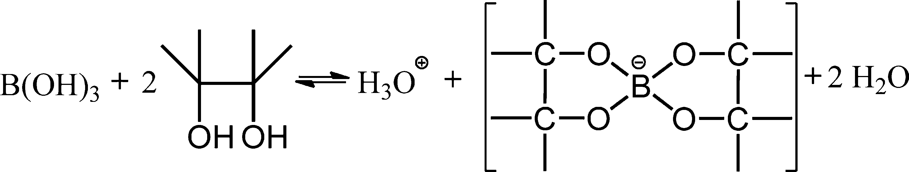  
Scheme 1. Schematic illustration of boric acid chelated with polyhydric alcohols.
方案1.硼酸与多元醇螯合的示意图。

The classic milestone review of non-aqueous liquid electrolyte for lithium ion batteries was made by Kang Xu almost ten years ago summarizing some lithium salts such as lithium perchlorate (LiClO4), lithium hexafluoroarsenate (LiAsF6), lithium tetrafluoroborate (LiBF4), lithium trifluoromethanesulfonate (LiTf), lithium bis(trifluoromethanesulfonyl)imide (LiTFSI), lithium hexafluorophosphate (LiPF6), and lithium bis(oxalate)borate (LiBOB) [5]. Then in 2011, Liu et al. presented an overview of the above lithium salts again and lithium oxalyldifluoroborate (LiDFOB) as well [35]. In terms of polymeric electrolytes, Wright described the advantages and characteristics of employing poly(ethylene oxide) (PEO) as all solid polymer electrolytes early in 1998 [36]. Then Song summarized the gel-type polymer electrolytes such as poly(ethylene oxide) (PEO), poly(acrylonitrile) (PAN), poly(methyl methacrylate) (PMMA) and poly(vinylidene fluoride) (PVDF)-based electrolytes in 1999 [30]. Recently, the research on polymer electrolytes and its progress was summarized again in 2011 by Scrosati [37]. Some other reviews related to the lithium ion battery electrolytes were also reported such as a review on electrolyte additives by Zhang [8] and another review on room temperature ionic liquids (RTILs) by Lewandowski [38]. Very recently, Gores gave a very brief summary on his lithium borates and ionic liquids synthesized in his lab [39]. To the best of our knowledge, no review articles on lithium borate salts have been systematically concluded till now.  
锂离子电池非水电解液的经典里程碑式回顾是康旭在大约十年前进行的，总结了一些锂盐，例如高氯酸锂（LiClO4），六氟砷酸锂（LiAsF6），四氟硼酸锂（LiBF4），三氟甲烷磺酸锂（ LiTf），双（三氟甲磺酰基）酰亚胺锂（LiTFSI），六氟磷酸锂（LiPF6）和双（草酸）硼酸锂（LiBOB）[5]。然后在2011年，Liu等人，再次提出了上述锂盐和草酰二氟硼酸锂（LiDFOB）的概述[35]。关于聚合物电解质，Wright于1998年初描述了使用聚环氧乙烷（PEO）作为所有固体聚合物电解质的优点和特性[36]。然后，Song在1999年总结了凝胶型聚合物电解质，例如聚环氧乙烷（PEO），聚丙烯腈（PAN），聚甲基丙烯酸甲酯（PMMA）和聚偏二氟乙烯（PVDF）基电解质[30]。最近，Scrosati于2011年再次总结了聚合物电解质的研究及其进展[37]。还报道了与锂离子电池电解质有关的其他评论，例如Zhang [8]对电解质添加剂的评论和Lewandowski [38]对室温离子液体（RTILs）的另一评论。最近，戈尔斯对他在实验室中合成的硼酸锂和离子液体作了非常简短的总结[39]。据我们所知，到目前为止，还没有系统地总结硼酸锂盐的评论文章。

Lithium borate salts have been arousing intensive interest in the lithium battery field due to their unique properties such as excellent thermal stability, comparable ionic conductivity, cost-effectiveness, environmental benignity and favorable SEI forming properties when compared to the conventional LiFP6 salt [40], [41], [42], [43], [44], [45], [46], [47], [48], [49], [50], [51], [52], [53], [54], [55], [56], [57], [58]. Herein, the recent progress of many lithium borate salts and their potential application in lithium batteries are summarized in this review. It is aimed at providing a comprehensive understanding of the key advancements achieved in this area of lithium borate salts as well as their potential application in high performance lithium batteries. This review will also incorporate preliminary results of recent work to identify single ion conductor, which has not received much attention yet. Our goal is therefore to provide a broad and concise scientific overview, encompassing the vast majority of research accomplished in the borate-based area over the last few years. So that new and established researchers in the battery area can obtain a clear perspective of this field.  
与传统的LiFP6盐相比，硼酸锂盐具有独特的性质，例如出色的热稳定性，可比的离子电导率，成本效益，环境友好性和良好的SEI形成性，已引起锂电池领域的广泛关注，[40] [41]，[42]，[43]，[44]，[45]，[46]，[47]，[48]，[49]，[50]，[51]，[52]，[53] ]，[54]，[55]，[56]，[57]，[58]。本文综述了许多硼酸锂盐的最新进展及其在锂电池中的潜在应用。旨在全面了解硼酸锂盐在该领域中取得的关键进展以及它们在高性能锂电池中的潜在应用。这篇综述还将纳入近期工作中确定单个离子导体的初步结果，目前尚未引起足够的重视。因此，我们的目标是提供广泛而简洁的科学概述，涵盖过去几年在基于硼酸盐的领域中完成的绝大多数研究。这样，电池领域的新老研究人员就可以清楚地了解这一领域。

According to the different chemical structures, the reported lithium borate salts can all be classified into three categories, i.e. non-aromatic lithium borates, aromatic lithium borates and single-ion dominantly conducting polyborates, which will be discussed in detail in the following sections.  
根据不同的化学结构，所报道的硼酸锂盐都可以分为三类，即非芳族硼酸锂，芳族硼酸锂和单离子主导导电多硼酸盐，将在以下部分中详细讨论。

### 2. Non-aromatic lithium borates 非芳族硼酸锂
The non-aromatic lithium borates are summarized in this section including the lithium salts such as LiBF4, LiB(CN)4, LiBOB and LiDFOB, whose chemical structures are depicted in Scheme 2 and their properties are listed in Table 1.  
本节概述了非芳族硼酸锂，包括锂盐，例如LiBF4，LiB（CN）4，LiBOB和LiDFOB，其化学结构列于流程2中，其性质列于表1中。

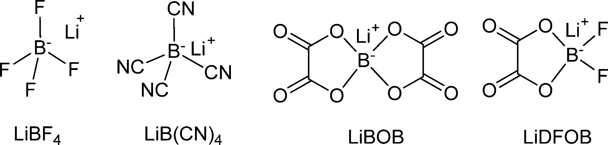  
Scheme 2. Structural formulae of non-aromatic lithium borates.

Table 1. Physical and electrochemical properties of non-aromatic lithium borates. * Theoretical arithmetic, ** 1,2-dimethoxy ethane (DME).  
表1.非芳族硼酸锂的物理和电化学性质。 *理论运算，**1,2-二甲氧基乙烷（DME）。  
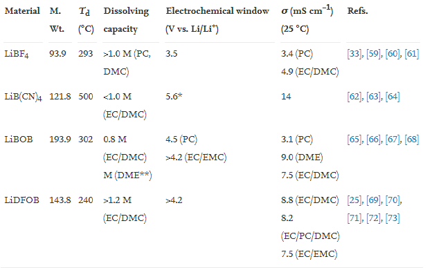  

#### 2.1. Lithium tetrafluoroborate (LiBF4)
Lithium tetrafluoroborate is an inorganic compound with the formula LiBF4 (shown in Scheme 2). It is very soluble in propylene carbonate and dimethyl carbonate. Its molecular weight is 93.9 Da, which is the smallest one among all the lithium salts. LiBF4 will melt at 293 °C and then decompose. The decomposition temperature of LiBF4 is higher than that of LiPF6 and its toleration to moisture content can be up to 620 ppm [33]. In early days, in order to overcome the drawbacks of LiPF6-based electrolytes, extensive attention had been paid to the development of LiBF4 [59], [74], [75]. Its synthesis was first reported by Shapiro et al. in 1953, which is shown in Eq. (5) [76].  
四氟硼酸锂是一种化学式为LiBF4的无机化合物（流程2中所示）。它非常溶于碳酸亚丙酯和碳酸二甲酯。它的分子量为93.9 Da，是所有锂盐中最小的。 LiBF4将在293°C熔化，然后分解。 LiBF4的分解温度高于LiPF6，并且其对水分的耐受性可以达到620 ppm [33]。早期，为了克服基于LiPF6的电解质的缺点，人们对LiBF4的开发给予了广泛关注[59]，[74]，[75]。 Shapiro等人首先报道了它的合成。 1953年，如等式所示。 （5）[76]。

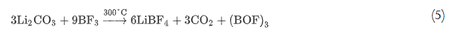  

A green procedure to make LiBF4 was developed by Zhou et al. (see Eq. (6)) [77]. During this synthetic process, no organic solvent was used. LiBF4 is a white crystalline powder and its ORTEP (Oak Ridge Thermal Ellipsoid Plot Program for Crystal Structure Illustrations) diagrams are depicted in Fig. 2.  
Zhou等人开发了一种绿色的制备LiBF4的方法。（参见等式（6））[77]。在该合成过程中，不使用有机溶剂。 LiBF4是白色结晶性粉末，其ORTEP（用于晶体结构说明的Oak Ridge热椭圆体图程序）图如图2所示。

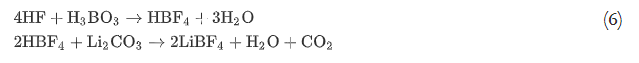  

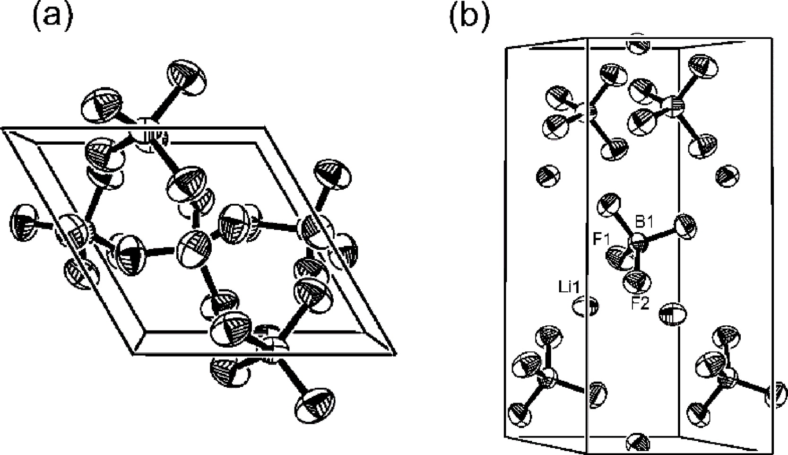  
Fig. 2. ORTEP diagrams of the LiBF4 unit cell: (a) view along the z-axis and (b) the view perpendicular to the z-axis. Displacement ellipsoids are shown at a 50% probability level.  
图2. LiBF4晶胞的ORTEP图：（a）沿z轴的视图，（b）垂直于z轴的视图。椭圆位移的概率为50％。

LiBF4 was favored for low temperature applications because of its low viscosity when used in electrolytes [60], [79]. Although LiBF4-based electrolyte provided lower ionic conductivity than LiPF6-based electrolyte, the cells based on LiBF4 electrolytes showed improved performance, not only at low temperatures but also, surprisingly, also at elevated temperatures up to 50 °C as well [33], [61], [80]. Another advantage of LiBF4 was that the LiBF4-based electrolyte could passivate aluminum better than the LiPF6-based one [33], [81]. Suppression of corrosion by adding LiBF4 was attributed to the formation of a stable passive layer on the surface of aluminum due to the reaction of aluminum with electrolyte and the decomposition of electrolyte solvent at high potentials. Behl and Plichta also reported the alleviated corrosion of aluminum when LiBF4 was used as an additive in the electrolyte [82], [83].  
LiBF4因在电解质中使用时粘度低而受到青睐[60]，[79]。尽管基于LiBF4的电解质提供的离子电导率低于基于LiPF6的电解质，但是基于LiBF4的电解质不仅在低温下而且在令人惊讶的是，在高达50°C的高温下也表现出更高的性能[33]， [61]，[80]。 LiBF4的另一个优点是，基于LiBF4的电解质比基于LiPF6的电解质能更好地钝化铝[33]，[81]。通过添加LiBF 4来抑制腐蚀归因于由于铝与电解质的反应以及在高电势下电解质溶剂的分解而在铝表面上形成了稳定的钝化层。 Behl和Plichta还报道了当LiBF4用作电解质的添加剂时铝的缓蚀作用[82]，[83]。

However, LiBF4 had a low anodic oxidization potential and its electrochemical window was only about 3.5 V vs. Li/Li+, which meant that it could not be used in high voltage battery. In addition, it could not form a stable SEI layer on the graphite electrode, which had been a major obstacle to limit its extensive application [59], [61], [83], [84].  
然而，LiBF4具有较低的阳极氧化电位，其电化学窗口相对于Li /Li +仅约为3.5 V，这意味着它不能用于高压电池。另外，它不能在石墨电极上形成稳定的SEI层，这是限制其广泛应用的主要障碍[59]，[61]，[83]，[84]。

#### 2.2. Lithium tetracyanoborate (LiB(CN)4)
Lithium tetracyanoborate is a chemical compound with the similar formula to LiBF4 with four cyano-chelating groups instead of four fluoro-substituents (shown in Scheme 2). It possesses relatively higher molecular weight of 121.8 Da than that of LiBF4, but still smaller than that of LiPF6 (151.9 Da). The LiB(CN)4 was synthesized using SiMe3CN as the starting material, which underwent metathesis with LiBF4 at low temperatures in non-aqueous solvents (see Eq. (7)) [62].  
四氰基硼酸锂是一种化学式与LiBF4相似的化合物，具有四个氰基-螯合基团，而不是四个氟取代基（方案2中所示）。它具有比LiBF4更高的分子量121.8 Da，但仍然比LiPF6的分子量（151.9 Da）小。 LiB（CN）4以SiMe3CN为起始原料合成，在低温下于非水溶剂中与LiBF4进行复分解反应（参见式（7））[62]。

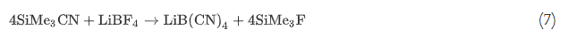  

Another way to produce LiB(CN)4 had been reported by Scheers, which was depicted in the following Eq. (8) [63].

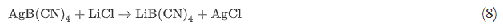

LiB(CN)4 is a thermally stable molecule that its decomposition temperature can be up to 500 °C. An ordered structure of LiB(CN)4 was found by Williams et al. and each Li was bonded to four N atoms and each B atom was bonded to four C atoms to form LiN4 and BC4 tetrahedra in solid state (see Fig. 3) [62]. Because of the strongly electron-withdrawing nitrile groups, B(CN)4− possesses a good resistance against anodic oxidation, which make this anion to have a wide electrochemical window up to 5.5 V vs. Li/Li+. Besides, the delocalization of electrons in an anion reduced the dissociation energy of lithium ion, which will be beneficial for its ionic conductivity. The affinity of B(CN)4− toward the lithium ion was smaller than that of BF4−, PF6− or AsF6−, which meant that LiB(CN)4 would have a high ionic conductivity [63].  
LiB（CN）4是一种热稳定分子，其分解温度可高达500°C。 Williams等人发现了LiB（CN）4的有序结构。每个Li与四个N原子键合，每个B与四个C原子键合形成固态LiN4和BC4四面体（见图3）[62]。由于强烈的吸电子腈基，B（CN）4-具有良好的抗阳极氧化性，这使该阴离子具有相对于Li/Li +高达5.5 V的宽电化学窗口。此外，阴离子中电子的离域作用降低了锂离子的离解能，这将有利于其离子电导率。 B（CN）4-与锂离子的亲和力小于BF4-，PF6-或AsF6-，这意味着LiB（CN）4具有较高的离子电导率[63]。

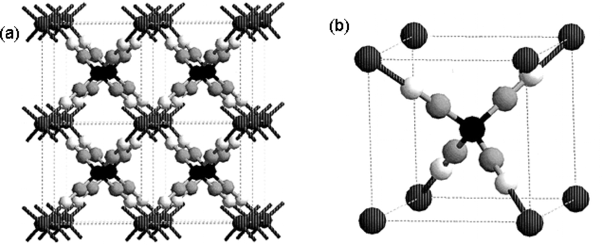  
Fig. 3. (a) Structure of LiB(CN)4 shown as interconnected LiN4 and BC4 tetrahedra. Black, gray, and white spheres are B, C, and N, respectively. Striped spheres with dangling bonds at the corners are the Li atoms. (b) Unit cell of LiB(CN)4.  
图3.（a）LiB（CN）4的结构显示为相互连接的LiN4和BC4四面体。黑色，灰色和白色球体分别为B，C和N。角处带有悬挂键的条状球是锂原子。 （b）LiB（CN）4的晶胞。

The LiB(CN)4-based electrolyte could improve the performance of a Li/LiFePO4 cell when compared to a LiBF4 based electrolyte [85]. For example, its electrolyte with polyethylene glycol dimethyl ether (PEGDME) was stable up to 4 V vs. Li/Li+ and showed excellent cycling performance, with a capacity retention of 99% over 22 cycles. In view of electrochemical stability and ionic conductivity, B(CN)4− is a contender for use in lithium batteries. Both the predicted oxidative stability and its weak coordination to lithium ions are valuable properties for these applications. In addition, Younesi et al. had investigated the Li–O2 batteries using LiB(CN)4 as salt and polyethylene glycol dimethyl ether or tetraethylene glycol dimethyl ether as solvents [86]. However, hard X-ray photoelectron spectroscopy clearly showed that the LiB(CN)4 salt degraded during cycling. Besides, the possibility of forming hyper toxic cyanide and the risk of leakage will severely hamper its practical application in lithium ion batteries.  
与基于LiBF4的电解质相比，基于LiB（CN）4的电解质可以改善Li /LiFePO4电池的性能[85]。例如，它的聚乙二醇二甲醚（PEGDME）电解质相对于Li /Li +在高达4 V的电压下稳定，并显示出出色的循环性能，在22个循环中的容量保持率为99％。考虑到电化学稳定性和离子电导率，B（CN）4-是用于锂电池的竞争者。对于这些应用而言，预测的氧化稳定性及其与锂离子的弱配位性都是有价值的特性。此外，Younesi等。研究了使用LiB（CN）4作为盐和聚乙二醇二甲醚或四甘醇二甲醚作为溶剂的Li-O2电池[86]。但是，硬X射线光电子能谱清楚地表明LiB（CN）4盐在循环过程中降解。此外，形成高毒性氰化物的可能性和泄漏的危险将严重阻碍其在锂离子电池中的实际应用。

#### 2.3. Lithium bis(oxalate) borate (LiBOB)
Lithium bis(oxalate)borate possesses two oxalate-coordination groups (shown in Scheme 2). Its molecular weight is 193.9 Da, which is a little bit higher than that of LiPF6 (151.9 Da). LiBOB has a high decomposition temperature of 302 °C. The solubility of LiBOB in carbonate solvents can reach 0.8 M in EC/DMC and 1.6 M in DME.  
双（草酸酯）硼酸锂具有两个草酸酯配位基团（显示在方案2中）。其分子量为193.9 Da，比LiPF6的分子量（151.9 Da）稍高。 LiBOB具有302°C的高分解温度。 LiBOB在碳酸盐溶剂中的溶解度在EC /DMC中可达0.8 M，在DME中可达1.6M。

##### 2.3.1. Synthesis and properties
LiBOB was once regarded as one of the most promising candidates for commercial use in the lithium batteries [23], [25], [66], [87], [88], [89], [90], [91], [92]. Its synthetic procedure was first reported by Lischka et al. in 1999, which was shown in Eq. (9) [93]. However, this reaction was carried out in an aqueous solution, it is quite tedious to get pure product without trace of water. Then Xu et al. adopted a non-aqueous reaction in aprotic solvent to obtain LiBOB with high purity shown in Eq. (10) [67]. Although this synthetic procedure was more complicated, there was no water involved in the reaction, which could meet the requirement of battery grade.  
LiBOB曾经被认为是锂电池商业应用中最有前途的候选人之一[23]，[25]，[66]，[87]，[88]，[89]，[90]，[91]， [92]。 Lischka等人首次报道了其合成方法。在1999年，如等式所示。 （9）[93]。但是，该反应是在水溶液中进行的，要获得纯净的产品而没有痕量的水是很繁琐的。然后徐等。通过在质子惰性溶剂中进行非水反应，获得了等式中所示的高纯度LiBOB。 （10）[67]。尽管该合成过程较复杂，但反应中没有水参与，可以满足电池等级的要求。

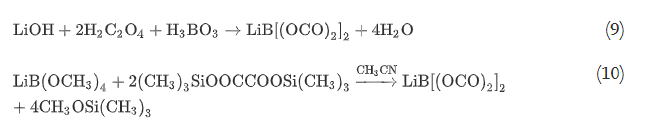  

##### 2.3.2. Electrochemical performance
###### 2.3.2.1. Electrochemical performance as a main salt
The maximum concentration of LiBOB can be 0.8 M in EC/DMC and 1.6 M in DME, whose ionic conductivity reaches 7.5 mS cm−1 and 9.0 mS cm−1, respectively. In addition, LiBOB could remain stable in organic solvents and the electrochemical window of LiBOB-PC is higher than 4.5 V vs. Li/Li+ [67]. A difference between LiBOB and LiPF6 is that at the anode side the BOB− anion is starting to reductively decompose at voltages of around 1.75 V vs. Li/Li+ (see Fig. 4). Moreover, the formation of the favorable SEI was completed at potentials even around 0.50 V vs. Li/Li+ and it was confirmed that BOB− anion played a critical role in the effectiveness of the formed SEI, which was robust to protect the graphite structure without solvent co-intercalation and exfoliation even in PC [67], [68], [88], [94]. The highest occupied molecular orbital (HOMO) and lowest unoccupied molecular orbital (LUMO) of the BOB− anion are depicted in Fig. 5. Investigation of the electronic structures of the anion and the radical revealed that the HOMO of the anion expanded over practically the entire molecule, whereas the radical LUMO was restricted to one of the oxalato groups. Comparing the SEI components of graphite anodes in LiPF6 and LiBOB electrolytes obtained by XPS analysis, Xu et al. came to a conclusion that the content of semicarbonate-like compounds significantly increased in the SEI due to the presence of BOB− anion [94]. Those semicarbonate-like compounds could dominate the chemical composition of the new SEI, and render the SEI stronger protection from solvent intercalation and solvent decomposition. Besides, LiBOB was reported to passivate aluminum current collector [23].  
LiBOB的最大浓度在EC /DMC中为0.8 M，在DME中为1.6 M，其离子电导率分别达到7.5 mS cm-1和9.0 mS cm-1。此外，LiBOB可以在有机溶剂中保持稳定，并且LiBOB-PC的电化学窗口相对于Li /Li +高于4.5 V [67]。 LiBOB和LiPF6之间的区别在于，在阳极侧，BOB-阴离子在相对于Li /Li +约为1.75 V的电压下开始还原性分解（见图4）。此外，即使在约0.50 V vs. Li /Li +的电位下，也能完成良好SEI的形成，并且证实BOB-阴离子在所形成SEI的有效性中起着至关重要的作用，在不使用石墨的情况下也能保护石墨结构溶剂共嵌入和剥落，甚至在PC中也是如此[67]，[68]，[88]，[94]。 BOB-阴离子的最高占据分子轨道（HOMO）和最低未占据分子轨道（LUMO）如图5所示。对阴离子和自由基的电子结构的研究表明，该阴离子的HOMO实际上扩展了整个分子，而自由基LUMO只限于草酸酯基之一。 Xu等人比较了XPS分析获得的LiPF6和LiBOB电解质中石墨阳极的SEI成分。得出的结论是，由于存在BOB-阴离子，SEI中的半碳酸盐类化合物的含量显着增加了[94]。这些类似半碳酸盐的化合物可以主导新SEI的化学成分，并为SEI提供更强的保护，使其免受溶剂插层和溶剂分解的影响。此外，据报道LiBOB可以钝化铝集电器[23]。

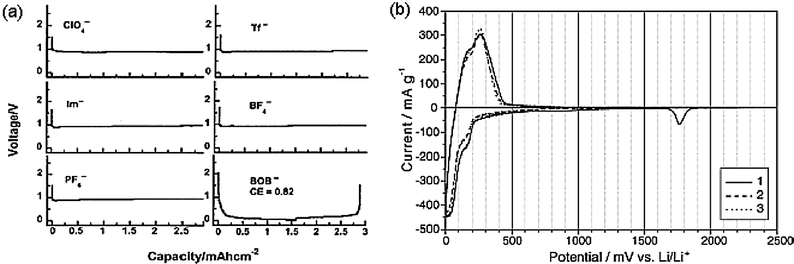  
Fig. 4. (a) The chronopotentiometric profiles of Li/graphite half-cells containing 1.0 M salts in PC as electrolytes. For LiBOB/PC electrolyte, only the first cycle is shown, with CE indicated in the graph. SAFT graphite serves as anode [68]. Reproduced by permission of The Electrochemical Society. (b) Cyclic voltammogram (first three cycles) of MCMB composite electrode in LiBOB/EC–EMC (scan rate: 0.1 mV s−1 and 0–2000 mV).  
图4.（a）在PC中含有1.0 M盐的Li /石墨半电池的计时电位曲线。对于LiBOB /PC电解液，仅显示第一个循环，图中显示了CE。 SAFT石墨用作阳极[68]。经电化学学会许可复制。 （b）LiBOB /EC-EMC中的MCMB复合电极的循环伏安图（前三个循环）（扫描速率：0.1 mV s-1和0-2000 mV）。

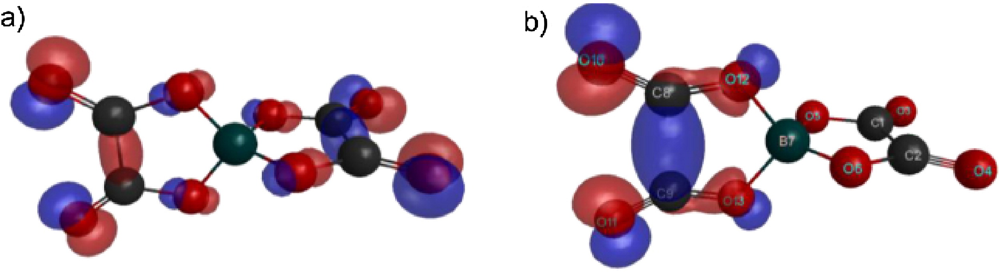  
Fig. 5. Optimized molecular geometries for the (a) BOB− anion and (b) BOB− radical, together with iso-surfaces illustrating shape and expansion of the relevant orbitals (a) HOMO of BOB− and (b) LUMO of the BOB− radical.  
图5.（a）BOB-阴离子和（b）BOB-自由基的优化分子几何结构，以及说明相关轨道的形状和扩展的等值面（a）BOB-的HOMO和（b）分子的LUMO BOB-自由基。

The development of secondary lithium batteries operated in relatively high temperature ranges represents an interesting alternative to state-of-the-art battery technology. LiBOB is one of the very promising candidates owing to its excellent thermal stability. The cathode material LiFePO4 possesses significantly high temperature stability up to 180 °C. The combination of LiFePO4 with thermally stable LiBOB salts in PC was cycled at relatively higher temperature up to 120 °C [95]. In addition, successful cycling at 100 °C with large capacity and small polarization was achieved using 1 M LiBOB in EC [96]. Belharouak also proved that the batteries operating at 55 °C using 0.7 M LiBOB in EC:PC:DMC electrolytes showed much lower capacity fading than the corresponding analogs of LiPF6 due to the suppression of iron dissolution [97]. Such effect has been recently confirmed in large cells that were also exhibiting significantly enhanced safety characteristic [98], which was in agreement with previous accelerating rate calorimetry (ARC) studies on the reaction between LiFePO4 and LiBOB in EC/DEC electrolyte [99]. These findings provided valuable information for the high temperature application in high power devices such as electric vehicles or measurement tools in oil well drilling.  
在较高温度范围内运行的二次锂电池的开发代表了最新电池技术的有趣替代。 LiBOB由于其出色的热稳定性而成为非常有前途的候选者之一。正极材料LiFePO4的高温稳定性高达180°C。 LiFePO4与PC中热稳定的LiBOB盐的组合在相对较高的温度下循环至最高120°C [95]。另外，在EC中使用1 M LiBOB在100°C下成功实现了大容量和小极化的循环[96]。 Belharouak还证明，在EC：PC：DMC电解质中使用0.7 M LiBOB在55°C下工作的电池，由于抑制了铁的溶解，其容量衰减比LiPF6的类似物低得多[97]。最近在大型电池中也证实了这种效应，这些大型电池还表现出显着增强的安全特性[98]，这与先前关于EC /DEC电解质中LiFePO4和LiBOB之间反应的加速量热法（ARC）研究一致[99]。这些发现为高温应用在大功率设备（例如电动汽车或油井钻探测量工具）中提供了有价值的信息。

Spinel-type lithium manganese oxide (LiMn2O4) and lithium nickel manganese oxide (LiNi0.5Mn1.5O4) are the most promising cathode materials for large-format lithium ion batteries for electric vehicles (EV) due to its cost-effectiveness, facile production, high discharge voltage plateau (∼4.0 V vs. Li/Li+ and ∼4.8 V vs. Li/Li+, respectively) and environmental benignity compared to other cathode materials [100], [101], [102], [103]. The LiMn2O4 based lithium batteries using conventional LiPF6-based electrolytes suffer from poor cycling performance at elevated temperatures (above 55 °C). This is mainly caused by the Mn dissolution generated from HF, which is originated from thermal decomposition of the LiPF6 salt at elevated temperatures. Fortunately, it was reported that the cell using LiBOB-based electrolyte maintained stable performance at elevated temperatures due to excellent thermal stability and absence of HF [92].  
尖晶石型锂锰氧化物（LiMn2O4）和锂镍锰氧化物（LiNi0.5Mn1.5O4）是电动汽车（EV）大型锂离子电池最有希望的正极材料，因为它具有成本效益高，生产容易，与其他正极材料相比，放电电压的平稳性较高（分别相对于Li /Li +约为4.0 V，对于Li /Li +约为4.8 V），并且与其他正极材料相比具有环境友好性[100]，[101]，[102]，[103]。使用常规的基于LiPF6的电解质的基于LiMn2O4的锂电池在高温（高于55°C）下循环性能较差。这主要是由HF产生的Mn溶解引起的，这是由于LiPF6盐在高温下的热分解引起的。幸运的是，据报道使用基于LiBOB的电解液的电池由于出色的热稳定性和HF的存在而在高温下保持稳定的性能[92]。

The above mentioned spinel-type lithium nickel manganese oxide (LiNi0.5Mn1.5O4) belongs to the 5 V high-voltage class cathode materials. To seek the promising candidate for 5 V electrolytes, Cui et al. chose LiBOB as the lithium salt, γ-butyrolactone (GBL) and sulfolane (SL) as supporting electrolyte solvents, and linear DMC as the third supporting electrolyte solvent to lower the viscosity [104]. The novel electrolyte exhibiting excellent cycling performance would be an alternative electrolyte for 5 V high-voltage lithium ion batteries.  
上述尖晶石型锂镍锰氧化物（LiNi0.5Mn1.5O4）属于5V高压类正极材料。为了寻找有希望的5 V电解质的候选者，Cui等人。选择LiBOB作为锂盐，选择γ-丁内酯（GBL）和环丁砜（SL）作为辅助电解质溶剂，并选择线性DMC作为第三种辅助电解质溶剂以降低粘度[104]。表现出优异循环性能的新型电解质将成为5 V高压锂离子电池的替代电解质。

Apart from traditional solvent, LiBOB can also be used for the silicon-based and ionic liquids-based (ILs) electrolyte [85], [105]. Kusachi et al. investigated the performance of LiBOB in one of the silicon-based electrolytes, tris(ethylene glycol)-substituted trimethylsilane [22]. The SEI characteristics and chemical components of both electrodes were investigated by X-ray photoelectron spectroscopy (XPS) and X-ray diffraction (XRD). The SEI components on the anode were similar to those using carbonate LiBOB electrolytes which consisted of lithium oxalate, lithium borooxalate, and LixBOy. Ionic liquids consisting of organic cation and inorganic anion have attracted a great deal of attention owing to their highly flame-resistant properties, negligible vapor pressure and high thermal stability, which make them attractive candidates for safe lithium ion battery electrolytes [106], [107], [108], [109], [110]. Saruwatari et al. have studied LiBOB dissolving in 1-ethyl-3-methyl-imidazolium tetrafluoroborate (EMIBF4) [85], [105], and they came to a conclusion that these electrolytes had high lithium ion conductivity. Furthermore, Saruwatari confirmed that the addition of LiBOB to EMIBF4 suppressed the reaction of lithium metal with EMI+ cation.  
除了传统的溶剂，LiBOB还可以用于硅基和离子液体基（ILs）电解质[85]，[105]。 Kusachi等。研究了LiBOB在一种硅基电解质三（乙二醇）取代的三甲基硅烷中的性能[22]。通过X射线光电子能谱（XPS）和X射线衍射（XRD）研究了两个电极的SEI特性和化学成分。阳极上的SEI组分与使用碳酸盐LiBOB电解质的SEI组分相似，后者由草酸锂，硼草酸锂和LixBOy组成。由有机阳离子和无机阴离子组成的离子液体由于具有高度的阻燃性，可忽略的蒸气压和高的热稳定性而受到了广泛的关注，这使其成为安全的锂离子电池电解质的有吸引力的候选者[106]，[107] ]，[108]，[109]，[110]。 Saruwatari等。已经研究了LiBOB溶于四氟硼酸1-乙基-3-甲基咪唑鎓盐（EMIBF4）[85]，[105]，得出的结论是这些电解质具有高的锂离子电导率。此外，Saruwatari证实，向EMIBF4中添加LiBOB可抑制锂金属与EMI +阳离子的反应。

###### 2.3.2.2. Electrochemical performance as an additive
The LiBOB has also been attracted considerable attention as an electrolyte additive to provide some specific function [22], [111], [112], which is illustratively presented in Fig. 6. LiBOB has proven its ability of forming a stable SEI film on the graphite surface as an additive. Only 2 wt.% LiBOB to the state-of-the-art LiPF6 electrolytes was enough to suppress the extensive solvent decomposition, which could cause graphite exfoliation destruction. In addition, it was also demonstrated that LiBOB additive in the LiPF6-electrolyte improved the cycling performance of the cathodes. The reason why LiBOB additive can make the batteries working at high temperature and high voltage was further proved by Pieczonka [113]. LiBOB can trap PF5 and HF, which are generated from the decomposition of LiPF6. PF5 tends to oxidize the carbonate solvents and HF is corrosive to the metal components in the cathodes. Pieczonka demonstrated that utilizing this peculiarity of LiBOB, the high-voltage half-battery containing manganese as positive cathode delivered an improved cycle life. The shortcomings of LiBOB such as low solubility, low ionic conductivity and decomposition limited its application as full lithium salts. However, LiBOB additive (between 0.1 M and 0.25 M concentration) in LiPF6-electrolyte played a synergetic role in stabilizing battery impedance and improving the cycling performance, especially at elevated temperatures, which were also reported by Shieh et al. [114]. When the 18650-type batteries using LiMn2O4 cathode cycled after 250 cycles at 55 °C, a large amount of mud-like SEI was formed on the anode surface in pure LiPF6 electrolyte system, which was different from that in LiBOB-containing systems revealing a clean surface on LiMn2O4. The morphology indicated the different formation and decomposition mechanisms of passive film on electrodes in LiBOB-based electrolyte systems, which accordingly resulted in improved electrochemical performance.  
LiBOB作为电解质添加剂还提供了一些特定功能[22]，[111]，[112]，引起了相当大的关注，如图6所示。LiBOB已被证明具有在SBO上形成稳定SEI膜的能力。石墨表面作为添加剂。相对于最新的LiPF6电解质，仅2％（重量）的LiBOB足以抑制大量的溶剂分解，这可能导致石墨剥落破坏。另外，还证明了LiPF 6电解质中的LiBOB添加剂改善了阴极的循环性能。 Pieczonka进一步证明了LiBOB添加剂可以使电池在高温高压下工作的原因[113]。 LiBOB可以捕获由LiPF6分解生成的PF5和HF。 PF5倾向于氧化碳酸盐溶剂，并且HF腐蚀阴极中的金属成分。 Pieczonka证明，利用LiBOB的这种独特性，包含锰作为正极的高压半电池可改善循环寿命。 LiBOB的缺点例如低溶解度，低离子电导率和分解限制了其作为全锂盐的应用。然而，Shieh等人也报道了LiPF6-电解质中的LiBOB添加剂（浓度介于0.1 M和0.25 M之间）在稳定电池阻抗和改善循环性能方面起着协同作用，尤其是在高温下。 [114]。当使用LiMn2O4阴极的18650型电池在55°C下循环250次后循环时，在纯LiPF6电解质体系的阳极表面上会形成大量泥状SEI，这与含LiBOB的体系不同，显示出在LiMn2O4上清洁表面。形态表明LiBOB基电解质系统中电极上钝化膜的形成和分解机理不同，从而改善了电化学性能。

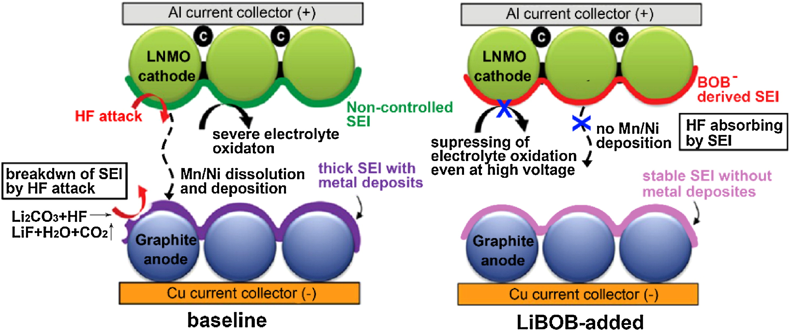  
Fig. 6. Schematic illustration of unique functions of LiBOB additive in a graphite/LiNi0.5Mn1.5O4 cell.  
图6.石墨/LiNi0.5Mn1.5O4电池中LiBOB添加剂独特功能的示意图。

A major challenge for fabricating high energy density batteries is to find suitable electrolytes that can match well with the high-voltage spinel cathode materials such as LiNi0.5Mn1.5O4, LiCoPO4, and LiMnFePO4, whose charging/discharging voltages are higher than 4.0 V vs. Li/Li+. However, conventional LiPF6 based electrolytes suffer from chemical degradation at higher voltages and elevated temperatures ≥60 °C. The instability of above-mentioned electrolyte is particularly detrimental to the operation of high-voltage spinel cathodes (shown in Fig. 6). Incorporation of 3 wt.% of LiBOB in conventional electrolyte solutions improved the cycling ability of LiCoPO4 electrode at high voltage (5.2 V vs. Li/Li+) and showed an improved capacity retention from 30% to 74% after 25 cycles [116]. LiBOB was also investigated as an additive to improve the cycling performance of LiNi0.5Mn1.5O4 cathode at high voltage (4.9 V vs. Li/Li+) [117]. Incorporation of low concentrations of LiBOB (0.25–1.0 wt.%,) resulted in a significant improvement in the capacity retention and cycling efficiency of LiNi0.5Mn1.5O4/Li cells. Electrochemical impedance spectroscopy indicated that the addition of LiBOB decreased cell impedance. Ex situ surface analysis of cycled cells suggested that the cathode surface films were thinner in cells cycled with addition of LiBOB. The addition of LiBOB inhibited detrimental reactions of the electrolyte with the surface of LiNi0.5Mn1.5O4 cathodes at high potentials [118], [119]. 1.0 wt.%, LiBOB addition to the LiPF6 electrolyte was reported to dramatically improve the cycling lives of Li1−xNi0.42Fe0.08Mn1.5O4 (LNFMO) |graphite full-cells at 30 °C and 45 °C over 80 cycles. The capacity retention increased from 18% to 80% at 30 °C and 5–40% at 45 °C, respectively [113]. It was demonstrated that the LiBOB additive could scavenge the PF5 that initiated the decomposition of electrolyte solvent and stabilize the electrolyte and the SEI on the graphite electrode against the deposition effects of the dissolved Mn [113].  
制造高能量密度电池的主要挑战是找到合适的电解质，这些电解质可以与高压尖晶石正极材料（例如LiNi0.5Mn1.5O4，LiCoPO4和LiMnFePO4）匹配，其充电/放电电压高于4.0 V vs Li /Li +但是，常规的基于LiPF6的电解质会在较高电压和≥60°C的高温下遭受化学降解。上述电解质的不稳定性特别不利于高压尖晶石阴极的操作（如图6所示）。在传统的电解液中加入3 wt％的LiBOB可改善LiCoPO4电极在高压（5.2 V vs. Li /Li +）下的循环能力，并在25个循环后显示出从30％到74％的容量保持率改善[116]。还研究了LiBOB作为添加剂，以改善LiNi0.5Mn1.5O4阴极在高压（4.9 V vs. Li /Li +）下的循环性能[117]。掺入低浓度的LiBOB（0.25–1.0 wt。％）导致LiNi0.5Mn1.5O4 /Li电池的容量保持率和循环效率显着提高。电化学阻抗谱表明，LiBOB的添加降低了细胞阻抗。循环电池的异位表面分析表明，在添加LiBOB的循环电池中，阴极表面膜更薄。 LiBOB的添加抑制了电解质与LiNi0.5Mn1.5O4阴极在高电势下的有害反应[118]，[119]。据报道，在LiPF6电解质中添加1.0 wt。％LiBOB可以显着改善Li1-xNi0.42Fe0.08Mn1.5O4（LNFMO）石墨全电池在30°C和45°C下80个循环的循环寿命。在30°C和45°C时，容量保持率分别从18％增加到80％[113]。事实证明，LiBOB添加剂可以清除引发电解质溶剂分解的PF5，并使电解质和SEI稳定在石墨电极上，以抵抗溶解的Mn的沉积作用[113]。

###### 2.3.2.3. Performance in gel or solid polymer electrolytes
The use of a gel or solid polymer electrolyte (GPE and SPE) to replace the conventional liquid electrolyte may help to tackle several problems: (i) suppression of lithium dendrites’ engender and growth; (ii) alleviation of interfacial reactivity between the electrode and liquid electrolytes due to the least use of alkyl carbonate solvents; (iii) improvement of safety issues, in addition to suppression of lithium dendrites, the quasi-solid-state construction of a polymer electrolyte is more tolerant to mechanical deformation; (iv) better shape flexibility and manufacturing integrity. Many reviews had elaborated the recent progress in polymer electrolyte [5], [120], [121], [122], [123], [124], [125]. Poly(vinylidene fluoride) (PVDF), poly(vinylidene fluoride-co-hexafluoropropylene) (PVDF-HFP), poly(ethyleneoxide) (PEO), polyacrylonitrile (PAN) and poly(methyl methacrylate) (PMMA) have been widely studied as polymer matrices for GPEs in order to make them feasible for commercial applications.  
用凝胶或固体聚合物电解质（GPE和SPE）代替传统的液体电解质可能有助于解决几个问题：（i）抑制锂枝晶的产生和生长； （ii）由于最少使用碳酸烷基酯溶剂而减轻了电极与液体电解质之间的界面反应性； （iii）改善安全性，除了抑制锂枝晶外，聚合物电解质的准固态结构更能承受机械变形； （iv）更好的形状灵活性和制造完整性。许多评论阐述了聚合物电解质的最新进展[5]，[120]，[121]，[122]，[123]，[124]，[125]。聚偏二氟乙烯（PVDF），聚偏二氟乙烯-共六氟丙烯（PVDF-HFP），聚环氧乙烷（PEO），聚丙烯腈（PAN）和聚甲基丙烯酸甲酯（PMMA）已被广泛研究用于GPE的聚合物基质，以使其在商业应用中可行。

The solvent-free, lithium-conducting polymer electrolytes had been prepared in professor Scrosati's group by hot-pressing a blend of PEO (molecular weight: 1 × 105) and LiBOB salt [126]. The (PEO)n-LiBOB polymer electrolytes possessed conductivity values varying from 10−5 to 10−3 S cm−1 in a temperature range from 30 °C to 80 °C. This high ionic conductivity was attributed to the remarkable amorphization effect on the PEO host induced by the BOB− anion. These (PEO)n-LiBOB polymer electrolytes exhibited lithium-ion transference number values ranging from 0.25 to 0.30 independent of the selected EO/Li molar ratio and operating temperature. These values were higher than the previous reported values for common PEO-LiX systems [127], [128], attributed to the large BOB− anion, whose mobility was lower than that of more common X− anions. Considering all these favorable properties, these (PEO)nLiBOB membranes appeared promising for solid polymer electrolytes of lithium batteries operating at high and medium temperatures. Tetrasiloxanes and trisiloxanes containing oligoether chains of various lengths –(CH2CH2O)n– (n = 2–7), were synthesized and doped with LiBOB salt as possible electrolytes for lithium batteries [129]. Conductivity data showed that these low viscosity materials (less than 10 cP) had some of the highest conductivities ever reported for polymeric electrolytes approaching 1 × 10−3 S cm−1 at 37 °C. Conductivity vs. temperature plots of the doped compounds fit the semi-empirical Vogel–Tammann–Fulcher (VTF) equation indicating the ions mobility had coupling interaction with the motion of the polymer chains [130], [131].  
Scrosati教授的小组通过热压PEO（分子量：1×105）和LiBOB盐的混合物制备了无溶剂，导电锂的聚合物电解质[126]。 （PEO）n-LiBOB聚合物电解质在30°C至80°C的温度范围内具有10-5至10-3 S cm-1的电导率值。较高的离子电导率归因于BOB-阴离子对PEO主体的显着非晶化作用。这些（PEO）n-LiBOB聚合物电解质的锂离子转移数值在0.25至0.30的范围内，与所选的EO /Li摩尔比和工作温度无关。这些值高于先前报道的常见PEO-LiX系统的值[127]，[128]，归因于大的BOB-阴离子，其迁移率低于更常见的X-阴离子。考虑到所有这些有利性能，这些（PEO）nLiBOB膜似乎有望用于在高温和中温下运行的锂电池的固体聚合物电解质。合成了含有各种长度为-（CH2CH2O）n-（n = 2-7）的低聚醚链的四硅氧烷和三硅氧烷，并掺入了LiBOB盐作为锂电池的可能电解质[129]。电导率数据显示，这些低粘度材料（小于10 cP）在37°C时具有报道过的聚合物电解质的最高电导率，接近1×10-3 S cm-1。掺杂化合物的电导率与温度的关系图拟合了半经验的Vogel-Tammann-Fulcher（VTF）方程，表明离子迁移率与聚合物链的运动具有耦合作用[130]，[131]。

The characterization of a low cost and very safe electrolyte prepared via the dissolution of LiBOB in a tetraethylene glycol dimethylether (LiBOB:TEGDME = 1:4, w/w) had been reported [52]. It was demonstrated that the electrolyte had conductivity ranging between 10−3 S cm−1 and 10−2 S cm−1 and a thermal stability as high as 180 °C. Sweep voltammetry of the electrolyte showed anodic oxidization stability extending over 4.6 V vs. Li/Li+ and cathodic peak at about 1.5 V vs. Li/Li+ relating to the reductive decomposition of LiBOB salt. Moreover, LiFePO4 cathode operated well in a lithium cell using the TEGDME-LiBOB electrolyte. Polymer gel electrolytes consisting of poly (2-ethoxyethyl methacrylate), LiBOB and different aprotic solvents (propylene carbonate, ethylene carbonate and dimethyl carbonate) had been prepared by a facile radical polymerization for lithium ion batteries operating at the elevated temperature of 70 °C [132]. The maximum value of the ionic conductivity was 2.4 × 10−3 S cm−1 at 70 °C for PEOEMA–DEC/EC–LiBOB (34:22/40:4 mol.%) sample. The electrochemical stability toward oxidation was up to 5.1 V (vs. Li/Li+). As reported polymer electrolytes delivered higher electrochemical and thermal stability compared to the conventional liquid electrolytes such as DEC/EC–LiBOB.  
已经报道了通过将LiBOB溶解在四甘醇二甲醚中制备的低成本且非常安全的电解质的特性（LiBOB：TEGDME = 1：4，w /w）[52]。结果表明，该电解质的电导率在10-3 S cm-1和10-2 S cm-1之间，并且热稳定性高达180°C。电解液的扫描伏安法显示，阳极氧化稳定性稳定在4.6 V vs. Li /Li +之上，并且在约1.5 V vs. Li /Li +上具有阴极峰，这与LiBOB盐的还原分解有关。此外，使用TEGDME-LiBOB电解质，LiFePO4阴极在锂电池中运行良好。通过在70℃的高温下操作的锂离子电池的自由基聚合，已经制备了由聚（甲基丙烯酸2-乙氧基乙酯），LiBOB和不同质子惰性溶剂（碳酸亚丙酯，碳酸亚乙酯和碳酸二甲酯）组成的聚合物凝胶电解质[ 132]。对于PEOEMA–DEC /EC–LiBOB（34：22/40：4 mol。％）样品，在70°C时离子电导率的最大值为2.4×10-3 S cm-1。电化学氧化稳定性高达5.1 V（vs. Li /Li +）。据报道，与传统的液体电解质如DEC /EC-LiBOB相比，聚合物电解质具有更高的电化学和热稳定性。

LiBOB was also studied with PMMA to obtain the PMMA gel polymer electrolytes [51]. The ionic conductivity of the 20 wt.%, PMMA containing GPE reached 3.58 mS cm−1 at 100 °C. Its conductivity–temperature relationship obeyed VTF equation, which indicated that the polymer chain motions contributed to the ion mobility. The GPE showed stability up to 4.7 V vs. Li/Li+ and the lithium ion transference number was 0.46 at 25 °C. This GPE was used as an electrolyte in a Li/LiCoO2 cell, and subjected to charge–discharge cycling between 4.2 V and 3.0 V with stable capacity of ∼130 mA h g−1 over 20 cycles.  
LiBOB还与PMMA一起研究得到PMMA凝胶聚合物电解质[51]。含GPE的20 wt。％PMMA的离子电导率在100°C时达到3.58 mS cm-1。它的电导率-温度关系遵循VTF方程，表明聚合物链的运动有助于离子迁移。 GPE相对于Li /Li +表现出高达4.7 V的稳定性，并且在25°C时锂离子转移数为0.46。该GPE用作Li /LiCoO2电池中的电解质，并在4.2 V和3.0 V之间经历了充放电循环，在20个循环中的稳定容量约为130 mA h g-1。

Ghosh et al. reported an average transference number for LiBOB added PEOb-(PMMA-ran-PMAALi) as 0.89 and 0.75 at 25 °C and 60 °C respectively [133]. The higher transference number obtained in this work may be attributed to the higher PMMA molecular weight (∼1 × 106) which contained longer molecular chains and specific chains. It was supposed that these longer chains could entangle to form helix, coiled and/or folded structures that could have a blocking effect to the transport of the large BOB− anion. The entanglements could immobilize the BOB− ions and thereby increased the transference number of the lithium ions.  
Ghosh等。报道了添加LiBOB的PEOb-（PMMA-ran-PMAALi）在25°C和60°C时的平均迁移数分别为0.89和0.75 [133]。这项工作获得的更高的转移数可能归因于更高的PMMA分子量（〜1×106），其中包含更长的分子链和特定链。据推测，这些较长的链可能缠结在一起，形成螺旋，卷曲和/或折叠结构，从而可能对大BOB-阴离子的运输产生阻碍作用。纠缠可以使BOB-离子固定化，从而增加锂离子的转移数。

It was demonstrated the overcharge tolerance of LiBOB battery was excellent, which was ascribed to the fact that the oxalate molecular moieties of LiBOB were preferably oxidized to produce CO2 by the oxygen released from the cathode, as shown in Eq. (11). This reaction produced CO2 very effectively (i.e., 1 mol salt for 4 mol CO2). More importantly it generates much less heat (smaller enthalpy change) than the oxidization of solvents in the case of LiPF6 battery. As a result of the mild oxidization of LiBOB, the internal pressure was rapidly built up by the released CO2, which consequently opened safety vent before thermal runway occurs. Considerable gas production was also observed in lithium ion cells based on LiCoO2 cathode by Wietlemann et al. [66], [98], [134]. So the batteries using LiBOB-based electrolytes were proposed to possess better safety characteristics.  
证实了LiBOB电池的过充电耐受性极好，这归因于如下事实：LiBOB的草酸盐分子部分优选被从阴极释放的氧氧化以产生CO2，如式1所示（11）。该反应非常有效地产生了CO2（即1mol盐对于4mol CO2）。更重要的是，与LiPF6电池相比，它产生的热量要少得多（焓变较小）。LiBOB的轻度氧化的结果是，释放的CO2迅速建立了内部压力，从而在热跑道发生之前打开了安全通风口。 Wietlemann等人在基于LiCoO2阴极的锂离子电池中也观察到大量气体产生。 [66]，[98]，[134]。因此，提出使用基于LiBOB的电解质的电池具有更好的安全性。

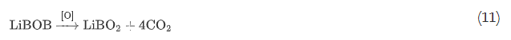  

In conclusion, LiBOB-based electrolytes possess special physicochemical property, electrochemical property and superior thermal stability. Particularly in PC-based electrolytes, LiBOB-based electrolytes allow the graphite as anode avoiding exfoliation owing to forming favorable SEI layer and endow batteries to have excellent cycling performance at elevated temperature. Meanwhile, LiBOB is environmental benign and not as sensitive to moisture as LiPF6 [21], [92]. However, the thick SEI layer formed in LiBOB-based electrolyte increased the interfacial impedance of the negative electrodes and the power capability of the lithium ion batteries was somehow affected. All these investigation and findings indicate that LiBOB will be widely used in next generation batteries, especially suitable in a large scale energy storage application.  
总之，基于LiBOB的电解质具有特殊的物理化学性质，电化学性质和优异的热稳定性。特别是在PC基电解液中，LiBOB基电解液由于形成了良好的SEI层而使石墨作为阳极避免了剥落，并使电池在高温下具有出色的循环性能。同时，LiBOB对环境无害，对水分的敏感性不如LiPF6 [21]，[92]。然而，在基于LiBOB的电解质中形成的厚的SEI层增加了负极的界面阻抗，并且以某种方式影响了锂离子电池的功率容量。所有这些调查和发现表明，LiBOB将被广泛用于下一代电池，特别适合大规模储能应用。

#### 2.4. Lithium difluoro(oxalate) borate (LiDFOB)
Lithium difluoro(oxalate) borate has one oxalate- and two fluoro-substituting groups (see Scheme 2), possessing the combined chemical structures of LiBOB and LiBF4 [38]. Its molecular weight is 143.8 Da, which is very close to than that of LiPF6 (151.9 Da). LiDFOB has a high decomposition temperature up to 240 °C. The solubility in carbonate solvents is much improved when compared to LiBOB and the maximum concentration of LiDFOB can reach 1.2 M in EC/DMC.
二氟草酸硼酸锂具有一个草酸酯基和两个氟取代基（参见方案2），具有LiBOB和LiBF4的组合化学结构[38]。其分子量为143.8 Da，非常接近LiPF6（151.9 Da）。 LiDFOB具有高达240°C的高分解温度。与LiBOB相比，在碳酸酯溶剂中的溶解度大大提高，并且EC /DMC中LiDFOB的最大浓度可以达到1.2M。

##### 2.4.1. Synthesis and properties
LiDFOB was synthesized by resultant mixture of oxalate acid and boric acid in a 3:2 molar ratio reacting with lithium fluoride [135]. High purity LiDFOB was obtained after recrystallization using a mixture of acetonitrile/toluene (1:1, v/v).  
通过以3：2的摩尔比的草酸和硼酸的混合物与氟化锂反应合成LiDFOB [135]。重结晶后，使用乙腈/甲苯的混合物（1：1，v /v）获得高纯度LiDFOB。

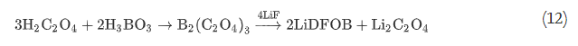  

Aravindan et al. discovered another procedure to make LiDFOB using boron trifluoride diethyletherate and lithium oxalate in a 1:1 molar ratio as starting materials and the product was purified through extraction and recrystallization using DMC solvent [55]. The advantage of this procedure was that no solvent separation was involved any more.  
Aravindan等。他发现了另一种使用三氟化硼二乙基醚化物和草酸锂以1：1摩尔比作为起始原料制备LiDFOB的方法，并通过萃取和使用DMC溶剂重结晶来纯化产物[55]。该方法的优点是不再涉及溶剂分离。

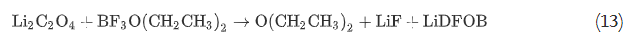  

##### 2.4.2. Electrochemical performance
###### 2.4.2.1. Electrochemical performance as a main salt
LiDFOB was first reported as an unique lithium salt by S.S. Zhang in 2006 for an improved electrolyte of Li-ion battery in terms of thermal stability, ionic conductivity, current collector compatibility and SEI forming properties [72]. This salt possessed the combined advantages of LiBOB and LiBF4 due to its chemical structure comprising both moieties of LiBOB and LiBF4. Compared with LiBOB, the salt was more soluble in linear carbonates and the resultant solution was less viscous, which resulted in improved low temperature and high rate performance. Compared with LiBF4, the salt was highly capable of stabilizing SEI on the surface of graphite anode, which enabled Li-ion cell to be operated stably at elevated temperatures.  
LiDFOB是由S.S. Zhang于2006年首次报道的独特锂盐，在热稳定性，离子电导率，集电体相容性和SEI形成性能等方面用于改进锂离子电池的电解质[72]。该盐由于其化学结构包括LiBOB和LiBF4的两个部分，因此具有LiBOB和LiBF4的组合优点。与LiBOB相比，该盐更易溶于线型碳酸盐，且所得溶液的粘度更低，从而改善了低温性能，提高了速率。与LiBF4相比，该盐具有很高的稳定石墨阳极表面SEI的能力，这使锂离子电池在高温下能够稳定运行。

The thermal stability of LiBF4, LiDFOB and LiBOB is shown in Fig. 7(a). Thermal decomposition of LiDFOB occurred at 240 °C, which was the lowest temperature among these three salts but still 40 °C higher than that of the LiPF6 salt. Besides, Zhang also compared the conductivity behavior of LiBOB, LiBF4 and LiDFOB in PC/EC/DMC, respectively [72]. Their conductivities for these three salts were significantly influenced by the temperature (shown in Fig. 7(b)). LiBOB had the highest conductivity among the three electrolytes and LiDFOB was in middle above 10 °C, but the order changed to that the conductivity of LiDFOB was higher than that of LiBOB below −30 °C. This behavior was attributed to the combined effect of salt dissociation and solution viscosity [55]. LiDFOB-based electrolyte possessed high conductivity and excellent capacity retention even at low temperature. Therefore, it was indicated that LiDFOB was a promising candidate for low temperature application. Furthermore, Zhang discovered that LiDFOB-based electrolyte could passivate the aluminum collector as LiBOB did at high voltage, which was attributed to the formation of a dense protecting layer on the aluminum surface through chemical combination of Al3+ and B–O molecular moieties.  
LiBF4，LiDFOB和LiBOB的热稳定性如图7（a）所示。 LiDFOB的热分解发生在240°C，这是这三种盐中最低的温度，但仍比LiPF6盐高40°C。此外，Zhang还分别比较了PC/EC/DMC中LiBOB，LiBF4和LiDFOB的电导行为[72]。它们对这三种盐的电导率受温度的显着影响（如图7（b）所示）。在三种电解质中，LiBOB的电导率最高，而LiDFOB在高于10°C的中部，但顺序改变为LiDFOB的电导率高于在30°C以下的LiBOB。这种行为归因于盐离解和溶液粘度的综合作用[55]。基于LiDFOB的电解质即使在低温下也具有高电导率和优异的容量保持率。因此，表明LiDFOB是低温应用的有希望的候选者。此外，张发现，LiDFOB基电解质可以像LiBOB在高压下那样钝化铝集电器，这归因于通过Al3 +和B-O分子部分的化学结合在铝表面形成了致密的保护层。

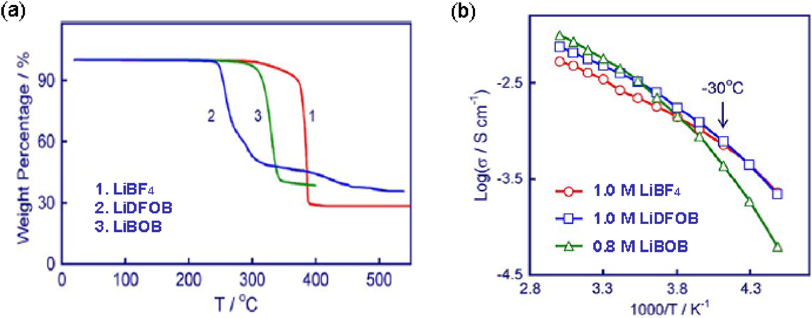  
Fig. 7. (a) Thermo gravimetric analysis of LiBF4, LiDFOB, and LiBOB at a heating rate of 10 °C min−1 under a nitrogen flow. (b) Arrhenius plots of the ionic conductivity of LiBF4, LiDFOB and LiBOB in a PC/EC/EMC (1:1:3, wt.) solvent mixture.  
图7.（a）在氮气流下以10°C min-1的加热速率对LiBF4，LiDFOB和LiBOB进行热重分析。 （b）PC /EC /EMC（1：1：3，wt。）溶剂混合物中LiBF4，LiDFOB和LiBOB的离子电导率的阿伦尼乌斯图。

The LiDFOB-based electrolytes in various carbonate electrolytes had been investigated for LiFePO4/artificial graphite (AG) cells by Li et al. in 2010 [25]. The 1 M LiDFOB in EC/PC/DMC (1:1:3, v/v) electrolyte possessed comparably higher ionic conductivity (8.25 mS cm−1 at 25 °C). Both the LiFePO4/Li and AG/Li half cells exhibited high coulombic efficiency and lower interfacial resistance, due to its relatively higher conductivity and better capability to form SEI film of low resistance. The LiFePO4/AG cells using this electrolyte displayed excellent capacity retention at −10 °C, 25 °C and even at elevated temperatures up to 65 °C. The rate performance of the cells using LiDFOB electrolyte was close to the cells that using LiPF6 electrolyte at 25 °C. Moreover, at the elevated temperature of 65 °C, the capacity retention of the cells with LiDFOB-based electrolyte was 88%, which was much higher than that of LiPF6-based electrolyte (50%). So this LiDFOB-based electrolyte was a promising electrolyte in LiFePO4/AG cells especially for high temperature application.  
Li等人已经对LiFePO4/人造石墨（AG）电池研究了各种碳酸盐电解液中基于LiDFOB的电解液。在2010年[25]， EC/PC/DMC（1：1：3，v/v）电解质中的1 M LiDFOB具有相对较高的离子电导率（25°C时为8.25 mS cm-1）。 LiFePO4 /Li和AG /Li半电池均显示出高库仑效率和较低的界面电阻，这是由于其相对较高的电导率和更好的形成低电阻SEI膜的能力。使用该电解质的LiFePO4 /AG电池在-10°C，25°C甚至高达65°C的高温下也显示出出色的容量保持能力。使用LiDFOB电解液的电池在25°C时的速率性能接近使用LiPF6电解液的电池的速率性能。此外，在65°C的高温下，基于LiDFOB的电解质的电池容量保持率为88％，远高于基于LiPF6的电解质（50％）。因此，这种基于LiDFOB的电解质在LiFePO4 /AG电池中是一种很有前途的电解质，特别是在高温应用中。

###### 2.4.2.2. Electrochemical performance as an additive
LiDFOB can also be used as electrolyte additive to improve the high temperature performance. Prof. K. Amine disclosed that the addition of LiDFOB to the electrolyte significantly improved the interfacial thermal stability of the lithiated mesocarbon microbeads (MCMB) in EC/EMC electrolyte. The activation energy of the thermal decomposition reactions increased with the increasing concentration of LiDFOB from 0% to 3.0% [24].  
LiDFOB还可以用作电解质添加剂，以改善高温性能。 K. Amine教授透露，在电解质中添加LiDFOB可以显着改善EC /EMC电解质中锂化的中碳微珠（MCMB）的界面热稳定性。随着LiDFOB浓度从0％增加到3.0％，热分解反应的活化能增加[24]。

Moreover, the cell using LiDFOB assisted electrolyte possessed low ohmic and charge-transfer resistance (shown in Fig. 8(b)). The EIS analysis and SEM observations on the cycled electrodes revealed that the thickness of SEI films on the surface of graphite was reduced in the presence of LiDFOB additive [56], [57]. The utilization of LiDFOB dramatically enhanced the cycling performance with capacity retention of about 66.4% after more than 200 cycles at 60 °C [57].  
而且，使用LiDFOB辅助电解质的电池具有低的欧姆电阻和电荷转移电阻（如图8（b）所示）。对循环电极的EIS分析和SEM观察表明，在LiDFOB添加剂存在下，石墨表面SEI膜的厚度减小了[56]，[57]。 LiDFOB的使用显着提高了循环性能，在60°C下经过200个循环后，容量保持率约为66.4％[57]。

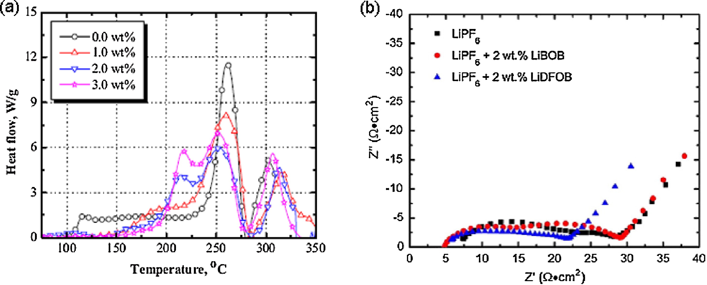  
Fig. 8. (a) DSC profiles of the thermal decomposition of lithiated MCMB in the non-aqueous electrolytes showing the positive impact of LiDFOB as the electrolyte additive. The scanning rate used was 10 °C min−1 [24]. Reproduced by permission of The Electrochemical Society. (b) EIS plots of graphite/LMR-NMC cells in 1.2 M LiPF6 EC/EMC (3/7 by weight) electrolyte with 2 wt.% LiBOB, LiDFOB, and without additives after 3 formation cycles (LMR-NMC, i.e. (Li2MnO3)0.4·(LiNi0.375Co0.25O2)0.4, a lithium-rich cathode material designated as Toda HE5050).  
图8.（a）非水电解质中锂化MCMB热分解的DSC曲线，显示了LiDFOB作为电解质添加剂的积极影响。使用的扫描速率为10°C min-1 [24]。经电化学学会许可复制。 （b）在3个成型周期后（LMR-NMC，在1.2 M LiPF6 EC /EMC（3/7重量比）电解质中，含2 wt。％LiBOB，LiDFOB和不含添加剂的石墨/LMR-NMC电池的EIS图） Li 2 MnO 3）0.4·（LiNi 0.375 Co 0.25 O 2）0.4，富锂阴极材料，称为Toda HE5050）。

The mechanism of LiDFOB stabilizing SEI is entirely based on a series of complicated exchange reactions, instead of the reduction as observed in the case of electrolyte additives such as vinylene carbonate. LiDFOB in the electrolyte simultaneously undergoes two chemical equilibria (1) and (2), as shown in Scheme 3, where both (I) and (II) can combine with the main SEI components, such as lithium semi-carbonate (III), to form more complicated and stable oligomers [24], [25], [73].  
LiDFOB稳定SEI的机理完全基于一系列复杂的交换反应，而不是像碳酸亚乙烯酯这样的电解质添加剂所观察到的还原。如方案3所示，电解液中的LiDFOB同时经历了两个化学平衡（1）和（2），其中（I）和（II）都可以与主要SEI组分结合，例如半碳酸锂（III），形成更复杂和稳定的低聚物[24]，[25]，[73]。

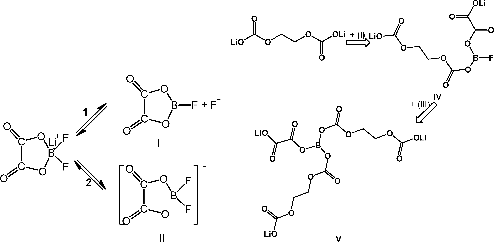  
Scheme 3. The probable SEI-forming mechanism of LiDFOB-based electrolytes. 基于LiDFOB的电解质的可能的SEI形成机理。

The mechanism of thermal stability enhancement for the LiDFOB additive based electrolyte and interface layers has been investigated by Xu and coworkers in 2011 [57]. It was verified by NMR measurements that the addition of LiDFOB to LiPF6-based electrolytes inhibited the autocatalytic thermal decomposition of the electrolyte, generating lithium tetrafluorooxalatophosphate (LiPF4C2O4) and LiBF4 due to the synergistic effect between LiDFOB and LiPF6 at elevated temperature of 85 °C. The formation of borates or its derivative products resulting from the degradation of LiDFOB on both electrodes was also a leading factor for the improvement of the cycling performance at elevated temperature [57]. This improved performance was ascribed to the assistance of LiDFOB in forming favorable SEI layers on both anode and cathode and subsequently resulted in the enhancement of the thermal stability of the electrolyte.  
Xu和同事在2011年研究了基于LiDFOB添加剂的电解质和界面层的热稳定性增强机制[57]。通过NMR测量证实，在基于LiPF6的电解质中添加LiDFOB会抑制电解质的自催化热分解，由于在85°C的高温下LiDFOB和LiPF6之间具有协同作用，因此生成了四氟草酸锂（LiPF4C2O4）和LiBF4。两个电极上LiDFOB降解所导致的硼酸盐或其衍生物的形成，也是提高高温下循环性能的主要因素[57]。这种改善的性能归因于LiDFOB在阳极和阴极上均形成有利的SEI层的辅助，并因此提高了电解质的热稳定性。

In conclusion, the LiDFOB-based electrolytes have shown excellent electrochemical performance and their cells delivered improved cycling performance at high temperature and good safety characteristics owing to its combined advantages of LiBOB and LiBF4 [72]. Therefore, it possesses a very promising prospect in lithium batteries, especially for electric vehicles. However, the investigation of LiDFOB-based electrolytes is not as intensive as for LiBOB-based electrolytes. In addition, their applications in high voltage electrolytes, gel and solid polymeric electrolytes or ionic liquid electrolytes and their related fundamental issues have not yet been discussed.  
总之，由于LiBOB和LiBF4的综合优势，基于LiDFOB的电解质已显示出优异的电化学性能，并且其电池在高温下具有改善的循环性能和良好的安全性[72]。因此，在锂电池，特别是电动汽车中，它具有非常广阔的前景。然而，基于LiDFOB的电解质的研究不像基于LiBOB的电解质那样深入。另外，尚未讨论它们在高压电解质，凝胶和固体聚合物电解质或离子液体电解质中的应用以及相关的基本问题。

### 3. Aromatic lithium borates
The aromatic lithium borates are outlined in this section including lithium bis[1,2-benzenediolato (2-)-O,O′] borate (LiBBB), lithium bis[3-fluoro-1,2-benzenediolato (2-)-O,O′] borate (LiBFBB), lithium bis[tetrafluoro-1,2-benzenediolato (2-)-O,O′] borate (LiBTBB), lithium bis[2,2′-naphthalenediolato (2-)-O,O′] borate (LiBNB), lithium bis(salicylate-2-) borate (LiBSB), lithium bis[2,2′-biphenyldiolato (2-)-O,O′] borate (LiBBPB), lithium [1,2-benzenediolato (2-)-O,O′ oxalato] borate (LiBDOB). Their chemical structures and physical and electrochemical properties are presented in Scheme 4 and Table 2 respectively. There are two other aromatic lithium borates reported as additives, i.e. lithium salicylato-oxalato borate (LiSOB) and tris(pentafluorophenyl) borane (TPFPB), and their chemical structures are given in Scheme 5.  
本节概述了芳香族硼酸锂，包括双[1,2-苯二醇基（2-）-O，O']硼酸锂（LiBBB），双[3-氟-1,2-苯二醇基（2-）-O，O']硼酸酯（LiBFBB），双[四氟-1,2-苯二醇基（2-）-O，O']硼酸锂（LiBTBB），双[2,2'-萘二醇基（2-）-O ，O']硼酸锂（LiBNB），双（水杨酸-2-）硼酸锂（LiBSB），双[2,2'-联苯基二醇（2-）-O，O']硼酸锂（LiBBPB），锂[1， [2-苯二醇基（2-）-O，O'草酸酯]硼酸盐（LiBDOB）。它们的化学结构以及物理和电化学性质分别在方案4和表2中给出。据报道还有另外两种芳族硼酸锂作为添加剂，即水杨基-草酸硼酸锂（LiSOB）和三（五氟苯基）硼烷（TPFPB），其化学结构在方案5中给出。

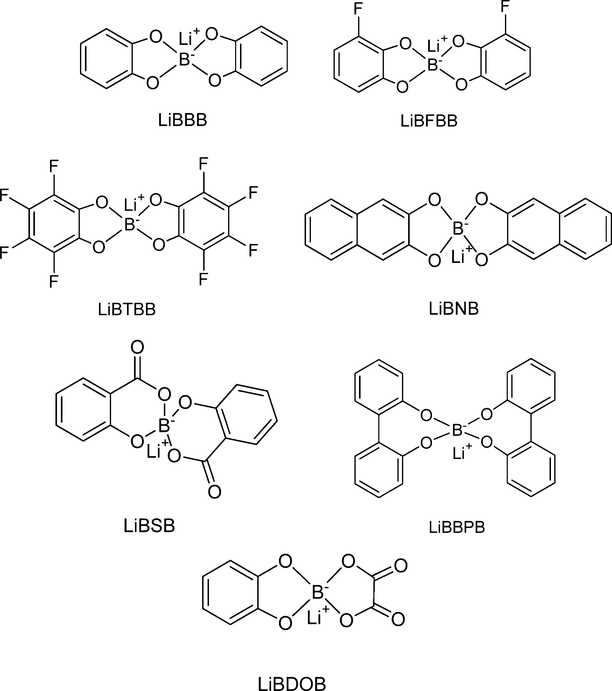  
Scheme 4. Structural formulae of aromatic lithium borates. 芳族硼酸锂的结构式。

Table 2. Physical and electrochemical properties of the aromatic lithium borates.
表2。芳族硼酸锂的物理和电化学性质。  
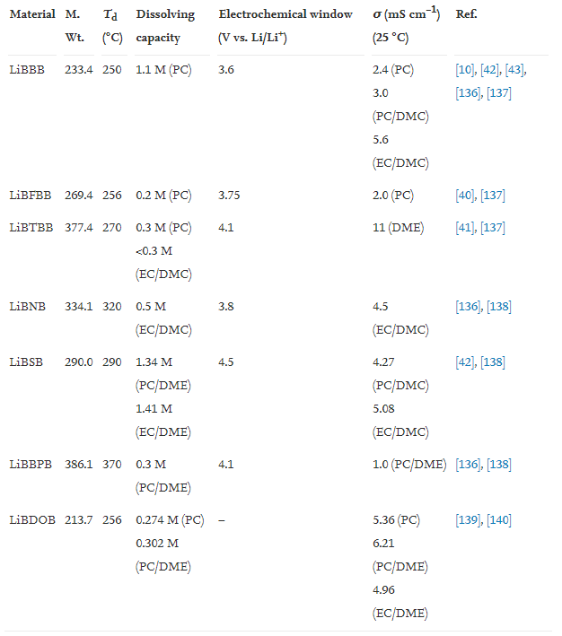

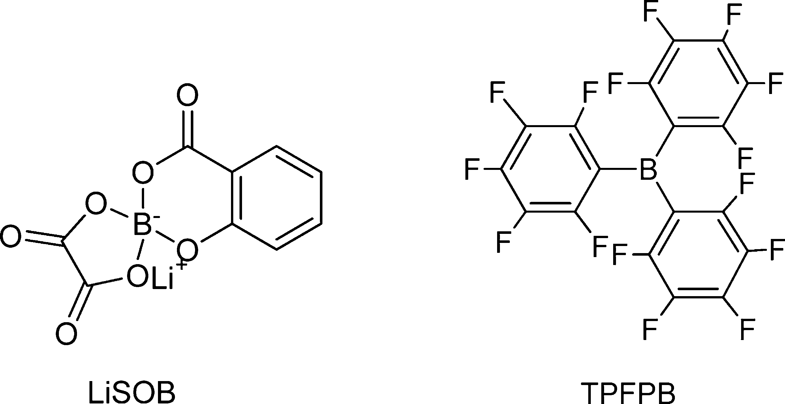  
Scheme 5. Structural formulae of aromatic lithium borate additives. 芳族硼酸锂添加剂的结构式。

#### 3.1. Lithium bis[1,2-benzenediolato (2-)-O,O′] borate (LiBBB)
Lithium bis[1,2-benzenediolato(2-)-O,O′] borate possesses two pyrocatechol-chelating groups (shown in Scheme 4) [141]. Its molecular weight is 233.4 Da, which is relatively large consisting of two aromatic phenyl rings. LiBBB has a high decomposition temperature at 250 °C [138]. Its solubility can reach 1.1 M in PC.  
硼酸双[1,2-苯二醇基（2-）-O，O']锂具有两个邻苯二酚螯合基团（方案4中显示）[141]。它的分子量为233.4 Da，相对较大，由两个芳族苯环组成。 LiBBB在250°C时具有很高的分解温度[138]。它在PC中的溶解度可以达到1.1M。

The synthesis of LiBBB was reported by Wuhr, which was depicted in Eq. (14) as follows [142].  

  

LiBBB starts to decompose when the temperature come to 250 °C, which made it possible candidate to replace LiPF6 when the battery is operated at elevated temperatures. In addition, ion pair formation is suppressed in LiBBB due to the charge delocalization of the large aromatic phenyl rings, which will be beneficial for the ionic conductivity. The solubility of this lithium salt in various carbonate solvents is more than 1 mol L−1.  
当温度达到250°C时，LiBBB开始分解，这使得在高温下操作电池时可以选择更换LiPF6。另外，由于大的芳族苯环的电荷离域，LiBBB中的离子对形成受到抑制，这将有利于离子电导率。该锂盐在各种碳酸盐溶剂中的溶解度大于1mol L-1。

In 1995, LiBBB was studied as a lithium salt in lithium batteries by Barthel and his coworkers [10]. They claimed that LiBBB could be used as a class of nontoxic, thermally, chemically, and electrochemically stable and inexpensive lithium salts compared to LiPF6 salt.  
1995年，Barthel及其同事研究了LiBBB作为锂电池中的锂盐[10]。他们声称，与LiPF6盐相比，LiBBB可以用作一类无毒，热，化学和电化学稳定且廉价的锂盐。

However, LiBBB showed poor electrochemical stability than LiPF6. The voltage window of LiBBB-based solutions was limited by the oxidation of the catechol moieties at about 3.6 V vs. Li/Li+, independent of the solvent [10]. The voltage window was too low for its application in lithium ion batteries with strongly oxidizing cathode materials such as LiMn2O4, which required an electrochemical stability range of about 4–4.5 V vs. Li/Li+. In order to increase the electrochemical stability at high voltage, fluorinated analogs were further investigated which would be discussed in the following section.  
但是，LiBBB的电化学稳定性比LiPF6差。基于LiBBB的溶液的电压窗口受到相对于Li/Li+约3.6 V的邻苯二酚部分氧化的限制，而与溶剂无关[10]。电压窗口太低，不足以用于具有强氧化性正极材料（例如LiMn2O4）的锂离子电池，相对于Li/Li+，该材料的电化学稳定性范围约为4-4.5V。为了提高高电压下的电化学稳定性，对氟化类似物进行了进一步研究，将在下一节中进行讨论。

#### 3.2. Lithium bis[3-fluoro-1,2-benzenediolato (2-)-O,O′] borate (LiBFBB)
LiBFBB is a kind of fluoro-substituted derivative of LiBBB with the molecular weight of 269.4 Da (shown in Scheme 4). It decomposes at 256 °C. Its synthesis was given below [142].  
LiBFBB是LiBBB的一种氟取代的衍生物，分子量为269.4Da（方案4所示）。在256°C时分解。其合成如下[142]。

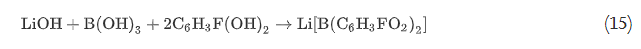

As a fluorine substituent replaced a hydrogen substituent on the phenyl ring, the charge distribution of boron anion was more delocalized than that of LiBBB. Therefore, the solution composed of LiBFBB would have higher conductivity than that of LiBBB [40]. Even so, the voltage window was improved slightly to 3.75 V vs. Li/Li+, which still could not meet the requirements of lithium ion battery despite minor advancement [42], [43], [137].  
由于氟取代基取代了苯环上的氢取代基，因此硼阴离子的电荷分布比LiBBB的电荷分布更局限。因此，由LiBFBB组成的溶液具有比LiBBB更高的电导率[40]。即便如此，电压窗口相对于Li /Li +仍略微提高到3.75 V，尽管取得了一些小进步[42]，[43]，[137]，但仍不能满足锂离子电池的要求。

#### 3.3. Lithium bis[tetrafluoro-1, 2-benzenediolato (2-)-O,O′] borate (LiBTBB)
LiBTBB is the eight fluoro-substituted derivative of LiBBB with the molecular weight of 377.4 Da (see Scheme 4). LiBBB has a high decomposition temperature at 270 °C, but poor solubility in carbonate solvents.  
LiBTBB是LiBBB的八种氟取代的衍生物，分子量为377.4 Da（参见方案4）。 LiBBB在270°C时具有较高的分解温度，但在碳酸盐溶剂中的溶解性较差。

LiBTBB was first synthesized by Barthel in 1996 [41]. The process of synthesis is depicted as follows.  
LiBTBB由Barthel于1996年首次合成[41]。合成过程描述如下。  
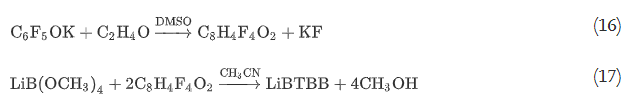

Compared with LiBFBB, the molecule of LiBTBB has more fluorine substituents. Despite the lower mobility of the larger anion, its extensive charge delocalization in its anion caused by strongly electron withdrawing substituents made it to show weak anion solvent interaction. Due to this particular feature, LiBTBB yielded sufficiently high ionic conductivity solutions, and exhibited wide electrochemical stability windows 4.1 V vs. Li/Li+ [41], [42], [137].  
与LiBFBB相比，LiBTBB分子具有更多的氟取代基。尽管较大阴离子的迁移率较低，但由于强烈的吸电子取代基导致阴离子中广泛的电荷离域，使其显示出弱的阴离子溶剂相互作用。由于这个特殊的特性，LiBTBB产生了足够高的离子电导率溶液，并且相对于Li /Li +表现出4.1 V的宽电化学稳定性窗口[41]，[42]，[137]。

#### 3.4. Lithium bis[2,2′-naphthalenediolato (2-)-O,O′] borate (LiBNB)
LiBNB has two naphthalene chelating groups with even bigger molecular weight of 334.1 Da (shown in Scheme 4). Compared with LiBBB, it has a higher decomposition temperature up to 320 °C and lower solubility in carbonate solvents.  
LiBNB具有两个萘螯合基团，其分子量甚至更大，为334.1 Da（如方案4所示）。与LiBBB相比，它的分解温度最高可达320°C，在碳酸酯溶剂中的溶解度较低。

LiBNB was made from commercially available 2,3-dihydroxynaphthylene, boric acid, and lithium hydroxide. The scheme of its synthesis was depicted in Eq. (17) [41].  
LiBNB由可商购的2，3-二羟基萘，硼酸和氢氧化锂制成。其合成方案在等式中描述。 （17）[41]。

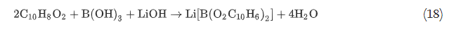  
LiBNB had a large molecular weight of anion, so the viscosity of LiBNB electrolyte was considerably higher than that of LiBBB electrolyte. However, the conductivity of LiBNB electrolytes was comparable to that of LiBBB [136]. Moreover, when compared with those cells using traditional electrolytes, such as LiPF6 and LiClO4-based electrolytes, the cell using LiBNB-electrolyte delivered moderate discharge capacities. The efficiency of the LiBNB electrolyte after long cycling was nearly equal to that of the LiPF6 and LiClO4-based electrolytes. However, its electrochemical window was only to 3.8 V vs. Li/Li+ in EC/DMC, which hindered its future application in lithium ion batteries [42].  
LiBNB具有大的阴离子分子量，因此LiBNB电解质的粘度明显高于LiBBB电解质的粘度。然而，LiBNB电解质的电导率与LiBBB相当[136]。此外，与使用传统电解质（如LiPF6和LiClO4基电解质）的电池相比，使用LiBNB电解质的电池具有中等的放电容量。经过长时间循环后，LiBNB电解质的效率几乎等于LiPF6和LiClO4基电解质的效率。然而，它的电化学窗口相对于EC /DMC中的Li /Li +仅为3.8 V，这阻碍了它在锂离子电池中的未来应用[42]。

3.5. Lithium bis(salicylate-2-) borate (LiBSB)
Lithium bis(salicylate-2-) borate possesses two salicylato chelating groups with the molecular weight of 290.0 Da (shown in Scheme 4). The decomposition reaction of LiBSB will occur at 290 °C. Its solubility can reach 1.3 M in carbonate solvents. LiBSB was obtained by the direct reaction of lithium hydroxide, boric acid and the bidentate ligand salicylic acid in water according to Eq. (19) [42].  
双（水杨酸-2-）硼酸锂具有两个水杨酸基螯合基团，分子量为290.0 Da（方案4中所示）。 LiBSB的分解反应将在290°C发生。在碳酸盐溶剂中的溶解度可达到1.3M。 LiBSB由氢氧化锂，硼酸和双齿配体水杨酸根据方程式直接在水中反应制得。 （19）[42]。  
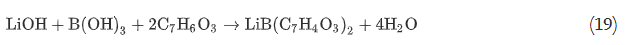  

As salicylato group had a lower oxidation potential value than oxalate group, LiBSB possesses a comparatively lower oxidation potential than LiBOB [26]. The CV studies of LiMn2O4 in LiBSB-electrolyte showed that bis(salicylato)borate anions underwent irreversible oxidation between 4.5 V vs. Li/Li+ and resulted in the formation of passivating surface films. The calculated HOMO and LUMO of the BSB− anion are presented in Fig. 9. Both HOMO and LUMO were mainly located at one of the salicylato groups, although some contribution of the other group could be detected, especially in the case of the radical. The cells using LiBSB-electrolyte exhibited a high efficiency for a long cycling, despite the lower ion conductivity than that of LiBBB or LiBNB [138]. So, as lithium salt for lithium ion battery, LiBSB might process a promising prospect in low voltage batteries. However, many fundamentals such as ionic conductivity and transference numbers and electrode compatibility are still no clear yet.  
由于水杨基基团的氧化电势值低于草酸基团，因此LiBSB的氧化电势低于LiBOB [26]。 LiBSB电解质中LiMn2O4的CV研究表明，双（水杨酸根）硼酸根阴离子在4.5 V vs. Li /Li +之间经历不可逆氧化，并导致钝化表面膜的形成。计算得出的BSB-阴离子的HOMO和LUMO见图9。HOMO和LUMO都主要位于一个水杨基基团中，尽管可以检测到另一基团的某些贡献，尤其是在自由基的情况下。尽管使用的LiBSB电解质的离子电导率低于LiBBB或LiBNB的电导率，但仍表现出高效率的长周期循环[138]。因此，作为锂离子电池的锂盐，LiBSB有望在低压电池中有广阔的发展前景。然而，诸如离子电导率和迁移率数以及电极相容性等许多基本原理仍不清楚。

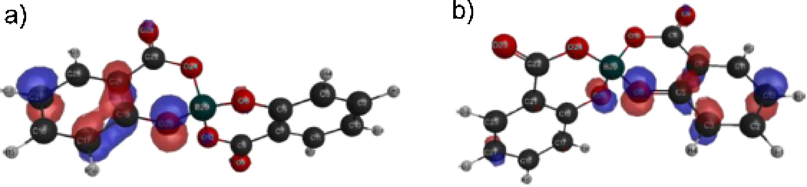  
Fig. 9. Bis(salicylato) borate (BSB−), structure and orbital shape of the (a) BSB− anion with HOMO and (b) BSB− radical with LUMO.  
图9.（a）BSB-阴离子与HOMO和（b）BSB-自由基与LUMO的双（水杨酸根）硼酸盐（BSB-），结构和轨道形状。

#### 3.6. Lithium bis[2,2′-biphenyldiolato (2-)-O,O′] borate (LiBBPB)
LiBBPB possesses two large biphenyl chelating groups with much larger molecular weight of 386.1 Da (shown in Scheme 4). It has a very high decomposition temperature up to 370 °C but poor solubility in carbonate solvents.  
LiBBPB具有两个较大的联苯螯合基团，分子量更大，为386.1 Da（如方案4所示）。它的分解温度高达370°C，但在碳酸盐溶剂中的溶解度很差。

LiBBPB was obtained by the replacement of methoxy ligands of lithium tetramethanolatoborate by the bidentate ligand 2,2′-dihydroxybiphenyl in acetonitrile according to Eq. (20) [42].  
LiBBPB是通过根据等式2用乙腈中的二齿配体2,2'-二羟基联苯代替四甲醇硼硼酸锂的甲氧基配体获得的。（20）[42]。

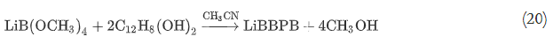

It was well known that biphenyl had higher conjugate energy than benzene and naphthalene. The LiBBPB exhibited a better thermal stability compared with that of LiBBB and LiBNB [136], [137]. In addition, LiBBPB had a high electrochemical stability for oxidation, which could be up to 4.1 V vs. Li/Li+. Furthermore, LBBPB electrolyte possessed a higher cycling efficiency than that of LiPF6. These excellent performances deserve further investigation.  
众所周知，联苯具有比苯和萘更高的共轭能。与LiBBB和LiBNB相比，LiBBPB表现出更好的热稳定性[136]，[137]。此外，LiBBPB具有较高的氧化电化学稳定性，相对于Li /Li +可以高达4.1V。此外，LBBBB电解质比LiPF6具有更高的循环效率。这些出色的表现值得进一步研究。

However, it was difficult for LBBPB to dissolve in PC/DMC or EC/DME solvents [136], which resulted in a low ion conductivity. So, it is imperative to explore a strategy to improve solubility of LiBBPB in liquid solvents.  
但是，LBBBB难溶于PC /DMC或EC /DME溶剂[136]，这导致离子传导率低。因此，必须探索一种改善LiBBPB在液体溶剂中的溶解度的策略。

#### 3.7. Lithium [1,2-benzenediolato(2-)-O,O′ oxalato] borate (LiBDOB)
LiBDOB possesses one pyrocatechol- and one oxalate-chelating groups (shown in Scheme 4). LiBDOB has the combined chemical structures of LiBBB and LiBOB and its molecular weight is 213.7 Da. LiBDOB has a decomposition temperature at 256 °C. However, its solubility in carbonates is much lower than both LiBBB and LiBOB. LiBDOB was synthesized according to Eq. (21) reported by Xue [143].  
LiBDOB具有一个邻苯二酚和一个草酸盐螯合基团（如方案4所示）。 LiBDOB具有LiBBB和LiBOB的组合化学结构，其分子量为213.7Da。 LiBDOB的分解温度为256°C。但是，它在碳酸盐中的溶解度远低于LiBBB和LiBOB。 LiBDOB是根据等式1合成的。 （21）由薛[143]报道。  
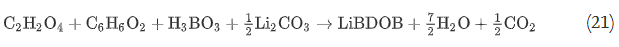

As can be seen from Scheme 4, the BDOB− has asymmetrical structure with benzenediolato and oxalato complexes of boron. Its thermal, electrochemical stabilities and conductivities were studied and compared with those of LiBBB and LiBOB electrolytes by Xue et al. [143]. Combination of these two moieties endows it with a synergistic property of LiBBB and LiBOB [140]. For example, comparing the ionic conductivities of LiBDOB solutions in different solvents with those of LiBBB and LiBOB, it was observed that LiBDOB solutions with the same concentration possessed higher ionic conductivities than those of LiBBB, but lower than LiBOB solutions. Its electrochemical oxidation potential was a bit higher than those of LiBBB in the same organic solvents used in batteries, but lower than those of LiBOB.  
从方案4中可以看出，BDOB-具有不对称结构，且与硼的苯二醇基和草酸根配合物。 Xue等人研究了其热，电化学稳定性和电导率，并与LiBBB和LiBOB电解质进行了比较。 [143]。这两个部分的结合赋予了它LiBBB和LiBOB的协同特性[140]。例如，通过比较不同溶剂中的LiBDOB溶液的离子电导率与LiBBB和LiBOB的离子电导率，可以发现，相同浓度的LiBDOB溶液的离子电导率比LiBBB的离子电导率高，但比LiBOB的离子电导率低。在电池中使用的相同有机溶剂中，其电化学氧化电位比LiBBB的高一些，但低于LiBOB的。

#### 3.8. Lithium salicylato-oxalato borate (LiSOB)
Similar to LiBDOB, the chemical structure of LiSOB is also asymmetric. It combines one oxalate- and one salicilato-chelating groups (shown in Scheme 5).  
与LiBDOB相似，LiSOB的化学结构也是不对称的。它结合了一组草酸酯和一组水杨酸螯合剂（如方案5所示）。

The synthesis process of LiSOB had been reported by Dietz et al. [144]. Suitable solvents were chosen to form an azeotrope with water, for example, saturated or aromatic solvents such as heptane, octane, toluene or cumene.  
Dietz等人已经报道了LiSOB的合成过程。 [144]。选择合适的溶剂以与水形成共沸物，例如饱和或芳族溶剂，例如庚烷，辛烷，甲苯或枯烯。

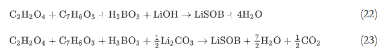

LiSOB was explored as an additive used in lithium ion batteries [26], [89]. As can be seen from Scheme 5, SOB− has two different chelating agents, which are oxalato ligand and salicylato ligand. So, LiSOB-electrolyte should show a combined electrochemical behavior of LiBOB and LiBSB. It displayed two reduction signals at 1.60 V and 1.02 V vs. Li/Li+ on the graphite electrode [26], [89]. Two oxidation peaks were observed at 4.51 V and 4.75 V vs. Li/Li+ in CV curves of LiMn2O4 electrodes cycled in 1 M LiPF6/EC:DMC with 0.1 M LiSOB at a scan rate of 0.1 mV s−1. However, how LiSOB affected the battery performance was unknown yet.  
探索了LiSOB作为锂离子电池中使用的添加剂[26]，[89]。从方案5可以看出，SOB-具有两种不同的螯合剂，它们是草酸酯配体和水杨基配体。因此，LiSOB电解质应表现出LiBOB和LiBSB的组合电化学行为。它在石墨电极[26]，[89]上显示了相对于Li /Li +的两个1.60 V和1.02 V还原信号。在以0.1 mV s-1的扫描速率在具有0.1 M LiSOB的1 M LiPF6 /EC：DMC中循环的LiMn2O4电极的CV曲线中，相对于Li /Li +在4.51 V和4.75 V处观察到两个氧化峰。但是，尚不清楚LiSOB如何影响电池性能。

#### 3.9. Tris(pentafluorophenyl) borane (TPFPB)
Tris(pentafluorophenyl) borane is a white, volatile solid. The molecule consists of three pentafluorophenyl groups attached in a “paddle-wheel” manner to a central boron atom; the BC3 core is planar (shown in Scheme 5). It possesses a large molecular weight of 511.9 Da and melts at the temperature of 121 °C.  
三（五氟苯基）硼烷是白色的挥发性固体。该分子由三个以“桨轮”方式连接到中心硼原子的五氟苯基组成； BC3核心是平面的（如方案5所示）。它具有511.9 Da的大分子量，并在121°C的温度下熔融。

TPFPB is a kind of the anion receptors and has been developed as an additive in electrolytes for increasing the dissociation of LiPF6 in electrolytes and improving the cycle life and power capabilities of the batteries. The scheme of its synthesis was reported by Lee et al. and illustrated in Scheme 6 [145].  
TPFPB是一种阴离子受体，已被开发为电解质中的添加剂，以增加LiPF6在电解质中的离解并提高电池的循环寿命和功率能力。 Lee等人报道了其合成方案。并在方案6 [145]中进行了说明。

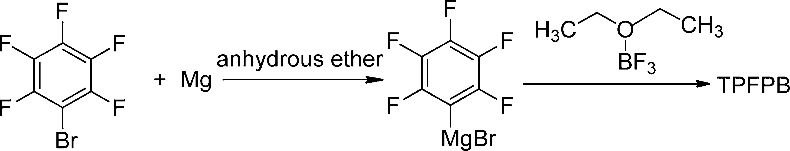  
Scheme 6. The illustrative procedure for TPFPB synthesis.

As an additive in LiPF6-based electrolyte, TPFPB possesses the ability of improving the cycling performance of LiFePO4 cathode at elevated temperatures [146], [147]. According to the reported results, TPFPB was believed to participate in the formation of passivation films on LiFePO4 electrode surface and in the dissolution of LiF in the films, which resulted in the improved lithium ion conductivity and better cell performance (shown in Fig. 10). Similarly, the power capabilities of graphite/Li1.1[Ni1/3Co1/3Mn1/3]0.9O2 cells was significantly improved when TPFPB adapted as a electrolyte additive [148].  
作为基于LiPF6的电解质的添加剂，TPPFB具有在高温下改善LiFePO4阴极循环性能的能力[146]，[147]。根据报道的结果，TPPFB被认为参与了LiFePO4电极表面钝化膜的形成以及LiF在膜中的溶解，从而改善了锂离子电导率并改善了电池性能（如图10所示）。 。同样，当TPPFB用作电解质添加剂时，石墨/Li1.1[Ni1/3Co1/3Mn1/3]0.9O2电池的功率能力也得到了显着提高[148]。

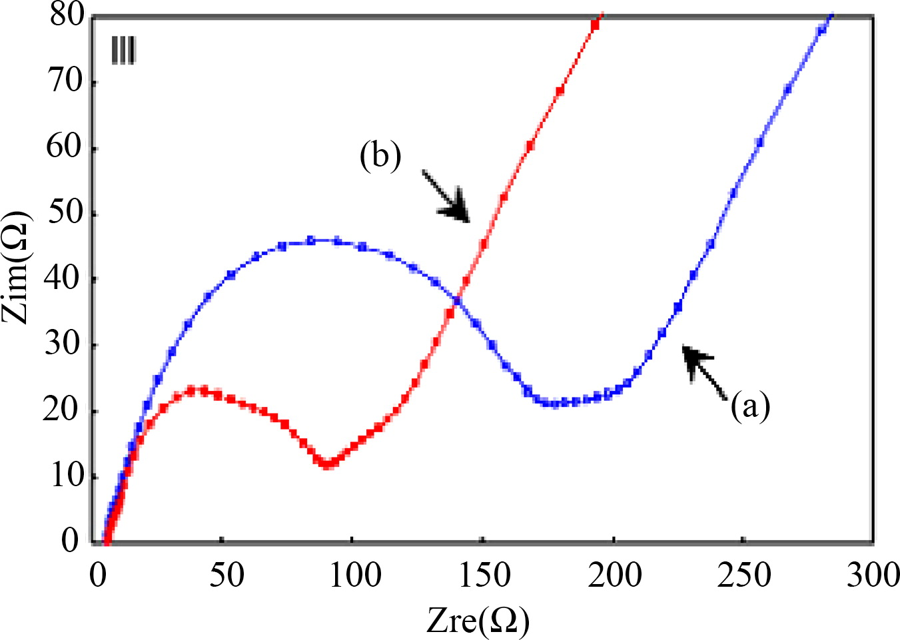  
Fig. 10. Impedance spectra comparison of fully charged LiFePO4 electrodes after 100 cycles at 1.0 C charge/discharge rate at 60 °C in 1.2 M LiPF6 EC/DMC (1:1) solution (a) without and (b) with 0.028 M TPFPB. Frequency range: 0.01 Hz and 106 Hz.  
图10.在1.2 M LiPF6 EC /DMC（1：1）溶液（a）不使用和（b）0.028 M的情况下，在1.2 M LiPF6 EC /DMC（1：1）溶液中，在60°C下以1.0 C充/放电速率在1.0 C充电后，充满电的LiFePO4电极的阻抗谱比较TPFPB。频率范围：0.01 Hz和106 Hz

此外，TPPFB添加剂还被报道为阴离子受体，可增强锂离子电池中石墨阳极界面的热稳定性[149]。由于增强了石墨阳极中间相的稳定性，在0.8 M LiBF4 EC：DEC电解质中添加0.2 M TPFPB改善了循环性能。在上述电解液中循环的石墨阳极的第一个放热反应的起始温度从60°C升高到140-160°C。形成的SEI层包含更少的LiF和更多的基于溶剂的还原产物。

### 4. Single-ion dominantly conducting polyborates
A dissociated lithium ion in the liquid electrolyte is usually solvated with four to six solvent molecules to form Li+ solvation sheath [150], whose size is relatively larger than those of the anion, which hampers its rapid transportation. In general, the conventional liquid electrolytes behave as an anion-dominant conductor with the anion transfer number of about 0.67 and the cation counterpart of about 0.33. As the electrodes’ reactions only exchange lithium ion with the electrolyte, the anion overconcentration often occurs and increases the polarization. In addition, the over-concentrated anions will participate in undesirable side reactions at the surfaces of electrodes, which also can directly affect the resistance and impedance of batteries. Therefore it is important to increase Li+ ion transference number (t+) to gain less polarization for lithium ion batteries [151].  
液体电解质中的离解锂离子通常被4至6个溶剂分子溶剂化以形成Li +溶剂化鞘层[150]，其尺寸比阴离子的相对大，这阻碍了其快速运输。通常，常规的液体电解质表现为阴离子主导的导体，其阴离子转移数约为0.67，阳离子对应数约为0.33。由于电极的反应仅与电解质交换锂离子，因此经常会发生阴离子过浓并增加极化。另外，过浓的阴离子将参与电极表面的不良副反应，这也可能直接影响电池的电阻和阻抗。因此，重要的是要增加Li +离子的转移数（t +），以减少锂离子电池的极化[151]。

There are two strategies to achieve the single ion conductors. The first one is to introduce interacting sites that preferentially interact with the anions [145], [152]. The other is to anchor anions to the polymer backbone, which is the most effective method to achieve single-ion conductors [153]. Many single-ion-conductive polymer electrolytes, based on polyethyleneimine, polyphosphazene, and polysiloxane backbones were synthesized [154], [155], [156], [157]. Florjanczyk et al. reported significant transference number enhancements by incorporating BF3, which is coordinated with the carboxylate anions of the polymer network [157]. Tsutsumi and coworkers reported a single-ion siloxane SPE with σbulk of 7 × 10−7 S cm−1 and t+ of 0.98 at room temperature [156]. New single lithium-ion conducting polymer electrolytes are prepared by Prof. Zhou via a copolymerization of two monomers, lithium (4-styrenesulfonyl)(trifluoro-methanesulfonyl)imide (LiSTFSI) and methoxy-polyethylene glycol acrylate (MPEGA, CH2 CHCO2 (CH2CH2O)nCH3, n = 8). The solid-state ionic conductivities of the Li[PSTFSI-co-MPEGA] copolymer electrolytes were 7.6 × 10−6 S cm−1 at 25 °C and reached 10−4 S cm−1 at 60 °C [158]. Moreover, Armand reported a P(STFSILi)-PEO-P(STFSILi) material as a polymer electrolyte exhibiting unprecedented levels of performance for lithium-metal batteries in terms of ionic conductivity of dry single-ion polymer electrolytes, transport number (>0.85) and improved mechanical strength [159], [160].  
有两种策略可以实现单个离子导体。第一个是引入优先与阴离子相互作用的相互作用部位[145]，[152]。另一种是将阴离子固定在聚合物主链上，这是获得单离子导体的最有效方法[153]。合成了许多基于聚乙烯亚胺，聚磷腈和聚硅氧烷骨架的单离子导电聚合物电解质[154]，[155]，[156]，[157]。 Florjanczyk等。报道了通过结合BF3显着提高转移数，BF3与聚合物网络中的羧酸根阴离子配位[157]。 Tsutsumi及其同事报道了在室温下σbulk为7×10-7 S cm-1且t +为0.98的单离子硅氧烷SPE [156]。周教授通过两种单体（4-苯乙烯磺酰基）（三氟甲烷磺酰基）酰亚胺（LiSTFSI）和甲氧基聚乙二醇丙烯酸酯（MPEGA，CH2 CHCO2（CH2CH2O））的共聚反应制备了新型的单一的锂离子导电聚合物电解质。 nCH3，n = 8）。 Li [PSTFSI-co-MPEGA]共聚物电解质的固态离子电导率在25°C下为7.6×10-6 S cm-1，在60°C下为10-4 S cm-1 [158]。此外，Armand报告了作为聚合物电解质的P（STFSILi）-PEO-P（STFSILi）材料，在干燥的单离子聚合物电解质的离子电导率，传输数（> 0.85）方面，锂金属电池具有前所未有的性能水平并提高了机械强度[159]，[160]。

Very recently, several single-ion conducting polymeric lithium borate salts, including lithium poly[oligo(ethylene glycol) oxalate borate] (LiPEGOB), lithium polyvinyl alcohol oxalate borate (LiPVAOB), lithium polyacrylic acid oxalate borate (LiPAAOB), lithium polymeric tartaric acid borate (LiPTB) and some lithium aromatic polyborates (e.g. LiPAB), were developed and demonstrated to be very promising application in lithium ion batteries [100], [109], [161], [162], [163], [164], [165].  
最近，几种单离子导电聚合硼酸锂盐，包括聚[低聚（乙二醇）草酸硼酸锂]（LiPEGOB），聚乙烯醇草酸硼酸锂（LiPVAOB），聚丙烯酸草酸硼酸锂（LiPAAOB），聚合锂酒石酸硼酸锂（LiPT​​B）和某些芳族多硼酸锂（例如LiPAB）已开发出来，并证明在锂离子电池中非常有前途的应用[100]，[109]，[161]，[162]，[163]，[164] ]，[165]。

#### 4.1. Lithium poly[oligo(ethylene glycol) oxalate borate] (LiPEGOB) 聚[低聚（乙二醇）草酸酯硼酸锂]（LiPEGOB）
Novel polyanionic solid electrolytes with weak coulomb traps and controllable caps and spacers such as lithium poly[oligo(ethylene glycol) oxalate borate] (LiPEGOB), lithium poly[oligo(ethylene glycol) malonato borate] (LiPEGMB) and lithium poly[oligo(propylene glycol) oxalate borate] (LiPPGOB) were developed by Prof. Angell, which are shown in Scheme 7. The synthetic routes of LiPEGOB are presented as follows [166], [167], [168].  
具有弱库仑阱和可控制的盖和垫片的新型聚阴离子固体电解质，例如聚[低聚（乙二醇）草酸硼酸锂]（LiPEGOB），聚[低聚（乙二醇）丙二酸硼酸锂]（LiPEGMB）和聚[低聚（锂（丙二醇草酸硼酸酯]（LiPPGOB）由Angell教授开发，显示在流程7中。LiPEGOB的合成路线如下[166]，[167]，[168]。

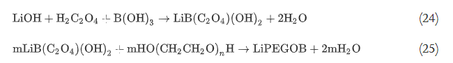

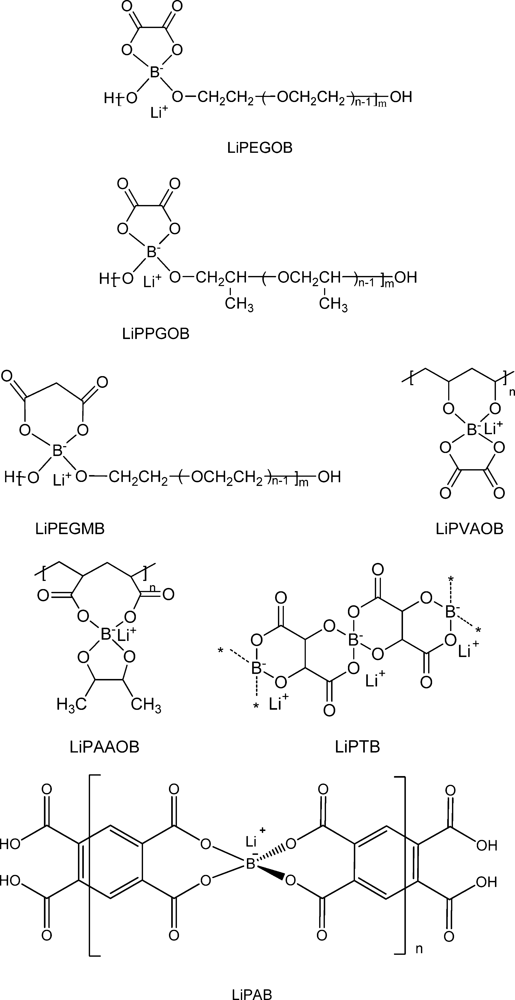  
Scheme 7. Structural formulae of single-ion conducting polyborates.

The LiPEGMB and LiPPGOB could be synthesized using the similar procedure. Among these polyanionic solid electrolytes, the boron was strongly chelated by the oxygen groups in the polymer chain. Thus, the ionic conduction in polymer electrolytes is dominated by the motion of the cations. For LiPEGOB, with increase of spacer repeating units from n = 3 to n = 23, glass transition temperature decreases from −0.9 °C to −63.1 °C [166]. That meant the introduction of mono-diacyl-capped orthoborate moieties into the polymer (n = 23) did not affect the flexibility of the polymer chain, making sure that LiPEGOB still kept solid phase at ambient temperature. Furthermore, the maximum conductivity of LiPEGOB was as high as 10−5 S cm−1 at room temperature. Another excellent electrochemical performance for LiPEGOB was that it had a good electrochemical stability of up to 4.5 V vs. Li+/Li. The drawback of these materials was that they unavoidably contained some LiBOB as a side-product in the synthetic process, which lower the lithium ion transport number to be much less than 1.0.  
LiPEGMB和LiPPGOB可以使用类似的步骤合成。在这些聚阴离子固体电解质中，硼被聚合物链中的氧基团强烈螯合。因此，聚合物电解质中的离子传导主要由阳离子的运动决定。对于LiPEGOB，随着间隔子重复单元从n = 3增加到n = 23，玻璃化转变温度从-0.9°C降低到-63.1°C [166]。这意味着将单二酰基封端的原硼酸酯部分引入聚合物（n = 23）不会影响聚合物链的柔韧性，从而确保LiPEGOB在环境温度下仍保持固相。此外，室温下LiPEGOB的最大电导率高达10-5 S cm-1。 LiPEGOB的另一个出色的电化学性能是，与Li + /Li相比，它具有高达4.5 V的良好电化学稳定性。这些材料的缺点在于，它们在合成过程中不可避免地包含一些LiBOB作为副产物，这使锂离子的传输数降低到远小于1.0。

#### 4.2. Lithium polyvinyl alcohol oxalate borate (LiPVAOB) and lithium polyacrylic acid oxalate borate (LiPAAOB) 聚乙烯醇草酸硼酸锂（LiPVAOB）和聚丙烯酸草酸硼酸锂（LiPAAOB）
Recently, Wu et al. developed lithium polyvinyl alcohol oxalate borate (LiPVAOB) and lithium polyacrylic acid oxalate borate (LiPAAOB), which were synthesized by the reaction of poly(vinyl alcohol) (PVA) or polyacrylic acid (PAA), lithium carbonate, boric acid and oxalic acid, respectively, shown in Scheme 8 [163], [169]. These membranes showed good thermal properties and good morphology. After absorbing 3% amount of PC, the LiPVAOB and LiPAAOB electrolyte membranes showed high ionic conductivity up to 6.11 × 10−6 S cm−1 and 2.3 × 10−6 S cm−1 respectively at 25 °C and stable electrochemical window up to 7 V vs. Li+/Li. They also achieved another gel polymer electrolyte by gelation a sandwiched composite membrane consisted of PVDF/LiPAAOB/PVDF with a LiPF6 liquid electrolyte [163], [165]. The transference number of lithium ion in this GPE (t+ = 0.58) at ambient temperature was double that in the commercial separator saturated with liquid electrolyte (t+ = 0.27), which was shown in Fig. 11. In addition, the phenomenon of gas emission did not occur in the batteries using LiPAAOB, which greatly reduced the risk of explosion when operating at high temperature. So, the LiPAAOB electrolyte shows great possibility for applications in the lithium ion batteries requiring high power and high safety.  
最近，吴等。开发了聚乙烯醇草酸硼酸锂（LiPVAOB）和聚丙烯酸草酸硼酸锂（LiPAAOB），它们是通过聚乙烯醇（PVA）或聚丙烯酸（PAA），碳酸锂，硼酸和草酸反应合成的，分别在方案8 [163]，[169]中示出。这些膜表现出良好的热性能和良好的形态。吸收3％的PC后，LiPVAOB和LiPAAOB电解质膜在25°C时分别显示出高达6.11×10-6 S cm-1和2.3×10-6 S cm-1的高离子电导率，并且在高达50％的温度下具有稳定的电化学窗口7 V vs.Li + /Li。他们还通过凝胶化由PVDF /LiPAAOB /PVDF和LiPF6液体电解质组成的复合膜，获得了另一种凝胶聚合物电解质[163]，[165]。该GPE在室温下（t + = 0.58）的锂离子迁移数是在用液体电解质饱和的商用隔膜（t + = 0.27）中的迁移数的两倍，如图11所示。此外，还有气体排放现象使用LiPAAOB的电池不会发生这种情况，这大大降低了在高温下工作时爆炸的危险。因此，LiPAAOB电解质在需要高功率和高安全性的锂离子电池中显示出很大的可能性。

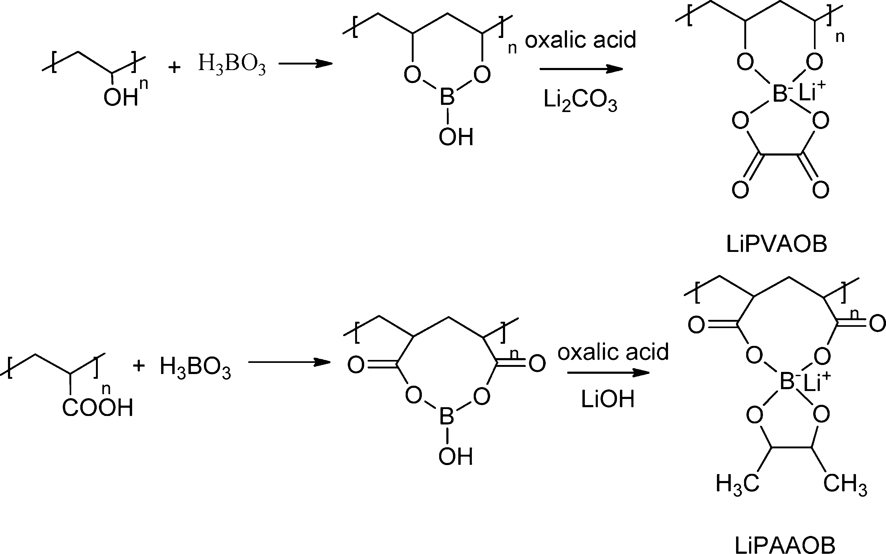  
Scheme 8. The synthesis of LiPVAOB and LiPAAOB.

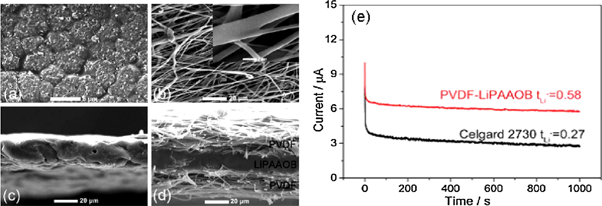  
Fig. 11. (a) SEM micrographs of (a) the surface and (c) the cross-section of the LiPAAOB membrane, (b) the surface and (d) the cross-section of the PVDF–LiPAAOB composite membrane, (e) chronoamperometry profiles for the PVDF–LiPAAOB GPE and Celgard 2730 saturated with the liquid electrolyte at 25 °C in block cells using Li metal as both electrodes with a step potential of 10 mV.  
图11.（a）（a）LiPAAOB膜的表面和（c）横截面，（b）PVDF-LiPAAOB复合膜的表面和（d）横截面的SEM显微照片，（ e）使用锂金属作为两个电势且步电势为10 mV的块状电池，在25°C下用液体电解质饱和的PVDF–LiPAAOB GPE和Celgard 2730的计时电流分析曲线。

#### 4.3. Lithium polymeric tartaric acid borate (LiPTB) 聚合酒石酸硼酸锂（LiPT​​B）
Very recently, Cui and his coworker synthesized lithium polymeric tartaric acid borate (LiPTB) via a one-step reaction in aqueous solution, which was shown in Scheme 9 [161], [162]. The LiPTB has unique structure incorporating the BOB− building blocks in the main polymeric chains not by the side chains. LiPTB possesses a high decomposition temperature at 330 °C, which is potential for improving the battery safety characteristic (shown in Fig. 12(a)) [161], [162].  
最近，Cui和他的同事在水溶液中通过一步反应合成了聚合物酒石酸硼酸锂（LiPT​​B），该反应在方案9 [161]，[162]中显示。 LiPTB具有独特的结构，在主聚合物链中结合了BOB-结构单元，而没有侧链。 LiPTB在330°C时具有很高的分解温度，这可能会改善电池的安全特性（如图12（a）所示）[161]，[162]。

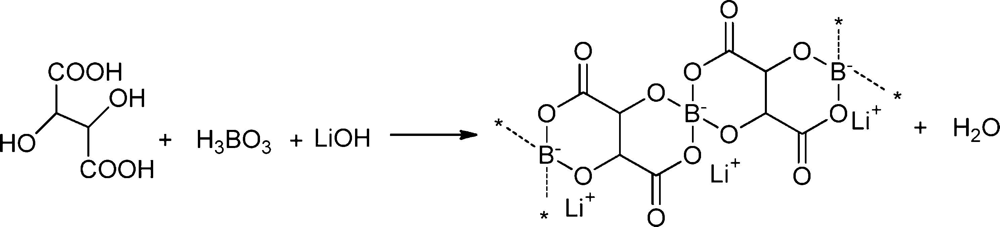  
Scheme 9. The illustrate synthesis of LiPTB in an aqueous solution.

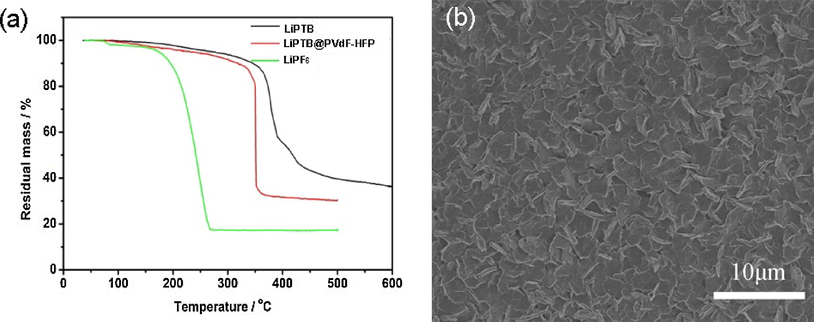  
Fig. 12. (a) Thermal gravimetric analysis curves of LiPTB, LiPTB@PVDF-HFP and LiPF6. (b) SEM image of LiPTB@PVDF-HFP membrane (LiPTB/PVDF-HFP = 1/1 (w/w)).  
图12.（a）LiPTB，LiPTB @ PVDF-HFP和LiPF6的热重分析曲线。 （b）LiPTB @ PVDF-HFP膜的SEM图像（LiPT​​B /PVDF-HFP = 1/1（w /w））。

The polymeric electrolyte of LiPTB@PVdF-HFP was developed by a doctor-blading process followed by a soaking process in PC [161] or EC/DMC [162]. Its surface SEM image was shown in Fig. 12(b). This membrane exhibited considerable ionic conductivity, high lithium ion transference number (tLi+ = 0.93) and high anodic electrochemical stability (4.7 V vs. Li+/Li) at 80 °C (shown in Fig. 13). The LiFePO4/Li batteries using PC swollen LiPTB@PVDF-HFP membrane exhibit stable charge/discharge behavior, preferable rate capability and satisfactory cycling performance at 80 °C. The superior high temperature performance of PC swollen LiPTB@PVDF-HFP could endow this kind of polymer electrolyte a very promising application for power battery of electric vehicle normally operating at relatively high temperature.  
LiPTB @ PVdF-HFP的聚合物电解质是通过刮涂工艺和随后在PC [161]或EC /DMC [162]中的浸泡工艺开发的。其表面SEM图像如图12（b）所示。该膜在80°C下显示出可观的离子电导率，高锂离子转移数（tLi + = 0.93）和高阳极电化学稳定性（4.7 V vs. Li + /Li）（如图13所示）。使用PC膨胀的LiPTB @ PVDF-HFP膜的LiFePO4 /Li电池在80°C时表现出稳定的充电/放电行为，理想的倍率性能和令人满意的循环性能。 PC溶胀的LiPTB @ PVDF-HFP的优异高温性能可以使这种聚合物电解质在通常在较高温度下工作的电动汽车动力电池中具有非常有希望的应用。

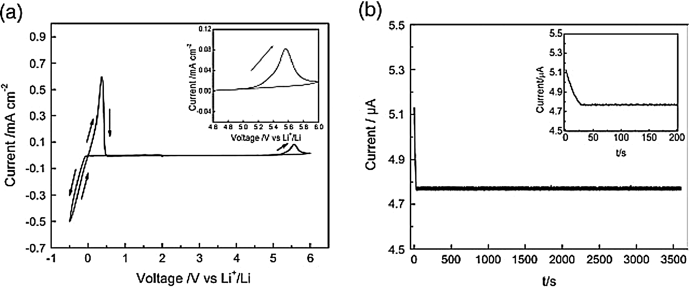  
Fig. 13. (a) Electrochemical stability of PC swollen LiPTB@ PVDF-HFP membrane at 80 °C, respectively (scan rate = 1 mV s−1); (b) Variation of current with time during polarization of a Li|PC swollen LiPTB@PVDF-HFP membrane|Li cell at 80 °C, with total applied potential difference of 10 mV, after establishment of invariant resistive electrode layer.  
图13.（a）PC膨胀的LiPTB @ PVDF-HFP膜在80°C时的电化学稳定性（扫描速率= 1 mV s-1）； （b）在建立不变的电阻电极层之后，在80℃下，Li膨胀的LiPTB @ PVDF-HFP Li电池极化期间，电流随时间变化，总施加电势差为10 mV。

In addition, the EC/DMC swollen LiPTB@PVDF-HFP exhibited a superior lithium ionic conductivity at ambient temperature (σLi+ = 0.45 mS cm−1) and significantly high lithium ion transference number (tLi+ = 0.91), which was presented in Table 3. This gel electrolyte was further discovered to remarkably improve the cycling performance of the LiMn2O4 based lithium battery at elevated temperatures owing to superior thermal stability and comparable ionic conductivity (Fig. 14(a)) [100]. The dissolution of metallic Mn in this electrolyte was significantly suppressed than that of LiPF6 electrolyte. Moreover, the LiPTB@PVDF-HFP coated cellulose separator was evaluated to have a higher lithium ion transference number than the pristine separator (unpublished data, shown in Fig. 14(b)).  
此外，EC /DMC溶胀的LiPTB @ PVDF-HFP在环境温度（σLi+ = 0.45 mS cm-1）下表现出优异的锂离子电导率，并且锂离子迁移数极高（tLi + = 0.91），如表3所示。进一步发现，由于优异的热稳定性和可比的离子电导率，这种凝胶电解质可显着提高基于LiMn2O4的锂电池在高温下的循环性能（图14（a））[100]。与LiPF6电解质相比，金属Mn在该电解质中的溶解被显着抑制。此外，评价了LiPTB @ PVDF-HFP涂覆的纤维素隔膜比原始隔膜具有更高的锂离子转移数（未公开数据，图14（b）所示）。

Table 3. Apparent ionic conductivity comparison for both electrolyte systems.
表3.两种电解质系统的表观离子电导率比较。  
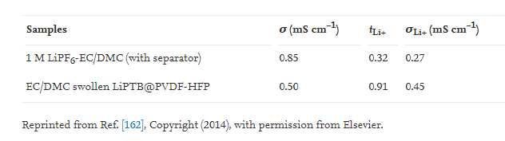

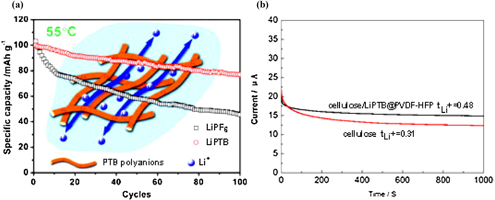  
Fig. 14. (a) The specific capacity vs. cycle number of the Li/LiMn2O4 cells using LiPF6 and LiPTB as electrolyte salts at 55 °C; (b) chronoamperometry profiles for cellulose/LiPTB@PVDF–HFP separator and cellulose separator.  
图14.（a）在55°C下使用LiPF6和LiPTB作为电解质盐的Li /LiMn2O4电池的比容量与循环数的关系； （b）纤维素/LiPTB @ PVDF-HFP分离器和纤维素分离器的计时电流分析曲线。

#### 4.4. Lithium polymeric aromatic borates (LiPAB)
Some lithium polymeric aromatic borates had been also developed by Prof. Cheng et al. [164], one of which is shown in Scheme 10. These materials exhibited good thermal and electrochemical stability, which may be suitable for applications in Li-ion batteries as electrolytes. Their ionic conductivity was comparable to the conventional liquid electrolytes. Unlike the small molecules of aromatic lithium salts described above, these lithium polymeric aromatic borates possessed relatively higher anodic oxidization stability due to double electro-withdrawing effect of the sp3 boron atoms. After all, these lithium polymeric aromatic borates still have relatively lower electrochemical stability than the non-aromatic borates, which may limit their potential application in high voltage lithium batteries.  
Cheng教授等人还开发了一些锂聚合物芳族硼酸盐。 [164]，方案10中显示了其中之一。这些材料表现出良好的热稳定性和电化学稳定性，可能适合作为电解质在锂离子电池中应用。它们的离子电导率与常规液体电解质相当。与上述芳族锂盐的小分子不同，这些锂聚合物芳族硼酸盐由于sp3硼原子的双重吸电子作用而具有相对较高的阳极氧化稳定性。毕竟，这些锂聚合物芳族硼酸盐仍比非芳族硼酸盐具有相对较低的电化学稳定性，这可能限制了它们在高压锂电池中的潜在应用。

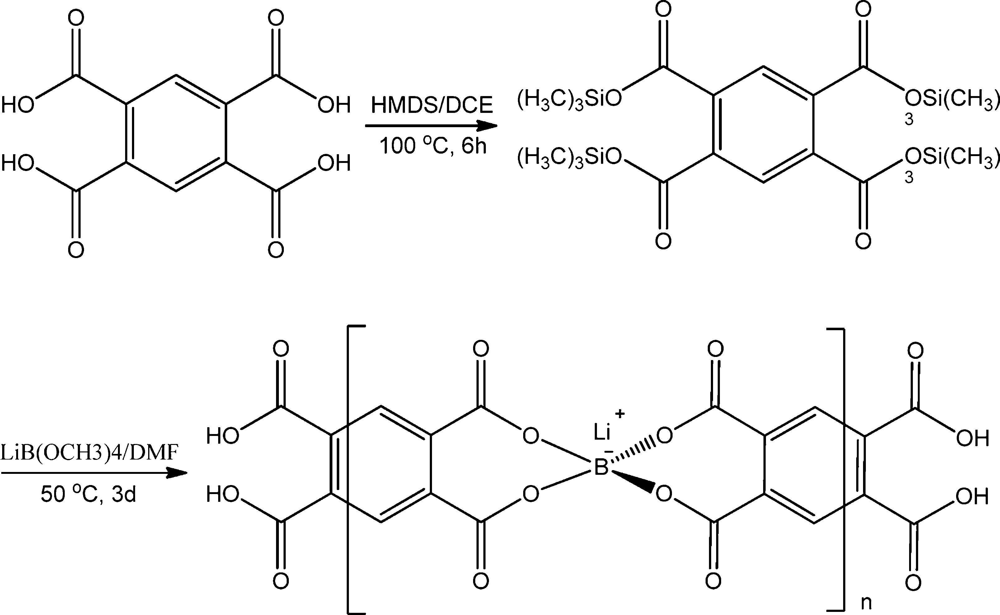  
Scheme 10. Synthetic procedure of the lithium polymeric aromatic borate (LiPAB). 锂聚合的芳族硼酸锂（LiPAB）的合成方法。

### 5. Perspective
In conclusion, post lithium ion batteries need to develop green, low cost and high performance battery systems with compatible electrolytes. Lithium borate salts have been demonstrated to possess unique properties such as excellent thermal stability, comparable ionic conductivity, cost-effectiveness, environmental benignity and SEI forming properties. These properties would meet the requirement of the higher energy batteries using the Si/C composite anode, lithium metal anode, high voltage cathodes or semi-solid lithium flowable electrodes and improved cycling performance and safety characteristics. Especially, the newly developed single-ion dominantly conducting polyborate electrolytes could be very promising electrolytes in next generation lithium ion batteries.  
总之，后锂离子电池需要开发具有兼容电解质的绿色，低成本和高性能电池系统。硼酸锂盐已被证明具有独特的性能，例如出色的热稳定性，可比的离子电导率，成本效益，环境友好性和SEI形成性能。这些性能将满足使用Si /C复合阳极，锂金属阳极，高压阴极或半固态锂可流动电极的高能电池的要求，并改善循环性能和安全性。特别是，新开发的单离子占主导地位的多硼酸盐电解质可能是下一代锂离子电池中非常有前途的电解质。

Some researchers have studied the LiBOB and LiB(CN)4 based electrolytes in the Li–O2 batteries and found that this salts encountered serious irreversible decomposition reaction in this electrolyte system [86], [170], [171], [172]. It was also reported that the LiBF4 and LiBOB-based electrolytes were not suitable to be used in Li–S batteries because they could irreversibly react with the polysulfide [173]. However, the borate-based electrolytes would exhibit a very promising prospect in the newly developed energy storage batteries such as lithium rechargeable flow batteries and sodium ion batteries. As another very promising candidate for a large-scale energy storage application, the recently developed semi-solid lithium rechargeable flow battery delivers higher energy density with lower material and manufacturing cost than the conventional lithium battery. In regards to this large-scale application, the borate-based electrolytes would outperform the expensive and sensitive LiPF6 to meet the requirement of cost-effectiveness, environmental benignity as well as safety [6]. Sodium ion batteries are also attracting intensive interests as a low cost energy storage device in very recent years. The sodium bis(oxalate) borate (NaBOB) possessed high ionic conductivity up to 1.11 × 10−3 S cm−1 (0.25 mol L−1 in DMF). Like LiBOB, NaBOB also processed excellent thermal stability at high temperature when compared to the NaPF6, which would be favorable to improve battery cycling performance especially at elevated temperatures [174]. In terms of sodium borate salts, deep insights and more investigation are needed on the SEI-forming properties and compatibilities with the sodium ion battery electrodes. So, we hope that our review provides the motivation to encourage researchers to make new attempts in this promising field.  
一些研究人员研究了Li-O2电池中基于LiBOB和LiB（CN）4的电解质，发现该盐在该电解质系统中遇到了严重的不可逆分解反应[86]，[170]，[171]，[172]。也有报道说基于LiBF4和LiBOB的电解液不适合用于Li-S电池，因为它们会与多硫化物发生不可逆的反应[173]。然而，基于硼酸盐的电解质在诸如锂可充电液流电池和钠离子电池的新开发的储能电池中将显示出非常有希望的前景。作为大规模储能应用的另一个非常有希望的候选者，最近开发的半固态锂可充电液流电池比常规锂电池具有更高的能量密度，更低的材料和制造成本。关于这种大规模的应用，硼酸盐基电解质将胜过昂贵和敏感的LiPF6，以满足成本效益，环境友好性和安全性的要求[6]。近年来，作为低成本的能量存储装置，钠离子电池也引起了广泛的关注。双（草酸酯）硼酸钠（NaBOB）具有高达1.11×10-3 S cm-1（在DMF中为0.25 mol L-1）的高离子电导率。像LiBOB一样，与NaPF6相比，NaBOB在高温下也具有出色的热稳定性，这特别有助于提高电池循环性能，尤其是在高温下[174]。就硼酸钠盐而言，需要对SEI的形成特性以及与钠离子电池电极的相容性进行深入了解并进行更多研究。因此，我们希望我们的综述提供动机，以鼓励研究人员在这一有前途的领域进行新的尝试。