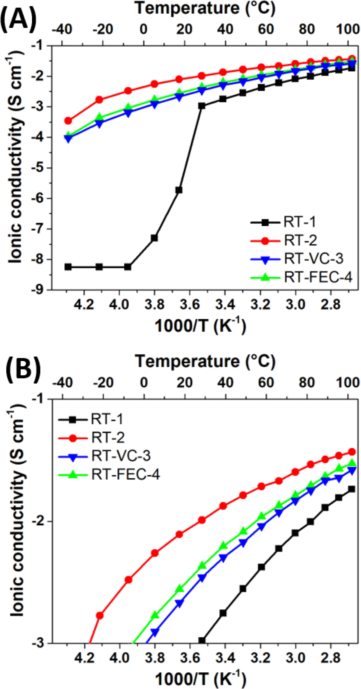
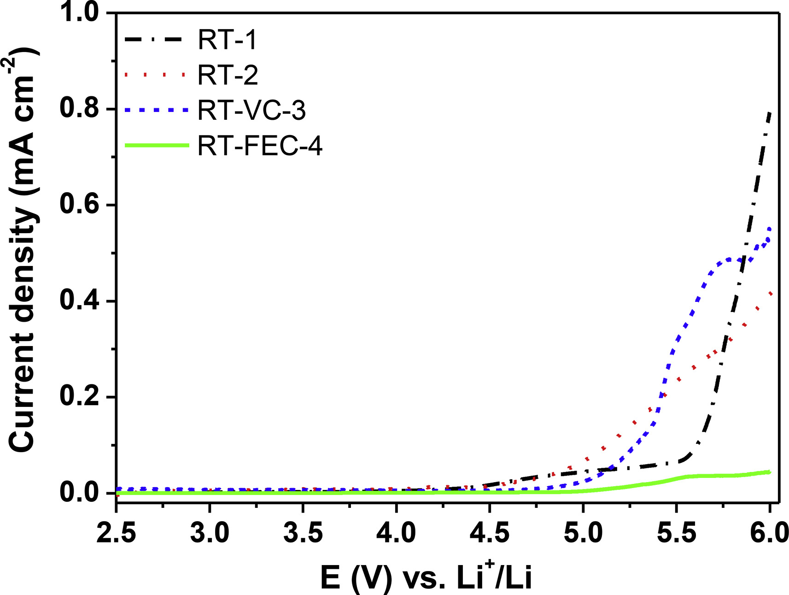
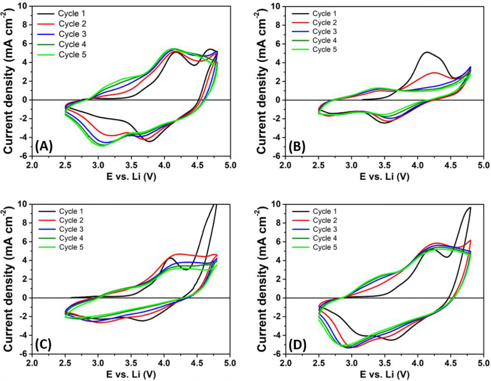
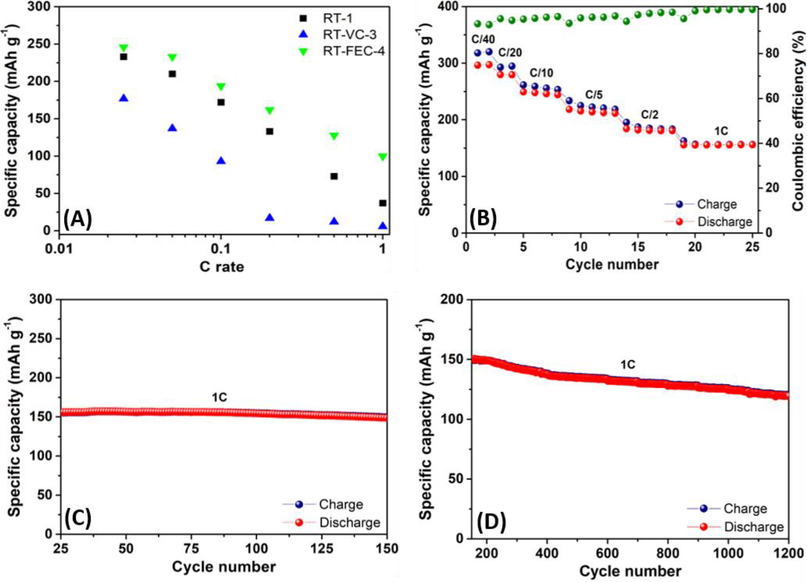
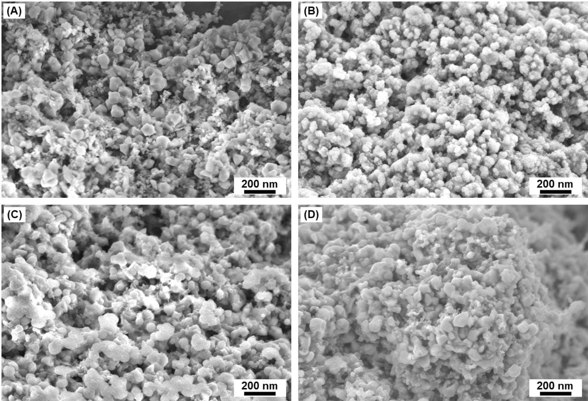
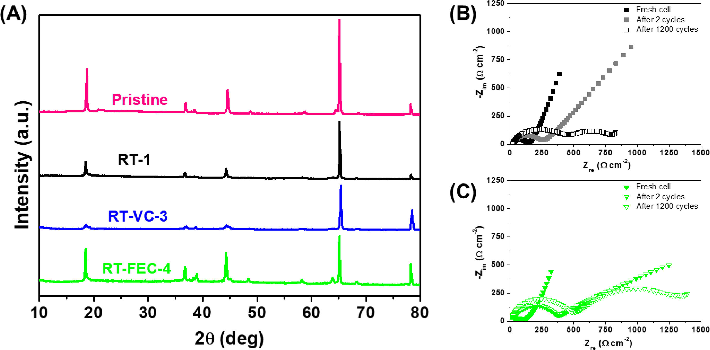
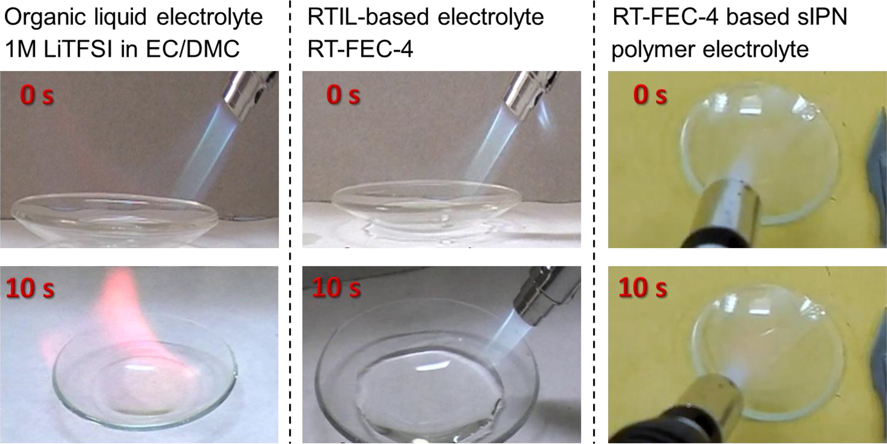
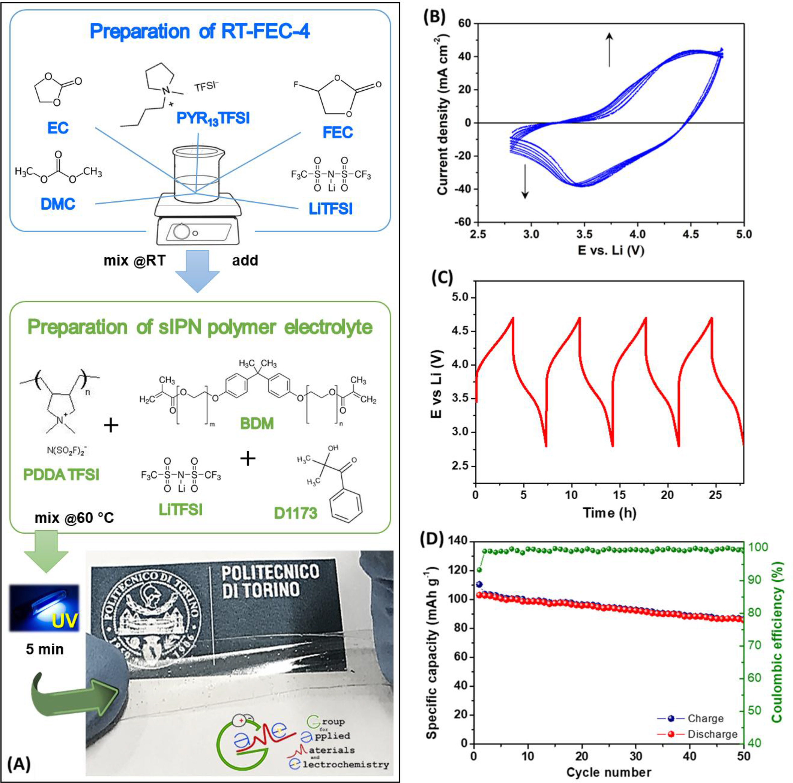

## Room temperature ionic liquid (RTIL)-based electrolyte cocktails for safe, high working potential Li-based polymer batteries  用于安全，高工作电位的锂基聚合物电池的基于室温离子液体（RTIL）的电解液混合物

> Journal of Power Sources 412 (2019) 398–407
> [doi.org/10.1016/j.jpowsour.2018.11.061](doi.org/10.1016/j.jpowsour.2018.11.061)
> Key Words: Ionic liquid; Lithium battery; Polymer electrolyte; High voltage cathode; Lithium-rich nickel manganese cobalt oxide 富锂镍锰钴氧化物

### Abstract
In this work, we report novel room temperature ionic liquid (RTIL)-based electrolytes to be used with high-energy cathode, lithium-rich nickel manganese cobalt oxide (Li[Li0.2Mn0.56Ni0.16Co0.08]O2, LiR-NMC) in Li-ion batteries. The physical and electrochemical characteristics of the newly developed materials are thoroughly detailed, also by means of post-cycling electrochemical impedance spectroscopy (EIS) analysis of the resulting lab-scale lithium cells upon long-term, constant-current cycling (>1200 cycles). In addition, an innovative polymer electrolyte is developed encompassing the best performing RTIL-based electrolyte mixture, which is investigated in terms of its physico-chemical features, ion transport and electrochemical behaviour by EIS, cyclic voltammetry and constant-current (galvanostatic) cycling. The polymer electrolyte is obtained via facile, rapid and easily up-scalable UV-induced free radical polymerization (UV curing) technique, being a low-cost and solvent-free approach compared to other existing film formation techniques. The versatile fabrication method along with the use of appropriate materials may turn high-voltage, solid state and ageing resistant batteries into industrial reality in the coming years, as underlined by the excellent electrochemical response of the lithium polymer cell.  
在这项工作中，我们报告了新型室温离子液体（RTIL）基电解质与高能阴极，富锂镍锰钴氧化物（Li [Li0.2Mn0.56Ni0.16Co0.08] O2，LiR-一起使用NMC）在锂离子电池中。新开发材料的物理和电化学特性非常详细，通过对长期恒流循环（> 1200次循环）所得实验室规模锂电池的循环后电化学阻抗谱（EIS）分析。此外，还开发了一种创新的聚合物电解质，包括性能最佳的基于RTIL的电解质混合物，其在物理化学特性，离子传输和EIS的电化学行为，循环伏安法和恒流（恒电流）循环方面进行了研究。通过简便，快速且易于上升的紫外诱导自由基聚合（UV固化）技术获得聚合物电解质，与其他现有的成膜技术相比，该技术是一种低成本且无溶剂的方法。正如锂聚合物电池的优异电化学响应所强调的那样，多功能制造方法以及使用适当的材料可以在未来几年将高电压，固态和耐老化的电池转变为工业现实。

### 1. Introduction
During the past 25 years, after the market introduction of the 18650 cell by SONY in 1991, lithium-ion batteries (LIBs) have evolved rapidly (e.g., the energy density content has more than doubled) and adapted in many sizes and shapes, which allowed portable electronic devices to astonishingly boost their performances. The next development step is the large-scale penetration of such compact, high-energy storage systems into the huge market of hybrid- and full-electric vehicles (HEVs and EVs) [1], [2], [3]. It is vital to understand that future advancements in LIB performance are possible only through the selective use of new materials as innovative electrodes and electrolytes [4], and thorough investigation to overcome the problems. In recent years, improvements in cell chemistry included the development of nanostructured positive electrode materials with high operating potential [5,6], nanosized negative electrode materials with high capacity also operating at high current [7], novel electrolytes, electrolyte additives [8,9], and surface treatments or special foundations for packaging, e.g., integrated HF protection layer between the Al and the inner layer of the pouch envelop [10].  
在过去的25年中，在索尼于1991年推出18650电池后，锂离子电池（LIBs）迅速发展（例如，能量密度含量增加了一倍以上），并且适用于多种尺寸和形状，允许便携式电子设备惊人地提升他们的表现。下一个发展步骤是将这种紧凑的高能量存储系统大规模渗透到混合动力和全电动汽车（HEV和EV）的巨大市场[1]，[2]，[3]。至关重要的是要了解LIB性能的未来发展只有通过选择性地使用新材料作为创新电极和电解质才能实现[4]，并通过彻底调查来克服这些问题。近年来，细胞化学的改进包括开发具有高操作潜力的纳米结构正电极材料[5,6]，具有高电容的纳米尺寸负电极材料也在高电流下工作[7]，新型电解质，电解质添加剂[8， 9]，以及用于包装的表面处理或特殊基础，例如，在Al和袋子内包层之间的集成HF保护层[10]。

The development of innovative, low-cost and environmentally friendly nanostructured cathode materials, which can be used for persistent and stable operation upon large temperature gradients at high operative potentials, is another fundamental requirement to overcome the agreed strategic target fixed by the European Commission in Key Action 7 of the SET Plan (i.e., 350 Wh kg−1 at cell level by 2020). LiCoO2, the standard cathode material for 25 years [11], has relatively high cost and low abundance, which, together with its toxicity and safety issues, do not allow its use in large-scale devices for electric transportation and stationary storage. Therefore, nanostructured positive electrode materials with enhanced capacity, low-cost, long cycle life and good safety characteristics are being sought after. Recently, lithium-rich layered oxides having lithium ions intercalated into transition metal sites have attracted much attention [12], [13], [14], particularly the Li[NiMnCo]O2 based (Li-rich NMC) system due to its high operating potential exceeding 4.8 V vs. Li and very high practical discharge capacity values of around 240 mAh g−1 [15].  
开发创新，低成本和环保的纳米结构阴极材料，可用于在高工作电位下的大温度梯度下持续稳定运行，是攻克欧盟委员会在SET计划的关键行动7中确定的商定战略目标的另一个基本要求（即到2020年350Wh kg-1at水平）。 LiCoO2，标准阴极材料25年[11]，具有相对较高的成本和较低的丰度，加上其毒性和安全性问题，不允许将其用于大型电气运输和固定存储设备。因此，正在寻求具有增强的容量，低成本，长循环寿命和良好安全特性的纳米结构正极材料。最近，锂离子嵌入过渡金属位点的富锂层状氧化物引起了人们的广泛关注[12]，[13]，[14]，尤其是Li [NiMnCo] O2基（富锂NMC）体系其高工作电位相对于Li超过4.8V，实际容量值非常高，约为240 mAh g-1 [15]。

Although its role is often considered trivial, finding a suitable electrolyte, which commonly refers to a solution comprised of salts and solvents, is a key-component to produce long-lasting LIBs. In fact, the development of suitable electrolyte systems is presumably the most fundamental threshold to overcome the occurring ageing phenomena and attain the necessary requirements in terms of safety (viz. non-flammability, stability upon long-term cycling as well as severe stressing operation at very high/low temperatures and fast charge/discharge current regimes) for an energy storage device to be successfully exploited into the large-scale market of electric/hybrid electric transportation [16]. Since the pioneering works detailing the discovery of ionic conduction in polymer electrolytes by Fenton et al. [17] and Armand et al. [18], research and development in LIB electrolytes explored various systems [19], targeting the switch from all-liquid to all-solid state systems or, at least, realising a good compromise in the form of gel-type materials [20]. The ultimate goal, however, is the complete replacement of commonly used organic carbonate-based liquid electrolytes with non-flammable and leakage-free systems, characterized by sufficiently high Li+ ion mobility, low reactivity towards the other cell components (particularly, the lithium metal electrode [21,22]), and a wide electrochemical stability window [9]. In this regard, the incorporation of room temperature ionic liquids (RTILs) into polymer systems represents a very promising approach for overcoming the ambient temperature ionic conductivity drawback of the neat polymer electrolytes [23]. For instance, it was successfully demonstrated that the incorporation of RTILs enhances the ionic conductivity of poly(ethylene oxide) (PEO)-based electrolytes to values exceeding 10−4 S cm−1 at 25 °C without any decrease in electrochemical stability [23,24], allowing lithium polymer batteries with very good cycling performance at near ambient temperature.  
尽管其作用通常被认为是微不足道的，但找到合适的电解质（通常是指由盐和溶剂组成的溶液）是生产持久LIB的关键组分。事实上，合适的电解质系统的发展可能是克服发生的老化现象并在安全性方面达到必要要求的最基本的门槛（即不燃性，长期循环时的稳定性以及严重的应力作用。用于储能装置的极高/低温和快速充电/放电电流状态可成功地用于电动/混合动力电动运输的大规模市场[16]。自开拓性工作以来，Fenton等人详述了聚合物电解质中离子传导的发现。[17]和Armand等人。 [18]，LIB电解质的研究和开发探索了各种系统[19]，目标是从全液态到全固态系统的转换，或者至少实现凝胶型材料形式的良好折衷[20] 。然而，最终目标是完全取代常用的有机碳酸盐基液体电解质，采用不易燃和无泄漏的系统，其特点是具有足够高的Li +离子迁移率，对其他电池组件（特别是锂金属）的低反应性电极[21,22]）和宽电化学稳定窗[9]。在这方面，将室温离子液体（RTIL）结合到聚合物体系中代表了克服纯聚合物电解质的环境温度离子传导性缺陷的非常有前景的方法[23]。例如，成功地证明了RTILs的加入将聚（环氧乙烷）（PEO）基电解质的离子电导率提高到25°C时超过10-4Scm-1的值，而电化学稳定性没有任何降低[23] ，24]，使锂聚合物电池在接近环境温度下具有非常好的循环性能。

Considering the above-discussed scenario and the existing knowledge, within the framework of the EU-funded (FP7) MARS-EV project (http://www.mars-ev.eu/homepage), we have developed various kinds of polymer electrolyte systems, including all solid, gel and composite polymer electrolytes [25], [26], [27]. In most of the cases, they are prepared by thermal- and/or UV-induced free radical polymerization and thoroughly characterized regarding their physical, chemical and electrochemical properties. Processing is simple, eco-friendly and even adaptable to battery fabrication methods to improve the interfacial contact by means of direct in situ polymerization [24], [25], [26]. The search for viable, hydrophobic RTILs to be employed as plasticisers in polymer electrolytes focused on cation/anion combinations, which were proven to be suitable for LIBs [28]. For example, aromatic (imidazolium) or non-aromatic (pyrrolidinium) cyclic cations and hydrophobic perfluorosulfonylimide anions were thoroughly considered as well as mixtures thereof [29]. RTILs were synthesized through a sustainable, eco-friendly route, which exploits water as the only processing solvent instead of toxic and volatile organic compounds [30]. The polymer cells comprising the herein developed polymer membranes encompassing selected RTIL(s), serving simultaneously as electrolyte and separator, demonstrate very good long-term charge/discharge cycling for more than 1200 cycles when employed in Li-rich NMC-based half-cells. As a result, the herein presented thorough investigation in terms of physicochemical and electrochemical features highlights the promising prospects of these solid, high working potential electrolyte systems for realising truly safe, high-performing rechargeable lithium-based batteries.
考虑到上述情况和现有知识，在欧盟资助的（FP7）MARS-EV项目（http://www.mars-ev.eu/homepage)的框架内，我们开发了各种聚合物电解质系统，包括所有固体，凝胶和复合聚合物电解质[25]，[26]，[27]。在大多数情况下，它们通过热和/或紫外诱导的自由基聚合制备，并且在物理，化学和电化学性质方面进行了彻底的表征。加工简单，环保，甚至适用于电池制造方法，通过直接原位聚合改善界面接触[24]，[25]，[26]。在聚合物电解质中用作增塑剂的可行的疏水性RTIL的研究集中于阳离子/阴离子组合，这被证明适用于LIB [28]。例如，彻底考虑芳族（咪唑鎓）或非芳族（吡咯烷鎓）环状阳离子和疏水性全氟磺酰亚胺阴离子以及它们的混合物[29]。 RTIL通过可持续的，环保的途径合成，利用水作为唯一的加工溶剂而不是有毒和挥发性有机化合物[30]。包含本文开发的聚合物膜的聚合物电池包含选择的RTIL，同时用作电解质和隔膜，当用于富含Li的NMC基半电池时，表现出非常好的长期充电/放电循环超过1200次循环。因此，本文提出的在物理化学和电化学特征方面的彻底调查突出了这些固体，高工作电位电解质系统用于实现真正安全，高性能的可充电锂基电池的有希望的前景。

### 2. Experimental
#### 2.1. Materials and preparation of the electrolytes
Materials used in the present work, such as N-propyl-N-methylpyrrolidinium bis(trifluoromethanesulfonyl)imide (PYR13TFSI), ethylene carbonate (EC), dimethyl carbonate (DMC), fluoroethylene carbonate (FEC), vinylene carbonate (VC) and lithium bis(trifluoromethanesulfonyl)imide (LiTFSI) were provided by Solvionic (battery grade). RTIL-based electrolyte mixtures were prepared at ambient temperature by mixing in proportions all selected compounds under the controlled atmosphere of an Ar-filled dry glove box (Jacomex GP [concept], [O2] and [H2O] < 1 ppm), as listed in Table 1.  
当前工作中使用的材料，例如N-丙基-N-甲基吡咯烷鎓双（三氟甲磺酰基）酰亚胺（PYR13TFSI），碳酸亚乙酯（EC），碳酸二甲酯（DMC），氟代碳酸亚乙酯（FEC），碳酸亚乙烯酯（VC）和锂双（三氟甲磺酰基）酰亚胺（LiTFSI）由Solvionic（电池级）提供。如下所示，在室温下通过按比例混合所有选定化合物并在Ar填充的干式手套箱（Jacomex GP [concept]，[O2]和[H2O] <1 ppm）的受控气氛下混合所有选定的化合物来制备基于RTIL的电解质混合物在表1中。

Table 1. List and compositions of the different electrolyte cocktails under study, which were prepared in various proportions of RTILs, carbonate solvents, lithium salt and additives under the controlled atmosphere of an Ar-filled dry glove box.  
表1.所研究的不同电解质混合物的清单和组成，这些混合物在充满氩气的干式手套箱的受控气氛下以不同比例的RTIL，碳酸盐溶剂，锂盐和添加剂制备。  
Sample name | Electrolyte composition
:-|:-
RT-1 | 0.3M LiTFSI in PYR13TFSI
RT-2 | 0.3M LiTFSI in [EC/DMC + PYR13TFSI] (50:50)
RT-VC-3 | 0.3M LiTFSI in [EC/DMC + PYR13TFSI + VC] (45:45:10)
RT-FEC-4 | 0.3M LiTFSI in [EC/DMC + PYR13TFSI + FEC] (45:45:10)

The organic carbonates EC and DMC were mixed in 1:1 weight proportion, to which LiTFSI salt was added in the appropriate amount upon stirring to induce thorough dissolution, and used for further formulations. Materials were soluble and easily miscible, hence, no phase separation or turbidity was observed.  
将有机碳酸盐EC和DMC按1：1的重量比例混合，并在搅拌下向其中添加适量的LiTFSI盐以引起彻底溶解，并用于进一步配制。材料是可溶的并且容易混溶，因此，没有观察到相分离或混浊。

The polymer electrolyte preparation began with formulating a pre-polymer mixture, which contained a dimethacrylate-based cross-linker (bisphenol A ethoxylate (15 EO/phenol) dimethacrylate – BDM, Mn = 1700 g mol−1, Sigma Aldrich), a poly(ionic liquid) [(poly(diallyldimethyl ammonium bis(fluorosulfonyl)imide, (C10H16F2N2O4S2)n, PDDA-FSI, Mn = 100,000 g mol−1)], a lithium source (LiTFSI) and a suitable ultraviolet (UV) light sensitive free radical initiator (2-hydroxy-2-methyl-1-phenyl-propan-1-one, D1173, Ciba Speciality Chemicals). Unless otherwise stated, all materials were battery-grade and used without further treatment. The crosslinked polymer electrolyte was prepared by thoroughly mixing the pre-polymer mixture with the best performing RTIL-based electrolyte cocktail in the appropriate proportions of 20:20:10:50 in BDM, PDDA-FSI, LiTFSI and RT-FEC-4, including 2 wt.% of D1173. In details, PDDA-FSI was firstly added to the RT-FEC-4 at 60 °C upon vigorous stirring to allow for proper dissolution; then, temperature was reduced to ambient temperature and the remaining components were added stepwise. The resulting viscous liquid reactive mixture was cast in the form of a film, which was then placed in a quartz glass tube and UV irradiated for 3 min to obtain a flexible, self-standing and fully transparent polymer electrolyte membrane of about 90 ± 10 μm thickness (see Fig. 8A) [24,26]. The sample preparation procedure was carried out in an environmentally controlled atmosphere, i.e., a dry room with a relative humidity of less than 2% (20 °C, 10 m2; Soimar, Italy).  
聚合物电解质的制备从配制预聚物混合物开始，该混合物包含基于二甲基丙烯酸酯的交联剂（双酚A乙氧基化物（15 EO/苯酚）二甲基丙烯酸酯-BDM，Mn = 1700 g mol-1，Sigma Aldrich），一种聚（离子液体）[（（聚（二烯丙基二甲基双（氟磺酰基）酰亚胺）（C10H16F2N2O4S2）n，PDDA-FSI，Mn = 100,000 g mol-1）]，锂源（LiTFSI）和合适的紫外线（UV）光敏性自由基引发剂（2-羟基-2-甲基-1-苯基-丙-1-酮，D1173，汽巴精化），除非另有说明，否则所有材料均为电池级，无需进一步处理即可使用。通过将预聚物混合物与性能最佳的基于RTIL的电解质混合物充分混合，20：20：10：50的适当比例混合BDM，PDDA-FSI，LiTFSI和RT-FEC-4（包括2wt％的D1173）。详细地讲，首先在60°C下，将PDDA-FSI强烈搅拌以适当溶解到RT-FEC-4中；然后，将温度降低至环境温度，并逐步添加剩余的组分。将所得的粘性液体反应混合物以薄膜形式浇铸，然后将其放置在石英玻璃管中，并用紫外线照射3分钟，以得到约90±10μm的柔性，自立且完全透明的聚合物电解质膜厚度（见图8A）[24,26]。样品制备过程在环境可控的气氛中进行，即在相对湿度小于2％的干燥室中进行（20°C，10μm2；意大利Soimar）。

#### 2.2. Lithium-rich NMC (LiR-NMC) synthesis and electrode preparation
Li[Li0.2Mn0.56Ni0.16Co0.08]O2 (LiR-NMC) was synthesized by a co-precipitation method and subsequent solid-state reaction employing the corresponding metal acetates Mn(CH3COO)2·4H2O (99%, Acros), Ni(CH3COO)2·4H2O (98%, Aldrich), and Co(CH3COO)2·4H2O (98%, Alfa Aesar) as well as Li(OH)·H2O (98%, Alfa Aesar) as precursors according to an earlier reported synthesis route [31]. In brief, an excess of Li(OH)·H2O (0.18 mol) was dissolved in deionized water. Subsequently, an aqueous solution of 0.042 mol Mn(CH3COO)2·4H2O, 0.012 mol Ni(OCOCH3)2·4H2O, and 0.006 mol Co(CH3COO)2·4H2O was added dropwise under argon atmosphere. Accordingly, the overall molar ratio was Mn:Ni:Co = 56:16:8. The obtained solution was filtered and the precipitate was rinsed thoroughly with deionized water to remove the excess LiOH. After drying the precipitate, 1.23 eq of LiOH were added and the mixture was dispersed by means of ball milling. The pre-calcination was conducted at 480 °C for 5 h in a muffle furnace, followed by the eventual calcination of the meanwhile pressed pellets (each about 0.5 g) at 900 °C for 24 h. Subsequently, the pellets were quenched in liquid nitrogen, before grinding and sieving them, targeting secondary particles with a size of less than 45 μm.  
通过共沉淀法和随后的固相反应，使用相应的金属乙酸盐Mn（CH3COO）2·4H2O（99％，Acros）合成Li [Li0.2Mn0.56Ni0.16Co0.08] O2（LiR-NMC） Ni（CH3COO）2·4H2O（98％，Aldrich）和Co（CH3COO）2·4H2O（98％，Alfa Aesar）以及Li（OH）·H2O（98％，Alfa Aesar）作为前体较早报道的合成路线[31]。简而言之，将过量的Li（OH）·H2O（0.18μmol）溶解在去离子水中。随后，在氩气氛下滴加0.042μmol的Mn（CH 3 COO）2·4H 2 O，0.012μmol的Ni（OCOCH 3）2·4H 2 O和0.006μmol的Co（CH 3 COO）2·4H 2 O的水溶液。因此，总摩尔比为Mn∶Ni∶Co 3 ＝ 56∶16∶8。过滤获得的溶液，并用去离子水充分冲洗沉淀物以除去过量的LiOH。沉淀物干燥后，加入1.23当量的LiOH，并通过球磨将混合物分散。在马弗炉中于480℃进行预煅烧5 h，然后将最终压制的小球（每粒约0.5 g）在900℃下最终煅烧24 h。随后，将颗粒在液氮中淬火，然后进行研磨和筛分，以尺寸小于45μm的次级颗粒为目标。

The prepared cathode tapes had an overall composition of 88 wt.% LiR-NMC, 7 wt.% conductive carbon (C-NERGY™ Super C45, Imerys), and 5 wt.% sodium carboxymethyl cellulose (CMC; Dow Wolff Cellulosics, Walocel CRT 2000). The latter was initially dissolved in deionized water prior to the addition of the conductive carbon and the active material. Mixing of the resulting slurry was performed by means of ball-milling for 3 h using a planetary ball mill (Pulverisette 4, Fritsch). The obtained electrode paste was cast on aluminium foil, utilizing a laboratory-scale doctor blade with a wet film thickness of 60 μm. The dried cathode tapes were cut into disks with a diameter of 18 mm and, subsequently, dried at 170 °C for 12 h under vacuum. The average mass loading was about 4 mg cm−2.  
制备的阴极带的总体组成为88wt。％LiR-NMC，7wt％导电碳（C-NERGY™Super C45，Imerys）和5wt％羧甲基纤维素钠（CMC； Dow Wolff Cellulosics，Walocel） CRT 2000）。在添加导电碳和活性材料之前，先将其溶解在去离子水中。使用行星式球磨机（Pulverisette 4，Fritsch），通过球磨将所得的浆料混合3小时。使用实验室规模的刮刀，将湿膜厚度为60μm，将获得的电极浆料浇铸在铝箔上。将干燥的阴极带切成直径18 mm的圆盘，然后在真空下于170°C干燥12 driedh。平均质量负荷为约4μmgcm-2。

#### 2.3. Characterisation techniques
The surface morphology was studied using a field emission scanning electron microscope (FESEM, ZEISS Supra 40) equipped with an energy dispersive X-ray spectrometer (EDX). The samples were metallized (Cr layer of ∼10 nm) by a sputtering process prior testing to minimise the damaging effect of the electron beam irradiation and avoid charging effects. The wide-angle X-ray diffraction (XRD) patterns were collected on a Siemens D5000 (Cu-Kα: λ = 1.541 Å; 40 kV; 30 mA; 2θ = 30–50°, step size: 0.02° and 0.02 s per step). The Jade (v 2.1) software coupled with the JCPDS and ICDD (2001 version) databases was used to analyse the XRD data. For the ex situ XRD analysis, the cycled electrodes were rinsed with DMC in order to remove any electrolyte residues (especially, the lithium derivatives) and dried under vacuum before performing the experiments.  
使用配备有能量色散X射线光谱仪（EDX）的场发射扫描电子显微镜（FESEM，ZEISS Supra 40）研究表面形态。在测试之前，通过溅射工艺将样品金属化（Cr层约为10 nm），以最大程度地减小电子束辐照的破坏作用并避免带电效应。广角X射线衍射（XRD）图案是在Siemens D5000上采集的（Cu-Kα：λ= 1.541Å; 40 kV; 30 mA;2θ= 30-50°，步长：0.02°和0.02 s步）。使用Jade（v 2.1）软件以及JCPDS和ICDD（2001版）数据库来分析XRD数据。对于异位XRD分析，循环电极用DMC冲洗，以除去任何电解质残留物（特别是锂衍生物），并在进行实验前在真空下干燥。

The insoluble fraction (gel content) of the cross-linked polymer electrolyte was studied following a procedure reported in our previous study [25]. The glass transition temperature (Tg) was evaluated by differential scanning calorimetry (DSC) during the heating cycle of the sample between −70 and 80 °C using a DSC 204 F1 Phoenix® (Netzsch) instrument. For testing, known sample weight was kept in an aluminium pan, sealed inside the Ar-filled dry glove box and, then, tested under continuous N2 flow at a heating rate of 10 °C min−1.  
按照我们以前的研究[25]中报道的方法研究了交联聚合物电解质的不溶部分（凝胶含量）。使用DSC 204 F1 Phoenix（Netzsch）仪器，在-70至80°C之间的样品加热周期中，通过差示扫描量热法（DSC）评估了玻璃化转变温度（Tg）。为了进行测试，将已知的样品重量保存在铝盘中，密封在充满Ar的干燥手套箱内，然后在连续N2流下以10°C min-1的加热速率进行测试。

The ionic conductivity of the RTIL-based electrolytes was determined by electrochemical impedance spectroscopy (EIS). Test cells (ECC-Std, EL-Cell, Germany) with an electrode surface area of 2.54 cm2 were used for the conductivity analysis, comprising two stainless steel (SS-316) blocking electrodes and a glass wool separator (Whatman GF/A) soaked in the electrolyte solution. A PARSTAT-2273 potentiostat/galvanostat F.R.A. (Frequency Response Analyser) instrument (Princeton Applied Research, USA) was used for the measurements conducted between 1 Hz and 100 kHz at the open circuit potential (OCV). For a precise temperature control, the cells were placed in an environmental simulation chamber (BINDER MK-53, ΔT ±1 °C). The investigated temperature range was −40 to 100 °C with a temperature interval of 10 °C. The conductivity measurements were carried out by housing the liquid electrolyte samples in sealed glass cells in order to avoid any evaporation of the organic components. In case of the crosslinked polymer electrolytes the tests were carried out between 0 and 80 °C using the same cell configuration, where the soaked glass wool separator was replaced by the polymer electrolyte. The ionic conductivity was calculated based on the following equation:  
$\sigma = L A^{-1} \dot R_b^{-1}$ (1)  
通过电化学阻抗谱（EIS）确定基于RTIL的电解质的离子电导率。电极表面积为2.54 cm2的测试电池（ECC-Std，德国EL-Cell）用于电导率分析，包括两个不锈钢（SS-316）封闭电极和玻璃棉隔板（Whatman GF/A）浸入电解液中。 PARSTAT-2273恒电位仪/恒电流仪F.R.A.使用（频率响应分析仪）仪器（美国普林斯顿应用研究公司）在开路电势（OCV）的1 Hz至100 kHz之间进行测量。为了进行精确的温度控制，将电池装置放置在环境模拟室（BINDER MK-53，ΔT±1°C）中。研究的温度范围为-40至100 C，温度间隔为10C。通过将液体电解质样品容纳在密封的玻璃池中进行电导率测量，以避免有机成分的任何蒸发。对于交联的聚合物电解质，使用相同的电池配置在0至80°C的温度下进行测试，其中浸透的玻璃棉隔板被聚合物电解质代替。根据以下公式计算离子电导率：

where σ is the ionic conductivity (S cm−1), Rb the bulk resistance, and L and A are the thickness and area of the studied sample, respectively.  
其中σ是离子电导率（S cm-1），Rb是体电阻，L和A分别是研究样品的厚度和面积。

#### 2.4. Electrochemical characterisation
The electrochemical stability window (ESW) was evaluated at 45 °C by means of linear sweep voltammetry (LSV), using three-electrode test cells (ECC-Ref, EL-Cell, Germany) and a CHI600E electrochemical analyser/workstation. Fresh cells were utilized for all voltammetry tests, carried out both for the liquid and the polymer electrolyte samples, to separately determine the cathodic and anodic stability limits. The measurements were performed by sweeping the cell potential from the OCV towards more negative (cathodic limit, up to −0.5 V vs. Li) or positive (anodic limit, up to 6.0 V vs. Li) values. The following cell configurations were employed for the (i) cathodic or the (ii) anodic scans, respectively: (i) Cu foil and Li metal or (ii) Al foil and Li metal as the working and counter electrodes, respectively, and glass wool soaked in the RTIL-based electrolyte or the polymer electrolyte as the separator. The applied sweep rate was 0.1 mV s−1 in both cases. The current onset of the cell was associated with the (reductive or oxidative) decomposition of the electrolyte.  
使用三电极测试池（ECC-Ref，EL-Cell，德国）和CHI600E电化学分析仪/工作站，通过线性扫描伏安法（LSV）在45°C下评估电化学稳定性窗口（ESW）。新鲜的电池用于所有伏安测试，对液体和聚合物电解质样品都进行了测试，以分别确定阴极和阳极稳定性极限。通过将电池电势从OCV扫向更负（阴极极限，相对于Li最高-0.5 V）或正（阳极极限，相对于Li最高6.0 V）来进行测量。以下电池配置分别用于（i）阴极或（ii）阳极扫描：（i）铜箔和锂金属或（ii）铝箔和锂金属分别作为工作电极和对电极，以及玻璃羊毛浸泡在基于RTIL的电解质或聚合物电解质中作为隔膜。在两种情况下，施加的扫描速率均为0.1 mV s-1。电池的电流开始与电解质的（还原或氧化）分解有关。

Cyclic voltammetry (CV) studies were performed between 2.5 V and 4.8 V vs. Li at a scan rate of 0.1 mV s−1 at 45 °C for the LiR-NMC-based cathode tapes, employing metallic lithium as the anode and a glass wool separator soaked in the selected liquid electrolyte. For all herein reported experiments, the electrodes, glass wool separator, polymer electrolyte and the metallic lithium foil (thickness of 50 ± 5 μm) were cut into disks with an area of 2.54 cm2. The electrochemical behaviour and characteristics of the cells were investigated at 45 °C upon constant current charge/discharge cycling at various specific current regimes, using an Arbin Instrument Battery Cycler model BT-2000. The performance was evaluated in terms of rate capability, charge/discharge efficiency and capacity retention upon long-term cycling. The cut-off potentials were fixed at 4.8 V vs. Li (charge step, viz. lithium deinsertion) and 2.5 V vs. Li (discharge step, viz. lithium insertion). Prior to each test, the cells were kept at 45 °C overnight to achieve the thermal equilibrium and an intimate contact between the electrodes and the electrolyte. Unless otherwise stated, all the above detailed cell-assembly procedures were performed in the environmentally controlled dry room.  
对于LiR-NMC基阴极带，在45 C下以0.1 mV s-1的扫描速率在2.5 V和4.8 V对Li之间进行循环伏安（CV）研究，采用金属锂作为阳极和玻璃羊毛分离器浸泡在选定的液体电解质中。对于本文报道的所有实验，将电极，玻璃棉隔板，聚合物电解质和金属锂箔（厚度为50±5μm）切成面积为2.54 cm2的圆盘。使用Arbin仪器电池循环仪BT-2000，在各种特定电流条件下进行恒流充电/放电循环时，在45°C下研究了电池的电化学行为和特性。根据速率能力，充电/放电效率和长期循环后的容量保持率来评估性能。截止电位固定为4.8 vsV（相对于Li）（充电步骤，即去锂）和2.5 V（相对于Li）（放电步骤，即插入锂）。在每次测试之前，将电池在45°C下过夜，以实现热平衡以及电极和电解质之间的紧密接触。除非另有说明，否则所有以上详细的电池组装过程均在环境受控的干燥室中进行。

### 3. Results and discussion
#### 3.1. Characterisation and electrochemical behaviour of the RTIL-based electrolytes
Various RTIL-based electrolyte compositions were investigated in terms of their ionic conductivity in the temperature range from −40 to 100 °C. The compositions of these electrolyte mixtures, including the selected additives, are listed in Table 1. In the following, they are referred to as RT-1, RT-2, RT-VC-3 and RT-FEC-4. The resulting Arrhenius plots are shown in Fig. 1. Among the various electrolyte mixtures, RT-2, made of PYR13TFSI and EC/DMC in the 50:50 ratio, shows the highest ionic conductivity across the whole temperature range. Remarkably, it reaches ionic conductivity above 1 mS cm−1 at −30 °C, which accounts for a high ions mobility even well below sub-ambient conditions. The conductivity of RT-1 is influenced by its high viscosity and crystallinity at low temperatures, which is evident from the sudden drop in ionic conductivity below 10 °C, associated to the crystallisation of PYR13TFSI occurring at below 12 °C [32]. Indeed, the addition of the EC:DMC mixture to the RTIL avoids this effect and ensures a better retention of its liquid-like behaviour, even at very low temperatures of −40 °C.  
在-40至100ILC的温度范围内，研究了各种基于RTIL的电解质组合物的离子电导率。这些电解质混合物的组成，包括选定的添加剂，列于表1。在下文中，它们被称为RT-1，RT-2，RT-VC-3和RT-FEC-4。所得的Arrhenius图如图1所示。在各种电解质混合物中，由PYR13TFSI和EC/DMC以50:50的比例制成的RT-2在整个温度范围内显示出最高的离子电导率。值得注意的是，它在-30°C下达到1 mS cm-1以上的离子电导率，即使在低于环境温度的条件下，也具有很高的离子迁移率。 RT-1的电导率受其在低温下的高粘度和结晶度的影响，这可从低于10 C的离子电导率突然下降（与低于12 C的PYR13TFSI结晶相关）中明显看出[32]。实际上，即使在−40°C的极低温度下，将EC：DMC混合物添加到RTIL中也可以避免这种影响，并确保更好地保留其液体状行为。

  
Fig. 1. Temperature dependence of the ionic conductivity of the RTIL-based electrolytes (RT-1 black, RT-2 red, RT-VC-3 blue, RT-FEC-4 green symbols, respectively) under study. Panel B magnifies the conductivity regime above 10−3 S cm−1. (For interpretation of the references to colour in this figure legend, the reader is referred to the Web version of this article.)    
图1.研究中基于RTIL的电解质（分别为RT-1黑色，RT-2红色，RT-VC-3蓝色，RT-FEC-4绿色符号）的离子电导率的温度依赖性。 B图放大了10-3 S cm-1以上的电导率范围。 （要解释此图例中对颜色的引用，请参阅本文的Web版本。）

Overall, RT-2, RT-VC-3 and RT-FEC-4 showed ionic conductivities in the order of 0.1 mS cm−1 at −40 °C and exceeding 1 mS cm−1 above 25 °C, indicating that these electrolytes guarantee sufficient ion mobility for practical application over a wide temperature range, while the addition of additives has only a slight negative effect on the conductivity values. The presence of EC:DMC in the electrolyte formulation enhances the overall performance of the electrolytes at low as well as at high temperatures by keeping the electrolyte viscosity low and hindering the solidification of PYR13TFSI. In all samples, the ionic conductivity increases with temperature, finally approaching values of about 6 and 40 mS cm−1 for RT-1 (lowest) and RT-2 (highest) at 100 °C. The RTIL component (PYR13TFSI) is proven to be thermally stable, without exothermic reactions up to temperature of more than 300 °C [28]. According to a recent review by Kalhoff et al. [9], RTILs/alkyl-carbonate mixtures provide superior safety, both in terms of thermal stability and non-flammability. Nevertheless, the mixed organic-RTIL electrolytes are expected to generally work below 100 °C in real cell operating conditions, thus well below the upper temperature limit we used in our experiment to demonstrate the stability of the newly proposed electrolyte mixtures. The impedance responses, recorded on symmetrical two electrode cells, exhibit a semicircle at high-medium frequencies below 0 °C as shown in Fig. S1 (Supplementary Information) for the RT-2 sample, suggesting phase separation likely due to ionic liquid freezing. At T ≥ 0 °C, the impedance profiles are basically linear straight-lines, which accounts for the highly homogeneous nature of the electrolyte mixtures.  
总体而言，RT-2，RT-VC-3和RT-FEC-4在-40°C时的离子电导率约为0.1 mS cm-1，在25 C以上时离子电导率超过1 mS cm-1。保证在宽温度范围内的实际应用中具有足够的离子迁移率，而添加添加剂对电导率值的影响却很小。电解质配方中EC：DMC的存在可通过保持电解质粘度低并阻碍PYR13TFSI的固化来提高电解质在低温和高温下的整体性能。在所有样品中，离子电导率均随温度而增加，最终在100 C时，RT-1（最低）和RT-2（最高）约为6和40 mS cm-1。事实证明，RTIL组分（PYR13TFSI）具有热稳定性，在温度超过300 C时不会发生放热反应[28]。根据Kalhoff等人的最新评论。 [9]，RTIL/碳酸烷基酯混合物在热稳定性和不燃性方面均提供了卓越的安全性。尽管如此，预计在实际电池工作条件下，混合的有机RTIL电解质通常可在低于100 C的温度下工作，因此远低于我们在实验中用来证明新提出的电解质混合物的稳定性的温度上限。 RT-2样品的阻抗响应记录在对称的两个电极电池上，在低于0 C的高中频下表现出半圆，如图S1（补充信息）所示，表明可能由于离子液体冻结而发生相分离。在T≥0°C时，阻抗曲线基本上是线性直线，这说明了电解质混合物的高度均匀性。

In addition to high ionic conductivity, the RTIL-based electrolyte mixtures were evaluated for their electrochemical stability towards oxidation using LSV (Fig. 2). All the samples demonstrate a high stability (largely exceeding 4.5 V vs. Li) towards anodic oxidation, which is a very appealing property in view of their application in battery systems conceived for high operating potential. Remarkably, the electrolytes with additives such as VC (RT-VC-3) and FEC (RT-FEC-4) showed a dramatically improved anodic stability. This is in accordance with previous studies by Tornheim et al. [33], reporting enhanced cyclability for VC-comprising electrolytes, or Bolloli et al. [34] and Xia et al. [35], who reported increased anodic stability for FEC compared to EC, ascribed to the decreased HOMO/LUMO levels as a result of the fluoride incorporation. The current–potential curves show a very flat plateau, with very low residual current prior to the breakdown voltages, which confirms that all the electrolyte mixtures as well as the preparation method adopted were highly pure and moisture free (absence of any peaks around 4.0 V vs. Li), as the system is, in general, sensitive to oxygen, water and other impurities [24,25,36]. Such a high stability towards oxidation is very important with regard to their practical application in high operating potential batteries employing, for instance, LiR-NMC as cathode, since these are commonly operated in a potential range of 2.5–4.8 V vs. Li.  
除了高离子电导率外，还使用LSV对基于RTIL的电解质混合物的氧化电化学稳定性进行了评估（图2）。所有样品均表现出对阳极氧化的高稳定性（相对于Li而言，大大超过4.5）V），鉴于其在为高工作潜力而设计的电池系统中的应用，这是一个非常吸引人的特性。值得注意的是，添加了诸如VC（RT-VC-3）和FEC（RT-FEC-4）之类的添加剂的电解质具有显着改善的阳极稳定性。这与Tornheim等人先前的研究一致。 [33]，报道了含有VC的电解质增强了循环能力，或Bolloli等。 [34]和Xia等。 [35]，他们报告说，与EC相比，FEC的阳极稳定性增强，这归因于氟化物的引入降低了HOMO/LUMO含量。电流-电位曲线显示出非常平坦的平台，击穿电压之前的残留电流非常低，这证实了所有电解质混合物以及所采用的制备方法都是高度纯净的且无水分（在4.0 V附近没有任何峰，相对于Li），因为该系统通常对氧气，水和其他杂质敏感[24,25,36]。就其在以LiR-NMC为正极的高工作电势电池的实际应用中的实际应用而言，如此高的氧化稳定性非常重要，因为它们通常在2.5-4.8 V（相对于Li）的电势范围内工作。

  
Fig. 2. Profiles obtained from linear sweep voltammetry, carried out at 45 °C, for the RTIL-based electrolytes under study; scan rate: 0.1 mV s−1.  
图2.线性扫描伏安法在45°C下对所研究的基于RTIL的电解质进行了分析；扫描速率：0.1 mV s-1。

Accordingly, we performed cyclic voltammetry (CV) studies on LiR-NMC cathode tapes in three electrodes test cells against lithium metal (counter and reference electrode) with various RTIL-based mixtures as electrolyte. The results are shown in Fig. 3, and suggest that RT-FEC-4 is the most promising electrolyte composition, along with the impressive performance of RT-1 in terms of electrochemically active material utilisation, which results from the evaluation of the peak area (viz. amount of charge) related to the redox processes in the region of potential scanned in the CV experiments. Generally, during the first scan towards anodic potential, two dominant peaks appear at around 4.2 V and above 4.6 V, along with a shoulder at around 3.6 V vs. Li that shows up in the following cycles. The peaks at about 3.6 and 4.0 V vs. Li are ascribed to the oxidation of Ni2+ and Co3+ to Ni4+ and Co4+, respectively. The third oxidation process corresponding to the current onset at above 4.6 V vs. Li is assigned to the initial activation process related to the presence of Li2MnO3, as typically observed for the Li[Li0.2Mn0.56Ni0.16Co0.08]O2 under study (see also XRD analysis in Fig. 6) [31].  
因此，我们使用各种基于RTIL的混合物作为电解质，针对锂金属（反电极和参比电极）的三个电极测试电池中的LiR-NMC阴极胶带进行了循环伏安（CV）研究。结果如图3所示，这表明RT-FEC-4是最有前途的电解质成分，而RT-1在电化学活性材料利用方面的出色表现是通过峰面积的评估得出的（即电荷量）与CV实验中扫描的电位区域中的氧化还原过程有关。通常，在第一次扫描至阳极电位期间，两个主峰出现在4.2 V左右和4.6 V以上，以及在3.6 atV左右的肩峰出现在随后的周期中。相对于Li，在约3.6和4.0 V处的峰分别归因于Ni2 +和Co3 +氧化为Ni4 +和Co4 +。与Li相比，在4.6 V以上的电流开始时的第三次氧化过程被分配给与Li2MnO3存在有关的初始活化过程，如研究中的Li [Li0.2Mn0.56Ni0.16Co0.08] O2通常观察到的（另请参见图6中的XRD分析）[31]。

  
Fig. 3. Selected cyclic voltammetric profiles of the three electrode lithium metal cells assembled with LiR-NMC cathode and the different RTIL-based electrolyte cocktails: A) RT-1, B) RT-2, C) RT-VC-3 and 4) RT-FEC-4. The cells were cycled at 45 °C in the potential range between 2.5 and 4.8 V vs. Li at 0.1 mV s−1.  
图3.组装有LiR-NMC阴极和不同基于RTIL的电解质混合物的三电极锂金属电池的选定循环伏安曲线：A）RT-1，B）RT-2，C）RT-VC-3和4）RT-FEC-4。电池在45 C的条件下在2.5至4.8 V的电压范围内，0.1 mV s-1的条件下循环。

Indeed, this process is clearly evident for RT-1 and even more prominent for those cells comprising RT-VC-3 and RT-FEC-4. During the following cathodic sweep, the peaks appearing at around 3.7 V and 3.0 V vs. Li are assigned to the Co4+ and Ni4+ reduction processes. The shoulder at ca. 4.4 V vs. Li is likely related to the involvement of Mn in the redox process [37,38]. In fact, this shoulder is only present in the cells containing RT-1 and RT-FEC-4, confirming the importance of the initial activation process for the following redox reactions [38]. In the case of RT-2, it may be concluded that the anodic electrolyte decomposition, being in line with the previous results on the electrochemical stability (see Fig. 2), superimposes and even hampers any electrochemical activation process; indeed, even if a small peak is present at around 4.6 V vs. Li, it may be assumed that the activation process is not prominent enough to deliver satisfying performance.  
实际上，该过程对于RT-1显然是明显的，而对于包含RT-VC-3和RT-FEC-4的那些细胞则更为明显。在接下来的阴极扫描期间，出现在与Li相对的3.7 V和3.0 V处的峰被分配给Co4 +和Ni4 +还原过程。相对于Li4.4 V的峰谷可能与Mn参与氧化还原过程有关[37,38]。实际上，该肩仅存在于含有RT-1和RT-FEC-4的细胞中，证实了初始激活过程对随后的氧化还原反应的重要性[38]。就RT-2而言，可以得出结论，与先前关于电化学稳定性的结果一致（见图2），阳极电解质的分解会叠加甚至阻碍任何电化学活化过程。实际上，即使在相对于Li的4.6 V附近出现一个小的峰值，也可以认为激活过程不够突出，无法提供令人满意的性能。

  
Fig. 4 summarises the cycling behaviour of the lithium metal test cells assembled with the LiR-NMC composite cathode and the different RTIL-based electrolyte mixtures when charged and discharged at different current rates (from very low C/40 rate for the initial activation cycles to 1C) within the cut-off potential values of 2.5 and 4.8 V vs. Li (45 °C).  
图4总结了在不同电流速率下（从初始激活周期的非常低的C/40速率）充放电时，与LiR-NMC复合阴极和不同的RTIL基电解质混合物组装的锂金属测试电池的循环行为相对于Li（45 C）的截止电位值在2.5和4.8 potentialV之内。

The RT-2-based cell provided insufficient performance even at low C-rate, as expected from the earlier discussed CV data. Thus, the corresponding results are not included in the plot nor in the following ones. In particular, plot A) compares the capacity retention of the different cells, and the enhanced electrochemical response of the RT-1 and RT-FEC-4-based samples is clearly evidenced in comparison to RT-VC-3. For the purpose of the present work, also based on the general results discussed previously, we decided to focus on the RT-FEC-4 electrolyte mixture for further studies. As shown in plot B) of Fig. 4, the delivered capacities exceed 300 mAh g−1 in the first activation cycles at very low C/40 rate, then 290, 255, 220, 175 and 153 mAh g−1 at C/20, C/10, C/5, C/2 and 1C, respectively. This test clearly indicates the promising rate capability of the cell when using the RT-FEC-4 mixture, which well matches with previously reported results on the LiR-NMC material [31]. The specific capacity values are well maintained in the next several cycles at 1C rate used in the prolonged cycling test: only a minor 4 mAh g−1 (viz. 3% compared to the initial value at 1C) capacity loss is observed after 150 cycles. This is particularly remarkable if compared to the LiNiPO4 coated xLi2MnO3·(1−x)LiMO2 (M = Mn, Ni, Co), which is reported to have the better cycle stability at high rate [39]. After the 150th cycle, the capacity fade starts to be slightly more significant, but with the use of the new RTIL-based electrolyte formulation with FEC additive, direct comparison with the long-term stability of the reference material shows enhanced performance [31]. The results obtained, i.e., more than 1200 reversible cycles, are – to our knowledge – among the best results reported so far in literature, proving that this material (and the proper combination with the RTIL-based electrolyte formulation) is a good candidate for aging resistant electrodes operating in rather flexible current conditions – even though the long-term capacity retention still needs to be improved.  
正如先前讨论的CV数据所预期的那样，基于RT-2的电池即使在低C速率下也无法提供足够的性能。因此，相应的结果既不包含在图中，也不包含在后续图中。特别是，图A）比较了不同电池的容量保持率，与RT-VC-3相比，RT-1和RT-FEC-4基样品的电化学响应得到了明显增强。为了本工作的目的，同样基于前面讨论的一般结果，我们决定将精力集中在RT-FEC-4电解质混合物上，以进行进一步的研究。如图4的曲线B）所示，在第一个激活周期中，在非常低的C/40速率下，输送的容量超过300 mAh g-1，然后在290、255、220、175和153 mAh g-1·at C/20，C/10，C/5，C/2和1C。该测试清楚地表明了使用RT-FEC-4混合物时电池的有前途的速率能力，这与先前报道的LiR-NMC材料的结果非常吻合[31]。在接下来的几个循环中，长时间循环测试中以1C的速率很好地维持了比容量值：在150个循环之后，仅观察到了较小的4 mAh g-1（比1C的初始值低3％）的衰减。如果与涂有LiNiPO4的xLi2MnO3·（1-x）LiMO2（M = Mn，Ni，Co）相比，这是特别显着的，据报道后者在高倍率下具有更好的循环稳定性[39]。在第150个循环之后，容量衰减开始变得更加显着，但是使用带有FEC添加剂的新型基于RTIL的电解质配方，与参考材料的长期稳定性进行直接比较显示出增强的性能[31]。就我们所知，所获得的结果（即超过1200个可逆循环）是迄今为止文献报道的最佳结果之一，证明了这种材料（以及与基于RTIL的电解质配方的正确组合）非常适合作为耐老化的电极可在相当灵活的电流条件下运行-即使仍需要改善长期容量保持能力。

A comparative FESEM morphological investigation of the pristine LiR-NMC-based electrodes and the galvanostatically cycled LiR-NMC-based cathodes is shown in Fig. 5. In the pristine electrode sample (A), the primary, round-shaped particles of LiR-NMC are well-evident; they are homogenous in shape and have an average size of around 200 nm (BET surface area: 7.3 m2 g−1), which likely accounts for shortened Li+ ions diffusion pathways and, thus, fast lithium ion de-/insertion [40]. Moreover, it is observed that the active material particles are well connected by the conductive carbon nanoparticles and the binder. It is apparent from the FESEM micrographs obtained for the cycled cathodes (Fig. 5B–D) that the nanoparticles and the other components are generally still well interconnected. Only the sample cycled in RT-VC-3 appears slightly more degraded, which explains the inferior cycling performance.  
原始LiR-NMC基电极和恒电流循环LiR-NMC基阴极的比较FESEM形态学研究如图5所示。在原始电极样品（A）中，LiR-的初级圆形颗粒NMC是不言而喻的；它们形状均匀，平均尺寸约为200 nm（BET表面积：7.3 m2 g-1），这可能是缩短的Li +离子扩散途径的原因，因此锂离子的去/插入快速[40]。此外，观察到活性材料颗粒通过导电碳纳米颗粒和粘合剂良好地连接。从对循环阴极（图5B–D）获得的FESEM显微照片中可以明显看出，纳米粒子和其他组分通常仍然很好地互连。仅在RT-VC-3中循环的样品降解程度稍高，这说明循环性能较差。

  
Fig. 5. FESEM micrographs (magnification of 100kX) of the LiR-NMC electrodes before and after galvanostatic cycling with various RTIL-based electrolyte mixtures: A) pristine LiR-NMC-based composite electrode, B) after cycling in RT-1 for 25 cycles, C) after cycling in RT-VC-3 for 25 cycles and D) after cycling in RT-FEC-4 for > 1200 cycles at 1C rate.  
图5.使用各种基于RTIL的电解质混合物进行恒电流循环之前和之后的LiR-NMC电极的FESEM显微照片（放大倍数为100kX）：A）原始的基于LiR-NMC的复合电极，B）在RT-1循环25个循环，C）在RT-VC-3中循环25个循环之后，D）在RT-FEC-4中以1C速率循环>>1200个循环之后。

Accordingly, the different electrochemical behaviour clearly accounts for the different characteristics of the RTIL-based electrolyte mixtures used. Particularly, the electrode cycled with the RT-FEC-4 electrolyte (panel D) shows outstandingly well-maintained morphological features even after 1200 cycles at 1C rate with just a smoother surface and a sort of surface layer coating the active material particles. As a result, the long-term fading phenomenon after the 150th cycle does not lead to a degradation of the electrode active material but rather to a degradation of the composite electrode morphology and standard aging processes, which affect the overall capacity output upon cycling.  
因此，不同的电化学行为清楚地解释了所使用的基于RTIL的电解质混合物的不同特性。特别是，用RT-FEC-4电解质循环的电极（图D）即使在以1C的速率经过1200次循环后也具有优异的保持良好的形态学特征，只是表面更光滑，并且表面层覆盖了活性物质颗粒。结果，在第150次循环之后的长期褪色现象不会导致电极活性材料的劣化，而不会导致复合电极形态和标准老化过程的劣化，这会影响循环时输出的总容量。

In order to gain further insight into the occurring reactions, we have performed a comparative ex situ XRD analysis of the pristine and cycled LiR-NMC cathodes, targeting the determination of any traces of phase transformations and/or crystal evolutions after galvanostatic cycling. Fig. 6A shows the XRD patterns for the LiR-NMC electrodes after cycling in the different electrolyte systems, compared with the pristine sample. In the X-ray diffraction profile of the pristine composite electrode film, the more intense (003), (101), (104) and (110) reflections are clearly visible, which are ascribed to layered Li[Li0.2Mn0.56Ni0.16Co0.08]O2 with the space group R3m [31]. It is worth noting that the original structure for the electrodes cycled with different liquid electrolytes is maintained without any evidence for substantial structural changes − except for RT-VC-3, which is the most degraded one, as already observed by FESEM. Indeed, all main reflections are observable after cycling, while the minor changes in the position of the peaks and relative peak intensities may be related to different electrode coating thicknesses, potentially remaining electrolyte traces as well as differences in thickness of the solid electrolyte interphase formed at the electrode surface upon cycling.  
为了进一步了解发生的反应，我们对原始和循环的LiR-NMC阴极进行了比较异位XRD分析，目的是确定恒电流循环后任何相变和/或晶体演化的痕迹。图6A示出了与原始样品相比，在不同电解质系统中循环之后的LiR-NMC电极的XRD图。在原始复合电极膜的X射线衍射图中，清晰可见更强烈的（003），（101），（104）和（110）反射，这归因于层状Li [Li0.2Mn0.56Ni0。 16Co0.08] O2和空间组R3m [31]。值得注意的是，保留了用不同液体电解质循环的电极的原始结构，而没有任何实质性结构变化的证据，除了FESEM已经观察到的RT-VC-3（它是降解程度最高的一种）以外。确实，循环后可以观察到所有主反射，而峰位置和相对峰强度的微小变化可能与不同的电极涂层厚度，循环时在电极表面形成的潜在残留电解质痕迹以及固体电解质界面的厚度差异有关。

  
Fig. 6. A) XRD patterns of the LiR-NMC cathode tapes before (pristine) and after galvanostatic cycling with various RTIL-based electrolyte mixtures: after cycling in RT-1, RT-VC-3 and RT-FEC-4 for 1200 cycles at 1C rate; EIS data of the LiR-NMC based half-cells before and after cycling with RT-1 (B) and RT-FEC-4 (C) electrolyte mixtures.  
图6. A）使用各种基于RTIL的电解质混合物进行恒电流循环之前（原始）和之后的LiR-NMC阴极带的XRD图：在RT-1，RT-VC-3和RT-FEC-4中循环后1C速率下1200次循环;基于LiR-NMC的半电池在使用RT-1（B）和RT-FEC-4（C）电解质混合物循环之前和之后的EIS数据。

Post-cycling EIS studies were also carried out to understand the effect of ageing on the electrodes and the results are shown in Fig. 6B–C. Impedance spectra were recorded exemplarily for RT-1 (B) and RT-FEC-4 (C) on the fresh cells, after the first 2 charge/discharge cycles and after 1200 cycles (aged samples). In both cases, after 1200 cycles a second semicircle is observed along with a change in the charge transfer resistance. Essentially, the Nyquist plots of the aged samples exhibit an arc at high frequency, a second arc at mid-frequencies and a small Warburg impedance at low frequencies. The first high frequency arc may correspond to Li+ migration through the surface film [41], the second arc at mid frequency likely corresponds to the charge transfer and the small Warburg impedance corresponds to the solid-state diffusion of Li+ ions through the LiR-NMC. In case of RT-1, the impedance at high frequency increases on ageing, which is an indication of the change in electrolyte conductivity. On the contrary, there is no substantial change for the high frequency features observed for RT-FEC-4. It is worth to note from the EIS study that when the cells are aged for 1200 cycles with RT-1 and RT-FEC-4 electrolytes, the semicircle boundary frequency changes compared to the fresh cells, i.e., the corresponding frequencies are decreasing upon ageing. As the frequency values are inversely proportional to the time constants of electrochemical processes [42], this change in frequency is an indication of the slowdown of cell kinetics upon aging, which is apparently more pronounced for RT-1 than for RT-FEC-4.  
还进行了循环后EIS研究以了解老化对电极的影响，结果如图6B–C所示。在前两个充电/放电循环后和1200个循环（老化的样品）之后，在新鲜电池上示例性地记录RT-1（B）和RT-FEC-4（C）的阻抗谱。在这两种情况下，经过1200次循环后，都观察到了第二个半圆以及电荷转移电阻的变化。本质上，老化样品的奈奎斯特图在高频下会显示出电弧，在中频处会显示出第二种电弧，而低频时会显示出小的Warburg阻抗。第一个高频电弧可能对应于Li +通过表面膜的迁移[41]，第二个中等频率的电弧可能对应于电荷转移，小的Warburg阻抗对应于Li +离子通过LiR-NMC的固态扩散。在RT-1的情况下，高频阻抗会随着时间的流逝而增加，这表明电解质电导率发生了变化。相反，对于RT-FEC-4观察到的高频特征没有实质性变化。值得一提的是，EIS研究表明，当使用RT-1和RT-FEC-4电解质将电池老化1200个循环时，与新鲜电池相比，半圆边界频率会发生变化，即，相应的频率会随着老化而降低。由于频率值与电化学过程的时间常数成反比[42]，因此这种频率变化表明老化后细胞动力学会减慢，这在RT-1上比在RT-FEC-4上更为明显。

#### 3.2. Characterisation of the RTIL-based, crosslinked polymer electrolyte and electrochemical behaviour in half-cells with LiR-NMC
Lithium-ion-conducting polymer electrolytes based on BDM, PDDA-FSI, LiTFSI and RT-FEC-4 (viz. the best RTIL-based electrolyte formulation) were prepared using an UV-induced polymerization process, which is cost-efficient and eco-friendly, as it does not require the use of any harmful solvents, costly catalysts, heating, cooling, or purification procedures. The detailed preparation process of the polymer electrolyte is described in Paragraph 2.1. It is an example of a semi-interpenetrating polymer (sIPN) network [25]: a flexible, self-standing, non-tacky and fully transparent polymer electrolyte membrane, where the methacrylate-based network is able to efficiently hold the RTIL without any leakage (see the digital photograph in Fig. 8). A very low Tg is obtained as determined by means of DSC, which is around −60 °C (see Fig. S2 in the Supporting Information). This indicates that the polymer electrolyte membrane is at least 85 °C above the Tg at ambient temperature, thus the polymeric network is in its soft rubbery state and the polymer segments can facilitate the Li+ ion mobility without much restriction.  
基于BDM，PDDA-FSI，LiTFSI和RT-FEC-4（即最好的基于RTIL的电解质配方）的锂离子导电聚合物电解质是采用紫外线诱导的聚合工艺制备的，既经济又经济。 -友好，因为它不需要使用任何有害溶剂，昂贵的催化剂，加热，冷却或纯化程序。聚合物电解质的详细制备方法在第2.1段中描述。它是半互穿聚合物（sIPN）网络的一个示例[25]：一种灵活，自立，不发粘且完全透明的聚合物电解质膜，其中基于甲基丙烯酸酯的网络能够有效地保持RTIL，而无需任何泄漏（请参见图8中的数码照片）。通过DSC测得的Tg极低，约为-60 C（参见支持信息中的图S2）。这表明在环境温度下聚合物电解质膜比Tg高出至少85°C，因此聚合物网络处于其柔软的橡胶态，并且聚合物链段可以促进Li +离子迁移而没有太多限制。

The ionic conductivity was determined in the temperature range from 0 to 80 °C and the results are shown in Fig. S3 in the Supplementary data. The RTIL-based polymer electrolyte remarkably provides an ionic conductivity of 0.1 mS cm−1 at 0 °C, which increases with temperature, finally exceeding 3.5 mS cm−1 at 80 °C. The ionic conductivity value crossing the expected threshold of 1 mS cm−1 at 45 °C is a fundamental achievement of the newly developed polymer electrolyte, which clearly supports its potential implementation in lithium-based batteries.  
离子电导率是在0至80°C的温度范围内测定的，结果显示在补充数据中的图S3中。基于RTIL的聚合物电解质在0 C时的离子电导率显着提高至0.1 mS cm-1，随温度升高，最终在80 C时超过3.5 exceedingmS cm-1。离子电导率值在45°C时超过了1 mS cm-1的预期阈值，这是新开发的聚合物电解质的一项基本成就，显然支持了其在锂基电池中的潜在应用。

The suitability in combination with high working potential cathodes was further corroborated by the subsequently determined ESW, which shows a particularly high stability towards oxidation. As a matter of fact, a polymer electrolyte with such an excellent anodic stability (>5 V vs. Li as shown in Fig. S4 in the Supplementary data) represents a very important result in view of its practical application in real battery configuration, as the state-of-the-art polymer electrolytes based on PEO are intrinsically limited to low-voltage cathodes like V2O5 or LiFePO4 due to their relatively low anodic stability [43,44].  
随后确定的ESW进一步证实了与高工作电位阴极组合的适用性，其显示出对氧化的特别高的稳定性。实际上，鉴于其在实际电池配置中的实际应用，具有如此优异的阳极稳定性（补充数据中图S4中显示的Li >> 5 V vs. Li）的聚合物电解质代表了非常重要的结果。由于其相对较低的阳极稳定性，基于PEO的先进聚合物电解质本质上仅限于低压阴极，如V2O5或LiFePO4 [43,44]。

In addition, flammability tests were performed on the different electrolyte systems under study. Fig. 7 compares the corresponding results. A high temperature torch burner flame was used to ignite the samples in a watch glass dish in an environmentally controlled dry room. The control organic liquid electrolyte based on EC:DMC was ignited and self-burning when the ignitor was moved away after <10 s. Each of the RTIL-FEC-4 based electrolyte systems (liquid and polymeric) did not ignite, and no combustion was observed, which may allow categorising them as safe, non-flammable upon direct impingement with an open flame.  
另外，在所研究的不同电解质系统上进行了可燃性测试。图7比较了相应的结果。在环境控制的干燥室中，使用高温火炬燃烧器火焰点燃表面皿中的样品。在小于10秒后将点火器移开时，基于EC：DMC的对照有机液体电解质会被点燃并自燃。每个基于RTIL-FEC-4的电解质系统（液体和聚合物电解质）均未点燃，并且未观察到燃烧，这可能使其被分类为安全的，在明火直接撞击下不易燃。

  
Fig. 7. Flammability test of the different electrolyte systems under study.

Motivated by this very promising stability towards oxidation, we thus tested this newly developed RTIL-based polymer electrolyte sandwiched in lithium half-cell cell with the same LiR-NMC cathode, explored previously with the different RTIL-based electrolyte compositions. The results obtained by performing cyclic voltammetry and constant-current cycling at C/10 are shown in Fig. 8 (both conducted at 45 °C). The CV plot (panel B, 10 cycles) shows highly reversible and stable profiles, which nicely resemble the results in Fig. 3D for the corresponding RT-FEC-4 electrolyte cocktail. Representative profiles extracted from the constant-current charge/discharge cycling test are shown in Fig. 8C, obtained at cut-off potentials of 2.75–4.75 V vs. Li. The polymer cell provided an average specific capacity of approximately 110 mAh g−1 upon first charge and 103 mAh g−1 in the first discharge, which decreases slightly during cycling resulting in 85% capacity retention after 50 cycles (see Fig. 8D).  
由于这种极有希望的抗氧化稳定性，我们因此测试了这种新开发的，基于RTIL的聚合物电解质，该电解质夹在锂半电池中，具有相同的LiR-NMC阴极，先前已使用不同的基于RTIL的电解质成分进行了研究。通过在C/10下执行循环伏安法和恒流循环获得的结果如图8所示（均在45°C下进行）。 CV图（图B，10个循环）显示出高度可逆且稳定的曲线，与图3D中相应的RT-FEC-4电解质混合物的结果十分相似。从恒流充电/放电循环测试中提取的代表性曲线如图8C所示，是在2.75–4.754.7V相对于Li的截止电位下获得的。聚合物电池在首次充电时提供的平均比容量约为110 mAh g-1，在首次放电时提供的平均比容量为103 mAh g-1，在循环过程中会略有下降，导致50次循环后保持85％的容量（见图8D）。

  
Fig. 8. Manufacturing scheme towards the RTIL-based crosslinked sIPN polymer electrolyte along with its photograph (A) and its electrochemical behaviour at 45 °C in terms of cyclic voltammetry (plot B, potential scan rate 0.1 mV s−1) and constant current cycling (potential vs. time profiles in plot C, and specific capacity vs. number of cycles in D) at C/10 rate in lithium polymer cell assembled with the LiR-NMC-based cathode.  
图8.基于RTIL的交联sIPN聚合物电解质的制造方案及其照片（A）及其在45 C下的循环伏安法（图B，电势扫描速率为0.1 mV s-1）和常数的电化学行为组装有基于LiR-NMC的阴极的锂聚合物电池在C/10速率下的电流循环（曲线C中的电位-时间曲线，比容量-D循环数）。

The overall capacity output is lower compared to the corresponding RT-FEC-4 cell (see Fig. 4). Nonetheless, the potential drop from charge to discharge is rather small, which accounts for a sufficiently low internal resistance of the cell and the Coulombic efficiency exceeds 99% after the first cycle. The good electrochemical performance (∼90% capacity retention after 50 consecutive charge/discharge cycles) may be ascribed to the efficient ion conduction in the polymer separator and the favorable charge transport between the electrodes and the electrolyte in the cell. A series of examples have already been reported in the literature using various classes of polymer electrolyte based systems, however, they deal with the use of low voltage LiFePO4 cathodes [45], [46], [47], [48]. Conversely, we are showing preliminary cycling tests with LiR-NMC cells, a completely different class of positive electrode materials that requires much more stable electrolyte systems due to the severe decomposition at the interface induced by the catalytic activity of the metal oxide particles. A thorough investigation of the performance of this cell is still in its early stages and, clearly, some improvements should be made, particularly in terms of thickness and interfacial characteristics. Indeed, the slight continuous capacity fading likely accounts for a somewhat imperfect interfacial contact between the active material particles in the electrode and the composite polymer separating electrolyte, which is also confirmed by the increased polarization in the potential vs. time profiles after 50 cycles (see Fig. S5). We anticipate that this issue can be addressed by, e.g., applying a protective coating on the cathode particles, optimizing the electrode fabrication and composition, as well as by realising polymer cathode tapes, or even introducing further functional additives. Furthermore, the direct in situ photopolymerization technique might be used in order to enhance the active material particles wetting and corresponding utilisation, which will effectively enhance the capacity output and stability upon prolonged cycling [49], [50], [51], [52], [53]. Overall, these preliminary results nicely demonstrate the feasibility of using this RTIL cocktail-based crosslinked sIPN polymer membrane as separating electrolyte in lithium-based cells with high operating potential cathodes, which is one of the first example in this respect, and will be pursued further to optimise the high voltage polymer cell with various components and additives.  
与相应的RT-FEC-4电池相比，总容量输出要低（见图4）。尽管如此，从充电到放电的电势降很小，这说明电池的内阻足够低，并且在第一个循环后库仑效率超过99％。良好的电化学性能（50个连续的充电/放电循环后约90％的容量保持率）可归因于聚合物隔板中的有效离子传导以及电极与电池中电解质之间的有利电荷传输。文献中已经报道了使用各种类型的基于聚合物电解质的系统的一系列示例，但是，它们涉及低压LiFePO4阴极的使用[45]，[46]，[47]，[48]。相反，我们显示了使用LiR-NMC电池进行的初步循环测试，这是一类完全不同的正极材料，由于金属氧化物颗粒的催化活性引起的界面处的严重分解，因此需要更加稳定的电解质系统。对该电池性能的全面研究仍处于早期阶段，显然，应该进行一些改进，特别是在厚度和界面特性方面。的确，轻微的连续容量衰减可能是造成电极中活性材料颗粒与复合聚合物分离电解质之间界面接触不完美的原因，这一点也可以通过50次循环后电势随时间变化的极化增加而得到证实（参见图S5）。我们预期可以通过例如在阴极颗粒上施加保护性涂层，优化电极的制造和组成，以及通过实现聚合物阴极带甚至引入其他功能性添加剂来解决该问题。此外，可以使用直接原位光聚合技术以增强活性物质颗粒的润湿性和相应的利用率，这将有效地提高长时间循环后的容量输出和稳定性[49]，[50]，[51]，[ 52]，[53]。总体而言，这些初步结果很好地证明了使用该RTIL鸡尾酒基交联sIPN聚合物膜作为分离具有高工作电势阴极的锂基电池中电解质的可行性，这是这方面的第一个示例，并将进一步进行研究。用各种成分和添加剂优化高压聚合物电池。

### 4. Conclusions
Novel electrolytes based on viable, hydrophobic, and high-performing RTILs, which can be synthesized through environmentally friendly procedures and tailored for the use in polymer-based lithium batteries, are fundamental targets for the scientific community.  
可以通过环保程序合成，专为聚合物基锂电池量身定制的，基于可行，疏水和高性能RTIL的新型电解质是科学界的基本目标。

In this work, we demonstrated that suitable pyrrolidinium-based electrolyte combinations can be used with high-voltage cathodes, such as lithium rich mixed transition metal oxide, with the addition of fluoroethylene carbonate additive. The ionic conductivity of such electrolytes are very high in the temperature range from −40 to 100 °C. In addition, they offer a wide electrochemical stability window and non-flammability upon direct flame impingement. The results in lithium metal anode cells comprising LiR-NMC cathodes are definitely encouraging, with constant-current cycling performance exceeding 1200 cycles, benefitting from the excellent aging resistance (see FESEM, XRD, EIS studies before/after cycling), which is in line with the target fixed by the European Commission in Key Action 7 of the SET Plan. The crosslinked s-IPN polymer electrolyte encompassing the best performing FEC-added RTIL-based cocktail also shows high conductivity and oxidation stability. Its promising cycling prospects were demonstrated in lithium half-cells at 45 °C for 50 cycles at C/10 rate.  
在这项工作中，我们证明了适当的吡咯烷鎓类电解质组合可以与高压阴极（例如富含锂的混合过渡金属氧化物）一起使用，并添加氟代碳酸亚乙酯添加剂。这种电解质的离子电导率在-40至100 C的温度范围内很高。另外，它们提供了宽阔的电化学稳定性窗口，并且在直接火焰撞击时具有不燃性。包含LiR-NMC阴极的锂金属阳极电池的结果绝对令人鼓舞，恒流循环性能超过1200个循环，这得益于出色的耐老化性（参见FESEM，XRD，EIS研究（循环前后）），该结果令人满意目标由欧盟委员会在SET计划的关键行动7中确定。包含性能最佳的添加了FEC的RTIL基混合物的交联s-IPN聚合物电解质也显示出高电导率和氧化稳定性。在45°C的锂半电池中以C/10的速率进行了50次循环，证明了其令人鼓舞的循环前景。

Overall, the knowledge and experience achieved on the materials developed, thoroughly studied during the MARS-EV (http://www.mars-ev.eu/homepage) EU project and here proposed will be very helpful to the scientific community to achieve the targeted high energy and power density, aging resistant, safe and high-performing next generation Li-ion batteries.   
总体而言，在MARS-EV（http://www.mars-ev.eu/homepage）欧盟项目期间，并在此提出的建议中，对所开发材料的知识和经验得到了全面研究，这将对科学界非常有帮助。目标是高能量和功率密度，耐老化，安全和高性能的下一代锂离子电池。