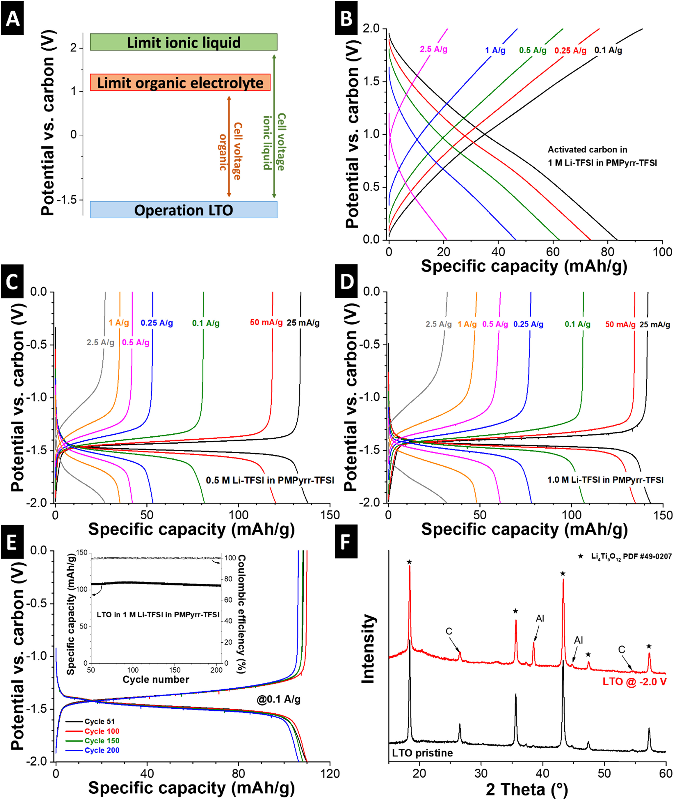
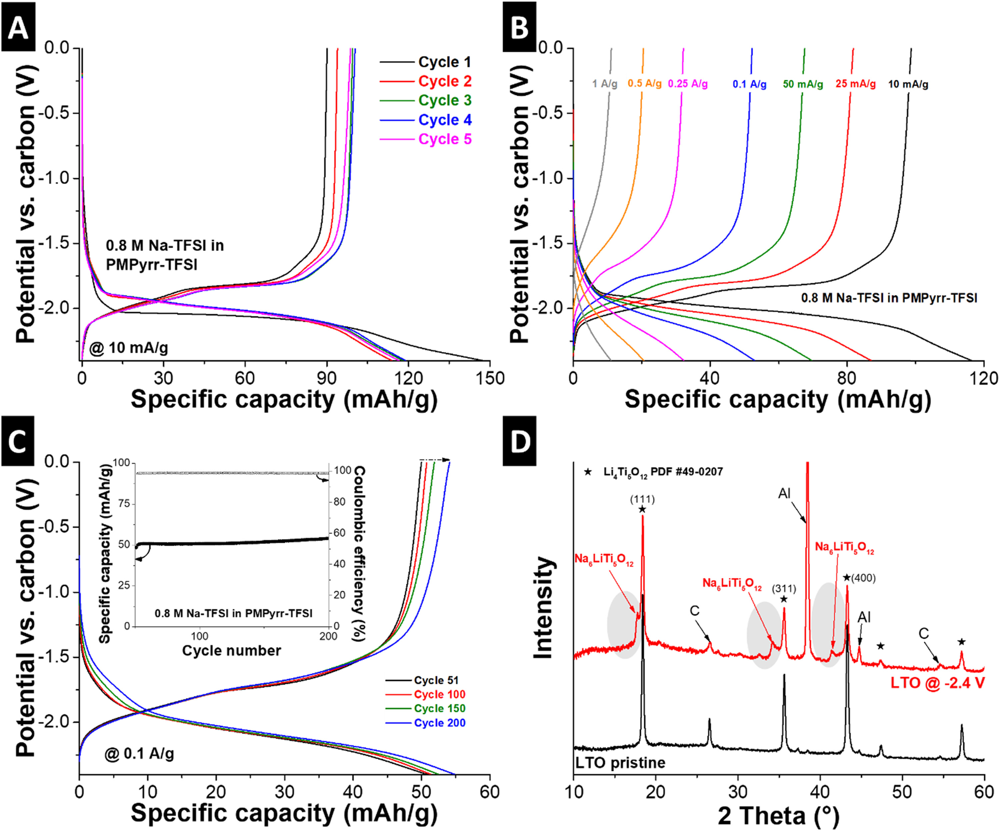
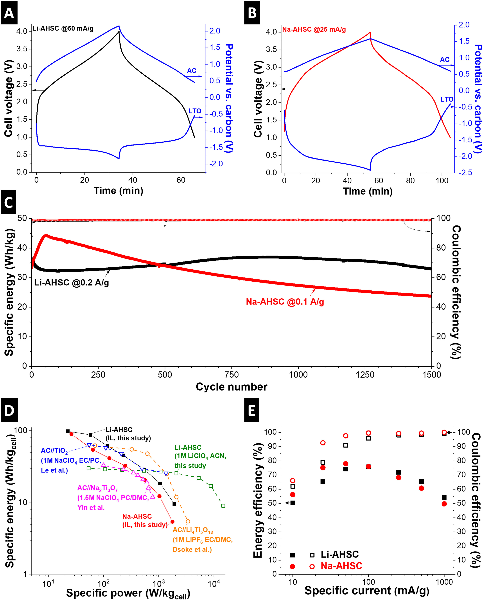
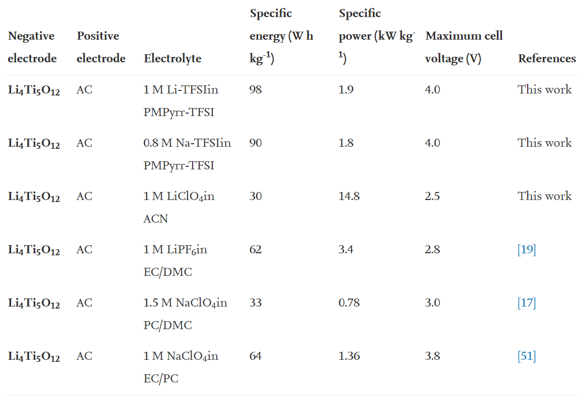
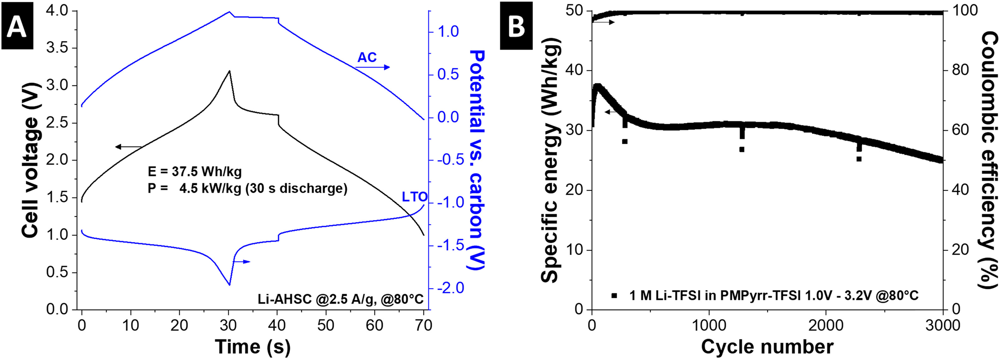

## High voltage asymmetric hybrid supercapacitors using lithium- and sodium-containing ionic liquids 使用含锂和钠的离子液体的高压非对称混合超级电容器

> Simon Fleischmann, Mathias Widmaier, Anna Schreiber, Hwirim Shim, Frank M.Stiemke, Thomas J.S. Schubert, Volker Presser  
> Energy Storage Materials, Volume 16, January 2019, Pages 391-399
> DOI: [10.1016/j.ensm.2018.06.011](https://doi.org/10.1016/j.ensm.2018.06.011)  
> Keywords: Asymmetric hybrid supercapacitor, lithium-ion capacitor, sodium-ion capacitor, lithium titanate, ionic liquid, battery-supercapacitor hybrid

### Introduction
Electrical double-layer capacitors (EDLCs) are electrochemical energy storage devices that store charge by electrosorption of ions at high surface area carbon electrodes [1]. Despite their high specific power and longevity, the widespread use of EDLCs is limited by the low specific energy, owing to the purely physical charge storage mechanism. Many efforts to increase the specific energy of supercapacitors have focused on novel materials and innovative cell design by introducing Faradaic charge transfer to the capacitive system [2]. These approaches include the decoration of high surface area carbons with thin layers of Faradaic material [3], [4], [5], the use of redox-active electrolytes [6], [7], [8], composite electrodes combining these two charge storage mechanisms [9], [10], [11], or the utilization of an asymmetric hybrid supercapacitor cell design [12], [13].  
双电层电容器（EDLC）是电化学能量存储设备，通过在高表面积碳电极上电吸附离子来存储电荷[1]。尽管具有高的比功率和长寿命，但由于纯物理电荷存储机制，EDLC的广泛使用受到低比能量的限制。通过将法拉第电荷转移引入电容系统，许多提高超级电容器比能量的努力都集中在新型材料和创新的电池设计上[2]。这些方法包括用法拉第材料薄层装饰高表面积碳[3]，[4]，[5]，使用氧化还原活性电解质[6]，[7]，[8]，复合电极这两个电荷存储机制[9]，[10]，[11]或非对称混合超级电容器单元设计的利用[12]，[13]。

Asymmetric hybrid supercapacitors (AHSCs) employ one electrode storing charge by Faradaic reactions and another by capacitive double-layer formation. The aim is to synergistically combine the merits of battery and supercapacitor technologies, to produce cells that show higher specific energy than supercapacitors and higher specific power and longevity than batteries [14]. The most common types use a Li-ion intercalating negative electrode material and an activated carbon positive electrode [14]. More recent studies also investigated sodium intercalating negative electrode materials, creating so-called sodium-ion capacitors [15], [16], [17]. Most commonly, the negative electrode of AHSCs shows a relatively constant operation potential at which intercalation occurs, whereas the positive electrode shows a linear, capacitor-like potential development. Consequently, the maximum cell voltage is determined by the difference between the intercalation potential of the negative electrode and the anodic stability limit of the electrolyte at the positive electrode.  
非对称混合超级电容器（AHSC）使用一个电极通过法拉第反应存储电荷，而另一电极通过电容双层形成。目的是协同结合电池和超级电容器技术的优点，以生产比超级电容器具有更高比能量，比电池具有更高比功率和寿命的电池[14]。最常见的类型使用嵌入锂离子的负极材料和活性炭正极[14]。最近的研究也研究了嵌入钠的负极材料，从而形成了所谓的钠离子电容器[15]，[16]，[17]。最常见的是，AHSC的负极​​显示出发生插入时相对恒定的工作电势，而正极则显示出线性的电容器状电势。因此，最大电池电压由负电极的嵌入电势与正电极处的电解质的阳极稳定性极限之间的差确定。

Using organic electrolytes like Li-ion containing acetonitrile or carbonate mixtures, the anodic limit at the positive electrode is mostly found at around 4 V vs. Li+/Li [18], [19], [20]. The most frequently chosen negative electrode material for AHSCs is graphite due to its low Li-ion intercalation potential of around 0.2 V vs. Li+/Li [18]. This low intercalation potential is beyond the stability boundary of most electrolytes and requires the formation of the so-called solid electrolyte interphase (SEI) for stable cell operation [21]. Since SEI formation consumes Li-ions from the electrolyte, a prelithiation of the graphite electrode is required in a conventional AHSC cell due to the absence of a Li-containing positive electrode [18], [22]. Further, the SEI layer limits the power performance of the cell and can lead to dendrite formation at low operating temperatures or high charging rates [23]. The use of a negative electrode with a higher intercalation potential, like spinel lithium titanate (LTO, Li4Ti5O12), can effectively circumvent the necessity of SEI formation. Also, LTO is an attractive anode material for AHSCs because of its high rate capability, negligible volume change during intercalation and an intercalation potential of 1.55 V vs. Li/Li+ [24], [25], [26]. However, these advantages come at the cost of a drastic reduction of AHSC cell voltage to about 2.5 V in organic electrolytes (Fig. 1A), thereby exhibiting much smaller specific energies as comparable AHSCs using graphite as negative electrodes [18], [27].  
使用含有锂离子的乙腈或碳酸盐混合物的有机电解质，正极的阳极极限大多在相对于Li + /Li的4 V左右[18]，[19]，[20]。用于AHSC的最常选择的负极材料是石墨，这是因为其相对于Li + /Li的低锂离子嵌入电势约为0.2 V [18]。这种低的嵌入电势超出了大多数电解质的稳定性范围，并需要形成所谓的固体电解质中间相（SEI）才能使电池稳定运行[21]。由于SEI的形成会消耗电解质中的锂离子，因此，由于缺少含锂的正极[18]，[22]，在传统的AHSC电池中需要对石墨电极进行预锂化。此外，SEI层限制了电池的功率性能，并可能导致在低工作温度或高充电速率下形成枝晶[23]。使用尖晶石型钛酸锂锂（LTO，Li4Ti5O12）等具有较高插层电位的负极可以有效地规避SEI的形成。同样，LTO是AHSC的有吸引力的阳极材料，因为它的高倍率能力，插层过程中的体积变化可忽略不计，并且插层电势相对于Li /Li +为1.55 V [24]，[25]，[26]。然而，这些优势是以有机电解液中将AHSC电池电压急剧降低至约2.5 V（图1A）为代价的，因此与使用石墨作为负极的同类AHSC相比，其展现出的比能要小得多[18]，[27] 。

  
Fig. 1. Electrochemical and structural characterization of lithium half-cells. (A) Schematic representation of electrode potentials in an AHSC cell setup and the resulting maximum cell voltages depending on the electrolyte. Charge/discharge profiles of (B) activated carbon in 1 M Li-TFSI, (C) LTO in 0.5 M Li-TFSI, and (D) LTO in 1 M Li-TFSI electrolyte at different rates. (E) Charge/discharge profiles from the 51st to the 200th cycle of LTO in 1 M Li-TFSI at 0.1 A/g including specific capacity and Coulombic efficiency of every cycle in the inset. (F) X-ray diffractograms of pristine LTO electrode and ex situ measurement of fully lithiated LTO electrode in 1 M Li-TFSI electrolyte at −2.0 V vs. carbon. Li4Ti5O12/Li7Ti5O12 signals are indicated by a star (PDF 49–0207), graphite- and Al-peaks originate from the current collector.  
图1.锂半电池的电化学和结构表征。 （A）AHSC电池设置中电极电位的示意图以及取决于电解质的所得最大电池电压。 （B）1 M Li-TFSI中的活性炭，（C）0.5 M Li-TFSI中的LTO和（D）1 M Li-TFSI电解质中的LTO的充电/放电曲线不同。 （E）在1 M Li-TFSI中以0.1 A /g的LTO从第51个循环到第200个循环的充电/放电曲线，包括插图中每个循环的比容量和库仑效率。 （F）原始LTO电极的X射线衍射图和在-2.0 V相对于碳的1 M Li-TFSI电解质中离场测量的完全锂化LTO电极。 Li4Ti5O12 /Li7Ti5O12信号以星号表示（PDF 49-0207），石墨峰和铝峰来自集电器。

A well-known strategy to increase the specific energy of EDLCs is the use of ionic liquids (IL) as an electrolyte, as they offer larger stable potential windows compared to organic electrolytes [1], [14]. Furthermore, their non-flammability, low volatility, and broad liquid temperature range greatly enhance the safety of the respective devices [28], [29], and allow for stable cycling at elevated temperatures up to 100 °C [28], [30]. ILs have also been employed as battery electrolytes to capitalize on their distinct temperature and safety features. Therefore, they employ either an alkali metal electrode as ion-source [31] or a dissolved alkali salt [32], [33], [34].  
一种提高EDLC比能量的众所周知的策略是使用离子液体（IL）作为电解质，因为与有机电解质相比，离子液体（IL）提供了更大的稳定电势窗口[1]，[14]。此外，它们的不易燃性，低挥发性和宽广的液体温度范围大大增强了各个装置的安全性[28]，[29]，并允许在高达100 C的高温下稳定循环[28]，[30] ]。 IL也已被用作电池电解质，以利用其独特的温度和安全特性。因此，它们采用碱金属电极作为离子源[31]或溶解的碱金属盐[32]，[33]，[34]。

In this study, we employ such an IL electrolyte with dissolved alkali-ions for an AHSC with a negative intercalation electrode for the first time. By synergistically combining the distinct virtues of ILs, a significant advance to state-of-the-art AHSC technology is achieved: (1) The anodic stability at the positive electrode is expanded, thereby increasing the maximum accessible cell voltage and, in turn, the specific energy of the AHSC (Fig. 1A). (2) Higher operation temperatures are enabled, which is important to applications in the mobility sector where elevated temperatures are encountered. (3) The cell safety is improved because of the non-flammability and low vapor pressure of the ionic liquid. We explore this strategy for AHSCs, using a positive activated carbon electrode and a negative lithium titanate electrode. We demonstrate 4 V AHSC devices with high electrochemical cycling stability using both lithium- or sodium-containing ILs. These cells also function at an elevated temperature of 80 °C, which is the first report of the stable high-temperature operation of any AHSC device employing intercalation reactions. Our proof-of-concept study employs solely commercially available materials, underlining the possibility of straightforward application and large innovation potential of this cell concept by use of improved electrode materials or electrolyte mixtures.  
在这项研究中，我们首次将这种具有溶解碱离子的IL电解质用于带负插入电极的AHSC。通过协同结合IL的独特优点，可以实现先进的AHSC技术的重大进步：（1）扩大了正极的阳极稳定性，从而增加了最大可及电池电压，进而提高了AHSC的比能（图1A）。 （2）允许更高的工作温度，这对于遇到高温的移动部门的应用很重要。 （3）由于离子液体的不易燃性和低蒸气压，提高了电池的安全性。我们使用正极活性碳电极和负极钛酸锂电极探索AHSC的这种策略。我们展示了使用含锂或钠的离子液体具有高电化学循环稳定性的4 V AHSC器件。这些电池还可以在80°C的高温下运行，这是任何采用插层反应的AHSC装置在高温下稳定运行的第一份报告。我们的概念验证研究仅使用可商购的材料，强调了通过使用改良的电极材料或电解质混合物，这种电池概念可以直接应用并具有巨大的创新潜力。

### 2. Materials and methods
#### 2.1. Electrode and electrolyte preparation
Activated carbon (type YP-80F, Kuraray) was admixed with 5 mass% polytetrafluoroethylene (60 mass% aqueous solution, Sigma Aldrich) and ethanol in a pestle and mortar until a dough-like paste is obtained. The mass was formed in a hot-rolling machine to 70±10 µm thick electrodes and dried in a vacuum oven overnight at 120 °C and 20 mbar. The material loading was 2.5±0.5 mg/cm2. Additional information on the properties of the AC electrodes of type YP-80F is provided in Fig. S1.

For the preparation of LTO electrodes, lithium titanate (spinel Li4Ti5O12,<200 nm, Sigma Aldrich), carbon black (C-NERGY C65, Imerys Graphite&Carbon), and polyvinylidene fluoride (Solvay) were dissolved in dimethyl sulfoxide (Merck) with a mass ratio of 8:1:1 (dry mass) in a DAC400 FVZ speedmixer. Subsequently, the electrode slurry was doctor-bladed on a carbon-coated aluminum foil current collector (Ranafoil, Toyo Aluminium). The electrode sheets were dried for two days at ambient conditions in a fume hood, followed by drying in a vacuum oven at 120 °C and 20 mbar for 12 h. Dried electrodes typically possessed a thickness of 25±5 µm with a material loading of 3±1 mg/cm2.

All electrolytes used are based on the ionic liquid 1-methyl-1-propylpyrrolidinium bis(trifluoromethylsulfonyl)imide (PMPyrr-TFSI, Iolitec, H2O<10 ppm) which was dried with molecular sieves. For lithium-containing IL mixtures, lithium bis(trifluoromethylsulfonyl)imide (Li-TFSI, 99.9% purity, Iolitec) was used and for sodium-containing ILs, sodium bis(trifluoromethylsulfonyl)imide (Na-TFSI, 99.9% purity, Iolitec) was used. All reagents were transferred into an argon-filled glovebox (MBraun, O2/H2O<1 ppm) through a connected vacuum furnace, where they were dried at 120 °C and 20 mbar for 24 h. Properties of the electrolyte as given by the supplier are listed in Table S1.

#### 2.2. Materials characterization
X-ray diffraction was carried out with a D8 Discover (Bruker AXS) with a copper X-ray source, a Göbel mirror, a 0.5 mm point focus, and a 2-dimensional VANTEC500 detector that was placed at 20°, 40°, and 60° 2θ for 17 min at each measurement step.

#### 2.3. Electrochemical characterization
All electrochemical measurements were conducted in custom-build three-electrode cells with a polyether ether ketone body and titanium pistons, more information on these cells is given in Ref. [35]. In half-cell measurements, 12 mm discs of AC or LTO were used as working electrodes and an at least 15-times mass-oversized activated carbon (type YP-80F, Kuraray, 5 mass% PTFE-bound) was used as a counter electrode. In full-cells, we used 12 mm discs of activated carbon and 10 mm discs of LTO. To achieve the exact mass ratio needed, small pieces of the 12 mm activated carbon electrodes were removed. As a quasi-reference electrode, activated carbon (type YP-50F, Kuraray, 5 mass% PTFE-bound) was used, which is highly reliable in ionic liquid electrolytes [36]. It was beneficial to use the same quasi-reference for all cells to provide easier comparability between lithium- and sodium-containing cells. The potential difference between the used YP-50F quasi-reference and metallic lithium is determined to 3.09 V. As current collector, we used 12 mm discs of carbon-coated aluminum foil (type EQ-CC-Al-18u-260, MTI Corporation) for all activated carbon electrodes and the separator was a 13 mm glass-fiber mat (GF/D, Whatman). After cell assembly, they were dried in a vacuum oven at 120 °C overnight and transferred to an argon filled glovebox (MBraun, O2/H2O<1 ppm), where they were filled with electrolyte.

Electrochemical measurements were carried out with a potentiostat/galvanostat (VMP-300, Bio-Logic) in a climate chamber at 25 °C or at 80 °C. Galvanostatic charge/discharge experiments were carried out at varying specific currents between 10 mA/g and 2.5 A/g, with 10 s resting after each half-cycle. The values are normalized to the active electrode mass, i.e., neglecting the PTFE binder in AC electrodes and neglecting carbon black and PVDF binder in LTO electrodes. AC half-cells with Li-TFSI electrolyte were first cycled at 0.1 A/g from 0 V to 1.2 V, 1.4 V, 1.6 V, 1.8 V, and 2.0 V vs. carbon, each step for 5 times, before being cycled between 0 V and 2.0 V vs. carbon at varying rates between 0.1 A/g and 2.5 A/g, 5 times for each rate. LTO half-cells with Li-TFSI electrolyte were cycled from 0 V to −2.0 V vs. carbon at rates of 25 mA/g to 2.5 A/g, each step for 5 times, before being cycled for 200 times in the same range at 0.1 A/g. LTO half-cells with Na-TFSI electrolyte were cycled from 0 V to −2.4 V vs. carbon at rates of 10 mA/g to 1 A/g, each step for 5 times, before being cycled for 200 times in the same range at 0.1 A/g.

The specific capacity Csp in all half-cells was calculated according to Eq. (1):$C_{sp} = \frac{\int_{t_0}^{t}I\, dx}{m}$ (1)
with current I, duration of the delithiation/desodiation/desorption step t-t0, and m the active electrode mass as defined above.

Li-AHSC cells were assembled with an AC:Li4Ti5O12 active mass ratio of 1.5:1. Galvanostatic cycling was carried out by charge/discharge at different rates between 10 mA/g to 1 A/g between 1 V and 4 V. Each charging/discharging step was repeated 5 times, with 10 s resting after each half-cycle. Na-AHSC cells employed an active mass ratio AC:Li4Ti5O12 of 1.2:1 and were cycled at the same rates as Li-AHSCs. Cycling stability was tested by galvanostatic cycling at 0.1 A/g for Na-AHSC cells and at 0.2 A/g for Li-AHSC cells, since they initially exhibited about the same specific energy at these rates. All normalizations are calculated with respect to the sum of active masses of both electrodes, i.e., of activated carbon and Li4Ti5O12 masses, excluding PTFE, PVDF and carbon black in the LTO electrode. The specific energy Esp of the cells was calculated by numeric integration according to Eq. (2):$E_{sp} = \frac{I \int_{t_0}^{t} U(t)\, dt}{M}$ (2)
where I is the current, U(t) the voltage profile during the discharge step, t-t0 the discharge time and M the sum of active masses of both electrodes. The specific power was calculated by dividing Esp by the discharge time, the energy efficiency by dividing Esp by the energy spent in the charging step, and the Coulombic efficiency by dividing the charge delivered in the discharge step by the charge spent in the charging step.

### 3. Results and discussion
#### 3.1. Lithium half-cells
Lithium-containing electrolytes were prepared by dissolving lithium bis(trifluoromethylsulfonyl)imide (Li-TFSI) in 1-methyl-1-propylpyrrolidinium bis(trifluoromethylsulfonyl)imide (PMPyrr-TFSI) to obtain 0.5 M and 1 M solutions. The anodic stability limits of the lithium-containing electrolytes with activated carbon electrodes (AC) were evaluated in a half-cell setup. The 1 M IL mixture still showed 90% Coulombic efficiency at 2.0 V vs. carbon (equal to 5.09 V vs. Li+/Li), which enables stable cycling for EDLCs [37], [38]. The potential profiles of AC in 1 M Li-TFSI electrolyte show a linear, capacitor-like behavior between 0 V and 2.0 V vs. carbon, with a capacity of around 80 mAh/g at 0.1 A/g (Fig. 1B). Further details of AC performance can be found in Supplemental Information (Fig. S2 and Fig. S3).

LTO electrodes were employed and the lithium intercalation behavior was evaluated as a function of the Li-TFSI concentration. In 0.5 M Li-TFSI electrolyte, a maximum specific capacity of 138 mA h/g is measured at a rate of 25 mA/g and 81 mAh/g at 0.1 A/g (Fig. 1C). In 1 M Li-TFSI electrolyte, a similar maximum capacity of 143 mAh/g is exhibited, while the rate handling with 108 mAh/g at 0.1 A/g is far superior compared to 0.5 M Li-TFSI electrolyte (Fig. 1D, Fig. S4A). The hysteresis between lithiation and delithiation reactions is extremely narrow and remains below 100 mV at a rate of 25 mA/g. A narrow hysteresis is important to achieve high energy efficiency on an AHSC device level [39], [40]. Both electrolyte mixtures show a maximum capacity that is similar to comparable literature [41] and close to the theoretical capacity of LTO (175 mA h/g for fully lithiated Li7Ti5O12) [42] with a high Coulombic efficiency of 99.0% at 25 mA/g, suggesting high compatibility of the IL electrolytes with LTO. The superior rate handling of 1 M Li-TFSI electrolyte implies that the Li-ion conductivity in the 1 M mixture is higher compared to 0.5 M. Higher Li-TFSI concentration increases the viscosity of the electrolyte mixture, leading to lower overall ion mobility. However, Li-ion mobility has a much greater impact on the rate performance of the LTO electrode. Further optimization work for the electrolyte formulation to achieve a perfect balance between general conductivity and Li-ion mobility, possibly with other ILs or mixtures thereof, should be conducted in the future. The cycling stability of LTO electrodes in 1 M Li-TFSI electrolyte was tested by galvanostatic cycling at 0.1 A/g (Fig. 1E). The shape of the voltage profiles remains unchanged, and the specific capacity only shows a minor fading from initially 108 mA h/g to 106 mA h/g after 200 cycles. The Coulombic efficiency remains at 99.8%, underlining high stability of the system in 1 M Li-TFSI electrolyte.

To study the intercalation mechanism of lithium ions from the IL electrolyte, XRD measurements were conducted to compare a fully charged with a pristine LTO electrode (Fig. 1F). A comparison of both diffractograms reveals signals at identical positions, where spinel Li4Ti5O12 can be identified according to PDF 49–0207. LTO is known as a so-called zero-strain material, and the transformation from Li4Ti5O12 to Li7Ti5O12 during lithiation occurs with only 0.2% volume change [42]. Our XRD data with unchanged LTO peak positions and the straight voltage profile suggest that the lithiation mechanism does not change in Li-ion containing IL as compared to the conventional organic electrolytes. Undesired co-intercalation of IL cations into the LTO crystal structure is therefore unlikely.

#### 3.2. Sodium half-cells
An emerging alternative to lithium-ion technology is the use of sodium-ion intercalating materials [43]. This motivated us to expand our AHSC cell concept to sodium-containing IL by replacing Li-TFSI with sodium bis(trifluoromethylsulfonyl)imide (Na-TFSI). We use a 0.8 M solution of Na-TFSI in PMPyrr-TFSI, which we determined to be the maximum soluble Na-TFSI concentration in the IL at ambient conditions. LTO has been employed as anode material in sodium-ion batteries with organic carbonate electrolytes and showed a sodiation potential of around 0.9 V vs. Na+/Na [44], [45], [46]. This relatively high sodiation potential might circumvent SEI formation compared to other typical sodium-ion anode materials like hard carbon [47]. So far, sodium-ion intercalation in LTO from an IL electrolyte has not been reported. Using a 0.8 M Na-TFSI electrolyte, we observed an initial intercalation potential of around −2.0 V vs. carbon at a rate of 10 mA/g with a maximum specific capacity of 100 mAh/g, showing a relatively flat plateau and a first cycle Coulombic efficiency of 61.2% (Fig. 2A, Fig. S4B).

  
Fig. 2. Electrochemical and structural characterization of sodium half-cells. Charge/discharge profiles of LTO in 0.8 M Na-TFSI in PMPyrr-TFSI electrolyte (A) for the first five cycles at 10 mA/g, (B) at different rates and (C) from the 51th to 200th cycle at 0.1 A/g, including specific capacity and Coulombic efficiency of every cycle in the inset. (D) X-ray diffractograms of pristine LTO electrode and ex situ measurement of the fully sodiated LTO electrode in 0.8 M Na-TFSI electrolyte at −2.4 V vs. carbon. Li4Ti5O12/Li7Ti5O12 signals are indicated by a star (PDF 49–0207), the Na6LiTi5O12 phase developed as a shoulder towards lower 2θ is highlighted; graphite- and Al-signals labeled accordingly originate from the current collector.  
图2.钠半电池的电化学和结构表征。 LMP在PMPyrr-TFSI电解质中的0.8μMNa-TFSI中的LTO的充电/放电曲线（A）前五个循环以10μmA/g的速度变化，（B）以不同的速率变化，（C）从第51到200次循环以0.1μA的电流变化/g，包括插图中每个循环的比容量和库仑效率。 （D）原始LTO电极的X射线衍射图和在0.8 M Na-TFSI电解质中于-2.4 V相对于碳的全固态LTO电极的异位测量。 Li4Ti5O12 /Li7Ti5O12信号以星号表示（PDF 49-0207），突出显示为朝向较低2θ的肩的Na6LiTi5O12相；标记的石墨和铝信号相应地来自集电器。

Sodium-ion intercalation in Li4Ti5O12 from organic electrolytes is expected to follow a three-phase mechanism with the formation of a lithium-rich phase Li7Ti5O12 and a sodium-rich phase Na6LiTi5O12 during sodiation [44]. Low efficiency in the first cycle is known from organic electrolytes and was linked to structural rearrangements of the LTO crystal structure [46], [48]. Over the next cycles, the onset of sodiation slightly shifts to a more positive potential of −1.85 V vs. carbon and the specific capacity increases, indicating that initial conditioning facilitates further sodiation reactions (Fig. 2A) [46]. The increased sodiation potential of the second cycle and subsequent cycles indicates the absence of SEI formation since the charge transfer resistance of the SEI would have shifted the sodiation towards more negative potentials. Rate handling tests at increased currents showed a capacity of 53 mA h/g at 0.1 A/g with a Coulombic efficiency of 98.5% (Fig. 2B). LTO showed stable cycling performance in the sodium-containing IL, exhibiting a slightly increased capacity of 54 mA h/g after 200 cycles at 0.1 A/g with a Coulombic efficiency over 98% (Fig. 2C).

We used XRD to examine the intercalation mechanism of sodium from IL electrolyte into LTO (Fig. 2D). The diffractogram of sodiated LTO confirms the formation of the sodium-rich Na6LiTi5O12 phase by broad reflections located at slightly lower 2θ than the Li4Ti5O12/Li7Ti5O12 signals. These shoulders are visible below the (111), (311), and (400) reflections at around 18.4°, 35.6°, and 43.2° 2θ, respectively. At the same time, the main reflections of the Li4Ti5O12/Li7Ti5O12 phase are observed, confirming the presence of at least two separate phases in the sodiated state. This behavior aligns with sodium-ion intercalation in LTO in organic electrolytes [44], [45] and shows that sodiation occurs according to the same mechanism for IL electrolyte.

#### 3.3. AHSC full-cells
AHSC full-cells were assembled with LTO as a negative electrode and activated carbon as a positive electrode. For AHSCs employing lithium intercalation (Li-AHSC), we chose 1 M Li-TFSI in PMPyrr-TFSI electrolyte, sodium-AHSCs (Na-AHSC) used 0.8 M Na-TFSI in PMPyrr-TFSI electrolyte. The voltage profile of a Li-AHSC cell cycled between 1.0 V and 4.0 V at 50 mA/g is shown in Fig. 3A. The cell exhibits very small overpotential of the lithiation reaction and efficient utilization of the charge distributed to the two electrodes, resulting in the high energy efficiency of 74%. This performance demonstrates that the promising electrochemical properties measured in half-cells can successfully be transferred to a Li-AHSC full cell employing IL electrolyte (further characterization in Supplemental Information, Fig. S6).

  
Fig. 3. Electrochemical characterization of AHSC full-cells. Voltage profiles of (A) Li-AHSC cell cycled at 50 mA/g and (B) Na-AHSC cell cycled at 25 mA/g, including potential development at negative LTO electrode and positive AC electrode monitored via quasi-reference spectator electrode. (C) Cycling stability of Li-AHSC cell cycled at 0.2 A/g, and Na-AHSC cell cycled at 0.1 A/g over 1500 cycles between 1 V and 4 V cell voltage. (D) Ragone chart of Li-AHSC and Na-AHSC cells cycled at rates between 10 mA/g and 1 A/g between 1 V and 4 V cell voltage with a comparison to literature (Refs [17], [19], [51].) and Li-AHSC cell with the same electrode materials filled with 1 M LiClO4 in acetonitrile (ACN) electrolyte. (E) Energy efficiency and Coulombic efficiency of Li-AHSC and Na-AHSC cells.  
图3. AHSC全细胞的电化学表征。 （A）Li-AHSC电池以50 mA /g循环的电压曲线和（B）Na-AHSC电池以25 mA /g循环的电压曲线，包括通过准参考观众电极监测的LTO负极和AC正极的电势发展。 （C）在1 V和4 V电池电压之间的1500个循环中，Li-AHSC电池的循环稳定性以0.2 A /g循环，Na-AHSC电池以0.1 A /g循环。 （D）Li-​​AHSC和Na-AHSC电池在1 V和4 andV电池电压之间以10 mA /g和1 A /g之间的速率循环的Ragone图，并与文献进行了比较（参考文献[17]，[19]， [51]。）和具有相同电极材料的Li-AHSC电池，在乙腈（ACN）电解质中充满1 M LiClO4。 （E）Li-AHSC和Na-AHSC电池的能量效率和库仑效率。

In Fig. 3B, the voltage profile of a Na-AHSC cell cycled between 1.0 V and 4.0 V cell voltage range at 25 mA/g is provided, also showing a symmetric profile with high energy efficiency of 75%. In case of the Na-AHSC cell, special consideration has to be paid to the structural rearrangements in LTO during the first cycles (Fig. S6B). The irreversible charge consumed during this process at the negative electrode must be balanced at the positive activated carbon electrode. Therefore, in the following cycles, the maximum accessible potential window of 2 V vs. carbon is not fully used.

We tested the galvanostatic cycling stability of Li-AHSCs between 1.0 V and 4.0 V cell voltage at a rate of 0.2 A/g (Fig. 3C). During the first cycles, a slight drop from about 36 W h/kg to 32.5 W h/kg is observed, before a continuing recovery over the next about 800 cycles back to 36 W h/kg is exhibited. The fluctuations during the first cycles are associated with common side-reactions, which originate from impurities of electrode materials or IL electrolyte, leading to shifting operation potentials of the electrodes relative to each other. The Li-AHSC cell provides performance stability over 1,500 cycles, with only minor fading to 32.9 W h/kg (91% retention). Cycling stability of the Na-AHSC cell (Fig. 3C) showed a significant increase in specific energy from about 35 W h/kg to 44 W h/kg during the first 50 cycles. Similar to half-cells, we expect the initial rearrangements inside the LTO particles during the three-phase intercalation reaction being the main cause for the increased capacity [46]. During subsequent cycles, the specific energy of Na-AHSC cells slowly decreases to about 24 W h/kg after 1,500 cycles, corresponding to a retention of 69% of the initial energy. The lower stability compared to Li-AHSCs can be related to the increased mechanical stresses during sodiation and desodiation, owing to the high ionic radius of sodium ions (1.06 Å) [49]. Considering the use of commercially available LTO particles as an electrode material, the observed stability of our novel cell concept is very promising. By use of further optimized electrode materials, for example, by use of nanohybrid electrode materials [4], [50], we expect a further improved stability.

The performance metrics of the AHSC cells are shown in a Ragone plot comparing specific energy and specific power (Fig. 3D), with the corresponding energy efficiency and Coulombic efficiency given in Fig. 3E. The specific energy of the Li-AHSC cell ranges from 98 W h/kg to 10 W h/kg at specific powers between 23 W/kg and 1.93 kW/kg. The Na-AHSC cell shows comparable results with a specific energy between 90 W h/kg and 5.4 Wh/kg at a specific power of 26 W/kg and 1.78 kW/kg. The corresponding energy efficiencies reach 78% with the most efficient operation of both devices at a current between 50 mA/g and 0.25 A/g, where Coulombic efficiencies are nearly 100%, demonstrating high reversibility. Comparison with the state-of-the-art literature on AHSCs using AC as a positive electrode and a titanate-based negative electrode with organic electrolytes, it is confirmed that our cell concept significantly increases the energy of devices using both lithium- or sodium-intercalation (Fig. 3D, Table 1) [17], [19], [51], [52]. We also provide a comparison using our Li-AHSC cell with 1 M LiClO4 in acetonitrile electrolyte (Fig. 3D, Fig. S7, Table 1). The specific energy can be increased by more than a factor of three by use of IL electrolytes compared to the same electrodes in an organic electrolyte. However, the rather large viscosity of IL electrolytes at room temperature limits the resulting power performance. A cell employing acetonitrile at room temperature can deliver higher power.

Table 1. Comparison of AHSC cell performance with IL electrolytes and organic electrolytes, including comparable literature employing titanate-based anodes for lithium- or sodium-intercalation.  
  

#### 3.4. High-temperature operation
IL electrolytes offer high safety because of their non-flammability and enable operation at elevated temperatures [53]. We demonstrate that these features can be transferred to our IL AHSC cell concept. Therefore, Li-AHSC cells are evaluated at a temperature of 80 °C. The power of the cells is highly increased because of the enhanced mobility of ions in the electrolyte. The voltage profile of a Li-AHSC cell cycled at 2.5 A/g is shown in Fig. 4A. With a limitation of the maximum cell voltage to 3.2 V, the positive electrode showed stable, linear potential development between 0 V and 1.2 V vs. carbon. At the same time, the negative LTO electrode showed relatively constant lithiation plateaus around −1.4 V vs. carbon. The latter value is 50 mV above the onset of lithiation at 25 °C, indicating a reduced barrier for intercalation at 80 °C (in agreement with Nernst equation). At this rate and temperature, the specific energy reached 37.5 W h/kg at a high specific power of 4.5 kW/kg, corresponding to a discharge time of 30 s, with an energy efficiency of 77.4% and Coulombic efficiency of 98.2% (Fig. 4A). Stability testing was carried out at the same rate and in the same voltage window for over 3000 cycles, with a retention of 80% of the initial value (Fig. 4B, Fig. S8A). When cycling at a lower rate of 0.1 A/g, the cell voltage is reduced to 2.8 V, resulting in a specific energy of 71 W h/kg at a power of 190 W/kg (Fig. S8B-C). To the best of our knowledge, no comparable hybrid supercapacitor cell that combines a Faradaic intercalation electrode with a capacitive electrode was shown to exhibit stable behavior at such a high temperature. The performance stability further underlines the promising performance of the Li-AHSC cell at elevated temperatures. By further improvement of the electrolyte formulation, for example, by creation of eutectic mixtures of ionic liquids [54], [55] or mixing with organic solvent [56], even low temperature operation could be enabled for this AHSC cell concept in the future.

  
Fig. 4. High temperature operation. (A) Voltage profile of 50th cycle of a Li-AHSC cell cycled between 3.2 V and 1 V cell voltage at 2.5 A/g at a temperature of 80 °C. (B) Corresponding specific energy and Coulombic efficiency over 3000 cycles under these conditions.  
图4.高温操作。 （A）在80 C的温度下，Li-AHSC电池第50个周期的电压曲线在2.5 A /g的3.2 V和1 V电池电压之间循环。 （B）在这些条件下，超过3000个循环的比能和库仑效率。

### 4. Conclusions
In conclusion, we prepared ionic liquid electrolytes with dissolved lithium- and sodium-salt, respectively, and applied them for the first time in an asymmetric hybrid supercapacitor cell employing ion intercalation at the negative electrode (LTO) and double-layer formation at the positive electrode (AC). After evaluation of half-cell performance, a successful transfer to full-cells was achieved and both the lithium- and the sodium-ion AHSC cells were operated at 4 V up to 1500 cycles with only minor capacity fading. The maximum specific energy of Li-AHSC cells was about 100 W h/kg, while the maximum specific power was about 2 kW/kg. Na-AHSC cells showed similar values with slightly reduced specific energy. Finally, Li-AHSC cells were shown for the first time to exhibit stable behavior at a high temperature of 80 °C for more than 3000 cycles at a high rate, exhibiting up to 38 Wh/kg at high power of 4.5 kW/kg.

We believe that the presented approach is particularly promising as it combines all virtues of ILs synergistically in one cell concept. ILs expand the stability window for the positive electrode, giving access to larger cell voltages, as we showed by enabling 4 V for LTO-based AHSC devices. The demonstrated possibility of high-temperature operation in combination with the non-flammability of the device is important for many applications including the mobility sector, where mass, volume, and cost of cooling systems and impact-safe housing could be reduced. The viability of this novel cell concept was demonstrated for different alkali ion systems by using only commercially available materials. Thus, there is great potential for further improvement, for example, by use of more advanced electrode materials that can increase energy, power, and longevity, or the exploration of further ILs or their mixtures with organic solvents or further additives.