## Polymeric ionic liquids: Broadening the properties and applications of polyelectrolytes
## 聚合物离子液体：拓宽聚电解质的性质和应用

> David Mecerreyes
> Progress in Polymer Science, Volume 36, Issue 12, December 2011, Pages 1629-1648
> DOI: [10.1016/j.progpolymsci.2011.05.007](https://doi.org/10.1016/j.progpolymsci.2011.05.007)
> Keywords: Polyelectrolytes, Ionic liquids, Functional polymers, Supramolecular polymers, Conductive polymers, Smart polymers

### Abstract
The introduction of new ionic moieties, cations and anions, is extending the properties and classical applications of polyelectrolytes. These new polyelectrolytes are being named polymeric ionic liquids (PILs) in analogy to their monomeric constituents (i.e. cations such as imidazolium, pyridinium, pyrrolidonium and anions such as hexafluorophosphate, triflates, amidotriflates). This is giving rise to a new family of functional polymers with particular properties and new applications. The first part of this review will focus on the synthetic aspects of PILs and the main aspects related to their physico-chemical properties. In the second part we will review the new technological applications of these polymers such as polymer electrolytes in electrochemical devices, building blocks in materials science, nanocomposites, gas membranes, innovative anion sensitive materials, smart surfaces, and a countless set of applications in different fields such as energy, environment, optoelectronics, analytical chemistry, biotechnology or catalysis.  
新离子部分，阳离子和阴离子的引入正在扩展聚电解质的性质和经典应用。这些新的聚电解质被称为聚合物离子液体（PIL），类似于它们的单体成分（即阳离子如咪唑鎓，吡啶鎓，吡咯烷鎓和阴离子如六氟磷酸盐，三氟甲磺酸盐，三氟甲磺酸盐）。这产生了一系列具有特殊性能和新应用的功能性聚合物。本综述的第一部分将重点关注PIL的合成方面以及与其物理化学性质相关的主要方面。在第二部分中，我们将回顾这些聚合物的新技术应用，如电化学装置中的聚合物电解质，材料科学中的构件，纳米复合材料，气体膜，创新的阴离子敏感材料，智能表面以及不同领域的无数应用如能源，环境，光电子，分析化学，生物技术或催化。

### 1. Introduction
Ionic liquids (ILs) are generally defined as organic/inorganic salts with a melting point lower than 100 °C which present a good chemical and electrochemical stability, low flammability, negligible vapour pressure and high ionic conductivity. Although originally, most of the research and industrial activities related to ILs were associated to their applications in green chemistry [1] as substitutes of volatile organic solvents, ILs have been finding an increasing number of applications in other technological fields such as catalysis [2], organic and polymer chemistry, electrochemistry [3], [4], analytical chemistry [5], energy [6], nanotechnology [7] and biotechnology [8], among others. In the case of polymer science [9], ILs are being investigated as green solvents in polymerization processes [10], as specialty solvents of biopolymers like cellulose [11], as co-catalysts/initiators in polymerization reactions [12], [13], as specialty polymer additives and in the development of functional polymers [14], [15], [16]. Interestingly, functionalization of polymers having some of the chemical groups of ILs has been pursued as a way of developing a new class of polyelectrolytes which here we will name polymeric ionic liquids (PILs) also named in the scientific literature as poly(ionic liquid)s. It is the aim of this review to get a close and complete view to the synthetic methods, physico-chemical properties and technological applications of these new polymers.  
离子液体（ILs）通常定义为熔点低于100℃的有机/无机盐，其具有良好的化学和电化学稳定性，低可燃性，可忽略的蒸气压和高离子传导性。尽管最初，与IL相关的大多数研究和工业活动都与它们在绿色化学[1]中作为挥发性有机溶剂的替代品有关，但ILs已经在其他技术领域如催化中发现了越来越多的应用[2]。 ，有机和高分子化学，电化学[3]，[4]，分析化学[5]，能源[6]，纳米技术[7]和生物技术[8]等。在聚合物科学[9]的情况下，ILs正在作为聚合过程中的绿色溶剂[10]，作为生物聚合物如纤维素的特殊溶剂[11]，作为聚合反应中的助催化剂/引发剂[12]，[13]。 ]，作为特种聚合物添加剂和功能聚合物的开发[14]，[15]，[16]。有趣的是，已经开发了具有一些IL化学基团的聚合物的官能化作为开发新类型聚电解质的方式，在此我们将其称为聚合物离子液体（PIL），在科学文献中也称为聚（离子液体）。 。本综述的目的是对这些新聚合物的合成方法，物理化学性质和技术应用进行全面了解。

During the last few years, the introduction of the functional groups associated to ILs (i.e. cations such as imidazolium, pyrrolidonium, pyridinium and anions such as tetrafluoroborate, hexafluorophosphate, triflates) into functional polymers is giving rise to a new family of materials with particular properties and interesting applications. By looking at their chemical structure, PILs are polyelectrolytes, polymers whose repeating unit bear an electrolyte group (cation or anion). Although there is not a clear definition for PILs, we will consider those polymers synthesized from IL monomers in opposition to polyelectrolytes which are synthesized from solid salt monomers. PILs present some of the unique properties of ILs (ionic conductivity, thermal stability, tuneable solution properties and chemical stability) together with the intrinsic polymer properties. Contrary to classic polyelectrolytes which are water soluble and dissociate in aqueous solutions making the polymers charged (polysalts), most PILs are not soluble in water but in polar organic solvents. This is mainly due to the hydrophobic character of the counter-ion and the reduced columbic interactions. As illustrative examples, in the case of classic cationic polyelectrolytes the common counter-anions are halide anions such as Cl−, Br− or I−. However, typical counter-anions of PILs are hydrophobic anions such as tetrafluoroborate (BF4−), hexafluorophosphate (PF6−) or fluorinated amides ((CF3CF2SO2)2N− and (CF3SO2)2N−) (Fig. 1). In the case of conventional anionic polyelectrolytes, the common counter-cations are metallic cations such as Li+, Na+ or K+. However, typical counter-anions of PILs are organic cations such as dialkyl imidazolium, alkylpyridinium, tetraalkylammonium and alkylpyrrolidonium. Thus, as general trends, we can conclude that PILs are a class of polyelectrolytes synthesized from IL monomers which are not soluble in water but in organic solvents.  
在过去几年中，将与ILs相关的官能团（即咪唑鎓，吡咯鎓，吡啶鎓和阴离子如四氟硼酸盐，六氟磷酸盐，三氟甲磺酸盐等）引入功能性聚合物中，产生了具有特殊性能的新材料系列。和有趣的应用程序通过观察它们的化学结构，PIL是聚电解质，其重复单元带有电解质基团（阳离子或阴离子）的聚合物。虽然对于PIL没有明确的定义，但我们将考虑由IL单体合成的那些聚合物与由固体盐单体合成的聚电解质相反。 PIL具有IL的一些独特性质（离子电导率，热稳定性，可调溶液性质和化学稳定性）以及固有的聚合物性质。与经典的聚电解质相反，水溶性在水溶液中解离并使聚合物带电（聚合物），大多数PIL不溶于水但在极性有机溶剂中。这主要是由于反离子的疏水特性和降低的库仑相互作用。作为说明性实例，在经典阳离子聚电解质的情况下，常见的反阴离子是卤素阴离子，例如Cl-，Br-或I-。然而，PIL的典型反阴离子是疏水阴离子，例如四氟硼酸盐（BF4-），六氟磷酸盐（PF6-）或氟化酰胺（（CF3 CF2 SO2）2 N-和（CF3 SO2）2N-）（图1）。在常规阴离子聚电解质的情况下，常见的抗衡阳离子是金属阳离子，例如Li +，Na +或K +。然而，PIL的典型反阴离子是有机阳离子，例如二烷基咪唑鎓，烷基吡啶鎓，四烷基铵和烷基吡咯烷鎓。因此，作为一般趋势，我们可以得出结论，PIL是由IL单体合成的一类聚电解质，其不溶于水但是不溶于有机溶剂。

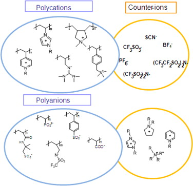
Fig. 1. Representative chemical structures of polymeric ionic liquids.

As in the case of polyelectrolytes, PILs can be classified as polycations bearing a cation in the backbone's part of the monomer unit, polyanions bearing an anion or polyzwitterions having both anion and cation. Furthermore, different types of copolymers (random, alternating, block) and macromolecular architectures such as branched, dendritic or ramified structures are potentially possible. This makes the number of PILs that can be synthesized extremely high due to all of the potential combinations between cations, anions and different polymer backbones and architectures. Thus, this review will only present the actual reported PILs and its applications which will be further developed in the future depending on the scientific curiosity of the scientists and the future technological interest on these functional polymers.  
与聚电解质的情况一样，PIL可以分类为在单体单元的主链部分中带有阳离子的聚阳离子，带有阴离子的多阴离子或具有阴离子和阳离子的多重两性离子。此外，不同类型的共聚物（无规，交替，嵌段）和大分子结构如分支，树枝状或分枝结构也是可能的。由于阳离子，阴离子和不同聚合物骨架和结构之间的所有潜在组合，这使得可以合成的PIL的数量极高。因此，本综述将仅介绍实际报告的PIL及其应用，这些将在未来进一步发展，这取决于科学家的科学好奇心和未来对这些功能聚合物的技术兴趣。

### 2. Synthesis of polymeric ionic liquids 聚合离子液体的合成
Independent of their nature, there are two general approaches for synthesizing PILs as illustrated in Fig. 2 for vinyl imidazolium type polymers. It is worth to remember that the most characteristic chemical reaction in the synthesis of ILs consist of the methatesis or anion exchange of the halide anion in water driven by the liquid/liquid phase separation of the formed hydrophobic IL. Thus, the natural approach to PILs was pioneered by Ohno et al. which consisted in synthesizing a variety of IL monomers by anion exchange reaction of a cationic 1-vinyl-3-alkyl imidazolium halide type monomer with different counter-anions [17]. Then, the PILs were prepared by the direct polymerization of each different IL monomer (upper route). Alternatively, the second strategy consists of polymerizing first the imidazolium monomer and then carrying out the anion exchange reaction directly into a polyelectrolyte precursor, such as poly(1vinyl-3-alkyl imidazolium) chloride (lower route). In this case, the different PILs were obtained by precipitation in water of the solid PIL obtained after anion exchange of the halide anion by a more hydrophobic counter-anion [18]. Depending on the targeted PIL both methods can present some advantages/disadvantages. The first route involving the polymerization of IL monomers enables the preparation of homopolymers as well as copolymers. However this method involves a number of organic synthesis and purification steps at the monomer level as well as the need of controlling the polymerization conditions of each individual monomer. On the other hand, the second method is synthetically less complicated since it involves only one type of monomer purification and polymerization step, but it maybe somehow limited in cases where the anion exchange reaction is not quantitative, random copolymers or more complicated polymer architectures are searched.  
与其性质无关，有两种合成PIL的一般方法，如图2所示，用于乙烯基咪唑鎓型聚合物。值得记住的是，IL合成中最具特征的化学反应包括由形成的疏水性IL的液/液相分离驱动的水中卤化物阴离子的热解或阴离子交换。因此，Ohno等人开创了PIL的自然方法。其中包括通过阳离子交换反应合成各种IL单体，阳离子交换反应为阳离子1-乙烯基-3-烷基咪唑卤化物型单体与不同的反阴离子[17]。然后，通过每种不同IL单体的直接聚合制备PIL（上游途径）。或者，第二种策略包括首先聚合咪唑鎓单体，然后将阴离子交换反应直接进入聚电解质前体，例如聚（1乙烯基-3-烷基咪唑鎓）氯化物（下游路线）。在这种情况下，通过在更加疏水的反阴离子[18]的阴离子交换卤化物阴离子后获得的固体PIL在水中沉淀来获得不同的PIL。根据目标PIL，两种方法都可以带来一些优点/缺点。涉及IL单体聚合的第一种途径使得能够制备均聚物以及共聚物。然而，该方法涉及在单体水平上的许多有机合成和纯化步骤以及控制每种单体单体的聚合条件的需要。另一方面，第二种方法在综合上不太复杂，因为它只涉及一种类型的单体纯化和聚合步骤，但在阴离子交换反应不是定量，无规共聚物或更复杂的聚合物结构的情况下，它可能在某种程度上受到限制。

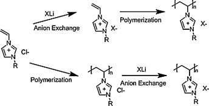  
Fig. 2. Illustrative general synthetic routes of polymeric ionic liquids.
图2.聚合物离子液体的示例性一般合成路线。

#### 2.1. Synthesis of PILs having cationic moieties in the polymer backbone 聚合物主链中具有阳离子部分的PIL的合成
The largest variety of PILs synthesized so far include cationic moieties in their polymeric backbone and a large variety of mobile anions. Here the most common synthetic approach involves the use of chain growth polymerization methods (Fig. 3). Imidazolium is the most popular cation which has been included into polymer backbones obtained from vinyl 1 [18], [19], [20], [21], [22], [23], styrenic 2 [24], [25], [26], (meth)acrylic and (meth)acrylamide 3 [30], [31], [32], [33], ethylene glycol, vinyl ether 4, 5 [34] and norbornene 6 monomers [22], [23], [24], [25], [26], [27], [28], [29], [30], [31], [32], [33], [34], [35]. To a minor extent, polymers bearing other types of cations such as tetraalkyl ammonium 7, 8 [36], [37], [38], [39], pyridinium 9, 10 [40], [41], [42], pyrrolidonium 11–13 [43], [44], guanidinium 12 [45] or piperidinium 15 [46] have also been synthesized using similar vinylic, styrenic or methacrylic polymer backbones. Most of these polymers have been synthesized using conventional radical polymerization. However, examples of PILs synthesized by modern polymerization methods such as atom transfer radical polymerization (ATRP) [30], [46], reversible addition-fragmentation transfer polymerization (RAFT) [34], [47], ring-opening polymerization and ring-opening methatesis polymerization processes [36] have also been reported in the scientific literature. Most of the polymerizations have been carried out in bulk or solution, although examples of PILs synthesized in emulsions or dispersed media have also been reported [48], [49], [50], [51]. These cationic PILs have been reported bearing a large variety of counter-anions (X−) such as tetrafluroborate, hexafluorophosphate, triflate, nitrate, bis(trifluoromethane)sulfonimide (TFSI), alkylsulphonates, dicyanoamide, iron tetrachloride and perchlorate.  
迄今为止，合成的PIL种类最多，包括在其聚合物主链中的阳离子部分和各种可移动的阴离子。这里最常见的合成方法涉及链增长聚合方法的使用（图3）。咪唑鎓是最流行的阳离子，已包含在从乙烯基1 [18]，[19]，[20]，[21]，[22]，[23]，苯乙烯2 [24]，[25]获得的聚合物主链中，[26]，（甲基）丙烯酸和（甲基）丙烯酰胺3 [30]，[31]，[32]，[33]，乙二醇，乙烯基醚4、5 [34]和降冰片烯6单体[22]， [23]，[24]，[25]，[26]，[27]，[28]，[29]，[30]，[31]，[32]，[33]，[34]，[35 ]。在较小程度上，带有其他类型阳离子的聚合物，例如四烷基铵7、8 [36]，[37]，[38]，[39]，吡啶鎓9、10 [40]，[41]，[42]，吡咯烷鎓11-13 [43]，[44]，胍12 [45]或哌啶15 [46]也已使用类似的乙烯基，苯乙烯或甲基丙烯酸聚合物骨架合成。这些聚合物中的大多数已经使用常规的自由基聚合反应合成。然而，通过现代聚合方法合成的PIL实例，例如原子转移自由基聚合（ATRP）[30]，[46]，可逆加成-片段转移聚合（RAFT）[34]，[47]，开环聚合和环在科学文献中也已经报道了开放式的乙酸甲酯聚合方法[36]。尽管已经报道了在乳液或分散介质中合成的PIL的实例，但大多数聚合反应都是在本体或溶液中进行的[48]，[49]，[50]，[51]。据报道，这些阳离子PIL带有多种抗衡阴离子（X-），例如四氟硼酸根，六氟磷酸根，三氟甲磺酸根，硝酸根，双（三氟甲烷）磺酰亚胺（TFSI），烷基磺酸根，双氰胺，四氯化铁和高氯酸根。

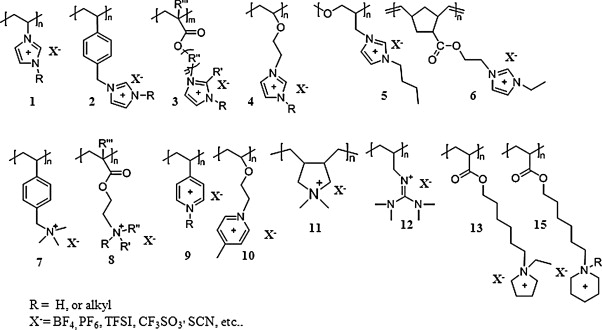  
Fig. 3. Chemical structures of cationic polymeric ionic liquids.

In addition to linear homopolymers, cross-linked PIL networks have been synthesized by radical polymerization methods (Fig. 4). For this purpose, bi- or trifunctional acrylic or styrenic IL monomers were purposely prepared. Cross-linking was carried out by thermal or UV radical curing leading to PIL networks. Examples include imidazolium diacrylate and distyrenic and vinylic monomers 16–18, tetraalkylamonium difunctional styrenic monomers 17, or more elaborated liquid crystal triacrylate imidazolium monomers 21 [52], [53], [54], [55]. In these cases the reported PILs include halide and bis(trifluoromethane)sulfonimide counter anions. Another interesting type of IL monomers which lead to three-dimensional networks are alkoxysilane functionalized imidazolium ones such as 20. In this last case, acid or based catalysed sol–gel polycondentation reactions leads to inorganic–organic hybrid networks [56], [57].  
除线性均聚物外，还通过自由基聚合方法合成了交联的PIL网络（图4）。为此目的，有目的地制备了双或三官能的丙烯酸或苯乙烯类IL单体。通过热或UV自由基固化进行交联，形成PIL网络。实例包括二丙烯酸咪唑鎓和二苯乙烯和乙烯基单体16-18，四烷基铵二官能苯乙烯单体17或更精细的液晶三丙烯酸咪唑鎓单体21 [52]，[53]，[54]，[55]。在这些情况下，报告的PILs包括卤化物和双（三氟甲烷）磺酰亚胺抗衡阴离子。导致三维网络的另一种有趣的IL单体类型是烷氧基硅烷官能化的咪唑类（例如20）。在最后一种情况下，酸或碱催化的溶胶-凝胶多缩合反应会导致无机-有机杂化网络[56]，[57] 。

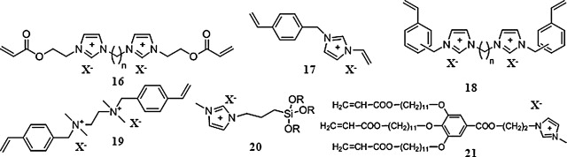  
Fig. 4. Chemical structures of multi-functional cationic ionic liquid monomers.
图4.多功能阳离子液体单体的化学结构。

Examples of PILs having cations in their backbone have also been synthesized by step-growth or polycondensation polymerization methods. Four different types of step-growth polymerizations have been investigated. The most direct method includes the synthesis of poly(alkyl imidazolium) 22 or poly (alkyl pyridinium) 23 polymers by direct quaternization of a dihalide with a dimidazole or a dipyridine molecule [58], [59], [60], [61]. A subsequent anion exchange step leaded to the corresponding PIL. The second step-growth polymerization method was based in the acyclic diene methatesis polymerization (ADMET) process and leaded to the synthesis of ionic polyolefins such as 24 and 26 [62]. The third type of PILs were synthesized by the hydroboration polymerization of diallylimidazolium IL derivatives 25. In this case the reported PILs include halide and bis(trifluoromethane)sulfonimide counter anions [63]. The last type of polycondensation PILs were recently reported based in imidazolium functional polyimides such as 27 [64] (Fig. 5).  
在其主链中具有阳离子的PIL的实例也已经通过逐步增长或缩聚聚合方法合成。已经研究了四种不同类型的逐步增长聚合。最直接的方法包括通过将二卤化物与二咪唑或二吡啶分子直接季铵化来合成聚（烷基咪唑鎓）22或聚（烷基吡啶鎓）23聚合物[58]，[59]，[60]，[61] 。随后的阴离子交换步骤导致相应的PIL。第二步增长聚合方法基于无环二烯甲基化聚合（ADMET）工艺，并导致了离子聚烯烃的合成，例如24和26 [62]。第三类PIL是通过二烯丙基咪唑IL衍生物25的硼氢化反应合成的。在这种情况下，报道的PIL包括卤化物和双（三氟甲烷）磺酰亚胺抗衡阴离子[63]。最近报道了基于咪唑官能聚酰亚胺（例如27 [64]）的最后一种缩聚PIL。（图5）。

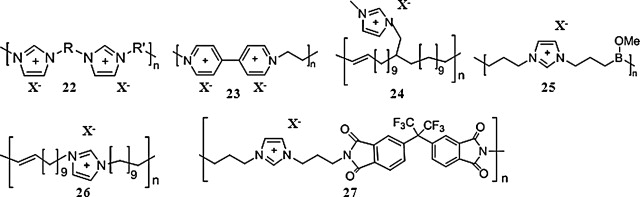  
Fig. 5. Chemical structures of cationic polymeric ionic liquids synthesized by step-growth polymerization methods.  
图5.通过逐步增长聚合方法合成的阳离子聚合物离子液体的化学结构。

PILs having conjugated backbones were purposely synthesized for combining ionic and electronic conducting properties into the same electroactive polymer. Semiconjugated PILs were synthesized by oxidative polymerization of pyrrole or thiophene monomers (Fig. 6). Thus, PILs having a poly(pyrrole) 28 [65], poly(alkyl-thiophene) 29–31 [66], [67], [68], [69] and poly(ethylene dioxythiophene) 32 backbones [70] have been reported. These polymers were synthesized by chemical oxidative polymerization using chemical or electrochemical oxidative polymerization methods. Polymers having chloride, bromide, tetrafluoroborate, hexafluorophosphate and bis(trifluoromethane)sulfonimide anions have been synthesized. On the other hand, cyclopolymerization of dialkyl-N,N-dipropargylammonium bis(trifluoromethylsulfonyl)imide using Schrock- and trifluoroacetate-modified Grubbs-type initiators leaded to a new family of conjugated polymers such as 33 [71].  
专门合成了具有共轭主链的PIL，以将离子和电子导电性能组合到同一电活性聚合物中。通过吡咯或噻吩单体的氧化聚合合成半共轭的PIL（图6）。因此，具有聚吡咯28 [65]，聚（烷基噻吩）29-31 [66]，[67]，[68]，[69]和聚（乙撑二氧噻吩）32骨架[70]的PIL具有被报道。使用化学或电化学氧化聚合方法通过化学氧化聚合合成这些聚合物。已经合成了具有氯离子，溴离子，四氟硼酸根，六氟磷酸根和双（三氟甲烷）磺酰亚胺阴离子的聚合物。另一方面，使用Schrock-和三氟乙酸酯改性的Grubbs型引发剂对二烷基-N，N-二炔丙基双（三氟甲基磺酰基）酰亚胺亚胺进行环聚合，产生了新的共轭聚合物家族，例如33 [71]。

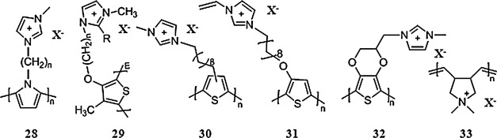  
Fig. 6. Chemical structures of cationic polymeric ionic liquids having a conjugated backbone. 图6.具有共轭主链的阳离子聚合物离子液体的化学结构。

#### 2.2. Synthesis of PILs having anionic and zwitterionic moieties in the polymer backbone 聚合物主链中具有阴离子和两性离子部分的PIL的合成
The number of PILs with anionic moieties in the polymer backbone and mobile counter-cations synthesized so far has been much smaller than the cationic ones. This is probably due to the more difficult task of synthesizing anionic-type monomeric ILs. We found only a few examples of polyanions bearing sulphonate, carboxylate, phosphoric or amide anions in their backbone together with a combination of alkyl-imidazolium or tetralkylamonium type counter-cations (Y−) (Fig. 7). Again, the PILs have been mainly synthesized by conventional radical polymerization from (meth)acrylate, styrenic or vinylic monomers. Thus, PILs having backbones such as poly(vinyl sulphonate) 34, poly(acrylamido)-2-methylpropane sulfonate 35, poly(styrene sulphonate)s 36–38, poly(acrylic acid) 37, poly(phosphonic acid) 39 have been synthesized having dialkylimidazolium or long tetraalkylammonium cations [72], [73], [74]. Interestingly, sophisticated PILs having trifluoromethanesulfonamide anions in their backbone have also been synthesized 30–41 [74], [75].  
迄今为止，在聚合物主链中具有阴离子部分和可移动的反阳离子的PIL的数量远少于阳离子的PIL的数量。这可能是由于合成阴离子型单体IL的工作更加困难。我们仅发现在骨架上带有磺酸根，羧酸根，磷酸根或酰胺基阴离子的聚阴离子的几个例子，以及烷基咪唑鎓或四烷基铵型抗衡阳离子（Y-）的组合（图7）。同样，PIL主要是通过常规的自由基聚合反应由（甲基）丙烯酸酯，苯乙烯或乙烯基单体合成的。因此，具有主链的PIL，例如聚（乙烯基磺酸盐）34，聚（丙烯酰胺基）-2-甲基丙烷磺酸盐35，聚（苯乙烯磺酸盐）36-38，聚（丙烯酸）37，聚（膦酸）39合成具有二烷基咪唑鎓或长四烷基铵阳离子的化合物[72]，[73]，[74]。有趣的是，在主链上具有三氟甲磺酰胺阴离子的复杂PIL也已合成30-41 [74]，[75]。

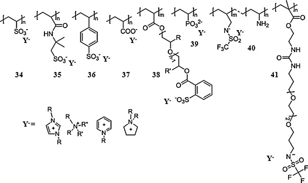  
Fig. 7. Chemical structures of anionic polymeric ionic liquids.

Some examples of zwitterionic PILs are also found in the scientific literature. In this case, the polymers have both cation and anion covalently linked to the polymer backbone. It is worth to note, that in the case of zwitterionic polymers the monomers are not IL but solid salts with high melting points in some cases. But we considered interesting to include these polymers which have appeared in parallel to the new PIL chemistry. Representative chemical stractures are shown in Fig. 8, which shows PILs having imidazolium or tetraalkylammonium cations together with sulphonate, or trifluoromethanesulfonamide or alkoxydicyanoethenolates anions in the same monomer unit have been synthesized by radical polymerization 42–47 [75], [76], [77], [78].  
两性离子PIL的一些例子也可以在科学文献中找到。在这种情况下，聚合物具有共价连接到聚合物主链的阳离子和阴离子。值得注意的是，在两性离子聚合物的情况下，单体不是IL，而是在某些情况下具有高熔点的固体盐。但是我们认为有趣的是包括与新的PIL化学方法平行出现的这些聚合物。代表性的化学结构如图8所示，该图显示了在同一单体单元中具有咪唑鎓或四烷基铵阳离子以及磺酸根，三氟甲磺酰胺或烷氧基二氰基乙磺酸根阴离子的PIL已通过自由基聚合反应42-47 [75]，[76]，[ 77]，[78]。

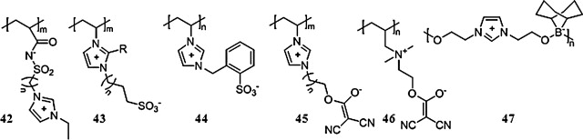  
Fig. 8. Chemical structures of PILs having zwitter ionic units in their backbone.
图8.在主链中具有两性离子单元的PIL的化学结构。

#### 2.3. Synthesis of PILs random and block copolymers
Copolymerization is a general strategy to obtain macromolecules with tuned properties. In the case of PILs copolymerization can lead to different types of ionic polymers independently of the random or blocky nature of the copolymer as depicted in Fig. 9. For instance, copolymerization can be used to reduce the amount of ionic moieties in the polymer backbone (a). An example of the later is found in the random copolymerization of imidazolium functional methacrylates with classic monomers such as methyl methacrylate or hexyl methacrylate [79]. Furthermore, copolymerization can be used to obtain polymers with opposite charges in the backbone (b). This type of polymers is obtained when cationic monomers such as imidazolium functional acrylate are copolymerized with anionic monomers such as sulphonate functional acrylate. The third type of copolymers involves the copolymerization of similar cationic monomers (or anionic) which posses the same polymerizable ionic moieties but different counter-ions. It this last case, the obtained PILs can be seen as a new type of random copolymers since each comonomer unit presents a similar backbone but different counter-ions (c). Interestingly this has recently demonstrated as an original route to tune the properties of pyrrolidonium functional PILs [80].  
共聚是获得具有调节性质的大分子的一般策略。就PIL而言，共聚可独立于共聚物的无规或嵌段性质而产生不同类型的离子聚合物，如图9所示。例如，共聚可用于减少聚合物主链中离子部分的数量（一种）。后者的一个例子是咪唑官能的甲基丙烯酸酯与经典单体（如甲基丙烯酸甲酯或甲基丙烯酸己酯）的无规共聚[79]。此外，共聚可用于获得在主链（b）中具有相反电荷的聚合物。当将诸如咪唑鎓官能丙烯酸酯之类的阳离子单体与诸如磺酸酯官能丙烯酸酯之类的阴离子单体共聚时，可获得这类聚合物。第三类共聚物涉及具有相同可聚合离子部分但具有不同抗衡离子的相似阳离子单体（或阴离子）的共聚合。在后一种情况下，由于每个共聚单体单元都具有相似的主链但具有不同的抗衡离子（c），因此可以将获得的PIL视为一种新型的无规共聚物。有趣的是，最近已证明这是调节吡咯烷鎓功能性PILs特性的原始途径[80]。

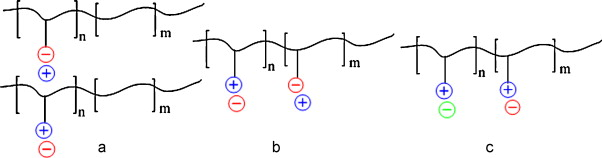  
Fig. 9. Illustrative structures of polymeric ionic liquid copolymers.

It is worth to note that copolymerization (random or block) strategies have scarcely been investigated. In particular, it was not until very recently that the block copolymerization of imidazolium type monomers by RAFT was reported [34], [47], [81], [82]. By this route a variety of block copolymers were reported including a imidazolium PIL block (vinyl, (meth)acrylate, (meth)acrylamide) and a second non-PIL block based in polyacrylamide, poly(isopropylacrylamide), poly(acrylic acid) or poly(methyl methacrylate). Due to their scientific and academic interest these copolymerization strategies can be considered to be still in an embrionary stage and they have still a lot of development possibilities.  
值得注意的是，很少研究共聚（无规或嵌段）策略。特别地，直到最近才报道了通过RAFT进行咪唑鎓型单体的嵌段共聚[34]，[47]，[81]，[82]。通过这种途径，报道了多种嵌段共聚物，包括咪唑PIL嵌段（乙烯基，（甲基）丙烯酸酯，（甲基）丙烯酰胺）和第二种非PIL嵌段，其基于聚丙烯酰胺，聚（异丙基丙烯酰胺），聚（丙烯酸）或聚（甲基丙烯酸甲酯）。由于它们的科学和学术兴趣，这些共聚策略可以认为仍处于萌芽阶段，并且它们仍有许多发展可能性。

### 3. Physico-chemical properties of polymeric ionic liquids
####  3.1. Solution properties
The most characteristic feature of PILs is found in the strong influence of the nature of the counter-anion in their solubility behaviour. This is particularly evident in the case of cationic PILs with different counter-anions and their solubility in different solvents. As an illustrative example, poly(1-vinyl-3-ethylimidazolium) X− bearing bromide anions, are soluble in water as a conventional polyelectrolyte. However, when the halide anion is substituted by tetrafluroborate or hexaflurophosphate the polymer is not soluble in water anymore but becomes soluble in methanol and polar aprotic solvents such as acetone, dimethylsulfoxide and dimethyl formamide. The poly(1-vinyl-3-ethylimidazolium)X− becomes soluble in less polar solvents such as tetrahydrofurane and toluene when the counter-anion are fluorinated bis(trifluoromethanesulfonamide) or hydrophobic anions such as long alkyl chain dodecylbenzenesulphonate (Fig. 10). A similar behaviour has been observed independently of the type of PILs having imidazolium, alkylammonium, pyridinium or guanidinium cationic backbones [17], [41], [45]. This confirms the previous observations in ILs where a stronger influence of the nature of the anion than the cation in the solubility behaviour was seen.  
PIL的最典型特征是抗衡阴离子的性质对其溶解性的强烈影响。这在具有不同抗衡阴离子的阳离子PIL及其在不同溶剂中的溶解度的情况下尤其明显。作为说明性实例，带有聚（1-乙烯基-3-乙基咪唑鎓）X-的溴化物阴离子作为常规的聚电解质可溶于水。但是，当卤化物阴离子被四氟硼酸酯或六氟磷酸酯取代时，聚合物不再溶于水，而是溶于甲醇和极性非质子溶剂，如丙酮，二甲基亚砜和二甲基甲酰胺。当抗衡阴离子为氟化双（三氟甲磺酰胺）或疏水性阴离子如长烷基链十二烷基苯磺酸盐时，聚（1-乙烯基-3-乙基咪唑鎓）X-可溶于极性较小的溶剂，例如四氢呋喃和甲苯中（图10）。无论具有咪唑鎓，烷基铵，吡啶鎓或胍鎓阳离子主链的PIL的类型如何，都已观察到类似的行为[17]，[41]，[45]。这证实了在离子液体中的先前观察，其中在溶解性行为方面，阴离子的性质比阳离子受到的影响更大。

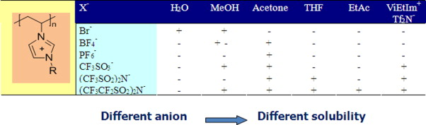  
Fig. 10. Illustrative Table with the solubility of poly(1-vinyl-3-ethylimidazolium) X− in different solvents.  
图10.聚（1-乙烯基-3-乙基咪唑鎓）X-在不同溶剂中的溶解度的说明表。

On the other hand, the behaviour of PILs in solution is expected to have similarities to the one of polyelectrolytes. Conventional polyelectrolytes in aqueous solution exhibit unique viscoelastic behaviour. Due to the repulsive electrostatic interactions among ionic groups, polyelectrolytes show solution rheological properties remarkably different from neutral polymers. In the absence of salt, the chains of polyelectrolytes are locally rod-like and are set far apart from each other due to repulsive interactions. If the solution is free of added electrolytes the polymer coil expands as the polymer concentration decreases. This is known as the “polyelectrolyte effect”. In the presence of added salts, the polyelectrolytes behave like non-ionic polymers and chain expansion is not observed. When looking at the solution behaviour of the PILs the question is whether they show a similar solution behaviour in organic solvents than polyelectrolytes in water or if they behave as neutral polymers. However, little is known about the solution behaviour of PILs. At this respect, and related to its interest in having electrospinned PIL fibers just one article investigated the solution behaviour of poly(1-butyl-3-ethylimidazolium methacrylate) bearing a tetrafluoroborate counter-anion. Compared to other polyelectrolyte solutions in water, this polymer exhibits similar viscosity scaling relationships in polar organic solvents like dimethylformamide or acetonitrile in the semidilute unentangled and semidilute entangled regimes. Although these results support that PILs will behave as conventional polyelectrolytes more experiments are needed to confirm or deny this fact and investigate the effect of the solvent dielectric constant and the nature or density of the ionic couples.  
另一方面，预计溶液中PIL的行为与聚电解质中的一种相似。水溶液中的常规聚电解质表现出独特的粘弹性行为。由于离子基团之间的排斥性静电相互作用，聚电解质显示出与中性聚合物明显不同的溶液流变性。在没有盐的情况下，聚电解质的链局部为棒状，并且由于排斥相互作用而彼此间隔开。如果溶液中没有添加的电解质，则聚合物线圈会随着聚合物浓度的降低而膨胀。这被称为“聚电解质效应”。在添加盐的存在下，聚电解质的行为类似于非离子聚合物，并且未观察到链膨胀。当查看PIL的溶液行为时，问题是它们是否在有机溶剂中显示出与水中的聚电解质相似的溶液行为，或者它们是否表现为中性聚合物。但是，对PIL的解决方案行为知之甚少。在这方面，并且与其对电纺PIL纤维的兴趣有关，只有一篇文章研究了带有四氟硼酸抗衡阴离子的聚（1-丁基-3-乙基咪唑甲基丙烯酸甲酯）的溶液行为。与其他聚电解质水溶液相比，该聚合物在极性有机溶剂（如二甲基甲酰胺或乙腈）的半稀释非缠结和半稀缠结状态下表现出相似的粘度缩放关系。尽管这些结果支持PIL充当常规的聚电解质，但仍需要进行更多的实验来证实或否认这一事实，并研究溶剂介电常数以及离子对的性质或密度的影响。

#### 3.2. Solid state properties
PILs are in most cases non-crystalline amorphous materials probably due to the mobile nature of the counter-anion which makes difficult crystallization processes. Some authors are proposing to investigate PILs as model substances of glassy polyelectrolytes. As a general trend PILs are much less hygroscopic and less fragile than conventional polyelectrolytes. The first classic feature of PILs is that their glass transition temperature not only depends on the chemical composition of the polymer backbone but on the type of counter-anion. For instance, the glass transition temperature of poly(trimethylammonium-2-ethyl) X− methacrylate varies depending on the counter-anion being 164 °C for Cl−, 130 °C for BF4−, 164 °C for PF6−, 70 °C for CF3SO3− and 38 °C for (CF3SO2)2N−, respectively [84]. Another illustrative example reported the glass transition temperature of poly(1-vinyl-3-ethylimidazolium) X− as 19 °C when the X− counter-anion was (CN)2N−, 60 °C for (CF3SO2)2N−,173 °C for CF3SO3− and 235 °C for Br− [85]. In any case, there are clear and big variations in glass transition temperature depending in the nature of the counter-anion. Another common feature of PILs is that in several reports authors realized that it was difficult to determine a Tg by differential scanning calorimetry (DSC). Although the reason for this is not clear yet, it is advised to combine the DSC measurements with other techniques for measuring Tg such as thermomechanical studies or dielectric relaxation spectroscopy in order to avoid wrong interpretations.  
在大多数情况下，PIL是非晶态非晶态材料，这可能是由于抗衡阴离子的移动性导致难以进行结晶过程。一些作者提议研究PIL作为玻璃状聚电解质的模型物质。通常，与传统的聚电解质相比，PIL的吸湿性和脆性要低得多。 PIL的第一个经典特征是其玻璃化转变温度不仅取决于聚合物主链的化学组成，还取决于抗衡阴离子的类型。例如，聚（三甲基-2-乙基）甲基丙烯酸X-酯的玻璃化转变温度取决于抗衡阴离子，Cl-为164°C，BF4-为130°C，PF6-为164°C，70° CF3SO3-的温度为C，（CF3SO2）2N-的温度为38°C [84]。另一个说明性实例报道，当X-抗衡阴离子为（CN）2N-时，聚（1-乙烯基-3-乙基咪唑鎓）X-的玻璃化转变温度为19°C，对于（CF3SO2）2N-，173为60°C CF3SO3-为°C，Br-为235°C [85]。无论如何，取决于抗衡阴离子的性质，玻璃化转变温度存在明显且大的变化。 PIL的另一个共同特征是，在几份报告中，作者意识到很难通过差示扫描量热法（DSC）确定Tg。尽管尚不清楚其原因，但建议将DSC测量与其他测量Tg的技术（例如热机械研究或介电弛豫光谱法）结合使用，以避免错误的解释。

Very recently initial experiments were carry out to investigate the dynamic aspects of a PIL. In this work, the dielectric behaviour of a poly(1-ethyl-3-vinylimidazolium bis(trifluoromethanesulfonymide) was investigated using a broadband dielectric spectroscopy method in the frecuency range of 10 mHz to 2 MHz and temperatures ranging from −90 to +90 °C. The PIL showed three relaxation modes including the relaxation mode due to the effect of electrode polymerization behaviour. The slow relaxation mode to the segmental motion of the polymer main chain and the fast mode to the rotational motion of the polymer side chain. Relaxation times of these relaxation modes and the specific direct current conductivity showed Arrhenius-type temperature dependence at temperatures above and below the glass transition temperature of the polymer. In order to explain the less fragile property of the PILs, authors proposed that the ion transport mechanism is achieved by the formation and dissociation of ion-pairs [86].  
最近进行了初步实验以研究PIL的动态方面。在这项工作中，使用宽带介电谱方法在10 mHz至2 MHz的频率范围和-90至+90°的温度范围内研究了聚（1-乙基-3-乙烯基咪唑鎓双（三氟甲烷磺酰亚胺）的介电行为C. PIL表现出三种弛豫模式，其中包括由于电极聚合行为的影响而产生的弛豫模式；对聚合物主链的节段运动呈缓慢的弛豫模式，对聚合物侧链的旋转运动呈快速模式。这些弛豫模式和特定的直流电导率在聚合物的玻璃化转变温度之上和之下的温度下均表现出Arrhenius型温度依赖性，为解释PIL的较弱脆性，作者提出了实现离子迁移机理的方法。通过离子对的形成和解离[86]。

It is worth to highlight here that it has been observed in particular by the group of Firestone et al. that PILs usually present mesophases due to their self-assembling behaviour. It is well known that monomeric ILs present some internal ordering with different regions or mesophases which gives them the ability of templating solvents for the synthesis of size-shape controlled nanostructures. This microphase separation is also observed in the PILs by X-ray scattering techniques with significant concentration fluctuations where the non-ionic parts segregate from the ionic units [14], [79]. Interestingly, these observations are similar to previously described microphase separation morphologies in the case of ionomers. However, further investigations are needed to extend the observed behaviour by SAXS to the full PIL materials spectrum.  
在这里值得强调的是，Firestone等人的小组尤其对此进行了观察。 PIL通常由于其自组装行为而呈现中间相。众所周知，单体IL在不同的区域或中间相中表现出一定的内部有序性，这使它们具有模板化溶剂的能力，以合成尺寸形状受控的纳米结构。这种微相分离还可以通过X射线散射技术在PIL中观察到，浓度波动明显，其中非离子部分与离子单元分离[14]，[79]。有趣的是，在离聚物的情况下，这些观察结果类似于先前描述的微相分离形态。但是，需要进一步研究以将SAXS的观察到的行为扩展到整个PIL材料范围。

As it will be discussed later in this review, one of the main applications of PILs is as ion conducting solid polymer electrolytes. The factors that influence ionic conductivity in PILs have been recently and extensively reviewed by Shaplov [87]. As a summary we can conclude that the ionic conductivity of PILs depends on several factors such as chemical nature of the polymer backbone, nature of the counter-ion, glass transition temperature, mesophase morphology, temperature and pressure. However, there are other external factors such as impurities, presence of water in the polymers, external humidity, measurement technique and types of electrodes that also have a strong influence and makes difficult to compare the different ionic conductivity (σ) values reported in the literature. The general trends without those external factors are summarized below:  
正如本评论稍后将讨论的那样，PIL的主要应用之一是作为离子导电固体聚合物电解质。 Shaplov [87]最近广泛地综述了影响PILs离子电导率的因素。作为总结，我们可以得出结论，PIL的离子电导率取决于几个因素，例如聚合物骨架的化学性质，抗衡离子的性质，玻璃化转变温度，中间相形态，温度和压力。但是，还有其他外部因素，例如杂质，聚合物中水的存在，外部湿度，测量技术和电极类型也会产生很大的影响，并且很难比较文献中报道的不同离子电导率（σ）值。没有这些外部因素的总体趋势总结如下：

- Glass transition temperature of the PIL: There is a certain relationship between the PIL's glass transition (Tg) and its ionic conductivity that results in the rise of σ with the lowering of the polymer Tg. Fig. 11 plots different values obtained in the scientific literature of the measured ionic conductivity (σ) vs the Tg of the PIL (Tg) where a clear relationship is observed. Such dependence can be explained intuitively by expecting that higher polymer chain flexibility facilitates the ion transport of the materials. This is similar to the observed relationship between viscosity and ionic conductivity in ILs. However, there is not an establish rule at this point between the polymer Tg and the ionic conductivity.  
PIL的玻璃化温度：PIL的玻璃化温度（Tg）与离子电导率之间存在一定的关系，随着聚合物Tg的降低，σ会升高。图11绘制了在科学文献中获得的不同值，其中观察到的离子电导率（σ）与PIL的Tg（Tg）呈明显关系。通过期望更高的聚合物链柔性有助于材料的离子迁移，可以直观地解释这种依赖性。这类似于在离子液体中观察到的粘度和离子电导率之间的关系。但是，此时在聚合物Tg和离子电导率之间没有确定的规则。  
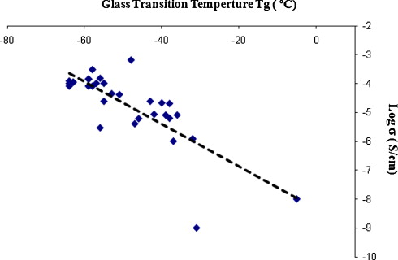  
Fig. 11. Log σ (S/cm) values measured at 25 °C vs Tg (°C) of polymeric ionic liquids as reported in the literature.
图11.如文献报道，在25°C时相对于聚合物离子液体的Tg（°C）测得的Logσ（S /cm）值。
- Chemical nature of the polymer backbone and mobile counter-ions: The more delocalized is the charge of the ion the highest mobility it will posses and respectively the highest conductivity. The effective size of the ions is also an important parameter since small ions have higher mobility than the big ones. In any case, it is difficult to evaluate the relation between the PIL's chemical structure upon its conductivity since the polymer glass transition and other properties are also affected. However, some general trends have been observed such as that polyanions present higher ionic conductivity than polycations or that ethyleneoxide units in the polymer backbone helps to increase the ionic conductivity [88]. Within the cations, imidazolium ones show the higher ionic conductivities compared to pyrrolinium, pyrrolidonium, tetraalkylammonium and piperidinium ones; and within the anions, bis(trifluoromethyl sulfonyl)imide ones shows higher ionic conductivities compared to the halide ones, tetrafluoroborate, sulphonates or hexafluorophosphate [3].  
聚合物主链和可移动抗衡离子的化学性质：离子的离域越远，离子所具有的迁移率就越高，导电率也就越高。离子的有效尺寸也是重要的参数，因为小离子比大离子具有更高的迁移率。在任何情况下，由于聚合物玻璃化转变和其他性能也会受到影响，因此很难评估PIL的化学结构与其电导率之间的关系。但是，已经观察到一些一般趋势，例如聚阴离子比聚阳离子具有更高的离子电导率，或者聚合物主链中的环氧乙烷单元有助于提高离子电导率[88]。与吡咯鎓，吡咯烷鎓，四烷基铵和哌啶鎓相比，在咪唑鎓阳离子中显示出更高的离子电导率。在阴离子中，双（三氟甲基磺酰基）亚胺比卤离子，四氟硼酸根，磺酸根或六氟磷酸根具有更高的离子电导率[3]。
- Temperature and pressure: It is well known the temperature favours the ion mobility and there is a dependence of the polymer electrolytes conductivity with the rise of the temperature. An increase in the temperature produces faster movement of the ions and consequently an increase in the ionic conductivity. At this respect, PILs show similar Arrhenius plot behaviours than other polymer electrolytes. On the other hand, since polymeric materials are soft materials with the increase in pressure the general free volume for the ion mobility will be decreased and PIL's conductivity reduced.  
温度和压力：众所周知，温度有利于离子迁移，并且聚合物电解质的电导率与温度的升高有关。温度升高会使离子运动更快，因此离子传导率也会升高。在这方面，PIL与其他聚合物电解质相比具有相似的Arrhenius曲线行为。另一方面，由于聚合材料是压力升高的软质材料，因此离子迁移率的自由体积会减少，PIL的电导率会降低。

A last example of the influence of the counter-anion on the properties of the PILs was observed when studying the thermal and (electrochemical) stability of the solid polymers. Fig. 12 shows the thermal gravimetric analysis (TGA) of: (a) poly(1-vinyl-3-ethylimizazolium) X−. It is clearly seen that anion structure influences the thermal stability in the order CF3SO3− > (CF3SO2)2N− > C12H25C6H4SO3− > PF6− > Br− > C16H34PO4−. Interestingly, a similar trend is observed in other families of PILs polycations which agrees with previously observed trends in ILs [41]. On the other hand, little is known about the chemical or electrochemical stability of PILs. In this sense the observed trends in the stability behaviour of ILs are expected to be translated into their polymeric derivatives. Thus, it has been reported the superior electrochemical stability of pyrrolidonium functional PILs compared to imidazolium ones [88].  
当研究固体聚合物的热和（电化学）稳定性时，观察到了抗衡阴离子对PILs性能影响的最后一个例子。图12显示了以下物质的热重分析（TGA）：（a）聚（1-乙烯基-3-乙基咪唑鎓）X-。可以清楚地看到，阴离子结构以CF3SO3->（CF3SO2）2N-> C12H25C6H4SO3-> PF6-> Br-> C16H34PO4-的顺序影响热稳定性。有趣的是，在其他PILs聚阳离子家族中也观察到了类似的趋势，这与以前观察到的ILs趋势一致[41]。另一方面，关于PIL的化学或电化学稳定性知之甚少。从这个意义上讲，预期的IL稳定性行为的趋势将转化为它们的聚合衍生物。因此，据报道吡咯烷酮官能的PILs与咪唑鎓的PILs具有更好的电化学稳定性[88]。

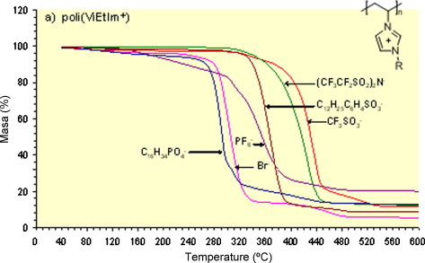  
Fig. 12. Thermogravimetric analysis (TGA) poly(1-vinyl-3-ethylimidazolium) X− at a heating rate of 10 °C/min under nitrogen atmosphere.  
图12.在氮气氛下以10°C /min的升温速率进行热重分析（TGA）聚（1-乙烯基-3-乙基咪唑鎓）X-。

### 4. Applications of polymeric ionic liquids
In analogy to the case of ILs, PILs are finding applications in many different technological fields such as energy and environmental applications, analytical chemistry, materials science, biotechnology, catalysts or surface science among others. In the next section the main reported applications of PILs will be described.  
与IL相似，PIL正在许多不同的技术领域中找到应用，例如能源和环境应用，分析化学，材料科学，生物技术，催化剂或表面科学等。在下一部分中，将描述PIL的主要报告应用。

#### 4.1. Polymer electrolytes for electrochemical devices
Without doubts, one of the main applications of monomeric ILs is found as electrolytes in electrochemical devices. Thus MacFarlane et al. demonstrated that IL based electrolytes radically improved the performance, speed, cyclability and long-term stability of electrochromic devices and actuators [89]. Further works extended the application of ILs to other electrochemical devices such as lithium batteries, dye sensitized solar cells, fuel cells, supercapacitors, light-emitting electrochemical cells and field effect transistors. However, liquid electrolytes do present some drawbacks difficult to overcome, such as need of encapsulation due to leakage of the electrolyte. On the other hand, an all-solid state polymer electrolyte has important advantages including mechanical stability, safety and simple processing, but their conductivity is still insufficient for practical use. For these reasons, there is an increasing interest in designing polymer electrolytes composed of polymer matrices and ILs, so-called gel electrolytes or ion gels. Thus several commercial polymers have been used for mixing them with ILs such as poly(ethylene oxide), poly(methyl methacrylate) or poly(vinylidene fluoride) copolymers. However, depending on the type of IL and their relative amount different problems such as leakage, phase separations, electrode delamination or bad mechanical properties are found. At this respect, PILs are ideally suited to develop tailor-made polymer electrolytes due their similar chemical structure than ILs.  
毫无疑问，发现单体IL的主要应用之一是电化学装置中的电解质。因此，MacFarlane等人。证明了基于IL的电解质从根本上改善了电致变色设备和致动器的性能，速度，循环性和长期稳定性[89]。进一步的工作将IL的应用扩展到其他电化学设备，例如锂电池，染料敏化太阳能电池，燃料电池，超级电容器，发光电化学电池和场效应晶体管。然而，液体电解质确实存在一些难以克服的缺点，例如由于电解质的泄漏而需要封装。另一方面，全固态聚合物电解质具有包括机械稳定性，安全性和简单加工的重要优点，但是它们的电导率仍然不足以用于实际使用。由于这些原因，对设计由聚合物基体和IL组成的聚合物电解质的兴趣日益增加，所谓的凝胶电解质或离子凝胶。因此，几种商业聚合物已用于将它们与IL混合，例如聚（环氧乙烷），聚（甲基丙烯酸甲酯）或聚（偏二氟乙烯）共聚物。然而，根据IL的类型及其相对量，发现了诸如泄漏，相分离，电极分层或不良机械性能之类的不同问题。在这方面，PIL由于其化学结构与IL相似，因此非常适合开发定制的聚合物电解质。

The preparation of tailor-made polymer electrolytes can be performed by simple mixing the IL and the PILs. It is worth to remember that PILs already have some ionic conductivity which is usually too low for application in devices. By mixing the PIL with an IL and an optional amount of additional lithium salt or solvents in different ratios the electrolyte can be tailor-made and transparent films are usually obtained by solvent casting. The physical appearance of the polymer electrolyte can progress from a transparent solid film (100% PIL) to a very viscous and sticky gel (low content PIL, high content IL) with some intermediate states where the polymer electrolytes are usually rubbery and transparent [90]. The specific ionic conductivity for each electrolyte usually behave as shown in Fig. 13 for polymer electrolytes based in blends of poly(1-vinyl-3-ethyl imidazolium) bistrifluoromethanesulfonimide (NTF2−) and 1-butyl-3-methylimidazolium NTF2−. Conductivities of the ILs varies depending on their chemical nature but are usually in the order of 10−2 S/cm. However, ionic conductivities of the PILs are usually bellow 10−6 S/cm. Thus, ionic conductivities of the tailor made polymer electrolytes are in the range 10−3 to 10−5 S/cm at room temperature. At elevated IL concentrations, the ionic conductivity reached values near to the values of the ILs although the mechanical stability is compromised. As expected the conductivity decreases with increasing polymer content as well as the polymer mechanical properties and vice versa.  
可以通过简单地混合IL和PIL来制备定制的聚合物电解质。值得记住的是，PIL已经具有一定的离子电导率，通常对于设备应用而言太低了。通过将PIL与IL和任选量的其他锂盐或不同比例的溶剂混合，可以定制电解质，通常通过溶剂浇铸获得透明薄膜。聚合物电解质的物理外观可以从透明的固体膜（100％PIL）发展成非常粘稠的胶体（低含量的PIL，高含量的IL），并具有一些中间状态，在这些状态下，聚合物电解质通常是橡胶状和透明的[90] ]。对于基于聚（1-乙烯基-3-乙基咪唑鎓）双三氟甲磺酰亚胺（NTF2-）和1-丁基-3-甲基咪唑鎓NTF2-的共混物的聚合物电解质，每种电解质的比离子电导率通常如图13所示。 IL的电导率取决于其化学性质，但通常为10-2 S /cm。但是，PIL的离子电导率通常低于10-6 S /cm。因此，在室温下，量身定制的聚合物电解质的离子电导率在10-3至10-5 S /cm的范围内。在较高的IL浓度下，尽管机械稳定性受到损害，但离子电导率达到接近IL值的值。如所期望的，电导率随着聚合物含量以及聚合物机械性能的增加而降低，反之亦然。

  
Fig. 13. Temperature dependence of the ionic conductivity (σ) for polymer electrolytes with different rations between IL and PIL.  
图13. IL和PIL之间不同比例的聚合物电解质的离子电导率（σ）的温度依赖性。

Besides the fine tuning of the mechanical properties, the use of PILs and ILs allows to choose the right anions or cations desired for the ion conduction. This is important since each electrolytes/ions that work better for one type of electrochemical device, do not work in others and so on (Fig. 14). For instance in the case of dye sensitized solar cells imidazolium containing PILs having iodide anions have been the desired polymers by several groups in combination with iodide containing ILs [91], [92], [93], [94]. On the other hand, electrochromic devices based on PEDOT as electrochromic material show a better performace with imidazolium type PILs having bromide counter-anions in combination with the correspondent IL [90]. In the case of PEDOT based electromechanical actuators, Chevrot et al. reported the excellent performance of PILs involved in an inter-penetrating network electrolyte having TFSI counter-anions [95]. In the case of lithium batteries the preferred ILs are pyrrolidonium ones instead of imidazolium ones. This is due to their superior electrochemical stability window which is needed in those devices. For this purpose, polymer electrolytes based on a mixture of pyrrolidonium ILs having TFSI, counter ions, poly(diallyldiammonium) TFSI and lithium TFSI salt were designed. Transparent, solid but sticky electrolyte films were obtained with ionic conductivities at room temperature higher than 10−4 S/cm. These mechanical and electromechanically stable polymer electrolytes were successfully tested in lithium batteries prototypes [43], [88].  
除了机械性能的微调之外，使用PIL和IL还可以选择离子传导所需的正确阴离子或阳离子。这很重要，因为每种电解质/离子在一种类型的电化学装置中效果更好，而在其他类型的电化学装置中则不起作用（图14）。例如，在染料敏化太阳能电池的情况下，含有碘化物阴离子的PIL含咪唑鎓已成为与含碘化物的ILs结合使用的几种聚合物[91]，[92]，[93]，[94]。另一方面，基于PEDOT作为电致变色材料的电致变色器件在与具有对应于IL的溴化物抗衡阴离子的咪唑型PIL上表现出更好的性能[90]。对于基于PEDOT的机电执行器，Chevrot等人。报道了参与具有TFSI抗衡阴离子的互穿网络电解质的PIL的优异性能[95]。对于锂电池，首选的IL是吡咯烷鎓的，而不是咪唑鎓的。这是由于这些设备需要出色的电化学稳定性窗口。为此，设计了基于具有TFSI，抗衡离子，聚二烯丙基二铵TFSI和TFSI锂盐的吡咯烷鎓IL的混合物的聚合物电解质。获得了透明，固体但发粘的电解质膜，其在室温下的离子电导率高于10-4 S /cm。这些机械和机电稳定的聚合物电解质已在锂电池原型中成功测试[43]，[88]。

  
Fig. 14. General illustration of the application of polymeric ionic liquid electrolytes in different solid electrochemical devices including a representative chemical structured used in each type of device.  
图14.聚合物离子液体电解质在不同的固体电化学装置中的应用示意图，包括在每种类型的装置中使用的代表性化学结构。

PILs electrolytes have also successfully been tested in other specific electrochemical devices such as light-emitting electrochemical cells (LECs) or field effect transitors (FETs). In the first case, the performance of blends composed of poly(9,9′-dioctylfluorene-alt-benzothiadiazole), F8BT, and a PIL (PIL), poly(vinyl-ethylimidazolium bistrifluoromethanesulfonimide), as the active layer in light-emitting electrochemical cells (LECs) with the simple indium–tin-oxide/active-layer/Al configuration. The PIL provides both the ionic charge and the transport channel necessary for the devices to operate as LECs resulting in reduction of charge injection barriers at the electrode/active-layer interfaces [96]. On the other hand, a fiber-based organic electrolyte-gated thin-film transistor (TFT) based on poly(3-hexylthiophene) (P3HT) and imidazolium IL/PIL was demonstrated with excellent performance. The electrolyte was a mixture of 1-butyl-3-methylimidazolium bis(trifluoromethanesulfonimide) and a corresponding PIL poly(1-vinyl-3-methylimidazolium bis(trifluoromethanesulfonimide) [97].  
PIL电解质也已在其他特定的电化学设备（例如发光电化学电池（LEC）或场效应晶体管（FET））中成功测试。在第一种情况下，由聚（9,9'-二辛基芴-alt-苯并噻二唑），F8BT和PIL（PIL），聚（乙烯基-乙基咪唑双三氟甲烷磺酰亚胺）组成的共混物在发光中的活性层的性能简单的铟锡氧化物/活性层/铝结构的电化学电池（LEC）。 PIL提供了设备用作LEC所需的离子电荷和传输通道，从而减少了电极/活性层界面的电荷注入势垒[96]。另一方面，证明了基于聚（3-己基噻吩）（P3HT）和咪唑IL /PIL的基于纤维的有机电解质门控薄膜晶体管（TFT）具有优异的性能。电解质是1-丁基-3-甲基咪唑双（三氟甲磺酰亚胺）和相应的PIL聚（1-乙烯基-3-甲基咪唑双（三氟甲磺酰亚胺）[97]。

#### 4.2. Applications of polymeric ionic liquids in materials science
##### 4.2.1. Polymeric surfactants in the synthesis of conductive polymer organic dispersions  导电聚合物有机分散体合成中的高分子表面活性剂
Polypyrrole (PPy), polyaniline (PANI) and poly(3,4-ethylenedioxythiophene) (PEDOT) organic dispersions have been prepared using PILs as stabilizers. The synthetic method takes advantage of the solubility change of the cationic PIL which occurred after anion exchange. As illustrated in Fig. 15 for PEDOT, in a first step an aqueous dispersion is prepared by polymerizing the corresponding monomer in the presence of a PIL such as poly(1-vinyl-3-ethylimidazolium bromide). By addition of bispentafluoroethanesulfonimide lithium salt, the PIL stabilizer becomes insoluble and precipitates in water trapping the conducting polymer microparticles. The recovered powders can be dispersed in a variety of organic solvents where the PIL becomes soluble such as acetone, acetonitrile, butyrolactone, methylene carbonate, dimethylformamide or dimethylacetamide. As a result PPy, PANI or PEDOT dispersions in organic solvents were originally obtained [98]. The properties of the PEDOT/PIL layers can be tuned depending on the final applications by changing the reaction conditions, the relative amount of PEDOT or PIL stabilizers and the molecular mass of both polymers [99], [100], [101], [102].  
聚吡咯（PPy），聚苯胺（PANI）和聚（3,4-乙撑二氧噻吩）（PEDOT）有机分散体已使用PIL作为稳定剂进行了制备。合成方法利用了阴离子交换后发生的阳离子PIL的溶解度变化。如图15中对于PEDOT所示，在第一步中，通过在PIL例如聚（1-乙烯基-3-乙基咪唑鎓溴化物）存在下聚合相应的单体来制备水分散体。通过添加双五氟乙烷磺酰亚胺锂盐，PIL稳定剂变得不溶并且在水中捕集导电聚合物微粒而沉淀。回收的粉末可以分散在PIL变得可溶的各种有机溶剂中，例如丙酮，乙腈，丁内酯，碳酸二甲酯，二甲基甲酰胺或二甲基乙酰胺。结果，最初获得了在有机溶剂中的PPy，PANI或PEDOT分散体[98]。可以根据最终应用通过更改反应条件，PEDOT或PIL稳定剂的相对量以及两种聚合物的分子量[99]，[100]，[101]，[ 102]。

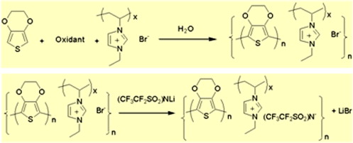  
Fig. 15. Synthetic route of PEDOT PIL materials.

The technological applications of these conducting organic dispersions are particularly interesting in the case of PEDOT. PEDOT has attracted considerable commercial and scientific interest owing to its many advantageous properties such as high transparency in the visible range, excellent thermal stability, electric conductivity, and electrooptical performance. Because of its exceptional properties PEDOT has widespread applications including use in antistatic coatings (for photographic films), capacitors, electrochromic windows, photovoltaic cells, organic field effect transistors and organic light-emitting diodes (OLEDs). For most of the applications, an aqueous dispersion of PEDOT with poly (styrene sulfonate sodium salt) as stabilizer named PEDOT:PSS is used because of its easy processability. However, the presence of residual water and the acidic PSS stabilizer can detrimentally affect the lifetime and stability of the final device such as organic light emitting diodes (OLED), solar cells or supercapacitors. For instance, it has been reported that the PEDOT:PSS presents degradation problems in some applications such as hole transport layers in OLED due to the acidity of PSS and the water presence. For this reason, the hydrophobic PEDOT/PIL dispersions have been successfully tested by several groups as alternative hole injector materials for OLED applications [100], [102]. As a further example, another interesting application of PEDOT/PIL dispersion was found in the development of elastomeric conducting polymer nanocomposites based in a poly(ether-ester) matrix [103].  
这些导电有机分散体的技术应用在PEDOT的情况下尤其令人感兴趣。 PEDOT具有许多有利的特性，例如在可见光范围内具有很高的透明度，出色的热稳定性，电导率和电光性能，因此吸引了相当多的商业和科学兴趣。由于其出色的性能，PEDOT具有广泛的应用，包括用于抗静电涂料（用于摄影胶片），电容器，电致变色窗，光伏电池，有机场效应晶体管和有机发光二极管（OLED）。对于大多数应用，由于其易加工性，使用了PEDOT与聚（苯乙烯磺酸钠盐）作为稳定剂的水分散体，称为PEDOT：PSS。但是，残留水和酸性PSS稳定剂的存在会不利地影响最终器件（例如有机发光二极管（OLED），太阳能电池或超级电容器）的寿命和稳定性。例如，据报道，由于PSS的酸性和水的存在，PEDOT：PSS在某些应用中存在降解问题，例如OLED中的空穴传输层。由于这个原因，疏水性PEDOT /PIL分散体已经成功地被多个小组测试为OLED应用的替代空穴注入材料[100]，[102]。作为另一个例子，在开发基于聚醚酯基体的弹性体导电聚合物纳米复合材料时，发现了PEDOT /PIL分散体的另一个有趣的应用[103]。

##### 4.2.2. Surface modification of carbon nanotubes and graphenes, phase transfer of nanoobjects and hybrid nanocomposites 碳纳米管和石墨烯的表面改性，纳米物体和杂化纳米复合材料的相转移
Another important field of application of PILs is nanotechnology due to its good relationship with a variety of nanobjects such as carbon nanotubes, graphenes, metal nanoparticles or as a matrix in nanocomposites. As the most illustrative example, pioneering works by Aida et al. reported the ability of imidazolium ILs to self-assemble carbon nanotubes (CNT) by π–π stacking interactions between the imidazolium ring and the surface of the CNT [104]. The same group reported later a dramatic effect of dispersed CNT's on the mechanical and electroconductive properties of PILs. The PIL/CNT nanocomposites were named bucky plastics as a mechanically reinforced electroconductive soft materials [105]. The synthesis consisted in an intial dispersion of the CNT's into the monomeric IL followed by bulk polymerization of the later. Interestingly, film samples of PIL/CNTs displayed electrical conductivity of 1 S/cm and a 120-fold enhancement of the Young's modulus at 7% content SWNT's. More recently a similar strategy was used for the obtention of PIL/CNT hydrogels and organogels [106]. The excellent ability of PILs to interact with CNT's was also used by Chen et al. to obtain a CNT functionalized with a PIL which supported Pt and PtRu nanoparticles. The CNT/PIL was again non covalent and most probably associated to the π–π stacking interactions between the imidazolium ring and the surface of the CNT⋅ It was demonstrated that the nanoparticles supported on the CNT's functionalized with a PIL had a smaller particle size, better dispersion and better electrocatalytic properties than those on CNTs without PIL modification. These CNTs functionalized with PILs were proposed as a promising catalysts support in fuel cells [107]. More recently, it was reported the direct covalent grafting of PILs onto the surface of a CNT by Atom Transfer Radical Polymerization from an initiator anchored at the surface of a MWCNT. By anchoring the PIL at the surface of the CNT and exchanging the anion of the PIL, CNT's could be dispersed in different solvents ranging from water to polar organic solvents. Furthermore, the authors demonstrated the beneficial effect of PIL modified CNT's as lubricant additives [108].  
PIL的另一个重要应用领域是纳米技术，因为它与各种纳米物体（例如碳纳米管，石墨烯，金属纳米粒子或作为纳米复合材料的基质）具有良好的关系。作为最说明性的例子，A​​ida等人的开创性作品。报道了咪唑鎓离子分子通过咪唑鎓环与碳纳米管表面之间的π-π堆积相互作用自组装碳纳米管（CNT）的能力[104]。后来，同一小组报道了分散的CNT对PIL的机械和导电性能的巨大影响。 PIL /CNT纳米复合材料被称为bucky塑料，是一种机械增强的导电软材料[105]。合成包括将CNT初始分散到单体IL中，然后进行后者的本体聚合。有趣的是，PIL /CNT的薄膜样品显示出1 S /cm的电导率，SWNT含量为7％时杨氏模量提高了120倍。最近，类似的策略被用于获得PIL /CNT水凝胶和有机凝胶[106]。 Chen等人还利用了PIL与CNT相互作用的出色能力。获得用支持Pt和PtRu纳米粒子的PIL官能化的CNT。 CNT /PIL还是非共价的，最有可能与咪唑鎓环和CNT表面之间的π-π堆积相互作用相关。这表明被PIL官能化的CNT上负载的纳米颗粒的粒径较小，与未进行PIL改性的CNT相比，具有更好的分散性和更好的电催化性能。这些用PILs功能化的CNT被提出作为燃料电池中有希望的催化剂载体[107]。最近，报道了通过锚固在MWCNT表面的引发剂通过原子转移自由基聚合将PIL直接共价接枝到CNT表面上。通过将PIL锚定在CNT表面并交换PIL的阴离子，CNT可以分散在从水到极性有机溶剂的不同溶剂中。此外，作者证明了PIL改性的CNT作为润滑剂添加剂的有益作用[108]。

PILs were also used as vehicles for the phase transfer of different nanoobjects such as CNT's, metal nanoparticles and nanorods [109] or more recently graphenes [110]. The phase transfer approach was based on the anion-exchange induced precipitation of a cationic PIL in an aqueous dispersion of the corresponding nanoobject. It was observed experimentally observed that the PILs are able to trap quantitatively the nanobjects during their precipitation. Due to the new solubility of the PIL into organic solvents, stable dispersions of the CNT's, gold nanorods or silver nanoparticles can be obtained (Fig. 16). Since the anion exchange reaction is a reversible process, it is possible to get the PIL hydrosoluble again and obtain again nanoobject aqueous dispersions. A further advantage of this method is that provides an easy route to PIL/nanoobject nanocomposites.  
PIL还用作不同纳米物体（如CNT，金属纳米粒子和纳米棒[109]或更近期的石墨烯[110]）的相转移的载体。相转移方法是基于阴离子交换诱导的阳离子PIL在相应纳米物体的水分散液中的沉淀。实验观察到，PIL在沉淀过程中能够定量捕获纳米物体。由于PIL在有机溶剂中具有新的溶解度，因此可以获得CNT，金纳米棒或银纳米颗粒的稳定分散体（图16）。由于阴离子交换反应是可逆的过程，因此有可能再次获得PIL水溶性，并再次获得纳米目标水分散体。该方法的另一个优点是为PIL /纳米物体纳米复合材料提供了简便的途径。

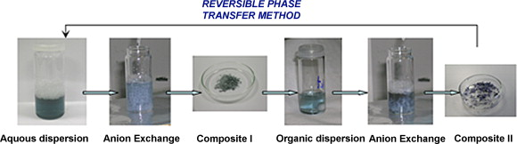  
Fig. 16. Photographs of reversible phase transfer method of gold nanorods using a polymeric ionic liquid vehicle.  
图16.使用聚合物离子液体载体的金纳米棒的可逆相转移方法的照片。

By further processing by spin-coating or other methods the composite PIL/nanobject powders the method provides a simple way for new nanocomposite materials. For instance, PIL/nanorod films which show an unique irreversible thermochromic behaviour were obtained by this method [111]. More recently, PIL/graphene oxide composite films were produced by a similar methodology and applied as electrodes in high performance supercapacitors [112].  
通过旋涂或其他方法进一步处理复合PIL /纳米物体粉末，该方法为新型纳米复合材料提供了一种简单的方法。例如，通过这种方法获得了表现出独特的不可逆热致变色行为的PIL /纳米纳米薄膜[111]。最近，通过类似的方法生产了PIL /氧化石墨烯复合膜，并将其用作高性能超级电容器中的电极[112]。

The preparation of inorganic–organic nanocomposites offer a potential route for producing functional materials that combine the best features of inorganics (e.g. improved mechanical strength, thermal stability) with the properties of PILs. For example, a hybrid organic-inorganic nanocomposite was prepared with an imidazolium cation functionalized with a triethoxysilane group. The IL precursor yielded a polysilosesquioxane-type structure through a formic acid initiated polycondensation reaction. The hybrid organic–inorganic material has shown potential as an electrolyte for use in quasi-solid state dye-sensitized solar cells [56]. Other investigations have prepared inorganic–organic composites by combining in situ sol–gel processing of silicates or borosilicates with the polymerization of an ethylvinylimidazolium IL [57]. The formed hybrid composite is a polymer encapsulated in an inorganic matrix that serves to impart thermal stability to the ion conductive PIL. It is anticipated that future studies in this area will build upon the enormous possibilities for sol–gel and mesoporous synthesis to control the morphology and the structure of the resultant nanocomposite.  
无机-有机纳米复合材料的制备为生产功能材料提供了一条潜在途径，该功能材料将无机物的最佳特性（例如，提高的机械强度，热稳定性）与PIL的特性相结合。例如，制备了具有被三乙氧基硅烷基团官能化的咪唑阳离子的杂化有机-无机纳米复合材料。 IL前体通过甲酸引发的缩聚反应产生聚倍半硅氧烷型结构。有机-无机杂化材料已显示出潜力，可用于准固态染料敏化太阳能电池[56]。其他研究通过将硅酸盐或硼硅酸盐的原位溶胶-凝胶工艺与乙基乙烯基咪唑鎓IL的聚合相结合，制备了无机-有机复合材料[57]。所形成的杂化复合材料是封装在无机基质中的聚合物，该聚合物用于赋予离子导电性PIL热稳定性。预计该领域的未来研究将基于溶胶-凝胶和中孔合成的巨大可能性，以控制所得纳米复合材料的形态和结构。

##### 4.2.3.  Design of anion sensitive smart materials 阴离子敏感智能材料的设计
Due to their characteristic change in physico-chemical properties such as solubility, hydrophilicity or volume change induced by the anion exchange reaction, PILs have been applied to the design of new anion sensitive smart materials. The first representative example is found in the hydrophilic/hydrophobic switchable surfaces based in PIL polymer brushes. Polymer thin films provide a wide platform for tuning the surface properties of materials, both through their chemical and topological characteristics. As a particular case of polymer thin films, polyelectrolyte brushes are monolayers of polyelectrolyte molecules, where the polymer chains are tethered on one side to a surface while the other end of the chain is free. The dense arrangement of the polymer chains in a brush provides the system with very interesting physicochemical properties. For example, the conformational state of the charged tethered chains is highly dependent on the ionic strength and, in some cases, on the pH. Thus, it was shown that polycationic brushes made by ATRP can be used to change the wettability of surfaces by simply exchanging the nature of the anions. In a pioneering work, brushes of poly[2-(methacryloyloxy)-ethyl-trimethylammonium chloride] PMETAC showed significant changes in their wetting character when exposed to different anions. Perchlorate (ClO4−) coordinated PMETAC brushes showed an increased water contact angle from an initial 35° in the uncollapsed state up to 79° in the collapsed state. In contrast, when PMETAC brushes were coordinated with sulphate (SO4−2) anions, their surface turned to highly hydrophilic (<10°) [113]. The same concept was extended to other PIL brushes or thin layers made from poly[1-ethyl 3-(2-methacryloyloxy ethyl) imidazolium X−] [29], poly[(1-4-vinylbenzyl)-3-butylimidazolium X−] [31] and poly[allyltriphenylphosphonium X−] [114] and PEDOT-imidazolium PILs [115]. In all the cases the cationic PIL brushes could be switched in a reversible manner between hydrophilic and hydrophobic by exchanging the anion of the PIL. Alternatively, the tuneable wettability behaviour of polycations could be also extended to the case of polyanions [116]. In this case, the polyanionic poly(potassium 3-sulfopropyl methacrylate) (PSPM) brushes were switched from hydrophilic to hydrophobic by exchanging of the counter cations like quaternary ammonium salts (tetraethylammonium bromide, hexadecyltrimethylammonium bromide) and imidazolium salts (1-dodecyl-3-methylimidazolium bromide, 1H,1H,2H,2H-perfluoro-1-decyl-3-methylimidazolium bromide). Water contact angle measurements proved that the wettability of the surface could be reversibly switched between hydrophilic values (<30°) and hydrophobic ones (>85°).  
由于其物理化学特性的特征性变化，例如由阴离子交换反应引起的溶解度，亲水性或体积变化，PIL已被用于新型阴离子敏感智能材料的设计。在基于PIL聚合物刷的亲水/疏水可切换表面中发现第一个代表性实例。聚合物薄膜通过其化学和拓扑特性，为调节材料的表面特性提供了广阔的平台。作为聚合物薄膜的一种特殊情况，聚电解质刷是聚电解质分子的单层，其中聚合物链的一侧拴在表面上，而链的另一端是自由的。刷子中聚合物链的密集排列为系统提供了非常有趣的物理化学性质。例如，带电的束缚链的构象状态高度依赖于离子强度，在某些情况下还依赖于pH。因此，表明由ATRP制造的聚阳离子刷可以通过简单地交换阴离子的性质而用于改变表面的润湿性。在一项开创性的工作中，聚[2-（甲基丙烯酰氧基）-乙基三甲基氯化铵] PMETAC的刷子在暴露于不同的阴离子时，其润湿特性发生了显着变化。高氯酸盐（ClO4-）配比的PMETAC刷子显示出从未塌陷状态的初始35°到塌陷状态的79°的增加的水接触角。相反，当PMETAC刷子与硫酸根（SO4-2）阴离子配位时，它们的表面变成高度亲水性（<10°）[113]。相同的概念扩展到其他PIL刷或由聚[1-乙基3-（2-甲基丙烯酰氧基乙基）咪唑X-] [29]，聚[（1-4-乙烯基苄基）-3-丁基咪唑X-] [31]和聚[烯丙基三苯基phosph X-] [114]和PEDOT-咪唑鎓PIL [115]。在所有情况下，阳离子PIL刷均可通过交换PIL的阴离子以可逆的方式在亲水性和疏水性之间切换。另外，聚阳离子的可调节润湿性也可以扩展到聚阴离子的情况[116]。在这种情况下，通过交换季铵盐（四乙基溴化铵，十六烷基三甲基溴化铵）和咪唑鎓盐（1-十二烷基-3）之类的抗衡阳离子，将聚阴离子聚（甲基丙烯酸3-磺基丙酯钾）刷从亲水性切换为疏水性-溴化甲基咪唑鎓，1H，1H，2H，2H-全氟-1-癸基-3-甲基溴化咪唑鎓）。水接触角测量证明，表面的润湿性可以在亲水值（<30°）和疏水值（> 85°）之间可逆地切换。

In overall, it was demonstrated that PIL brushes can be used to fabricate “smart surfaces”, whose hydrophilic/hydrophobic character or other characteristics can be easily varied by exposure of the brush to specific ion solutions. Furthermore, PIL brushes have shown other interesting properties useful for the design of multifunctional membrane systems, low friction tribological surfaces [117], [118] and electric field actuation surfaces [71].  
总的来说，已证明PIL刷子可用于制造“智能表面”，通过将刷子暴露于特定的离子溶液中，可以很容易地改变其亲水/疏水特性或其他特性。此外，PIL刷还显示出其他有趣的特性，可用于设计多功能膜系统，低摩擦摩擦表面[117]，[118]和电场驱动表面[71]。

In another innovative application, the anion sensitiveness of PILs was combined with the self-assembly properties of block copolymers in water to design anion sensitive micelles. Whereas pH or temperature sensitive block copolymer micelles are very well known, the micellization of block copolymers by ion solutions is a scarcely explored area [119]. To prove this concept, PIL block copolymers which both blocks are initially soluble in water such as poly(acrylamide) and a second PIL type block such as poly(3-1-ethylimidazolium-3-yl)propylmethacrylamide bromide were synthesized by RAFT polymerization [34]. Once a hydrophobic anion such as bis(trifluorosulfonimide) is added to the block copolymer solution the PIL precipitates, but stays stabilized in the form of a block copolymer micelle by the second water soluble poly(acrylamide) block. The system allows the tuning of the non-PIL block from a variety of polymers such as poly(acrylamide), polyacrylic acid, poly(isopropyl acrylamide) as well as variations in the PIL block (imidazolium functional methacrylates, acrylamide-type, vinyl). This new concept was also applied to the synthesis of polymeric vesicles [82] or combined with thermo-sensitive blocks such as poly(isopropyl acrylamide) for the preparation of di-stimulive responsive block copolymers [81], [47]. In anycase, there are still a lot of questions open for these systems and parameters to study such as the influence of the type of anion, anion micellar concentration, temperature or reversibility of the process, among others.  
在另一个创新的应用中，将PIL的阴离子敏感性与嵌段共聚物在水中的自组装特性相结合，以设计阴离子敏感性胶束。 pH或对温度敏感的嵌段共聚物胶束是众所周知的，而离子溶液对嵌段共聚物的胶束化作用却很少有人探索[119]。为了证明这一概念，通过RAFT聚合合成了两个嵌段都最初可溶于水的PIL嵌段共聚物（例如聚丙烯酰胺）和第二个PIL类型嵌段（例如聚（3-1-乙基咪唑鎓-3-基）丙基甲基丙烯酰胺溴化物] [ 34]。一旦将疏水性阴离子如双（三氟磺酰亚胺）加入到嵌段共聚物溶液中，PIL就会沉淀，但是通过第二种水溶性聚（丙烯酰胺）嵌段以嵌段共聚物胶束的形式保持稳定。该系统允许从多种聚合物（例如聚丙烯酰胺，聚丙烯酸，聚异丙基丙烯酰胺）中调节非PIL嵌段，以及PIL嵌段的变化（咪唑官能甲基丙烯酸酯，丙烯酰胺型，乙烯基） 。这个新概念也被应用于聚合物囊泡的合成[82]，或与热敏性嵌段（如聚（异丙基丙烯酰胺））结合用于制备双刺激响应性嵌段共聚物[81]，[47]。无论如何，对于这些系统和参数仍有很多问题需要研究，例如阴离子类型的影响，阴离子胶束浓度，温度或过程的可逆性等。

In another example of the development of anion sensitive smart materials, Li et al. took advantage in an elegant way of the volume change of the PIL associated with the anion exchange to design optical sensors. The authors designed photonic crystals based on methacrylic imidazolium inverse opals which had the ability to shrink or to expand due to the presence of different anions, humidity conditions or solvents. Because of the size change of the pores and walls the photonic crystal presented different optical responses which macroscopically leaded to different colours films. This effect was used to design new optical anion sensors, humidity sensors or multifunctional materials showing surfaces with tuneable wettability or electroptical switching behaviour [120], [121], [122], [123]. Because both ILs and photonic structures offer virtually unlimited tunability, their combination also provides a unique platform with tremendous opportunities for design of new functional materials or chemical systems.  
Li等人开发的阴离子敏感智能材料的另一个例子。利用与阴离子交换相关的PIL的体积变化的优雅方式来设计光学传感器。作者设计了基于甲基丙烯酸咪唑鎓反蛋白石的光子晶体，由于存在不同的阴离子，湿度条件或溶剂，它们具有收缩或膨胀的能力。由于孔和壁的尺寸变化，光子晶体呈现出不同的光学响应，这在宏观上导致了不同颜色的薄膜。这种效果被用来设计新型的光学阴离子传感器，湿度传感器或多功能材料，这些材料的表面具有可调节的润湿性或电学转换行为[120]，[121]，[122]，[123]。由于IL和光子结构几乎都提供了无限的可调性，因此它们的组合还提供了一个独特的平台，为设计新的功能材料或化学系统提供了巨大的机会。

Last but not least, the anion induced solubility change of the PILs was applied in a clever way by Yan and Texter to design reversible porous polymers. The approach is based on the polymerization of microemusions using a surfactant based on an imidazolium monomer. The system is based in the initial synthesis of a hydrogel by using a cross-linked copolymer having imidazolium chloride units. The addition of salts provokes the anion exchange together with a phase separation of the new insoluble PIL moieties from the aqueous solvent. By this way the polymer gels can be transformed into porous polymers and the morphology of the porous polymers could be controlled by several parameters such as type of salt, amount of IL monomer in the copolymer or polymer concentration. These porous polymers could be converted back into polymer gels by immersion in organic solvents such as DMSO or DMF and then back again into porous polymers by addition of water [124] (Fig. 17).  
最后但并非最不重要的是，Yan和Texter巧妙地将阴离子诱导的PIL溶解度变化应用于可逆多孔聚合物的设计。该方法基于使用基于咪唑鎓单体的表面活性剂对微乳液的聚合。该体系基于通过使用具有氯化咪唑鎓单元的交联共聚物的水凝胶的初始合成。盐的添加引起阴离子交换以及新的不溶性PIL部分与水性溶剂的相分离。通过这种方式，可以将聚合物凝胶转变成多孔聚合物，并且可以通过几个参数来控制多孔聚合物的形态，例如盐的类型，共聚物中IL单体的量或聚合物浓度。通过浸入有机溶剂（例如DMSO或DMF）中，这些多孔聚合物可以转变回聚合物凝胶，然后通过添加水再次转变成多孔聚合物[124]（图17）。

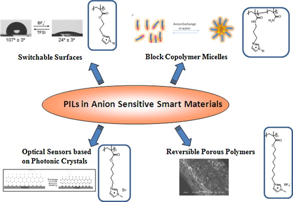  
Fig. 17. General illustration of the application of polymeric ionic liquids in new anion sensitive smart materials including a polymer chemical structure used in each application.  
图17.聚合物离子液体在新型阴离子敏感智能材料中的应用示意图，包括每种应用中使用的聚合物化学结构。

##### 4.2.4. Preparation of supramolecular polymer assemblies 超分子聚合物组装体的制备
ILs are considered as solvents which were able to self-assemble in different domains (polar and non-polar) being able to act as templating solvents in some synthesis such as metal nanoparticles. The self-assembling properties of ILs have been transferred to the development of supramolecular polymer assemblies mainly by the groups of Ohno and Firestone. The development of nanostructured PILs was originally motivated by the desire to produce anisotropic ion-conductive films. For instance the photopolymerization of liquid crystal mesogens containing IL monomer exhibited enhanced ion conductivity parallel to the direction of the Smectic A layers and columnar phases including 1-D ion conductive channels [51], [125], [126]. Different photopolymerization conditions have been investigated including different light wavelengths and photoinitiators including CdTe quantum dots [127]. Liquid crystalline PILs based upon other cations including piperidinium and pyridinium have also been reported as well as azobenzene liquid crystal molecules [42].  
IL被认为是能够在不同域（极性和非极性）中自组装的溶剂，并且能够在某些合成中充当模板溶剂，例如金属纳米粒子。 IL的自组装特性主要通过Ohno和Firestone的基团转移到超分子聚合物组件的开发中。纳米结构PIL的发展最初是由产生各向异性离子导电膜的需求所驱动。例如，含有IL单体的液晶介晶的光聚合反应显示出与电导A层和包含1-D离子导电通道的柱状相平行的离子电导率[51]，[125]，[126]。已经研究了不同的光聚合条件，包括不同的光波长和包括CdTe量子点的光引发剂[127]。也已经报道了基于其他阳离子（包括哌啶和吡啶鎓）的液晶PIL以及偶氮苯液晶分子[42]。

While the incorporation of various mesogens in the IL monomer and their photopolymerization provides a viable production strategy for nanostructured PILs, the approach often requires time-consuming and difficult synthesis to incorporate such groups in the PIL. An alternative approach was reported by Firestone et al. which exploits the noted amphiphilic characteristic of N-alkylmethilimidazolium halides. Small-angle X-ray scattering (SAXS) studies demonstrated that binary mixtures of certain imidazolium-based ILs and water can form highly-ordered lyotropic mesophases and nanostructures such as 1-D lamellar, hexagonal, 3-D cubic phases and long-lived metastable structured states. This concept was used to develop different supramolecular structures such as polymer films having internal gold nanoparticle conduits with high conductivity and optically active PIL/gold nanorod nanocomposites sensitive to solvents [21], [22], [23], [24], [25], [26], [27], [28], [29], [30], [31], [32], [33], [34], [35], [36], [37], [38], [39], [40], [41], [42].  
尽管在IL单体中掺入各种液晶元并进行光聚合为纳米结构PIL提供了可行的生产策略，但该方法通常需要耗时且困难的合成才能在PIL中掺入此类基团。 Firestone等报道了一种替代方法。它利用了N-烷基甲基咪唑鎓卤化物的显着两亲特性。小角X射线散射（SAXS）研究表明，某些基于咪唑的IL和水的二元混合物可以形成高度有序的溶致中间相和纳米结构，例如1-D层状，六角形，3-D立方相和长寿命亚稳态结构状态。这个概念被用于开发不同的超分子结构，例如具有高电导率的内部金纳米颗粒导管和对溶剂敏感的光学活性PIL /金纳米棒纳米复合材料的聚合物膜[21]，[22]，[23]，[24]，[25] ]，[26]，[27]，[28]，[29]，[30]，[31]，[32]，[33]，[34]，[35]，[36]，[37]， [38]，[39]，[40]，[41]，[42]。

Another example of the formation of supramolecular mesophases or nanostructures in PILs was found in the case of imidazolium functional poly(thiophene)s. Different authors found self-organization properties of imidazolium functional polythiophenes in solution state as well as in the solid state. This morphological ordering makes that this polymers show interesting thermochromic or solvatochromic properties as well as enhanced electrochromic properties in the case of PEDOT bearing imidazolium moieties [66], [115], [128].  
在咪唑鎓功能性聚噻吩的情况下，发现了在PIL中形成超分子中间相或纳米结构的另一个例子。不同的作者发现了咪唑鎓功能性聚噻吩在溶液状态和固态时的自组织特性。这种形态排序使得该聚合物在带有咪唑鎓部分的PEDOT的情况下表现出令人感兴趣的热致变色或溶剂变色性质以及增强的电致变色性质[66]，[115]，[128]。

Further examples of the design of supramolecular polymer assemblies using PILs include the formation of interpenetrating polymer networks (IPNs) using complementary ionic polymers [129], [128], cyclodextrin complexed imidazolium polymers which showed controlled pseudo lower critical solution behaviour [130] or the development of supramolecular polymer networks using ionic bonds [131], [132]. Of particular interest this work by Grinstaff et al. which demonstrates that ionic bonds can be an alternative to H-bonds for the simple synthesis of supramolecular polymer networks composed of weakly bonded small molecules. This recent work can be considered as a proof of concept which may lead to the development of a whole new family of supramolecular polymers based on ionic interactions in the coming years.  
使用PIL设计超分子聚合物组件的其他示例包括使用互补离子聚合物[129]，[128]，环糊精络合的咪唑聚合物形成互穿聚合物网络（IPN），这些聚合物表现出受控的伪下临界溶液行为[130]或离子键的超分子聚合物网络的发展[131]，[132]。 Grinstaff等人的这项工作特别令人感兴趣。这表明，离子键可以替代H键，以简单合成由弱键合的小分子组成的超分子聚合物网络。可以将这项最新工作视为概念的证明，这可能会导致在未来几年中基于离子相互作用的一个全新的超分子聚合物家族的发展。

##### 4.2.5. Precursors of polymeric nanofibers and graphitic materials
In the last two years, the interest of using PILs as precursors of nanofibers and graphitic materials has been demonstrated. Thus, preparation of PIL nanofibers by electrospinning was separately reported by the groups of Eladb and Long for two cationic methacrylic type PILs, one imidazolium and a second trimethylammonium one having chloride, tetrafluoroborate and triflate counter-anions [83], [84]. The electrospinning behaviour showed significant dependence on the type of counter-anions. All the PILs formed fibers much thinner than predicted for neutral polymers due to the increased ionic conductivity of the electrospinning solutions. The larger, delocalized counteranions enabled fiber formation at lower solution viscosities and solution entanglement numbers, suggesting electrospinning of polyelectrolytes which had previously been difficult to electrospin. Interestingly solutions of PILs containing free IL leaded to fiber mats with interesting ionic conducting properties. In the last case, larger fibers were produced due to the non-volatility of the IL, which hinders fiber size reduction during solidification.  
在过去的两年中，已经证明了使用PIL作为纳米纤维和石墨材料前体的兴趣。因此，Eladb和Long分别报告了通过静电纺丝制备PIL纳米纤维的两种阳离子甲基丙烯酸型PIL，一种是咪唑鎓，另一种是三氯甲基铵，它们分别具有氯离子，四氟硼酸根和三氟甲磺酸根抗衡阴离子[83]，[84]。电纺丝行为显示出对抗衡阴离子类型的显着依赖性。由于电纺溶液的离子电导率提高，所有PIL形成的纤维都比中性聚合物所预测的细得多。较大的，离域的抗衡阴离子可以在较低的溶液粘度和溶液缠结数下形成纤维，这表明以前很难进行电纺的聚电解质的电纺。有趣的是，含有游离IL的PIL溶液导致纤维毡具有有趣的离子导电性能。在最后一种情况下，由于IL的非挥发性而产生了较大的纤维，这阻碍了固化过程中纤维尺寸的减小。

Interestingly, Antonietti et al. recently reported the use of PILs in a template-free preparation of mesoporous graphitic carbon nanostructures with high electric conductivity [133]. The carbonization of the PIL was performed in the presence of FeCl2 at temperatures between 900 and 1000 °C. By tuning the carbonization temperature and the catalyst as-synthesized carbon products were graphitic mesoporous, and highly conductive as proven by XRD and TEM characterizations and conductivity measurements. Via an acid etching process, iron and iron carbide nanoparticles, the remainder of the primary catalysts, can be removed, leaving pure mesoporous carbon materials with a comparably well developed graphitic structure. Without demand for any template, this method is facile and easy to scale up and might contribute to the wide applications of carbon nanostructures.  
有趣的是，Antonietti等。最近，PILs在无模板的具有高电导率的介孔石墨碳纳米结构的制备中的使用[133]。 PIL的碳化是在FeCl2存在下于900至1000°C的温度下进行的。通过调节碳化温度和催化剂，合成的碳产物为石墨中孔，并且具有高导电性，这已通过XRD和TEM表征以及电导率测量得到证明。通过酸蚀刻工艺，可以除去铁和碳化铁纳米颗粒（其余的主要催化剂），从而留下具有相当发达的石墨结构的纯中孔碳材料。不需要任何模板，该方法简便易行，可以扩展规模，并可能有助于碳纳米结构的广泛应用。

#### 4.3. Emerging application areas of PILs
The use of ILs for gas capture and separations from waste streams or as a medium for gas storage or transport comprises one of the most active area of PILs research. ILs exhibit several properties that makes them potentially useful in this application, including non-volatility and both high uptake and reversible sorption of CO2. As an example, task-specific ILs possessing amine groups have been specifically designed and shown to improved CO2 capture [134]. Pionering works by Shen et al. showed that PILs exhibit even higher CO2 absorption capacity than the corresponding ILs [135]. The earliest reports examined imidazolium based PILs including poly[1-(4-vinylbenzyl)-3-butylimidazolium tetrafuoroborate and the corresponding hexafluorophosphate derivative. The same group and extensive works by Gin and Noble et al. and others realized that the tetralkylammonium based PILs and tetrafluoroborate counter-anion show higher CO2 sorption capacities than the imidazolium ones, although the underlying mechanism of gas absorption is still unclear [37], [38], [137]. More recently, the gas permeability and selectivity to other gases such as CO2, N2, CH4 and H2 is being investigated. These works showed that appropriate structural variations of the cation, e.g. increasing the length of the N-alkyl substituent or introducing polar substituents, can serve to improve CO2 permeability and selectivity [136]. In addition, the introduction of cross-linkable IL monomers and the development of IL/PIL composite membranes resulted in high performance gas membranes [24], [53], [55]. While patterns are emerging as to which PILs show enhanced or selective uptake of gases, considerable additional research is required for a complete understanding of the relationship between molecular composition/macromolecular structure and gas permeability [136], [137], [138], [139], [140].  
IL用于气体捕获和从废气中分离或用作气体存储或运输的介质是PIL研究最活跃的领域之一。 IL具有多种特性，使其有可能在此应用中有用，包括非挥发性以及高吸收和可逆的CO2吸收。例如，专门设计的具有胺基的特定任务ILs可以提高CO2的捕获率[134]。沉等人的开创性著作。结果表明，PIL比相应的IL表现出更高的CO2吸收能力[135]。最早的报告检查了基于咪唑鎓的PIL，包括四[-（4-乙烯基苄基）-3-丁基咪唑鎓四氟硼酸酯]和相应的六氟磷酸酯衍生物。 Gin和Noble等人的同一小组和广泛的著作。其他人意识到，尽管基于气体吸收的基本机理尚不清楚，但基于四甲铵的PIL和四氟硼酸抗衡阴离子显示出比咪唑鎓更高的CO2吸附能力[37]，[38]，[137]。最近，正在研究气体渗透性和对其他气体（例如CO2，N2，CH4和H2）的选择性。这些工作表明阳离子有适当的结构变化，例如阳离子。增加N-烷基取代基的长度或引入极性取代基可改善CO2的渗透性和选择性[136]。另外，可交联的IL单体的引入和IL /PIL复合膜的发展产生了高性能的气体膜[24]，[53]，[55]。尽管PILs表现出增强的或选择性的气体吸收模式正在出现，但要全面了解分子组成/大分子结构与气体渗透率之间的关系，还需要进行大量的研究[136]，[137]，[138]，[ 139]，[140]。

An increasing number of applications of PILs in analytical chemistry have recently been developed mainly due to the contribution of the group of Anderson. Thus, this group reported the application of PILs as selective coatings for the detection of a number of environmental contaminants in waters using solid-phase microextraction coupled to gas chromatography-flame ionization detection. Among the detected compounds there are a number of esters [141], polycyclic aromatic hydrocarbons [142], [143] and even CO2 [144]. The main advantages observed by PILs compared to other polymers or molecular ILs are that do not need to be re-coated after every extraction. Furthermore, PILs posses exceptional thermal stability and showed highly reproducible extraction efficiencies, selectivity and long lifetimes. Further applications of PILs in analytical chemistry include its simple blends as highly selective gas chromatography stationary phases [145] or as dynamic coating additive for separation of aromatic acids [146], basic proteins by capillary electrophoresis [147] and biosensors.  
主要由于安德森小组的贡献，最近开发了在分析化学中越来越多的PIL应用。因此，该小组报告了将PIL作为选择性涂层的应用，该技术使用固相微萃取结合气相色谱-火焰电离检测技术来检测水中的许多环境污染物。在检测到的化合物中，有许多酯[141]，多环芳烃[142]，[143]甚至是CO2 [144]。与其他聚合物或分子IL相比，PIL所观察到的主要优点是，每次萃取后都无需重新涂覆。此外，PIL具有出色的热稳定性，并显示出高度可重复的萃取效率，选择性和长寿命。 PIL在分析化学中的进一步应用包括其简单的混合物，如高选择性气相色谱固定相[145]或动态涂层添加剂，用于分离芳香酸[146]，通过毛细管电泳分离碱性蛋白质[147]和生物传感器。

It is worth to make a particular mention to the recent application of PILs in biosensors due to the technological interest of this area. Thus, Cabarcos et al. found that PILs microparticles were good matrixes for enzyme immobilization [148]. They established a glucose amperometric biosensor based on the immobilization of glucose oxidase (GOx) in imidazolium functional PIL microparticles. Since the bioactivity of the immobilized GOx was well maintained in the PILs matrix, such biosensor exhibited long-time stability. More recently the direct electrochemistry and electrocatalysis of hemoglobin immobilized in a PIL was demonstrated [149]. The PIL based electrodes showed promising performance for its application in the fabrication of third-generation electrochemical biosensors [150].  
由于该领域的技术利益，值得特别提及PIL在生物传感器中的最新应用。因此，Cabarcos等。发现PILs微粒是固定化酶的良好基质[148]。他们基于固定在咪唑鎓功能性PIL微粒中的葡萄糖氧化酶（GOx），建立了一种葡萄糖安培生物传感器。由于固定的GOx的生物活性在PILs基质中保持良好，因此这种生物传感器表现出长期的稳定性。最近，证明了固定在PIL中的血红蛋白的直接电化学和电催化作用[149]。基于PIL的电极在其第三代电化学生物传感器的制造中显示出令人鼓舞的性能[150]。

Another highly expanding topic of application of ILs is found in the solubilisation and processing of cellulose. Due to strong hydrogen bonding interaction there are not many solvent systems that have been found to solubilise cellulose and to allow wet chemical methods for its transformation, processing or composite formation. Ionic liquids were discovered as good solvents for cellulose and there are attracting great scientific and technological attention [11]. Thus, the solubilisation of cellulose in imidazolium-chloride polymerizable ILs having styrenic, acrylate or vinylic groups allowed the preparation of cellulose/PIL composites by in situ radical polymerization [26], [151], [152]. This concept was extended more recently to the development of porous cellulose/PIL composite materials and the preparation of composites between PILs and seaweed-based polysaccharides such as l-carrageenan [153], [154]. Due to the technological interest of cellulose and other polysaccarides a fast development in this area is expected. On the other hand, it is well known the anti-microbial properties of cationic polymers having halide counter-anions. In analogy, the antimicrobial properties of PILs (i.e. poly(4-vinyl 2-hydroxyethyl pyridinium) chloride and poly[1-vinyl-3-(2-sulfoethyl imidazolium betaine)] having different counter-anions were recently investigated. Authors found that the structure of a counter-anion has profound effects on the structure-property profile of the polymers broadening the spectrum of anti-microbial properties of polyelectrolytes.  
IL的另一个高度扩展的主题是纤维素的增溶和加工。由于强烈的氢键相互作用，没有发现能溶解纤维素并允许湿化学方法对其进行转化，加工或形成复合物的许多溶剂体系。离子液体被发现是纤维素的良好溶剂，并引起了极大的科学技术关注[11]。因此，纤维素在具有苯乙烯，丙烯酸酯或乙烯基的咪唑氯化物可聚合的IL中的增溶使得可以通过原位自由基聚合制备纤维素/PIL复合材料[26]，[151]，[152]。这个概念最近被扩展到多孔纤维素/PIL复合材料的开发以及PIL和基于海藻的多糖（例如1-角叉菜胶）之间的复合材料的制备[153]，[154]。由于纤维素和其他多糖的技术兴趣，预计该领域将快速发展。另一方面，众所周知的是具有卤化物抗衡阴离子的阳离子聚合物的抗微生物性能。以类似的方式，最近研究了具有不同抗衡阴离子的PIL（即聚（4-乙烯基2-羟乙基吡啶鎓）氯化物和聚[1-乙烯基-3-（2-磺乙基乙基咪唑鎓甜菜碱））的抗菌性能。抗衡阴离子的结构对聚合物的结构特性有深远的影响，从而扩大了聚电解质的抗菌性能。

Another interesting application of PILs comes from its intrinsic ionic and potential magnetic properties. Since PILs contain anion/cation pairs and therefore have a relatively high density of strong dipoles. This fact makes them promising candidates for microwave absorption [155]. Thus, Shen et al. investigated the properties and application of PILs as optically transparent micro-wave absorbing materials. The investigated model imidazolium and alkylammonium type PILs have dielectric constants from 3.7 to 5.3 and dielectric loss factors from 0.18 to 0.37, which are much higher than those of other known polymers. Both the dielectric constants and the dielectric loss factors of PILs remain essentially constant in the frequency range of 1–10 GHz. The model PIL containing ammonium cations, and BF4 counter-anion has the highest dielectric constant and dielectric loss factor among the tested model PILs. More recently, Dobbelin et al. demonstrated the possibility of synthesizing PILs with paramagnetic properties [156]. The magnetic properties were induced by the use of anions with magnetic properties such as FeCl4− and FeCl4− combined with conventional vinyl imidazolium or pyrrolidonium backbones. Those materials present an interesting combination between the processability of polymers and the paramagnetic properties of the inorganic counter-anion.  
PIL的另一个有趣的应用来自其固有的离子和势磁特性。由于PIL包含阴离子/阳离子对，因此具有相对高密度的强偶极子。这一事实使他们成为微波吸收的有前途的候选人[155]。因此，沉等。研究了PILs作为光学透明微波吸收材料的特性和应用。研究的模型咪唑鎓和烷基铵型PIL的介电常数为3.7至5.3，介电损耗因子为0.18至0.37，远高于其他已知聚合物的介电常数。 PIL的介电常数和介电损耗因子在1–10 GHz的频率范围内都保持基本恒定。在测试的模型PIL中，包含铵阳离子和BF4抗衡阴离子的模型PIL具有最高的介电常数和介电损耗因子。最近，Dobbelin等人。证明了合成具有顺磁性的PIL的可能性[156]。通过使用具有磁性的阴离子（例如FeCl4-和FeCl4-与常规的乙烯基咪唑鎓或吡咯烷鎓骨架结合使用）来诱导磁性。这些材料在聚合物的可加工性与无机抗衡阴离子的顺磁性之间呈现出有趣的组合。

Last but not least, recent discoveries in the use of IL in catalysts have driven the development of imidazolium type PILs as catalysts supports or precursors of N-heterocyclic carbene organic catalysts. Initial works reported the development of PILs microparticles and its ability to support palladium/imidazolylidene complexes [60]. Further works included the functionalization of polystyrene beads using imidazolium ionic liquid molecules [158], [159], encapsulation of enzymes, Iron chloride, ruthenium catalyst in PIL microparticles [156], [157] or even the use of linear PILs as precursors of organic catalyst [160]. The number of reactions investigated using PILs includes enzymatic transesterifications, nucleophilic substitutions including fluorinations, Suzuki coupling, Heck coupling and benzoin condensation reactions. The most interesting issue is that in general PILs facilitated the recovery, recycling and further use of the catalyst in comparison to molecular ILs (Fig. 18).  
最后但并非最不重要的一点是，最近在催化剂中使用IL的发现推动了咪唑型PIL作为N-杂环卡宾有机催化剂的催化剂载体或前体的发展。最初的工作报道了PILs微粒的发展及其支持钯/咪唑基亚甲基络合物的能力[60]。进一步的工作包括使用咪唑鎓离子液体分子[158]，[159]，聚苯乙烯微囊[156]，[157]中酶的包封，氯化铁，钌催化剂的功能化聚苯乙烯珠粒，甚至将线性PIL用作PIL的前体。有机催化剂[160]。使用PIL研究的反应数量包括酶促酯交换反应，包括氟化反应的亲核取代，Suzuki偶联，Heck偶联和安息香缩合反应。最有趣的问题是，与分子IL相比，一般而言PIL促进了催化剂的回收，再循环和进一步使用（图18）。

### 5. Conclusions and outlook
In the last years, polymeric ionic liquids are broadening the chemistry, physico-chemical properties and applications of conventional polyelectrolytes. The introduction of new cations and anions is producing the renaissance of the field of ionic polymers. Although an important number of new polymers have been already synthesized as summarized in this review, the potential for innovative polyelectrolytes is extremely high due to the new types of ions which are being developed coming from the ionic liquid area and the recent advances in precise/controlled polymer chemistry. Developments of new copolymers, dendritic or supramolecular may be around the corner. However, a better understanding of their physico-chemical properties is still necessary. As point out here, they are still a lot of open questions related to the effect of the different ions in the polymer properties.  
近年来，聚合离子液体正在拓宽常规聚电解质的化学，物理化学性质和应用范围。新阳离子和阴离子的引入正在使离子聚合物领域复兴。尽管已经综述了许多重要的新聚合物，但由于离子液体领域正在开发的新型离子以及精确/可控的最新进展，合成了新型聚电解质的潜力非常高高分子化学。树状或超分子的新型共聚物的开发可能指日可待。但是，仍然需要对它们的理化性质有更好的了解。如此处指出的那样，它们仍然是与不同离子对聚合物性能的影响有关的许多悬而未决的问题。

As illustrated in this review, there are an increasing number of applications for these polymers which range from polymer electrolytes in electrochemical devices, building blocks in materials science, nanocomposites, gas membranes, innovative anion sensitive materials, smart surfaces, and a countless set of applications in different fields. Thus, this review only presents the actual reported PILs and its applications which will be further developed depending on the scientific curiosity of the scientists and the future technological interest on these functional polymers.  
如本评论所述，这些聚合物的应用越来越多，包括电化学装置中的聚合物电解质，材料科学中的构建基块，纳米复合材料，气体膜，创新的阴离子敏感材料，智能表面以及无数种应用在不同的领域。因此，本综述仅介绍了实际报道的PIL及其应用，这将取决于科学家的科学好奇心以及对这些功能聚合物的未来技术兴趣而进一步发展。