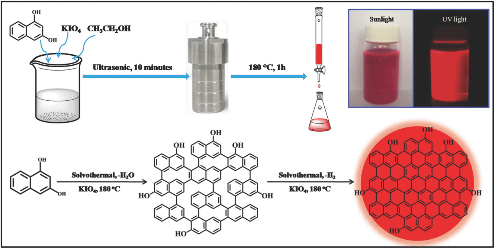
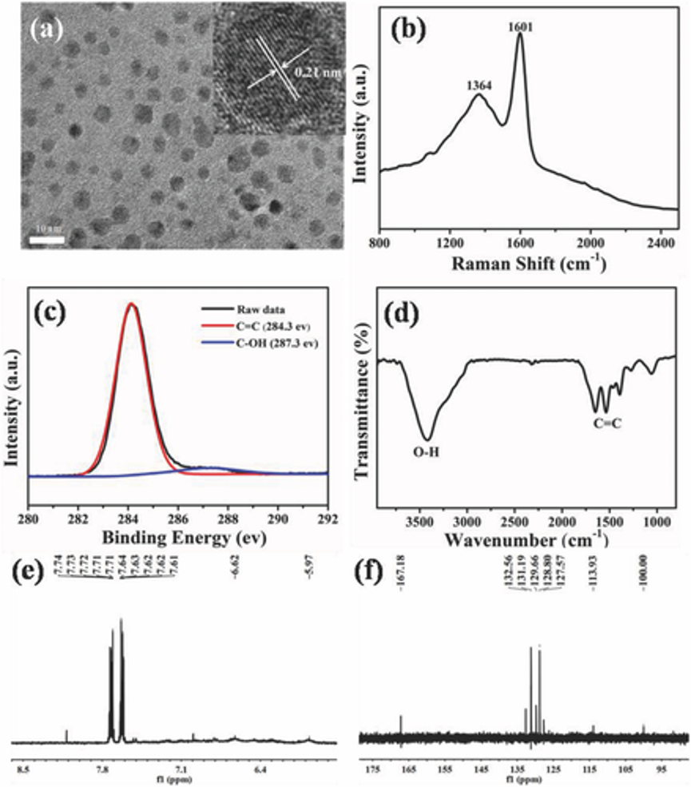
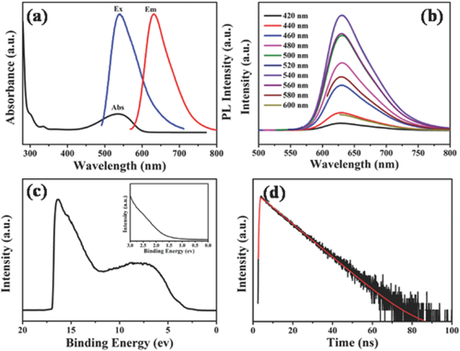
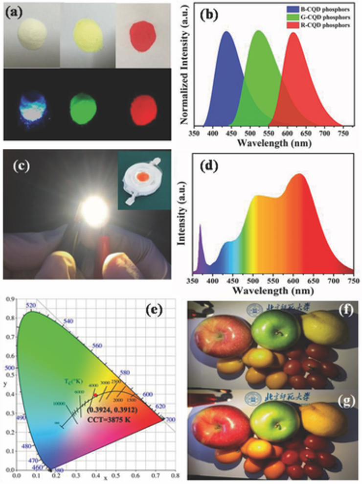
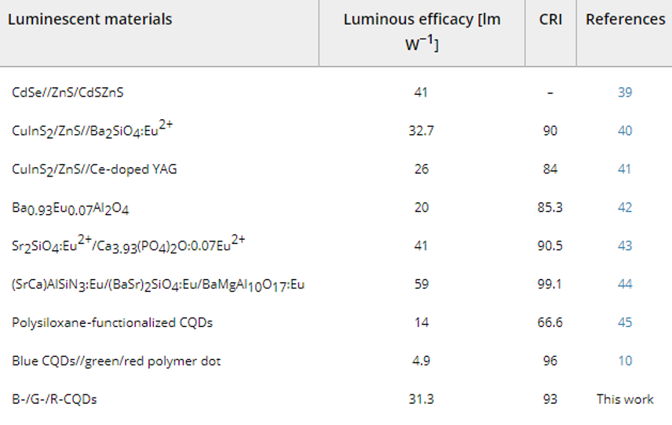

## 53% Efficient Red Emissive Carbon Quantum Dots for High Color Rendering and Stable Warm White‐Light‐Emitting Diodes  
## 53％高效红色发光碳量子点，用于高显色性和稳定的暖白光发光二极管  

> Advanced Materials  
> 10.1002/adma.201702910  

### Abstract
> Red emissive carbon quantum dots (R‐CQDs) with quantum yield of 53% is successfully prepared. An ultraviolet (UV)‐pumped CQD phosphors‐based warm white light‐emitting diode (WLED) is realized for the first time and achieves a color rendering index of 97. This work provides a new avenue for the exploration of low cost, environment‐friendly, and high‐performance CQD phosphors‐based warm WLEDs.  
> 成功制备了量子产率为53％的红色发光碳量子点（R-CQD）。 首次实现了基于紫外（UV）泵浦CQD荧光粉的暖白光发光二极管（WLED），并实现了97的显色指数。这项工作为探索低成本提供了新的途径——环境友好的，高性能的CQD荧光粉基温暖WLED。  

### Article
White light‐emitting diodes (WLEDs) are the next‐generation lighting devices of choice due to their long operational life, compact design, and remarkable energy saving. Particularly interesting is the development of illumination systems based on warm WLEDs with high color rendering index (CRI > 80) and low correlated color temperature (CCT < 4000 K) for applications in indoor lighting due to their comfortable ambient lighting that can stave off eye fatigue.1-3 Nowadays, combination of a blue LED chip and multicolor phosphors is commonly used to generate warm white light.4 However, one of the main obstacles has been the blue light retinal injury arising from a strong blue spike of 450–500 nm in the white‐light spectrum, which has prevented this technology from widespread studies and applications.5-9 Ideally, warm WLEDs should be ultraviolet (UV)‐pumped in such a way that UV‐LED chips are devised to excite suitable combinations of broad emission red/green/blue tricolor phosphors to improve CRI and chromatic stability, and especially, to reduce light toxicity to an eye of the blue LED chip.10, 11  
白色发光二极管（WLED）是其下一代照明设备，因其使用寿命长，设计紧凑，节能效果显着。特别有趣的是开发基于暖WLED的照明系统，具有高显色指数（CRI> 80）和低相关色温（CCT <4000 K），适用于室内照明，因为它们具有舒适的环境照明，可以避免眼睛疲劳.1-3如今，蓝色LED芯片和多色荧光粉的组合通常用于产生暖白光.然而，主要障碍之一是由450-500 nm的强蓝色尖峰引起的蓝光视网膜损伤。在白光光谱中，这使得该技术无法进行广泛的研究和应用.5-9理想情况下，温暖的WLED应该采用紫外线（UV） - 泵浦方式，以便设计UV-LED芯片以激发适当的广泛组合发射红/绿/蓝三色荧光粉，以提高CRI和色度稳定性，尤其是减少对蓝光LED芯片的光毒性.10,11

Fluorescent carbon quantum dots (CQDs) with high quantum yields (QYs) have emerged as a new class of phosphors for the development of warm WLEDs, which have the advantages of tunable fluorescence emission, high thermal stability and photostability, low cost, and environment friendliness. In particular, the characteristic broad emission of CQDs makes them ideal candidates for high CRI UV‐pumped warm WLEDs based on red/green/blue tricolor phosphors.12-17 Although blue and green emissive CQDs with high QYs have been obtained,13, 18-20 the synthesis of red emissive CQDs with high QYs still stands as a major challenge because the necessarily larger size of sp2 π‐conjugation domains makes them more susceptible to defect formation and more vulnerable to environmental perturbation.21-28 The absence of efficient red light in the emission spectral region of the WLEDs resulted in a cool white light with low CRI. To make up for it, red‐emitting rare‐earth phosphors and semiconductor quantum dots (QDs) were used in CQD‐based WLEDs.29-31 However, the CRI of these warm WLEDs was generally low due to their inherently narrow emission band in the red spectral range. Very recently, Qu et al. reported an orange emissive CQDs with the QY of 46% and fabricated CQD‐based warm WLEDs, but the warm WLEDs had a low CRI since they were still based on a blue‐LED chip radiatively pumping green and orange emissive CQDs.32 Therefore, it is imperative to develop highly efficient red‐emissive CQDs for realizing high CRI UV‐pumped warm WLEDs based on tricolor CQDs.  
具有高量子产率（QYs）的荧光碳量子点（CQD）已经成为用于开发温暖WLED的新型磷光体，其具有可调荧光发射，高热稳定性和光稳定性，低成本和环境友好性的优点。特别是，CQD的特征性广泛发射使其成为基于红/绿/蓝三色荧光粉的高CRI紫外泵浦温暖WLED的理想候选者.12-17虽然已获得具有高QY的蓝色和绿色发射CQD，13,18 -20具有高QY的红色发射CQD的合成仍然是一个主要的挑战，因为sp2π-共轭结构域必然更大的尺寸使它们更容易形成缺陷并且更容易受到环境扰动的影响.21-28缺乏有效的红色WLED的发射光谱区域中的光导致具有低CRI的冷白光。为了弥补这一点，在基于CQD的WLED中使用了红色发光稀土荧光粉和半导体量子点（QD）.29-31然而，这些温暖的WLED的CRI通常很低，因为它们固有的窄发射带。红色光谱范围。最近，Qu等人。据报道，QY为46％的橙色发射CQD和制造基于CQD的温暖WLED，但温暖的WLED具有低CRI，因为它们仍然基于蓝色LED芯片，辐射地泵浦绿色和橙色发射CQD。因此，它必须开发高效的红光发射CQD，以实现基于三色CQD的高CRI紫外泵浦温暖WLED。

Over the past few years, our laboratory has developed bright multicolor bandgap fluorescent CQDs from blue to red, but a high QY (>70%) was only achieved for blue and green fluorescence.13 In the work to be reported below, we demonstrate the fabrication of highly efficient red emissive CQDs (R‐CQDs) with a QY up to 53%, which is the highest value recorded for red fluorescent CQDs. We were able to enlarge the π‐conjugated structure to achieve the high‐quality R‐CQDs by innovating a sequencial dehydrative condensation and dehydrogenative planarization (DCDP) approach (see Figure 1). Using such R‐CQDs as red emitting phosphor, in combination with our blue emissive CQDs (B‐CQDs) and green emissive CQDs (G‐CQDs) phosphors, we have for the first time realized a UV‐pumped CQD phosphors‐based warm WLED with a high CRI of 97, which is higher than the semiconductor QD‐based WLEDs reported to date. This warm WLED also demonstrated good color chromatics and device stability.  
在过去几年中，我们的实验室开发了从蓝色到红色的明亮多色带隙荧光CQD，但只有蓝色和绿色荧光才能达到高QY（> 70％）。在下面报道的工作中，我们展示了高效红色发射CQD（R-CQD）的制造，其QY高达53％，这是红色荧光CQD记录的最高值。 通过创新顺序脱水缩合和脱氢平面化（DCDP）方法，我们能够扩大π-共轭结构以实现高质量的R-CQD（参见图1）。使用这种R-CQD作为红色发光荧光粉，结合我们的蓝色发光CQD（B-CQD）和绿色发光CQD（G-CQD）荧光粉，我们首次实现了紫外泵浦CQD荧光粉基温暖WLED CRI高达97，高于迄今为止报道的半导体基于QD的WLED。 这种温暖的WLED还表现出良好的色彩色彩和器件稳定性。

Figure 1 Schematic diagram showing the preparation and growth mechanism of R‐CQDs.  
图1显示R-CQD的制备和生长机制的示意图。

Figure 2 a) TEM and HRTEM (inset) images, b) Raman spectrum, c) Deconvoluted high‐resolution C1s XPS spectra, d) FT‐IR spectrum, e) 1H NMR spectrum, and f) 1C NMR spectrum of R‐CQDs.  
图2 a）TEM和HRTEM（插图）图像，b）拉曼光谱，c）解卷积的高分辨率C1s XPS光谱，d）FT-IR光谱，e）1 H NMR光谱，和f）R-CQD的1 C NMR光谱。

Using the controllable DCDP method, the R‐CQDs were facilely prepared by solvothermally treating 1,3‐dihydroxynaphthalene and KIO4 in ethanol solution followed by purification using silica gel column chromatography (see the Experimental Section for more details). The as‐prepared R‐CQDs can be dispersed in ethanol to form clear red solutions under daylight and the solutions emit bright red fluorescence under UV light (Figure 1). The transmission electron microscopy (TEM) images (Figure 2a and Figure S1, Supporting Information) reveal that R‐CQDs are uniform and narrowly distributed around an average size of 5.0 nm. The high‐resolution TEM (HRTEM) image indicates the high crystallinity of R‐CQDs, and the lattice spacing of 0.21 nm (inset of Figure 2a) corresponds to (100) lattice spacing of graphene.33 The atomic force microscopy (AFM) image of R‐CQDs reveals their topographic heights to be in the range of 0.5 to 1.5 nm (Figure S2, Supporting Information), indicating that the R‐CQDs primarily consist of 1–4 graphene layers. The X‐ray powder diffraction (XRD) pattern shows a broad (002) peak centered at around 26°, which confirms the graphene structure of the R‐CQDs (Figure S3, Supporting Information). Raman spectrum of R‐CQDs shows the characteristic D band at 1364 cm−1 and G band at 1601 cm−1. (Figure 2b) Remarkably, the intensity ratio IG/ID is about 1.6, which is higher than graphene quantum dot ever reported,34, 35 and thus further confirm the high degree of crystallinity of the R‐CQDs, a critical enabling success of the present work. X‐ray photoelectron spectroscopy (XPS) analysis suggests that the R‐CQDs are composed of C and O atoms (Figure S4, Supporting Information). In the high‐resolution XPS spectra (Figure 2c), the C 1s band can be deconvoluted into two peaks, corresponding to CC (284.3 eV) and COH (287.3 eV). The Fourier transform infrared (FTIR) spectrum shows the presence of CC and OH (Figure 2d). In the 1H nuclear magnetic resonance (1H NMR) spectrum (Figure 2e), except for obvious aromatic H signals observed in the range of 7.0–8.0 ppm, active H signals from OH groups with two broad peaks (5.97 and 6.62 ppm) are also detected. The 13C NMR spectrum (Figure 2f) further demonstrates the presence of -OH groups at the edge sites of R‐CQDs. The clearly observed signals in the range of 165–170 pm are indicative of the sp2 C atoms bonded with OH groups. In addition, the emerging numerous signals observed in the range of 100–140 pm are assigned to sp2 C atoms.  
使用可控DCDP方法，通过在乙醇溶液中溶剂热处理1,3-二羟基萘和KIO4，然后使用硅胶柱色谱法纯化（参见实验部分了解更多细节），可以容易地制备R-CQD。所制备的R-CQD可以在日光下分散在乙醇中形成澄清的红色溶液，并且该溶液在紫外光下发出明亮的红色荧光（图1）。透射电子显微镜（TEM）图像（图2a和图S1，支持信息）显示R-CQD均匀且窄地分布在5.0nm的平均尺寸附近。高分辨率TEM（HRTEM）图像显示R-CQD的高结晶度，并且0.21nm的晶格间距（图2a的插图）对应于石墨烯的（100）晶格间距.33原子力显微镜（AFM）图像R-CQD显示它们的地形高度在0.5到1.5nm的范围内（图S2，支持信息），表明R-CQD主要由1-4个石墨烯层组成。X射线粉末衍射（XRD）图案显示以26°为中心的宽（002）峰，这证实了R-CQD的石墨烯结构（图S3，支持信息）。R-CQD的拉曼光谱显示在1364cm -1处的特征D带和在1601cm -1处的G带。 （图2b）值得注意的是，强度比IG / ID约为1.6，高于有史以来报道的石墨烯量子点34,35，因此进一步证实了R-CQD的高结晶度，这是一个关键的成功。目前的工作。X射线光电子能谱（XPS）分析表明R-CQD由C和O原子组成（图S4，支持信息）。在高分辨率XPS光谱中（图2c），C 1s带可以解卷积成两个峰，对应于CC（284.3eV）和C-OH（287.3eV）。傅里叶变换红外（FTIR）光谱显示存在CC和OH（图2d）。在1H核磁共振（1H NMR）光谱中（图2e），除了在7.0-8.0ppm范围内观察到的明显芳香族H信号外，来自具有两个宽峰（5.97和6.62ppm）的-OH基团的活性H信号是也检测到了。 13C NMR谱（图2f）进一步证明在R-CQD的边缘位点存在OH基团。在165-170μm范围内清楚观察到的信号表明sp2 C原子与-OH基团键合。另外，在100-140μm范围内观察到的出现的大量信号被分配给sp2 C原子。

Taken together, it is evident that the R‐CQDs are large sized conjugated sp2 cluster with pendent OH groups at the edge sites, yielding the strong red emission. Taking a step further, we deduce that the precursor of 1,3‐dihydroxynaphthalene plays a key role for the formation of R‐CQDs unique structure. One molecule of 1,3‐dihydroxynaphthalene could be considered as the smallest sp2 domain with OH groups, which concomitantly acts as a building block to form large sized conjugated sp2 cluster with OH groups at the edge sites by controllable DCDP approach at the strong oxidation of KIO4 (see Figure 1).36  
总之，很明显R-CQD是大尺寸的共轭sp2簇，在边缘位置具有悬垂的OH基团，产生强烈的红色发射。更进一步，我们推断1,3-二羟基萘的前体在R-CQDs独特结构的形成中起着关键作用。一分子1,3-二羟基萘可被认为是具有-OH基团的最小sp2结构域，在KIO4的强氧化作用下，通过可控的DCDP方法，在边缘位置形成具有-OH基团的大尺寸共轭sp2簇，同时起到构建模块的作用（见图1）.36

Figure 3 a) UV–vis absorption (black), PL excitation (blue), and emission (red) spectra of R‐CQDs. b) PL spectra of R‐CQDs excited at different wavelengths. c) UPS data and d) time‐resolved PL spectrum of R‐CQDs.  
图3a）R-CQD的UV-vis吸收（黑色），PL激发（蓝色）和发射（红色）光谱。 b）在不同波长下激发的R-CQD的PL光谱。 c）UPS数据和d）R-CQD的时间分辨PL谱。

As shown in Figure 3a, the UV–vis spectrum of R‐CQDs displays an obvious excitonic absorption band peaked at about 530 nm, indicating the high conjugation and high quality of R‐CQDs. The emission peak of R‐CQDs is observed centered at 628 nm. Notably, the self‐absorption of R‐CQDs is quite small because of small overlap between excitonic absorption and emission spectrum, which is beneficial for efficient fluorescence emission (Figure 3a). The photoluminescence (PL) of R‐CQDs can be excited with a wide range of wavelengths and the maximum emission peak position is virtually independent of the excitation wavelength (Figure 3b). The peak wavelength of the PL excitation spectrum also ties in well with the corresponding excitonic absorption peak wavelength (Figure 3a), suggesting that the emission originates from the band‐edge exciton‐state decay. Bandgap energy of R‐CQDs (2.06 eV) is calculated using the equation Egopt = 1240/λedge, where λedge is the onset value of the first excitonic absorption band in the direction of longer wavelength. The highest occupied molecular orbital (HOMO) level (5.23 eV) is determined by means of ultraviolet photoelectron spectroscopy (UPS) (Figure 3c) and the lowest unoccupied molecular orbital level (3.17 eV) is deduced from energy gap and HOMO level. As shown in Figure 3d, the PL decay of R‐CQDs in ethanol solution is monoexponential with a relatively long lifetime of 10.8 ns, which is conducive to efficient fluorescence emission. The absolute QY of R‐CQDs is as high as 53%, which is the highest value recorded for red fluorescent CQDs. The R‐CQDs are highly stable, and only a slight (<3%) decay was detected under continuous illumination with a λ = 365 nm UV light source for 10 h (Figure S5, Supporting Information).37  
*如图3a所示，R-CQD的UV-vis光谱显示出在约530nm处达到峰值的明显激子吸收带，表明R-CQD的高共轭和高质量。*观察到R-CQD的发射峰位于628nm处。值得注意的是，R-CQD的自吸收非常小，因为激子吸收和发射光谱之间的重叠很小，这有利于有效的荧光发射（图3a）。 R-CQD的光致发光（PL）可以在很宽的波长范围内激发，最大发射峰位置实际上与激发波长无关（图3b）。 PL激发光谱的峰值波长也与相应的激子吸收峰值波长很好地结合（图3a），表明发射源自带边激子态衰变。使用等式Egopt = 1240 /λedge计算R-CQD的带隙能量（2.06eV），其中λedge是在较长波长方向上的第一激子吸收带的起始值。最高占据分子轨道（HOMO）水平（5.23 eV）通过紫外光电子能谱（UPS）测定（图3c），最低未占分子轨道水平（3.17 eV）由能隙和HOMO水平推断。如图3d所示，R-CQDs在乙醇溶液中的PL衰变是单指数的，具有10.8ns的相对长的寿命，这有利于有效的荧光发射。R-CQD的绝对QY高达53％，这是红色荧光CQD记录的最高值。R-CQD高度稳定，在λ= 365 nm紫外光源连续照射10 h后，仅检测到轻微（<3％）衰减（图S5，支持信息）.37

Figure 4 a) Images of B‐, G‐, and R‐CQD phosphors under sunlight (above) and UV light (below) and b) their corresponding emission spectra. c) Photographs of the warm WLED lamp (inset) and the operating warm WLED lamp. d) EL spectrum and e) CIE color coordinate of the warm WLED lamp. Fruit color under f) the commercial WLED lamp and g) the CQDs warm WLED lamp.  
图4a）在阳光（上图）和UV光（下图）下的B-，G-和R-CQD荧光粉的图像，和b）它们相应的发射光谱。 c）温暖的WLED灯（插图）和操作温暖的WLED灯的照片。 d）EL光谱和e）暖WLED灯的CIE色坐标。 f）商用WLED灯下的水果颜色和g）CQD温暖的WLED灯。

The strong, broad, and red fluorescence and the excellent photostability of R‐CQDs, coupled with their low cost and environment‐friendliness are compelling for the application in high performance WLEDs. As shown in Figure 4a, we prepared red/green/blue tricolor CQD phosphors by dispersing R‐CQDs and our previous B‐CQDs (centered at 430 nm, QY of 75%) and G‐CQDs (centered at 535 nm, QY of 73%) in highly transparent polymer matrix of polyvinylpyrrolidone (Figures S6 and S7, Supporting Information).11 These CQD phosphors can emit brilliant emission light under UV light excitation (Figure 4a). The PL spectra of B‐, G‐, and R‐CQD phosphors shown in Figure 4b are testament to the fact that the broad emissions of their mixture cover the whole visible spectral range from 400 to 700 nm, being advantageous for generating warm white light with high CRI. As shown in Figure S8 (Supporting Information), the temperature‐dependent PL spectra illustrate the evolution of PL emission with temperature from 20 to 160 °C for B‐, G‐, and R‐CQD phosphors, respectively. The maximum emission wavelengths and full width at half‐maximums (FWHMs) of PL spectra show no obvious change (Figures S8 and S9, Supporting Information) and the PL intensity only have 23.8%, 19.6%, and 17.1% decay at 150 °C, respectively, indicating that the CQD phosphors show high thermal stability (Figure S10, Supporting Information).  
R-CQD的强大，宽广和红色荧光以及出色的光稳定性，加上其低成本和环境友好性，在高性能WLED中的应用具有吸引力。如图4a所示，我们通过将R-CQD和我们以前的B-CQD(centered at 430 nm, QY of 75%)和G-CQD(centered at 535 nm, QY of 73%)分散在高度透明的聚乙烯吡咯烷酮聚合物基质中来制备红/绿/蓝三色CQD荧光粉（图S6和S7，支持信息）.11这些CQD荧光粉可在紫外光激发下发出明亮的发射光（图4a）。图4b中所示的B-，G-和R-CQD磷光体的PL光谱证明了它们的混合物的宽发射覆盖400至700nm的整个可见光谱范围的事实，有利于产生暖白光。具有高CRI。如图S8（支持信息）所示，温度相关的PL光谱分别说明了B-，G-和R-CQD荧光粉的温度从20到160℃的PL发射的演变。 PL光谱的最大发射波长和半高全宽（FWHM）没有明显变化（图S8和S9，支持信息），PL强度在150°C时仅有23.8％，19.6％和17.1％衰减分别表示CQD荧光粉显示出高的热稳定性（图S10，支持信息）。

In view of the optimum luminous efficiency of WLEDs, the UV LED chip of 370 nm was selected as excitation source. A mixture of the B‐, G‐, and R‐CQD phosphors was then uniformly dispersed in silicone and deposited on UV‐LED chip. (Figure S11, Supporting Information). By varying the mass ratios of these three phosphors, the electroluminescence (EL) spectra of WLEDs could be adjusted toward the intensity ratios of their three major peaks, as shown in Figure S12 (Supporting Information). Correspondingly, the CCT of WLEDs could be tuned from cold white light (8716 K) to warm white light (3465 K) and the CIE color coordinates shift from (0.2852, 0.3077) to (0.4048, 0.3850) at a drive current of 20 mA, as displayed in Table S1 (Supporting Information). A warm WLED lamp was fabricated when the mass ratio of B‐, G‐, and R‐CQD phosphors is 0.4:1.0:1.6 (Figure 4c, a corresponding video is provided in the Supporting information).  
鉴于WLED的最佳发光效率，选择370nm的UV LED芯片作为激发源。 然后将B-，G-和R-CQD磷光体的混合物均匀地分散在硅氧烷中并沉积在UV-LED芯片上。 （图S11，支持信息）。 通过改变这三种荧光粉的质量比，可以将WLED的电致发光（EL）光谱调节到它们三个主峰的强度比，如图S12（支持信息）所示。 相应地，WLED的CCT可以从冷白光（8716 K）调节到暖白光（3465 K），CIE色坐标从（0.2852,0.3077）变为（0.4048,0.3850），驱动电流为20 mA ，如表S1（支持信息）中所示。 当B-，G-和R-CQD磷光体的质量比为0.4：1.0：1.6时，制造了温暖的WLED灯（图4c，在支持信息中提供了相应的视频）。

The EL spectrum of as‐fabricated warm WLED lamp obviously consist of four emission bands peaked at 370, 430, 536, and 630 nm, which can be assigned to the emission of UV LED chip, B‐, G‐, and R‐CQD phosphors. (Figure 4d). The CIE color coordinate of the warm WLED lamp with CCT of 3875 K was (0.3924, 0.3912), which was marked in CIE 1931 color space and the color point was laid on the black body Planckian locus (Figure 4e), indicating that the warm WLED lamp produced a high‐quality lighting. In addition, the warm WLED lamp featured a high CRI of 97, significantly higher than that of the previously reported semiconductor QD‐based WLEDs.38 Two photographs of fruits taken under different light sources are shown in Figure 4f,g. Clearly, the warm WLED lamp is more capable of showing the true colors of the fruits than the commercial WLED lamp (CRI ≈ 82). As shown in Figure S13 (Supporting Information), the EL intensity of the warm WLED lamp increased with enhancing the drive current from 20 to 90 mA. The CIE color coordinate, CCT and CRI showed a very slight change from (0.3924, 0.3912) to (0.4010, 0.3970), 3875 K to 3794 K, and 97 to 93, respectively, upon the increase of drive current from 20 to 90 mA (Figures S14 and S15, Supporting Information). The luminous efficacy of warm WLED lamp slightly dropped from 18.8 to 14.5 lm W−1 when the drive current increased from 20 to 90 mA (Figure S16, Supporting Information). These results show that the warm white light generated from the warm WLED lamp has high color chromatics stability against the increase of drive current, which is consistent with the high thermal stability and photostability of our CQD phosphors. From Figure S17 (Supporting Information), the EL intensity of the warm WLED lamp still maintains 90% of the initial value after 72 h of continuous operation at 20 mA. The CIE color coordinate, CCT and CRI was nearly constant irrespective of the operating time (Figures S18 and S19, Supporting Information) and the luminous efficiency only decreased about 5.8% during the first 6 h of operating and tended to remain constant from 6 to 72 h thereafter (Figure S20, Supporting Information), demonstrating the optical stability of the warm WLED lamp.  
制作的暖WLED灯的EL光谱显然由四个发射波段组成，峰值分别为370,430,536和630 nm，可以分配给UV LED芯片，B-，G-和R-CQD荧光粉的发射（图4d）。CCT为3875 K的暖WLED灯的CIE色坐标为（0.3924,0.3912），在CIE 1931色空间中标记，色点位于黑体普朗克轨迹上（图4e），表明温暖WLED灯产生了高品质的照明。此外，温暖的WLED灯具有97的高CRI，显着高于先前报道的基于半导体QD的WLED。在图4f，g中显示了在不同光源下拍摄的两张水果照片。显然，温暖的WLED灯比商用WLED灯更能显示水果的真实颜色（CRI≈82）。如图S13（支持信息）所示，暖WLED灯的EL强度随着驱动电流从20mA增加到90mA而增加。当驱动电流从20增加到90 mA时，CIE色坐标，CCT和CRI分别从（0.3924,0.3912）到（0.4010,0.3970），3875 K到3794 K和97到93显示出非常小的变化。 （图S14和S15，支持信息）。当驱动电流从20 mA增加到90 mA时，暖WLED灯的发光效率从18.8 lm降至14.5 lm W-1（图S16，支持信息）。这些结果表明，温暖的WLED灯产生的暖白光对驱动电流的增加具有高的色彩稳定性，这与我们的CQD荧光粉的高热稳定性和光稳定性一致。从图S17（支持信息），在20mA连续工作72小时后，暖WLED灯的EL强度仍保持初始值的90％。无论工作时间如何（图S18和S19，支持信息），CIE色坐标，CCT和CRI几乎恒定，并且在运行的前6小时内发光效率仅下降约5.8％，并且趋于保持恒定，从6到72此后h（图S20，支持信息），证明了暖WLED灯的光学稳定性。

In order to further improve the luminous efficacy of warm WLED, we further prepared a 3D layered warm WLED based on transparent and homogeneous B‐, G‐, and R‐CQD/polymethyl methacrylate composite films (Figure S21, Supporting Information). The B‐, G‐, and R‐CQD films (QYs of 72%, 71%, and 50%) showed strong emission under UV light excitation (Figure S21, Supporting Information). Figure 5a displays the schematic diagram of a 3D layered warm WLED with a combination of B‐CQD film outer layer, G‐CQD film middle layer, and R‐CQD film inner layer on top of a UV‐LED chip. The EL spectrum of the warm WLED operated at 20 mA was shown in Figure S22 (Supporting Information). The warm WLED emitted bright warm white light with CCT of 3774 K, CIE color coordinates of (0.3946, 0.3920) and CRI of 93 (Figure 5b and Figure S23, Supporting Information), and achieved a high luminous efficiency of 31.3 lm W−1 at 20 mA drive current, which is even comparable to some state of the art WLEDs based on semiconductor QDs and rare‐earth phosphors (Table 1).  
为了进一步提高暖WLED的发光效率，我们进一步制备了基于透明且均匀的B-，G-和R-CQD /聚甲基丙烯酸甲酯复合膜的3D层状暖WLED（图S21，支持信息）。 B-，G-和R-CQD薄膜（QY为72％，71％和50％）在UV光激发下显示出强烈的发射（图S21，支持信息）。图5a显示了3D层状暖WLED的示意图，其具有B-CQD膜外层，G-CQD膜中间层和UV-LED芯片顶部上的R-CQD膜内层的组合。在20mA下工作的暖WLED的EL光谱如图S22（支持信息）所示。温暖的WLED发出明亮的暖白光，CCT为3774 K，CIE色坐标为（0.3946,0.3920），CRI为93（图5b和图S23，支持信息），实现了31.3 lm W-1的高发光效率在20 mA驱动电流下，这甚至可与基于半导体QD和稀土荧光粉的一些先进WLED相媲美（表1）。

Table 1. Comparison of luminous efficiencies of WLEDs based on CQDs, semiconductor QDs and rare‐earth phosphors operated at 20 mA drive current  
表1.基于CQD，半导体QD和在20 mA驱动电流下工作的稀土荧光粉的WLED的发光效率比较

### Conclusion
In conclusion, we have successfully devised a DCDP method to controllably synthesize highly efficient red emissive CQDs (R‐CQDs) with a QY up to 53%, which is the highest value recorded for red fluorescent CQDs. In the decoupled DCDP route, DC enables size tuning while DP ensures a high degree of π‐conjugation, which allowed to overcome the difficulties that have stumbled previous synthetic efforts. Therefore, our R‐CQDs are uniformly large sized conjugated sp2 clusters with pendent OH groups at the edge sites, yielding the strong red emission. A UV‐pumped CQD phosphors‐based warm WLED was fabricated by integrating B‐, G‐, and R‐CQD phosphors on a UV‐LED chip, and showed favorable warm white light characteristics with the CIE coordinates, CCT and CRI of (0.3924, 0.3912), 3875 K and 97, demonstrating good color chromatics stability with increasing applied current from 20 to 90 mA and high device stability after worked 72 h. The luminous efficiency of optimized warm WLED was as high as 31.3 lm W−1, which is comparable to semiconductor QD‐ and rare‐earth phosphors‐based WLEDs. What is more, this is the first report for the fabrication of UV‐pumped CQD phosphors‐based warm WLEDs and would provide a new pathway toward low cost, environment‐friendly, and highly efficient CQDs applicable for high‐performance warm WLEDs. Together, this work opens up new avenues for the exploration of low cost, environment‐friendly, and high‐performance CQD phosphors‐based warm WLEDs. We anticipate that further improving the QY of red emissive CQDs and red‐shifting their emission will make more leaps and bounds in CQD phosphors‐based WLEDs, which is underway in our laboratory and will be reported in due course.  
总之，我们已成功设计出一种DCDP方法，可控制地合成高效红色发射CQD（R-CQD），QY高达53％，这是红色荧光CQD记录的最高值。在解耦的DCDP路由中，DC实现了大小调整，而DP确保了高度的π-共轭，这允许克服以前合成努力中遇到的困难。因此，我们的R-CQD是均匀大尺寸的共轭sp2簇，在边缘位置具有悬垂的-OH基团，产生强烈的红色发射。通过在UV-LED芯片上集成B-，G-和R-CQD磷光体制造紫外泵浦的基于CQD磷光体的温暖WLED，并且显示出有利的暖白光特性，其CIE坐标，CCT和CRI为（0.3924，0.3912），3875K和97，显示出良好的色彩稳定性，在20至90mA下施加的电流增加，并且在工作72小时后具有高的器件稳定性。优化的暖WLED的发光效率高达31.3 lm W-1，这与半导体QD和稀土荧光粉基WLED相当。更重要的是，这是制造紫外泵浦CQD荧光粉基温暖WLED的第一份报告，并将为适用于高性能暖WLED的低成本，环保和高效CQD提供新途径。这项工作共同开辟了探索低成本，环保和高性能CQD荧光粉基温暖WLED的新途径。我们预计，进一步改善红色发射CQD的QY和红移其发射将使基于CQD荧光粉的WLED更加突飞猛进，这在我们的实验室正在进行中并将在适当时候报告。