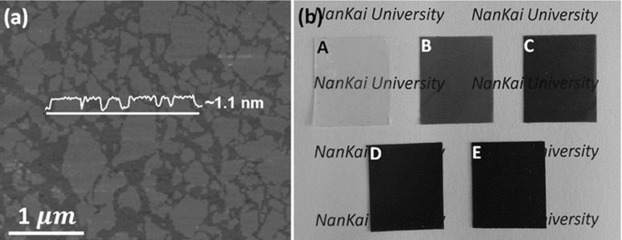
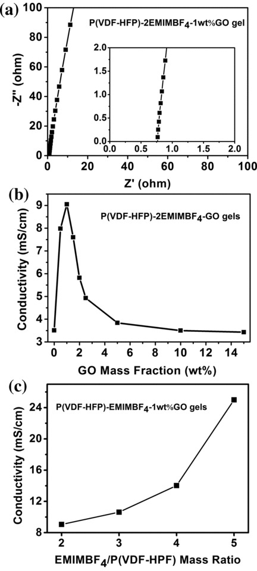
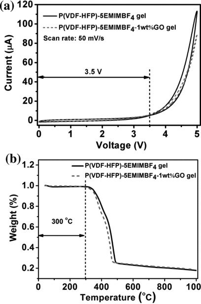
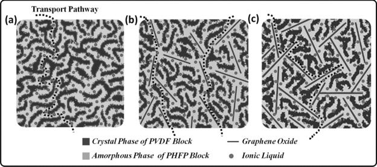
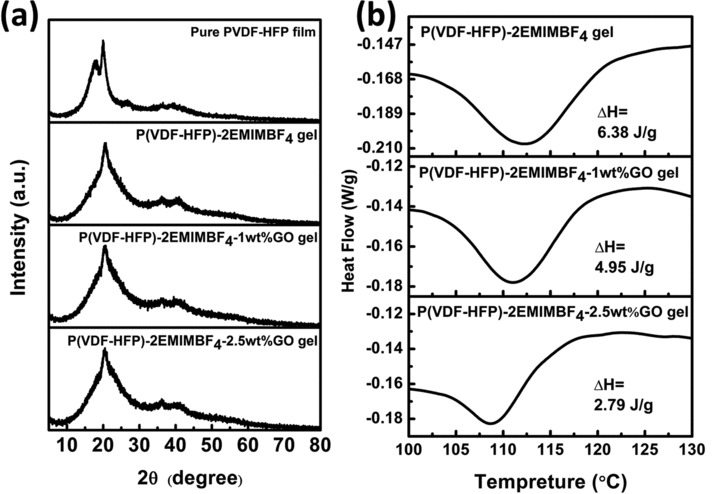
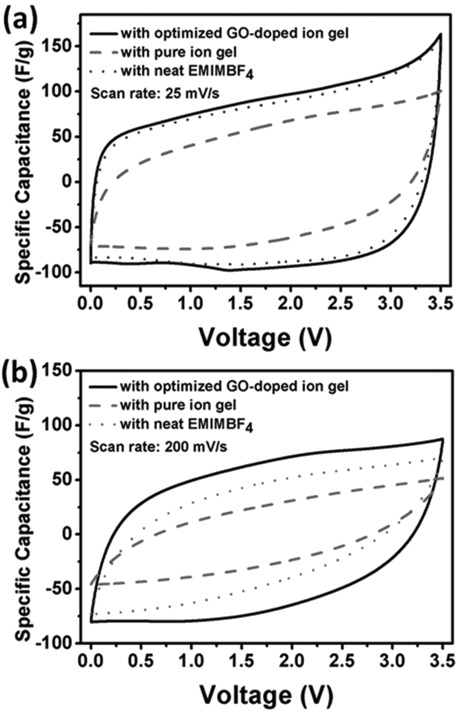
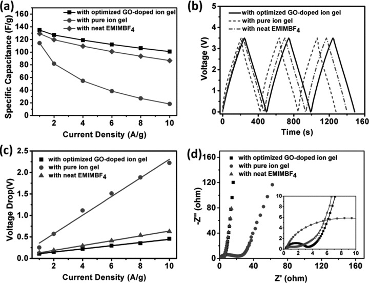
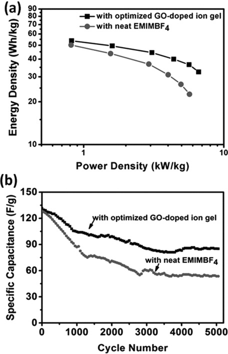

## A High‐Performance Graphene Oxide‐Doped Ion Gel as Gel Polymer Electrolyte for All‐Solid‐State Supercapacitor Applications 高性能氧化石墨烯掺杂离子凝胶作为凝胶聚合物电解质，适用于全固态超级电容器应用

> Xi Yang, Fan Zhang, Long Zhang, Tengfei Zhang, Yi Huang, Yongsheng Chen
> Advanced Functional Materials, Volume 23, Issue 26, July 12, 2013, Pages 3353-3360
> DOI: [10.1002/adfm.201203556](https://doi.org/10.1002/adfm.201203556)
> Keywords: graphene oxide, ionic liquid, ion gel, gel polymer electrolyte, all‐solid‐state supercapacitor

### Abstract
A high‐performance graphene oxide (GO)‐doped ion gel (P(VDF‐HFP)‐EMIMBF4‐GO gel) is prepared by exploiting copolymer (poly(vinylidene fluoride‐hexafluoro propylene), P(VDF‐HFP)) as the polymer matrix, ionic liquid (1‐ethyl‐3‐methylimidazolium tetrafluoroborate, EMIMBF4) as the supporting electrolyte, and GO as the ionic conducting promoter. This GO‐doped ion gel demonstrates significantly improved ionic conductivity compared with that of pure ion gel without the addition of GO, due to the homogeneously distributed GO as a 3D network throughout the GO‐doped ion gel by acting like a ion “highway” to facilitate the ion transport. With the incorporation of only a small amount of GO (1 wt%) in ion gel, there has been a dramatic improvement in ionic conductivity of about 260% compared with that of pure ion gel. In addition, the all‐solid‐state supercapacitor is fabricated and measured at room temperature using the GO‐doped ion gel as gel polymer electrolyte, which demonstrates more superior electrochemical performance than the all‐solid‐state supercapacitor with pure ion gel and the conventional supercapacitor with neat EMIMBF4, in the aspect of smaller internal resistance, higher capacitance performance, and better cycle stability. These excellent performances are due to the high ionic conductivity, excellent compatibility with carbon electrodes, and long‐term stability of the GO‐doped ion gel.  
通过开发共聚物（聚（偏二氟乙烯 -六氟丙烯），P（VDF-HFP））制备高性能氧化石墨烯（GO）掺杂离子凝胶（P（VDF-HFP）-EMIMBF4-GO凝胶）。聚合物基质，离子液体（1-乙基-3-甲基咪唑鎓四氟硼酸盐，EMIMBF4）作为支持电解质，GO作为离子导电促进剂。这种GO掺杂离子凝胶与没有添加GO的纯离子凝胶相比，显示出显着改善的离子电导率，因为在整个GO掺杂离子凝胶中均匀分布的GO作为3D网络，通过像离子“高速公路”那样起作用。促进离子传输。在离子凝胶中仅加入少量GO（1wt％），与纯离子凝胶相比，离子电导率显着提高约260％。此外，使用GO掺杂离子凝胶作为凝胶聚合物电解质在室温下制造和测量全固态超级电容器，其表现出比具有纯离子凝胶和常规的全固态超级电容器更优异的电化学性能。具有整洁EMIMBF4的超级电容器，具有更小的内阻，更高的电容性能和更好的循环稳定性。这些优异的性能归因于高离子电导率，与碳电极的优异相容性以及GO掺杂离子凝胶的长期稳定性。

### 1. Introduction
Nowadays, portable electronic devices (e.g., mobile phones, notebooks, and cameras) are becoming more and more demanding for multifunctional energy storage devices being small, thin, lightweight, and flexible.1, 2 Therefore, for the special configuration design and fabrication of novel energy storage devices, a thin and flexible layer of polymer electrolyte is considered to be the most effective geometry because of the intrinsic properties of polymer electrolyte, such as thin‐film forming ability, flexibility as well as the relatively high ionic conductivity and wide electrochemical window.3, 4 Compared with the conventional energy storage devices using liquid electrolytes, all‐solid‐state energy storage devices based on polymer electrolytes don't require high standard safety encapsulation materials and thus their geometry shape is variable, which may bring new design opportunities for energy storage devices in the future wearable electronics field.5, 6  
如今，便携式电子设备（例如，移动电话，笔记本电脑和照相机）对于小型，薄型，轻型和灵活的多功能能量存储设备的要求越来越高.1,2因此，对于特殊配置设计和制造由于聚合物电解质的固有性质，如薄膜形成能力，柔韧性以及相对高的离子电导率和宽电化学性，薄的柔性聚合物电解质层被认为是最有效的几何形状。与传统的使用液体电解质的储能装置相比，基于聚合物电解质的全固态储能装置不需要高标准的安全封装材料，因此它们的几何形状是可变的，这可能带来新的设计未来可穿戴电子领域的储能设备的机会.5,6

Conventional polymer electrolytes include solid polymer electrolytes (SPEs) (solid solutions of electrolyte salts in polymers) and gel polymer electrolytes (GPEs) (“ion gels” of electrolytes trapped in polymers).3 However, because of the ultralow ionic conductivity of SPEs at room temperature,6 great efforts are being dedicated to prepare high‐performance GPEs for the all‐solid‐state energy storage device applications.7-14  
常规聚合物电解质包括固体聚合物电解质（SPE）（聚合物中电解质盐的固溶体）和凝胶聚合物电解质（GPE）（聚合物中捕获的电解质的“离子凝胶”）.3然而，由于SPE的超低离子电导率在室温下，我们正在努力为全固态储能装置应用制备高性能GPE

In order to prepare high‐performance GPEs, several promising supporting electrolyte/polymer matrix systems, named “ion gels”,4 have been explored in recent years. Primarily, several polymer matrix materials have been developed and investigated for preparing high‐performance ion gels,15 including poly(ethylene oxide) (PEO), poly(vinyl alcohol) (PVA), poly(methyl methacrylate) (PMMA), poly(acrylonitrile) (PAN), poly(vinylidene fluoride) (PVDF), and copolymer poly(vinylidene fluoride‐hexafluoro propylene) (P(VDF‐HFP)). Among these polymers, copolymer P(VDF‐HFP), with crystalline parts (PVDF) to maintain the mechanical property and amorphous parts (PHFP) to trap the liquid electrolyte,15, 16 has been demonstrated to exhibit high performance in ion gel systems.  
为了制备高性能GPE，近年来已经探索了几种有前景的支持电解质/聚合物基质系统，称为“离子凝胶”4。主要是开发和研究了几种聚合物基质材料用于制备高性能离子凝胶，包括聚（环氧乙烷）（PEO），聚（乙烯醇）（PVA），聚（甲基丙烯酸甲酯）（PMMA），聚（丙烯腈（PAN），聚（偏二氟乙烯）（PVDF）和共聚物聚（偏二氟乙烯 -六氟丙烯）（P（VDF-HFP））。在这些聚合物中，已证明共聚物P（VDF-HFP）具有保持机械​​性能的结晶部分（PVDF）和捕获液体电解质的非晶部分（PHFP）15,16在离子凝胶体系中表现出高性能。

Furthermore, the traditional supporting electrolytes in ion gel systems, including aqueous and organic supporting electrolytes, generally consist of polar solvents and electrolyte salts in polymer matrixes,13 which have some critical problems, such as volatility and/or flammability when solvents are used in all‐solid‐state energy storage devices in a severe temperature range.17-19 Ionic liquids (ILs) are molten salts that remain in liquid state at room temperature and comprised of dissociated ions with no intervening solvent, which can be used as electrolytes without the addition of any salt since its intrinsical ionic conductivity.20 ILs have the unique properties as supporting electrolytes compared with other supporting electrolytes, such as non‐flammability, negligible vapor pressure, high operating voltage, and excellent electrochemical/thermal stability.15 Therefore, using ILs as a substitute for conventional supporting electrolytes has been of great interest for ion gel systems.4, 19, 21, 22  
此外，离子凝胶系统中的传统支持电解质，包括水性和有机支持电解质，通常由聚合物基质中的极性溶剂和电解质盐组成，13具有一些关键问题，例如当所有溶剂都使用溶剂时的挥发性和/或可燃性。 -在极端温度范围内的固态储能装置.17-19离子液体（ILs）是熔盐，在室温下保持液态，由离解的离子组成，没有中间溶剂，可用作电解质而不含添加任何盐，因为它具有固有的离子电导率.20 ILs与其他支持电解质相比具有独特的支持电解质特性，如不易燃性，可忽略的蒸气压，高工作电压和优异的电化学/热稳定性.15因此，使用ILs作为常规支持电解质的替代物已经引起离子凝胶系统的极大兴趣tems.4,19,21,22

Moreover, for the purpose of further improving the ionic conductivity of ion gels, adding an inorganic material to ion gels has been demonstrated as one of the most favorable routes. These additional materials can be either ionic conductive (e.g., zeolites) or neutral (e.g., Al2O3, TiO2, SiO2, etc.).23-25 The reciprocity of additional materials and polymer matrixes will influence the aggregated state of polymer in ion gels and improve the ionic conductivity. Therefore, the effect on ionic conductivity is highly dependent on the specific surface area (SSA), Lewis acid and surface chemistry characteristics of these additional materials.6 Graphene oxide (GO), a single‐layer of graphite oxide with ultrahigh SSA and abundant oxygen‐containing functional groups,26-31 should be a favorable additional material to improve the ionic conductivity of ion gels. However, although the approach of using carbon nanofillers in polymer electrolytes has shown a remarkable improvement on ionic conductivity32, 33 and graphene was widely used as electrode materials for supercapacitor applications,34-39 the incorporation of GO into ion gels as GPEs has not been reported so far.  
此外，为了进一步改善离子凝胶的离子传导性，已经证明向离子凝胶中添加无机材料是最有利的途径之一。这些附加材料可以是离子导电（例如沸石）或中性（例如，Al 2 O 3，TiO 2，SiO 2等）。23-25附加材料和聚合物基质的互易性将影响离子凝胶中聚合物的聚集状态和提高离子电导率。因此，对离子电导率的影响很大程度上取决于这些附加材料的比表面积（SSA），路易斯酸和表面化学特性.6氧化石墨烯（GO），具有超高SSA和丰富氧气的单层氧化石墨含有官能团的26-31应该是改善离子凝胶离子电导率的有利附加材料。然而，虽然在聚合物电解质中使用碳纳米填料的方法已经显示出对离子电导率的显着改善32,33和石墨烯被广泛用作超级电容器应用的电极材料，但是尚未报道将GO掺入离子凝胶中作为GPE。至今。

In this work, a high‐performance GO‐doped ion gel (P(VDF‐HFP)‐EMIMBF4‐GO gel) was developed by exploiting the state‐of‐the‐art ion gel system of P(VDF‐HFP)‐EMIMBF4 with GO as the ionic conducting promoter. This GO‐doped ion gel demonstrated significantly improved ionic conductivity compared with the pure ion gel without the addition of GO, due to the homogeneously distributed GO as a 3D network throughout the GO‐doped ion gel by acting like a ion “highway” to facilitate the ion transport. Furthermore, the all‐solid‐state supercapacitor was fabricated and measured at room temperature using the GO‐doped ion gel as GPE, which has demonstrated more superior electrochemical performance than the all‐solid‐state supercapacitor with pure ion gel and conventional supercapacitor with neat EMIMBF4.  
在这项工作中，通过利用P（VDF-HFP）-EMIMBF4的最先进的离子凝胶系统开发了高性能GO掺杂离子凝胶（P（VDF-HFP）-EMIMBF4-GO凝胶）。用GO作为离子导电促进剂。这种GO掺杂离子凝胶与没有添加GO的纯离子凝胶相比显示出显着改善的离子电导率，这是由于GO掺杂离子凝胶中的均匀分布的GO作为3D网络，其作用类似于离子“高速公路”以促进离子传输。此外，使用GO掺杂离子凝胶作为GPE在室温下制造并测量全固态超级电容器，其表现出比具有纯离子凝胶的全固态超级电容器和具有整洁性的常规超级电容器更优异的电化学性能。 EMIMBF4。

### 2. Results and Discussion
A series of GO‐doped ion gels were prepared through a simple solution‐mixing/casting method in anhydrous conditions as described in the experimental section. The products are denoted as P(VDF‐HFP)‐mEMIMBF4‐nwt%GO, where the “m” and “n” represent the mass ratio of EMIMBF4/P(VDF‐HFP) and the mass fraction of GO/P(VDF‐HFP), respectively. Figure 1a displays a typical tapping‐mode atomic‐force microscopy (AFM) image of GO sheets used in this work. The size of most GO sheets are less than 500 nm and the corresponding high cross‐sectional profile indicates that the height of most GO sheets are about 1.1 nm, which is characteristic of a single‐layer GO sheet.26 Figure 1b shows the photographs of the resulting P(VDF‐HFP)‐2EMIMBF4‐GO gels with different GO doping mass fraction, and the pure P(VDF‐HFP)‐2EMIMBF4 gel without the addition of GO as a comparsion.  
如实验部分所述，通过简单的溶液混合/浇铸方法在无水条件下制备一系列GO掺杂的离子凝胶。产物表示为P（VDF-HFP）-mEMIMBF4-nwt％GO，其中“m”和“n”表示EMIMBF4 /P（VD​​F-HFP）的质量比和GO /P的质量分数（VDF） -HFP），分别。图1a显示了本工作中使用的GO板的典型分接模式原子力显微镜（AFM）图像。大多数GO板的尺寸小于500纳米，相应的高横截面轮廓表明大多数GO板的高度约为1.1纳米，这是单层GO板的特征。图1b显示了得到的P（VDF-HFP）-2EMIMBF4-GO凝胶具有不同的GO掺杂质量分数，而纯P（VDF-HFP）-2EMIMBF4凝胶没有添加GO作为比较。

  
Figure 1. a) Typical tapping‐mode atomic‐force microscopy (AFM) image of GO sheets used in this work, which reveals that most GO sheets have heights of about 1.1 nm and sizes mainly less than 500 nm. b) Photographs of the obtained pure P(VDF‐HFP)‐2EMIMBF4 gel (A), and P(VDF‐HFP)‐2EMIMBF4‐GO gels with GO doping mass fraction of 1 wt% (B), 2.5 wt% (C), 5 wt% (D), and 10 wt% (E), respectively.  
图1. a）本工作中使用的GO板的典型分接模式原子力显微镜（AFM）图像，其显示大多数GO板具有约1.1nm的高度和主要小于500nm的尺寸。 b）获得的纯P（VDF-HFP）-2EMIMBF4凝胶（A）和P（VDF-HFP）-2EMIMBF4-GO凝胶的照片，GO掺杂质量分数为1wt％（B），2.5wt％（C ），5wt％（D）和10wt％（E）。

#### 2.1. Properties of GO‐Doped Ion Gels
The ionic conductivity of GO‐doped ion gels was measured by electrochemical impedance spectroscopy (EIS) measurements with AC potential amplitude of 10 mV and a frequency range of 1 Hz–100 kHz. Figure 2a shows a typical Nyquist plot of impedance analysis on P(VDF‐HFP)‐2EMIMBF4‐1wt%GO gel. At high frequency (close to 100 kHz), the corresponding value of the intercept on the real axis (x axis) represents the intrinsic resistance of ion gel as the ohmic resistance of the testing device is negligible.40 The ionic conductivity is calculated according to the formula (1):  
GO掺杂离子凝胶的离子电导率通过电化学阻抗谱（EIS）测量来测量，AC电势幅度为10mV，频率范围为1Hz-100kHz。图2a显示了P（VDF-HFP）-2EMIMBF4-1wt％GO凝胶的阻抗分析的典型奈奎斯特图。在高频（接近100 kHz）时，实轴（x轴）上的截距的相应值表示离子凝胶的固有电阻，因为测试装置的欧姆电阻可忽略不计.40离子电导率根据公式（1）：

$\sigma = \frac{L}{R \cdot S}$

Where σ is the ionic conductivity, L is the distance between the two electrodes, R is the resistance of ion gels, and S is the geometric area of the electrode/electrolyte interface.  
其中σ是离子电导率，L是两个电极之间的距离，R是离子凝胶的电阻，S是电极/电解质界面的几何面积。

  
Figure 2. The ionic conductivity of GO‐doped ion gels. a) Typical Nyquist plot of impedance analysis on P(VDF‐HFP)‐2EMIMBF4‐1wt%GO gel. The inset shows a magnified view of the high frequency region of the impedance spectra. b) Ionic conductivity of P(VDF‐HFP)‐2EMIMBF4‐GO gels with different GO doping mass fraction. c) Ionic conductivity of P(VDF‐HFP)‐EMIMBF4‐1wt%GO gels with different EMIMBF4 and P(VDF‐HFP) mass ratio.  
图2. GO掺杂离子凝胶的离子电导率。 a）P（VDF-HFP）-2EMIMBF4-1wt％GO凝胶的阻抗分析的典型奈奎斯特图。插图显示了阻抗谱的高频区域的放大视图。 b）具有不同GO掺杂质量分数的P（VDF-HFP）-2EMIMBF4-GO凝胶的离子电导率。 c）具有不同EMIMBF4和P（VDF-HFP）质量比的P（VDF-HFP）-EMIMBF4-1wt％GO凝胶的离子电导率。

Based on the data obtained by impedance spectroscopy measurements, the ionic conductivity of P(VDF‐HFP)‐2EMIMBF4‐GO gels with different GO doping mass fraction is shown in Figure 2b. Interestingly, the addition of a small amount of GO into the ion gels results in a considerable increase in the ionic conductivity initially. Compared with that of pure P(VDF‐HFP)‐2EMIMBF4 gel, only 1 wt% of GO doping makes a dramatic improvement of the ionic conductivity of about 260%. However, it is abruptly decreased with the excess addition of GO (more detailed discussion about this is presented below). Furthermore, the mass ratio of EMIMBF4 and P(VDF‐HFP) in ion gels also has great influence on the ionic conductivity. As shown in Figure 2c, the ionic conductivity is enhanced by increasing the mass ratio of EMIMBF4 and P(VDF‐HFP) from 1:1 to 1:5. However, further increasing the content of EMIMBF4 in ion gel, the strength of the ion gel dramatically decrease and thus the samples can't meet the measurement demand. Overall, an optimized high ionic conductivity of about 25 mS cm−1 was achieved in the sample of P(VDF‐HFP)‐5EMIMBF4‐1wt%GO gel, where the mass ratio of EMIMBF4/P(VDF‐HFP) is 5, the mass fraction of GO/P(VDF‐HFP) is 1wt%, which is much higher than that of the pure P(VDF‐HFP)‐5EMIMBF4 gel (11 mS cm−1, Figure S1) and even slightly higher than the ionic conductivity of neat EMIMBF4 (21 mS cm−1, Figure S1). The increased ionic conductivity is believed due to the enhanced dissociation of the IL of EMIMBF4 where GO acts as the additional dielectric substance6, 41, 42 and facilitates ion transport in the GO‐doped ion gels as will be discussed below.  
基于通过阻抗谱测量获得的数据，具有不同GO掺杂质量分数的P（VDF-HFP）-2EMIMBF4-GO凝胶的离子电导率显示在图2b中。有趣的是，向离子凝胶中加入少量GO导致最初的离子电导率显着增加。与纯P（VDF-HFP）-2EMIMBF4凝胶相比，仅1wt％的GO掺杂使离子电导率显着提高约260％。然而，随着GO的过量添加，它会突然减少（关于此的更详细讨论如下所示）。此外，离子凝胶中EMIMBF4和P（VDF-HFP）的质量比对离子电导率也有很大影响。如图2c所示，通过将EMIMBF4和P（VDF-HFP）的质量比从1：1增加到1：5来增强离子电导率。然而，进一步增加离子凝胶中EMIMBF4的含量，离子凝胶的强度急剧下降，因此样品不能满足测量需求。总体而言，在P（VDF-HFP）-5EMIMBF4-1wt％GO凝胶样品中实现了约25 mS cm-1的优化高离子电导率，其中EMIMBF4 /P（VD​​F-HFP）的质量比为5， GO /P（VD​​F-HFP）的质量分数为1wt％，远高于纯P（VDF-HFP）-5EMIMBF4凝胶（11 mS cm-1，图S1），甚至略高于纯EMIMBF4的离子电导率（21 mS cm-1，图S1）。认为增加的离子电导率是由于EMIMBF4的IL的离解增强，其中GO充当附加的电介质物质6,41,42并且促进GO掺杂的离子凝胶中的离子传输，如下面将讨论的。

In order to operate at a broad potential window and temperature range, ion gels must have excellent electrochemical and thermal stability.15, 43 The electrochemical and thermal stability of pure P(VDF‐HFP)‐5EMIMBF4 gel and P(VDF‐HFP)‐5EMIMBF4‐1wt%GO gel are shown in Figure 3. Figure 3a shows the cyclic voltammograms of ion gels, measured at a potential scan rate of 50 mV s−1. The rise of the current at high potential corresponds to the electrochemical reaction of ion gels. The cyclic voltammograms indicate that both pure P(VDF‐HFP)‐5EMIMBF4 gel and P(VDF‐HFP)‐5EMIMBF4‐1wt%GO gel are stable at a broad potential range of 0‐3.5 V, which is much higher than the aqueous (∼1 V)7, 9, 10 and organic (∼2.7 V)8 ion gels. Thermogravimetric analyses (TGA) thermogram of ion gels, shown in Figure 3b, demonstrates that both pure P(VDF‐HFP)‐5EMIMBF4 gel and P(VDF‐HFP)‐5EMIMBF4‐1wt%GO gel have excellent thermal stability and are thermally stable below 300 °C. In addition, with the addition of GO, the P(VDFHFP)‐5EMIMBF4‐1wt%GO gel has relatively lower thermal stability than the pure ion gel. It may be attributed to the interaction between GO and the copolymer P(VDF‐HFP), which could decrease the crystallinity of copolymer thus result in a relatively lower thermal stability of the ion gel.44, 45  
为了在广泛的电位窗和温度范围内工作，离子凝胶必须具有优异的电化学和热稳定性.15,43纯P（VDF-HFP）-5EMIMBF4凝胶和P（VDF-HFP）的电化学和热稳定性 -5EMIMBF4-1wt％GO凝胶显示在图3中。图3a显示离子凝胶的循环伏安图，在50mV s-1的潜在扫描速率下测量。高电位电流的上升对应于离子凝胶的电化学反应。循环伏安图表明，纯P（VDF-HFP）-5EMIMBF4凝胶和P（VDF-HFP）-5EMIMBF4-1wt％GO凝胶在0-3.5 V的宽电位范围内都是稳定的，远远高于水溶液。 （~1V）7,9,10和有机（〜2.7V）8离子凝胶。离子凝胶的热重分析（TGA）热谱图如图3b所示，表明纯P（VDF-HFP）-5EMIMBF4凝胶和P（VDF-HFP）-5EMIMBF4-1wt％GO凝胶均具有优异的热稳定性并且具有热稳定性低于300°C。此外，通过添加GO，P（VDFHFP）-5EMIMBF4-1wt％GO凝胶具有比纯离子凝胶相对更低的热稳定性。这可能归因于GO与共聚物P（VDF-HFP）之间的相互作用，这会降低共聚物的结晶度，从而导致离子凝胶的相对较低的热稳定性.44,45

  
Figure 3. Electrochemical and thermal stability of pure P(VDF‐HFP)‐5EMIMBF4 gel and P(VDF‐HFP)‐5EMIMBF4‐1wt%GO gel. a) Cyclic voltammogram at a potential scan rate of 50 mV s−1 indicates that the ion gels are stable at a broad potential range of 0–3.5 V. b) Thermogravimetric analyses (TGA) thermogram under nitrogen atmosphere, with heating rate of 10 °C min−1, demonstrates that the ion gels have excellent thermal stability.  
图3.纯P（VDF-HFP）-5EMIMBF4凝胶和P（VDF-HFP）-5EMIMBF4-1wt％GO凝胶的电化学和热稳定性。 a）潜在扫描速率为50 mV s-1的循环伏安图表明离子凝胶在0-3.5 V的宽电位范围内稳定.b）氮气氛下的热重分析（TGA）热谱图，加热速率为10 °C min-1表明离子凝胶具有优异的热稳定性。

#### 2.2. The Role of GO in GO‐Doped Ion Gels
To interpret the effect of GO doping on ionic conductivity, we proposed the schematic structures of pure ion gel and GO‐doped ion gels with different GO doping mass fractions (Scheme 1). The cross‐section schematic structure of pure ion gel is shown in Scheme 1a. The crystal phase from crystalline part (PVDF) of copolymer maintains the mechanical property as the framework; while the amorphous phase mainly from the amorphous part (PHFP) acts as the entrapped channel for the supporting electrolyte (EMIMBF4).15, 16 The phase structure was examined using X‐ray diffraction (XRD) characterization. As shown in Figure 4a, for the P(VDF‐HFP) film, a strong diffraction peak is observed at the 2θ value of 20.4°, which corresponds to (200)/(110) reflections of the β‐phase crystals of PVDF; a distinctive peak is also observed at the 2θ values of 18.5°, which corresponds to (020) reflection of the α‐phase crystals of PVDF, indicating the coexistence of the α‐ and β‐phases crystal of PVDF in P(VDF‐HFP) film.46, 47 Meanwhile, for the pure P(VDF‐HFP)‐2EMIMBF4 gel and P(VDF‐HFP)‐2EMIMBF4‐GO gel with different GO doping mass fraction, the peak at 2θ value of 18.5° is weakened compared with that of the P(VDF‐HFP) film, indicating that the α‐phase crystals of PVDF is suppressed while the β‐phase crystals of PVDF is slightly enhanced in the ion gels.46  
为了解释GO掺杂对离子电导率的影响，我们提出了具有不同GO掺杂质量分数的纯离子凝胶和GO掺杂离子凝胶的示意结构（方案1）。方案1a中显示了纯离子凝胶的横截面示意结构。共聚物结晶部分（PVDF）的晶相保持了作为骨架的力学性能;而主要来自非晶部分（PHFP）的非晶相充当支持电解质（EMIMBF4）的截留通道.15,16使用X射线衍射（XRD）表征检查相结构。如图4a所示，对于P（VDF-HFP）薄膜，在2θ值为20.4°时观察到强衍射峰，这对应于PVDF的β相晶体的（200）/（110）反射;在2θ值为18.5°时也观察到一个明显的峰，这对应于PVDF的α相晶体的（020）反射，表明PVDF中的PVDF的α-和β相晶体共存（VDF-HFP）薄膜.46,47同时，对于具有不同GO掺杂质量分数的纯P（VDF-HFP）-2EMIMBF4凝胶和P（VDF-HFP）-2EMIMBF4-GO凝胶，2θ值为18.5°的峰值被削弱了与P（VDF-HFP）薄膜相比，表明PVDF的α相晶体被抑制，而PVDF的β相晶体在离子凝胶中略微增强.46

  
Scheme 1. Proposed cross‐section schematic structures of GO‐doped ion gels with different GO doping mass fraction. For easy presentation, the two dimensional (2D) graphene sheet is presented as a 1D line. a) Pure ion gel. b) GO‐doped ion gel with optimized GO doping. c) GO‐doped ion gel with excess GO dopings.  
方案1.具有不同GO掺杂质量分数的GO掺杂离子凝胶的提出的横截面示意结构。为了便于呈现，二维（2D）石墨烯片呈现为1D线。a）纯离子凝胶。b）具有优化的GO掺杂的GO掺杂离子凝胶。c）具有过量GO掺杂的GO掺杂离子凝胶。

  
Figure 4. a) XRD pattern (plotted as Cu Ka) of P(VDF‐HFP) film, pure P(VDF‐HFP)‐2EMIMBF4 and P(VDF‐HFP)‐2EMIMBF4‐GO gels with different GO doping mass fraction. b) Differential scanning calorimetry (DSC) thermogram of pure P(VDF‐HFP)‐2EMIMBF4 and P(VDF‐HFP)‐2EMIMBF4‐GO gels with different GO doping mass fraction. Compared with pure P(VDF‐HFP)‐2EMIMBF4 gel, the melting peaks of P(VDF‐HFP)‐2EMIMBF4‐GO gels shift to lower temperature and the melting enthalpy value reduced with increasing the GO doping mass fraction, which indicates that the addition of GO indeed decrease the degree of crystalline in ion gel.

As the ions of EMIMBF4 can only migrate through the disordered amorphous phase (transport pathway),15, 16 which is demonstrated in Scheme 1a, thus the degree of crystalline should have a dramatically influence on the ionic conductivity. When the GO was added into the GO‐doped ion gel, due to the abundant oxygen‐containing functional groups on the surface and edge of GO sheets, the added GO should interact with the copolymer to form amorphous phase on the surface of GO and decrease the degree of crystalline in GO‐doped ion gels. To demonstrate this, differential scanning calorimetry (DSC) was used to measure the melting enthalpy of pure P(VDF‐HFP)‐2EMIMBF4 gel and P(VDF‐HFP)‐2EMIMBF4‐GO gel with different GO doping mass fraction, and the melt curves are shown in Figure 4b. When increasing the doping mass fraction of GO, the melting peaks of GO‐doped ion gels shift to left slightly from 112.5 °C for pure P(VDF‐HFP)‐2EMIMBF4 gel to 108.5 °C for P(VDF‐HFP)‐2EMIMBF4‐2.5wt%GO gel, and the melting enthalpy value is also reduced from ΔH of 6.38 J g−1 for pure P(VDF‐HFP)‐2EMIMBF4 gel to 2.79 J g−1 for P(VDF‐HFP)‐2EMIMBF4‐2.5wt%GO gel, which indicates that the addition of GO indeed decreases the degree of crystalline in GO‐doped ion gels.48 Furthermore, due to the homogeneous distribution of GO as a 3D network in the ion gel matrix, a high degree of continuous and interconnected transport channel on the surface of GO can be formed (Scheme 1b), which can be described as “highway” for ion transport. Therefore, compared with that of pure ion gel, this “highway” built by 3D network of GO can result in higher ionic conductivity. Although the degree of crystalline in the GO‐doped ion gel can be further reduced with more mass fraction of GO, the more addition of GO is expected to deteriorate the ionic conductivity due to the restacking of GO sheets and the blocking effect by the excessive GO as shown in Scheme 1c.  
由于EMIMBF4的离子只能通过无序的非晶相（传输途径）迁移，这在方案1a中得到证实，因此结晶度应该对离子电导率有显着影响。当GO加入到GO掺杂离子凝胶中时，由于GO片材表面和边缘含有丰富的含氧官能团，添加的GO应与共聚物相互作用，在GO表面形成非晶相，并减少GO掺杂离子凝胶中的结晶度。为了证明这一点，差示扫描量热法（DSC）用于测量具有不同GO掺杂质量分数的纯P（VDF-HFP）-2EMIMBF4凝胶和P（VDF-HFP）-2EMIMBF4-GO凝胶的熔化焓，以及熔体曲线如图4b所示。当增加GO的掺杂质量分数时，GO掺杂离子凝胶的熔融峰从纯P（VDF-HFP）-2EMIMBF4凝胶的112.5°C略微左移到P（VDF-HFP）-2EMIMBF4的108.5°C -2.5wt％GO凝胶，熔化焓值也从纯P（VDF-HFP）-2EMIMBF4凝胶的ΔH为6.38 J g-1降低至P（VDF-HFP）-2EMIMBF4-的2.79 J g-1 2.5wt％GO凝胶，这表明添加GO确实降低了GO掺杂离子凝胶中的结晶度.48此外，由于GO作为3D网络在离子凝胶基质中的均匀分布，高度可以形成GO表面上的连续和互连的传输通道（方案1b），其可以被描述为用于离子传输的“高速公路”。因此，与纯离子凝胶相比，这种由GO三维网络构建的“高速公路”可以带来更高的离子电导率。虽然GO掺杂离子凝胶中的结晶度可以通过GO的更多质量分数进一步降低，但是由于GO片的重新堆叠和过量GO的阻塞效应，预期GO的添加越多，离子电导率就越差。如方案1c所示。

#### 2.3. Electrochemical Performance of All‐Solid‐State Supercapacitor
Using the best recommended industry practice and method,49 an all‐solid‐state supercapacitor was fabricated by using the optimized GO‐doped ion gel (P(VDF‐HFP)‐5EMIMBF4‐1wt%GO) as GPE and separator, a widely used commercial activated carbon RP20 as electrode material (SSA is about 1739 m2 g−1, the detail characterization of RP20 is shown in Supporting Information Figure S2). For comparison, another all‐solid‐state supercapacitor using pure ion gel (P(VDF‐HFP)‐5EMIMBF4) as GPE and separator, and a conventional liquid supercapacitor using neat ionic liquid of EMIMBF4 as electrolyte were also fabricated using the same electrode material. Furthermore, all the electrochemical performances were studied at room‐temperature.  
使用最佳推荐的工业实践和方法，49使用优化的GO掺杂离子凝胶（P（VDF-HFP）-5EMIMBF4-1wt％GO）作为GPE和分离器制造全固态超级电容器，广泛使用商业活性炭RP20作为电极材料（SSA约为1739m2 g-1，RP20的详细特征显示在支持信息图S2中）。为了比较，使用纯离子凝胶（P（VDF-HFP）-5EMIMBF4）作为GPE和隔板的另一种全固态超级电容器和使用EMIMBF4的纯离子液体作为电解质的常规液体超级电容器也使用相同的电极材料制造。此外，在室温下研究了所有的电化学性能。

Figure 5 shows the cyclic voltammetry comparison of all‐solid‐state supercapacitors with optimized GO‐doped ion gel and pure ion gel, and conventional supercapacitor with neat EMIMBF4 at low (25 mV s−1) and high (200 mV s−1) potential scan rates. At low potential scan rate of 25 mV s−1, as shown in Figure 5a, all the curves are nearly rectangular, which is characteristic of an ideal capacitor;50 and the all‐solid‐state supercapacitor with optimized GO‐doped ion gel shows almost the same capacitance performance as the conventional supercapacitor with neat EMIMBF4, but much higher than that of all‐solid‐state supercapacitor with pure ion gel. However, at high potential scan rate of 200 mV s−1, as shown in Figure 5b, all the curves start to become distorted as the overall internal resistance of the devices becomes a dominant factor;42 nevertheless, the curve of all‐solid‐state supercapacitor with optimized GO‐doped ion gel is less distorted and the capacitance performance is higher than the other two devices. These results confirm that the all‐solid‐state supercapacitor with optimized GO‐doped ion gel has lower internal resistance, which would be beneficial to get higher specific capacitance and better power performance.  
图5显示了全固态超级电容器与优化的GO掺杂离子凝胶和纯离子凝胶的循环伏安法比较，以及在低（25 mV s-1）和高（200 mV s-1）下具有整洁EMIMBF4的传统超级电容器潜在扫描率。在低电位扫描速率25 mV s-1时，如图5a所示，所有曲线几乎都是矩形，这是理想电容器的特征; 50和具有优化GO掺杂离子凝胶的全固态超级电容器显示电容性能几乎与传统的超级电容器EMIMBF4相同，但远高于纯固态超级电容器与纯离子凝胶的电容性能。然而，在200 mV s-1的高电位扫描速率下，如图5b所示，所有曲线开始变得扭曲，因为器件的整体内阻成为主导因素; 42然而，全固态曲线采用优化的GO掺杂离子凝胶的状态超级电容器失真较小，电容性能高于其他两种器件。这些结果证实，具有优化的GO掺杂离子凝胶的全固态超级电容器具有较低的内阻，这将有利于获得更高的比电容和更好的功率性能。

  

Figure 5. Comparison of cyclic voltammetry measurements of all‐solid‐state supercapacitors with optimized GO‐doped ion gel and pure ion gel, and conventional supercapacitor with neat EMIMBF4 at potential scan rates of a) 25 mV s−1 and b) 200 mV s−1.  
图5.全固态超级电容器的循环伏安测量与优化的GO掺杂离子凝胶和纯离子凝胶的比较，以及具有纯EMIMBF4的传统超级电容器，电位扫描速率为a）25 mV s-1和b）200 mV S-1。

The capacitance performances at various charge/discharge current densities were measured through galvanostatic charge/discharge measurements. Figure 6a shows the specific capacitance values at various discharge current densities. At low discharge current density, the specific capacitance of the all‐solid‐state supercapacitor with optimized GO‐doped ion gel is only a little higher than that of conventional supercapacitor with neat EMIMBF4 and all‐solid‐state supercapacitor with pure ion gel. However, when increasing current densities, its specific capacitance is getting much higher than the other two devices, again indicating a lower internal resistance than the other two devices. Figure 6b shows the galvanostatic charge/discharge curves at a current density of 1 A g−1. All the curves are nearly straight lines, which means that the all‐solid‐state supercapacitors with optimized GO‐doped ion gel and pure ion gel have the standard capacitive behavior of double layer capacitors as the conventional supercapacitor.51 In galvanostatic charge/discharge measurements, the voltage drop appeared at the beginning of the discharge is associated with the overall internal resistance of devices. Figure 6c summarizes the variation of voltage drop with different current densities. The voltage drop increases linearly with the increase of current density for each device, and the slope of this linear relationship corresponds to the overall internal resistance value.52 As shown in Figure 6c, the overall internal resistance of the all‐solid‐state supercapacitor with optimized GO‐doped ion gel is a little lower than that of conventional supercapacitor with neat EMIMBF4, but much lower than that of all‐solid‐state supercapacitor with pure ion gel. This lower internal resistance would contribute greatly to the higher specific capacitance and better power performance for the optimized GO‐doped ion gel based all‐solid‐state supercapacitor.  
通过恒电流充电/放电测量来测量各种充电/放电电流密度下的电容性能。图6a显示了各种放电电流密度下的比电容值。在低放电电流密度下，具有优化的GO掺杂离子凝胶的全固态超级电容器的比电容仅略高于具有纯EMIMBF4的常规超级电容器和具有纯离子凝胶的全固态超级电容器。然而，当增加电流密度时，其比电容比其他两个器件高得多，再次表明内部电阻低于其他两个器件。图6b显示了电流密度为1Ag-1时的恒电流充电/放电曲线。所有曲线几乎都是直线，这意味着具有优化的GO掺杂离子凝胶和纯离子凝胶的全固态超级电容器具有双层电容器的标准电容特性，作为传统的超级电容器.51在恒电流充电/放电测量中，放电开始时出现的电压降与器件的整体内阻有关。图6c总结了电压降随不同电流密度的变化。电压降随着每个器件的电流密度的增加而线性增加，并且该线性关系的斜率对应于整体内部电阻值.52如图6c所示，全固态超级电容器的整体内部电阻与优化的GO掺杂离子凝胶比具有纯EMIMBF4的常规超级电容器略低，但远低于纯固态超级电容器和纯离子凝胶。这种较低的内阻对于优化的GO掺杂离子凝胶全固态超级电容器的较高比电容和较好的功率性能有很大贡献。

Electrochemical performance characterization of all‐solid‐state supercapacitors with optimized GO‐doped ion gel and pure ion gel, and conventional supercapacitor with neat EMIMBF4. a) Specific capacitances at various discharge current densities. b) Typical galvanostatic charge/discharge curves at a current density of 1 A g−1. c) Voltage drop associated with the internal resistance of device at different discharge current densities. d) Nyquist impedance plots at a frequency range of 10 mHz to 100 kHz. The inset shows a magnified view of the high frequency region of the impedance spectra.  
具有优化的GO掺杂离子凝胶和纯离子凝胶的全固态超级电容器的电化学性能表征，以及具有整洁EMIMBF4的常规超级电容器。 a）各种放电电流密度下的比电容。 b）电流密度为1Ag-1时的典型恒电流充电/放电曲线。 c）在不同放电电流密度下与器件内阻相关的电压降。 d）奈奎斯特阻抗曲线的频率范围为10 mHz至100 kHz。插图显示了阻抗谱的高频区域的放大视图。

Nyquist plots of the all‐solid‐state supercapacitors with optimized GO‐doped ion gel and pure ion gel, and conventional supercapacitor with neat EMIMBF4, were obtained by a frequency response analysis (FRA) of the frequency range from 10 mHz to 100 kHz. The Nyquist plots show a typical response of a porous electrode, as shown in Figure 6d with an expanded view provided in the inset. The Nyquist plots exhibit an intercept on the real axis (x axis) at high frequency (close to 100 kHz), which represents the intrinsic internal resistance of the electrode material and electrolyte of device, a approximate semicircular behavior at the high to midfrequency region, which is relatived to the interface nature of electrolyte and electrode material, a 45° Warburg region at the middle frequency region, which is related to the diffusion of the ions into the bulk of electrodes, and an almost vertical line at low frequencies, indicating the ideal capacitive performance of device.40, 53 As shown in Figure 6d, all the devices have the similar intercept on the real axis at high frequency, which means that the intrinsic internal resistance of the electrode material and electrolyte is not the major determinant for the overall internal resistance of devices. Compared with the Nyquist plots of the devices with optimized GO‐doped ion gel and neat EMIMBF4, the Nyquist plots of the all‐solid‐state supercapacitor with pure ion gel exhibits a much larger diameter of semicircular at the high to midfrequency region, which indicates a very poor connected interface nature of pure ion gel and electrode material, which mainly decided the overall internal resistance. This result demonstrates the pivotal role of GO for improving the interface nature of ion gel and electrode material compared with that of pure ion gel. In addition, the all‐solid‐state supercapacitor with optimized GO‐doped ion gel has a relatively shorter 45° Warburg region at the middle frequency, and a more vertical line at low frequencies, which indicates that the device has much better electrochemical performance and also confirms that the GO‐doped ion gel has higher ionic conductivity and much better compatibility with carbon electrodes than the pure ion gel and neat EMIMBF4.  
通过频率范围从10mHz到100kHz的频率响应分析（FRA）获得具有优化的GO掺杂离子凝胶和纯离子凝胶的全固态超级电容器的Nyquist图和具有整洁EMIMBF4的常规超级电容器。奈奎斯特图显示了多孔电极的典型响应，如图6d所示，插图中提供了扩展视图。奈奎斯特图在高频（接近100 kHz）的实轴（x轴）上显示截距，表示电极材料和器件电解质的固有内阻，在高频到中频区域的近似半圆形行为，这与电解质和电极材料的界面性质有关，中频区域的45°Warburg区域与离子扩散到大部分电极有关，而低频几乎是垂直线，表明器件的理想电容性能.40,53如图6d所示，所有器件在高频下在实轴上具有相似的截距，这意味着电极材料和电解质的固有内阻不是主要的决定因素。设备的整体内阻。与具有优化的GO掺杂离子凝胶和纯EMIMBF4的器件的奈奎斯特图相比，具有纯离子凝胶的全固态超级电容器的奈奎斯特图在高频到中频区域显示出更大的半圆直径，这表明纯离子凝胶和电极材料的连接界面性质很差，主要决定了整体内阻。该结果证明了GO与纯离子凝胶相比改善离子凝胶和电极材料的界面性质的关键作用。此外，具有优化的GO掺杂离子凝胶的全固态超级电容器在中频处具有相对较短的45°Warburg区域，在较低频率处具有更垂直的线路，这表明该装置具有更好的电化学性能并且还证实，与纯离子凝胶和纯EMIMBF4相比，GO掺杂离子凝胶具有更高的离子电导率和更好的与碳电极的相容性。

Ragone plots (power density vs. energy density) for the all‐solid‐state supercapacitor with optimized GO‐doped ion gel and compared with that of conventional supercapacitor with neat EMIMBF4 are shown in Figure 7a. From the Ragone plots, the application of optimized GO‐doped ion gel improves the all‐solid‐sate supercapacitor performance and preserves the energy at high power density. The energy density can reach as high as 32.4 Wh kg−1 for the all‐solid‐state supercapacitor at a power density of 6.6 kW kg−1 at a current density of 10 A g−1. In comparison, at the same current density of 10 A g−1, the energy density and power density are only 22.6 Wh kg−1 and 5.7 kW kg−1 respectively for the conventional supercapacitor. The GO‐doped ion gel evidently facilitates charge storage and ionic transport in the device system. Moreover, the cycling performance was also measured for the all‐solid‐state supercapacitors with optimized GO‐doped ion gel and conventional supercapacitor with neat EMIMBF4 at a current density of 1 A g−1, as shown in Figure 7b. Due to the high ionic conductivity and excellent compatibility with carbon electrodes of the optimized GO‐doped ion gel, the all‐solid‐state supercapacitor exhibits better cycle stability than the conventional supercapacitor.  
图7a显示了具有优化的GO掺杂离子凝胶的全固态超级电容器的Ragone曲线（功率密度与能量密度），并与具有纯EMIMBF4的传统超级电容器的Ragone曲线相比较。从Ragone图中，优化的GO掺杂离子凝胶的应用改善了全固态超级电容器的性能，并在高功率密度下保留了能量。在电流密度为10 A g-1时，功率密度为6.6 kW kg-1的全固态超级电容器的能量密度可高达32.4 Wh kg-1。相比之下，在相同的电流密度10 A g-1下，传统超级电容器的能量密度和功率密度分别仅为22.6 Wh kg-1和5.7 kW kg-1。 GO掺杂的离子凝胶明显地促进了器件系统中的电荷存储和离子传输。此外，还测量了具有优化的GO掺杂离子凝胶和具有纯EMIMBF4的常规超级电容器的全固态超级电容器的循环性能，电流密度为1Ag-1，如图7b所示。由于高离子电导率和优化的GO掺杂离子凝胶与碳电极的良好相容性，全固态超级电容器表现出比传统超级电容器更好的循环稳定性。

  
Figure 7. a) Ragone plots of the all‐solid‐state supercapacitors with optimized GO‐doped ion gel, and conventional supercapacitor with neat EMIMBF4. b) The cycling performance of the all‐solid‐state supercapacitors with optimized GO‐doped ion gel, and conventional supercapacitor with neat EMIMBF4 at a charge/discharge current density of 1 A g−1.  
图7. a）具有优化的GO掺杂离子凝胶的全固态超级电容器的Ragone图，以及具有纯EMIMBF4的传统超级电容器。 b）具有优化的GO掺杂离子凝胶的全固态超级电容器的循环性能，以及具有整洁的EMIMBF4的常规超级电容器，其充电/放电电流密度为1Ag-1。

### 3. Conclusions
In summary, GO, as a ionic conducting promoter for ion gel, has been demonstrated for the first time to dramatically improve the ionic conductivity of GO‐doped ion gel compared with that of pure ion gel. Due to the homogeneous distribution of GO as a 3D network in GO‐doped ion gels, a high degree of continuous and interconnected transport channel was developed to facilitate the ion transport and resulted in a considerable increase in the ionic conductivity. Furthermore, compared with the all‐solid‐state supercapacitor with pure ion gel and conventional supercapacitor with neat EMIMBF4, the all‐solid‐state supercapacitor with optimized GO‐doped ion gel has more superior electrochemical performance in the aspect of smaller internal resistance, higher capacitance performance, and better cycle stability. These excellent properties are attributed to the high ionic conductivity, excellent compatibility with carbon electrodes, and long‐term stability of GO‐doped ion gel. We believe that the excellent performance of P(VDF‐HFP)‐EMIMBF4‐GO gels may bring new design opportunities of device configuration for energy‐storage devices in the future wearable electronics field.  
总之，作为离子凝胶的离子导电促进剂，GO首次被证明可以显着改善GO掺杂离子凝胶与纯离子凝胶相比的离子电导率。由于GO作为GO掺杂离子凝胶中的3D网络的均匀分布，开发了高度连续且互连的传输通道以促进离子传输并导致离子传导性的显着增加。此外，与具有纯离子凝胶的全固态超级电容器和具有整洁EMIMBF4的传统超级电容器相比，具有优化的GO掺杂离子凝胶的全固态超级电容器在内阻更小的情况下具有更优异的电化学性能，更高电容性能和更好的循环稳定性。这些优异的性能归因于高离子电导率，与碳电极的优异相容性以及GO掺杂离子凝胶的长期稳定性。我们相信P（VDF-HFP）-EMIMBF4-GO凝胶的优异性能可能为未来可穿戴电子领域的储能设备带来设备配置的新设计机会。

### 4. Experimental Section
Go‐Doped Ion Gels Preparation: A series of P(VDF‐HFP)‐EMIMBF4‐GO gels were obtained using a simple solution‐mixing/casting method according to different GO loading mass fraction and different mass ratio of EMIMBF4 and P(VDF‐HFP). Typically, the synthesis procedure for a typical P(VDF‐HFP)‐2EMIMBF4‐1wt%GO gel was as follows: GO (6 mg, Tianjin Plannano Co., Ltd.) was dispersed in DMF (6 g, >99% purity, Tianjin Guangfu Co., Ltd) in an ultrasonic bath to obtain a clear solution. Then, copolymer P(VDF‐HFP) (600 mg, Solvay Solexis) and EMIMBF4 (1.2 g, Lanzhou Kaite trade co., Ltd) were added to the GO/DMF solution to form a homogeneous viscous mixture under vigorous stirring. Finally, this homogeneous viscous solution was cast onto an aluminum substrate (8 cm × 8 cm) to evaporate the DMF at 80 °C for 12 h, and the resulting P(VDF‐HFP)‐2EMIMBF4‐1wt%GO gel film was finally peeled off of the substrate and punched into a round film with diameter of 1.8 cm for further testing.  
掺杂离子凝胶制备：根据不同的GO负载质量分数和不同质量比的EMIMBF4和P（VDF-），使用简单的溶液混合/浇铸方法获得一系列P（VDF-HFP）-EMIMBF4-GO凝胶。 HFP）。通常，典型的P（VDF-HFP）-2EMIMBF4-1wt％GO凝胶的合成程序如下：将GO（6mg，Tianjin Plannano Co.，Ltd。）分散在DMF中（6g，纯度> 99％） ，天津光福有限公司）在超声波浴中获得清晰的溶液。然后，将共聚物P（VDF-HFP）（600mg，Solvay Solexis）和EMIMBF4（1.2g，Lanzhou Kaite trade co。，Ltd）加入到GO /DMF溶液中，在剧烈搅拌下形成均匀的粘性混合物。最后，将该均匀粘稠溶液浇铸到铝基板（8cm×8cm）上，在80℃下蒸发DMF 12小时，最终得到P（VDF-HFP）-2EMIMBF4-1wt％GO凝胶膜。从基材上剥离并冲压成直径为1.8cm的圆形薄膜用于进一步测试。

Characterization: Typical tapping‐mode atomic force microscopy (AFM) was taken using multimode SPM from digital instruments with a Nanoscope IIIa controller. X‐ray diffraction (XRD) measurements were performed on a Rigaku D/Max‐2500 diffractometer with Cu Kα radiation. The degree of crystallinity of the samples was investigated by differential scanning calorimetry (DSC) using a NETZSCH STA‐409PC instrument. Thermo gravimetric analysis (TGA) was also carried out for thermal stability measurement using a NETZSCH STA‐409PC instrument. The testing device for ionic conductivity and electrochemical stability characterization is constituted by sandwiching the rounded GO‐doped ion gel (diameter of 1.8 cm) with two rounded aluminum foils (diameter of 1.5 cm). The electrochemical impedance spectroscopy (EIS) measurements and cyclic voltammetry (CV) analysis were carried out using the Autolab (Metrohm).  
表征：使用具有Nanoscope IIIa控制器的数字仪器的多模SPM进行典型的攻丝模式原子力显微镜（AFM）。在具有CuKα辐射的Rigaku D /Max-2500衍射仪上进行X射线衍射（XRD）测量。使用NETZSCH STA-409PC仪器通过差示扫描量热法（DSC）研究样品的结晶度。还使用NETZSCH STA-409PC仪器进行热重分析（TGA）以进行热稳定性测量。用于离子电导率和电化学稳定性表征的测试装置通过将圆形GO掺杂离子凝胶（直径1.8cm）与两个圆形铝箔（直径1.5cm）夹在一起构成。使用Autolab（Metrohm）进行电化学阻抗谱（EIS）测量和循环伏安法（CV）分析。

Fabrication of All‐Solid‐State Supercapacitor: Briefly, 80 wt% commercial activated carbon RP20 (Kuraray Chemicals), 10 wt% PTFE (Dupont) and 10 wt% carbon black (Super P, Timcal) were homogeneously mixed and rolled into 100‐120 μm thickness sheets, and then punched into round electrodes with diameter of 1.5 cm. After dried at 120 °C for 6 h under vacuum, the electrodes were weighted and hot pressed onto the current collectors (aluminum foils with conducting carbon coating, Tianjin Lishen Co., Ltd.) and then dried at 180°C for 6 h under high vacuum to completely remove water. The dry working electrodes (5–7 mg) were transferred into a glove box filled with Ar to construct the all‐solid‐state supercapacitors and conventional supercapacitors. All‐solid‐state supercapacitors consist of two working electrodes using the optimized GO‐doped ion gel or pure ion gel as GPEs and separators, while the conventional supercapacitor consist of two working electrodes and a separator (TF4840, NKK) using neat EMIMBF4 as electrolyte.  
全固态超级电容器的制造：简言之，将80wt％商业活性炭RP20（Kuraray Chemicals），10wt％PTFE（Dupont）和10wt％炭黑（Super P，Timcal）均匀混合并卷成100-120微米厚的薄片，然后冲压成直径为1.5厘米的圆形电极。在真空下在120℃下干燥6小时后，将电极称重并热压到集电器（具有导电碳涂层的铝箔，Tianjin Lishen Co.，Ltd。）上，然后在180℃下干燥6小时。高真空以完全去除水分。将干燥的工作电极（5-7mg）转移到装有Ar的手套箱中，以构建全固态超级电容器和常规超级电容器。全固态超级电容器由两个工作电极组成，使用优化的GO掺杂离子凝胶或纯离子凝胶作为GPE和隔膜，而传统的超级电容器由两个工作电极和一个使用纯EMIMBF4作为电解质的隔膜（TF4840，NKK）组成。

Measurement of All‐Solid‐State Supercapacitor: All the electrochemical tests were carried out at room temperature. Galvanostatic charge/discharge tests at various current densities and cycle stability of cells were measured using an Arbin testing system (Arbin MSTAT, America). The gravimetric specific capacitance, Cs (F g−1), was calculated according to formula (2): where I is the constant current (A), m is the total mass of two electrodes (g), dV/dt (V s−1) is the slope obtained by fitting a straight line to the discharge curve.  The energy density, Ecell (Wh kg−1), was estimated using the formula (3):  and, the power density, Pcell (kW kg−1), was calculated according to the formula (4): where the V is the discharge voltage, Δt is the discharge time.
全固态超级电容器的测量：所有电化学测试均在室温下进行。使用Arbin测试系统（Arbin MSTAT，America）测量各种电流密度下的恒电流充电/放电测试和电池的循环稳定性。重量比电容Cs（F g-1）根据公式（2）计算：其中I是恒定电流（A），m是两个电极的总质量（g），dV / dt（V s-1）是通过将直线拟合到放电曲线而获得的斜率。 能量密度Ecell（Wh kg-1）使用公式（3）估算：根据公式（4）计算功率密度Pcell（kW kg-1）：其中V是放电电压，Δt是放电时间。

Cyclic voltammetry (CV) and electrical impedance spectroscopy (EIS) studies were performed using Autolab (Metrohm). CV tests were carried out in various scan rates; EIS measurements were carried out with AC potential amplitude of 10 mV and a frequency range of 10 mHz–100 kHz.  
使用Autolab（Metrohm）进行循环伏安法（CV）和电阻抗谱（EIS）研究。 CV测试以各种扫描速率进行; 进行EIS测量，AC电位幅度为10mV，频率范围为10mHz-100kHz。