## A highly adhesive PIL/IL gel polymer electrolyte for use in flexible solid state supercapacitors 高粘性的PIL/IL凝胶聚合物电解质，用于柔性固态超级电容器

> Sandra A. Alexandre, Glaura G. Silva, Ricardo Santamaría, João Paulo C. Trigueiro, Rodrigo L.Lavall  
> Electrochimica Acta, Volume 299, 10 March 2019, Pages 789-799  
> DOI: [10.1016/j.electacta.2019.01.029](https://doi.org/10.1016/j.electacta.2019.01.029)  
> Keywords: Poly(ionic liquid)/ionic liquid; Adhesive gel polymer electrolyte; Multiwalled carbon nanotube; Solid state flexible supercapacitor

### Highlights
> A novel PIL/IL-GPE with remarkable adhesive characteristics has been developed. 已开发出具有出色粘合特性的新型PIL/IL-GPE  
> The performance of the PIL/IL-GPE was tested in a flexible supercapacitor (SC).  
> PIL/IL GPE supercapacitor was studied using galvanostatic synchronous measurements 恒电流同步测量.  
> The PIL/IL GPE led to a device with an improved rate capability and cyclability.  
> The SC showed no significant changes in Csp, Ereal and Preal when the cell was folded.  

### Abstract
In this work we have demonstrated how to prepare a novel gel polymer electrolyte (GPE) with remarkable adhesive characteristics by combining a synthesized poly(ionic liquid) consisting of poly(1-vinyl-3-propylimidazolium bis(fluorosulfonyl)imide) (poly(VPIFSI)) and a commercial ionic liquid: 1-ethyl-3-methyl imidazolium bis(fluorosulfonyl)imide (EMIFSI). For this purpose several PIL/IL-GPEs systems (considering the amount of IL) were subjected to electrochemical characterization. The influence of the PIL/IL-GPE (50 wt% of IL) on the properties of a flexible solid state supercapacitor was evaluated using electrochemical impedance spectroscopy, cyclic voltammetry and the galvanostatic charge/discharge technique that allows synchronous measurements of the cell voltage and the potential of the positive and negative electrodes. The influence of the ions on the formation of the electric double layer in the device during cycling employing different conditions and folding angles is discussed. The properties of the adhesive PIL/IL-GPE, such as high conductivity, good interaction between the PIL matrix and the IL liquid phase that prevents any leakage (thereby contributing to greater safety) together with the good adherability and wettability of the gel electrolyte on the electrode surface have produced a device with an improved rate capability and cyclability that undergoes hardly any changes in Csp,cell, Ereal, and Preal of the cell when folded.  
<<<<<<< HEAD
在这项工作中，我们已经演示了如何制备具有出色粘合特性的新型凝胶聚合物电解质（GPE），通过将由聚（1-乙烯基-3-丙基咪唑双（氟磺酰基）酰亚胺）（聚（VPIFSI））组成的合成聚（离子液体）与市售离子液体1-乙基-3-甲基咪唑鎓双（氟磺酰基）酰亚胺（EMIFSI）混合。为此，对几个PIL/IL-GPEs系统（考虑IL的量）进行了电化学表征。使用电化学阻抗谱，循环伏安法和恒流充电/放电技术评估了PIL/IL-GPE（IL的50％wt％）对柔性固态超级电容器性能的影响，该技术可以同步测量电池电压和正极和负极的电势。讨论了在使用不同条件和折叠角的循环过程中离子对器件中双电层形成的影响。胶粘剂PIL/IL-GPE的特性，例如高电导率，PIL基质与IL液相之间的良好相互作用（可防止任何泄漏（从而有助于提高安全性））以及凝胶电解质在胶体上的良好粘附性和润湿性电极表面产生了一种具有提高的倍率能力和可循环性的设备，折叠后几乎不会发生Csp，电池，Ereal和电池Preal的任何变化。
=======
在这项工作中，我们已经演示了如何通过组合由聚（1-乙烯基-3-丙基咪唑鎓双（氟磺酰基）酰亚胺）（聚（ VPIFSI））和市售离子液体：1-乙基-3-甲基咪唑双（氟磺酰基）酰亚胺（EMIFSI）。为此，对几个PIL/IL-GPEs系统（考虑IL的量）进行了电化学表征。使用电化学阻抗谱，循环伏安法和恒流充电/放电技术评估了PIL/IL-GPE（IL的50％wt％）对柔性固态超级电容器性能的影响，该技术可以同步测量电池电压和正极和负极的电势。讨论了在使用不同条件和折叠角的循环过程中离子对器件中双电层形成的影响。胶粘剂PIL/IL-GPE的特性，例如高电导率，PIL基质与IL液相之间的良好相互作用（可防止任何泄漏（从而有助于提高安全性））以及凝胶电解质在电极上的良好粘附性和润湿性，由此制成了一种具有提高的倍率能力和可循环性的超级电容器，折叠后几乎不会发生Csp，电池，Ereal和电池Preal的任何变化。
>>>>>>> f797d64dbfc50932c67d90a9da8fee6c8469e2a0

### 1. Introduction
The advances in portable electronics and the growing trend towards device miniaturization are driving forces in fomenting research into lightweight, flexible, high energy and high power density storage devices [1], [2], [3]. One of the most practical and effective technologies for the storage of energy is the electrochemical double-layer capacitor (EDLC), commonly referred to as supercapacitor (SC). Supercapacitors have a number of advantages including a high power density, a high specific capacitance, high specific energy compared to electrolytic capacitors, a fast charge-discharge rate, a simple and lightweight structure and long term stability [4,5]. In this perspective, another type of device that has also attracted much attention in recent years are electrochromic supercapacitors since they exhibit a broad range of applications in smart windows or intelligent displays due to the fact of combining characteristics of electrochromism and energy storage [6]. Currently, there are studies that have reported successful integration of flexibility and electrochromism into a SC, but it is still a challenge to prepare electrochromic supercapacitors on flexible substrates. Shen et al. reported for the first time an effective fabrication strategy of flexible electrochromic SC electrodes based on flexible transparent conducting silver nanowire (Ag NW) substrates and active material WO3 film [6]. Flexible SCs are particularly suitable as power supplies for miniaturized and modern electronic devices not only because of the ease with which they can be integrated into circuits but also because of their reduced thickness [7,8]. In the case of flexible SCs, electrode and electrolyte materials are the key components that determine the overall performance of the device. The most crucial challenge in this area is to develop flexible materials that are able to serve as electrode or electrolyte and have high mechanical strength and capacitance, a good conductivity and a large electrochemical windows [9].  
便携式电子技术的发展和设备小型化的趋势正在推动对轻量，柔性，高能量和高功率密度存储设备进行研究的驱动力[1]，[2]，[3]。用于存储能量的最实用和有效的技术之一是电化学双层电容器（EDLC），通常称为超级电容器（SC）。与电解电容器相比，超级电容器具有许多优势，包括高功率密度，高比电容，高比能量，快速的充放电速率，简单轻巧的结构以及长期稳定性[4,5]。从这个角度来看，近年来，电致变色超级电容器也引起了人们的广泛关注，这是由于电致变色和储能相结合的事实，它们在智能窗或智能显示器中具有广泛的应用[6]。当前，已有研究报道了将柔性和电致变色成功地集成到SC中，但是在柔性基板上制备电致变色超级电容器仍然是一个挑战。沉等。首次报道了基于柔性透明导电银纳米线（Ag NW）基板和活性材料WO3膜的柔性电致变色SC电极的有效制造策略[6]。柔性SC特别适合用作小型和现代电子设备的电源，这不仅是因为它们可以轻松集成到电路中，而且还因为它们的厚度减小了[7,8]。对于柔性SC，电极和电解质材料是决定设备整体性能的关键组件。该领域最关键的挑战是开发能够用作电极或电解质并具有较高的机械强度和电容，良好的导电性和较大的电化学窗口的柔性材料[9]。

<<<<<<< HEAD
Various materials have been proposed for use in flexible electrodes for supercapacitors such as reduced graphene oxide [10,11], activated carbon [12], conductive polymers [13,14] and semiconductor nanowires [6,15]. Carbon nanotubes (CNTs) have been used as a strategic material for the development of flexible supercapacitors [[16], [17], [18]]. By means of entangled networks of carbon nanotubes it is possible to obtain flexible electrodes. The porous structure formed by such entangled networks of carbon nanotubes facilitates the rapid diffusion of ions, even the large ones that are characteristic of ionic liquids (ILs). The problem is that ILs are difficult to incorporate into flexible supercapacitors as they tend to leak as a result of deformation. However, researchers have now solved this problem by immobilizing the ionic liquid in a polymer matrix that effectively confines the electrolyte to form a solid-state device [[19], [20], [21]]. It is also possible to fabricate gel polymer electrolyte (GPE) by simply mixing the ionic liquid with polymer, to create a solid flexible supercapacitor.  
已经提出了用于超级电容器的柔性电极的各种材料，例如还原的氧化石墨烯[10，11]，活性炭[12]，导电聚合物[13，14]和半导体纳米线[6，15]。碳纳米管（CNTs）已被用作开发柔性超级电容器的战略材料[[16]，[17]，[18]]。通过碳纳米管的缠结网络，可以获得柔性电极。由碳纳米管的这种缠结网络形成的多孔结构有利于离子的快速扩散，即使是离子液体（ILs）特有的大离子也是如此。问题在于，离子液体很难掺入柔性超级电容器中，因为它们易于因变形而泄漏。然而，研究人员现在通过将离子液体固定在聚合物基质中解决了这个问题，该聚合物基质有效地限制了电解质的形成，从而形成了固态装置[19]，[20]，[21]。也可以通过简单地将离子液体与聚合物混合以制造固体柔性超级电容器来制造凝胶聚合物电解质（GPE）。
=======
Various materials have been proposed for use in flexible electrodes for supercapacitors such as reduced graphene oxide [10,11], activated carbon [12], conductive polymers [13,14] and semiconductor nanowires [6,15]. Carbon nanotubes (CNTs) have been used as a strategic material for the development of flexible supercapacitors [16], [17], [18]. By means of entangled networks of carbon nanotubes it is possible to obtain flexible electrodes. The porous structure formed by such entangled networks of carbon nanotubes facilitates the rapid diffusion of ions, even the large ones that are characteristic of ionic liquids (ILs). The problem is that ILs are difficult to incorporate into flexible supercapacitors as they tend to leak as a result of deformation. However, researchers have now solved this problem by immobilizing the ionic liquid in a polymer matrix that effectively confines the electrolyte to form a solid-state device [19], [20], [21]. It is also possible to fabricate gel polymer electrolyte (GPE) by simply mixing the ionic liquid with polymer, to create a solid flexible supercapacitor.  
已经提出了用于超级电容器的柔性电极的各种材料，例如还原的氧化石墨烯[10，11]，活性炭[12]，导电聚合物[13，14]和半导体纳米线[6，15]。碳纳米管（CNTs）已被用作开发柔性超级电容器的战略材料[16]，[17]，[18]。通过碳纳米管的缠结网络，可以获得柔性电极。由碳纳米管的这种缠结网络形成的多孔结构有利于离子的快速扩散，即使是离子液体（ILs）特有的大离子也是如此。问题在于，离子液体很难掺入柔性超级电容器中，因为它们易于因变形而泄漏。然而，研究人员现在通过将离子液体固定在聚合物基质中解决了这个问题，该聚合物基质有效地限制了电解质的形成，从而形成了固态装置[19]，[20]，[21]。也可以通过简单地将离子液体与聚合物混合以制造固体柔性超级电容器来制造凝胶聚合物电解质（GPE）。
>>>>>>> f797d64dbfc50932c67d90a9da8fee6c8469e2a0

Ionic liquids are valuable for GPEs because they have a high thermal and electrochemical stabilities, a high ionic conductivity, they are non-volatile and non-flammable, and are easily compatible with several polymer matrices [19,22,23]. GPEs have been demonstrated to be effective quasi-solid state electrolytes with useful electrochemical and mechanical properties for solid flexible supercapacitors [21,24,25]. As an example, PVDF-HFP has been blended with the ionic liquid 1-ethyl-3-methylimidazolium bis(fluorosulfonyl) imide (EMIFSI), and silicon dioxide nanoparticles (SiO2) and the resultant GPE has been used in a solid state supercapacitor capable of attaining energy and power density values of 32.2 Wh kg−1 and 0.9 kW kg−1, respectively [19].  
离子液体对GPE很有用，因为它们具有高的热稳定性和电化学稳定性，高的离子导电性，不挥发且不易燃，并且易于与多种聚合物基质相容[19,22,23]。 GPE已被证明是有效的准固态电解质，具有对固态柔性超级电容器有用的电化学和机械性能[21,24,25]。例如，PVDF-HFP已与离子液体1-乙基-3-甲基咪唑双（氟磺酰基）酰亚胺（EMIFSI）和二氧化硅纳米颗粒（SiO2）混合，所得GPE已用于具有固态超级电容器能力的的能量密度和功率密度分别为32.2 Wh kg-1和0.9 kW energykg-1 [19]。

Recently polymeric ionic liquids or poly(ionic liquid)s (PILs) have been used as components of both electrodes and electrolytes in the fabrication of supercapacitors [13,21,[26], [27], [28]]. PILs are polyelectrolytes which carry an IL species in each of the repeating units, thereby combining the unique properties of ILs with an outstanding macromolecular architecture [29]. As components of electrolytes, PILs open up the possibility of creating new advanced GPEs with significantly improved properties such as a high mechanical stability, processability, durability and a better compatibility between the polymeric matrix and ionic liquid due the similarity between the structures of the polymer and the ionic liquid electrolyte [21,27,30]. In this perspective, Shaplov et al. elaborate an extensive and careful work that shows the general strategies for the design of innovative polymer electrolytes using poly(ionic liquid)s. The properties of PILs as solid polymer electrolytes, the different factors that affect the bulk ionic conductivity of PILs, the preparation of ionogels among other important topics have been extensively revised [27].  
最近，在超级电容器的制造中，聚合物离子液体或聚离子液体（PIL）已被用作电极和电解质的成分[13,21，[26]，[27]，[28]。PIL是在每个重复单元中均带有IL物种的聚电解质，从而将IL的独特特性与出色的大分子结构结合在一起[29]。由于聚合物和离子液体电解质之间结构的相似性，作为电解质的成分，PIL开启了开发新的高级GPE的可能性，这些新的GPE具有显着改善的性能，例如高机械稳定性，可加工性，耐久性以及聚合物基质和离子液体之间的更好相容性。[21,27,30]。从这个角度来看，Shaplov等人详细阐述了使用聚离子液体设计创新聚合物电解质的一般策略。作为固体聚合物电解质的PILs的性能，影响PILs整体离子电导率的不同因素，离子凝胶的制备以及其他重要主题都已进行了广泛的修订[27]。

In this work we describe a facile and well controllable fabrication strategy for the preparation of flexible solid state supercapacitors. We synthesize for the first time a highly adhesive/sticky PIL/IL gel polymer electrolyte which is suitable for the construction of flexible devices with homogeneous behavior without any leakage of the IL. The highly adhesive solid state PIL/IL-GPEs was prepared with the synthesize poly(ionic liquid) 1-vinyl-3-propylimidazolium bis(fluorosulfonyl) imide - poly(VPIFSI) and the commercial 1-ethyl-3-methylimidazolium bis(fluorosulfonyl) imide ionic liquid - (EMIFSI). The PIL/IL-GPEs showed the final physical appearance of a very viscous and sticky/adhesive gel with a good structural integrity and excellent flexibility. In addition, we performed a systematic study of the device employing a galvanostatic charge/discharge synchronous measurements which allows the registration of the cell voltage and the potential of the positive and negative electrodes. The use of this type of solid like electrolyte simplifies the fabrication of the flexible device and makes it more adaptable to the requirements of the next generation of portable devices.  
在这项工作中，我们描述了一种用于制备柔性固态超级电容器的简便且可控的制造策略。我们首次合成了高粘合性/粘性的PIL/IL凝胶聚合物电解质，该电解质适用于构造具有均一性能且没有IL泄漏的柔性设备。用合成的聚（离子液体）1-乙烯基-3-丙基咪唑双（氟磺酰基）酰亚胺-聚（VPIFSI）和市售的1-乙基-3-甲基咪唑双（氟磺酰基）制备高粘性固态PIL/IL-GPE ）酰亚胺离子液体-（EMIFSI）。 PIL/IL-GPEs的最终物理外观是非常粘稠的胶/胶，具有良好的结构完整性和出色的柔韧性。此外，我们对使用恒电流充电/放电同步测量的设备进行了系统研究，该测量允许记录电池电压以及正负电极的电势。这种类型的固体电解质的使用简化了柔性设备的制造，并使它更适应下一代便携式设备的要求。

### 2. Experimental
#### 2.1. Materials
The ionic liquids 1-ethyl-3-methyl imidazolium bis(fluorosulfonyl)imide (EMIFSI), 1-vinyl-3-propylimidazolium bromide (VPIBr) with a purity of 99% and a water content of less than 100 ppm were purchased from the Suzhou Fluolyte Co., Ltd. and Simple Pharms Co., Ltd, respectively and were used as received. Handling of the ILs was performed in a glove bag under a dry nitrogen atmosphere. Lithium bis(fluorosulfonyl)imide salt (LiFSI, 99,5%) was obtained from the Suzhou Fluolyte Co. The acid functionalized multiwalled carbon nanotubes (f-MWCNTs) with a purity of 95%, a length and an outer diameter respectively of <1 mm and 9.5 nm, according to the supplier, were purchased from Nanocyl (Belgium). Azobis (2-methylpropionitrile, 99%) (AIBN), Acetone, and Chloroform were purchased from Sigma-Aldrich.  
从苏州Fluolyte有限公司和Simple Pharms有限公司公司购买了离子液体1-乙基-3-甲基咪唑双（氟磺酰基）酰亚胺（EMIFSI），1-乙烯基-3-丙基咪唑溴化物（VPIBr），其纯度为99％，水分含量低于100µppm，分别作为原样使用。 ILs的处理在手套袋中在干燥氮气气氛下进行。双（氟磺酰基）酰亚胺锂盐（LiFSI，99.5％）从苏州Fluolyte公司获得。根据供应商的说法，酸官能化的多壁碳纳米管（f-MWCNTs）的纯度为95％，长度和外径分别为<1 mm和9.5 nm是从Nanocyl（Belgium）购买的。偶氮双（2-甲基丙腈，99％）（AIBN），丙酮和氯仿购自Sigma-Aldrich。

The experimental procedure which is presented schematically in Fig. 1 involves (1) the synthesis of poly(ionic liquid), (2) the synthesis of GPE, (3) the assemblage of the supercapacitor and (4) the performance tests of the device.  
图1中示意性地介绍了实验步骤，包括（1）聚离子液体的合成，（2）GPE的合成，（3）超级电容器的组装以及（4）器件的性能测试。

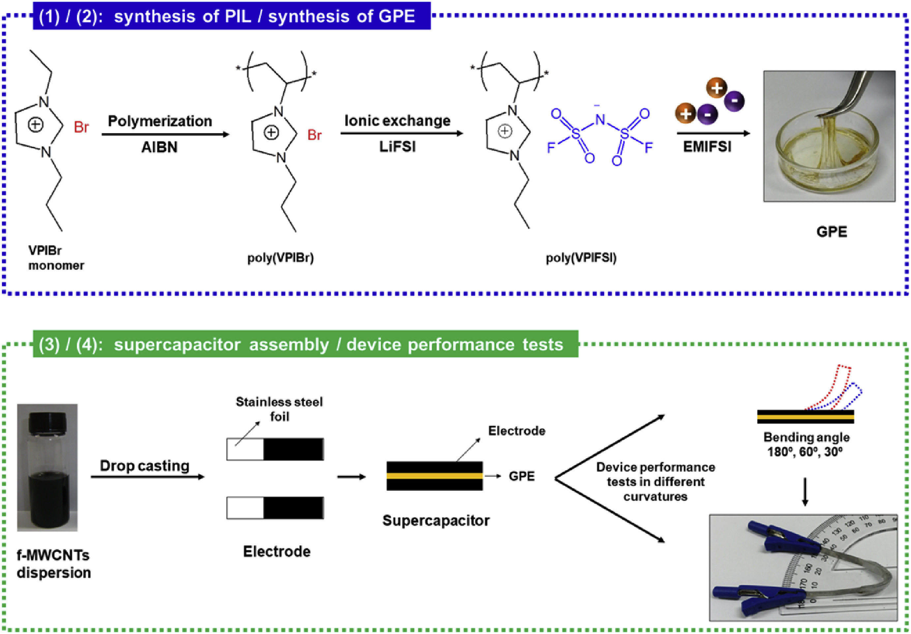  
Fig. 1. Schematic illustration of the experimental procedures employed in this work.  图1.这项工作中使用的实验程序的示意图。

#### 2.2. Synthesis of the polymeric ionic liquid (PIL)
The polymeric ionic liquid, poly(1-vinyl-3-propylimidazolium bis(fluorosulfonyl)imide) poly(VPIFSI) was synthesized in two steps according to procedures previously reported in the literature; i) the direct polymerization of the IL monomer VPIBr to produce the poly(ionic liquid) 1-vinyl-3-propylimidazolium bromide - poly(VPIBr) [31]; ii) the modification of the synthesized poly(ionic liquid) by means of a simple ion exchange reaction between the poly(VPIBr) and the LiFSI to produce the poly(PVIFSI) [31].  
聚合离子液体，聚（1-乙烯基-3-丙基咪唑鎓双（氟磺酰基）酰亚胺）聚（VPIFSI），是根据先前文献报道的方法分两个步骤合成的。 i）IL单体VPIBr的直接聚合反应，生成聚（离子液体）1-乙烯基-3-丙基咪唑鎓溴化物-聚（VPIBr）[31]； ii）通过在聚（VPIBr）和LiFSI之间进行简单的离子交换反应来修饰合成的聚（离子液体），以生产聚（PVIFSI）[31]。

Step i: Three grams of VPIBr ionic liquid were solubilized in 100 mL of chloroform in a 250-mL round-bottom flask. Then, 0.06 g of azobis(2-methylpropionitrile) (radical initiator) (2%) was added to the mixture which was subsequently heated under a N2 atmosphere for 3 h up to 70 °C. The reaction was terminated on the appearance of a yellowish solid in the reaction medium, which was filtered and washed with chloroform.  
步骤i：在250 mL圆底烧瓶中，将三克VPIBr离子液体溶解在100ul mL氯仿中。然后，将0.06μg的偶氮二（2-甲基丙腈）（自由基引发剂）（2％）加入到混合物中，随后将其在N 2气氛下加热3h，直至70℃。在反应介质中出现黄色固体时终止反应，将其过滤并用氯仿洗涤。

Step ii: To prepare the poly(VPIFSI) two solutions containing 1 g of poly(VPIBr) in 20 mL of distilled water and 4 g of LiFSI in 10 mL of distilled water were prepared. The solutions were then mixed for 30 min at room temperature to facilitate the exchange of Br− ions by FSI−. Almost immediately a yellow solid was observed to precipitate. The solid deposit was separated by filtration and dried in a vacuum oven at 60 °C for approximately 4 h until it reached constant weight.  
步骤ii：为了制备聚（VPIFSI），制备了两种溶液，分别包含在20ul蒸馏水中的1ug聚VPIBr和在10ul蒸馏水中的4μgLiFSI。然后将溶液在室温下混合30分钟，以促进FSI-交换Br-离子。几乎立即观察到黄色固体沉淀。通过过滤分离出固体沉积物，并在真空烘箱中于60℃下干燥约4小时，直至达到恒重。

#### 2.3. Preparation of PIL/IL-GPE
PIL/IL-GPE containing the poly(VPIFSI) as host polymer was prepared by the solution casting method in proportions of 30, 50 and 70 wt% of IL. 0.5 g of poly(VPIFSI) was separately dissolved in 5 mL of acetone for 8 h. Corresponding quantities of ionic liquid EMIFSI were added to the solution and mixed until a homogeneous solution was obtained.  
通过溶液流延法以30、50和70wt％的IL的比例制备包含聚（VPIFSI）作为主体聚合物的PIL/IL-GPE。将0.5ul的聚（VPIFSI）分别溶解在5ul的丙酮中8h。将相应量的离子液体EMIFSI添加到溶液中并混合，直到获得均匀溶液为止。

#### 2.4. Preparation of the electrode and assemblage of the supercapacitors
A stable dispersion of f-MWCNTs in distilled water was obtained by treatment in a low-power ultrasonic bath for 2 h (0.06 wt%). The dispersions were deposited onto stainless steel current collectors (stainless steel foil type 304, 0.1 mm thick, Alfa Aesar) by drop casting until the area of the electrode was fully covered. The current collectors were heated up to 100 °C to evaporate the solvent. The supercapacitors were prepared by arranging the carbon nanotube electrodes in a stacked configuration. First, a solution of PIL/IL-GPE was dripped onto the electrodes of f-MWCNTs until a solid polymeric film layer formed after the evaporation of the solvent. Then the electrodes covered by the dried polymeric film were placed in a sandwich arrangement to form the supercapacitor. The capacitors thus prepared were successively flexed at angles of 180°, 60° and 30° and subjected to electrochemical tests.  
通过在低功率超声浴中处理2 dispersion h（0.06 wt％），可获得f-MWCNT在蒸馏水中的稳定分散。通过滴铸将分散体沉积到不锈钢集电器上（不锈钢箔类型304，厚度为0.1 mm，Alfa Aesar），直到电极的区域被完全覆盖。将集电器加热至100 C以蒸发溶剂。通过将碳纳米管电极布置成堆叠结构来制备超级电容器。首先，将PIL/IL-GPE溶液滴到f-MWCNT的电极上，直到溶剂蒸发后形成固体聚合物膜层。然后，将被干燥的聚合物膜覆盖的电极以夹心结构放置以形成超级电容器。将由此制备的电容器以180°，60°和30°的角度连续弯曲，并进行电化学测试。

#### 2.5. Characterization of the materials
Fourier transform infrared spectroscopy (FTIR) was performed using a Thermo Scientific spectrophotometer (model Nicolet 380 FTIR) equipped with a Horizontal Attenuated Total Reflectance (HATR) accessory. The spectra were recorded in the range of 4000–650 cm−1.  
使用配备水平衰减全反射（HATR）附件的Thermo Scientific分光光度计（型号Nicolet 380 FTIR）进行傅里叶变换红外光谱（FTIR）。光谱记录在4000–650 cm-1范围内。

1H NMR spectra of the samples were recorded on a Bruker AM 300 (300 MHz) spectrometer.  
样品的1 H NMR光谱在Bruker AM 300（300 MHz）光谱仪上记录。

The ionic conductivity and the electrochemical stability window of the PIL/IL-GPE were studied by electrochemical impedance spectroscopy (EIS) and linear sweep voltammetry (LSV) respectively, using a potentiostat/galvanostat Autolab PGSTAT30 (Eco Chemie). The EIS was studied in the frequency range of 1 MHz to 1 Hz at the open circuit potential (OCP) with a perturbation of 10 mV. The LSV was performed at 5 mV s−1 employing a silver wire as a pseudo-reference electrode. The anodic and cathodic processes were scanned separately from the OCP using two different pieces of each electrolyte.  
使用恒电位仪/恒电流仪Autolab PGSTAT30（Eco Chemie）分别通过电化学阻抗谱（EIS）和线性扫描伏安法（LSV）研究了PIL/IL-GPE的离子电导率和电化学稳定性窗口。在开路电势（OCP）下，在1 MHz至1 Hz的频率范围内，以10 mV的扰动研究了EIS。 LSV是在5referencemV s-1下使用银线作为伪参比电极进行的。使用两种不同的每种电解质分别从OCP扫描阳极和阴极过程。

The electrochemical capacitors were characterized by cyclic voltammetry (CV), EIS (using an Autolab PGSTAT30 potentiostat/galvanostat) and galvanostatic charge/discharge tests (using a Biologic VMP3 multichannel potentiostat). The EIS measurements were conducted in two-electrode cell configuration (active material on both work and counter electrodes) in a frequency range of 1 MHz–10 mHz at the OCP using an AC perturbation of 10 mV. CV was measured in a cell with the active material on both work and counter electrodes in two-electrode (or three-electrode, using the silver wire as the reference electrode) cell configuration at a scan rate of 5 mV s−1 to 80 mV s−1 in a voltage range of 0–3 V (at a scan rate of 50 mV s−1). Galvanostatic charge/discharge measurements were made using a two/three-electrode cell configuration (active material on both work and counter electrodes) at different current densities (0.25–4.00 A g−1), over a voltage range of 0–2.5 V employing a silver wire as the reference electrode. This configuration allows the synchronous measurements of the cell voltage and the potential of the positive and negative electrodes. The stability of the capacitor was evaluated over 5000 cycles at constant current density of 0.50 A g−1 at the potential of 0–2.5 V (and 0–3.0 V). The properties of the device were calculated by means of the following equations:  
通过循环伏安法（CV），EIS（使用Autolab PGSTAT30恒电位仪/恒电流仪）和恒电流充/放电测试（使用Biologic VMP3多通道恒电位仪）对电化学电容器进行了表征。 EIS测量是在OCP的1 MHz-10 mHz频率范围内，使用10 mV的交流电，以两电极电池配置（工作电极和反电极上的活性材料）进行的。在具有活性物质的电池中，在两电极（或三电极，使用银线作为参考电极）的工作电极和对电极中（5 mV s-1至80 mV s-1)，测量电压在0–3 V的电压范围内，扫描速率为50 mV s-1。恒电流充/放电测量是使用双/三电极电池配置（工作电极和对电极上的活性材料）在0-2.5 V的电压范围内以不同的电流密度（0.25–4.00 A g-1）进行的。银线作为参比电极。这种配置允许同步测量电池电压以及正极和负极的电势。在0.50 A g-1的恒定电流密度，0-2.5 constantV（和0-3.0 V）的电势下，在5000个循环内评估了电容器的稳定性。通过以下公式计算出器件的性能：

where I is the applied current, V is the voltage, U is the potential of the electrodes, m+ and m- are the masses of active material in the positive and negative electrodes, respectively, Δtcharge is the charge time, Δtdischarge is the discharge time, Vmax,charge is the maximum voltage reached by the SC during charging, and Vdischarge is the maximum voltage discounting the ohmic drop, Csp,cell, Ereal, and Preal are the specific capacitance, energy density and power density of the cell, respectively, ESR is the equivalent series resistance, ε is the coulomb efficiency, η is the energy efficiency, and Csp, + and Csp, - are the specific capacitances of the positive and negative electrodes, respectively.  
其中I是施加的电流，V是电压，U是电极的电势，m +和m-分别是正极和负极中活性物质的质量，Δtcharge是充电时间，Δtdischarge是放电时间，Vmax，charge是SC在充电过程中达到的最大电压，而Vdischarge是减去欧姆降的最大电压，Csp，cell，Ereal和Preal分别是电池的比电容，能量密度和功率密度， ESR是等效串联电阻，ε是库仑效率，η是能量效率，Csp，+和Csp，-分别是正电极和负电极的比电容。

### 3. Results and discussion
#### 3.1. Synthesis of the PILs
Poly(VPIBr) was synthesized by radical polymerization using VPIBr ionic liquid as monomer following the PIL synthesis procedures previously described in the literature [31,32]. Next, poly(VPIFSI) was prepared by means of an exchange reaction involving the replacement of Br− anions in the poly(VPIBr) precursor by FSI− anions, accompanied by phase separation due to the hydrophobicity of the newly formed PIL. The chemical composition of poly(VPIFSI) synthesized were confirmed by FTIR and 1H NMR spectroscopy. Fig. 2a shows the 1H NMR spectra of the VPIBr monomer and its polymerized form (poly(VPIBr)). The vinyl signals at 7.08, 5.73 and 5.31 ppm were observed to disappear, which is indicative of the occurrence of the polymerization reaction [31]. Fig. 2b shows the FTIR spectra of the VPIBr, poly(VPIBr) and poly(VPIFSI), respectively. The first spectra of the unpolymerized compound (VPIBr) show bands at 1653, 967 and 920 cm−1 which can be assigned to C=C stretching in the vinyl group. The decrease in the band at 1653 and the complete disappearance of the bands at 970 and 920 cm−1 are indicative of the polymerization of the compound. Similar results have been reported by Jin et al. [33]. After the anion exchange reaction (third spectra), new bands attributed to FSI were observed at 1375, 1170 cm−1 (all of which can be assigned to S=O stretching), 830 cm−1 (the S-F stretching) and 730 cm−1 (N-S stretching) [34], [35], [36], [37].  
按照先前文献[31,32]中所述的PIL合成程序，使用VPIBr离子液体作为单体通过自由基聚合反应合成聚（VPIBr）。接下来，通过交换反应制备聚（VPIFSI），该交换反应包括用FSI-阴离子替换聚（VPIBr）前体中的Br-阴离子，并由于新形成的PIL的疏水性而引起相分离。通过FTIR和1H NMR光谱证实合成的聚（VPIFSI）的化学组成。图2a显示了VPIBr单体及其聚合形式（poly（VPIBr））的1H NMR光谱。观察到在7.08、5.73和5.31 ppm处的乙烯基信号消失，这表明发生了聚合反应[31]。图2b分别显示了VPIBr，poly（VPIBr）和poly（VPIFSI）的FTIR光谱。未聚合化合物（VPIBr）的第一光谱显示在1653、967和920 cm-1处的谱带，这些谱带可分配给乙烯基中的C = C拉伸。在1653处的能带减少以及在970和920 cm-1处的能带完全消失表明该化合物聚合。 Jin等人也报道了类似的结果。 [33]。阴离子交换反应后（第三光谱），在1375、1170 cm-1（所有这些都可以指定为S = O拉伸），830 cm-1（SF拉伸）和730 cm-1（NS拉伸）处观察到归因于FSI的新谱带。）[34]，[35]，[36]，[37]。

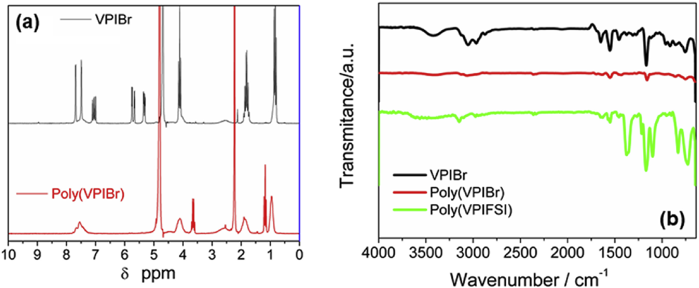  
Fig. 2. (a) The 400-MHz 1H NMR spectra of VPIBr and poly(VPIBr). (b) FTIR spectra of VPIBr, poly(VPIBr) and poly(VPIFSI).

#### 3.2. PIL/IL-GPE electrochemical characterization
Impedance spectroscopy was applied to investigate the variation in conductivity as a function of temperature for pure IL and PIL/IL-GPEs in the range of 25–105 °C. The Arrhenius plot in Fig. 3a shows that the conductivity is heavily dependent on temperature since the conductivity values increase linearly with the increase in temperature from 25 to 105 °C. The synthesized PIL/IL-GPEs show ionic conductivity values of 0.9, 3.7 and 7.2 mS cm−1 at 25 °C to 30, 50 and 70 wt% of IL, respectively. The values obtained were smaller than for the pure IL (13.7 mS cm−1) due to the fact that the lowest ionic mobility species trapped in the polymeric matrix, but close or better than values already reported for some gel polymer electrolytes used in supercapacitors and lithium batteries taking into account the differences in the conductivity of the neat ILs and their mass ratio used in each system [19,[38], [39], [40]]. At high IL concentrations (70 wt%), ionic conductivity attained high values, although the mechanical stability of the system was compromised.  
阻抗谱用于研究纯IL和PIL/IL-GPE在25–105 C范围内电导率随温度的变化。图3a中的Arrhenius曲线表明，电导率严重依赖于温度，因为电导率值随温度从25升高到105 C而线性增加。合成的PIL/IL-GPEs在25°C时的离子电导率分别为0.9、3.7和7.2 mS cm-1，分别占IL的30、50和70wt％。所获得的值小于纯IL（13.7 mS cm-1），这是由于以下事实：最低的离子淌度物种捕获在聚合物基质中，但接近或优于某些超级电容器和高分子量凝胶聚合物电解质已经报道的值。锂电池要考虑纯净IL的电导率及其在每个系统中使用的质量比的差异[19，[38]，[39]，[40]]。在高IL浓度（70％wt％）下，尽管系统的机械稳定性受到损害，但离子电导率却达到了很高的值。

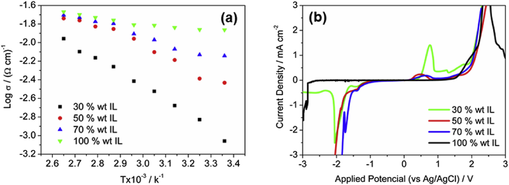  
Fig. 3. (a) Arrhenius plots of ionic conductivity for different PIL/IL- GPEs at different temperatures from 25 to 105 °C. (b) Electrochemical window of the PIL/IL-GPEs at room temperature.  
图3.（a）不同的PIL/IL-GPE在25至105 C的不同温度下的离子电导率的阿伦尼乌斯图。 （b）室温下PIL/IL-GPE的电化学窗口。

Linear sweep voltammetry (LSV) measurements were used to evaluate the electrochemical stability window (ESW), an important property that determines the maximum safe operating range of the electrolytes (Fig. 3b). The voltage stability limit is defined as the voltage whose the limit current density has reached 0.5 mA cm−2. The PIL/IL-GPEs presented electrochemical windows of 2.3, 3.7 and 3.4 V to 30, 50 and 70 wt% of IL, respectively. The potential limits depend on the nature of both the cation and anion as well as all the other components of the electrolyte, such as traces of impurities (e.g. water), the polymer matrix and presence of other particles [41,42].  
线性扫描伏安法（LSV）测量用于评估电化学稳定性窗口（ESW），这是决定电解质的最大安全工作范围的重要属性（图3b）。电压稳定极限被定义为极限电流密度达到0.5 mA cm-2的电压。 PIL/IL-GPE的电化学窗口分别为2.3、3.7和3.4 V，分别占IL的30、50和70wt％。电位极限取决于阳离子和阴离子的性质以及电解质的所有其他成分，例如痕量的杂质（例如水），聚合物基质和其他颗粒的存在[41,42]。

The PIL/IL-GPEs exhibited homogeneous behavior without any leakage of the IL, probably due to the chemical affinity between the IL and the polymeric matrix. PIL/IL-GPE in the proportion of 50 wt% showed a final physical appearance (after the evaporation of the solvent) of a very viscous and sticky/adhesive gel with a good structural integrity and excellent flexibility. These features allow close contact between the electrolyte and the surface of the carbon nanotubes electrodes undergoing arbitrary deformation. Among the studied PIL/IL-GPEs, the one manufactured with 50 wt% IL was considered the optimal system since it combines an excellent liquid retention capacity, very good adhesion properties, and, more importantly, a high ionic conductivity and wide electrochemical stability window. Because of these integrated properties, this PIL/IL-GPE (50 wt% of IL) was chosen for the preparation of all the solid flexible supercapacitors.  
PIL/IL-GPEs表现出均一的性能，没有IL的任何泄漏，这可能是由于IL与聚合物基质之间的化学亲和力所致。 PIL/IL-GPE的比例为50％（重量）时，显示出最终的物理外观（溶剂蒸发后），具有良好的结构完整性和出色的柔韧性，非常粘稠。这些特征允许电解质与经历任意变形的碳纳米管电极的表面之间紧密接触。在所研究的PIL/IL-GPE中，以50％（重量）IL制造的那一种被认为是最佳系统，因为它具有优异的保液能力，非常好的粘合性能，更重要的是具有高离子电导率和宽的电化学稳定性范围。由于具有这些综合特性，因此选择了这种PIL/IL-GPE（占IL的50 wt％）来制备所有固态柔性超级电容器。

#### 3.3. An electrochemical study of solid supercapacitors based on the PIL/IL-GPE
Electrochemical Impedance Spectroscopy was the first technique used to evaluate the electrochemical behavior of the MWCNT | PIL/IL-GPE with 50 wt% IL | MWCNT symmetric supercapacitor. Fig. 4a shows the Nyquist plot recorded for this cell at the OCP in the frequency range of 106 Hz to 10−2 Hz by applying a perturbation of 10 mV. The result obtained was what might be expected for a supercapacitor: a resistive semicircle at high frequencies, a Warburg diffusion line at intermediate frequencies and a capacitive straight line at low frequencies, represented by the equivalent circuit R1(C1[R2W])C2. The first resistance (R1) at the beginning of the semicircle is attributed to the electrolyte while the second one (R2) at the end of the semicircle is ascribed to electrode resistance (R2), and contact with the current collector. The diameter of the semicircle (R2-R1) represents the equivalent series resistance (ESR) of the cell [43]. The ESR value, around 39 Ω is higher than in the case of conventional supercapacitors that use ionic liquid electrolytes (in liquid-state), but lower than, or at least of the order of, values of other solid state cells based on CNT and gel electrolytes due to the high ionic conductivity and good adhesive properties of the sticky PIL/IL GPE and the accessible porosity of the nanotubes [19,21,28,44]. The straight line close to 90° at low frequencies (at which the voluminous ions of the IL easily diffuse into the porosity of the nanotubes) is an indicator of the good capacitive performance of this device.  
<<<<<<< HEAD
电化学阻抗谱是用于评估MWCNT电化学行为的第一项技术。含50％（重量）IL的PIL/IL-GPE | MWCNT对称超级电容器。图4a显示了在OCP在106 Hz至10-2 Hz的频率范围内通过施加10 mV的扰动记录的该单元的奈奎斯特图。所获得的结果是超级电容器的预期结果：高频下的电阻半圆，中频下的Warburg扩散线和低频下的电容性直线，用等效电路R1（C1 [R2W]）C2表示。在半圆的开头的第一电阻（R1）归因于电解质，而在半圆的末尾的第二电阻（R2）归因于电极电阻和与集电器接触电阻。半圆的直径（R2-R1）代表电池的等效串联电阻（ESR）[43]。 ESR值约为39Ω，比使用离子液体电解质（处于液态）的常规超级电容器要高，但低于或至少大约是其他基于CNT和CNT的固态凝胶电解质，这是由于粘性PIL/IL GPE的高离子电导率和良好的粘合性能以及纳米管的可达到的孔隙率[19,21,28,44]。低频下接近90°的直线（IL的大量离子容易扩散到纳米管的孔隙中）是该设备良好电容性能的指标。
=======
电化学阻抗谱是用于评估MWCNT电化学行为的第一项技术。含50％（重量）IL的PIL/IL-GPE | MWCNT对称超级电容器。图4a显示了在OCP在106 Hz至10-2 Hz的频率范围内通过施加10 mV的扰动记录的该单元的奈奎斯特图。所获得的结果是超级电容器的预期结果：高频下的电阻半圆，中频下的Warburg扩散线和低频下的电容性直线，用等效电路R1（C1 [R2W]）C2表示。在半圆的开头的第一电阻（R1）归因于电解质，而在半圆的末尾的第二电阻（R2）归因于电极电阻（R2），并与集电器接触。半圆的直径（R2-R1）代表电池的等效串联电阻（ESR）[43]。 ESR值约为39ΩΩ，比使用离子液体电解质（处于液态）的常规超级电容器要高，但低于或至少大约是其他基于CNT和CNT的固态电池值凝胶电解质是由于粘性PIL/IL GPE的高离子电导率和良好的粘合性能以及纳米管的可达到的孔隙率[19,21,28,44]。低频下接近90°的直线（IL的大量离子容易扩散到纳米管的孔隙中）是该设备良好电容性能的指标。
>>>>>>> f797d64dbfc50932c67d90a9da8fee6c8469e2a0

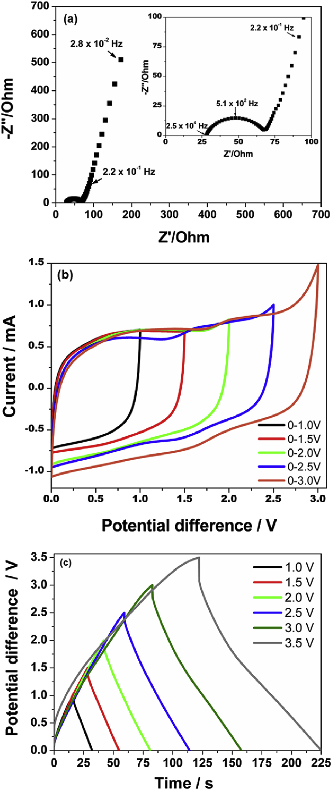  
Fig. 4. Data for the supercapacitor prepared with the PIL/IL-GPE (50 wt% of IL): (a) The Nyquist plot, (b) Cyclic voltammograms obtained at 50 mV s−1 and (c) Galvanostatic charge/discharge curves for the cell (at 0.50 A g−1) all obtained at different operating voltages.  
图4.用PIL/IL-GPE（IL的50 wt％）制备的超级电容器的数据：（a）奈奎斯特图，（b）在50 mV s-1下获得的循环伏安图和（c）恒静电荷/在不同的工作电压下获得的电池放电曲线（在0.50 A allg-1时）。

For a proper study of the electrochemical properties of the PIL/IL-GPE supercapacitor the maximum operating voltage of the cell must first be determined. The device needs to be working at the highest possible voltage to ensure the highest energy and power densities which can be calculated from the  and  equations. Knowledge of the electrochemical window of the electrolyte is essential but the decomposition reactions that occur at the electrolyte/electrode interface is, of course, dependent on the material comprising the electrode. CNTs were chosen as standard electrode material for this study because of their good electrical conductivity and their mesoporous structure, which is easily accessible to the IL electrolyte ions (compared to other types of carbon that have a more tortuous porosity). These properties equip the cells with their low resistance and a good capacitance retention as the current density increases.  
<<<<<<< HEAD
为了正确研究PIL/IL-GPE超级电容器的电化学特性，必须首先确定电池的最大工作电压。该设备需要在尽可能高的电压下工作，以确保可以通过和公式计算出最高的能量和功率密度。电解质的电化学窗口的知识是必不可少的，但是在电解质/电极界面处发生的分解反应当然取决于构成电极的材料。碳纳米管因其良好的导电性和介孔结构而被选作本研究的标准电极材料，IL电解质离子很容易接近（与孔隙度更大的其他类型的碳相比）。随着电流密度的增加，这些特性使电池具有低电阻和良好的电容保持能力。

The PIL/IL-CPE with 50 wt% IL has a large electrochemical window of 3.65 V (from −1.68 V to 1.97 V, versus Ag/Ag+) taking into account the LSV measurements recorded at 5 mVs−1 using two stainless steel blocking electrodes. However, if the cyclic voltammetry (Fig. 4b) and galvanostatic (Fig. 4c) data obtained by the MWCNT | PIL/IL-GPE | MWCNT cell are taken into account, it is clear that the operating voltage needs to be determined by evaluating the properties of the entire cell. The CV of the cell (Fig. 4b) obtained at voltages equal to, or lower than, 2.5 V are close to the box-like shape of an EDLC despite the resistive nature of the solid state system and the presence of peaks that are probably related to the pseudocapacitive contribution of the oxygenated groups on the carbon nanotube surface as mentioned in a previous study [19]. At 3.0 V the contribution of irreversible oxidative processes due to the decomposition of the electrolyte and/or electrode materials that is detrimental to the cyclability of the device is indisputable. The galvanostatic charge/discharge data obtained from the curves presented in Fig. 4C confirm what was deduced from the CV. There is a decrease in the coulombic efficiency (ε) of the cell from 94% (the value observed in the previous voltages: from 1.0 V to 2.5 V) to 91% at 3.0 V and to 85% at 3.5 V. This is the result of cell degradation when cycling above 2.5 V. In light of both these results, we adopted 2.5 V as the maximum operating voltage of the MWCNT | PIL/IL-GPE | MWCNT cell, with potentials ranging from −1.21 V to 1.29 V (versus Ag/Ag+), as can be seen from the charge/discharge curves of the positive and negative electrodes (Fig. 5).  
考虑到在5 mVs-1下使用两个不锈钢堵头记录的LSV测量值，IL含量为50％（重量）的PIL/IL-CPE具有3.65 V（相对于Ag/Ag +为-1.68 V至1.97 V）的大电化学窗口电极。但是，如果循环伏安法（图4b）和恒电流（图4c）通过MWCNT | PIL/IL-GPE |考虑到MWCNT电池，很明显，需要通过评估整个电池的性能来确定工作电压。尽管固态系统具有电阻性，并且存在峰值，但在等于或低于2.5 toV的电压下获得的电池CV（图4b）接近于EDLC的盒状形状。如先前的研究所述[19]，这与碳纳米管表面上的氧化基团的拟电容性贡献有关。在3.0 V时，由于电解质和/或电极材料的分解而导致的不可逆氧化过程的贡献是无可争议的，这对器件的循环能力有害。从图4C所示的曲线获得的恒电流充/放电数据证实了从CV推论得出的结果。电池的库仑效率（ε）从94％（在先前的电压中观察到的值：从1.0 V降至2.5 V）从3.0 V降至91％，在3.5 V降至85％。考虑到以上两个结果，我们将2.5 V作为MWCNT |的最大工作电压。 PIL/IL-GPE |从正负电极的充电/放电曲线可以看出，MWCNT电池的电势范围为-1.21 V至1.29 V（相对于Ag/Ag +）（图5）。

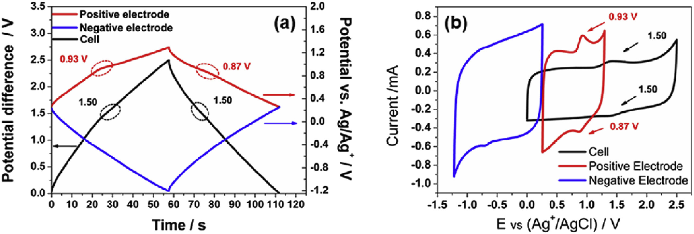  
Fig. 5. (a) Galvanostatic charge/discharge curves for the flexible solid state supercapacitor obtained by recording the cell voltage and the potential (versus Ag/Ag+) of the positive and negative electrodes at 0.50 A g−1 simultaneously, (b) Cyclic voltammograms for the cell, positive and negative electrodes at 10 mVs−1.  
图5.（a）通过同时记录电池电压和0.50 A g-1时正负电极的电势（相对于Ag/Ag +）而获得的柔性固态超级电容器的恒电流充电/放电曲线，（b）电池，正负电极在10μmVs-1时的循环伏安图。
=======
为了正确研究PIL/IL-GPE超级电容器的电化学特性，必须首先确定电池的最大工作电压。该设备需要在尽可能高的电压下工作，以确保可以通过和公式计算出最高的能量和功率密度。电解质的电化学窗口的知识是必不可少的，但是在电解质/电极界面处发生的分解反应当然取决于构成电极的材料。碳纳米管因其良好的导电性和介孔结构而被选作本研究的标准电极材料，介孔结构易于被IL电解质离子（与孔隙度更大的其他类型的碳相比）。随着电流密度的增加，这些特性使电池具有低电阻和良好的电容保持能力。

The PIL/IL-CPE with 50 wt% IL has a large electrochemical window of 3.65 V (from −1.68 V to 1.97 V, versus Ag/Ag+) taking into account the LSV measurements recorded at 5 mVs−1 using two stainless steel blocking electrodes. However, if the cyclic voltammetry (Fig. 4b) and galvanostatic (Fig. 4c) data obtained by the MWCNT | PIL/IL-GPE | MWCNT cell are taken into account, it is clear that the operating voltage needs to be determined by evaluating the properties of the entire cell. The CV of the cell (Fig. 4b) obtained at voltages equal to, or lower than, 2.5 V are close to the box-like shape of an EDLC despite the resistive nature of the solid state system and the presence of peaks that are probably related to the pseudocapacitive contribution of the oxygenated groups on the carbon nanotube surface as mentioned in a previous study [19]. At 3.0 V the contribution of irreversible oxidative processes due to the decomposition of the electrolyte and/or electrode materials that is detrimental to the cyclability of the device is indisputable. The galvanostatic charge/discharge data obtained from the curves presented in Fig. 4C confirm what was deduced from the CV. There is a decrease in the coulombic efficiency (ε) of the cell from 94% (the value observed in the previous voltages: from 1.0 V to 2.5 V) to 91% at 3.0 V and to 85% at 3.5 V. This is the result of cell degradation when cycling above 2.5 V. In light of both these results, we adopted 2.5 V as the maximum operating voltage of the MWCNT | PIL/IL-GPE | MWCNT cell, with potentials ranging from −1.21 V to 1.29 V (versus Ag/Ag+), as can be seen from the charge/discharge curves of the positive and negative electrodes (Fig. 5).  
考虑到在5 mVs-1下使用两个不锈钢堵头记录的LSV测量值，IL含量为50％（重量）的PIL/IL-CPE具有3.65 V（相对于Ag/Ag +为-1.68 V至1.97 V）的大电化学窗口电极。但是，如果考虑 MWCNT | PIL/IL-GPE | MWCNT的循环伏安法（图4b）和恒电流（图4c）数据，显然工作电压需要由整个装置的性质决定。尽管固态系统具有电阻性，并且存在峰值，但在等于或低于2.5 V的电压下获得的电池CV（图4b）接近于EDLC的盒状形状。如先前的研究所述[19]，这与碳纳米管表面上的氧化基团的拟电容性贡献有关。在3.0 V时，由于电解质和/或电极材料的分解而导致的不可逆氧化过程的贡献是无可争议的，这对器件的循环能力有害。从图4C所示的曲线获得的恒电流充/放电数据证实了从CV推论得出的结果。电池的库仑效率（ε）在3.0 V从94％降至91％（在先前的电压中观察到的值：从1.0 V到2.5 V），在3.5 V降至85％。根据这两个结果，我们将2.5 V作为电池的最大工作电压，其电位范围为−1.21 V至1.29 V（相对于Ag/Ag +），这从正负电极的充电/放电曲线可以看出（图5）。

  
Fig. 5. (a) Galvanostatic charge/discharge curves for the flexible solid state supercapacitor obtained by recording the cell voltage and the potential (versus Ag/Ag+) of the positive and negative electrodes at 0.50 A g−1 simultaneously, (b) Cyclic voltammograms for the cell, positive and negative electrodes at 10 mVs−1.  
图5.（a）通过同时记录电池电压和0.50 A g-1时正负电极的电势（相对于Ag/Ag+）而获得的柔性固态超级电容器的恒电流充电/放电曲线，（b）电池，正负电极在10μmVs-1时的循环伏安图。
>>>>>>> f797d64dbfc50932c67d90a9da8fee6c8469e2a0

The properties of the MWCNT | PIL/IL-GPE | MWCNT supercapacitor have been evaluated by applying an operating voltage of 2.5 V at 0.50 A g−1 using synchronous cyclic chronopotentiometry and by recording the voltage of the cell and the potential (versus Ag/Ag+) of each electrode simultaneously (Fig. 5a).  
MWCNT的特性| PIL/IL-GPE |通过使用同步循环计时电位法在0.50 A g-1上施加2.5 V的工作电压，并同时记录电池的电压和每个电极的电位（相对于Ag/Ag +），对MWCNT超级电容器进行了评估（图5a）。

The curve for the cell in Fig. 5a displays a triangular shape characteristic of a symmetric electric double layer supercapacitor with a good coulombic efficiency (ε) of 94.0%The cell has a specific capacitance of 9.6 Fg-1, and energy and power densities of 8.1 Wh kg−1 and 537 W kg−1, respectively, at 0.50 A g−1. The energy efficiency (η) obtained, 68.2%, is similar to the values observed for IL based devices [45]. This η value is due to the large size of the ionic liquid ions (which are bigger than those of conventional aqueous and organic electrolytes) and the solid nature of the system. The equivalent series resistance (ESR) of the cell is of the order of 48Ω, which is close to that observed by EIE.  
图5a中电池的曲线显示了对称双电层超级电容器的三角形特征，库仑效率（ε）为94.0％。电池的比电容为9.6 Fg-1，能量和功率密度为在0.50 A g-1下分别为8.1 Wh kg-1和537 W kg-1。获得的能量效率（η）为68.2％，与基于IL的设备[45]观察到的值相似。该η值是由于离子液体离子的尺寸较大（比常规的水性和有机电解质更大）和系统的固体性质所致。电池的等效串联电阻（ESR）约为48Ω，与EIE观察到的相当。

Again, this relatively low ESR value for a completely solid device is related to the good compatibility between the poly(VPIFSI) and the EMIFSI ionic liquid and also a low contact resistance between the electrolyte and the electrodes (good adhesion) due to the sticky nature of the PIL/IL-GPE system.  
<<<<<<< HEAD
同样，对于完全固态的设备来说，相对较低的ESR值与聚（VPIFSI）和EMIFSI离子液体之间的良好相容性以及电解质和电极之间的低接触电阻（良好的粘合性）有关PIL/IL-GPE系统。

By means of synchronous cyclic chronopotentiometry it is possible to evaluate the potential (versus Ag/Ag+) of the positive and negative electrodes separately. Fig. 5a also shows their charge/discharge profiles at 0.50 A g−1. Despite the small difference in the masses of the positive and negative electrodes (around 6%) the results of the experiment reveal some asymmetry in the formation of the double layer as the specific capacitance of the positive electrode (46.5 Fg-1) exceeds that of the negative electrode (33.2 Fg-1). Several factors may be responsible for this difference: (i) the small pores of the nanotubes may restrict the access of the large EMI+ cations (molecular frame volume of 117.56 Å3) while offering unrestricted access to the small FSI− anions (molecular frame volume of 96.23 Å3) of the ionic liquid [46]. In fact, there are works in the literature which show that the organization of ionic liquids at the molecular level is complex and involves the formation of self-organizing supramolecular structures [[47], [48], [49], [50]]. The complexity increases in the presence of a solid matrix (PIL) and even more when an electric field is applied; (ii) when pseudocapacitive processes are at work in one electrode but not in the other, as these processes begin in specific potentials (in the cell, Fig. 5a, the positive electrode shows a deviation in linearity consistent with the peaks observed in the voltammograms in Fig. 5b); (iii) when ions are present inside the pores before the charging process begins, as a result of which different mechanisms that contribute to the formation of the electrical double layer may trigger: counter-ion adsorption, ion exchange, and co-ion desorption [51]. This complexity might be dependent on the type of electrode and electrolyte used.  
通过同步循环计时电位法，可以分别评估正极和负极的电势（相对于Ag/Ag +）。图5a还显示了它们在0.50 A g-1下的充电/放电曲线。尽管正极和负极的质量差异很小（约6％），但实验结果表明，由于正极的比电容（46.5 Fg-1）超过了正极的比电容，双层的形成有些不对称。负极（33.2 Fg-1）。造成这种差异的原因可能有几个：（i）纳米管的小孔可能会限制大EMI +阳离子（分子框架体积为117.56Å3）的进入，同时不受限制地进入小FSI-阴离子（分子框架体积为96.23 3）的离子液体[46]。实际上，文献中有一些工作表明离子液体在分子水平上的组织是复杂的，并且涉及自组织超分子结构的形成[[47]，[48]，[49]，[50]] 。在存在固态矩阵（PIL）的情况下，复杂性会增加，而在施加电场时会更加复杂； （ii）当假电容过程在一个电极上起作用而在另一电极上不起作用时，因为这些过程始于特定电位（在电池中，图5a，正电极的线性偏差与伏安图中观察到的峰一致）在图5b）中; （iii）离子在充电过程开始之前存在于孔中时，其结果可能触发促成双电层形成的不同机制：抗衡离子吸附，离子交换和共离子解吸[ 51。这种复杂性可能取决于所用电极和电解质的类型。
=======
同样，对于完全固态的设备来说，相对较低的ESR值与聚（VPIFSI）和EMIFSI离子液体之间的良好相容性以及电解质和电极之间的低接触电阻（良好的粘合性）归因于PIL/IL-GPE系统的粘性。

By means of synchronous cyclic chronopotentiometry it is possible to evaluate the potential (versus Ag/Ag+) of the positive and negative electrodes separately. Fig. 5a also shows their charge/discharge profiles at 0.50 A g−1. Despite the small difference in the masses of the positive and negative electrodes (around 6%) the results of the experiment reveal some asymmetry in the formation of the double layer as the specific capacitance of the positive electrode (46.5 Fg-1) exceeds that of the negative electrode (33.2 Fg-1). Several factors may be responsible for this difference: (i) the small pores of the nanotubes may restrict the access of the large EMI+ cations (molecular frame volume of 117.56 Å3) while offering unrestricted access to the small FSI− anions (molecular frame volume of 96.23 Å3) of the ionic liquid [46]. In fact, there are works in the literature which show that the organization of ionic liquids at the molecular level is complex and involves the formation of self-organizing supramolecular structures [47], [48], [49], [50]. The complexity increases in the presence of a solid matrix (PIL) and even more when an electric field is applied; (ii) when pseudocapacitive processes are at work in one electrode but not in the other, as these processes begin in specific potentials (in the cell, Fig. 5a, the positive electrode shows a deviation in linearity consistent with the peaks observed in the voltammograms in Fig. 5b); (iii) when ions are present inside the pores before the charging process begins, as a result of which different mechanisms that contribute to the formation of the electrical double layer may trigger: counter-ion adsorption, ion exchange, and co-ion desorption [51]. This complexity might be dependent on the type of electrode and electrolyte used.  
通过同步循环计时电位法，可以分别评估正极和负极的电势（相对于Ag/Ag +）。图5a还显示了它们在0.50 A g-1下的充电/放电曲线。尽管正极和负极的质量差异很小（约6％），但实验结果表明，由于正极的比电容（46.5 Fg-1）超过了正极的比电容，双层的形成有些不对称。负极（33.2 Fg-1）。造成这种差异的原因可能有几个：（i）纳米管的小孔可能会限制大EMI +阳离子（分子框架体积为117.56Å3）的进入，同时不受限制地进入小FSI-阴离子（分子框架体积为96.23 3）的离子液体[46]。实际上，文献中有一些工作表明离子液体在分子水平上的组织是复杂的，并且涉及自组织超分子结构的形成 [47]，[48]，[49]，[50] 。在存在固态矩阵（PIL）的情况下，复杂性会增加，而在施加电场时会更加复杂； （ii）当假电容过程在一个电极上起作用而在另一电极上不起作用时，因为这些过程始于特定电位（在电池中，图5a，正电极的线性偏差与伏安图中观察到的峰一致）在图5b）中; （iii）离子在充电过程开始之前存在于孔中时，其结果可能触发促成双电层形成的不同机制：抗衡离子吸附，离子交换和共离子解析附[51]。这种复杂性可能取决于所用电极和电解质的类型。
>>>>>>> f797d64dbfc50932c67d90a9da8fee6c8469e2a0

The rate capability of the MWCNT | PIL/IL-GPE | MWCNT cell was evaluated at 2.5 V from 0.25 Ag-1 to 4.00 Ag-1 as shown in Fig. 6. The electrochemical properties of the cell, positive and negative electrodes are summarized in Table 1.  
MWCNT的速率能力| PIL/IL-GPE |如图6所示，在0.25 Ag-1至4.00 Ag-1的2.5 V下对MWCNT电池进行了评估。电池，正极和负极的电化学性能总结于表1中。

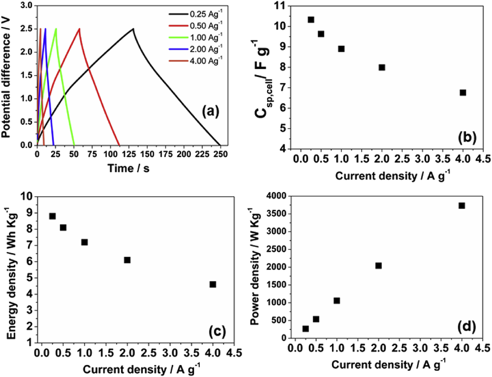  
Fig. 6. (a) galvanostatic charge/discharge curves for the cell containing PIL/IL- GPE at various current densities, (b) the specific capacitance of the cell, (c) the energy density and (d) the power density as a function of the current density.  
图6.（a）包含PIL/IL-GPE的电池在各种电流密度下的恒电流充电/放电曲线，（b）电池的比电容，（c）能量密度和（d）功率密度电流密度的函数。

Table 1. Values of specific capacitance, ESR, coulombic and energy efficiencies for the cell and specific capacitance of the electrodes at different current densities (at a cell operating voltage of 2.5 V).  
表1.在不同电流密度（在2.5 V的电池工作电压下）下，电池的比电容，ESR，库伦和能量效率以及电极的比电容值。

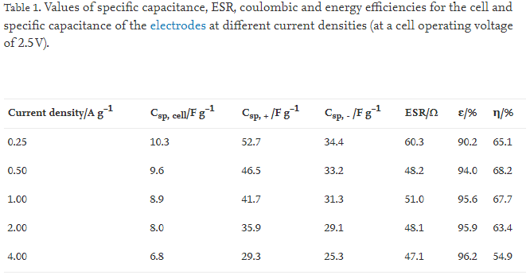

The cell retains around 86% of its capacitance at 1.00 Ag-1, 78% at 2.00 Ag-1, and 66% at 4.00 Ag-1 (taking into account the value obtained at 0.25 Ag-1), and shows a good rate capability for a solid-state device based on an IL gel electrolyte. In Table 1 it can be seen that the decrease in the capacitance of the positive electrode is more pronounced than in the case of the negative electrode. This could be due to the presence of pseudocapacitive processes taking place in the positive electrode but not in the negative electrode (supplementary information, Figs. S1 and S2 and related discussions).  
电池在1.00 Ag-1处保留约86％的电容，在2.00 Ag-1处保留78％的电容，在4.00 Ag-1处保留66％的电容（考虑到在0.25 Ag-1处获得的值），并显示出良好的速率基于IL凝胶电解质的固态设备的功能。在表1中可以看出，与负极相比，正极的电容的降低更加明显。这可能是由于在正极中存在假电容过程而在负极中不存在（补充信息，图S1和S2及相关讨论）。

The energy (Ereal) and power (Preal) densities range from 8.8 Wh kg−1 and 268 W kg−1 to 4.6 Wh kg−1 and 3732 W kg−1, respectively. The purpose of using carbon nanotubes as standard material as the electrodes was to facilitate the evaluation of the characteristics of the PIL/IL-GPE adhesive gel polymer electrolyte. However the low surface area of the MWCNT (compared to other carbon materials such as activated carbon, mesoporous carbon and graphene) gave rise to the low values of the Csp,cell, which in turn limited the energy density of the MWCNT | PIL/IL-GPE | MWCNT cell despite the high operational voltage employed (). Nevertheless, a partially exfoliated MWCNT is advantageous for obtaining high values of power density especially at high current densities [52]. It is also worth mentioning the small variations in ERS, ε and η, with the current density over a relatively large range (0.25 Ag-1 to 4.00 Ag-1). This is due to the characteristics of the PIL/IL electrolyte and its adhesive nature.  
<<<<<<< HEAD
能量密度（Ereal）和功率密度（Preal）分别为8.8 Wh kg-1和268 W kg-1至4.6 Wh kg-1和3732 W kg-1。使用碳纳米管作为标准材料作为电极的目的是为了便于评估PIL ​​/IL-GPE胶凝凝胶聚合物电解质的特性。但是，MWCNT的低表面积（与其他碳材料（例如活性炭，中孔碳和石墨烯）相比）导致Csp，cell的值较低，从而限制了MWCNT |的能量密度。 PIL/IL-GPE | MWCNT电池尽管采用了高工作电压（）。然而，部分剥落的MWCNT有利于获得高功率密度值，特别是在高电流密度下[52]。还值得一提的是ERS，ε和η的微小变化，电流密度在相对较大的范围内（0.25 Ag-1至4.00 Ag-1）。这是由于PIL/IL电解质的特性及其粘附性。
=======
能量密度（Ereal）和功率密度（Preal）分别为8.8 Wh kg-1和268 W kg-1至4.6 Wh kg-1和3732 W kg-1。但是，MWCNT的低表面积导致Csp，cell的值较低（与其他碳材料（例如活性炭，中孔碳和石墨烯）相比），尽管使用了高工作电压，这反过来又限制了Cell的能量密度。然而，部分剥落的MWCNT有利于获得高功率密度值，特别是在高电流密度下[52]。还值得一提的是ERS，ε和η的微小变化，电流密度在相对较大的范围内（0.25 Ag-1至4.00 Ag-1）。这是由于PIL/IL电解质的特性及其粘附性。
>>>>>>> f797d64dbfc50932c67d90a9da8fee6c8469e2a0

The cycling stability of the MWCNT | PIL/IL-GPE | MWCNT supercapacitor was evaluated at the operating voltage of 2.5 V (and also 3.0 V) at 0.50 Ag-1 (Fig. 7).  
MWCNT的循环稳定性| PIL/IL-GPE |在0.50 Ag-1的工作电压为2.5 V（以及3.0 V）时评估了MWCNT超级电容器（图7）。

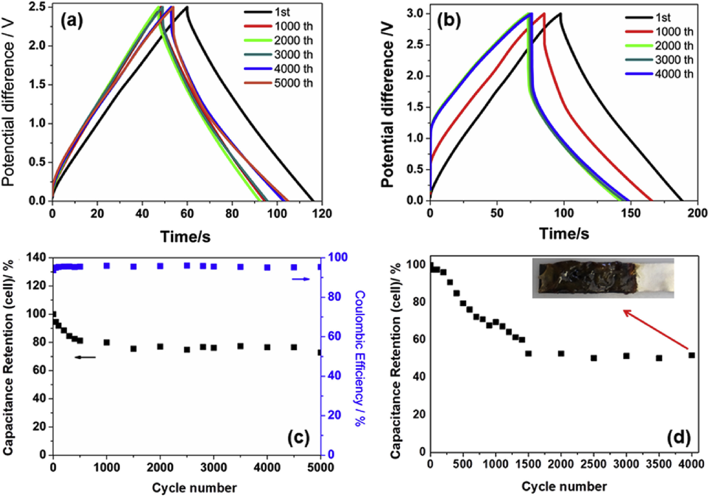  
Fig. 7. Galvanostatic charge–discharge curves for the cell as a function of number of cycles at 0.5 A g−1 at different operating voltages: (a) 2.5 V and (b) 3.0 V. The capacitance retention as a function of the number of cycles at the operating voltages of (c) 2.5 V and (d) 3.0 V.  
图7.在不同工作电压下，电池在0.5 GalA g-1时的恒流充放电曲线与循环次数的关系：（a）2.5 V和（b）3.0V。在（c）2.5 V和（d）3.0 V的工作电压下的循环次数。

This cell (at the operating voltage of 2.5 V) lost about 23% of its capacitance over the first 1000 cycles and only 9% in the final 4000 cycles, while the ESR has increased by about 50% within 1000 cycles maintaining practically constant up to the 5,000th cycle. The coulombic efficiency remained constant at around 95% up to the 5,000th cycle, although the energy efficiency fell by 25%. Also in this case, the positive electrode was mainly responsible for this behavior once its capacitance degradation is higher (28%) than that of the negative electrode (19%) at the first 1000 cycles. This behavior has already been described in the literature and is related to pseudocapacitive processes (previously described and verified mainly in the positive electrode) due to the presence of oxygenated groups in the MWCNTs [53]. The significant retention of capability of the cell operating in the range of 0–2.5 V was as a result of the adhesive properties of the PIL/IL-GPE as well as its high conductivity, good interaction between the PIL matrix and the IL liquid phase (with the prevention of leakage contributing to greater safety), good adhesion and wettability and low reactivity of the electrolyte on the electrode material.  
<<<<<<< HEAD
该电池（在2.5 ofV的工作电压下）在前1000个周期中损失了约23％的电容，而在最后4000个周期中仅损失了9％，而ESR在1000个周期中增加了约50％，保持了几乎恒定的恒定值。第5,000个周期。尽管能量效率下降了25％，但直到第5,000个循环，库仑效率仍保持在95％左右。同样在这种情况下，一旦在前1000个循环中，其电容降级高于负电极（19％）的电容降级（28％），则正电极就主要负责这种行为。由于MWCNT中存在氧化基团，这种行为已在文献中得到描述，并且与假电容过程（先前已在正极中进行过描述和验证）有关[53]。 PIL/IL-GPE的粘合特性以及其高电导率，PIL基质与IL液相之间的良好相互作用，可在0-2.5 V的范围内显着保持电池工作能力（防止泄漏有助于提高安全性），电解质在电极材料上的良好粘合性和润湿性以及低反应性。
=======
该电池（在2.5 ofV的工作电压下）在前1000个周期中损失了约23％的电容，而在最后4000个周期中仅损失了9％，而ESR在1000个周期中增加了约50％，保持了几乎恒定的恒定值。第5,000个周期。尽管能量效率下降了25％，但直到第5,000个循环，库仑效率仍保持在95％左右。同样在这种情况下，在前1000个循环中，其正极电容降级（28％）高于负电极的电容降级（19％），则正电极就主要负责这种行为。由于MWCNT中存在氧化基团，这种行为已在文献中得到描述，并且与假电容过程（先前已在正极中进行过描述和验证）有关[53]。 PIL/IL-GPE的粘合特性以及其高电导率，PIL基质与IL液相之间的良好相互作用，可在0-2.5 V的范围内显着保持电池工作能力（防止泄漏有助于提高安全性），电解质在电极材料上的良好粘合性和润湿性以及低反应性。
>>>>>>> f797d64dbfc50932c67d90a9da8fee6c8469e2a0

It should also be highlighted that, while the properties of the cell were superior at 3.0 V (Csp,cell = 10.8 Fg-1 and Ereal = 12.7 Wh kg−1), its degradation (due to reactions between the electrolyte and the electrode) under cycling was very high (Fig. 7b). Therefore, as before, the most suitable working voltage for such a system was judged to be 2.5 V, although the LSV might suggest otherwise.  
还应该强调的是，尽管电池的特性在3.0 V时表现出色（Csp，cell = 10.8 Fg-1和Ereal = 12.7 Wh kg-1），但其降解（由于电解质和电极之间的反应）循环下的压力很高（图7b）。因此，与以前一样，尽管LSV可能会建议，但这种系统的最合适工作电压被认为是2.5V。

The main advantage of the sticky PIL/IL gel polymer electrolyte is its suitability for preparing flexible solid-state supercapacitors. Therefore, in addition to evaluating the device for use in a planar configuration (180°) as before, we folded it two form two additional angles: 60° and 30° in order to evaluate its electrochemical properties. The charge/discharge curves obtained using synchronous cyclic chronopotentiometry (from 0 V to 2.5 V at 0.50 A g−1) for the device folded at 60°, and then at 30°, are presented in Fig. 8.  
粘性PIL/IL凝胶聚合物电解质的主要优点是适合制备柔性固态超级电容器。因此，除了像以前那样评估用于平面配置（180°）的设备外，我们还将其折叠成两个附加角度：60°和30°，以评估其电化学性能。使用同步循环计时电位法（在0.50 A g-1下从0 V至2.5 V）获得的充电/放电曲线如图60所示，然后在30°折叠。

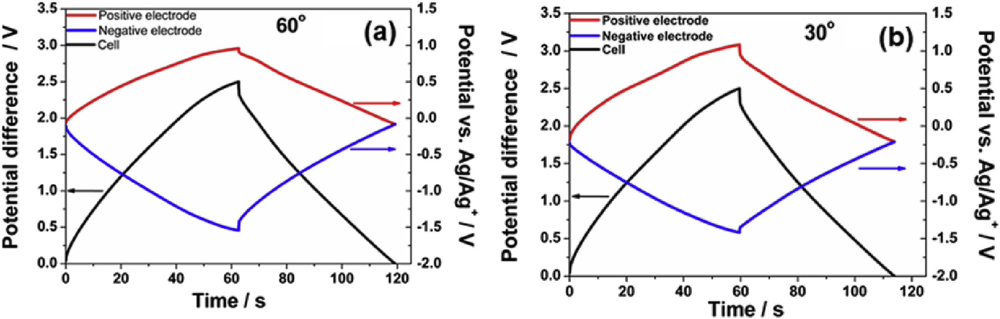  
Fig. 8. Galvanostatic charge/discharge curves at the bending angles of (a) 60° and (b) 30° for the flexible solid state supercapacitor at 0.50 A g−1 and at an operating voltage of the cell of 2.5 V.  
图8.挠性固态超级电容器在0.50 A g-1的工作电压和2.5 V的工作电压下，在（a）60°和（b）30°弯曲角处的恒电流充电/放电曲线。

A comparison of the charge/discharge curves presented in Fig. 5, Fig. 8 a–b yields some interesting information about their performances. It is also worth noting that the same cell was used to evaluate the electrochemical properties at the three angles: 180° (planar configuration), 60° and 30° in that order. It was observed that the triangular shape of the curves was maintained, although the ohmic drop was accentuated with each increasing angle reflecting an increase in the ESR.  
比较图5所示的充电/放电曲线，图8 a-b得出一些有关其性能的有趣信息。还值得注意的是，使用相同的电池按三个角度评估三个角度的电化学性能：180°（平面配置），60°和30°。观察到曲线保持了三角形，尽管随着每个增加的角度，欧姆滴都增加了，反映了ESR的增加。

The equilibrium potential (the potential of the electrodes when the cell voltage is zero) also changed from 0.256 V, to −0.085 V and to −0.210 V when the cell was folded to form angles of 180°, 60° and 30°, respectively. Consequently, even when the cell was being cycled from 0 to 2.5 V, the operating window (taking into consideration the maximum potentials to which each electrode was subjected) varied as follows: −1.207 V–1.293 V at 180°; −1.541 V–0.959 V at 60° and −1.418 V to 1.082 V at 30°. Despite these effects, the data showed no considerable degradation in the positive and negative electrodes (not even at the low potential of −1.541 V, due to the stability of the PIL/IL-GPE system). The reasons for this are not fully understood, but apart from the influence of folding, the effect of cycling may have played a role (since the cell folded to 30° had already been cycled to obtain the 180° and 60° measurements). To separate the effects of folding and aging due to cycling separate experiments were performed using a cell first in planar configuration (180°), then folded to 60°, then to 30° and finally back to 180°, employing a very small number of cycles in each configuration. The results are shown in the supplementary information in Fig. S3. Only small changes in cell performance were observed when the cell was returned to its planar configuration. Only the change in ESR was of any relevance, demonstrating that cycling has hardly any influence on the results of the experiments shown in Fig. 8 and Table 2.  
当电池折叠成180°，60°和30°时，平衡电势（电池电压为零时电极的电势）也从0.256 V变为-0.085 V和-0.210V。 。因此，即使将电池从0循环到2.5 V，操作窗口（考虑每个电极承受的最大电势）也变化如下：180°时为−1.2071.2V–1.293 V； 60°时为−1.541°V–0.959°V，30°时为−1.418°V至1.082°V。尽管有这些影响，数据显示在正电极和负电极中都没有明显的退化（由于PIL/IL-GPE系统的稳定性，即使在低电位-1.541 V也不例外）。其原因尚不完全清楚，但是除了折叠的影响外，循环的作用可能也起了作用（因为折叠到30°的样品池已经被循环以获得180°和60°的测量值）。为了区分由于循环而产生的折叠和老化的影响，首先使用平面配置的电池（180°），然后折叠至60°，然后折叠至30°，最后回到180°，并使用极少量的电池进行单独实验每个配置中的周期。结果显示在图S3的补充信息中。当电池返回其平面结构时，仅观察到电池性能的微小变化。仅ESR的变化具有任何相关性，表明循环对图8和表2所示的实验结果几乎没有任何影响。

Table 2. Values of specific capacitance, ESR, energy and power densities, coulombic and energy efficiencies for the cell, and specific capacitance of the electrodes at different current densities (applying an operating cell voltage of 2.5 V).  
表2.电池的比电容，ESR，能量和功率密度，库仑和能量效率的值，以及在不同电流密度（施加2.5 V的工作电池电压）下电极的比电容的值。  
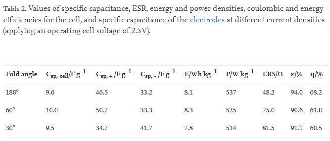  

The data reported above were obtained by means of synchronous cyclic chronopotentiometry. To ensure correct evaluation of these effects, the electrochemical properties of the MWCNT | PIL/IL-GPE | MWCNT supercapacitor as a function of the each angle (as shown in Table 2) are discussed below.  
以上报告的数据是通过同步循环计时电位法获得的。为确保正确评估这些效应，MWCNT |的电化学性质PIL/IL-GPE |下面讨论了MWCNT超级电容器作为每个角度的函数（如表2所示）。

The data reveal an inversion of the capacitance of positive and negative electrodes for the cell folded to form an angle of 30°. At this angle, the capacitance of the negative electrode is higher than that of the positive electrode. This could be due to some fold-related mechanical effect, preventing the ions from gaining access to the surface of the electrode, as a result of which the structure of the electrical double layer is modified. Clearly further studies are needed to fully clarify this point. However, from a practical point of view there were no significant changes in the Csp, Ereal, and Preal of the cell. The small decrease (less than 3%) in coulombic efficiency did not compromise the cycling performance of the planar cell (Fig. 7), and even the increase in the ESR did not cause any substantial decrease in η. The PIL/IL gel polymer electrolyte can therefore be considered suitable for preparing flexible and safe solid-state supercapacitors without the loss of any of the properties of the cell as a result of folding and cycling.  
数据揭示了折叠成30°角的电池正负极电容的倒置。在该角度下，负极的电容高于正极的电容。这可能是由于某种与折叠有关的机械效应，从而阻止了离子进入电极表面，从而改变了双电层的结构。显然，需要进一步研究以充分阐明这一点。但是，从实际的角度来看，该单元的Csp，Ereal和Preal没有明显变化。库仑效率的小幅下降（小于3％）不会损害平面电池的循环性能（图7），甚至ESR的增加也不会引起η的任何实质性下降。因此，可以认为PIL/IL凝胶聚合物电解质适合于制备柔性和安全的固态超级电容器，而不会由于折叠和循环而损失电池的任何特性。

Finally, it is worthwhile to compare the results in this study with other reported works. The context of comparison should be the supercapacitors prepared with electrodes of carbon materials and gel polymer electrolytes based on ionic liquid. Table 3 shows the main parameters of supercapacitors described in the literature. When all parameters are taken into account, our results can be considered quite interesting and stimulating, specially having in mind that the device we developed is flexible.  
最后，有必要将本研究的结果与其他已报道的作品进行比较。比较的背景应该是用碳材料的电极和基于离子液体的凝胶聚合物电解质制备的超级电容器。表3列出了文献中描述的超级电容器的主要参数。当考虑所有参数时，我们的结果可以被认为是非常有趣和令人兴奋的，尤其要记住我们开发的设备是灵活的。

Table 3. Comparison of important electrochemical parameters of different supercapacitors presented in the literature. 表3.文献中介绍的不同超级电容器的重要电化学参数比较。  
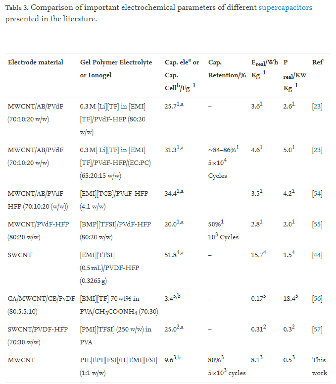  
Parameters for the Galvanostatic charge/discharge measurements:   
1: (1 mA cm−2), 2: (2.5 mA cm−2), 3: (0.5 A g−1), 4: (1.0 A g−1), 5: (100 Ag-1)* mass of one electrode.

Glossary of terms for Table 3: 表3的词汇表：

Cap. elea = capacitance of the electrodes, Cap. Cellb = capacitance of the cell (or capacitor), Cap. Retention = capacitance retention, Ereal = Energy density, Preal = Power density, MWCNT = multi-walled carbon nanotubes, AC = activated carbon, CB = carbon black, AB = Acetylene black, [BMI][Cl] = 1-butyl-3-methylimidazolium chloride, [EMI][TCB] = 1-ethyl-3-methylimidazolium tetracyanoborate, [EMI][TFSI] = 1-ethyl-3-methylimidazolium bis(trifluoromethanesulfoly) amide, [BMI][TF] = 1-butyl-3-methylimidazolium trifluoromethanesulfonate, [BMP][TFSI] = 1-butyl-1-methyl pyrrolidinium bis(trifluoromethane sulfonyl)imide PVA= Poly(vinyl alcohol), PVdF = poly(vinylidene fluoride), HFP = hexafluoropropylene, CH3COONH4 = ammonium acetate.  
帽。 elea =电极电容，Cap。 Cellb =电池（或电容器）的电容，Cap。保留=电容保留，Ereal =能量密度，Preal =功率密度，MWCNT =多壁碳纳米管，AC =活性炭，CB =炭黑，AB =乙炔黑，[BMI] [Cl] = 1-丁基-3 -氯甲基咪唑鎓，[EMI] [TCB] = 1-乙基-3-甲基咪唑四氰基硼酸酯，[EMI] [TFSI] = 1-乙基-3-甲基咪唑鎓双（三氟甲磺酰基）酰胺，[BMI] [TF] = 1-丁基-3-甲基咪唑三氟甲磺酸盐，[BMP] [TFSI] = 1-丁基-1-甲基吡咯烷鎓双（三氟甲烷磺酰基）酰亚胺PVA =聚乙烯醇，PVdF =聚偏二氟乙烯，HFP =六氟丙烯，CH3COONH4 =铵醋酸。

### 4. Conclusions
We have presented methods of preparing new solid-state gel polymer electrolytes with adhesive properties by using a synthesized poly(ionic liquid): 1-vinyl-3-propylimidazolium bis(fluorosulfonyl) imide (poly(VPIFSI)) and a commercial ionic liquid: (1-ethyl-3-methylimidazolium bis(fluorosulfonyl) imide (EMIFSI). The prepared PIL/IL-GPEs are promising electrolytes for the construction of solid state flexible supercapacitors with good cyclability and safety features. A suitable combination of PIL matrix and IL liquid phase resulted in the synthesis of an adhesive GPE with a high ionic conductivity at ambient temperature. The solid state flexible supercapacitor prepared with the PIL/IL GPE and 50 wt% of IL showed an improved rate capability and cyclability with no significant changes in the Csp, Ereal, and Preal of the cell when this was subjected to folding.  
我们介绍了通过使用合成的聚（离子液体）制备具有粘合性能的新型固态凝胶聚合物电解质的方法：1-乙烯基-3-丙基咪唑双（氟磺酰基）酰亚胺（聚（VPIFSI））和市售离子液体： （1-乙基-3-甲基咪唑鎓双（氟磺酰基）酰亚胺（EMIFSI）。制备的PIL/IL-GPEs是用于制造具有良好循环性和安全性的固态柔性超级电容器的有前途的电解质。PIL基质和IL的合适组合液相合成了在室温下具有高离子电导率的胶粘GPE，用PIL/IL GPE和50％wt IL制备的固态柔性超级电容器的速率能力和可循环性均得到了改善，而PIL/IL GPE却没有明显变化。折叠时的Csp，Ereal和Preal。