## A review of electrolyte materials and compositions for electrochemical supercapacitors

> Chem. Soc. Rev., 2015, 44, 7484-7539
> [doi.org/10.1039/C5CS00303B](doi.org/10.1039/C5CS00303B)
> Key Words: Supercapacitor, Energy, Storage, Pseudo-supercapacitor, Hybrid-supercapacitor, Lithium

### Highlights

### Abstract
Electrolytes have been identified as some of the most influential components in the performance of electrochemical supercapacitors (ESs), which include: electrical double-layer capacitors, pseudocapacitors and hybrid supercapacitors. This paper reviews recent progress in the research and development of ES electrolytes. The electrolytes are classified into several categories, including: aqueous, organic, ionic liquids, solid-state or quasi-solid-state, as well as redox-active electrolytes. Effects of electrolyte properties on ES performance are discussed in detail. The principles and methods of designing and optimizing electrolytes for ES performance and application are highlighted through a comprehensive analysis of the literature. Interaction among the electrolytes, electro-active materials and inactive components (current collectors, binders, and separators) is discussed. The challenges in producing high-performing electrolytes are analyzed. Several possible research directions to overcome these challenges are proposed for future efforts, with the main aim of improving ESs' energy density without sacrificing existing advantages (e.g., a high power density and a long cycle-life) (507 references).  
电解质已被确定为电化学超级电容器（ES）性能中的一些最有影响的组件，其包括：电双层电容器，赝电容器和混合超级电容器。本文综述了ES电解质研究和开发的最新进展。电解质分为几类，包括：水溶液，有机溶剂，离子液体，固态或准固态，以及氧化还原活性电解质。详细讨论了电解质性能对ES性能的影响。通过对文献的综合分析，突出了设计和优化电解质用于ES性能和应用的原理和方法。讨论了电解质，电活性材料和非活性组分（集电器，粘合剂和分离器）之间的相互作用。分析了生产高性能电解质的挑战。为了未来的努力，提出了克服这些挑战的几种可能的研究方向，其主要目的是在不牺牲现有优点（例如，高功率密度和长循环寿命）的情况下提高ES的能量密度（507参考）。

### 1. Introduction
A significant worldwide increase in the consumption of fossil fuels, resulting from the rapid growth of the global economy, produces two major associated issues. The first is the accelerating depletion/exhaustion of existing fossil fuel reserves and the second is the affiliated environmental problems e.g., increasing greenhouse gas emissions and general air and water pollution. Taken together these items constitute the basis of an urgent, worldwide concern about the future, sustainable development and health of our society's ecosystem. The need to develop and scale up sustainable, clean energy sources and their associated technologies is recognized worldwide as an urgent priority. Most renewable clean energy sources are highly dependent on the time of day and regional weather conditions. Development of related energy conversion and energy storage devices is therefore required in order to effectively harvest these intermittent energy sources. In this regard, batteries, electrochemical supercapacitors (ESs) and fuel cells are all recognized as three kinds of the most important electrochemical energy storage/conversion devices.  
由于全球经济的快速增长，全球范围内化石燃料消耗量的显着增加产生了两个主要的相关问题。第一个是现有化石燃料储备的加速消耗/耗尽，第二个是附属的环境问题，例如增加温室气体排放和一般的空气和水污染。将这些项目结合在一起构成了全世界对我们社会生态系统的未来，可持续发展和健康的紧迫关注的基础。发展和扩大可持续清洁能源及其相关技术的需求在全世界被公认为当务之急。大多数可再生清洁能源高度依赖于一天中的时间和区域天气条件。因此，需要开发相关的能量转换和能量存储装置，以便有效地收获这些间歇能源。在这方面，电池，电化学超级电容器（ES）和燃料电池都被认为是三种最重要的电化学能量存储/转换装置。

The ES, also known as a supercapacitor or an ultracapacitor, has attracted considerable interest in both academia and industry because it has some distinct advantages such as higher power density induced by a fast charging/discharging rate (in seconds) and a long cycle life (>100[thin space (1/6-em)]000 cycles) when compared to batteries and fuel cells.1 Depending on the charge storage mechanism, ESs can be briefly classified as electrochemical double-layer capacitors (EDLCs), pseudocapacitors and hybrid-capacitors. Compared to both pseudocapacitors and hybrid-capacitors, EDLCs constitute the majority of currently available commercial ESs, mainly due to their technical maturity.  
ES，也被称为超级电容器或超级电容器，在学术界和工业界引起了相当大的兴趣，因为它具有一些明显的优点，例如由快速充电/放电速率（以秒为单位）和长循环寿命引起的更高功率密度（与电池和燃料电池相比，> 100 [薄空间（1/6-em）] 000次循环.1。根据电荷存储机制，ES可简称为电化学双层电容器（EDLC），赝电容器和混合电容器-capacitors。与赝电容器和混合电容器相比，EDLC构成了目前可用的商用ES的大部分，主要是由于它们的技术成熟度。

In an evaluation of electrochemical energy devices, besides the cycle-life (or lifetime), both their energy density and power density are the two most important properties. The relationship between these two important properties can be expressed by the Ragone plot. Fig. 1 shows the Ragone plots for several typical electrochemical energy storage devices.2 It can be clearly seen from these Ragone plots that supercapacitors are currently located between the conventional dielectric capacitors and batteries/fuel cells. Despite the much lower energy density compared to the batteries/fuel cells, ESs can have much higher power densities. This makes them promising for applications in current stabilization when accessing intermittent renewable energy sources. In addition, ESs have also attracted considerable interest in a wide variety of applications requiring high power density, such as portable electronics, electric or hybrid electric vehicles, aircraft and smart grids. For example, in the case of both hybrid and electric vehicles including fuel cell ones, ESs could provide high power density for short-term acceleration and recovery of energy during braking, thus saving energy and protecting the batteries from the high-frequency rapid discharging and charging process (dynamic operation).  
在电化学能量装置的评估中，除了循环寿命（或寿命）之外，它们的能量密度和功率密度都是两个最重要的特性。这两个重要属性之间的关系可以用Ragone图表示。图1显示了几种典型电化学储能装置的Ragone图.2从这些Ragone图可以清楚地看出，超级电容器目前位于传统的介电电容器和电池/燃料电池之间。尽管与电池/燃料电池相比能量密度低得多，但ES可以具有更高的功率密度。这使得它们在访问间歇性可再生能源时有望应用于当前的稳定化。此外，ES还引起了对需要高功率密度的各种应用的极大兴趣，例如便携式电子设备，电动或混合动力电动车辆，飞机和智能电网。例如，在包括燃料电池的混合动力和电动车辆的情况下，ES可以为制动期间的短期加速和能量回收提供高功率密度，从而节省能量并保护电池免受高频快速放电和充电过程（动态操作）。

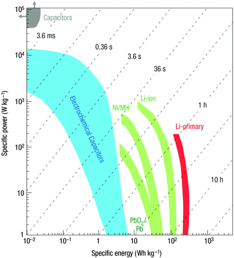
Fig. 1 Ragone plots for representative energy storage devices of capacitors, batteries, and supercapacitors. Reprinted by permission from Macmillan Publishers Ltd: Nature Materials (ref. 2), copyright 2008.  
图1电容器，电池和超级电容器的代表性储能装置的Ragone图。经Macmillan Publishers Ltd许可转载：Nature Materials（参考文献2），版权所有2008。

However, the major challenge for ESs, when compared to both batteries and fuel cells, is their insufficient energy density (for example, EDLCs commonly have an energy density of <10 W h kg−1; even for both pseudocapacitors and hybrid-capacitors, their energy densities are generally less than 50 W h kg−1),1 which cannot fully meet the growing demand of the applications where high energy density is required. To overcome this challenge, extensive work has been devoted to increase the energy density of ESs,3,4 in order to widen their application scope. Since the energy density (E) of ESs is proportional to the capacitance (C) and the square of the voltage (V), that is: E = ½CV2, increasing either or both of the capacitance and the cell voltage is an effective way to increase the energy density. This can be achieved through the development of electrode materials with high capacitance, electrolytes (electrolyte salt + solvent) with wide potential windows, and integrated systems with a new and optimized structure. To date, these developments can be briefly summarized as follows: (1) increasing the specific capacitance of carbon-based electrodes through the development of a novel carbon structure with a highly effective specific surface area and a high packing density;5 (2) developing pseudocapacitors based on pseudocapacitive materials (e.g., some electroactive transition-metal oxides and conducting polymers) with high specific capacitance contributed from the pseudo-capacitance;6 (3) enlarging the cell voltage via the development of a new electrolyte; and (4) exploring ESs with novel structures or new concepts, such as the hybrid (or asymmetric) capacitors, especially the lithium ion capacitors (LICs).3 Note that these developments are all closely related to each other. Although it is relatively simple to fabricate the individual components (e.g., electrode materials, electrolytes and structures) of the ESs, their interaction must be considered to promote the synergistic effect. For example, design and preparation of the porous carbon electrode materials should consider the matching between the pore structure and the size of the electrolyte ions in order to make a high capacitive electrode.7 The development of some electrolytes should consider their possible interaction with the electrode materials such as in the case of hybrid capacitors.  
然而，与电池和燃料电池相比，ES的主要挑战是它们的能量密度不足（例如，EDLC通常具有<10 W h kg-1的能量密度;即使对于赝电容器和混合电容器，它们的能量密度通常小于50 W h kg-1），1这不能完全满足需要高能量密度的应用的不断增长的需求。为了克服这一挑战，为了扩大其应用范围，已经开展了大量工作来提高ES的能量密度3,4。*由于ES的能量密度（E）与电容（C）和电压的平方（V）成正比，即：E =½CV2，增加电容和电池电压之一或两者是一种有效的方法。增加能量密度。这可以通过开发具有高电容的电极材料，具有宽电位窗的电解质（电解质盐+溶剂）以及具有新的和优化结构的集成系统来实现。迄今为止，这些发展可简述如下：（1）通过开发具有高效比表面积和高填充密度的新型碳结构来增加碳基电极的比电容; 5（2）开发基于赝电容材料的赝电容器（例如，一些电活性过渡金属氧化物和导电聚合物）具有高比电容，由伪电容贡献; 6（3）通过开发新电解质扩大电池电压; （4）探索具有新颖结构或新概念的ES，例如混合（或非对称）电容器，尤其是锂离子电容器（LIC）.3请注意，这些发展都是彼此密切相关的。尽管制造ES的各个组分（例如，电极材料，电解质和结构）相对简单，但必须考虑它们的相互作用以促进协同效应。例如，多孔碳电极材料的设计和制备应考虑孔结构与电解质离子尺寸之间的匹配，以制造高电容电极.7一些电解质的开发应考虑它们与电极的可能相互作用材料，例如混合电容器。*

Regarding the development of ES electrolytes, widening the potential window of an electrolyte solution, that is, enlarging the cell voltage (V), can effectively increase the energy density as seen from the equation of E = ½CV2. It is worth noticing that increasing the cell voltage would be more efficient than increasing the electrode capacitance in terms of energy density improvement. This is because the energy density is proportional to the square of the cell voltage. Therefore, developing new electrolytes/solutions with wide potential windows should be given even higher priority efforts than the development of new electrode materials.  
关于ES电解质的开发，*扩大电解质溶液的电位窗口，即，扩大电池电压（V），可以有效地增加能量密度*，如从E = 1 /2CV2的等式所看到的。值得注意的是，就能量密度改善而言，增加电池电压比增加电极电容更有效。这是因为能量密度与电池电压的平方成比例。因此，开发具有宽电位窗的新电解质/溶液应该比开发新电极材料更优先。

As discussed above, the operating cell voltage of the ESs is largely dependent on the electrochemical stable potential window (ESPW) of the electrolytes if the electrode materials are stable within the working voltage range. For example, aqueous electrolyte-based ESs usually have an operating potential window of about 1.0–1.3 V because the aqueous electrolyte's potential window is about 1.23 V (the potential window of H2/O2 evolution reactions at 1.0 atm and room temperature), while the organic electrolyte-based and ionic liquid (IL) based ESs generally have potential windows of 2.5–2.7 and 3.5–4.0 V, respectively. In addition to the determining role of the operating voltage window in ES energy density, electrolytes/solutions also play a critical role in establishing other important properties such as the power density, internal resistance, rate performance, operating temperature range, cycling lifetime, self-discharge and toxicity (as seen in Fig. 2), which are also important in the practical use of ESs.  
如上所述，如果电极材料在工作电压范围内稳定，则ES的操作电池电压很大程度上取决于电解质的电化学稳定电位窗口（ESPW）。例如，基于含水电解质的ES通常具有约1.0-1.3V的操作电位窗口，因为含水电解质的电位窗口为约1.23V（在1.0atm和室温下H2 /O2析出反应的潜在窗口），而基于有机电解质和基于离子液体（IL）的ES通常具有2.5-2.7和3.5-4.0V的潜在窗口。除了确定工作电压窗口在ES能量密度中的作用外，电解质/溶液在建立其他重要特性（如功率密度，内阻，速率性能，工作温度范围，循环寿命，自身）方面也发挥着关键作用。放电和毒性（如图2所示），这在ES的实际应用中也很重要。

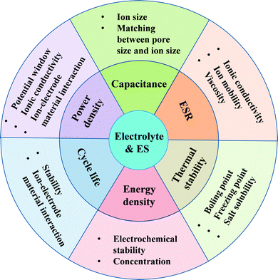
Fig. 2 Effects of the electrolyte on the ES performance.

Besides the property of the electrolyte potential window, the interaction between the electrolyte and the electrode materials also plays an important role in the ES performance. For instance, the matching between the electrolyte ion size and the pore size of carbon electrode material has a profound influence on the achievable specific capacitance. The pseudocapacitances from the carbon-based materials and transition metal oxides are also strongly dependent on the nature of the electrolytes.8 The ionic conductivity of electrolytes plays a significant role in the internal resistance of ESs especially for organic and IL electrolytes. The viscosity, boiling point and freezing point of the electrolytes can also largely affect the thermal stability and thereby the operating temperature range of ESs. As identified, the aging and failure of ESs are also related to the electrochemical decomposition of the electrolytes. Interestingly, the development of some new types of ESs such as flexible or solid-state ESs and micro-ESs also relies heavily on new electrolytes (e.g., solid-state electrolytes).  
除了电解质电位窗的性质之外，电解质和电极材料之间的相互作用也在ES性能中起重要作用。例如，电解质离子尺寸与碳电极材料的孔径之间的匹配对可实现的比电容具有深远的影响。来自碳基材料和过渡金属氧化物的赝电容也强烈依赖于电解质的性质.8电解质的离子电导率在ES的内阻中起重要作用，特别是对于有机电解质和IL电解质。电解质的粘度，沸点和凝固点也可以在很大程度上影响热稳定性，从而影响ES的操作温度范围。如所确定的，ES的老化和失效也与电解质的电化学分解有关。有趣的是，一些新型ES（例如柔性或固态ES和微型ES）的开发也严重依赖于新的电解质（例如，固态电解质）。

With respect to the development of ES electrolytes, a large variety of electrolytes, such as aqueous electrolytes, organic electrolytes, IL electrolytes, redox-type electrolytes and solid or semi-solid electrolytes have been explored and great progress has been made during the past several decades. For example, the operating potential window of aqueous electrolyte-based ESs has been reported to be greatly increased to about 2 V by using neutral aqueous electrolytes.9 A wide variety of new organic electrolytes with wider operating potential windows and less toxicities when compared to the commercial organic electrolytes have been developed for ESs. With the development of IL electrolytes, the operating cell voltage of the corresponding ESs was further increased to 4 V although they suffered from low ionic conductivity and high viscosity.10 Furthermore, the exploration for solid or semi-solid electrolytes has led to the invention of flexible or solid-state ESs which are claimed to have no potential leakage issue like the liquid electrolyte-based ESs.11,12 Recently, redox-type electrolytes have also been suggested as electrolytes for ESs due to the additional pseudocapacitance contribution from the redox reaction of the electrolyte at the electrode/electrolyte interface.13  
关于ES电解质的开发，已经探索了各种各样的电解质，例如含水电解质，有机电解质，IL电解质，氧化还原型电解质和固体或半固体电解质，并且在过去的几个中已经取得了很大进展。几十年。例如，据报道，使用中性含水电解质，基于水性电解质的ES的操作电位窗口大大增加到约2V。与各种有机电解质相比，各种新型有机电解质具有更宽的操作电位窗口和更低的毒性。已经为ES开发了商业有机电解质。随着IL电解质的发展，相应ES的操作电池电压进一步增加到4V，尽管它们具有低离子电导率和高粘度。此外，对固体或半固体电解质的探索已导致发明柔性或固态ES据称没有像液体电解质基ES那样的潜在泄漏问题.11,12最近，氧化还原型电解质也被认为是ES的电解质，因为氧化还原反应带来了额外的赝电容。电极/电解质界面处的电解质

In general, the requirements for an ideal electrolyte are as follows: (1) a wide potential window; (2) a high ionic conductivity; (3) a high chemical and electrochemical stability; (4) high chemical and electrochemical inertness to ES components (e.g., electrodes, current collectors and packaging); (5) a wide operating temperature range; (6) well-matched with the electrolyte materials; (7) a low volatility and flammability; (8) environmentally friendly; and (9) a low cost. Actually, it is very difficult for an electrolyte to meet all of these requirements, and each electrolyte has its own advantages and shortcomings. This has motivated tremendous research to improve the overall performance of electrolytes and their associated ESs.  
*通常，对理想电解质的要求如下：（1）宽电位窗; （2）高离子电导率; （3）化学和电化学稳定性高; （4）对ES组件（例如电极，集电器和包装）的高化学和电化学惰性; （5）工作温度范围宽; （6）与电解质材料匹配良好; （7）低挥发性和易燃性; （8）环保; （9）成本低。*实际上，电解质很难满足所有这些要求，并且每种电解质都有其自身的优点和缺点。这促进了大量研究，以改善电解质及其相关ES的整体性能。

While there have been many excellent reviews concerning electrode materials,6,14–19 reviews focusing on the electrolytes of ESs are rather limited.10–12,15,20,21 Although several excellent reviews concerning solid polymer electrolytes for ESs have been made previously,11,12,20,21 it is believed that a review covering the latest achievements in this field and providing an insight into the electrolyte development is still necessary. In this review, the first section will give the general performance metrics of ESs and their relationship with electrolytes. This is followed by a comprehensive overview of all kinds of ES electrolytes/solutions, their performance comparisons, and the interactions between electrolytes and electrode materials. The effects of electrolytes on the ES performance will be highlighted to aid the understanding of the performance-affecting factors in design and optimization of electrolytes. Furthermore, the interplay between electrolytes and inactive components of ESs (such as current collectors, binders, and separators) is also discussed. In the final section, the major challenges and perspectives in ES electrolyte/solution research and development are documented and possible research directions in overcoming the challenges are proposed to facilitate efforts in this area.  
虽然有很多关于电极材料的优秀评论，但是关于ES电解质的6,14-19评论相当有限.10-12,15,20,21尽管以前已经对ES的固体聚合物电解质进行了几次优秀评论，11,12,20,21，据信仍需要进行一项涵盖该领域最新成果并提供电解质开发的见解的评论。在本综述中，第一部分将给出ES的一般性能指标及其与电解质的关系。接下来是对各种ES电解质/溶液的综合概述，它们的性能比较以及电解质和电极材料之间的相互作用。将强调电解质对ES性能的影响，以帮助理解影响电解质设计和优化的性能因素。此外，还讨论了电解质和ES的非活性组分（例如集电器，粘合剂和分离器）之间的相互作用。在最后一节中，记录了ES电解质/溶液研究和开发的主要挑战和前景，并提出了克服挑战的可能研究方向，以促进该领域的工作。

### 2. Fundamentals of electrochemical supercapacitors
The fundamentals of electrochemical supercapacitors have been reviewed and discussed by many excellent reviews6,14–19 and books,22,23 which will not be discussed in detail in the present review. Basically, the ES is a special type of capacitor, which is different from the classical electrostatic capacitors (Fig. 3A). ESs can be distinguished in several ways such as the charge storage mechanism, the electrolyte, the electrode material and the cell structure. Depending on the charge storage mechanism, ESs can be classified into three categories:   
电化学超级电容器的基本原理已经过许多优秀评论6,14-19和书籍22,23的审查和讨论，本综述将不再详细讨论。基本上，ES是一种特殊类型的电容器，它与传统的静电电容器不同（图3A）。 ES可以通过几种方式区分，例如电荷存储机制，电解质，电极材料和电池结构。根据电荷存储机制，ES可分为三类：

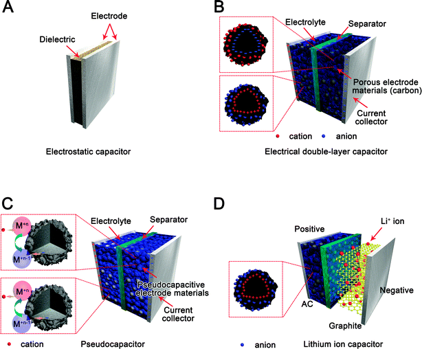
Fig. 3 Schematic diagram of (A) an electrostatic capacitor, (B) an electric double-layer capacitor, (C) a pseudocapacitor, and (D) a hybrid-capacitor.  
图3（A）静电电容器，（B）双电层电容器，（C）赝电容器和（D）混合电容器的示意图。

(1) Electric double-layer capacitors (EDLCs), where the capacitance is produced by the electrostatic charge separation at the interface between the electrode and the electrolyte (Fig. 3B). To maximize the charge storage capacity, the electrode materials are usually made from highly porous carbon materials.  
（1）双电层电容器（EDLC），其电容由电极和电解质之间界面处的静电荷分离产生（图3B）。为了最大化电荷存储容量，电极材料通常由高度多孔的碳材料制成。

(2) Pseudocapacitors, which rely on fast and reversible faradaic redox reactions to store the charges (Fig. 3C).  
（2）Pseudocapacitors，依靠快速和可逆的法拉第氧化还原反应来储存电荷（图3C）。

(3) Hybrid ESs, which refer to ones using both the electrical double-layer (EDL) and faradaic mechanisms to store charges. With the latest developments in this area, some new battery-type hybrid devices, such as LIC (Fig. 3D) and carbon//PbO2, have been developed. These devices are regarded as hybrid ESs since they have one EDL or pseudocapacitive electrode combined with the other rechargeable battery-type electrode. The hybrid ESs reviewed in this paper include: (a) those based on composite electrodes made from both EDL capacitive materials and pseudocapacitive materials; (b) those of asymmetric design with one EDL electrode and the other pseudocapacitive or battery-type electrode; as well as, (c) those of the asymmetric structure with one pseudocapacitive electrode and the other rechargeable battery-type electrode.  
（3）混合ES，指使用电双层（EDL）和法拉第机制来存储电荷的ES。随着该领域的最新发展，已经开发出一些新的电池型混合装置，例如LIC（图3D）和碳//PbO2。这些器件被认为是混合ES，因为它们具有一个EDL或赝电容电极与另一个可充电电池型电极的组合。本文评述的混合ES包括：（a）基于由EDL电容材料和赝电容材料制成的复合电极的ES; （b）具有一个EDL电极和另一个赝电容或电池型电极的不对称设计;以及（c）具有一个赝电容电极和另一个可再充电电池型电极的不对称结构的电极。

#### 2.1. Technical specifications of electrochemical supercapacitors and their relationships with the electrolytes
- 2.1.1. Capacitance
  As shown in Fig. 3B, the entire ES can be treated as two capacitors in series since both electrode/electrolyte interfaces represent a capacitor. If the capacitances of the two electrodes are expressed as C1 and C2, respectively, the overall capacitance (CT) can be expressed as: $1/C_T = 1/C_1 + 1/C_2$  
  如图3B所示，整个ES可以被视为串联的两个电容器，因为两个电极/电解质接口都代表电容器。如果两个电极的电容分别表示为C1和C2，则总电容（CT）可表示为：$ 1 /C_T = 1 /C_1 + 1 /C_2 $

  For a symmetric ES, since C1 = C2, the total capacitance (CT) would be half of either electrode's capacitance. In the case of the asymmetric ES, CT is mainly dominated by the electrode with a smaller capacitance. To evaluate the capacitance of an electrode material, a *specific capacitance* is often used, which can be expressed either as the mass specific capacitance (sometime also called gravimetric specific capacitance) (Cs), or the volumetric capacitance (CV). Generally, Cs is the most frequently used one to characterize an electrode material, with a unit of Faraday per gram (F g−1) and can be expressed as:$ C_s = C_i/W_{cm} $  
  对于对称ES，由于C1 = C2，总电容（CT）将是任一电极电容的一半。在非对称ES的情况下，CT主要由具有较小电容的电极支配。为了评估电极材料的电容，通常使用*特定电容*，其可以表示为质量比电容（有时也称为重量特定电容）（Cs）或体积电容（CV）。通常，Cs是表征电极材料最常用的一种，单位为法拉第/克（F g-1），可表示为：$ C_s = C_i /W_ {cm} $

  where Wem is the weight of the electrode material in the electrode layer (g), and Ci is its corresponding electrode capacitance (anode or cathode) (F). A comparison between different electrode materials can be made based on their values of Cs. For an ES, its total special capacitance (CTS) should be the device's total capacitance (CT) normalized by the device's weight WTM (WTM is the sum weight of all necessary components including the anode, cathode, electrolyte solution, current collector and others), which can be expressed as:$C_{TS}=C_T/W_{TM}$  
  其中Wem是电极层（g）中电极材料的重量，Ci是其对应的电极电容（阳极或阴极）（F）。可以基于它们的Cs值来进行不同电极材料之间的比较。对于ES，其总特殊电容（CTS）应该是器件的总电容（CT），由器件的重量WTM标准化（WTM是所有必要组件的总重量，包括阳极，阴极，电解质溶液，集电器等） ，可表示为：$ C_ {TS} = C_T /W_{TM} $

  Normally, eqn (3) indicates that the weight of the electrolyte solution can have a negative effect on the ES's capacitance because it can increase the weight of the entire device. Therefore, the lighter weight and smaller volume of electrolyte solution used in the device are most desirable.  
  通常，方程（3）表明电解质溶液的重量会对ES的电容产生负面影响，因为它会增加整个器件的重量。因此，最理想的是装置中使用的较轻重量和较小体积的电解质溶液。

  It should also be noted that although Cs in eqn (2) does not contain the weight of the electrolyte, the electrolyte solution can also affect its capacitance value through affecting the capacitance of the electrode (Ci in eqn (2)). For example, if the electrolyte solution has better contact with the electrode material, the area of the double-layer will be increased, leading to a larger electrode capacitance. Therefore, developing an electrolyte which fills pore areas inside the electrode material layer well – thereby maximizing the material utilization for capacitance generation – is a critical aspect in improving the ES performance.  
  还应注意，尽管方程（2）中的Cs不包含电解质的重量，但电解质溶液也可通过影响电极的电容（方程（2）中的Ci）来影响其电容值。例如，如果电解质溶液与电极材料的接触更好，则双层的面积将增加，导致更大的电极电容。因此，开发一种能够很好地填充电极材料层内的孔区域的电解质 -从而最大化电容产生的材料利用率 -是改善ES性能的关键方面。

- 2.1.2. Energy density and power density.
  When an ES is charged, a cell voltage (V) will be built up across the two electrodes. The theoretical (or maximum) energy density of the ES cell (E), and the power density (P) can be expressed as eqn (4) and (5), respectively:18  
  当ES充电时，将在两个电极之间建立电池电压（V）。 ES单元的理论（或最大）能量密度（E）和功率密度（P）分别表示为方程（4）和（5）：18  
  $E = 1/2 C_{TS} V^2$
  $P = \frac{1}{4W_{TS} R_{cell}} V^2$

  where in eqn (5), Rcell is the equivalent series resistance (ESR) of the ES cell (Ω). The energy density (eqn (4)) generally has a unit of W h kg−1, and the power density (eqn (5)) has a unit of W kg−1.24,25 These two equations show that V, CTS, WTS, and Rcell are four important variables determining the performance of an ES. In order to improve both the energy and power densities of an ES, increasing the values of both V and CTS and simultaneously reducing the values of both WTS and Rcell are necessary. Since both energy and power densities are proportional to the square of the operating voltage, a cell voltage increase would have a greater contribution to the improvement of the ES's energy and power densities than increasing the capacitance or reducing resistance. In general, the maximum operating voltage of an ES is strongly dependent on the electrochemical stable potential window (ESPW) or the potential window of the electrolyte.  
  在等式（5）中，Rcell是ES单元（Ω）的等效串联电阻（ESR）。能量密度（eqn（4））通常具有W h kg-1的单位，并且功率密度（eqn（5））具有W kg-1.24,25的单位。这两个等式表示V，CTS，WTS和Rcell是决定ES性能的四个重要变量。为了改善ES的能量和功率密度，增加V和CTS的值并同时降低WTS和Rcell的值是必要的。由于能量和功率密度都与工作电压的平方成比例，因此与增加电容或降低电阻相比，电池电压的增加对ES的能量和功率密度的改善有更大的贡献。通常，ES的最大工作电压强烈地取决于电化学稳定电位窗（ESPW）或电解质的电位窗。

- 2.1.3. Equivalent series resistance.
  The equivalent series resistance (ESR) is an important parameter for determining the ES's power density as indicated by eqn (5), which shows that the power density increases with a decreasing ESR value. Similar to other electrochemical energy storage devices, a high ESR limits the charging/discharging rate, leading to low power density. Therefore, for some pulse power applications, the ESR value of an ES is even more important than the capacitance value. Normally, ESR is the sum of various types of resistances including intrinsic resistance of the electrode material and electrolyte solution, mass transfer resistance of the ions, and contact resistance between the current collector and the electrode.18 As identified, the resistances of the bulk electrolyte solution and the electrolyte inside the electrode layer pores tend to dominate the ESR, especially when non-aqueous electrolytes such as organic, IL and solid-state electrolytes are used in the ESs. Therefore, in order to achieve a high power density from the ES, it is necessary to use an electrolyte with high ionic conductivity. However, there is often a trade-off between the ionic conductivity and the operating potential window of the electrolytes. Aqueous electrolytes, such as H2SO4 and KOH, have high ionic conductivities, but the operating potential window is low. In contrast, although non-aqueous electrolytes, such as organic and IL, can offer the advantage of high operating voltages, their ionic conductivities are generally at least one order of magnitude lower than that of the aqueous electrolytes,26 leading to a higher ESR, and thereby limiting the power density. Therefore, for ESs to achieve both high energy and power densities, it is essential to develop electrolytes with a wide operating voltage and a small ESR (or high ion conductivity). This requirement will be the subject of a detailed discussion in Section 3.  
  等效串联电阻（ESR）是用于确定ES的功率密度的重要参数，如等式（5）所示，其表明功率密度随着ESR值的降低而增加。与其他电化学能量存储装置类似，高ESR限制了充电/放电速率，导致低功率密度。因此，对于某些脉冲功率应用，ES的ESR值甚至比电容值更重要。通常，ESR是各种类型电阻的总和，包括电极材料和电解质溶液的固有电阻，离子的传质电阻，以及集电器和电极之间的接触电阻.18如所确定的，电解质的电阻溶液和电极层孔内的电解质往往主导ESR，特别是当在ES中使用非水电解质如有机，IL和固态电解质时。因此，为了从ES获得高功率密度，必须使用具有高离子传导性的电解质。然而，通常在离子电导率和电解质的操作电位窗之间进行权衡。含水电解质，例如H 2 SO 4和KOH，具有高离子电导率，但操作电位窗口低。相反，尽管非水电解质，如有机电解质和IL，可以提供高工作电压的优势，但它们的离子电导率通常比含水电解质低至少一个数量级，26导致更高的ESR，从而限制了功率密度。因此，对于ES来实现高能量和功率密度，必须开发具有宽工作电压和小ESR（或高离子传导率）的电解质。该要求将成为第3节详细讨论的主题。

- 2.1.4. Cycle-life.
  Cycle-life, a necessary indicator of the stability of the ES, is also one of the important parameters for measuring the overall ES performance. General test procedures for stability analysis involve the electrode undergoing charge and discharge cycling in a certain electrolyte to compare the initial and final capacitance. For example, EDLCs using carbon electrodes generally have a very high cycling stability.24 However, when pseudocapacitive reactions are introduced, the cyclic stability is generally reduced due to the non-ideal electrochemical reversibility resulting from the interactions between the electrolyte ions and the electrode materials. Actually, the cycle-life of the ES depends on many factors such as the cell type, electrode material, electrolyte, charging/discharging rate and operating voltage and temperature, all of which will be discussed below.  
  循环寿命是ES稳定性的必要指标，也是衡量整体ES性能的重要参数之一。用于稳定性分析的一般测试程序涉及电极在某种电解质中经历充电和放电循环以比较初始和最终电容。例如，使用碳电极的EDLC通常具有非常高的循环稳定性。然而，当引入赝电容反应时，由于电解质离子与电极材料之间的相互作用导致的非理想的电化学可逆性，循环稳定性通常会降低。 。实际上，ES的循环寿命取决于许多因素，例如电池类型，电极材料，电解质，充电/放电速率以及工作电压和温度，所有这些将在下面讨论。  

- 2.1.5. Self-discharge rate.
  Another issue concerning the ES performance is self-discharge rates, which are related to potential losses of a charged electrode over a period of storage time.27,28 During the self-discharge process, current leakage leads to a decrease of the cell voltage, which in turn may limit the use of ESs for some applications requiring a fixed amount of energy retention for a relatively long time. Several mechanisms have been identified to explain the potential change during the self-discharge process.22 As will be discussed more completely later, the ES self-discharge rate and its mechanism are dependent on the type of electrolyte, its impurities and residual gases.  
  关于ES性能的另一个问题是自放电率，它与存储时间内带电电极的潜在损耗有关.27,28在自放电过程中，电流泄漏会导致电池电压降低，这反过来可能限制ES的使用，用于需要相对长时间的固定量的能量保持的一些应用。已经确定了几种机制来解释自放电过程中的潜在变化.22正如后面将要更全面地讨论的那样，ES自放电率及其机理取决于电解质的类型，其杂质和残余气体。

- 2.1.6. Thermal stability.
  Most potential applications for ESs occur in the temperature range of −30 to 70 °C,4 therefore expanding the current working temperature range of ESs can further widen the scope of applications. For example, most electronics related to space avionics applications are required to operate at temperatures as low as −55 °C.4 Fuel cell vehicles, on the other hand, may require a high working temperature for ESs. The application of working temperature can affect several properties of ESs such as the energy and power densities, rate performance, ESR, cycle life and self-discharge rate. In particular, the temperature-dependent performance of ESs is strongly dependent on the nature of the electrolyte such as the concentration and the type of conducting salt, and the specific properties of the solvent (e.g., freezing point, boiling point and viscosity). This subject will be discussed in greater detail for specific electrolytes throughout this review.  
  ES的大多数潜在应用发生在-30至70°C的温度范围内，因此扩展ES的当前工作温度范围可以进一步扩大应用范围。例如，大多数与空间航空电子设备应用相关的电子设备都需要在低至-55°C的温度下运行。另一方面，燃料电池车辆可能需要ES的高工作温度。工作温度的应用会影响ES的几个性质，如能量和功率密度，速率性能，ESR，循环寿命和自放电率。特别地，ES的温度依赖性能强烈地取决于电解质的性质，例如导电盐的浓度和类型，以及溶剂的特定性质（例如，凝固点，沸点和粘度）。在整个评论中将针对特定电解质更详细地讨论该主题。

In summary, based on the above comments, it can be seen that the primary characteristics of ESs are strongly dependent on the specific electrolytes employed.  
总之，基于上述评论，可以看出ES的主要特征强烈依赖于所用的特定电解质。

The following sections provide a focussed overview of recent developments concerning many different kinds of electrolytes and their associated ESs, used in a wide variety of applications.  
以下部分集中概述了许多不同类型电解质及其相关ES的最新发展，用于各种应用。

### 3. Electrolytes (materials and compositions) for electrochemical supercapacitors
The electrolyte, meaning the electrolyte salt + solvent, is one of the key components of ESs, providing ionic conductivity and thus facilitating charge compensation on each electrode in the cell. The electrolyte within an ES not only plays a fundamental role in the EDL formation (in EDLCs) and the reversible redox process for the charge storage (in pseudocapacitors) but also determines the ES performance (Fig. 2). Currently, the majority of commercial ESs use organic electrolytes with a cell voltage of 2.5–2.8 V.25 Most organic electrolyte-based ESs use the acetonitrile (ACN) solvent while others employ the propylene carbonate (PC) solvent.  
电解质，即电解质盐+溶剂，是ES的关键组分之一，提供离子传导性，从而促进电池中每个电极的电荷补偿。 ES中的电解质不仅在EDL形成（在EDLC中）和用于电荷存储的可逆氧化还原过程（在赝电容器中）中起基本作用，而且还决定ES性能（图2）。目前，大多数商用ES使用电池电压为2.5-2.8 V的有机电解质.25大多数基于有机电解质的ES使用乙腈（ACN）溶剂，而其他ES使用碳酸亚丙酯（PC）溶剂。

The electrolyte nature, including: (a) the ion type and size; (b) the ion concentration and solvent; (c) the interaction between the ion and the solvent; (d) the interaction between the electrolyte and the electrode materials; and (e) the potential window, all have an influence on the EDL capacitance and pseudocapacitance, the energy/power densities as well as the ES cycle-life. For example, the electrochemical stable potential window (ESPW) of the electrolyte directly determines the ES's operational cell voltage, through which both the energy and power densities are affected (eqn (4) and (5)). The ESR of an ES is directly related to the electrolyte's ion conductivity and can have a strong effect on the power density. Furthermore, the interactions between the ion and the solvent, and between the electrolyte and the electrode material can affect the life-time and self-discharge of ESs.  
电解质性质包括：（a）离子类型和尺寸; （b）离子浓度和溶剂; （c）离子与溶剂之间的相互作用; （d）电解质与电极材料之间的相互作用; （e）电位窗，都对EDL电容和赝电容，能量/功率密度以及ES循环寿命产生影响。例如，电解质的电化学稳定电位窗（ESPW）直接决定了ES的工作电池电压，通过该电压，能量和功率密度都受到影响（方程（4）和（5））。 ES的ESR与电解质的离子电导率直接相关，并且可以对功率密度产生强烈影响。此外，离子和溶剂之间以及电解质和电极材料之间的相互作用可以影响ES的寿命和自放电。

In general, various types of electrolytes have been developed and reported in the literature to date. As shown in Fig. 4, these electrolytes are mainly classified as liquid electrolytes and solid/quasi-solid-state electrolytes.  
通常，迄今为止已在文献中开发并报道了各种类型的电解质。如图4所示，这些电解质主要分类为液体电解质和固态/准固态电解质。

Fig. 4 Classification of electrolytes for electrochemical supercapacitors.

In general, liquid electrolytes can be further grouped into aqueous electrolytes, organic electrolytes and ionic liquids (ILs), while solid or quasi-solid state electrolytes can be broadly divided into organic electrolytes and inorganic electrolytes. To date, there has been no perfect electrolyte developed, meeting all the requirements discussed previously. Each electrolyte has its own advantages and disadvantages. For example, ESs using aqueous electrolytes possess both high conductivity and capacitance, but their working voltage is limited by the narrow decomposition voltage of aqueous electrolytes. Although organic electrolytes and ILs can operate at higher voltages, they normally suffer from much lower ionic conductivity. Solid-state electrolytes may avoid the potential leakage problem of the liquid electrolytes, but they also suffer from low conductivity. To overcome the drawbacks of targeted electrolytes, extensive efforts have been devoted to exploring new electrolyte materials to improve the overall ES performance. In this regard, several different approaches have been undertaken, including: (1) development of new and high-performing electrolytes to make a wider operating potential window, higher ionic conductivity/viscosity, a wider working temperature range, and so on; (2) exploration of the positive effects of given electrolytes on the ES properties such as capacitance, energy and power densities, thermal stability and the self-discharging process; and (3) establishing a fundamental understanding of the effect of the electrolyte on the ES performance through advanced experimental, modeling and simulation methods.  
通常，液体电解质可以进一步分为含水电解质，有机电解质和离子液体（IL），而固态或准固态电解质可以大致分为有机电解质和无机电解质。迄今为止，还没有开发出完美的电解质，满足了之前讨论的所有要求。每种电解质都有其优点和缺点。例如，使用含水电解质的ES具有高导电率和电容，但它们的工作电压受到含水电解质的窄分解电压的限制。尽管有机电解质和IL可以在更高的电压下操作，但它们通常具有低得多的离子电导率。固态电解质可以避免液体电解质的潜在泄漏问题，但是它们也具有低导电性。为了克服目标电解质的缺点，已经进行了大量努力来探索新的电解质材料以改善整体ES性能。在这方面，已经采取了几种不同的方法，包括：（1）开发新的和高性能的电解质以形成更宽的操作电位窗口，更高的离子电导率/粘度，更宽的工作温度范围等等; （2）探讨给定电解质对ES性能的积极影响，如电容，能量和功率密度，热稳定性和自放电过程; （3）通过先进的实验，建模和模拟方法，建立对电解质对ES性能影响的基本认识。

#### 3.1. Aqueous electrolytes
Generally, in consideration of energy density, aqueous electrolytes are a low choice for commercial ES products due to their narrow voltage windows. This may be one of the major reasons why most commercial ESs use organic electrolytes instead of aqueous electrolytes. However, aqueous electrolytes have been used extensively in research and development in the literature reported from 1997 to 2014 (Fig. 5B). For example, in 2014, about 84.8% of the published literature employed aqueous electrolytes for ESs. This is mainly due to the fact that aqueous electrolytes are inexpensive and can be easily handled in the laboratory without needing special conditions thus greatly simplifying the fabrication and assembly processes. Organic electrolytes and ILs, on the other hand, generally require complicated purification procedures under a strictly controlled atmosphere to avoid introduction of moisture.   
通常，考虑到能量密度，含水电解质由于其窄电压窗口而成为商业ES产品的低选择。这可能是大多数商业ES使用有机电解质代替含水电解质的主要原因之一。然而，在1997年至2014年报道的文献中，含水电解质已广泛用于研究和开发（图5B）。例如，在2014年，约84.8％的已发表文献使用ES的含水电解质。这主要是因为含水电解质价格低廉并且可以在实验室中容易地处理而不需要特殊条件，因此大大简化了制造和组装过程。另一方面，有机电解质和IL通常需要在严格控制的气氛下进行复杂的纯化程序以避免引入水分。

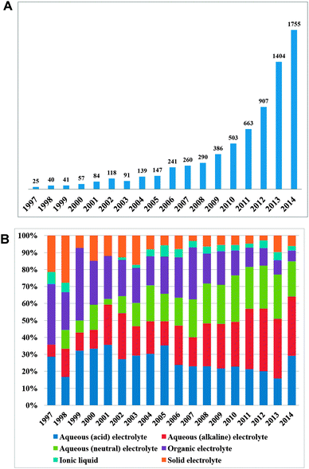
Fig. 5 (A) Total number of reported literature related to electrochemical supercapacitors from 1997 to 2014, (B) percentage of different electrolytes from 1997 to 2014. Search formulation for ESs: (“Electrochemical capacitor*” or “supercapacitor*” or “ultracapacitor*” or “pseudocapacitor*” or “double layer capacitor*”); search from Web of Science; search time: 28, Feb, 2015.  
Fig. 5 (A) Total number of reported literature related to electrochemical supercapacitors from 1997 to 2014, (B) percentage of different electrolytes from 1997 to 2014. Search formulation for ESs: (“Electrochemical capacitor*” or “supercapacitor*” or “ultracapacitor*” or “pseudocapacitor*” or “double layer capacitor*”); search from Web of Science; search time: 28, Feb, 2015.  
图5（A）1997年至2014年与电化学超级电容器有关的报告文献总数，（B）1997年至2014年不同电解质的百分比.ES的搜索公式:(“电化学电容器*”或“超级电容器*”或“超级电容器*“或”赝电容器*“或”双层电容器*“）;从Web of Science搜索;搜索时间：2015年2月28日。

Normally, aqueous electrolytes exhibit high conductivity (for example, about 0.8 S cm−2 for 1 M H2SO4 at 25 °C), which is at least one order of magnitude higher than that of organic and IL electrolytes.29 This is beneficial for lowering the ESR, leading to a better power delivery of ESs. The selection criteria for aqueous electrolytes generally consider the sizes of bare and hydrated cations and anions and the mobility of ions (Table 1), which affects not only the ionic conductivity but also the specific capacitance value. In addition, an electrolyte's ESPW and the corrosive degree should also be taken into account.  
通常，含水电解质具有高导电性（例如，对于1M H 2 SO 4在25°C时约为0.8 S cm-2），这比有机电解质和IL电解质高至少一个数量级.29这有利于降低ESR，导致更好的ES供电。含水电解质的选择标准通常考虑裸露和水合阳离子和阴离子的尺寸以及离子的迁移率（表1），其不仅影响离子电导率而且影响比电容值。此外，还应考虑电解液的ESPW和腐蚀程度。

Table 1 The sizes of bare and hydrated ions, and ionic conductivity values  
Ion	| Bare ion size (Å)	| Hydrated ion size (Å)	| Ionic conductivity ($S·cm^2 mol^{−1}$)
:-|-:|-:|-:
H+	| 1.15b	| 2.80b | 350.1a
Li+	| 0.60c	| 3.82b,c | 38.69a
Na+	| 0.95c	| 3.58b,c | 50.11a
K+	| 1.33c	| 3.31b,c | 73.5a
NH4+ | 1.48b,c | 3.31b,c | 73.7a
Mg2+ | 0.72a,b | 4.28b,c | 106.12a
Ca2+ | 1.00b | 4.12b,c | 119a
Ba2+ | 1.35c | 4.04c | 127.8a
Cl− | 1.81a,c | 3.32b,c | 76.31a
NO3− | 2.64c | 3.35c | 71.42a
SO42− | 2.90c | 3.79c | 160.0a
OH− | 1.76c | 3.00b,c | 198a
ClO4− | 2.92c | 3.38c | 67.3a
PO43− | 2.23d | 3.39d | 207a
CO32− | 2.66c | 3.94c | 138.6a

a Source from ref. 30.  b Source from ref. 31.  c Source from ref. 32.  d Source from ref. 33.

In general, aqueous electrolytes can be grouped into acid, alkaline, and neutral solutions in which H2SO4, KOH and Na2SO4 are representatives and also the most frequently used electrolytes (Fig. 4). As previously mentioned, the main disadvantage of aqueous electrolytes is their relatively narrow ESPW, restricted by the decomposition of water. For example, hydrogen evolution occurs at a negative electrode potential of around 0 V vs. SHE, and oxygen evolution at a positive electrode potential of around 1.23 V, the resulting ES has a cell voltage about of 1.23 V.23 The gas evolution would potentially cause the rupture of the ES cells, threatening the safety and decreasing the performance. To avoid the gas evolution, the cell voltage of ESs with aqueous electrolytes is commonly restricted to about 1.0 V. Table 2 lists the typical aqueous electrolyte-based ESs and their performance. It can be seen that for acid and alkaline electrolytes, the cell voltages are all limited within 1.3 V no matter what electrode material is used. For neutral electrolytes, the highest cell voltage reported in Table 2 is 2.2 V.9 Besides, the operating temperature range of ESs with aqueous electrolytes has also to be restricted to above the water freezing point and below the boiling point.  
通常，含水电解质可分为酸性，碱性和中性溶液，其中H2SO4，KOH和Na2SO4是代表性的，也是最常用的电解质（图4）。如前所述，含水电解质的主要缺点是它们相对狭窄的ESPW，受到水分解的限制。例如，氢气释放发生在约0V对SHE的负电极电位，并且正电极电位为约1.23V时的氧气释放，所得ES具有约1.23V的电池电压.23气体释放可能导致ES细胞破裂，威胁安全并降低性能。为了避免气体逸出，具有含水电解质的ES的电池电压通常限制在约1.0V。表2列出了典型的基于电解质的水性ES及其性能。可以看出，对于酸性和碱性电解质，无论使用何种电极材料，电池电压都限制在1.3V以内。对于中性电解质，表2中报告的最高电池电压为2.2 V.9。此外，含水电解质的ES的工作温度范围也必须限制在水凝固点以上且低于沸点。

Table 2 Aqueous electrolyte-based supercapacitors and their performance  
表2基于水电解质的超级电容器及其性能

- 3.1.1. Strong acid electrolytes.
  As listed in Fig. 5B and Table 2, acidic electrolytes are the choice in many ES studies. Among different acidic electrolytes, H2SO4 is the most commonly used acid electrolyte for aqueous-based ESs mainly due to its very high ionic conductivity (0.8 S cm−1 for 1 M H2SO4 at 25 °C). Of course, this conductivity is strongly dependent on the concentration of H2SO4. With respect to this, some optimum concentrations to achieve the maximum ionic conductivities of the H2SO4 electrolytes at certain temperatures have been extensively studied. Generally, the ionic conductivity of the electrolyte can be decreased if the concentration is too low or too high. Since the maximum ionic conductivity of the H2SO4 electrolyte is achieved at 1.0 M concentration at 25 °C, the majority of studies use 1.0 M H2SO4 electrolyte solution, particularly, for those ESs using carbon-based electrode materials.   
  如图5B和表2中所列，酸性电解质是许多ES研究中的选择。在不同的酸性电解质中，H2SO4是水基ES中最常用的酸性电解质，主要是由于其非常高的离子电导率（在25℃下对于1M H 2 SO 4为0.8S cm -1）。当然，这种电导率很大程度上取决于H2SO4的浓度。就此而言，已经广泛研究了在某些温度下实现H2SO4电解质的最大离子电导率的一些最佳浓度。通常，如果浓度太低或太高，则可以降低电解质的离子电导率。由于H2SO4电解质的最大离子电导率在25°C时达到1.0 M浓度，因此大多数研究使用1.0 M H2SO4电解质溶液，特别是对于那些使用碳基电极材料的ES。
    - 3.1.1.1. Acid electrolytes for electrical double-layer capacitors.
      In a literature search, the majority of comparative studies found that the specific capacitances of EDLCs, obtained in the H2SO4 electrolyte, are higher than that in the neutral electrolytes.37,62–64 In addition, due to the higher ionic conductivity of H2SO4 when compared to the neutral electrolytes, the ESR of ESs with H2SO4 as an electrolyte is generally lower than that with the neutral electrolytes.37,63,64 Previous studies have also found that there is a relationship between the specific capacitance of the activated carbons and the electrolyte conductivity, i.e., the specific capacitance increased with increasing electrolyte conductivity.62 This can be understood by considering the ion mobility which is closely related to the electrolyte conductivity. For EDLCs with a strong acid electrolyte such as H2SO4, the reported specific capacitances in the literature published in the past several years are mainly in the range between 100 and 300 F g−1 (e.g., ref. 35–37), which are generally higher than those obtained in the organic electrolytes. Actually, the major contribution to the specific capacitance is made from the carbon-based electrode materials as reviewed by many excellent reviews,14–16,18,19 and the electrolyte contribution to the capacitance value should be less than that of electrode materials.  
      在文献检索中，大多数比较研究发现，在H2SO4电解液中获得的EDLC的比电容高于中性电解质中的电容.37,62-64此外，由于H2SO4的离子电导率较高，与中性电解质相比，以H2SO4为电解质的ESs的ESR通常低于中性电解质的ESR .37,63,64以前的研究还发现，活性炭的比电容与电解质电导率，即比电容随电解质电导率的增加而增加。这可以通过考虑与电解质电导率密切相关的离子迁移率来理解。对于具有强酸性电解质（如H2SO4）的EDLC，过去几年发表的文献报道的特定电容主要在100至300 F g-1范围内（例如参考文献35-37），高于有机电解质中获得的那些。实际上，对于比电容的主要贡献是由碳基电极材料制成，如许多优秀综述14-16,18,19所述，电解质对电容值的贡献应小于电极材料。

      As generally observed, the H2SO4 electrolyte-based EDLCs have higher specific capacitances when compared to those of organic electrolyte-based ones, even using the same electrode materials. This may reflect the different interactions between the electrode materials and the electrolytes induced by different electrolytes.  
      如通常所观察到的，基于H2SO4电解质的EDLC与基于有机电解质的EDLC相比具有更高的比电容，甚至使用相同的电极材料。这可以反映电极材料和由不同电解质诱导的电解质之间的不同相互作用。      

    - 3.1.1.2. Acid electrolytes for pseudocapacitors.
      Due to the low energy density of EDLCs, extensive efforts have been made to increase the value of the energy density by exploring other types of ESs, such as pseudocapacitors. For carbon-based electrode materials, it was found that the specific capacitance in the aqueous H2SO4 electrolyte also included some pseudocapacitance contributions besides the electrostatic EDL capacitance.22 This was attributed to the fast redox reactions which occurred on the particular surface functionalities, such as oxygenated carbon species.22 This pseudocapacitance could be further enhanced by introducing heteroatoms (e.g., oxygen,65 nitrogen,66,67 and phosphorous39,66) or certain surface functional groups (e.g., anthraquinone68) to the carbon material surfaces.  
      由于EDLC的低能量密度，已经进行了大量努力以通过探索其他类型的ES（例如赝电容器）来增加能量密度的值。对于碳基电极材料，发现H2SO4水溶液电解质中的比电容还包括除静电EDL电容之外的一些赝电容贡献.22这归因于在特定表面功能上发生的快速氧化还原反应，例如氧化通过将杂原子（例如，氧，65氮，66,67和磷39,66）或某些表面官能团（例如，蒽醌68）引入碳材料表面，可以进一步增强这种赝电容。

      It should be emphasized that the nature of the electrolyte has a strong influence on the pseudocapacitive properties of carbon-based materials because the surface functionalities behave differently with different electrolytes. For example, surface quinone-type functionalities could produce pseudocapacitive effects in the presence of acidic aqueous electrolytes (e.g., H2SO4) since the protons were involved in the redox processes as shown in eqn (6).8,68 In alkaline electrolytes, this effect was hardly observed.8,68  
      应该强调的是，电解质的性质对碳基材料的赝电容性质具有强烈影响，因为表面官能团对不同电解质的表现不同。例如，表面醌型官能团可以在酸性含水电解质（例如H2SO4）存在下产生赝电容效应，因为质子参与氧化还原过程，如式（6）所示.8,68在碱性电解质中，这种效应几乎没有观察到.8,68

      

      Therefore, generating favorite surface functionalities on the carbon-based electrode materials using suitable electrolytes seems to be fairly important in achieving an optimum ES performance. However, the cycle-lives of pseudocapacitaors are normally shorter than that of EDLCs because of the degradation of electrode functional materials in the presence of aqueous electrolytes. In contrast, in the presence of organic electrolytes, the ES cycle-lives are much longer than those in aqueous electrolytes. This is because of the capacitances of organic electrolytes largely come from the electrostatic charge separation.69 One of the approaches was the introduction of certain surface functional groups (e.g., phosphorus groups) into the carbon surface, which showed some improvement in the stability of electrode materials in aqueous electrolytes even at higher voltages.39  
      因此，使用合适的电解质在碳基电极材料上产生最喜欢的表面功能似乎对于实现最佳ES性能是相当重要的。然而，由于在含水电解质存在下电极功能材料的降解，假apacacors的循环寿命通常比EDLC的短。相反，在有机电解质存在下，ES循环寿命比含水电解质中的长得多。这是因为有机电解质的电容主要来自静电荷分离.69其中一种方法是在碳表面引入某些表面官能团（如磷基团），这表明电极的稳定性有所改善。即使在较高电压下，水溶液中的材料也是如此

      In addition, the pseudocapacitance could also be provided by other pseudocapacitive materials such as metal oxides, sulfides, and electrically conductive polymers (ECPs), which have much higher theoretical capacitances than carbon-based materials in aqueous electrolytes.6,17 However, these electrode materials are not normally stable in acidic aqueous electrolytes due to their sensitivity to the type and pH of the electrolytes. In this regard, a few of the non-carbon materials could be suitable for the pseudocapacitors in strong acidic electrolytes except RuO2. As recognized, RuO2 is one of the most extensively studied pseudocapacitive materials in H2SO4 electrolytes. The capacitance of amorphous RuO2 could give a very high value of ∼1000 F g−1 probably due to the relatively easy insertion of protons into the amorphous structure.70 Unfortunately, the high cost and limited sources of Ru have limited their commercial usage. Some alternative materials such as α-MoO3 with pseudocapacitive behaviour were tested for such strong acidic electrolytes.71  
      此外，赝电容还可以由其他赝电容材料提供，例如金属氧化物，硫化物和导电聚合物（ECP），其在水性电解质中具有比碳基材料高得多的理论电容.6,17但是，这些电极由于它们对电解质的类型和pH敏感，因此在酸性含水电解质中材料通常不稳定。在这方面，一些非碳材料可适用于除RuO2之外的强酸性电解质中的赝电容器。正如所认识到的，RuO2是H2SO4电解质中研究最广泛的赝电容材料之一。非晶RuO2的电容可以提供~1000 F g-1的非常高的值，这可能是由于相对容易将质子插入非晶结构中.70不幸的是，Ru的高成本和有限的来源限制了它们的商业用途。对这种强酸性电解质测试了一些替代材料，如具有赝电容行为的α-MoO3      

    - 3.1.1.3. Acidic electrolytes for hybrid capacitors.
      To increase the energy densities of the aqueous electrolyte-based ESs, some efforts have been devoted to developing hybrid supercapacitors to make their cell voltage wider. As discussed previously, when a symmetric ES with the same type of electrode materials as both the electrodes in aqueous electrolytes (e.g., H2SO4 or KOH), the maximum cell voltage is limited by the gas evolution reactions.4 However, if an ES with asymmetric configurations (the anode materials are different from those of the cathode) is used, the resultant ESs could have a wider working potential window even in aqueous electrolytes.72 The combination of two different electrodes in an ES can work complementarily in separate potential windows, leading to a higher operating voltage in aqueous electrolytes. For example, the high overpotential for H2 evolution at a carbon-based negative electrode and O2 evolution at a battery-like (e.g., PbO2) or pseudocapacitive electrode (e.g., RuO2) could give an ES a working voltage window of aqueous electrolytes beyond the thermodynamic limit of water.72 To date, several types of asymmetric ESs, such as carbon//PbO2,73 carbon//RuO2,74 carbon//ECPs75 and carbon with different mass or properties in each electrode,69,76 have been tested in strong acid electrolytes, and demonstrated the feasibility for application.  
      为了增加基于水性电解质的ES的能量密度，已经致力于开发混合超级电容器以使其电池电压更宽。如前所述，当对称ES具有与水性电解质中的两个电极相同类型的电极材料（例如，H 2 SO 4或KOH）时，最大电池电压受到气体逸出反应的限制。但是，如果ES具有不对称性使用配置（阳极材料与阴极材料不同），即使在含水电解质中，所得ES也可以具有更宽的工作电位窗口.72 ES中两个不同电极的组合可以在单独的电位窗口中互补地工作，导致在含水电解质中达到更高的操作电压。例如，碳基负电极上H2演变的高过电位和电池状（例如PbO2）或赝电容电极（例如RuO2）上的O2演变可以使ES成为超出电解质的水电解质的工作电压窗口。迄今为止，已经测试了几种类型的不对称ES，例如碳//PbO2,73碳//RuO2,74碳//ECPs75和每种电极具有不同质量或性质的碳69,76在强酸电解液中，证明了应用的可行性。

      For example, typical energy densities for a carbon//PbO2 hybrid ES with an H2SO4 electrolyte were reported to have a value range of 25–30 W h kg−1, which was much higher than that for symmetric carbon-based EDLCs with the same H2SO4 electrolyte (3–6 W h kg−1).77 However, the chemical stability of the PbO2 in the H2SO4 electrolyte was found to be a concern. Perret et al.78 found that the structure of PbO2 nanowires could be changed during the electrochemical potential cycling in 1 M H2SO4, leading to poor cycling stability. To address this issue, they explored an alternative electrolyte composed of methanesulfonic acid (CH3SO3H) and lead methanesulfonate.73 In this case, the redox process at the PbO2 electrode was changed from a solid/solid couple in the H2SO4 electrolyte to a solid/solvated ion one in the methanesulfonic-based electrolyte:73  
      例如，据报道具有H2SO4电解质的碳//PbO2杂化ES的典型能量密度具有25-30Wh kg-1的值范围，这远高于具有相同碳的EDLC的那些。 H2SO4电解液（3-6 W h kg-1）.77然而，发现H2SO4电解液中PbO2的化学稳定性是一个问题。 Perret等[78]发现PbO2纳米线的结构可能在1M H2SO4电化学电位循环过程中发生变化，导致循环稳定性差。为了解决这个问题，他们研究了由甲磺酸（CH3SO3H）和甲磺酸铅组成的替代电解质.73在这种情况下，PbO2电极的氧化还原过程从H2SO4电解质中的固/固对变为固体/溶剂化基于甲磺酸的电解质中的离子：$PbO_2 + 4H^+ + 2e^− ↔ Pb_2^+(aq) + 2H_2O$    [73]

      During the discharging process, PbO2 was reduced into Pb2+ (aq). During the charging process, Pb2+ (aq) was oxidized and PbO2 formed was electrodeposited on the electrode surface. Therefore, sulfation of PbO2 in H2SO4 electrolytes was not a limitation and a much improved cycle-life was realized for this system. Although the energy densities could be improved, both the power density and cycle-life of the aqueous hybrid ESs would be compromised. To overcome this, other types of asymmetric/hybrid ESs with a combination of carbon-based material with pseudocapacitive materials, such as AQ-modified carbon//RuO2,74 carbon//ECP,79 and/or carbon//carbon (with different surface functionalities), were also explored.69,76  
      在放电过程中，PbO2被还原成Pb2 +（aq）。在充电过程中，Pb2 +（aq）被氧化，形成的PbO2被电沉积在电极表面上。因此，在H2SO4电解质中PbO2的硫酸化不是限制性的，并且该系统实现了大大改善的循环寿命。尽管可以改善能量密度，但是水性混合ES的功率密度和循环寿命都会受到损害。为了克服这个问题，其他类型的不对称/混合ES与碳基材料和赝电容材料相结合，如AQ改性碳//RuO2,74碳//ECP，79和/或碳//碳（不同表面功能），也进行了探索.69,76

      It may be noted here that, there are other types of acid electrolytes that may be used for ESs, including perchloric acid, hexafluorosilicic acid and tetrafluoroboric acid. However, few of them have been studied for the application in ESs due to a concern for safety.73 In addition, the self-discharge in the concentrated electrolytes, especially in the presence of contamination (e.g., metal ions) and oxygen is also a concern.80,81  
      这里可以注意到，还有其他类型的酸性电解质可用于ES，包括高氯酸，六氟硅酸和四氟硼酸。然而，由于担心安全问题，很少有人研究过在ES中的应用.73此外，浓缩电解质中的自放电，特别是在存在污染（例如金属离子）和氧气的情况下，也是concern.80,81

- 3.1.2. Strong alkaline electrolytes. 强碱性电解质
  Based on the statistics in Fig. 5 and also the list in Table 2 the alkaline electrolytes are one kind of the most widely used aqueous electrolytes in the literature. In comparison with strong acidic electrolytes, some cost-effective metal materials (e.g., Ni) can be used as the current collectors for ESs. Among various alkaline electrolytes, KOH has been the most extensively used one due to its high ionic conductivity (a maximum value of 0.6 S cm−1 for 6 M at 25 °C) although other base electrolytes, such as NaOH and LiOH, have also been investigated. These alkaline electrolytes can be used for carbon-based EDLCs, pseudocapacitors (e.g., Ni(OH)2 and Co3O4) and hybrid ESs.   
  基于图5中的统计数据以及表2中的列表，碱性电解质是文献中最广泛使用的一种含水电解质。与强酸性电解质相比，一些成本有效的金属材料（例如，Ni）可用作ES的集电器。在各种碱性电解质中，KOH是最广泛使用的一种，因为它具有高离子电导率（最高值为0.6 S cm-1，在25°C时为6 M），尽管其他碱性电解质，如NaOH和LiOH，也有被调查过。这些碱性电解质可用于碳基EDLC，赝电容器（例如，Ni（OH）2和Co3O4）和混合ES。  

  - 3.1.2.1. Alkaline electrolytes for electrical double-layer capacitors.
  - 3.1.2.2. Alkaline electrolytes for pseudocapacitors.
  - 3.1.2.3. Alkaline electrolytes for hybrid capacitors.

- 3.1.3. Neutral electrolytes. 中性电解质
  Besides the acidic and alkaline electrolytes, neutral electrolytes have also been widely studied for ESs, as shown in Fig. 5 and Table 2. This is due to their advantages such as larger working potential windows, less corrosion and greater safety. Typical conducting salts in the neutral electrolytes include Li (e.g., LiCl, Li2SO4 and LiClO4), Na (e.g., NaCl, Na2SO4 and NaNO3), K (e.g., KCl, K2SO4 and KNO3), Ca (Ca(NO3)2) and Mg (e.g., MgSO4) salts. Among various neutral electrolytes, Na2SO4 is the most commonly used neutral electrolyte, and has been shown to be a promising electrolyte for many pseudocapacitive materials (especially MnO2-based materials). These neutral electrolytes are mostly used in pseudocapacitors and hybrid ESs although some studies have also focused on EDLCs.   
  除了酸性和碱性电解质之外，中性电解质也已经被广泛研究用于ES，如图5和表2所示。这是由于它们具有诸如工作电位窗口更大，腐蚀更少和更高安全性的优点。中性电解质中的典型导电盐包括Li（例如，LiCl，Li 2 SO 4和LiClO 4），Na（例如，NaCl，Na 2 SO 4和NaNO 3），K（例如，KCl，K 2 SO 4和KNO 3），Ca（Ca（NO 3）2）和Mg（例如，MgSO 4）盐。在各种中性电解质中，Na 2 SO 4是最常用的中性电解质，并且已被证明是许多赝电容材料（特别是基于MnO 2的材料）的有希望的电解质。这些中性电解质主要用于赝电容器和混合ES，尽管一些研究也集中在EDLC上。  
  - 3.1.3.1. Neutral electrolytes for electrical double-layer capacitors.
  - 3.1.3.2. Neutral electrolytes for pseudocapacitors.
  - 3.1.2.3. Neutral electrolytes for hybrid capacitors.

#### 3.2. Organic electrolytes
Although extensive studies have focused on the aqueous electrolyte-based ESs in the academic research, organic electrolyte-based ESs are currently dominating the commercial market owing to their high operation potential window typically in the range of 2.5 to 2.8 V. The increased operation cell voltage can provide a significant improvement in both the energy and power densities. Furthermore, using organic electrolytes allows the use of cheaper materials (e.g., Al) for the current collectors and packages. Typical organic electrolytes for the commercial EDLCs consist of the conductive salts (e.g., tetraethylammonium tetrafluoroborate (TEABF4)) dissolved in the ACN or PC solvent. Table 3 lists the typical ES systems using different organic electrolytes and their associated performances.  
尽管在学术研究中广泛的研究集中在基于电解质的水性ES上，但基于有机电解质的ES由于其高操作电位窗口（通常在2.5至2.8V的范围内）而目前在商业市场中占主导地位。操作电池电压增加可以在能量和功率密度方面提供显着的改进。此外，使用有机电解质允许使用更便宜的材料（例如Al）作为集电器和封装。用于商业EDLC的典型有机电解质由溶解在ACN或PC溶剂中的导电盐（例如，四乙基铵四氟硼酸盐（TEABF4））组成。表3列出了使用不同有机电解质的典型ES系统及其相关性能。

Table 3 Organic electrolyte-based supercapacitors and their performance
Table 3 Organic electrolyte-based supercapacitors and their performance

However, there are other issues that should be considered when using the organic electrolytes for ESs. Compared to ESs using aqueous electrolytes, ESs with organic electrolytes usually have a higher cost, a smaller specific capacitance, a lower conductivity, and safety concerns related to the flammability, volatility and toxicity. Furthermore, an organic electrolyte requires complicated purification and assembling processeses in a strictly-controlled environment to remove any residual impurities (e.g., water) that can lead to large performance degradation and serious self-discharge issues.22  
However, there are other issues that should be considered when using the organic electrolytes for ESs. Compared to ESs using aqueous electrolytes, ESs with organic electrolytes usually have a higher cost, a smaller specific capacitance, a lower conductivity, and safety concerns related to the flammability, volatility and toxicity. Furthermore, an organic electrolyte requires complicated purification and assembling processeses in a strictly-controlled environment to remove any residual impurities (e.g., water) that can lead to large performance degradation and serious self-discharge issues.22

- 3.2.1. General composition, properties and ES performance of organic electrolytes.
  
  Organic electrolytes for ESs typically consist of conducting salts dissolved in organic solvents. Tables 4 and 5 show some commonly used salts and solvents, respectively, for the organic electrolytes. For aiding in developing understanding in a convenient way, the corresponding abbreviations of these salts and solvents are also given in the tables. Similar to aqueous electrolyte-based ESs, the nature of salts and solvents, such as ion size, ion–solvent interaction, conductivity, viscosity and ESPW, has profound influences on the performance of organic electrolyte-based ESs, which will be discussed below in more detail. In the literature, most studies related to organic electrolytes have focused on EDLCs. With advances in the development of new electrode materials and electrolytes in recent years, research on organic electrolytes for pseudocapacitors and hybrid ESs has also received increasing attention.  
  Organic electrolytes for ESs typically consist of conducting salts dissolved in organic solvents. Tables 4 and 5 show some commonly used salts and solvents, respectively, for the organic electrolytes. For aiding in developing understanding in a convenient way, the corresponding abbreviations of these salts and solvents are also given in the tables. Similar to aqueous electrolyte-based ESs, the nature of salts and solvents, such as ion size, ion–solvent interaction, conductivity, viscosity and ESPW, has profound influences on the performance of organic electrolyte-based ESs, which will be discussed below in more detail. In the literature, most studies related to organic electrolytes have focused on EDLCs. With advances in the development of new electrode materials and electrolytes in recent years, research on organic electrolytes for pseudocapacitors and hybrid ESs has also received increasing attention.

  Table 4 Summary of abbreviations, physical properties, limiting electrochemical reduction and oxidation potentials of commonly used organic solvents containing 0.65 M TEABF4 at 25 °C  
  表4在25°C下含有0.65 M TEABF4的常用有机溶剂的缩写，物理性质，限制电化学还原和氧化电位的总结

  Table 5 Summary of abbreviations, electrolyte conductivities, and limiting electrochemical reduction and oxidation potentials of some quaternary ammonium or phosphonium tetrafluoroborate conducting salts (0.65 M) in PC at 25 °C[thin space (1/6-em)]26[thin space (1/6-em)]a  
  表5 25°C PC中一些季铵或四氟硼酸鏻导电盐（0.65 M）的缩写，电解质电导率和限制电化学还原和氧化电位的总结[薄​​空间（1/6-em）] 26 [薄空间] （1/6-EM）]一

  - 3.2.1.1. Organic electrolytes for electrical double-layer capacitors.
    From Tables 2 and 3, it can be seen that for carbon-based ESs, the specific capacitances obtained in organic electrolytes are normally lower than those in aqueous electrolytes.168–170 Generally, organic electrolytes have larger solvated ion sizes and lower dielectric constants, which can lead to lower EDL capacitance values. Furthermore, the pseudocapacitance contribution of carbon-based electrode materials is small or negligible in organic electrolytes such as the TEABF4/ACN.168,171 This can be understood by considering the nature of carbon surface functionalities. For example, the pseudocapacitive contribution of AQ-modified carbons requires the proton participation, but this is not favoured in the aprotic organic electrolytes, resulting in a lower specific capacitance.  
    从表2和表3可以看出，对于碳基ES，有机电解质中获得的比电容通常低于含水电解质中的比电容.168-170通常，有机电解质具有较大的溶剂化离子尺寸和较低的介电常数，这可能导致较低的EDL电容值。此外，碳基电极材料的赝电容贡献在有机电解质如TEABF4 /ACN.168,171中很小或可忽略不计。这可以通过考虑碳表面官能团的性质来理解。例如，AQ-修饰的碳的赝电容贡献需要质子参与，但这在非质子有机电解质中不受欢迎，导致较低的比电容。

    As mentioned before, the specific capacitance of an EDLC depends not only on the specific surface area but also on the pore size/size distribution of the carbon materials.7 The accessibility of pores is closely related to the properties of an organic electrolyte, such as the sizes of cation and anion species, and the ion–solvent interaction. The presence of pores in a carbon material with very small particle size may increase the specific surface area, but it can also limit the accessibility of electrolyte ions. Especially the larger organic ions cannot easily get access with the small pores, resulting in a negative effect on specific capacitance. Therefore, it is important to match the pore size of carbon materials with the size of electrolyte ions to maximize the specific capacitance. With respect to this, considerable efforts have been devoted to understand the relationship between ion size and the capacitive behaviour of carbons with different pore size distributions, and then optimize the matching between pore size and electrolyte ion size.7,169,170 In addition, both the sizes of solvated ions and bare (desolvated) ions should also be considered. As observed, the desolvation or distortion of the ion solvation shell when the ion entered into the pores with a size close to the size of desolvated ion could lead to an anomalous increase in the specific capacitance of EDLCs.7 Besides the specific capacitance, other properties such as the ESR, charging/discharging rate and power density should also be considered when optimizing the pore structures and designing the electrolytes.  
    如前所述，EDLC的比电容不仅取决于比表面积，还取决于碳材料的孔径/尺寸分布.7孔的可接近性与有机电解质的性质密切相关，如阳离子和阴离子种类的大小，以及离子 -溶剂相互作用。在具有非常小的粒度的碳材料中存在孔可以增加比表面积，但是它也可以限制电解质离子的可接近性。特别是较大的有机离子不易与小孔接触，导致对比电容的负面影响。因此，重要的是使碳材料的孔径与电解质离子的尺寸相匹配，以使比电容最大化。就此而言，已经付出了相当大的努力来理解离子尺寸与具有不同孔径分布的碳的电容行为之间的关系，然后优化孔径和电解质离子尺寸之间的匹配.7,169,170此外，两者的尺寸均为还应考虑溶剂化离子和裸（去溶剂化）离子。如所观察到的，当离子进入具有接近去溶剂化离子尺寸的孔隙时，离子溶剂化壳的去溶剂化或变形可能导致EDLC的比电容异常增加.7除了比电容，其他性质例如ESR，在优化孔结构和设计电解质时也应考虑充电/放电速率和功率密度。

    Recently, as discussed by Jiang et al.,172 theoretical modeling and simulations of the EDL in organic electrolytes have received increasing attention, which may provide useful guidance for EDLC design from a microscopic point of view. These theoretical approaches using molecular dynamics (MD) simulation, density functional theory (DFT) calculations and Monte Carlo (MC) simulation gave some insight into the solvation of ions in organic solvents,173 the EDL structure and capacitance,173 the effect of carbon pore size174 and their morphologies.175 In parallel, a number of experimental approaches on the electrolyte–electrode interactions have also been carried out in order to give a deeper understanding of the electrolyte behaviour under working conditions.173,176–181 In this regard, various instrumental analysis methods, including nuclear magnetic resonance (NMR),176–179 quartz-crystal microbalance (QCM),180in situ Raman microspectrometry,182 and in situ small angle neutron scattering (SANS),181 were also employed for the performance analysis. With the help of these analysis methods, a fundamental understanding of ion dynamics during the charging–discharging process,177–180 local ion structures at the electrolyte/electrode interface,173,177 ion electroadsorption,181 and the pore size effect183 has been greatly advanced.  
    最近，正如Jiang等人所讨论的，有机电解质中EDL的理论建模和模拟已经受到越来越多的关注，这可以从微观角度为EDLC设计提供有用的指导。这些使用分子动力学（MD）模拟，密度泛函理论（DFT）计算和蒙特卡罗（MC）模拟的理论方法给出了有机溶剂中离子溶剂化的一些见解，173 EDL结构和电容，173碳孔效应同时，为了更深入地了解工作条件下的电解质行为，还进行了许多关于电解质 -电极相互作用的实验方法.173,176-181在这方面，各种仪器分析方法，包括核磁共振（NMR），176-179石英晶体微天平（QCM），180原位拉曼显微光谱，182和原位小角中子散射（SANS），181也用于性能分析。在这些分析方法的帮助下，对充电 -放电过程中离子动力学的基本了解，电解质/电极界面处的177-180个局部离子结构，173,177个离子电吸附，181和孔径效应183已经大大推进。

    The ESPW of the organic electrolyte is a rather important property that determines the ES operation cell voltage, then the energy and power densities. In fact, the ESPW of an organic electrolyte depends on several factors, including the type of conducting salts (i.e., cation and anion),26 solvent,26 and impurities especially the trace amount of water.184 The ESPW could be obtained through both experimental methods26 and theoretical methods.185,186 It should be noted that for fundamental research, the experimental measurements for determining the ESPW are normally carried out on the Pt or glassy carbon electrode, which are quite different from the actual electrodes (e.g., porous carbons) in EDLCs. The obtained EDLC voltage windows are usually much lower than those obtained on the Pt or the glassy carbon electrode.  
    有机电解质的ESPW是确定ES操作电池电压，然后是能量和功率密度的相当重要的特性。事实上，有机电解质的ESPW取决于几个因素，包括导电盐的类型（即阳离子和阴离子），26溶剂，26和杂质，尤其是微量的水.184 ESPW可以通过实验获得方法26和理论方法.185,186应该注意的是，对于基础研究，用于确定ESPW的实验测量通常在Pt或玻碳电极上进行，这与EDLC中的实际电极（例如，多孔碳）完全不同。 。获得的EDLC电压窗口通常远低于在Pt或玻碳电极上获得的EDLC电压窗口。

    Aging and the related failure of organic electrolyte-based EDLCs are also important issues needing to be addressed. The degradation is mainly due to the following reasons: (1) wide operation cell voltage could accelerate the oxidation of electrode materials. In order to increase the energy density, the higher the operation cell voltage, the higher the energy density. However, when the cell voltage is higher than the typical values of 2.5–2.8 V such as above 3 V, the electrode material oxidation may happen. This could lead to gas evolution due to the electrolyte decomposition and carbon electrochemical oxidation;3,187 (2) the electrolyte ion intercalation188 or the electrochemical reaction of the organic electrolytes187 could also cause the degradation of the ES performance; and (3) harsh working conditions (e.g., high peak temperature and working voltage) may cause the degradation of ES performance. Therefore, understanding the aging and failure mechanisms will be beneficial to the development of ESs with wider voltage windows. In addition, from the point of view of safety and reliability, it is also important to have a better understanding of the ES aging behavior. In an effort to understand the failure mode, Ishimoto et al.3,187 separately analyzed the gases evolved from the positive and negative compartments in an H-type cell after float-tests (Fig. 9). Two main gaseous products (CO2 and CO) were found in the positive compartment while H2, propylene, CO2 and CO were detected in the negative compartment at higher cell voltages above 3 V.  
    Aging and the related failure of organic electrolyte-based EDLCs are also important issues needing to be addressed. The degradation is mainly due to the following reasons: (1) wide operation cell voltage could accelerate the oxidation of electrode materials. In order to increase the energy density, the higher the operation cell voltage, the higher the energy density. However, when the cell voltage is higher than the typical values of 2.5–2.8 V such as above 3 V, the electrode material oxidation may happen. This could lead to gas evolution due to the electrolyte decomposition and carbon electrochemical oxidation;3,187 (2) the electrolyte ion intercalation188 or the electrochemical reaction of the organic electrolytes187 could also cause the degradation of the ES performance; and (3) harsh working conditions (e.g., high peak temperature and working voltage) may cause the degradation of ES performance. Therefore, understanding the aging and failure mechanisms will be beneficial to the development of ESs with wider voltage windows. In addition, from the point of view of safety and reliability, it is also important to have a better understanding of the ES aging behavior. In an effort to understand the failure mode, Ishimoto et al.3,187 separately analyzed the gases evolved from the positive and negative compartments in an H-type cell after float-tests (Fig. 9). Two main gaseous products (CO2 and CO) were found in the positive compartment while H2, propylene, CO2 and CO were detected in the negative compartment at higher cell voltages above 3 V.

    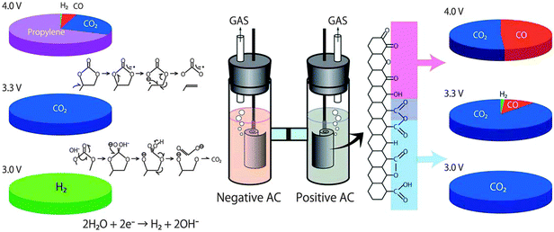
    Fig. 9 Gas evolution from an EDLC cell upon over-voltage application. Reproduced from ref. 3 with permission of The Royal Society of Chemistry.  
    Fig. 9 Gas evolution from an EDLC cell upon over-voltage application. Reproduced from ref. 3 with permission of The Royal Society of Chemistry.

    Another drawback of organic electrolytes is their much lower ionic conductivity when compared to the aqueous electrolyte. For example, the ionic conductivity of the commonly used 1 M TEABF4/ACN electrolyte is 0.06 S cm−1, which is significantly lower than that of the 30 wt% H2SO4 electrolyte (0.8 S cm−1 at 25 °C).29 The low conductivity of the organic electrolyte can result in ES a much higher ESR compared to the aqueous electrolyte-based ESs,171 which then limits the maximum power density.

    Since the ESs can work in a wide temperature range, the effect of the electrolyte on their performance at different temperatures should be considered. Kötz et al.189 reported that the specific capacitance of an EDLC with 1 M TEABF4/ACN did not change obviously while that of an EDLC with TEABF4/PC as an electrolyte did change significantly upon decreasing the temperature from 60 to −40 °C. Normally, the lower temperature limit of typical ESs with organic electrolytes is −40 °C.4,22 To widen the temperature range for some even lower temperature operation (e.g., space-rated electronics), a number of studies have been devoted to the development of organic electrolytes with the temperature limits lower than −40 °C.4,190 This could be achieved through the careful design of the salts, solvents and/or additives, which will be further discussed in the following sections.

    Regarding the self-discharge of the ESs, the presence of a trace amount of water in the organic electrolyte was identified to be majorly responsible for the self-discharge process.191 The self-discharge mechanism was also found to be dependent on the type of organic electrolyte, as reported by Zhang et al.192

  - 3.2.1.2. Organic electrolytes for pseudocapacitors.
    Besides the EDLCs, organic electrolytes are also used for pseudocapacitors with pseudocapacitive materials such as metal oxides,153 ECPs,155 and composite materials,154 as seen from Table 3. To facilitate the ion intercalation/de intercalation, most of the organic electrolytes used for pseudocapacitors contain Li ions due to their smaller bare ion size. As reported, LiClO4153 and LiPF6158,193,194 were typically salts used in these organic electrolytes. The typical organic solvents used in the literature were PC,153 ACN, or a mixture of different solvents such as EC–DEC,152 EC–DMC,158 EC–EMC,193 EC–DMC–EMC,195 and EC–DMC–DEC.194 Actually, the most of these organic electrolytes are widely used in the Li-ion batteries. Regarding ECPs, although they have been considered to be promising pseudocapacitive electrode materials due to their low cost, light weight, and easily processed, mechanical flexibility and relatively fast ion insertion/extraction (doping/dedoping) process, their cycling stabilities are normally poor, probably caused by trace impurity of water in the electrolytes.155 In this regard, the choice of appropriate organic electrolytes may be able to minimize the degradation of the ECP materials, then improve the cycling stability.155   

  - 3.2.1.3. Organic electrolytes for hybrid capacitors.
    In order to further increase the energy density, asymmetric ESs with organic electrolytes have also drawn considerable attention. Since the early studies on the asymmetric ESs with the organic electrolytes by Amatucci et al.,196 a number of organic electrolyte-based asymmetric ESs, such as graphite//AC (electrolyte: 1.5 M TEMABF4/PC),157 carbon//TiO2 (1 M LiPF6/EC–DMC),197 carbon//V2O5 (1 M LiTFSI/ACN),198 carbon//Li4Ti5O12 (1 M LiPF6/EC–EMC),193 and carbon//ECP (1 M TEABF4/PC),199 have been developed. Due to the much wider operative cell voltages (generally 3–4 V) obtained in the organic electrolyte, these asymmetric ESs can deliver energy densities (usually above 30 W h kg−1) much higher than those reported for aqueous-based asymmetric ESs, although the formers have lower specific capacitances compared to the latters.  

    Among these asymmetric ESs, Li-ion capacitors (LICs) have attracted particular attention.193,197,200 Typical LICs combine a Li-ion battery-type negative electrode and an EDLC-type positive electrode (e.g., AC) with an Li-containing organic electrolyte such as LiPF6, LiClO4, and mixtures of two or more solvents (e.g., EC–DMC). There are two types of negative electrodes, i.e., carbon-based (mostly graphite) and lithium titanate (Li4Ti5O12) electrodes. LICs using a single solvent are very rare. In some cases, additives are used in the electrolytes.201 Actually, the compositions of the reported electrolytes for LICs are almost the same as those for LIBs, which have already been reviewed elsewhere.202 Even extensive studies have been focused on the development of electrode materials, the effect of electrolytes on LIC performance has received relatively limited attention.77,200 Unlike the ACN-based EDLCs whose performance was reported to be relatively insensitive to temperatures between −30 and 40 °C, the LIC performance (e.g., energy and power densities) with carbonate-based electrolytes was found to degrade severely at low temperature especially below 0 °C.200 Besides the poor low-temperature performance, the LICs also suffer from a relatively low rate capability arising from the battery-type negative electrode. Further effort on both LIC electrode materials and electrolytes is necessary to solve this temperature limitation.  

- 3.2.2. Organic solvents.
  The solvent is part of the ES electrolyte, playing a critical role in achieving a high performance. For an ideal organic solvent, it should fulfill several criteria including good solvation ability for a certain conducting salt, high ESPW, low viscosity within the operating temperature range as well as high safety (e.g., non-flammability and non-toxic). As mentioned previously, the most commonly used organic solvents for EDLCs so far are acetonitrile (ACN) and propylene carbonate (PC). As shown in Table 4, compared to the PC, ACN has a higher low viscosity, a lower melting point and a higher dielectric constant. Normally, ACN-based electrolytes have higher conductivity when compared to those of PC-based electrolytes, which can make a lower ESR and a higher power performance of the resultant EDLCs even at low temperatures. However, the low flash point and toxicity of the ACN are two major drawbacks. Due to its high toxicity, the use of ACN in ESs is prohibited in Japan.203–205 Since PC has a higher flash point and is less toxic than the ACN solvents, there has been growing interest in the PC-based electrolyte as an alternative to the ACN-based electrolytes. Due to the lower conductivity of the PC-based electrolyte than the ACN-based electrolyte, both a lower power density and energy efficiency of the PC-based EDLCs could be expected. This problem is more serious at low temperature due to the high viscosity of the PC (Fig. 10).206 Furthermore, as previously discussed, the operating cell voltages of both the ACN- and PC-based EDLCs are limited to 2.5–2.8 V, and further increasing of the working voltages and thereby increasing the energy densities would be highly desirable. With respect to this, extensive efforts have been devoted to the development of other organic electrolytes for high-performing EDLCs in the last decade. 

  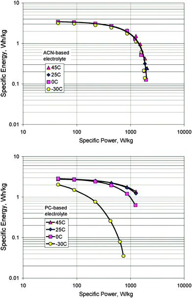
  Fig. 10 Ragone plots for ACN- and PC-based electrochemical supercapacitors at different temperatures. Reprinted from ref. 206, with permission from Elsevier.

  - 3.2.2.1. Single organic solvents for electrolytes.
  - 3.2.2.2. Mixtures of solvents for electrolytes.
- 3.2.3. Conducting salts for electrolytes.
  - 3.2.3.1. Effect of conducting salt on ES performance.
  - 3.2.3.2. Exploration of new conducting salts.
  
#### 3.3. Ionic liquid based ES electrolytes

- 3.3.1. General composition, properties and ES performance of ionic liquid electrolytes.
  Ionic liquids (ILs, also known as low temperature or room temperature molten salts) are generally defined as those salts composed solely of ions (cations and anions) with melting points below 100 °C.233 An IL usually consists of a large asymmetric organic cation and an inorganic or an organic anion, and this special combination of certain cations and anions contributes to a low melting point.234 Owing to the unique structures and properties, ILs have recently received significant interest as alternative electrolytes for ESs. Normally, ILs have several potential advantages including high thermal, chemical and electrochemical stability, negligible volatility, and non-flammability (depending on the combination of cations and anions).10,234 Furthermore, ILs' physical and chemical properties can be highly tunable due to their large variety (virtually unlimited) of combinations of cations and anions.235 In this sense, ILs are also regarded as “designer solvents”.236 This property tenability of ILs is very attractive for ES electrolytes because the electrolyte compositions can be optimized or customized to meet certain requirements of ES performance such as operative cell voltage, the working temperature range, ESR (related with the ionic conductivity), and so on.  
  离子液体（ILs，也称为低温或室温熔盐）通常定义为仅由离子（阳离子和阴离子）组成的盐，熔点低于100°C.233 IL通常由大的不对称有机阳离子组成无机或有机阴离子，某些阳离子和阴离子的这种特殊组合有助于降低熔点.234由于独特的结构和性质，IL最近作为ES的替代电解质受到了极大的关注。通常，IL具有几个潜在的优点，包括高热稳定性，化学稳定性和电化学稳定性，可忽略的挥发性和不可燃性（取决于阳离子和阴离子的组合）.10,234此外，ILs的物理和化学性质可以高度可调，因为它们的从这个意义上说，ILs也被认为是“设计师溶剂”.236 ILs的这种性质稳定性对ES电解质非常有吸引力，因为电解质组合物可以优化或定制为满足ES性能的某些要求，如工作电池电压，工作温度范围，ESR（与离子电导率有关）等。

  Based on their composition, ILs can be basically classified as aprotic, protic and zwitterionic types (Fig. 14).234 The cited ILs used in ESs so far represent only a very small part of the large family of ILs. In the published literature, the ILs employed for ESs are commonly based on imidazolium, pyrrolidinium, ammonium, sulfonium, phosphonium cations, and so on (Fig. 15). Typical anions of ILs are tetrafluoroborate (BF4−), hexafluorophosphate (PF6−), bis(trifluoromethanesulfonyl)imide (TFSI−), bis(fluorosulfonyl)imide (FSI−), and dicyanamide (DCA−) (Fig. 15).  
  基于它们的组成，IL基本上可以分类为非质子，质子和两性离子类型（图14）.234迄今为止，ES中使用的引用的IL仅代表大家族IL的很小一部分。在已发表的文献中，用于ES的IL通常基于咪唑鎓，吡咯烷鎓，铵，锍，鏻阳离子等（图15）。 IL的典型阴离子是四氟硼酸盐（BF 4-），六氟磷酸盐（PF 6-），双（三氟甲磺酰基）酰亚胺（TFSI-），双（氟磺酰基）酰亚胺（FSI-）和二氰胺（DCA-）（图15）。

  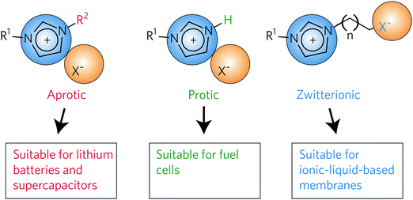
  Fig. 14 Basic types of ionic liquids: aprotic, protic and zwitterionic types. Reprinted by permission from Macmillan Publishers Ltd: Nature Materials (ref. 234), copyright 2009.  
  图14离子液体的基本类型：非质子，质子和两性离子类型。经Macmillan Publishers Ltd许可转载：Nature Materials（参考文献234），版权所有2009。

  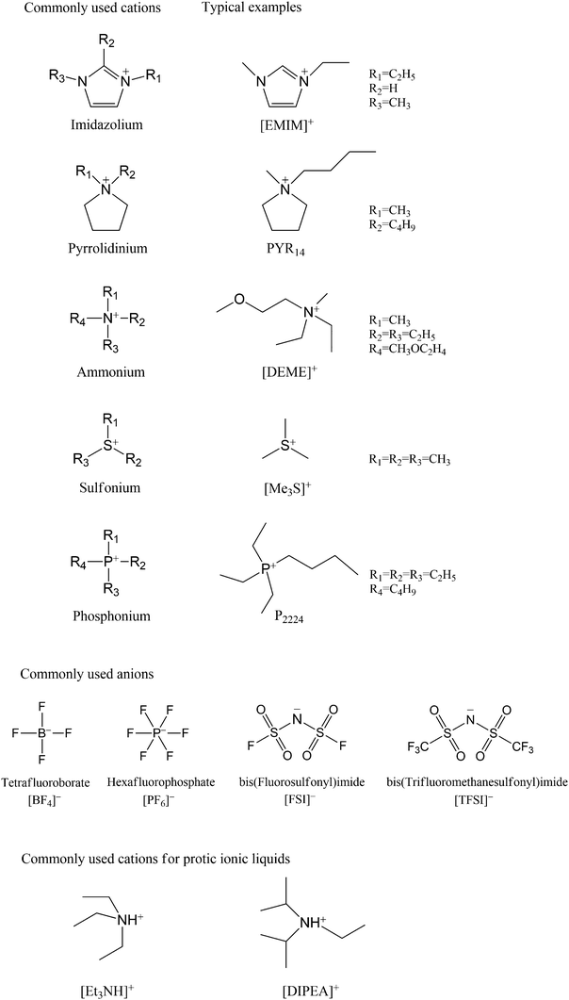
  Fig. 15 Commonly used cations, anions of ILs for ESs, and some typical examples of ILs.  
  图15常用的阳离子，ES的IL阴离子和IL的一些典型例子。

  In general, the imidazolium-based ILs can provide higher ionic conductivity while the pyrrolidinium-based ILs have larger ESPWs.29,237 Actually, there exists a trade-off between the IL ionic conductivity and ESPW. As mentioned previously, the operative cell voltages of commercial organic electrolytes (e.g., ACN and PC) based EDLCs are generally limited to 2.5–2.8 V, and increasing the cell voltage beyond this limit would cause serious electrochemical decomposition of organic solvents. However, many studies using IL-electrolyte-based ESs could give operative cell voltages above 3 V.10,237,238 Besides, commercially used organic solvents (e.g., ACN) also face safety issues due to their volatile and flammable nature especially when used at high temperatures. In this regard, the solvent-free ILs may have an advantage in solving the safety problems associated with those organic solvents, making IL-based ESs favorable for high-temperature applications.  
  通常，基于咪唑的ILs可以提供更高的离子电导率，而基于吡咯烷的ILs具有更大的ESPW .29,237实际上，在IL离子电导率和ESPW之间存在折衷。如前所述，基于商用有机电解质（例如ACN和PC）的EDLC的工作电池电压通常限制在2.5-2.8V，并且增加电池电压超过该限制将导致有机溶剂的严重电化学分解。然而，许多使用基于IL-电解质的ES的研究可以使操作电池电压高于3V.10,237,238。此外，商业上使用的有机溶剂（例如ACN）由于其挥发性和易燃性而特别是在高温下使用时也面临安全问题。在这方面，无溶剂IL可以在解决与那些有机溶剂相关的安全问题方面具有优势，使得基于IL的ES有利于高温应用。

  Unfortunately, there are several main drawbacks with most ILs, such as high viscosity, low ionic conductivity and high cost, which can limit their practical use in ESs. Even for the [EMIM][BF4] electrolyte, which has a relatively high ionic conductivity among the common ILs, its conductivity (14 mS cm−1 at 25 °C) is still much lower than that of TEABF4/ACN (59.9 mS cm−1 at 25 °C). Furthermore, the viscosities of ILs such as [EMIM][BF4] and [BMIM][BF4] are 41 cp and 219 cp,239,240 respectively, which are much higher than that of the organic electrolyte (e.g., 0.3 cp for the ACN organic electrolyte162). Both low conductivity and high viscosity of IL-based electrolytes can significantly increase the ESR values of the ILs-based ESs, limiting both the rate and power performance if the loss of the power density due to the increased ESR cannot be buffered by the increase of cell voltage. This issue seemed to be more serious at room temperature and low temperature, as demonstrated by some comparative studies between organic and IL electrolytes.10,237,238 In addition, the specific capacitance values of IL electrolyte-based EDLCs are often lower than those of both aqueous and organic electrolyte-based ones especially at high scan rates or high charging/discharging rates, probably due to the high viscosity of ILs.241,242  
  不幸的是，大多数IL存在几个主要缺点，例如高粘度，低离子电导率和高成本，这可能限制它们在ES中的实际应用。即使对于[EMIM][BF4]电解质，其在常见的IL中具有相对高的离子电导率，其电导率（在25°C时为14 mS cm-1）仍远低于TEABF4 /ACN（59.9 mS cm）的电导率。 -1℃，25℃）。此外，[EMIM][BF4]和[BMIM][BF4]等ILs的粘度分别为41 cp和219 cp，239,240，远远高于有机电解质（例如，ACN有机物为0.3 cp） electrolyte162）。基于IL的电解质的低电导率和高粘度都可以显着提高基于IL的ES的ESR值，如果由于ESR增加导致的功率密度损失不能通过增加来缓冲，则限制了速率和功率性能。电池电压。这个问题在室温和低温下似乎更严重，正如有机电解质和IL电解质之间的一些比较研究所证明的那样.10,237,238此外，基于IL电解质的EDLC的比电容值通常低于水溶液和有机电解质的比电容值。基于电解质的电解质，特别是在高扫描速率或高充电/放电速率下，可能是由于ILs的高粘度[241,242]

  To improve the performance of IL-based ESs, optimization of the selection of IL composition and cell design has been carried out through both experimental and theoretical understanding,243–245 to provide fundamental insights into the electrochemical behaviour, structure and corresponding capacitive behavior of the electric double-layer (EDL) at the IL/electrode interface. With respect to this, some achievements have recently been made, as documented by several excellent reviews.172,245–248 These reviews discussed the EDL structure and capacitance, influencing factors on the EDL, effects of carbon electrode morphology and pore size on the EDL structure, capacitance and dynamics of IL ions. In addition, some cations of the investigated ILs for ESs have a structure similar to that of surfactants.249,250 Whether these cations tend to aggregate in ILs like surfactants is an important issue since this would be able to affect both the ion mobility and ionic conductivity.249,250  
  为了提高基于IL的ES的性能，已经通过实验和理论理解243-245对IL组成和细胞设计的选择进行了优化，以提供对电化学行为，结构和相应电容行为的基本见解。 IL /电极界面处的双电层（EDL）。关于这一点，最近取得了一些成就，正如几篇优秀评论所记录的那样.172,245-248这些评论讨论了EDL结构和电容，影响EDL的因素，碳电极形态和孔径对EDL结构的影响， IL离子的电容和动力学。此外，所研究的用于ES的IL的一些阳离子具有与表面活性剂类似的结构.249,250这些阳离子是否倾向于在IL中聚集如表面活性剂是一个重要问题，因为这将影响离子迁移率和离子电导率。 249,250

  In order to understand the aging or failure mechanisms of IL electrolyte-based EDLCs, the electrochemical decomposition of ILs beyond the ESPW has been investigated by using instrumental analysis methods such as in situ infrared and electrochemical spectroscopy methods,251 and in situ XPS.252  
  为了理解基于IL电解质的EDLC的老化或失效机理，已经通过使用仪器分析方法（例如原位红外和电化学光谱方法，251和原位XPS）研究了超出ESPW的IL的电化学分解。  

  The research activities in this field can be briefly summarized as follows: (1) fundamentally understanding the EDL structure and capacitance in ILs, (2) developing ILs for pseudocapacitive electrode material-based ESs with improved charge storage ability, (3) improving ILs' properties (e.g., ionic conductivity, viscosity and ESPW) by modifying the cations or anions or both, and (4) using a mixture of ILs or utilizing organic solvents to improve the overall performance of IL-based electrolytes.  
  该领域的研究活动可以概括如下：（1）从根本上理解IL中的EDL结构和电容，（2）开发具有改善的电荷存储能力的基于赝电容电极材料的ES的IL，（3）改善ILs'通过改变阳离子或阴离子或两者的性质（例如，离子电导率，粘度和ESPW），和（4）使用IL的混合物或利用有机溶剂来改善基于IL的电解质的总体性能。  

  - 3.3.2. Solvent-free ionic liquids. 无溶剂的离子液体
  - 3.3.2.1. Solvent-free ionic liquids for EDLCs
    As previously mentioned, the major challenge in developing ILs for EDLCs is to design or choose ILs with a high ionic conductivity, a large ESPW and a wide temperature range. Although the [EMIM][BF4] electrolyte has been extensively studied for EDLCs due to its relatively high conductivity, its narrower ESPW compared to other ILs and relatively high melting point (15 °C) seem to be the drawbacks. To overcome these drawbacks, considerable work has been devoted to the development of other alternative ILs based on the tunable properties of ILs to change the structure of either the anion, or the cation, or both as well as the IL composition itself.235   
    如前所述，开发用于EDLC的IL的主要挑战是设计或选择具有高离子电导率，大ESPW和宽温度范围的IL。尽管[EMIM][BF4]电解质因其相对较高的电导率而被广泛研究用于EDLC，但与其他IL相比，其较窄的ESPW和相对高的熔点（15℃）似乎是缺点。为了克服这些缺点，基于ILs的可调特性改变阴离子或阳离子或两者以及IL组合物本身的结构，开发了大量其他替代IL的工作。
    - 3.3.2.1.1. Aprotic ionic liquids. 非质子离子液体
      Regarding 1-ethyl-3-methylimidazolium ([EMIM])-based ILs, Sun et al.253 investigated the performance of AC-based EDLCs with [EMIM][SCN] IL electrolytes (SCN: thiocyanate), which had both lower viscosity and higher ionic conductivity compared to those of [EMIM][BF4] IL. Handa et al.254 found that the ionic conductivity of [EMIM][FSI] IL (FSI: bis(fluorosulfonyl)imide) was comparable to the TEMABF4/PC organic electrolyte, and the EDLCs with this [EMIM][FSI] IL electrolyte showed a good rate capability similar to that with a TEMABF4/PC organic electrolyte. Pandey et al.255 demonstrated that 1-ethyl-3-methylimidazolium tetracyanoborate ([EMIM][TCB]) IL (TCB: tetracyanoborate) could be an electrolyte for AC-based EDLCs since it had a high ionic conductivity (∼1.3 × 10−2 S cm−1 at 20 °C) and low viscosity (∼22 cP). Matsumoto et al.256 found that the [EMIM][PO2F2] IL (PO2F2: difluorophosphate) electrolyte could provide a higher specific capacitance when compared to the [EMIM][BF4] IL at a charging voltage of 2.5 V. Unfortunately, the operative cell voltage of the EDLC with a [EMIM][PO2F2] IL electrolyte was below 3 V, lower than that with a [EMIM][BF4] IL electrolyte. Kurig et al.257 systematically investigated various IL electrolytes with [EMIM]+ cations and different anions for EDLCs using carbon cloth electrodes. The structure and chemical composition of the IL anion were found to have a profound influence on both the ESPW and operative cell voltage (Fig. 16). It was concluded that the [EMIM][BF4] and [EMIM][B(CN)4] ILs could give the best overall performance among the investigated ILs.  
      关于基于1-乙基-3-甲基咪唑鎓（[EMIM]）的ILs，Sun等人[257]研究了具有[EMIM][SCN] IL电解质（SCN：硫氰酸盐）的AC基EDLC的性能，其具有较低粘度与[EMIM][BF4] IL相比，离子电导率更高。 *Handa等[254]发现[EMIM][FSI] IL（FSI：双（氟磺酰基）酰亚胺）的离子电导率与TEMABF4 /PC有机电解质相当，EDLCs与[EMIM][FSI] IL电解质相当显示出与TEMABF4 /PC有机电解质相似的良好倍率性能*。 Pandey等[255]证明，1-乙基-3-甲基咪唑四氰基硼酸盐（[EMIM][TCB]）IL（TCB：四氰基硼酸盐）可能是基于AC的EDLC的电解质，因为它具有高离子电导率（∼1.3 × 10−2 S cm−1 at 20 °C）并且粘度低（~22cP）。 Matsumoto等[256]发现[EMIM][PO2F2] IL（PO2F2：二氟磷酸盐）电解质与[EMIM][BF4] IL相比，在2.5 V的充电电压下可以提供更高的比电容。*不幸的是，有效电容具有[EMIM][PO2F2] IL电解质的EDLC的电池电压低于3V，低于[EMIM][BF4] IL电解质的电池电压*。 Kurig等[257]使用碳布电极系统地研究了各种IL电解质与[EMIM]+阳离子和不同阴离子的EDLCs。发现IL阴离子的结构和化学组成对ESPW和手术电池电压都有很大影响（图16）。结论是[EMIM][BF4]和[EMIM][B（CN）4] ILs可以在所研究的IL中提供最佳的整体性能。

      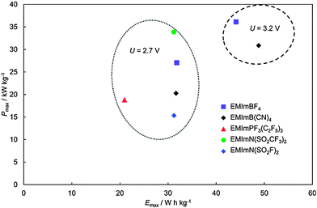
      Fig. 16 Power density vs. energy density plots at 2.7 V and at 3.2 V for electrochemical supercapacitors with ILs studied. Reproduced by permission of The Electrochemical Society from ref. 257.  
      图16研究了ILs的电化学超级电容器在2.7 V和3.2 V时的功率密度与能量密度的关系曲线。由电化学学会许可转载。 257

      Shi et al.258 investigated the performance of graphene-based EDLCs with a series of ILs composed of [EMIM]+ cations and different anions including BF4−, NTF2−, DCA−, EtSO4− and OAc−. It was found that the hydrogen-bond-accepting ability of these anions was closely related to the viscosity of the ILs. EDLCs with the [EMIM][DCA] IL electrolyte showed the highest specific capacitance and rate capability as well as the smallest resistance due to the lowest viscosity, ion size and molecular weight among the investigated ILs. However, [EMIM][DCA] IL-based EDLCs had a much smaller ESPW (2.3 V) which was much narrower than that of the [EMIM][BF4] IL-based EDLC (∼4 V) (Fig. 17). As a result, the latter delivered the highest specific energy density (67 W h kg−1 at 1 A g−1), which was much higher than the former (20 W h kg−1).  
      Shi等[258]研究了石墨烯基EDLCs的性能，其中一系列IL由[EMIM] +阳离子和不同的阴离子组成，包括BF4-，NTF2-，DCA-，EtSO4-和OAc-。发现这些阴离子的氢键接受能力与IL的粘度密切相关。*由于在所研究的IL中具有最低的粘度，离子尺寸和分子量，具有[EMIM][DCA] IL电解质的EDLC显示出最高的比电容和速率能力以及最小的电阻。然而，[EMIM][DCA]基于IL的EDLC具有小得多的ESPW（2.3V），其比[EMIM][BF4]基于IL的EDLC（~4V）窄得多（图17）。结果，后者提供了最高的比能量密度（在1 A g-1时为67 W h kg-1），这远远高于前者（20 W h kg-1）。*

      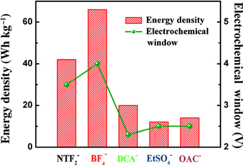
      Fig. 17 Relationship between the electrochemical window and the energy density of graphene electrodes measured in different IL electrolytes. Reprinted from ref. 258, with permission from John Wiley and Sons.  
      图17在不同的IL电解质中测量的电化学窗口和石墨烯电极的能量密度之间的关系。转载自参考。 258，经John Wiley和Sons许可。

      In addition to changing the anion of [EMIM]-based IL electrolytes, other methods have also been proposed to improve the properties (e.g., ESPW and ionic conductivity).259–261 For example, Kong et al.259 reported that the addition of small amounts of single walled CNTs (e.g., 0.1 and 0.5 wt%) into the [EMIM][BF4] IL electrolyte could increase the ionic conductivity of the electrolyte. As a result, the specific capacitance, energy density and cycling stability of EDLCs with this CNT-added IL electrolyte were all improved. Some studies showed that the addition of Li salt into the IL electrolyte could negatively shift the cathodic potential limit for increasing the cathodic stability.260,261  
      除了改变基于[EMIM]的IL电解质的阴离子之外，还提出了其他方法来改善性质（例如，ESPW和离子电导率）.259-261例如，Kong等人的第259页报道了添加[EMIM][BF4] IL电解质中的少量单壁CNT（例如，0.1和0.5wt％）可以增加电解质的离子电导率。结果，具有该CNT添加的IL电解质的EDLC的比电容，能量密度和循环稳定性均得到改善。一些研究表明，在IL电解液中加入Li盐会对阴极电位极限产生负面影响，从而增加阴极稳定性.260,261

      Other imidazolium-based cations besides [EMIM]+, such as 1-butyl-2,3-dimethylimidazolium bis(trifluoromethylsulfonyl)imide ([BDMIM]), 1-butyl-3-methylimidazolium bis(trifluoromethylsulfonyl)imide ([BMIM]), and 1-dodecyl-3-methylimidazolium bis(trifluoromethylsulfonyl)imide ([C12MIM]), have also been studied.262,263 For instance, Bettini et al.263 found that among the four investigated ILs ([BMIM][NTf2], [C12MIM][NTf2], [EMIM][NTf2] and 1-butyl-1-methylpyrrolidinium bis(trifluoromethylsulfonyl)imide ([BPyr][NTf2])), [BMIM][NTf2]-based ES could exhibit the highest specific capacitance of 75 F g−1. This high specific capacitance was thought to be related to the IL's shortest alkyl chain.  
      除[EMIM] +外的其他咪唑基阳离子，如1-丁基-2,3-二甲基咪唑鎓双（三氟甲基磺酰基）酰亚胺（[BDMIM]），1-丁基-3-甲基咪唑鎓双（三氟甲基磺酰基）酰亚胺（[BMIM]）还研究了1-十二烷基-3-甲基咪唑双（三氟甲基磺酰）亚胺（[C12MIM]）.262,263例如，Bettini等[263]发现，在四种被研究的ILs中[[BMIM][NTf2]，[ C12MIM][NTf2]，[EMIM][NTf2]和1-丁基-1-甲基吡咯烷双（三氟甲基磺酰基）酰亚胺（[BPyr][NTf2]）），[BMIM][NTf2]基ES可以表现出最高的比电容75 F g-1。这种高比电容被认为与IL的最短烷基链有关。
      
      ILs with other cations (e.g., pyrrolidinium-based,264–266 ammonium-based,267–269 sulfonium-based,270 and fluorohydrogenate ILs269) have also been extensively studied as potential electrolytes for EDLCs. Regarding the ILs with pyrrolidinium cations, Lazzari et al.264 employed N-butyl-N-methylpyrrolidinium bis(trifluoromethanesulfonyl)imide ([PYR14][TFSI]) as the electrolyte for EDLCs with mesoporous carbon xerogel electrodes. In order to fully take advantage of the high ESPW of [PYR14][TFSI] IL, the EDLCs had the asymmetric configuration with a higher carbon loading at the positive electrode than that at the negative one. A maximum cell voltage of 3.7 V was achieved only for that asymmetric EDLC using [PYR14][TFSI] IL as the electrolyte, which was higher than that using [EMIM][TFSI] IL (3.4 V). Both EDLCs delivered a maximum specific energy of ∼30 W h kg−1 at their maximum cell voltage at 60 °C. Lazzari et al.265 tested [PYR12O1][TFSI] IL as the electrolyte for asymmetric EDLCs (AEDLCs) with different carbon loadings on the positive and negative electrodes. It was observed that the [PYR12O1][TFSI]-based AEDLC could operate within a wide temperature range from −30 to 60 °C at a high operative cell voltage of 3.7 V. A high cycling stability was also observed for these IL-based AEDLCs with a capacitance loss of 2% over 27[thin space (1/6-em)]000 deep cycles at 60 °C.266 Such AEDLC could reach a maximum cell voltage of 4 V and could deliver a maximum energy density of 40 W h kg−1 (only electrode materials included).266  
      具有其他阳离子的IL（例如，基于吡咯烷鎓，基于264-266铵，基于267-269锍，基于270和氟氢化物ILs269）也已作为EDLC的潜在电解质进行了广泛研究。关于具有吡咯烷阳离子的IL，Lazzari等人264使用N-丁基-N-甲基吡咯烷双（三氟甲磺酰基）酰亚胺（[PYR14][TFSI]）作为具有中孔碳干凝胶电极的EDLC的电解质。为了充分利用[PYR14][TFSI] IL的高ESPW，EDLC具有不对称构型，在正电极处的碳载荷高于在负电极处的碳载荷。仅使用[PYR14][TFSI] IL作为电解质的非对称EDLC获得3.7V的最大电池电压，其高于使用[EMIM][TFSI] IL（3.4V）的电压。两种EDLC在60°C时的最大电池电压下提供~30 W h kg-1的最大比能。 Lazzari等[265]测试了[PYR12O1][TFSI] IL作为不对称EDLC（AEDLCs）的电解质，在正极和负极上具有不同的碳载量。据观察，基于[PYR12O1][TFSI]的AEDLC可在-30至60℃的宽温度范围内在3.7V的高操作电池电压下操作。对于这些基于IL的观察，也观察到高的循环稳定性。 AEDLC在27°[薄空间（1/6-em）]深度循环，在60°C时电容损失2％.266这样的AEDLC可以达到4 V的最大电池电压，并且可以提供40的最大能量密度W h kg-1（仅包括电极材料）.266

      Considering that azepanium-based ILs were much cheaper than pyrrolidinium-based ILs, Pohlmann et al.271 tested two azepanium-based ILs, (N-methyl, N-butyl-azepanium bis(trifluoromethanesulfonyl)imide ([AZP14][TFSI]) and N-methyl, N-hexyl-azepanium bis(trifluoromethanesulfonyl)imide ([AZP16][TFSI])), as electrolytes for EDLCs, and compared them with [PYR14][TFSI]. Both of these two IL electrolytes showed operative working voltages up to 3.5 V, which was similar to [PYR14][TFSI]. However, EDLCs utilizing these two IL electrolytes were found to deliver less energy densities especially at higher current density when compared to that with [PYR14][TFSI] IL as the electrolyte, which was attributed to the larger cation sizes and thus lower accessibilities to the electrode material surfaces.  
      考虑到基于氮化锆的ILs比基于吡咯烷的ILs便宜得多，Pohlmann等人271测试了两种基于氮的ILs（N-甲基，N-丁基 -氮杂双（三氟甲磺酰）亚胺（[AZP14][TFSI]）和N-甲基，N-己基 -氮杂三（双（三氟甲磺酰））酰亚胺（[AZP16][TFSI]）），作为EDLC的电解质，并与[PYR14][TFSI]进行比较。这两种IL电解质均显示出高达3.5 V的工作电压，与[PYR14][TFSI]相似。然而，与使用[PYR14][TFSI] IL作为电解质的EDLC相比，发现利用这两种IL电解质的EDLC能够提供更低的能量密度，尤其是在更高的电流密度下，这归因于较大的阳离子尺寸并因此降低了对电极材料表面的可接近性。

      Regarding the ILs with ammonium-based cations, Sato et al.267 employed N,N-diethyl-N-methyl-N-(2-methoxyethyl)ammonium tetrafluoroborate ([DEME][BF4]) and [DEME][TFSI] ILs as electrolytes for the EDLCs, and compared them with both [EMIM][BF4] IL and 1 M TEABF4/PC organic electrolytes. The ESPW of [DEME][BF4] IL (6 V) was obtained on a Pt electrode, which was wider than that of [EMIM][BF4] (4.5 V). The EDLC using [DEME][BF4] IL as an electrolyte showed a much better high-temperature performance up to 150 °C. Kim et al.268 found that [DEME][BF4] and [DEME][TFSI] ILs showed a wider ESPW than those of both the TEABF4/PC organic electrolyte and conventional [EMIM][BF4] IL. The specific capacitance of AC-based electrodes in both ionic liquids could be increased upon increasing the applied voltage from 2.5 to 3.5 V.  
      关于具有铵基阳离子的IL，Sato等人267使用N，N-二乙基-N-甲基-N-（2-甲氧基乙基）铵四氟硼酸盐（[DEME] [BF4]）和[DEME] [TFSI] ILs作为EDLC的电解质，并将它们与[EMIM] [BF4] IL和1M TEABF4 /PC有机电解质进行比较。 [DEME] [BF4] IL（6V）的ESPW在Pt电极上获得，其比[EMIM] [BF4]（4.5V）宽。使用[DEME] [BF4] IL作为电解质的EDLC显示出高达150℃的更好的高温性能。 Kim等[268]发现[DEME] [BF4]和[DEME] [TFSI] ILs显示出比TEABF4 /PC有机电解质和常规[EMIM] [BF4] IL更宽的ESPW。当施加的电压从2.5增加到3.5V时，两种离子液体中基于AC的电极的比电容可以增加。

      Senda et al.269 studied AC-based EDLCs with fluorohydrogenate ILs (FHILs) as electrolytes. Five such FHILs contained different cations such as 1,3-dimethylimidazolium (DMIM), 1-ethy1-3-methylimidazolium (EMIM), 1-butyl-3-methylimidazolium (BMIM), 1-ethyl-1-methylpyrrolidinium (EMPyr), and 1-methoxymethyl-1-methylpyrrolidinium (MOMMPyr), respectively. The specific capacitances obtained using these fluorohydrogenate ILs were all higher than those obtained in [EMIM][BF4] IL or a 1 M TEABF4/PC organic electrolyte at the investigated cell voltage from 1 to 3.2 V. For three imidazolium-based FHILs, the maximum specific capacitances were decreased in the following order: [DMIM][(FH)2.3F] (178 F g−1) > [EMIM][(FH)2.3F] (162 F g−1) > [BMIM][(FH)2.3F] (135 F g−1). This was in accordance with the order of increase of cation size. AC-based EDLCs using some FHILs with low melting points had sufficient specific capacitance even at −40 °C (e.g., 64 F g−1 for [EMIM][(FH)2.3F]), which was much higher than that of TEABF4/PC (20 F g−1).  
      Senda等人269研究了基于AC的EDLC，其中氟氢化物ILs（FHILs）作为电解质。五种这样的FHIL含有不同的阳离子，例如1,3-二甲基咪唑鎓（DMIM），1-乙基-3-甲基咪唑鎓（EMIM），1-丁基-3-甲基咪唑鎓（BMIM），1-乙基-1-甲基吡咯烷鎓（EMPyr），分别为1-甲氧基甲基-1-甲基吡咯烷（MOMMPyr）和1-甲氧基甲基-1-甲基吡咯烷（MOMMPyr）。使用这些氟代氢化物ILs获得的比电容均高于[EMIM] [BF4] IL或1M TEABF4 /PC有机电解质中所获得的电容，所研究的电池电压为1至3.2V。对于三种基于咪唑的FHIL，最大比电容按以下顺序降低：[DMIM] [（FH）2.3F]（178 F g-1）> [EMIM] [（FH）2.3F]（162 F g-1）> [BMIM] [ （FH）2.3F]（135 F g-1）。这与阳离子尺寸的增加顺序一致。使用一些具有低熔点的FHIL的基于AC的EDLC即使在-40°C也具有足够的比电容（例如，[EMIM] [（FH）2.3F]为64 F g-1），这远远高于TEABF4 /PC（20 F g-1）。

      Regarding the sulfonium-based cations, Anouti et al.270 studied the trimethylsulfonium bis(trifluorosulfonimide) [Me3S][TFSI] IL electrolyte for AC-based EDLCs. [Me3S][TFSI] IL had an ESPW of about 5 V on a Pt electrode and could operate up to 3 V on AC electrode-based EDLCs. It was also observed the EDLC using this IL as an electrolyte was suitable for high temperature operation, delivering a maximum energy density of 44.1 W h kg−1 at 80 °C.  
      关于锍基阳离子，Anouti等人研究了用于基于AC的EDLC的三甲基锍双（三氟磺酰亚胺）[Me3S] [TFSI] IL电解质。 [Me3S] [TFSI] IL在Pt电极上具有约5V的ESPW，并且可以在基于AC电极的EDLC上操作高达3V。还观察到使用该IL作为电解质的EDLC适合于高温操作，在80℃下提供44.1Wh kg-1的最大能量密度。

      Comparative studies on ILs with different types of cations were also carried out.272,273 Sillars et al.272 studied a series of ILs including [EMIM][BF4], 1-ethyl-3-methylimidazolium dicyanamide ([EMIM][N(CN)2]), 1,2-dimethyl-3-propylimidazolium bis(trifluoromethylsulfonyl) imide ([DMPIM][TFSI]), and 1-butyl-3-methylpyrrolidinium tris(pentafluoroethyl) trifluorophosphate ([BMPy][FAP]) as electrolytes for AC-based EDLCs, and compared them with a 1 M TEABF4/PC organic electrolyte. EDLCs using [BMPy][FAP] IL showed the highest operating voltage of 3.5 V (Fig. 18). The capacitive performances of EDLCs using these ILs were decreased in the following order: [EMIM][BF4] > [DMPIM][TFSI] > [BMPy][FAP] > [EMIM][N(CN)2], which was thought to be related to the electrolyte viscosity and ion size. The ESR values were increased in the following order: [EMIM][N(CN)2] < [EMIM][BF4] < [DMPIM][TFSI] < [BMPy][FAP], which was in accordance with the increasing order of viscosity. EDLCs using [EMIM][BF4] IL could deliver much higher energy and power densities when compared to an EDLC using 1 M TEABF4/PC as an organic electrolyte.  
      还对不同类型阳离子的ILs进行了比较研究.272,273 Sillars等人研究了一系列ILs，包括[EMIM] [BF4]，1-乙基-3-甲基咪唑二氰胺（[EMIM] [N（CN）] 2]），1,2-二甲基-3-丙基咪唑鎓双（三氟甲基磺酰基）酰亚胺（[DMPIM] [TFSI]）和1-丁基-3-甲基吡咯烷三（五氟乙基）三氟磷酸盐（[BMPy] [FAP]）作为电解质对于基于AC的EDLC，并将它们与1M TEABF4 /PC有机电解质进行比较。使用[BMPy] [FAP] IL的EDLC显示最高工作电压为3.5V（图18）。*使用这些IL的EDLC的电容性能按以下顺序降低：[EMIM] [BF4]> [DMPIM] [TFSI]> [BMPy] [FAP]> [EMIM] [N（CN）2]，这被认为是与电解质粘度和离子尺寸有关。 ESR值按以下顺序增加：[EMIM] [N（CN）2] <[EMIM] [BF4] <[DMPIM] [TFSI] <[BMPy] [FAP]，符合递增顺序粘度。*与使用1M TEABF4 /PC作为有机电解质的EDLC相比，使用[EMIM] [BF4] IL的EDLC可以提供更高的能量和功率密度。

      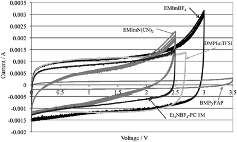
      Fig. 18 Cyclic voltammograms for different ILs at 5 mV s−1. Reproduced from ref. 272 with permission of The Royal Society of Chemistry.  
      图18 不同ILs在5 mV s-1时的循环伏安图。转载自参考。 272获得皇家化学学会许可。

      Rennie et al.273 investigated ILs with different types of cations (Fig. 19). It was found that the introduction of an ether bond into the cation alkyl side chain could effectively increase the specific capacitance and reduce the ESR of EDLCs (Fig. 20). The authors attributed this to the introduction of a small electronegative region to the cation structure through the ether bond, facilitating a denser packing of ions at the electrolyte|electrode interface, resulting in an increased charge amount.  
      Rennie等[273]研究了不同类型阳离子的ILs（图19）。发现在阳离子烷基侧链中引入醚键可以有效地增加比电容并降低EDLC的ESR（图20）。作者将此归因于通过醚键向阳离子结构引入小的电负性区域，促进离子在电极界面处更密集的堆积，导致电荷量增加。

      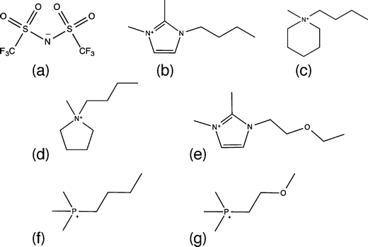
      Fig. 19 Schematic structure of the constituent ions in ILs studied in ref. 273: (a) Tf2N, (b) 1-n-butyl-2,3-dimethylimidazolium (BMIM), (c) N-n-butyl-N-methylpiperidinium (BMPi), (d) N-n-butyl-N-methylpyrrolidinium (BMPy), (e) 1-(2-ethoxyethyl)-2,3-dimethyl-1H-imidazol-3-ium (EtO(CH2)2MMIM), (f) butyltrimethylphosphonium (P2225), and (g) (2-methoxyethyl)trimethylphosphonium (P222(201)). Reprinted with permission from ref. 273 (open access).  
      图19参考文献中研究的IL中的组成离子的示意结构。 273：（a）Tf2N，（b）1-正丁基-2,3-二甲基咪唑鎓（BMIM），（c）N-正丁基-N-甲基哌啶鎓（BMPi），（d）N-正丁基-N-甲基吡咯烷鎓（BMPy），（e）1-（2-乙氧基乙基）-2,3-二甲基-1H-咪唑-3-鎓（EtO（CH2）2MMIM），（f）丁基三甲基鏻（P2225）和（g）（2-）甲氧基乙基）三甲基鏻（P222（201））。经过ref的许可转载。 273（开放获取）。

      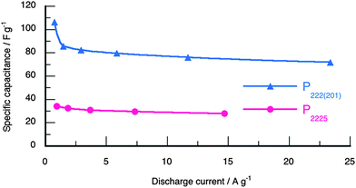
      Fig. 20 Specific capacitance determined at different rates of constant current discharge between 0 and 2.5 V for cells using phosphoniumbased ILs as electrolytes. Reprinted with permission from ref. 273 (open access).  
      图20使用基于鏻的IL作为电解质的电池在0和2.5V之间的不同恒定电流放电速率下测定的比电容。经过ref的许可转载。 273（开放获取）。

      Anions of ILs also play an important role in their hydrophilic–hydrophobic properties. The hydrophobicity was found to increase in the following order: CH3CO2− (acetate), NO3− (nitrate) < Tf−, BF4− < PF6−, TFSI− (hydrophobic).274 In addition, a small amount of water in ILs is often deleterious to their ESPW.275 Therefore, hydrophobic anions such as TFSI− and FSI− have received increasing attention for their usage in ESs.254,276  
      IL的阴离子在其亲水 -疏水性质中也起重要作用。发现疏水性按以下顺序增加：CH3CO2-（乙酸盐），NO3-（硝酸盐）<Tf-，BF4-<PF6-，TFSI-（疏水性）.274此外，ILs中的少量水是因此，疏水性阴离子如TFSI和FSI-在ESs中的应用受到越来越多的关注.244,276

    - 3.3.2.1.2. Protic ionic liquids. 质子离子液体
      Protic ILs normally attract limited interest as electrolytes for EDLCs.277–280 This may be because a much lower operative cell voltage (1.2–2.5 V) can be seen for EDLCs with protic ILs when compared with aprotic ILs. The protic ILs include protic pyrrolidinium nitrate (PyNO3),277 triethylammonium bis(trifluoromethylsufonyl)imide ([Et3NH][TFSI]),278,280 pyrrolidinium bis(trifluoromethanesulfonyl)imide ([Pyrr][TFSI]),279 and diisopropyl-ethyl-ammonium bis(trifluoromethanesulfonyl)imide ([DIPEA][TFSI]).279 Protic ILs, however, have some advantages such as being generally easier to synthesize and cheaper compared to aprotic ILs.280,281   
      Protic IL通常作为EDLC的电解质引起有限的兴趣.277-280这可能是因为与非质子IL相比，*具有质子IL的EDLC可以看到低得多的手术室电压（1.2-2.5V）*。质子IL包括质子吡咯烷硝酸盐（PyNO3），277三乙基铵双（三氟甲基磺酰基）酰亚胺（[Et3NH] [TFSI]），278,280吡咯烷双（三氟甲磺酰基）酰亚胺（[Pyrr] [TFSI]），279和二异丙基 -乙基铵双（三氟甲磺酰基）酰亚胺（[DIPEA] [TFSI]）。279然而，与非质子IL相比，Protic IL具有一些优点，例如通常更容易合成和更便宜.280,281
      
    - 3.3.2.1.3. Mixture of ionic liquids.
      As previously mentioned, the most commonly studied ILs have higher melting points above 0 °C, which prevent their use as ES electrolytes for low-temperature applications. In order to extend the operative temperature range to lower temperatures significantly below 0 °C, the strategy of a mixture of IL mixtures has been explored.276,282,283 For example, Lin et al.282 developed some eutectic IL mixtures of propylpiperidinium bis[fluorosulfonyl]imide ([PIP13][FSI]) and [PYR14][FSI] (1[thin space (1/6-em)]:[thin space (1/6-em)]1 by weight or molar ratio). This IL mixture had a liquid-state range lowered to −80 °C. Using exohedral nanostructured carbon (nanotubes and onions) as electrodes, the EDLCs using this [PIP13][FSI] + [PYR14][FSI] IL mixture electrolyte could be operable within a significantly expanded temperature range from −50 to 100 °C (Fig. 21).   
      如前所述，最常研究的IL具有高于0℃的较高熔点，这阻止了它们用作低温应用的ES电解质。为了将操作温度范围扩展到显着低于0℃的较低温度，已经探索了IL混合物的策略.276,282,283例如，Lin等人282开发了一些丙基哌啶双[氟磺酰基]酰亚胺的共晶IL混合物。 （[PIP13] [FSI]）和[PYR14] [FSI]（1 [稀薄空间（1/6-em）]：[稀薄空间（1/6-em）] 1（重量或摩尔比）。该IL混合物的液态范围降至-80℃。使用外切纳米结构碳（纳米管和洋葱）作为电极，使用[PIP13] [FSI] + [PYR14] [FSI] IL混合电解质的EDLC可在-50至100°C的显着扩展温度范围内操作（图.21）。

      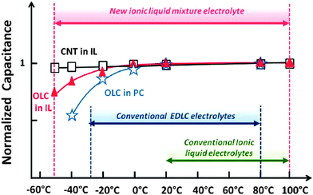
      Fig. 21 Normalized capacitance (C/C20°C) for the OLC and VA-CNT electrodes in ([PIP13][FSI])0.5([PYR14][FSI])0.5 IL mixture and PC + 1 M TEABF4 electrolytes. Capacitances were calculated at 100 mV s−1, except for the −50 °C (1 mV s−1) and −40 °C (5 mV s−1) experiments. Reprinted with permission from ref. 282. Copyright 2011 American Chemical Society.  
      图21（[PIP13] [FSI]）0.5（[PYR14] [FSI]）0.5 IL混合物和PC + 1M TEABF4电解质中OLC和VA-CNT电极的归一化电容（C /C20°C）。除了-50℃（1mV s-1）和-40℃（5mV s-1）实验外，电容在100mV s-1下计算。经过ref的许可转载。 282.版权所有2011美国化学学会。
  - 3.3.2.2. Solvent-free ionic liquids for pseudocapacitors
    Ionic liquids have also been explored as the electrolytes for pseudocapacitors. Normally, for ES electrode materials, the pseudocapacitance contribution is closely related to surface functionalities, IL's hydrophobicity (the anions) and free water in ILs.277 In an earlier work, Rochefort et al.284 provided experimental evidence for pseudocapacitance could be achieved on thermally prepared RuO2 electrodes in a protic IL composed of 2-methylpyridine (α-picoline) and trifluoroacetic acid (TFA) while no obvious pseudocapacitance could be observed in [EMIM][BF4] IL. It was reported that the shape of cyclic voltammograms and the specific capacitance (83 F g−1) of the RuO2 electrode in a protic IL were similar to those obtained in a 0.1 M H2SO4 aqueous electrolyte. However, the high viscosity and slow proton transfer in the IL electrolyte could limit the charging rate. Mayrand-Provencher et al.285 tested a series of pyridinium-based protic ILs as ES electrolytes, and found that the alkyl chain length of a cation's substituent and the substituent position had an effect on the electrolyte conductivity and viscosity, ESPW, specific capacitance and cycling stability of the RuO2 electrodes. Using the in situ infrared spectroscopy technique, Richey et al.286 tried to obtain a fundamental understanding of individual cation and anion dynamics of [EMIM][Tf] IL in a working RuO2-based pseudocapacitor.  
    还研究了离子液体作为赝电容器的电解质。通常，对于ES电极材料，赝电容的贡献与ILs中的表面官能度，IL的疏水性（阴离子）和游离水密切相关.277在早期的工作中，Rochefort等人[284]提供了可以在热学上实现赝电容的实验证据。制备RuO2电极的质子IL由2-甲基吡啶（α-甲基吡啶）和三氟乙酸（TFA）组成，而在[EMIM] [BF4] IL中没有观察到明显的假电容。据报道，质子IL中RuO2电极的循环伏安图的形状和比电容（83F g-1）与在0.1M H2SO4含水电解质中获得的相似。然而，IL电解质中的高粘度和慢质子转移可能限制充电速率。 Mayrand-Provencher等[285]测试了一系列基于吡啶鎓的质子IL作为ES电解质，发现阳离子取代基的烷基链长和取代基位置对电解质电导率和粘度，ESPW，比电容和RuO2电极的循环稳定性。利用原位红外光谱技术，Richey等[286]试图在工作的基于RuO2的赝电容器中获得对[EMIM] [Tf] IL的个体阳离子和阴离子动力学的基本理解。

    Other less expensive metal oxides than RuO2, such as Mn oxides, have also been investigated as electrode materials for IL electrolyte-based ESs.287–290 For example, Chang et al.291 obtained pseudocapacitive performance from a Mn oxide in an aprotic 1-ethyl-3-methylimidazolium-dicyanamide aprotic IL electrolyte (i.e., without involving protons and alkali cations in the electrolyte). Mn oxide showed a specific capacitance of 72 F g−1 with a potential window of ∼2 V in the [EMIM][DCA] electrolyte. Using XPS and in situ X-ray absorption spectroscopy (XAS), Chang et al.292 found that smaller [DCA]− anions, instead of [BMP]+ cations, could reversibly insert/desert into the tunnels between MnO6 octahedral units, compensating the Mn3+/Mn4+ valent state variation during the charging–discharging process in the [BMP][DCA] IL electrolyte, as expressed as eqn (9): $MnO_{2−x}(DCA)_{2x} + 2xe^− ↔ MnO_{2−x} + 2xDCA^− (x ≤ 0.5)$  
    其他比RuO2更便宜的金属氧化物，如Mn氧化物，也被研究作为基于IL电解质的ES的电极材料.287-290例如，Chang等人291从非质子中的Mn氧化物获得了赝电容性能1-乙基-3-甲基咪唑 -二氰胺非质子IL电解质（即，不涉及电解质中的质子和碱金属阳离子）。在[EMIM][DCA]电解质中，Mn氧化物的比电容为72Fg-1，电位窗为~2V。 Chang et al.292使用XPS和原位X射线吸收光谱（XAS）发现较小的[DCA]-阴离子，而不是[BMP] +阳离子，可以可逆地插入/离开MnO6八面体单元之间的隧道，补偿[BMP] [DCA] IL电解液中充电 -放电过程中Mn3+/Mn4+价态的变化，如式（9）所示: $MnO_{2−x}(DCA)_{2x} + 2xe^− ↔ MnO_{2−x} + 2xDCA^− (x ≤ 0.5)$

    When using protic ILs rather than aprotic ones, Ruiz et al.293 found that MnO2 electrodes could exhibit a pseudocapacitive behaviour in protic ILs composed of 2-methoxypyridinium and trifluoroacetate, as observed by in situ UV-visible spectroscopy. In addition to the extensively studied MnO2 materials, other pseudocapacitive material–IL electrolyte systems have also been studied, such as Ru-doped Cu oxide in 3-carboxymethyl-1-methylimidazolium bisulfate [CMIM][HSO4],294 TiO2 in [EMIM][TFSI],295 Fe2O3 in [EMIM][BF4],296 porous Ni in [EMIM][BF4],297 nanocomposites composed of VN and N-doped carbon in [PYR14][TFSI] and [PYR14][FSI],298 poly(3-methylthiophene) in [EMIM][TFSI],299 as well as PAN in [EMIM][BF4]300 and [EMIM][TFSI].301  
    当使用质子IL而不是非质子ILs时，Ruiz等[193]发现MnO2电极在由2-甲氧基吡啶鎓和三氟乙酸盐组成的质子IL中表现出假赝能行为，如通过原位紫外 -可见光谱观察到的。除了广泛研究的MnO2材料外，还研究了其他赝电容材料-IL电解质体系，如在[EMIM]中的3-羧甲基-1-甲基咪唑硫酸氢盐[CMIM] [HSO4]中的Ru掺杂Cu氧化物，294 TiO2。 [TFSI]，[EMIM] [BF4]中的295Fe2O3，[EMIM] [BF4]中的296个多孔Ni，[PYR14] [TFSI]和[PYR14] [FSI]中由VN和N掺杂碳组成的297个纳米复合材料， [EMIM] [TFSI]中的298聚（3-甲基噻吩），299以及[EMIM] [BF4] 300和[EMIM] [TFSI]中的PAN .301
  - 3.3.2.3. Solvent-free ionic liquids for hybrid electrochemical capacitors.
     ILs have also been explored as electrolytes for hybrid ESs with asymmetric electrode configurations (e.g., AC//poly(3-methylthiophene),302,303 AC//MnO2,304 and AC//graphene-supported Fe2O3296). For example, Balducci et al.302 used both [BMIM][PF6] and [PYR14][TFSI] ILs as electrolytes for AC//poly(3-methyl-thiophene) (PMeT) hybrid ESs, and observed some enhanced cell voltage, cycling life at high temperatures when compared to that of ESs using an organic electrolyte (e.g., TEABF4/PC). The AC//pMeT hybrid ES using [PYR14][TFSI] IL could deliver maximum energy and power densities of 24 W h kg−1 and 14 kW kg−1, respectively, after the first thousand cycles at 10 mA cm−2 and 60 °C. Sun et al.296 used [EMIM][BF4] IL as an electrolyte for asymmetric ESs with an activated PANI-derived carbon nanorod as a negative electrode and a graphene sheet-supported Fe2O3 nanoparticle as a positive electrode. This hybrid ES was able to operate within a wide voltage range of 0–4 V, and could deliver a very high maximum energy density of 177 W h kg−1 and showed a relatively large energy density of 62.4 W h kg−1 at a high power density of 8 kW kg−1. As discussed previously, the cycling stability of a hybrid ES is always an important concern when compared to that of an EDLC. In this regard, Arbizzani et al.266 reported that although a AC//pMeT hybrid ES using [PYR14][TFSI] IL as an electrolyte could deliver a 30% of higher energy than the carbon-based AEDLC, its cycling stability was much lower than the latter. The specific capacitance of this hybrid ES was decreased by 50% after 5000 cycles due to the deterioration of the pMeT electrode.  
     *IL还被探索为具有不对称电极构型的混合ES的电解质*（例如，AC //聚（3-甲基噻吩），302,303 AC //MnO 2,304和AC //石墨烯负载的Fe2O3O9）。例如，Balducci等人302使用[BMIM][PF6]和[PYR14][TFSI] ILs作为AC //聚（3-甲基 -噻吩）（PMeT）杂化ES的电解质，并观察到一些增强的电池电压与使用有机电解质的ES（例如TEABF4 /PC）相比，在高温下循环寿命。使用[PYR14] [TFSI] IL的AC //pMeT混合ES在10 mA cm-2的第一千次循环后，可以分别提供24 W h kg-1和14 kW kg-1的最大能量和功率密度。 60°C。 Sun等人使用[EMIM] [BF4] IL作为不对称ES的电解质，其中活化的PANI衍生的碳纳米棒作为负电极并且石墨烯片负载的Fe2O3纳米颗粒作为正电极。这种混合ES能够在0-4 V的宽电压范围内工作，并且可以提供177 W h kg-1的非常高的最大能量密度，并且在相同的情况下显示出62.4 W h kg-1的相对大的能量密度。高功率密度为8 kW kg-1。如前所述，与EDLC相比，混合ES的循环稳定性始终是一个重要的问题。在这方面，Arbizzani等人报道，尽管使用[PYR14][TFSI] IL作为电解质的AC //pMeT杂化ES可以提供​​比碳基AEDLC高30％的能量，但其循环稳定性很高低于后者。由于pMeT电极的劣化，该混合ES的比电容在5000次循环后降低了50％。

- 3.3.3. Mixtures of ionic liquids and organic solvents.
  In order to reduce the viscosity and increase the conductivity of ILs, particularly at low temperatures, mixture solutions containing ILs and organic solvents have been explored as electrolytes for ESs. Similar to the research for solvent-free ILs-based ESs, imidazolium-based ILs have been seen to be the most extensively studied ones in organic solvents due to their relatively high conductivity among commonly used ILs. In this aspect, McEwen et al.305 found that the conductivities of IL-based carbonate electrolytes (ILs: [EMIM][PF6] and [EMIM][BF4], both of which contain EMI cations) were roughly 25% greater than that based on the TEABF4 organic electrolyte. A conductivity as high as 27 mS cm−1 was observed in 2 M [EMIM][PF6] plus EC–DMC solvent. In addition, a 2 M [EMIM][PF6]/PC electrolyte could give both a higher specific capacitance and more thermal stability than 1 M TEABF4/PC. Orita et al.306 studied a series of alkyl-functionalized ILs mixed with organic solvents (typically PC) as electrolytes for EDLCs. Two ILs, one composed of imidazolium cations with allyl groups (diallylimidazolium (DAIM)) and TFSA− anions, and the other composed of imidazolium with saturated alkyl groups (EMIM) and TFSA− anions, were used in the preparation of solvent-based IL electrolytes. EDLC measurements in 1.4 M IL electrolytes showed that the former electrolyte could give higher capacitance and lower resistance within a wider temperature range than the latter. However, the stability of the EDLC using 1.4 M [DAIM][BF4]/PC was lower than the one using [EMIM][BF4]/PC. It was also demonstrated that the stability could be improved though the addition of DMC to PC.  
  为了降低粘度并增加IL的电导率，特别是在低温下，已经探索了含有IL和有机溶剂的混合物溶液作为ES的电解质。与基于无溶剂ILs的ES的研究类似，基于咪唑的ILs在有机溶剂中被认为是最广泛研究的，因为它们在常用的IL中具有相对高的电导率。在这方面，McEwen等人[305]发现基于IL的碳酸盐电解质（ILs：[EMIM] [PF6]和[EMIM] [BF4]的电导率，两者都含有EMI阳离子）大约比其高25％。基于TEABF4有机电解质。在2M [EMIM] [PF6]加EC-DMC溶剂中观察到高达27mS cm-1的电导率。此外，2 M [EMIM] [PF6] /PC电解质可以提供比1 M TEABF4 /PC更高的比电容和更高的热稳定性。 Orita等人研究了一系列与有机溶剂（通常为PC）混合的烷基官能化ILs作为EDLC的电解质。两种IL，一种由具有烯丙基的咪唑阳离子（二烯丙基咪唑（DAIM））和TFSA-阴离子组成，另一种由咪唑鎓与饱和烷基（EMIM）和TFSA-阴离子组成，用于制备溶剂型IL。电解质。在1.4M IL电解质中的EDLC测量显示，前者电解质在比后者更宽的温度范围内可以提供更高的电容和更低的电阻。然而，使用1.4M [DAIM] [BF4] /PC的EDLC的稳定性低于使用[EMIM] [BF4] /PC的EDLC的稳定性。还证明了通过向PC添加DMC可以改善稳定性。
  
  Lin et al.307 found that although the bare molecular sizes of [EMIM]+ and [TFSI]− were similar, they had different solvated ion sizes in the ACN solvent and an increase in size in the order of: [TFSI]− in ACN > [EMI]+ in ACN > [EMI]+ ≅ [TFSI]−. Therefore, the optimization of the pore structure and size distribution of porous carbon with respect to IL size in an organic solvent should consider the solvated ion size, which might be different from that in the pure IL electrolyte.  
  Lin等[307]发现虽然[EMIM]+和[TFSI]-的分子尺寸相似，但它们在ACN溶剂中具有不同的溶剂化离子尺寸，并且尺寸增加的顺序为：[TFSI]- in ACN > [EMI]+ in ACN > [EMI]+≅[TFSI]-。因此，相对于有机溶剂中的IL尺寸，多孔碳的孔结构和尺寸分布的优化应考虑溶剂化的离子尺寸，其可能不同于纯IL电解质中的溶剂化离子尺寸。

  As mentioned in Section 3.2.2, the use of ADN as an organic solvent has advantages of a larger EDLC operative cell voltage and higher flash point than the ACN solvent.145 However, the solubility of commonly used conducting salt such as TEABF4 in ADN is much lower than in ACN, thus limiting its application.145 The use of IL such as 1-ethyl-3-methylimidazolium bis[(trifluoromethyl)sulfonyl]imide ([C2mIM][TFSI]) as a salt in ADN was tested to address this issue, and the results showed higher salt solubility.308  
  如第3.2.2节所述，使用ADN作为有机溶剂具有比ACN溶剂更大的EDLC操作电池电压和更高闪点的优点.145但是，常用的导电盐如TEABF4在ADN中的溶解度是比ACN低得多，从而限制了它的应用.145测试了使用IL如1-乙基-3-甲基咪唑双[（三氟甲基）磺酰]亚胺（[C2mIM] [TFSI]）作为ADN中的盐这个问题，结果显示盐溶解度较高.308

  It should be pointed out that not all the mixtures of IL and organic solvents provide a benefit to ES performance. For example, Palm et al.309 reported the addition of an organic solvent (ACN, PC or GBL) to pure [EMIM][BF4] to compose an electrolyte for EDLCs, and the results showed some negative effects although this mixing strategy could lead to a decreased viscosity and melting point, and increased conductivity when compared to those of pure [EMIM][BF4]. Therefore, attention should be paid to not compromising the important advantages of pure IL when adding solvent into the IL for the ES electrolyte.  
  应该指出的是，并非IL和有机溶剂的所有混合物都对ES性能有益。例如，Palm等人报道在纯[EMIM] [BF4]中加入有机溶剂（ACN，PC或GBL）来构成EDLC的电解质，结果显示出一些负面影响，尽管这种混合策略可能导致与纯[EMIM] [BF4]相比，粘度和熔点降低，电导率增加。因此，在向ES电解质的IL中添加溶剂时，应注意不要损害纯IL的重要优点。

  In addition, imidazolium-based ILs mixed with organic solvents have also been explored as electrolytes for both pseudocapacitors and hybrid ESs.304 For example, Zhang et al.304 found that the introduction of DMF to [BMIM][PF6] IL increased the capacitance and at the same time decreased the internal resistance of the asymmetric AC//MnO2 ES. This improvement was attributed to the improved electrolyte penetration and ion mobility when compared to pure IL.  
  此外，还研究了与有机溶剂混合的基于咪唑的ILs作为赝电容器和杂化ES的电解质.304例如，Zhang等人[304]发现向[BMIM] [PF6] IL引入DMF增加了电容同时降低了不对称AC //MnO2 ES的内阻。与纯IL相比，这种改进归因于改善的电解质渗透和离子迁移率。

  Due to the relatively high ESPWs, pyrrolidinium-based ILs have also been mixed with organic solvents to form mixture electrolytes for ESs.310–312 As observed, the addition of organic solvents to the pyrrolidinium-based ILs significantly increased the conductivity and decreased the viscosity of the electrolytes due to the salvation effect provided by the organic solvents.310 Compared to the conventional TEABF4/PC organic electrolyte, the use of pyrrolidinium-based ILs mixed with PC effectively increased the operative EDLC cell voltage to 3.2–3.5 V.311,312  
  由于相对较高的ESPW，基于吡咯烷的ILs也与有机溶剂混合形成ESs的混合电解质.310-312如所观察到的，向基于吡咯烷鎓的ILs中添加有机溶剂显着提高了电导率并降低了粘度有机溶剂提供的拯救效应导致电解质的增加。与传统的TEABF4 /PC有机电解质相比，使用基于吡咯烷的ILs与PC混合有效地将有效EDLC电池电压提高到3.2-3.5 V.311,312

  Regarding ammonium-based ILs, Abdallah et al.313 found the addition of [TMPA][TFSI] IL could reduce both the flammability and volatility of ACN solvent- based electrolytes. With respect to sulfonium-based ILs, Brandt et al.314 reported that the EDLC using an electrolyte containing 3.8 M [Me3S][TFSI] in PC could show an operative cell voltage up to 2.9 V. This EDLC also showed a stable performance at both 20 and 60 °C while an EDLC using [Me3S][TFSI]/PC with a lower concentration of 1.9 M did not show a stable performance. This result was thought to be the different abilities to inhibit the anodic oxidation of the Al current collector in these two different electrolytes. Regarding the phosphonium-based ILs, Frackowiak et al.315 found that the amount of ACN in trihexyl(tetradecyl)phosphonium bis(trifluoromethylsulfonyl)imide ((C6H13)3(P(C14H29))[Tf2N]) or trihexyl(tetradecyl) phosphonium dicyanamide ((C6H13)3(P(C14H29))[(CN)2N]) could play an important role in both specific energy and power densities of EDLCs.315 An AC-based EDLC using (C6H13)3(P(C14H29))[Tf2N] IL with 25 wt% ACN could achieve an operative cell voltage of 3.4 V and had a higher energy density of about 40 W h kg−1 and better cycling stability when compared to that using conventional ILs and containing a different amount of ACN. Regarding piperidinium-base ILs, Lewandowski et al.316 reported that the ionic conductivity (1.5 mS cm−1 at 25 °C) of pure N-methyl-N-propylpiperidinium bis(trifluoromethanesulphonyl)imide ([MePrPip][NTf2]) IL could be significantly increased to about 40 mS cm−1 after the addition of 52 wt% ACN. This mixture electrolyte showed an ESPW of about 3.7 V on AC electrodes.  
  关于铵基ILs，Abdallah等[313]发现添加[TMPA] [TFSI] IL可以降低ACN溶剂型电解质的可燃性和挥发性。关于锍基ILs，Brandt等[314]报道在PC中使用含3.8M [Me3S] [TFSI]的电解质的EDLC可显示出高达2.9V的工作电池电压。该EDLC也表现出稳定的性能。在20和60℃下，使用[Me3S] [TFSI] /PC的较低浓度1.9M的EDLC没有表现出稳定的性能。该结果被认为是抑制这两种不同电解质中Al集电器的阳极氧化的不同能力。关于基于鏻的ILs，Frackowiak等人[315]发现在三己基（十四烷基）鏻双（三氟甲基磺酰基）酰亚胺（（C6H13）3（P（C14H29））[Tf2N]）或三己基（十四烷基）鏻中的ACN含量二氰胺（（C6H13）3（P（C14H29））[（CN）2N]）在EDLCs的比能和功率密度方面都起着重要作用.315基于AC的EDLC（C6H13）3（P（C14H29））具有25wt％ACN的[Tf2N] IL可以实现3.4V的操作电池电压并且具有更高的能量密度，约40Wh kg-1，并且与使用常规IL并且含有不同量的相比具有更好的循环稳定性。 ACN。关于哌啶鎓基ILs，Lewandowski等[316]报道了纯N-甲基-N-丙基哌啶双（三氟甲磺酰）酰亚胺（[MePrPip] [NTf2]）IL的离子电导率（在25℃时为1.5 mS cm-1）加入52wt％ACN后，可显着增加至约40mS cm-1。该混合电解质在AC电极上显示出约3.7V的ESPW。

  Some comparative studies between different types of ILs mixed with organic solvents have also been reported.311,317,318 For example, Orita et al.318 investigated various sulfonium- and thiophenium-based ILs (Fig. 22) in the PC solvent as EDLC electrolytes. They found that [DEMS][TFSA]/PC had the highest ionic conductivity among the investigated ILs with TFSA anions. The ionic conductivity of [DEMS][BF4]/PC was higher than those of [DEMS][PF6]/PC and [DEMS][TFSA]/PC. The EDLC using the [DEMS][BF4]/PC electrolyte showed a higher specific capacitance than the one using the conventional [EMIM][BF4]/PC or the [TEMA][BF4]/PC electrolyte. However, the [DEMS][BF4]/PC electrolyte resulted in EDLCs having a shorter lifetime when compared to that in an [EMIM][BF4] electrolyte.  
  还报道了在与有机溶剂混合的不同类型的IL之间的一些比较研究.311,317,318例如，Orita等人[318]在PC溶剂中研究了各种基于锍和噻吩的IL（图22）作为EDLC电解质。他们发现[DEMS] [TFSA] /PC在所研究的具有TFSA阴离子的IL中具有最高的离子电导率。 [DEMS] [BF4] /PC的离子电导率高于[DEMS] [PF6] /PC和[DEMS] [TFSA] /PC的离子电导率。使用[DEMS] [BF4] /PC电解质的EDLC显示出比使用常规[EMIM] [BF4] /PC或[TEMA] [BF4] /PC电解质的电容更高的比电容。然而，与[EMIM] [BF4]电解质相比，[DEMS] [BF4] /PC电解质导致EDLC具有更短的寿命。

  
  Fig. 22 Chemical structures of cations used in ref. 318: (a) DMES (dimethylethylsulfonium), (b) DEMS (diethylethylsulfonium), (c) EMPS (ethylmethylpropylsulfonium), (d) BDMS (buthyldimethylsulfonium), (e) MTT (1-methyltetrahydrothiophenium), (f) ETT (1-ethyltetrahydrothiophenium), (g) PTT (1-propyltetrahydrothiophenium), (h) BTT (1-butyltetrahydrothiophenium), (i) MOT (1-methyl-[1,4]-thioxonium). Reprinted from ref. 318, with permission from Elsevier.  
  图22参考文献中使用的阳离子的化学结构318：（a）DMES（二甲基乙基锍），（b）DEMS（二乙基乙基锍），（c）EMPS（乙基甲基丙基锍），（d）BDMS（丁基二甲基锍），（e）MTT（1-甲基四氢噻吩），（f）ETT（1） -（四 -四氢四氢噻吩）），（g）BTT（1-丁基四氢噻吩），（i）MOT（1-甲基 - [1,4]  -硫代鎓）。转载自参考。 318，经Elsevier许可。

  Brandt et al.319 found that EDLCs with a 1.9 M [PYR14][BF4]/PC electrolyte could show both higher energy and power densities than EDLCs with 1.5 M [PYR14][TFSI]/PC, 3.8 M [Me3S][TFSI]/PC or conventional 1 M TEABF4/PC at all investigated current densities. This was attributed to the larger operative cell voltage (Fig. 23).

  
  Fig. 23 Ragone-like plots of EDLCs containing different electrolytes. The average values of energy and power densities refer to the total AC loading in the cell. Reprinted from ref. 319, with permission from Elsevier.  
  图23包含不同电解质的EDLC的类似Ragone的图。能量和功率密度的平均值是指电池中的总AC负载。转载自参考。 319，经Elsevier许可。

  It should be noted that besides aprotic ILs, protic ILs mixed with organic solvents have also been studied although it received much less attention when compared to aprotic ILs due to their lower cell operative cell voltage (1.5–2.5 V).278,280,320–322 Several studies reported that ELDCs using mixture electrolytes containing protic ILs and organic solvents (e.g., [Bu3PH][BF4] in GBL320 and [Pyrr][NO3] in GBL321) could operate within a wide temperature range from −40 °C to 80 °C.  
  值得注意的是，除了非质子性ILs之外，还研究了与有机溶剂混合的质子性ILs，尽管由于其较低的细胞工作电池电压（1.5-2.5 V），与非质子性IL相比，它受到的关注要少得多.278,280,320-322据报道，使用含有质子IL和有机溶剂（例如GBL320中的[Bu3PH] [BF4]和GBL321中的[Pyrr] [NO3]）的混合电解质的ELDC可以在-40°C至80°C的宽温度范围内操作。

  In addition, theoretical modeling and simulation work has also been carried out to study the EDL structure and capacitance in the mixtures of ILs and organic solvents by using MD simulations.244,323  
  此外，还进行了理论建模和模拟工作，通过MD模拟研究了ILs和有机溶剂混合物中的EDL结构和电容.244,323

#### 3.4. Solid- or quasi-solid-state electrolytes for ESs