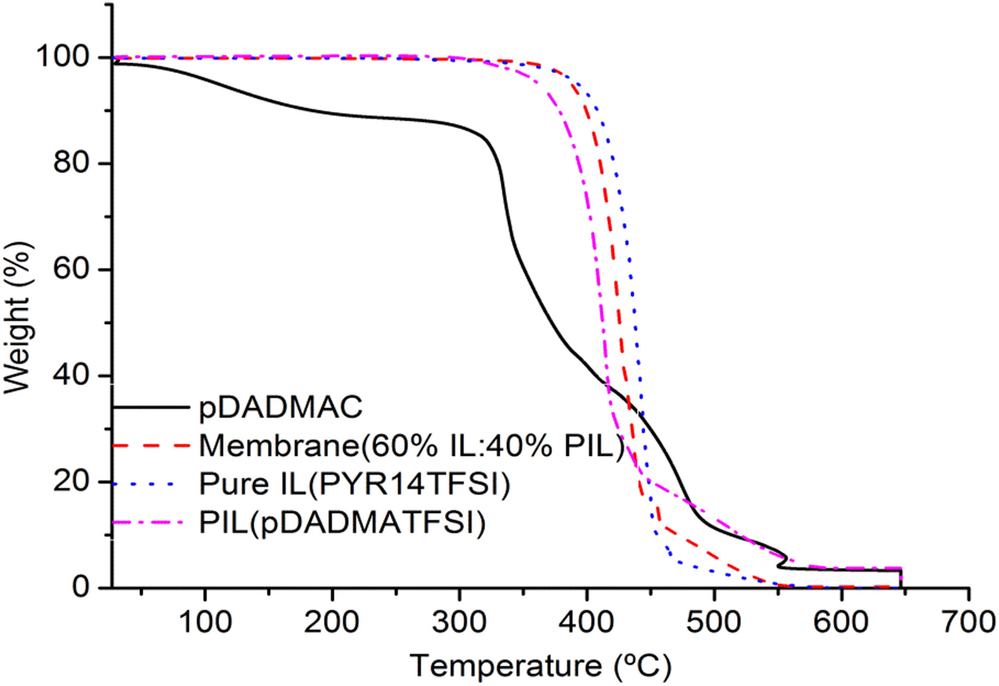
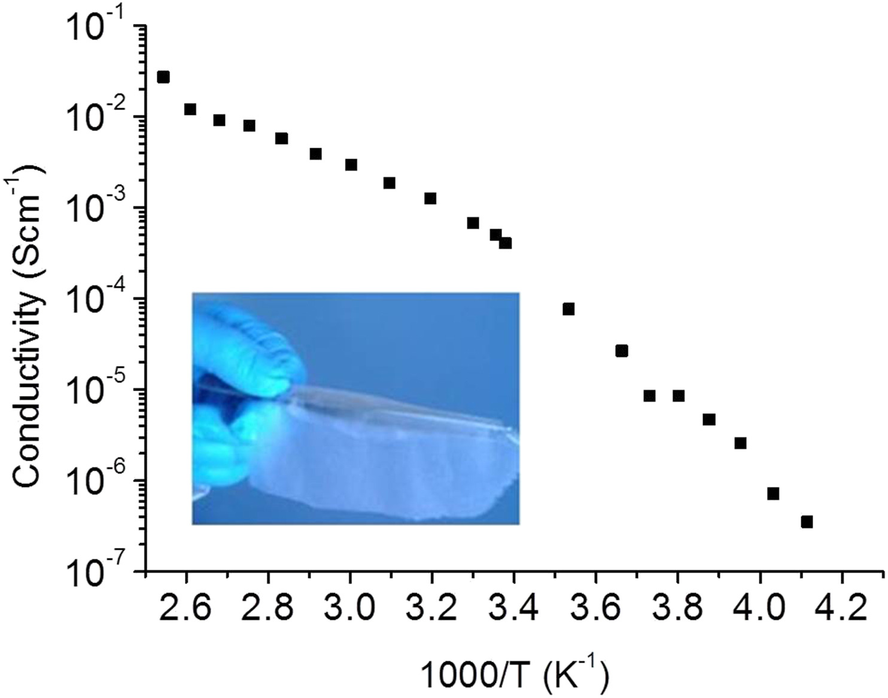
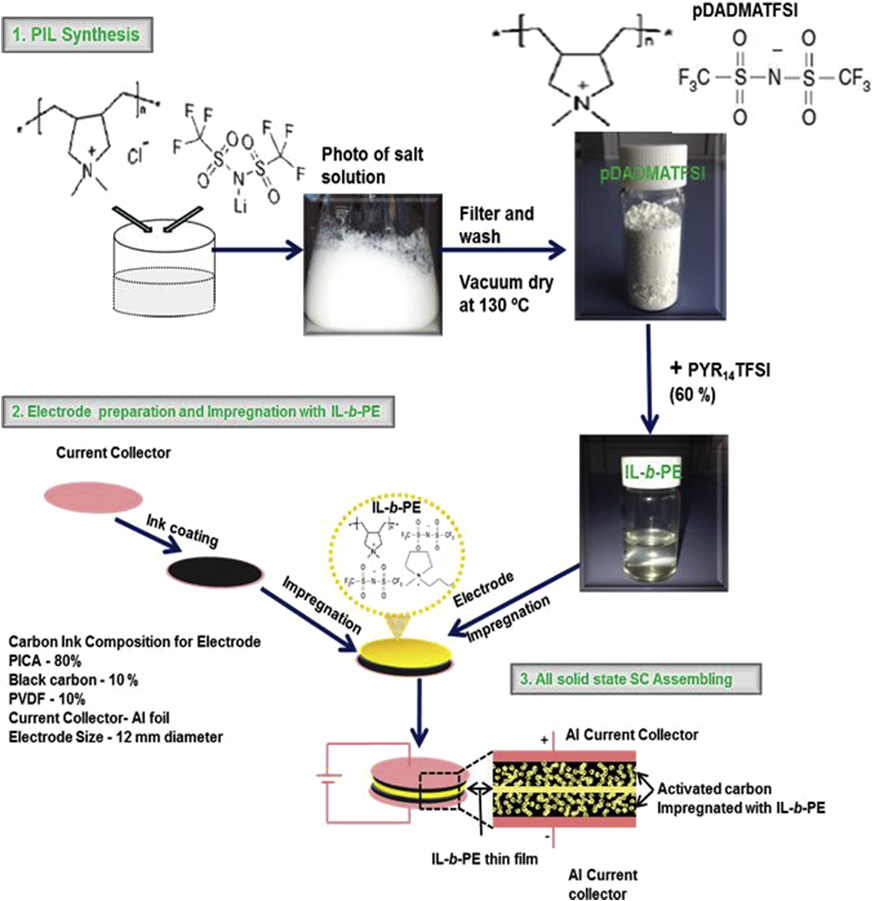
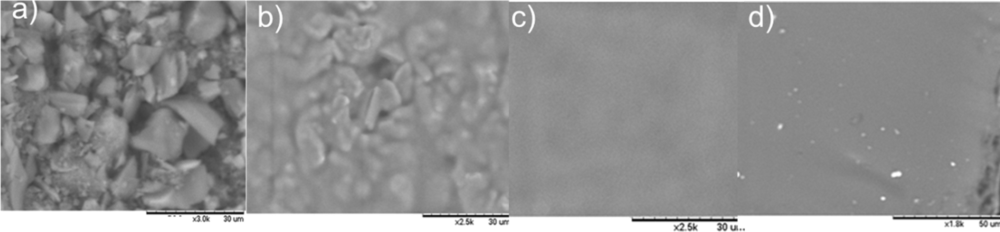
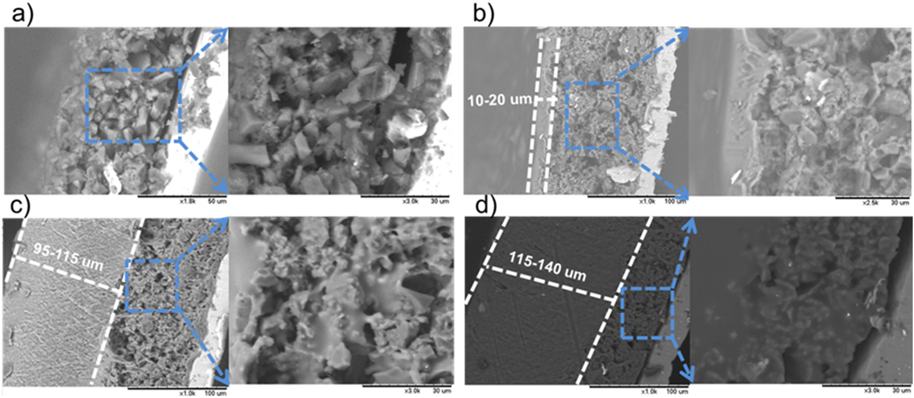
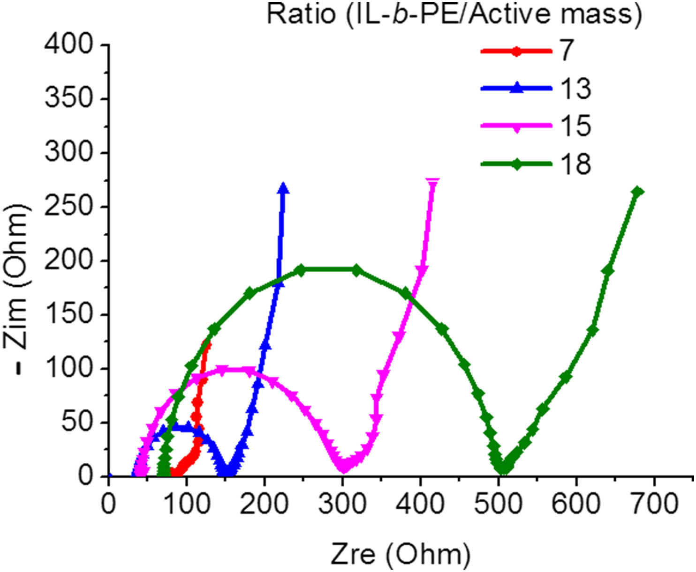
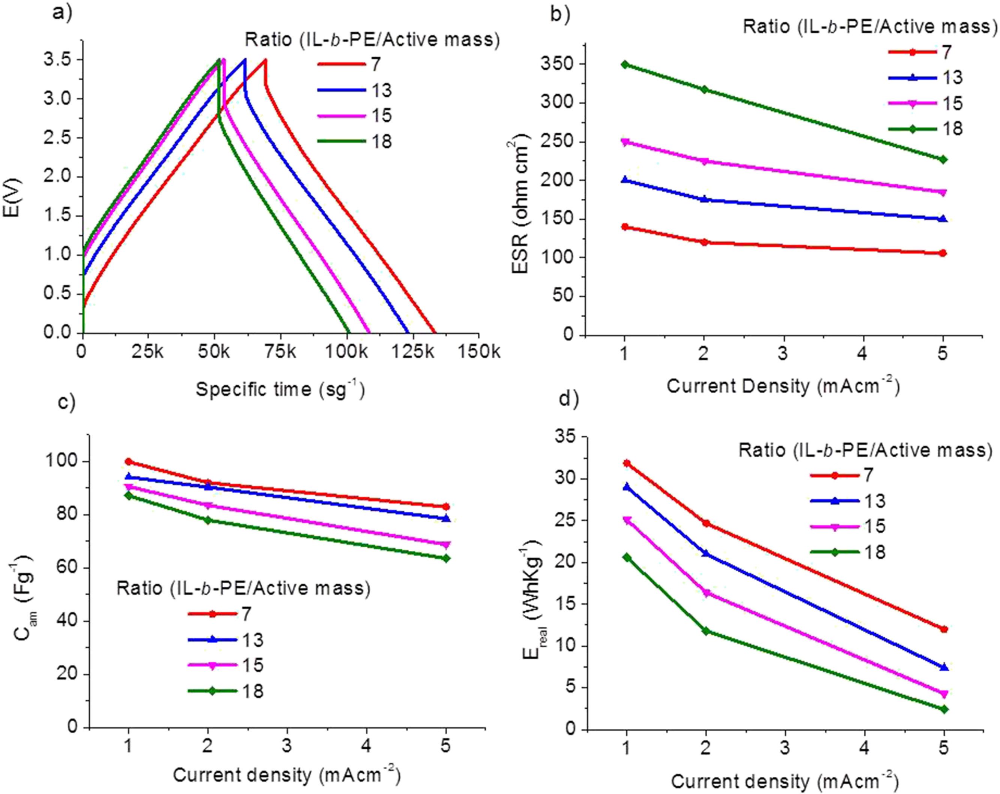
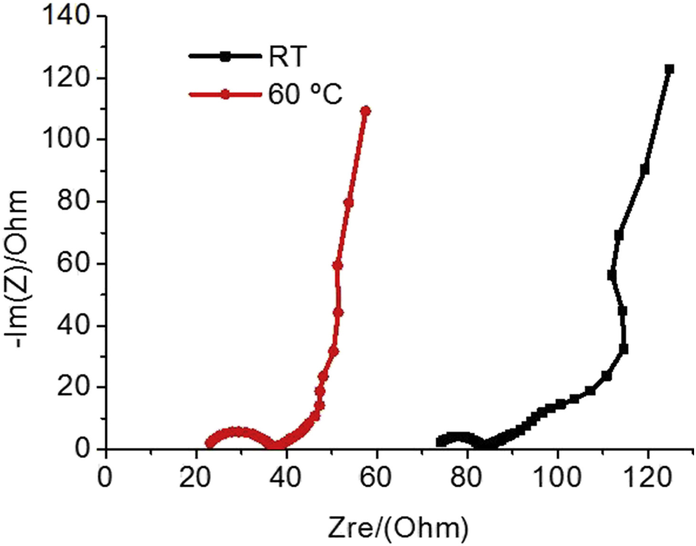
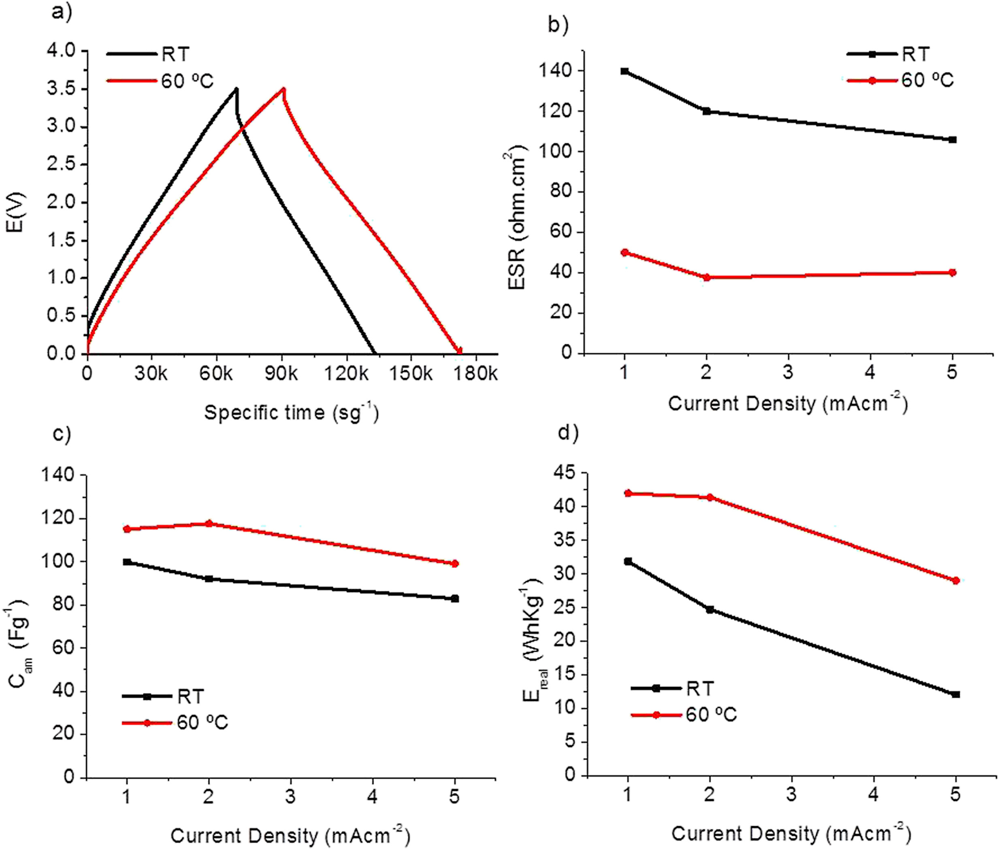

## All-solid state supercapacitors operating at 3.5 V by using ionic liquid based polymer electrolytes  采用离子液体聚合物电解质在3.5 V下工作的全固态超级电容器

> Girum Ayalneh Tiruye, David Muñoz-Torrero, Jesus Palma, Marc Anderson, Rebeca Marcilla
> Journal of Power Sources, Volume 279, 1 April 2015, Pages 472-480
> DOI: [10.1016/j.jpowsour.2015.01.039](https://doi.org/10.1016/j.jpowsour.2015.01.039)
> Keywords: All-solid state supercapacitors, Polymer electrolytes, Polymeric ionic liquids, Ionic liquids, Solid electrolytes

### 1. Introduction
Electric double-layer capacitors (EDLCs) also known as supercapacitors (SCs) are promising electrochemical energy storage devices that meet the requirements for applications where high power values and a high number of charge-discharge cycles are needed. SCs are already being used in different applications such as in digital communication systems, portable electronic devices and medical applications, memory backup systems, and hybrid electric vehicles. Despite lower specific energy, SCs exhibit a promising set of characteristics such as higher power densities, higher charge-discharge rates, better cycle stability and safer operation than batteries [1], [2], [3].  
电双层电容器（EDLC）也称为超级电容器（SC），是有希望的电化学能量存储装置，其满足需要高功率值和大量充电-放电循环的应用的要求。SC已经用于不同的应用，例如数字通信系统，便携式电子设备和医疗应用，存储器备份系统和混合动力电动车辆。尽管比能量较低，但SC具有一系列有希望的特性，例如更高的功率密度，更高的充放电率，更好的循环稳定性以及比电池更安全的操作。

The properties of electrode materials, electrolytes and electrode-electrolyte interfaces significantly determine the performance of SCs. In particular, electrolytes constitute one of the most determining factors for controlling maximum operating voltage, energy density and safety issues. In the last years, pure ionic liquids (ILs) [4], [5], [6], [7], [8] and mixtures of organic and ionic liquid electrolytes [9], [10], [11], [12] have been intensively used as liquid electrolytes in SCs. The main advantage of using ionic liquids is their higher operating voltage and corresponding higher energy densities (E = 1/2CV2) that can be stored in comparison with conventional aqueous and organic electrolytes. However, the main drawback of liquid electrolytes, including those based on ILs, is the need of additional encapsulation that limits the flexibility and integration of supercapacitors in printed circuits or textiles. These limiting factors can be solved by developing solid or quasi-solid polymer electrolytes to substitute both liquid electrolyte and separator present in conventional supercapacitors.  
电极材料，电解质和电极-电解质界面的性质显着决定了SC的性能。特别是，电解质是控制最大工作电压，能量密度和安全问题的最重要因素之一。在过去几年中，纯离子液体（ILs）[4]，[5]，[6]，[7]，[8]以及有机和离子液体电解质的混合物[9]，[10]，[11]， [12]已被广泛用作SC中的液体电解质。使用离子液体的主要优点是它们具有更高的工作电压和相应的更高的能量密度（E = 1 /2CV2），与传统的水和有机电解质相比，它们可以储存。然而，液体电解质（包括基于IL的那些）的主要缺点是需要额外的封装，这限制了超级电容器在印刷电路或纺织品中的灵活性和集成。这些限制因素可以通过开发固体或准固体聚合物电解质来代替常规超级电容器中存在的液体电解质和分离器来解决。

The most promising polymer electrolytes have been prepared by embedding several imidazolium based ILs (EMImTf, EMImFAP, EMImTFSI, EmImBF4) in different common polymer matrixes such as PAN, PVdF-HFP, PEO, PVA and PMMA [13], [14], [15], [16], [17], [18], [19], [20], [21], [22]. However, only a few of these examples have shown a specific capacitance and rate capability close to the corresponding pure ionic liquid itself. This is presumably due to their lower ionic conductivity, which hinders the development of fully solid-state SCs systems. To increase ionic conductivity values beyond 10−3 Scm−1, some researchers have attempted to employ high boiling point organic molecules such as EC, PC or TMS to partially substitute the ionic liquids in polymer electrolytes [23], [24]. Unfortunately, regardless the superior electrochemical performance of those supercapacitors, their diminished mechanical properties and toxicity of the membranes used in these systems is a serious handicap. Recently, very promising results have been obtained by Ishikawa et al. by incorporating EMImBF4 to different polysaccharides such as alginate and chitosan. The authors claimed that the good performance of those SCs (130 Fg−1 at a maximum operating voltage of 2.5 V), is similar to ones using pure EMImBF4 due to the high affinity of polysaccharides for the activated carbon electrodes [25], [26], [27]. It is worth mentioning, that the limited electrochemical stability window of imidazolium based ILs has forced most all-solid state SCs to be tested at a maximum cell voltage of 3 V hence limiting the specific energy of those devices. Other cations such as pyrrolidinium have been demonstrated to exhibit a wider electrochemical stability window and are more suitable for applications where high voltages is a must [28].  
最有希望的聚合物电解质是通过将几种基于咪唑的ILs（EMImTf，EMImFAP，EMImTFSI，EmImBF4）嵌入不同的常见聚合物基质如PAN，PVdF-HFP，PEO，PVA和PMMA中制备的[13]，[14]， 15]，[16]，[17]，[18]，[19]，[20]，[21]，[22]。然而，这些实例中只有少数显示出接近相应的纯离子液体本身的特定电容和速率能力。这可能是由于它们较低的离子电导率，这阻碍了完全固态SC系统的发展。为了将离子电导率值提高到10-3 Scm-1以上，一些研究人员尝试使用高沸点有机分子（如EC，PC或TMS）来部分替代聚合物电解质中的离子液体[23]，[24]。不幸的是，无论这些超级电容器具有优异的电化学性能，它们在这些系统中使用的膜的机械性能和毒性都会降低，这是一个严重的障碍。最近，Ishikawa等人已经获得了非常有希望的结果。通过将EMImBF4掺入不同的多糖如藻酸盐和壳聚糖中。作者声称，由于多糖对活性炭电极的高亲和力，这些SC（最高工作电压为2.5 V时130 Fg-1）的良好性能与使用纯EMImBF4相似[25]，[26] ]，[27]。值得一提的是，基于咪唑鎓的ILs的有限电化学稳定性窗口迫使大多数全固态SC在最大电池电压3V下进行测试，因此限制了这些器件的比能。其他阳离子如吡咯烷鎓已被证明具有更宽的电化学稳定性窗口，更适用于必须使用高压的应用[28]。

The development of Polymeric Ionic Liquids (PILs), having polymer-bearing ionic liquids features in their structure, has attracted a growing interest and is becoming one of the most contemporary topics in polymer science [29], [30]. One of the advantages of these PILs is the compatibility with their ILs counterparts to create stable and high performance polymer electrolytes [31], [32]. For instance, imidazolium-based polymeric ionic liquids (PILs) with different anions have been successfully used as polyelectrolytes in light emitting electrochemical cells [33], dye sensitized solar cells [34], alkaline fuel cells [35], [36], electrochromic devices [31] and field effect transistors [37], [38]. Other polycations such as pyrrolidinium-based PIL have been formulated with pure IL (N-butyl-N-methylpyrrolidinium bis(trifluoromethylsulfonyl)imide, PYR14TFSI) and lithium salts (LiTFSI) to be used in all-solid state Li-ion batteries where they showed good capacity values of 140 mAh g−1 with very good capacity retention [39], [40]. However, to the best of our knowledge, these innovative polymeric ionic liquids have never been investigated in all-solid state SCs.  
聚合物离子液体（PILs）的发展，其结构中具有聚合物带离子液体特征，已引起越来越多的关注，并且正在成为聚合物科学中最现代的主题之一[29]，[30]。这些PIL的优点之一是与其ILs对应物的兼容性，以产生稳定和高性能的聚合物电解质[31]，[32]。例如，具有不同阴离子的咪唑基聚合物离子液体（PIL）已成功用作发光电化学电池中的聚电解质[33]，染料敏化太阳能电池[34]，碱性燃料电池[35]，[36]，电致变色器件[31]和场效应晶体管[37]，[38]。其他聚合物如吡咯烷基PIL已经用纯IL（N-丁基-N-甲基吡咯烷双（三氟甲基磺酰）亚胺，PYR14TFSI）和锂盐（LiTFSI）配制而成，用于全固态锂离子电池。显示出良好的容量值140 mAh g-1，具有非常好的容量保持能力[39]，[40]。然而，就我们所知，这些创新的聚合离子液体从未在全固态SC中进行过研究。

In this paper, we report on the performance of all-solid state supercapacitors based on a binary mixture of a pyrrolidinium-based PIL (poly(diallyldimethylammonium)bis(trifluoromethanesulfonyl)imide (pDADMTFSI)) and its corresponding ionic liquid (N-butyl-N-methylpyrrolidinium bis(trifluoromethylsulfonyl)imide (PYR14TFSI)). Selection of the PIL and IL, both bearing pyrrolidinium cation and TFSI anion, was based on the wide electrochemical stability window of both ions. Pica carbon is a commercial activated carbon that was used as active material in the preparation of electrodes. The electrochemical performance of all-solid state supercapacitors containing different ratios of IL-b-PE to the active mass of electrodes is also investigated.  
在本文中，我们报告了基于吡咯烷基PIL（聚（二烯丙基二甲基铵）双（三氟甲磺酰基）酰亚胺（pDADMTFSI））和其相应的离子液体（N-丁基-）的二元混合物的全固态超级电容器的性能。N-甲基吡咯烷双（三氟甲基磺酰基）酰亚胺（PYR14TFSI））。具有吡咯烷阳离子和TFSI阴离子的PIL和IL的选择基于两种离子的宽电化学稳定性窗口。Pica碳是商业活性炭，其在电极制备中用作活性材料。还研究了含有不同比例的IL-b-PE的全固态超级电容器对电极活性质量的电化学性能。

### 2. Experimental
#### 2.1. Materials
Lithium bis(trifluoromethanesulfonyl)imide (LiTFSI, ≥99%) and N-methyl-N-butylpyrrolidinium bis(trifluoromethanesulfonyl)imide, PYR14TFSI (high purity, >99.5%) were purchased from Solvionic and stored in the glove box. Poly(diallyldimethylammonium) chloride solution (pDADMAC) (average Mw 400,000–500,000, 20wt.% in H2O) was obtained from Aldrich. Acetone (purity >99%) was used for the preparation of the electrolyte solution. NMP (N-methyl-2-pyrrolidone, analytical grade), polyvinylidenefluoride (PVDF, solution in water), carbon black (Alfa Aesar GmbH & Co KG, Germany) and activated carbon (Picactif BP 10, PICA) were used to prepare carbon ink.  
双（三氟甲磺酰基）酰亚胺锂（LiTFSI，≥99％）和N-甲基-N-丁基吡咯烷双（三氟甲磺酰基）酰亚胺，PYR14TFSI（高纯度，> 99.5％）购自Solvionic并储存在手套箱中。聚（二烯丙基二甲基铵）氯化物溶液（pDADMAC）（平均Mw为400,000-500,000，在H2O中为20wt.％）得自Aldrich 丙酮（纯度> 99％）用于制备电解质溶液。使用NMP（N-甲基-2-吡咯烷酮，分析级），聚偏二氟乙烯（PVDF，水溶液），炭黑（Alfa Aesar GmbH＆Co KG，德国）和活性炭（Picactif BP 10，PICA）制备碳墨。

#### 2.2. Synthesis of poly(diallyldimethylammonium) bis(trifluoromethanesulfonyl)imide (pDADMATFSI) and preparation of ionic liquid based polymer electrolyte (IL-b-PE) 聚（二烯丙基二甲基铵）双（三氟甲磺酰基）酰亚胺（pDADMATFSI）的合成和离子液体基聚合物电解质（IL-b-PE）的制备

Poly(diallyldimethylammonium) bis(trifluoromethanesulfonyl)imide (pDADMATFSI) was prepared by a simple ion exchange reaction from the commercially available poly(diallyldimethylammonium)chloride (pDADMAC) and Lithium bis(trifluoromethanesulfonyl)imide (LiTFSI). The procedure to synthesize pDADMATFSI is discussed in detail elsewhere [32].  
通过来自市售的聚（二烯丙基二甲基铵）氯化物（pDADMAC）和双（三氟甲磺酰基）亚胺锂（LiTFSI）的简单离子交换反应制备聚（二烯丙基二甲基铵）双（三氟甲磺酰基）酰亚胺（pDADMATFSI）。合成pDADMATFSI的程序将在别处详细讨论[32]。

The ionic liquid based polymer electrolyte (IL-b-PE) was prepared by dissolving 1.4 g of PIL (pDADMATFSI) in 4 ml of acetone and the mixture was stirred with a magnetic stirrer. Next, 2.1 g of IL (PYR14TFSI) was added to the solution in order to obtain a ratio of ionic liquid to polymeric ionic liquid (IL:PIL) of 60:40 by weight. This ratio was selected because it provided self-standing membranes with an optimum balance between mechanical stability and ionic conductivity that have been successfully used in lithium-ion batteries [39], [40]. A doctor blade technique was employed for casting this solution to obtain self-standing transparent membranes of about 60 μm in thickness. These were then dried at 130 °C under vacuum overnight before characterization. These membranes were characterized with respect to its ionic conductivity, thermal properties and composition.  
通过将1.4g PIL（pDADMATFSI）溶解在4ml丙酮中制备离子液体基聚合物电解质（IL-b-PE），并用磁力搅拌器搅拌混合物。接下来，将2.1g IL（PYR14TFSI）加入到溶液中，以获得离子液体与聚合物离子液体（IL：PIL）的重量比为60:40。选择该比例是因为它提供了自立式膜，其机械稳定性和离子电导率之间具有最佳平衡，已成功用于锂离子电池[39]，[40]。采用刮刀技术浇铸该溶液以获得厚度为约60μm的自立式透明膜。然后将这些在130℃下真空干燥过夜，然后进行表征。这些膜的特征在于其离子电导率，热性质和组成。

#### 2.3. Preparation of carbon electrodes
PICA carbon being the active material, carbon black and PVDF (80:10:10) were mixed with NMP and placed in a ball mill grinder operated at 250 rpm for 30 min to obtain a homogeneous carbon ink. Carbon electrodes were prepared by casting the carbon ink on the aluminum current collector (25 μm thickness and 99% purity) using a doctor blade technique. Finally, the electrodes were dried at 80 °C overnight and cut in to a coin-like shape (diameter = 12 mm). The final carbon electrodes have a thickness of about 100–160 μm corresponding to a mass loading of about 2–4 mg cm−2.  
将作为活性材料的PICA碳，炭黑和PVDF（80:10:10）与NMP混合并置于以250rpm运行30分钟的球磨研磨机中以获得均匀的碳墨。通过使用刮刀技术将碳墨水浇铸在铝集电器（25μm厚度和99％纯度）上来制备碳电极。最后，将电极在80℃下干燥过夜，并切成硬币状（直径= 12mm）。最终的碳电极具有约100-160μm的厚度，对应于约2-4mg cm-2的质量负载。

#### 2.4. Electrode impregnation and all-solid state supercapacitors assembling
IL-b-PE solution was prepared by dissolving 1.4 g of pDADMATFSI in 4 g of acetone. Next, 2.1 g. of PYR14TFSI were added to the solution to obtain a ratio of 60:40 (IL:PIL in weight). Impregnation of carbon electrodes was performed by adding this diluted acetone IL-b-PE solution into porous carbon electrodes using a micropipette. Differing amounts (from 20 μl to 80 μl) of IL-b-PE solution were added to obtain electrodes with different ratios of IL-b-PE to active material (ratios from 5 to 18). The IL-b-PE solution easily seeped through the porous carbon electrode and hence the particles of carbon electrode could be filled with IL-b-PE. In order to facilitate the impregnation process the impregnated electrodes were kept under vacuum 1 h. Then, the impregnated electrodes were dried at 130 °C under vacuum overnight. Finally, all-solid state symmetric supercapacitors were assembled by facing two impregnated electrodes, which have equal active mass and impregnation ratio, in 2-electrode Swagelok® cell. Since the IL-b-PE layer on the electrode surface served both as solid electrolyte and as a separator, there was no need to add a further separator in between two electrodes. This is clearly an advantage of these solid state SCs. Several SCs were assembled using different ratios of IL-b-PE to active mass (5, 7, 13, 15, and 18).  
通过将1.4g pDADMATFSI溶解在4g丙酮中制备IL-b-PE溶液。接下来，将2.1克PYR14TFSI加入溶液中，得到60:40的比例（IL：PIL，重量）。通过使用微量移液管将该稀释的丙酮IL-b-PE溶液添加到多孔碳电极中来进行碳电极的浸渍。添加不同量（从20μl至80μl）的IL-b-PE溶液以获得具有不同比例的IL-b-PE与活性物质的比例（比率为5至18）。IL-b-PE溶液容易渗透多孔碳电极，因此碳电极颗粒可以填充IL-b-PE。为了促进浸渍过程，将浸渍的电极保持在真空下1小时。然后，将浸渍的电极在130℃下真空干燥过夜。最后，在双电极Swagelok®电池中，通过面对两个具有相同活性质量和浸渍比的浸渍电极组装全固态对称超级电容器。由于电极表面上的IL-b-PE层既用作固体电解质又用作隔膜，因此不需要在两个电极之间添加另外的隔膜。这显然是这些固态SC的优点。使用不同比例的IL-b-PE与活性物质（5,7,13,15和18）组装几个SC。

#### 2.5. Physico-chemical characterization
Thermogravimetric analysis (TGA) of ionic liquid based polymer electrolytes (IL-b-PE) and their individual components were performed with DSC-TGA equipment (T.A. Instrument, model SDT Q600) by heating the samples from 30 to 650 °C (heating rate 5 °C min−1) under air-flow rate of 100 ml min−1. Scanning electron microscopy coupled with Energy Dispersive X-ray (SEM/EDX) was used to characterize carbon electrodes using a Table Top Microscope (Hitachi TM-1000). Fourier transform infrared (FTIR) spectra were measured in a Thermo scientific instrument (Thermo NICOLET 6700) operating in a diffuse reflectance mode (DRIFT). The FTIR spectrum was collected after 128 scans at a resolution of 4 cm−1 in the range of 4000–500 cm−1.  
基于离子液体的聚合物电解质（IL-b-PE）及其各个组分的热重分析（TGA）通过DSC-TGA设备（TA Instrument，型号SDT Q600）通过将样品从30℃加热至650℃（加热速率）进行。5℃min-1）在100ml min-1的空气流速下。使用能量分散X射线（SEM /EDX）的扫描电子显微镜用表面显微镜（Hitachi TM-1000）表征碳电极。傅立叶变换红外（FTIR）光谱在以漫反射模式（DRIFT）操作的Thermo scientific仪器（Thermo NICOLET 6700）中测量。在128次扫描后以4cm-1的分辨率在4000-500cm-1范围内收集FTIR光谱。

Ionic conductivities (σ) of IL-b-PE membrane at different temperatures (from −30 to 120 °C) were obtained by Electrochemical Impedance Spectroscopy (EIS) using a Bio-logic VMP3 multi-channel potentiostatic-galvanostatic system equipped with an impedance module. The experiment was performed using a 2-electrode Swagelok® cell in which a coin-like shape membrane (0.785 cm2 area and 60 μm thickness) was sandwiched in between two stainless steel pistons. Samples were exposed to different temperature in an environmental chamber (BINDER, Model MK 53 (E2)) interfaced with APTCOM3 software. Each temperature was stabilized for at least 1 h before each measurement begins. The frequency range was varied from 1 MHz to 10 mHz at the bias voltage of 0 V with a potential amplitude of 10 mV. Ionic conductivity (σ) for each temperature was calculated using the following expression; σ(Scm−1) = t/R·A, where, t is the thickness of the membrane (cm), A is geometrical area of the membrane (cm2) and R is the resistance calculated by the intercept of the curve with the real axis on a Nyquist plot (Ω).  
使用配备有阻抗的Bio-logic VMP3多通道恒电位-恒电流系统，通过电化学阻抗谱（EIS）获得IL-b-PE膜在不同温度（-30至120℃）下的离子电导率（σ）模块。使用双电极Swagelok®电池进行实验，其中硬币状膜（0.785cm 2面积和60μm厚度）夹在两个不锈钢活塞之间。将样品暴露于与APTCOM3软件接口的环境室（BINDER，Model MK 53（E2））中的不同温度。在每次测量开始之前，每个温度稳定至少1小时。在0V的偏置电压下，频率范围在1MHz至10mHz之间变化，电位幅度为10mV。使用以下表达式计算每个温度的离子电导率（σ）; σ（Scm-1）= t /R·A，其中，t是膜的厚度（cm），A是膜的几何面积（cm2），R是通过奈奎斯特图（Ω）上的实轴的曲线截距计算的电阻。

#### 2.6. Electrochemical characterization of all-solid state supercapacitors
Electrochemical behavior of all-solid state supercapacitors was determined by Impedance Spectroscopy followed by galvanostatic charge-discharge (CD) experiments using a multichannel Bio-Logic VMP3 at room temperature (RT = 25 °C) and at 60 °C. Impedance experiments were performed over a frequency range of from 200 kHz to 10 mHz using a biasing voltage of 0 V 10 mV in amplitude. CD experiments were conducted from 0 to 3.5 V at different current densities: 5, 2, 1 mA cm−2. From the CD experimental data, specific capacitance (Csc), equivalent series resistance (ESR), and real specific energy (Ereal) for full supercapacitor were calculated as shown below.  
全固态超级电容器的电化学行为通过阻抗谱确定，然后使用多通道Bio-Logic VMP3在室温（RT = 25℃）和60℃下进行恒电流充电-放电（CD）实验。使用幅度为0V×10mV的偏置电压在200kHz至10mHz的频率范围内进行阻抗实验。CD实验在0至3.5V下以不同的电流密度进行：5,2,1mA cm-2。根据CD实验数据，计算全超级电容器的比电容（Csc），等效串联电阻（ESR）和实际比能（Ereal），如下所示。  
$C_{SC} (F \cdot g^{-1} = \frac{1}{m_{tam} \cdot (dV/dt)})$  
$ESC (\varOmega \cdot cm^2) = \frac{\varDelta V \cdot A}{2 \cdot I}$  
$E_{real} (Wh \cdot kg^{-1}) = \frac{I}{m_{tam}} \int^{t_f}_{t_i} V\, dt$  

Where, I is the discharge current, mtam is the total active mass (mass of Pica carbon in both electrodes) in the supercapacitor, dV/dt is the slope of the discharge curve, ΔV is the ohmic drop when current is reversed and A is the geometric area of the electrodes. ti and tf are the integration limits corresponding to the time in which discharge starts and finishes, respectively. In a symmetrical system, the specific capacitance referred to a single electrode (Cam) is related to the capacitance of the SCs (CSC) by the following expression:  
其中，I是放电电流，mtam是超级电容器中的总活性质量（两个电极中的Pica碳质量），dV /dt是放电曲线的斜率，ΔV是电流反转时的欧姆降，A是电极的几何面积。ti和tf分别是对应于放电开始和结束的时间的积分限制。在对称系统中，参考单个电极（Cam）的特定电容通过以下表达式与SC（CSC）的电容相关：  
$C_{am} (F \cdot g^{-1}) = 4C_{SC}$

### 3. Results and discussion
#### 3.1. Characterizing the ionic liquid based polymer electrolyte (IL-b-PE)
The anion exchange reaction carried out to synthesize pDADMATFSI was confirmed by FTIR. Fig. S1 illustrated in the supporting information (SI) shows the spectra of the hygroscopic precursor pDADMAC that displays a strong peak around 3400 cm−1 corresponding to the OH group. FTIR spectra of hydrophobic pDADMATFSI shows the disappearance of this band and the appearance of new peaks at 1050, 1140, 1180 and 1350 cm−1. These new peaks are attributed to the exchanged TFSI anion confirming the successful anion exchange reaction [32]. FTIR spectra of pure IL (PYR14TFSI) and ionic liquid based polymer electrolyte (IL-b-PE) show the same peaks corresponding to the TFSI anion also present in those compounds.  
通过FTIR确认进行合成pDADMATFSI的阴离子交换反应。支持信息（SI）中所示的图S1显示了吸湿性前体pDADMAC的光谱，其显示出对应于OH基团的3400cm-1附近的强峰。疏水性pDADMATFSI的FTIR光谱显示该条带的消失和在1050,1140,1180和1350cm-1处出现的新峰。这些新峰归因于交换的TFSI阴离子，证实了成功的阴离子交换反应[32]。纯IL（PYR14TFSI）和离子液体基聚合物电解质（IL-b-PE）的FTIR光谱显示出与这些化合物中也存在的TFSI阴离子相对应的相同峰。

Thermal properties of the precursor pDADMAC, polymer matrix (pDADMATFSI), pure ionic liquid PYR14TFSI and IL-b-PE are illustrated in Fig. 1. TGA of precursor pDADMAC showed a weight loss of about 15% below 200 °C probably due to evaporation of absorbed water. A much more significant weight loss was observed beyond 300 °C corresponding to thermal degradation of the polymer. Fig. 1 shows that thermal stability of pDADMATFSI is better than its precursor pDADMAC since weight loss is observed only beyond 350 °C [32]. The pure IL (PYR14TFSI) has the highest thermal stability (about 400 °C) and the IL-b-PE displays an intermediate stability between pDADMATFSI and PYR14TFSI. Moreover, all samples containing the TFSI anion exhibit no weight loss at low temperatures being good evidence for the non-hygroscopic nature of those materials. This is particularly convenient for electrolytes since the presence of water can result in inferior electrochemical performance.  
前体pDADMAC，聚合物基质（pDADMATFSI），纯离子液体PYR14TFSI和IL-b-PE的热性质如图1所示。前体pDADMAC的TGA在200°C以下显示出重量损失约15％可能是由于蒸发被吸收的水。在300℃以上观察到更显着的重量损失，对应于聚合物的热降解。图1显示pDADMATFSI的热稳定性优于其前体pDADMAC，因为仅在350°C以上观察到重量损失[32]。纯IL（PYR14TFSI）具有最高的热稳定性（约400℃），IL-b-PE显示pDADMATFSI和PYR14TFSI之间的中间稳定性。此外，所有含有TFSI阴离子的样品在低温下都没有表现出重量损失，这是这些材料的非吸湿性的良好证据。这对于电解质特别方便，因为水的存在会导致较差的电化学性能。

  
Fig. 1. TGA of Pure IL (PYR14TFSI), precursor pDADMAC, pDADMATFSI, and IL-b-PE (60% w/w of PYR14TFSI) (heating rate: 5 °C min−1 under air).  
图1.纯IL（PYR14TFSI），前体pDADMAC，pDADMATFSI和IL-b-PE（60％w /w PYR14TFSI）的TGA（加热速率：空气下5℃min-1）。

The ionic conductivity of the free-standing IL-b-PE (PYR14TFSI 60% w/w) was determined by impedance spectroscopy. Fig. 2 depicts the ionic conductivity values of the membrane at different temperatures showing values ranging from 10−7 S cm−1 at low temperatures (−30 °C) to 10−2 S cm−1 at high temperatures (120 °C). The values at 25 °C and 60 °C are 5 × 10−4 S cm−1 and 3 × 10−3 S cm−1, respectively. The slight curvature observed in the Arrhenius plot is in good accordance with the Vogel-Tamman-Fulcher (VTF) model. This model is commonly seen in amorphous polymer electrolytes being in good agreement with the amorphous nature of the polymer matrix and with the plasticity provided by the PYR14TFSI. Conductivity values are in good agreement with those published in literature for similar IL-b-PE [32].  
通过阻抗谱测定自立式IL-b-PE（PYR14TFSI 60％w /w）的离子电导率。图2描绘了在不同温度下膜的离子电导率值，显示在低温（-30℃）下10-7Scm-1至高温（120℃）下10-2Scm-1的值。25℃和60℃的值分别为5×10-4 S cm-1和3×10-3 S cm-1。在Arrhenius图中观察到的轻微曲率与Vogel-Tamman-Fulcher（VTF）模型完全一致。该模型通常见于无定形聚合物电解质中，与聚合物基质的无定形性质和PYR14TFSI提供的可塑性非常一致。电导率值与类似IL-b-PE的文献中发表的一致[32]。

  
Fig. 2. Arrhenius plot of ionic conductivity (σ) of IL-b-PE membrane (60% wt. of PYR14TFSI) and photo of free-standing membrane (inset).  
图2. IL-b-PE膜（60％wt。的PYR14TFSI）的离子电导率（σ）的Arrhenius图和自支撑膜的照片（插图）。

#### 3.2. Impregnating carbon electrodes with IL-b-PE
First, porous carbon electrodes using Pica carbon (SBET∼2000 m2 g−1) were prepared on an Al current collector. Impregnated carbon electrodes were then prepared by spreading an acetone solution of IL-b-PE on top of the carbon electrodes letting the solvent to evaporate. Electrodes having different weight ratios of IL-b-PE to active mass (ranging from 5 to 18) were obtained by varying the amount of electrolyte solution. Fig. 3 shows a schematic representation of impregnated electrodes illustrating how the IL-b-PE fills the pores of activated carbon remaining as a thin film on the surface of carbon electrode.  
首先，在Al集电器上制备使用Pica碳（SBET〜2000m 2 g-1）的多孔碳电极。然后通过将IL-b-PE的丙酮溶液涂布在碳电极顶部使溶剂蒸发来制备浸渍的碳电极。通过改变电解质溶液的量获得具有不同重量比的IL-b-PE与活性物质（范围从5至18）的电极。图3显示了浸渍电极的示意图，说明了IL-b-PE如何填充在碳电极表面上作为薄膜保留的活性炭孔。

  
Fig. 3. Schematic representation of pDADMATFSI synthesis, electrode preparation & impregnation and all-solid state supercapacitor assembling.  
图3. pDADMATFSI合成，电极制备和浸渍以及全固态超级电容器组装的示意图。

To analyze the morphology of impregnated carbon electrodes and to evaluate the feasibility of the method, we took horizontal (Fig. 4) and cross-sectional (Fig. 5) SEM images. Horizontal (top) images helped us to determine whether the IL-b-PE was homogeneously covering the electrode surface at different impregnation ratios. The SEM image of non-impregnated carbon electrode is also represented (Fig. 4a) showing the presence of Pica carbon particles of about 15–20 μm. Fig. 4b shows the SEM image of the electrode with the lower impregnation ratio (≤5) where carbon particles, resembling the non-impregnated electrode, are still visible underneath a very thin layer of IL-b-PE. Thus, an impregnation ratio lower than 5 was not enough to homogeneously cover the surface of carbon electrodes. In Fig. 4c and d a homogeneous layer of IL-b-PE was observed demonstrating that impregnation ratios of 7 and 15 are enough to perfectly coat the electrode surface. It is worth noting that this outer IL-b-PE compact layer is necessary to avoid short-circuits during supercapacitor operation.  
为了分析浸渍碳电极的形态并评估该方法的可行性，我们采用水平（图4）和横截面（图5）SEM图像。水平（顶部）图像帮助我们确定IL-b-PE是否以不同的浸渍比率均匀地覆盖电极表面。还示出了未浸渍的碳电极的SEM图像（图4a），其显示存在约15-20μm的Pica碳颗粒。图4b显示具有较低浸渍比（≤5）的电极的SEM图像，其中类似于非浸渍电极的碳颗粒仍然在非常薄的IL-b-PE层下可见。因此，低于5的浸渍率不足以均匀地覆盖碳电极的表面。在图4c和d中，观察到均匀的IL-b-PE层，证明7和15的浸渍比足以完全涂覆电极表面。值得注意的是，这种外部IL-b-PE紧凑层对于避免超级电容器操作期间的短路是必要的。

  
Fig. 4. Horizontal (top) SEM images for carbon electrodes with different impregnation ratios a) non-impregnated, b) ratio ≤5, c) ratio 7, and d) ratio 15.  
图4.具有不同浸渍比的碳电极的水平（顶部）SEM图像a）未浸渍的，b）比率≤5，c）比率7和d）比率15。

  
Fig. 5. Cross-sectional SEM images of a) non-impregnated carbon electrode, and electrodes with different impregnation ratios b) ratio ≤5, c) ratio 7 and d) ratio 15. Zoom images are included.  
图5.a）非浸渍碳电极和具有不同浸渍比的电极的横截面SEM图像b）比率≤5，c）比率7和d）比率15.包括变焦图像。

Fig. 5 shows the cross-sectional SEM images used to determine the thickness of the outer layer of IL-b-PE with different impregnation ratios. For the sake of comparison, the SEM of non-impregnated carbon electrode is also shown. Fig. 5b shows that with impregnation ratios equal or lower than ≤5, the thickness of IL-b-PE thin film was not higher than 15–20 μm (in some parts of the electrode this layer was not even visible). Moreover, the magnified image confirmed that some internal carbon particles were not completely covered with IL-b-PE. Fig. 5c and d shows a polymer outer layer thickness about 95–115 μm for impregnation ratio of 7 and 115–140 μm for an impregnation ratio of 15. By using these impregnation ratios, one could see that the electrodes were very well impregnated and internal carbon particles were completely covered by polymer. This was confirmed by EDX (coupled to the SEM microscope) detecting the presence of S atom in IL-b-PE, all along the thickness of electrodes. As expected, the thickness of the outer film of IL-b-PE increases with increasing impregnation ratios of IL-b-PE relative to active mass of electrode.  
图5显示了用于测定具有不同浸渍比的IL-b-PE外层厚度的横截面SEM图像。为了比较，还示出了非浸渍碳电极的SEM。图5b显示浸渍比等于或小于≤5时，IL-b-PE薄膜的厚度不高于15-20μm（在电极的某些部分中，该层甚至不可见）。此外，放大的图像证实一些内部碳颗粒未完全被IL-b-PE覆盖。图5c和d显示聚合物外层厚度为约95-115μm，浸渍比为7和115-140μm，浸渍比为15.通过使用这些浸渍比，可以看出电极浸渍得非常好并且内部碳颗粒完全被聚合物覆盖。这通过EDX（与SEM显微镜结合）证实，其沿着电极的厚度检测IL-b-PE中S原子的存在。如所预期的，IL-b-PE的外膜的厚度随着IL-b-PE的浸渍比相对于电极的活性质量的增加而增加。 

It is worth mentioning that since symmetric supercapacitors were assembled in 2-electrode Swagelok® cell by facing two impregnated electrodes, the outer IL-b-PE layer of each impregnated electrode will contribute to the resistance of the whole device.  
值得一提的是，由于对称超级电容器通过面对两个浸渍电极组装在双电极Swagelok®电池中，每个浸渍电极的外部IL-b-PE层将有助于整个器件的电阻。

### 3.3. Electrochemical characterization of all-solid state supercapacitors
Initially, SCs prototypes were assembled by sandwiching a self-standing IL-b-PE membrane in between two non-impregnated carbon electrodes. However, the performance of those devices was very poor since the micropores of Pica electrode were not filled with the electrolyte. In that case, the carbon–electrolyte interface that is proportional to the double layer capacitance, was limited to the geometrical area of the electrode. To improve the carbon-electrolyte contact we decided to impregnate each electrode with IL-b-PE before assembling SCs. Then, all-solid state SCs were assembled by facing two impregnated carbon electrodes in 2-electrode Swagelok® cell. Here, it is important to recall that the thickness of IL-b-PE layer in the final device is the sum of the thickness of outer layer from both electrodes. All-solid state supercapacitors with different ratios of IL-b-PE to active mass (7, 13, 15, and 18) were assembled and characterized by electrochemical impedance spectroscopy (EIS) and galvanostatic charge discharge techniques (CD). From now on, the term SCX, where SC stands for supercapacitors and X stands for different impregnation ratios (7, 13, 15 or 18) will be used in the text for the sake of clarity.  
最初，通过将自立式IL-b-PE膜夹在两个未浸渍的碳电极之间来组装SC原型。然而，由于Pica电极的微孔未填充电解质，因此这些装置的性能非常差。在那种情况下，与双层电容成比例的碳-电解质界面限于电极的几何面积。为了改善碳-电解质接触，我们决定在组装SC之前用IL-b-PE浸渍每个电极。然后，通过在双电极Swagelok®电池中面对两个浸渍的碳电极来组装全固态SC。这里，重要的是要记住，最终器件中IL-b-PE层的厚度是来自两个电极的外层厚度的总和。通过电化学阻抗谱（EIS）和恒电流充电放电技术（CD）组装并表征具有不同比率的IL-b-PE与活性物质（7,13,15和18）的全固态超级电容器。从现在开始，为了清楚起见，将在文中使用术语SCX，其中SC代表超级电容器，X代表不同的浸渍比（7,13,15或18）。

#### 3.3.1. Electrochemical Impedance Spectroscopy (EIS)
In real supercapacitors, a Nyquist plot represents a steep rising impedance behavior at lower frequencies accompanied with a semicircle at higher frequencies. The intersection of the semicircle with the X axis corresponds to the equivalent series resistance (ESR) that depends of many factors including the resistance of the bulk electrolyte and the interfacial properties between electrolyte and electrode. Nyquist plots of all-solid SCs with different impregnation ratios are shown in Fig. 6. In all cases, the capacitive behavior of the SCs could be detected from the characteristic steep increasing vertical line of the impedance plots in the low frequency region. Differences among the SCs are clearly observed especially in the different diameters of the semicircles at higher frequencies. Fig. 6 shows that ESR increases with increasing impregnation ratios with the lowest value of 95 Ω cm2 for SC7 having an IL-b-PE thickness (t) of about 210 μm. ESR for SC13 (t = 240 μm), SC15 (t = 255 μm) and SC18 (t = 300 μm) were 170, 340 and 565 Ωcm2, respectively. This is in good agreement with the increasing thickness of the intermediated layer that causes higher resistance in the final device.  
在真正的超级电容器中，奈奎斯特图表示在较低频率下的陡峭上升阻抗行为，伴随着较高频率的半圆。半圆与X轴的交点对应于等效串联电阻（ESR），其取决于许多因素，包括本体电解质的电阻和电解质与电极之间的界面性质。具有不同浸渍比的全固态SC的奈奎斯特图显示在图6中。在所有情况下，SC的电容行为可以从低频区域中阻抗图的特征陡峭增加的垂直线检测到。特别是在较高频率的半圆的不同直径中，清楚地观察到SC之间的差异。图6显示ESR随着浸渍比的增加而增加，对于具有约210μm的IL-b-PE厚度（t）的SC7，最低值为95Ωcm2。SC13（t =240μm），SC15（t =255μm）和SC18（t =300μm）的ESR分别为170,340和565Ωcm2。这与中间层的厚度增加很好地一致，这导致最终器件中的电阻更高。

  
Fig. 6. Nyquist plots for all solid-state supercapacitors having different impregnation ratios.  
图6.具有不同浸渍比的所有固态超级电容器的奈奎斯特图。

#### 3.3.2. Galvanostatic charge-discharge (CD)
In order to further investigate the electrochemical performance of all solid state supercapacitors, they were also characterized by galvanostatic charge-discharge (CD) testing at different current densities. The electrochemical parameters (Cam, ESR and Ereal) for all solid-state SCs were calculated from these CD profiles according to Eqs. (1), (2), (3), (4). We note as a highlight that it was possible to perform CD experiments at an operating voltage as high as 3.5 V reversibly (coulombic efficiency ≥95%).  
为了进一步研究所有固态超级电容器的电化学性能，它们的特征还在于在不同电流密度下的恒电流充放电（CD）测试。根据方程式，根据这些CD曲线计算所有固态SC的电化学参数（Cam，ESR和Ereal）。（1）（2）（3）（4）。我们注意到，可以在高达3.5 V的工作电压下可逆地进行CD实验（库仑效率≥95％）。

Fig. 7a shows the CD voltage profiles for the different SCs charged from 0 V to 3.5 V at 1 mA cm−2. All exhibit the triangular shape corresponding to an electrical double layer capacitor with coulombic efficiencies higher than 95%. The charge-discharge profiles reveal that the ohmic drop increases with increasing impregnation ratios (corresponding to increasing thickness of IL-b-PE between electrodes). In fact, ESR values derived from CD profiles (see Fig. 7b) showed the following trend; SC7 < SC13 < SC15 < SC18, which is in good agreement with impedance results discussed above. Fig. 7c depicts the specific capacitance (Cam) of different solid state SCs at different current densities. Similarly to conventional supercapacitors with liquid electrolyte, Cam decreases when current density increases in all cases. This is due to ion diffusion limitation within the IL-b-PE at higher current densities. The highest and lowest values of Cam at 1 mA cm−2 were 100 F g−1 and 87 F g−1 respectively. These values are similar to the Cam values obtained with Pica carbon electrodes with pure PYR14TFSI electrolyte (Cam ∼105 F g−1) [41]. These results provide additional evidence that the impregnation of these electrodes was successful and most of the pores were covered by IL-b-PE contributing to the formation of the electrode-electrolyte double layer. Although Cam values were not very different for the several impregnation ratios, the following trend was found SC7> SC13 > SC15 > SC18. Fig. 7d represents the real energy density (Ereal) for different all-solid state SCs at different current densities. In all cases, the Ereal values, that are proportional to the area under the CD profile curve, rapidly decrease with increasing current densities. This is due to the observed increasing ohmic drop that reduces the area under the discharge curve at high current densities. An all-solid state supercapacitor with 7 impregnation ratio (SC7) stores the maximum Ereal of 32 Wh kg−1 at 1 mA cm−2 being very similar to the Ereal value obtained with pure PYR14TFSI (Ereal ∼30 Wh kg−1). The Ereal trend for the different impregnation ratios is the same than for Cam; SC7 > SC13 > SC15 > SC5 > SC18. It is clear that, although a high impregnation ratio will ensure a homogeneous impregnation of the internal pores of the electrode, it might also create a very thick intermediate IL-b-PE layer. This thick layer will add a high resistance to the supercapacitor thereby decreasing electrochemical performance. Therefore, it is necessary to optimize the impregnation ratio for each electrode-polymer electrolyte combination.  
图7a示出了在1mA cm-2下从0V充电到3.5V的不同SC的CD电压曲线。所有都呈现出对应于双电层电容器的三角形形状，库仑效率高于95％。充电-放电曲线显示欧姆降随着浸渍比的增加而增加（对应于电极之间的IL-b-PE的厚度增加）。实际上，源自CD曲线的ESR值（见图7b）显示出以下趋势; SC7 <SC13 <SC15 <SC18，与上面讨论的阻抗结果一致。图7c描绘了在不同电流密度下不同固态SC的比电容（Cam）。与具有液体电解质的传统超级电容器类似，当电流密度在所有情况下增加时，Cam减小。这是由于在较高电流密度下IL-b-PE内的离子扩散限制。Cam在1 mA cm-2下的最高值和最低值分别为100 F g-1和87 F g-1。这些值类似于使用Pica碳电极和纯PYR14TFSI电解质（Cam~105 F g-1）获得的Cam值[41]。这些结果提供了额外的证据，即这些电极的浸渍是成功的，并且大部分孔被IL-b-PE覆盖，这有助于形成电极-电解质双层。尽管Cam值对于几种浸渍比率没有很大差异，但发现以下趋势SC7> SC13> SC15> SC18。图7d表示在不同电流密度下不同的全固态SC的实际能量密度（Ereal）。在所有情况下，与CD轮廓曲线下面积成比例的Ereal值随着电流密度的增加而迅速降低。这是由于观察到的增加的欧姆降，在高电流密度下减小了放电曲线下的面积。具有7浸渍比（SC7）的全固态超级电容器在1mA cm-2下存储的最大Ereal为32 Wh kg-1，与用纯PYR14TFSI（Ereal~30 Wh kg-1）获得的Ereal值非常相似。不同浸渍率的Ereal趋势与Cam相同; SC7> SC13> SC15> SC5> SC18。显然，尽管高浸渍比将确保电极内部孔的均匀浸渍，但它也可能产生非常厚的中间IL-b-PE层。该厚层将增加对超级电容器的高电阻，从而降低电化学性能。因此，需要优化每种电极-聚合物电解质组合的浸渍比。

Fig. 7. CD characterization of all-solid state supercapacitors with different impregnation ratios a) Charge–discharge profiles from 0 V to 3.5 V at 1 mAcm−2 b) equivalent series resistance (ESR) c) specific capacitance (Cam) and d) specific real energy (Ereal) from CD profiles at different current densities.  
图7.具有不同浸渍比的全固态超级电容器的CD表征a）1 mAcm-2时0 V至3.5 V的充放电曲线b）等效串联电阻（ESR）c）比电容（Cam）和d ）来自不同电流密度的CD曲线的特定实际能量（Ereal）。

#### 3.3.3. Effect of operating temperature
In order to further improve the electrochemical performance of all-solid supercapacitors, the temperature was increased to 60 °C. This strategy is commonly used in SCs using pure ionic liquids because the ion conductivity of this type of electrolyte increases with temperature. Since ionic conductivity of IL-b-PE also increases with temperature (see Fig. 2) we decided to evaluate the effect of increasing temperature in the performance of all-solid state SCs. For the sake of clarity, only results for the best performing SC (SC7) at RT and 60 °C are discussed here. The representative graphs for all-solid SCs with different impregnation ratios at 60 °C are included in supporting information (see Figs. S2 and S3).  
为了进一步改善全固态超级电容器的电化学性能，将温度升至60℃。该策略通常用于使用纯离子液体的SC中，因为这种类型电解质的离子电导率随温度而增加。由于IL-b-PE的离子电导率也随着温度的增加而增加（见图2），我们决定评估温度升高对全固态SC性能的影响。为清楚起见，此处仅讨论在RT和60°C下性能最佳的SC（SC7）的结果。在60℃下具有不同浸渍比的全固体SC的代表性图表包括在支持信息中（参见图S2和S3）。

The comparison of Nyquist plots for SC7 at RT and 60 °C are shown in Fig. 8. It is clearly observed that the values of ESR decrease from 95 to 43 Ω cm2 when temperature was increased to 60 °C. This can be explained by the increasing of IL-b-PE ionic conductivity that changed from 5 × 10−4 S cm−1 at RT to 3 × 10−3 S cm−1 at 60 °C. Fig. S2 shows that a similar beneficial temperature effect is observed for all of our SCs.  
SC7在室温和60°C下的奈奎斯特图的比较如图8所示。可以清楚地观察到，当温度升高到60°C时，ESR值从95降低到43Ωcm2。这可以通过IL-b-PE离子电导率的增加来解释，其在室温下从5×10-4Scm-1变为在60℃下3×10-3Scm-1。图S2显示对于我们所有的SC观察到类似的有益温度效应。

Fig. 9 shows the charge-discharge profiles and the electrochemical parameters (ESR, Cam and Ereal) of SC7 at RT and 60 °C. Charge-discharge profiles in Fig. 9a provide evidence for improved electrochemical performance at 60 °C while maintaining good reversibility (μ ≥95%). As discussed before, increasing temperature results in increasing ionic conductivity of IL-b-PE consequently reducing resistance of the SCs. Fig. 9a shows that the ohmic drop of SC7 (ΔV = IR) drops from 0.3 to 0.1 V at 60 °C. This is directly reflected in the ESR values that decreased from around 120 Ω cm2 to about 40 Ω cm2 (see Fig. 9b) being in good agreement with impedance characterization. Fig. 9c shows that specific capacitance (Cam) slightly increases with temperature (100–115 F g−1) at 1 mA cm2.  
图9显示了SC7在室温和60℃下的充放电曲线和电化学参数（ESR，Cam和Ereal）。图9a中的充放电曲线提供了在60℃下改善电化学性能同时保持良好可逆性（μ≥95％）的证据。如前所述，升高温度导致IL-b-PE的离子电导率增加，从而降低SC的电阻。图9a显示SC7的欧姆降（ΔV= IR）在60℃下从0.3降至0.1V。这直接反映在ESR值中，该值从大约120Ωcm2降低到大约40Ωcm2（参见图9b），与阻抗表征非常一致。图9c显示比电容（Cam）在1mA cm2下随温度（100-115Fg-1）略微增加。

The beneficial effect of temperature is markedly observed in terms of real energy. Fig. 9d shows that Ereal increase from 32 to 42 Wh kg−1 at 60  °C at low current densities. The beneficial effect of temperature is even more significant at higher current densities with an Ereal value as high as 30 Wh kg−1 at 5 mA cm2. This means that the ion mobility of IL-b-PE during fast charge-discharge is significantly improved with temperature. A similar favorable effect of temperature was observed for the rest of all-solid supercapacitors with higher impregnation ratios. Charge-discharge profiles and electrochemical parameters of all the SCs at 60 °C are included in supporting information (see Fig. S3). At 60 °C, electrochemical performance of all-solid state SCs follows the same trend as that at RT but differences between different impregnation ratios are diminished.  
在真实能量方面显着地观察到温度的有益效果。图9d显示，在低电流密度下，Ereal在60℃下从32增加到42 Wh kg-1。在较高的电流密度下，温度的有益效果甚至更显着，在5 mA cm2时Ereal值高达30 Wh kg-1。这意味着在快速充放电期间IL-b-PE的离子迁移率随温度显着提高。对于具有较高浸渍比的其余全固态超级电容器，观察到类似的有利温度效应。所有SC在60°C的充放电曲线和电化学参数都包含在支持信息中（见图S3）。在60℃时，全固态SC的电化学性能遵循与RT相同的趋势，但不同浸渍比之间的差异减小。

  
Fig. 8. Comparison of Nyquist plots for all solid-state supercapacitor SC7 at RT and 60 °C.  
图8.在室温和60°C下所有固态超级电容器SC7的奈奎斯特图的比较。

Fig. 9. Electrochemical characterization for SC7 at RT and 60 °C, a) Charge-discharge profiles at 1 mAcm−2 b) ESR c) Cam and d) Ereal at different current densities.  
图9.在室温和60°C下SC7的电化学特性，a）1 mAcm-2时的充放电曲线b）ESR c）凸轮和d）不同电流密度的Ereal。

### 4. Conclusion
To our knowledge, this is the first publication on the performance of all-solid state SCs based on pyrrolidinium ionic liquid-based polymer electrolyte (IL-b-PE) and carbon electrodes. Pyrrolidinium IL-b-PE was composed of a binary blend of a polymeric ionic liquid and their corresponding ionic liquid both having an electrochemically stable pyrrolidinium cation and TFSI anion. It was demonstrated that all-solid supercapacitors using this innovative IL-b-PE might be charged and discharged at operating voltages as high as in the case of pure ionic liquids (up to 3.5 V) keeping coulombic efficiencies higher than 95%.  
据我们所知，这是关于基于吡咯烷离子液体基聚合物电解质（IL-b-PE）和碳电极的全固态SC性能的首次出版物。吡咯烷鎓IL-b-PE由聚合离子液体和它们相应的离子液体的二元共混物组成，它们都具有电化学稳定的吡咯烷阳离子和TFSI阴离子。结果表明，使用这种创新型IL-b-PE的全固态超级电容器可以在高纯离子液体（高达3.5 V）的工作电压下充电和放电，保持库仑效率高于95％。

The effect of different ratio (IL-b-PE/active mass) on the electrochemical properties of SCs was investigated by impedance spectroscopy and charge discharge techniques. The following trend was found; SC7 > SC13 > SC15 > SC18 showing that the higher the impregnation ratio the higher the ESR and the lower Cam and Ereal. Lower ratios led to imperfect impregnation and non-homogeneous electrodes that could not be properly assembled in an SC device. The maximum Cam and Ereal were obtained for SC7 with values as high as 100 F g−1 and 32 Wh kg−1, respectively. Similarly to pure IL electrolytes, the electrochemical performance of all-solid state SCs improved with temperature. At 60 °C, the maximum Cam and Ereal of SC7 increased by 5% (115 Fg−1) and 32% (42 Wh kg−1), respectively.  
通过阻抗谱和电荷放电技术研究了不同比例（IL-b-PE/活性物质）对SCs电化学性质的影响。发现了以下趋势; SC7>SC13>SC15>SC18表明浸渍率越高，ESR越高，Cam和Ereal越低。较低的比率导致不完美的浸渍和不均匀的电极，这些电极无法在SC装置中正确组装。SC7获得的最大Cam和Ereal值分别高达100 Fg-1和32 Whkg-1。与纯IL电解质类似，全固态SC的电化学性能随温度而提高。在60°C时，SC7的最大Cam和Ereal分别增加了5％（115 Fg-1）和32％（42 Whkg-1）。

Lastly, we note that the electrochemical performance of all-solid state SCs based on this innovative IL-b-PE is very close to the performance of SCs using pure IL electrolytes. Moreover, Cam and especially Ereal values, are better than those of most of the solid state supercapacitors reported in literature. This could be explained by the conscientious selection of both the polymer matrix and the ionic liquid. Namely, the commonly used imidazolium IL was substituted by pyrrolidinium IL that possess a higher electrochemical stability window. Furthermore, the polymer matrix was chosen such that it was compatible with the ionic liquid.  
最后，我们注意到基于这种创新的IL-b-PE的全固态SC的电化学性能非常接近使用纯IL电解质的SC的性能。此外，Cam和尤其是Ereal值，优于文献中报道的大多数固态超级电容器。这可以通过认真选择聚合物基质和离子液体来解释。即，常用的咪唑鎓IL被具有更高电化学稳定性窗口的吡咯烷鎓IL取代。此外，选择聚合物基质使其与离子液体相容。