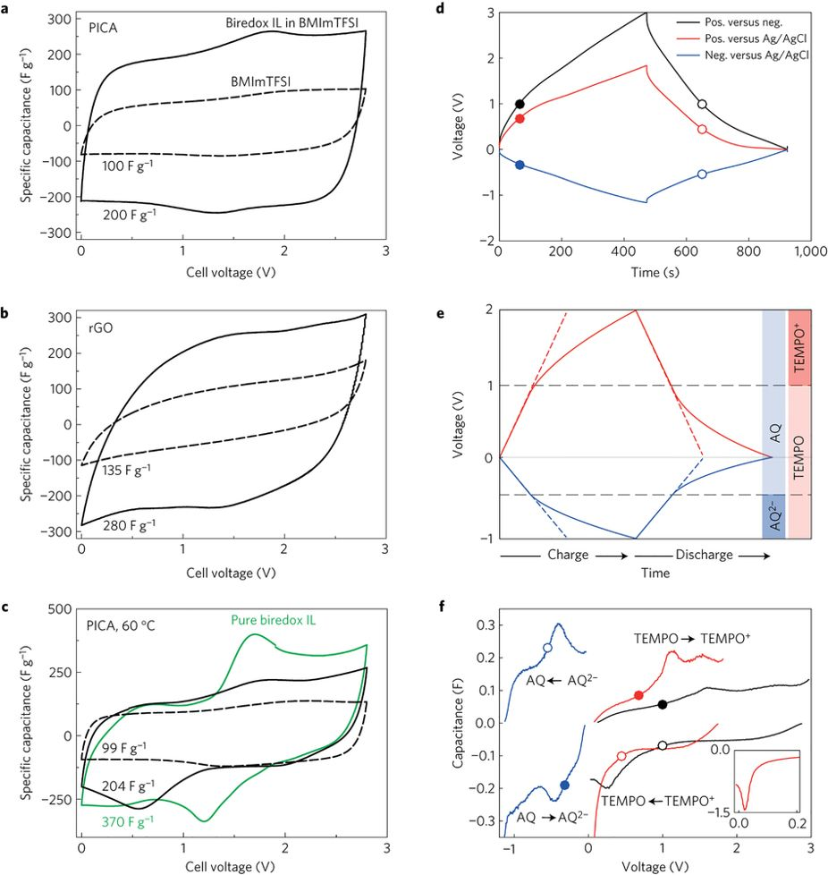
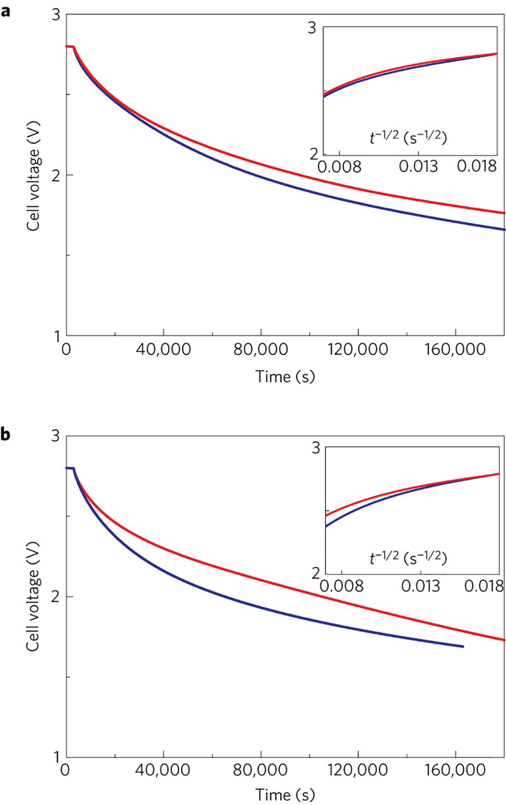
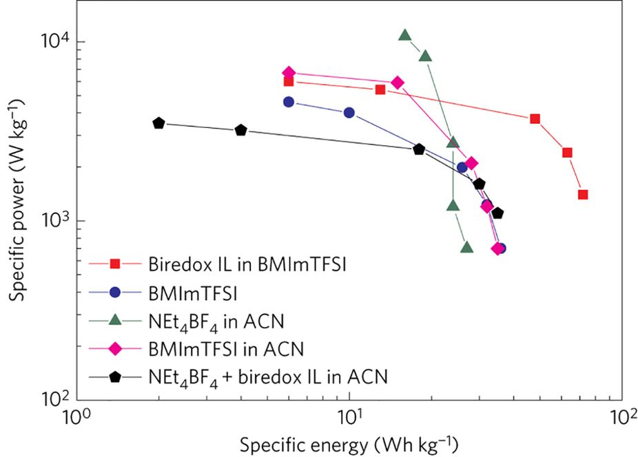
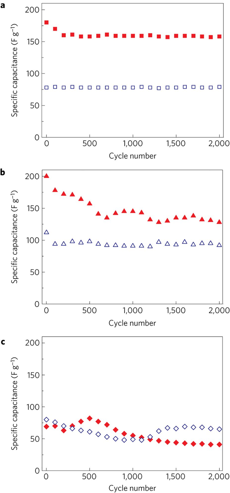

## Biredox ionic liquids with solid-like redox density in the liquid state for high-energy supercapacitors 氧化离子液体具有液态固体状氧化还原密度，适用于高能超级电容器

> Eléonore Mourad, Laura Coustan, Pierre Lannelongue, Dodzi Zigah, Ahmad Mehdi, André Vioux, Stefan A. Freunberger, Frédéric Favier & Olivier Fontaine
> Nature Materials, volume 16, pages 446–453 (2017)
> DOI: [10.1038/nmat4808](https://doi.org/10.1038/nmat4808)

### Abstract
Kinetics of electrochemical reactions are several orders of magnitude slower in solids than in liquids as a result of the much lower ion diffusivity. Yet, the solid state maximizes the density of redox species, which is at least two orders of magnitude lower in liquids because of solubility limitations. With regard to electrochemical energy storage devices, this leads to high-energy batteries with limited power and high-power supercapacitors with a well-known energy deficiency. For such devices the ideal system should endow the liquid state with a density of redox species close to the solid state. Here we report an approach based on biredox ionic liquids to achieve bulk-like redox density at liquid-like fast kinetics. The cation and anion of these biredox ionic liquids bear moieties that undergo very fast reversible redox reactions. As a first demonstration of their potential for high-capacity/high-rate charge storage, we used them in redox supercapacitors. These ionic liquids are able to decouple charge storage from an ion-accessible electrode surface, by storing significant charge in the pores of the electrodes, to minimize self-discharge and leakage current as a result of retaining the redox species in the pores, and to raise working voltage due to their wide electrochemical window.  
由于离子扩散率低得多，电化学反应的动力学在固体中比在液体中慢几个数量级。然而，固态使氧化还原物质的密度最大化，由于溶解度的限制，其在液体中至少低两个数量级。关于电化学能量存储装置，这导致具有有限功率的高能电容器和具有众所周知的能量缺乏的高功率超级电容器。对于这样的装置，理想的系统应赋予液态接近固态的氧化还原物质的密度。在这里，我们报告了一种基于双向离子液体的方法，以在类似液体的快速动力学中实现块状氧化还原密度。这些双向离子液体的阳离子和阴离子带有经历非常快速的可逆氧化还原反应的部分。作为其高容量/高速率电荷存储潜力的首次证明，我们在氧化还原超级电容器中使用它们。这些离子液体能够通过在电极的孔隙中储存大量电荷来将电荷存储与离子可接触的电极表面分离，从而最小化由于将氧化还原物质保留在孔隙中而导致的自放电和漏电流，并且由于其宽电化学窗口，提高了工作电压。

### Main
Energy storage is undeniably one of the greatest technological and societal challenges of the twenty-first century, driven by the growing demand for renewable but intermittent energy supplies and mobile power sources1. Among storage approaches, electrochemical energy storage appears as the most versatile for multi-purpose uses. Ion-exchange processes balancing electronic charges are central to electrochemical energy storage. This mechanism includes solid redox active materials in batteries and surface capacitive or pseudocapacitive storage in supercapacitors2,3,4,5. However, ion diffusivity is typically around seven orders of magnitude lower in solids than in liquids. This is reflected by the drastically different kinetics of the electrochemical reactions involved in the solid and liquid state6,7. Nevertheless, the crucial advantage of the solid state is to provide a considerably higher density of redox active species. Accordingly, solid bulk storage materials lend high energy density, albeit at modest rate8,9. In contrast, electrochemical capacitors can deliver outstanding power thanks to the fast kinetics associated with the electrochemical storage mechanisms at the electrode–electrolyte interface. However, the energy density is limited by the surface density of sorbed ions in electrochemical double layer capacitors (EDLC) or of pseudocapacitive material2,4,10,11,12,13,14,15,16,17.  
由于对可再生但间歇性能源供应和移动电源的需求不断增长，能源储存无疑是二十一世纪最大的技术和社会挑战之一。在存储方法中，电化学能量存储似乎是多功能用途中最通用的。平衡电子电荷的离子交换过程是电化学能量存储的核心。该机制包括电容器中的固体氧化还原活性材料和超级电容器中的表面电容或赝电容存储2,3,4,5。然而，离子扩散率通常比固体低约7个数量级。这可以通过固态和液态6中涉及的电化学反应的剧烈动力学反映出来。然而，固态的关键优势是提供相当高密度的氧化还原活性物质。因此，固体散装储存材料提供高能量密度，尽管是适度的速率8,9。相比之下，由于与电极-电解质界面处的电化学存储机制相关的快速动力学，电化学电容器可以提供出色的功率。然而，能量密度受电化学双层电容器（EDLC）或赝电容材料中吸附离子的表面密度的限制2,4,10,11,12,13,14,15,16,17。

The topical challenge for supercapacitors is to increase energy without compromising power. One way is to increase the operating voltage by means of electrolytes based on ionic liquids (ILs) instead of using aqueous or molecular non-aqueous electrolytes18,19,20,21,22. ILs have the additional advantage of improving safety and allowing the design of their constituent ions for specific requirements7. The other leverage to improve energy is the capacitance. The recent development of highly porous carbon materials has revealed limits to the further improvement of EDLC by a higher ion-accessible surface area4,5,12,13,14,15,16,17,22. Despite enhanced energy densities, pseudocapacitive storage at the electrode material surface is equally surface limited23,24,25. This limitation could be overcome in principle by involving redox species dissolved in the electrolyte. This was recently reported for aqueous electrolytes with, for example, iodide, hydroquinone, VOSO4 or p-phenylenediamine26,27,28,29,30,31. These works demonstrated that dissolved redox species reacted with the same fast kinetics as the electrostatic surface storage mechanisms. However, only little additional capacitance was recovered at prohibitively high self-discharge, because of low solubility and high ion diffusivity32. Recently, some of us synthesized a new IL with a redox moiety attached to one ion. Electrochemical characterization suggests its efficiency as a redox active electrolyte in a Li-ion battery, despite severe electrode balancing and self-discharge issues33,34,35,36,37. These results prompted us to turn to ILs with redox active moieties on both ions (making them bulkier) to obtain electrochemical devices with high energy density and limited self-discharge.  
超级电容器的主题挑战是在不影响功率的情况下增加能量。一种方法是通过基于离子液体（ILs）的电解质而不是使用水性或分子非水电解质18,19,20,21,22来增加工作电压。 IL具有提高安全性的额外优势，并允许根据特定要求设计其组成离子7。提高能量的另一个好处是电容。最近开发的高度多孔碳材料显示出通过更高的离子可及表面积进一步改善EDLC的局限性4,5,12,13,14,15,16,17,22。尽管能量密度增加，但电极材料表面的赝电容存储同样受到表面限制23,24,25。原则上可以通过涉及溶解在电解质中的氧化还原物质来克服该限制。最近报道了含有电解质的水溶液，例如碘化物，氢醌，VOSO4或对苯二胺26,27,28,29,30,31。这些工作证明溶解的氧化还原物质以与静电表面储存机制相同的快速动力学反应。然而，由于低溶解度和高离子扩散性，在极高的自放电下仅回收很少的额外电容32。最近，我们中的一些人合成了一种新的IL，其中氧化还原部分与一个离子相连。电化学表征了其作为锂离子电池中的氧化还原活性电解质的效率，但它还存在严重的电极平衡和自放电问题33,34,35,36,37。这些结果促使我们转向在两种离子上具有氧化还原活性部分的IL（使它们更庞大）以获得具有高能量密度和有限自放电的电化学装置。

Here, we report a biredox IL, where anion and cation are functionalized with anthraquinone (AQ) and 2,2,6,6-tetramethylpiperidinyl-1-oxyl (TEMPO) moieties, respectively, and which demonstrates improved properties when used in model supercapacitors. Tethering a redox group to an ion makes this group ionic in either oxidation state, which increases its solubility in IL media and thus raises the redox density while keeping liquid-state reaction rates. Hence Faradaic charge storage becomes decoupled from the ion-accessible electrode surface limitation. This gives access to higher capacity, approaching that of solid redox materials, at the fast redox kinetics of dissolved redox species. The measured capacitance is twice that with non-redox IL electrolyte and was sustained for 2,000 cycles without deterioration. The bulky size of the redox ions impeded diffusion through the porous electrodes, which curbed self-discharge to the level of the redox non-active IL electrolyte. This new electrolyte concept opens up new opportunities to develop high-energy supercapacitors and a wide new field in redox materials.  
在这里，我们报告了一个biredox IL，其中阴离子和阳离子分别用蒽醌（AQ）和2,2,6,6-四甲基哌啶-1-氧基（TEMPO）部分官能化，并且当用于超级电容器模型时有性能的改善。将氧化还原基团连接到离子上使得该基团在氧化态下离子化，这增加了其在IL介质中的溶解度，从而提高了氧化还原密度，同时保持了液态反应速率。因此，法拉第电荷存储不再有只能发生在离子可接近的电极表面的限制。这使得在溶解的氧化还原物质的快速氧化还原动力学下获得更高的容量，接近固体氧化还原材料的容量。测量的电容是非氧化还原IL电解质的两倍，并且持续2,000个循环而没有变质。氧化还原离子的庞大尺寸阻碍了通过多孔电极的扩散，这将自放电现象限制到了非活性氧化还原IL电解质的水平。这种新的电解质概念为开发高能超级电容器和氧化还原材料的广阔新领域开辟了新的机会。

The concept of the biredox IL-enhanced capacitor in comparison to the purely capacitive EDLC is illustrated in Fig. 1. The biredox IL comprises a perfluorosulfonate anion bearing anthraquinone (AQ–PFS−) and a methyl imidazolium cation bearing TEMPO (MIm+–TEMPO⋅). Cells comprise carbon electrode materials and either pure butylmethyl imidazolium bis(trifluoromethylsulfonimide) (BMImTFSI) IL, biredox IL dissolved in BMImTFSI or pure biredox IL (at 60 °C) as the electrolyte. Since the biredox IL shown here melts above 9 °C (see differential scanning calorimetry, DSC, in Supplementary Fig. 6) it could be used only at room temperature as a salt dissolved in non-active BMImTFSI or at 60 °C when pure. When the cell is charged with pure BMImTFSI, electrolyte cations and anions are drawn into the negative and positive electrodes, respectively, and are adsorbed at the carbon surface without undergoing a Faradaic reaction. In the case of the biredox IL-containing cell, the same processes apply to the BMIm+ cation and TFSI− anion. Additionally, as the redox active AQ–PFS− and MIm+–TEMPO⋅ ions are electrosorbed at the surface of the carbon electrodes, they undergo fast Faradaic reactions. Their bulky size, in combination with the high viscosity of the electrolyte, impedes self-discharge, as further discussed below. Since either redox species is ionic in either oxidation state, the solubility greatly exceeds the typical solubility of neutral redox species. Here we attach the reducible moiety to the anion and the oxidizable moiety to the cation, which results in bi-anions and bi-cations being generated at the anode and the cathode, respectively. However, the opposite combination would also be conceivable, which would result in zwitterionic species.  
与纯电容EDLC相比，biredox IL增强电容器的概念如图1所示.biredox IL包含带有蒽醌的全氟磺酸根阴离子（AQ-PFS-）和带有TEMPO的甲基咪唑阳离子（MIm+-TEMPO⋅ ）。测试单元包含碳电极材料和纯丁基甲基咪唑双（三氟甲基磺酰亚胺）（BMImTFSI）IL，溶解在BMImTFSI中的biredox IL或纯biredox IL（在60°C下）作为电解质。由于此处显示的biredox IL在高于9°C的温度下熔化（请参见差示扫描量热法，DSC，补充图6），因此只能在室温下以溶于非活性BMImTFSI的盐的形式使用，或者在纯净时以60°C的温度使用。当电容器充满纯BMImTFSI时，电解质阳离子和阴离子分别被吸入负电极和正电极，并被吸附在碳表面而不经历法拉第反应。在含有biredox IL的测试单元的情况下，相同的过程适用于BMIm+阳离子和TFSI-阴离子。另外，由于氧化还原活性AQ-PFS-和MIm+-TEMPO·离子在碳电极表面被电吸附，它们经历快速法拉第反应。它们庞大的尺寸与电解质的高粘度相结合，阻碍了自放电，如下面进一步讨论的。由于任一氧化还原物质在任一氧化态下都是离子的，因此溶解度大大超过中性氧化还原物质的典型溶解度。在此，我们将可还原部分连接到阴离子上，将可氧化部分连接到阳离子上，这导致分别在阳极和阴极处产生双阴离子和二阳离子。然而，也可以想到相反的组合，这将导致两性离子物种。

Figure 1: Comparison of charge storage in EDLC with IL electrolyte and the biredox IL-enhanced pseudocapacitor.  
图1：EDLC中的电荷存储与IL电解质和biredox IL增强的赝电容器的比较  
  
a, Structure of the herein used BMImTFSI IL and the biredox IL comprising a perfluorosulfonate anion bearing anthraquinone (AQ–PFS−) and a methyl imidazolium cation bearing TEMPO (MIm+–TEMPO⋅). b,c, Charge storage in a purely capacitive EDLC comprising porous carbon electrodes and an IL electrolyte (b) and the herein developed concept of capacitors with additional Faradaic processes at the redox active ions of the biredox IL electrolyte (c).  
a，本文使用的BMImTFSI IL和包含带有蒽醌的全氟磺酸根阴离子（AQ-PFS-）和带有TEMPO（MIm+-TEMPO）的甲基咪唑阳离子的biredox IL的结构。 b，c，在包含多孔碳电极和IL电解质的纯电容性EDLC中的电荷存储（b）和本文开发的电容器的概念，其在biredox IL电解质的氧化还原活性离子上具有额外的法拉第过程（c）。

We prepared the biredox IL by first separately synthesizing a methyl imidazolium cation bearing a TEMPO moiety, and the lithium salt of a perfluorosulfonate anion bearing an AQ moiety, and then carrying out the metathetic reaction to obtain the biredox IL (Fig. 2). The first involves a Williamson ether synthesis from 4-hydroxyl-TEMPO and α-α′-dibromo-p-xylene, followed by a quaternization reaction with 1-methylimidazole to yield MIm+–TEMPO⋅Br−(1). The synthesis of the Li perfluorosulfonate bearing an AQ moiety (Li+AQ–PFS−, 2) follows an analogous path via ether synthesis from chloromethyl anthraquinone and the appropriate alkoxide. Finally, the two intermediates are combined, yielding the biredox final IL. More experimental details are given in the Supplementary Information.  
我们首先分别合成带有TEMPO部分的甲基咪唑阳离子和带有AQ部分的全氟磺酸根阴离子的锂盐，然后进行复分解反应以获得biredox IL（图2），制备biredox IL。第一种涉及由4-羟基-TEMPO和α-α'-二溴-对二甲苯合成Williamson醚，然后与1-甲基咪唑进行季铵化反应，得到MIm+-TEMPO·Br-（1）。具有AQ部分的Li全氟磺酸盐（Li+ AQ-PFS-，2）的合成遵循通过醚合成从氯甲基蒽醌和适当的醇盐的类似路径。最后，将两种中间体合并，得到双重最终IL。补充信息中给出了更多实验细节。

Figure 2: Synthesis of the biredox ionic liquid. 图2：双折叠离子液体的合成。  
The cation bearing AQ (1) and anion bearing TEMPO (2) are prepared separately before obtaining the biredox IL (3) through metathesis.  
在通过复分解获得biredox IL（3）之前，分别制备带阳离子的AQ（1）和带阴离子的TEMPO（2）。

IR analysis confirms the presence of the characteristic bands for TEMPO and AQ at around 2,900 and 1,300 cm−1, respectively (Supplementary Fig. 7). The spectrum of 3 does not correspond to a simple addition of the spectra of the constituent precursors 1 and 2 before the metathesis reaction. This suggests that, after ion exchange and removal of LiBr, the resulting moieties experience a different environment than in the initial salts 1 and 2 (with Li+ and Br− counter ions, respectively). The additional bands in the spectrum of 3 indicate new interactions that probably originate from specific interactions between the sulfonate anion and the imidazolium cation. Biredox IL, precursors and intermediates were characterized by mass spectrometry (Supplementary Figs 2, 4 and 5), differential scanning calorimetry (DSC) (Supplementary Fig. 6) and thermogravimetric analysis (TGA) (Supplementary Fig. 8). Nuclear magnetic resonance (NMR) (Supplementary Fig. 3) was used for the characterization of the anion bearing anthraquinone (TEMPO is actually a paramagnetic compound). The water content of the final biredox IL in BMimTFSI electrolyte was measured by Karl Fischer titration (80 ppm and 100 ppm respectively). These data demonstrate the composition and purity of the prepared biredox IL.  
IR分析证实TEMPO和AQ的特征谱带分别在2,900和1,300 cm-1左右（补充图7）。3的光谱不对应于在复分解反应之前简单地添加组分前体1和2的光谱。这表明，在离子交换和除去LiBr后，所得部分所处的环境与初始盐1和2（分别具有Li+和Br-抗衡离子）不同。光谱中的附加谱带3表明新的相互作用可能源自磺酸根阴离子和咪唑鎓阳离子之间的特定相互作用。Biredox IL，前体和中间体通过质谱法（补充图2,4和5），差示扫描量热法（DSC）（补充图6）和热重分析（TGA）（补充图8）表征。核磁共振（NMR）（补充图3）用于表征带有蒽醌的阴离子（TEMPO实际上是顺磁性化合物）。通过Karl Fischer滴定（分别为80ppm和100ppm）测量BMimTFSI电解质中最终biredox IL的水含量。这些数据证明了制备的biredox IL的组成和纯度。

The cyclic voltammograms (CVs) of 2 mM biredox IL and 0.1 M TBAPF6 solutions in acetonitrile (MeCN) when using a glassy carbon disc electrode are shown in Supplementary Fig. 9. The peak couple around 0.6 V versus Ag/AgCl is assigned to the oxidation of the TEMPO radical (MIm+–TEMPO⋅) to the TEMPO cation (MIm+–TEMPO+) and its reverse reaction. The reduction of the AQ–PFS− moiety to the anthraquinone radical anion (AQ⋅−–PFS−) and di-anion (AQ2−–PFS−) is characterized by two peak couples around −0.7 and −0.9 V versus Ag/AgCl (refs 38,39). The CV confirms equally reversible electrochemistry of the redox moieties when attached to the ions as in the well-known unsupported substances (see Supplementary Fig. 16 for the redox reactions). The electrochemical stability window with glassy carbon electrodes is 3.7 V for the 0.5 M biredox IL solution in BMImTFSI (Supplementary Fig. 10). In the asymmetric PICA/PICA device it still exceeds 2.8 V, demonstrating the advantage of using IL electrolytes to expand the potential window to nearly 3 V (ref. 36). This stands in contrast to previously reported dissolved redox species in supercapacitors such as AQ or iodide in aqueous media, where the electrochemical stability window is limited to ≍1.2 V (refs 37,38). The dissolution of biredox IL in BMImTFSI up to saturation slightly increased the conductivities (Supplementary Table 1 and Supplementary Fig. 11). The conductivity of the pure biredox IL was several orders of magnitude lower, and could only be measured above its glass transition temperature. In agreement with the literature, the viscosity of BMimTFSI was measured at 53 cP and its density at 1.4 g cm−3(ref. 39).  
当使用玻璃碳圆盘电极时，2mM biredox IL和0.1 M TBAPF6溶液在乙腈（MeCN）中的循环伏安图（CV）显示在补充图9中。对于Ag/AgCl，峰值偶数约为0.6 V。 TEMPO自由基（MIm+-TEMPO）氧化成TEMPO阳离子（MIm+-TEMPO+）及其逆反应。 AQ-PFS-部分向蒽醌自由基阴离子（AQ⋅-PFS-）和二阴离子（AQ2-PFS-）的还原表征为两个峰值对，在-0.7和-0.9V之间，相对于Ag/AgCl （参考38,39）。如同众所周知的无载体物质那样，当CV附着在离子上时，CV证实了氧化还原部分的同样可逆电化学（参见补充图16中的氧化还原反应）。对于BMImTFSI中的0.5M biredox IL溶液，具有玻碳电极的电化学稳定窗口为3.7V（补充图10）。在非对称PICA/PICA器件中，它仍然超过2.8 V，证明了使用IL电解质将电位窗扩展到接近3 V的优势（参考文献36）。这与先前报道的在水性介质中超级电容器如AQ或碘化物中溶解的氧化还原物质形成对比，其中电化学稳定性窗口限于1.2V（参考文献37,38）。 biredox IL在BMImTFSI中的溶解直至饱和度略微增加了电导率（补充表1和补充图11）。纯biredox IL的电导率低几个数量级，并且只能在其玻璃化转变温度以上测量。与文献一致，BMimTFSI的粘度为53cP，其密度为1.4g cm-3（参考文献39）。

### The biredox IL in capacitors
Symmetric supercapacitors were assembled as detailed in the Supplementary Information (Methods) with either BMImTFSI, 0.5 M biredox IL in BMImTFSI, or pure biredox IL as the electrolyte. Electrodes were based on PICA and YP50 activated carbons and reduced graphene oxide (rGO). We have chosen these three carbons with markedly different pore sizes and pore size distributions to probe surface accessibility for widely varying ion sizes of the BMImTFSI and biredox IL, as discussed later.  
如补充信息（方法）中所述，使用BMImTFSI，BMImTFSI中的0.5μMbiredox IL或纯biredox IL作为电解质组装对称超级电容器。电极基于PICA和YP50活性炭以及还原的氧化石墨烯（rGO）。我们选择了孔径和孔径分布明显不同的这三种碳，以探测BMImTFSI和biredox IL的较大离子尺寸的表面可及性，这将在后面讨论。

Cyclic voltammograms of the PICA and rGO cells with BMImTFSI and 0.5 M biredox IL in BMImTFSI are compared in Fig. 3a, b, where in either case a doubling of the capacitance is observed. With the predominantly nanoporous YP50 carbon, no significant change is observed between measurements in these two electrolytes (Supplementary Fig. 13). The CV curve of an ideal EDLC supercapacitor features a rectangular shape, since the capacitance C is constant and independent of the applied voltage at constant voltage scan rate. As expected, the CVs measured with pure BMImTFSI electrolyte (dashed line in Fig. 3a, c and Supplementary Fig. 13) reveal, particularly with PICA and YP50 electrodes, a quasi-rectangular shape. These shapes are characteristic of an EDLC behaviour without, or with very limited, redox contribution. For the rGO electrode, the minor redox peaks below 1.8 V can be assigned to surface groups on the carbon. Capacitances are calculated by integrating the CVs according to the de Levie model for supercapacitors (Supplementary Equation (1))40. Specific capacitances measured at room temperature for devices based on PICA, rGO, and YP50 when cycled at 5 mV s−1, as well as self-discharge and leak current, are reported in Supplementary Table 3.  
在图3a，b中比较了BMImTFSI中具有BMImTFSI和0.5μMbiredox IL的PICA和rGO测试单元的循环伏安图，在两种情况下均观察到电容加倍。使用主要为纳米孔的YP50碳，在这两种电解质的测量之间未观察到显着变化（补充图13）。理想的EDLC超级电容器的CV曲线呈矩形，这是因为电容C是恒定的，并且与恒定电压扫描速率下的施加电压无关。正如预期的那样，使用纯BMImTFSI电解质（图3a，c和补充图13中的虚线）测量的CV尤其是在PICA和YP50电极中显示出准矩形形状。这些形状是没有或仅有非常有限的氧化还原作用的EDLC行为的特征。对于rGO电极，可以将低于1.8 V的次要氧化还原峰解释为碳上的表面基团。通过根据超级电容器的De Levie模型对CV进行积分来计算电容（补充公式（1））40。补充表3报告了在5 mV s-1下循环时，基于PICA，rGO和YP50的器件在室温下测得的比电容，以及自放电和泄漏电流。

Figure 3: Electrochemistry of the biredox IL in the supercapacitors. 超级电容器中biredox IL的电化学。
  
a,b, Cyclic voltammetry at 5 mV s−1 with 0.5 M biredox IL in BMImTFSI (solid line) and pure BMImTFSI (dashed line), respectively, and electrodes made with PICA (a) or rGO (b). c, CVs at 5 mV s−1 of the PICA cell at 60 °C with 0.5 M biredox IL in BMImTFSI (solid line), pure BMImTFSI (dashed line), and pure biredox IL (green line). d, Galvanostatic cycling data in a three-electrode cell with PICA working electrodes and a Ag/AgCl reference electrode and 0.5 M biredox IL in BMImTFSI at room temperature and 1.5 A g−1. Data are given for the full cell (black) and the positive (red) and negative (blue) electrodes versus reference, respectively. The filled and open circles denote the points where the cell passes 1 V on charge and discharge, respectively. e, Schematic representation of the galvanostatic voltage response of the electrostatic and Faradaic processes with the biredox IL and the stability regions for its oxidized/reduced species. The dashed lines illustrate the behaviour if only electrostatic processes were to prevail. f, Capacitances C = dQ/dU versus full cell or single-electrode voltage.  
a，b，用PICA（a）或rGO（b）制成的电极的情况下，分别在0.5 M biredox IL in BMImTFSI（实线）和纯BMImTFSI（虚线）中进行循环伏安法。 c，PICA测试单元在60°C时5 mV s-1处的CV，其中0.5 M Biredox IL in BMImTFSI（实线），纯BMImTFSI（虚线）和纯biredox IL（绿线）。 d，在室温和1.5 BAstaticg-1下，在具有BICAmTFSI的PICA工作电极和Ag/AgCl参比电极以及0.5 M biredox IL的三电极电容器中的恒电流循环数据。分别给出了全电容器（黑色）和正极（红色）和负极（蓝色）相对于参考的数据。实心和空心圆分别表示电容器在充电和放电时通过1 V的点。 e，带有氧化还原IL和其氧化/还原物种的稳定区域的静电和法拉第过程的恒电流电压响应的示意图。虚线表示仅静电过程占优势的情况。 f，电容C = dQ/dU对全电容器或单电极电压。

Turning to 0.5 M biredox IL in BMImTFSI as electrolyte, the CV curves for PICA and rGO electrodes (solid lines in Fig. 3a, b) display a similar shape as with BMImTFSI, but with drastically increased amplitudes (from 100 to 200 F g−1 for PICA activated carbon) over most of the voltage range. Additionally, broad oxidation and reduction peaks appear at intermediate voltages that indicate the redox processes of the biredox IL. As shown in Supplementary Table 3, specific capacitances are roughly doubled in comparison with pure BMImTFSI electrolyte, which demonstrates the potential of the biredox IL to enhance device capacitance and energy density.  
转向BMImTFSI中的0.5 M biredox IL作为电解质，PICA和rGO电极的CV曲线（图3a，b中的实线）显示出与BMImTFSI类似的形状，但幅度急剧增加（从100至200 F g-在大多数电压范围内，PICA活性炭为1）。另外，在指示双氧化还原IL的氧化还原过程的中间电压处出现宽的氧化和还原峰。如补充表3所示，与纯BMImTFSI电解质相比，比电容大约增加了一倍，这证明了biredox IL增强器件电容和能量密度的潜力。

Activated carbons have been the most commonly used electrode materials for EDLC in the past due to their high specific area, low cost, excellent chemical and thermal stability, as well as relatively good conductivity and ease of modification. In particular, the nature and ionic permittivity of nanostructured carbons are critical to the specific capacitance. Here, we compare PICA with rGO and YP50 carbons. In both electrolytes, CVs of the cells with rGO electrodes (Fig. 3b) appear slightly more distorted than those with PICA (Fig. 3a) or YP50 (Supplementary Fig. 13) electrodes. These distortions are characteristic of Ohmic contributions to the behaviour of the device. Careful analysis of the measurements confirms that this Ohmic behaviour can be assigned neither to the electrolyte nor to the assembling of the Swagelok cell. Moreover, this Ohmic distortion persists for both electrolytes. Unlike the other carbons, the performance of the YP50 electrodes does not change noticeably when switching the electrolyte, as the specific capacitance remains approximately 110 F g−1 in either case (Supplementary Fig. 13). Since the capacitance of carbon-based supercapacitors (SCs) is related to the ion-accessible surface area, this behaviour can be explained by the markedly different pore size distribution of the respective materials. The pore size distributions of the selected carbons as derived from the N2 sorption isotherms are given in Supplementary Fig. 12. Reduced graphene oxide (rGO) has a wide pore size distribution without prominent discrete pore sizes, whereas the activated PICA and YP50 carbons are microporous with a significant amount of pores centred at about 1 nm. Supplementary Fig. 12c highlights the key difference between PICA and YP50 in terms of mesoporosity. YP50 is an almost purely microporous material, as most of the pore volume (66% of the pore volume) stems from micropores with an average diameter around 0.9 nm. Its mesoporosity accounts for 0.5% of the pore volume only. In contrast, rGO offers an open surface with theoretically unrestricted access for the electrolyte species, whereas the porous structure of PICA is more complex, with micropores below 1 nm diameter (25% of the pore volume) together with mesopores ranging from 2 to 5 nm in diameter. The volume associated with mesopores represents 49% of the total pore volume. We assume that the difference between YP50 and the other tested carbons stems from the different accessibility of the available pore space for the electrolyte species. In YP50 the biredox molecules cannot enter the micropores, while the mesopores of PICA and the open surface of rGO are accessible. In contrast, BMImTFSI appears to access much smaller pores than accessible for the biredox species. Since PICA-based electrodes show the best compromise between conductivity and pore size distribution, the further characterizations use this carbon.  
活性炭由于其高的比表面积，低成本，优异的化学和热稳定性以及相对良好的导电性和易改性性，在过去一直是EDLC最常用的电极材料。特别地，纳米结构碳的性质和离子介电常数对于比电容至关重要。在这里，我们将PICA与rGO和YP50碳进行了比较。在两种电解液中，带有rGO电极（图3b）的电容器的CV似乎比带有PICA（图3a）或YP50（补充图13）的电容器的CV失真更大。这些失真是欧姆对设备性能的贡献的特征。仔细的测量分析证实，这种欧姆行为既不能归因于电解质，也不能归因于世伟洛克电容器的组装。而且，两种电解质都持续存在这种欧姆畸变。与其他碳不同，YP50电极的性能在切换电解质时不会显着变化，因为在任何一种情况下，比电容均保持在110 F g-1左右（补充图13）。由于碳基超级电容器（SCs）的电容与离子可及的表面积有关，因此可以通过各个材料的孔径分布明显不同来解释这种行为。由N2吸附等温线得出的选定碳的孔径分布在补充图12中给出。还原氧化石墨烯（rGO）的孔径分布较宽，没有明显的离散孔径，而活化的PICA和YP50碳具有微孔性大量的孔集中在大约1 nm处。补充图12c突出显示了PICA和YP50在介孔率方面的主要区别。 YP50是几乎纯微孔的材料，因为大多数孔体积（占孔体积的66％）来自微孔，平均直径约为0.9nm。它的介孔率仅占孔体积的0.5％。相比之下，rGO提供了一个开放的表面，从理论上讲不受限制地进入电解质种类，而PICA的多孔结构则更为复杂，其微孔直径小于1 nm（占孔体积的25％），中孔的范围为2至5 nm在直径上。与中孔相关的体积占总孔体积的49％。我们假设YP50和其他测试碳之间的差异是由于电解质种类可用孔隙空间的可及性不同而引起的。在YP50中，双氧化还原分子不能进入微孔，而PICA的中孔和rGO的开放表面却可以进入。相反，BMImTFSI似乎比双氧化还原物质更容易进入毛孔。由于基于PICA的电极表现出电导率和孔径分布之间的最佳折衷，因此进一步的表征使用了这种碳。

The enhancement of the PICA specific capacitance scales with the concentration of biredox IL in BMImTFSI in the range from 0 to 0.5 M (see Supplementary Fig. 16 and Supplementary Table 4). At room temperature the viscosity of the saturated solution (≍0.62 M) becomes prohibitively high, which causes the capacitance to drop in comparison with the 0.5 M solution. However, further improvement can be achieved with pure redox IL as the electrolyte, but requires an elevated temperature. Specific capacitances of a PICA-based cell at 60 °C are compared when operated with BMImTFSI, 0.5 M biredox IL in BMImTFSI, and pure biredox IL (Fig. 3c). In the case of the redox active electrolytes, redox peaks are clearly visible. Despite the redox features exhibited by the CVs, especially in pure biredox IL, average capacitances have been calculated by CV integration. The values are 99, 204 and 370 F g−1 for 0, 0.5 M and pure biredox IL, respectively. The nearly unchanged values between room temperature and 60 °C for the first two electrolytes demonstrate that the increase is associated with redox concentration. The remarkable value for pure biredox IL compares favourably well with the capacitance of pseudocapacitive solid materials such as MnO2. The enhancement in comparison to the pure BMImTFSI can hence definitively be assigned to the redox activity of the biredox IL40,41,42. The nearly unchanged capacitances from room temperature to 60 °C for the first two electrolytes demonstrate that this increase cannot be associated with any other characteristic changes of the electrolyte, including ionic conductivity enhancement.  
随着BMImTFSI中biredox IL的浓度在0到0.5μM的范围内，PICA的比电容会增加（参见补充图16和补充表4）。在室温下，饱和溶液的粘度（≍0.62M）变得非常高，与0.5 M溶液相比，这导致电容下降。然而，使用纯氧化还原IL作为电解质可以实现进一步的改进，但是需要升高的温度。当与BMImTFSI，BMImTFSI中的0.5μMbiredox IL和纯biredox IL一起操作时，比较了基于PICA的电容器在60°C时的比电容（图3c）。在氧化还原活性电解质的情况下，氧化还原峰清晰可见。尽管CV表现出氧化还原特性，特别是在纯Biredox IL中，但通过CV积分已计算出平均电容。对于0、0.5 M和纯biredox IL，值分别为99、204和370 F g-1。前两种电解质在室温至60°C之间几乎不变，表明这种增加与氧化还原浓度有关。纯二氧化还原IL的显着值与拟电容性固态材料（如MnO2）的电容相当好。因此，与纯BMImTFSI相比，可以肯定地将这种增强归因于biredox IL40、41、42的氧化还原活性。对于前两种电解质，从室温到60°C的几乎不变的电容表明，这种增加不能与电解质的任何其他特性变化（包括离子电导率提高）相关联。

The data with the pure molten substance demonstrate the ultimate possibility of what the biredox IL permits. The density of redox groups equals that of the bulk substance, yet the kinetics of its redox reactions is similar to that of a redox molecule in solution. Therefore, the biredox IL combines the advantage of high redox density, which is otherwise found only in solids, and the fast kinetics of solution species/systems. Considering the porosity of the PICA electrode (≍64%) and the concentration of the pure biredox IL (3.4 M), half of the redox groups in the pores have reacted and contributed to the measured capacitance. Therefore, biredox ILs, with the extreme case of the pure melt, allow achievement of the bulk density of redox species with fast liquid-like charge transfer kinetics.  
纯熔融物质的数据揭示了biredox IL能达到的最优可能性。氧化还原基团的密度等于主体物质的密度，但其氧化还原反应的动力学与溶液中氧化还原分子的动力学相似。因此，biredox IL兼具高氧化还原密度和溶液物种/系统快速动力学的优势，而高氧化还原密度只能在固体中发现。考虑到PICA电极的孔隙率（约64％）和纯双氧化还原IL（3.4μM）的浓度，孔中一半的氧化还原基团发生了反应并有助于测量电容。因此，在纯熔体的极端情况下，biredox ILs可以实现具有快速液体状电荷转移动力学的氧化还原物质的堆积密度。

The CV curves of cells with biredox IL electrolytes show a pair of shallow peaks at intermediate cell voltages. These can be assigned to a convolution of the redox reactions at the anode (AQ/AQ2−) and the cathode (TEMPO/TEMPO+). They are overlapped with electrostatic contributions from the electrosorption of anions and cations (either bearing redox species or not). The corresponding redox reactions concerned at negative and positive electrodes; therefore, the perfluorosulfonate anion bearing anthraquinone (AQ–PFS−) and the methyl imidazolium cation bearing TEMPO (MIm+–TEMPO⋅) are given in Supplementary Fig. 18. The reactions are to be understood in addition to the non-Faradaic sorption of cations/anions at the negative and positive electrode, respectively. When the SC is charged, the AQ–PFS− is adsorbed at the negative electrode and is reduced as AQ−–PFS−, or further to AQ2−–PFS−. Concurrently, MIm+–TEMPO⋅ is adsorbed at the positive electrode and oxidized as MIm+–TEMPO+. Since AQ–PFS− and MIm+–TEMPO⋅ are in a ratio of 1:1, the contribution of AQ to the capacitance is theoretically twice that of the TEMPO. To clarify their role in the charge/discharge mechanism, galvanostatic cycling data were collected in a three-electrode cell with symmetric PICA electrodes, an Ag/AgCl reference electrode and 0.5 M biredox IL in BMImTFSI as the electrolyte (Fig. 3d–f). The black curve corresponds to the response of the full cell, measured between negative (blue curve) and positive (red curve) electrodes versus the reference. The cell voltage profile during discharge and charge (Fig. 3d) can be divided into two main parts: a steeper section at the beginning of charge or discharge, representing mostly capacitive processes, and a flatter section afterwards, corresponding to additional redox reactions. This is schematically shown in Fig. 3e, together with the stability regions of the reduced/oxidized redox species. To make this assignment clearer, capacitances were calculated for the full cell as well as for each electrode using C = dQ/dU, with Q and U being the charge and voltage, respectively. The result is plotted in Fig. 3f versus cell voltage or single-electrode voltage, respectively. The filled and open circles denote the point where the full cell passes 1 V, and aid assigning single-electrode processes to the full cell curve.  
具有双氧化还原IL电解质的电容器的CV曲线在中间电容器电压处显示一对浅峰。这些可以被解释为在阳极（AQ/AQ2-）和阴极（TEMPO/TEMPO+）处的氧化还原反应的卷积。它们与阴离子和阳离子（带或不带氧化还原物质）的电吸附产生的静电作用重叠。负电极和正电极上的相应氧化还原反应；因此，在补充图18中给出了带有蒽醌的全氟磺酸根阴离子（AQ-PFS-）和带有甲基咪唑鎓的阳离子TEMPO（MIm+-TEMPO⋅）。除了分别在负极和正极上非法拉第吸附阳离子/阴离子外，还应分别理解这些反应。当SC充电时，AQ-PFS-吸附在负极，并还原为AQ--PFS-，或进一步还原为AQ2--PFS-。同时，MIm+–TEMPO+吸附在正极，并被氧化为MIm+–TEMPO+。由于AQ–PFS−和MIm+ –TEMPO⋅的比率为1：1，因此AQ对电容的贡献理论上是TEMPO的两倍。为了阐明它们在充电/放电机理中的作用，在具有对称PICA电极，Ag/AgCl参比电极和BMImTFSI中的0.5μMbiredox IL作为电解质的三电极电容器中收集了恒电流循环数据（图3d–f）。黑色曲线对应于整个电容器的响应，负极（蓝色曲线）和正极（红色曲线）相对于参考电极之间测量。放电和充电过程中的电容器电压曲线（图3d）可分为两个主要部分：充电或放电开始时较陡的部分，主要代表电容性过程，其后较平坦的部分，对应于其他氧化还原反应。这与还原/氧化的氧化还原物质的稳定性区域一起在图3e中示意性地示出。为了使此分配更清楚，使用C = dQ/dU计算整个电容器以及每个电极的电容，其中Q和U分别为电荷和电压。结果分别在图3f中相对于电容器电压或单电极电压绘制。实心和空心圆圈表示整个电容器通过1 V的点，并有助于将单电极过程分配给整个电容器曲线。

The plot of the full cell response versus voltage (Fig. 3f) shows a rectangular shape with additional broad anodic and cathodic peaks akin to the CV data (Fig. 3a–c). A close inspection of the single-electrode curves at the onset of the anodic peak (black dot, 1 V) shows that the oxidation of the MIm+–TEMPO⋅ just starts (red dot) while the AQ–PFS− reduction is already ongoing (blue dot). Similarly, on discharge, the onset of the cathodic peak (black circle, 1V) corresponds to that of the MIm+–TEMPO+ reduction (red circle) while the AQ2−–PFS− oxidation has already started (blue circle). The assignment of the redox processes in the single electrodes is supported by the similar potentials for MIm+–TEMPO⋅/MIm+–TEMPO+ and AQ–PFS−/AQ2−–PFS− versus the same reference electrode when measured either on a glassy carbon disc or with a PICA electrode (Supplementary Fig. 19). Overall, the galvanostatic curves in Fig. 3e confirm the main characteristics of a redox capacitive behaviour, with redox reactions involved over a wide range of the voltage window43,44.  
满电容器响应与电压的关系图（图3f）显示为矩形，并具有类似于CV数据的其他宽阳极和阴极峰（图3a–c）。仔细检查阳极峰开始时的单电极曲线（黑点，1 V）表明，当AQ-PFS-还原已经在进行时，MIm+ –TEMPO⋅的氧化才刚刚开始（红点）（蓝点）。同样，在放电时，阴极峰的开始（黑色圆圈，1V）对应于MIm+ –TEMPO+还原的开始（红色圆圈），而AQ2-–PFS-氧化已经开始（蓝色圆圈）。当在玻璃碳盘或碳纤维圆盘上进行测量时，与同一参比电极相比，MIm+ –TEMPO⋅/MIm+ –TEMPO+和AQ–PFS-/AQ2-–PFS-的相似电势支持单个电极中氧化还原过程的分配。带有PICA电极（补充图19）。总的来说，图3e中的恒电流曲线证实了氧化还原电容行为的主要特征，在很宽的电压窗口范围内都涉及到氧化还原反应43,44。

### Self-discharge and leak current
Self-discharge and leakage currents are the main concerns when using redox active electrolytes. It is usually identified by a decay of the open-circuit voltage with time after charging. In unfavourable cases this voltage drop can occur within several minutes, quickly leading to an unusable device. In EDLC, this phenomenon originates from a redistribution of charge among the capacitive elements. It is usually rather limited for EDLC operated in classical NEt4BF4/acetonitrile or IL-based electrolytes, as the ions compensating the electrode charges are ‘trapped’ in the double layer at the electrode–electrolyte interface. In the case of dissolved redox active species, they eventually diffuse and the migration to the opposite electrode can cause their re-reduction or oxidation, respectively, leading to a discharge current by this shuttle effect and a loss of the stored charge. However, in the case of the biredox IL presented here, the reduced/oxidized species are doubly charged ions, which may to some extent remain electrosorbed at the charged electrode and therefore reduce free diffusion and self-discharge. Self-discharge experiments were done by measuring the time within which the voltage drops from the fully charged state to half of its original voltage—that is, from 2.8 to 1.4 V in the present case. Leakage current was measured by holding the potential at full charge.  
当使用氧化还原活性电解质时，自放电和泄漏电流是主要关注的问题。通常通过充电后开路电压随时间的衰减来识别。在不利的情况下，该电压降会在几分钟内发生，从而迅速导致设备无法使用。在EDLC中，这种现象源自电容元件之间电荷的重新分布。对于在经典的NEt4BF4/乙腈或基于IL的电解质中操作的EDLC，通常存在相当大的局限性，因为补偿电极电荷的离子被“捕获”在电极-电解质界面的双层中。在溶解的氧化还原活性物质的情况下，它们最终扩散并且迁移到相对电极可以分别引起它们的还原或氧化，通过这种穿梭效应导致放电电流和所存储电荷的损失。但是，在此处显示的biredox IL的情况下，被还原/氧化的物质是双电荷离子，在某种程度上可以保持电吸附在带电电极上，因此减少了自由扩散和自放电。通过测量电压从完全充电状态下降到其原始电压的一半的时间（即在当前情况下从2.8V降至1.4V），可以完成自放电实验。漏电流通过将电势保持在满充电状态来测量。

Before self-discharge and leakage current measurements, cells with the various carbon materials were assembled as described, initially charged with a current of 1 mA g−1 to 2.8 V, then held at this voltage for 2 h. The results are listed in Supplementary Table 3 and Fig. 4. With values between 30 and 40 μA F−1 V−1, the biredox IL cells show a two to three times lower leak current than the cells with BMImTFSI electrolyte, with an approxiately 100 μA F−1 V−1 leak current. After full charge, the cells were allowed to undergo self-discharge for 50 h while monitoring the open-circuit voltage decay.  
在测量自放电和泄漏电流之前，请按照上述说明组装具有各种碳材料的电容器，首先以1 mA g-1至2.8 V的电流充电，然后在此电压下保持2 h。结果在补充表3和图4中列出。biredoxIL电容器的漏电流在30至40μA/F-1F-1之间，其泄漏电流比使用BMImTFSI电解质的电容器低2至3倍，约为100μAF-1 V-1漏电流。充满电后，允许电容器自放电50µh，同时监控开路电压衰减。

Figure 4: Self-discharge of supercapacitors.
  
a,b, Self-discharge current test for the devices based on PICA (a) and rGO (b) with BMImTFSI (blue line) or 0.5 M biredox IL in BMImTFSI (red line) at room temperature. Cells were first charged at 1 mA g−1 to 2.8 V. Calculated self-discharge and leakage currents are given in Supplementary Table 3. Corresponding data for the YP50 device are given in Supplementary Fig. 13b.  
a，b，在室温下基于BICAmTFSI（蓝线）或BMImTFSI（红线）中0.5μMbiredox IL的基于PICA（a）和rGO（b）的设备的自放电电流测试。首先将电容器充电至1 mA g-1至2.8 V，计算的自放电和漏电流在补充表3中给出。YP50器件的相应数据在补充图13b中给出。

Similar voltage profiles were obtained for all tested devices, as shown in Fig. 4a, b and Supplementary Fig. 13b. During the first 6 h, all SCs show relatively rapid voltage decay down to about 2.5 V. This is followed by a slower decay to reach a plateau at 1.7–1.8 V. Corresponding self-discharge currents measured by coulometry are listed in Supplementary Table 3. Devices based on pure BMImTFSI yield self-discharge currents of about 4 μA F−1. When operated with biredox electrolyte, the leakage currents are two to three times smaller. In either case, the observed self-discharge currents in the range of a few μA F−1 are fairly small. Self-discharge depends only weakly on the electrode nature, as behaviours are very similar for both PICA- and rGO-based devices. The slightly lower figures for the PICA cell suggest the ‘entrapment’ of the biredox species within the porous structure to impede self-discharge, albeit some charge shuttling is expected to still take place45. The lower self-discharge in the biredox electrolyte may also be aided by the electrosorption of the multi-charged ion as well as the higher viscosity of the electrolyte. As self-discharge and current leakage are associated with the undesired diffusion of charge carriers, discrepancies can usually be highlighted by comparing the device voltage decay as a function of t−1/2 (inset Fig. 4). For a diffusion-controlled behaviour, a linear voltage decay is expected. In both BMimTFSI and biredox electrolytes, as well as for PICA- and rGO-based devices, decays are nonlinear versus t−1/2 (Fig. 4a, b and Supplementary Fig. 13b). These deviations are assigned to anomalous diffusion within the porous electrodes, and the diffusion layer thickness is not directly proportional to the square root of time, but may be fitted using an exponential factor smaller than 0.5.  
如图4a，b和补​​充图13b所示，对所有测试设备都获得了相似的电压曲线。在开始的6 h内，所有SC均显示出相对较快的电压衰减，下降至约2.5 V；随后缓慢下降，直至达到1.7–1.8 V的平稳状态。通过库仑法测量的相应自放电电流列于补充表3中。基于纯BMImTFSI的器件产生的自放电电流约为4µA F-1。使用双氧化还原电解质运行时，泄漏电流要小两到三倍。无论哪种情况，观察到的自放电电流在几A F-1的范围内都是很小的。自放电仅在很小程度上取决于电极的性质，因为基于PICA和rGO的设备的行为非常相似。 PICA电容器的数字略低，这表明多孔结构内的双氧化还原物质被“包裹”以阻止自放电，尽管预计仍会发生一些电荷穿梭45。双氧化还原电解质中较低的自放电还可以通过多电荷离子的电吸附以及较高的电解质粘度来辅助。由于自放电和电流泄漏与电​​荷载流子的不期望扩散相关，通常可以通过比较器件电压随时间变化的t-1/2来突出差异（插图4）。对于扩散控制的行为，期望线性电压衰减。在BMimTFSI和biredox电解质中以及基于PICA和rGO的器件中，衰减相对于t-1/2都是非线性的（图4a，b和补​​充图13b）。这些偏差被分配给多孔电极内的异常扩散，并且扩散层的厚度与时间的平方根不直接成比例，而是可以使用小于0.5的指数因子进行拟合。

### Power capability
The power capability of the series of SCs described above was evaluated by measuring the capacitance as a function of rate. Supplementary Fig. 22 shows the specific and relative capacitances measured by cyclic voltammetry for each cell at scan rates ranging from 5 to 200 mV s−1. All devices, PICA (square), rGO (triangle) and YP50 (diamond) show an associated decay of capacitance when the scan rate is raised. This observed loss of power is roughly the same for the biredox (red solid line) and BMImTFSI (blue dashed line) electrolytes, and cannot be assigned to the presence of biredox moieties.  
通过测量作为速率函数的电容来评估上述一系列SC的功率能力。补充图22显示了通过循环伏安法在5至200μmVs-1的扫描速率下对每个电容器测量的比电容和相对电容。当提高扫描速率时，PICA（正方形），rGO（三角形）和YP50（菱形）所有设备均显示出相关的电容衰减。对于biredox（红色实线）和BMImTFSI（蓝色虚线）电解质，观察到的功率损失大致相同，并且不能归因于biredox部分的存在。

For a better understanding of the effect of biredox species in the electrolyte, the energy and power densities of various PICA-based symmetric cells when operated with different electrolytes are compared in the Ragone plot in Fig. 5. Details for the calculations of energy and power densities are given in the Supplementary Information. Base case electrolytes are 0.5 M NEt4BF4 in acetonitrile (ACN) and pure BMImTFSI. The first excels with power density, whereas the latter allows for higher energy. Diluting BMImTFSI with acetonitrile allows for higher power density at high rate at unchanged peak energy density, which can be ascribed to lowered viscosity. Addition of 0.5 M biredox IL to BMImTFSI doubles the energy at low rate to 70 Wh kg−1, and keeps energy and power density well beyond pure BMImTFSI at all rates. As such, this electrolyte appears the best compromise in terms of power and energy densities over the whole range of rates. However, as expected, the biredox electrolyte cannot compete for peak power with the widely used NEt4BF4 in acetonitrile electrolyte (solid triangle). A slight gain in energy density over the latter is achieved with a more complex mixture of 0.5 M biredox IL and 0.5 M NEt4BF4 in acetonitrile (black pentagon). This gain in specific energy is however at the expense of specific power. The biredox IL in BMImTFSI (red squares) at all rates shows higher values than in ACN (black pentagon), even though higher peak power could be expected from the lower viscosity of the ACN electrolyte. CVs of the MIm+–TEMPO/MIm+–TEMPO+ couple in both electrolytes are shown in Supplementary Fig. 26 and indicate the limiting processes. The kinetics in BMImTFSI is faster, as indicated by the small peak splitting, but the peak current is restricted by the lower diffusivity. The higher power in the BMImTFSI may therefore be ascribed to the faster kinetics of redox moieties close to the electrode surface, which do not have to diffuse far to react and which emphasizes that almost solid-like redox density in the liquid state can be accessed at high rates. The faster kinetics in the IL system may in part be due to the higher supporting electrolyte concentration.  
为了更好地理解双氧化还原物质在电解质中的作用，在图5的Ragone图中比较了使用不同电解质运行时各种基于PICA的对称电容器的能量和功率密度。详细的能量和功率计算密度在补充信息中给出。基本情况下的电解质为乙腈（ACN）中的0.5 M NEt4BF4和纯BMImTFSI。乙腈（ACN）中的0.5 M NEt4BF4在功率密度方面表现出色，而纯BMImTFSI有更高的能量密度。用乙腈稀释BMImTFSI可在不改变峰值能量密度的情况下，以高速率高功率密度化，这可归因于粘度降低。在BMImTFSI中添加0.5μM biredox IL可使低速时的能量增加一倍，达到70 Wh·kg-1，并在所有速率下均使能量和功率密度远远超过纯BMImTFSI。这样，在整个速率范围内，就功率和能量密度而言，这种电解质似乎是最好的折衷方案。但是，正如预期的那样，二氧化还原电解质无法与乙腈电解质（实心三角形）中广泛使用的NEt4BF4争夺峰值功率。在乙腈（黑色五边形）中使用更复杂的0.5 M biredox IL和0.5tM NEt4BF4混合物，可以比后者略有增加能量密度。然而，这种比能量的获得是以比功率为代价的。尽管可以从较低粘度的ACN电解质中获得更高的峰值功率，但BMImTFSI中的双氧化还原IL（红色方块）在所有速率下均显示出比ACN（黑色五边形）更高的值。两种电解液中MIm+ –TEMPO/MIm+ –TEMPO+偶对的CV示于补充图26中，它们表示极限过程。 BMImTFSI中的动力学更快，如较小的峰值分裂所示，但峰值电流受到较低扩散系数的限制。因此，BMImTFSI中的较高功率可归因于靠近电极表面的氧化还原部分的更快动力学，它们不需要扩散到很远就可以反应，并且可以高速获得几乎固态的液态氧化还原密度。IL系统中较快的动力学可能部分是由于较高的支持电解质浓度。

Figure 5: Ragone plot of supercapacitors using various electrolytes.  
图5：使用各种电解质的超级电容器的Ragone图。  
  
0.5 M biredox IL in BMImTFSI is compared to other electrolytes in symmetric PICA-based supercapacitors: 0.5 M NEt4BF4 in acetonitrile (ACN), 0.5 M BMImTFSI in acetonitrile and 0.5 M NEt4BF4 +  0.5 M biredox IL in acetonitrile. Energy and power densities are relative to the weight of PICA carbon in both electrodes. Calculation details are given in the Supplementary Information.  
将BMImTFSI中的0.5μMbiredox IL与基于对称PICA的超级电容器中的其他电解质进行了比较：乙腈（ACN）中的0.5μMNEt4BF4，乙腈中的0.5μMBMImTFSI和乙腈中的0.5μMNEt4BF4+0.5μM双氧化还原IL。能量和功率密度与两个电极中PICA碳的重量有关。计算细节在补充信息中给出。

This power behaviour is in agreement with similar ionic conductivities of BMImTFSI and 0.5 M biredox IL in BMImTFSI, and that the charge transfer of the involved redox reactions is fast (Supplementary Figs 11 and 14). In a conventional EDLC device, the electrostatic nature of the charge–discharge processes leads to a specific power, which can be obtained by using Supplementary Equation (4). The maximum operating voltage is determined by the thermodynamic stability of the electrolyte, and may further be influenced by any electrocatalytic activity of the electrode materials that could promote electrolyte decomposition. The equivalent series resistance (ESR) is not only composed of the solution resistance but also of the intrinsic resistance of the materials, contact and current collector, the diffusion resistance of ions in the electrode materials and through the separator. Therefore, to achieve attractive performance, it is critical to minimize all these resistances. Additionally, charge transfer Faradaic reactions come into play in redox capacitive devices. These resistances together may be characterized by the characteristic time constant of the device—that is, the time to charge and discharge the device. It may be obtained by fitting the cyclic voltammogram (Supplementary Fig. 23) using Supplementary Equations (2) and (3) 46.  
此功率行为与BMImTFSI中的BMImTFSI和0.5 M biredox IL的类似离子电导率一致，并且所涉及的氧化还原反应的电荷转移很快（补充图11和14）。在传统的EDLC装置中，充放电过程的静电性质会导致特定功率，可以通过使用补充公式（4）获得该功率。最大工作电压由电解质的热力学稳定性决定，并且可能进一步受到可能促进电解质分解的电极材料的任何电催化活性的影响。等效串联电阻（ESR）不仅由溶液电阻构成，还由材料的固有电阻，触点和集电器，离子在电极材料中以及穿过隔板的扩散电阻组成。因此，为了获得有吸引力的性能，至关重要的是使所有这些电阻最小化。此外，电荷转移法拉第反应在氧化还原电容设备中起作用。这些电阻可以用设备的特征时间常数（即设备充电和放电的时间）来表征。它可以通过使用补充方程式（2）和（3）46拟合循环伏安图（补充图23）来获得。

### Cycling stability
Figure 6 shows the specific capacitance for each device over 2,000 galvanostatic cycles at a rate of 1.5 A g−1 using pure BMimTFSI (blue markers) and the biredox IL (red markers) as electrolytes. The galvanostatic measurements lead to the same observations as cyclic voltammetry, and the use of the biredox electrolyte doubles the specific capacitance; except for the YP50 sample, for which the specific capacitance remains the same as with pure BMimTFSI (Supplementary Fig. 15). The long-term cycling behaviour of biredox IL using PICA electrodes shows a nearly constant specific capacitance for 2,000 cycles after an initial decrease from 180 to 155 F g−1 during the first 200 cycles. Some fluctuations are also visible for rGO with biredox IL and YP50 with both electrolytes. Previous works discussing the use of hydroquinone as dissolved electroactive species in an aqueous electrolyte have shown that the cycling stability depended on the nature of the carbon47. In the worst cases, after 2,000 cycles, the specific capacitance dropped by up to 35%. This serious fading was assigned to a limited reversibility in the reduction/oxidation of hydroquinone within the applied voltage window having an impact on the Coulombic efficiency.  
图6显示了使用纯BMimTFSI（蓝色标记）和biredox IL（红色标记）作为电解质，在2,000个恒电流循环中，每个器件在1.5 A g−1的速率下的比电容。恒电流测量得出的结果与循环伏安法相同，使用双氧化还原电解质会使比电容增加一倍。除了YP50样品外，其比电容与纯BMimTFSI相同（补充图15）。使用PICA电极的双氧化还原IL的长期循环行为在最初的200个循环中从180降至155 F g-1，之后的2,000个循环中显示出几乎恒定的比电容。rGO+biredox IL和YP50+两种电解质的比电容也会出现一些波动。先前讨论将氢醌用作水性电解质中溶解的电活性物质的先前工作表明，循环稳定性取决于碳的性质47。在最坏的情况下，经过2,000次循环后，比电容最多下降35％。这种严重的退化归因于在施加的电压范围内对氢醌的还原/氧化具有有限的可逆性，从而影响了库仑效率。

Figure 6: Specific capacitance retention on cycling in biredox IL electrolyte.  
图6：在biredox IL电解液中循环时的比电容保持率。
  
a–c, Data with 0.5 M biredox IL in BMImTFSI as the electrolyte are shown in red with filled markers and data with pure BMImTFSI electrolyte are shown in blue with open markers. The symmetric devices are based on PICA (a), rGO (b) and YP50 (c), and were cycled at 1.5 A g−1 (based on the mass of a single electrode).  
a–c，带有红色标记的BMImTFSI中含0.5 M Biredox IL作为电解质的数据以红色标记表示，带有蓝色标记的纯BMImTFSI电解质的数据以空心标记显示。对称器件基于PICA（a），rGO（b）和YP50（c），并以1.5 A g-1（基于单个电极的质量）循环。

To explain the fading of capacitance in the various cells, the Coulombic efficiency versus resistance and capacitance versus resistance are reported in Supplementary Fig. 14. For the PICA-based cell, the specific capacitance fading during the first 200 cycles is assigned to an increase of the resistance that induces a loss in Coulombic efficiency. This resistance increase originates either from some irreversible adsorption of anthraquinone at the PICA surface because of its inner-sphere behaviour43,44, or to the protonation of the anthraquinone group because of acidic groups present at the carbon surface48. For the rGO-based cell, the Coulombic efficiency remains on cycling, while the fading of capacitance is perfectly correlated with the increase in cell resistance. The mechanical instability of rGO, tending to progressively restack on successive ion intercalation, accounts for the observed resistance increase on cycling49. For the YP50-based cell, biredox moieties cannot access the porosity, and both resistance and Coulombic efficiency remain stable, as only BMImTFSI is involved in the charge storage.  
为解释各种电容器中电容的衰减，补充图14中报告了库仑效率与电阻的关系以及电容与电阻的关系。对于基于PICA的电容器，在前200个循环中将比电容衰减分配给电阻的增加，这会导致库仑效率的损失。这种电阻的增加是由于蒽醌在PICA表面的某些不可逆吸附（因为其内球行为43,44），或者是由于碳表面存在酸性基团使蒽醌的质子化48。对于基于rGO的电容器，库仑效率保持循环，而电容的衰减与电容器电阻的增加完全相关。 rGO的机械不稳定性倾向于在连续的离子插入过程中逐渐重新堆积，这说明了在循环中观察到的电阻增加49。对于基于YP50的电容器，双氧化还原部分无法进入孔隙，并且电阻和库仑效率都保持稳定，因为只有BMImTFSI参与电荷存储。

In conclusion we have demonstrated a biredox ionic liquid, where both anion and cation are functionalized with anthraquinone (AQ) and 2,2,6,6-tetramethylpiperidinyl-1-oxyl (TEMPO) moieties, respectively, and apply it to model supercapacitor electrode materials. Tethering a redox group to an ion makes it ionic in either oxidation state, which allows an increase in the density of the redox groups in the liquid state approaching the bulk density of redox active solids. In this way, a high capacity approaching that of bulk redox materials and fast redox kinetics concurrent with dissolved redox species can be achieved. In contrast to purely electrostatic EDLC and redox capacitive storage using surface-immobilized redox species, in such a type of hybrid device the redox capacitive charge storage can be decoupled from the limitations of an ion-accessible electrode surface and extended to the bulk electrolyte within the pores, whose properties are thus expanded beyond mere solvation of species and ion transport. First, we have described the synthesis of the biredox IL along a generally applicable synthetic route. Second, we have assessed the characteristics of the biredox IL by using it in supercapacitors made of three types of large-surface-area carbons with markedly different pore size distributions. The specific energy of supercapacitors based on activated carbon and graphene oxide electrodes could be doubled with the biredox ionic liquid electrolyte in comparison to the same cell without redox active electrolyte. At the same time, the power capability and cycling stability were maintained. The enhanced capacitance is sustained for 2,000 cycles without deterioration. The bulky size of the redox active ions hinders diffusion through the porous carbon electrodes, which slows self-discharge down to the level of the redox non-active IL electrolyte. Taken together, such biredox ionic liquids enable combination of an array of properties: accessing almost bulk-like redox density at liquid-like fast kinetics, surmounting the solubility limit of conventional redox species approaching bulk redox density in the liquid state and, when applied to supercapacitors, decoupling electrostatic and redox capacitive charge storage of the ion-accessible surface area, retaining the redox species in the electrodes to minimize self-discharge and leak current, and raising the working voltage and safety in comparison to redox active aqueous electrolytes and acetonitrile-based electrolytes, respectively, due to the use of an IL electrolyte. The use in supercapacitors represents a first demonstration of the unique possibilities of biredox ionic liquids, which can more generally enable high-capacity/high-rate charge storage. The results thus represent a means of overcoming a major hurdle for high-energy supercapacitors, opening up a wide new field in redox materials and their applications.  
总之，我们证明了一种双氧化还原离子液体，其中阴离子和阳离子都分别被蒽醌（AQ）和2,2,6,6-四甲基哌啶基-1-氧基（TEMPO）部分官能化，并将其应用于超级电容器电极模型材料。将氧化还原基团束缚在离子上，使其在任何一种氧化态下均具有离子性，这使得液态氧化还原基团的密度增加，接近氧化还原活性固体的堆积密度。以这种方式，可以实现接近本体氧化还原材料的高容量，并且快速的氧化还原动力学与溶解的氧化还原物质同时发生。与使用表面固定化氧化还原物质的纯静电EDLC和氧化还原电容存储相反，在这种类型的混合设备中，氧化还原电容电荷存储可以与离子可及电极表面的限制脱钩，并扩展到离子交换电极内部的本体电解质中。孔的性质因此扩展到不仅限于物质的溶合和离子迁移。首先，我们已经描述了沿着通常适用的合成路线合成双氧化还原IL。其次，我们通过在由三种类型的大表面积碳具有明显不同的孔径分布的超级电容器中使用biredox IL来评估biredox IL的特性。与没有氧化还原活性电解质的相同电容器相比，使用双氧化还原离子液体电解质可以使基于活性炭和氧化石墨烯电极的超级电容器的比能提高一倍。同时，保持了功率能力和循环稳定性。增强的电容可维持2,000个循环而不会劣化。氧化还原活性离子的体积大阻碍了通过多孔碳电极的扩散，这将自放电减慢到氧化还原非活性IL电解质的水平。总而言之，这种双氧化还原离子液体能够实现一系列特性的组合：以类似于液体的快速动力学获得几乎呈块状的氧化还原密度，超越了传统氧化还原物质在液态时接近体积氧化还原密度的溶解度极限，并且应用于超级电容器，将离子可及表面区域的静电和氧化还原电容电荷存储解耦，在电极中保留氧化还原物质，以最大程度减少自放电和泄漏电流，与氧化还原活性水性电解质和乙腈相比，提高了工作电压和安全性，由于使用了IL电解质，因此分别使用了两种电解质。在超级电容器中的使用代表了双氧化还原离子液体的独特可能性的首次展示，该液体可以更普遍地实现高容量/高速率的电荷存储。因此，结果代表了克服高能超级电容器的主要障碍，为氧化还原材料及其应用开辟广阔领域的一种手段。

### Methods
#### General synthesis of biredox ionic liquid.
2-Chloromethylanthraquinone and 4-hydroxy-TEMPO were supplied by Sigma-Aldrich Reagent, Germany. Lithium bis(trifluoromethylsulfonyl)imide (LiTFSI) was obtained from Solvionic, France. 2-(4-Oxydophenylsulfonyl)-1,1,2,2-tetra-fluoroethanesulfonate lithium was obtained from ERAS Lab, Grenoble, France. Solvents used during the synthesis were purified to ≥99.9%.  
2-氯甲基蒽醌和4-羟基-TEMPO由德国Sigma-Aldrich Reagent提供。双（三氟甲基磺酰基）酰亚胺锂（LiTFSI）获自法国的Solvionic。 2-（4-氧代苯基磺酰基）-1,1,2,2-四氟乙烷磺酸锂购自法国格勒诺布尔的ERAS Lab。合成中使用的溶剂被纯化至≥99.9％。

2-(4-Oxydophenylsulfonyl)-1,1,2,2-tetra-fluoroethanesulfonate lithium salt (18 mmol, 1 eq) was dissolved in anhydrous dimethylformamide (DMF) and dried by azeotropic distillation using a Dean–Stark receiver (azeotrope toluene-water). Then the 2-chloromethyl anthraquinone (20 mmol, 1.1 eq) was added. The resulting mixture was stirred under argon atmosphere at 80 °C for 24 h. The product was precipitated by addition of dichloromethane (20 ml) and washed with the same solvent (3 × 15 ml) until obtaining 2 as a yellow solid (63% yield).  
将2-（4-氧代苯磺酰基）-1,1,2,2-四氟乙烷磺酸锂盐（18 mmol，1 eq）溶解在无水二甲基甲酰胺（DMF）中，使用Dean–Stark蒸馏器通过共沸蒸馏干燥（共沸甲苯-水）。然后加入2-氯甲基蒽醌（20 mmol，1.1eq）。将所得混合物在氩气氛下在80℃下搅拌24h。加入二氯甲烷（20ml），使产物沉淀，并用相同的溶剂（3×15ml）洗涤，直到得到黄色固体2（63％收率）。

Hydroxy-TEMPO (2.9 mmol) was dissolved in a minimum volume of anhydrous acetone. Sodium hydride was added in small fractions (5 mmol, 1.5 eq) on which hydrogen evolution was observed. Afterwards, the mixture was stirred for 10 min at room temperature and α-α′-dibromo-p-xylene (4.3 mmol, 1.5 eq) was added. The resulting mixture was stirred at room temperature for 3 h. An orange precipitate was obtained, then the acetone was removed under vacuum and the resulting orange solid was poured in distilled water (15 ml). The aqueous phase was washed with dichloromethane (3 × 15 ml). The organic layer was dried over magnesium sulfate and the solvent was removed under vacuum. The raw product was purified by flash chromatography ((90/10) cyclohexane/acetone) and the expected product obtained with 65% yield. The bromide derivative was mixed with 1-methylimidazole (1 eq) in methanol. The reaction mixture was then heated at 45 °C overnight. After evaporating the solvent, 1 was obtained as an orange viscous liquid. 200 mg (1.2 eq) of 2 and 150 mg (1 eq) of 1 were separately dissolved in a minimum volume of water. They were mixed in a single flask and the mixture was placed under stirring for 2 h at room temperature. The biredox IL was extracted with dichloromethane. The organic layer was washed with distilled water and then dried over magnesium sulfate. The solvent was removed using a rotary evaporator. The biredox IL 3 was obtained as a yellow compound with 80% yield.  
将羟基-TEMPO（2.9-mmol）溶于最小体积的无水丙酮中。缓慢逐渐加入氢化钠（5 mmol，1.5eq），观察到有氢气逸出。然后，将混合物在室温下搅拌10分钟，并加入α-α'-二溴对二甲苯（4.3 mmol，1.5当量）。将所得混合物在室温搅拌3小时。得到橙色沉淀，然后在真空下除去丙酮，并将所得橙色固体倒入蒸馏水（15ml）中。用二氯甲烷（3×15ml）洗涤水相。有机层经硫酸镁干燥，并在真空下除去溶剂。通过快速色谱法（（90/10）环己烷/丙酮）纯化粗产物，以65％的产率获得预期产物。将该溴化物衍生物与1-甲基咪唑（1当量）在甲醇中混合。然后将反应混合物在45℃下加热过夜。蒸发溶剂后，获得1，为橙色粘稠液体。将200微克（1.2当量）的2和150微克（1当量）的1分别溶解在最小体积的水中。将它们在单个烧瓶中混合，并将混合物在室温下搅拌2小时。用二氯甲烷萃取biredox IL。有机层用蒸馏水洗涤，然后经硫酸镁干燥。使用旋转蒸发仪除去溶剂。以80％的产率获得呈黄色化合物的biredox IL 3。

#### Electrode preparation.
Carbon powders (PICA, YP50, or rGO), conductive carbon black and PTFE (from 60 wt% PTFE dispersion in water, Sigma-Aldrich) were manually mixed in a 75:15:10 ratio in acetone until a homogeneous slurry was obtained. This slurry was spread on a glass plate and rolled several times to obtain films with a thickness of about 150 μm. Film discs with a loading between 10 to 20 mg cm−2 were cut and pressed with 10 tons for 5 s onto a nickel foam that is used as current collector in a Swagelok-type two-electrode cell. Before electrochemical characterization, the electrodes were dried overnight under vacuum at room temperature and then immersed, under vacuum, into the IL-based electrolyte for 2 h.  
将碳粉（PICA，YP50或rGO），导电炭黑和PTFE（来自60％（重量）的PTFE在水中的分散体，Sigma-Aldrich）在丙酮中以75:15:10的比例手动混合，直到获得均匀的浆料。将该浆液铺展在玻璃板上并滚动数次以获得厚度为约150μm的膜。剪切负荷在10至20μg·cm-2之间的薄膜圆盘，并以10吨的压力将其压在5mm的镍泡沫上，该泡沫被用作世伟洛克型两电极电容器中的集电器。在进行电化学表征之前，将电极在室温下真空干燥过夜，然后在真空下浸入基于IL的电解质中2小时。

#### Physical characterization.
NMR Analysis were performed using a Bruker 300 NMR spectrometer. Different deuterated solvents were used according to the solubility of each compound at room temperature. Chemical shift values are given relative to tetramethylsilinane. Fourier transform infrared (FTIR) spectra were recorded in the 4,000–400 cm−1 range using 32 scans at a nominal resolution of 4 cm−1 by means of aBruker AVATAR 320 FTIR spectrometer equipped with an attenuated total reflection (ATR) unit. TGA was carried out using a NETSCH 409 PC in air. Compounds were heated to 1,000 °C at 10 °C min−1. DSC measurements were carried out on a NETSCH DSC 204-F1 apparatus. DSC thermograms were recorded on raising the temperature from −120 to 150 °C at a heating rate of 10 °C min−1 under nitrogen atmosphere. Time-of-flight mass spectrometry analysis was carried out on a Synapt G2-S mass spectrometer (Waters) equipped with an ionization by electrospray source. Mass spectra were recorded in the positive ion mode between 100 and 1,500 Da. The capillary voltage was 1,000 V and the cone voltage 30 V. The temperatures of the ion source and desolvation were 120 °C and 250 °C, respectively. X-Ray Diffraction (XRD) measurements were performed on a Philips X’Pert diffractometer using CuKα radiation (λ = 1.5405 Å). Surface characteristics of carbon powders were evaluated by nitrogen sorption isotherms measured at 77 K with a Micromeritics ASAP 2010 equipment. The pore size distributions were calculated, using the non-local density functional theory method, from adsorption isotherms. Raman spectra of powders were recorded by means of a He/Ne laser (λ = 633 nm).  
使用Bruker 300 NMR光谱仪进行NMR分析。根据每种化合物在室温下的溶解度，使用不同的氘代溶剂。给出相对于四甲基硅硅烷的化学位移值。使用配备了衰减全反射（ATR）单元的布鲁克AVATAR 320 FTIR光谱仪，以标称分辨率4FTcm-1使用32次扫描，在4,000-400 cm-1范围内记录了傅立叶变换红外（FTIR）光谱。使用NETSCH 409 PC在空中进行TGA。将化合物在10°C min-1下加热到1,000°C。 DSC测量是在NETSCH DSC 204-F1设备上进行的。在氮气气氛下以10 C min-1的升温速率将温度从-120升至150 C时记录DSC温度记录图。飞行时间质谱分析是在配备有电喷雾源电离的Synapt G2-S质谱仪（Waters）上进行的。质谱以正离子模式记录在100至1,500 Da之间。毛细管电压为1,000 V，锥电压为30 V，离子源温度和去溶剂化温度分别为120°C和250°C。 X射线衍射（XRD）测量是在Philips X’Pert衍射仪上使用CuKα辐射（λ= 1.5405Å）进行的。碳粉的表面特性通过使用Micromeritics ASAP 2010设备在77 K下测量的氮吸附等温线进行评估。使用非局部密度泛函理论方法，根据吸附等温线计算孔径分布。粉末的拉曼光谱通过He/Ne激光（λ= 633 nm）记录。

#### Electrochemical characterization.
Measurements were carried out using a Biologic VMP3 potentiostat or a Princeton Applied Research bipotentiostat. The reference electrode, Ag/AgCl in 0.1 M TBAClO4 in acetonitrile in a separate compartment separated from the exterior with a dense Li-conducting ceramic, was directly immersed in the electrochemical cell. The working electrode was a 2-mm-diameter glassy carbon (GC) disc electrode. The counter electrode was a platinum rod. The working GC electrode was polished with 0.05 μm alumina powder, followed by washing with water and acetone before each cyclic voltammogram. The test solutions were de-aerated by flowing a stream of N2 gas (N5.0) through the solution for at least 10 min. Symmetric supercapacitors were assembled using PICA, YP50 activated carbons and rGO electrodes. Electrolytes were either 3-butyl-1-methyl imidazolium bis(trifluoromethylsulfonyl)imide (BMImTFSI) IL or mixtures of biredox ILs and BMImTFSI. The open-circuit voltage was measured to be about 30 mV, with little change for the different electrode material in the series. The leakage and self-discharge currents were measured after charging the cell at 1 mA from open-circuit voltage to 2.8 V, then holding the voltage for 2 h, followed by an open-circuit voltage period. Leakage current was measured by chronoamperometry during the potential holding step. Self-discharge currents were determined by measuring the time passing for the open-circuit voltage to drop to 1.4 V, and calculated with respect to the initially stored charge.  
使用Biologic VMP3恒电位仪或Princeton Applied Research双恒电位仪进行测量。参比电极，即乙腈中0.1 M TBAClO4中的Ag/AgCl，与致密的锂导电陶瓷隔开，并与外部隔离，该单独的隔室中直接浸入电化学池中。工作电极是直径为2毫米的玻璃碳（GC）圆盘电极。对电极是铂棒。用0.05μm的氧化铝粉末抛光工作的GC电极，然后在每次循环伏安图之前用水和丙酮洗涤。通过使N2气流（N5.0）流经溶液至少10分钟，使测试溶液脱气。使用PICA，YP50活性炭和rGO电极组装对称超级电容器。电解质为3-丁基-1-甲基咪唑双（三氟甲基磺酰基）酰亚胺（BMImTFSI）IL或biredox IL和BMImTFSI的混合物。测量的开路电压约为30µmV，串联的不同电极材料变化很小。在将电容器从开路电压以1 mA的电流充电至2.8，V，然后保持该电压2 h，然后进行开路电压周期后，测量泄漏和自放电电流。在电位保持步骤中通过计时电流法测量泄漏电流。通过测量开路电压下降至1.4 V的时间来确定自放电电流，并针对初始存储的电荷进行计算。