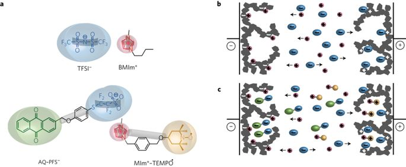
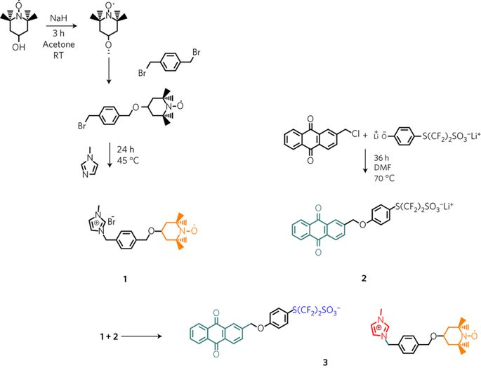

## Biredox ionic liquids with solid-like redox density in the liquid state for high-energy supercapacitors 氧化离子液体具有液态固体状氧化还原密度，适用于高能超级电容器

> Eléonore Mourad, Laura Coustan, Pierre Lannelongue, Dodzi Zigah, Ahmad Mehdi, André Vioux, Stefan A. Freunberger, Frédéric Favier & Olivier Fontaine
> Nature Materials, volume 16, pages 446–453 (2017)
> DOI: [10.1038/nmat4808](https://doi.org/10.1038/nmat4808)

### Abstract
Kinetics of electrochemical reactions are several orders of magnitude slower in solids than in liquids as a result of the much lower ion diffusivity. Yet, the solid state maximizes the density of redox species, which is at least two orders of magnitude lower in liquids because of solubility limitations. With regard to electrochemical energy storage devices, this leads to high-energy batteries with limited power and high-power supercapacitors with a well-known energy deficiency. For such devices the ideal system should endow the liquid state with a density of redox species close to the solid state. Here we report an approach based on biredox ionic liquids to achieve bulk-like redox density at liquid-like fast kinetics. The cation and anion of these biredox ionic liquids bear moieties that undergo very fast reversible redox reactions. As a first demonstration of their potential for high-capacity/high-rate charge storage, we used them in redox supercapacitors. These ionic liquids are able to decouple charge storage from an ion-accessible electrode surface, by storing significant charge in the pores of the electrodes, to minimize self-discharge and leakage current as a result of retaining the redox species in the pores, and to raise working voltage due to their wide electrochemical window.  
由于离子扩散率低得多，电化学反应的动力学在固体中比在液体中慢几个数量级。然而，固态使氧化还原物质的密度最大化，由于溶解度的限制，其在液体中至少低两个数量级。关于电化学能量存储装置，这导致具有有限功率的高能电池和具有众所周知的能量缺乏的高功率超级电容器。对于这样的装置，理想的系统应赋予液态接近固态的氧化还原物质的密度。在这里，我们报告了一种基于双向离子液体的方法，以在类似液体的快速动力学中实现块状氧化还原密度。这些双向离子液体的阳离子和阴离子带有经历非常快速的可逆氧化还原反应的部分。作为其高容量/高速率电荷存储潜力的首次证明，我们在氧化还原超级电容器中使用它们。这些离子液体能够通过在电极的孔隙中储存大量电荷来将电荷存储与离子可接触的电极表面分离，从而最小化由于将氧化还原物质保留在孔隙中而导致的自放电和漏电流，并且由于其宽电化学窗口，提高了工作电压。

### Main
Energy storage is undeniably one of the greatest technological and societal challenges of the twenty-first century, driven by the growing demand for renewable but intermittent energy supplies and mobile power sources1. Among storage approaches, electrochemical energy storage appears as the most versatile for multi-purpose uses. Ion-exchange processes balancing electronic charges are central to electrochemical energy storage. This mechanism includes solid redox active materials in batteries and surface capacitive or pseudocapacitive storage in supercapacitors2,3,4,5. However, ion diffusivity is typically around seven orders of magnitude lower in solids than in liquids. This is reflected by the drastically different kinetics of the electrochemical reactions involved in the solid and liquid state6,7. Nevertheless, the crucial advantage of the solid state is to provide a considerably higher density of redox active species. Accordingly, solid bulk storage materials lend high energy density, albeit at modest rate8,9. In contrast, electrochemical capacitors can deliver outstanding power thanks to the fast kinetics associated with the electrochemical storage mechanisms at the electrode–electrolyte interface. However, the energy density is limited by the surface density of sorbed ions in electrochemical double layer capacitors (EDLC) or of pseudocapacitive material2,4,10,11,12,13,14,15,16,17.  
由于对可再生但间歇性能源供应和移动电源的需求不断增长，能源储存无疑是二十一世纪最大的技术和社会挑战之一。在存储方法中，电化学能量存储似乎是多功能用途中最通用的。平衡电子电荷的离子交换过程是电化学能量存储的核心。该机制包括电池中的固体氧化还原活性材料和超级电容器中的表面电容或赝电容存储2,3,4,5。然而，离子扩散率通常比固体低约7个数量级。这可以通过固态和液态6中涉及的电化学反应的剧烈动力学反映出来。然而，固态的关键优势是提供相当高密度的氧化还原活性物质。因此，固体散装储存材料提供高能量密度，尽管是适度的速率8,9。相比之下，由于与电极-电解质界面处的电化学存储机制相关的快速动力学，电化学电容器可以提供出色的功率。然而，能量密度受电化学双层电容器（EDLC）或赝电容材料中吸附离子的表面密度的限制2,4,10,11,12,13,14,15,16,17。

The topical challenge for supercapacitors is to increase energy without compromising power. One way is to increase the operating voltage by means of electrolytes based on ionic liquids (ILs) instead of using aqueous or molecular non-aqueous electrolytes18,19,20,21,22. ILs have the additional advantage of improving safety and allowing the design of their constituent ions for specific requirements7. The other leverage to improve energy is the capacitance. The recent development of highly porous carbon materials has revealed limits to the further improvement of EDLC by a higher ion-accessible surface area4,5,12,13,14,15,16,17,22. Despite enhanced energy densities, pseudocapacitive storage at the electrode material surface is equally surface limited23,24,25. This limitation could be overcome in principle by involving redox species dissolved in the electrolyte. This was recently reported for aqueous electrolytes with, for example, iodide, hydroquinone, VOSO4 or p-phenylenediamine26,27,28,29,30,31. These works demonstrated that dissolved redox species reacted with the same fast kinetics as the electrostatic surface storage mechanisms. However, only little additional capacitance was recovered at prohibitively high self-discharge, because of low solubility and high ion diffusivity32. Recently, some of us synthesized a new IL with a redox moiety attached to one ion. Electrochemical characterization suggests its efficiency as a redox active electrolyte in a Li-ion battery, despite severe electrode balancing and self-discharge issues33,34,35,36,37. These results prompted us to turn to ILs with redox active moieties on both ions (making them bulkier) to obtain electrochemical devices with high energy density and limited self-discharge.  
超级电容器的主题挑战是在不影响功率的情况下增加能量。一种方法是通过基于离子液体（ILs）的电解质而不是使用水性或分子非水电解质18,19,20,21,22来增加工作电压。 IL具有提高安全性的额外优势，并允许根据特定要求设计其组成离子7。提高能量的另一个好处是电容。最近开发的高度多孔碳材料显示出通过更高的离子可及表面积进一步改善EDLC的局限性4,5,12,13,14,15,16,17,22。尽管能量密度增加，但电极材料表面的赝电容存储同样受到表面限制23,24,25。原则上可以通过涉及溶解在电解质中的氧化还原物质来克服该限制。最近报道了含有电解质的水溶液，例如碘化物，氢醌，VOSO4或对苯二胺26,27,28,29,30,31。这些工作证明溶解的氧化还原物质以与静电表面储存机制相同的快速动力学反应。然而，由于低溶解度和高离子扩散性，在极高的自放电下仅回收很少的额外电容32。最近，我们中的一些人合成了一种新的IL，其中氧化还原部分与一个离子相连。电化学表征表明其作为锂离子电池中的氧化还原活性电解质的效率，尽管严重的电极平衡和自放电问题33,34,35,36,37。这些结果促使我们转向在两种离子上具有氧化还原活性部分的IL（使它们更庞大）以获得具有高能量密度和有限自放电的电化学装置。

Here, we report a biredox IL, where anion and cation are functionalized with anthraquinone (AQ) and 2,2,6,6-tetramethylpiperidinyl-1-oxyl (TEMPO) moieties, respectively, and which demonstrates improved properties when used in model supercapacitors. Tethering a redox group to an ion makes this group ionic in either oxidation state, which increases its solubility in IL media and thus raises the redox density while keeping liquid-state reaction rates. Hence Faradaic charge storage becomes decoupled from the ion-accessible electrode surface limitation. This gives access to higher capacity, approaching that of solid redox materials, at the fast redox kinetics of dissolved redox species. The measured capacitance is twice that with non-redox IL electrolyte and was sustained for 2,000 cycles without deterioration. The bulky size of the redox ions impeded diffusion through the porous electrodes, which curbed self-discharge to the level of the redox non-active IL electrolyte. This new electrolyte concept opens up new opportunities to develop high-energy supercapacitors and a wide new field in redox materials.  
在这里，我们报告了一个biredox IL，其中阴离子和阳离子分别用蒽醌（AQ）和2,2,6,6-四甲基哌啶-1-氧基（TEMPO）部分官能化，并且当用于模型超级电容器时表现出改善的性质。将氧化还原基团连接到离子上使得该基团在氧化态下离子化，这增加了其在IL介质中的溶解度，从而提高了氧化还原密度，同时保持了液态反应速率。因此，法拉第电荷存储变得与离子可接近的电极表面限制分离。这使得在溶解的氧化还原物质的快速氧化还原动力学下获得更高的容量，接近固体氧化还原材料的容量。测量的电容是非氧化还原IL电解质的两倍，并且持续2,000个循环而没有变质。氧化还原离子的庞大尺寸阻碍了通过多孔电极的扩散，这抑制了自放电到氧化还原非活性IL电解质的水平。这种新的电解质概念为开发高能超级电容器和氧化还原材料的广阔新领域开辟了新的机会。

The concept of the biredox IL-enhanced capacitor in comparison to the purely capacitive EDLC is illustrated in Fig. 1. The biredox IL comprises a perfluorosulfonate anion bearing anthraquinone (AQ–PFS−) and a methyl imidazolium cation bearing TEMPO (MIm+–TEMPO⋅). Cells comprise carbon electrode materials and either pure butylmethyl imidazolium bis(trifluoromethylsulfonimide) (BMImTFSI) IL, biredox IL dissolved in BMImTFSI or pure biredox IL (at 60 °C) as the electrolyte. Since the biredox IL shown here melts above 9 °C (see differential scanning calorimetry, DSC, in Supplementary Fig. 6) it could be used only at room temperature as a salt dissolved in non-active BMImTFSI or at 60 °C when pure. When the cell is charged with pure BMImTFSI, electrolyte cations and anions are drawn into the negative and positive electrodes, respectively, and are adsorbed at the carbon surface without undergoing a Faradaic reaction. In the case of the biredox IL-containing cell, the same processes apply to the BMIm+ cation and TFSI− anion. Additionally, as the redox active AQ–PFS− and MIm+–TEMPO⋅ ions are electrosorbed at the surface of the carbon electrodes, they undergo fast Faradaic reactions. Their bulky size, in combination with the high viscosity of the electrolyte, impedes self-discharge, as further discussed below. Since either redox species is ionic in either oxidation state, the solubility greatly exceeds the typical solubility of neutral redox species. Here we attach the reducible moiety to the anion and the oxidizable moiety to the cation, which results in bi-anions and bi-cations being generated at the anode and the cathode, respectively. However, the opposite combination would also be conceivable, which would result in zwitterionic species.  
与纯电容EDLC相比，biredox IL增强电容器的概念如图1所示.biredox IL包含带有蒽醌的全氟磺酸根阴离子（AQ-PFS-）和带有TEMPO的甲基咪唑阳离子（MIm +-TEMPO⋅ ）。细胞包含碳电极材料和纯丁基甲基咪唑鎓双（三氟甲基磺酰亚胺）（BMImTFSI）IL，溶解在BMImTFSI中的biredox IL或纯双折射IL（在60℃下）作为电解质。由于此处所示的双折射IL在9°C以上熔化（参见差示扫描量热法，DSC，在补充图6中），它只能在室温下作为溶解在非活性BMImTFSI中的盐或在纯度时在60°C下使用。当电池充满纯BMImTFSI时，电解质阳离子和阴离子分别被吸入负电极和正电极，并被吸附在碳表面而不经历法拉第反应。在含有biredox IL的细胞的情况下，相同的过程适用于BMIm +阳离子和TFSI-阴离子。另外，由于氧化还原活性AQ-PFS-和MIm + -TEMPO·离子在碳电极表面被电吸附，它们经历快速法拉第反应。它们庞大的尺寸与电解质的高粘度相结合，阻碍了自放电，如下面进一步讨论的。由于任一氧化还原物质在任一氧化态下都是离子的，因此溶解度大大超过中性氧化还原物质的典型溶解度。在此，我们将可还原部分连接到阴离子上，将可氧化部分连接到阳离子上，这导致分别在阳极和阴极处产生双阴离子和二阳离子。然而，也可以想到相反的组合，这将导致两性离子物种。

  
Figure 1: Comparison of charge storage in EDLC with IL electrolyte and the biredox IL-enhanced pseudocapacitor.图1：EDLC中的电荷存储与IL电解质和biredox IL增强的赝电容器的比较。  
a, Structure of the herein used BMImTFSI IL and the biredox IL comprising a perfluorosulfonate anion bearing anthraquinone (AQ–PFS−) and a methyl imidazolium cation bearing TEMPO (MIm+–TEMPO⋅). b,c, Charge storage in a purely capacitive EDLC comprising porous carbon electrodes and an IL electrolyte (b) and the herein developed concept of capacitors with additional Faradaic processes at the redox active ions of the biredox IL electrolyte (c).  
a，本文使用的BMImTFSI IL和包含带有蒽醌的全氟磺酸根阴离子（AQ-PFS-）和带有TEMPO（MIm + -TEMPO）的甲基咪唑阳离子的双折射IL的结构。 b，c，在包含多孔碳电极和IL电解质的纯电容性EDLC中的电荷存储（b）和本文开发的电容器的概念，其在双折射IL电解质的氧化还原活性离子上具有额外的法拉第过程（c）。

We prepared the biredox IL by first separately synthesizing a methyl imidazolium cation bearing a TEMPO moiety, and the lithium salt of a perfluorosulfonate anion bearing an AQ moiety, and then carrying out the metathetic reaction to obtain the biredox IL (Fig. 2). The first involves a Williamson ether synthesis from 4-hydroxyl-TEMPO and α-α′-dibromo-p-xylene, followed by a quaternization reaction with 1-methylimidazole to yield MIm+–TEMPO⋅Br−(1). The synthesis of the Li perfluorosulfonate bearing an AQ moiety (Li+AQ–PFS−, 2) follows an analogous path via ether synthesis from chloromethyl anthraquinone and the appropriate alkoxide. Finally, the two intermediates are combined, yielding the biredox final IL. More experimental details are given in the Supplementary Information.  
我们首先分别合成带有TEMPO部分的甲基咪唑阳离子和带有AQ部分的全氟磺酸根阴离子的锂盐，然后进行复分解反应以获得双折射IL（图2），制备双折射IL。第一种涉及由4-羟基-TEMPO和α-α'-二溴 -对二甲苯合成Williamson醚，然后与1-甲基咪唑进行季铵化反应，得到MIm + -TEMPO·Br-（1）。具有AQ部分的Li全氟磺酸盐（Li + AQ-PFS-，2）的合成遵循通过醚合成从氯甲基蒽醌和适当的醇盐的类似路径。最后，将两种中间体合并，得到双重最终IL。补充信息中给出了更多实验细节。

Figure 2: Synthesis of the biredox ionic liquid. 图2：双折叠离子液体的合成。  
The cation bearing AQ (1) and anion bearing TEMPO (2) are prepared separately before obtaining the biredox IL (3) through metathesis.  
在通过复分解获得双折射IL（3）之前，分别制备带阳离子的AQ（1）和带阴离子的TEMPO（2）。

IR analysis confirms the presence of the characteristic bands for TEMPO and AQ at around 2,900 and 1,300 cm−1, respectively (Supplementary Fig. 7). The spectrum of 3 does not correspond to a simple addition of the spectra of the constituent precursors 1 and 2 before the metathesis reaction. This suggests that, after ion exchange and removal of LiBr, the resulting moieties experience a different environment than in the initial salts 1 and 2 (with Li+ and Br− counter ions, respectively). The additional bands in the spectrum of 3 indicate new interactions that probably originate from specific interactions between the sulfonate anion and the imidazolium cation. Biredox IL, precursors and intermediates were characterized by mass spectrometry (Supplementary Figs 2, 4 and 5), differential scanning calorimetry (DSC) (Supplementary Fig. 6) and thermogravimetric analysis (TGA) (Supplementary Fig. 8). Nuclear magnetic resonance (NMR) (Supplementary Fig. 3) was used for the characterization of the anion bearing anthraquinone (TEMPO is actually a paramagnetic compound). The water content of the final biredox IL in BMimTFSI electrolyte was measured by Karl Fischer titration (80 ppm and 100 ppm respectively). These data demonstrate the composition and purity of the prepared biredox IL.  
IR分析证实TEMPO和AQ的特征谱带分别在2,900和1,300 cm-1左右（补充图7）。3的光谱不对应于在复分解反应之前简单地添加组分前体1和2的光谱。这表明，在离子交换和除去LiBr后，所得部分经历与初始盐1和2（分别具有Li +和Br-抗衡离子）不同的环境。光谱中的附加谱带3表明新的相互作用可能源自磺酸根阴离子和咪唑鎓阳离子之间的特定相互作用。 Biredox IL，前体和中间体通过质谱法（补充图2,4和5），差示扫描量热法（DSC）（补充图6）和热重分析（TGA）（补充图8）表征。核磁共振（NMR）（补充图3）用于表征带有蒽醌的阴离子（TEMPO实际上是顺磁性化合物）。通过Karl Fischer滴定（分别为80ppm和100ppm）测量BMimTFSI电解质中最终双折射IL的水含量。这些数据证明了制备的双折射IL的组成和纯度。

The cyclic voltammograms (CVs) of 2 mM biredox IL and 0.1 M TBAPF6 solutions in acetonitrile (MeCN) when using a glassy carbon disc electrode are shown in Supplementary Fig. 9. The peak couple around 0.6 V versus Ag/AgCl is assigned to the oxidation of the TEMPO radical (MIm+–TEMPO⋅) to the TEMPO cation (MIm+–TEMPO+) and its reverse reaction. The reduction of the AQ–PFS− moiety to the anthraquinone radical anion (AQ⋅−–PFS−) and di-anion (AQ2−–PFS−) is characterized by two peak couples around −0.7 and −0.9 V versus Ag/AgCl (refs 38,39). The CV confirms equally reversible electrochemistry of the redox moieties when attached to the ions as in the well-known unsupported substances (see Supplementary Fig. 16 for the redox reactions). The electrochemical stability window with glassy carbon electrodes is 3.7 V for the 0.5 M biredox IL solution in BMImTFSI (Supplementary Fig. 10). In the asymmetric PICA/PICA device it still exceeds 2.8 V, demonstrating the advantage of using IL electrolytes to expand the potential window to nearly 3 V (ref. 36). This stands in contrast to previously reported dissolved redox species in supercapacitors such as AQ or iodide in aqueous media, where the electrochemical stability window is limited to ≍1.2 V (refs 37,38). The dissolution of biredox IL in BMImTFSI up to saturation slightly increased the conductivities (Supplementary Table 1 and Supplementary Fig. 11). The conductivity of the pure biredox IL was several orders of magnitude lower, and could only be measured above its glass transition temperature. In agreement with the literature, the viscosity of BMimTFSI was measured at 53 cP and its density at 1.4 g cm−3(ref. 39).  
当使用玻璃碳圆盘电极时，2mM biredox IL和0.1 M TBAPF6溶液在乙腈（MeCN）中的循环伏安图（CV）显示在补充图9中。对于Ag /AgCl，峰值偶数约为0.6 V。 TEMPO自由基（MIm + -TEMPO）氧化成TEMPO阳离子（MIm + -TEMPO +）及其逆反应。 AQ-PFS-部分向蒽醌自由基阴离子（AQ⋅-PFS-）和二阴离子（AQ2-PFS-）的还原表征为两个峰值对，在-0.7和-0.9V之间，相对于Ag /AgCl （参考38,39）。如同众所周知的无载体物质那样，当CV附着在离子上时，CV证实了氧化还原部分的同样可逆电化学（参见补充图16中的氧化还原反应）。对于BMImTFSI中的0.5M biredox IL溶液，具有玻碳电极的电化学稳定窗口为3.7V（补充图10）。在非对称PICA /PICA器件中，它仍然超过2.8 V，证明了使用IL电解质将电位窗扩展到接近3 V的优势（参考文献36）。这与先前报道的在水性介质中超级电容器如AQ或碘化物中溶解的氧化还原物质形成对比，其中电化学稳定性窗口限于≍1.2V（参考文献37,38）。 biredox IL在BMImTFSI中的溶解直至饱和度略微增加了电导率（补充表1和补充图11）。纯双折射IL的电导率低几个数量级，并且只能在其玻璃化转变温度以上测量。与文献一致，BMimTFSI的粘度在53cP下测量，其密度在1.4g cm -3下测量（参考文献39）。