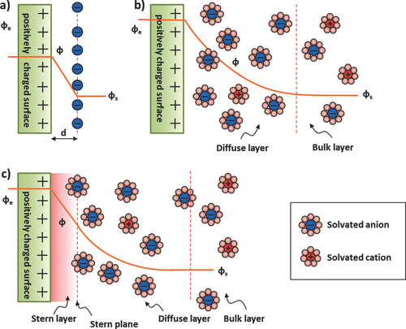
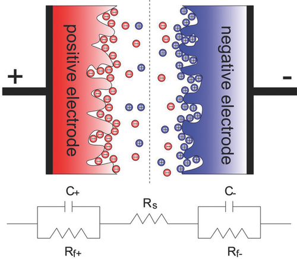
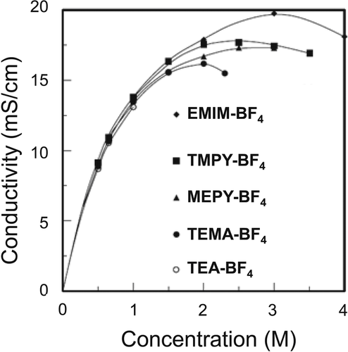

## Carbons and Electrolytes for Advanced Supercapacitors
## 用于先进超级电容器的碳材料和电解质

> Advanced Materials / Volume 26, Issue 14
> François Béguin, Volker Presser, Andrea Balducci, Elzbieta Frackowiak
> DOI: 10.1002/adma.201304137

### Abstract
Electrical energy storage (EES) is one of the most critical areas of technological research around the world. Storing and efficiently using electricity generated by intermittent sources and the transition of our transportation fleet to electric drive depend fundamentally on the development of EES systems with high energy and power densities. Supercapacitors are promising devices for highly efficient energy storage and power management, yet they still suffer from moderate energy densities compared to batteries. To establish a detailed understanding of the science and technology of carbon/carbon supercapacitors, this review discusses the basic principles of the electrical double‐layer (EDL), especially regarding the correlation between ion size/ion solvation and the pore size of porous carbon electrodes. We summarize the key aspects of various carbon materials synthesized for use in supercapacitors. With the objective of improving the energy density, the last two sections are dedicated to strategies to increase the capacitance by either introducing pseudocapacitive materials or by using novel electrolytes that allow to increasing the cell voltage. In particular, advances in ionic liquids, but also in the field of organic electrolytes, are discussed and electrode mass balancing is expanded because of its importance to create higher performance asymmetric electrochemical capacitors.  
电能存储（EES）是世界上最重要的技术研究领域之一。存储和有效利用间歇性电源产生的电力以及我们的运输车队向电力驱动的转变，从根本上取决于具有高能量和功率密度的EES系统的发展。超级电容器是用于高效能量存储和电源管理的有前途的设备，但与电池相比，它们仍然具有适度的能量密度。为了详细了解碳/碳超级电容器的科学和技术，本综述讨论了双电层（EDL）的基本原理，特别是关于离子尺寸/离子溶剂化与多孔碳电极孔径之间的关系。我们总结了合成用于超级电容器的各种碳材料的关键方面。为了提高能量密度，最后两部分致力于通过引入赝电容材料或使用允许增加电池电压的新型电解质来增加电容的策略。特别地，讨论了离子液体的进步，但也讨论了有机电解质领域，并且由于其对于产生更高性能的不对称电化学电容器的重要性而扩展了电极质量平衡。

### 1 Introduction
Reducing fossil fuel consumption and greenhouse gas emissions has become global objectives being recognized as an imperative for the sustainable development of economy and society. Electricity production from renewable energy sources and further improvement of energy efficiency are the most promising solutions for reaching these objectives. Most nations or multinational associations have devised plans to achieve this challenging goal; for example, the European Union has set a goal by 2020 to reduce greenhouse gas emissions by 20%, drawing 20% of energy from renewable sources, and cutting the EU‐wide energy use by 20%. Implementation of renewable energy sources, such as solar or wind energy, however, causes paramount challenges to power grid management and grid stability because of the large fluctuations in electricity generation that are completely decoupled from the actual energy demand. Various technologies exist or are being developed to achieve this task, ranging from mechanical, physical, thermal, chemical, and electrochemical energy storage systems. Considering a reliable, stable, and sustainable large‐scale use of renewable energy, batteries and/or supercapacitors play a key role for advanced and highly efficient energy storage and management. In general, lithium‐ion and Ni/MH batteries are used for their relatively high energy density, while supercapacitors are applied for their high power density, this means the two devices might play complementary functions when they are hybridized.  
减少化石燃料消耗和温室气体排放已成为全球目标，被认为是经济和社会可持续发展的必要条件。可再生能源的电力生产和能源效率的进一步提高是实现这些目标的最有希望的解决方案。大多数国家或多国协会都制定了实现这一具有挑战性目标的计划;例如，欧盟在2020年之前制定了一项目标，即将温室气体排放量减少20％，从可再生能源中抽取20％的能源，并将欧盟范围内的能源使用量减少20％。然而，太阳能或风能等可再生能源的实施对电网管理和电网稳定性构成了至关重要的挑战，因为发电的大幅波动与实际能源需求完全脱钩。存在或正在开发各种技术来实现该任务，范围从机械，物理，热，化学和电化学能量存储系统。考虑到可靠，稳定和可持续的大规模使用可再生能源，电池和/或超级电容器在先进和高效的能源存储和管理中发挥着关键作用。一般来说，锂离子和镍氢电池的能量密度相对较高，而超级电容器的功率密度较高，这意味着两种设备在混合时可能起到互补作用。

Currently both technologies require further optimization – with regards to employing environmentally safe and much more cost effective materials. Specifically research and industrial developments for supercapacitors are essentially oriented to improving the device's energy density through the design of new electrode materials, new electrolytes, and new electrochemical concepts. As far as power is concerned, intelligent engineering of electrodes and whole device is most often more effective than designing complicated nanostructured materials.  
目前，这两种技术都需要进一步优化 -采用环保安全且更具成本效益的材料。特别是超级电容器的研究和工业开发主要是通过设计新的电极材料，新电解质和新的电化学概念来改善器件的能量密度。就功率而言，电极和整个设备的智能工程通常比设计复杂的纳米结构材料更有效。

Microporous carbons are the primary materials used to make supercapacitor electrodes. They have relatively high electrical conductivity, essential for power applications, and large specific surface area (SSA), necessary for enhancing the capacitance. They are mostly derived from sustainable, natural, abundant, low to moderate cost resources, an important factor for industrial applications. In addition, they are available in a wide variety of forms such as: powders, fibers, cloths, monoliths, nanotubes, nanospheres and so on. This versatility allows the engineer to match the material characteristics exactly to a given application (e.g., flexible devices or large scale stationary systems). The most attractive property of carbons is their diversity of textures/structures and surface chemistries. By adjusting these parameters, it is possible to alter the electrochemical performance of the materials and to adapt them to various kinds of electrolytic media and system configurations.  
微孔碳是用于制造超级电容器电极的主要材料。它们具有相对高的导电性，对于功率应用是必不可少的，并且具有增大电容所需的大比表面积（SSA）。它们主要来自可持续，自然，丰富，低至中等成本资源，是工业应用的重要因素。此外，它们有多种形式，如：粉末，纤维，布料，整料，纳米管，纳米球等。这种多功能性允许工程师将材料特性精确地匹配给定应用（例如，柔性装置或大规模固定系统）。碳的最吸引人的特性是它们的纹理/结构和表面化学的多样性。通过调整这些参数，可以改变材料的电化学性能并使它们适应各种电解介质和系统配置。

This review describes the design of carbons and electrochemical capacitor systems based on carbon electrodes, with the objective to enhance the capacitance or/and voltage and to improve the energy density of the device. First, the general properties of electrical double‐layer capacitors, the optimization of capacitance and charge propagation will be introduced. The impact of carbon porosity and pore architecture will be discussed in detail and design strategies will be outlined. Then the different possibilities for enhancing capacitance, through fast redox reactions in protic electrolytes, are explained. In particular, it will be shown that new forms of carbons, such as nanotubes or graphene, are an excellent support for pseudocapacitive materials such as transition metal oxides and electrically conducting polymers. Finally, the possibilities of enhancing the voltage through the use of advanced electrolytes or hybrid system designs will be discussed. In all examples of supercapacitor systems, the material – electrolyte couple will be at the center of discussion.  
该综述描述了基于碳电极的碳和电化学电容器系统的设计，目的是增强电容或/和电压并改善器件的能量密度。首先，将介绍电双层电容器的一般特性，电容和电荷传播的优化。将详细讨论碳孔隙度和孔隙结构的影响，并概述设计策略。然后解释了通过质子电解质中的快速氧化还原反应来增强电容的不同可能性。特别地，将显示新形式的碳，例如纳米管或石墨烯，是对诸如过渡金属氧化物和导电聚合物的赝电容材料的极好支撑。最后，将讨论通过使用先进电解质或混合系统设计来增强电压的可能性。在超级电容器系统的所有例子中，材料 -电解质对将成为讨论的中心。

### 2 Electrical Double‐Layer Capacitors (EDLCs)
#### 2.1 Introduction
The main energy storage mechanism in supercapacitors arises from the reversible electrostatic accumulation of ions on the surface of porous carbon. The Helmholtz model1 describes the charge separation at the electrode/electrolyte interface when an electrode of surface area S (m2) is polarized. Under this condition, ions of opposite sign diffuse through the electrolyte to form a condensed layer with a thickness of a few nanometers in a plane parallel to the electrode surface ensuring charge neutrality. This accumulation of charges is called electrical double‐layer (EDL). The potential in the vicinity of the electrode then decreases when the distance d (m) between the ions and the electrode increases (Figure 1a). This simplified Helmholtz double‐layer (DL) can be regarded as an electrical capacitor of capacitance CH defined by Equation 1:  
超级电容器中的主要能量存储机制源于多孔碳表面上离子的可逆静电累积。亥姆霍兹模型1描述了当表面积S（m2）的电极被极化时电极/电解质界面处的电荷分离。在这种条件下，符号相反的离子通过电解质扩散，在平行于电极表面的平面内形成厚度为几纳米的凝聚层，确保电荷中性。这种电荷累积称为电双层（EDL）。当离子和电极之间的距离d（m）增加时，电极附近的电位会降低（图1a）。这种简化的亥姆霍兹双层（DL）可视为由等式1定义的电容CH的电容器：

$C_H=\epsilon_0 \cdot \epsilon_r \cdot \frac{S}{d}$

where ε0 is the vacuum permittivity (ε0 = 8.854·10−12 F/m), εr the relative permittivity of the dielectric electrolyte, and d is the effective thickness of the DL, often approximated as the Debye length. Considering the very large SSA of porous carbon electrodes (up to 3000 m2/g) and a Debye length in the range of <1 nm, the resulting capacitance of DL's will be much higher than for flat plate capacitors.  
其中ε0是真空介电常数（ε0= 8.854·10-12F /m），εr是介电电解质的相对介电常数，d是DL的有效厚度，通常近似为德拜长度。考虑到多孔碳电极的SSA非常大（高达3000 m2 /g）且德拜长度在<1 nm范围内，DL的电容将远高于平板电容器。

Figure 1. (a) Helmholtz, (b) Gouy‐Chapman, and (c) Stern model of the electrical double‐layer formed at a positively charged electrode in an aqueous electrolyte. The electrical potential, φ, decreases when transitioning from the electrode, φe, to the bulk electrolyte infinite away from the electrode surface, φs. The Stern plane marks the distance of closest approach of the ions to the charged surface. Note the absence of charges/ions in the Stern layer. The diffuse layer starts in the range of 10 – 100 nm from the electrode surface.  
图1.（a）亥姆霍兹，（b）Gouy-Chapman，和（c）在含水电解质中在带正电的电极上形成的双电层的斯特恩模型。当从电极φe过渡到无限远离电极表面的体电解质φs时，电势φ减小。斯特恩平面标记离子最接近带电表面的距离。注意Stern层中没有电荷/离子。扩散层在距电极表面10-100nm的范围内开始。

Since the Helmholtz model does not take into account several factors such as the diffusion of ions in the solution and the interaction between the dipole moment of the solvent and the electrode, Gouy and Chapman proposed a diffuse model of the EDL in which the potential decreases exponentially from the electrode surface to the fluid bulk (Figure 1a).2 However, the Gouy‐Chapman model is insufficient for highly charged double‐layers, and in 1924, Stern3 suggested a model combining the Helmholtz and Gouy‐Chapman models by accounting for the hydrodynamic motion of the ionic species in the diffuse layer and the accumulation of ions close to the electrode surface (Figure 1c). These two layers are equivalent to two capacitors in series, CH (Helmholtz layer) and CD (diffuse layer), and the total capacitance of the electrode (CDL) is given by Equation 2:  
由于亥姆霍兹模型没有考虑几个因素，例如溶液中离子的扩散以及溶剂的偶极矩与电极之间的相互作用，因此Gouy和Chapman提出了EDL的扩散模型，其中电位以指数方式降低从电极表面到流体体积（图1a）.2然而，Gouy-Chapman模型不足以用于高电荷双层，并且在1924年，Stern3提出了一个模型，结合Helmholtz和Gouy-Chapman模型，考虑到扩散层中离子物质的流体动力学运动和靠近电极表面的离子累积（图1c）。这两层相当于串联的两个电容，CH（亥姆霍兹层）和CD（扩散层），电极的总电容（CDL）由公式2给出：

$\frac{1}{C_{DL}} = \frac{1}{C_H} + \frac{1}{C_D}}$

An electrical double‐layer capacitor (EDLC) consists of two porous carbon, generally activated carbon (AC), electrodes in direct contact with the current collector and separated by a porous film impregnated with an electrolyte solution (Figure 2). When an electric potential difference is applied between the electrodes, the negative charge carriers, electrons, in the negatively polarized electrode are balanced by an equal number of positive cations at the electrode/electrolyte interface, while the holes stored at the positively polarized electrode are electrically balanced by anions. Hence, a supercapacitor consisting of two electrodes is equivalent to two capacitors in series and the resulting capacitance (C) can then be expressed according to Equation 3:  
双电层电容器（EDLC）由两个多孔碳（通常为活性炭（AC））组成，电极与集电器直接接触，并由浸渍有电解质溶液的多孔膜隔开（图2）。当在电极之间施加电势差时，负极化电极中的负电荷载流子电子在电极/电解质界面处由相等数量的正阳离子平衡，而存储在正极化电极处的空穴是电的。由阴离子平衡。因此，由两个电极组成的超级电容器相当于两个串联的电容器，然后可以根据公式3表示得到的电容（C）：

$\frac{1}{C} = \frac{1}{C_+} + \frac{1}{C_-}}$

where C+, C–, and C are the capacitance (Farad = Coulomb/Volt) of the positive electrode, the negative electrode, and of the resulting device, respectively.

Figure 2. Representation of the charged state of a symmetric electrical double‐layer capacitor using porous electrodes and of the corresponding equivalent circuit. R denotes resistors, C denotes capacitors.  
图2.使用多孔电极和相应的等效电路的对称双电层电容器的充电状态的表示。 R表示电阻器，C表示电容器。

To provide a basis for comparison between different electrode materials, it has become common practice to provide a specific (gravimetric) capacitance, which is related to the capacitance of one single electrode, CSP (F/g). In case of a symmetric system, where both electrodes are equal in mass, thickness, size, and material, the Equation 4 can be used:

$C_{SP} = 4 \cdot \frac{C}{m_{AM}}$

where mAM is the total mass of active material. While some authors subtract the amount of binder or other additives, it is more accurate to use the total mass of both dry electrodes. The factor 4 is related to normalization to the mass of one electrode for the two identical capacitors in series.

The stored specific energy E (Wh/kg), also called energy density, in a supercapacitor is given by Equation 5:

$E = \frac{C \cdot U_{max}^2}{2 \cdot m \cdot 3600}$

where m (kg) is the mass of the supercapacitor and Umax (V) the maximum region of electrochemical stability. The normalization to the supercapacitor mass provides a basis for comparison with other devices, especially from an application point of view.
The maximum specific power (W/kg) also depends on the maximal applicable voltage and is given by Equation 6:

$P = \frac{U_{max}^2}{4 \cdot ESR \cdot m}$

where ESR (Ω) is the equivalent series resistance of the system. The ESR corresponds to the sum of the resistances related to the ionic resistance of the electrolyte impregnated in the separator, the electronic resistance of electrodes, and interface resistances between electrodes and current collectors. Alternatively, the normalization can also be carried out by the device volume v (m3) rather than the mass m (kg), to provide a comparison for the compactness of energy and power devices.

Due the purely physical formation of the EDL without electrochemical reactions, the charging of EDL capacitors (EDLCs) is very rapid. This fundamentally differs from batteries, where energy is stored through redox processes. In other words, EDLCs can deliver very high power densities (∼15 kW/kg) compared to, for example, Li‐ion batteries (up to about 2 kW/kg).4 However, the specific energy of EDLCs is much lower (5–8 Wh/kg) than that of Li‐ion batteries (up to 180 Wh/kg for commercial products).5 Therefore, a lot of research effort is devoted to increasing the energy density of supercapacitors through an optimization of capacitance and/or voltage, following Equation 5.  
由于EDL的纯物理形成而没有电化学反应，EDL电容器（EDLC）的充电非常迅速。这基本上不同于通过氧化还原过程储存能量的电池。换句话说，与例如锂离子电池（高达约2 kW /kg）相比，EDLC可以提供非常高的功率密度（~15 kW /kg）.4然而，EDLC的比能量要低得多（ 5-8 Wh /kg）比锂离子电池（商用产品高达180 Wh /kg）.5因此，大量研究工作致力于通过优化电容和/来提高超级电容器的能量密度。或电压，按照公式5。

#### 2.2 General Properties of Electrolytes for EDLCs
Electrolytes used in supercapacitors are aqueous, organic, or liquid salts (commonly known as ionic liquids). The two main criteria for selection of an electrolyte are the electrochemical stability window and the ionic conductivity. The first is important to maximize the specific energy values (Equation 5), while the second has a major influence on the values of power (Equation 6).  
超级电容器中使用的电解质是水性，有机或液体盐（通常称为离子液体）。选择电解质的两个主要标准是电化学稳定性窗口和离子电导率。第一个对于最大化比能量值很重要（公式5），而第二个对功率值有很大影响（公式6）。

Acid‐based (e.g., H2SO4) and alkali (e.g., KOH) aqueous electrolytes have a higher conductivity (up to ∼1 S/cm) compared to organic electrolytes (based on acetonitrile or propylene carbonate), giving the system a higher power performance. However, due to the narrow electrochemical stability window (1.23 V) of water, the operating voltage is relatively low (∼1 V)6 and, consequently, the energy that can be stored in the device is limited. Khomenko et al.7 demonstrated that it is possible to increase the operating voltage of carbon based supercapacitors in aqueous H2SO4 up to 1.6 V by using different optimized carbons as positive and negative electrodes and/or by balancing the mass of electrodes. It is important to note that, depending on the used carbon, the over‐potential for electrolyte decomposition varies and that the temperature plays an important role in the degradation mechanism. To mitigate the corrosive character of the acid media, electrolytes with neutral pH have been investigated, and voltage values up to 2 V, with good charge/discharge cycle life, have been observed for symmetric AC cells in Na2SO4 and Li2SO4.8, 9 Neutral pH electrolytes have been also implemented in asymmetric capacitors with an AC negative electrode and a positive electrode from transition metal oxide, for example MnO2.10  
与有机电解质（基于乙腈或碳酸亚丙酯）相比，酸性（如H2SO4）和碱性（如KOH）含水电解质具有更高的电导率（高达~1 S /cm），使系统具有更高的功率性能。然而，由于水的电化学稳定窗口（1.23V）较窄，工作电压相对较低（~1V）6，因此，可以存储在装置中的能量是有限的。 Khomenko等人7表明，通过使用不同的优化碳作为正电极和/或通过平衡电极质量，可以将含水H2SO4中的碳基超级电容器的工作电压提高到1.6V。重要的是要注意，取决于所使用的碳，电解质分解的过电位变化并且温度在降解机理中起重要作用。为了减轻酸性介质的腐蚀性，已经研究了具有中性pH的电解质，并且在Na2SO4和Li2SO4中对称AC电池观察到电压值高达2V，具有良好的充电/放电循环寿命。 pH电解质也已在不对称电容器中实现，其具有AC负电极和来自过渡金属氧化物的正电极，例如MnO2.10。

Electrolytes composed of a salt dissolved in an organic solvent provide a wider electrochemical stability window in the range of 2.7 – 2.8 V compared to aqueous solutions. However, their ionic conductivity and the specific capacitance (100 – 150 F/g) are lower than for aqueous electrolytes.11, 12 The high cell voltage allows supercapacitors using organic electrolytes to deliver a higher specific energy than aqueous systems and for this reason the majority of industrial systems are currently produced with organic electrolytes. *Propylene carbonate (PC) and acetonitrile (AN) are the most commonly used solvents in supercapacitors.* Ue et al.13 reported using PC as a solvent because of its wide electrochemical window and its resistance against hydrolysis; however, due to its high viscosity, the performance of supercapacitors prepared with PC is more sensitive to temperature variations compared to AN.14 Salts commonly applied in organic electrolytes are *quaternary ammonium salts* out of which tetraethylammonium tetrafluoroborate (TEA‐BF4) is the most widely used salt for commercial supercapacitors. It is necessary to optimize the conductivity of the electrolyte by selecting the appropriate salt.15  
与水溶液相比，由溶解在有机溶剂中的盐组成的电解质提供了2.7-2.8V的更宽的电化学稳定性窗口。然而，它们的离子电导率和比电容（100-150 F /g）低于含水电解质.11,12高电池电压允许超级电容器使用有机电解质提供比水系统更高的比能量，因此目前大多数工业系统都是用有机电解质生产的。*碳酸亚丙酯（PC）和乙腈（AN）是超级电容器中最常用的溶剂。* Ue等人13报道了使用PC作为溶剂，因为它具有宽的电化学窗口和抗水解性;然而，由于其高粘度，与AN相比，用PC制备的超级电容器的性能对温度变化更敏感.14*有机电解质中常用的盐是季铵盐，其中四乙基铵四氟硼酸盐（TEA-BF4）是最广泛的用盐用于商业超级电容器。*有必要通过选择合适的盐来优化电解质的电导率

The graph in Figure 3 illustrates how the electrolyte conductivity increases with increasing salt concentration up to a maximum value.16 Beyond the maximum conductivity point, additional salt ions do not contribute to the conductivity of the electrolyte. Note that at 25 °C, TEA‐BF4 shows a maximum conductivity in PC at a concentration of 1 m, while the other salts have higher conductivities for higher concentrations. Due to high costs, salts like EMIM‐BF4 (1‐ethyl‐3‐methylimidazolium tetrafluoroborate) or MEPY‐BF4 (1‐ethyl‐1‐methylpyrrolidinium tetrafluoroborate) are currently unsuitable for industrial applications. Instead, it is possible to use TEMA‐BF4 (triethylmethylammonium tetrafluoroborate) at higher concentrations (2 m) yielding higher ionic conductivities and avoiding ion depletion during charging of large cells at high power.17 Another salt, TMPY‐BF4 (tetramethylene‐pyrrolidinium tetrafluoroborate), shows even higher solubility in propylene carbonate which translates to a higher ionic conductivity, and it is already introduced to commercial applications.18  
图3中的图表说明了电解质电导率如何随着盐浓度的增加而增加到最大值.16超过最大电导率点，额外的盐离子对电解质的电导率没有贡献。请注意，在25°C时，TEA-BF4在PC浓度为1 m时显示最大电导率，而其他盐在较高浓度下具有较高电导率。由于成本高，诸如EMIM-BF4（1-乙基-3-甲基咪唑四氟硼酸盐）或MEPY-BF4（1-乙基-1-甲基吡咯烷四氟硼酸盐）的盐目前不适用于工业应用。相反，可以使用更高浓度（2 m）的TEMA-BF4（三乙基甲基铵四氟硼酸盐），在高功率大电池充电过程中产生更高的离子电导率并避免离子耗尽.17另一种盐，TMPY-BF4（四亚甲基吡咯烷四氟硼酸盐） ），在碳酸亚丙酯中表现出更高的溶解度，转化为更高的离子电导率，已经引入商业应用.

Figure 3. Conductivity versus concentration of quaternary ammonium salts in propylene carbonate (PC) at 25 °C. Adapted with permission; Copyright: The Electrochemical Society of Japan, 2007.16. EMIM‐BF4: 1‐ethyl‐3‐methylimidazolium tetrafluoroborate; TMPY‐BF4: tetramethylene‐pyrrolidinium tetrafluoroborate; MEPY‐BF4: 1‐ethyl‐1‐methylpyrrolidinium tetrafluoroborate; TEMA‐BF4: triethylmethylpyrrolidinium tetrafluoroborate; TEA‐BF4: tetraethylammonium tetrafluoroborate.  
图3.在25℃下碳酸亚丙酯（PC）中季铵盐的电导率与浓度的关系。经许可改编;版权所有：日本电化学会，2007.16。 EMIM-BF4：1-乙基-3-甲基咪唑四氟硼酸盐; TMPY-BF4：四亚甲基-吡咯烷四氟硼酸盐; MEPY-BF4：1-乙基-1-甲基吡咯烷四氟硼酸盐; TEMA-BF4：三乙基甲基吡咯烷四氟硼酸盐; TEA-BF4：四乙基铵四氟硼酸盐。

Room temperature ionic liquids (RTILs) are molten salts that have been considered recently as a promising class of electrolytes in supercapacitors.19 Since no solvent is required, these electrolytes have a very low vapor pressure, limiting environmental exposure and preventing the risk of explosion. Other attractive properties are their stability at increased temperatures extending well beyond the ∼80 °C limit of organic electrolytes and a broad electrochemical stability window which appears superior to that of organic solvents.20 However, the ionic conductivity of RTILs, especially at room temperature, is generally lower than that of organic electrolytes,21 reducing the power performance of RTIL‐based supercapacitors.  
室温离子液体（RTIL）是熔盐，最近被认为是超级电容器中有前途的一类电解质.19由于不需要溶剂，这些电解质具有非常低的蒸气压，限制了环境暴露并防止了爆炸的危险。其他有吸引力的特性是它们在升高的温度下的稳定性，远远超过有机电解质的~80℃限制和宽的电化学稳定性窗口，其似乎优于有机溶剂.20然而，RTIL的离子电导率，特别是在室温下，通常低于有机电解质，21降低了基于RTIL的超级电容器的功率性能。