## Graphene based all-solid-state supercapacitors with ionic liquid incorporated polyacrylonitrile electrolyte 基于石墨烯的全固态超级电容器，其中离子液体掺入聚丙烯腈电解质

> P. Tamilarasan, S. Ramaprabhu
> Energy, Volume 51, 1 March 2013, Pages 374-381
> DOI: [10.1016/j.energy.2012.11.037](https://10.1016/j.energy.2012.11.037)
> Supercapacitor, Flexible, Graphene, Ionic liquid, Polyacrylonitrile

### Highlights
- Fabrication of a flexible graphene based all-solid-state supercapacitor. 基于柔性石墨烯的全固态超级电容器的制造。
- Ionic liquid incorporated polyacrylonitrile electrolyte. 离子液体掺入聚丙烯腈电解质。
- A low equivalent series resistance of 4.4 Ω with fast transient response. 低等效串联电阻4.4Ω，具有快速瞬态响应。
- The device shows excellent specific capacitance, energy and power densities. 该器件具有出色的比电容，能量和功率密度。
- A good cyclic stability is observed even after 1000 cycles. 即使在1000次循环后也观察到良好的循环稳定性。

### Abstract
Herein, we report, the fabrication of a mechanically stable, flexible graphene based all-solid-state supercapacitor with ionic liquid incorporated polyacrylonitrile (PAN/[BMIM][TFSI]) electrolyte for electric vehicles (EVs). The PAN/[BMIM][TFSI] electrolyte shows high ionic conductivity (2.42 mS/cm at 28 °C) with high thermal stability. Solid-like layered phase of ionic liquid is observed on the surface of pores of PAN membrane along with liquid phase which made it possible to hold 400 wt% of mobile phase. This phase formation is facilitated by the ionic interaction of CN moieties with the electrolyte ions. A supercapacitor device, comprised PAN/[BMIM][TFSI] electrolyte and graphene as electrode, is fabricated and the performance is demonstrated. Several parameters of the device, like, energy storage and discharge capacity, internal power dissipation, operating temperature, safe operation and mechanical stability, meet the requirements of future EVs. In addition, a good cyclic stability is observed even after 1000 cycles.  
在这里，我们报告，制造机械稳定，柔性石墨烯基全固态超级电容器与离子液体结合聚丙烯腈（PAN/[BMIM][TFSI]）电解质电动车（EV）。 PAN/[BMIM][TFSI]电解质显示出高离子电导率（28℃时为2.42 mS /cm），具有高热稳定性。在PAN膜的孔表面上观察到离子液体的固体状分层相以及液相，这使得可以保持400wt％的流动相。 CN部分与电解质离子的离子相互作用促进了这种相形成。制造包括PAN/[BMIM][TFSI]电解质和石墨烯作为电极的超级电容器装置并且证明其性能。该设备的几个参数，如能量存储和放电容量，内部功耗，工作温度，安全操作和机械稳定性，满足未来EV的要求。此外，即使在1000次循环后也观察到良好的循环稳定性。

### 1. Introduction
Carbon emission due to use of fossil fuel is a critical issue since it causes global warming. Hence, in recent years, the scientific community focus on the sources of emission free energy production, mainly for transport purposes [1], [2], [3], [4]. The advantage of electric vehicles (EVs) includes, free of carbon emission, suitability with renewable energy sources, almost no energy loss and much longer life time [2]. Several technologies have been developed to produce [5] and store [6], [7] electricity for transport applications. Fuel cells (FCs) stand as an emission free energy source which produces electricity and water molecule from hydrogen and oxygen [8]. However, FCs are not capable to meet the power requirement of EVs [2]. Electric vehicles require high power in the range of 10–200 kW [9]. But the conventional portable energy sources, like batteries and fuel cells, are capable to provide few tens of watts per kilogram, which is not sufficient to accelerate the EVs. Supercapacitors (SCs) store energy by reversible columbic interaction between electric charge of electrode and ionic charge of electrolyte and thus they are capable to deliver high power densities. It is a better practice to combine storage devices with supercapacitor (integrated power sources) to meet the required energy and power densities for EVs.  
使用化石燃料产生的碳排放是一个关键问题，因为它会导致全球变暖。因此，近年来，科学界关注无排放能源生产的来源，主要用于运输目的[1]，[2]，[3]，[4]。电动汽车（EV）的优势包括无碳排放，适用于可再生能源，几乎没有能量损失和更长的使用寿命[2]。已经开发了几种技术来生产[5]并存储[6]，[7]用于运输应用的电力。燃料电池（FC）是一种无排放能源，可从氢和氧中产生电和水分子[8]。但是，FC无法满足EV的功率要求[2]。电动汽车需要10-200千瓦的高功率[9]。但是传统的便携式能源，如电池和燃料电池，能够提供每千克几十瓦，这不足以加速电动汽车。超级电容器（SC）通过电极的电荷和电解质的离子电荷之间的可逆的库仑相互作用来存储能量，因此它们能够提供高功率密度。将存储设备与超级电容器（集成电源）相结合以满足EV所需的能量和功率密度是更好的做法。

The charge storage and delivery capacity of SC depends on various properties of electrode and electrolyte [10]. Graphene is a promising electrode material for SC applications due to its unique properties like high electrical conductivity, high surface area and outstanding thermal and chemical stability [11]. Power density and energy density of SCs depend on its operating potential as they are proportional to square of potential [12]. Ionic liquids (ILs) are promising electrolytes due to their low vapour pressure, wide liquid range, high ionic conductivity, good electrochemical as well as thermal stability along with its wide potential window [13]. Graphene based SCs with IL electrolyte have been widely studied which shows high energy and power densities [14], [15], [16], [17].  
SC的电荷储存和输送能力取决于电极和电解质的各种性质[10]。石墨烯因其高导电性，高表面积和出色的热稳定性和化学稳定性等独特性能而成为SC应用的有前途的电极材料[11]。 SC的功率密度和能量密度取决于其工作电位，因为它们与电位的平方成正比[12]。离子液体（ILs）是有希望的电解质，因为它们具有低蒸气压，宽液体范围，高离子电导率，良好的电化学性能和热稳定性以及宽的电位窗[13]。已经广泛研究了具有IL电解质的石墨烯基SC，其显示出高能量和功率密度[14]，[15]，[16]，[17]。

The conventional SCs are made by dipping the electrode-separator assembly in a pool of electrolyte or by sandwiching the electrolyte-impregnated separator between electrodes. But the electrolyte leakage, due to the packing damages and in the later case poor interaction between the electrolyte and hosting membrane, arise serious safety issues. Hence all-solid-state supercapacitors attain more attention, where the electrolyte is in solid or immobilized form. The polymer matrix can accommodate electrolytes in the pores of the polymer and thus the polymer composite electrolytes (PCEs) account the safety problem without sacrificing their ionic conductivity. In addition the polymer composite electrolyte provides extremely good mechanical stability.  
通过将电极-分离器组件浸入电解质池中或通过将电解质浸渍的分离器夹在电极之间来制造传统的SC。但是，由于填料损坏导致电解质泄漏，并且在后面的情况下电解质与主体膜之间的相互作用不良，引起严重的安全问题。因此，全固态超级电容器受到更多关注，其中电解质是固体或固定形式。聚合物基质可以容纳聚合物孔中的电解质，因此聚合物复合电解质（PCE）在不牺牲其离子电导率的情况下解决了安全问题。此外，聚合物复合电解质提供极好的机械稳定性。

“Smart supercapacitors” will be the next generation of supercapacitors, which have high mechanical stability and can be used as a part of body of EVs. Hence, selection of host polymer is crucial and is based on the mechanical stability, thermal and chemical stability and interaction with mobile phase. Polyacrylonitrile is the promising host polymer with exceptional mechanical strength [18]. The batteries in EVs must be operated in certain temperature. Hence the associated devices such as SCs in the integrated power source also operates at the same temperature [19]. But the raise in temperature may damage the separator which may result in short circuit. The thermal stability of PAN (decomposition temperature is ∼300 °C), makes it suitable to host electrolyte for high temperature operations in EVs [20]. In addition, PAN has a partially cationic carbon and anionic nitrogen which effectively interacts with imbibed ionic species. This interaction provides improved physical as well as electrochemical properties over other polymers [21]. PAN based gel polymer electrolytes have been studied for electrochemical devices. Here cations interact with CN moieties of acrylonitrile and jump from one site to another to result in high ionic conductivity [22]. The tactic nature of PAN may provide the shortest directional ion transport path to the cations.  
“智能超级电容器”将成为下一代超级电容器，具有高机械稳定性，可用作电动车车身的一部分。因此，主体聚合物的选择是至关重要的，并且基于机械稳定性，热稳定性和化学稳定性以及与流动相的相互作用。聚丙烯腈是有前途的主体聚合物，具有优异的机械强度[18]。电动车中的电池必须在一定温度下运行。因此，集成电源中的相关设备（例如SC）也在相同温度下运行[19]。但温度升高可能会损坏隔板，从而导致短路。 PAN的热稳定性（分解温度为〜300°C），使其适用于EV中高温操作的主体电解质[20]。此外，PAN具有部分阳离子碳和阴离子氮，其与吸收的离子物质有效地相互作用。与其他聚合物相比，这种相互作用提供了改善的物理和电化学性质[21]。已经研究了基于PAN的凝胶聚合物电解质用于电化学装置。在这里，阳离子与丙烯腈的CN部分相互作用，并从一个位置跳到另一个位置，导致高离子电导率[22]。 PAN的策略性质可以提供到阳离子的最短定向离子传输路径。

In conventional PCEs, Li/Mg based salts are incorporated into the host polymer matrix as a mobile phase along with the organic solvents (ethylene carbonate, propylene carbonate, etc.). However, reactivity of these metal ions with moisture limits their robustness. Hydrophobic ILs, like [BMIM][TFSI], can be a greener alternative for these metal salts, which is highly stable at ambient conditions. IL incorporated polymer electrolytes have been reported with high ionic conductivities, comparable to that of metal salt based gel polymer electrolytes [23]. In contrast with salt solution based electrolytes, IL electrolytes require no solvent. This effectively solves electrolyte depletion problem. The above discussion suggests that the hydrophobic IL incorporated PAN can be a suitable electrolyte for all-solid-state SCs.  
在常规PCE中，基于Li /Mg的盐与有机溶剂（碳酸亚乙酯，碳酸亚丙酯等）一起作为流动相掺入主体聚合物基质中。然而，这些金属离子与水分的反应性限制了它们的坚固性。疏水性ILs，如[BMIM][TFSI]，可以作为这些金属盐的更环保的替代品，这些金属盐在环境条件下非常稳定。据报道IL掺入的聚合物电解质具有高离子电导率，与金属盐基凝胶聚合物电解质相当[23]。与基于盐溶液的电解质相比，IL电解质不需要溶剂。这有效地解决了电解质耗尽问题。上述讨论表明，掺入疏水性IL的PAN可以是适用于全固态SC的合适电解质。

In the present study, we have synthesized a robust, 1-butyl-3-methylimidazolium bis(trifluoromethylsulfonyl)imide incorporated polyacrylonitrile (PAN/[BMIM][TFSI]) electrolyte for supercapacitor applications and studied its electrochemical properties. PAN/[BMIM][TFSI] shows high ionic conductivity and capable of holding large amount of mobile phase. A graphene based supercapacitor device with PAN/[BMIM][TFSI] electrolyte has been fabricated and demonstrated. The charge–discharge characteristics of the device give a specific capacitance comparable to that of supercapacitor with ionic liquid impregnated polypropylene separator electrolyte.  
在本研究中，我们合成了一种稳定的1-丁基-3-甲基咪唑鎓双（三氟甲基磺酰基）酰亚胺引入的聚丙烯腈（PAN/[BMIM][TFSI]）电解质，用于超级电容器应用并研究其电化学性质。 PAN/[BMIM][TFSI]显示出高离子电导率并且能够保持大量流动相。已经制造并演示了具有PAN/[BMIM][TFSI]电解质的基于石墨烯的超级电容器装置。该装置的充电 -放电特性给出了与具有离子液体浸渍的聚丙烯隔膜电解质的超级电容器相当的比电容。

### 2. Experimental section
#### 2.1. Synthesis of graphene
Graphene was prepared from graphite by a two step top-down approach. Briefly, graphite was oxidized using water-free mixture of concentrated sulphuric acid, sodium nitrate and potassium permanganate (Hummer's method) to result graphite oxide (GO) [24]. Graphene was obtained by thermally exfoliate GO at 200 °C under hydrogen atmosphere in a tubular furnace and labelled as HEG. The graphene synthesized by hydrogen exfoliation technique has wrinkled structure due to the rapid removal of oxygen containing functional groups [25].  
石墨烯是由石墨通过两步自上而下的方法制备的。简而言之，使用浓硫酸，硝酸钠和高锰酸钾的无水混合物（悍马法）将石墨氧化，得到氧化石墨（GO）[24]。通过在管式炉中在氢气气氛下于200°C下热剥离GO来获得石墨烯，并标记为HEG。通过氢剥离技术合成的石墨烯由于迅速去除了含氧官能团而具有起皱的结构[25]。

#### 2.2. Synthesis of PAN/[BMIM][TFSI]
PAN/[BMIM][TFSI] was synthesized as follows: 300 mg of PAN (M.W = 15,000 g/mol) was dissolved in 10 ml of DMF (Dimethylformamide) by vigorous stirring at 10,000 rpm for 30 min using a homogenizer, which resulted in a transparent gel. Appropriate amount of [BMIM][TFSI] was added in to the gel under stirring. Further the solution was stirred for 30 min at 10,000 rpm. A yellowish transparent gel was obtained which was casted on a smooth glass surface at ambient conditions for 24 h. Then the film was removed from the surface and dried under dynamic vacuum and room temperature before use for further analysis.  
PAN/[BMIM][TFSI]的合成如下：通过使用均质器以10,000 rpm剧烈搅拌30分钟，将300 mg PAN（MW = 15,000 g /mol）溶于10 ml DMF（二甲基甲酰胺）中。在透明凝胶中。在搅拌下将适量的[BMIM][TFSI]加入到凝胶中。进一步将该溶液在10,000rpm下搅拌30分钟。获得淡黄色透明凝胶，将其在环境条件下流延到光滑的玻璃表面上24小时。然后从表面上除去膜，并在动态真空和室温下干燥，然后用于进一步分析。

#### 2.3. Fabrication of supercapacitor
The supercapacitor device has been fabricated as follows: HEG was ultrasonicated in isopropanol medium with 5% nafion (1 ml per gram of active material) solution as a binder. The dispersion was coated (∼2 mg of HEG/electrode) on PAN/[BMIM][TFSI] using spray coating technique (2 bar N2 gas was used for spray). The supercapacitor setup contains HEG coated PAN/[BMIM][TFSI] (1:2) electrode–electrolyte assembly and the copper foil current collectors and labelled as HEG – PAN/[BMIM][TFSI] supercapacitor. This assembly was further packed between Perspex sheets.  
超级电容器设备的制造如下：HEG在异丙醇介质中超声处理，其中5％Nafion（每克活性材料1 ml）溶液作为粘合剂。使用喷涂技术（使用2 bar N2气体喷涂）在PAN/[BMIM][TFSI]上将分散体涂覆（〜2 mg HEG /电极）。超级电容器设置包含HEG涂层PAN/[BMIM][TFSI]（1：2）电极-电解质组件和铜箔集电器，并标记为HEG-PAN/[BMIM][TFSI]超级电容器。该组件进一步包装在有机玻璃板之间。

#### 2.4. Characterization techniques
Graphene and PAN/[BMIM][TFSI] were characterized by microscopy and spectroscopy techniques. X'Pert Pro PANalytical powder X-ray diffractometer has been employed to analyse structure of nanocomposite. The morphological analysis was carried out by field emission scanning electron microscopy (FEI Quanta) and high resolution transmission electron microscopy (Technai G-20). The molecular vibrational characteristics were determined by Raman spectra (WITec alpha 300 Confocal Raman system equipped with a Nd:YAG laser as the excitation source) and Fourier transform infrared (Perkin–Elmer FT-IR spectrometer). The thermal stability of the electrolyte was determined using thermogravimetric analyzer (NETZSCH STA 449F1). Electrochemical behaviour was studied using CH instrument (CHI608C).  
石墨烯和PAN/[BMIM][TFSI]通过显微镜和光谱技术表征。 X'Pert Pro PANalytical粉末X射线衍射仪已用于分析纳米复合材料的结构。通过场发射扫描电子显微镜（FEI Quanta）和高分辨率透射电子显微镜（Technai G-20）进行形态分析。分子振动特性由拉曼光谱（配备Nd：YAG激光作为激发源的WITec alpha 300共聚焦拉曼系统）和傅立叶变换红外光谱仪（Perkin-Elmer FT-IR光谱仪）测定。使用热重分析仪（NETZSCH STA 449F1）测定电解质的热稳定性。使用CH仪器（CHI608C）研究电化学行为。

### 3. Results and discussions
#### 3.1. Structural analysis
The X-ray diffractogram of PAN (Fig. 1a) shows a peak at 17.1°, which is a strong proof for the semicrystalline nature of PAN. The crystallinity arises from the presence of isotactic and syndiotactic placements, which is further confirmed by Raman spectroscopy [26]. XRD pattern of PAN/[BMIM][TFSI] (Fig. 1b) shows a peak at 12.4°, corresponding to the inter-layer distance of ∼0.7 nm, along with PAN peaks. This may arise due to the short range ordering of IL at the polymer-IL interface. Such layers, adjacent to the surface of atomically flat substrates, have been observed by the researchers using atomic force microscopy [27], [28], [29]. Carmichael et al., has employed X-ray reflectivity to describe the phase change at the interface of imidazolium based IL and silicon substrate [30]. Periodicity of the layers was found to be ∼0.7–0.8 nm. In our previous study, we have observed the presence of solid-like phase of IL at the carbon nanomaterials–IL interface using X-ray diffraction pattern [31].  
PAN的X射线衍射图（图1a）在17.1°处出现一个峰，这是PAN的半结晶性质的有力证据。结晶度是由于等规和间规放置的存在而引起的，这通过拉曼光谱进一步证实[26]。 PAN/[BMIM][TFSI]的XRD图谱（图1b）显示了一个12.4°的峰，对应于〜0.7 nm的层间距离，以及PAN峰。这可能是由于聚合物-IL界面上IL的短程有序引起的。研究人员使用原子力显微镜[27]，[28]，[29]观察到了与原子平坦基底表面相邻的此类层。 Carmichael等人已经使用X射线反射率描述了基于咪唑鎓的IL和硅衬底之间的相变[30]。发现层的周期性为〜0.7–0.8 nm。在我们先前的研究中，我们已经使用X射线衍射图观察到了在碳纳米材料-IL界面处存在IL的类固相[31]。

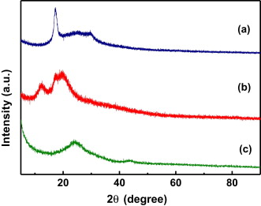  
Fig. 1. X-ray diffraction pattern for (a) PAN, (b) PAN/[BMIM][TFSI] and (c) HEG.

In the present study, XRD pattern of PAN/[BMIM][TFSI] electrolyte reveals peak with FWHM (full width half maximum) of 2.375°, corresponding to the crystallite size of 3.4 nm which is an integral multiple of the size of imidazolium ring (∼0.7 nm). In addition, it can be inferred that the ordering extends up to 5 layers as a consequence of the interaction of electrolyte ions with partially charged carbon and nitrogen atoms of semicrystalline PAN matrix [21]. As a result, alkyl chain of cation physically interacts parallel with the surface of PAN and the imidazolium rings are slightly tilted to the surface [32]. In the XRD pattern of HEG (Fig. 1c), the (002) diffraction peak of graphitic structure is quite broad which clearly displays that the graphene layers are highly disordered and has no trace of restacking as a consequence of the wrinkled nature of graphene.  
在本研究中，PAN/[BMIM][TFSI]电解质的XRD图谱显示峰峰，FWHM（半峰全宽）为2.375°，对应于3.4 nm的微晶尺寸，是咪唑环尺寸的整数倍（〜0.7 nm）。另外，可以推断出，由于电解质离子与半结晶PAN基质中部分带电的碳原子和氮原子的相互作用，该顺序扩展到了5层[21]。结果，阳离子的烷基链在物理上与PAN的表面平行地相互作用，并且咪唑鎓环稍微向表面倾斜[32]。在HEG的XRD图谱中（图1c），石墨结构的（002）衍射峰相当宽，这清楚地表明，石墨烯层高度无序，并且没有石墨烯起皱性质的重堆积痕迹。

#### 3.2. Morphological analysis
The cross sectional view of SEM image of PAN (Fig. 2a) displays no pores on the surface. The tactic molecular array gives mechanical strength and flexibility to the film. Fig. 2b is the top view of PAN/[BMIM][TFSI] which shows the porous nature of electrolyte. As reported by Snedden et al., the incorporation of IL makes the polymer matrix porous. The high power homogenization of acrylonitrile in DMF + IL medium, results in homogeneous solution. The subsequent casting may evaporate DMF and leave tiny IL droplets inside polymer matrix. The removal of embedded IL droplets develops voids inside the polymer matrix. Thus IL plays a role as porogens [33]. The increase in IL concentration increases the porosity and decreases the mechanical stability. Membrane shows no mechanical stability with PAN to IL ratios above 1:5. The cross sectional view of roughly tore PAN/[BMIM][TFSI] (Fig. 2c) shows the porous nature of the film. Here IL phase makes solid-like short range ordering followed by liquid phase which suggests that this PCE can have high ionic conductivities.  
PAN的SEM图像的横截面图（图2a）在表面上没有孔。战术分子阵列为薄膜提供了机械强度和柔韧性。图2b是PAN/[BMIM][TFSI]的俯视图，其示出了电解质的多孔性。如Snedden等人所报道，IL的掺入使聚合物基质多孔。丙烯腈在DMF + IL介质中的高功率均质化导致溶液均匀。随后的浇铸可能会使DMF蒸发，并在聚合物基质中留下微小的IL液滴。去除嵌入的IL液滴会在聚合物基质内部形成空隙。因此，IL起着致孔剂的作用[33]。 IL浓度的增加会增加孔隙率并降低机械稳定性。当PAN与IL的比例超过1：5时，膜没有机械稳定性。大致撕裂的PAN/[BMIM][TFSI]的横截面图（图2c）显示了膜的多孔性。在这里，IL相呈固体状的短程有序与液相相接，这表明该PCE可以具有高离子电导率。

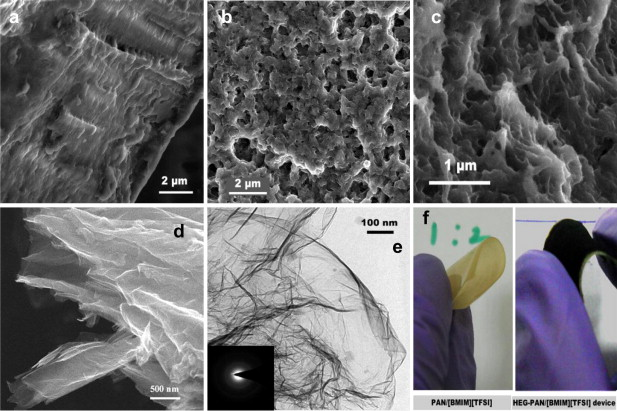  
Fig. 2. FESEM (field emission scanning electron microscopy) image (a) PAN, (b) PAN/[BMIM][TFSI] top and (c) cross sectional view and (d) FESEM, (e) HRTEM images, (inset in e) SAED pattern of HEG and (f) digital images of electrolyte and the fabricated device.  
图2. FESEM（场发射扫描电子显微镜）图像（a）PAN，（b）PAN/[BMIM][TFSI]顶部和（c）横截面图，以及（d）FESEM，（e）HRTEM图像，（ e）HEG的SAED模式和（f）电解质的数字图像以及所制造的装置的插图。

SEM (Fig. 2d) and TEM (Fig. 2e) images of HEG reveal the disorder induced in graphite structure resulting in the form of sheets by exfoliation. The rapid removal of intercalated oxygen containing functional groups and other functional groups during exfoliation results in a wrinkled structure of graphene sheets [25]. The TEM image shows the presence of wrinkles in the planar few layer graphene sheets. The inset in Fig. 2e shows the SAED (selected area electron diffraction) pattern of the HEG taken at the pointed position of the HRTEM (high resolution transmission electron microscopy) image. SAED pattern displays the short range order of graphene layers which suggests the disordered morphology of graphene with few wrinkled layers. Fig. 2f is the digital images of PAN/[BMIM][TFSI] and fabricated HEG – PAN/[BMIM][TFSI] supercapacitor device which shows the flexibility of the electrolyte and device.  
HEG的SEM（图2d）和TEM（图2e）图像揭示了石墨结构中引起的无序现象，该现象导致了片状剥落。在剥落过程中，快速去除嵌入的含氧官能团和其他官能团会导致石墨烯片的皱纹结构[25]。的TEM图像示出了皱纹的在平面少数层石墨烯片的存在。图2e中的插图显示了在HRTEM（高分辨率透射电子显微镜）图像的指向位置拍摄的HEG的SAED（选择区域电子衍射）图。 SAED图案显示石墨烯层的短程顺序，这表明石墨烯的形态无序，皱纹层很少。图2f是PAN/[BMIM][TFSI]和制造的HEG – PAN/[BMIM][TFSI]超级电容器器件的数字图像，显示了电解质和器件的柔性。

#### 3.3. FTIR spectrum of PAN/[BMIM][TFSI] electrolyte
The vibrational characteristics of PAN, [BMIM][TFSI] and PAN/[BMIM][TFSI] have been determined by Fourier Transform Infrared (FTIR) spectrum analysis and displayed in Fig. 3. FTIR spectrum of PAN (Fig. 3a) shows a strong peak at 2243 cm−1 which can be assigned to the stretching vibrations of –CN moieties from polymer chain. The presence of water molecules in the polymer matrix results in CN–OH interaction. This can be identified from the presence of stretching vibrations of –OH functionalities at ∼3500 cm−1. The region 1600–500 cm−1 contains peaks due to bending and stretching vibrations of single bonds in the PAN back bone interactions which are difficult to assign a specific peak to a specific group [34].  
PAN，[BMIM] [TFSI]和PAN /[BMIM] [TFSI]的振动特性已通过傅立叶变换红外（FTIR）光谱分析确定，并显示在图3中。PAN的FTIR光谱（图3a）显示在2243 cm-1处有一个很强的峰，可以归因于聚合物链中–CN部分的拉伸振动。聚合物基质中水分子的存在导致CN-OH相互作用。这可以通过在–3500 cm-1处–OH功能团的拉伸振动的存在来确定。区域1600–500 cm-1中包含峰，这是由于PAN背骨相互作用中单键的弯曲和拉伸振动所致，很难将特定的峰分配给特定的组[34]。

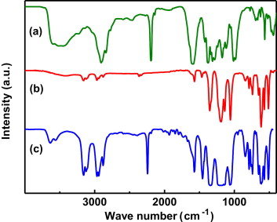  
Fig. 3. FTIR spectrum of (a) PAN, (b) [BMIM][TFSI] and (c) PAN/[BMIM][TFSI].

The FTIR spectrum of [BMIM][TFSI] (dried in dynamic vacuum at 60 °C for 6 h) shows no significant peak corresponding to –OH stretching as a consequence of hydrophobic nature. This can be attributed to the low self diffusion coefficient (in the order of 10−11 m2/s) of water molecule [35]. The presence of –CH2– (2944, 2872 cm−1), C-aromatic carbon (3085, 3148, 1572 cm−1), C–CH3 (2969, 1460 cm−1) and the side chain –CH2–CH2–CH2– (741 cm−1) groups are identified by the FTIR spectrum. The strong peak appears at 1353 cm−1 belongs to sulfonamide group of anion [34].  
[BMIM] [TFSI]的FTIR光谱（在动态真空中于60°C干燥6小时）由于疏水性而未显示对应于-OH伸展的明显峰。这可以归因于水分子的低自扩散系数（约10-11 m2 /s）[35]。 –CH2–（2944，2872 cm-1），C-芳族碳（3085、3148、1572 cm-1），C–CH3（2969、1460 cm-1）和侧链–CH2-CH2-CH2–（741 cm-1）组通过FTIR光谱识别。强峰出现在1353 cm-1处，属于阴离子的磺酰胺基[34]。

The vibrational signals of both PAN and [BMIM][TFSI] are identified in FTIR spectrum of PAN/[BMIM][TFSI] (Fig. 3c). The position of stretching vibrations of –CN is unchanged as reported for PAN/sapphire, PAN/water and PAN/heptanes systems [36]. This indicates that there is no chemical interaction between acrylonitrile monomer units with IL and they have only coulombic interaction. As a consequence of hydrophobic nature of [BMIM][TFSI] and the formation of IL layer on the surface of PAN, no significant –OH stretching vibrations are observed in PAN/[BMIM][TFSI].  
在PAN /[BMIM] [TFSI]的FTIR光谱中可以识别PAN和[BMIM] [TFSI]的振动信号（图3c）。如PAN /蓝宝石，PAN /水和PAN /庚烷体系报道的那样，–CN的拉伸振动位置不变[36]。这表明丙烯腈单体单元与IL之间没有化学相互作用，并且它们仅具有库仑相互作用。由于[BMIM] [TFSI]具有疏水性，并且在PAN表面形成IL层，因此在PAN /[BMIM] [TFSI]中未观察到明显的–OH拉伸振动。

#### 3.4. Raman spectrum of PAN/[BMIM][TFSI] electrolyte
The Raman spectrum of PAN (Fig. 4a) shows that the resonant frequencies are in close agreement with that of FTIR spectrum in the entire range of spectrum as observed by Huang and Koenig [26]. The position of stretching vibrations of –CN remains same as that observed in FTIR spectrum. This resonance frequency at 2237 cm−1 falls under [p,σ] type of mode which means that both Raman and IR mode are active. Here “p” indicates the peak arises from polarized Raman mode while “σ” indicates the IR signal falls under perpendicular dichroism. The other [p,σ] type of modes are appearing at 1109, 2914 and 2951 cm−1. The depolarized Raman lines, analogues to perpendicular dichroism IR lines [d,σ], are observed at 1319 and 1455 cm−1 which is in good agreement with literature. The depolarized line with parallel dichroism is found at 1357 cm−1. In conclusion, the Raman spectra, combined with FTIR spectra, suggest that the structural orientation in polymer chain is planar syndiotactic along with finite amount of isotactic model [26]. This tacticity is the reason for the semicrystalline nature of PAN.  
PAN的拉曼光谱（图4a）表明，在整个光谱范围内，谐振频率与FTIR光谱的共振频率非常一致，如Huang和Koenig所观察到的[26]。 –CN的拉伸振动的位置与FTIR光谱中观察到的相同。该共振频率在2237 cm-1处处于[p，σ]模式下，这意味着拉曼和IR模式均处于活动状态。在此，“ p”表示由偏振拉曼模式产生的峰值，而“σ”表示IR信号处于垂直二向色性下。其他[p，σ]类型的模式出现在1109、2914和2951 cm-1处。与垂直二向色性IR线类似的去极化拉曼线[d，σ]在1319和1455 cm-1处观察到，与文献一致。在1357 cm-1处发现具有平行二向色性的去极化线。总之，拉曼光谱与FTIR光谱相结合，表明聚合物链中的结构取向是平面间同立构的，以及有限数量的等规立构模型[26]。这种立构规整性是PAN具有半结晶性的原因。

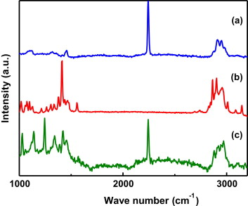  
Fig. 4. Raman spectrum of (a) PAN, (b) [BMIM][TFSI] and (c) PAN/[BMIM][TFSI].

Fig. 4b, Raman spectra of [BMIM][TFSI], shows the characteristic vibrational modes in CH stretching region (2800–3000 cm−1), where 2958 cm−1 is assigned to the CH stretching vibrations of butyl chain of [BMIM] cation. The strong Raman band observed at 1431 cm−1, is assigned to imidazolium ring in-plane anti-symmetric stretching. The vibrational modes of [TFSI] anion come from the major contribution of CF3 symmetric stretching (1260 cm−1) along with other Raman active vibrational modes [37].  
图4b [BMIM] [TFSI]的拉曼光谱显示了CH拉伸区域（2800–3000 cm-1）的特征振动模式，其中2958 cm-1被分配给[BMIM]丁基链的CH拉伸振动]阳离子。在1431 cm-1处观察到的强拉曼谱带归属于咪唑环平面内反对称拉伸。 [TFSI]阴离子的振动模式来自CF3对称拉伸（1260 cm-1）以及其他拉曼主动振动模式的主要贡献[37]。

Raman spectrum of PAN/[BMIM][TFSI] shows the finger prints of both PAN and [BMIM][TFSI]. In both IR and Raman spectra, the resonant frequencies of PAN are not shifted which means that the tacticity is not disturbed due to the incorporation of ionic liquid. Here IL is accommodated only at the pores covered by tactic polymer wall. This can be further confirmed by XRD data which indicates that PAN retains semicrystalline nature, even after the incorporation of ionic liquid.  
PAN /[BMIM] [TFSI]的拉曼光谱显示PAN和[BMIM] [TFSI]的指纹。在红外光谱和拉曼光谱中，PAN的共振频率均不会偏移，这意味着不会由于引入离子液体而影响立构规整度。在这里，IL仅容纳在由策略聚合物壁覆盖的孔中。这可以通过XRD数据进一步证实，该数据表明PAN甚至在掺入离子液体后仍保持半结晶性质。

#### 3.5. Thermal stability analysis
Extraordinary thermal stability of PAN promotes it for applications like gas separation at high temperatures. The thermal stability of PAN/[BMIM][TFSI] electrolyte is determined from thermogravimetric analysis with 10 °C/min heating rate at air atmosphere which is shown in Fig. 5. The initial weight loss of 3% may be attributed to the presence of residual solvent (DMF) trapped inside the pores. The major weight loss of 69.3% occurs at 463 °C. This is in contrast with the thermal stability of PAN where the major decomposition occurs at ∼300 °C [38]. The improved thermal stability of PAN may be attributed to the incorporation of [BMIM][TFSI]. The remaining 27.7% of material may be the residual carbon resulted by decomposition of PAN.  
PAN的非凡热稳定性促进了其在高温气体分离等应用中的应用。 PAN /[BMIM] [TFSI]电解质的热稳定性是通过热重分析确定的，在空气中加热速率为10°C /min，如图5所示。3％的初始重量损失可能是由于存在残留在孔中的残留溶剂（DMF）。 66.3％的主要重量损失发生在463°C。这与PAN的热稳定性相反，后者的主要分解发生在约300°C [38]。 PAN的改善的热稳定性可能归因于[BMIM] [TFSI]的引入。剩余的27.7％的材料可能是PAN分解产生的残留碳。

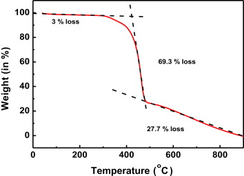  
Fig. 5. Thermogravimetric analysis of PAN/[BMIM][TFSI] at 10 °C/min scan rate.

#### 3.6. Electrochemical analysis
The electrochemical analyses have been carried out using a more practical two electrode supercapacitor setup at ambient conditions. The ionic conductivity of PCE is determined by AC impedance analysis where copper foil has been used as current collectors. Fig. 6 clearly indicates that the incorporation of IL drastically increases the ionic conductivity. PAN has the ionic conductivity in the order of 10−10 S/cm while that of PAN/[BMIM][TFSI] (1:4) reaches 2.42 mS/cm at 28 °C with remarkable mechanical stability. Since IL plays a role as porogen, the increase in concentration of ionic liquid increases the porosity which connects the pores and makes ion transport channels. Thus the increase in IL concentration increases the ionic conductivity. We have studied different compositions up to 1:6 ratios of PAN to IL. The composition above 1:4 causes leakage and shows no significant improvement in ionic conductivity. This means that porous PAN matrix is capable to hold 400% of ionic liquid without leakage. Membranes are not free-standing and results in a wax like material with ratios above 1:5.  
电化学分析是在环境条件下使用更实用的两电极超级电容器进行的。PCE的离子电导率通过交流阻抗分析确定，其中铜箔已被用作集电器。图6清楚地表明，IL的引入极大地增加了离子电导率。 PAN的离子电导率约为10-10 S /cm，而PAN /[BMIM] [TFSI]（1：4）的离子电导率在28°C时达到2.42 mS /cm，具有出色的机械稳定性。由于IL起到致孔剂的作用，所以离子液体浓度的增加会增加连接孔隙并形成离子传输通道的孔隙率。因此，IL浓度的增加增加了离子电导率。我们研究了高达1：6的PAN与IL的不同组成。高于1：4的组合物引起泄漏，并且离子电导率没有显着改善。这意味着多孔PAN基质能够容纳400％的离子液体而不会泄漏。膜不是独立的，会导致蜡状材料的比例超过1：5。

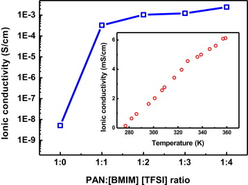  
Fig. 6. Ionic conductivity as a function of composition. Inset: Variation of ionic conductivity with temperature.

The inset in Fig. 6 shows the variation of ionic conductivity with temperature of PAN/[BMIM][TFSI] (1:2) electrolyte which suggests the temperature assisted improvement in ionic transport. The fast improvement in ionic conductivity at low temperatures may be attributed to the presence of solid-like layers of IL on the surface of PAN matrix. Briefly, at low temperatures (<328 K), the applied heat energy may be used to dissolve immobilized IL layer (i.e. to release the ions from ionic interaction barrier of CN moieties) and for thermally assisted ionic transport. At high temperatures the conductivity improvement is only due to the thermally assisted ionic transport which results in relatively slow improvement. It may look like the solidified phase decreases the ion transport. However the ionic conductivity in the studied range is in the same order which shows that they fairly prevent the leakage of electrolyte without sacrificing their ionic conductivity. The high ionic conductivity, fast ion transport, high thermal stability and performance comparable to neat IL suggest that the electrolyte is suitable for SCs to employ along with energy storage devices in EVs. 
图6中的插图显示了离子电导率随PAN /[BMIM] [TFSI]（1：2）电解质温度的变化，这表明温度有助于改善离子迁移。低温下离子电导率的快速提高可能归因于PAN基质表面上IL的固体状层的存在。简而言之，在低温（＜328K）下，所施加的热能可用于溶解固定的IL层（即，从CN部分的离子相互作用屏障释放离子）和用于热辅助的离子传输。在高温下，电导率的改善仅归因于热辅助的离子传输，这导致相对较慢的改善。看起来凝固相降低了离子传输。然而，在所研究范围内的离子电导率处于相同的顺序，这表明它们在不牺牲其离子电导率的情况下公平地防止了电解质的泄漏。高离子电导率，快速离子传输，高热稳定性和可与纯IL媲美的性能表明，该电解质适合SC与电动汽车中的储能装置一起使用。

The potential window of the PAN/[BMIM][TFSI] was determined by cyclic voltammograms (CV) with graphene coated carbon paper electrodes. Initially 100 cycles were scanned, at 100 mV/s scan rate, to stabilize the performance of capacitor. Fig. 7 shows CV of the capacitor with different operating potential at 10 mV/s scan rate, which clearly shows that the device is capable of operating at least 3 V. However, it is less than the potential window of neat [BMIM][TFSI] (3.5 V). Above 3 V, the CV deviates from the rectangular shape and shows rapid increase in current. At this operating voltage the device performance falls very fast. We expect the irreversible electrochemical reaction of PAN may be the reason for decreased potential window.  
PAN /[BMIM] [TFSI]的电势窗口由石墨烯涂层碳纸电极的循环伏安图（CV）确定。最初以100 mV /s的扫描速率扫描了100个周期，以稳定电容器的性能。图7显示了在10 mV /s扫描速率下具有不同工作电势的电容器的CV，清楚地表明该器件能够工作至少3V。但是，它小于纯净的[BMIM] [ TFSI]（3.5 V）。高于3 V时，CV偏离矩形并显示出电流的快速增加。在此工作电压下，设备性能会很快下降。我们预计PAN的不可逆电化学反应可能是电位窗降低的原因。

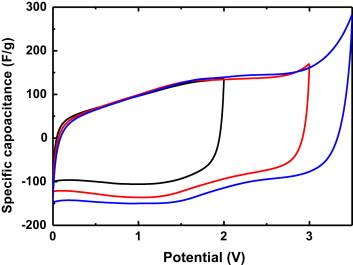  
Fig. 7. Cyclic voltammograms of HEG – PAN/[BMIM][TFSI] supercapacitor for different operating potential at 10 mV/s scan rate.  

Fig. 8 is the CV of HEG based supercapacitor with PAN/[BMIM][TFSI] electrolyte at different scan rates. The near-ideal shape with fast transient response at both ends of CV at low scan rates indicates the fast charge transport kinetic behaviour of PAN/[BMIM][TFSI] electrolyte. This may be attributed to the unique porous structure of polymer matrix which provides ion transport path. At high scan rates, CV deviates from the ideal shape which may be attributed to the mobility of the massive electrolyte ions. However, the specific capacitance is not changed much with respect to scan rate. This clearly indicates the rate capability of the device.  
图8是在不同扫描速率下具有PAN /[BMIM] [TFSI]电解质的HEG基超级电容器的CV。在低扫描速率下，CV两端具有快速瞬态响应的近乎理想的形状表明PAN /[BMIM] [TFSI]电解质具有快速电荷传输动力学行为。这可能归因于聚合物基质独特的多孔结构，该结构提供了离子传输路径。在高扫描速率下，CV偏离理想形状，这可能归因于大量电解质离子的迁移率。但是，比电容相对于扫描速率变化不大。这清楚地表明了设备的速率能力。

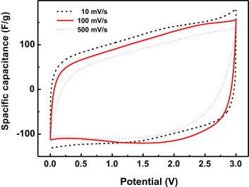  
Fig. 8. Cyclic voltammograms of HEG – PAN/[BMIM][TFSI] supercapacitor at different scan rate.  

Specific capacitance (Cs) was measured using the equation- $C_s = \frac{2 I}{m \frac{dV}{dt}}$

where, I is the average current, dV/dt is the potential sweep rate and m is the mass of active electrode material at each electrode. A factor of two is incorporated due to the series capacitance formed in two electrode system [12]. The specific capacitance of the device, calculated from CV, is 126.5, 114.7 and 98.8 F/g at 10, 100 and 500 mV/s scan rate, respectively.  
其中，I是平均电流，dV /dt是电势扫描速率，m是每个电极上活性电极材料的质量。由于在两个电极系统中形成的串联电容[12]，所以合并了两倍的因数。由CV计算得出的器件比电容在10、100和500 mV /s的扫描速率下分别为126.5、114.7和98.8 F /g。

The charge–discharge behaviour of PAN/[BMIM][TFSI] is shown in Fig. 9. Specific capacitance (Cs) of the device is measured using Equation (1), where, I is the specific current and dV/dt is the slop of the straight line fit of discharge curves from Vmax to Vmax/2 [12]. The intercept of linear fit with potential axis gives the potential drop (Vdrop) due to RESR. Here RESR (=Vdrop/I) is composed of an ionic and an electronic part. The ionic contribution comes from the mobility of the massive electrolyte ions and electrode–electrolyte interface resistance, while the electronic contribution comes from the ohmic resistance in the current collector and electrode. The performance of the supercapacitor with charge–discharge cycles is reported at different current at the coulombic efficiency greater than 96%. The device shows specific capacitance of 98 and 108 F/g at 10 and 2 A/g, respectively, which is closely comparable to that of [BMIM][TFSI] modified HEG electrode based supercapacitor with neat [BMIM][TFSI] (124 F/g at 2 A/g) [31].  
PAN /[BMIM] [TFSI]的充放电行为如图9所示。使用公式（1）测量器件的比电容（Cs），其中，I是比电流，dV /dt是放电曲线的直线拟合斜率从Vmax到Vmax /2 [12]。电位轴的线性拟合的截距给出了由于RESR引起的电位降（Vdrop）。在此，RESR（= Vdrop /I）由离子部分和电子部分组成。离子的贡献来自于大量电解质离子的迁移率以及电极与电解质的界面电阻，而电子的贡献来自于集电器和电极中的欧姆电阻。据报道，在不同电流下，库仑效率大于96％时，超级电容器具有充放电循环的性能。该器件在10 A和2 A /g时分别显示出98和108 F /g的比电容，这与基于HEG电极的纯[BMIM][TFSI]电解质超级电容的电容（124 F /g 2 A /g）相近[31]。

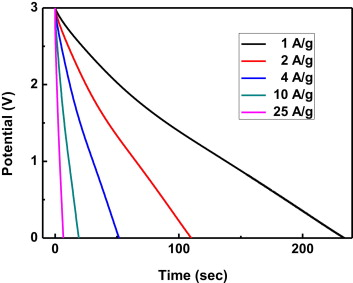  
Fig. 9. Discharge behaviour of HEG – PAN/[BMIM][TFSI] supercapacitor with various specific currents.  

The specific capacitance of the device decreases as a function of specific current or scan rate (Fig. 10) as a consequence of mobility of massive electrolyte ions. The increase in current results in the decrease in capacitance due to the rapid motion of massive ions which results in poor accommodation of ions inside the pores of graphene. At high currents, the ions get insufficient time to diffuse into the pores of graphene which results in a simple polarization followed by the accumulation of charges at the surface of the electrode. However, the fall in Cs is not too rapid. This may be attributed to the highly porous nature of the surface of electrolyte with well connected pores which facilitates the electrolyte ions to find a shortest directional path. The presence of solid-like layers of IL may screen the ionic interaction of ions with CN moieties and make them free to move. This may assist the fast ion transport.  
由于大量电解质离子的迁移率，该器件的比电容根据特定电流或扫描速率而降低（图10）。由于大量离子的快速运动，电流的增加导致电容的减小，这导致离子在石墨烯的孔内的不良容纳。在高电流下，离子没有足够的时间扩散到石墨烯的孔中，导致简单的极化，随后在电极表面积累电荷。但是，Cs的下降并不是太快。这可能归因于具有良好连接的孔的电解质表面的高度多孔性质，其有助于电解质离子找到最短的定向路径。 IL的固体层的存在可以屏蔽离子与CN部分的离子相互作用，并使它们自由移动。这可以帮助快速的离子传输。

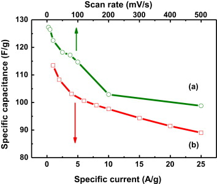  
Fig. 10. Specific capacitance of HEG – PAN/[BMIM][TFSI] supercapacitor as a function of (a) scan rate and (b) specific current.

The cyclic stability of supercapacitor in charge–discharge cycles has been determined with a new cell. Fig. 11 shows ∼92% of its initial performance even after 1000 cycles at 10 A/g. The capacitance falls ∼8% in the initial 200 cycles followed by a stabilized performance.  
新型电容器已经确定了超级电容器在充放电循环中的循环稳定性。图11显示了即使在10 A /g的强度下经过1000次循环后，其初始性能的〜92％。在最初的200个循环中，电容下降约8％，随后性能稳定。

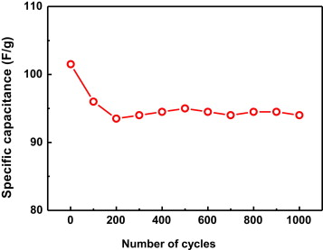  
Fig. 11. Cyclic stability of HEG – PAN/[BMIM][TFSI] supercapacitor at specific current of 10 A/g.

Nyquist plot of supercapacitor, at 500 mV sinusoidal measuring potential, is given in Fig. 12. The impedance is nearly unchanged with frequency which indicates the capacitive behaviour of the device. The inset in Fig. 12 displays that the equivalent series resistance (RESR) is 4.4 Ω and the solution resistance is 2.4 Ω. The low polarization resistance (2 Ω) is a strong evidence of compatibility at the electrode–electrolyte interface. Here, both electrode and electrolyte surfaces are porous which gives a compatible interface to transfer ions. The solution resistance is quit high when compared to aqueous electrolytes as a consequence of mobility of massive ions. After the end of semicircle, the capacitive impedance line slightly deviates towards transmission line. This can be attributed to the frequency response of porous electrode (i.e., graphene) which produces series RC elements [12].  
在图12中给出了在500 mV正弦测量电势下超级电容器的奈奎斯特图。阻抗随频率几乎不变，这表明了器件的电容特性。图12中的插图显示等效串联电阻（RESR）为4.4Ω，溶液电阻为2.4Ω。低极化电阻（2Ω）是电极-电解质界面相容性的有力证据。在此，电极和电解质表面都是多孔的，从而提供了相容的界面来转移离子。与大量电解质相比，与水性电解质相比，溶液电阻高得多。半圆结束后，电容性阻抗线向传输线略微偏离。这可以归因于产生串联RC元件的多孔电极（即石墨烯）的频率响应[12]。

  
Fig. 12. Nyquist plot of HEG – PAN/[BMIM][TFSI] supercapacitor. Inset: Magnified high frequency region (Amplitude: 500 mV, Range: 1 mHz–0.1 MHz).  

The Ragone plot (Fig. 13) of the supercapacitor relates the energy density and power density. The energy density (E) and power density (P) have been calculated using (2), (3).  
超级电容器的Ragone图（图13）与能量密度和功率密度有关。能量密度（E）和功率密度（P）已使用（2），（3）计算。
$E = \frac{1}{2} C_{cell} V^2$  (2)  
$P = \frac{E}{\delta t}$  (3)  

where, Ccell is the specific capacitance of the total cell, V is the cell potential and Δt is the discharge time for the corresponding potential drop [12].  
其中，Ccell是整个电池的比电容，V是电池电势，Δt是相应电势下降的放电时间[12]。

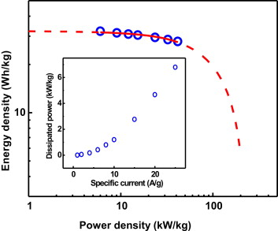  
Fig. 13. Ragone plot of HEG – PAN/[BMIM][TFSI] supercapacitor. Inset: Power dissipated in equivalent series resistance RESR (PESR) as a function of specific current.

Fig. 13 shows the energy density and power density of 30.51 Wh/kg and 15.34 kW/kg, respectively, at the specific current of 10 A/g corresponding to the Cs of 98 F/g, in terms of mass of total electrode material. The Ragone plot drops faster with power due to the fast voltage decay during discharge at high power. The maximum energy storage capacity (Emax) and the maximum available power (Pmax) in the supercapacitor have been extracted by fitting the Ragone equation to the experimental data. The Ragone equation is represented as,  
图13显示了以总电极材料的质量计，在10 A /g的比电流（对应于98 F /g的Cs）下，能量密度和功率密度分别为30.51 Wh /kg和15.34 kW /kg。 。由于在高功率放电期间电压快速衰减，因此Ragone图随功率的下降更快。通过将Ragone方程拟合到实验数据中，可以提取出超级电容器中的最大能量存储容量（Emax）和最大可用功率（Pmax）。 Ragone方程表示为

$E_L = \frac{E_{max}}{2} (1 + \sqrt{1 - \frac{P_L}{P_{max}}})$  (4)

where, EL, PL, Emax and Pmax are available energy, power to the external load, maximum energy storage capacity and maximum available power respectively [39]. The fitting parameters of interpolated Ragone plot reveal the values of Emax and Pmax and are found to be 32.3 Wh/kg and 82 kW/kg, respectively. This is much high power density compared to fuel cells and meets the power requirements of EVs [9], [40], [41].  
其中，EL，PL，Emax和Pmax分别是可用能量，外部负载的功率，最大能量存储容量和最大可用功率[39]。内插Ragone图的拟合参数显示了Emax和Pmax的值，分别为32.3 Wh /kg和82 kW /kg。与燃料电池相比，这具有很高的功率密度，并且可以满足电动汽车的功率要求[9]，[40]，[41]。

The Emax and Pmax can be related by

$\tau_o = \frac{E_{max}}{2 P_{max}}$  (5)

where, τo is the time constant, the time necessary to discharge the capacitor to 36.8% of its initial voltage in a short [39]. Here τo has been evaluated from (5) and found to be 709 ms. The lower time constant indicates the fast charge-discharge functioning of the supercapacitor. The power dissipated in the RESR (PESR = I2RESR) of the device as a function of specific current is displayed in the inset in Fig. 13. At low specific currents, PESR raises slowly while at high current, it increases fast. This can be attributed to the inertia of massive ions of electrolyte.  
其中，τo是时间常数，是电容器在短时间内放电至其初始电压的36.8％所需的时间[39]。此处，τo已根据（5）进行了评估，发现为709 ms。较低的时间常数表示超级电容器的快速充放电功能。在图13的插图中显示了器件的RESR耗散的功率（PESR = I2RESR）与特定电流的关系。在低特定电流下，PESR缓慢上升，而在高电流下，PESR迅速增加。这可以归因于大量电解质离子的惯性。

#### 3.6.1. Comparison with literature
So far, several research outputs have come on gel polymer electrolyte based flexible all-solid-state supercapacitors. Our experimental results are compared with the literature values and presented in Table 1. The comparison clearly shows that the SC with HEG electrode and PAN/[BMIM][TFSI] electrolyte out performs all other similar kinds of devices.  
迄今为止，基于凝胶聚合物电解质的柔性全固态超级电容器已有数项研究成果。我们的实验结果与文献值进行了比较，并在表1中进行了比较。比较清楚地表明，带有HEG电极和PAN /[BMIM] [TFSI]电解质的SC可以完成所有其他类似的设备。

Table 1. Comparison of performance of SC with HEG electrode and PAN/[BMIM][TFSI] electrolyte with literature.   
表1.文献中具有HEG电极的SC和PAN /[BMIM] [TFSI]电解质的性能比较。 
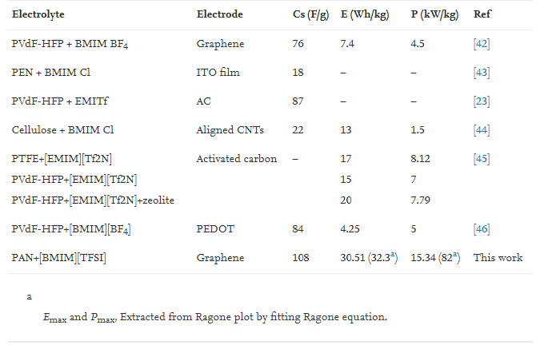  
The performance of the device can be highlighted as,  
- a.PAN/[BMIM][TFSI] electrolyte and the SC are flexible in nature. This enables us to roll it into cylindrical form for integrated power sources (IPSs). PAN /[BMIM] [TFSI]电解质和SC本质上具有柔韧性。这使我们能够将其卷成圆柱形，以用于集成电源（IPS）。
- b.The high mechanical strength of PAN opens a way to make smart SCs which can be made as a part of the body of a vehicle. PAN的高机械强度开辟了一种制造智能SC的方法，该SC可作为车辆车身的一部分制造。
- c.The fabricated SC shows the power as high as 82 kW/kg, which is capable to offer power for most of the EVs with optimum device size. 制成的SC显示出高达82 kW /kg的功率，能够以最佳的设备尺寸为大多数EV提供功率。
- d.The low time constant (709 ms) suggests fast response which is an essential property of SCs to accelerate the EVs. 低时间常数（709毫秒）表明响应速度快，这是SC加速EV的基本特性。
- e.As voltage of IPS is constant, high current must be drawn to accelerate the EVs. The device retains ∼90% of its specific capacitance (98 F/g) even after 10 fold increase in current (10 A/g). This is sufficient amount of current to operate the motors in EVs. 由于IPS的电压恒定，因此必须汲取大电流以加速EV。即使在电流（10 A /g）增加10倍之后，该器件仍可保留约90％的比电容（98 F /g）。这足以使电动汽车中的电动机运行。
- f.The high mobile phase storage capacity of porous PAN film accounts the electrolyte leakage problem. 多孔PAN膜的高流动相储存能力解决了电解质泄漏的问题。
- g.High thermal stability of PAN makes the SC suitable for high temperature operations combined with batteries. PAN的高热稳定性使SC适合与电池结合使用的高温操作。

Based on our experiments and the literature, PAN/[BMIM][TFSI] is a unique electrolyte for graphene based supercapacitors, which meets most of the requirements of EVs.  
根据我们的实验和文献，PAN /[BMIM] [TFSI]是用于石墨烯基超级电容器的独特电解质，可以满足大多数电动汽车的要求。

### 4. Conclusion
- Ionic liquid incorporated polymer electrolyte (PAN/[BMIM][TFSI]) has been synthesized, which shows ionic conductivity of 2.42 mS/cm (at 28 °C) along with good mechanical strength and thermal stability. The electrolyte has well connected porous network where solid-like short range ordered ionic liquid is accommodated inside the pores.  已经合成了掺入离子液体的聚合物电解质（PAN /[BMIM] [TFSI]），其离子电导率为2.42 mS /cm（在28°C下），并具有良好的机械强度和热稳定性。电解质具有良好连接的多孔网络，其中在孔内部容纳了固态的短程有序离子液体。
- An all-solid-state SC with HEG electrode and PAN/[BMIM][TFSI] electrolyte has been fabricated and tested. The device exhibits the specific capacitance of 98 F/g at 10 A/g specific current with good cyclic stability. The maximum energy storage capacity and maximum available power are extracted from Ragone plot and found to be 32.3 Wh/kg and 82 kW/kg, respectively, which meet the requirements of EVs.  具有HEG电极和PAN /[BMIM] [TFSI]电解质的全固态SC已被制造和测试。该器件在10 A /g比电流下具有98 F /g的比电容，并具有良好的循环稳定性。从Ragone图中提取出最大储能容量和最大可用功率，分别为32.3 Wh /kg和82 kW /kg，这满足了电动汽车的要求。
- A low time constant (709 ms) has been obtained which ensures the quick response of the device while EV is accelerated. 获得了较低的时间常数（709 ms），可确保在EV加速时设备的快速响应。
- The overall analysis on PAN/[BMIM][TFSI] electrolyte suggests its application in all-solid-state high performance supercapacitors for practical EVs. 对PAN /[BMIM] [TFSI]电解质的整体分析表明，它在实际电动汽车的全固态高性能超级电容器中具有应用。