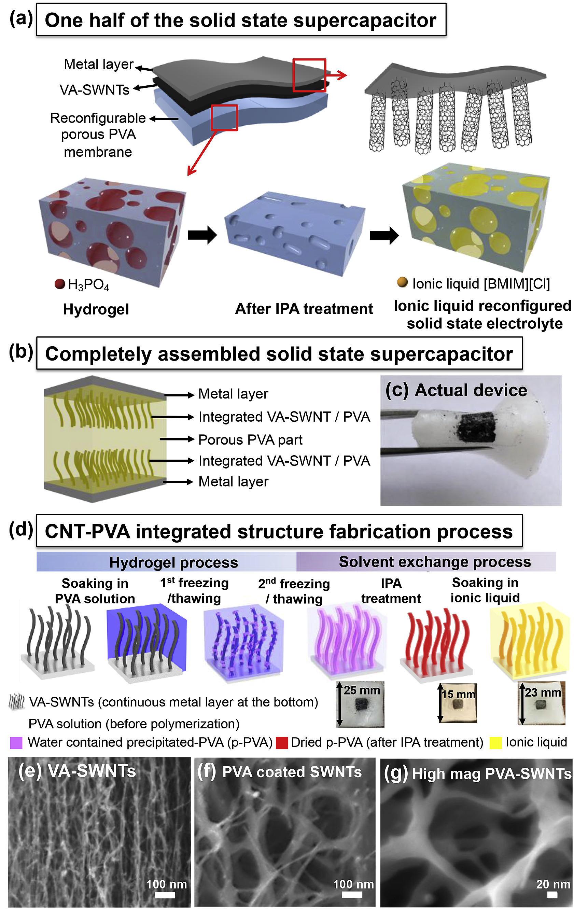
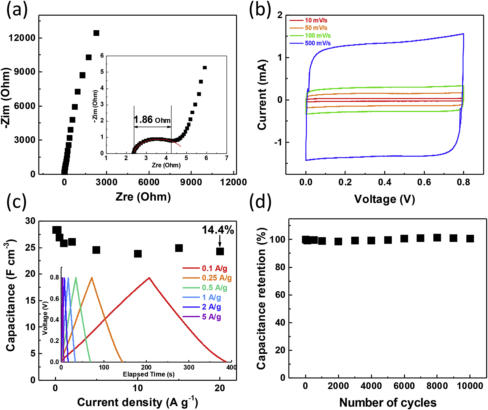
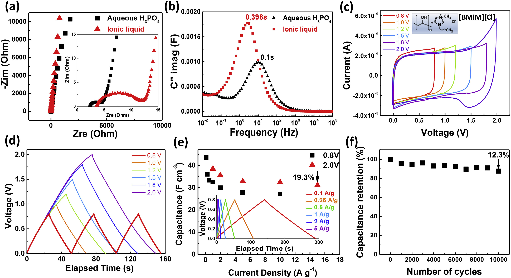
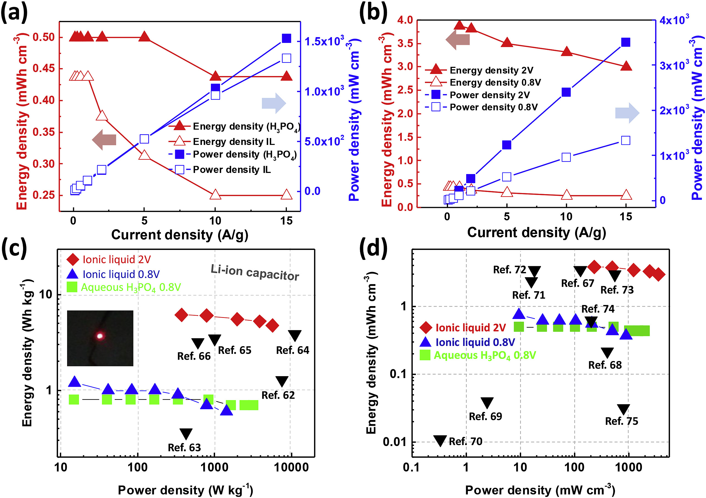

## 可重构固态电解质，用于高性能柔性超级电容器 Reconfigurable solid-state electrolytes for high performance flexible supercapacitor

> Sanghyun Hong, Hyehee Kim, Sen Gao, Rodrigo L. Lavall, Hyun Young, Jung, Yung Joon, Jung  
> Journal of Power Sources, Volume 432, 31 August 2019, Pages 16-23
> DOI: [10.1016/j.jpowsour.2019.05.065](https://doi.org/10.1016/j.jpowsour.2019.05.065)  
> Keywords: Flexible supercapacitor, Reconfigurable electrolyte, Nanoporous film, Carbon nanotubes

### Highlights
- Reconfigurable/solvent exchangeable electrolytes with highly controlled nanopores.
- Highly integrated structure that results in increase ion accessibility/mobility.
- Ionic liquid based solid-state supercapacitor exhibits stable operation at 2 V
- High power and energy density, and excellent long-term stability with 10 K cycles.

### Abstract
To realize high performance and a flexible supercapacitor, it is necessary to address the fundamental issues including low ionic conductivity of solid electrolytes and high interfacial resistance of electrode/electrolyte pairs. Here we present unique solid-state electrolytes by integrating highly engineered nano-porous polyvinyl alcohol (PVA) with super-flat vertically aligned single-walled carbon nanotubes (VA-SWNTs). Highly engineered PVA nano-porous films are fabricated by a generic freeze-thaw process followed by water-miscible solvent treatment in order to create highly controlled nano/microscale pores inside of PVA. Such highly porous PVA films act as both reconfigurable electrolyte template and separator where H3PO4 aqueous solution or ionic liquids can be selectively inserted for a variety of power requirements in flexible electronic applications. Our developed pore formation process is suitable for directly integrating high performance VA-SWNTs electrode as it allows the effective permeation of the polymer electrolyte into nanoscale inter-tube space enabling the easy access and faster transport of ions for higher power capability. This unique entity of reconfigurable electrolyte and nanostructured electrode demonstrates high power and energy densities and remarkable stability after 10,000 charge/discharge cycles.  
为了实现高性能和柔性超级电容器，必须解决的基本问题包括固体电解质的低离子电导率和电极/电解质对的高界面电阻。在这里，我们通过将高度工程化的纳米多孔聚乙烯醇（PVA）与超平垂直排列的单壁碳纳米管（VA-SWNTs）集成在一起，展示了独特的固态电解质。高度工程化的PVA纳米多孔膜是通过通用的冻融工艺，然后与水混溶的溶剂处理制成的，以在PVA内部创建高度可控的纳米/微米级孔隙。这种高度多孔的PVA薄膜既可作为可重构电解质模板，又可作为隔板，在其中可选择性插入H3PO4水溶液或离子液体，以满足柔性电子应用中的各种功率要求。我们开发的孔形成工艺适合直接集成高性能VA-SWNTs电极，因为它可以使聚合物电解质有效渗透到纳米级管间空间中，从而使离子易于进入和更快地传输，从而具有更高的功率能力。这种可重构电解质和纳米结构电极的独特实体展示了高功率和能量密度以及在10,000次充电/放电循环后的出色稳定性。

### 1. Introduction
Flexible supercapacitor devices have attracted great interests for various future electronic systems, including bendable displays, portable electronic papers, and wearable multimedia [1], [2], [3], [4], [5], [6], [7]. Particularly solid-state supercapacitors have several important advantages over their liquid electrolyte counterparts such as no concern for any electrolyte leakage, ease of handling, lightweight and small size, improved stability and flexible structural design [8], [9], [10], [11], [12], [13]. These flexible solid-state supercapacitor devices have been developed by sandwiching the flexible polymer-based electrolytes between two electrodes [1],[14], [15], [16], [17], [18], [19], [20], [21], [22], [23], [24], [25]]. Among various types of polymeric electrolytes, a hydrogel polymer electrolyte has been extensively used due to its composition of a polymer matrix and aqueous liquid electrolyte [15,[26], [27], [28]. PVA is one of the most widely used hydrogel polymer electrolytes, as it provides high porosity, high ionic conductivity, and great mechanical properties through the freeze-thawing process [[29], [30], [31], [32], [33], [34]]. However, hydrogel polymer electrolytes have limitations on increasing electrochemical window since it is made with an aqueous liquid electrolyte which contains a considerable amount of water, lowering energy density and reliability of supercapacitors [8,12]. Also hydrogel polymer electrolytes have a poor contact at the electrode/electrolyte interface, as polymer electrolytes cannot penetrate into electrodes’ pores. This often results in pore collapse and non-conformal electrode/electrolyte interfaces causing high contact resistance and poor electrochemical performance [35]. Especially considering the explosive interest of using highly porous nanocarbon materials and their architectures (ex: high-density VA-SWNTs or stacked graphene) towards high performance multifunctional electrodes, addressing this challenge is immense both from fundamentals and applied perspectives [1],[36], [37], [38], [39], [40], [41], [42], [43], [44], [45], [46], [47].  
柔性超级电容器设备对各种未来的电子系统引起了极大的兴趣，包括可弯曲的显示器，便携式电子纸和可穿戴的多媒体[[1]，[2]，[3]，[4]，[5]，[6]，[ 7]]。特别是固态超级电容器，与液态电解质相比，具有几个重要优势，例如无需担心任何电解质泄漏，易于处理，重量轻，体积小，稳定性提高和结构设计灵活的问题[[8]，[9]，[10] ，[11]，[12]，[13]]。这些挠性固态超级电容器器件是通过将挠性聚合物基电解质夹在两个电极[1，[14]，[15]，[16]，[17]，[18]，[19]，[20]之间而开发的]，[21]，[22]，[23]，[24]，[25]]。在各种类型的聚合物电解质中，水凝胶聚合物电解质由于其由聚合物基质和水性液体电解质组成[15]，[26]，[27]，[28]]而被广泛使用。 PVA是最广泛使用的水凝胶聚合物电解质之一，因为它在冻融过程中具有高孔隙率，高离子电导率和出色的机械性能[[29]，[30]，[31]，[32]，[33]，[34]。然而，由于水凝胶聚合物电解质是用含水的液体电解质制成的，因此增加了电化学窗口，该电解质含有大量的水，降低了能量密度和超级电容器的可靠性[8,12]。此外，水凝胶聚合物电解质在电极/电解质界面处的接触不良，因为聚合物电解质无法渗透到电极的孔中。这通常会导致孔塌陷和非共形的电极/电解质界面，从而导致较高的接触电阻和较差的电化学性能[35]。特别是考虑到使用高度多孔的纳米碳材料及其结构（例如：高密度VA-SWNTs或堆叠的石墨烯）对高性能多功能电极的爆炸性兴趣，从基本原理和应用角度来看，应对这一挑战都是巨大的[1]，[36]，[37]，[38]，[39]，[40]，[41]，[42]，[43]，[44]，[45]，[46]，[47]。

Here we present a generic approach to rationally design and build all-solid-state and reconfigurable supercapacitors by integrating PVA based solvent exchangeable membranes and super-flat VA-SWNTs. Highly porous VA-SWNTs films combined with PVA hydrogel was fabricated through the freeze-thawing method to configure the electrode/electrolyte integrated supercapacitor devices [48]. To obtain the completely dried VA-SWNTs/PVA membrane without a pore collapse, the 2-isopropyl alcohol (IPA) exchange process was conducted by performing a stepwise concentration increase of the IPA against water based the hydrogels. Such controllably designed porous PVA film acts like a sponge absorbing a large amount of desired liquid electrolytes (H3PO4 aqueous electrolyte or 1-butyl-3-methylimidazolium chloride (BMIMCl including 15% water)) for higher capacitance. Also, its nano/microscale pores contain liquid electrolytes effectively even under severe mechanical deformation. Our reconfigurable solid-state flexible capacitor devices show better electrochemical properties and excellent cycling stability due to the preserved high surface area of the electrode resulting from the effective permeation of the polymer electrolyte, and the improved electrode/electrolyte interface that enables excellent charge accessibility. The integrated reconfigurable electrode/electrolyte systems also allow the fabrication of very thin, lightweight, flexible all-solid-state, and high-performance supercapacitors for uses in the portable, wearable, flexible electronic and structural energy devices for utilization as part of a wing or fuselage of communications satellites, unmanned aerial vehicles, aircraft, submarines, and others.  
在这里，我们提出一种通用方法，通过集成基于PVA的溶剂可交换膜和超扁平VA-SWNT，合理设计和构建全固态和可重构超级电容器。通过冻融法制备了高度多孔的VA-SWNTs膜和PVA水凝胶，以配置电极/电解质集成超级电容器[48]。为了获得完全干燥的无孔塌陷的VA-SWNTs /PVA膜，通过逐步增加IPA相对于水基水凝胶的浓度来进行2-异丙醇（IPA）交换过程。这种可控设计的多孔PVA膜的作用就像海绵一样，可吸收大量所需的液体电解质（H3PO4水性电解质或1-丁基-3-甲基咪唑鎓氯化物（BMIMCl包含15％的水），以获得更高的电容。而且，即使在严重的机械变形下，其纳米/微米级孔也有效地包含液体电解质。我们的可重构固态柔性电容器器件具有更好的电化学性能和出色的循环稳定性，这归因于由于聚合物电解质的有效渗透而保留的高表面积电极，以及改进的电极/电解质界面，可实现出色的电荷可及性。集成的可重配置电极/电解质系统还允许制造非常薄，轻巧，柔性的全固态高性能超级电容器，用于便携式，可穿戴，柔性电子和结构能源设备，以用作机翼的一部分或通讯卫星，无人机，飞机，潜水艇等的机身。

### 2. Experimental
#### 2.1. Synthesis of VA-SWNTs electrode
VA-SWNTs were synthesized by thermal chemical vapor deposition (CVD) system. Anhydrous ethanol (Sigma-Aldrich, 99.95%) was for a carbon source, and 3–5 Å thick cobalt (Co) catalyst on 20–30 nm aged aluminum buffer layer was deposited on a silicon wafer which has 100 nm silicon oxide on top. Operation temperature was controlled to 850 °C in a gold-mirror furnace. We have obtained about 30 μm long VA-SWNTs with the mass of an average 0.3 mg in the area of 16 mm2 after 30 min CVD.  
VA-SWNTs是通过热化学气相沉积（CVD）系统合成的。无水乙醇（Sigma-Aldrich，99.95％）用于碳源，在顶部有100纳米的氧化硅的硅晶片上，沉积20–30 nm老化的铝缓冲层，再沉积3–5Å厚的钴（Co）催化剂。在金镜炉中将操作温度控制在850C。在30分钟的CVD后，我们获得了约30微米长的VA-SWNT，在16平方毫米面积中的平均质量为0.3毫克。

#### 2.2. Fabrication of porous solid electrolyte and integration of electrolyte/electrode
The PVA (Sigma-Aldrich, Mw 89,000-98,000) was dissolved into water under mechanical stirring at 150 °C using the glass jar (Uline). At the resultant solution, it was added 1.5 M H3PO4 (Sigma-Aldrich) solution and mechanically stirred at room temperature for 1 day. This completely dissolved PVA/H3PO4 solution can be crystallized by several times of the freezing/unfreezing process [48]. The pore size and porosity were analyzed by the Image J program using SEM images. The 5 different cross-sectional samples were fabricated, and 15–20 SEM images were taken from each sample. The image J program can select the pores and calculate the size and porosity overall the selected area (Fig. S2). The average pore size of the PVA film was 380 nm with ±81.8 nm of standard deviation.  
将PVA（Sigma-Aldrich，Mw 89,000-98,000）在使用玻璃瓶（Uline）在150℃下在机械搅拌下溶解于水中。在所得溶液中，加入1.5 M H3PO4（Sigma-Aldrich）溶液，并在室温下机械搅拌1天。这种完全溶解的PVA/H3PO4溶液可以通过几次冷冻/解冻过程进行结晶[48]。使用SEM图像通过Image J程序分析孔径和孔隙率。制作了5个不同的横截面样品，并从每个样品中获取15–20个SEM图像。图像J程序可以选择孔并计算选定区域的整体大小和孔隙率（图S2）。 PVA薄膜的平均孔径为380 nm，标准偏差为±81.88nm。

Chromium metal layer was deposited on the VA-SWNTs upper surface using the sputtering system (MRC 8667) to a thickness of 1 μm. The Chromium deposited VA-SWNTs were transferred upside down to a carbon tape on the petri-dish to expose the flat bottom surface upward (for more detail information on transfer methods, refer to our previous paper [49]). Then the PVA/H3PO4 solution was impregnated into the inside of the super-flat VA-SWNTs. The VA-SWNT/PVA pair was maintained in a vacuum desiccator for 30 min to assure good wettability and eliminate air bubbles. In order to enhance the porosity of the electrolyte and the compatibility of the electrolyte/electrode, a freeze-thaw process was performed. The freeze-thawing procedure was repeated two times by freezing at −20 °C for 24 h freezing and thawing at room temperature for 30 min. As a result, we have successfully obtained the highly integrated and porous VA-SWNT/PVA film.  
使用溅射系统（MRC 8667）将铬金属层沉积在VA-SWNTs的上表面，厚度为1μm。将铬沉积的VA-SWNT倒置转移到培养皿上的碳带上，以使平坦的底表面向上暴露（有关转移方法的更多详细信息，请参见我们以前的论文[49]）。然后将PVA/H3PO4溶液浸渍到超扁平VA-SWNT的内部。 VA-SWNT/PVA对在真空干燥器中保持30分钟，以确保良好的润湿性并消除气泡。为了提高电解质的孔隙率和电解质/电极的相容性，进行了冻融处理。通过在-20°C下冷冻24h冷冻并在室温下解冻30min，重复两次冷冻-解冻过程。结果，我们成功地获得了高度集成和多孔的VA-SWNT/PVA薄膜。

#### 2.3. IPA treatment for solvent exchange
For solvent exchange, water in the VA-SWNT/PVA hydrogel film was completely replaced with pure IPA by gradually increasing the concentration of IPA starting with the distilled water/IPA (30%, 50%, and 70%), then pure IPA. After that, the film was completely dried in a vacuum chamber for 3 h. This completely dried PVA film can be soaked into any aqueous solution or hydrophilic ionic liquids for solvent exchange.  
对于溶剂交换，通过从蒸馏水/IPA（30％，50％和70％）开始，然后是纯IPA逐渐增加IPA的浓度，将VA-SWNT/PVA水凝胶膜中的水完全替换为纯IPA。之后，将膜在真空室中完全干燥3小时。可以将这种完全干燥的PVA膜浸入任何水溶液或亲水性离子液体中以进行溶剂交换。

#### 2.4. Preparation of IL-based solid-state flexible supercapacitors
The highly integrated and porous VA-SWNT/PVA film was soaked into the 1.5 M H3PO4 aqueous solution or 1-butyl-3-methylimidazolium chloride (BMIMCl including 15% water) hydrophilic ionic liquid in order to fill the pores with an electrolyte solution. The BMIMCl is typically solid at room temperature, and the 95 wt% BMIMCl is almost a slurry state. For optimal performance of our solid-state flexible supercapacitor, we used the 85 wt% BMIMCl, which is in a liquid state and is the optimized concentration for the best swelling into the porous PVA backbone. Fig. 1a shows an identical half of the supercapacitor structure, where the two halves are conjoined with the reconfigurable porous PVA membranes at the intersection. The PVA membrane was soaked with the H3PO4 or hydrophilic ionic liquid electrolyte. Top-down pressure was applied to combine the two halves. A scheme of the complete cell assembly is presented in Fig. 1b.  
将高度集成且多孔的VA-SWNT/PVA膜浸入1.5 M H3PO4水溶液或1-丁基-3-甲基咪唑鎓氯化物（含15％水的BMIMCl）亲水性离子液体中，以便用电解质溶液填充孔。 BMIMCl通常在室温下为固体，并且95wt％的BMIMCl几乎为淤浆状态。为了使我们的固态柔性超级电容器达到最佳性能，我们使用了85％wt％的BMIMCl，它处于液态，并且是最佳溶胀至最佳溶入多孔PVA主链的浓度。图1a显示了超级电容器结构的相同一半，其中两个半部分在相交处与可重构多孔PVA膜相连。将PVA膜用H3PO4或亲水性离子液体电解质浸泡。施加自上而下的压力以合并两个半部。完整的电池组装方案如图1b所示。

  
Fig. 1. Schematics and SEM images for VA-SWNTs/electrolytes integration system. (a) The schematic of one half of the solid-state supercapacitor and reconfigurable porous PVA membrane at hydrogel state, solid-state, and ionic liquid contained sol-gel state. (b) A schematic of the completely assembled cell where a metal layer/VA-SWNTs/PVA unit was faced against another PVA/VA-SWNTs/a metal layer unit. (c) Photograph of the actual device. (d) The schematic of sample preparation and the inserts are the actual photographs of VA-SWNTs/electrolyte integrated system at hydrogel state, solid-state (after IPA treatment), and ionic liquid contained sol-gel state respectively. (e) SEM image of highly organized original SWNTs that have a narrow diameter as small as 0.8 nm to several tens of nm with a distance around 10 nm between SWNTs. (f), (g) SEM image after the solvent exchange process (IPA treatment), we have observed PVA coated SWNTs.  
图1. VA-SWNT /电解质集成系统的示意图和SEM图像。 （a）固态超级电容器和可重构多孔PVA膜的一半处于水凝胶状态，固态和离子液体包含溶胶-凝胶状态的示意图。 （b）完全组装的电池的示意图，其中金属层/VA-SWNTs /PVA单元面对另一个PVA /VA-SWNTs /金属层单元。 （c）实际设备的照片。 （d）样品制备和插入物的示意图分别是水凝胶状态，固态（IPA处理后）和离子液体中包含溶胶-凝胶状态的VA-SWNT /电解质集成系统的实际照片。 （e）高度组织化的原始单壁碳纳米管的SEM图像，其直径小至0.8 nm到几十纳米，而单壁碳纳米管之间的距离约为10 nm。 （f），（g）溶剂交换过程（IPA处理）后的SEM图像，我们观察到了PVA涂层的SWNT。

#### 2.5. Electrochemical characteristics of the integration supercapacitors
Electrochemical properties of the supercapacitors are analyzed using cyclic voltammetry (CV), galvanostatic charge-discharge (CD), impedance spectroscopy (EIS) and cyclic stability. The CV curves of the devices are measured between 0 and 0.8 V for the H3PO4 aqueous electrolyte and 0–2 V for the ionic liquid electrolyte with various scan rates in a range of 10–500 mV s−1. The electrochemical impedance spectroscopy measurements were performed over a frequency range from 1 MHz to 0.01 Hz at the amplitude of the sinusoidal voltage of 10 mV on the devices [1,50]. An alternative approach to the impedance analysis is to directly consider the supercapacitor as a whole by using the impedance data. The impedance Z(ω) can be written under its complex form , where  and  are the real part and the imaginary part of the impedance, respectively, defined as  The capacitance C(ω) is defined as  leading to , , where  and  are the real part and the imaginary part of the capacitance C(ω). The time constant defined as τ0 = 1/f0, which is known as a dielectric relaxation time characteristic of the whole system, is obtained from the maximum C"(ω) at frequency f0. The CD measurements were carried out at the different current density from 0.1 to 20 A g−1 (considering the mass of the active material, VA-SWNT, in one electrode). Capacitance values where obtained from the galvanostatic charge/discharge experiments (discharge curve) using , where i is the applied current, Δt is the discharge time, ΔV is the discharge voltage after the ohmic drop and v is the volume of the active material (VA-SWNT) in one electrode. The capacitance retention is obtained by performing charge-discharge of the supercapacitor over 10,000 cycles. The power density (P) and energy density (E) of the supercapacitors are calculated from the galvanostatic charge/discharge experiments (discharge curve) using  and P = E/Δt (normalized by the total mass (or volume) of the active material (VA-SWNT) in both electrodes), where i is the applied current, V is the discharge voltage after the ohmic drop and Δt is the discharge time.  
使用循环伏安法（CV），恒电流充放电（CD），阻抗谱（EIS）和循环稳定性分析超级电容器的电化学性能。在10–500 mV electrolytes-1范围内的各种扫描速率下，H3PO4水性电解质的CV曲线在0至0.8 V之间，离子液体电解质的CV曲线在0–2VV之间。电化学阻抗谱的测量是在1 MHz至0.01 Hz的频率范围内，以10 onmV的正弦波电压在设备上进行的[1,50]。阻抗分析的另一种方法是通过使用阻抗数据直接将超级电容器作为一个整体来考虑。阻抗Z（ω）可以用复数形式表示，其中和是阻抗的实部和虚部，定义为电容C（ω）定义为，，和中的实数电容C（ω）的虚部和虚部。定义为τ0C = C1 /f0的时间常数，即整个系统的介电弛豫时间特性，是从频率f0处的最大C“（ω）获得的。CD测量是在不同的电流密度下进行的从0.1到20 A g-1（考虑到一个电极中活性物质的质量VA-SWNT），电容值是根据恒电流充放电实验（放电曲线）得出的，其中i是施加电流， Δt是放电时间，ΔV是欧姆下降后的放电电压，v是一个电极中的活性物质（VA-SWNT）的体积，通过对超级电容器进行10,000次以上的充放电，可以得到静电容量。超级电容器的功率密度（P）和能量密度（E）由恒电流充放电实验（放电曲线）使用和P = E /Δt（由活性材料的总质量（或体积）归一化（ V两个电极中的A-SWNT），其中i是施加的电流，V是欧姆下降后的放电电压，Δt是放电时间。

### 3. Results and discussion
#### 3.1. Fabrication of the electrode/electrolyte integration system
Fig. 1a is the schematics showing our strategy for fabricating a reconfigurable electrolyte system where super-flat VA-SWNTs are integrated for electrodes. First, PVA was dissolved in water and phosphoric acid solution and evenly poured on VA-SWNT films grown by chemical vapor deposition (CVD) [49,[51], [52], [53]] as shown in Fig. 1e. In order to achieve the maximum number of electrical contacts and stable interfaces between VA-SWNTs and a current collector, we employed a super-flat VA-SWNT film fabricated by multi-step transfer processes, converting super-flat bottom of VA-SWNTs, grown on atomically flat silicon wafer substrates, into the top surface of the electrode (see the methods section) [49]. Then the freeze-thaw method was performed to create PVA hydrogel films (Fig. 1d and Fig. S1). During repetitive cycles of 24 h freezing at −20 °C and 30 min thawing at room temperature, water freezes while expelling PVA and forming the regions of high concentration of PVA. As the PVA chains come into close contact with each other, PVA crystallites form and hydrogen bonding occur [48]. These interactions remain intact even after thawing at room temperature and develop a non-degradable three-dimensional hydrogel network through the continuous freeze-thaw processes [[29], [30], [31], [32], [33], [34]]. The pore size of PVA film is 380 nm with ±81.8 nm of standard deviation (analyzed by the Image J program), and its porosity is about 35 ± 5% (Fig. S2).  
图1a是示意图，显示了我们用于制造可重组电解质系统的策略，其中超扁平VA-SWNT被集成用于电极。首先，将PVA溶解在水和磷酸溶液中，然后均匀地倒在通过化学气相沉积（CVD）[49，[51]，[52]，[53]]生长的VA-SWNT膜上，如图1e所示。为了实现VA-SWNT与集电器之间的最大电接触数和稳定的界面，我们采用了通过多步转移工艺制造的VA-SWNT超平底膜，将VA-SWNT的超平底面转化，在原子平坦的硅晶片基板上生长的碳纳米管，进入电极的上表面（请参见方法部分）[49]。然后进行了冻融法以制备PVA水凝胶薄膜（图1d和图S1）。在-20°C冻结24？h和室温融化30？min的重复循环中，水冻结，同时排出PVA并形成高浓度PVA区域。当PVA链彼此紧密接触时，就会形成PVA晶体并发生氢键[48]。这些相互作用即使在室温下解冻后仍保持完整，并通过连续的冻融过程形成了不可降解的三维水凝胶网络[[29]，[30]，[31]，[32]，[33]，[ 34]]。 PVA膜的孔径为380 nm，标准偏差为±81.8 nm（通过Image J程序分析），其孔隙率约为35±5％（图S2）。

In order to create a reconfigurable electrolyte membrane template, water solvent in the hydrogel film was exchanged by 2-Iso Propyl Alcohol (IPA) by gradually increasing IPA concentration to 100%. The membrane film dried in the air resulted in internal pore collapse (supplement Fig. S3f), while dried by the ion exchange method maintained high porosity inside of the membrane (Fig. 1f and g, and supplement Fig. S3g). We also observed the effective conformal coating of PVA on VA-SWNTs providing highly defined nanoscale pore structures where the high accessibility of ions and electrons could be occurred during the charge and discharge processes. Finally, reconfigurable supercapacitor films were demonstrated by inserting aqueous electrolytes (H3PO4) or 1-butyl-3-methylimidazolium chloride (BMIMCl including 15% water) ionic liquid electrolytes into a reconfigurable PVA membrane film. The solid-state electrolyte films used in our integrated flexible supercapacitors act as both the electrolyte and separator to avoid short circuit and chemical leakage (Fig. 1c). A scheme of the complete cell assembly where a chromium layer/aligned SWNT/GEP film unit was faced against another GPE film/aligned SWNT/chromium unit is presented in Fig. 1b. The complete cell was then placed in a stainless steel coin cell for the electrochemical characterization of the device.  
为了创建可重构的电解质膜模板，通过将IPA浓度逐渐增加至100％，将水凝胶膜中的水溶剂与2-异丙醇（IPA）进行交换。空气中干燥的膜导致内部孔塌陷（补充图S3f），而通过离子交换法干燥的膜则保持了膜内部的高孔隙率（图1f和g，补充图S3g）。我们还观察到VA-SWNT上PVA的有效保形涂层可提供高度定义的纳米级孔结构，其中在充电和放电过程中会发生离子和电子的高度可及性。最后，通过将水性电解质（H3PO4）或1-丁基-3-甲基咪唑鎓氯化物（BMIMCl包含15％水）离子液体电解质插入可重构PVA膜薄膜中，来展示可重构超级电容器薄膜。我们集成的柔性超级电容器中使用的固态电解质膜既充当电解质又充当隔膜，以避免短路和化学泄漏（图1c）。图1b中显示了完整的电池组件的方案，其中铬层/取向的SWNT /GEP膜单元与另一个GPE膜/取向的SWNT /铬单元面对。然后将整个电池放入不锈钢纽扣电池中，以进行装置的电化学表征。

#### 3.2. Characterizations of the supercapacitors in H3PO4 based electrolyte system
Fig. 2 presents various electrochemical properties of the symmetric solid-state supercapacitor: metal layer/VA-SWNT/PVA (H3PO4 aqueous solution integrated membrane) ∣∣ PVA (H3PO4 aqueous solution integrated membrane)/VA-SWNT/metal layer. To characterize the evolution of the kinetic parameters, the electrochemical impedance spectroscopy (EIS) was performed by applying a sine wave of 10 mV amplitude over a frequency range from 1 MHz to 1 mHz (Fig. 2a). EIS graphs (Nyquist plots) show one depressed semicircle in the high and intermediate frequency region, which generally correspond to the charge transfer through the electrode/electrolyte interface. The Nyquist plot shows that the electrolyte resistance of the integrated supercapacitors with H3PO4 electrolyte is about 2.2 Ω and the charge-transfer resistance is about 1.86 Ω. This result suggests the fast charge transfer process in the integrated device. At low frequencies, the capacitor manifests its real capacity of charge accumulation and the line close to 90° indicates the effective capacitance of the device.  
图2显示了对称固态超级电容器的各种电化学性质：金属层/VA-SWNT /PVA（H3PO4水溶液集成膜）/PVA（H3PO4水溶液集成膜）/VA-SWNT /金属层。为了表征动力学参数的演变，通过在1 MHz到1 mHz的频率范围内施加10 mV振幅的正弦波来执行电化学阻抗谱（EIS）（图2a）。 EIS图（奈奎斯特图）显示了一个在高频和中频区域内凹陷的半圆形，通常对应于通过电极/电解质界面的电荷转移。奈奎斯特图显示，带有H3PO4电解质的集成超级电容器的电解质电阻约为2.2ΩΩ，电荷转移电阻约为1.86ΩΩ。该结果表明集成设备中的快速电荷转移过程。在低频下，电容器表现出其实际电荷积累能力，接近90°的线表示器件的有效电容。

  
Fig. 2. Electrochemical properties of solid-state supercapacitors with PVA and H3PO4 solution. (a) Nyquist impedance plot. (b) Cyclic voltammetry curves at 10, 50, 100, and 500 mV s−1. (c) Specific capacitances at various current densities. Inset is Galvano static charge/discharge curves at different current density. (d) Cyclic stability.  
图2.带有PVA和H3PO4溶液的固态超级电容器的电化学性能。 （a）奈奎斯特阻抗图。 （b）10、50、100和500μmVs-1的循环伏安曲线。 （c）在各种电流密度下的比电容。插图是在不同电流密度下的Galvano静态充电/放电曲线。 （d）循环稳定性。

Cyclic voltammetry was performed at different voltage scan rates from 10 mV s−1 to 500 mV s−1 (Fig. 2b). The most of rectangular CV curves are known to exhibit the ideal capacitive behavior of the supercapacitor, indicating that the stored charge is due to an electrochemical double layer. The box-like shape of CV curves remains undistorted even at high rates such as 500 mV s−1, implying low contact resistances in the devices as observed in Fig. 2a. The galvanostatic charge/discharge curves also present symmetric and triangular shape in the total range of voltage (0–0.8 V for aqueous electrolyte and 0–2 V for ionic liquid electrolyte) in all applied current densities, implying the reversible capacitive performance (inset figure in Fig. 2c) with the coulombic efficiency ranging from 88% at 0.1 A g−1 to 100% at 20 A g−1. Fig. 2a shows 1) the electrical resistances of electrodes, 2) the ions diffusion resistance, and 3) the interfacial resistance between the electrode and electrolyte. These are consistent with the internal resistance derived using the voltage drop shown in Fig. 2d. The calculated capacitance from the discharge curve of one electrode is 28.4 F cm−3 at a current density of 0.1 A g−1. The device maintains up to 86% of its capacitance with increasing current densities from 0.1 A g−1 to 20 A g−1 showing a good rate capability (insert in Fig. 2c). The cyclic stability of the integrated device with H3PO4 based electrolyte system was evaluated using the galvanostatic charge-discharge technique conducted at 1.0 A g−1 (Fig. 2d). The device shows close to 100% coulombic efficiency even after 10,000 cycles with no considerable capacitance loss, revealing its outstanding electrochemical stability. Those results could be due to the efficient integration of electrolyte and electrode that also assures the proper electrode/electrolyte interface ensuring the good access to the ions at the high surface area of the VA-SWNTs with the effective double-layer formation.  
在10 mV wass-1至500 mV s-1的不同电压扫描速率下进行循环伏安法（图2b）。已知大多数矩形CV曲线表现出超级电容器的理想电容行为，表明所存储的电荷归因于电化学双层。 CV曲线的盒状形状即使在高速率（例如500 mV s-1）下也不会失真，这表明器件中的接触电阻较低，如图2a所示。在所有施加的电流密度下，恒流充电/放电曲线在总电压范围内（水溶液电解质为0–0.8 V，离子液体电解质为0–2 V）也呈现对称和三角形形状，这意味着可逆的电容性能（插图）在图2c）中，库仑效率从0.1 rangingA g-1的88％到20 A g-1的100％不等。图2a示出了1）电极的电阻，2）离子扩散电阻，和3）电极与电解质之间的界面电阻。这些与使用图2d所示的电压降得出的内部电阻一致。根据一个电极的放电曲线计算出的电容在电流密度为0.1 A g-1时为28.4 F cm-3。随着电流密度从0.1 A g-1增加到20 A g-1，该器件可保持高达86％的电容，显示出良好的速率能力（插入图2c）。使用基于1.03A g-1的恒流充放电技术评估了具有H3PO4的电解质系统集成设备的循环稳定性（图2d）。即使在10,000次循环后，该器件仍显示出接近100％的库伦效率，并且没有明显的电容损耗，显示出其出色的电化学稳定性。这些结果可能归因于电解质和电极的有效结合，这也确保了正确的电极/电解质界面，从而确保了VA-SWNTs高表面积下离子的良好进入以及有效的双层形成。

#### 3.3. Characterizations of the supercapacitors in ionic liquid-based electrolyte system
In order to demonstrate an ability to reconfigure electrolyte system for higher power applications, the highly porous VA-SWNTs/PVA film was filled with BMIMCl (containing 15% DI water) instead of H3PO4 and operated at higher voltages. The new symmetrical cell was fabricated as the following configuration: metal layer/VA-SWNT/PVA (85 wt% BMIMCl solution integrated membrane) ⎜⎜ PVA (85 wt% BMIMCl solution integrated membrane)/VA-SWNT/metal layer. In Fig. 3a, EIS was used to characterize the resistance. Two different integrated supercapacitors with the aqueous acid and ionic liquid electrolytes are shown. In the low-frequency region, both impedance plots increase sharply and tend to become vertical lines, which are the characteristics of capacitive behaviors of supercapacitors [54]. At the high to medium frequencies, the Nyquist plot clearly shows a semicircle, which represents a low equivalent series resistance (ESR) relying on the contribution of the efficient electrode and electrolyte interface [55].  
为了证明具有重新配置电解质系统以用于更高功率应用的能力，在高度多孔的VA-SWNTs/PVA膜中填充BMIMCl（含15％去离子水）代替H3PO4，并在更高电压下运行。新的对称电池的结构如下：金属层/VA-SWNT /PVA（85％wt％BMIMCl溶液集成膜）/PVA（85％wt％BMIMCl溶液集成膜）/VA-SWNT/金属层。在图3a中，EIS用于表征电阻。示出了两种不同的集成的超级电容器，其具有水性酸和离子液体电解质。在低频区域，两个阻抗图都会急剧增加并趋于变为垂直线，这是超级电容器的电容特性[54]。在高频到中频处，奈奎斯特图清楚地显示出一个半圆，这表示低等效串联电阻（ESR）依赖于有效电极和电解质界面的作用[55]。

  
Fig. 3. Electrochemical properties of solid-state supercapacitors with PVA and ionic liquid (BMIMCl) 85%. (a) Comparison of Nyquist impedance plot between ionic liquid and H3PO4. (b) Relaxation time for the aqueous and ionic liquid-based electrolyte system, which is calculated from the imaginary part and frequency. (c) Cyclic voltammetry curves of ionic liquid-based device at 50 mV s−1 with various voltage: 0.8, 1.0, 1.1, 1.2, 1.6, 1.8, and 2.0 V. (d) Comparison of Galvano static charge/discharge curves of the ionic liquid-based device between 0.8 V and 2 V at current density 1 A g−1. (e) Specific capacitances of the ionic liquid-based device at various current densities. Inset is Galvano static charge/discharge curves at different current density. (f) Cyclic stability of ionic liquid-based device at 0–2 V of voltage window.  
图3.含85％PVA和离子液体（BMIMCl）的固态超级电容器的电化学性能。 （a）离子液体和H3PO4之间的奈奎斯特阻抗图比较。 （b）水性和离子型液体电解质系统的弛豫时间，由虚部和频率计算得出。 （c）离子液体基器件在50 mV s-1且电压为0.8、1.0、1.1、1.2、1.6、1.8和2.0 variousV的条件下的循环伏安曲线。（d）电池的Galvano静/放电曲线的比较电流密度1 A g-1时，离子液体基器件在0.8 V和2 V之间。 （e）在各种电流密度下离子液体基器件的比电容。插图是在不同电流密度下的Galvano静态充电/放电曲线。 （f）离子液体基器件在0–2 V电压窗口下的循环稳定性。

The electrolyte resistance of the supercapacitor in the ionic liquid-based electrolyte system is about 3.63 Ω and the charge-transfer resistance is about 6.24 Ω, which is a slightly larger value compared to the H3PO4 based electrolyte system, but it still shows a sufficiently small value for resistance.  
离子液体基电解质系统中超级电容器的电解质电阻约为3.63Ω，电荷转移电阻约为6.24Ω，与基于H3PO4的电解质系统相比，该值稍大，但仍显示足够小电阻值。

The maximum phase angle of the ionic liquid-based supercapacitor is about −85°, close to −90° for an ideal capacitor (Fig. S4). For the relaxation time of the supercapacitor, the real (C') and imaginary (C″) parts of capacitance change with respect to frequency are shown in Fig. 3b and supplement Fig. S5. The low frequency value of C' is characteristic of the electrode structure and the electrode/electrolyte interface. In contrast, C″ corresponds to energy dissipation by an irreversible process. Consequently, the integrated supercapacitors oscillate between two states such as resistance at high frequency and capacitance at low frequency. The relaxation time constant, τ0 can be calculated by the equation τ0 = 1/f0. This time constant corresponds to the value of +45° for the phase angle φ. It represents a transition for the supercapacitor between a resistive behavior for a frequency higher than 1/τ0 and a capacitive behavior for frequency lower than 1/τ0. The time constant τ0 was found to be about 0.100s for the aqueous based supercapacitor and 0.398s for the ionic liquid-based supercapacitor (Fig. 3b), which is even lower than 10s for the activated carbon supercapacitor [54] and 0.680s for the all solid-state supercapacitor [56]. This result may indicate the relatively low capacitance of the electrode material but also indicate a fast charge transfer due to the favorable interface of the electrode and the electrolyte in the integration supercapacitor [57].  
离子液体基超级电容器的最大相角约为-85°，对于理想电容器而言，接近-90°（图S4）。对于超级电容器的弛豫时间，电容相对于频率变化的实部（C'）和虚部（C''）分别在图3b和图S5中示出。 C'的低频值是电极结构和电极/电解质界面的特征。相反，C”对应于不可逆过程的能量耗散。因此，集成超级电容器会在两种状态（例如，高频电阻和低频电容）之间振荡。弛豫时间常数τ0可以通过等式τ0= 1 /f0来计算。该时间常数对应于相角φ的+ 45°值。它代表了超级电容器在频率高于1 /τ0的电阻行为与频率低于1 /τ0的电容行为之间的过渡。发现水基超级电容器的时间常数τ0约为0.100s，离子液体基超级电容器的时间常数τ0约为0.398s（图3b），甚至低于活性炭超级电容器的10s [54]和0.680s。全固态超级电容器[56]。这个结果可能表明电极材料的电容相对较低，但也由于集成超级电容器中电极和电解质的良好界面而表明电荷快速转移[57]。

A stable potential window for the ionic liquid-based supercapacitor was observed by cyclic voltammetry (Fig. 3c) and charge/discharge measurements (Fig. 3d) in the range from 0.8 to 2.0 V. The supercapacitor device based on the ionic liquid containing 15% water was stable up to 2.0 V, as shown in Fig. 3c. We note that the CV curves became asymmetric with a sharp current increase/decrease near 2 V. This phenomenon might be the result of chemical reaction/decomposition when the voltage was increased beyond 2.0 V (see supplementary materials, Figs. S6 and S7). Hence, a maximum cell voltage up to 2.0 V was used to evaluate the device performance. The galvanostatic charge/discharge curves in Fig. 3d show symmetric and triangular shapes for both 0.8 V and 2.0 V. High capacitance values could be obtained for the ionic liquid-based supercapacitors: 32.6 F cm-3 and 38.5 F cm-3 for the devices operating at 0.8 V and 2.0 V, respectively at the current density of 1.0 A g−1 and calculated from the discharge curve considering the mass of one electrode. In addition, our device could be operated in a stable voltage window of 2.0 V even at a high current density of 15 A g−1 (Fig. 3e). The coulombic efficiency ranges from 86% at 1 A g−1 to 100% at 15 A g−1. The device operating at 2.0 V presents a good rate capability keeping around 81% of the capacitance from 1 A g−1 to 15 A g−1. The cycling stability of the ionic liquid-based supercapacitor device was tested at a constant current density of 1 A g−1 for 10,000 cycles. As shown in Figs. 3f and 88% of the initial capacitance was retained, indicating good long-term stability. Those characteristics are due to the factors such as the appropriate electrode/electrolyte interface ensuring good wettability, and ion accessibility to transfer large amounts of charge to individual surfaces of high-density VA-SWNT electrodes.  
通过循环伏安法（图3c）和充电/放电测量（图3d）在0.8至2.0？V的范围内观察到了基于离子液体的超级电容器的稳定电位窗口。基于包含15离子液体的离子液体的超级电容器装置如图3c所示，％的水稳定至2.0V。我们注意到，CV曲线变得不对称，电流在2 V附近急剧增加/减少，这种现象可能是当电压增加到2.0 V以上时化学反应/分解的结果（参见补充材料，图S6和S7）。因此，使用高达2.0V的最大电池电压来评估器件性能。图3d中的恒电流充放电曲线显示了0.8 V和2.0 V的对称和三角形形状。对于离子液体基超级电容器，可以获得高电容值：对于36.4 F cm-3和38.5 F cm-3，器件分别在0.8 V和2.0 V的电流下以1.0 A g-1的电流密度工作，并且根据考虑一个电极质量的放电曲线计算得出。此外，即使在15 A g-1的高电流密度下，我们的设备也可以在2.0 V的稳定电压窗口内工作（图3e）。库仑效率范围从1 A g-1时的86％到15 A g-1时的100％。在2.0V的电压下工作的器件具有良好的倍率能力，可在1AAgg-1至15AAgg-1范围内保持约81％的电容。在1 A g-1的恒定电流密度下测试了10,000个离子液体型超级电容器器件的循环稳定性。如图所示。保留了3f和88％的初始电容，表明良好的长期稳定性。这些特性归因于以下因素：适当的电极/电解质界面可确保良好的润湿性，以及离子可及性，可将大量电荷转移到高密度VA-SWNT电极的各个表面。

Furthermore, the electrochemical performance of this ionic liquid-based reconfigurable device was tested by mechanically bending up to 170° (Fig. S8) for their possible applications in wearable electronic devices. We observed that the capacitance (calculated from cyclic voltammetry) increased with increasing bending angle. A 170° bent device shows 45.7 F cm-3 of capacitance that is 19% higher than the capacitance of the flat supercapacitor. This is presumably because the inter-distance of two electrodes becomes closer by the mechanical pressure.  
此外，通过机械弯曲高达170°（图S8）测试了这种基于离子液体的可重构设备的电化学性能，以探讨其在可穿戴电子设备中的可能应用。我们观察到，电容（由循环伏安法计算）随着弯曲角度的增加而增加。一个170°弯曲的器件显示45.7 F cm-3的电容，比扁平超级电容器的电容高19％。据推测这是因为两个电极的相互距离由于机械压力而变得更近。

#### 3.4. Power and energy densities
The galvanostatic charge/discharge curves were used to evaluate the power and energy density of the integrated flexible supercapacitors. As shown in the Ragone plot [48,[58], [59], [60]] (Fig. 4c and d), there are no considerable differences between the cells prepared with the aqueous and ionic liquid-based electrolytes at the working voltage of 0.8 V (Fig. 4a). However, it is clear that the electrolyte prepared with 85% ionic liquid in our nanoporous matrix of PVA allows the cell to work considerably stable at 2.0 V. The ionic liquid-based supercapacitor operated at 2.0 V showed superior energy and power densities than many carbon-based electrochemical double layer capacitors (EDLCs) described in the literature [1],[36], [37], [38], [39], [40], [41], [42], [43], [44], [45], [46], [61].  
恒电流充电/放电曲线用于评估集成柔性超级电容器的功率和能量密度。如Ragone图[48，[58]，[59]，[60]]所示（图4c和d），在工作时使用水性和离子液体电解质制备的电池之间没有显着差异。电压为0.8 V（图4a）。但是，很明显，在我们的PVA纳米多孔基质中用85％的离子液体制备的电解质使电池在2.0 V的条件下仍能稳定工作；在2.0 V的电压下运行的离子液基超级电容器的能量和功率密度比许多碳高文献[1]，[36]，[37]，[38]，[39]，[40]，[41]，[42]，[43]，[ 44]，[45]，[46]，[61]。

  
Fig. 4. Energy and power densities of supercapacitor devices. (a, b) Energy density and power density changes along with the current density changes: (a) Comparison of ionic liquid and H3PO4 at 0.8 V. (b) Comparison of ionic liquid at 0.8 V and 2 V. (c) Weight-based Ragone plot [48,[58], [59], [60]], with references (Ref. [[62], [63], [64], [65]], and [66].) Inset in (c) is the photograph of LED light testing. (d) Volumetric Ragone plot, with references (Ref. [[67], [68], [69], [70], [71], [72], [73], [74]], and [75].).  
图4.超级电容器设备的能量和功率密度。 （a，b）能量密度和功率密度随电流密度的变化而变化：（a）0.8 V下离子液体和H3PO4的比较。（b）0.8 V和2 V下离子液体的比较。（c）重量-基于Ragone图[48，[58]，[59]，[60]]，并带有参考（参考文献[[62]，[63]，[64]，[65]]和[66]。） （c）是LED灯测试的照片。 （d）带有参考的体积Ragone图（参考[[67]，[68]，[69]，[70]，[71]，[72]，[73]，[74]和[75] ）。

We compare the power and energy density of the ionic liquid-based supercapacitor at 0.8 V and 2.0 V with increasing current densities from 0.1 A g−1 to 15 A g−1 (Fig. 4b). As expected both the power and the energy densities calculated from the 2.0 V measurements showed much higher values. For the ionic liquid-based supercapacitor, the maximum power density is 3510 mW cm−3 and the maximum energy density is 3.875 mWh cm−3 at 2.0 V operation. The energy and the power densities at the current density of 15 A g−1 increased 12 and 2.5 times over the value calculated at 0.8 V, respectively. In Fig. 4c and d, the weight based and volumetric energy and power densities of our devices are compared to those of conventional energy storage devices (Please see Fig. S9 for the weight-based capacitances and Fig. S10 for areal-based Ragone plot). The ionic liquid-based supercapacitor is superior to the EDLC devices [[63], [64], [65], [66], [67], [68], [69], [70], [71], [72], [73], [74], [75], [76], [77], [78]] and has excellent performance close to the Li-ion supercapacitor [79,80]. For demonstrating the practical potential of the integrated supercapacitors, the ionic liquid electrolyte based device was used to light up a red light-emitting-diode (LED) (insert figure in Fig. 4c and supplement Fig. S11). LED was successfully turned on for 7 min after being charged for 20 min at 2.2 V.  
我们将离子液体型超级电容器在0.8 V和2.0 V的功率和能量密度与从0.1 A g-1增大到15 A g-1的电流密度进行比较（图4b）。正如预期的那样，从2.0 V测量值计算出的功率和能量密度都显示出更高的值。对于基于离子液体的超级电容器，在2.0 V操作下，最大功率密度为3510 35mW cm-3，最大能量密度为3.875 mWhcm-3。在电流密度为15 A g-1时，能量和功率密度分别比在0.8 V下计算的值增加了12倍和2.5倍。在图4c和d中，将我们的设备的基于重量的体积能量和功率密度与常规的能量存储设备进行了比较（基于重量的电容请参见图S9，基于面积的Ragone图请参见图S10）。 ）。基于离子液体的超级电容器优于EDLC器件[[63]，[64]，[65]，[66]，[67]，[68]，[69]，[70]，[71]，[ 72]，[73]，[74]，[75]，[76]，[77]，[78]]，并且具有接近锂离子超级电容器[79,80]的出色性能。为了演示集成超级电容器的实际潜力，使用了基于离子液体电解质的设备来点亮红色发光二极管（LED）（图4c中的插入图和补充图S11）。在2.2 V下充电20分钟后，LED成功打开了7分钟。

### 4. Conclusions
In summary, we design and build all-solid-state and reconfigurable supercapacitors by integrating PVA based solvent exchangeable membranes and super-flat VA-SWNTs. The unique porous PVA membrane structures provide a universal platform where aqueous, organic and ionic liquid-based electrolyte can be selectively used to modulate the supercapacitor performance even under severe mechanical deformation regardless of the used electrode. The resulting ionic liquid electrolyte-based supercapacitor exhibits stable operation at voltage window 0–2 V and excellent long-term stability and yields high capacitance, energy, and power performance.  
总而言之，我们通过集成基于PVA的溶剂可交换膜和超扁平VA-SWNTs，设计并构建了全固态和可重构超级电容器。独特的多孔PVA膜结构提供了通用平台，无论使用何种电极，即使在严重的机械变形下，也可以选择性地使用水性，有机和离子液体基电解质来调节超级电容器的性能。所得的基于离子液体电解质的超级电容器在0–2 V的电压范围内表现出稳定的运行，并具有出色的长期稳定性，并产生高电容，能量和功率性能。
