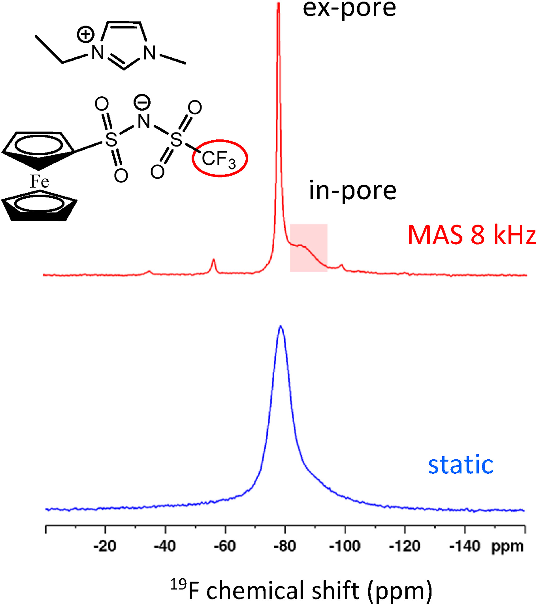
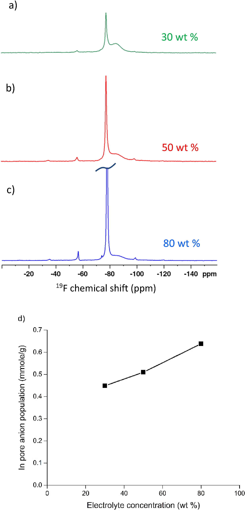
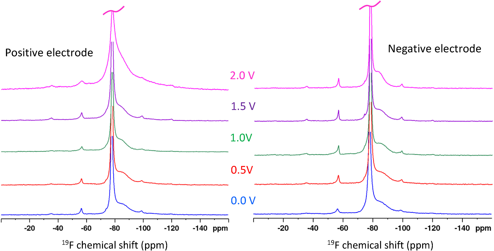
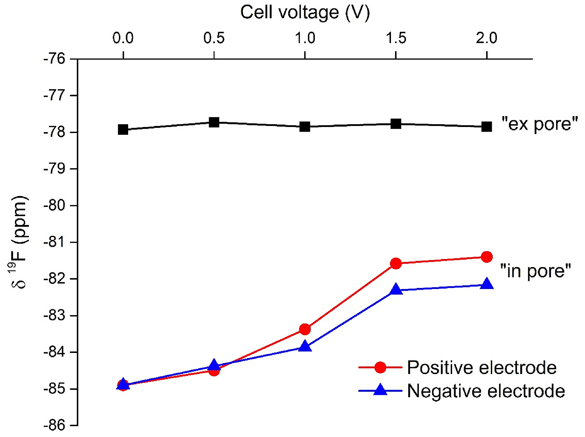
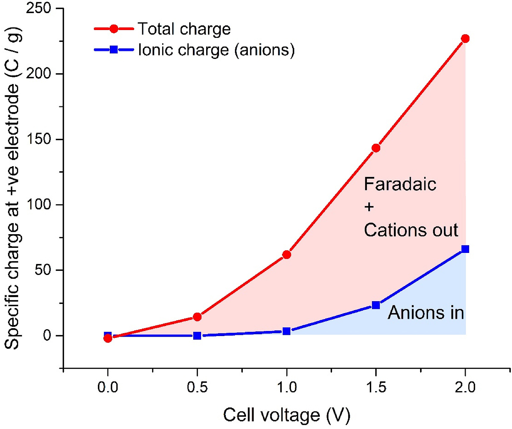
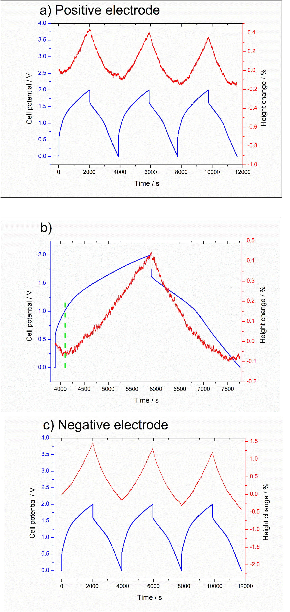
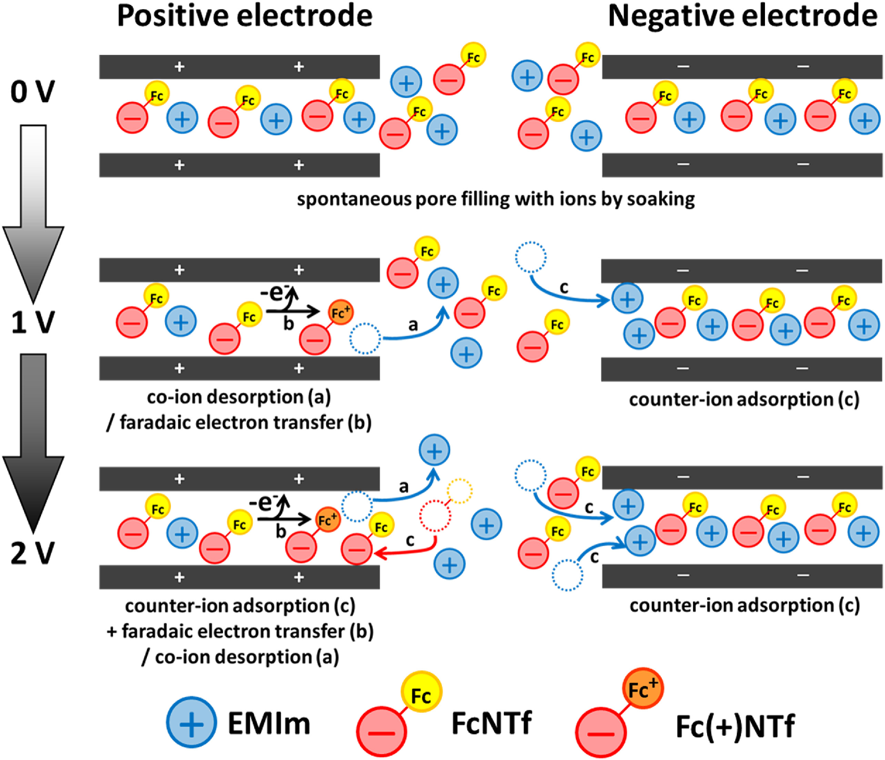

## Solid-state NMR and electrochemical dilatometry study of charge storage in supercapacitor with redox ionic liquid electrolyte 氧化还原离子液体电解质对超级电容器中电荷存储的固态NMR和电化学膨胀学研究

> Yanyu Wang, Cédric Malveau, DominicRochefort
> Energy Storage Materials, Volume 20, July 2019, Pages 80-88
> [10.1016/j.ensm.2019.03.023](doi.org/10.1016/j.ensm.2019.03.023)

### 1. Introduction
Electrochemical capacitors, also known as supercapacitors, have received considerable interest as a charge storage devices due to their distinct advantages such as high power density and long life cycle. [1,2] The storage of electrical energy in electrochemical double layer capacitors (EDLCs) relies on the formation of an electrochemical double layer (EDL) at the interface between the electrode and electrolyte. Porous carbons, such as activated carbons, are widely used for supercapacitor electrode materials owing to their high surface area and conductivity [3]. The desolvation of electrolyte ions and the relationship between the carbon pore size and the desolvated ion size have been shown to play important roles on the capacitance [4], [5], [6], [7].  
电化学电容器也称为超级电容器，由于其独特的优势（例如高功率密度和长寿命）而作为电荷存储设备受到了广泛的关注。 [1,2]电化学双层电容器（EDLC）中的电能存储依赖于在电极和电解质之间的界面处形成电化学双层（EDL）。多孔碳，例如活性炭，由于其高表面积和导电性而被广泛用于超级电容器电极材料[3]。电解质离子的去溶剂化以及碳孔尺寸与去溶剂化的离子尺寸之间的关系已显示出对电容起重要作用[4]，[5]，[6]，[7]。

The energy stored in supercapacitors is related to the cell capacitance as well as the operating voltage. Room temperature ionic liquids (ILs) are studied as alternatives to organic electrolytes due to their wider electrochemical potential window of operation. This feature is highly desirable in supercapacitors due to the square dependence of the energy density on the voltage [8], [9], [10]. ILs have additional favorable properties including low vapor pressure, non-flammability and good thermal stability [11]. Another strategy to enhance energy density is via the introduction of a redox-active additive to the electrolyte [12], [13], [14], [15], [16], [17], [18], [19], [20], [21]. The use of electroactive species such as iodide, hydroquinone, methylene blue or indole-based conjugated macromolecules have been reported for this purpose [13], [14], [15], [16], [17]. Most of the redox-active electrolyte supercapacitors are based on aqueous solutions due to the higher solubility of redox species in water than in organic solvents. Aqueous electrolytes however have the downside of being limited to moderate operation voltages. Redox-active ionic liquids (RILs) can overcome the solubility and electrochemical stability limitations of organic and aqueous electrolytes. These electroactive phases are obtained by attaching a redox-active moiety to one or both of the ions of ionic liquids [22], [23], [24], [25], [26], and electrochemical characterizations show their potential use in electrochemical devices including supercapacitors. Our group has reported on a supercapacitor using a redox-active electrolyte made from ionic liquids functionalized with electroactive ferrocene [27]. Compared with pure ferrocene dissolved in organic solvent, the concentration of the redox moiety in ferrocene-functionalized ionic liquid is significantly enhanced up to 2.4 M. The operating voltage for the supercapacitor based on this redox ionic liquid reached 2.5 V and an energy density of 13.3 Wh·kg−1 was achieved, which is approximately twice than that with the unmodified ionic liquid (purely EDL charging). More recently, Mourad et al. presented a biredox ionic liquid that is an ionic liquid functionalized with redox-active species on both cation and anion, for application in supercapacitors [28]. They demonstrated that the capacitance has a two-fold improvement and sustains 2000 cycles without deterioration. These examples clearly demonstrate that the redox-active electrolytes in supercapacitors offer increased energy thanks to the faradaic charging arising from the redox-active species.  
超级电容器中存储的能量与电池电容以及工作电压有关。由于室温离子液体（ILs）的电化学势能范围更广，因此已被研究作为有机电解质的替代品。由于能量密度对电压[8]，[9]，[10]的平方依赖性，因此在超级电容器中非常需要此功能。 IL具有其他有利的特性，包括低蒸气压，不燃性和良好的热稳定性[11]。另一个提高能量密度的策略是通过向电解质中引入氧化还原活性添加剂[12]，[13]，[14]，[15]，[16]，[17]，[18]，[19] ]，[20]，[21]。为此已经报道了使用电活性物质如碘化物，对苯二酚，亚甲基蓝或吲哚基共轭大分子[13]，[14]，[15]，[16]，[17]。由于氧化还原物质在水中的溶解度高于在有机溶剂中的溶解度，因此大多数氧化还原活性电解质超级电容器都基于水溶液。然而，水性电解质的缺点是限于中等的工作电压。氧化还原活性离子液体（RIL）可以克服有机和水性电解质的溶解度和电化学稳定性限制。这些电活性相是通过将氧化还原活性部分连接到离子液体的一个或两个离子上而获得的[22]，[23]，[24]，[25]，[26]，并且电化学表征显示出它们的潜力用于包括超级电容器在内的电化学设备。我们的小组已经报道了一种超级电容器，该超级电容器使用由具有电活性二茂铁功能化的离子液体制成的氧化还原活性电解质[27]。与溶解在有机溶剂中的纯二茂铁相比，二茂铁官能化离子液体中氧化还原部分的浓度显着提高至2.4 M，基于该氧化还原离子液体的超级电容器的工作电压达到2.5 V，能量密度为13.3Wh·kg-1，约为未改性离子液体（纯EDL充电）的两倍。最近，Mourad等人提出了一种双氧化还原离子液体，它是一种在阳离子和阴离子上都被氧化还原活性物质功能化的离子液体，用于超级电容器[28]。他们证明，电容具有两倍的改进，可维持2000次循环而不会劣化。这些例子清楚地表明，由于由氧化还原活性物质引起的法拉第充电，超级电容器中的氧化还原活性电解质提供增加的能量。

A number of theoretical and experimental methods have been developed to study charge storage mechanisms in EDLCs. Molecular dynamics simulations can describe various adsorption modes for ions at the microscopic scale using specific model and can be used to explore new route to improve energy storage efficiency [29], [30], [31], [32]. In situ experimental methodologies based on electrochemical quartz crystal microbalance (EQCM) [33,34] and infrared spectroscopy (IR) [35] have been used to address questions concerning details of ion behaviour in real devices. EQCM is capable of measuring mass variation of electrodes during charging and discharging process. In situ IR method allows the movement of cations and anions of electrolyte in or from carbon micropores to be tracked upon charging. However, a key limitation of EQCM and IR methods is that the in-pore ions cannot be directly detected. Nuclear magnetic resonance (NMR) spectroscopy, including in situ [36], [37], [38], [39], [40], [41], [42]and ex situ [43], [44], [45] approaches, stand out as a particularly powerful tool to study the molecular mechanisms of charge storage by identifying and quantifying ions adsorbed within carbon micropores. This originates from the shift of the resonance frequency of nuclei strongly interacting with the local electronic density of activated carbon; the ring current effect [46]. Both in situ and ex situ NMR studies of supercapacitors with organic electrolytes or ionic liquids have shown that the electrolyte ions are spontaneously adsorbed into the carbon micropores in the absence of an applied voltage and that the ion population within the micropores changes as a voltage is applied. Importantly, the charge storage mechanism can vary significantly when different electrolytes or even identical electrolyte with different concentrations are used. Three possible pathways for charge storage mechanisms in supercapacitors are proposed based on NMR studies of supercapacitors with porous carbon electrodes and organic electrolytes [38,47,48]. One possible mechanism is adsorption of counter-ions, resulting in an overall increase in the population of in-pore ions with a charge opposite to that of the carbon electrode. Alternatively, charging can be driven by desorption of the co-ions, resulting in a surplus of the in-pore counter-ions and a reduction of the total in-pore ion population. Finally, it is possible that the counter-ion adsorption is accompanied by the simultaneous co-ion desorption (referred to as ion-exchange) and the total in-pore ion population remains constant.  
已经开发了许多理论和实验方法来研究EDLC中的电荷存储机制。分子动力学模拟可以使用特定模型在微观尺度上描述离子的各种吸附模式，并且可以用来探索提高能量存储效率的新途径[29]，[30]，[31]，[32]。基于电化学石英晶体微天平（EQCM）[33,34]和红外光谱（IR）[35]的原位实验方法已用于解决有关实际设备中离子行为细节的问题。 EQCM能够测量在充电和放电过程中电极的质量变化。原位红外方法允许在充电时追踪碳微孔中或来自碳微孔中的阳离子和电解质的运动。但是，EQCM和IR方法的主要局限性在于无法直接检测到孔内离子。核磁共振波谱学，包括原位[36]，[37]，[38]，[39]，[40]，[41]，[42]和非原位[43]，[44]，[45]方法，通过鉴定和量化吸附在碳微孔中的离子，成为研究电荷存储的分子机制的一种特别强大的工具。这源于与活性炭的局部电子密度强烈相互作用的原子核共振频率的变化。振铃电流效应[46]。具有有机电解质或离子液体的超级电容器的原位和异位NMR研究均表明，在没有施加电压的情况下，电解质离子会自发地吸附到碳微孔中，并且微孔中的离子数量会随着电压的施加而发生变化。重要的是，当使用不同的电解质或什至具有不同浓度的相同电解质时，电荷存储机制会发生显着变化。基于具有多孔碳电极和有机电解质的超级电容器的NMR研究，提出了超级电容器中电荷存储机制的三种可能途径[38,47,48]。一种可能的机制是抗衡离子的吸附，导致带有与碳电极相反电荷的孔内离子总体增加。可替代地，可以通过解吸钴离子来驱动电荷，导致孔内抗衡离子的过量和孔内离子总数的减少。最后，反离子吸附可能伴随着同时的离子解吸（称为离子交换），总的孔内离子总数保持恒定。

Dimensional changes of the carbon electrodes of supercapacitors may play an important role in the overall energy balance of the charging process.50 In situ electrochemical dilatometry has been widely used as a reliable tool to monitor the charge-induced dimensional changes of various carbons such as activated carbon, carbide-derived carbon, carbon nanotubes or graphene in supercapacitors [49], [50], [51], [52], [53], [54], [55], [56]. The expansion of the carbon electrodes is related to both the carbon pore size distribution and electrolyte. Studies have shown than that the activated carbon electrodes exhibit a reversible expansion up to a few percent of the initial thickness upon charging [54]. The macroscopic electrode expansion observed by dilatometry could be correlated to a microscopic change in terms of ionic migration. The combination of NMR and electrochemical dilatometry provides a more complete picture of the charging mechanism of supercapacitors.  
超级电容器碳电极的尺寸变化可能在充电过程的总体能量平衡中起重要作用。50原位电化学膨胀法已广泛用作监测各种电荷（如活性炭）的电荷诱导尺寸变化的可靠工具超级电容器中的碳，碳化物衍生的碳，碳纳米管或石墨烯[49]，[50]，[51]，[52]，[53]，[54]，[55]，[56]。碳电极的膨胀与碳孔径分布和电解质有关。研究表明，活性炭电极在充电时表现出可逆膨胀，达到初始厚度的百分之几[54]。通过膨胀计观察到的宏观电极膨胀可以与离子迁移方面的微观变化相关。 NMR和电化学膨胀法的结合提供了超级电容器充电机理的更完整描述。

In this work, the charge storage in a redox-active electrolyte supercapacitor using activated carbon (YP-50F) electrodes and an electroactive ionic liquid electrolyte was studied by ex situ 19F MAS NMR and in situ electrochemical dilatometry. The ionic liquid 1-ethyl-3-methylimidazolium ferrocenylsulfonyl-(trifluoromethylsulfonyl)-imide (EMIm FcNTf) was selected due to its high concentration of redox centers, miscibility with many organic solvents and electrochemical stability. The ferrocene redox center linked to the FcNTf anion allows monitoring both the anion inclusion in the carbon from the 19F signal and the amount of faradaic charge by chronocoulometry from a single charging step. First, we look at the spontaneous adsorption of FcNTf in the micropores of the activated carbon in the absence of potential to evaluate the impact of the larger ion size. Then we present the results of the ion quantification in the pores as a function of the voltage applied to a symmetrical supercapacitor cell to provide insights into the charge storage mechanism. We will show how the faradaic contribution of charge storage arising from oxidation of the ferrocene can be determined by subtraction of the EDL ionic charge calculated with the in-pore ion population measured by NMR from the total electronic charge. Then, we complementarily measure the electrode volume change during the charging process using electrochemical dilatometry. The results gathered reveal important information about the difference in charging between EDLCs and redox-active electrolyte supercapacitors, allowing us to propose a charge storage mechanism for this system.  
在这项工作中，通过异位19 F MAS NMR和原位电化学膨胀法研究了使用活性炭（YP-50F）电极和电活性离子液体电解质在氧化还原活性电解质超级电容器中的电荷存储。选择离子液体1-乙基-3-甲基咪唑鎓二茂铁磺酰基-（三氟甲基磺酰基）-酰亚胺（EMIm FcNTf）是因为其氧化还原中心浓度高，可与许多有机溶剂混溶和电化学稳定性。连接到FcNTf阴离子的二茂铁氧化还原中心可通过计时库仑法从单个充电步骤监测19F信号中碳中的阴离子含量和法拉第电荷量。首先，我们研究了在没有潜力评估较大离子尺寸影响的情况下，FcNTf在活性炭微孔中的自发吸附。然后，我们将孔中离子定量的结果作为施加到对称超级电容器电池上的电压的函数，以提供有关电荷存储机制的见解。我们将展示如何通过从总电子电荷中减去用NMR测量的孔内离子总数计算出的EDL离子电荷来确定由二茂铁的氧化引起的电荷存储的法拉第贡献。然后，我们使用电化学膨胀法补充测量充电过程中的电极体积变化。收集的结果揭示了有关EDLC与氧化还原活性电解质超级电容器之间电荷差异的重要信息，从而使我们能够为该系统提出电荷存储机制。

### 2. Materials and methods
#### 2.1. Carbon electrode fabrication
Carbon electrodes were fabricated from a slurry consisting of 95 wt % YP-50F activated carbon powder (Kuraray Chemical, Japan) and 5 wt % polytetrafluoroethylene (PTFE) binder (Sigma-Aldrich, 60 wt % dispersion in water) in ethanol. The slurry was stirred for at least 2 h until a homogeneous consistency was obtained before heating up to 90 °C under stirring. The resulting paste was kneaded thoroughly and rolled to form a free-standing film with a final thickness of approximately 0.2 mm 6 mm diameter disc-shaped electrodes were then cut and dried under vacuum at 120 °C for at least 24 h. For electrochemical dilatometry experiments, the prepared electrodes were placed on a stainless steel grid (Alfa Aesar, 80 mesh, 0.127 mm) used as a current collector and were pressed for 60 s at a pressure of 2 MPa before assembled into the electrochemical dilatometer cell.  
碳电极由95％（重量）的YP-50F活性炭粉末（日本Kuraray Chemical）和5％（重量）的聚四氟乙烯（PTFE）粘合剂（Sigma-Aldrich，在水中有60％（重量）的分散液）组成的浆料制成。将浆液搅拌至少2小时，直到获得均匀的稠度，然后在搅拌下加热至90℃。将所得的糊状物充分捏合并辊压以形成最终厚度约为0.2μm的自立膜，然后将直径为6μm的圆盘形电极切开，并在120°C的真空下干燥至少24°h。对于电化学膨胀计实验，将准备好的电极放在用作集电器的不锈钢网格（Alfa Aesar，80目，0.127 mm）上，并在2 MPa的压力下加压60 s，然后组装到电化学膨胀计池中。

#### 2.2. Redox ionic liquid and electrolytes
The synthesis of redox ionic liquids EMIm FcNTf was done according to previous studies [24] and the synthesized compounds were characterized by 1H, 13C and 19F NMR spectroscopy on Bruker Avance 400 MHz and 300 MHz spectrometers, electrospray ionization mass spectrometry and elemental analysis. Mass spectra were recorded on a Waters 3100 mass spectrometer and elemental analysis was performed with a Fisons Instruments EA 1108 elemental analyser. Thermal analyses, including differential scanning calorimetry (DSC) and thermal gravimetric analysis (TGA) were performed on TA Instruments TA Q1000 and TGA 2950, respectively. The results of all characterizations are presented in the Supporting Information. The electrolytes for supercapacitor are different concentration solutions (80 wt %, 50 wt % and 30 wt %) of redox ionic liquid EMIm FcNTf in acetonitrile (Sigma Aldrich, 99.8% anhydrous), referred to as EMIm FcNTf/ACN.  
氧化还原离子液体EMIm FcNTf的合成是根据先前的研究[24]进行的，合成的化合物通过在Bruker Avance 400 MHz和300 MHz光谱仪上的1H，13C和19F NMR光谱，电喷雾电离质谱和元素分析进行​​表征。在Waters 3100质谱仪上记录质谱，并用Fisons Instruments EA 1108元素分析仪进行元素分析。分别在TA Instruments TA Q1000和TGA 2950上进行了热分析，包括差示扫描量热法（DSC）和热重分析（TGA）。所有特征的结果均在支持信息中列出。用于超级电容器的电解质是乙腈（Sigma Aldrich，99.8％无水）中氧化还原离子液体EMIm FcNTf的不同浓度溶液（80％（重量），50％（重量）和30％（重量）），称为EMIm FcNTf/ACN。

#### 2.3. Cell preparation
All supercapacitor cells were prepared adapting a two-electrode Swagelok cell configuration. Symmetric cells were assembled inside an argon glovebox, with four stacked thin paper disks as the separator. Carbon electrodes were soaked in the prepared electrolytes overnight before assembled into the cell. The mass of both electrodes is in the range of 5.8–6.6 mg and the mass discrepancy between two electrodes in each cell is lower than 0.1 mg.  
所有超级电容器电池均采用两电极Swagelok电池结构进行制备。对称电池组装在一个氩气手套箱内，并用四个堆叠的薄纸盘作为隔板。将碳电极在准备好的电解质中浸泡过夜，然后再组装到电池中。两个电极的质量在5.8–6.6μmg的范围内，每个单元中两个电极之间的质量差异小于0.1μmg。

#### 2.4. SS-NMR experimental details
All SS-NMR experiments were performed with a Bruker Avance II 400 spectrometer operating at a magnetic field strength of 9.4 T, corresponding to a 19F Larmor frequency of 376.3 MHz and equipped with a 4.0 mm double-resonance MAS probe. All 19F NMR spectra were acquired at 8 kHz MAS. The PTFE binder and probe background signals were removed using presaturation (set on a spinning sideband free of any other signals [57]) and background suppression pulse sequences, respectively. A radiofrequency strength of 50 kHz and a recycle delay of 3 s were used to collect a total of 256 scans for each NMR experiment. Spectral deconvolutions were conducted using the SOLA package in Topspin software and two single peaks were used to fit in-pore and ex-pore resonances. Spinning sidebands were taken into account using a chemical shift anisotropy model in the SOLA package in order to obtain better accuracy of resonance intensities.  
所有SS-NMR实验均使用Bruker Avance II 400光谱仪在9.4 T的磁场强度下进行，对应于19F Larmor频率376.3 MHz，并配备了4.0 mm双共振MAS探针。所有的19 F NMR光谱都是在8 kHz MAS下获得的。分别使用预饱和（在无任何其他信号的旋转边带上设置[57]）和背景抑制脉冲序列除去PTFE粘合剂和探针的背景信号。每次NMR实验使用50 kHz的射频强度和3 s的循环延迟来收集总共256次扫描。使用Topspin软件中的SOLA软件包进行光谱去卷积，并使用两个单峰拟合孔内和孔外共振。为了获得更好的共振强度精度，在SOLA封装中使用化学位移各向异性模型考虑了旋转边带。

All electrochemical experiments were carried out with a BioLogic VMP3 Potentiostat. Prior to applying a fixed voltage for the NMR measurements, supercapacitor cells were initially cycled by galvanostatic charge–discharge (GCD) experiments for 5 cycles at a current density of 0.05 mA mg−1 between 0 and 2 V. Different constant voltages of 0, 0.5, 1.0, 1.5 and 2.0 V were sequentially applied to the cells for 1 h. After disconnected from potentiostat, the cells were disassembled quickly and any excess electrolyte on the external of the electrodes was carefully removed by touching the surface of the electrodes with a small piece of tissue paper. Both the positive and negative carbon electrodes were then weighed before individually packing into 4 mm outer diameter zirconia MAS rotors for NMR measurements.  
所有电化学实验均使用BioLogic VMP3恒电位仪进行。在施加固定电压进行NMR测量之前，首先通过恒电流充放电（GCD）实验将超级电容器电池循环5个循环，电流密度为0 V至2 V之间的0.05 mA mg-1。不同的恒定电压0，将0.5、1.0、1.5和2.0V依次施加到电池1h。从恒电位仪上断开后，迅速分解电池，并用一小块薄纸接触电极表面，小心地除去电极外部的任何多余电解质。然后称量正碳电极和负碳电极的重量，然后分别包装到外径为4毫米的氧化锆MAS转子中以进行NMR测量。

#### 2.5. In situ electrochemical dilatometry experiments
An ECD-3 electrochemical dilatometer from EL-Cell (Germany) was used to measure the charge-induced dimensional change of the electrodes. The cell with 50 wt % EMIm FcNTf in ACN as electrolyte and a fixed stiff glass frit as separator was assembled in an argon glovebox. Galvanostatic charge-discharge cycles at a current density of 0.025 mA mg−1 between 0 and 2 V were carried out using the same potentiostat and displacement signal from the electrochemical dilatometer was simultaneously recorded with EC-Link Software. The relative height change was normalized by the electrode thickness, measured prior to the experiment.  
使用来自EL-Cell（德国）的ECD-3电化学膨胀仪来测量电极引起的电荷诱导的尺寸变化。将在ACN中具有50wt％EMIm FcNTf作为电解质，固定的硬质玻璃粉作为隔板的电池组装在氩气手套箱中。使用相同的恒电位仪在0至2 V之间以0.025 mA mg-1的电流密度进行恒电流充放电循环，并使用EC-Link软件同时记录来自电化学膨胀仪的位移信号。通过在实验前测量的电极厚度将相对高度变化归一化。

### 3. Results and discussion
#### 3.1. Static & MAS NMR spectra of soaked electrodes
The Kuraray YP-50F activated carbon was selected for its porosity that is suitable to accommodate the ions of the ionic liquid used in this study. N2 adsorption isotherms and pore size distribution calculations for YP-50F show a first pore population at ca. 0.7 nm accounting for nearly 50% of the total pore volume (see Fig. 1 of reference [58] for PSD). The molecular volume of the FcNTf anion is larger than that of the unmodified NTf2 (2.71 vs. 1.48 Å3) [59] and a lower occupancy of the porosity by the former is expected. It will be however shown later that a correlation exists between the in-pore signal intensity and the FcNTf concentration, confirming that the modified anion can populate the YP-50F porosity. 19F MAS (8 kHz) and static spectra of YP-50F activated carbon electrodes soaked with an electrolyte composed of 50 wt % of the electroactive ionic liquid EMIm FcNTf in ACN are shown in Fig. 1. In the MAS spectrum, two featured resonances for the FcNTf anions are clearly observed. The sharp “ex-pore” resonance corresponding to the ions residing in the bulk of the electrolyte (i.e., outside the micropores or between the carbon particles) is observed at −77.9 ppm, while the broad “in-pore” resonance assigned to the ions located inside the carbon micropores is observed at −85.1 ppm. The in-pore resonance is shifted to lower frequency by a value of 7.2 ppm relative to ex-pore resonance, due to the change of local magnetic environment within the micropores arising from the ring current effects [48]. A smaller difference in the chemical shifts between the in-pore and ex-pore was observed for the unmodified EMIm NTf2 ionic liquid (6.3 ppm) [44]. The difference between these ionic liquids suggests that the local magnetic environment felt by the F atom on the in-pore anions is slightly affected by the presence of ferrocene as π-π interactions are possible between the activated carbon and the FcNTf anion. The observation of a distinct in-pore resonance in the spectrum of Fig. 1 indicates that the redox-active anion from the ionic liquid EMIm FcNTf spontaneously populates the carbon micropores even in the absence of an applied potential and despite the larger anion radius. Static NMR measurement for the same carbon electrode (Fig. 1, bottom) provided an insufficient resolution to distinguish quantitatively the in-pore ions from the ex-pore ions because of the high viscosity of the ionic liquid. The shoulder on the lower frequency side for the ex-pore ions is however visible. Consequently, since the MAS is required, the measurements on this electrolyte will be done in an ex-situ mode were the electrodes are charged in Swagelok-type cells, recuperated from the cells and transferred in the NMR for measurements.  
选择Kuraray YP-50F活性炭是因为其孔隙率适合容纳本研究中使用的离子液体的离子。YP-50F的N2吸附等温线和孔径分布计算结果表明，第一个孔的数量大约为。 0.7 nm约占总孔体积的50％（参见PSD的参考文献[58]的图1）。 FcNTf阴离子的分子体积大于未修饰的NTf2（2.71对1.48Å3）[59]，并且前者的孔隙率较低。但是，稍后将显示，孔内信号强度与FcNTf浓度之间存在相关性，从而证实了改性阴离子可以填充YP-50F孔隙度。图1显示了浸过由ACN中50 wt％的电活性离子液体EMIm FcNTf组成的电解质的YF-50F活性炭电极的19F MAS（8 kHz）和静态光谱如图1所示。在MAS光谱中，有两个特征共振可以清楚地观察到FcNTf阴离子。在-77.9 ppm处观察到与驻留在电解质主体中（即，微孔外部或碳颗粒之间）的离子相对应的尖锐的“孔外”共振，而宽泛的“孔内”共振则对应于在-85.1 ppm处观察到位于碳微孔内部的离子。由于环电流效应引起的微孔内局部磁性环境的变化，孔内共振相对于孔外共振移至较低的频率7.2 ppm。对于未修饰的EMIm NTf2离子液体（6.3 ppm），观察到孔内和孔外化学位移的差异较小[44]。这些离子液体之间的差异表明，二茂铁的存在会稍微影响孔隙阴离子上F原子感受到的局部磁性环境，因为活性炭和FcNTf阴离子之间可能存在π-π相互作用。在图1的光谱中观察到明显的孔内共振，表明即使在没有施加电势且阴离子半径较大的情况下，来自离子液体EMIm FcNTf的氧化还原活性阴离子也会自发地填充碳微孔。由于离子液体的高粘度，同一碳电极的静态NMR测量（图1，底部）提供的分辨率不足，无法定量区分孔内离子和孔外离子。但是，可以看到较低频率的离子交换离子。因此，由于需要MAS，因此在将电极装入Swagelok型电池中，从电池中回收并转移到NMR中进行测量的情况下，将以异位模式对这种电解质进行测量。

  
Fig. 1. 19F NMR spectra recorded at MAS (8 kHz, top) and in static mode (bottom) shows the necessity of spinning to obtain a sufficient resolution to isolate the in-pore ion contribution. The signals came only from the F atoms on the FcNTf anion. The peaks at about −35, −55 and −100 ppm are spinning sidebands. The measurements were done on the YP-50F carbon electrodes (95 wt % activated carbon and 5 wt % PTFE) soaked overnight in a solution of 50 wt % of the ionic liquid EMIm FcNTf in acetonitrile. The excess of electrolyte was removed prior to the measurements.  
图1.在MAS（8 kHz，顶部）和在静态模式下（底部）记录的19F NMR光谱表明，纺丝必须获得足够的分辨率以分离孔内离子贡献。信号仅来自FcNTf阴离子上的F原子。约-35，-55和-100 ppm处的峰是旋转边带。测量是在YP-50F碳电极（95％（重量）活性炭和5％（重量）PTFE）上浸泡在50％（重量）离子液体EMIm FcNTf在乙腈中的溶液中浸泡过夜。在测量之前，除去过量的电解质。

Electrolytes with 30, 50 and 80 wt % of the EMIm FcNTf ionic liquid in acetonitrile were prepared to study the effect of the IL concentration on the signal of the FcNTf adsorbed in the carbon micropores. Fig. 2 shows the 19F NMR spectra for each sample after soaking overnight in the electrolyte. The linewidth of the in-pore resonance drops from 4417 Hz (80 wt %, Fig. 2c) to 4243-4243 Hz (50 wt %, Fig. 2b) and to 3600 Hz (30 wt %, Fig. 2a) due to the higher mobility of ions in the less viscous electrolytes containing less ionic liquid. We also note that the difference in the 19F chemical shifts between the in-pore and ex-pore resonances decreases slightly from 7.2 ppm (80 wt % and 50 wt %) to 6.6 ppm (30 wt %). It is presumed that more solvent increases the average distance between carbon and ions and correspondingly reduces the ring current effects [44].  
制备了在乙腈中具有30、50和80 wt％的EMIm FcNTf离子液体的电解质，以研究IL浓度对吸附在碳微孔中的FcNTf信号的影响。图2显示了在电解质中浸泡过夜后每个样品的19F NMR光谱。孔内共振的线宽从4417 Hz（80 wt％，图2c）降至4243-4243 Hz（50 wt％，图2b）和3600 Hz（30 wt％，图2a）。离子在含有较少离子液体的粘性较低的电解质中具有较高的迁移率。我们还注意到，孔内和孔外共振之间19F化学位移的差异从7.2 ppm（80 wt％和50 wt％）略微降低到6.6 ppm（30 wt％）。据推测，更多的溶剂会增加碳与离子之间的平均距离，并相应地降低环电流效应[44]。

  
Fig. 2. 19F NMR spectra of YP-50F carbon electrodes after contacting an excess of three different EMIm FcNTf/ACN electrolytes overnight and removing the excess solution. The electrolytes contained (a) 30 wt %, (b) 50 wt % and (c) 80 wt % of the redox ionic liquid. The ex-pore peak (δ = −78 ppm) intensity reflects the increasing quantity of FcNTf in the interparticle spaces of the porous electrode. The deconvolution of the spectra was used to evaluate the relative surface area of both peaks (ex-pore and in-pore) and the concentration of the in-pore anions (presented in the d) panel.  
图2. YP-50F碳电极在过量的三种不同的EMIm FcNTf /ACN电解质中接触过夜并去除过量的溶液后的19F NMR光谱。电解质包含（a）30重量％，（b）50重量％和（c）80重量％的氧化还原离子液体。孔前峰的强度（δ＝ -78 ppm）反映了多孔电极的粒子间空间中FcNTf的增加量。光谱的解卷积用于评估两个峰（孔外和孔内）的相对表面积以及孔内阴离子的浓度（以d表示）。

Fig. 2 also shows a significant impact of the ionic liquid concentration on the peak intensities. In order to quantify the amount of ions in the pore, the spectra were deconvoluted using SOLA analysis into two contributions for both ex- and in-pore resonance peaks. Knowing the total amount of the ionic liquid in the electrode (by weight), it is then possible to quantify the in-pore ion population per gram of activated carbon material. Fig. 2d shows that the quantity of anions in the carbon pores is strongly correlated to electrolyte concentration in electroactive ionic liquid EMIm FcNTf. This trend is consistent with the results obtained for traditional (unmodified) ionic liquids such as PEt4-BF4/ACN electrolytes, where the in-pore ion population rises with the increase in the electrolyte concentration [41]. The quantity of FcNTf anions found in the carbon pores is between 0.45 and 0.64 mmol g−1. In the case of an electrolyte composed of 65 wt % of the unmodified EMIm NTf2 ionic liquid in ACN, 1.2 mmol g−1 of the NTf2 anions was determined in a similar electrode made from YP-50F carbon (from the same supplier) [44]. As the radius of the anion is significantly increased by the addition of ferrocene, it is not surprising that the number of mole of in-pore FcNTf is lower than that of NTf2. Since the peak of the in-pore resonance at 80 wt % electrolyte is quite broad and may provide a higher uncertainty in the quantification, the electrolyte containing 50 wt % EMIm FcNTf was chosen for the finer analysis of the variation of the in-pore ion population as a function of the voltage applied.  
图2还显示了离子液体浓度对峰强度的重大影响。为了量化孔中离子的数量，使用SOLA分析将光谱解卷积为前和孔内共振峰的两个贡献。知道了电极中离子液体的总量（按重量计），就可以定量每克活性炭材料的孔内离子数量。图2d显示，碳孔中阴离子的数量与电活性离子液体EMIm FcNTf中的电解质浓度密切相关。这种趋势与传统的（未改性的）离子液体（如PEt4-BF4 /ACN电解质）获得的结果一致，孔中离子的数量随电解质浓度的增加而增加[41]。在碳孔中发现的FcNTf阴离子的量在0.45至0.64 mmol g-1之间。如果电解质由ACN中65wt％的未改性EMIm NTf2离子液体组成，则在由YP-50F碳制成的相似电极（来自同一供应商）中确定了1.2 mmol g-1的NTf2阴离子[44 ]。由于通过加入二茂铁显着增加了阴离子的半径，因此孔内FcNTf的摩尔数低于NTf2的摩尔数也就不足为奇了。由于在80 wt％的电解质中孔内共振的峰相当宽，可能在定量中提供更高的不确定性，因此选择含50 wt％EMIm FcNTf的电解质来更精细地分析孔内离子的变化人口作为施加电压的函数。

#### 3.2. Ex situ NMR study of charge storage
Ex situ NMR experiments were carried out to probe the variation of the in-pore FcNTf ions during the charging process of a redox supercapacitor. A series of supercapacitor cells composed of 2 symmetrical carbon electrodes using the 50 wt % EMIm FcNTf/ACN electrolyte were charged to different voltages, ranging from 0 V to 2 V for a period of 1 h. The cells were then dismounted and the 19F NMR spectra were recorded for both the positive and negative electrodes. Fig. 3 shows that the spectra of the electrodes poised at 0 V are similar to those recorded on the soaked (unbiased) electrodes. The chemical shift of both peaks are found at the same position as in Fig. 1, Fig. 2 (ex-pore ions at −77.9 ppm and in-pore ions at −84.9 ppm). As the voltage is increased, a clear change in the in-pore anions peak occurs at the positive electrode. The peak intensity gradually increases and shifts towards higher frequencies. At the negative electrode on the other hand, only the resonant frequency evolves with the voltage applied, apart from a slight increase of the in-pore peak intensity at 2.0 V. A finer analysis of the peaks was carried out and the spectral deconvolution and fitting are presented in Fig. S1 of the Supporting Information.  
进行了异位NMR实验，以探测氧化还原超级电容器充电过程中孔内FcNTf离子的变化。使用50％（重量）的EMIm FcNTf /ACN电解质，将由2个对称碳电极组成的一系列超级电容器电池充电至0 V至2 V的不同电压，持续1 h的时间。然后拆下电池，并记录正电极和负电极的19 F NMR光谱。图3显示，在0 V下保持平衡的电极光谱与浸泡（无偏）电极上记录的光谱相似。在与图1，图2相同的位置处发现了两个峰的化学位移（在-77.9exppm处有外离子，在-84.9 ppm处有内离子）。随着电压增加，在正电极处出现孔内阴离子峰的明显变化。峰值强度逐渐增加并移向更高的频率。另一方面，在负电极上，除了在2.0 V时孔内峰强度略有增加之外，施加的电压只产生了谐振频率。对峰进行了更精细的分析，并进行了光谱去卷积和拟合在支持信息的图S1中显示。

  
Fig. 3. 19F NMR spectra of the positive and negative YP-50F activated electrodes of a supercapacitor cell that was charged at different voltages. All cells used a 50 wt % EMIm FcNTf redox ionic liquid in acetonitrile electrolyte and were charged using a 1 h potentiostatic step at the given voltage for 1 h (after equilibrating the cell with 5 GCD cycles, see Material and methods section for conditions). An increase in the relative proportion of in-pore FcNTf anions is observed at higher voltage values only at the positive electrode, as expected for double-layer charging. The quantity of anions in the carbon of the negative electrode remained constant.  
图3.在不同电压下充电的超级电容器电池的YP-50F正极和负极激活电极的19F NMR光谱。所有电池均在乙腈电解液中使用50％重量百分比的EMIm FcNTf氧化还原离子液体，并在给定电压下使用1µh恒电位步骤充电1µh（在5 GCD循环使电池平衡后，请参见“材料和方法”部分了解条件）。如双层充电所预期的，仅在正电极处，在较高的电压值下观察到孔内FcNTf阴离子相对比例的增加。负极碳中的阴离子量保持恒定。

Fig. 4 shows that the chemical shifts of the ex-pore ion peak remain unchanged with an increase in cell voltage, which is to be expected since the effect of charging the electrode is felt locally and will not extend far in the electrolyte. However, the peak for the in-pore anions in both the positive and negative electrodes gradually moves towards higher frequencies with increasing voltage and stabilizes after 1.5 V. This has been observed in NMR studies of similar carbon-ionic liquid systems [36,38,41,42,44] (although using unmodified ILs) and is an indication of a change in the electronic structure of the carbon surface induced by the application of a potential [42]. Several possible factors could account for the changes in the resonance frequencies of the adsorbed ions, but the most likely are the changes in the nature of the ions populating the pores or different interactions with the carbon. We notice that the magnitude of the chemical shift displacement of the in-pore peak between 0 and 2 V in our system (ca. 3 ppm) is smaller compared to an unmodified ILs [36,38,41,42,44]. For example, the shift in resonance of 19F peak in EMIm NTf2 can reach almost 7 ppm between the uncharged and fully charged state of a capacitor [44]. This difference is unlikely due to the system relaxation at OCP (self-discharge) as larger shifts were reported for both ex situ and in situ measurements in the literature.  
图4表明，随着电池电压的增加，孔外离子峰的化学位移保持不变，这是可以预料的，因为对电极充电的效果感觉是局部的，并且不会在电解质中延伸太远。然而，正负电极中孔内阴离子的峰随着电压的增加逐渐向更高的频率移动，并在1.5 V后稳定下来。这在类似碳离子液体系统的NMR研究中已经观察到[36,38， [41,42,44]（尽管使用未修饰的IL），并且指示由于施加电势而引起的碳表面电子结构的变化[42]。几种可能的因素可以解释吸附离子的共振频率的变化，但是最可能的是填充孔的离子性质的变化或与碳的不同相互作用。我们注意到，与未经修饰的IL相比，我们系统中孔峰在0至2 V之间（约3 ppm）的化学位移位移的幅度较小[36,38,41,42,44]。例如，EMIm NTf2中19F峰值的共振位移在电容器的未充电状态和完全充电状态之间可以达到几乎7 ppm [44]。这种差异不太可能是由于OCP（自放电）时的系统松弛引起的，因为文献中的异位测量和原位测量都报告了较大的偏移。

  
Fig. 4. Effect of the voltage on the 19F chemical shift of in-pore (red triangle and blue diamond for negative and positive electrode, respectively) and ex-pore (black cross) anions. This variation of the peak resonance suggests a modification of the immediate anion environment during the charging process, an effect commonly seen with ionic liquids in activated carbon electrodes. The chemical shift of the anions outside of the pores (bulk and interparticle spacing) is not affected by the voltage. Before recording the NMR spectra, the supercapacitor cell was poised to a voltage between 0 and 2 V for a duration of 1 h. (For interpretation of the references to colour in this figure legend, the reader is referred to the Web version of this article.)  
图4.电压对孔内阴离子（分别为负三角形和正电极的红色三角形和蓝色菱形）和离孔阴离子（黑十字）的19F化学位移的影响。峰共振的这种变化表明在充电过程中直接阴离子环境发生了变化，这种现象在活性炭电极中的离子液体中很常见。阴离子在孔隙外部的化学位移（疏松和粒子间的间距）不受电压的影响。在记录NMR光谱之前，将超级电容器电池置于0至2 V之间的电压下持续1 h。 （要解释此图例中对颜色的引用，请参阅本文的Web版本。）

Next we turn to the quantification of the anions inside the pores as a function of the applied voltage to gain a better understanding of the charging mechanism. The result of the integration after deconvolution of each peak is plotted in Fig. 5. At the positive electrode (Fig. 5a), the population of the in-pore anions remained approximately constant at the initial value measured for the unbiased electrodes up to a voltage of 1.0 V. A steep increase in the population is observed at higher voltages. This increase is indicative of the insertion of FcNTf anions inside the microporous carbon structure to compensate the charge accumulating at the electrode surface at more positive voltage. This is a direct consequence of the double-layer charging mechanism and such a relationship between the charge storage and ion population of the carbon pores has been demonstrated on many occasions for unmodified ionic liquids [36,38]. Meanwhile, at the negative electrode (Fig. 5b), the amount of anions inside the pores remains constant over the entire voltage range. The accumulation of charge at the negative electrode is therefore likely compensated by the adsorption of the cations (counter-ion adsorption model). We attempted several approaches to follow the imidazolium cations using 13C and 1H but without success. Others have been able to analyse changes in the ionic liquid cation population in and out of the activated carbon microstructure using SS-NMR [44]. In our case, the additional 13C and 1H signals attributed to the ferrocene on the FcNTf precluded the isolation of the signals from imidazolium. The FcNTf peaks were too broad and overlapped with those of imidazolium. The small increase in the anion population at 2.0 V on the negative electrode is probably caused by the adsorption or co-adsorption of some anions accompanying the large amounts of cations as strong ion-ion interactions are found in ionic liquid electrolytes [45]. It should be noted that ferrocenium is paramagnetic and, as such, could interfere with the NMR signal of its surroundings and complicate the quantification of in-pore ions by reducing 19F signal intensity. The total 19F signal was however not significantly affected by the presence of ferrocenium and the paramagnetic effect is only marginal (Fig. S2).  
接下来，我们将孔内阴离子的定量作为所施加电压的函数，以更好地了解充电机理。每个峰解卷积后的积分结果如图5所示。在正电极（图5a）上，孔内阴离子的数量大致保持不变，在无偏电极上测得的初始值直至1.0V的电压。在较高的电压下观察到浓度急剧增加。这种增加表明FcNTf阴离子在微孔碳结构内部的插入，以补偿在正电压下在电极表面积累的电荷。这是双层带电机制的直接结果，电荷存储和碳孔离子数量之间的这种关系已在许多情况下被证明适用于未改性的离子液体[36,38]。同时，在负极（图5b），孔内部的阴离子量在整个电压范围内保持恒定。因此，负极上电荷的积累很可能通过阳离子的吸附来补偿（反离子吸附模型）。我们尝试了几种使用13C和1H追踪咪唑鎓阳离子的方法，但没有成功。其他人已经能够使用SS-NMR分析活性炭微观结构内外的离子液体阳离子种群的变化[44]。在我们的案例中，归因于FcNTf上二茂铁的其他13C和1H信号排除了从咪唑鎓中分离信号的可能性。 FcNTf峰太宽，与咪唑重叠。负电极上2.0 V时阴离子种群的少量增加可能是由于某些离子与大量阳离子的吸附或共吸附所致，因为在离子液体电解质中发现了强的离子-离子相互作用[45]。应当指出，二茂铁是顺磁性的，因此，它可能会降低19 F信号强度，从而干扰其周围的NMR信号并使孔内离子的定量化变得复杂。然而，总的19 F信号不受二茂铁的显着影响，顺磁效应只是微不足道的（图S2）。

  
Fig. 5. In-pore FcNTf anion population found in the positive (a) and negative electrode (b) of a supercapacitor after applying different voltage between 0.0 and 2.0 V for 1 h. Values are given as millimoles per gram of YP-50F carbon in each electrode and were calculated from the relative peak surface area after deconvolution of the NMR spectra. The increase at the positive electrode between 1.0 and 2.0 V is indicative of significant amounts of anion into pores during charging of the supercapacitor.  
图5.在超级电容器的正极（a）和负极（b）中施加0.0至2.0 V的不同电压持续1 h后发现的孔内FcNTf阴离子群。给出的值以每电极中每克YP-50F碳的毫摩尔为单位，并由NMR光谱反卷积后的相对峰表面积计算得出。正极上1.0V和2.0V之间的增加表明在超级电容器充电过程中有大量阴离子进入孔中。

The interest in redox-active electrolyte supercapacitors lies in their ability to increase charge storage density via the faradaic reaction of an electroactive molecule dissolved in the electrolyte [13,14,27,28]. The goal of the following experiment is to evaluate if the SS-NMR approach, so far applied to study purely non-faradaic charge storage, can be used to understand the mixed (faradaic and non-faradaic) mechanisms in redox-active electrolytes supercapacitors. To do so, we intended to correlate the fraction of the charge associated with the anions populating the carbon pores, or “ionic charge”, with the total charge stored during the charging step calculated by the integration of chronoamperometric curve. Because the FcNTf anions are found in the micropores in the absence of a potential bias (see Fig. 2, Fig. 5 and associated discussion), the ionic charge is calculated from the increase in the amount of anion in the positive electrode from the value of 0.53 mmol g−1 found in Fig. 5 which sets the 0 ionic charge value. A zero ionic charge (after applying 0.0 and 0.5 V for instance, see Fig. 6) means that there is no net anion movement into the micropores. The total charge of 14 C g−1 calculated from the chronoamperometric curve using 0.5 V must therefore imply another mechanism. The expulsion of cations from the pore is more likely since a cyclic voltammogram recorded with the cell before the chronoamperometric measurement does not show the oxidation of ferrocene at that potential (see Fig. S3 in the Supporting Information).  
氧化还原活性电解质超级电容器的兴趣在于它们能够通过溶解在电解质中的电活性分子的法拉第反应来增加电荷存储密度的能力[13,14,27,28]。以下实验的目的是评估迄今为止仅用于研究非法拉第电荷存储的SS-NMR方法是否可用于了解氧化还原活性电解质超级电容器的混合（法拉第和非法拉第）机理。为此，我们打算将与填充碳孔的阴离子相关的电荷分数（即“离子电荷”）与通过计时电流曲线积分计算出的在充电步骤中存储的总电荷相关联。因为FcNTf阴离子是在不存在电位偏置的情况下在微孔中发现的（请参见图2，图5和相关讨论），所以根据该值从正电极中阴离子量的增加中计算出离子电荷图5中的0.53 mmol g-1的α设定了0离子电荷值。零离子电荷（例如，施加0.0和0.5 V后，见图6）意味着没有净阴离子移动到微孔中。因此，从计时电流曲线使用0.5 V计算得出的14 C g-1的总电荷必须有另一种机制。阳离子从孔中排出的可能性更高，因为计时安培法测量之前在电池中记录的循环伏安图未显示该电位下二茂铁的氧化（参见支持信息中的图S3）。

  
Fig. 6. Comparison of ionic and total electronic charge stored in the supercapacitor at different voltages. The ionic charge is calculated from the increase in the quantity of in pore FcNTf anions relative to the amount found in the carbon after soaking (unbiased electrodes, Fig. 2d). The total charge represents the amount of coulomb that was accumulated over the potentiostatic step. For an applied voltage of 1.0 V and above, the oxidation of ferrocene to ferrocenium becomes a significant contribution to the charging mechanism.  
图6.超级电容器在不同电压下存储的离子电荷和总电荷的比较。离子电荷是根据孔中FcNTf阴离子的量相对于浸泡后碳中存在的量的增加（无偏电极，图2d）计算得出的。总电荷表示在恒电位步骤中累积的库仑量。对于1.0 V及更高的施加电压，二茂铁氧化为二茂铁成为对充电机理的重要贡献。

Further increases in voltage (≥1.0 V) yield an increase in both the ionic and total charges. The increase in ionic charge simply means that more anions are inserted in the carbon micropores as a result of double-layer (DL) charging and other authors reported that the total electronic charge equals the ionic charge in EDLCs [38,41]. In contrast, Fig. 6 reveals a significant excess of charge between the total and ionic (anionic) charges. For example, at 2.0 V, the total charge calculated from the integration of the i-t curves reaches 226 g−1 while the amount of anions account for only 66 g−1. The remaining charge density can either originate from the oxidation of the ferrocene moiety on the anion (faradaic charging) or from the expulsion of EMIM cations out of the carbon micropores. For reasons explained above, we were unable to determine the population of cations in the micropore but we can however estimate the maximum charge that would be associated with their expulsion. To do so we first assume that the amounts of anions and cations in the micropores are equal at OCP after the soaking step (see Fig. 2d). This is a reasonable assumption to maintain charge neutrality and it has been shown to be true with unmodified ionic liquids [41]. Now if we suppose that all these cations (5.3 × 10−4 mol/g) are expelled from the micropores of the positive electrode during charging, they would contribute to the charge by 51 C/g. The data from Fig. 6 shows that for potentials ≥1.5 V, the expulsion of cations is insufficient to account for all the charge density and that consequently, a significant fraction of the total charge comes from faradaic charging. This explanation is further supported by the fact that the oxidation peak is found at these potential values on a cyclic voltammogram recorded with the supercapacitor cell (Fig. S4a in Supporting Information) and the existence of a potential plateau of the positive electrode during galvanostatic charging (Fig. S4b) [60]. At this point we should note that these results, being done ex-situ, provide a snapshot of the system after equilibrating the cell at a given voltage for 1 h. While the precise impact of dismounting the cell prior to the measurement is difficult to assess, we provide the NMR spectrum recorded immediately after dismounting the cell and after 1.5 h in the NMR (Fig. S5). In-situ NMR will be necessary to probe the dynamics of these two modes and provide a better understanding. In-situ approach will however be possible only using a diluted solution of the electroactive FcNTf since the use of MAS is required to distinguish both in- and ex-pore signals in viscous media.  
电压的进一步增加（≥1.0V）会同时增加离子电荷和总电荷。离子电荷的增加仅意味着由于双层（DL）电荷而在碳微孔中插入了更多的阴离子，其他作者报告说，总电子电荷等于EDLC中的离子电荷[38,41]。相反，图6揭示了总电荷和离子（阴离子）电荷之间明显过量的电荷。例如，在2.0 V下，根据i-t曲线的积分计算出的总电荷达到226 g-1，而阴离子的量仅占66 g-1。剩余的电荷密度可以源自阴离子上二茂铁部分的氧化（法拉第带电），也可以源自将EMIM阳离子从碳微孔中排出。由于上述原因，我们无法确定微孔中阳离子的数量，但是我们可以估计与其驱逐有关的最大电荷。为此，我们首先假设在浸泡步骤后，OCP处微孔中的阴离子和阳离子的量相等（见图2d）。这是保持电荷中性的合理假设，并且对于未改性的离子液体已证明是正确的[41]。现在，如果我们假设所有这些阳离子（5.3×10-4 mol /g）在充电过程中从正极的微孔中排出，它们将以51 C /g的电荷贡献电荷。图6的数据表明，对于电位≥1.5V，阳离子的排出不足以说明所有电荷密度，因此，总电荷的很大一部分来自法拉第充电。在超级电容器电池记录的循环伏安图上的这些电势值处发现了氧化峰（在支持信息中的图S4a），并且在恒电流充电过程中正极存在电势平台（图S4b），这一事实进一步证明了这一解释[60]。在这一点上，我们应该注意，这些结果是非原位完成的，在给定电压下将电池平衡了1 h之后，可以提供系统的快照。尽管很难评估在测量之前拆卸电池的精确影响，但我们提供了在拆卸电池之后以及在NMR中1.5 h之后立即记录的NMR光谱（图S5）。原位NMR将有必要探索这两种模式的动力学并提供更好的理解。但是，仅使用电活性FcNTf的稀释溶液就可以进行原位处理，因为需要使用MAS来区分粘性介质中的孔内和孔外信号。

#### 3.3. In situ electrochemical dilatometry measurements of charging cells
To complement the results described above, electrochemical dilatometry measurements were carried out on the positive and negative electrodes with galvanostatic charge and discharge. These were done in separate experiments as the in-situ cell allow following the thickness evolution of one electrode at a time. The galvanostatic charge-discharge curves and the corresponding electrochemical dilatometry profiles for both the positive and negative electrodes are depicted in Fig. 7a and c, respectively. Reversible electrode expansion during each charging and discharging cycle are observed. A zoom on one cycle at the positive electrode is shown in Fig. 7b, where a slightly negative expansion (contraction) at the very beginning of the charging process is observed. Such contraction of the electrode can be explained by the expulsion of cations, which was suggested as a possible mechanism above. Starting from around 1 V, the positive electrode begins to swell, consecutively reaching a 0.5% expansion. The electrode expansion is believed to be predominantly related to the accumulation of ions (or ion insertion) within micropores, which correlates well with the NMR observations described above [55]. At the negative electrode, only a pronounced expansion is observed, reaching 1.4% of the thickness change over the full voltage range (Fig. 7c). In comparison with positive electrode, the negative electrode expansion is larger by a factor of 2.8. This has been also observed by other authors [49], [50], [51], [52], [53], [54], [55], [56], which is thought to be a result of weakness in states density of π-electron system of carbon for positive polarization and enhancement for negative polarization [56].  
为了补充上述结果，在恒电流充放电的正负电极上进行了电化学膨胀测量。这些操作是在单独的实验中完成的，因为原位电池允许一次跟踪一个电极的厚度。正极和负极的恒电流充放电曲线和相应的电化学膨胀曲线分别在图7a和c中显示。在每个充电和放电周期中观察到可逆的电极膨胀。正极上一个周期的放大图如图7b所示，其中在充电过程的最开始就观察到了轻微的负膨胀（收缩）。电极的这种收缩可以通过阳离子的排出来解释，这被认为是上述可能的机理。从大约1 V开始，正极开始膨胀，连续达到0.5％的膨胀率。据认为，电极膨胀主要与微孔内离子的积累（或离子插入）有关，这与上述NMR观察结果非常相关[55]。在负极，仅观察到明显的膨胀，在整个电压范围内达到厚度变化的1.4％（图7c）。与正极相比，负极膨胀大2.8倍。其他作者[49]，[50]，[51]，[52]，[53]，[54]，[55]，[56]也观察到了这一点，认为这是由于碳的π电子体系的态密度在正极性方面弱，而在负极性方面增强[56]。

  
Fig. 7. Results from the in situ electrochemical dilatometry measurements on a supercapacitors cell with 50 wt % EMIm FcNTf acetonitrile solution as electrolyte. The measurements were done at a current density of 25 mA/g on the positive (a and b) and on the negative electrode (c), separately. Panel (b) shows an enlargement of the second cycle at the positive electrode. At low voltage, a contraction of the electrode is noted which is attributed to the expulsion of cations. This small feature of the dilatometry curve was consistently observed in all measurements with the EMIm FcNTf ionic liquid (at the positive electrode only).  
图7.用50％wt％EMIm FcNTf乙腈溶液作为电解质的超级电容器电池的原位电化学膨胀法测量结果。分别在正极（a和b）和负极（c）上以25 mA /g的电流密度进行测量。图（b）显示了在正极的第二个循环的放大。在低电压下，注意到电极的收缩归因于阳离子的排出。在所有使用EMIm FcNTf离子液体（仅在正极）的测量中，都始终观察到膨胀计曲线的这一小特征。

#### 3.4. Summary of charging process
Based on the SS-NMR and electrochemical dilatometry results presented above, we propose a possible charging mechanism for the supercapacitor composed of YP-50F carbon electrodes with the electroactive ionic liquid EMIm FcNTf electrolyte. The mechanism (schematically described in Fig. 8) is based on the similarities observed in previous NMR studies of EDLCs for the double-layer contribution to charge storage to which we now add the faradaic contribution. Initially, the electrolyte ions populate the micropores of the carbon before any voltage is applied. As the cell is charged, some of the cations are first expelled from the micropores on the positive electrode at low voltage (co-ion desorption) as evidenced by dilatometry showing a small decrease in electrode volume. At that potential, double-layer charging dominates at the positive electrode. As the voltage increases, the faradaic reaction begins at the positive electrode involving the oxidation of ferrocene to ferrocenium. The additional positive charge is compensated by further expulsion of cations and insertion of anions in the micropores. The counter-ion insertion is however more important than co-ion desorption since the electrode presents a net volume increase. When the voltage reaches 1.0 V, both the faradaic (ferrocene oxidation) and capacitive processes (ion movements to and from micropores) co-exist. On the negative electrode only the counter-ion EMIm+ adsorption happens over the full range of voltage studied as supported by the electrode volume expansion observed.  
基于以上介绍的SS-NMR和电化学膨胀法结果，我们提出了由YP-50F碳电极与电活性离子液体EMIm FcNTf电解质构成的超级电容器的可能充电机制。该机制（在图8中进行了示意性描述）是基于先前在EDLC的NMR研究中观察到的对电荷存储的双层贡献的相似之处，现在我们将法拉第贡献加入其中。最初，在施加任何电压之前，电解质离子会填充碳的微孔。随着电池的充电，一些阳离子首先在低压下从正极上的微孔中排出（共离子解吸），这由膨胀法证明了很小，电极体积减小了。在该电位下，双层充电在正极占主导地位。随着电压的升高，法拉第反应从正电极开始，涉及二茂铁氧化为二茂铁。额外的正电荷通过阳离子的进一步排出和阴离子在微孔中的插入来补偿。然而，由于电极的净体积增加，抗衡离子的插入比共离子的解吸更重要。当电压达到1.0 V时，法拉第（二茂铁氧化）和电容性过程（离子往返微孔的运动）同时存在。在负极上，只有所观察到的电极体积膨胀所支持的整个电压范围内，才发生抗衡离子EMIm +吸附。

  
Fig. 8. Schematic illustration of the different possible ion displacement inside and outside of the carbon micropores involved in supercapacitors based on the redox-active ionic liquid EMIm FcNTf electrolyte at different potentials. The different processes illustrated are proposed on the basis of the experimental results from NMR. The blue and red arrows indicate cations and anions (respectively) moving in or out of the micropores and the black arrows denote an electron transfer reaction. Note that solvent (acetonitrile) molecules are omitted for clarity and that electron transfer is also possible on the carbon particle surface, outside of the carbon pores (not shown). (For interpretation of the references to colour in this figure legend, the reader is referred to the Web version of this article.)  
图8.基于在不同电势下的氧化还原活性离子液体EMIm FcNTf电解质，超级电容器中涉及的碳微孔内部和外部可能发生的不同离子置换的示意图。根据NMR的实验结果，提出了说明的不同方法。蓝色和红色箭头分别表示阳离子和阴离子向微孔中移动或移出，黑色箭头表示电子转移反应。注意，为清楚起见，省略了溶剂（乙腈）分子，并且在碳孔的外部（未示出）在碳颗粒表面上也可能进行电子转移。 （要解释此图例中对颜色的引用，请参阅本文的Web版本。）

### 4. Conclusions
Solid-state NMR spectroscopy is a powerful technique to study charge storage mechanism of double-layer capacitors at the molecular level. The technique has been applied so far to the study of activated carbon capacitors employing conventional and ionic liquid electrolytes. Here we expanded its application to study the charging mechanisms of redox-active electrolytes capacitors, where an electroactive species is added in the electrolyte to increase energy density. To do so we employed an electroactive ionic liquid, 1-ethyl-3-methylimidazolium ferrocenylsulfonyl-(trifluoromethylsulfonyl)-imide (EMIm FcNTf), which bears the redox-active center on the anion. Changes in the population of the FcNTf anions inside the pores of the activated carbon was monitored from the 19F NMR signal. The results presented in this study demonstrate that the charge storage mechanism for supercapacitors based on redox electrolyte changes with the polarization of the cell. Specifically, charge storage at the positive electrode occurs via co-ion desorption (EMIm cations being expulsed from the pores) and faradaic reaction (FcNTf oxidation) at low voltage. At 1.0 V and above, counter-ion adsorption (further insertion of FcNTf anions in the micropores) contributes significantly to the charging process as evidenced by NMR. Charging at the negative electrode occurs exclusively by the counter-ion adsorption over the studied voltage range. These observations were confirmed by electrochemical dilatometry, which shows, at the positive electrode, a small contraction upon cation expulsion from the micropores at low voltage and an expansion when FcNTf anions penetrate the pores.  
固态NMR光谱学是一种在分子水平上研究双层电容器电荷存储机制的强大技术。迄今为止，该技术已应用于采用常规和离子液体电解质的活性炭电容器的研究。在这里，我们扩展了其应用，以研究氧化还原活性电解质电容器的充电机理，其中在电解质中添加了电活性物质以增加能量密度。为此，我们使用了一种电活性离子液体，即1-乙基-3-甲基咪唑鎓二茂铁磺酰基-（三氟甲基磺酰基）-酰亚胺（EMIm FcNTf），其阴离子上具有氧化还原活性中心。从19 F NMR信号监测活性炭孔内FcNTf阴离子的种群变化。这项研究中提出的结果证明，基于氧化还原电解质的超级电容器的电荷存储机制会随着电池的极化而变化。具体地，在正极上的电荷存储是通过低电压下的co-ion解吸（EMIm阳离子从孔中排出）和法拉第反应（FcNTf氧化）发生的。在1.0 V和更高的电压下，反离子吸附（FcNTf阴离子在微孔中的进一步插入）对充电过程有重要贡献，如NMR所示。在所研究的电压范围内，负电极上的电荷仅通过抗衡离子吸附而发生。这些观察结果通过电化学膨胀法得到证实，电化学膨胀法在正极上显示了在低压下从微孔中排出阳离子时的小收缩和在FcNTf阴离子渗透到孔中时的膨胀。

The faradaic contribution to the charge storage can be evaluated by a comparison between the ionic and total electronic charges, providing finer details on the mechanism than a purely electrochemical approach. Unfortunately, the presence of ferrocene broaden the 13C and 1H NMR spectra of the EMIm FcNTf, rendering the quantification of the imidazolium cation impossible due to overlapping peaks. Isotopic labeling might solve this issue. While the exact fraction of charge related to cation desorption is not determined, this process account for 25% of the charge storage at the most. Finally, we emphasise that the approach used here could be applied to understand the origin of the important issue of self-discharge in redox-active electrolyte supercapacitors. This will require operating in an in-situ mode, an approach that will be pursued in our laboratory.  
法拉第对电荷存储的贡献可以通过比较离子电荷和总电子电荷来评估，与纯电化学方法相比，该机理提供了更详细的信息。不幸的是，二茂铁的存在使EMIm FcNTf的13C和1H NMR光谱变宽，由于重叠的峰使得咪唑鎓阳离子的定量变得不可能。同位素标记可能会解决此问题。虽然尚不确定与阳离子解吸有关的电荷的确切比例，但此过程最多占电荷存储量的25％。最后，我们强调，此处使用的方法可用于了解氧化还原活性电解质超级电容器中自放电重要问题的起源。这将需要以原位模式进行操作，而这种方法将在我们的实验室中采用。