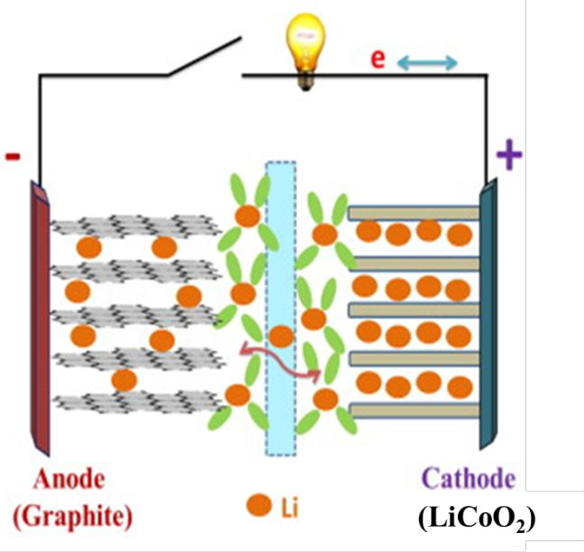

## 题目：离子液体电沉积锗基材料及其电化学性能研究

>作者：郝健
>
>关键词：离子液体;电沉积;锗;电化学性能;锂离子电池;体积膨胀

### 引言

>锗基材料电化学性能优异 -> 锂离子电池负极材料理想选择  
>问题：充放电过程中的体积膨胀、传统制备方法高耗能、高污染  
>本文以缓解锗基材料的粉化问题,提高材料的循环稳定性为目的,设计出不同形貌的锗基材料及锗基复合材料,包括:锗纳米薄膜、锗纳米线、三维泡沫镍-锗、三维锗-镍纳米圆锥阵列、三维锗-碳材料、锗/碳纳米管复合材料、锗/石墨烯复合材料及锗/聚3,4-乙撑二氧噻吩(PEDOT)复合材料。  
>采用离子液体电沉积实现对各种锗基材料的高效、绿色、低能、无催化剂及粘结剂制备。研究电化学过程中，微纳米结构与性能之间的关系。  

>沉积过程中通过水含量控制目标产物的形貌  
>- 未蒸馏的离子液体中沉积：二维多孔锗薄膜  
>- 蒸馏后的离子液体中沉积：三维多孔锗薄膜  

>研究了最佳沉积工艺  
>成核机理：受扩散控制的不可逆电极过程  
>通过退火多孔锗薄膜制备出不依靠模板且无催化剂离子的锗纳米线  
>锗纳米线的电学性能 -> 循环200次后可逆容量达到1200mAh/g，5C倍率下放电比为620mAh/g。

>电沉积将锗沉积在不同形貌的三维集流体上，制备出三维锗电极并研究测试其电化学性能。  
>三维结构可以为活性物质锗提供足够体积膨胀空间,提高锗电极的循环稳定性。  
>电学性能

>电沉积制备出锗/碳纳米管、锗/石墨烯及锗/聚 3,4-乙撑二氧噻吩(PEDOT)复合材料  
>电学性能

### 第一章 绪论

**课题背景/研究目的/意义**

- 锗基材料稳定性高于硅基材料。  
- 锗基材料问题：锗基材料在充放电循环中也存在较大的体积膨胀(约为 370%),导致其容量保持率低,库伦效率差,循环稳定性不好。  
- 改进方法：降低材料粒径;制成多孔材料;降低材料维度;制备复合材料。  
- 各种纳米电极已：纳米颗粒、纳米球、纳米棒/线、纳米螺旋带、纳米带、纳米核壳、纳米管、纳米片、纳米网格、多孔纳米材料和纳米阵列等  
- 复合材料：锗(硅)/碳复合材料和锗(硅)/金属复合材料  
- 制备方法：CVD和溶剂热/水溶液电沉积 -> 离子液体电沉积  
- 离子液体电沉积优点：室温、工艺控制质量、副反应少、不析氢  
- 本课题：
   - 制备不同形貌锗基材料；  
   - 优化循环稳定性和倍率性能；  
   - 锗基材料直接生长在集流体，提高电池能量密度；  

**离子液体**

- 熔点一般低于100摄氏度  
- 热分解温度在400摄氏度以上  

**锂离子电池**

- 工作原理

正极: $LiCoO_2 ↔ Li_{1-x}CoO_2 + xLi^+ + xe^-$  
负极: $6C + xLi^+ + xe^- ↔ Li_xC_6$  
电池: $LiCoO_2 + 6C ↔ Li_{1-x}CoO_2 + Li_xC_6$  

- 